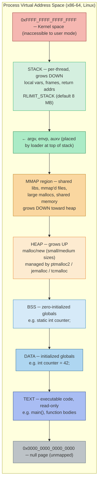
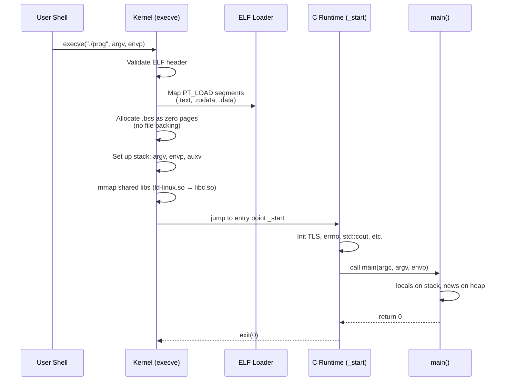

## Why This Note Matters

When you write `int x = 5;` or `static int y = 10;` or `const char* s = "hello";`, where does each one actually live in memory? The answer is not "somewhere in RAM" — it is a precise location inside one of several distinct **segments** that the operating system and the linker carve out of your process's virtual address space.

Understanding this layout is what separates a C++ programmer who can debug a segfault from `gdb` from one who can only stare at it. It is the foundation for understanding [[1. Stack and Heap]] in detail, [[3. From C to C++ Memory Management]] (where `new`/`delete` get their memory), and [[7. Custom Allocators]] (which often bypass the standard heap to ask the OS directly via `mmap`).

## Background

A modern operating system gives each process its own **virtual address space** — a flat, contiguous range of addresses starting at 0 (or near it) and extending up to the architecture's maximum (2⁴⁸ on x86-64, 2⁶⁴ in theory). The OS, working with the MMU (memory management unit), maps these virtual addresses to physical RAM pages on demand. The process never sees physical addresses directly.

When the OS's loader (`execve` on Linux) starts your program, it does several things:

1. It reads the **ELF** (Executable and Linkable Format) file produced by your compiler/linker.
2. It maps each ELF **segment** (program segment, not to be confused with the segments discussed below — confusingly, both words are used) into virtual memory.
3. It sets up the stack with environment variables and command-line arguments.
4. It jumps to the program's entry point (`_start`, which eventually calls `main`).

The result is a process whose address space looks like the diagram below.

## The Process Address Space

### Mermaid — Full Process Address Space



The exact order is: **text → data → BSS → heap → (gap) → mmap → stack → kernel**. The heap grows upward; the stack grows downward. They are separated by a large gap that the OS resizes on demand. If they ever meet, allocations begin to fail.

Let's examine each region in detail.

## 1. Text Segment (Code Segment)

The **text segment** (sometimes called the code segment) contains the compiled machine instructions of your program — the actual bytes the CPU executes. It is:

- **Read-only**: Writing to it triggers a segfault (this is what prevents you from self-modifying code without `mprotect`).
- **Executable**: The CPU's NX (no-execute) bit is *off* here, so the instruction fetch unit can read these pages.
- **Shared**: If you run two instances of the same program, the OS maps both to the same physical text pages (saving RAM).
- **Fixed size**: Determined at link time.

String literals like `"hello"` are typically placed in a read-only data sub-region (often `.rodata`) that is *not* executable but is read-only. Attempting to modify a string literal is undefined behavior and usually segfaults:

```cpp
const char* s = "hello";  // s points to .rodata
// s[0] = 'H';            // UB! Segfault on most systems
char arr[] = "hello";      // arr is a stack array, copy of the literal
arr[0] = 'H';              // OK — arr is writable
```

## 2. Data Segment (Initialized Globals)

The **data segment** (sometimes `.data`) holds global and `static` variables that are **explicitly initialized to a non-zero value**. Because the values are known at compile time, they are baked into the executable file.

```cpp
int global_counter = 42;          // .data
static double pi = 3.14159;       // .data (file-scope static)
int* ptr = &global_counter;       // .data (pointer value is link-time constant)
```

The data segment is **read-write**. Modifying `global_counter` writes to this region. It is *not* shared between processes.

## 3. BSS Segment (Uninitialized Globals)

The **BSS segment** (`.bss`) holds global and `static` variables that are either **not explicitly initialized** or are **initialized to zero**. The name "BSS" historically stood for "Block Started by Symbol," an assembler pseudo-operation from the IBM 704 in the 1950s.

The crucial optimization: BSS variables don't take up space in the executable file. The linker records only their *size*; when the program is loaded, the OS allocates pages of all-zero memory (which is cheap — a single physical zero page can be mapped read-only into many processes, copy-on-write).

```cpp
int uninitialized_global;          // .bss (zero-initialized by loader)
static int zero_init = 0;          // .bss (compiler puts zero-init here)
int big_array[1 << 20];            // .bss (4 MB but 0 bytes in .exe!)
```

> [!info] Try it
> Declare `int arr[1000000];` as a global. Check the executable size with `ls -l`. Now initialize it: `int arr[1000000] = {1};`. The second version is ~4 MB larger because it must live in `.data`. This is why C/C++ programs with huge uninitialized globals still produce tiny binaries.

## 4. Heap

The **heap** is where `malloc`, `new`, and most dynamic allocations live. It starts just above BSS (with a small gap for alignment and `sbrk` semantics) and grows upward. The C library's allocator (e.g., glibc's `ptmalloc2`) requests pages from the OS via `brk`/`sbrk` for small allocations or `mmap` for large ones (typically > 128 KB).

The heap is the most flexible region: objects can be allocated and freed in any order. The price of this flexibility is fragmentation, allocator overhead, and cache unfriendliness. See [[1. Stack and Heap]] for the full discussion and [[7. Custom Allocators]] for techniques to avoid the general-purpose allocator entirely.

## 5. Memory Mapping Region (mmap)

The **mmap region** sits between the heap and the stack, growing downward. It is used for:

- **Shared libraries**: `libc.so`, `libstdc++.so`, etc. are mapped here so they can be shared across processes.
- **Large `malloc` allocations**: glibc's allocator uses `mmap` for any allocation above `MMAP_THRESHOLD` (default 128 KB) because such allocations would otherwise permanently grow the heap via `brk` and waste space when freed.
- **Memory-mapped files**: `mmap()` lets you treat a file as if it were an in-memory array.
- **Shared memory**: `shm_open`, `shmget`, `MAP_SHARED|MAP_ANONYMOUS`.
- **Thread stacks**: Each new thread gets its stack here (the main thread's stack is at the top, just below the kernel).

You can inspect the mmap region with `cat /proc/<pid>/maps`. A typical output:

```
55a3f0dce000-55a3f0dcf000 r--p 00000000 08:01 12345  /path/to/program    (text/rodata)
55a3f0dcf000-55a3f0dd0000 r-xp 00001000 08:01 12345  /path/to/program    (text)
55a3f0dd0000-55a3f0dd1000 r--p 00002000 08:01 12345  /path/to/program    (rodata)
55a3f0dd1000-55a3f0dd2000 rw-p 00002000 08:01 12345  /path/to/program    (data)
55a3f0dd2000-55a3f0dd3000 rw-p 00000000 00:00 0      [heap]
7f0a3c000000-7f0a3c021000 rw-p 00000000 00:00 0
7f0a3c400000-7f0a3c800000 rw-p 00000000 00:00 0      [anon: large mmap'd malloc]
7f0a3cc00000-7f0a3cc28000 r--p 00000000 08:01 67890  /usr/lib/libc.so.6
7f0a3cc28000-7f0a3cc7e000 r-xp 00028000 08:01 67890  /usr/lib/libc.so.6
...
7ffce9a00000-7ffce9a21000 rw-p 00000000 00:00 0      [stack]
```

Each row shows: address range, permissions (r/w/x/p), offset, device, inode, and file (or `[heap]`, `[stack]`, `[anon]`).

## 6. Stack

The **stack** sits at the top of the user portion of the address space and grows downward. The main thread's stack starts near the maximum user address (just below the kernel region). Each subsequent thread gets a stack allocated in the mmap region.

Just *above* the stack's initial top (the highest addresses) the loader places:

- **`argc`**: the count of command-line arguments.
- **`argv[]`**: array of `char*` pointers to argument strings.
- **`envp[]`**: array of `char*` pointers to environment strings (`PATH=...`, etc.).
- **auxv**: the auxiliary vector, kernel-provided metadata (page size, entry point, hardware capabilities, etc.) that the C runtime reads at startup.
- The actual argument and environment strings live slightly below the pointers.

This is why `int main(int argc, char** argv, char** envp)` works — these values are literally laid out on the top of the stack by the kernel before `_start` is called. See [[1. Stack and Heap]] for the runtime behavior of the stack.

## Inspecting the Layout

Two classic tools give you the layout at a glance: `size` and `readelf`.

### `size` — Segment Sizes at a Glance

```bash
$ size ./my_program
   text    data     bss     dec     hex filename
   8423     600    8192   17215    433f ./my_program
```

The four columns are:
- **text**: read-only segments (code + rodata + read-only relocations).
- **data**: initialized writable data (`.data`).
- **bss**: zero-init data (`.bss`) — note: this is in-memory size, *not* file size.
- **dec** / **hex**: total of the above in decimal/hex.

If you see a huge `bss` and tiny `text`/`data`, you've declared a large uninitialized global array.

### `readelf` — Detailed Section View

```bash
$ readelf -S ./my_program
There are 30 section headers, starting at offset 0x...

Section Headers:
  [Nr] Name              Type             Address           Offset
       Size              EntSize          Flags  Link  Info  Align
  [ 1] .text             PROGBITS         0000000000001000  00001000
       00000000000002a3  0000000000000000  AX       0     0     16
  [ 2] .rodata           PROGBITS         0000000000002000  00002000
       0000000000000010  0000000000000000   A       0     0     4
  [ 3] .data             PROGBITS         0000000000003000  00003000
       0000000000000010  0000000000000000  WA       0     0     8
  [ 4] .bss              NOBITS           0000000000003010  00003010
       0000000000400000  0000000000000000  WA       0     0     32
  ...
```

Key flags:
- `A` = allocated (loaded into memory at runtime).
- `W` = writable.
- `X` = executable.

Note `.bss` has type `NOBITS` — meaning it occupies zero bytes in the file but the indicated `Size` (here 4 MB) in memory at runtime.

### `/proc/<pid>/maps` — Runtime View

While `size` and `readelf` show the *static* layout baked into the executable, `/proc/<pid>/maps` shows the *runtime* layout of a running process, including dynamic libraries, the heap, the stack, and any `mmap` regions.

```bash
$ cat /proc/$(pgrep my_program)/maps
```

This is the most important tool for diagnosing "where did my pointer come from?" problems in production. ASan (AddressSanitizer) reports map this output to classify errors.

### A Demo Program That Touches Every Segment

```cpp
#include <iostream>
#include <vector>
#include <cstring>

int g_init = 42;              // .data
int g_uninit;                 // .bss (zero by loader)
const char* g_str = "hi";     // pointer in .data, points to .rodata
static int s_init = 7;        // .data (file-local but global lifetime)
static int s_uninit;          // .bss
constexpr int c = 100;        // .rodata or inlined (constexpr)

int main(int argc, char** argv) {
    int local = 5;                       // stack
    static int fn_static = 99;           // .data (init once)
    int* heap_int = new int(10);         // heap
    std::vector<int> v(1000);            // vector on stack, ints on heap

    std::cout << "argc=" << argc << " argv[0]=" << argv[0] << '\n';
    std::cout << "g_init @ " << (void*)&g_init << '\n';
    std::cout << "g_uninit @ " << (void*)&g_uninit << " val=" << g_uninit << '\n';
    std::cout << "g_str @ " << (void*)g_str << " (rodata)\n";
    std::cout << "local @ " << (void*)&local << " (stack)\n";
    std::cout << "heap_int @ " << (void*)heap_int << " (heap)\n";
    std::cout << "v.data @ " << (void*)v.data() << " (heap, vector buffer)\n";
    std::cout << "fn_static @ " << (void*)&fn_static << " (data)\n";

    delete heap_int;
    return 0;
}
```

Run this and feed the addresses to `cat /proc/$PID/maps` (or just observe that the addresses cluster in the regions you expect). You will see stack addresses near `0x7fff...`, heap addresses near `0x5555...` (PIE) or `0x602...` (non-PIE), and data addresses very close to the heap base.

## How the Layout Connects to C++ Idioms

- **RAII** ([[4. RAII]]) relies on stack-allocated objects whose destructors fire on scope exit. The stack's automatic frame-popping is what makes this work.
- **`static` local variables** (e.g., `static int x = ...;` inside a function) live in `.data` or `.bss` — *not* the stack — even though their declaration looks like a local. Their lifetime is the entire program; their initialization happens on first entry (thread-safe since C++11).
- **String literals** live in `.rodata`; you cannot modify them, which is why `const char*` (not `char*`) is the correct type for a literal.
- **V-tables** (the arrays of function pointers that implement virtual dispatch) live in `.rodata` for types defined at namespace scope. The `vptr` field inside each object, however, lives wherever the object does (stack or heap).
- **`constexpr`** values may never exist in memory at all — the compiler can substitute them as immediate operands in machine code.
- **`thread_local`** variables get their own copy per thread; the implementation places them in a special TLS (Thread-Local Storage) section, often `.tbss` / `.tdata`, accessed via a segment-register-relative offset.

## Mermaid — Data Flow Through Segments at Process Startup



## A Closer Look at Each Permission Combination

The `/proc/<pid>/maps` columns list four permission characters: `r` (read), `w` (write), `x` (execute), `p` (private) or `s` (shared). Each combination maps to a real segment:

| Permissions | What it typically is | Why |
|---|---|---|
| `r-xp` | `.text` (code) | Executable, must be readable for fetch, never writable |
| `r--p` | `.rodata`, `.eh_frame`, `.note` | Constants, exception tables, never writable |
| `rw-p` | `.data`, `.bss`, heap, stack | Writable program state, never executable (DEP/NX) |
| `rwxp` | JIT-compiled code (V8, JVM, .NET) | Runtime-generated executable code; rare and security-sensitive |
| `r--s` | Shared memory mapped read-only | mmap'd shared file or `shm_open` |
| `rw-s` | Shared memory read-write | IPC shared memory, memory-mapped databases |

Notice that *modern* programs never have writable-and-executable pages (W^X / DEP). The only exception is JIT runtimes, which must `mprotect` specific pages to `rwxp` just before writing generated code and then often back to `r-xp`. This is the foundation of exploit mitigations like `PaX MPROTECT` and Windows's `SetProcessMitigationPolicy`.

## The Loader and Dynamic Linking

When you run `./my_program`, the kernel's `execve` syscall reads the ELF file, identifies the **program interpreter** (usually `/lib64/ld-linux-x86-64.so.2`, the dynamic linker), and starts that instead. The dynamic linker then:

1. Reads the `DT_NEEDED` entries in your binary — these are the shared libraries you depend on (e.g., `libstdc++.so.6`, `libm.so.6`).
2. Searches `LD_LIBRARY_PATH`, `/etc/ld.so.cache`, and default paths to find each library.
3. `mmap`s each library's text/rodata/data into the process address space (sharing the read-only parts across all processes that use that library).
4. Resolves symbols — for each external function your binary calls, the linker fills in the GOT (Global Offset Table) and PLT (Procedure Linkage Table) entries with the library's actual addresses.
5. Runs initialization functions: `_init`, `__attribute__((constructor))`, C++ static initializers across all loaded objects.
6. Finally calls your program's `main()`.

You can observe this with `LD_DEBUG=libs ./my_program` (prints each library loaded) or `LD_DEBUG=symbols ./my_program` (prints symbol resolution). `ldd ./my_program` shows the libraries without running the program.

The linker also handles lazy binding: by default, function addresses are looked up on first call (via PLT) rather than at startup. This makes startup faster but introduces page faults later. `LD_BIND_NOW=1` (or `RTLD_NOW` in `dlopen`) forces eager binding.

## Position-Independent Executables and ASLR

Modern binaries are built with **PIE** (`-fPIE -pie`), which means the loader can place them at a random base address each run. This is **ASLR** (Address Space Layout Randomization), a security mitigation: if attackers don't know where your code is, they can't hardcode jump targets in exploits.

You can check with `file ./my_program`:

```
./my_program: ELF 64-bit LSB pie executable, x86-64, ...
```

The word `pie` (rather than `executable`) confirms PIE. Without PIE, the text/data/bss addresses are fixed and visible via `readelf -l`. With PIE, those addresses are offsets from a randomized base.

ASLR also randomizes:
- The heap base (`brk` heap)
- The mmap region base (shared libraries, large allocations)
- The stack base (per-thread)
- The vDSO

You can disable ASLR for debugging with `setarch $(uname -m) -R ./my_program`. Production builds keep ASLR on.

## Common Pitfalls

> [!danger] Modifying a string literal
> ```cpp
> char* s = "hello";   // deprecated conversion since C++11, error since C++11 in pedantic mode
> s[0] = 'H';          // UB! Segfault on most systems
> ```
> Always use `const char*` for literals, or copy to a `char[]` / `std::string` if you need to modify.

> [!danger] Returning a pointer to a function-local `static` and expecting re-entrance
> ```cpp
> const char* whoops() {
>     static char buf[32];
>     std::sprintf(buf, "%d", rand());
>     return buf;     // shared across all callers — not thread-safe, not re-entrant
> }
> ```
> The `static` makes the lifetime fine (no dangling pointer) but the data is shared. Use a `thread_local` buffer, or return a `std::string`.

> [!warning] Relying on `.bss` being zero
> The C++ standard guarantees zero-initialization for static-storage-duration objects. It does *not* guarantee it for stack or heap. Never assume `int x;` on the stack is zero.

> [!warning] Assuming `sizeof(arr) / sizeof(arr[0])` works on a heap array
> `int* p = new int[10]; sizeof(p) == sizeof(int*)` — you've lost the size. Use `std::vector` or `std::array`.

> [!tip] Use `pmap` for a friendlier view
> `pmap -x <pid>` prints the same information as `/proc/<pid>/maps` but in a tabular, easier-to-read form with RSS (resident set size) per mapping.

## Tips and Tricks

1. **Build with `-fno-PIE`** if you want predictable addresses for teaching/debugging. Production builds use PIE (Position-Independent Executables) for ASLR security.
2. **Inspect `.bss` size** with `size -A ./my_program | grep bss` — useful for spotting accidental huge globals.
3. **`mlock`** important memory to prevent it from being paged out — common in real-time and crypto code.
4. **`MADV_HUGEPAGE`** on large mmap'd regions enables transparent huge pages, reducing TLB misses.
5. **Understand copy-on-write**: `fork()` shares all pages between parent and child until one writes — only then is a copy made. This is why `fork()`+`exec()` is cheap.
6. **Use `dl_iterate_phdr`** to walk loaded shared objects at runtime — handy for profilers and crash reporters.
7. **`MAP_ANONYMOUS | MAP_SHARED`** is the modern way to create shared memory without `/dev/shm` files.
8. **For ultra-low-latency code**, see [[7. Custom Allocators]]: pre-touch all heap pages with `mlock` + write to avoid page-fault latency during steady-state.

## Active Recall

1. List the seven regions of a process address space from low to high address.
2. Why does `.bss` not consume space in the executable file?
3. What is `.rodata`, and what kinds of data live there?
4. What does `size ./a.out` print, and what does each column mean?
5. Where does a `static` local variable live? Where does its initialization happen?
6. Why are string literals read-only, and what happens if you try to modify one?
7. Where are v-tables stored for a polymorphic class defined at namespace scope?
8. What does `readelf -S` show that `size` does not?
9. Explain how `argv`, `envp`, and the auxiliary vector are placed by the kernel.
10. How does ASLR affect the addresses you see in `/proc/<pid>/maps` across runs?

## Next Steps

- You now have the full map; read [[1. Stack and Heap]] for deeper treatment of the two regions where most of your runtime data lives.
- [[3. From C to C++ Memory Management]] traces how memory APIs evolved from raw `brk`/`sbrk` to `malloc`/`free` to `new`/`delete` to RAII.
- [[4. RAII]] shows how to use the stack's automatic cleanup to manage resources of *all* kinds, not just memory.
- [[5. Smart Pointers]] brings RAII to the heap.
- [[7. Custom Allocators]] shows how to bypass the standard heap entirely with `mmap`-backed arenas and pools.
