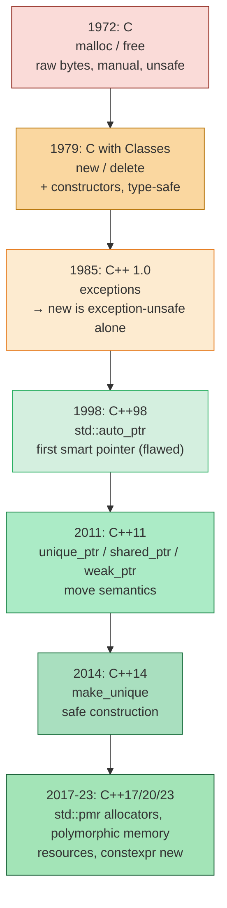
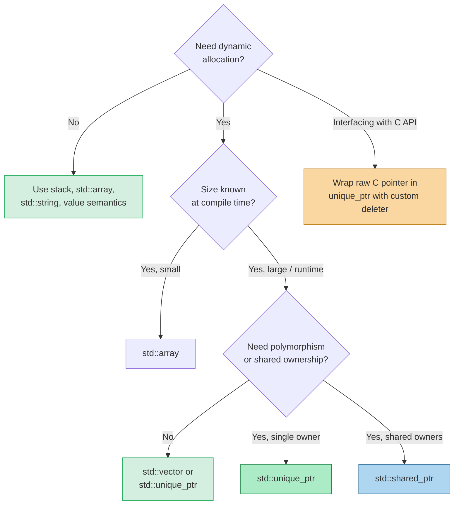

## Why This Note Matters

C++ inherited C's syntax, its standard library, and — unfortunately — much of its memory model. But C++ also added constructors, destructors, exceptions, and type safety, all of which fundamentally change what "managing memory" means. A C programmer who writes C++ as "C with classes" produces code that leaks on exceptions, fails to call destructors, and bypasses the type system.

This note traces the **three eras** of C/C++ memory management — C's `malloc`/`free`, classic C++'s `new`/`delete`, and modern C++'s RAII + smart pointers — so you can read legacy code, write safe modern code, and understand *why* the modern idioms are mandatory rather than stylistic. It is the bridge between the abstract [[1. Stack and Heap]] and [[2. Memory Layout of a Program]] notes and the [[4. RAII]] / [[5. Smart Pointers]] notes that follow.

## Background

C was designed in 1972 for the PDP-11. It had a single dynamic allocation API: `malloc`/`free`, returning `void*`. There were no constructors, no destructors, no exceptions. Memory was just bytes; the programmer was responsible for everything.

C++ (initially "C with Classes", 1979) added:

- **Constructors and destructors** that automatically initialize and clean up objects.
- **Type safety** that prevents (most) implicit `void*` casts.
- **Exceptions** that unwind the stack, calling destructors along the way.
- **Operator overloading**, including `new` and `delete` as operators that can be customized per-class.

These additions made `malloc`/`free` insufficient: they know nothing about object lifetimes. C++ therefore introduced `new` and `delete`, which combine allocation with construction (and deallocation with destruction). But manual `new`/`delete` is still unsafe in the presence of exceptions, which is why modern C++ layers [[4. RAII]] and [[5. Smart Pointers]] on top.

## The C Way: `malloc`, `calloc`, `realloc`, `free`

The C dynamic memory API lives in `<cstdlib>` (C++ name) / `<stdlib.h>` (C name). It has four functions:

### `malloc(size_t n)`

Allocates `n` bytes of *uninitialized* memory. Returns `void*` (or `NULL` on failure). The memory is not zeroed.

```c
int* arr = (int*)malloc(10 * sizeof(int));
if (!arr) { perror("malloc"); exit(1); }
for (int i = 0; i < 10; ++i) arr[i] = i;
free(arr);
```

### `calloc(size_t n, size_t size)`

Allocates `n * size` bytes and **zero-initializes** them. Also checks for overflow of `n * size`, which `malloc` does not.

```c
int* arr = (int*)calloc(10, sizeof(int));  // all zeros
free(arr);
```

### `realloc(void* p, size_t n)`

Resizes a previously allocated block. May move the block (returning a new pointer and freeing the old one). If `p` is `NULL`, behaves like `malloc`. If `n` is 0, behaves like `free` (in older standards). On failure returns `NULL` *without* freeing the original — a classic bug trap.

```c
int* tmp = (int*)realloc(arr, 20 * sizeof(int));
if (!tmp) { free(arr); /* handle error, arr still valid */ }
else arr = tmp;
```

### `free(void* p)`

Releases the block previously returned by `malloc`/`calloc`/`realloc`. After `free`, the pointer is dangling — using it is undefined behavior. `free(NULL)` is a safe no-op.

### Why C's API Is Wrong for C++

1. **No type safety**: `malloc` returns `void*`. You must cast, and the cast can hide type mismatches.
2. **No construction**: `malloc` of a C++ object gives you raw bytes; the constructor is *not* called. The bytes may not even be a valid object representation.
3. **No destruction**: `free` does not call the destructor. If the object owns resources (e.g., a `std::string` with a heap buffer), those resources leak.
4. **No size safety**: `malloc(n)` does not know `n` is `count * sizeof(T)`. Easy to forget the `sizeof`.
5. **Not exception-safe**: If an exception is thrown between `malloc` and `free`, the memory leaks.

```cpp
#include <cstdlib>
#include <string>

void leaky() {
    std::string* s = (std::string*)malloc(sizeof(std::string));
    // s points to raw bytes that LOOK like a std::string but no constructor ran.
    // Calling s->size() here is UB — internal pointer is garbage.

    // Attempting to "initialize" via placement new is the only correct way:
    new (s) std::string("hello");

    // ... use s ...

    // Now we must explicitly call destructor before free:
    s->~basic_string();
    free(s);
}
```

This is correct but absurd. The C++ way is just `new`/`delete`.

> [!danger] Never mix `malloc`/`free` with `new`/`delete`
> `malloc` then `delete`, or `new` then `free`, is undefined behavior. Pick one API per object and stay consistent — preferably neither, using RAII instead.

## The Old C++ Way: `new`, `delete`, `new[]`, `delete[]`

C++ introduced the `new` and `delete` **operators** to combine allocation with construction (and deallocation with destruction) in a type-safe way.

### Single Object: `new` / `delete`

```cpp
#include <string>
std::string* s = new std::string("hello");   // allocates + constructs
// ... use s ...
delete s;                                     // destructs + deallocates
```

`new T(args)` does two things:
1. Calls `operator new(sizeof(T))` to get raw memory (typically via `malloc` internally).
2. Calls `T`'s constructor on that memory, forwarding `args`.

`delete p` does two things:
1. Calls `p->~T()`.
2. Calls `operator delete(p)` to release the memory.

### Array Form: `new[]` / `delete[]`

```cpp
int* arr = new int[100];          // allocates + default-constructs 100 ints
delete[] arr;                      // destructs + deallocates
```

The array form stores the element count somewhere (typically just before the returned pointer) so `delete[]` knows how many destructors to call. For types with trivial destructors (like `int`), most compilers skip the count and the loop, but the rule is the same.

> [!danger] Mismatched forms are UB
> - `new T` then `delete[] p` — UB.
> - `new T[n]` then `delete p` — UB (calls only one destructor, leaks the rest, may corrupt heap).
> - Even when `T` has a trivial destructor and "it works on my machine", it is still UB and will break with sanitizers or different compilers.

### Improvements Over C

- **Type-safe**: `new T` returns `T*`, no cast needed.
- **Constructors fire**: The object is properly initialized before you use it.
- **Destructors fire**: Resources owned by the object are released on `delete`.
- **Failure throws**: `new` throws `std::bad_alloc` instead of returning `nullptr` (no need to check for `NULL` after every call).

### Remaining Problems

- **Manual**: You must remember to `delete` exactly once, on every code path.
- **Not exception-safe**: If anything between `new` and `delete` throws, the `delete` is skipped — leak.
- **Array vs. scalar confusion**: `new`/`delete` vs. `new[]`/`delete[]` is a footgun.
- **Ownership ambiguity**: A raw `T*` could be owning (`delete` me) or non-owning (just looking). The type system doesn't tell you.

```cpp
void leaky_cpp() {
    std::string* s = new std::string("hello");
    do_something_that_might_throw();   // ← if this throws, delete is skipped → leak
    delete s;
}
```

### Mermaid — C vs. C++ Memory APIs

```mermaid
flowchart LR
    subgraph C["C API (cstdlib)"]
        M["malloc(n)"]
        C2["calloc(n,size)"]
        R["realloc(p,n)"]
        F["free(p)"]
        M -->|"returns void*"--> Raw["raw bytes<br/>no constructor"]
        C2 -->|"returns void*"--> Raw2["raw zeroed bytes<br/>no constructor"]
        R -->|"returns void*"--> Raw3["resized bytes<br/>no constructor"]
        Raw --> F
        Raw2 --> F
        Raw3 --> F
    end

    subgraph CPP["C++ API"]
        N["new T(args)"]
        NA["new T[n]"]
        D["delete p"]
        DA["delete[] p"]
        N -->|"allocate + construct"| Obj["live T object"]
        NA -->|"allocate + construct[n]"| Arr["live T[n] array"]
        Obj --> D
        Arr --> DA
    end

    subgraph MOD["Modern C++ (RAII)"]
        MU["std::make_unique<T>"]
        MS["std::make_shared<T>"]
        V["std::vector<T>"]
        MU --> U["unique_ptr<T><br/>auto-delete on scope exit"]
        MS --> S["shared_ptr<T><br/>refcounted auto-delete"]
        V --> Vb["auto-managed buffer"]
    end

    style C fill:#fadbd8,stroke:#922b21
    style CPP fill:#fdebd0,stroke:#b9770e
    style MOD fill:#d4efdf,stroke:#1e8449
```

## The Subtle Distinction: `new` Operator vs. `operator new`

This is the question that separates casual C++ users from experts. The phrasing is maddeningly similar.

- **The `new` operator** (a.k.a. the *new-expression* `new T(args)`) is a built-in language construct. It does **two** things: (1) call `operator new` to get memory, (2) call `T`'s constructor on that memory. You cannot overload the `new` operator itself.

- **`operator new(size_t)`** is a *function* (declared in `<new>`). It allocates raw memory only — like `malloc`, but the standard library is allowed to do extra bookkeeping. You *can* overload it globally or per-class.

When you write `new T(args)`:
1. The compiler calls `operator new(sizeof(T))` to obtain `void*` pointing to raw memory.
2. The compiler then constructs a `T` in that memory (placement new under the hood).
3. If the constructor throws, the compiler calls `operator delete` to clean up the raw memory (this is the "operator delete for placement-lookalike" rule).

Per-class overloads let you customize allocation for specific types — useful for arena allocators (see [[7. Custom Allocators]]).

```cpp
#include <new>
#include <iostream>

class Widget {
public:
    void* operator new(std::size_t n) {
        std::cout << "Widget::operator new(" << n << ")\n";
        return ::operator new(n);          // delegate to global
    }
    void operator delete(void* p) noexcept {
        std::cout << "Widget::operator delete\n";
        ::operator delete(p);
    }
};

int main() {
    Widget* w = new Widget();   // calls Widget::operator new, then ctor
    delete w;                   // calls Widget::operator delete, after dtor
}
```

There is also `operator new[]` / `operator delete[]` for the array form, with the same per-class override mechanism.

## Placement `new`

A special form of `new` constructs an object in **already-allocated** memory. It does *not* allocate; it only calls the constructor.

```cpp
#include <new>

alignas(T) unsigned char buf[sizeof(T)];
T* p = new (buf) T(args);     // construct a T inside buf
// ... use p ...
p->~T();                       // must manually destruct
// no delete! buf is not from operator new
```

Placement new is the foundation of:

- **`std::vector`**: It allocates raw capacity with `operator new`, then placement-news elements as you `push_back`.
- **`std::optional` / `std::variant`**: They hold a buffer and placement-new the active alternative into it.
- **Custom allocators** ([[7. Custom Allocators]]): Arenas and pools hand out raw memory; you placement-new objects into it.
- **`std::allocator<T>::construct`** (pre-C++20) and `std::construct_at` (C++20): The standard way to placement-new with perfect forwarding.

> [!warning] Placement new requires a matching manual destructor call
> You must call `p->~T()` yourself before reusing or freeing the buffer. The compiler cannot do this for you because it doesn't know your object's lifetime ends.

Placement new also requires the target memory to be **properly aligned** for `T`. Use `alignas(T)` on the buffer, or `std::aligned_alloc`, or — in modern code — `std::start_lifetime_as<T>` (C++23).

## No-Throw `new`

By default `new` throws `std::bad_alloc` on failure. Some domains (kernel code, real-time, embedded, certain legacy C interop) prefer the C-style "return null on failure" behavior. C++ provides this via the `std::nothrow` tag:

```cpp
#include <new>

int* p = new (std::nothrow) int[1 << 30];   // returns nullptr if it fails
if (!p) {
    // handle failure without catching an exception
}
```

`std::nothrow` is an object of type `std::nothrow_t` defined in `<new>`. The standard library provides an overload of `operator new(size_t, const std::nothrow_t&)` that returns `nullptr` instead of throwing. Constructors themselves, however, can still throw — `std::bad_alloc` from the allocation is suppressed, but if your constructor throws `std::runtime_error`, that propagates normally.

> [!tip] Don't use `nothrow` for new code
> Mixing throwing and non-throwing allocation policies complicates error handling. Catch `std::bad_alloc` at a high level instead. Reserve `nothrow` for environments where exceptions are disabled (`-fno-exceptions`) or where you genuinely want C-style flow control.

## Exception Safety: The Real Motivation for RAII

Consider this innocent-looking code:

```cpp
void process() {
    auto* a = new ResourceA();
    auto* b = new ResourceB();   // ← if this throws, `a` leaks
    auto* c = new ResourceC();   // ← if this throws, `a` and `b` leak
    do_work(a, b, c);
    delete c;
    delete b;
    delete a;
}
```

To fix this with raw `new`/`delete` you need `try`/`catch` blocks at every allocation site, with progressively more `delete` calls in each `catch`. This is verbose, error-prone, and unmaintainable. RAII solves it elegantly:

```cpp
void process() {
    auto a = std::make_unique<ResourceA>();
    auto b = std::make_unique<ResourceB>();   // if this throws, a's dtor runs
    auto c = std::make_unique<ResourceC>();   // if this throws, a and b's dtors run
    do_work(a.get(), b.get(), c.get());
    // no deletes needed; unique_ptr destructors fire in reverse order
}
```

This pattern is so important that it gets its own note: [[4. RAII]].

## Mixing C and C++ Memory APIs

The rules:

1. **Never `free` what `new` allocated** — destructors won't run.
2. **Never `delete` what `malloc` allocated** — the heap bookkeeping may differ.
3. **Inside C++ code, prefer C++ APIs** — `new`/`delete`, smart pointers, containers.
4. **When interfacing with C libraries that return `malloc`'d memory**, wrap the pointer in a custom-deleter smart pointer:

```cpp
#include <memory>
#include <cstdlib>

struct FreeDeleter {
    void operator()(void* p) const noexcept { std::free(p); }
};

using CMallocPtr = std::unique_ptr<char[], FreeDeleter>;

void use_c_lib() {
    char* raw = static_cast<char*>(std::malloc(1024));
    if (!raw) throw std::bad_alloc();
    CMallocPtr p(raw);             // RAII takes ownership; free() on scope exit
    // ... use p.get() ...
}
```

See [[5. Smart Pointers]] for the full story on custom deleters.

## Why `new` Is Better Than `malloc` — Summary

| Aspect | `malloc` / `free` | `new` / `delete` |
|---|---|---|
| Return type | `void*` (requires cast) | `T*` (type-safe) |
| Initialization | None — raw bytes | Constructor called |
| Cleanup | None — raw bytes freed | Destructor called |
| Failure mode | Returns `NULL` | Throws `std::bad_alloc` (or `nullptr` with `nothrow`) |
| Size calculation | Manual (`n * sizeof(T)`) | Automatic (`sizeof(T)`) |
| Per-class customization | No | Yes (per-class `operator new`) |
| Exception-safe with manual use | No | No (use RAII instead) |
| Required for C++ objects | **Wrong** — bypasses ctors/dtors | Correct |

## Putting It All Together: A Migration Story

```cpp
// === C style (FORBIDDEN in C++) ===
#include <cstdlib>
void c_style() {
    char* buf = (char*)malloc(100);
    if (!buf) return;
    // ... use buf ...
    free(buf);
}

// === Old C++ style (DISCOURAGED) ===
#include <string>
void old_cpp() {
    std::string* s = new std::string("hi");
    try {
        // ... use s ...
    } catch (...) {
        delete s;
        throw;
    }
    delete s;
}

// === Modern C++ (PREFERRED) ===
#include <memory>
void modern_cpp() {
    auto s = std::make_unique<std::string>("hi");
    // ... use s ... exceptions are safe, no deletes needed
}
```

The progression is clear: each step removes more opportunities for the programmer to make a mistake. The C step forgets to construct; the old-C++ step forgets to delete on an exception path; the modern step removes the manual lifetime management entirely.

## Mermaid — The Evolution



## Deep Dive: `operator new` Overloads and Alignment

There are several overloads of `operator new` you should be aware of, especially in C++17+:

```cpp
void* operator new(std::size_t n);                                    // (1) throwing
void* operator new(std::size_t n, std::align_val_t a);                // (2) throwing, aligned (C++17)
void* operator new(std::size_t n, const std::nothrow_t&) noexcept;    // (3) nothrow
void* operator new(std::size_t n, std::align_val_t a,
                   const std::nothrow_t&) noexcept;                    // (4) nothrow, aligned
void* operator new(std::size_t n, void* p) noexcept { return p; }      // (5) placement
```

Overloads (2) and (4) are automatically selected when `T` is over-aligned — that is, when `alignof(T) > __STDCPP_DEFAULT_NEW_ALIGNMENT__` (typically 16 bytes). Before C++17, allocating an over-aligned type with `new` was *not guaranteed* to honor the alignment — a silent bug on platforms with SIMD requirements. C++17 fixed this.

You can also define your own placement-form overloads for arbitrary extra arguments:

```cpp
struct Tag {};
void* operator new(std::size_t n, Tag, std::ostream& log) {
    log << "allocating " << n << " bytes\n";
    return ::operator new(n);
}
void operator delete(void* p, Tag, std::ostream&) { /* matching delete */ }

struct Widget { Widget() {} };
void f(std::ostream& log) {
    Widget* w = new (Tag{}, log) Widget;   // calls custom operator new
    // ...
    delete w;   // calls ordinary operator delete (NOT the tagged one)
}
```

The matching tagged `operator delete` is only called if the *constructor* throws. If construction succeeds, the ordinary `operator delete` is called at `delete w`. This is subtle but important for tag-based allocation schemes.

## The `nothrow` Trap

`new (std::nothrow) T(args)` suppresses the `bad_alloc` from `operator new` — but if your *constructor* throws, that exception propagates normally. So `nothrow` is a misleading name: it only no-throws on allocation failure, not on construction failure.

```cpp
struct Throws {
    Throws() { throw std::runtime_error("boom"); }
};
auto* p = new (std::nothrow) Throws();   // STILL THROWS — from constructor!
```

If you genuinely need no-throw construction, write a no-throw constructor and test it. Don't rely on `std::nothrow` alone.

## Memory Allocation in C++: A Practical Decision Tree



## Historical Note: `std::auto_ptr` and Why It Was Removed

C++98 introduced `std::auto_ptr<T>` as the standard smart pointer. It had a *copy-steals* semantics: copying an `auto_ptr` set the source to `null` and gave the destination ownership. This was disastrous:

```cpp
std::vector<std::auto_ptr<int>> v;   // ← illegal in C++11+; would silently corrupt in C++03
v.push_back(std::auto_ptr<int>(new int(42)));
// The vector's internal copy operations could move ownership silently,
// leaving some elements null with no warning.
```

`auto_ptr` could not be stored in standard containers (which assume copy doesn't mutate the source). It was deprecated in C++11 and removed in C++17. Its replacements — `unique_ptr` (move-only, copy deleted) and `shared_ptr` (true shared ownership) — fix the problem. The lesson: copy semantics for ownership are wrong; move semantics are right.

## Common Pitfalls

> [!danger] `new` then `free`, or `malloc` then `delete`
> UB. The two APIs may use different heaps or different bookkeeping layouts.

> [!danger] `delete` an array with `delete` instead of `delete[]`
> UB. Use `std::vector` to make this mistake impossible.

> [!danger] Forgetting to `delete` on an exception path
> Pre-RAII code is riddled with this. Wrap raw `new` immediately in a smart pointer.

> [!warning] Calling `delete` on a `void*`
> The compiler can't call the destructor because it doesn't know the type. Compile error in standard C++.

> [!warning] Using `realloc` on memory owned by a C++ object
> It just copies raw bytes, breaking internal pointers and skipping move constructors. Use `std::vector` which does this correctly.

> [!tip] The rule of zero / rule of five
> If your class manages a resource, either delete the special member functions (rule of zero, prefer this) or define all five (dtor, copy ctor, copy assign, move ctor, move assign). Never half-define them.

## Tips and Tricks

1. **Prefer `std::make_unique` / `std::make_shared`** over direct `new`. They are exception-safe in expression evaluation and integrate with custom deleters and allocators.
2. **`std::allocator_traits`** lets you write allocator-aware code without depending on the exact `std::allocator` interface.
3. **For C interop**, write a small `unique_ptr` wrapper with a custom deleter that calls `free` — see example above. This brings RAII to C APIs.
4. **Disable `new` for stack-only types** by making `operator new` private:
   ```cpp
   class StackOnly {
   private:
       static void* operator new(std::size_t);   // declared, not defined
       static void operator delete(void*);
   public:
       StackOnly() = default;
   };
   ```
5. **Override `operator new` per-class** to route allocations through an arena. See [[7. Custom Allocators]].
6. **Compile with `-Weffc++`** to get warnings about classic C++ style errors (uninitialized members, missing virtual destructors, etc.).
7. **Use ASan** (AddressSanitizer) to catch `new`/`delete` mismatches, leaks, and use-after-free at runtime. See [[6. Memory Leaks and Dangling Pointers]].
8. **Read `std::construct_at` (C++20)** as the modern, constexpr-friendly placement new.

## Active Recall

1. Name the four C memory functions and what each does.
2. Why does `malloc(sizeof(std::string))` not give you a usable `std::string`?
3. What is the difference between the *`new` operator* and `operator new`?
4. What does `new (std::nothrow) T` do on failure?
5. Why must placement-new memory be properly aligned?
6. Explain why this code leaks: `Foo* f = new Foo(); g(); delete f;` if `g()` throws.
7. Why is `new`/`delete[]` a mismatch? What happens?
8. Write a custom-deleter `unique_ptr` that calls `std::free` instead of `delete`.
9. What does `realloc` do that you cannot do with `new`/`delete`?
10. Give three reasons `new` is preferred over `malloc` in C++.

## Next Steps

- Now read [[4. RAII]] to see the idiom that ties resource lifetimes to object lifetimes — the foundation of all modern C++ memory safety.
- Then [[5. Smart Pointers]] for `unique_ptr`, `shared_ptr`, `weak_ptr`, custom deleters, and control blocks.
- [[6. Memory Leaks and Dangling Pointers]] shows the failure modes that result when these idioms are ignored.
- [[7. Custom Allocators]] explains how to override `operator new` per class and how arenas, pools, and bump allocators work.
