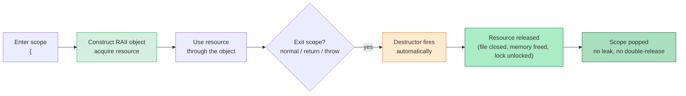

## Why This Note Matters

Of all the idioms in C++, none is more central than **RAII** — *Resource Acquisition Is Initialization*. It is the mechanism that makes C++ exception-safe, leak-free, and arguably the most distinctive feature of the language compared to Java, Python, Go, or Rust. Without RAII, C++ is just C with classes. With it, C++ lets you write code that automatically releases resources — memory, file handles, sockets, mutexes, GPU buffers — even in the presence of exceptions and early returns.

This note explains what RAII is, why it works, why it is exception-safe, and how it underpins [[5. Smart Pointers]], the standard containers, and most modern C++ library design. If you internalize one thing from Chapter 7, let it be this.

## Background

Every non-trivial program acquires **resources**: things that must be obtained from the OS or runtime and later released. Examples:

| Resource | Acquire | Release |
|---|---|---|
| Heap memory | `new` / `malloc` | `delete` / `free` |
| File handle | `open()` / `fopen()` | `close()` / `fclose()` |
| Mutex lock | `lock()` | `unlock()` |
| Network socket | `socket()` | `close()` |
| Database transaction | `BEGIN` | `COMMIT` / `ROLLBACK` |
| GPU buffer | `glGenBuffers` | `glDeleteBuffers` |
| Thread | `pthread_create` | `pthread_join` / `pthread_detach` |
| DLL handle | `dlopen` | `dlclose` |

The fundamental question of resource management: **how do you guarantee that *every* release call happens, on *every* code path, including exceptions and early returns?**

Three strategies have been tried across the industry:

1. **Manual** (C, early C++): The programmer calls release explicitly everywhere. Bug-prone; exceptions make it nearly impossible.
2. **Garbage collection** (Java, Python, C#, Go): A runtime traces live objects and reclaims unreachable memory automatically. Works for memory but **not for non-memory resources** — those still need `try`/`finally` or `using` or `with`.
3. **RAII** (C++, Rust): The compiler guarantees that destructors run when objects go out of scope. Tie resource lifetimes to object lifetimes and the problem is solved *uniformly* for all resource types, not just memory.

RAII is what makes C++ unique. Java's `finally` blocks and Python's `with` statements are *workarounds* for the lack of deterministic destruction. C++ doesn't need them.

## The Core Idea

**RAII: Resource Acquisition Is Initialization.**

The name is awkward but precise: every resource your program uses should be *acquired* during the construction of an object that *owns* it, and *released* during that object's destruction. Because the C++ standard guarantees that destructors run when objects go out of scope — even when an exception unwinds the stack — this gives you deterministic, exception-safe resource management for free.

Concretely:

1. Wrap each resource in a class.
2. The **constructor** acquires the resource (or takes ownership of an already-acquired one).
3. The **destructor** releases the resource.
4. Use the wrapper by value (automatic storage duration) so its destructor fires at scope exit.
5. Disable or carefully define copy/move to make ownership semantics explicit.

## The Canonical RAII Lifecycle

### Mermaid — RAII Lifecycle



## A Minimal RAII Example: File Handle

```cpp
#include <cstdio>
#include <stdexcept>
#include <utility>

class File {
    std::FILE* fp_;
public:
    explicit File(const char* path, const char* mode)
        : fp_(std::fopen(path, mode)) {
        if (!fp_) throw std::runtime_error("fopen failed");
    }
    ~File() { if (fp_) std::fclose(fp_); }              // ← always releases

    File(const File&) = delete;                          // no copy
    File& operator=(const File&) = delete;

    File(File&& other) noexcept : fp_(other.fp_) { other.fp_ = nullptr; }
    File& operator=(File&& other) noexcept {
        if (this != &other) {
            if (fp_) std::fclose(fp_);
            fp_ = other.fp_;
            other.fp_ = nullptr;
        }
        return *this;
    }

    std::FILE* get() const noexcept { return fp_; }
    std::size_t read(void* buf, std::size_t n) {
        return std::fread(buf, 1, n, fp_);
    }
};

void use_file() {
    File f("data.txt", "r");                              // acquire
    char buf[1024];
    f.read(buf, sizeof(buf));
    if (buf[0] == 'X') throw std::runtime_error("bad data");   // ← still safe
    // ... more code ...
}                                                          // ← ~File() runs, fclose called
```

Notice that the `throw` in the middle does not leak the file handle. The C++ runtime, while unwinding the stack, calls `~File()` automatically. This is true for *every* exit path: `return`, `throw`, even `goto` jumping out of the scope.

The standard library already provides exactly this wrapper: `std::ifstream`, `std::ofstream`, `std::fstream`. You should never write the above class in production — use the standard one. But the mechanism is precisely RAII.

## Why RAII Is Exception-Safe

The C++ standard guarantees (§6.6.3 / §15.2): **When a block is exited — including exit caused by an exception being thrown — every fully-constructed automatic object in that block has its destructor called.**

This is a *language guarantee*, not a convention. The compiler emits code at every scope exit point (normal return, exception unwind, longjmp in some cases) to call the destructors in reverse construction order.

```cpp
void safe() {
    std::lock_guard<std::mutex> g(mtx);    // locks
    auto data = std::make_unique<Record>(load());   // allocates
    if (data->invalid()) throw std::runtime_error("bad");   // unwinds
    save(*data);
}                                            // ← g and data destructed even on throw
```

If `load()` throws: `g` is already constructed, so `~lock_guard` runs and unlocks `mtx`. `data` was never constructed, so it's not touched. Net effect: lock is released, no memory leak, no partial state.

If `data->invalid()` throws: `g` destructs (unlocks), `data` destructs (frees Record). Net effect: same — clean.

This is the "basic exception safety" guarantee that RAII makes nearly free. With manual `try`/`finally` you'd write a `catch` block at every level; with RAII you write *nothing*.

## RAII in the Standard Library

You've been using RAII since your first C++ program. The standard library is built on it:

| Resource | RAII wrapper | Acquire | Release |
|---|---|---|---|
| Heap memory (single object) | `std::unique_ptr<T>` | constructor / `make_unique` | destructor |
| Heap memory (shared) | `std::shared_ptr<T>` | constructor / `make_shared` | destructor (refcount→0) |
| Dynamic array | `std::vector<T>` | constructor / `push_back` | destructor |
| String | `std::string` | constructor | destructor |
| File | `std::ifstream` / `ofstream` / `fstream` | constructor / `open` | destructor / `close` |
| Mutex lock | `std::lock_guard<M>` / `std::unique_lock<M>` | constructor | destructor |
| Condition variable wait | `std::unique_lock<M>` | constructor | destructor |
| Thread | `std::thread` (joined) / `std::jthread` (C++20) | constructor | destructor (joins) |
| Dynamic type | `std::any` | constructor | destructor |
| Polymorphic variant | `std::variant<A,B,C>` | constructor | destructor |
| Optional value | `std::optional<T>` | constructor | destructor |
| Regex | `std::regex` | constructor | destructor |
| Filesystem path operations | `std::filesystem::directory_iterator` | constructor | destructor |

Once you see this pattern, you cannot un-see it. The standard library is essentially a giant catalog of RAII types. See [[5. Smart Pointers]] for the smart-pointer subset.

## RAII for Mutexes: `std::lock_guard`

A particularly elegant example, because it shows RAII for *non-memory* resources:

```cpp
#include <mutex>
#include <list>

std::mutex g_mtx;
std::list<int> g_data;

void worker(int id) {
    std::lock_guard<std::mutex> lock(g_mtx);     // ← acquires the mutex
    g_data.push_back(id);                         // safe: holding the lock
    if (id < 0) return;                           // ← early return — still unlocks!
    // ... more work ...
}                                                 // ← ~lock_guard unlocks the mutex

void worker_throws() {
    std::lock_guard<std::mutex> lock(g_mtx);
    if (g_data.empty()) throw std::runtime_error("oops");
    g_data.pop_front();                           // never runs
}                                                 // ← ~lock_guard still runs, mutex unlocked
```

Compare to the equivalent manual code in C or Java — `try`/`finally` blocks, `unlock` calls in every exit path, easy to forget. RAII makes it impossible to forget.

This pattern is so common that `std::scoped_lock` (C++17) generalizes it to lock multiple mutexes deadlock-free:

```cpp
void transfer(Account& a, Account& b, int amount) {
    std::scoped_lock lock(a.mtx, b.mtx);    // deadlock-avoiding algorithm
    a.balance -= amount;
    b.balance += amount;
}
```

## RAII vs. `try`/`finally` (Java, Python, C#)

Java:

```java
FileInputStream fis = new FileInputStream("data.txt");
try {
    // use fis
} finally {
    fis.close();   // ← must remember; can itself throw; easy to forget
}
```

Or with Java 7 `try-with-resources`:

```java
try (FileInputStream fis = new FileInputStream("data.txt")) {
    // use fis
}   // ← close() called automatically — this is RAII in disguise
```

Python:

```python
with open("data.txt") as f:
    data = f.read()      # close() called at end of with-block
```

These are decent approximations of RAII, but they all suffer from:

1. **Scope-bounded**: You must wrap each usage in a `try`/`with` block. C++ RAII works *anywhere* an automatic variable is declared.
2. **Non-deterministic for memory**: Java/Python/C# garbage-collect memory at unpredictable times. Finalizers (if any) are not reliable. C++ destructors run at scope exit, *always*.
3. **Only one resource type per construct**: In Java, each `try-with-resources` declares its own resource variables. In C++ you can declare a hundred RAII objects in one block and they all clean up correctly in reverse order.
4. **Finalizer issues**: Java's `Object.finalize` is deprecated because of its problems (no guarantee it runs, can resurrect objects, slow). C++ has no finalizers — destructors are the only cleanup mechanism, and they're reliable.

> [!quote] Bjarne Stroustrup
> "RAII is what makes C++ code look the way it does, and it's what makes exception safety possible without ridiculous amounts of boilerplate."

Rust takes RAII even further with its ownership system: the compiler enforces single ownership at compile time, eliminating the data races that C++ RAII doesn't prevent. But Rust's `Drop` trait *is* RAII; it's just statically enforced.

## The Rule of Zero / Rule of Five

For RAII to work, the wrapper class must have correct copy/move semantics. There are two schools:

### Rule of Zero (preferred)

If your class only holds RAII members (smart pointers, containers, streams), the compiler-generated copy/move/destructor do the right thing. Don't declare any of them.

```cpp
class Portfolio {
    std::vector<Stock> stocks_;          // RAII member
    std::string owner_;                  // RAII member
public:
    Portfolio(std::string o) : owner_(std::move(o)) {}
    // no dtor, no copy/move declared — all implicit, all correct
};
```

### Rule of Five

If your class directly manages a resource (e.g., holds a raw `FILE*`), you must declare **all five** special members: destructor, copy constructor, copy assignment, move constructor, move assignment. (Or delete the ones that don't make sense.)

```cpp
class File {
    std::FILE* fp_;
public:
    explicit File(const char* path);
    ~File();                                          // close
    File(const File&) = delete;                       // copying a file handle is weird
    File& operator=(const File&) = delete;
    File(File&&) noexcept;                            // transfer ownership
    File& operator=(File&&) noexcept;
};
```

### Rule of Three (legacy)

Before C++11, no move semantics. If you declared any of (destructor, copy ctor, copy assign), declare all three. Still applies in C++11+ if you don't need move semantics.

The rule of zero is almost always what you want. The rule of five is only for resource-managing classes — and there are very few of those in a well-designed program. The standard library provides the ones you need (`unique_ptr`, `shared_ptr`, `vector`, `string`, `ifstream`, …). If you find yourself writing a rule-of-five class, ask whether you could compose existing RAII types instead.

## Acquiring Multiple Resources: Order Matters

When a constructor allocates multiple resources, the order of acquisition and the order of cleanup matter for exception safety. Member destructors run in *reverse* order of construction. If a member constructor throws, the already-constructed members' destructors run, but the body of the enclosing constructor never executes.

```cpp
class Session {
    std::unique_ptr<Connection> conn_;
    std::unique_ptr<Channel>    chan_;
public:
    Session(const Config& cfg)
        : conn_(std::make_unique<Connection>(cfg))   // (1) acquire conn
        , chan_(std::make_unique<Channel>(*conn_))   // (2) acquire chan; if throws, ~conn_ runs
    {}
    // ...
};
```

This is safe: if `Channel`'s constructor throws, `conn_` is already constructed, so its destructor runs and closes the connection. The order of member declaration controls the order of construction; the destructors run in reverse.

A classic mistake is to acquire two raw resources in a constructor body without wrapping them in RAII *first*:

```cpp
class Bad {
    Connection* c;
    Channel*    ch;
public:
    Bad(const Config& cfg) {
        c = new Connection(cfg);            // acquire
        ch = new Channel(*c);               // ← if throws, c leaks!
    }
    ~Bad() { delete ch; delete c; }
};
```

The fix: use `unique_ptr` members, or use the constructor-initializer-list pattern shown in `Session`.

## RAII for Transactional Resources

RAII isn't limited to "open/close" resources. It works for any acquire/release pair, including database transactions:

```cpp
class Transaction {
    Database& db_;
    bool committed_ = false;
public:
    explicit Transaction(Database& db) : db_(db) { db_.execute("BEGIN"); }
    void commit() { db_.execute("COMMIT"); committed_ = true; }
    ~Transaction() {
        if (!committed_) db_.execute("ROLLBACK");   // safe on exception
    }
    // (delete copy; move only if meaningful)
};

void transfer(Account& a, Account& b, int amount) {
    Transaction t(db);
    a.debit(amount);
    b.credit(amount);
    t.commit();   // explicit success — otherwise dtor rolls back
}
```

If anything between `Transaction t(db)` and `t.commit()` throws, the destructor rolls back automatically. This is *compositional* exception safety: small RAII types compose into larger exception-safe operations.

## RAII for Memory: Smart Pointers

The most famous application of RAII is to heap memory, via [[5. Smart Pointers]]:

- `std::unique_ptr<T>` — exclusive ownership; move-only; destructor calls `delete`.
- `std::shared_ptr<T>` — shared ownership; reference-counted; last destructor calls `delete`.
- `std::weak_ptr<T>` — non-owning observer; can break `shared_ptr` cycles.

These are described in detail in [[5. Smart Pointers]]. The key point here: they are RAII types. They have constructors that acquire (or assume) ownership and destructors that release it. Everything you've learned in this note applies.

## Why RAII Is What Makes C++ Unique

Most languages separate "memory management" from "resource management":
- Java GC handles memory; `try`/`finally` handles everything else.
- Python: garbage collector + context managers (`with`).
- Go: garbage collector + `defer`.
- Rust: ownership (RAII-style) for both — closest to C++'s approach, but compile-time enforced.

C++ unifies them: *every* resource is managed by the same mechanism — object lifetimes. Once you internalize RAII, you stop writing `try`/`catch` blocks for cleanup and start thinking in terms of object lifetimes. This is the C++ mindset.

The cost: you must write classes whose invariants are maintainable across copy/move/destruction. The benefit: deterministic cleanup with zero runtime overhead and uniform treatment of all resource types.

## The Four Exception Safety Guarantees

RAII is the foundation that makes exception safety *achievable*, but the C++ community has formalized four levels of exception safety that a class or function can offer. Knowing them helps you reason about what your code guarantees.

1. **No-throw (nofail)** guarantee: The operation cannot fail. Required for destructors, `swap`, move constructors, and clearing operations. The compiler enforces `noexcept` destructors by default since C++11.

2. **Strong exception safety (commit-or-rollback)**: If the operation fails, the program state is rolled back to exactly what it was before the call. Achieved by writing all side effects to temporary state first, then swapping in (the "copy-and-swap" idiom). RAII is essential here: temporaries clean up automatically on throw.

3. **Basic exception safety**: If the operation fails, no resources leak and all objects remain in a *valid* (but not necessarily unchanged) state. This is the default level most well-written C++ code achieves. RAII alone gets you here for free.

4. **No exception safety**: Anything goes — leaks, corrupted invariants, partially constructed objects. The pre-RAII C style. Never acceptable in C++.

The copy-and-swap idiom is the classic technique for going from basic to strong safety:

```cpp
class String {
    char* data_;
    std::size_t size_;
public:
    String& operator=(String other) noexcept {   // ← by value! copy is caller's job
        swap(*this, other);                       // ← noexcept swap
        return *this;                              // ← other's dtor cleans up old data
    }
    friend void swap(String& a, String& b) noexcept {
        using std::swap;
        swap(a.data_, b.data_);
        swap(a.size_, b.size_);
    }
    // ... copy ctor, move ctor, dtor, etc.
};
```

The assignment takes `other` by value (so the copy is made before any work). Then it `swap`s, leaving the old state in `other`, which is destroyed at function exit. If the copy ctor throws, `other` was never constructed, so no state changed — strong safety. The swap is `noexcept`, so the commit step can't fail.

## RAII and Coroutine Lifetimes

C++20 coroutines introduce a wrinkle: when a coroutine suspends, its local variables' lifetimes are *extended* into the coroutine frame on the heap — but they don't go out of scope. When the coroutine is destroyed (e.g., the returned `task<T>` is dropped without awaiting), the local RAII destructors *do* run during frame teardown. This is correct but subtle: the same RAII idiom works, but the *timing* of destruction is no longer tied to lexical scope.

Practical implication: don't hold locks across suspension points unless you really mean to. The lock will be held for as long as the coroutine is suspended, which may be indefinite. Prefer releasing the lock before `co_await` and re-acquiring after if needed.

## RAII Beyond Memory: A Unifying View

Once you see RAII, every "acquire/release" pair in your program is a candidate for an RAII wrapper:

| Resource | Acquire | Release | RAII wrapper |
|---|---|---|---|
| Memory | `new` | `delete` | `std::unique_ptr`, `std::shared_ptr`, `std::vector` |
| File | `open` | `close` | `std::ifstream`, `std::fstream` |
| Mutex | `lock` | `unlock` | `std::lock_guard`, `std::unique_lock` |
| Condition variable wait | `wait` (releases lock) | wake (re-acquires lock) | `std::unique_lock` |
| Database transaction | `BEGIN` | `COMMIT`/`ROLLBACK` | custom `Transaction` class |
| Network socket | `socket()` | `close()` | custom `Socket` class or `unique_ptr<Socket, SocketCloser>` |
| Thread | `pthread_create` | `pthread_join`/`detach` | `std::jthread` (C++20, auto-joins on dtor) |
| DLL/SO | `dlopen` | `dlclose` | `unique_ptr<void, DlCloser>` |
| GPU buffer | `glGenBuffers` | `glDeleteBuffers` | custom RAII wrapper |
| Window (SDL) | `SDL_CreateWindow` | `SDL_DestroyWindow` | `unique_ptr<SDL_Window, SdlWindowCloser>` |
| Filesystem directory | `opendir` | `closedir` | `std::filesystem::directory_iterator` |
| Regex match | `regcomp` | `regfree` | `std::regex` |
| CURL handle | `curl_easy_init` | `curl_easy_cleanup` | `unique_ptr<CURL, CurlDeleter>` |

The pattern is always the same: wrap the acquire in the constructor, wrap the release in the destructor, use the wrapper by value. You write the wrapper *once*; every caller benefits from exception safety, no leaks, no forgotten cleanup, on every code path.

This is why C++ programmers say "RAII is C++". It's not a feature; it's the *way of thinking* that defines the language.

## Common Pitfalls

> [!danger] RAII object on the heap bypasses cleanup
> ```cpp
> auto* f = new File("data.txt", "r");   // File is heap-allocated
> // ...
> delete f;   // ← must remember; if exception thrown, leaks
> ```
> Always declare RAII objects by value (automatic storage), not via `new`. If you need heap allocation, wrap in a smart pointer.

> [!danger] Releasing the resource early manually
> ```cpp
> std::lock_guard<std::mutex> g(mtx);
> mtx.unlock();   // ← now ~g will try to unlock an already-unlocked mutex — UB
> ```
> Don't manually release a resource that an RAII wrapper owns. If you need fine control, use `std::unique_lock` which exposes `lock()`/`unlock()`.

> [!danger] Returning a reference or pointer to a resource owned by a local RAII object
> ```cpp
> std::string& bad() {
>     std::string local = "hi";
>     return local;   // ← returns dangling ref after ~basic_string runs
> }
> ```

> [!warning] Move-from object still in scope
> After `auto b = std::move(a);`, `a` is still in scope and its destructor will run — but it's in a "moved-from" state (valid but unspecified). Make sure your move constructor leaves the source in a state safe to destruct.

> [!warning] RAII + `longjmp` = leak
> `longjmp` (C's non-local goto) does *not* call destructors. Never use it in C++; use exceptions instead.

> [!tip] Use `[[nodiscard]]` on factory functions
> If your factory returns a RAII type by value, mark it `[[nodiscard]]` so callers can't accidentally drop it (which would destroy the RAII object immediately, releasing the resource):
> ```cpp
> [[nodiscard]] File open(const char* p);
> open("x.txt");   // ← compile-time warning: would close immediately
> ```

## Tips and Tricks

1. **Make RAII the default** in your codebase: if a class acquires a resource, it owns it; if it doesn't own it, it doesn't acquire it. No half-ownership.
2. **Pimpl idiom + RAII**: Combine Pimpl (pointer-to-implementation) with `unique_ptr` to get compile-time firewalling and RAII cleanup.
3. **Custom deleters** on `unique_ptr` adapt C APIs to RAII: `std::unique_ptr<FILE, int(*)(FILE*)> fp(fopen(...), &fclose);`
4. **`std::experimental::scope_guard`** (or `gsl::finally`) gives you RAII for arbitrary lambdas without writing a class:
   ```cpp
   auto g = gsl::finally([&]{ cleanup_temp_files(); });
   ```
5. **Compile-time RAII check**: `static_assert(std::is_nothrow_destructible_v<T>);` — destructors should be `noexcept` (the default, but be careful with throwing dtors).
6. **For coroutine-style async**, beware: RAII destructors run at suspension points differently. Use `std::experimental::scope_exit` carefully.
7. **Avoid `new` in member initializer lists** if a later member can throw — use `make_unique` so partial-init cleanup is automatic.
8. **Test exception safety** with `--exception-safety` (folly's `checkFails`) or simply by injecting throws in tests.

## Active Recall

1. Define RAII in one sentence.
2. Why is RAII exception-safe without any `try`/`catch` code?
3. Why does Java's `try`/`finally` not fully replace RAII?
4. State the Rule of Zero and the Rule of Five.
5. List five standard-library types that follow RAII.
6. Why is `auto* f = new File(...)` an anti-pattern even if `File` is RAII?
7. In what order do member destructors run? Why does this matter for exception safety?
8. Write an RAII wrapper around a C `FILE*` using `std::unique_ptr` and a custom deleter.
9. What happens to RAII destructors when `longjmp` is called? Why is this a problem?
10. Why is `std::lock_guard` an RAII type, and what resource does it manage?

## Next Steps

- Read [[5. Smart Pointers]] for `unique_ptr`, `shared_ptr`, `weak_ptr`, custom deleters, and the control block internals.
- [[6. Memory Leaks and Dangling Pointers]] shows what happens when RAII is not used.
- [[7. Custom Allocators]] shows RAII applied to bulk memory (arenas, pools).
- [[3. From C to C++ Memory Management]] for the history of how we arrived at RAII.
