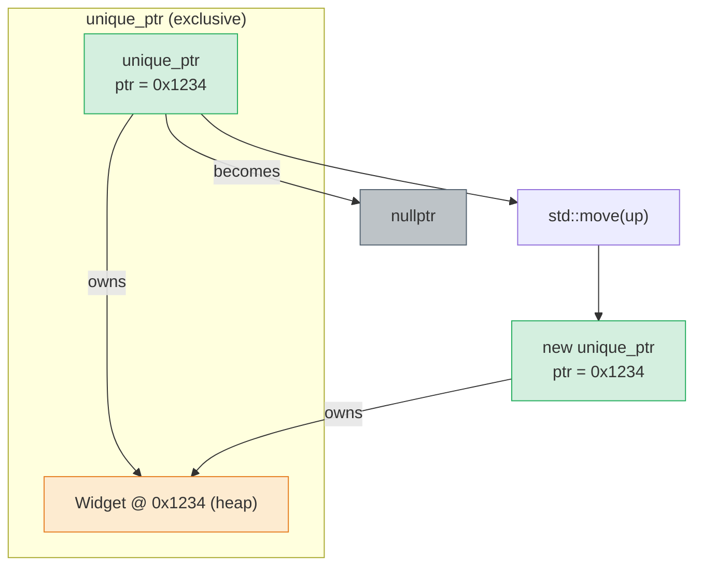
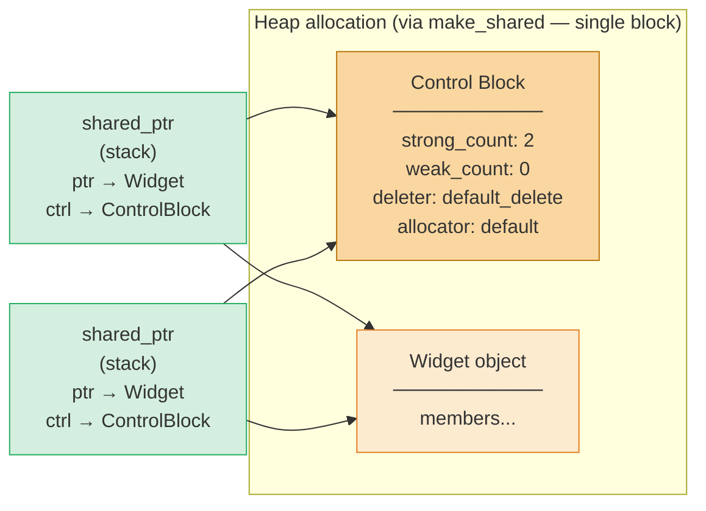
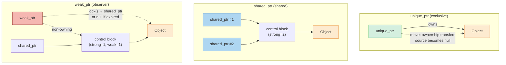
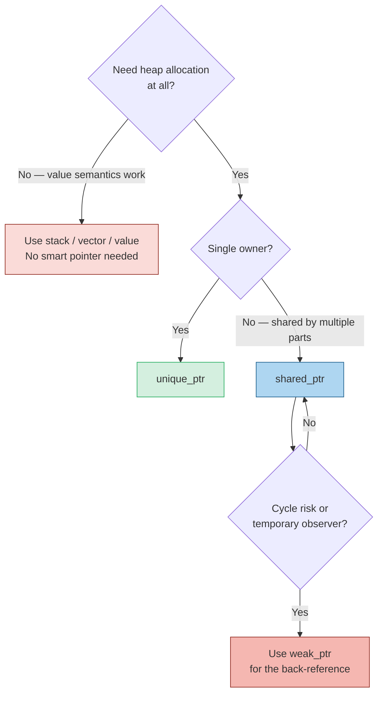

## Why This Note Matters

Raw pointers in C++ are powerful and dangerous: they let you point to anything, anywhere, with no built-in ownership semantics, no automatic cleanup, and no protection against double-free or use-after-free. For decades these properties made C++ memory management a leading source of security vulnerabilities and crashes.

**Smart pointers** are the modern C++ answer. They are objects that act like pointers (support `*`, `->`, comparison with `nullptr`) but *also* manage the lifetime of the pointee via [[4. RAII]]. They give you the efficiency of raw pointers with the safety of garbage collection, *deterministically* and with no runtime.

This note covers the three standard smart pointers — `std::unique_ptr`, `std::shared_ptr`, `std::weak_ptr` — their ownership semantics, the `make_unique`/`make_shared` factory functions, custom deleters, control block internals, and the rules of thumb for when to use each. Mastering this note is what allows you to never write `delete` again.

## Background

In C++98, the only standard smart pointer was `std::auto_ptr`, which had a deeply broken copy semantics (copying *stole* the pointer, leaving the source null) that silently broke container-of-pointer code and was finally deprecated in C++11 and removed in C++17.

C++11 introduced three replacements:

- **`std::unique_ptr<T>`** — exclusive ownership. Move-only. Zero overhead. Should be your default.
- **`std::shared_ptr<T>`** — shared ownership via atomic reference counting. Heavier (control block + atomic ops), but enables graphs of shared references.
- **`std::weak_ptr<T>`** — non-owning observer of a `shared_ptr`'s pointee. Used to break cycles and to allow temporary access without extending lifetime.

C++14 added `std::make_unique<T>(args...)` to round out `std::make_shared` (which had been in C++11). C++17 added `std::shared_ptr<T[]>` specialization. C++20 added `std::make_shared<T[]>`. C++20 also added `std::make_unique_for_overwrite` for uninitialized default construction.

All three live in `<memory>`.

## `std::unique_ptr`: Exclusive Ownership

`std::unique_ptr<T>` owns a heap-allocated `T` exclusively. It is move-only (you cannot copy it). When it is destroyed — by going out of scope, by being reset, or by being moved-from — it calls `delete` on its pointer.

### Key Properties

- **Zero overhead**: `sizeof(unique_ptr<T>) == sizeof(T*)` when the deleter is the default. No refcount, no control block, no atomic operations.
- **Move-only**: copy constructor and copy assignment are deleted. Move transfers ownership and nulls the source.
- **Customizable deleter**: the second template parameter is a deleter type; default is `std::default_delete<T>` which calls `delete`.
- **Array specialization**: `std::unique_ptr<T[]>` calls `delete[]` and provides `operator[]`.
- **Compiler-enforced ownership**: you cannot accidentally share; you must explicitly `std::move`.

### Basic Usage

```cpp
#include <memory>
#include <iostream>

struct Widget {
    Widget()  { std::cout << "ctor\n"; }
    ~Widget() { std::cout << "dtor\n"; }
    void greet() { std::cout << "hi\n"; }
};

void use() {
    auto w = std::make_unique<Widget>();   // ctor
    w->greet();
}   // ~Widget called automatically, memory freed

std::unique_ptr<Widget> factory() {
    auto w = std::make_unique<Widget>();
    return w;   // move (or NRVO) — ownership leaves the function
}

void transfer() {
    auto a = std::make_unique<Widget>();
    auto b = std::move(a);   // a is now nullptr, b owns the Widget
    // auto c = a;            // ← COMPILE ERROR: copy deleted
    // auto c = b;            // ← COMPILE ERROR: copy deleted
}
```

### Mermaid — `unique_ptr` Ownership



### Custom Deleters

`unique_ptr` accepts a deleter type as its second template argument. This is what makes it work for any "acquire/release" pair, not just `new`/`delete`:

```cpp
#include <memory>
#include <cstdio>

struct FileCloser {
    void operator()(std::FILE* fp) const noexcept {
        if (fp) std::fclose(fp);
    }
};
using FilePtr = std::unique_ptr<std::FILE, FileCloser>;

FilePtr open_file(const char* path) {
    FilePtr fp(std::fopen(path, "r"));
    if (!fp) throw std::runtime_error("fopen failed");
    return fp;
}

// C function pointer deleter (a bit larger — ptr-sized deleter stored)
std::unique_ptr<std::FILE, int(*)(std::FILE*)> open_c(const char* p) {
    return {std::fopen(p, "r"), &std::fclose};
}
```

A functor-type deleter (like `FileCloser`) is part of the type and adds zero storage overhead if empty (Empty Base Optimization). A function-pointer deleter adds one pointer of storage.

This pattern is essential for C interop: wrap any C handle (`FILE*`, `SDL_Window*`, `sqlite3*`, `DIR*`, `gsl_vector*`) in a `unique_ptr` with a custom deleter and you get RAII for free. See [[4. RAII]].

### `release()` and `reset()`

- `up.reset(p = nullptr)` — deletes the currently held pointer (if any) and takes ownership of `p`.
- `up.release()` — returns the raw pointer and gives up ownership *without* deleting. The caller is now responsible for `delete`.

```cpp
auto up = std::make_unique<Widget>();
Widget* raw = up.release();   // up is now nullptr, raw is yours to delete
delete raw;
```

Use `release()` when crossing into a C API that takes ownership. Use `reset()` to swap in a different pointer or to clear early.

## `std::shared_ptr`: Shared Ownership

`shared_ptr<T>` allows multiple smart pointers to jointly own a `T`. The pointee is destroyed only when the *last* owning `shared_ptr` is destroyed. Internally this is implemented with an atomic reference count in a **control block** allocated alongside the object (when using `make_shared`) or separately (when constructing from a raw pointer).

### Key Properties

- **Copyable**: copying a `shared_ptr` increments the reference count atomically.
- **Atomic refcount**: thread-safe for the *pointer* operations (increment, decrement, destruction) but **not** for the *pointee* — you still need to synchronize access to `*p`.
- **Control block**: a separate heap allocation (~24–32 bytes) holds the strong count, weak count, deleter, and allocator.
- **Heavier than `unique_ptr`**: one extra allocation (unless `make_shared`), atomic ops on every copy/destroy, cache-unfriendly control block access.

### Basic Usage

```cpp
#include <memory>
#include <vector>
#include <iostream>

struct Node {
    int value;
    std::vector<std::shared_ptr<Node>> children;
    Node(int v) : value(v) { std::cout << "Node " << v << " ctor\n"; }
    ~Node() { std::cout << "Node " << value << " dtor\n"; }
};

void use() {
    auto root = std::make_shared<Node>(0);
    root->children.push_back(std::make_shared<Node>(1));
    root->children.push_back(std::make_shared<Node>(2));

    auto alias = root;   // refcount goes 1 → 2
    std::cout << "use_count=" << alias.use_count() << "\n";   // 2

}   // alias dtor: 2 → 1; root dtor: 1 → 0 → ~Node fires → children vec destroys → child shared_ptrs dtor → their counts hit 0 → child Nodes destroyed
```

### Mermaid — `shared_ptr` Control Block Layout



When `make_shared` is used, the control block and the object are allocated together in a single heap block — one `operator new` call instead of two, and excellent cache locality. When you construct a `shared_ptr` from a raw pointer (`shared_ptr<T>(new T(...))`), two allocations happen: one for the object, one for the control block. **Prefer `make_shared`.**

### Mermaid — `unique_ptr` vs. `shared_ptr` vs. `weak_ptr`



### `use_count` and `expired`

- `sp.use_count()` returns the current strong count (mostly for debugging; not reliable as a synchronization primitive).
- `sp.unique()` (deprecated in C++17, removed in C++20) returned true if `use_count() == 1`.

The atomic refcount means that `shared_ptr` copies and destructures are safe across threads, *but only for the pointer control*. Concurrent reads of `*sp` are safe; concurrent writes to `*sp` still need external synchronization.

## `std::weak_ptr`: Non-Owning Observer

`weak_ptr<T>` is a non-owning reference to something that a `shared_ptr` owns. It does not extend the object's lifetime. To access the pointee, you must call `lock()`, which attempts to convert the `weak_ptr` to a `shared_ptr`. If the object still exists (i.e., strong count > 0), you get a valid `shared_ptr` that extends the lifetime for as long as you hold it. If the object has been destroyed, `lock()` returns an empty `shared_ptr`.

### Why Weak Pointers Exist

1. **Breaking cycles**: A cyclic graph of `shared_ptr`s leaks because each node keeps the other's strong count above zero forever. Replacing one direction with `weak_ptr` breaks the cycle.
2. **Caches**: A cache holds `weak_ptr`s to objects that may be evicted; clients hold `shared_ptr`s while using them.
3. **Observer patterns**: A subject holds `weak_ptr`s to observers so observers can be destroyed without notifying the subject.
4. **Temporary access**: `weak_ptr::lock` gives you thread-safe "is it still alive?" semantics.

### Example: Breaking a Cycle

```cpp
#include <memory>
#include <iostream>

struct Node {
    int value;
    std::shared_ptr<Node> next;
    std::weak_ptr<Node> prev;          // ← weak to break cycle
    Node(int v) : value(v) { std::cout << "Node " << v << " ctor\n"; }
    ~Node() { std::cout << "Node " << value << " dtor\n"; }
};

void cycle_safe() {
    auto a = std::make_shared<Node>(1);
    auto b = std::make_shared<Node>(2);
    a->next = b;     // a keeps b alive
    b->prev = a;     // b does NOT keep a alive (weak)
    // ... use ...
}   // a's dtor → strong=0 → ~Node(1) → next.reset → b's strong=0 → ~Node(2). No leak!
```

If both `next` and `prev` were `shared_ptr`, neither `a` nor `b` could ever reach strong count zero, and the entire chain would leak.

### Example: Cache Pattern

```cpp
class TextureCache {
    std::unordered_map<std::string, std::weak_ptr<Texture>> cache_;
public:
    std::shared_ptr<Texture> get(const std::string& path) {
        auto it = cache_.find(path);
        if (it != cache_.end()) {
            if (auto sp = it->second.lock()) {
                return sp;   // still alive — reuse
            }
            // expired — fall through to reload
        }
        auto sp = std::make_shared<Texture>(load_from_disk(path));
        cache_[path] = sp;   // weak — does not prevent eviction
        return sp;
    }
};
```

## `make_unique` and `make_shared` — and Why Preferred

### Exception Safety

The classic motivating example:

```cpp
void dangerous() {
    func(std::unique_ptr<T>(new T), std::unique_ptr<U>(new U));
}
```

Before C++17, the compiler was free to evaluate the four sub-expressions (`new T`, `unique_ptr` ctor, `new U`, `unique_ptr` ctor) in any order interleaved. A common order was: `new T` → `new U` → `unique_ptr` ctor → `unique_ptr` ctor. If `new U` threw after `new T` succeeded but before the first `unique_ptr` constructor bound the pointer, `T` would leak. This is the "exception safety leak in `shared_ptr` construction" problem.

`make_unique`/`make_shared` eliminate this: there is exactly one allocation, and the smart pointer constructor cannot be split from the `new`:

```cpp
func(std::make_unique<T>(), std::make_unique<U>());   // safe
```

C++17's revised evaluation rules *also* fix the raw-`new` version, but using `make_*` is still preferred for the next reason.

### Performance: `make_shared` Allocates Once

`make_shared<T>(args)` allocates a single block containing both the control block and the `T` object. This is one `operator new` call, one cache line for both, and one deallocation on cleanup.

`shared_ptr<T>(new T(args))` allocates the `T` with `new`, then allocates a separate control block. Two allocations, two cache footprints, two deallocations.

The downside of `make_shared`: the memory for the object isn't freed until *both* the strong count and weak count reach zero. If you hold a long-lived `weak_ptr` to a large object, the object's body stays allocated even though no `shared_ptr` references it. With `shared_ptr(new T)`, only the small control block stays; the object's memory is freed immediately when the strong count hits zero.

> [!tip] Use `make_shared` unless
> - You need a custom deleter (use `shared_ptr<T>(new T, deleter)`).
> - You're holding long-lived `weak_ptr`s to large objects (use `shared_ptr<T>(new T)`).
> - Your class has a private/protected constructor (the `make_*` functions can't see it; use `make_shared` via a friend declaration, or fall back to `shared_ptr<T>(new T(...))`).

## Custom Deleters for `shared_ptr`

Unlike `unique_ptr`, the deleter type of `shared_ptr` is *not* part of the type. The deleter is type-erased and stored in the control block. This means `shared_ptr<T>` with different deleters all share the same type — useful for storing them in containers.

```cpp
std::shared_ptr<std::FILE> open(const char* path) {
    return {std::fopen(path, "r"), &std::fclose};
}

std::vector<std::shared_ptr<std::FILE>> files;
files.push_back(open("a.txt"));
files.push_back(open("b.txt"));
// all close correctly when vector is destroyed, even with deleter type-erased
```

You can also pass a custom allocator to `allocate_shared`, which is the foundation of polymorphic memory resources (`std::pmr`) — see [[7. Custom Allocators]].

## Aliasing Constructors

`shared_ptr` has an "aliasing" constructor that lets one `shared_ptr` share ownership of one object while pointing to a *different* object:

```cpp
struct Pair { int a; int b; };

auto sp = std::make_shared<Pair>();
std::shared_ptr<int> alias(sp, &sp->a);   // shares ownership of Pair, points to a
// alias keeps the Pair alive, even though it dereferences to an int.
```

This is useful for returning references into members of shared objects without copying.

## When to Use Each — Decision Tree



**Defaults**:
- Need heap? Try `std::vector` first.
- Single object that needs polymorphism or large size? `std::unique_ptr<T>`.
- Genuine shared ownership (graph, observer pattern)? `std::shared_ptr<T>`.
- Back-references or caches? `std::weak_ptr<T>`.

## Performance Considerations

| Operation | `unique_ptr` | `shared_ptr` |
|---|---|---|
| Construction from `make_*` | 1 allocation (object) | 1 allocation (object + control block together) |
| Copy | n/a (move-only) | atomic increment (relaxed + acquire on load) |
| Move | trivial pointer copy + null source | trivial pointer copy + null source (no atomic) |
| Destruction | 1 deallocation, calls `delete` | atomic decrement; if 0, calls deleter + deallocates control block |
| `sizeof` | `sizeof(T*)` (default deleter) | `sizeof(T*) + sizeof(control_block*)` ≈ 16 bytes |
| Thread safety of pointer ops | n/a | atomic (safe across threads) |
| Thread safety of pointee | none (synchronize externally) | none (synchronize externally) |

`shared_ptr`'s atomic operations are *not* free: on x86 they're relaxed-load / fetch-add, but they still trigger cache-line bouncing when many threads copy the same `shared_ptr` concurrently. This is a real performance issue in hot paths; consider `std::atomic<std::shared_ptr<T>>` (C++20) or restructure to use `unique_ptr` if possible.

`unique_ptr` is exactly as cheap as a raw pointer (with default deleter). There is no performance excuse to prefer raw pointers over `unique_ptr`.

## Common Pitfalls

> [!danger] Constructing two `shared_ptr`s from the same raw pointer
> ```cpp
> auto* raw = new int(42);
> std::shared_ptr<int> a(raw);
> std::shared_ptr<int> b(raw);   // ← TWO control blocks, double-delete!
> ```
> Each `shared_ptr` constructor creates its own control block. When both go out of scope, `delete raw` is called twice — UB.

> [!danger] Using `shared_ptr` to wrap `this`
> ```cpp
> class Bad {
>     std::shared_ptr<Bad> get() { return std::shared_ptr<Bad>(this); }
> };
> ```
> Same problem as above — every call to `get()` creates a new control block. Use `std::enable_shared_from_this` and call `shared_from_this()`:
> ```cpp
> class Good : public std::enable_shared_from_this<Good> {
>     std::shared_ptr<Good> get() { return shared_from_this(); }
> };
> ```
> This requires that an existing `shared_ptr<Good>` already owns the object.

> [!danger] `shared_ptr` cycles
> A ⇄ B where both directions are `shared_ptr` leaks. Use `weak_ptr` for one direction.

> [!warning] Returning `shared_ptr<T>` by reference
> A reference return doesn't increment the refcount. If the caller copies the reference, fine; if they construct a `shared_ptr` from it later, the lifetime may have ended. Return by value (RVO/move makes it free).

> [!warning] Mixing raw `new` and `make_shared`
> `make_shared` puts the object in the control block. If you later `reset(new T)` on the same `shared_ptr`, you lose the locality benefit.

> [!warning] `shared_ptr` across DLL/SO boundaries
> The control block layout may differ between ABIs (libstdc++ vs libc++). Use a single runtime across boundaries, or pass raw pointers with explicit ownership transfer.

> [!tip] `[[nodiscard]]` on factories
> Mark factory functions returning smart pointers `[[nodiscard]]` so callers can't accidentally drop the result and immediately destroy the object.

## Tips and Tricks

1. **Default to `unique_ptr`**: it's free, enforces single ownership, and you can promote to `shared_ptr` later via move if you need shared ownership.
2. **`unique_ptr` → `shared_ptr` is a one-way street**: `shared_ptr` has a converting constructor from `unique_ptr`, so APIs that take `shared_ptr` accept `unique_ptr` inputs.
3. **Use `std::static_pointer_cast<T>(sp)` / `dynamic_pointer_cast` / `const_pointer_cast`** to cast smart pointers while preserving the control block.
4. **For arrays, prefer `std::vector`** over `unique_ptr<T[]>`/`shared_ptr<T[]>`. The container gives bounds-checked `at()`, iterators, and grows.
5. **Avoid `make_shared` for objects with private constructors** unless you make `std::make_shared` a friend.
6. **`std::enable_shared_from_this`** is essential when an object needs to hand out `shared_ptr`s to itself. It stores a `weak_ptr` to the control block; `shared_from_this()` locks it.
7. **Profile refcount contention** with tools like `tracy` or `perf`. If a `shared_ptr` is copied in a hot loop across threads, you will see cache-line bouncing.
8. **For non-owning parameters, use `T*` or `T&`** rather than `shared_ptr<T>`. Only pass `shared_ptr` by value when you intend to share ownership; otherwise you pay an atomic op for nothing.
9. **`std::atomic<std::shared_ptr<T>>`** (C++20) is a thread-safe `shared_ptr` for the rare cases where multiple threads mutate the same slot.
10. **Custom deleters for arrays**: `std::unique_ptr<T[]>` uses `delete[]` automatically; you don't need a custom deleter for plain arrays.

## Active Recall

1. What is `sizeof(std::unique_ptr<T>)` with the default deleter? What about `std::shared_ptr<T>`?
2. Why does `make_shared` allocate once but `shared_ptr(new T)` allocates twice?
3. Write a `unique_ptr<FILE, FileCloser>` wrapper.
4. How does `weak_ptr::lock()` differ from `weak_ptr::expired()`?
5. Why is `std::shared_ptr<T>(new T)` from the same `T*` twice undefined behavior?
6. What is `std::enable_shared_from_this` and when do you need it?
7. Why does `shared_ptr` use atomic operations, while `unique_ptr` doesn't?
8. Give two scenarios where you should *not* use `make_shared`.
9. Explain why a cycle of `shared_ptr` leaks and how `weak_ptr` fixes it.
10. What is the "aliasing constructor" of `shared_ptr` for?

## Next Steps

- [[6. Memory Leaks and Dangling Pointers]] shows the failure modes that smart pointers eliminate.
- [[7. Custom Allocators]] explains `std::allocate_shared` and PMR for routing `shared_ptr` allocations through custom allocators.
- [[4. RAII]] is the underlying idiom that makes all smart pointers work.
- Read your standard library's `<memory>` header — it's a masterclass in template design.
