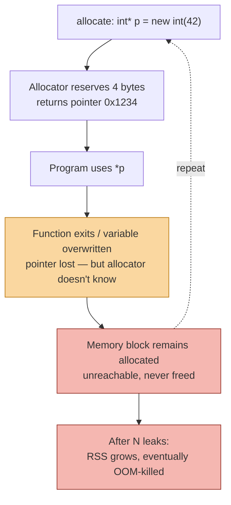
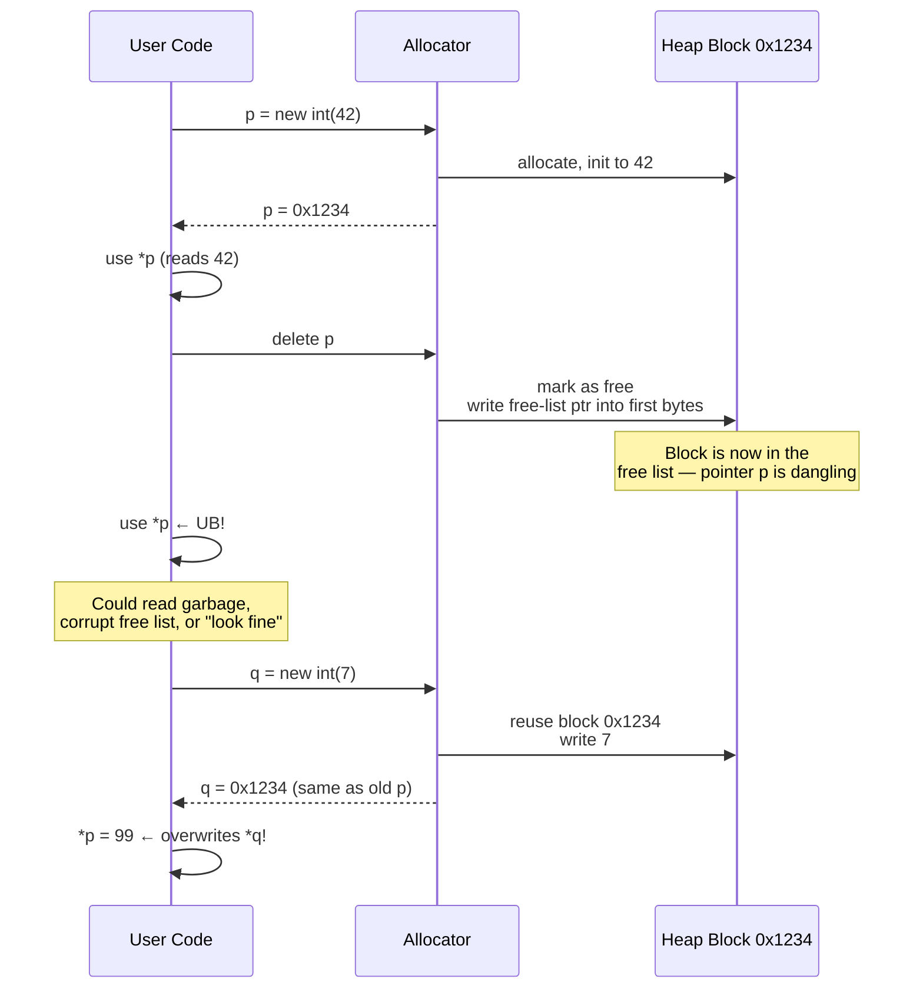

## Why This Note Matters

C++ gives you direct control over memory lifetimes. This is its greatest strength and its greatest danger. When you get it right, your program is faster and leaner than anything a garbage-collected language can produce. When you get it wrong, you encounter two of the most notorious classes of bugs in all of software engineering: **memory leaks** and **dangling pointers** — the latter including use-after-free and double-free, both of which are common sources of crashes, data corruption, and security vulnerabilities (CVE after CVE, from Chrome to the Linux kernel).

This note explains precisely what each bug is, why it happens, how to detect it with modern tools (Valgrind, AddressSanitizer), and how to prevent it using [[4. RAII]] and [[5. Smart Pointers]]. Read this note, and you'll never write `delete p; p->foo();` again without flinching.

## Background

A memory model with manual lifetime management has four primitive operations:

1. **Allocate** — request a block of memory from the allocator (`malloc`, `new`).
2. **Use** — read or write the block via a pointer or reference.
3. **Deallocate** — return the block to the allocator (`free`, `delete`).
4. **Lose the pointer** — go out of scope or overwrite the variable without deallocating.

Bugs arise from misusing these primitives:

- Allocate + use + lose pointer (no deallocate) → **memory leak**.
- Allocate + deallocate + use → **use-after-free** (a kind of dangling pointer access).
- Allocate + deallocate + deallocate → **double-free**.
- Allocate + deallocate + (allocator reuses the block) + use → **use-after-realloc** (a more dangerous variant because the data appears "valid").

Garbage-collected languages eliminate some of these by tracking live references and reclaiming unreachable memory automatically. But even GC languages have *non-memory* leaks (file handles, sockets) and *logical* leaks (growing caches). And GC doesn't help with the *dangling* bugs if you use finalizers and resurrections.

C++ takes a different approach: deterministic destruction via [[4. RAII]] makes leaks structurally impossible in well-written code, and smart pointers ([[5. Smart Pointers]]) make dangling-pointers structurally impossible for the cases they cover.

## Memory Leaks

### Definition

A **memory leak** occurs when a program allocates memory on the heap but loses the ability to deallocate it — typically because all pointers to it are overwritten or go out of scope without `delete`. The memory remains "live" from the allocator's perspective (it can never be reclaimed), but is unreachable from the program. It will not be freed until the process exits.

```cpp
void leak() {
    int* p = new int(42);
    // ... use p ...
}   // p goes out of scope; the int stays allocated forever.
```

The leak is invisible at runtime: no crash, no error. The process simply grows in RSS over time, until it hits `RLIMIT_AS` or the OS kills it with OOM (Out-Of-Memory) killer.

### Mermaid — Lifecycle of a Memory Leak



### Why Leaks Matter

- **Long-running processes**: Web servers, databases, browsers, daemons. A 1 KB-per-request leak in a server handling 10,000 req/s leaks 10 MB/s — 36 GB/hour.
- **Embedded systems**: Limited memory; leaks are catastrophic.
- **OS kernels / drivers**: Leaks that survive process exit are far worse.
- **Security**: A leak that lets an attacker control allocation patterns can be used for denial-of-service or, in extreme cases, to amplify other bugs.
- **Resource leaks of non-memory**: File descriptors, sockets, mutexes — same shape, often more dangerous because they're smaller pools (e.g., 1024 fd limit).

### Types of Leaks

1. **Direct leak**: Pointer goes out of scope without `delete`. (Simplest case.)
2. **Exception-path leak**: Allocation succeeds; an exception is thrown before `delete`. Without [[4. RAII]], the `delete` is skipped.
3. **Cycle leak**: Two `shared_ptr`s pointing at each other keep each other's refcount above zero indefinitely. See [[5. Smart Pointers]].
4. **Hidden leak**: A growing `std::list` used as a "cache" without eviction. Looks intentional; behaves like a leak.
5. **System-resource leak**: Memory freed but kernel-side resources (e.g., shmem segments, mmap'd files not munmapped) persist after process exit.

### Detection Tools

#### Valgrind (`memcheck`)

Valgrind's `memcheck` is the gold-standard leak detector. It runs your program in a synthetic CPU, tracking every allocation and every pointer to allocated memory. At exit, it reports any allocations that are no longer reachable from the root set (stacks, globals, registers).

```bash
$ g++ -g -O0 program.cpp -o program
$ valgrind --leak-check=full --show-leak-kinds=all ./program
==12345== HEAP SUMMARY:
==12345==     in use at exit: 40 bytes in 1 blocks
==12345==   total heap usage: 5 allocs, 4 frees, 72,704 bytes allocated
==12345==
==12345== 40 bytes in 1 blocks are definitely lost in loss record 1 of 1
==12345==    at 0x483BE63: operator new(unsigned long) (vg_replace_malloc.c:342)
==12345==    by 0x401156: leak() (program.cpp:5)
==12345==    by 0x40117A: main (program.cpp:10)
==12345==
==12345== LEAK SUMMARY:
==12345==    definitely lost: 40 bytes in 1 blocks
==12345==    indirectly lost: 0 bytes in 0 blocks
==12345==      possibly lost: 0 bytes in 0 blocks
==12345==    still reachable: 0 bytes in 0 blocks
==12345==         suppressed: 0 bytes in 0 blocks
```

Valgrind is slow (10–50× slowdown) but extremely accurate. It also detects use-after-free, double-free, and uninitialized reads.

#### AddressSanitizer (ASan)

ASan is a compiler-based sanitizer (`-fsanitize=address`) that instruments every memory access. It catches use-after-free, double-free, buffer overflows, and leaks (via LeakSanitizer, enabled by default).

```bash
$ g++ -g -O1 -fsanitize=address program.cpp -o program
$ ./program

=================================================================
==12345==ERROR: LeakSanitizer: detected memory leaks

Direct leak of 40 byte(s) in 1 object(s) allocated from:
    #0 0x7f3e4c6b8c20 in operator new(unsigned long) ...
    #1 0x401156 in leak() program.cpp:5
    #2 0x40117a in main program.cpp:10
    #3 0x7f3e4c4f7d90 in __libc_start_call_main ...

SUMMARY: AddressSanitizer: 40 byte(s) leaked in 1 allocation(s).
```

ASan is much faster than Valgrind (~2× slowdown) and is the recommended approach in modern development. It's the default for many CI pipelines and is how Google and Mozilla catch memory bugs in Chrome and Firefox.

See [[6. Memory Leaks and Dangling Pointers#Cross-Reference Debugging]] below for the relationship to a future Debugging chapter.

#### Heap Profilers

- **`massif`** (Valgrind tool): heap profiling over time, shows where RSS growth comes from.
- **`jemalloc`'s `stats`**: built-in heap profiling with `MALLOC_CONF=stats_print:true`.
- **`gperftools` (TCMalloc) heap profiler**: samples allocations, produces call-graph profiles.
- **`heaptrack`**: KDE's heap profiler, very fast.

Use these when leaks are slow / "creeping RSS" rather than a one-shot leak.

## Dangling Pointers

### Definition

A **dangling pointer** is a pointer that refers to memory that has been deallocated (or was never allocated, or is otherwise invalid). Using a dangling pointer is **undefined behavior** (UB).

Three subclasses:

1. **Use-after-free**: dereference after `delete`/`free`.
2. **Double-free**: `delete`/`free` the same pointer twice.
3. **Stack-use-after-return**: pointer to a stack variable used after the function returns.
4. **Stack-use-after-scope**: pointer to a stack variable in an inner scope, used after the scope exits.

### Use-After-Free

```cpp
int* p = new int(42);
delete p;
std::cout << *p;   // UB! Use-after-free.
```

What *actually* happens varies:
- The allocator may overwrite the first bytes of the freed block with its own bookkeeping (free-list pointers). Reading `*p` returns garbage. Writing `*p` corrupts the allocator's bookkeeping and crashes later.
- The allocator may not have reused the block yet, so `*p` returns `42` (looks fine — but is still UB).
- Another thread may `new` the same block, modify it; `*p` then returns *someone else's data*.

The "looks fine" case is the worst, because it hides the bug until the code is ported, optimized, or runs under different conditions.

### Double-Free

```cpp
int* p = new int(42);
delete p;
delete p;   // UB! Double-free.
```

Most allocators detect this and abort with "double free or corruption". But the detection is not guaranteed; sometimes it silently corrupts the heap. Attackers love double-frees because they can manipulate the allocator's free-list structure to redirect future allocations to attacker-controlled memory.

### Stack-Use-After-Return

```cpp
int* dangling() {
    int x = 42;
    return &x;   // ← x will be destroyed when function returns; pointer dangles
}

int main() {
    int* p = dangling();
    return *p;   // UB
}
```

The compiler usually warns (`-Wreturn-stack-address`). ASan catches it with `detect_stack_use_after_return=1`.

### Mermaid — Dangling Pointer Scenario



The sequence shows why use-after-free is so insidious: the freed block may be reallocated to a completely unrelated part of the program, and writes through the dangling pointer corrupt *that other part's* data. This is the root cause of countless CVEs.

## Security Implications

Use-after-free and double-free are not just bugs — they're **exploits**. Real-world CVEs:

- **CVE-2014-0160 (Heartbleed)**: Over-read of buffer in OpenSSL (not UAF, but related memory-safety issue).
- **CVE-2014-1776, CVE-2015-…**: Internet Explorer UAF in DOM bindings → remote code execution.
- **Linux kernel CVEs**: dozens per year are UAF in driver paths.
- **Chrome CVEs**: large fraction of "high severity" bugs are UAF in the renderer.

The typical exploit path:
1. Trigger the use-after-free in a way that causes the freed block to be reallocated with attacker-controlled data.
2. The dangling pointer now points to attacker data, which is interpreted as a vtable pointer or function pointer.
3. Calling a virtual function through the dangling pointer jumps to attacker code.

Defense: ASan in testing, **Control-Flow Integrity** (CFI) in production, and most importantly — *don't write the bug in the first place*. [[5. Smart Pointers]] and [[4. RAII]] make this tractable.

## Detection of Dangling Bugs

### AddressSanitizer (ASan)

ASan quarantines freed blocks for a while (default 256 MB) and fills them with a poison byte pattern. Any access to a quarantined block triggers an immediate error report with the *allocation* and *deallocation* stack traces:

```bash
$ ./program
=================================================================
==12345==ERROR: AddressSanitizer: heap-use-after-free on address 0x602000000010 at pc 0x... bp 0x... sp 0x...
READ of size 4 at 0x602000000010 thread T0
    #0 0x4011a0 in main program.cpp:8
    #1 0x7f... in __libc_start_call_main

0x602000000010 is located 0 bytes inside of 4-byte region [0x602000000010,0x602000000014)
freed by thread T0 here:
    #0 0x7f... in operator delete(unsigned long) ...
    #1 0x401175 in main program.cpp:7

previously allocated by thread T0 here:
    #0 0x7f... in operator new(unsigned long) ...
    #1 0x401160 in main program.cpp:6
```

This is gold: it tells you exactly where the memory was allocated, freed, and (mis)used.

### Valgrind `memcheck`

Valgrind catches the same bugs with `--tool=memcheck`. Slower than ASan but doesn't require recompilation.

### UBSan (Undefined Behavior Sanitizer)

`-fsanitize=undefined` catches many other forms of UB (signed overflow, null pointer dereference, alignment violations). Combine with ASan for comprehensive coverage.

### Static Analyzers

- **Clang Static Analyzer** (`scan-build`): catches some UAF patterns at compile time.
- **Cppcheck**: similar, open source.
- **PVS-Studio**: commercial, very thorough.
- **clang-tidy**: has `bugprone-use-after-move`, `cppcoreguidelines-owning-memory`, etc.

These catch *patterns* rather than dynamic bugs, but they're fast and run in CI.

## Prevention: RAII and Smart Pointers

The structural fix for both leaks and dangling pointers is [[4. RAII]]:

### Leaks → Impossible with RAII

```cpp
void safe() {
    auto p = std::make_unique<int>(42);
    // ... use p ...
    if (something) throw std::runtime_error("oops");   // ← no leak
    // ... more code ...
}   // ← no leak
```

The `unique_ptr` destructor fires on every exit path, freeing the `int`. **Leaks become structurally impossible** as long as you don't bypass RAII with raw `new`/`delete`.

### Dangling Pointers → Impossible with Smart Pointers

```cpp
std::weak_ptr<Widget> observer;
{
    auto sp = std::make_shared<Widget>();
    observer = sp;
}
// sp destroyed; Widget destroyed; observer is now expired
if (auto live = observer.lock()) {
    live->use();   // only runs if still alive
} else {
    std::cout << "gone\n";
}
```

The `weak_ptr` *cannot* dangle: `lock()` either gives you a valid `shared_ptr` (extending lifetime for as long as you hold it) or null. There is no in-between.

For non-owning parameters, prefer `T&` or `T*` (with a documented contract that the caller ensures lifetime). The [[3. From C to C++ Memory Management]] note explains why raw `T*` should mean "non-owning observer" in modern C++ style.

## Realistic Example: Buggy Pre-RAII Code

```cpp
#include <vector>

class OrderBook {
    std::vector<Trade*> trades_;   // OWNING raw pointers — bad smell
public:
    ~OrderBook() {
        for (auto* t : trades_) delete t;
    }
    // ← missing copy ctor/assign! Default does shallow copy → double-free!
    void add(Trade* t) { trades_.push_back(t); }
};

void buggy() {
    OrderBook a;
    a.add(new Trade{...});
    OrderBook b = a;       // shallow copy: both have same Trade*
    // when both go out of scope, double-delete → crash
}
```

The fixes, in order of preference:
1. **Rule of Zero**: store `std::vector<std::unique_ptr<Trade>>` or `std::vector<Trade>` (values).
2. **Smart pointers**: `std::shared_ptr<Trade>` if shared ownership is genuine.
3. **Rule of Five**: explicitly write copy/move/destructor with deep copy semantics.

Modern equivalent:

```cpp
class OrderBook {
    std::vector<std::unique_ptr<Trade>> trades_;
public:
    void add(std::unique_ptr<Trade> t) { trades_.push_back(std::move(t)); }
    // ← copy is forbidden by unique_ptr; move works automatically. No bugs possible.
};
```

## Cross-Reference: Debugging

ASan, UBSan, MSan (MemorySanitizer for uninitialized reads), and TSan (ThreadSanitizer for data races) are covered in more depth in the Debugging chapter of the vault. This note focuses on what they catch in the memory domain.

> [!tip] Always-on sanitizers in CI
> Build your project with `-fsanitize=address,undefined` in CI for every commit. The ~2× slowdown is worth it: ASan catches bugs that would otherwise hide for months in production. Run a separate `-fsanitize=thread` build for concurrency bugs.

## Common Pitfalls

> [!danger] Use-after-free via raw pointer kept across `delete`
> ```cpp
> T* p = new T();
> T* alias = p;
> delete p;
> alias->foo();   // ← UB
> ```

> [!danger] Double-free
> ```cpp
> T* p = new T();
> delete p;
> // ... later ...
> delete p;   // ← UB
> ```
> Set `p = nullptr` after `delete` if you must use raw pointers; deleting nullptr is a no-op. (Smart pointers do this for you.)

> [!danger] Returning a pointer/reference to a stack local
> ```cpp
> std::string& bad() {
>     std::string local = "hi";
>     return local;   // ← UB
> }
> ```

> [!danger] Iterator invalidation
> ```cpp
> std::vector<int> v = {1, 2, 3};
> int* p = v.data();
> v.push_back(4);     // may reallocate → p is now dangling
> std::cout << *p;    // ← UB
> ```

> [!warning] Use-after-`std::move`
> ```cpp
> std::string s = "hi";
> std::string t = std::move(s);
> std::cout << s;     // technically valid but unspecified — usually empty
> s = "ok";           // reassigning is fine
> ```
> A moved-from object is in a "valid but unspecified" state. You can destroy or reassign it, but reading its value is rarely what you want. `clang-tidy`'s `bugprone-use-after-move` catches this.

> [!warning] Leaks via C library callbacks
> If a C library hands you a `malloc`'d pointer and expects you to call its custom `release`, you must wrap that in a `unique_ptr` with the right deleter at the boundary. Otherwise exceptions or early returns leak. See [[3. From C to C++ Memory Management]].

> [!tip] Compile with `-Wdangling-gsl -Wreturn-stack-address`
> These warnings catch common dangling patterns at compile time. Add `-Werror` for your CI build to make them hard errors.

## Tips and Tricks

1. **Never write `new`/`delete` in application code.** Wrap allocations in `make_unique`/`make_shared` immediately. If you must, isolate the `new` in a factory function and return a smart pointer.
2. **Raw pointers mean non-owning observers.** Adopt this convention: a raw `T*` parameter or member never owns; it points to something whose lifetime is guaranteed by a smart pointer elsewhere.
3. **Use `gsl::owner<T*>`** (from the Guidelines Support Library) to mark owning raw pointers when you genuinely need them. `clang-tidy` enforces this.
4. **Run sanitizers in every CI build** with `-fsanitize=address,undefined`. Run `-fsanitize=thread` separately.
5. **For long-running services**, run a canary instance with ASan even in production (for a fraction of traffic) to catch bugs that only manifest after hours of uptime.
6. **Use `valgrind --leak-check=full --errors-for-leak-kinds=definite`** for the strictest leak checking; "possible" leaks are usually false positives.
7. **`MALLOC_PERTURB_=1`** in the environment makes glibc fill freed memory with a byte pattern, exposing use-after-free bugs that "happen to work" because the freed memory still contains the old value.
8. **Avoid `std::auto_ptr`** (removed in C++17). Its copy-steals semantics silently corrupt data.
9. **Run static analyzers**: `clang-tidy` with `cppcoreguidelines-*`, `bugprone-*`, `modernize-*` checks. They catch many of these bugs at compile time.
10. **For embedded / no-exception builds**, RAII still works — just avoid `make_shared` (which can throw `bad_alloc`) and use `unique_ptr` with `new (std::nothrow)`.

## Active Recall

1. Define a memory leak in one sentence.
2. Define a dangling pointer in one sentence.
3. Why is a use-after-free that "happens to work" the most dangerous kind?
4. Name three sanitizer flags and what each catches.
5. How does `std::weak_ptr::lock()` prevent dangling pointers?
6. Why does iterator invalidation count as a form of dangling pointer?
7. Why is `OrderBook` with `vector<Trade*>` and the default copy constructor a double-free bug?
8. Write the ASan command-line for a debug build.
9. What does `MALLOC_PERTURB_=1` do and why is it useful?
10. Give three real-world reasons memory leaks matter even on short-lived processes.

## Next Steps

- [[5. Smart Pointers]] for the structural fix to both leaks and dangling pointers.
- [[4. RAII]] for the underlying idiom.
- [[3. From C to C++ Memory Management]] for why raw `new`/`delete` is no longer the right tool.
- [[7. Custom Allocators]] for arena/pool allocators, which give you bulk deallocation and *guarantee* no leaks within an arena's lifetime — at the cost of object lifetime being tied to the arena.
- The Debugging chapter (cross-reference) for deeper treatment of ASan, UBSan, TSan, MSan, Valgrind, and core-dump analysis.
