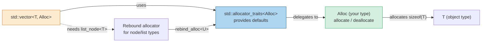
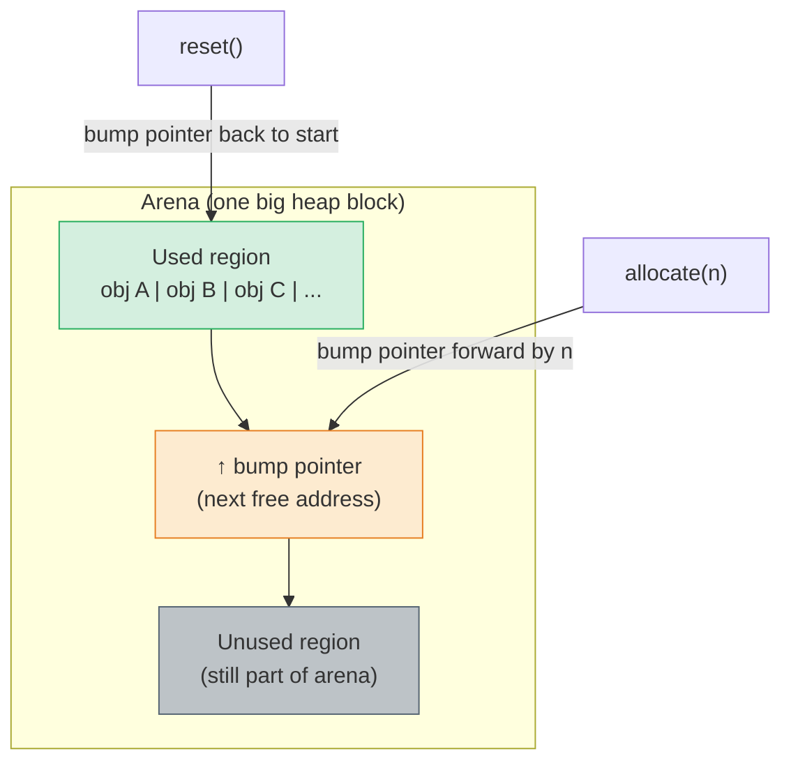
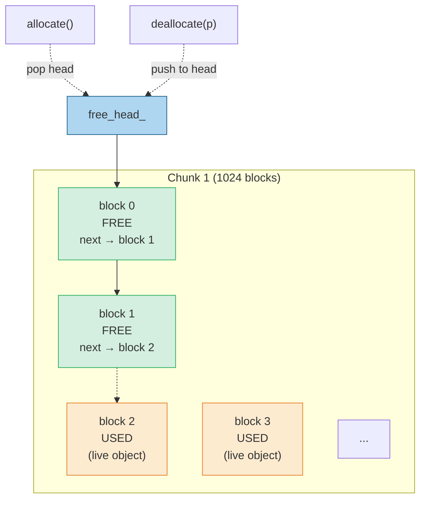

## Why This Note Matters

The general-purpose heap allocator (`malloc`/`new` backed by glibc's `ptmalloc2`, or `jemalloc`/`tcmalloc`/`mimalloc` for performance builds) is a marvel of engineering. It handles arbitrary allocation sizes, lifetimes, and patterns, and is thread-safe and reasonably fast. But "reasonably fast" for a *general* allocator means each `new`/`delete` pair costs hundreds of nanoseconds. In domains where every microsecond counts — game engines, high-frequency trading, real-time audio, JVM-style GC pauses — those hundreds of nanoseconds per allocation add up to disaster.

**Custom allocators** replace the general-purpose heap with specialized strategies that exploit structure in your allocation pattern. An arena allocator can drop a million allocations in a single `free`. A pool allocator can hand out fixed-size blocks in single-digit nanoseconds with zero fragmentation. A stack allocator can mimic the [[1. Stack and Heap|stack]]'s LIFO discipline for arbitrarily large objects.

This note covers the C++ allocator model, the four most important allocator strategies (arena, pool, stack/linear), placement new, the `std::pmr` (Polymorphic Memory Resource) framework introduced in C++17, when *not* to write a custom allocator, and real-world use cases.

## Background

There are three costs of general-purpose allocation:

1. **Per-call overhead**: The allocator must consult free-lists, size-class bins, sometimes lock a mutex (or use thread-local caches). Even with `tcmalloc`-style optimizations, a `malloc`+`free` pair is ~50–200 ns.
2. **Fragmentation**: After many allocations of different sizes, the heap develops "holes" — free chunks too small to satisfy new requests. RSS grows beyond what's actually used.
3. **Cache unfriendliness**: Allocations scatter across pages; each access risks a cache miss.

These costs are inherent to a *general* allocator that must serve any size, any lifetime, any thread. If your code's allocation pattern is more structured — e.g., "allocate 10,000 small objects, all freed at once at end of frame" — you can do far better.

Custom allocators exploit that structure. The trade-off is generality: a pool allocator handles only one size; an arena allocator handles only bulk deallocation (no individual frees). The right allocator depends on your access pattern.

## The C++ Allocator Model

### `std::allocator<T>` and `Allocator` concept

The standard library's containers take an `Allocator` template parameter:

```cpp
template<class T, class Allocator = std::allocator<T>>
class vector;
```

An **Allocator** is a type that satisfies a set of requirements (the Allocator concept): it provides `value_type`, `allocate(n)`, `deallocate(p, n)`, and various nested types for backward compatibility. `std::allocator<T>` is the trivial default that forwards to `::operator new`.

The Allocator concept historically (pre-C++11) required many nested typedefs (`pointer`, `reference`, `const_pointer`, …). C++11 reduced this to `value_type`, `allocate`, `deallocate`, and made `std::allocator_traits` synthesize the rest. C++20 formalized this as a concept.

### The Subtle Rebinding Problem

A `std::list<int, Alloc>` allocates `int` nodes — but the node type is *not* `int`, it's `list_node<int>` containing the int plus next/prev pointers. So the list needs to allocate a different type than its `value_type`. This is handled by **rebinding**: `Alloc::rebind<U>::other` (or `std::allocator_traits<Alloc>::rebind_alloc<U>`) gives you an equivalent allocator for type `U`. The container uses the rebound allocator internally.

This is why the Allocator concept requires a *type-erased* interface: the same allocator strategy must work for many types.

### Mermaid — Allocator Concept Interactions



## The Allocator Strategies

### 1. Arena Allocator (Bump Allocator)

The simplest possible allocator. You allocate one large chunk of memory up front (an "arena"). Each allocation request just bumps a pointer forward by the requested size (rounded for alignment). Deallocation of individual blocks is **not supported** — you reset the entire arena at once when you're done.

```cpp
#include <cstddef>
#include <cstdint>
#include <new>
#include <memory_resource>

class Arena {
    std::byte* base_;
    std::size_t size_;
    std::size_t offset_ = 0;
public:
    Arena(std::size_t size) : size_(size), offset_(0) {
        base_ = static_cast<std::byte*>(::operator new(size));
    }
    ~Arena() { ::operator delete(base_); }
    Arena(const Arena&) = delete;
    Arena& operator=(const Arena&) = delete;

    void* allocate(std::size_t n, std::size_t align = alignof(std::max_align_t)) {
        std::size_t space = size_ - offset_;
        void* ptr = base_ + offset_;
        if (std::align(align, n, ptr, space)) {
            offset_ = static_cast<std::byte*>(ptr) - base_ + n;
            return ptr;
        }
        throw std::bad_alloc();
    }

    void reset() { offset_ = 0; }   // ← "frees" everything at once
};
```

#### Properties

- **Allocation**: O(1), single pointer arithmetic, ~5 ns.
- **Deallocation of individual blocks**: not supported.
- **Bulk deallocation**: `reset()` is O(1) — just zero the offset.
- **Fragmentation**: zero (allocations are contiguous).
- **Cache locality**: excellent — sequential allocations are sequential in memory.
- **Memory waste**: only alignment padding.

#### When to Use

- **Game engines**: allocate all per-frame objects in an arena; reset at end of frame. No per-object frees, no fragmentation, no leaks.
- **Compilers / parsers**: allocate AST nodes in an arena; free everything when compilation finishes. LLVM's `BumpPtrAllocator` is exactly this.
- **Web request handlers**: allocate all per-request objects in an arena; reset when response sent.
- **Tiered arenas** ("scope" allocators): push/pop markers to free back to a previous point.

#### Mermaid — Arena Allocator Layout



### 2. Pool Allocator (Fixed-Size Block Allocator)

A pool allocator hands out blocks of **one fixed size**. Internally it allocates a large chunk and divides it into a linked list of free blocks. `allocate` pops the head of the free list; `deallocate` pushes the block back. Each block is the same size, so no fragmentation and no search.

```cpp
template<std::size_t BlockSize>
class Pool {
    union Node {
        Node* next;
        std::byte storage[BlockSize];
    };
    Node* free_head_ = nullptr;
    std::vector<std::unique_ptr<Node[]>> chunks_;   // own the memory
public:
    void* allocate() {
        if (!free_head_) grow();
        Node* n = free_head_;
        free_head_ = n->next;
        return n;   // already aligned (Node is naturally aligned)
    }
    void deallocate(void* p) {
        Node* n = static_cast<Node*>(p);
        n->next = free_head_;
        free_head_ = n;
    }
private:
    void grow() {
        auto chunk = std::make_unique<Node[]>(1024);
        for (int i = 0; i < 1024; ++i) {
            chunk[i].next = free_head_;
            free_head_ = &chunk[i];
        }
        chunks_.push_back(std::move(chunk));
    }
};
```

#### Properties

- **Allocation**: O(1), pop from free list, ~5–10 ns.
- **Deallocation**: O(1), push to free list.
- **Fragmentation**: zero — all blocks are the same size.
- **Cache locality**: very good (chunk-based, blocks adjacent).
- **No per-block overhead** — the free-list pointer is stored *inside* the free block itself (using a `union`), so allocated blocks have zero overhead.

#### When to Use

- **Node-based containers** (`std::list`, `std::map`, `std::unordered_map`): each node is the same size. A pool allocator per node type is a huge win.
- **Game entity component systems**: each component type has a pool.
- **Network packet buffers**: fixed-size packets, high allocation rate.

#### Mermaid — Pool Allocator Layout



### 3. Stack Allocator (LIFO)

A stack allocator is like an arena but supports deallocation *only* in LIFO order. The caller must remember the offset at allocation time and pass it back to deallocate. Useful for nested scope-style allocation patterns.

```cpp
class StackAllocator {
    std::byte* base_;
    std::size_t size_, offset_ = 0;
public:
    StackAllocator(std::size_t size) : size_(size) {
        base_ = static_cast<std::byte*>(::operator new(size));
    }
    ~StackAllocator() { ::operator delete(base_); }

    struct Marker { std::size_t offset; };

    void* allocate(std::size_t n, std::size_t align = alignof(std::max_align_t)) {
        // ... same alignment logic as Arena ...
        // returns ptr, caller must save Marker{offset_before}
    }
    void deallocate(Marker m) { offset_ = m.offset; }   // must be the most-recent live alloc
    Marker mark() const { return {offset_}; }
};
```

#### When to Use

- **Game state snapshots**: push a marker, allocate transient state, restore marker at end of frame segment.
- **Rollback journals** in databases.
- **String builders**: build up a complex string with many small allocations, then free all at once.

### 4. Linear Allocator

Sometimes used as a synonym for arena/bump allocator. Sometimes specifically refers to an arena that *never* frees until destruction. The terminology varies; the concept is the same: pointer bump, no per-block free.

## Placement `new` — The Bridge

Custom allocators give you raw memory. To put a C++ object into that memory, you use **placement `new`** (see [[3. From C to C++ Memory Management]]):

```cpp
Arena arena(1 << 20);
void* mem = arena.allocate(sizeof(Widget), alignof(Widget));
Widget* w = new (mem) Widget(args);   // construct in pre-allocated memory
// ... use w ...
w->~Widget();                          // manual destructor call
arena.reset();                          // or: arena frees all at once
```

The standard library generalizes this:

- `std::allocator_traits<A>::construct(a, p, args...)` calls `new (p) T(args...)` (or your custom `construct` if provided).
- `std::allocator_traits<A>::destroy(a, p)` calls `p->~T()`.
- C++20 added `std::construct_at(p, args...)` and `std::destroy_at(p)` as free functions (constexpr-friendly).

`std::vector<T, Alloc>` calls these hooks when it grows, so a custom allocator automatically gets construction/destruction right.

## `std::pmr` — Polymorphic Memory Resources (C++17)

Writing a custom allocator *type* is painful because it must be a template — every container instantiated with a different allocator type is a *different* container type. You can't have a `std::vector<int, MyPool>` and a `std::vector<int, OtherPool>` and pass them to the same function.

C++17 solved this with **`std::pmr`** (Polymorphic Memory Resource). Instead of templating the allocator, you use a *runtime-polymorphic* memory resource object, accessed through a single allocator type `std::pmr::polymorphic_allocator<T>`:

```cpp
#include <memory_resource>
#include <vector>

void process(std::pmr::vector<int>& v);

int main() {
    std::pmr::monotonic_buffer_resource mbr(1 << 20);   // arena, no per-block free
    std::pmr::polymorphic_allocator<int> alloc(&mbr);

    std::pmr::vector<int> v({1, 2, 3, 4, 5}, alloc);
    v.push_back(6);   // uses mbr for the new buffer

    process(v);
}   // mbr's destructor frees the whole arena at once
```

Standard PMR resources:

- **`std::pmr::monotonic_buffer_resource`** — arena allocator. Never frees until destroyed.
- **`std::pmr::synchronized_pool_resource`** — thread-safe pool.
- **`std::pmr::unsynchronized_pool_resource`** — single-thread pool.
- You can chain them via the constructor: a pool resource can itself be backed by a monotonic buffer.

A `std::pmr::vector<int>` is *the same type* regardless of which resource it uses — the resource is held by pointer. This lets you pass `pmr` containers around without templatizing every API on the allocator.

### Example: Game Frame Allocator

```cpp
class Game {
    std::pmr::monotonic_buffer_resource frame_arena_{4 << 20};
public:
    void frame() {
        std::pmr::polymorphic_allocator<int> a(&frame_arena_);
        std::pmr::vector<std::pmr::string> events(a);
        // ... fill events with thousands of small strings ...
        // ... render, log, etc. ...
    }   // events destroyed; frame_arena_ memory remains allocated
    void end_frame() { /* could call frame_arena_.release() to free */ }
};
```

Per-frame allocation cost: zero `malloc` calls (after the initial arena allocation). Memory locality: excellent. Memory leak risk: zero (arena owns everything).

## Custom `operator new` Per-Class

For types that you want to always use a specific allocator (without forcing callers to specify it), override `operator new`/`operator delete` per-class:

```cpp
class Widget {
    static Pool<sizeof(Widget)> pool_;
public:
    static void* operator new(std::size_t) { return pool_.allocate(); }
    static void operator delete(void* p) { pool_.deallocate(p); }
    // ... rest of class ...
};
```

Now `new Widget()` goes through `pool_` instead of `::operator new`, with no change to call sites. This is the foundation of "small-object optimization" in many libraries (Boost, LLVM).

> [!warning] Inheriting `operator new`
> If a derived class doesn't override `operator new`, it inherits the base's. But `sizeof(Derived)` may be larger than `sizeof(Base)` — your pool's block size may be wrong. Either make `operator new` final, or template the pool on the actual derived size, or use a separate pool per concrete type.

## When *Not* to Write a Custom Allocator

Custom allocators add code, complexity, and risk. Before writing one, ask:

1. **Have you profiled?** Use `perf`, `tracy`, or `VTune` to confirm that allocation is actually a bottleneck. Many "slow" programs are slow for other reasons.
2. **Have you tried `jemalloc`/`tcmalloc`/`mimalloc`?** Just linking these (no code change) often gives 10–30% speedup with zero risk. They're drop-in replacements.
3. **Can you use `std::pmr` instead?** Writing a PMR resource is far less code than writing an Allocator-conforming template.
4. **Are your allocations actually structured?** If they're truly arbitrary sizes/lifetimes, a custom allocator won't help — the general allocator is already optimal for that.
5. **Are you in a hot path?** If your code allocates a handful of objects per second, it doesn't matter.
6. **Can you avoid allocation entirely?** Reuse buffers, pre-allocate capacity, use `reserve()`. The fastest allocation is the one you don't make.

> [!tip] Rule of thumb
> If you write a custom allocator in your first year of C++, you almost certainly don't need it. Use `std::vector`, `std::pmr::vector`, or `mimalloc` first.

## Real-World Examples

### Game Engines

- **Unreal Engine**: `UObjectAllocator` for the reflection system; `FMemStack` (a stack allocator) for transient frame data; per-class pools for actors and components.
- **Unity (C++) core**: per-frame arenas for the managed heap; pooled allocators for the C# interop layer.
- **Custom engines**: The "data-oriented" design pattern (popularized by Mike Acton, Tony van der Hoeven) explicitly uses pool allocators for each component type, with components stored in contiguous arrays. The result: O(1) allocation, perfect cache locality, zero fragmentation.

### High-Frequency Trading

HFT systems allocate *nothing* on the hot path. All order books, market data structures, and network buffers are pre-allocated at startup in arenas or pools. The hot path just touches pre-allocated memory. A single `malloc` in the order-matching loop is considered a bug.

### LLVM / Compilers

LLVM's `BumpPtrAllocator` (an arena) holds AST nodes, IR instructions, and other compilation artifacts. Allocation is fast; everything is freed when the module is destroyed. Without this, compiling a 100k-line file would take 10× longer.

### JVM, V8, .NET Runtime

Garbage collectors use **bump-pointer allocation** for the young generation (which is just an arena with reset on collection). This is why Java allocation is fast — most allocations never hit a free-list at all.

### Database Engines

PostgreSQL has *contexts* (`MemoryContext`) — arenas with hierarchical reset. When a query ends, the per-query context is reset, freeing thousands of small allocations at once. SQLite uses a similar pattern.

## Putting It Together: A PMR-Based Game

```cpp
#include <memory_resource>
#include <vector>
#include <string>

class World {
    std::pmr::monotonic_buffer_resource arena_{16 << 20};   // 16 MB
public:
    void update() {
        std::pmr::polymorphic_allocator<char> a(&arena_);
        std::pmr::vector<std::pmr::string> log(a);
        for (int i = 0; i < 100'000; ++i) {
            log.emplace_back("entity event ", a);
            log.back() += std::to_string(i);
        }
        // ... process log ...
    }   // log destroyed; arena still holds the memory but offset is unchanged
    void end_frame() {
        arena_.release();   // ← frees ALL the per-frame allocations in one call
    }
};

int main() {
    World w;
    for (int frame = 0; frame < 1'000'000; ++frame) {
        w.update();
        w.end_frame();   // no per-frame malloc, no fragmentation, no leaks
    }
}
```

This is the kind of code that runs at 144 FPS in a game engine. With raw `std::string` and `std::vector`, the same code would be 10–100× slower.

## Common Pitfalls

> [!danger] Custom allocator with wrong alignment
> Your `allocate(n, align)` must honor the alignment. The standard requires containers to pass `alignof(T)`; ignoring it produces UB on platforms that don't tolerate misaligned access (ARM, SIMD).
> Use `std::align()` or `align_up` arithmetic; never assume `alignof(max_align_t)` is enough for SIMD types (`alignof(__m256) == 32`).

> [!danger] Per-class `operator new` with derived classes
> If `Derived` doesn't override `operator new` and inherits `Base`'s, but `sizeof(Derived) > sizeof(Base)`, the pool's block size is wrong. Either make the function `final`, template the pool on the actual type, or disable inheritance.

> [!danger] Returning PMR containers from functions
> If the resource the container uses is destroyed before the container, the container is left holding a dangling pointer. Make sure the resource outlives the container, or move the container to a different resource before return.

> [!danger] Mixing allocators
> A `std::vector<int, Alloc1>` and a `std::vector<int, Alloc2>` are *different types*. You cannot assign one to the other, even with the same element type. `std::pmr::vector<int>` solves this by making the allocator type uniform.

> [!warning] Thread safety
> `std::pmr::unsynchronized_pool_resource` is *not* thread-safe. Use `synchronized_pool_resource` if multiple threads allocate concurrently. The `monotonic_buffer_resource` is *not* thread-safe either.

> [!warning] ASan interactions
> Custom allocators can confuse ASan: it sees freed memory being reused and reports false positives. Use `__asan_poison_memory_region` / `__asan_unpoison_memory_region` to mark which parts of your arena are "live" so ASan can detect out-of-bounds accesses within the arena.

> [!tip] Profile first
> Use `tracy` or `perf record -e cpu-clock -g` to confirm allocation is your bottleneck. Many "slow allocator" complaints are actually cache misses elsewhere.

## Tips and Tricks

1. **Start with `std::pmr::monotonic_buffer_resource`** for any per-frame / per-request scratchpad. It's one line of code and gives 90% of the benefit of a custom allocator.
2. **`reserve()` containers** at construction when you know the size. Saves reallocation and copying.
3. **`mimalloc`** is the easiest allocator upgrade: link it once and everything gets faster, no code changes.
4. **`std::pmr::pool_options`** lets you tune max block size and largest cached pool size for the pool resources.
5. **Chain PMR resources**: `pool_resource{pool_opts, upstream}` lets a pool be backed by another pool or arena.
6. **Avoid `std::list`** even with a pool allocator. `std::vector` with `reserve` is almost always faster.
7. **For SOO (small-object optimization)**, custom `operator new` per-class is fine, but check out Boost's `boost::pool` or Folly's `Arena` first.
8. **Use `std::aligned_alloc`** for the arena's backing memory if you need guaranteed huge-page-friendly alignment.
9. **`madvise(MADV_HUGEPAGE)`** on arena memory enables transparent huge pages, reducing TLB misses on large arenas.
10. **Lock-free pool allocators** are possible (CAS on the free-list head) but be careful with ABA; use tagged pointers or hazard pointers.

## Active Recall

1. Name the four allocator strategies and the access pattern each is optimized for.
2. Why does an arena allocator not support per-block free, and why is that a *feature* rather than a limitation?
3. How does placement `new` differ from regular `new`? Why is it needed for custom allocators?
4. What is "rebinding" in the Allocator concept, and why is it needed?
5. What problem does `std::pmr` solve that template-allocator-based containers don't?
6. Write the PMR declaration for a `vector<string>` backed by an arena.
7. Give two reasons not to write a custom allocator.
8. How does per-class `operator new` interact with derived classes? What goes wrong?
9. Why does `std::pmr::unsynchronized_pool_resource` exist alongside the synchronized version?
10. Describe a real-world scenario where you'd choose (a) arena, (b) pool, (c) stack allocator.

## Next Steps

- Re-read [[5. Smart Pointers]] and `std::allocate_shared` — it lets `shared_ptr` route through a custom allocator.
- [[1. Stack and Heap]] for the underlying cache-locality argument that motivates arena/pool allocators.
- [[4. RAII]] for how to wrap arena-allocated objects so their destructors still fire.
- [[3. From C to C++ Memory Management]] for the relationship between `operator new` (the function you can override) and the `new` operator.
- Read the C++17 `<memory_resource>` header and the `pmr` examples in cppreference — they're a model of clean API design.
- For production examples: read the `Folly Arena` source, `absl::Arena`, and `Boost.Pool` documentation.
