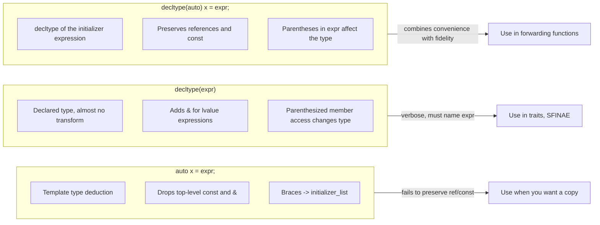

# auto and Type Deduction

> [!info] Scope
> This note covers `auto` (C++11), `decltype` (C++11), `decltype(auto)` (C++14), trailing return types (C++11), `auto` return types (C++14), forwarding references (`auto&&`), and the deduction rules Scott Meyers codified in *Effective Modern C++*. Cross-references: [[4. Move Semantics]], [[5. Perfect Forwarding]], [[8. constexpr and Compile-time Computation]].

## Why This Matters

Modern C++ codebases use `auto` everywhere. It is not syntactic sugar — it changes **what** the compiler knows about a variable and **how** that knowledge survives refactoring. The two questions a C++ engineer must always be able to answer are:

1. Given a declaration `auto x = expr;`, what is the type of `x`?
2. Given a declaration `decltype(expr) y = ...;`, what is the type of `y`?

The two answers are **not** the same. Mistakenly believing they are leads to silent copies of expensive objects, dangling references, and subtle template-instantiation bugs. This note exists so you can deduce the correct type by hand — without a compiler — every time.

Why `auto` is worth using even when the type name is short:

- **Refactoring safety**. Change a function's return type from `std::vector<int>` to `std::span<const int>` and every `const auto&` caller is correct automatically. Every explicit `const std::vector<int>&` caller is now wrong.
- **Avoids unintended conversions**. `auto x = some_unsigned_func();` keeps `x` unsigned. `int x = some_unsigned_func();` quietly slices.
- **Less typing, less noise**. `std::map<std::string, std::vector<int>>::const_iterator` becomes `auto`.
- **Required for lambdas and forwarding references**. You cannot spell the type of a lambda or a deduced `T&&` without `auto`/`decltype`.

> [!warning] Anti-pattern
> `auto x = obj;` always strips `const` and `&`. If `obj` is `const std::vector<int>&`, then `x` is `std::vector<int>` — a deep copy. Use `const auto&` for read-only references, `auto&` for mutating references, `auto` for sink copies, `auto&&` for forwarding references.

## Background

`auto` was a C keyword meaning "automatic storage duration" — the default for local variables since K&R C. In C++11, the keyword was repurposed (a "reserved for future use" trick that finally paid out) for **placeholder types**. C++14 extended `auto` to function return types and lambda parameters (generic lambdas). C++17 added `decltype(auto)` for non-type template arguments and structured bindings. C++20 added abbreviated function templates (`void f(auto x);` is shorthand for `template <class T> void f(T x);`).

Type deduction in C++ has **three distinct algorithms**:

1. **Template type deduction** — used by `template <typename T> void f(T x);` and, with identical rules, by `auto`.
2. **`decltype`** — used by `decltype(expr)` and, indirectly, by `decltype(auto)`.
3. **Individually-specified deduction** — e.g., `std::get<I>(tuple)` returns `tuple_element_t<I, T>`, not via `auto` rules.

Knowing (1) and (2) is enough to read 99% of modern C++ code.

## Main Content

### 1. Template Type Deduction (the algorithm `auto` uses)

Given a function template

```cpp
template <typename T>
void f(ParamType param);

f(expr);   // deduce T and ParamType from expr
```

The compiler pairs `expr`'s type with `ParamType` and solves for `T`. There are **three cases**, depending on the form of `ParamType`.

#### Case A: `ParamType` is a reference (or pointer), but not a universal reference

- If `expr`'s type is a reference, **ignore the reference part**.
- Then pattern-match `expr`'s type against `ParamType` to determine `T`.

```cpp
template <typename T>
void f(T& param);          // ParamType = T&

int x = 27;                // x   is int
const int cx = x;          // cx  is const int
const int& rx = x;         // rx  is const int&

f(x);                      // T = int,       param: int&
f(cx);                     // T = const int, param: const int&  <-- const-ness preserved
f(rx);                     // T = const int, param: const int&  <-- reference-ness ignored, const preserved
```

> [!tip] Mental model
> When `ParamType` is `T&`, the deduced `T` absorbs the `const` so that the resulting reference correctly references a `const` object. The reference-ness of `expr` is dropped because we are creating a *new* reference to the same object.

#### Case B: `ParamType` is a universal reference (`T&&`)

- If `expr` is an lvalue, both `T` and `ParamType` deduce to **lvalue reference** (this is the magic of reference collapsing — see [[5. Perfect Forwarding]]).
- If `expr` is an rvalue, the usual Case A rules apply.

```cpp
template <typename T>
void f(T&& param);         // universal reference

int x = 27;
const int cx = x;
const int& rx = x;

f(x);                      // x is lvalue  -> T = int&,  param: int& && -> int&
f(cx);                     // cx is lvalue -> T = const int&, param: const int&
f(rx);                     // rx is lvalue -> T = const int&, param: const int&
f(27);                     // 27 is rvalue -> T = int,  param: int&&
```

This is the *only* context where template type deduction deduces `T` to be a reference type.

#### Case C: `ParamType` is neither a pointer nor a reference (pass-by-value)

- If `expr`'s type is a reference, ignore the reference part.
- If, after that, `expr` is `const` (or `volatile`), **ignore that too**. By-value parameters are *copies*; const-ness of the source is irrelevant.

```cpp
template <typename T>
void f(T param);           // by value

const int cx = 27;
const int& rx = cx;

f(cx);                     // T = int, param: int       (const ignored)
f(rx);                     // T = int, param: int       (ref and const ignored)
```

There is a subtlety for **const pointers to const objects**:

```cpp
const char* const ptr = "Fun with pointers";   // ptr: const pointer to const char
f(ptr);                                        // by-value: T = const char*  (top-level const ignored)
                                               //             param: const char* (copy of the pointer)
```

Only the **top-level** `const` (on the pointer itself) is dropped. The **pointee** const survives because it is not top-level.

### 2. `auto` Uses the Template Rules (Almost Verbatim)

`auto x = expr;` is equivalent to:

```cpp
template <typename T>
void deduce(T param);     // ParamType = T (Case C, by value)
deduce(expr);
```

`auto& x = expr;` matches Case A. `auto&& x = expr;` matches Case B (it is a forwarding reference).

The four canonical examples:

```cpp
auto   x = 27;        // Case C: int
const auto& cx = x;   // Case A: const int&

auto&& uref1 = x;     // x is int lvalue       -> int&
auto&& uref2 = 27;    // 27 is int rvalue      -> int&&
auto&& uref3 = cx;    // cx is const int lvalue-> const int&
```

#### Array and function decay

When you write `auto some_array = my_array;`, the array-to-pointer decay happens just as it does in template deduction:

```cpp
const char name[] = "R. N. Briggs";   // name: const char[13]
auto arr1 = name;                      // arr1: const char*            <-- decayed
auto& arr2 = name;                     // arr2: const char (&)[13]     <-- reference, no decay
```

The same is true for functions:

```cpp
void some_func(int, double);

auto func1 = some_func;                // void (*)(int, double)        <-- decayed
auto& func2 = some_func;               // void (&)(int, double)        <-- reference, no decay
```

> [!tip] Trick
> To get the *real* declared type of an array or function (without decay), use `auto&` or `decltype`.

### 3. `auto` with Braced Initializers (the C++11→14 surprise)

In C++11, this code is **ill-formed**:

```cpp
auto x = { 11, 23, 9 };   // std::initializer_list<int>  (C++11 only)
auto y{ 10 };              // std::initializer_list<int>  (C++11 only)
auto z = 10;               // int                          (always)
```

C++14 changed the rule for **direct** braced initialization (`auto y{10};`) so that `y` is `int`. The `=` form (`auto x = {10};`) is still `std::initializer_list<int>`. This asymmetry is the most common porting gotcha between C++11 and C++14.

| Declaration           | C++11 | C++14+ |
|-----------------------|-------|--------|
| `auto x = 10;`        | int   | int    |
| `auto x = {10};`      | `initializer_list<int>` | `initializer_list<int>` |
| `auto x{10};`         | `initializer_list<int>` | **int** |
| `auto x{10, 20};`     | `initializer_list<int>` | ill-formed |
| `auto x = {10, 20};`  | `initializer_list<int>` | `initializer_list<int>` |

> [!danger] Subtle but common
> Template type deduction **never** deduces `std::initializer_list<T>`, but `auto` deduction **does** when the initializer is braced. That is a deliberate carve-out, and the cause of much confusion.

### 4. `decltype`

`decltype(expr)` yields the **declared type** of `expr` with essentially no transformation. The rules are simpler than `auto`:

- If `expr` is an unparenthesized name or class member access, `decltype` gives the type as declared.
- If `expr` is any other lvalue expression, `decltype` yields `T&` (lvalue reference).
- If `expr` is an xvalue, `decltype` yields `T&&`.
- If `expr` is a prvalue, `decltype` yields `T`.

```cpp
int x = 27;              // decltype(x)  -> int
const int& cx = x;       // decltype(cx) -> const int&

struct Widget { int m; };
Widget w;
decltype(w.m)  a;        // int      (unparenthesized member access)
decltype((w.m)) b = x;   // int&     (parenthesized -> lvalue expr -> T&)
```

> [!warning] Parenthesis trap
> `decltype(x)` and `decltype((x))` are different. The parenthesized form is an *lvalue expression*, so it adds `&`. Inside `decltype(auto)`, the same rule applies — this is one of the most common sources of dangling-reference bugs in `decltype(auto)` return types.

### 5. `decltype(auto)` (C++14)

`decltype(auto)` combines the convenience of `auto` (no need to spell the type) with the strict semantics of `decltype` (preserves references and `const`).

```cpp
template <typename Container, typename Index>
decltype(auto) at(Container&& c, Index i) {
    return std::forward<Container>(c)[i];
}
```

If `c` is `std::vector<int>`, then `c[i]` is `int&`, and `decltype(auto)` correctly returns `int&`. With plain `auto`, the function would return `int` — a copy — silently breaking mutating access (`at(v, 0) = 42;` would not compile).

Use `decltype(auto)` for:

- **Forwarding functions** that must preserve the exact value category and constness of their argument's expression.
- **Function return types** where you want `decltype` semantics but want to avoid naming the type twice.

Avoid `decltype(auto)` for:

- **Public APIs** where you want a stable, explicit contract.
- **Member function return types** in classes designed for ABI stability — small changes to the returned expression can silently change the type and the ABI.

### 6. `auto` Return Types (C++14)

```cpp
// C++11: must use trailing return type
auto f(int x) -> int { return x * 2; }

// C++14: let the compiler deduce
auto g(int x) { return x * 2; }    // returns int
```

Rules for `auto` return types:

- Deduction uses **template type deduction** rules. Multiple `return` statements must deduce the **same** type (after `decay` and array/function conversion).
- You **cannot** return a braced-init list from an `auto` function — there is no `std::initializer_list` deduction in template rules.
- `decltype(auto)` return type applies `decltype` rules instead.

```cpp
auto      foo() { int x = 0; return x; }   // int
decltype(auto) bar() { int x = 0; return (x); }  // int&  -> DANGLING!
```

> [!danger] Dangling reference
> `decltype(auto) bar() { int x = 0; return (x); }` returns `int&` to a destroyed local. The parentheses make `x` an lvalue expression, so `decltype(auto)` yields `int&`. This is the textbook bug.

### 7. Trailing Return Types (C++11)

```cpp
template <typename T, typename U>
auto add(T t, U u) -> decltype(t + u) { return t + u; }
```

The trailing return type lets you reference parameter names (`t`, `u`) in the return type — impossible in a leading return type because the parameters are not yet declared. In C++14+ this is mostly replaced by `auto` or `decltype(auto)`, but trailing return types are still preferred for:

- **Public APIs** where the contract should be explicit.
- **SFINAE-friendly** signatures where the trailing return type participates in overload resolution.
- **Member functions** in header files where you want readability.

### 8. `auto&&` — the Forwarding Reference

```cpp
auto&& x = some_expr;
```

Just like `T&&` in a template, `auto&&` is a **forwarding reference**, not an rvalue reference. Whether it deduces to `T&` or `T&&` depends on whether `some_expr` is an lvalue or rvalue. This is the correct default for:

- Variables that **forward** to another function (e.g., inside macros or wrappers).
- Lambda init-captures that capture by forwarding: `[x = std::move(obj)] {}`.

For ordinary code, prefer `const auto&` (read-only) or `auto` (sink copy).

### 9. Scott Meyers' "Effective Modern C++" Rules (condensed)

1. **`auto` prefers template type deduction rules**, with the special-case carve-out for braced initializers (deduces `std::initializer_list<T>`).
2. **`decltype` rarely does what template deduction does** — it preserves references and const; it adds `&` for lvalue expressions; it never strips.
3. **`decltype(auto)` is `decltype` of the initializer expression**, but written with `auto` syntax.
4. **`auto&&` is a forwarding reference**, not an rvalue reference, in *deduced* contexts only. In a non-deduced context (`void f(int&& x)`), `&&` is a true rvalue reference.
5. **`auto` in a function signature can be `auto`, `auto&`, `const auto&`, `auto&&`, `decltype(auto)`, or `decltype(auto)&`** — each says something different about the value category of the return.
6. **Always spell `const auto&` for read-only iteration over containers**. `auto` would copy, and copying a `std::vector<std::string>` is expensive.
7. **`auto` on a function returning `std::vector<bool>::reference`** will store a dangling proxy reference. See the common pitfalls below.

### 10. When NOT to Use `auto`

- **When the deduced type is non-obvious and correctness-critical.** `auto result = compute();` — what is `result`? An `int`? A `double`? A `std::expected<int, Error>`? Spell the type when it is part of the API contract.
- **When you want a specific type that may differ from the deduced one.** `double d = compute();` forces a conversion; `auto d = compute();` does not.
- **When the deduced type is a proxy reference** (e.g., `std::vector<bool>::reference`, `std::bitset<N>::reference`). The proxy may not outlive the temporary. `bool b = vec[0];` is safe; `auto b = vec[0];` is a dangling-proxy bug.
- **In public headers** where ABI stability matters: changing the deduced return type by editing the body of a function changes the ABI silently.

## Mermaid Diagrams

### Type Deduction Decision Tree

```mermaid
flowchart TD
    A["declaration: auto x = expr;"] --> B{"ParamType form?"}
    B -->|"by-value: auto x = ..."| C["Drop top-level cv-qualifiers and references<br/>(array/function decay)"]
    B -->|"auto& or const auto&"| D["Keep const, ignore outer ref of expr<br/>(Case A)"]
    B -->|"auto&&"| E{"Is expr an lvalue?"}
    E -->|"yes"| F["T = T&, param = T& (reference collapsing)"]
    E -->|"no"| G["T = T,  param = T&& (Case A on rvalue)"]
    C --> H{"Is initializer braced?"}
    H -->|"yes, = {a, b, ...}"| I["T = std::initializer_list<element>"]
    H -->|"yes, single {a} (C++14+)"| J["T = element type"]
    H -->|"yes, single {a} (C++11)"| I]
    H -->|"no, normal ="| K["T = decayed type of expr"]
    D --> L["T absorbs const; param is a reference to the source"]
    F --> M["Universal reference: lvalue->lvalue ref, rvalue->rvalue ref"]
    G --> N["Rvalue bound to T&&"]
```

### `auto` vs `decltype` vs `decltype(auto)` Comparison



## Code Examples

### Example 1: the canonical `const auto&` loop

```cpp
#include <vector>
#include <string>

std::vector<std::string> load_strings();

void print_all(const std::vector<std::string>& v) {
    // BAD: deep-copies each std::string
    // for (auto s : v) std::cout << s;

    // GOOD: read-only reference, no copy
    for (const auto& s : v) {
        std::cout << s << '\n';
    }
}

void uppercase_all(std::vector<std::string>& v) {
    // GOOD: mutating reference
    for (auto& s : v) {
        for (auto& ch : s) ch = std::toupper(static_cast<unsigned char>(ch));
    }
}
```

### Example 2: refactoring safety

```cpp
struct User { std::string name; int id; };

// Version 1
std::vector<User> get_users();
auto u = get_users();                      // std::vector<User>

// Version 2 (we refactor to return a span)
std::span<const User> get_users() const;   // ABI change
auto u = get_users();                      // std::span<const User>  <-- callers unchanged
```

### Example 3: `decltype(auto)` for a forwarding accessor

```cpp
#include <vector>
#include <utility>

template <typename Container, typename Index>
decltype(auto) at(Container&& c, Index i) {
    return std::forward<Container>(c)[i];
}

void use() {
    std::vector<int> v{10, 20, 30};
    at(v, 1) = 42;              // mutates v[1] to 42
    const std::vector<int> cv{1, 2, 3};
    int n = at(cv, 0);          // n = 1, cannot mutate
}
```

### Example 4: dangling `decltype(auto)`

```cpp
decltype(auto) dangling() {
    int local = 42;
    return (local);             // decltype((local)) is int&  -> dangling reference
}

auto safe() {
    int local = 42;
    return local;               // int, by value
}
```

### Example 5: `auto&&` as a forwarding reference

```cpp
#include <utility>
#include <vector>

template <typename F, typename... Args>
decltype(auto) instrument(F&& f, Args&&... args) {
    auto&& call = std::forward<F>(f);   // forwarding reference
    return std::forward<decltype(call)>(call)(std::forward<Args>(args)...);
}
```

### Example 6: the `std::vector<bool>` proxy trap

```cpp
#include <vector>

void bad() {
    std::vector<bool> v{true, false, true};
    auto x = v[0];        // std::vector<bool>::reference -> DANGLING after statement end
    bool y = v[0];        // bool, materialised copy -> safe
}

struct BitRef {
    std::vector<bool>::reference ref;   // ALSO DANGEROUS: stores a proxy
    BitRef(std::vector<bool>& v, std::size_t i) : ref(v[i]) {}
};
```

### Example 7: trailing return type for SFINAE

```cpp
#include <type_traits>

template <typename T>
auto size(const T& t) -> decltype(t.size()) {   // SFINAE-friendly
    return t.size();
}

// Equivalent in C++14+, but SFINAE on the body, not signature:
template <typename T>
auto size2(const T& t) { return t.size(); }    // C++23 fixes this with explicit this
```

## Common Pitfalls

1. **`auto x = obj;` silently copies**. For containers and strings, this is a performance bug. Default to `const auto&`.

2. **`auto` strips `const`**. `const std::vector<int> v; auto x = v;` makes a mutable copy. Use `const auto&`.

3. **`auto` and braced-init-list interaction**. `auto x{1};` is `int` in C++14+ but `std::initializer_list<int>` in C++11. Mixing the two standards is dangerous.

4. **`auto` with proxy types**. `std::vector<bool>`, `std::bitset<N>`, and Eigen expression templates all return proxies. `auto` stores the proxy, which may dangle. Spell the destination type.

5. **`decltype((x))` vs `decltype(x)`**. The parenthesized form yields a reference type. Inside `decltype(auto)`, this creates a dangling reference.

6. **`auto&&` is not an rvalue reference**. It is a forwarding reference in deduced contexts. Mistaking it for `T&&` leads to bugs in non-template code.

7. **Multiple returns with different types**. `auto f() { if (cond) return 1; return 2.0; }` is ill-formed — `int` and `double` do not deduce to the same type. Use a trailing return type or `decltype(auto)` with a single canonical return.

8. **`auto` in function pointers and `std::function`**. You cannot declare `std::function<auto(int)>`. Use a concrete signature.

9. **Abbreviated function templates are not regular templates for ADL**. `void f(auto x);` is `template <class T> void f(T x);` for deduction, but some ADL/SFINAE behaviour differs. Be cautious in generic library code.

10. **`auto` in structured bindings can surprise**. `auto [a, b] = pair;` *copies* the pair; `auto& [a, b] = pair;` binds a reference. See [[2. Range-based for and Structured Bindings]].

## Tips and Tricks

- **Use `const auto&` as the default** for read-only iteration. Reserve `auto` for sink copies and `auto&` for mutation.
- **Use `auto&&` only in forwarding contexts** — never for ordinary local variables where you cannot explain *why* it is a forwarding reference.
- **`decltype(auto)` is the right return type for forwarding wrappers**. It preserves value category and const.
- **Mark `auto` return types `noexcept`** when applicable; the compiler cannot infer `noexcept` from the body.
- **`auto` in `for`-loops over maps** — `for (const auto& [k, v] : map)` is the canonical modern form (see [[2. Range-based for and Structured Bindings]]).
- **Use `std::decay_t<decltype(expr)>`** to get the *stripped* type when you need it explicitly (e.g., for `static_assert` or trait instantiation).
- **Use `decltype` for variable templates** and trait aliases — `using value_type = decltype(container)::value_type;` is concise.
- **Combine `auto` with structured bindings** to decompose return values: `auto [iter, inserted] = m.try_emplace(k, v);`.
- **Use `[[nodiscard]] auto`** to mark return-value-ignoring callers as warnings.
- **Avoid `auto` for integer literals with surprising types**. `auto i = 0;` is `int`; `auto i = 0u;` is `unsigned int`; `auto i = 0ull;` is `unsigned long long`. Pick the literal suffix intentionally.

## Active Recall

1. Given `const std::vector<int> v;`, what is the type of `auto x = v;`? Of `const auto& y = v;`?
2. Given `int x = 5;`, what is `decltype(x)`? What is `decltype((x))`?
3. Why does `auto x = {1, 2, 3};` compile but `template <typename T> void f(T); f({1,2,3});` not?
4. What is the type of `auto&& r = std::vector<int>{};`? Of `auto&& r = some_lvalue;`?
5. In `decltype(auto) f() { int x = 0; return (x); }`, what is the return type? Why is it a bug?
6. Explain the three cases of template type deduction (reference, universal reference, by-value) with one example each.
7. Why does `auto x = vec[0];` dangle when `vec` is `std::vector<bool>`?
8. What is the difference between `auto f() -> int` and `auto f()` returning `int` in C++14?
9. When is `auto&&` a forwarding reference, and when is it an rvalue reference?
10. Name three reasons `auto` is preferred over an explicit type in modern C++ codebases, and one reason it is **not** preferred.

## Next Steps

- Continue to [[2. Range-based for and Structured Bindings]] — `auto` is the foundation for `auto [a, b] = ...` and `for (auto& x : container)`.
- See [[4. Move Semantics]] for `auto&&` in the context of rvalue references and value categories.
- See [[5. Perfect Forwarding]] for `auto&&` as a forwarding reference and the reference-collapsing rules.
- See [[6. Lambdas Deep Dive]] for `auto` parameters in generic lambdas (`[](auto x) {}`).
- See [[8. constexpr and Compile-time Computation]] for `constexpr auto` constants.
- Cross-chapter: [[10. Templates]] (eventual) for the template deduction algorithm in full; [[11. STL Containers]] for the iteration idioms used in practice.
