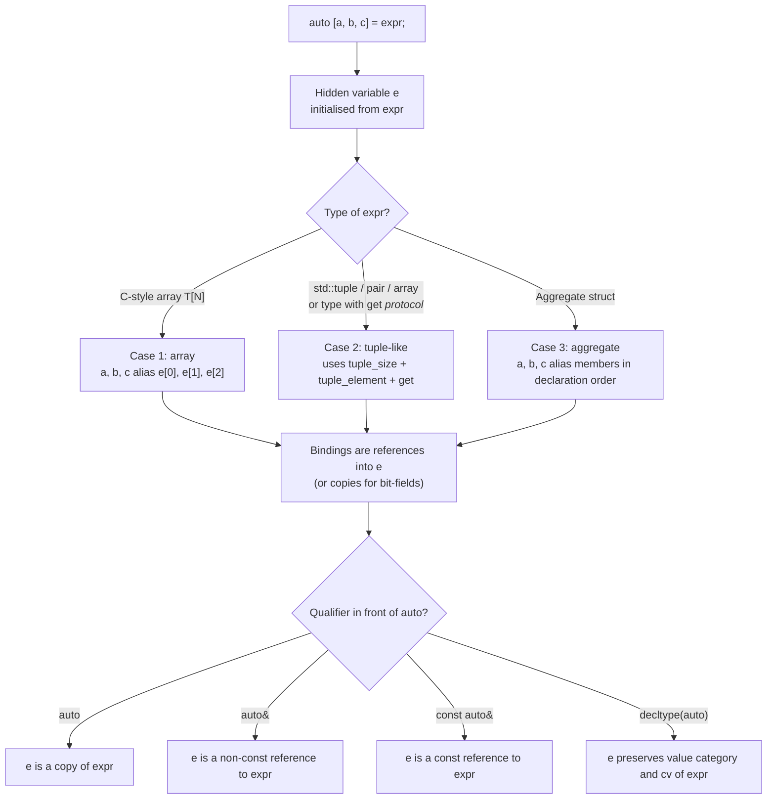
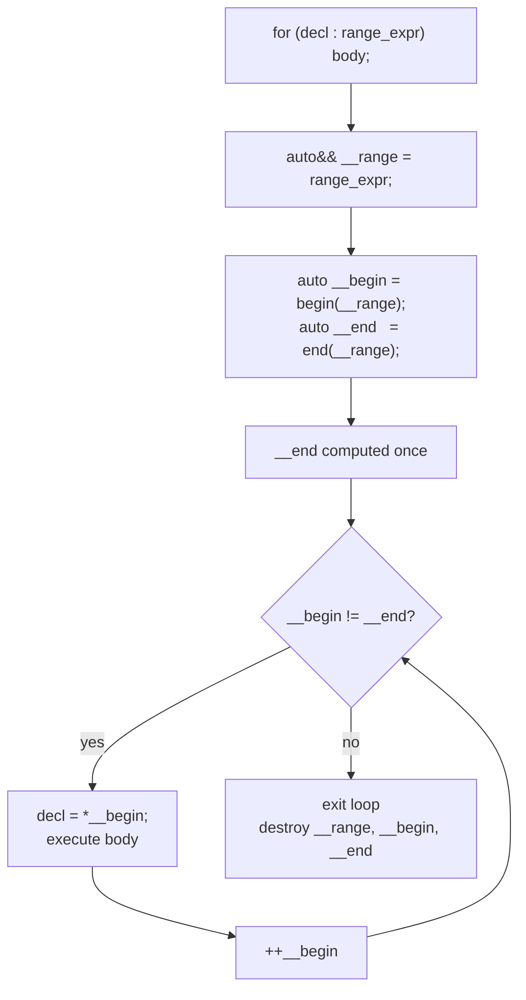

# Range-based for and Structured Bindings

> [!info] Scope
> Covers the range-based `for` loop (C++11), the init-statement form (C++20), structured bindings for tuples/pairs/arrays/aggregate structs and `get<N>` protocol (C++17), and the `std::tuple`-like customization point for user-defined types. Cross-references: [[1. auto and Type Deduction]], [[6. Lambdas Deep Dive]], [[7. std optional, std variant, std any]].

## Why This Matters

The two most common operations on collections are: **iterate**, and **decompose a multi-part value into named pieces**. Pre-C++11 C++ made both awkward. Range-based `for` removed the iterator boilerplate (`begin()`/`end()`/`++`/`*`); structured bindings removed the `std::get<0>`/`std::get<1>`/`.first`/`.second` boilerplate for tuples and pairs.

Together they make modern C++ loops read almost like Python:

```cpp
for (const auto& [key, value] : my_map) {
    std::cout << key << " -> " << value << '\n';
}
```

This single line replaces ~6 lines of pre-C++17 code, *and* it is correct by construction: no chance of using the wrong iterator, no chance of misreading `.first` as `.second`, no chance of dangling references if the loop variable is `const auto&`.

Why mastery matters:

- **Correctness**: the `auto&` vs `const auto&` vs `auto` choice in a range-for is the difference between mutation, read-only reference, and silent copy. Picking wrong is a common bug.
- **Performance**: structured bindings on a returned `std::pair` can move the elements, avoiding copies that `.first`/`.second` access patterns cannot avoid.
- **Readability**: the `[a, b, c]` form makes intent obvious. `auto p = f(); use(p.first, p.second, p.third);` does not.
- **API design**: a function returning `std::tuple` is now ergonomic enough to be a real alternative to out-parameters. This changes how you design interfaces.

## Background

### Range-based for (C++11)

The C++11 range-based for loop

```cpp
for (decl : range_expr) body;
```

is *exactly* equivalent to:

```cpp
{
    auto&& __range = range_expr;
    auto __begin = __range.begin();   // or begin(__range) via ADL
    auto __end   = __range.end();     // or end(__range) via ADL
    for (; __begin != __end; ++__begin) {
        decl = *__begin;
        body;
    }
}
```

Two consequences follow:

1. **`__end` is computed once**. The loop does not re-evaluate `range_expr` or call `.end()` again. This means mutating the container size during iteration is undefined behaviour (the cached `__end` is now stale).
2. **`auto&&` is used for the range**, which is a forwarding reference. This means range-for can bind to rvalue temporary containers without copying them.

### C++20 init-statement and range-for

C++20 added an optional init-statement (mirroring `if (init; cond)`):

```cpp
for (auto&& r = get_range(); auto& x : r) { /* ... */ }
```

This keeps the temporary alive for the duration of the loop — essential when the range expression returns a container by value and you want to iterate by reference into it.

### Structured bindings (C++17)

```cpp
auto [a, b, c] = expr;   // decomposition declaration
```

The compiler introduces a *hidden* variable `e` initialised from `expr`, then declares `a`, `b`, `c` as references (or copies, in the by-value case) to the *elements* of `e`. Three cases are handled by the language:

1. **Case 1: array**. `e` is the array (or copy), and the bindings are the elements.
2. **Case 2: tuple-like type** (`std::tuple`, `std::pair`, `std::array`). The compiler uses `std::tuple_size<E>::value` to count the elements, `std::tuple_element<I, E>::type` to get the element type, and either `get<I>(e)` (member) or `get<I>(e)` (ADL free function) to access them.
3. **Case 3: aggregate**. Every public non-static data member is exposed as a binding, in declaration order. All members must be accessible (no `private`/`protected`) and the class must have no base classes, no user-declared constructors, etc. (the C++17 definition of aggregate).

C++20 relaxed Case 3: it added support for static members, bit-fields (with caveats), and base classes; C++26 may loosen further. This note targets C++17/20 behaviour.

## Main Content

### 1. Range-based for — the Five Forms

The "decl" in `for (decl : range)` chooses the access mode. Five forms cover ~99% of real code:

```cpp
std::vector<std::string> v = get_strings();

for (auto x : v)              {}  // 1. copy each element
for (auto& x : v)             {}  // 2. mutate each element
for (const auto& x : v)       {}  // 3. read-only reference (recommended default)
for (auto&& x : v)            {}  // 4. forwarding reference (rarely needed for plain containers)
for (const auto x : v)        {}  // 5. read-only copy (useful for cheap-to-copy types like int)
```

#### Decision table

| Form               | Cost      | Use case                                                  |
|--------------------|-----------|-----------------------------------------------------------|
| `auto x`           | copy      | Cheap-to-copy types (`int`, `float`), and you want a local copy |
| `auto& x`          | ref       | Mutating elements in place                                |
| `const auto& x`    | ref       | Read-only iteration over expensive-to-copy types          |
| `auto&& x`         | fwd-ref   | Generic code, perfect forwarding into the body            |
| `const auto x`     | copy      | Read-only loop over cheap types where you want a snapshot |

> [!tip] Rule of thumb
> Default to `const auto&`. Use `auto&` only when you mutate. Use `auto` only when the element type is cheap to copy and you want a local that you can move out of (e.g., to feed a sink function).

### 2. Range-based for over `std::map`

`std::map<K, V>` iterates as `std::pair<const K, V>`. Before C++17:

```cpp
for (const auto& kv : my_map) {
    std::cout << kv.first << " -> " << kv.second << '\n';
}
```

After C++17:

```cpp
for (const auto& [key, value] : my_map) {
    std::cout << key << " -> " << value << '\n';
}
```

> [!warning] Constness of the key
> `std::map<K, V>::value_type` is `std::pair<const K, V>`. The key is always `const` because changing it would break the BST invariant. In `auto& [key, value] = *it;`, `key` has type `const K&`, so `key = ...` is a compile error — by design. Use `auto& [key, value]` to mutate the value but not the key.

### 3. Range-based for with the C++20 init-statement

```cpp
// PROBLEM: temporary returned each call, range_expr is evaluated once but the
// returned object is an rvalue that the loop extends to its end.
for (const auto& s : make_vector_of_strings()) { /* OK */ }   // lifetime-extending

// PROBLEM: returning a container of views into a temporary
for (const auto& sv : split(get_some_string(), ',')) {
    // sv is a string_view into get_some_string(), which has been destroyed
    // already by the time we iterate
}

// SOLUTION (C++20): bind the source string in the init-statement
for (auto src = get_some_string(); const auto& sv : split(src, ',')) {
    std::cout << sv << '\n';   // sv views src, which is alive for the whole loop
}
```

> [!danger] Lifetime-extension caveat
> Range-for extends the lifetime of a temporary *in the range expression itself*, but it does **not** extend the lifetime of temporaries returned by a function called inside the loop body. If `split()` returns `std::vector<std::string_view>` referring to a `std::string` argument that has already been destroyed, you get a dangling view. Use the init-statement form to keep the source alive.

### 4. Structured Bindings — Case 1: arrays

```cpp
int arr[3] = {1, 2, 3};
auto [a, b, c] = arr;             // a, b, c are int (copies of arr[0], arr[1], arr[2])
auto& [x, y, z] = arr;            // x, y, z are int&  (references into arr)
x = 99;                           // arr[0] is now 99
```

C-style arrays decay in many contexts, but structured bindings **do not** decay — they preserve the element type exactly.

```cpp
const char name[] = "Briggs";           // const char[7]
auto [c0, c1, c2, c3, c4, c5, c6] = name;   // c0..c6 are const char copies
```

### 5. Structured Bindings — Case 2: tuple-like types

The protocol is:

- `std::tuple_size<E>::value` — number of elements.
- `std::tuple_element<I, E>::type` — type of the Ith element.
- `get<I>(e)` — member or ADL free function returning the element.

`std::tuple`, `std::pair`, `std::array` satisfy this out of the box.

```cpp
#include <tuple>
#include <utility>
#include <array>

std::pair p{1, 3.14};
auto [i, d] = p;                  // i = 1 (int), d = 3.14 (double)

std::tuple t{1, 2.5, "hello"s};
auto [a, b, c] = t;               // a=int, b=double, c=std::string

std::array<int, 3> arr{10, 20, 30};
auto [x, y, z] = arr;             // x=10, y=20, z=30
```

#### User-defined types via the `get<I>` protocol

You can opt your own type into structured bindings by providing `std::tuple_size`, `std::tuple_element` specializations and a `get<I>` function (found by ADL):

```cpp
#include <tuple>
#include <utility>

struct Point3 {
    double x_, y_, z_;
    template <std::size_t I>
    friend decltype(auto) get(const Point3& p) {
        if constexpr (I == 0) return p.x_;
        else if constexpr (I == 1) return p.y_;
        else return p.z_;
    }
};

namespace std {
    template <> struct tuple_size<Point3> : integral_constant<size_t, 3> {};
    template <size_t I> struct tuple_element<I, Point3> { using type = double; };
}

void use() {
    Point3 p{1, 2, 3};
    auto [x, y, z] = p;   // works!
}
```

This is the same protocol `std::tuple` uses internally. The downside is verbosity; the upside is full control over what gets exposed.

### 6. Structured Bindings — Case 3: aggregates

For aggregate structs, the compiler exposes every public non-static data member in declaration order. No `get<I>` boilerplate needed.

```cpp
struct Color { unsigned char r, g, b; };

Color c{255, 128, 0};
auto [r, g, b] = c;       // r=255, g=128, b=0
auto& [rr, gg, bb] = c;
rr = 0;                   // c.r is now 0
```

C++17 requirements for Case 3 (loosened in C++20):

- No user-provided, explicit, or inherited constructors.
- No private or protected non-static data members.
- No base classes (C++17) — base classes allowed in C++20.
- No virtual functions.

```cpp
struct Mixed {                       // C++20 aggregate
    int a;
    struct { int b; int c; };        // anonymous member, OK in C++20
};
Mixed m{1, {2, 3}};
auto [a, b, c] = m;                  // a=1, b=2, c=3
```

### 7. `get<N>` vs Structured Bindings

Before C++17, accessing tuple elements meant:

```cpp
auto t = std::make_tuple(1, 2.5, "hello"s);
int    a = std::get<0>(t);
double b = std::get<1>(t);
auto   c = std::get<2>(t);
```

Or by type (only if unique):

```cpp
int    a = std::get<int>(t);
double b = std::get<double>(t);
```

After C++17, structured bindings replace `get<I>` for the common case of "decompose everything". But `get<I>` is still useful:

- **Accessing one element** without binding the others.
- **Accessing by type** when types are unique in the tuple.
- **Customization** inside `if constexpr` branches.

```cpp
auto t = std::make_tuple(1, 2.5, "hello"s);

// Single access:
auto first = std::get<0>(t);

// Conditional access in a template:
template <typename T>
void print_first(const T& t) {
    if constexpr (std::tuple_size_v<T> > 0) {
        std::cout << std::get<0>(t) << '\n';
    }
}
```

### 8. Binding with `auto`, `auto&`, `const auto&`, `decltype(auto)`

The choice of `auto` qualifier affects the **hidden variable `e`**, not the bindings directly. The bindings are then declared as references (or copies) into `e`:

```cpp
std::pair p{std::string("hello"), 42};

auto         [a, b] = p;            // e is a copy of p; a, b are references into e
auto&        [c, d] = p;            // e is a reference to p;  c, d are references into p
const auto&  [e, f] = p;            // e is const ref to p;    e, f are const references into p
decltype(auto) [g, h] = p;          // e is std::pair<std::string, int>& (preserves everything)
```

> [!warning] `auto [a, b] = expr;` copies `expr`
> The hidden variable `e` is initialised from `expr` *by copy* in the `auto [a, b] = expr;` form. If `expr` is a `std::pair<std::string, int>`, you pay one `std::string` copy. For move semantics, write `auto [a, b] = std::move(expr);` — this move-constructs `e`, then the bindings alias into `e`. The bindings themselves are always references into `e` (except for bit-fields).

### 9. Structured bindings in `if` and `while` (C++17)

```cpp
if (auto [it, inserted] = m.try_emplace(key, value); inserted) {
    std::cout << "new element: " << it->second << '\n';
} else {
    std::cout << "already present: " << it->second << '\n';
}
```

This idiom replaces the older two-line form:

```cpp
auto result = m.try_emplace(key, value);
if (result.second) { /* ... */ } else { /* ... */ }
```

…and it scopes `it` and `inserted` to the `if`, so they do not leak.

### 10. Range-based for with structured bindings over a map

The canonical modern C++ map iteration:

```cpp
std::map<std::string, int> scores = load_scores();

// Read-only:
for (const auto& [name, score] : scores) {
    std::cout << name << ": " << score << '\n';
}

// Mutate values (NOT keys — they are const):
for (auto& [name, score] : scores) {
    score += bonus_for(name);
}

// Erase filtered entries (C++20):
for (auto it = scores.begin(); it != scores.end(); ) {
    if (it->second < 0) it = scores.erase(it);
    else                ++it;
}
// (Range-for cannot erase; you must use the iterator form.)
```

> [!danger] Erasing inside range-for is UB
> `for (auto& [k, v] : m) if (cond) m.erase(k);` is undefined behaviour — erasing invalidates the cached `__end` and the current iterator. Use the iterator-erase idiom, or `std::erase_if(m, pred);` (C++20).

### 11. Generic loops with `auto&&` and perfect forwarding

```cpp
template <typename Range, typename F>
void for_each(Range&& r, F&& f) {
    for (auto&& x : std::forward<Range>(r)) {
        std::forward<F>(f)(std::forward<decltype(x)>(x));
    }
}
```

`auto&&` here is a forwarding reference (see [[1. auto and Type Deduction]] and [[5. Perfect Forwarding]]) — it correctly handles both lvalue and rvalue containers, and both lvalue and rvalue elements.

## Mermaid Diagrams

### Structured Bindings — Binding Targets



### Range-based for Loop Expansion



## Code Examples

### Example 1: every form of range-for in one program

```cpp
#include <vector>
#include <string>
#include <map>
#include <iostream>

int main() {
    std::vector<std::string> v{"alpha", "beta", "gamma"};

    // 1. Copy each element (expensive for std::string)
    for (auto s : v) std::cout << s << ' ';
    std::cout << '\n';

    // 2. Mutate each element
    for (auto& s : v) s += "!";

    // 3. Read-only reference (recommended)
    for (const auto& s : v) std::cout << s << ' ';
    std::cout << '\n';

    // 4. Forwarding reference (rare; useful in generic code)
    for (auto&& s : v) std::cout << s.size() << ' ';
    std::cout << '\n';

    // 5. Map iteration with structured bindings (C++17)
    std::map<std::string, int> m{{"a", 1}, {"b", 2}, {"c", 3}};
    for (const auto& [k, v] : m) std::cout << k << '=' << v << ' ';
    std::cout << '\n';

    return 0;
}
```

### Example 2: C++20 init-statement saves a string from dangling

```cpp
#include <string>
#include <vector>
#include <string_view>
#include <sstream>

std::vector<std::string_view> split(const std::string& s, char delim) {
    std::vector<std::string_view> out;
    auto start = s.begin();
    for (auto it = s.begin(); it != s.end(); ++it) {
        if (*it == delim) {
            out.emplace_back(&*start, it - start);
            start = it + 1;
        }
    }
    out.emplace_back(&*start, s.end() - start);
    return out;
}

// BAD: string is a temporary, views dangle
void bad() {
    for (const auto& sv : split(std::string("a,b,c"), ',')) {
        std::cout << sv << '\n';   // UB: sv points into destroyed std::string
    }
}

// GOOD: source alive for whole loop
void good() {
    for (auto src = std::string("a,b,c"); const auto& sv : split(src, ',')) {
        std::cout << sv << '\n';   // OK
    }
}
```

### Example 3: structured bindings for a tuple

```cpp
#include <tuple>
#include <string>
#include <iostream>

std::tuple<int, double, std::string> make_record() {
    return {42, 3.14, "hello"};
}

int main() {
    auto [id, score, name] = make_record();
    std::cout << id << ' ' << score << ' ' << name << '\n';

    // Moving out of a returned tuple:
    auto [i2, d2, s2] = make_record();   // copy
    auto [i3, d3, s3] = std::move(make_record());  // wait — move a prvalue, no-op
    // Better: store then move
    auto rec = make_record();
    auto [im, dm, sm] = std::move(rec);  // s2 is move-constructed into the hidden e
    return 0;
}
```

### Example 4: structured bindings for an aggregate

```cpp
struct RGB { unsigned char r, g, b; };

RGB to_rgb(unsigned int hex) {
    return {
        static_cast<unsigned char>((hex >> 16) & 0xFF),
        static_cast<unsigned char>((hex >> 8) & 0xFF),
        static_cast<unsigned char>(hex & 0xFF)
    };
}

void print(RGB c) {
    auto [r, g, b] = c;
    std::cout << (int)r << ',' << (int)g << ',' << (int)b << '\n';
}
```

### Example 5: structured bindings with `try_emplace` and `if`

```cpp
#include <map>
#include <string>
#include <iostream>

int main() {
    std::map<std::string, int> cache;

    if (auto [it, inserted] = cache.try_emplace("alpha", 1); inserted) {
        std::cout << "inserted alpha = " << it->second << '\n';
    }

    if (auto [it2, inserted2] = cache.try_emplace("alpha", 99); !inserted2) {
        std::cout << "alpha already there, value = " << it2->second << '\n';
    }

    return 0;
}
```

### Example 6: user-defined type with `get<I>` protocol

```cpp
#include <tuple>
#include <cstddef>
#include <utility>

struct Vec3 {
    float x, y, z;
    template <std::size_t I>
    friend float& get(Vec3& v) {
        if constexpr (I == 0) return v.x;
        else if constexpr (I == 1) return v.y;
        else return v.z;
    }
    template <std::size_t I>
    friend const float& get(const Vec3& v) {
        if constexpr (I == 0) return v.x;
        else if constexpr (I == 1) return v.y;
        else return v.z;
    }
};

namespace std {
    template <> struct tuple_size<Vec3> : std::integral_constant<std::size_t, 3> {};
    template <std::size_t I> struct tuple_element<I, Vec3> { using type = float; };
}

int main() {
    Vec3 v{1, 2, 3};
    auto& [a, b, c] = v;
    a = 10; b = 20; c = 30;       // mutates v in place
    auto [x, y, z] = v;            // copies: x=10, y=20, z=30
    return 0;
}
```

## Common Pitfalls

1. **`auto x : container` copies every element**. For `std::vector<std::string>`, that is a heap allocation per iteration. Use `const auto&` unless the element is cheap.

2. **`auto& [key, value] : my_map` lets you mutate `value` but not `key`**. The key is `const` because `map`'s `value_type` is `pair<const K, V>`. Mutating the key would break the BST.

3. **Erasing during range-for is UB**. The cached `__end` becomes stale. Use `std::erase_if(c, pred);` (C++20) or the iterator-erase idiom.

4. **Range-for over a temporary that returns views into another temporary**. `for (auto sv : split(std::string(...), ','))` dangles. Use the C++20 init-statement to bind the source.

5. **`auto [a, b] = expr;` always copies `expr`** into the hidden `e`. For move-only types or expensive types, use `auto [a, b] = std::move(expr);` or `auto& [a, b] = expr;`.

6. **Structured bindings on aggregate require aggregate**. If your struct has a user-declared constructor, base class (pre-C++20), private member, or virtual function, Case 3 does not apply. Use Case 2 (the `get<I>` protocol) instead.

7. **Mismatched binding count**. `auto [a, b] = std::make_tuple(1, 2, 3);` is ill-formed. The number of bindings must equal `tuple_size<E>::value`.

8. **Cannot use structured bindings in some contexts**. They are not allowed in `static_assert`, in non-type template arguments (pre-C++20), or in lambda capture lists (pre-C++20).

9. **Lifetime of the hidden `e`**. `e` lives until the end of the enclosing block, not just the line. So `auto [a, b] = f(); use(a); use(b);` is fine even if `f()`'s return value is destroyed.

10. **Range-for over `std::vector<bool>`**. The proxy reference type means `for (auto& x : vec_bool)` does not compile. Use `for (auto x : vec_bool)` (copy) or `for (auto&& x : vec_bool)`.

## Tips and Tricks

- **Default to `const auto&`** for read-only iteration. It works for every STL container, every map, every array.
- **Use the C++20 init-statement** whenever your range expression returns views into a temporary.
- **Use `std::erase_if`** (C++20) instead of the iterator-erase idiom for filter-and-erase loops.
- **Use `if (auto [it, ok] = m.try_emplace(k, v); ok)`** to make intent explicit and avoid leaking iterators.
- **Move into structured bindings**: `auto [a, b] = std::move(pair);` move-constructs the hidden `e`, then the bindings alias into it.
- **Combine with `decltype(auto)`** in generic forwarding: `decltype(auto) [a, b] = std::forward<T>(expr);` preserves value category.
- **Use Case 2 (`get<I>` protocol) for stable ABI**: if your struct's layout might change, expose only specific fields via `get<I>` so callers cannot accidentally depend on field order.
- **Range-for with `std::views` (C++20)**: `for (auto x : vec | std::views::filter(pred) | std::views::transform(f))` works directly. See [[9. C++20 and C++23 New Features]].
- **Use `std::span`** for function parameters so callers can pass any contiguous range — `for (auto& x : span)` works uniformly.
- **Beware `std::vector<bool>`** — use `auto&&` not `auto&` for the proxy reference.

## Active Recall

1. What are the five common forms of `decl` in `for (decl : range)`, and when do you use each?
2. Write the equivalent expansion of `for (auto x : v) body;` in terms of `begin()`, `end()`, `++`, `*`.
3. Why is `for (auto& [k, v] : my_map)` allowed to mutate `v` but not `k`?
4. Why does `for (auto& x : my_vec_bool)` fail to compile? Give two fixes.
5. What is the lifetime of the hidden variable `e` in `auto [a, b] = expr;`?
6. Name the three cases of structured bindings and one example type for each.
7. Why is `for (const auto& sv : split(std::string("a,b"), ','))` undefined behaviour, and how do you fix it in C++20?
8. How do you opt a user-defined struct into structured bindings if it is *not* an aggregate?
9. Why does `auto [a, b] = expr;` always copy `expr` even when the bindings are references?
10. Write a range-for that iterates over a `std::map<std::string, std::vector<int>>` and prints each key with the size of its value vector.

## Next Steps

- Continue to [[3. enum class]] — another C++11 modernization that pairs naturally with structured bindings for switch-on-enum dispatch.
- See [[1. auto and Type Deduction]] for the `auto&&` forwarding reference semantics used in generic range-for.
- See [[6. Lambdas Deep Dive]] — lambdas are the natural body for range-for and for `std::for_each`.
- See [[7. std optional, std variant, std any]] — `std::variant` + structured bindings + `std::visit` is the modern alternative to virtual dispatch.
- See [[9. C++20 and C++23 New Features]] — `std::views::filter`, `std::views::transform`, `std::views::enumerate` (C++23), and `std::ranges::for_each` change how range-for is used.
- Cross-chapter: [[11. STL Containers]] (eventual) for iterator invalidation rules that constrain range-for.
