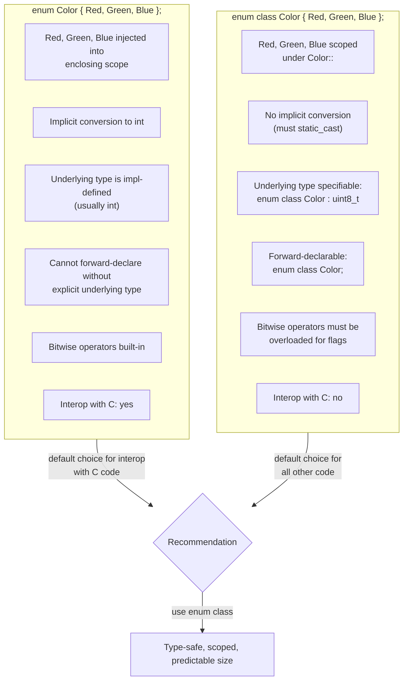
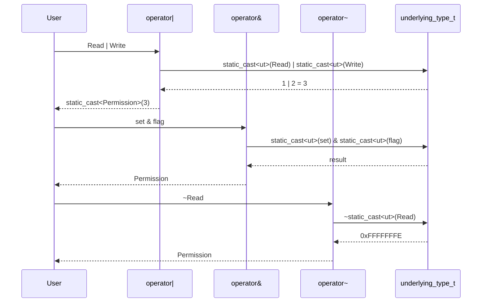

# enum class

> [!info] Scope
> Covers unscoped C-style enums, their problems, C++11 `enum class` (scoped enums), specifying the underlying type, custom values, the `enum class` flags idiom with overloaded operators, `std::to_underlying` (C++23), iterating enum values, and `using enum` (C++20). Cross-references: [[1. auto and Type Deduction]], [[2. Range-based for and Structured Bindings]], [[8. constexpr and Compile-time Computation]], [[9. C++20 and C++23 New Features]].

## Why This Matters

Enumerations are how you model a **closed set of named constants** — colors, states, error codes, days of the week. The C-style `enum` is one of the most error-prone features inherited from C: it leaks names into the enclosing scope, silently converts to `int`, and offers no type safety between two different enum types. A `Color` and a `TrafficLight` both convert to `int`, and the compiler will not stop you from passing `Color::Red` to a function expecting `TrafficLight`.

`enum class` (also called scoped enum or strongly-typed enum), added in C++11, fixes all three problems:

- **No name pollution**. Enumerators are scoped under the enum name: `Color::Red`, not `Red`.
- **No implicit conversion** to/from `int` (or any other type). You must write `static_cast<int>(Color::Red)` explicitly.
- **Specifiable underlying type**. `enum class Color : std::uint8_t { ... }` makes the size predictable — critical for binary protocols and embedded systems.

For the working C++ engineer, `enum class` is the default choice for any enumeration. The only reasons to use a plain `enum` are: (a) you need implicit conversion to `int` (e.g., for `switch` cases without casts), or (b) you are interoperating with C code.

## Background

### C-style enum: the original

```cpp
enum Color { Red, Green, Blue };       // unscoped

Color c = Red;                          // OK, name leaks
int i = c;                              // OK, implicit conversion
Color d = 5;                            // ERROR in C++ (no implicit conv *to* enum from int)
Color e = static_cast<Color>(5);        // OK, but maybe out-of-range

enum TrafficLight { Red, Yellow, Green }; // ERROR: Red, Green already declared in same scope
```

Three problems are visible immediately:

1. `Red`, `Green`, `Blue` are injected into the enclosing namespace. Two enums in the same scope cannot share an enumerator name.
2. `int i = c;` silently converts. There is no warning at `-Wall` for this in most compilers, so a typo like `if (color == 1)` compiles.
3. The underlying type is implementation-defined. On most ABIs `Color` is `int` (4 bytes), but a packed struct cannot rely on that.

### Forward declaration

Pre-C++11, you could not forward-declare an `enum` because the compiler needed to know the underlying type to compute `sizeof`:

```cpp
enum Color;             // ERROR pre-C++11 (no underlying type known)
enum Color : int;       // OK C++11+, plain enum with explicit underlying type
enum class Hue;         // OK C++11+, defaults to int
enum class Hue : std::uint8_t;  // OK C++11+, explicit underlying type
```

### `enum class` (C++11)

```cpp
enum class Color { Red, Green, Blue };   // scoped, default underlying type is int

Color c = Color::Red;                     // OK
int i = c;                                // ERROR: no implicit conversion
int j = static_cast<int>(c);              // OK, explicit
Color d = static_cast<Color>(5);          // OK, but no range check
```

The enumerators `Red`, `Green`, `Blue` are now scoped under `Color`. They do not leak. You cannot implicitly convert `Color` to `int`, and you cannot implicitly convert `int` to `Color`.

## Main Content

### 1. Specifying the underlying type

```cpp
#include <cstdint>

enum class Color : std::uint8_t  { Red, Green, Blue };    // 1 byte
enum class ErrorCode : std::int32_t { Ok = 0, Io = 100, Net = 200 };  // 4 bytes
enum class Flags : std::uint64_t { None = 0, A = 1, B = 2, C = 4 };   // 8 bytes
```

The underlying type can be any integral type (signed or unsigned), including `char`, `std::int8_t`, etc. The choice matters when:

- **You pack the enum into a struct** with `#pragma pack` or `[[gnu::packed]]`. A 1-byte enum saves 3 bytes vs. the default `int`.
- **You send the enum over a network or store it in a file**. The size and signedness must be fixed and portable across compilers.
- **You index an array** with the enum — the underlying type determines the maximum index.
- **You interoperate with C code**. The C-side enum and the C++ `enum class` must have the same representation.

The values must fit in the underlying type. `enum class E : std::uint8_t { A = 300 };` is ill-formed (300 does not fit in 8 bits).

### 2. Custom values

Enumerators can take any value, including duplicates and non-contiguous values:

```cpp
enum class HttpStatus : int {
    Ok = 200,
    Created = 201,
    NoContent = 204,
    BadRequest = 400,
    Unauthorized = 401,
    NotFound = 404,
    InternalServerError = 500,
};

enum class Permission : std::uint32_t {
    Read    = 1 << 0,
    Write   = 1 << 1,
    Execute = 1 << 2,
    All     = Read | Write | Execute,
};
```

> [!tip] Bitwise flags
> The `Permission` pattern is common: each enumerator is a single bit. Combined values like `All` use bitwise OR. To make this ergonomic, overload the bitwise operators (see §4 below).

### 3. Switch on `enum class`

```cpp
std::string_view to_string(Color c) {
    switch (c) {
        case Color::Red:   return "Red";
        case Color::Green: return "Green";
        case Color::Blue:  return "Blue";
    }
    return "Unknown";
}
```

The compiler checks that you cover every enumerator (with `-Wswitch`). If you add `Color::Yellow` later and forget to update `to_string`, you get a warning. This is one of the strongest arguments for `enum class` over `int` constants.

> [!warning] Default case silences the warning
> If you add `default: return "Unknown";`, the compiler no longer warns about missing cases. Omit `default` in `to_string`-style functions to keep the exhaustiveness check. Add it only when you genuinely want to handle unknown values (e.g., for forward compatibility).

### 4. Using `enum class` as flags: operator overloading

By default, `Color::Red | Color::Green` is ill-formed — bitwise operators are not defined for `enum class`. To use the flags idiom, overload the operators yourself:

```cpp
#include <type_traits>

enum class Permission : std::uint32_t {
    None    = 0,
    Read    = 1 << 0,
    Write   = 1 << 1,
    Execute = 1 << 2,
    All     = Read | Write | Execute,
};

constexpr Permission operator|(Permission a, Permission b) {
    return static_cast<Permission>(
        static_cast<std::underlying_type_t<Permission>>(a) |
        static_cast<std::underlying_type_t<Permission>>(b));
}
constexpr Permission operator&(Permission a, Permission b) {
    return static_cast<Permission>(
        static_cast<std::underlying_type_t<Permission>>(a) &
        static_cast<std::underlying_type_t<Permission>>(b));
}
constexpr Permission operator^(Permission a, Permission b) {
    return static_cast<Permission>(
        static_cast<std::underlying_type_t<Permission>>(a) ^
        static_cast<std::underlying_type_t<Permission>>(b));
}
constexpr Permission operator~(Permission a) {
    return static_cast<Permission>(
        ~static_cast<std::underlying_type_t<Permission>>(a));
}
constexpr Permission& operator|=(Permission& a, Permission b) { a = a | b; return a; }
constexpr Permission& operator&=(Permission& a, Permission b) { a = a & b; return a; }
constexpr Permission& operator^=(Permission& a, Permission b) { a = a ^ b; return a; }

bool has(Permission set, Permission flag) {
    return (set & flag) != Permission::None;
}

void use() {
    Permission p = Permission::Read | Permission::Write;
    if (has(p, Permission::Write)) { /* ... */ }
    p |= Permission::Execute;        // now All
    p &= ~Permission::Read;          // clear Read
}
```

> [!tip] Generic flag-enum helper
> The above is verbose. A common pattern is to write a CRTP-like helper template that generates these operators for any `enum class` flagged with a trait (`is_flag_enum<E>::value = true`). Several open-source libraries provide this (e.g., `magic_enum`, `fmt::format`, `boost::bit_flags`).

### 5. `std::to_underlying` (C++23)

C++23 finally added `std::to_underlying` so you no longer write `static_cast<std::underlying_type_t<E>>(e)`:

```cpp
#include <utility>     // C++23
#include <cstdint>

enum class Color : std::uint8_t { Red, Green, Blue };

void send(std::uint8_t);

void transmit(Color c) {
    send(std::to_underlying(c));   // C++23
    // Pre-C++23: send(static_cast<std::underlying_type_t<Color>>(c));
}
```

`std::to_underlying` returns `std::underlying_type_t<E>` exactly. It is `constexpr`.

### 6. Iterating enum values

C++ does not provide built-in iteration over an `enum class`. There are four common techniques:

#### Technique 1: explicit array

```cpp
enum class Color { Red, Green, Blue };
constexpr Color all_colors[] = { Color::Red, Color::Green, Color::Blue };

for (Color c : all_colors) { /* ... */ }
```

Simple, explicit, and works in `constexpr`. The downside: you must keep the array in sync with the enum.

#### Technique 2: contiguous + bounds

```cpp
enum class Level { Min = 0, Debug, Info, Warn, Error, Fatal, Max = Fatal };

for (int i = static_cast<int>(Level::Min); i <= static_cast<int>(Level::Max); ++i) {
    Level l = static_cast<Level>(i);
    // ...
}
```

Works only for contiguous enumerators. `Min`/`Max` make the bounds explicit. This is fragile — adding a new value in the middle silently shifts the bounds.

#### Technique 3: `magic_enum` (third-party)

```cpp
#include <magic_enum.hpp>

enum class Color { Red, Green, Blue };

for (Color c : magic_enum::enum_values<Color>()) {
    std::cout << magic_enum::enum_name(c) << '\n';
}
```

`magic_enum` is a popular header-only library that introspects `enum class` values at compile time using template tricks. It is limited to enums whose values fit in `[-128, 256)` by default but can be configured.

#### Technique 4: an iterator trait you write yourself

```cpp
template <typename E>
struct enum_traits;   // user specializations

template <>
struct enum_traits<Color> {
    static constexpr std::array values = { Color::Red, Color::Green, Color::Blue };
};

template <typename E>
constexpr auto enum_values() { return enum_traits<E>::values; }

for (Color c : enum_values<Color>()) { /* ... */ }
```

This is the most explicit and works in `constexpr`. The downside is the boilerplate per enum.

### 7. `using enum` (C++20)

C++20 added `using enum` to bring all enumerators of a scoped enum into the current scope, similar to `using namespace`:

```cpp
enum class HttpStatus { Ok, NotFound, InternalServerError };

std::string_view name(HttpStatus s) {
    using enum HttpStatus;            // bring Ok, NotFound, InternalServerError into scope
    switch (s) {
        case Ok:                 return "OK";
        case NotFound:           return "Not Found";
        case InternalServerError: return "Internal Server Error";
    }
    return "Unknown";
}
```

This is convenient inside `switch` blocks and unit-test files where you want the unqualified names. It does **not** reintroduce the name-pollution problem of unscoped enums: the `using enum` is scoped to the block in which it appears.

### 8. Enum class vs. plain enum: the decision

| Feature                         | Plain `enum`            | `enum class`                |
|--------------------------------|-------------------------|-----------------------------|
| Name scoping                   | Leaks to enclosing scope | Scoped under enum name      |
| Implicit conversion to int     | Yes                     | No                          |
| Implicit conversion from int   | No (explicit cast only) | No                          |
| Forward declaration            | Requires underlying type | Allowed (defaults to `int`) |
| Specifying underlying type     | C++11 onwards           | C++11 onwards               |
| Operator overloading needed    | Bitwise ops already exist | Must overload for flags     |
| Exhaustive `switch` checking   | Works                   | Works                       |
| Interop with C                 | Yes (same representation) | No (C does not have enum class) |
| `using enum`                   | N/A                     | C++20                       |

**Default**: `enum class`. **Use plain `enum` only** when:

- Interoperating with C code that already declares the enum.
- Building a bitmask by default (pre-C++11 style) — but you should still prefer `enum class` + overloaded operators.
- You genuinely need implicit `int` conversion (rare).

### 9. `enum class` and templates

```cpp
template <typename E>
constexpr auto to_underlying_t(E e) {
    return static_cast<std::underlying_type_t<E>>(e);
}

template <typename E>
constexpr std::string_view enum_name(E e);   // user implements or uses magic_enum
```

`std::underlying_type_t<E>` is the canonical way to extract the underlying integer type generically. Combined with `if constexpr` and SFINAE, you can write reflection-like helpers.

### 10. `enum class` and `constexpr`

All `enum class` values are `constexpr`. You can use them as non-type template parameters, in `static_assert`, in `constexpr` functions, and as `case` labels:

```cpp
template <Color C>
struct ColorTrait;

template <>
struct ColorTrait<Color::Red>   { static constexpr int wavelength = 700; };
template <>
struct ColorTrait<Color::Green> { static constexpr int wavelength = 550; };
template <>
struct ColorTrait<Color::Blue>  { static constexpr int wavelength = 450; };

static_assert(ColorTrait<Color::Red>::wavelength == 700);
```

See [[8. constexpr and Compile-time Computation]] for the broader story.

## Mermaid Diagrams

### `enum` vs `enum class` Comparison



### Flags Enum Operator Overload Flow



## Code Examples

### Example 1: HTTP status codes

```cpp
#include <cstdint>
#include <string_view>

enum class HttpStatus : std::uint16_t {
    Ok                  = 200,
    Created             = 201,
    Accepted            = 202,
    NoContent           = 204,
    BadRequest          = 400,
    Unauthorized        = 401,
    Forbidden           = 403,
    NotFound            = 404,
    InternalServerError = 500,
    NotImplemented      = 501,
    BadGateway          = 502,
    ServiceUnavailable  = 503,
};

constexpr std::string_view to_string(HttpStatus s) {
    using enum HttpStatus;
    switch (s) {
        case Ok:                  return "OK";
        case Created:             return "Created";
        case Accepted:            return "Accepted";
        case NoContent:           return "No Content";
        case BadRequest:          return "Bad Request";
        case Unauthorized:        return "Unauthorized";
        case Forbidden:           return "Forbidden";
        case NotFound:            return "Not Found";
        case InternalServerError: return "Internal Server Error";
        case NotImplemented:      return "Not Implemented";
        case BadGateway:          return "Bad Gateway";
        case ServiceUnavailable:  return "Service Unavailable";
    }
    return "Unknown";
}
```

### Example 2: file-open flags

```cpp
#include <type_traits>
#include <cstdint>

enum class OpenFlag : std::uint32_t {
    None      = 0,
    Read      = 1 << 0,
    Write     = 1 << 1,
    Append    = 1 << 2,
    Truncate  = 1 << 3,
    Create    = 1 << 4,
    Exclusive = 1 << 5,
};

constexpr OpenFlag operator|(OpenFlag a, OpenFlag b) {
    using U = std::underlying_type_t<OpenFlag>;
    return static_cast<OpenFlag>(static_cast<U>(a) | static_cast<U>(b));
}
constexpr OpenFlag operator&(OpenFlag a, OpenFlag b) {
    using U = std::underlying_type_t<OpenFlag>;
    return static_cast<OpenFlag>(static_cast<U>(a) & static_cast<U>(b));
}
constexpr OpenFlag operator~(OpenFlag a) {
    using U = std::underlying_type_t<OpenFlag>;
    return static_cast<OpenFlag>(~static_cast<U>(a));
}
constexpr bool has(OpenFlag set, OpenFlag flag) {
    return (set & flag) != OpenFlag::None;
}

void open_file(const char* path, OpenFlag flags);

void demo() {
    open_file("data.bin", OpenFlag::Read | OpenFlag::Write | OpenFlag::Create);
    open_file("log.txt", OpenFlag::Append | OpenFlag::Write);
}
```

### Example 3: `std::to_underlying` (C++23)

```cpp
#include <utility>
#include <iostream>

enum class Level : std::uint8_t { Debug = 0, Info, Warn, Error, Fatal };

void log_to_syslog(int priority);

void log(Level l) {
    log_to_syslog(std::to_underlying(l));   // C++23
}

int main() {
    log(Level::Warn);
    std::cout << std::to_underlying(Level::Error) << '\n';   // 3
}
```

### Example 4: exhaustive `switch` with `-Wswitch`

```cpp
enum class Shape { Circle, Square, Triangle };

double area(Shape s, double dim) {
    switch (s) {
        case Shape::Circle:   return 3.14159 * dim * dim;
        case Shape::Square:   return dim * dim;
        case Shape::Triangle: return 0.433013 * dim * dim;   // equilateral
    }
    // No default! If you add Shape::Hexagon above, -Wswitch fires here.
    return 0;
}
```

### Example 5: iteration via array

```cpp
#include <array>

enum class Day { Mon, Tue, Wed, Thu, Fri, Sat, Sun };

constexpr std::array<Day, 7> all_days = {
    Day::Mon, Day::Tue, Day::Wed, Day::Thu, Day::Fri, Day::Sat, Day::Sun
};

constexpr std::size_t day_index(Day d) {
    std::size_t i = 0;
    for (auto day : all_days) {
        if (day == d) return i;
        ++i;
    }
    return i;
}

static_assert(day_index(Day::Wed) == 2);
```

### Example 6: `using enum` in a switch

```cpp
enum class Op { Add, Sub, Mul, Div };

int apply(Op op, int a, int b) {
    using enum Op;
    switch (op) {
        case Add: return a + b;
        case Sub: return a - b;
        case Mul: return a * b;
        case Div: return b != 0 ? a / b : 0;
    }
    return 0;
}
```

## Common Pitfalls

1. **`enum class` cannot implicitly convert to `int`**. `if (color == 1)` does not compile. Use `if (color == Color::Red)` or `if (std::to_underlying(color) == 1)`.

2. **Forgetting to overload bitwise operators for flag enums**. `Permission::Read | Permission::Write` is ill-formed by default. You must define `operator|`.

3. **Adding `default:` to a `switch` defeats `-Wswitch`**. The exhaustive-switch warning is one of the biggest wins of `enum class`. Keep `default` out of `to_string`-style functions.

4. **Out-of-range casts are not checked**. `static_cast<Color>(12345)` is well-defined (the value is preserved mod 2^N) but may produce an enum value that does not correspond to any enumerator. Validate input from external sources.

5. **Iterating enum values is not built-in**. Use Technique 1 (explicit array) or `magic_enum`. Do not assume the values are contiguous unless they are.

6. **Plain `enum` cannot share enumerator names within the same scope**. Two unscoped enums with `Red` cannot coexist. `enum class` solves this by scoping.

7. **Underlying type default is `int`**. If you need a specific size, specify it explicitly. `enum class Color` is 4 bytes on most platforms — wasteful for a 3-value enum packed into a struct.

8. **`enum class` does not interoperate with C**. C has no `enum class`. If you must share an enum with a C header, declare it as a plain `enum` with explicit underlying type, then wrap it in C++.

9. **Forgetting `constexpr` on operator overloads**. If you want to use flag enums in `constexpr` contexts (e.g., template arguments), the operator overloads must be `constexpr`.

10. **Name lookup surprises with `using enum`**. `using enum Color;` brings `Red` into scope; if another `using enum` also brings `Red` from a different enum, you get an ambiguity error — different from the unscoped-enum redeclaration error.

## Tips and Tricks

- **Always specify the underlying type** for enums stored in structs, files, or sent over a network. Use the smallest type that fits all values (`std::uint8_t` if ≤255, etc.).
- **Use `using enum`** inside `switch` blocks to avoid `Color::` repetition.
- **Write a `to_string` for every `enum class`**. It pays off in debugging immediately. Consider `magic_enum` for auto-generation.
- **Write a `from_string` for every user-facing enum**. Parse config files, command-line args, JSON, etc.
- **Use `enum class` for state machines**. Combined with `[[nodiscard]]` `next_state()` functions, the compiler enforces the state graph.
- **Use `std::to_underlying` (C++23)** instead of `static_cast<std::underlying_type_t<E>>`.
- **Use `enum class` over `bool` parameters**. `set_visible(true, false, true)` is unreadable; `set_visible(Visible::Yes, Cached::No, Animated::Yes)` is not.
- **Prefer `enum class` over `#define` macros**. Macros have no type, no scope, no `constexpr` guarantees, no debugger visibility.
- **Use bit-field-style enum class with overloaded operators** for flags. The verbosity is paid back in type safety.
- **Combine with `std::variant`** for tagged unions (see [[7. std optional, std variant, std any]]).

## Active Recall

1. Name three problems with C-style `enum` that `enum class` fixes.
2. Why can you forward-declare `enum class Color;` but not (pre-C++11) `enum Color;`?
3. Write a flag enum `OpenMode` with `Read`, `Write`, `Append`, and overload `operator|` and `operator&`.
4. Why does adding `default:` to a `switch` over an `enum class` defeat `-Wswitch`?
5. What does `std::to_underlying` (C++23) return, and what header declares it?
6. How does `using enum Color;` differ from a plain `using namespace`?
7. Write a `to_string(Color)` function that fails to compile if you add a new enumerator and forget to update it.
8. What is the default underlying type of `enum class Color { Red, Green, Blue };`?
9. Name two techniques for iterating over all values of an `enum class`.
10. Why is `Color c = static_cast<Color>(999);` legal but suspicious? What does the standard guarantee about `c`?

## Next Steps

- Continue to [[4. Move Semantics]] — value categories and rvalue references are the next pillar of modern C++.
- See [[1. auto and Type Deduction]] — `auto` plays nicely with `enum class`; `auto c = Color::Red;` deduces `Color`.
- See [[2. Range-based for and Structured Bindings]] — iterate an `enum class` via an array of values.
- See [[8. constexpr and Compile-time Computation]] — `enum class` values are `constexpr` and usable as NTTPs.
- See [[9. C++20 and C++23 New Features]] — `using enum` (C++20) and `std::to_underlying` (C++23).
- Cross-chapter: [[11. STL Containers]] (eventual) for `std::unordered_map<E, V>` keyed by enum.
