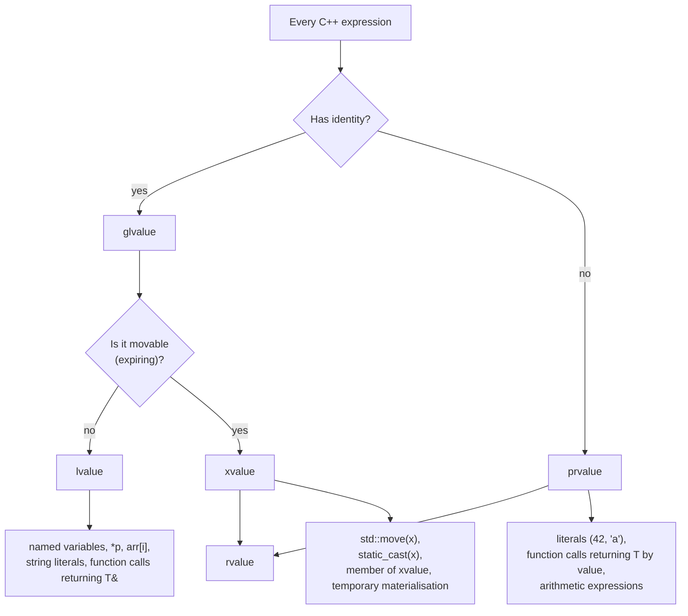

# Move Semantics

> [!info] Scope
> Covers value categories (lvalue, xvalue, prvalue, glvalue, rvalue), rvalue references (`&&`), `std::move` (a cast, not a move), move constructor and move assignment operator, the Rule of 5, copy elision/RVO/NRVO, universal references, and `std::forward` (cross-reference to [[5. Perfect Forwarding]]). Cross-references: [[1. auto and Type Deduction]], [[5. Perfect Forwarding]], [[6. Lambdas Deep Dive]].

## Why This Matters

Move semantics is the headline feature of C++11. It is the difference between copying 4 KB of string data and stealing a pointer. For real-world programs, that is the difference between a function taking 10 microseconds and 100 nanoseconds.

But move semantics is also one of the most *misunderstood* features in modern C++. Three misconceptions dominate:

1. **"`std::move` moves things."** It does not. It is a `static_cast` to an rvalue reference. The actual move happens inside a move constructor or move assignment operator, *if* one exists and *if* the call site binds to it.

2. **"`T&&` is an rvalue reference."** It is not always. In a *deduced* context (template parameter `T` or `auto&&`), `T&&` is a **forwarding reference** (a.k.a. universal reference) — it can deduce to `T&` for lvalues and `T&&` for rvalues via reference collapsing.

3. **"Always `std::move` the return value."** Wrong. Returning a local variable by value already triggers copy elision (NRVO). Adding `std::move` on the return statement *defeats* NRVO and forces a move, which is usually worse than the elision the compiler would have done for free.

Mastering move semantics means:

- Knowing the value category of any expression at a glance.
- Writing types that are cheap to move (Rule of 5).
- Recognising when `std::move` helps, when it is a no-op, and when it is actively harmful.
- Understanding why `std::vector<T>` with movable `T` is fundamentally different from `std::vector<T>` with copy-only `T`.

## Background

### The pre-C++11 world

Before C++11, function returns and pass-by-value always copied. If you had a `std::vector<std::string>` and wanted to return it from a function, the caller got a deep copy of every string. Workarounds existed:

- Pass a non-const reference as an out-parameter: `void fill(std::vector<int>& out);`. Awkward, cannot be chained, no RVO.
- Return a pointer (raw or smart): `std::unique_ptr<std::vector<int>> fill();`. Allocates an extra time.
- Hope for NRVO and write `return v;` — worked sometimes.

The C++11 solution is **rvalue references** and **move constructors**. The idea: instead of copying the contents of an expiring object, *steal* its resources (pointer, capacity, handle) and leave the source in a valid-but-unspecified "moved-from" state.

### Value categories

Every C++ expression has both a **type** and a **value category**. C++11 expanded the value-category system to five categories:

| Category   | Description                                                        |
|------------|-------------------------------------------------------------------|
| **lvalue** | Has identity, not movable. e.g. `int x; x` is an lvalue.           |
| **xvalue** | Has identity, is movable (an expiring object). e.g. `std::move(x)`.|
| **prvalue**| No identity, is movable. e.g. `42`, `std::string("hi")`.           |
| **glvalue**| Has identity: lvalue ∪ xvalue.                                    |
| **rvalue** | Movable: xvalue ∪ prvalue.                                        |

The mnemonic: **l**value = locator (named), **r**value = readable-where-it-expires. The two you write code for are **lvalue** and **prvalue**; **xvalue** is what `std::move` produces.

## Main Content

### 1. Value Categories in Detail

An expression's value category determines which function overloads it selects:

- An lvalue prefers `T&` parameters.
- A prvalue prefers `T&&` parameters (or, in C++17+, materialises a temporary and binds to `T&&` or `const T&`).
- An xvalue is what `std::move(x)` produces — it binds to `T&&` but the source still has identity.

```cpp
void f(int& i);         // overload 1: lvalue reference
void f(int&& i);        // overload 2: rvalue reference

int x = 10;
f(x);                   // x is an lvalue -> calls overload 1
f(10);                  // 10 is a prvalue -> calls overload 2
f(std::move(x));        // std::move(x) is an xvalue -> calls overload 2
```

> [!tip] Quick test
> Can you take the address of the expression? `&expr`? If yes, it is an lvalue (or xvalue, for `&std::move(x)`-style cases). If no, it is a prvalue.

### 2. Rvalue References (`&&`)

```cpp
void sink(std::string&& s);    // accepts rvalues (prvalues and xvalues)

std::string a = "hello";
sink(a);                       // ERROR: a is an lvalue, cannot bind to &&
sink(std::move(a));            // OK: std::move(a) is an xvalue
sink(std::string("hi"));       // OK: prvalue
```

Inside `sink`, the parameter `s` is itself an **lvalue** — it has a name, it has an address. The fact that it was declared `&&` only controls what can be bound to it at the call site. This is the single most confusing point about rvalue references.

> [!danger] `std::move` inside `sink`
> If `sink(std::string&& s)` calls another function and wants to preserve the "movability" of `s`, it must call `std::move(s)` again. `s` is an lvalue inside its own scope. This is the rule: **an rvalue reference parameter is an lvalue inside the function body**. The forwarding version of this rule (for `T&&`) is the same with `std::forward<T>` — see [[5. Perfect Forwarding]].

### 3. `std::move` is a Cast

The standard library defines `std::move` as:

```cpp
template <typename T>
constexpr std::remove_reference_t<T>&& move(T&& t) noexcept {
    return static_cast<std::remove_reference_t<T>&&>(t);
}
```

Three things to notice:

1. `T&&` here is a **forwarding reference** (because `T` is deduced). `std::move` accepts both lvalues and rvalues.
2. `std::remove_reference_t<T>` strips any reference from `T`. Then `&&` is appended, always producing an rvalue reference.
3. `std::move` does **not** move anything. It casts `t` to an rvalue reference (specifically an xvalue). The actual move happens only if the resulting expression is bound to a move constructor or move assignment operator — or used as the source of a `return` statement that selects the move.

Consequences:

- `std::move(x);` on its own does nothing. The expression `std::move(x)` is an xvalue, but unless something consumes it, no move occurs.
- `auto&& r = std::move(x);` binds `r` to an xvalue, but does not move.
- `auto y = std::move(x);` *does* move (or copy-elide) because it constructs `y` from the xvalue.

### 4. Move Constructor and Move Assignment

```cpp
class Buffer {
    char*  data_;
    size_t size_;
public:
    // Constructor
    Buffer(size_t n) : data_(new char[n]), size_(n) {}

    // Destructor
    ~Buffer() { delete[] data_; }

    // Copy constructor (deep copy)
    Buffer(const Buffer& other)
        : data_(new char[other.size_]), size_(other.size_) {
        std::memcpy(data_, other.data_, size_);
    }

    // Copy assignment (copy-and-swap)
    Buffer& operator=(Buffer other) noexcept {
        swap(other);
        return *this;
    }

    // Move constructor (steal)
    Buffer(Buffer&& other) noexcept
        : data_(other.data_), size_(other.size_) {
        other.data_ = nullptr;
        other.size_ = 0;
    }

    // Move assignment: handled by copy-and-swap above (other passed by value)

    void swap(Buffer& b) noexcept {
        using std::swap;
        swap(data_, b.data_);
        swap(size_, b.size_);
    }
};
```

Notes:

- Move constructor and move assignment must be `noexcept` if they truly do not throw. STL containers check `std::is_nothrow_move_constructible_v<T>` and prefer moves only if `noexcept`. Otherwise, they copy (to preserve the strong exception guarantee).
- The moved-from object must be in a **valid-but-unspecified** state. Typically it is set to a "empty" state (null pointers, zero size). It must still be destructible and assignable.
- **The Rule of 5**: if you define any of {destructor, copy constructor, copy assignment, move constructor, move assignment}, you probably need to define all five. See [[7. Memory Management/4. RAII]].

### 5. Why Move Semantics Matter

Without moves:

```cpp
std::vector<std::string> make_words() {
    std::vector<std::string> v;
    for (int i = 0; i < 1'000'000; ++i) {
        v.push_back(std::string(64, 'a'));   // 64-byte string allocated, copied into v
    }
    return v;   // NRVO may help, but each push_back still copies
}
```

With moves, `std::vector` can move its internal buffer when reallocating (since C++11), and `std::string`'s move constructor is a pointer swap. The above function becomes O(n) instead of O(n²) in practice.

### 6. Copy Elision, RVO, NRVO

Even without `std::move`, the compiler can **elide** copies and moves entirely:

- **RVO (Return Value Optimization)**: returning a prvalue by value. `return std::string("hi");` constructs the return value in place at the call site — no copy, no move.
- **NRVO (Named Return Value Optimization)**: returning a named local variable. `std::string f() { std::string s = "..."; return s; }` — the compiler constructs `s` directly in the caller's storage.
- **Mandatory copy elision (C++17)**: when the source is a prvalue of the same type as the destination, *no* copy or move is even *conceptually* performed. The prvalue is materialised directly in the destination.

```cpp
std::string make_string() {
    return std::string("hi");     // prvalue -> guaranteed elision in C++17
}

std::string make_string_named() {
    std::string s = "hi";          // construction
    s += " world";
    return s;                      // NRVO (not mandatory, but usual)
}

std::string bad() {
    std::string s = "hi";
    return std::move(s);           // BAD: forces a move, defeats NRVO
}
```

> [!danger] `return std::move(local);` is an anti-pattern
> NRVO works only when the return expression is the *name* of a local variable. Wrapping it in `std::move` makes it an xvalue, defeating NRVO and forcing a move constructor call. The compiler will sometimes warn (`-Wpessimizing-move`), but not always. **Just write `return s;`** and let the compiler do its job. The standard explicitly says (since C++11) that `return s;` is treated as `return std::move(s);` if doing so would select a move constructor — so you get the move for free when NRVO cannot apply.

### 7. Universal References (Forwarding References)

In a deduced context (`template <typename T> ... T&& x;` or `auto&& x = ...;`), `T&&` is a **forwarding reference**:

- If the argument is an lvalue of type `U`, then `T = U&` and `T&& = U&` (via reference collapsing).
- If the argument is an rvalue of type `U`, then `T = U` and `T&& = U&&`.

```cpp
template <typename T>
void f(T&& x);                    // forwarding reference

std::string s = "hi";
f(s);                             // T = std::string&,  x: std::string&
f(std::move(s));                  // T = std::string,   x: std::string&&
f(std::string("hi"));             // T = std::string,   x: std::string&&
```

See [[5. Perfect Forwarding]] for the full reference-collapsing table and the `std::forward<T>` recipe.

### 8. `std::forward` vs `std::move`

- `std::move(x)` **always** casts `x` to an rvalue reference. Use it when you are certain you want to move — typically at a *sink* (the place the value is consumed or stored).
- `std::forward<T>(x)` casts `x` to `T&&`, which by reference collapsing is `T&` for lvalue `T` and `T&&` for rvalue `T`. Use it inside a template that takes `T&&` to preserve the value category at the call site.

The two are nearly identical in implementation — `std::forward` just conditionally casts based on `T`:

```cpp
template <typename T>
constexpr T&& forward(std::remove_reference_t<T>& t) noexcept {
    return static_cast<T&&>(t);
}
```

> [!tip] Heuristic
> If you wrote `T&&` in a function template, use `std::forward<T>` to pass the parameter along. If you wrote `U&&` (concrete type, no template deduction), use `std::move`.

### 9. `noexcept` and Move Semantics

STL containers care deeply about `noexcept` moves. If `T`'s move constructor is `noexcept`, `std::vector<T>::reserve` moves elements when reallocating. If it is not (or if it does not exist), `vector` copies instead — to preserve the strong exception guarantee (a thrown move could leave the vector half-moved, violating the invariant).

```cpp
class Good {
    int* data_;
public:
    Good(Good&& other) noexcept : data_(other.data_) { other.data_ = nullptr; }
};

class Bad {
    int* data_;
public:
    Bad(Bad&& other) : data_(other.data_) { other.data_ = nullptr; }  // NOT noexcept
};

// std::vector<Good> uses move on reallocation.
// std::vector<Bad> uses copy on reallocation (because move could throw).
```

Always mark move constructors and move assignments `noexcept` if they truly do not throw.

### 10. Move-Only Types

`std::unique_ptr`, `std::thread`, `std::mutex` (sort of), `std::fstream` (sort of) are **move-only**: the copy constructor and copy assignment are deleted.

```cpp
#include <memory>
std::unique_ptr<int> p = std::make_unique<int>(42);
std::unique_ptr<int> q = p;                // ERROR: copy is deleted
std::unique_ptr<int> r = std::move(p);     // OK: move
```

Passing a move-only type to a function requires either:
- Pass by value + `std::move` at the call site: `sink(std::move(p));`
- Pass by rvalue reference: `void sink(std::unique_ptr<int>&& p);`
- Pass by `unique_ptr` value (the sink idiom): `void sink(std::unique_ptr<int> p);` — caller must move.

### 11. The Rule of 5 (and the Rule of 0)

- **Rule of 0**: If your class manages no resources (all members are RAII types like `std::vector`, `std::string`, `std::unique_ptr`), declare **no** destructor, copy, or move operations. The compiler-generated defaults do the right thing.
- **Rule of 5**: If you define any of {destructor, copy ctor, copy assign, move ctor, move assign}, you probably need all five. Either because you manage a resource, or because the compiler will suppress move generation when you declare a copy/destructor.

See [[7. Memory Management/4. RAII]] for the full Rule of 0/5 story.

## Mermaid Diagrams

### Value Categories Venn Diagram



### Move Constructor Flow

```mermaid
sequenceDiagram
    participant Caller
    participant Sink as Buffer(Buffer&& other)
    participant Source as other (xvalue)
    Caller->>Sink: Buffer b = std::move(old)
    Sink->>Source: read other.data_, other.size_
    Sink->>Sink: data_ = other.data_; size_ = other.size_
    Sink->>Source: other.data_ = nullptr; other.size_ = 0
    Source-->>Sink: moved-from state (valid, empty)
    Sink-->>Caller: b owns the buffer
```

### Move vs Copy Elision Decision

```mermaid
flowchart TD
    A["return expr;"] --> B{"Is expr a local variable name<br/>(or this->member)?"}
    B -->|"yes"| C{"NRVO applicable?"}
    C -->|"yes"| D["Construct in caller's storage<br/>(no copy, no move)"]
    C -->|"no, e.g. conditional return"| E{"Is type movable?"}
    B -->|"no, it's an xvalue"| F["std::move(x) or T&& cast"]
    B -->|"no, it's a prvalue"| G["Mandatory elision (C++17)<br/>construct in caller's storage"]
    F --> E
    E -->|"yes, move ctor exists"| H["Move-construct return value"]
    E -->|"no, or move would throw<br/>and caller wants strong guarantee"| I["Copy-construct return value"]
    D --> J["Done"]
    G --> J
    H --> J
    I --> J
```



## Code Examples

### Example 1: a movable type, end to end

```cpp
#include <cstring>
#include <algorithm>
#include <utility>

class String {
    char*  data_;
    size_t size_;
public:
    String() : data_(nullptr), size_(0) {}
    String(const char* s) : data_(nullptr), size_(std::strlen(s)) {
        data_ = new char[size_ + 1];
        std::memcpy(data_, s, size_ + 1);
    }
    ~String() { delete[] data_; }

    // Copy
    String(const String& o) : size_(o.size_) {
        data_ = new char[size_ + 1];
        std::memcpy(data_, o.data_, size_ + 1);
    }
    String& operator=(String o) noexcept { swap(o); return *this; }   // copy-and-swap

    // Move (noexcept!)
    String(String&& o) noexcept : data_(o.data_), size_(o.size_) {
        o.data_ = nullptr; o.size_ = 0;
    }
    // Move assignment is the same as copy assignment via copy-and-swap,
    // because the by-value parameter is move-constructed from rvalues.

    void swap(String& o) noexcept {
        std::swap(data_, o.data_);
        std::swap(size_, o.size_);
    }
};

String make() {
    String s("hello");
    s = String("world");        // move-assign temporary
    return s;                   // NRVO or move
}

int main() {
    String a = make();          // NRVO across the chain
    String b = std::move(a);    // move-construct b; a is now empty
    return 0;
}
```

### Example 2: `std::vector` reallocation prefers moves

```cpp
#include <vector>
#include <string>

std::vector<std::string> v;
for (int i = 0; i < 100; ++i) {
    v.push_back(std::string(64, 'a'));   // moves the temporary into v
}
// Internal reallocation: std::string's move ctor is noexcept,
// so vector moves strings instead of copying them.
```

### Example 3: anti-pattern — `return std::move(local);`

```cpp
#include <string>

std::string bad() {
    std::string s = "hello";
    return std::move(s);   // BAD: forces move, defeats NRVO
}

std::string good() {
    std::string s = "hello";
    return s;              // GOOD: NRVO, or implicit move if NRVO fails
}
```

### Example 4: sink idiom

```cpp
#include <memory>

class Widget {
    std::unique_ptr<int> data_;
public:
    // Sink: take ownership by value, move into member
    explicit Widget(std::unique_ptr<int> p) : data_(std::move(p)) {}
};

std::unique_ptr<int> make_int(int v) { return std::make_unique<int>(v); }

int main() {
    Widget w(make_int(42));            // temporary moves into ctor's p, then into data_
    auto p = std::make_unique<int>(7);
    Widget w2(std::move(p));           // explicit move required (p is an lvalue)
    return 0;
}
```

### Example 5: `T&&` overload vs `const T&` overload

```cpp
#include <string>
#include <utility>

class Holder {
    std::string s_;
public:
    void set(const std::string& s) { s_ = s; }      // copy-assign
    void set(std::string&& s)      { s_ = std::move(s); }  // move-assign
};

int main() {
    Holder h;
    std::string x = "hello";
    h.set(x);                  // x is lvalue -> set(const string&)
    h.set(std::string("hi"));  // prvalue -> set(string&&)
    h.set(std::move(x));       // xvalue -> set(string&&)
}
```

### Example 6: move-only type with sink

```cpp
#include <memory>
#include <vector>
#include <thread>
#include <chrono>

void worker(int id);

class Pool {
    std::vector<std::thread> threads_;
public:
    void add(std::thread t) {                 // sink: take by value
        threads_.push_back(std::move(t));     // move into vector
    }
    ~Pool() {
        for (auto& t : threads_) if (t.joinable()) t.join();
    }
};

int main() {
    Pool p;
    p.add(std::thread(worker, 1));            // prvalue moves directly
    std::thread t2(worker, 2);
    p.add(std::move(t2));                      // explicit move
    return 0;
}
```

## Common Pitfalls

1. **`std::move` on a `const` object is a no-op**. `std::move(const T&)` produces `const T&&`, which cannot bind to a move constructor. The compiler silently falls back to copy. This is the classic "I moved it but I'm still copying" bug — check for `const` members and `const` function parameters.

2. **`return std::move(local);` defeats NRVO**. Just `return local;` and the compiler does the right thing.

3. **Using the moved-from object**. The standard says it is in a "valid but unspecified" state. Calling `.size()` on a moved-from `std::string` is fine; calling `.clear()` is fine; calling `.data()` and dereferencing is **not** fine.

4. **`auto&& x = ...;` then `std::move(x)`**. If `x` deduced to an lvalue reference, `std::move` casts it to an rvalue — which may move from an lvalue the caller still owns. Use `std::forward<decltype(x)>(x)` instead.

5. **Move constructors not marked `noexcept`**. STL containers will copy instead of move, silently destroying the performance win. Always `noexcept` your moves.

6. **Forgetting the Rule of 5**. If you write a destructor (because you manage a resource) and forget move ctor/assign, your type copies where it could move — and may even double-delete if you forget copy ctor.

7. **`T&&` is not always an rvalue reference**. In a deduced context it is a forwarding reference. See [[5. Perfect Forwarding]].

8. **Moving from `*this`**. Inside a member function, `std::move(*this)` is rarely what you want; it moves the current object, leaving `*this` in a moved-from state. Almost always a bug.

9. **Move-constructing into `const T&` parameter**. `void f(const std::string& s);` called with `f(std::move(x));` — the move is wasted because the parameter is a const reference. The compiler will warn or accept silently.

10. **Moved-from `std::function` is empty**. `std::function f = []{...}; auto g = std::move(f); f();` throws `std::bad_function_call`. See [[6. Lambdas Deep Dive]].

## Tips and Tricks

- **Mark move operations `noexcept`** always. It changes STL behaviour and is essentially free.
- **Use copy-and-swap** for assignment operators: `T& operator=(T other) { swap(other); return *this; }`. One function handles copy and move assignment, with strong exception safety.
- **`return local;`** — never `return std::move(local);`. Trust the compiler.
- **Pass sink parameters by value** for moveable types: `void sink(std::string s);`. The caller decides copy or move; the function body just moves into the destination.
- **Use `std::move` once per source object**, at the moment it transitions from "I own this" to "I am giving this away".
- **Prefer `std::move` over `std::forward`** for non-template rvalue references (`void f(std::string&& s) { g(std::move(s)); }`).
- **Prefer `std::forward<T>`** for template forwarding references (`template <class T> void f(T&& s) { g(std::forward<T>(s)); }`).
- **Read `std::is_move_constructible_v<T>` and `std::is_nothrow_move_constructible_v<T>`** to reason about generic code.
- **For types holding mutexes or atomics**, move-construct each member explicitly; the defaults are deleted or wrong.
- **Use `[[nodiscard]]` on factories** so callers do not accidentally drop a returned move-only type.

## Active Recall

1. Name the five value categories and one example expression for each.
2. Why is `return std::move(local);` an anti-pattern? What should you write instead?
3. What does `std::move` actually do at the language level? What does it *not* do?
4. Inside `void f(std::string&& s)`, what is the value category of the expression `s`?
5. Why does `std::vector<T>` copy instead of move when `T`'s move constructor is not `noexcept`?
6. State the Rule of 5 and the Rule of 0. When does each apply?
7. What is the difference between `T&&` in `void f(T&& x);` (template) and `void f(std::string&& x);` (concrete)?
8. After `auto y = std::move(x);`, what can you legally do with `x`?
9. What is copy elision? What is mandatory elision (C++17)? Give an example of each.
10. Write a `Buffer` class with Rule-of-5, copy-and-swap, and `noexcept` moves.
11. Why does `std::move(const std::string& s)` silently fall back to a copy?

## Next Steps

- Continue to [[5. Perfect Forwarding]] — the natural sequel, covering `T&&` in template contexts, reference collapsing, and `std::forward`.
- See [[1. auto and Type Deduction]] — `auto&&` is a forwarding reference; `auto` strips references.
- See [[6. Lambdas Deep Dive]] — lambda init-captures use `std::move` to move into the closure.
- See [[7. Memory Management/5. Smart Pointers]] — `std::unique_ptr` and `std::shared_ptr` are move-only.
- See [[8. constexpr and Compile-time Computation]] — `constexpr` move constructors (C++20+) enable compile-time containers.
- Cross-chapter: [[7. Memory Management/4. RAII]] for the Rule of 5/0 in depth.
