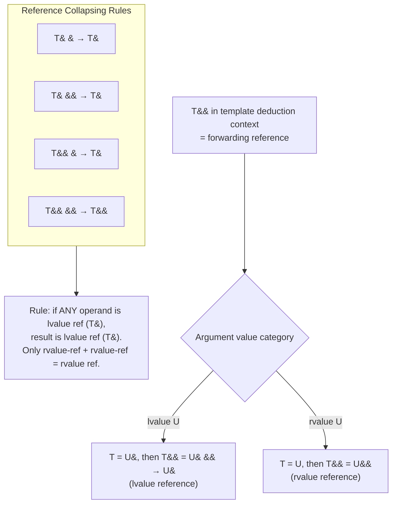
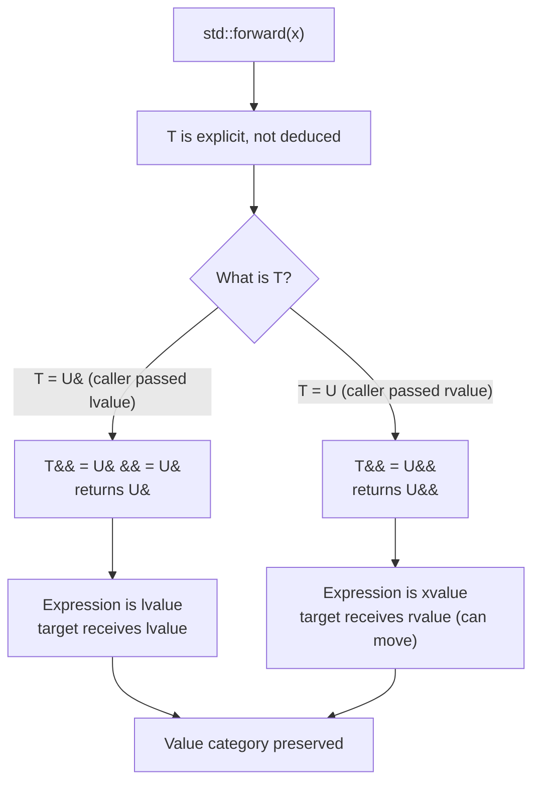
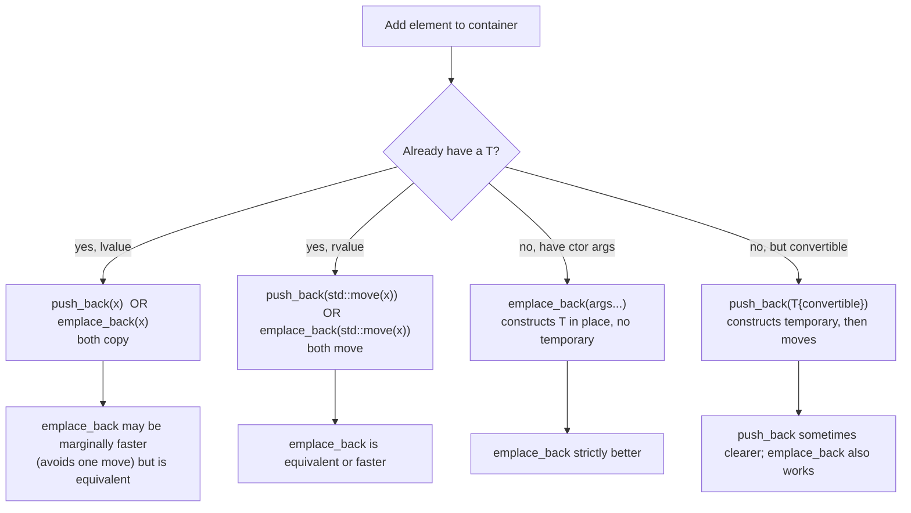

# Perfect Forwarding

> [!info] Scope
> Covers the problem perfect forwarding solves, universal/forwarding references (`T&&` in deduced contexts), reference collapsing rules, `std::forward` vs `std::move`, the `std::forward` implementation, factory functions, `emplace_back` vs `push_back`, variadic templates + perfect forwarding, and `std::make_shared` / `std::make_unique` internals. Cross-references: [[1. auto and Type Deduction]], [[4. Move Semantics]], [[6. Lambdas Deep Dive]].

## Why This Matters

Suppose you want to write a logging wrapper:

```cpp
template <typename Func, typename Arg>
void log_call(Func f, Arg x) {
    std::clog << "calling f\n";
    f(x);
}
```

This works, but it has a subtle problem: it always passes `x` to `f` as an lvalue, regardless of whether the caller passed an lvalue or an rvalue. If `f` is overloaded on `void f(int&)` vs `void f(int&&)`, the wrapper always selects the lvalue overload. If `f` is `void f(std::unique_ptr<int>)` (taking by value, expecting a move), the wrapper copies — but `std::unique_ptr` is move-only, so it fails to compile.

**Perfect forwarding** is the technique that lets a wrapper preserve the value category of its arguments. With it:

```cpp
template <typename Func, typename Arg>
void log_call(Func&& f, Arg&& x) {
    std::clog << "calling f\n";
    f(std::forward<Arg>(x));
}
```

…now `log_call(f, std::move(x))` invokes `f` with an rvalue; `log_call(f, x)` invokes `f` with an lvalue. The wrapper is *transparent*.

This is the foundation of:

- **`std::make_unique<T>(args...)`** — forwards `args...` to `T`'s constructor.
- **`std::emplace_back(args...)`** — forwards `args...` to `T`'s constructor in place inside the container.
- **`std::bind`** and `std::invoke<R>` (C++23).
- **Most C++ standard library wrappers** — `std::function`, `std::thread`, `std::packaged_task`, `std::async`, etc.
- **CRTP and policy-based design** — forwarding constructors from derived to base.

Without perfect forwarding, every wrapper in C++ would either (a) lose value category information, (b) require two overloads per argument (one for lvalues, one for rvalues), or (c) explode combinatorially for multi-argument wrappers (`2^N` overloads).

## Background

### Why two overloads are not enough

For a single argument, you could write two overloads:

```cpp
template <typename F, typename A>
void log_call(F& f, A& x)       { f(x); }    // lvalue
template <typename F, typename A>
void log_call(F& f, A&& x)      { f(std::move(x)); }  // rvalue
```

But this:

1. Does not handle `const A&` arguments.
2. Multiplies to `2^N` overloads for `N` arguments.
3. Still does not preserve `const`-ness perfectly without more overloads.

The single-template solution with `T&&` + `std::forward<T>` handles every value category with one signature.

### Universal references, forwarding references — same thing

The C++ standard calls them **forwarding references**. Scott Meyers' name **universal references** is also widely used. They are the same concept: `T&&` where `T` is a deduced template parameter (or `auto&&`).

The rules:

- In a *deduced* context, `T&&` is a forwarding reference. It binds to **both** lvalues and rvalues.
- In a *non-deduced* context, `T&&` is an rvalue reference. It binds only to rvalues.

Examples of non-deduced contexts:

```cpp
void f(std::string&& s);               // rvalue reference: std::string is not deduced
template <typename T> void g(std::vector<T>&& v);   // rvalue reference: T is deduced, but vector<T>&& is not "T&&"
```

Examples of forwarding references:

```cpp
template <typename T> void f(T&& x);   // forwarding reference
auto&& x = expr;                       // forwarding reference (auto&&)
template <typename... Args> void g(Args&&... args);   // pack of forwarding references
```

## Main Content

### 1. Reference Collapsing Rules

Reference collapsing is the *mechanism* that makes `T&&` behave as a forwarding reference. In C++, you cannot have a "reference to a reference" directly (`int& &` is ill-formed). But during template argument substitution and `typedef`/`using` aliasing, references can pile up — and the compiler collapses them by these rules:

| Combination            | Result  |
|------------------------|---------|
| `T& &`   → `T&`        | lvalue ref |
| `T& &&`  → `T&`        | lvalue ref |
| `T&& &`  → `T&`        | lvalue ref |
| `T&& &&` → `T&&`       | rvalue ref |

The mnemonic: **if either is an lvalue reference, the result is an lvalue reference. Only rvalue-ref + rvalue-ref collapses to an rvalue reference.**

### 2. How `T&&` Deduces

When you call `f(x)` with `template <typename T> void f(T&& x);`:

- If `x` is an lvalue of type `U`, then `T = U&`. Then `T&& = U& &&`, which collapses to `U&`. So `x`'s type is `U&` — a non-const lvalue reference (or const, if `U` is `const U`).
- If `x` is an rvalue of type `U`, then `T = U`. Then `T&& = U&&`. So `x`'s type is `U&&`.

```cpp
template <typename T> void f(T&& x);

int i = 0;
const int ci = 0;

f(i);                  // lvalue int        -> T = int&,    x: int&
f(ci);                 // lvalue const int  -> T = const int&, x: const int&
f(42);                 // prvalue int       -> T = int,     x: int&&
f(std::move(ci));      // xvalue const int  -> T = const int, x: const int&&
```

Note that `T` itself is deduced to a reference type when the argument is an lvalue — this is the *only* context where template type deduction deduces a reference type. See [[1. auto and Type Deduction]].

### 3. `std::forward<T>` Implementation

`std::forward<T>` is a conditional cast. Its typical implementation:

```cpp
template <typename T>
constexpr T&& forward(std::remove_reference_t<T>& t) noexcept {
    return static_cast<T&&>(t);
}
template <typename T>
constexpr T&& forward(std::remove_reference_t<T>&& t) noexcept {
    static_assert(!std::is_lvalue_reference_v<T>,
                  "cannot forward an rvalue as an lvalue");
    return static_cast<T&&>(t);
}
```

The first overload handles both lvalue and rvalue arguments. `T` is *explicitly specified* at the call site (`std::forward<T>(x)`), so it is not deduced. `T&&` then uses reference collapsing:

- If `T = U&` (caller passed an lvalue originally), `T&& = U& &&` collapses to `U&`. So `std::forward<T>(x)` returns `U&` — an lvalue reference. The expression is an lvalue.
- If `T = U` (caller passed an rvalue originally), `T&& = U&&`. So `std::forward<T>(x)` returns `U&&`. The expression is an xvalue — moveable.

The second overload prevents forwarding an rvalue as an lvalue (a safety check).

> [!tip] Why `std::forward` requires `<T>`
> `std::forward` does not deduce `T`. It takes `T` from the call site because the original `T` from the outer function's template parameter list is what we want to recover. If `std::forward` deduced `T`, it would always treat its argument as an rvalue (just like `std::move`).

### 4. `std::forward` vs `std::move`

|                          | `std::move(x)`              | `std::forward<T>(x)`                |
|--------------------------|-----------------------------|-------------------------------------|
| `T`                      | deduced                     | explicit, from outer template       |
| Always casts to          | rvalue reference (xvalue)   | `T&&`, which collapses based on `T` |
| Use when                  | `x` is a `U&&` parameter    | `x` is a `T&&` (forwarding) parameter |
| Effect                   | always moves                | moves only if originally an rvalue  |

Mnemonic:

- **`std::move`** says "I am certain this should be moved — it's a sink."
- **`std::forward`** says "I don't know if this should be moved; preserve what the caller passed."

### 5. Perfect Forwarding in Factory Functions

```cpp
#include <utility>
#include <memory>

template <typename T, typename... Args>
std::unique_ptr<T> make_unique(Args&&... args) {
    return std::unique_ptr<T>(new T(std::forward<Args>(args)...));
}
```

This single template handles:

- `make_unique<Widget>()` — zero-arg constructor.
- `make_unique<Widget>(42)` — `int` rvalue → forwarded as rvalue.
- `make_unique<Widget>(name)` — `std::string` lvalue → forwarded as lvalue, copied into `Widget`'s ctor.
- `make_unique<Widget>(std::move(name))` — `std::string` xvalue → forwarded as rvalue, moved.

The pattern `std::forward<Args>(args)...` is the canonical "expand the pack with forwarding" syntax.

### 6. `emplace_back` vs `push_back`

```cpp
std::vector<std::string> v;
std::string s = "hello";

v.push_back(s);                    // copy s into a new element
v.push_back(std::move(s));         // move s into a new element
v.push_back("world");              // construct a temporary, move it

v.emplace_back(s);                 // copy-construct the element in place (no temporary)
v.emplace_back(std::move(s));      // move-construct the element in place
v.emplace_back("world");           // construct the element in place from const char*
v.emplace_back(10, 'x');           // construct string(10, 'x') in place — no temporary!
```

`push_back` takes a `const T&` or `T&&` — you must already have a `T` (or a temporary). `emplace_back` is a variadic template that forwards arbitrary arguments to `T`'s constructor.

> [!tip] When `emplace_back` beats `push_back`
> When you would otherwise construct a temporary and then move/copy it into the container. `v.emplace_back(10, 'x')` constructs the `std::string` directly inside the vector — one construction instead of construct-then-move.

> [!warning] When `emplace_back` is worse than `push_back`
> For perfect-forwarding ambiguity: `v.emplace_back("hello")` forwards `const char*` to `std::string`'s constructor, which calls `string(const char*)`. But if `T` has *both* `string(const char*)` and an unconstrained template constructor, the template may win. Always check the constructor overloads. Also: `emplace_back(a, b, c)` may invoke surprising conversions — `push_back(T{a, b, c})` is sometimes more readable.

### 7. Variadic Templates + Perfect Forwarding

```cpp
#include <utility>
#include <iostream>

template <typename F, typename... Args>
decltype(auto) log_call(F&& f, Args&&... args) {
    std::clog << "calling f\n";
    return std::forward<F>(f)(std::forward<Args>(args)...);
}

int add(int a, int b) { return a + b; }

int main() {
    int x = 1, y = 2;
    log_call(add, x, y);              // forwards x, y as lvalues
    log_call(add, 1, 2);              // forwards 1, 2 as prvalues
    return 0;
}
```

The pattern `std::forward<Args>(args)...` is the **only** correct way to expand a forwarding-reference pack. Doing `args...` alone would lose value category.

### 8. `std::make_shared` and `std::make_unique` Internals

```cpp
namespace std {
    template <typename T, typename... Args>
    shared_ptr<T> make_shared(Args&&... args) {
        // Construct T and its control block in a single allocation.
        return shared_ptr<T>(new T(std::forward<Args>(args)...));
        // (real implementation uses a custom allocator for control block + T)
    }

    template <typename T, typename... Args>
    unique_ptr<T> make_unique(Args&&... args) {
        return unique_ptr<T>(new T(std::forward<Args>(args)...));
    }
}
```

These are perfect-forwarding factories. They are the canonical reason perfect forwarding exists.

### 9. `std::bind` and `std::invoke` (C++23 `std::invoke_r`)

```cpp
#include <functional>
#include <utility>

template <typename F, typename... Args>
decltype(auto) invoke(F&& f, Args&&... args) {
    return std::forward<F>(f)(std::forward<Args>(args)...);
}

// Even more general: also handles pointer-to-member
// std::invoke in <functional> handles member function pointers and member object pointers
```

### 10. Forwarding and `noexcept`

`std::forward<T>` itself is `noexcept` and `constexpr`. But a function that uses it is not automatically `noexcept`. To make `log_call` `noexcept` *only when the wrapped call is `noexcept`*, use `noexcept(noexcept(...))`:

```cpp
template <typename F, typename... Args>
decltype(auto) log_call(F&& f, Args&&... args)
    noexcept(noexcept(std::forward<F>(f)(std::forward<Args>(args)...)))
{
    return std::forward<F>(f)(std::forward<Args>(args)...);
}
```

This is called **conditional `noexcept`** and is essential for generic libraries that must not silently degrade exception safety.

### 11. Common Traps

#### Trap A: `T&&` in a non-deduced context is an rvalue reference

```cpp
template <typename T>
void f(std::vector<T>&& v);   // rvalue reference, NOT forwarding reference
```

`T` is deduced, but `std::vector<T>&&` is not "T&&" — `T` is substituted first, then `&&` is appended. So this is a plain rvalue reference and binds only to rvalues.

#### Trap B: `auto&&` is a forwarding reference

```cpp
auto&& x = some_expr;   // forwarding reference
```

This deduces to `U&` for lvalue `some_expr` and `U&&` for rvalue `some_expr`. If you then write `g(std::move(x))`, you may move from an lvalue the caller still owns. Use `g(std::forward<decltype(x)>(x))` instead.

#### Trap C: `std::forward<T>` without explicit `T`

`std::forward(x)` (no `<T>`) is ill-formed in C++20+ (it was permitted in C++17 under a deprecated form). Always write `std::forward<T>(x)` with the explicit template argument.

#### Trap D: Forwarding into `const T&` parameters

```cpp
template <typename T>
void wrapper(const T& x) { target(std::forward<T>(x)); }   // WRONG
```

`T` is deduced to `U` (the type), not `U&`. Then `std::forward<T>(x)` is `std::forward<U>(x)` which casts to `U&&` — moving from a `const U&`! The `const` blocks the move at the type level, so the actual call would copy, but the intent was wrong. To forward, the parameter must be `T&&`, not `const T&`.

#### Trap E: Forwarding through `std::tuple`

To forward a tuple's elements, use `std::apply`:

```cpp
template <typename F, typename Tuple>
decltype(auto) apply(F&& f, Tuple&& t) {
    return std::apply(std::forward<F>(f), std::forward<Tuple>(t));
}
```

`std::apply` correctly expands the tuple with perfect forwarding.

### 12. The `std::forward_like` (C++23) Helper

C++23 added `std::forward_like<T>(x)` which forwards `x` with the value category and constness of `T`. This is useful when forwarding members of forwarded objects:

```cpp
template <typename T>
void wrapper(T&& x) {
    target(std::forward_like<T>(x.member));   // forward x.member with x's value category
}
```

Without `std::forward_like`, `x.member` is always an lvalue (it has a name), so `std::move(x.member)` would always move — wrong if `x` is an lvalue. `std::forward_like<T>` solves this.

## Mermaid Diagrams

### Reference Collapsing Table



### `std::forward<T>` Flow



### `emplace_back` vs `push_back` Decision



## Code Examples

### Example 1: the canonical `make_unique`

```cpp
#include <memory>
#include <utility>
#include <string>

template <typename T, typename... Args>
std::unique_ptr<T> my_make_unique(Args&&... args) {
    return std::unique_ptr<T>(new T(std::forward<Args>(args)...));
}

struct Widget {
    Widget(int, std::string);
};

int main() {
    std::string s = "hello";
    auto w1 = my_make_unique<Widget>(42, s);              // s copied into ctor
    auto w2 = my_make_unique<Widget>(42, std::move(s));   // s moved into ctor
    auto w3 = my_make_unique<Widget>(42, "world");        // const char* forwarded
    return 0;
}
```

### Example 2: a transparent logging wrapper

```cpp
#include <utility>
#include <iostream>

void target(int& i)        { std::cout << "lvalue int: " << i << '\n'; }
void target(int&& i)       { std::cout << "rvalue int: " << i << '\n'; }

template <typename T>
void log_call(T&& x) {
    std::cout << "[log] forwarding...\n";
    target(std::forward<T>(x));
}

int main() {
    int x = 10;
    log_call(x);                  // lvalue: target(int&)
    log_call(20);                 // rvalue: target(int&&)
    log_call(std::move(x));       // xvalue: target(int&&)
    return 0;
}
```

### Example 3: variadic perfect-forwarding factory

```cpp
#include <utility>
#include <memory>
#include <string>

template <typename T, typename... Args>
T make(Args&&... args) {
    return T(std::forward<Args>(args)...);
}

struct Point {
    int x, y;
    Point(int x, int y) : x(x), y(y) {}
};

struct Person {
    std::string name;
    int age;
    Person(std::string n, int a) : name(std::move(n)), age(a) {}
};

int main() {
    auto p = make<Point>(3, 4);                       // Point(3, 4)
    std::string n = "Alice";
    auto person = make<Person>(n, 30);                // name copied from n
    auto person2 = make<Person>(std::move(n), 30);    // name moved from n
    auto person3 = make<Person>("Bob", 25);           // name from const char*
    return 0;
}
```

### Example 4: `emplace_back` with multi-arg constructor

```cpp
#include <vector>
#include <string>
#include <complex>

int main() {
    std::vector<std::string> v;
    v.emplace_back(10, 'x');            // string(10, 'x') in place — no temporary
    v.emplace_back("literal");          // string(const char*) in place

    std::vector<std::complex<double>> c;
    c.emplace_back(3.0, 4.0);           // complex(3.0, 4.0) in place

    return 0;
}
```

### Example 5: conditional `noexcept`

```cpp
#include <utility>
#include <type_traits>

template <typename F, typename... Args>
decltype(auto) invoke_noexcept(F&& f, Args&&... args)
    noexcept(noexcept(std::forward<F>(f)(std::forward<Args>(args)...)))
{
    return std::forward<F>(f)(std::forward<Args>(args)...);
}

void no_throw(int) noexcept {}
void may_throw(int) {}

static_assert(noexcept(invoke_noexcept(no_throw, 1)));
static_assert(!noexcept(invoke_noexcept(may_throw, 1)));
```

### Example 6: `std::forward_like` (C++23)

```cpp
#include <utility>
#include <string>
#include <vector>

struct Widget {
    std::vector<int> data;
};

template <typename T>
void process(T&& w) {
    // Forward w.data with w's value category.
    // If w is an rvalue, we want to move data out.
    // If w is an lvalue, we want to copy data.
    consume(std::forward_like<T>(w.data));
}

void consume(std::vector<int>&)      { /* lvalue path */ }
void consume(std::vector<int>&&)     { /* rvalue path */ }

int main() {
    Widget w;
    process(w);                       // lvalue Widget: data forwarded as lvalue
    process(std::move(w));            // rvalue Widget: data forwarded as rvalue (moved)
    return 0;
}
```

## Common Pitfalls

1. **`T&&` is not always a forwarding reference**. It is only a forwarding reference when `T` is deduced *at the same position*. `void f(std::vector<T>&& v)` is an rvalue reference. `void f(T&& x)` is a forwarding reference.

2. **`std::forward<T>(x)` requires explicit `T`**. Without it, the call is ambiguous (C++17 deprecated; C++20 removed). Always write the explicit template argument.

3. **Forwarding through `const T&`** is broken. `const T&` always deduces `T = U` (not `U&`), so `std::forward<T>(x)` casts to `U&&` — moving from a const ref. The const saves you at the type level (it becomes a copy), but the intent is wrong. Use `T&&` for forwarding.

4. **`auto&& x = expr; std::move(x);`** is wrong if `expr` was an lvalue. Use `std::forward<decltype(x)>(x)` to preserve value category.

5. **Forwarding initialization lists**. You cannot perfectly forward `{1, 2, 3}` because braced-init-lists have no type. You must wrap them in a `std::initializer_list<T>` first, or have the caller construct the target type explicitly.

6. **Forwarding through `std::tuple`**. `std::get<I>(t)` returns a reference, but you need `std::forward<Tuple>(t)` and `std::get<I>(std::forward<Tuple>(t))` to preserve value category. Or use `std::apply`, which handles it for you.

7. **Perfect forwarding and overload resolution**. A forwarding reference overload is "greedy" — it will match almost anything, including lvalues, derived classes, and even const lvalues (with `T = const U&`). This can surprise you when you add an overload `void f(const SomeType& x);` alongside `void f(T&& x);`. See the "overload set with forwarding reference" pitfall in Meyers' *Effective Modern C++*.

8. **Tag dispatch vs `if constexpr` vs concepts**. When you need to branch on a property of `T` inside a forwarding function, prefer `if constexpr` (C++17) or C++20 concepts over the older tag-dispatch idiom.

9. **Perfect forwarding of `noexcept`-ness**. Without `noexcept(noexcept(...))`, your forwarding wrapper is treated as potentially-throwing, which can break callers that need `noexcept` (e.g., `std::vector` reallocation).

10. **Variadic forwarding and ABI**. Each `Args&&...` instantiation creates a new function. In headers with heavy use, this can inflate binary size. Consider `std::function` or `std::move_only_function` (C++23) for type-erased storage.

## Tips and Tricks

- **Use `T&&` + `std::forward<T>`** as the default for any wrapper or factory that should be value-category-transparent.
- **Use `std::move`** at sink points — where the value is consumed or stored.
- **Use `std::forward<decltype(x)>(x)`** with `auto&&` to preserve value category in non-template code.
- **Use `noexcept(noexcept(...))`** to forward `noexcept`-ness.
- **Use `std::forward_like<T>(m)`** (C++23) to forward a member with the owner's value category.
- **Use `std::apply(f, tuple)`** to forward a tuple's elements.
- **Use `std::make_from_tuple<T>(tuple)`** (C++17) to construct a `T` from a tuple of args.
- **Combine with C++20 concepts**: `template <typename T> requires std::invocable<T> void f(T&& x)` constrains the forwarding reference.
- **Avoid forwarding-reference overloads in overload sets** with concrete types — they win. Use tag dispatch or `requires` constraints to disambiguate.
- **Use `std::move_only_function` (C++23)** instead of `std::function` when you want to store move-only callables.

## Active Recall

1. What is the difference between a forwarding reference and an rvalue reference? Give one example of each.
2. State the four reference collapsing rules.
3. Why does `template <typename T> void f(T&& x);` accept lvalues, but `void f(std::string&& x);` does not?
4. Implement `std::forward<T>` from scratch.
5. Why does `std::forward<T>` require an explicit `T` argument, but `std::move` does not?
6. Write a `make_unique<T>(args...)` factory using perfect forwarding.
7. When is `emplace_back` strictly better than `push_back`? When is it equivalent? When might it be worse?
8. What is the bug in `template <typename T> void f(const T& x) { g(std::forward<T>(x)); }`?
9. What does `noexcept(noexcept(expr))` mean, and why is it needed in forwarding wrappers?
10. What does `std::forward_like<T>(m)` (C++23) do that `std::forward<T>(m)` cannot?
11. Why is `auto&& x = expr; std::move(x);` potentially a bug?

## Next Steps

- This note was a deep-dive into forwarding; the prerequisite was [[4. Move Semantics]] (read that first if you have not).
- See [[1. auto and Type Deduction]] for the template type deduction algorithm that powers `T&&` deduction.
- See [[6. Lambdas Deep Dive]] — init-captures use `std::move`; generic lambdas use `auto&&` and `std::forward<decltype(x)>(x)`.
- See [[7. std optional, std variant, std any]] — `std::visit` and `std::get` use forwarding internally.
- See [[9. C++20 and C++23 New Features]] — `std::forward_like` (C++23), `std::move_only_function` (C++23), and concepts that constrain forwarding references.
- Cross-chapter: [[10. Templates]] (eventual) for the full variadic-template and pack-expansion story.
