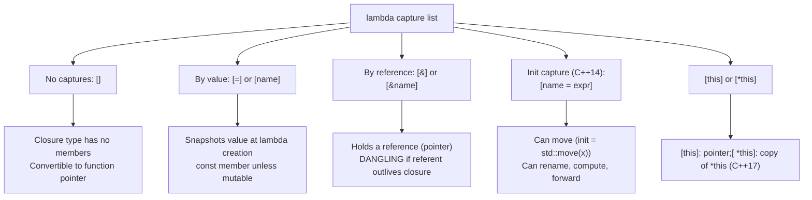
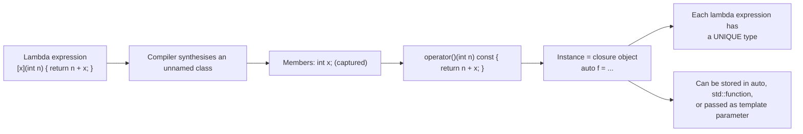
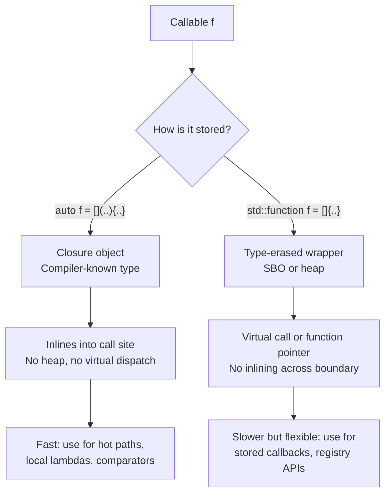

# Lambdas Deep Dive

> [!info] Scope
> Covers lambda syntax, all capture modes (`[]`, `[=]`, `[&]`, `[name]`, `[&name]`, `[this]`, `[*this]`), init-captures (C++14), generic lambdas (C++14), template lambdas (C++20), `mutable`, the closure object model, `std::function` for storing lambdas, recursive lambdas, `constexpr` and `consteval` lambdas (C++17/C++20), performance (inlining vs `std::function`), and the "lambda → closure object" mental model. Cross-references: [[1. auto and Type Deduction]], [[4. Move Semantics]], [[5. Perfect Forwarding]], [[7. std optional, std variant, std any]].

## Why This Matters

Lambdas are the most-used C++11 feature. They make `std::sort`, `std::find_if`, `std::transform`, `std::copy_if`, callbacks, event handlers, and DSLs ergonomic. Pre-lambda, the same code required a named function or function object (functor) declared away from the call site — destroying locality and readability.

```cpp
// Pre-C++11: functor defined far away
struct IsEven {
    bool operator()(int n) const { return n % 2 == 0; }
};
std::partition(v.begin(), v.end(), IsEven{});

// C++11+: lambda at the call site
std::partition(v.begin(), v.end(), [](int n) { return n % 2 == 0; });
```

But lambdas are not just syntactic sugar. They introduce real semantics:

- A lambda **creates a closure object** — an unnamed class with a templated or non-templated `operator()`. Captures become *members* of that class.
- The closure object has a **type** that only the compiler knows. You cannot spell it. You can store it in `auto` or in `std::function`.
- Each lambda expression has a **unique type**, even two lexically identical lambdas at different source locations.

Mastering lambdas means:

- Knowing the capture modes by heart and when each is correct.
- Understanding when `std::function` is appropriate (storage / type erasure) and when it is a performance bug (always-heap, no inlining).
- Knowing the C++14/17/20/23 extensions: init-captures, generic lambdas, template lambdas, `constexpr` lambdas, `static` call operators, `mutable`.
- Recognising dangling-reference bugs in capture-by-reference.

## Background

### Pre-lambda: function pointers and functors

```cpp
bool is_even(int n) { return n % 2 == 0; }
std::partition(v.begin(), v.end(), is_even);   // function pointer

struct IsEven {
    bool operator()(int n) const { return n % 2 == 0; }
};
std::partition(v.begin(), v.end(), IsEven{});  // functor
```

Function pointers cannot capture state. Functors can (via members), but require a separate class definition. Lambdas unify the two: a lambda is *literally* an anonymous functor generated by the compiler.

### The closure object model

When you write:

```cpp
int threshold = 10;
auto f = [threshold](int x) { return x > threshold; };
```

…the compiler generates (conceptually):

```cpp
struct __lambda_1 {
    int threshold;   // captured by value
    __lambda_1(int t) : threshold(t) {}
    bool operator()(int x) const { return x > threshold; }
};
auto f = __lambda_1{threshold};
```

- The lambda expression creates a **closure** of an unnamed class type.
- `auto f = ...` stores a **closure object** (an instance of that class).
- Each call `f(x)` invokes `operator()` (which is `const` by default — hence `mutable` is needed to mutate value-captured members).
- The closure type has a deleted default constructor, a defaulted copy/move constructor, and a deleted `operator=` (pre-C++20) or defaulted `operator=` (C++20+ under conditions).
- The closure type has an implicit conversion to a function pointer *if* the lambda is captureless. This conversion is implicit; with captures, it does not exist.

This model is essential because it explains every "weird" lambda behaviour:

- `mutable` is required to modify value-captured variables → because `operator()` is `const`, members cannot be modified.
- Two lambdas have different types → because the compiler synthesises two distinct classes.
- Capture-by-reference stores a reference → which can dangle if the referenced variable goes out of scope.
- `std::function` can store any lambda → because it type-erases through a virtual call.

## Main Content

### 1. Lambda Syntax

```cpp
[ capture-list ] ( parameters ) mutable -> return_type { body }
```

- **capture-list** (required, even if empty): which variables from the enclosing scope to bring into the closure.
- **parameters** (optional): like a function's parameter list. May be omitted if empty (C++14+ for `()`, but `[x]{}` is clearer).
- **mutable** (optional): allows modifying value-captured variables inside the body.
- **trailing return type** (optional): if omitted, the compiler deduces from the first `return` (C++14+ auto-deduction).
- **body** (required): the function body.

### 2. Capture Modes

| Syntax        | Meaning                                                                  |
|---------------|--------------------------------------------------------------------------|
| `[]`          | No captures.                                                             |
| `[=]`         | Capture all used variables **by value** (copy).                          |
| `[&]`         | Capture all used variables **by reference**.                             |
| `[name]`      | Capture `name` by value.                                                 |
| `[&name]`     | Capture `name` by reference.                                             |
| `[this]`      | Capture the enclosing object's `this` pointer (by value).                |
| `[*this]`     | Capture a **copy** of the enclosing object (C++17).                       |
| `[=, &x]`     | Default by-value, but `x` by reference.                                  |
| `[&, x]`      | Default by-reference, but `x` by value.                                  |
| `[name = expr]` | Init-capture (C++14): declare a member `name` initialised from `expr`.   |

> [!warning] Default capture modes `[=]` and `[&]` are dangerous
> `[=]` silently copies large objects you only meant to read. `[&]` silently captures references to locals that may not outlive the closure. Modern style guides (e.g., Herb Sutter's, the C++ Core Guidelines) recommend **explicit, named captures** (`[x, &y]`) almost always. The default-capture modes are convenient but a common source of subtle bugs.

### 3. Capture-by-Value

```cpp
int x = 10;
auto f = [x](int n) { return n + x; };    // x is copied into the closure
x = 99;                                    // does NOT affect the captured copy
f(5);                                      // returns 15 (5 + 10)
```

- The captured value is **snapshotted** at the point of lambda creation.
- Modifying the original `x` later does not affect the closure.
- Inside the body, the captured `x` is a `const` member unless `mutable` is used.

### 4. Capture-by-Reference

```cpp
int x = 10;
auto f = [&x](int n) { return n + x; };   // x is captured by reference
x = 99;
f(5);                                     // returns 104 (5 + 99)
```

- The closure holds a reference (technically a pointer under the hood).
- Mutations to the original `x` are visible.
- **Lifetime risk**: if `x` goes out of scope before `f` is destroyed, calling `f` is undefined behaviour.

```cpp
std::function<int(int)> make(int x) {
    return [&x](int n) { return n + x; };   // DANGLING: x is destroyed when make returns
}
```

> [!danger] Dangling reference in capture-by-reference
> Returning a lambda that captures a local by reference is **the** classic lambda bug. The local is destroyed at function return, leaving the closure with a dangling reference. Use capture-by-value or init-capture with `std::move` instead.

### 5. `mutable`

```cpp
int counter = 0;
auto next = [counter]() mutable { return ++counter; };
next();   // 1
next();   // 2
next();   // 3
// NOTE: counter (the original) is still 0 — we mutated the captured COPY.
```

Without `mutable`, the closure's `operator()` is `const`, and you cannot modify value-captured members. `mutable` removes the `const`. Each closure object has its own state, so two `next` objects would have separate counters.

### 6. `[this]` and `[*this]` (member-function context)

```cpp
class Widget {
    int data_ = 0;
public:
    std::function<int()> getter() {
        return [this]() { return data_; };   // captures this pointer by value
    }
    std::function<int()> safe_getter() {
        return [*this]() { return data_; };  // captures a copy of *this (C++17)
    }
};
```

- `[this]` captures the pointer. The closure accesses members through the pointer. If the `Widget` is destroyed before the closure, **dangling pointer**.
- `[*this]` (C++17) makes a copy of the current object. Safer for asynchronous contexts (callbacks that outlive the object). Requires the type to be copyable.

> [!tip] Default in C++20
> C++20 deprecates implicit `[=]` capture of `this` via `[=]`. You must write `[=, this]` explicitly or `[=, *this]`. This is a common silent-bug fix: `[=]` used to capture `this` implicitly when a member was accessed, which is rarely what you want.

### 7. Init-Captures (C++14)

```cpp
auto p = std::make_unique<int>(42);
auto f = [p = std::move(p)]() { return *p; };   // p is a new member, move-constructed
```

- The left-hand side `p` is the name of the *member* in the closure.
- The right-hand side `std::move(p)` is the *initializer expression*, evaluated in the enclosing scope.
- Init-captures let you:
  - **Move** objects into the closure (e.g., `unique_ptr`).
  - **Rename** captures: `[ndx = i]`.
  - **Compute** a value at capture time: `[pi = 3.14159]`.
  - **Bind a forwarding reference**: `[x = std::forward<T>(t)]`.

```cpp
// Capture a shared state by moving
auto worker = [queue = std::move(my_queue)]() mutable {
    while (!queue.empty()) {
        process(queue.front());
        queue.pop();
    }
};
```

### 8. Generic Lambdas (C++14)

```cpp
auto add = [](auto x, auto y) { return x + y; };
add(1, 2);          // int + int
add(1.5, 2.5);      // double + double
add(std::string("a"), std::string("b"));   // string + string
```

A `auto` parameter makes the `operator()` a **template**:

```cpp
struct __lambda {
    template <typename T, typename U>
    auto operator()(T x, U y) const { return x + y; }
};
```

This is essential for `std::for_each` over a heterogeneous range, for `std::sort` on a `std::vector<std::variant<...>>`, and for generic callback APIs.

### 9. Template Lambdas (C++20)

C++20 added explicit template parameter lists to lambdas:

```cpp
auto f = []<typename T>(std::vector<T> v) {
    return v.size();
};
f(std::vector<int>{1, 2, 3});   // OK
f(std::vector<double>{});       // OK
f(std::string("hi"));           // ERROR: not a std::vector
```

Template lambdas are useful when you need to:

- Constrain the parameter type.
- Use the type parameter `T` in the body (e.g., declare a `std::vector<T>` local).
- SFINAE on the parameter.

```cpp
auto sort_by_key = []<typename T, typename KeyFn>(std::vector<T>& v, KeyFn key) {
    std::sort(v.begin(), v.end(), [&key](const T& a, const T& b) {
        return key(a) < key(b);
    });
};
```

### 10. `std::function` for Storing Lambdas

```cpp
#include <functional>

std::function<int(int)> f = [](int x) { return x * 2; };
auto g = [](int x) { return x * 3; };   // g has an unnamed closure type

f = g;                                   // OK: g converts to std::function<int(int)>
```

`std::function` is a **type-erased** callable wrapper. It can store any callable matching a given signature. The price:

- **Heap allocation** (for closures larger than the SBO — typically 16-32 bytes).
- **Virtual call** (or function-pointer indirection) on every invocation.
- **No inlining** across the type-erasure boundary.
- **Exception on empty call** (`std::bad_function_call`).

Use `std::function` when:

- You need to **store** a callable in a member or container.
- You need a **stable type** for an API parameter (e.g., `void register_callback(std::function<void()>);`).
- You need to **type-erase** heterogeneous callables.

Use `auto` (or a template parameter) when:

- The callable is **local** and does not cross a type-erasure boundary.
- You want **inlining** (e.g., a comparator for `std::sort`).

```cpp
// GOOD: template parameter, inlines the lambda
template <typename F>
void for_each_local(std::vector<int>& v, F f) {
    for (auto& x : v) f(x);
}

// SOMETIMES NECESSARY: std::function, type-erases
class CallbackRegistry {
    std::vector<std::function<void()>> callbacks_;
public:
    void add(std::function<void()> f) { callbacks_.push_back(std::move(f)); }
};
```

### 11. Recursive Lambdas

A lambda cannot refer to itself by name inside its body — the name is not yet in scope. Three workarounds:

#### Workaround A: `std::function`

```cpp
#include <functional>
std::function<int(int)> fib = [&fib](int n) {
    return n < 2 ? n : fib(n - 1) + fib(n - 2);
};
fib(10);   // 55
```

Works, but `std::function` adds overhead per recursive call. Acceptable for casual use; avoid in hot loops.

#### Workaround B: a generic lambda with explicit `auto` argument

```cpp
auto fib = [](auto& self, int n) -> int {
    return n < 2 ? n : self(self, n - 1) + self(self, n - 2);
};
fib(fib, 10);   // 55
```

Clunky, but no `std::function` overhead. C++23's **deducing `this`** improves on this:

#### Workaround C: C++23 deducing `this`

```cpp
auto fib = [](this auto& self, int n) -> int {
    return n < 2 ? n : self(n - 1) + self(n - 2);
};
fib(10);   // 55
```

This is the modern, idiomatic recursive lambda. See [[9. C++20 and C++23 New Features]].

#### Workaround D: a named functor

```cpp
struct Fib {
    int operator()(int n) const {
        return n < 2 ? n : (*this)(n - 1) + (*this)(n - 2);
    }
};
Fib fib;
fib(10);
```

Pre-lambda approach. Still works; sometimes clearer.

### 12. `constexpr` and `consteval` Lambdas (C++17 / C++20)

C++17 made lambdas `constexpr`-friendly by default — if the body is `constexpr`-compatible, the `operator()` is `constexpr`.

```cpp
constexpr auto square = [](int x) { return x * x; };
static_assert(square(5) == 25);   // OK in C++17
```

C++20 added explicit `consteval` lambdas:

```cpp
consteval auto compile_time_only = [](int x) { return x * 2; };
int runtime_arg = read_input();
// int r = compile_time_only(runtime_arg);   // ERROR: runtime arg to consteval
int r2 = compile_time_only(42);              // OK
```

See [[8. constexpr and Compile-time Computation]].

### 13. Performance: Lambda Inlining vs `std::function`

```cpp
#include <algorithm>
#include <vector>
#include <functional>

void with_lambda(std::vector<int>& v) {
    std::sort(v.begin(), v.end(), [](int a, int b) { return a < b; });
}

void with_function(std::vector<int>& v) {
    std::function<bool(int, int)> cmp = [](int a, int b) { return a < b; };
    std::sort(v.begin(), v.end(), cmp);
}
```

`with_lambda` inlines the comparator into `std::sort`'s internals. `with_function` cannot — every comparison is a virtual call (or function-pointer indirection). For a 1M-element sort, the difference is ~2-5x in practice.

> [!tip] Performance rule
> Pass callables as template parameters (or `auto`) when you can; use `std::function` only when you must store or type-erase. For stored callbacks, consider `std::move_only_function` (C++23) for move-only callables.

### 14. `noexcept` Lambdas (C++17+) and Attributes

```cpp
auto f = [](int x) noexcept -> int { return x * 2; };
auto g = []() [[nodiscard]] { return 42; };
```

Lambdas support `noexcept` (C++17 makes it part of the type) and arbitrary attributes (C++17+).

### 15. Static Call Operators (C++23)

C++23 allows `static operator()`:

```cpp
auto f = []() static { return 42; };
```

A `static` call operator has no `this` pointer — the closure type has no captures. This enables better inlining, smaller closure size, and is required for some `constexpr`-context uses.

## Mermaid Diagrams

### Lambda Capture Modes



### Lambda → Closure Object



### Lambda vs `std::function` Performance



## Code Examples

### Example 1: STL with lambdas

```cpp
#include <algorithm>
#include <vector>
#include <iostream>

int main() {
    std::vector<int> v{5, 2, 8, 1, 9, 3};

    // Sort descending
    std::sort(v.begin(), v.end(), [](int a, int b) { return a > b; });

    // Find first even
    auto it = std::find_if(v.begin(), v.end(), [](int n) { return n % 2 == 0; });

    // Count > 4
    auto cnt = std::count_if(v.begin(), v.end(), [](int n) { return n > 4; });

    // Transform: square each
    std::transform(v.begin(), v.end(), v.begin(), [](int n) { return n * n; });

    for (int x : v) std::cout << x << ' ';
    return 0;
}
```

### Example 2: capture-by-value vs by-reference

```cpp
#include <vector>
#include <functional>

std::function<int(int)> make_adder_by_val(int n) {
    return [n](int x) { return x + n; };    // n copied; safe
}

std::function<int(int)> make_adder_buggy(int n) {
    return [&n](int x) { return x + n; };   // n captured by ref; DANGLING
}

int main() {
    auto add5 = make_adder_by_val(5);
    return add5(10);   // 15
}
```

### Example 3: `mutable` counter

```cpp
#include <iostream>
int main() {
    int counter = 0;
    auto next = [counter]() mutable { return ++counter; };
    std::cout << next() << next() << next() << '\n';   // 123
    std::cout << counter << '\n';                       // 0 (captured copy was mutated, not the original)
    return 0;
}
```

### Example 4: init-capture with move

```cpp
#include <memory>
#include <functional>

std::function<int()> make_owner() {
    auto p = std::make_unique<int>(42);
    return [p = std::move(p)]() { return *p; };   // move p into closure
}

int main() {
    auto f = make_owner();
    return f();   // 42
}
```

### Example 5: generic lambda

```cpp
#include <vector>
#include <string>
#include <algorithm>

template <typename T>
T sum(const std::vector<T>& v) {
    auto add = [](auto a, auto b) { return a + b; };   // generic lambda
    T result = T{};
    for (const auto& x : v) result = add(result, x);
    return result;
}

int main() {
    return sum(std::vector<int>{1, 2, 3});   // 6
}
```

### Example 6: C++20 template lambda

```cpp
#include <vector>
#include <concepts>

auto make_doubler = []<std::integral T>(T x) {
    return x * 2;
};

auto transform_vec = []<typename T>(std::vector<T>& v, auto fn) {
    for (auto& x : v) x = fn(x);
};
```

### Example 7: recursive lambda with C++23 deducing `this`

```cpp
#include <iostream>

int main() {
    auto fib = [](this auto& self, int n) -> int {
        return n < 2 ? n : self(n - 1) + self(n - 2);
    };
    std::cout << fib(10) << '\n';   // 55
    return 0;
}
```

### Example 8: `constexpr` lambda

```cpp
constexpr auto factorial = [](this auto& self, int n) -> int {
    return n <= 1 ? 1 : n * self(n - 1);
};

static_assert(factorial(5) == 120);   // OK in C++17+
```

### Example 9: lambda as a callback with `std::function`

```cpp
#include <functional>
#include <vector>
#include <iostream>

class Button {
    std::function<void()> on_click_;
public:
    void set_on_click(std::function<void()> f) { on_click_ = std::move(f); }
    void click() { if (on_click_) on_click_(); }
};

int main() {
    Button b;
    int count = 0;
    b.set_on_click([&count] { std::cout << "clicked " << ++count << '\n'; });
    b.click();   // clicked 1
    b.click();   // clicked 2
    return 0;
}
```

### Example 10: static call operator (C++23)

```cpp
auto square = [](int x) static { return x * x; };
// square's closure type has no captures, no this pointer
// operator() is a static member function
```

## Common Pitfalls

1. **`[&]` captures locals by reference, which may dangle**. If the closure outlives the function that created it (returned, stored in a member, passed to another thread), the captures dangle. Default to explicit, by-value captures.

2. **`[=]` captures `this` implicitly (pre-C++20)**. C++20 deprecated this; you must write `[=, this]` explicitly. If you only meant to capture a local but ended up capturing `this`, you may have a dangling pointer when the object is destroyed.

3. **Returning a lambda that captures a local by reference is UB**. Use by-value capture or init-capture with `std::move`.

4. **`mutable` changes per-closure state**. Two closure objects of the same lambda type have separate captured copies. `next` and `next2` from `auto next2 = next;` will produce different sequences after `mutable` mutation.

5. **`std::function` does not inline**. Using `std::function` as a comparator for `std::sort` is a 2-5x slowdown. Prefer template parameters for local callables.

6. **Calling an empty `std::function` throws `std::bad_function_call`**. Always check `if (f)` before calling, or ensure it is always set.

7. **Lambda types are unique**. You cannot put two different lambdas into a `std::vector<LambdaType>`. Use `std::function` or a custom polymorphic wrapper.

8. **Capture-by-value of large objects is expensive**. `[=]` copies every used variable. For a `std::vector<std::string>` you only read once, capture by reference: `[&v]`.

9. **Lambda capturing a moved-from `unique_ptr`**. `[p = std::move(p)]` moves `p` into the closure. After this, `p` in the enclosing scope is null. Easy to forget.

10. **`mutable` lambdas cannot be converted to function pointers**. A captureless lambda converts to a function pointer only if `operator()` is non-`mutable` (and captureless). A `mutable` captureless lambda still cannot convert — it would lose the `mutable` semantics.

11. **Recursive lambdas without C++23** are clunky. Use `std::function` (slow), the self-pass pattern (clunky), or a named functor (clearer).

12. **Generic lambdas and overload resolution**. A generic lambda's `operator()` is a template. Two overloads of the same generic lambda may produce surprising results with implicit conversions.

## Tips and Tricks

- **Prefer explicit, named captures** (`[x, &y]`) over default modes (`[=]`, `[&]`). It is more verbose but much safer.
- **Use `[&]` only inside the same scope** where the lambda is created and used. Never return such a lambda.
- **Use init-captures** to move, rename, or compute captured values: `[p = std::move(ptr)]`, `[n = compute()]`.
- **Use `[*this]` (C++17)** instead of `[this]` for async callbacks that may outlive the object.
- **Pass local lambdas as template parameters** for inlining. Pass stored callbacks as `std::function` (or `std::move_only_function` in C++23).
- **Use `[[nodiscard]]`** on lambdas returning important values: `auto f = [] [[nodiscard]] () { return 42; };`.
- **Use `constexpr` lambdas** for compile-time computation: `constexpr auto sq = [](int x) { return x * x; };`.
- **Use C++23 deducing `this`** for recursive lambdas: `[](this auto& self, int n) { ... }`.
- **Use C++20 template lambdas** when you need to constrain or name the parameter type: `[]<typename T>(std::vector<T>& v) { ... }`.
- **Combine with `std::bind` carefully** — lambdas are usually clearer than `std::bind`.
- **Use `std::move_only_function` (C++23)** for storing move-only callables (e.g., lambdas capturing `unique_ptr`).
- **Static call operators (C++23)** enable captureless closures with no `this` overhead.

## Active Recall

1. Write the closure type the compiler synthesises for `[x](int n) { return n + x; }`.
2. What is the difference between `[=]` and `[&]`? When is each safe?
3. Why does `[*this]` (C++17) exist? What problem does it solve over `[this]`?
4. Write an init-capture that moves a `std::unique_ptr<int>` into a closure.
5. What is a "generic lambda"? Write the equivalent functor.
6. Why does `auto fib = [](int n) { return n < 2 ? n : fib(n-1) + fib(n-2); };` not compile? Give three workarounds.
7. Why is `std::function` slower than a template-parameter lambda? When is `std::function` appropriate?
8. What does `mutable` do to a lambda's `operator()`? Why is it needed to modify value-captured variables?
9. Write a `constexpr` lambda that computes the factorial at compile time.
10. What does C++23's deducing `this` enable for recursive lambdas? Write an example.
11. Why does a `[=]` lambda in a member function implicitly capture `this` pre-C++20? What changed in C++20?

## Next Steps

- This note builds on [[4. Move Semantics]] (init-captures use `std::move`) and [[5. Perfect Forwarding]] (generic lambdas use `auto&&` + `std::forward`).
- See [[1. auto and Type Deduction]] for `auto` and `auto&&` in lambda parameters.
- See [[7. std optional, std variant, std any]] — `std::visit` with an overloaded lambda set is the modern pattern-match.
- See [[8. constexpr and Compile-time Computation]] for `constexpr` and `consteval` lambdas.
- See [[9. C++20 and C++23 New Features]] for template lambdas, deducing `this`, `std::move_only_function`, and static call operators.
- Cross-chapter: [[4. Functions and Program Structure/5. Function Pointers and Lambdas]] for the foundational material on function pointers and `std::function`.
