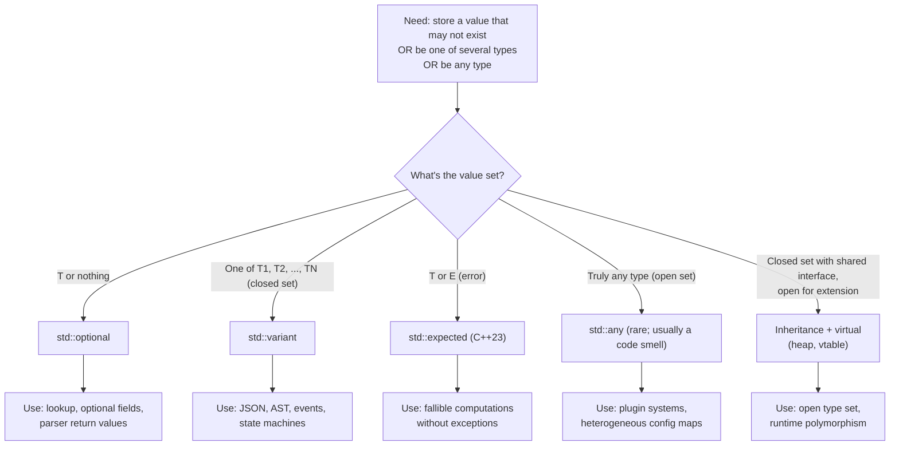

# std::optional, std::variant, std::any

> [!info] Scope
> Covers `std::optional<T>` (C++17), `std::variant<T1, T2, ...>` (C++17) with `std::visit`/`std::get`/`std::get_if`/`valueless_by_exception`, the overloaded-lambda pattern, `std::any` (C++17) with type erasure and `std::any_cast`, and a decision matrix comparing the three to polymorphism, `std::expected` (C++23), and tagged unions. Cross-references: [[2. Range-based for and Structured Bindings]], [[6. Lambdas Deep Dive]], [[9. C++20 and C++23 New Features]].

## Why This Matters

Three related problems recur in real C++ programs:

1. **"This function might not return a value."** A lookup may fail; a config option may be unset; a parse may produce no result. Pre-C++17, the idioms were: return a sentinel (`-1`, `nullptr`, default-constructed), return a `bool` and take an out-parameter, or throw an exception. All three have well-known downsides: sentinels conflate valid and invalid values, out-parameters are awkward to chain and cannot be used in `constexpr`, and exceptions are heavy and inappropriate for expected failures.

2. **"This value is one of several types."** A parsed JSON value is `null`, `bool`, `int`, `double`, `string`, `array`, or `object`. A UI event is `click`, `key`, `scroll`. Pre-C++17, the idioms were: a tagged union (manual, error-prone), an inheritance hierarchy with `dynamic_cast` (heap-allocates, vtable, RTTI), or `void*` (no type safety).

3. **"I want to store any single value, but I'll check the type at access time."** This is the `void*` use case with type-safe access. Pre-C++17, you wrote your own or used `boost::any`.

C++17 introduced three header-only types to solve these three problems:

- **`std::optional<T>`**: a value of type `T` *or* nothing.
- **`std::variant<T1, T2, ...>`**: a value of one of the listed types (a type-safe, discriminated union).
- **`std::any`**: a value of *any* type, with type-safe access via `std::any_cast`.

Together with `std::expected<T, E>` (C++23) for fallible computations that carry an error, these four types largely replace raw `void*`, sentinels, manual tagged unions, and many uses of exceptions. They are the foundation of modern, type-safe, value-oriented C++.

## Background

### `boost::optional`, `boost::variant`, `boost::any`

All three C++17 types descend directly from Boost counterparts (circa 2001-2005). Boost proved the API over a decade of real use; C++17 standardized them largely unchanged (with `noexcept` refinements and `constexpr` support).

### Why not exceptions for "expected failures"?

Exceptions are appropriate for *truly exceptional* failures (out of memory, IO error). They are inappropriate for failures that happen frequently (file-not-found in a glob loop, key-not-found in a lookup). Exceptions are also expensive when thrown (microseconds per throw on modern ABIs), and they propagate invisibly through call stacks, which complicates reasoning about control flow. `std::optional` and `std::expected` make the failure case explicit in the type signature.

### Why not inheritance for "one of several types"?

Inheritance + `dynamic_cast` works but has costs:

- Heap allocation per value (each derived object is `new`-ed).
- Vtable overhead per call.
- RTTI overhead per `dynamic_cast`.
- Lifetime complexity (who owns the pointer?).
- Cannot be `constexpr`.
- Cannot be stored by value in a container without slicing or smart-pointer dance.

`std::variant` is a value type — no heap, no vtable, no RTTI, `constexpr` (C++20+), and it lives on the stack or in a container directly.

## Main Content

### 1. `std::optional<T>`

`std::optional<T>` is a value of type `T` or "empty" (`std::nullopt`). The optional *contains* storage for a `T` (as a member), plus a flag indicating whether the storage holds a value.

#### Construction

```cpp
#include <optional>
#include <string>

std::optional<int> a;                       // empty
std::optional<int> b = std::nullopt;        // empty (explicit)
std::optional<int> c = 42;                  // contains 42
std::optional<int> d{42};                   // contains 42
std::optional<std::string> e = "hello";     // contains "hello"
std::optional<int> f = c;                   // copy: contains 42

// In-place construction (avoids temporaries):
std::optional<std::string> g{std::in_place, 5, 'x'};   // contains "xxxxx"
```

#### Inspection

```cpp
std::optional<int> o = 42;

if (o.has_value()) { /* ... */ }
if (o)             { /* ... */ }   // implicit conversion to bool

int a = *o;                // 42; UB if empty
int b = o.value();         // 42; throws std::bad_optional_access if empty
int c = o.value_or(0);     // 42; 0 if empty
int d = o.value_or_eval([]{ return compute_default(); });  // pre-C++23, custom; C++23 has or_else
```

#### Mutation

```cpp
std::optional<int> o;
o = 42;            // now contains 42
o.reset();         // empty (calls dtor of contained value if any)
o.emplace(99);     // empty -> construct 99 in place; or destroy old then construct
o = std::nullopt;  // empty
```

#### Use cases

- **Lookup that may fail**: `std::optional<User> find_user(int id);`
- **Config option that may be unset**: `std::optional<int> max_connections;`
- **Optional struct field**: `struct Contact { std::string name; std::optional<std::string> nickname; };`
- **Return value of a parse**: `std::optional<Config> parse(std::string_view text);`

```cpp
#include <optional>
#include <string>
#include <unordered_map>

struct User { int id; std::string name; };
std::unordered_map<int, User> db;

std::optional<User> find_user(int id) {
    auto it = db.find(id);
    if (it == db.end()) return std::nullopt;
    return it->second;
}

void greet(int id) {
    if (auto u = find_user(id)) {
        std::cout << "Hello, " << u->name << '\n';
    } else {
        std::cout << "Unknown user\n";
    }
}
```

> [!tip] `optional` for "absent" is better than a sentinel
> Returning `-1` for "not found" fails when `-1` is a valid value. Returning `nullptr` requires a pointer (heap or pointer-to-existing). `std::optional<T>` is a value type that explicitly says "may not be there".

### 2. `std::variant<T1, T2, ...>`

`std::variant<T1, T2, ...>` is a type-safe discriminated union. It holds a value of exactly one of the listed alternatives, plus a tag (the index of the current alternative).

#### Construction and access

```cpp
#include <variant>
#include <string>
#include <iostream>

std::variant<int, double, std::string> v;
v = 42;                                          // now holds int
v = 3.14;                                        // now holds double
v = "hello";                                     // now holds std::string

std::cout << std::get<int>(v) << '\n';          // ERROR: throws std::bad_variant_access (v holds string)
std::cout << std::get<std::string>(v) << '\n';  // OK: "hello"

if (auto p = std::get_if<int>(&v)) {
    std::cout << "int: " << *p << '\n';
} else {
    std::cout << "not int\n";
}

std::cout << "index = " << v.index() << '\n';   // 2 (the index of std::string)
```

#### `std::visit` — pattern matching

`std::visit(visitor, variant)` applies a callable to the contained value, with the correct type. The callable must accept every alternative.

```cpp
auto visitor = [](auto&& arg) {
    using T = std::decay_t<decltype(arg)>;
    if constexpr (std::is_same_v<T, int>) {
        std::cout << "int: " << arg << '\n';
    } else if constexpr (std::is_same_v<T, double>) {
        std::cout << "double: " << arg << '\n';
    } else if constexpr (std::is_same_v<T, std::string>) {
        std::cout << "string: " << arg << '\n';
    }
};

std::variant<int, double, std::string> v = 42;
std::visit(visitor, v);
```

#### The overloaded-lambda pattern

The canonical way to pattern-match a variant is the **overloaded** helper — a struct with multiple `operator()` overloads, constructed from lambdas:

```cpp
template <class... Fs>
struct overloaded : Fs... { using Fs::operator()...; };
template <class... Fs> overloaded(Fs...) -> overloaded<Fs...>;

std::variant<int, double, std::string> v = "hello";
std::visit(overloaded{
    [](int i)         { std::cout << "int: " << i << '\n'; },
    [](double d)      { std::cout << "double: " << d << '\n'; },
    [](const std::string& s) { std::cout << "string: " << s << '\n'; }
}, v);
```

This works in C++17 with CTAD (class template argument deduction) and the `using Fs::operator()...` pack-expansion.

> [!tip] C++24 / C++26 may add pattern matching
> The P2688 proposal (`inspect`) would add first-class pattern matching with destructuring, guards, and exhaustiveness checking. Until then, `overloaded` + `std::visit` is the idiomatic pattern-match.

#### `valueless_by_exception`

If an exception is thrown during a variant's assignment / emplace operation that changes the alternative, the variant may end up in a **valueless-by-exception** state. `v.valueless_by_exception()` returns `true`. This is rare in practice (requires an exception during a type change) but you should know it exists. `std::visit` on a valueless variant throws `std::bad_variant_access`.

#### Use cases

- **JSON / AST nodes**: `variant<Null, Bool, Int, Double, String, Array, Object>`.
- **Event types**: `variant<Click, KeyPress, Scroll, ...>`.
- **State machines**: `variant<Idle, Connecting, Connected, Error>`.
- **Result types** (pre-`std::expected`): `variant<T, Error>`.
- **Polymorphism without inheritance**: see the comparison below.

### 3. `std::any`

`std::any` is a type-erased container for *any* single value. Internally it stores a pointer to a heap-allocated copy of the value, plus type-info (or a type-erased deleter).

#### Construction and access

```cpp
#include <any>
#include <string>
#include <iostream>

std::any a = 42;
std::any b = "hello";
std::any c = std::string("world");

std::cout << std::any_cast<int>(a) << '\n';     // 42
// std::any_cast<double>(a);                    // THROWS std::bad_any_cast

if (auto p = std::any_cast<std::string>(&c)) {
    std::cout << *p << '\n';                    // world
}

std::cout << "type: " << c.type().name() << '\n';   // mangled name
std::cout << "has_value: " << c.has_value() << '\n';
c.reset();                                      // empty
```

#### Use cases

- **Plugin systems** where the type is determined at runtime.
- **Configuration maps** with heterogeneous values (`std::map<std::string, std::any>`).
- **Message passing** where the message body type is not known at compile time.

`std::any` is rarely the right choice in modern code. If you know the set of possible types, use `std::variant`. If you want a value-or-error, use `std::optional` or `std::expected`. `std::any` is a last resort.

> [!warning] `std::any` is a code smell
> Almost every use of `std::any` is better expressed as `std::variant` (when the type set is closed) or as a templated interface (when the type is open). `std::any` defeats type checking — the compiler cannot help you.

### 4. Comparison: optional vs variant vs any vs polymorphism vs `expected`

| Type / approach          | Closed type set? | Type-safe access? | Heap? | `constexpr`? | Best for                              |
|--------------------------|------------------|-------------------|-------|--------------|---------------------------------------|
| `std::optional<T>`       | T or empty       | Yes               | No    | C++20        | Optional value / lookup that may fail |
| `std::variant<Ts...>`    | Yes              | Yes (`visit`)     | No    | C++20        | One-of-N closed-set tagged union      |
| `std::any`               | No               | `any_cast` only   | Yes   | No           | Truly open type set (rare)            |
| Inheritance + virtual    | Closed           | Yes (vtable)      | Yes   | No           | Open type set, shared interface       |
| `std::expected<T, E>`    | T or E           | Yes               | No    | C++23        | Fallible computation with error info  |
| Raw tagged union         | Closed           | Manual            | No    | Yes          | C interop, micro-optimisation         |

### 5. `std::expected<T, E>` (C++23) — preview

`std::expected<T, E>` is `T` or `E` (an error). It is the type-safe alternative to exceptions for expected failures:

```cpp
#include <expected>
#include <string>

std::expected<int, std::string> parse_int(std::string_view s) {
    try {
        return std::stoi(std::string(s));
    } catch (const std::exception& e) {
        return std::unexpected(std::string(e.what()));
    }
}

void use() {
    auto r = parse_int("42");
    if (r) std::cout << *r << '\n';
    else   std::cout << "error: " << r.error() << '\n';

    auto r2 = parse_int("hello");
    int v = r2.value_or(0);   // 0
}
```

See [[9. C++20 and C++23 New Features]] for the full story.

### 6. `std::optional` and `std::variant` with structured bindings

You cannot directly structured-bind an `optional` (it is not a tuple-like type), but you can with `variant` via the `get<I>` protocol — sort of. In practice, you use `std::visit` for variants and `if (auto x = opt)` for optionals.

For monadic chaining (C++23 added `and_then`, `or_else`, `transform` on `optional`):

```cpp
std::optional<int> find_x();
std::optional<int> find_y(int x);
std::optional<int> find_z(int x, int y);

std::optional<int> result =
    find_x()
        .and_then([](int x) { return find_y(x); })
        .and_then([](int y) { return find_z(y, 0); });
```

This is the Rust-style `?` operator, C++ flavour. See [[9. C++20 and C++23 New Features]].

### 7. `std::variant` for state machines

```cpp
#include <variant>
#include <iostream>

struct Idle {};
struct Connecting { std::string host; };
struct Connected { int socket_fd; };
struct Error { std::string message; };

using State = std::variant<Idle, Connecting, Connected, Error>;

void print_state(const State& s) {
    std::visit(overloaded{
        [](Idle)                       { std::cout << "idle\n"; },
        [](const Connecting& c)        { std::cout << "connecting to " << c.host << '\n'; },
        [](const Connected& c)         { std::cout << "connected on fd " << c.socket_fd << '\n'; },
        [](const Error& e)             { std::cout << "error: " << e.message << '\n'; }
    }, s);
}

int main() {
    State s = Idle{};
    s = Connecting{"example.com"};
    s = Connected{42};
    s = Error{"timeout"};
    print_state(s);
    return 0;
}
```

This is the modern alternative to a class hierarchy with virtual functions. Each state is a value type, no heap, no vtable.

## Mermaid Diagrams

### `optional` / `variant` / `any` Decision Tree



### `std::visit` Pattern Matching Flow

```mermaid
sequenceDiagram
    participant V as std::variant<T1, T2, T3>
    participant Visit as std::visit
    participant Visitor as overloaded{...}
    participant Alt as current alternative
    V->>Visit: visit(visitor, v)
    Visit->>V: v.index() = i
    Visit->>Alt: alternative i = T_i
    Alt->>Visitor: dispatch to operator()(T_i)
    Visitor->>Visitor: matching lambda runs
    Visitor-->>Visit: result
    Visit-->>V: result returned
```

## Code Examples

### Example 1: `std::optional` for a lookup

```cpp
#include <optional>
#include <string>
#include <unordered_map>
#include <iostream>

std::optional<std::string> get_env(const std::string& key) {
    const char* v = std::getenv(key.c_str());
    if (v) return std::string(v);
    return std::nullopt;
}

int main() {
    auto home = get_env("HOME").value_or("/tmp");
    std::cout << "home = " << home << '\n';
    return 0;
}
```

### Example 2: `std::optional` with monadic operations (C++23)

```cpp
#include <optional>
#include <string>

std::optional<int> parse_int(std::string_view s);
std::optional<int> validate_positive(int x);

std::optional<int> parse_positive(std::string_view s) {
    return parse_int(s).and_then(validate_positive);
}

void use() {
    auto r = parse_positive("42");
    if (r) std::cout << *r << '\n';
}
```

### Example 3: `std::variant` for a JSON value

```cpp
#include <variant>
#include <vector>
#include <string>
#include <memory>
#include <map>
#include <iostream>

struct Null {};
using JsonValue = std::variant<
    Null,
    bool,
    int,
    double,
    std::string,
    std::vector<JsonValue>,
    std::map<std::string, JsonValue>
>;

void print(const JsonValue& v) {
    struct Printer {
        void operator()(Null)                            { std::cout << "null"; }
        void operator()(bool b)                          { std::cout << (b ? "true" : "false"); }
        void operator()(int i)                           { std::cout << i; }
        void operator()(double d)                        { std::cout << d; }
        void operator()(const std::string& s)            { std::cout << '"' << s << '"'; }
        void operator()(const std::vector<JsonValue>& a) {
            std::cout << '[';
            for (auto& el : a) { print(el); std::cout << ','; }
            std::cout << ']';
        }
        void operator()(const std::map<std::string, JsonValue>& o) {
            std::cout << '{';
            for (auto& [k, v] : o) { std::cout << '"' << k << "\":"; print(v); std::cout << ','; }
            std::cout << '}';
        }
        void print(const JsonValue& v) { std::visit(*this, v); }
    };
    Printer p;
    p.print(v);
}
```

### Example 4: the `overloaded` helper

```cpp
#include <variant>
#include <iostream>

template <class... Fs>
struct overloaded : Fs... { using Fs::operator()...; };
template <class... Fs>
overloaded(Fs...) -> overloaded<Fs...>;

int main() {
    std::variant<int, double, const char*> v = 3.14;
    std::visit(overloaded{
        [](int i)         { std::cout << "int: " << i << '\n'; },
        [](double d)      { std::cout << "double: " << d << '\n'; },
        [](const char* s) { std::cout << "string: " << s << '\n'; }
    }, v);
    return 0;
}
```

### Example 5: `std::any` for a heterogeneous config

```cpp
#include <any>
#include <string>
#include <map>
#include <iostream>

class Config {
    std::map<std::string, std::any> data_;
public:
    template <typename T>
    void set(const std::string& key, T value) { data_[key] = std::move(value); }

    template <typename T>
    std::optional<T> get(const std::string& key) const {
        auto it = data_.find(key);
        if (it == data_.end()) return std::nullopt;
        try {
            return std::any_cast<T>(it->second);
        } catch (const std::bad_any_cast&) {
            return std::nullopt;
        }
    }
};

int main() {
    Config c;
    c.set("port", 8080);
    c.set("host", std::string("localhost"));
    c.set("verbose", true);

    if (auto p = c.get<int>("port")) std::cout << *p << '\n';   // 8080
    return 0;
}
```

### Example 6: `std::expected` (C++23)

```cpp
#include <expected>
#include <string>
#include <fstream>

std::expected<std::string, std::string> read_file(const std::string& path) {
    std::ifstream f(path);
    if (!f) return std::unexpected("cannot open " + path);
    return std::string(std::istreambuf_iterator<char>(f), {});
}

int main() {
    auto r = read_file("/etc/hostname");
    if (r) std::cout << *r;
    else   std::cerr << "error: " << r.error() << '\n';
    return 0;
}
```

## Common Pitfalls

1. **`*opt` when `opt` is empty is UB**. Use `opt.value()` (throws) or `opt.value_or(default)`.
2. **Forgetting to check `opt.has_value()` before dereferencing**. The boolean conversion (`if (opt)`) is idiomatic.
3. **`std::get<T>(variant)` throws `std::bad_variant_access`** if the variant does not currently hold `T`. Use `std::get_if<T>(&variant)` for non-throwing access.
4. **`std::visit` with a non-exhaustive visitor fails to compile**. The visitor must accept every alternative.
5. **`std::variant` with duplicate alternatives** is allowed but ambiguous: `variant<int, int>` requires `get<0>` / `get<1>` (by index), not `get<int>`.
6. **`std::variant` and `valueless_by_exception`**. If a type-changing assignment throws, the variant can become valueless. Almost never happens in practice but you should know.
7. **`std::any_cast<T>(a)` throws `std::bad_any_cast`** on type mismatch. Use the pointer form `std::any_cast<T>(&a)` for non-throwing access.
8. **`std::any` requires the type to be copy-constructible**. Move-only types cannot be stored in `std::any`. (C++26 may add `std::any_move` or similar.)
9. **`std::optional<T>` requires `T` to be destructible** (and copy/move-constructible for the corresponding optional operations). `std::optional<reference_wrapper<T>>` is the workaround for "optional reference" pre-C++26 (C++26 may add `std::optional<T&>`).
10. **`std::optional` of a `bool`** is confusing: `if (opt)` checks if `opt` has a value, not if the value is `true`. Use `if (opt && *opt)`.
11. **`std::variant` and ABI**. The layout is implementation-defined; do not serialize a variant's bytes directly. Serialize the index and the value separately.
12. **`std::visit` and return types**. All overloads of the visitor must return the same type (or a common type). Use `if constexpr` inside a generic lambda if you need branch-specific logic.

## Tips and Tricks

- **Use `std::optional` for returns that may fail**, `std::variant` for closed-set unions, `std::expected` for fallible-with-error (C++23).
- **Use the `overloaded` helper** for clean `std::visit` pattern matching.
- **Use `std::get_if<T>(&v)`** for non-throwing access to a variant alternative.
- **Use `value_or`** to provide a default for an empty optional.
- **Use C++23 monadic operations** (`and_then`, `or_else`, `transform`) for chaining optionals.
- **Use `std::variant` for state machines** instead of inheritance — value semantics, no heap.
- **Use `std::visit` with a generic lambda** for "default" cases: `[](auto&&) { /* fallback */ }`.
- **Avoid `std::any`** unless you genuinely have an open type set. `std::variant` is almost always better.
- **Use `std::expected` (C++23)** instead of `std::variant<T, Error>` for clearer intent.
- **Combine with structured bindings** in C++17: `if (auto [it, ok] = m.try_emplace(k, v); ok)`.
- **Use `std::holds_alternative<T>(v)`** for a clean boolean check of which alternative is active.
- **`std::visit` is `constexpr`** in C++20+, so you can do compile-time pattern matching.

## Active Recall

1. What does `std::optional<T>` store? What is `sizeof(std::optional<T>)` approximately?
2. Why is `*opt` on an empty optional undefined behaviour? What is the safe alternative?
3. Write a function `find_user(int id) -> std::optional<User>` and a caller that prints the name or "not found".
4. How does `std::variant<int, double, std::string>` know which alternative is currently active?
5. Write the `overloaded` helper template. Why does `using Fs::operator()...;` work?
6. What is `std::valueless_by_exception` and when does it occur?
7. Compare `std::variant<T, E>` to `std::expected<T, E>`. Why is `expected` more expressive?
8. Why is `std::any` rarely the right choice? Give an example where it is genuinely needed.
9. What does `std::visit` do if the visitor does not handle every alternative?
10. Use C++23 monadic operations to chain two `std::optional<int>`-returning functions.
11. How would you implement a state machine using `std::variant`? Sketch the types and a transition function.

## Next Steps

- Continue to [[8. constexpr and Compile-time Computation]] — `std::optional` and `std::variant` are `constexpr` in C++20, opening compile-time pattern matching.
- See [[9. C++20 and C++23 New Features]] for `std::expected` (C++23), monadic operations on `std::optional` (C++23), and `std::move_only_function` (C++23).
- See [[6. Lambdas Deep Dive]] — the `overloaded` pattern depends on lambdas and `using Fs::operator()...`.
- See [[2. Range-based for and Structured Bindings]] — iterate a `std::vector<std::variant<...>>` with `for (auto& v : vec) std::visit(visitor, v);`.
- Cross-chapter: [[5. Structs, Unions, and Bit-Fields/2. Unions]] for the raw C-style union that `std::variant` replaces; [[9. Error Handling]] (eventual) for `std::expected` in context.
