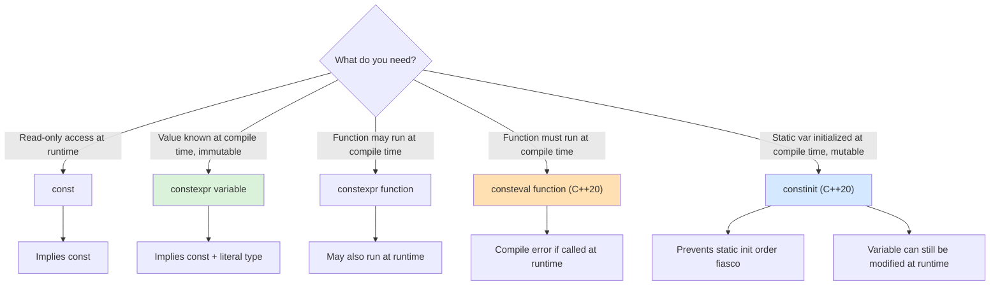
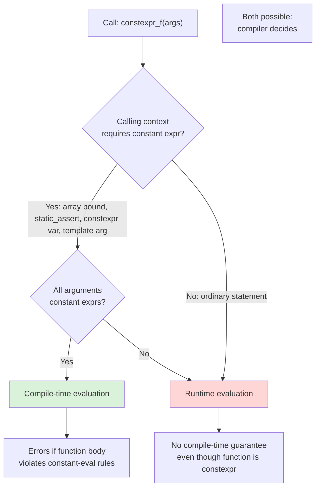
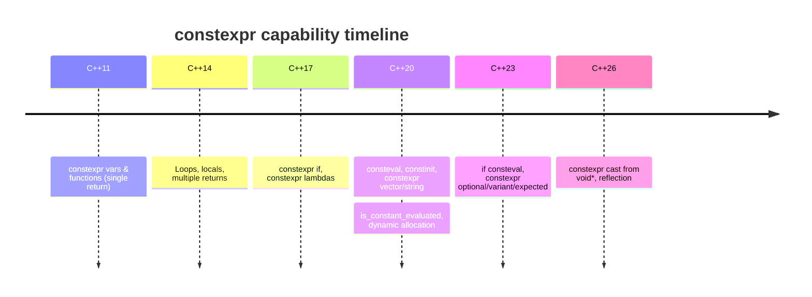

# constexpr and Compile-time Computation

> [!info] Scope
> This note covers `const`, `constexpr` (variables and functions), `constexpr if` (C++17), `consteval` (C++20), `constinit` (C++20), constexpr constructors, constexpr lambdas (C++17), constexpr `std::vector` and `std::string` (C++20), constexpr dynamic allocation, and the broader shift of "compile-time programming" in modern C++. Cross-references: [[1. auto and Type Deduction]], [[4. Move Semantics]], [[6. Lambdas Deep Dive]], [[9. C++20 and C++23 New Features]], [[10. Templates and Metaprogramming/7. Compile-time Computation]].

## Why This Matters

For the first thirty years of C++, "compile-time programming" meant **template metaprogramming (TMP)**. TMP is Turing-complete, but it is also painfully verbose, hostile to debug, and produces error messages that look like linker core dumps. `constexpr` (introduced in C++11 and progressively liberalized ever since) lets you write ordinary C++ code — `if`, `for`, `while`, recursion, local variables, even `std::vector` — that the compiler can execute **during compilation**. The result is the same performance as hand-written macros or TMP, but the source code is readable.

The strategic question every modern C++ engineer must be able to answer is:

> Given a value or computation, should it happen at compile time, link time, or run time?

`constexpr` lets you move work from run time to compile time without changing the syntax of the call site. `consteval` forces it. `constinit` guarantees that a static-storage-duration object is initialized at compile time without forcing the object itself to be `const`. Knowing which tool to reach for is a recurring interview topic and a daily decision in performance-sensitive code.

The payoff is enormous:

- **Zero run-time cost** for table generation, hashing, regular-expression compilation, format-string parsing.
- **Stronger type safety** — compile-time computed indices cannot overflow at run time.
- **Better diagnostics** — a `static_assert` fires at compile time, not in production.
- **Smaller binaries** — the compiler can fold and eliminate dead branches.
- **Embedded and freestanding environments** — computations done at compile time cost **zero flash, zero RAM, zero cycles**.

> [!warning] Anti-pattern
> Writing `const int x = 42;` and assuming it is a compile-time constant. It is not — `const` only means "read-only at the source level." If `x` were initialized from a function argument, it would be a run-time value that the compiler happens to forbid mutating. Use `constexpr` to actually guarantee compile-time evaluation.

## Background

### The three meanings of `const`

1. **`const` on a local variable** — read-only *for this scope*. The value may still be computed at run time. Example: `const int n = std::rand();`.
2. **`const` on a pointer or reference** — "I will not mutate through this handle."
3. **`const` on a namespace-scope integral initialized with a constant expression** — historically the *only* way to get a compile-time constant in C. The compiler *may* treat it as a constant expression; this is the famous "implicit `constexpr`" rule that C++11 made explicit.

C++11 introduced `constexpr` to **separate the two ideas**: "I will not mutate this" (`const`) and "this value is known at compile time" (`constexpr`). They are orthogonal: a variable can be `const` without being `constexpr`, and `constexpr` implies `const` for objects (a `constexpr` variable is non-mutable).

### The evolution of `constexpr`

| Standard | What changed |
|---|---|
| C++11 | `constexpr` variables and `constexpr` functions (single `return` statement only) |
| C++14 | `constexpr` functions may have loops, locals, `if`/`switch`, multiple returns |
| C++17 | `constexpr if` for conditional compilation; `constexpr` lambdas |
| C++20 | `consteval` (immediate functions), `constinit`, constexpr `std::vector`/`std::string`/`std::unordered_map`, constexpr dynamic memory, `std::is_constant_evaluated()` |
| C++23 | `if consteval`, more constexpr standard library (e.g. `std::optional`, `std::variant`, `std::expected`), `consteval` propagates `constexpr` |
| C++26 | `constexpr` cast from `void*`, more placement-`new` support, reflection-based compile-time metaprogramming |

The trajectory is clear: by C++26 essentially the entire standard library that does not perform I/O will be `constexpr`.

## Main Content

### 1. `constexpr` variables

A `constexpr` variable must be initialized with a constant expression. The type must be a **literal type** (see below).

```cpp
constexpr int max_size = 1024;            // OK, int literal
constexpr double pi = 3.14159265358979;   // OK, double literal
constexpr int cube = max_size * max_size * max_size; // OK, constexpr operands

int runtime_n = std::rand();
const int x = runtime_n;                  // OK, but NOT constexpr
constexpr int y = runtime_n;              // ERROR: not a constant expression
```

A `constexpr` variable is **implicitly `const`**. The reverse is not true.

```cpp
int main() {
    int n = 10;
    const int& cr = n;     // const, but not constexpr — bound to a runtime value
    constexpr int k = 20;  // constexpr → const
    // k = 30;             // ERROR: k is const
}
```

#### Literal types

A type is *literal* if it can be constructed, copied, and destroyed with constant expressions. Practically:

- Scalar types (`int`, `double`, pointers, enums).
- Arrays of literal types.
- Classes with `constexpr` constructors and trivial destructors (C++20 relaxes the destructor requirement).
- `std::nullptr_t`.

Non-literal types include types with virtual functions, types with non-`constexpr` constructors, and types that throw in their destructor.

### 2. `constexpr` functions

A `constexpr` function is one that **may** be evaluated at compile time. The "may" is critical: a `constexpr` function can also be called at run time. The compiler picks the evaluation context based on the arguments.

```cpp
constexpr int factorial(int n) {
    return n <= 1 ? 1 : n * factorial(n - 1);
}

int main() {
    constexpr int f5 = factorial(5);   // computed at compile time → 120
    int n;
    std::cin >> n;
    int f_n = factorial(n);            // computed at run time
    static_assert(f5 == 120);          // OK
}
```

In C++11, a `constexpr` function was restricted to a single `return` statement (the conditional expression above was the workaround). Since C++14, you can write essentially any ordinary code:

```cpp
constexpr int gcd(int a, int b) {
    while (b != 0) {
        int t = b;
        b = a % b;
        a = t;
    }
    return a < 0 ? -a : a;
}

static_assert(gcd(54, 24) == 6);
static_assert(gcd(1071, 462) == 21);
```

#### Important rules

- A `constexpr` function must have a literal return type and literal parameter types.
- It cannot be virtual.
- It cannot contain `try`/`catch` blocks (until C++20 relaxed this for constant evaluation).
- It cannot use `goto`, labels, or thread-local storage.
- It cannot modify a `const` object through `const_cast` — the constant-evaluation engine forbids UB at compile time.
- It can call other `constexpr` functions and `consteval` functions.
- It can use `if constexpr` (C++17) and `if consteval` (C++23).
- It can have local variables, loops, multiple `return`s (C++14+).
- It can perform dynamic allocation via `new`/`delete` (C++20) — but the allocation must be freed before the constant evaluation ends.

#### The `constexpr` "may" semantics — deep dive

This trips almost everyone:

```cpp
constexpr int square(int x) { return x * x; }

int main() {
    int n = 5;
    int r1 = square(n);          // RUNTIME — n is not a constant expression
    constexpr int r2 = square(5); // COMPILE TIME — 5 is a constant expression
    const int r3 = square(n);     // RUNTIME — n is not a constant expression,
                                  // even though r3 is const
}
```

A `constexpr` function is evaluated at compile time **only if**:

1. It is called in a context that requires a constant expression (e.g., array bound, `static_assert`, `constexpr` variable initializer, template argument), AND
2. All of its arguments are constant expressions.

If you call `square(n)` where `n` is a runtime value, the function is called normally at run time. `constexpr` is a *permission*, not a *command*.

### 3. `consteval` (C++20) — "must be constant"

`consteval` (an "immediate function") is `constexpr`'s strict sibling. A `consteval` function **must** produce a constant expression — calling it with runtime arguments is a compile error.

```cpp
consteval int compile_time_square(int x) { return x * x; }

int main() {
    constexpr int a = compile_time_square(5); // OK — compile time
    int n = 5;
    int b = compile_time_square(n);           // ERROR — n is not constant
}
```

Use `consteval` when:

- The function makes no sense at run time (e.g., parsing a format string into a compile-time data structure — `std::format` does this internally).
- You want to guarantee that callers do not accidentally invoke a runtime version.
- You are building a DSL (domain-specific language) that must run at compile time.

`consteval` functions can call `constexpr` functions, but the reverse is constrained: a `constexpr` function calling a `consteval` function must do so within a `consteval`-friendly context. C++23 added `if consteval` to make this dispatch clean.

```cpp
consteval int identity(int x) { return x; }

constexpr int maybe(int x) {
    if consteval {              // C++23
        return identity(x);     // OK — we are in a constant evaluation context
    }
    return x * 2;               // runtime path
}
```

### 4. `constinit` (C++20) — "initialized at compile time, but not const"

`constinit` solves a specific problem: **static initialization order fiasco**. Consider:

```cpp
// a.cpp
extern int compute_global();
int g_value = compute_global();  // dynamic initialization at run time

// b.cpp
extern int g_value;
const char* msg = g_value > 0 ? "positive" : "non-positive";
```

If `b.cpp`'s `msg` is initialized before `a.cpp`'s `g_value`, you read an uninitialized `g_value`. The fix is `constinit`:

```cpp
// a.cpp
constinit int g_value = 42;  // constant initialization, no SIOF risk
```

`constinit` requires **constant initialization** (a stronger, link-time-precise form of "compile-time initialization"). It does **not** require the variable to be `const`:

```cpp
constinit int counter = 0;  // initialized at compile time, but mutable at run time
void inc() { ++counter; }   // OK
```

You cannot use `constinit` on automatic (local) variables. It applies only to static or thread storage duration.

| Keyword | Initialized at | Mutable? |
|---|---|---|
| `const int x = 5;` (file scope) | Constant (if init is constant expr) | No |
| `constexpr int x = 5;` | Constant | No |
| `constinit int x = 5;` | Constant | Yes |
| `int x = 5;` (file scope) | Dynamic (zero, then 5) | Yes |
| `int x = f();` (file scope) | Dynamic (run time) | Yes |

### 5. `constexpr if` (C++17)

`if constexpr (condition)` causes the compiler to **discard** the false branch at template instantiation time. This eliminates SFINAE-based enable-if gymnastics.

```cpp
template <typename T>
auto get_value(T t) {
    if constexpr (std::is_pointer_v<T>) {
        return *t;
    } else if constexpr (std::is_integral_v<T>) {
        return t + 1;
    } else {
        return t;
    }
}
```

Without `if constexpr`, the branches that do not match `T` would still be type-checked, producing errors like "cannot dereference an int." With `if constexpr`, only the taken branch is instantiated.

Key facts:

- The condition must be a constant expression.
- The discarded branch's statements are **not instantiated**, but they are still **parsed** (they must be syntactically valid).
- The condition may depend on a template parameter.
- `else if constexpr` is just `else { if constexpr (...) {...} }`.
- Outside templates it works but is less useful — you can use a plain `if` and the optimizer will fold it.

### 6. `if consteval` (C++23)

`if consteval` is the C++23 successor to `std::is_constant_evaluated()` (C++20). It is a constant-expression-aware branch that lets you write a `constexpr` function which behaves differently at compile time vs run time.

```cpp
#include <type_traits>

constexpr int smart_hash(int x) {
    if consteval {
        // Compile-time path: use a slow but constexpr-friendly algorithm
        int h = 0;
        for (int i = 0; i < 32; ++i) h ^= (x >> i) & 1;
        return h;
    }
    // Runtime path: use a CPU intrinsic
    return __builtin_popcount(x);
}
```

Why `if consteval` instead of `std::is_constant_evaluated()`?

- `std::is_constant_evaluated()` is a normal function and its result can be ignored by over-eager optimizers in subtle cases.
- `if consteval` lets you call `consteval` functions inside the constant branch — `std::is_constant_evaluated()` does not.
- The semantics are cleaner: `if consteval` is *only* true during constant evaluation.

### 7. `constexpr` constructors

A `constexpr` constructor lets the type be constructed at compile time.

```cpp
struct Point {
    int x, y;
    constexpr Point(int x_ = 0, int y_ = 0) : x(x_), y(y_) {}
    constexpr int manhattan() const { return (x < 0 ? -x : x) + (y < 0 ? -y : y); }
};

constexpr Point origin;
constexpr Point p{3, 4};
static_assert(p.manhattan() == 7);

constexpr Point translate(Point pt, int dx, int dy) {
    return Point{pt.x + dx, pt.y + dy};
}

constexpr Point q = translate(p, -1, 2);
static_assert(q.x == 2 && q.y == 6);
```

The C++20 relaxation allows non-trivial destructors and even virtual base destruction inside constexpr contexts, which means classes owning dynamic memory can now be `constexpr`.

### 8. `constexpr` lambdas (C++17)

Lambdas are implicitly `constexpr` if possible. You can also be explicit:

```cpp
auto sq = [](int x) constexpr { return x * x; };          // explicit constexpr
auto sq2 = [](int x) consteval { return x * x; };         // C++20 consteval lambda
auto sq3 = [](int x) { return x * x; };                   // implicitly constexpr since C++17

static_assert(sq3(7) == 49);                              // OK
```

This is enormously useful for compile-time data processing pipelines:

```cpp
constexpr int sum_squares(int n) {
    int total = 0;
    auto add_square = [&](int i) constexpr { total += i * i; };
    for (int i = 1; i <= n; ++i) add_square(i);
    return total;
}
static_assert(sum_squares(10) == 385);
```

### 9. `constexpr` `std::vector` and `std::string` (C++20)

C++20 made dynamic allocation legal inside constant evaluation. The library followed: `std::vector`, `std::string`, `std::unordered_map`, and friends are now `constexpr`.

```cpp
#include <vector>
#include <string>
#include <algorithm>

constexpr int sum_of_sorted() {
    std::vector<int> v{5, 3, 1, 4, 2};
    std::sort(v.begin(), v.end());
    int total = 0;
    for (int x : v) total += x;
    return total;            // 15
}
static_assert(sum_of_sorted() == 15);

constexpr std::string greet(const char* who) {
    std::string s = "Hello, ";
    s += who;
    s += "!";
    return s;
}
// constexpr std::string msg = greet("world");  // OK in C++20 as a constexpr variable
```

#### The "constant evaluation must free all allocations" rule

A `constexpr` function may allocate during constant evaluation, but every allocation must be released before the function returns. If you return a `std::vector` from a `constexpr` function, the return-value optimization *during constant evaluation* moves the heap allocation across the return boundary without leaking.

This rule has consequences:

- `constexpr std::vector<int> v = ...;` is fine as a `constexpr` variable — the vector's destructor runs at compile time and frees the memory.
- You **cannot** make a `constexpr std::vector<int>` a global variable and use it at run time — the storage must be released at the end of constant evaluation. (C++26 may relax this.)
- This is why `constexpr std::string` exists: a C++20 `constexpr` function can build, manipulate, and return a string entirely at compile time, and the string will be moved/copied into the caller.

### 10. `std::is_constant_evaluated()` (C++20)

```cpp
#include <type_traits>

constexpr double fast_sqrt(double x) {
    if (std::is_constant_evaluated()) {
        // Compile-time: must use a constexpr-only algorithm
        return slow_constexpr_newton_raphson(x);
    } else {
        // Runtime: use a fast intrinsic
        return __builtin_sqrt(x);
    }
}
```

C++23 introduced `if consteval` as a preferred alternative. Prefer `if consteval` in new code; reserve `std::is_constant_evaluated()` for compilers and libraries that target C++20.

> [!warning] Common pitfall
> `if (std::is_constant_evaluated())` inside a non-`constexpr` function is always `false`. The function must be `constexpr` (or `consteval`) for the check to ever be `true`.

## Mermaid Diagrams

### Diagram 1: `const` vs `constexpr` vs `consteval` vs `constinit`



### Diagram 2: When does a `constexpr` function actually evaluate at compile time?



### Diagram 3: Evolution of `constexpr` capabilities across standards



## Code Examples

### Example 1: Compile-time Fibonacci with memoization

```cpp
#include <array>

template <std::size_t N>
struct FibonacciTable {
    std::array<unsigned long long, N> values{};
    constexpr FibonacciTable() {
        values[0] = 0;
        if (N > 1) values[1] = 1;
        for (std::size_t i = 2; i < N; ++i) {
            values[i] = values[i - 1] + values[i - 2];
        }
    }
};

constexpr FibonacciTable<50> fib_table{};

int main() {
    static_assert(fib_table.values[10] == 55);
    static_assert(fib_table.values[49] == 7778742049ULL);
    // Lookup at runtime is a direct array access — O(1), no computation.
    return static_cast<int>(fib_table.values[20]);
}
```

### Example 2: Compile-time CRC32

```cpp
#include <array>
#include <string_view>

constexpr std::array<uint32_t, 256> make_crc_table() {
    std::array<uint32_t, 256> t{};
    for (uint32_t i = 0; i < 256; ++i) {
        uint32_t c = i;
        for (int k = 0; k < 8; ++k) {
            c = (c & 1) ? (0xEDB88320u ^ (c >> 1)) : (c >> 1);
        }
        t[i] = c;
    }
    return t;
}

constexpr uint32_t crc32(std::string_view s) {
    constexpr auto table = make_crc_table();
    uint32_t crc = 0xFFFFFFFFu;
    for (char ch : s) {
        crc = table[(crc ^ static_cast<uint8_t>(ch)) & 0xFF] ^ (crc >> 8);
    }
    return crc ^ 0xFFFFFFFFu;
}

int main() {
    static_assert(crc32("Hello, world!") == 0xEC4AC3D0);
    constexpr uint32_t id = crc32("login_button");
    // id is a compile-time constant — perfect for use in a switch
}
```

### Example 3: `constexpr if` for variant-like dispatch

```cpp
#include <type_traits>
#include <iostream>

template <typename T>
void process(T value) {
    if constexpr (std::is_integral_v<T>) {
        std::cout << "integer: " << value << '\n';
    } else if constexpr (std::is_floating_point_v<T>) {
        std::cout << "float: " << value << '\n';
    } else if constexpr (std::is_pointer_v<T>) {
        std::cout << "pointer to " << *value << '\n';
    } else {
        std::cout << "unknown type\n";
    }
}

int main() {
    process(42);            // integer: 42
    process(3.14);          // float: 3.14
    int x = 7;
    process(&x);            // pointer to 7
    process("hello");       // pointer to h  (decays to const char*)
}
```

### Example 4: `consteval` for compile-time format-string parsing

```cpp
#include <stdexcept>

struct FormatSpec {
    int width = 0;
    char fill = ' ';
    bool left = false;
};

consteval FormatSpec parse_format(std::string_view spec) {
    FormatSpec fs;
    std::size_t i = 0;
    if (i < spec.size() && (spec[i] == '<' || spec[i] == '>' || spec[i] == '^')) {
        fs.left = (spec[i] == '<');
        ++i;
    }
    if (i < spec.size() && (spec[i] == '0' || spec[i] == ' ')) {
        fs.fill = spec[i++];
    }
    int w = 0;
    while (i < spec.size() && spec[i] >= '0' && spec[i] <= '9') {
        w = w * 10 + (spec[i++] - '0');
    }
    fs.width = w;
    if (i != spec.size()) throw std::invalid_argument("bad spec");
    return fs;
}

int main() {
    constexpr auto spec = parse_format("<05");  // left-align, fill '0', width 5
    static_assert(spec.left && spec.fill == '0' && spec.width == 5);
    // parse_format("<0" + std::to_string(5));  // ERROR — runtime string
}
```

### Example 5: `constinit` defeating the static initialization order fiasco

```cpp
// logger.hpp
#include <string_view>

class Logger {
public:
    constexpr Logger() = default;
    void log(std::string_view msg) const;
};

// logger.cpp
constinit Logger global_logger;   // constant-init at compile time, mutable at runtime
                                  // no SIOF possible

void Logger::log(std::string_view msg) const {
    // ... write to stderr ...
}

// usage from any TU, in any order:
extern Logger global_logger;
void early_init() { global_logger.log("starting"); }  // safe — global_logger already initialized
```

### Example 6: `constexpr std::vector` for compile-time sieve of Eratosthenes

```cpp
#include <vector>

constexpr std::vector<int> primes_up_to(int n) {
    std::vector<bool> sieve(n + 1, true);
    sieve[0] = sieve[1] = false;
    for (int i = 2; i * i <= n; ++i) {
        if (sieve[i]) {
            for (int j = i * i; j <= n; j += i) sieve[j] = false;
        }
    }
    std::vector<int> primes;
    for (int i = 2; i <= n; ++i) if (sieve[i]) primes.push_back(i);
    return primes;
}

int main() {
    constexpr auto primes = primes_up_to(100);
    static_assert(primes.size() == 25);
    static_assert(primes[0] == 2);
    static_assert(primes[24] == 97);
}
```

### Example 7: `if consteval` (C++23) — best of both worlds

```cpp
#include <cmath>

constexpr double my_sqrt(double x) {
    if consteval {
        // Compile-time Newton-Raphson
        double guess = x / 2.0;
        for (int i = 0; i < 50; ++i) {
            guess = (guess + x / guess) / 2.0;
        }
        return guess;
    } else {
        return std::sqrt(x);  // Hardware-accelerated intrinsic
    }
}

int main() {
    constexpr double r1 = my_sqrt(2.0);   // Compile-time — uses Newton-Raphson
    double r2 = my_sqrt(2.0);             // Runtime — uses std::sqrt
}
```

## Common Pitfalls

1. **Assuming `const` implies compile-time**. `const int x = rand();` is `const` but not constant. Use `constexpr` to force compile-time.
2. **Believing a `constexpr` function is always evaluated at compile time**. It is evaluated at compile time only when called in a context that requires a constant expression **and** all arguments are constant expressions.
3. **Forgetting the single-`return` rule of C++11**. If you target C++11, you cannot have loops or multiple returns in a `constexpr` function. Use the conditional expression (`?:`) and recursion. (Since C++14 this restriction is gone.)
4. **Mixing `consteval` and `constexpr` carelessly**. A `constexpr` function calling a `consteval` one must be in a constant-evaluation context. Use `if consteval` (C++23) for clean dispatch.
5. **Using `if (std::is_constant_evaluated())` in a non-`constexpr` function**. The branch is always `false`; the function must be `constexpr` or `consteval` for it to ever be `true`.
6. **Returning a `constexpr std::vector` from a function and trying to use it as a global**. C++20 requires allocations to be freed before constant evaluation ends; a global non-`const` vector cannot survive to runtime.
7. **Forgetting that `constexpr` lambdas require `constexpr`-callable captures**. A non-`constexpr` capture makes the lambda non-`constexpr`.
8. **Mutating through `const_cast` during constant evaluation**. The constant-evaluation engine flags this as UB and emits a compile error.
9. **`constinit` on automatic variables**. `constinit` applies only to static or thread storage duration. The compiler will reject `void f() { constinit int x = 0; }`.
10. **Assuming `constexpr` makes things faster**. A `constexpr` function called with runtime arguments runs at run time. It is no faster than an ordinary function — and may even be slower if the body was written for compile-time clarity rather than runtime speed.
11. **Forgetting `if constexpr`'s discarded branches are still parsed**. You cannot have syntax errors in a discarded branch, even though semantics are not checked.
12. **Using `constexpr` to mean "constant" in function signatures**. `constexpr` on a function says "this function *may* be evaluated at compile time," not "this function returns a constant." Mark a function `consteval` if you want to require compile-time.
13. **Recursive `constexpr` functions at very deep depth**. Compilers cap constexpr evaluation depth (typically 512–1024 frames). Use iteration in C++14+ to avoid the limit.
14. **`consteval` and templates**. A `consteval` function template still requires constant arguments; there is no "lazy" evaluation. Combine with `if consteval` if you need conditional behavior.

## Tips and Tricks

- **Default to `constexpr` for free functions**. It costs nothing and unlocks compile-time use. You can always downgrade later if a constraint cannot be met.
- **Use `consteval` for parsing and DSL construction**. Format strings, regex patterns, regex compile flags, JSON schema keys — anything that should "fail to compile" if malformed.
- **Use `constinit` for global singletons** to eliminate the static initialization order fiasco. This is the modern alternative to Meyers singletons.
- **Use `if constexpr` to replace SFINAE**. It is dramatically more readable and produces better error messages.
- **Use `if consteval` (C++23) instead of `std::is_constant_evaluated()`** in new code. It is more robust and lets you call `consteval` functions inside the constant branch.
- **Combine `constexpr` with `static_assert`** for "self-testing" code. A library's compile-time tests run on every build, for free.
- **Prefer `constexpr` variables over `#define` macros**. Macros have no scope, no type, and no debugging info. `constexpr int kBufSize = 1024;` is strictly better than `#define BUF_SIZE 1024`.
- **Prefer `constexpr` functions over template metaprogramming**. `factorial<n>()` as a `constexpr` function is clearer than `struct factorial { enum { value = n * factorial<n-1>::value }; };`.
- **Profile both compile-time and runtime paths**. A `constexpr` function called at runtime may be slower than a hand-tuned intrinsic. Use `if consteval` to dispatch.
- **Use `std::array` instead of C arrays** in `constexpr` contexts. `std::array` is a literal type and integrates with the standard algorithms.
- **Beware build times**. Heavy `constexpr` work can slow compilation dramatically. If a table is large and stable, generate it once with a code generator instead of computing it on every build.
- **`constexpr` destructors in C++20** allow owning types like `std::vector` and `std::string` to be `constexpr`. This opens up entire idioms — compile-time parsing, compile-time JSON validation, compile-time SQL query planning.
- **Use `consteval` constructors** to make a type that *cannot* be constructed at runtime — useful for handle types whose validity is verified at compile time.

## Active Recall

1. Explain the difference between `const`, `constexpr`, `consteval`, and `constinit` in one sentence each.
2. Why does `const int x = rand();` not satisfy `static_assert(x == anything)`?
3. Write a `constexpr` function `bool is_prime(int n)` and use it in a `static_assert`.
4. When does a `constexpr` function actually evaluate at compile time? Give the two necessary conditions.
5. What is the "single `return` rule" and which C++ standard removed it?
6. Why would you use `consteval` instead of `constexpr` for a format-string parser?
7. What problem does `constinit` solve that `constexpr` does not? Give a concrete example.
8. Convert the following SFINAE-based code to use `if constexpr`:
   ```cpp
   template <typename T,
             typename = std::enable_if_t<std::is_integral_v<T>>>
   T foo(T x) { return x + 1; }
   ```
9. Why does `constexpr std::vector<int> v = ...;` work as a local variable but not (in general) as a global variable with non-trivial lifetime?
10. What is the C++23 replacement for `std::is_constant_evaluated()` and why is it better?
11. Write a `consteval` function that parses a `std::string_view` like `"rgb(255,128,0)"` and returns a `struct Color { uint8_t r,g,b; }`. Demonstrate a `static_assert` on its output.
12. Why might a `constexpr` function be *slower* at runtime than a non-`constexpr` function that uses CPU intrinsics? How do you fix it?
13. Show how to memoize Fibonacci at compile time using a `constexpr` constructor.
14. What does `if constexpr (false) { undefined_symbol(); }` do? Why?

## Next Steps

- Continue to [[9. C++20 and C++23 New Features]] — `consteval`, `constinit`, `if consteval`, `std::is_constant_evaluated`, and constexpr standard library types are all part of the C++20/23 wave.
- See [[4. Move Semantics]] — move semantics interact with `constexpr` because C++20 allows constexpr `new`/`delete`, enabling `constexpr std::vector`.
- See [[6. Lambdas Deep Dive]] — lambdas are implicitly `constexpr` since C++17, and explicit `consteval` lambdas arrived in C++20.
- See [[10. Templates and Metaprogramming/7. Compile-time Computation]] for the broader perspective on TMP vs `constexpr`, including when each is appropriate.
- See [[1. auto and Type Deduction]] — `decltype(auto)` and `auto` return types combine cleanly with `constexpr` functions.
- Cross-chapter: [[12. Build Systems and Project Structure/5. CMake Basics]] — set `-std=c++20` or `c++23` to unlock `consteval`, `constinit`, `if consteval`.
