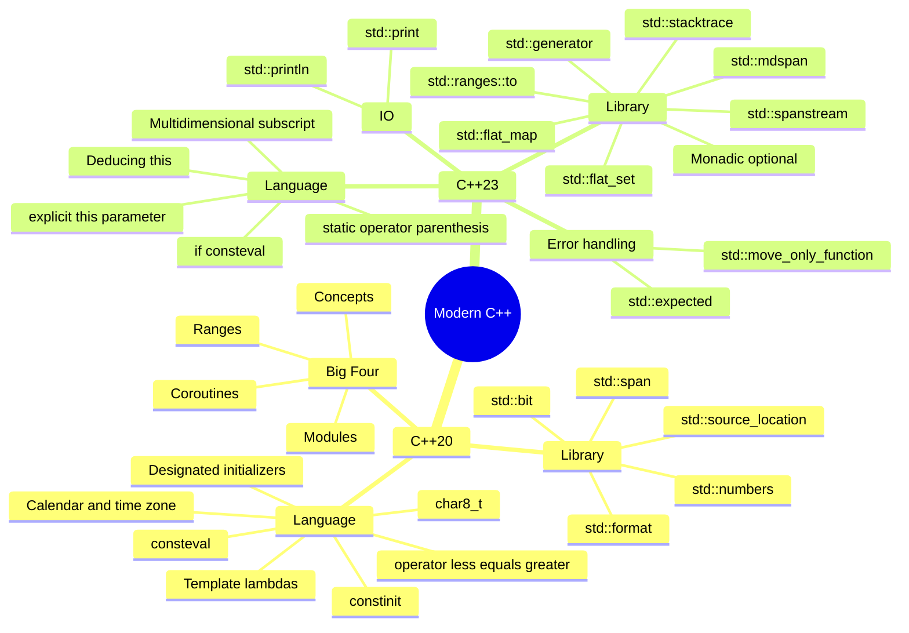
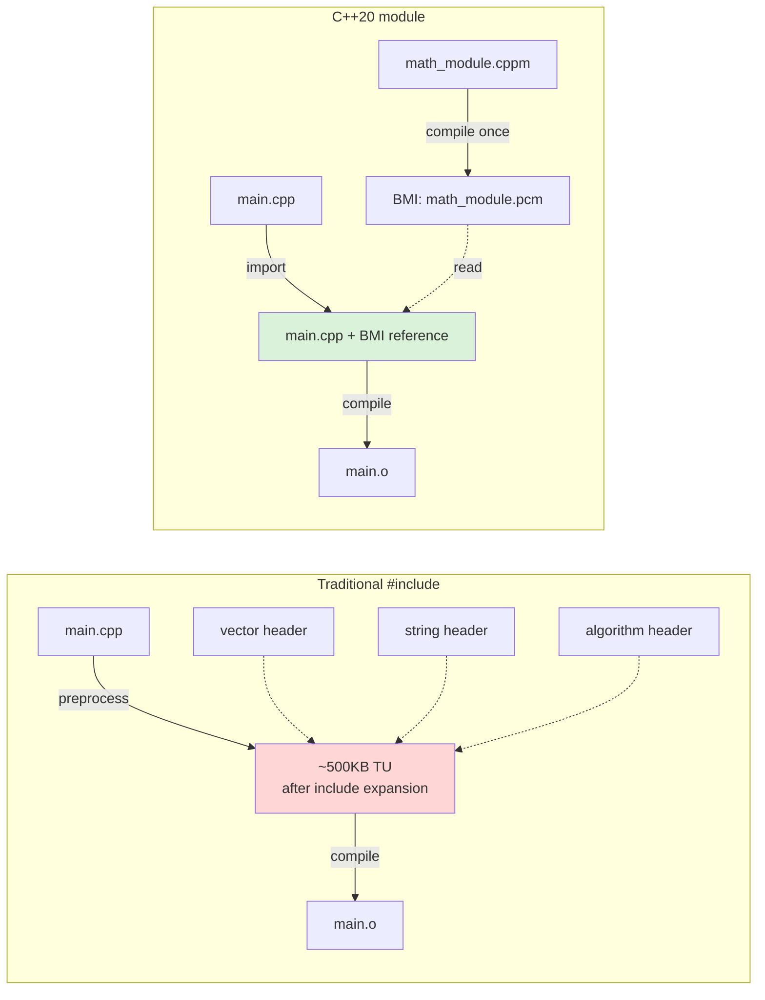
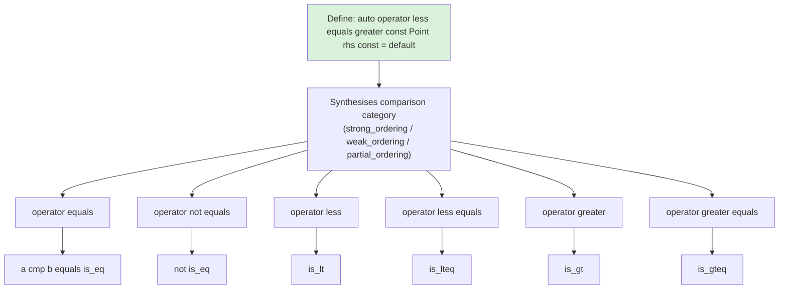

# C++20 and C++23 New Features

> [!info] Scope
> This note is a guided tour of the **Big Four** C++20 features (Concepts, Ranges, Coroutines, Modules) plus the smaller C++20 additions that show up in daily code (`std::span`, `std::format`, `operator<=>`, designated initializers, template lambdas, `consteval`, `constinit`), and the most impactful C++23 additions (`std::expected`, `std::print`/`std::println`, deducing `this`, `if consteval`, `std::mdspan`, multidimensional subscript). Cross-references: [[1. auto and Type Deduction]], [[4. Move Semantics]], [[6. Lambdas Deep Dive]], [[7. std optional, std variant, std any]], [[8. constexpr and Compile-time Computation]].

## Why This Matters

C++20 is the biggest release since C++11. Bjarne Stroustrup has called it "C++ 2.0" — and not as a joke. The standard introduced **four** features that each individually would have justified a major release:

1. **Concepts** — named, expressive constraints on template parameters, replacing decades of SFINAE gymnastics.
2. **Ranges** — composable, lazy pipelines over sequences, replacing the iterator-pair algorithm style.
3. **Coroutines** — stackless, compiler-supported suspendable functions, replacing hand-rolled state machines.
4. **Modules** — a real module system replacing the 50-year-old `#include` preprocessor model.

C++23 is the consolidation release. Where C++20 introduced huge features with rough edges, C++23 polishes them, fills the obvious gaps (`std::expected`, `std::print`), and adds a few quality-of-life improvements (`if consteval`, deducing `this`, multidimensional `[]`) that quietly change how everyday code is written.

The strategic question for an engineer is not "should I learn these?" — it is **"which of these does my codebase already use, and which ones should I adopt next?"** Modern C++ hiring loops increasingly assume at least Concepts and Ranges as basic literacy. Libraries like `{fmt}`, ASIO, Folly, and the C++ Standard Library itself are now designed in terms of C++20/23 idioms. Ignoring them is like writing C++98 in 2010 — technically possible, professionally limiting.

> [!warning] Anti-pattern
> Treating C++20 as "C++17 + a few new keywords." Concepts, Ranges, Coroutines, and Modules each represent a paradigm shift. Adopting them piecemeal (e.g., sprinkling `concept` declarations without rethinking template APIs) often produces code that is *worse* than the C++17 it replaces, because the new feature demands a different design style.

## Background

### Release timeline

| Standard | Released | Headline features |
|---|---|---|
| C++11 | 2011 | Move semantics, lambdas, smart pointers, `auto`, `decltype`, threads, `constexpr` (basic) |
| C++14 | 2014 | Generic lambdas, `constexpr` relaxation, `std::make_unique`, binary literals |
| C++17 | 2017 | Structured bindings, `string_view`, `optional`, `variant`, `any`, `if constexpr`, fold expressions |
| C++20 | 2020 | **Concepts, Ranges, Coroutines, Modules**, `std::span`, `std::format`, `<=>`, `consteval`, `constinit`, designated initializers |
| C++23 | 2023 | `std::expected`, `std::print`/`println`, deducing `this`, `if consteval`, `std::mdspan`, `std::flat_map`, multidimensional `[]`, `std::move_only_function`, `std::generator` |
| C++26 | 2026 (expected) | Reflection, pattern matching, contracts (maybe), `std::execution` senders/receivers |

### Why C++20 took so long

The C++20 cycle was originally planned for 2017 but slipped three years because of the magnitude of the changes. Modules required changes to the entire toolchain (compiler, build system, package manager). Coroutines required every standard library implementation to ship a coroutine header. Concepts had been in design for over 20 years (the original "concepts lite" proposal dates to 2003). The result is a coherent, well-integrated set of features — but also one that demands toolchain investment. Until 2023, GCC, Clang, and MSVC all had C++20 modules support in varying states of completeness; by 2024 they are largely aligned.

## Main Content

### 1. Concepts (C++20)

Concepts are **named, Boolean-valued constraints on template parameters**. They replace `enable_if`, `static_assert` + `is_*`, and SFINAE with a syntax that reads almost like English.

```cpp
#include <concepts>

// A concept: a Boolean predicate on types
template <typename T>
concept Numeric = std::integral<T> || std::floating_point<T>;

// Constrained function template
template <Numeric T>
T add(T a, T b) { return a + b; }

// Equivalent abbreviated form (T is deduced)
auto mul(Numeric auto a, Numeric auto b) { return a * b; }

int main() {
    add(1, 2);          // OK
    add(1.5, 2.5);      // OK
    // add("a", "b");   // ERROR: const char* does not satisfy Numeric
                       // Error message names the concept, not 500 lines of template spam
}
```

#### Standard-library concepts (`<concepts>`)

- **`std::integral<T>`, `std::floating_point<T>`, `std::signed_integral<T>`, `std::unsigned_integral<T>`**.
- **`std::same_as<T, U>`, `std::convertible_to<T, U>`, `std::common_with<T, U>`**.
- **`std::default_initializable<T>`, `std::movable<T>`, `std::copyable<T>`, `std::regular<T>`**.
- **`std::equality_comparable<T>`, `std::totally_ordered<T>`**.
- **`std::invocable<F, Args...>`, `std::predicate<F, Args...>`**.
- **`std::range<R>`, `std::input_range<R>`, `std::forward_range<R>`, `std::random_access_range<R>`**.
- **`std::ranges::range_value_t<R>`, `std::ranges::iterator_t<R>`** (type aliases, not concepts).

#### `requires` clauses and `requires` expressions

A `requires` clause constrains a template. A `requires` expression tests expressions on a type:

```cpp
template <typename T>
concept Addable = requires(T a, T b) {
    { a + b } -> std::convertible_to<T>;
    { a - b } -> std::same_as<T>;
};

template <typename T>
requires Addable<T> && std::copyable<T>
T sum(const std::vector<T>& v);
```

Concepts also enable **template partial ordering** and **better overload resolution** — you can overload a function on stronger concepts:

```cpp
template <std::input_iterator It>  void advance(It& it, int n);  // generic, slow
template <std::random_access_iterator It> void advance(It& it, int n);  // fast path
```

### 2. Ranges (C++20)

Ranges are a complete redesign of the STL algorithms library around three ideas:

1. **Algorithms take ranges, not iterator pairs.** `std::sort(v.begin(), v.end())` becomes `std::ranges::sort(v)`.
2. **Views** are lazy, composable, non-owning adapters. `v | views::filter | views::transform | views::take(5)` is a single pipeline that allocates nothing.
3. **Constrained algorithms** — every algorithm is now constrained with concepts, so overload resolution picks the most specific implementation.

```cpp
#include <ranges>
#include <algorithm>
#include <vector>
#include <iostream>

int main() {
    std::vector<int> v{1, 2, 3, 4, 5, 6, 7, 8, 9, 10};

    namespace rv = std::views;
    namespace rng = std::ranges;

    // Compose a lazy pipeline
    auto result = v
        | rv::filter([](int x) { return x % 2 == 0; })
        | rv::transform([](int x) { return x * x; })
        | rv::take(3);

    for (int x : result) std::cout << x << ' ';   // 4 16 36
}
```

#### Key views

- `views::filter`, `views::transform`, `views::take`, `views::take_while`, `views::drop`, `views::drop_while`.
- `views::reverse`, `views::keys`, `views::values` (for maps).
- `views::iota(start, stop)` — generates `[start, stop)`.
- `views::join` — flattens a range of ranges.
- `views::split` — splits a range on a delimiter.
- `views::zip` (C++23) — interleaves multiple ranges.
- `views::enumerate` (C++23) — `(index, value)` pairs.

#### Why ranges matter

- **No more `begin()`/`end()` boilerplate**. `rng::sort(v); rng::find(v, x); rng::copy(v, out);`.
- **Composition without allocation**. A pipeline of 5 views creates 5 wrapper iterator types and zero heap allocations.
- **Better error messages**. Type mismatches now fail against concepts, not 2000-line template instantiations.
- **Range adaptors work on any range** — `std::vector`, `std::array`, `std::map`, C arrays, `std::span`, custom types.

C++23 added `std::ranges::to<vector>(range)` to materialize a range into a container.

### 3. Coroutines (C++20)

Coroutines are functions that can **suspend** and **resume**. C++20 coroutines are **stackless**: the compiler transforms the function into a state machine and stores local variables in a heap-allocated frame.

```cpp
#include <coroutine>
#include <iostream>

// Minimal generator: yields ints one at a time
struct IntGenerator {
    struct promise_type {
        int current_value;
        IntGenerator get_return_object() { return {std::coroutine_handle<promise_type>::from_promise(*this)}; }
        std::suspend_always initial_suspend() { return {}; }
        std::suspend_always final_suspend() noexcept { return {}; }
        std::suspend_always yield_value(int v) { current_value = v; return {}; }
        void return_void() {}
        void unhandled_exception() { std::terminate(); }
    };
    std::coroutine_handle<promise_type> h;
    ~IntGenerator() { if (h) h.destroy(); }
    int next() { h.resume(); return h.promise().current_value; }
};

IntGenerator counter(int start, int stop) {
    for (int i = start; i < stop; ++i) co_yield i;
}

int main() {
    auto g = counter(1, 5);
    for (int i = 0; i < 4; ++i) std::cout << g.next() << ' ';   // 1 2 3 4
}
```

#### Key coroutine keywords

- `co_yield expr` — produce a value and suspend.
- `co_return expr` (or `co_return;`) — finish the coroutine, optionally producing a final value.
- `co_await expr` — suspend until an awaitable is ready.

#### The "C++20 gave us the mechanism, not the library" problem

C++20 ships the coroutine language machinery but **not** the standard library types — `std::generator`, `std::task`, `std::async`-equivalents. C++23 added `std::generator` (`<generator>`). For tasks and asynchrony, you currently use CppCoro, ASIO, Folly, or `std::execution` (C++26).

### 4. Modules (C++20)

Modules replace the `#include` preprocessor model with a proper **module** system. Benefits:

- **Faster compilation.** A module interface is compiled once; importers read the compiled binary module interface (BMI/CMI), not source text.
- **No header/implementation split.** A module file declares and defines in one place.
- **Macro isolation.** Macros do not leak across module boundaries.
- **Better encapsulation.** Modules can explicitly export only the names they want visible.

```cpp
// math_module.cppm  (module interface unit)
export module math_module;

export int square(int x) { return x * x; }
int helper(int x) { return x + 1; }   // not exported — invisible to importers

// main.cpp
import math_module;
int main() {
    return square(5);   // OK
    // helper(5);       // ERROR — not exported
}
```

Tooling reality (as of 2024): CMake 3.28+ has first-class module support; earlier versions require manual BMI tracking. GCC, Clang, and MSVC all support modules but with slight differences in file extensions and lookup. The migration story is improving but not seamless.

### 5. `std::span` (C++20)

A `std::span<T>` is a non-owning view over a contiguous sequence of `T`. It is the modern C++ equivalent of `(T* ptr, size_t len)`.

```cpp
#include <span>
#include <vector>
#include <array>

void process(std::span<int> data) {
    for (int& x : data) x *= 2;
}

int main() {
    int arr[] = {1, 2, 3};
    std::vector<int> v = {4, 5, 6, 7};
    std::array<int, 3> a = {8, 9, 10};

    process(arr);     // OK — decays C array
    process(v);       // OK — implicit conversion
    process(a);       // OK
    process({arr, 3});

    std::span<int, 3> fixed_span = a;   // compile-time known extent
}
```

`std::span` is the correct type for "function takes a buffer." It eliminates the `vector<int>&` vs `int*` vs `array<int,N>&` design question — accept `span<int>` (or `span<const int>` for read-only) and call it with any contiguous container.

### 6. `std::format` (C++20) and `std::print` (C++23)

`std::format` is the standard-library version of `{fmt}`. It replaces `printf` and `std::ostringstream` with a Python-style format-string syntax.

```cpp
#include <format>
#include <iostream>
#include <string>

int main() {
    std::string s = std::format("Hello, {}! You are {} years old.", "Alice", 30);
    std::cout << s << '\n';

    // Indexed arguments
    std::cout << std::format("{1} before {0}\n", "B", "A");

    // Format specs: width, fill, precision, type
    std::cout << std::format("[{:>10}]\n", 42);        // right-align width 10
    std::cout << std::format("[{:.3f}]\n", 3.14159);   // 3.142
    std::cout << std::format("[{:#x}]\n", 255);        // 0xff
}
```

C++23 added `std::print` and `std::println` which write directly to a stream (or `stdout`), avoiding the temporary `std::string` allocation:

```cpp
#include <print>

int main() {
    std::println("Hello, {}!", "world");   // prints with newline
    std::print("Pi ≈ {:.6f}\n", 3.14159265358979);
}
```

Custom types extend `std::format` by specializing `std::formatter<T>` — a much cleaner extension story than `operator<<` or `printf`.

### 7. Three-way comparison `operator<=>` (C++20)

The "spaceship operator" defines all six comparison operators (`==`, `!=`, `<`, `<=`, `>`, `>=`) in one shot. The compiler auto-generates the rest.

```cpp
struct Point {
    int x, y;
    auto operator<=>(const Point&) const = default;  // all six comparisons, lexicographic
};

int main() {
    Point a{1, 2}, b{1, 3};
    bool r1 = a < b;   // true (lexicographic on x then y)
    bool r2 = a == b;  // false
    bool r3 = a != b;  // true
}
```

#### Comparison categories

The return type of `<=>` depends on the semantics of the comparison:

| Category | Type | Natural domain |
|---|---|---|
| Strong ordering | `std::strong_ordering` | integers, doubles (when no NaN) |
| Weak ordering | `std::weak_ordering` | case-insensitive strings |
| Partial ordering | `std::partial_ordering` | floating-point with NaN |
| Strong equality | `std::strong_equality` (deprecated) | equality-only types |

You can also write `operator==` and let `<=>` synthesise the rest:

```cpp
struct Name {
    std::string s;
    bool operator==(const Name&) const = default;   // only == and !=
};
```

### 8. Designated initializers (C++20)

C++20 brought C99-style designated initializers (with the C++ restriction that designators must appear in declaration order):

```cpp
struct Color { uint8_t r, g, b; };
struct Style {
    Color fg;
    Color bg;
    int font_size;
    bool bold;
};

int main() {
    Style s{
        .fg = {255, 255, 255},
        .bg = {.r = 0, .g = 0, .b = 0},
        .font_size = 12,
        .bold = true
    };
    // Style s2{.bold = true, .font_size = 12};  // ERROR: must be in order
}
```

### 9. Template lambdas (C++20)

Lambdas can now be explicitly templated:

```cpp
auto add = []<typename T>(T a, T b) { return a + b; };

// Specialize on container types
auto first = []<typename T, typename Alloc>(const std::vector<T, Alloc>& v) {
    return v.front();
};

// Variadic
auto print_all = []<typename... Ts>(Ts... ts) {
    ((std::cout << ts << ' '), ...);   // fold expression
};
```

### 10. `consteval` and `constinit` (C++20)

Covered in [[8. constexpr and Compile-time Computation]]. Summary:

- `consteval` — must evaluate at compile time (an "immediate function").
- `constinit` — guarantees constant initialization of a static-storage-duration variable, without making it `const`.

### 11. `std::expected<T, E>` (C++23)

`std::expected` is the type for fallible operations that return a value or an error. It is the C++ equivalent of Rust's `Result<T, E>`.

```cpp
#include <expected>
#include <string>
#include <fstream>

std::expected<std::string, std::string> read_file(const std::string& path) {
    std::ifstream f(path);
    if (!f) return std::unexpected("cannot open " + path);
    return std::string(std::istreambuf_iterator<char>(f), {});
}

int main() {
    auto r = read_file("/etc/hostname");
    if (r) std::cout << *r;
    else   std::cerr << "error: " << r.error() << '\n';

    // Monadic chaining (C++23)
    auto upper = read_file("/etc/hostname")
                 .and_then([](std::string s) -> std::expected<std::string, std::string> {
                     for (auto& c : s) c = std::toupper(c);
                     return s;
                 });
}
```

C++23 monadic operations: `and_then`, `or_else`, `transform`, `transform_error`.

### 12. `std::print` / `std::println` (C++23)

See section 6 above. Type-safe, fast, no temporary string allocation.

### 13. Deducing `this` (C++23)

A member function can take `this` as an explicit parameter, deducing cv- and ref-qualifiers. This eliminates the const/non-const overload boilerplate.

```cpp
struct String {
    std::string data;

    // One function covers &, const&, &&, const&&
    template <typename Self>
    auto&& get(this Self&& self) {
        return std::forward<Self>(self).data;
    }
};

int main() {
    String s{"hello"};
    const String cs{"world"};
    String&& tmp = String{"temp"};

    std::string& a = s.get();          // Self = String&
    const std::string& b = cs.get();   // Self = const String&
    std::string&& c = tmp.get();       // Self = String&&
}
```

Deducing `this` also enables **recursive lambdas** and CRTP-like patterns without inheritance:

```cpp
// Recursive lambda via deducing this
auto fib = [](this auto& self, int n) -> int {
    return n < 2 ? n : self(n - 1) + self(n - 2);
};
std::cout << fib(10);   // 55
```

### 14. `if consteval` (C++23)

Covered in [[8. constexpr and Compile-time Computation]]. Replacement for `std::is_constant_evaluated()` that allows calling `consteval` functions inside the constant branch.

### 15. `std::mdspan` (C++23) and multidimensional `[]` (C++23)

`std::mdspan<T, Extents>` is the multidimensional counterpart to `std::span` — a non-owning view over N-dimensional data.

```cpp
#include <mdspan>
#include <vector>

int main() {
    std::vector<int> flat(3 * 4);
    std::mdspan<int, std::extents<size_t, 3, 4>> grid(flat.data());

    grid[0, 0] = 1;     // C++23 multidimensional subscript
    grid[2, 3] = 99;
    // grid[1, 1, 1] = 0;  // ERROR — wrong rank
}
```

C++23's `operator[](size_t, size_t, ...)` lets you define multidimensional subscript on your own types too. This finally retires the awkward `m(i, j)` function-call syntax that libraries like Eigen and Blaze had been forced to use.

### 16. Other notable C++23 additions

- **`std::move_only_function`** — a `std::function` that can hold move-only callables (e.g., lambdas capturing `std::unique_ptr`).
- **`std::flat_map`, `std::flat_set`** — sorted-container adapters backed by contiguous storage, faster lookup than `std::map` for small N.
- **`std::generator`** — the standard coroutine generator type, finally.
- **`std::ranges::to<C>(r)`** — materialize a range into a container.
- **`std::byteswap`** — endian conversion.
- **`std::stacktrace`** — capture a stack trace portably.
- **`std::spanstream`** — `std::stringstream` over a span, no allocation.
- **`std::optional` monadic ops** — `and_then`, `or_else`, `transform`.
- **`constexpr` enhancements** — `std::optional`, `std::variant`, `std::expected` are `constexpr`.
- **Static call operators** — lambdas and callables with `static operator()` avoid the implicit `this` parameter for stateless functors.
- **`#elifdef` / `#elifndef`** — preprocessor nicety.
- **Character encoding** — `char8_t` (C++20) refinements, `<text_encoding>`.

## Mermaid Diagrams

### Diagram 1: C++20 and C++23 feature overview



### Diagram 2: Decision tree — which C++20/23 feature should I use?

```mermaid
flowchart TD
    Q["What problem are you solving?"]
    Q -->|"Constrain a template"| CONCEPTS["Concepts"]
    Q -->|"Iterate / filter / transform a sequence"| RANGES["Ranges + Views"]
    Q -->|"Async / suspendable function"| CORO["Coroutines (use std::generator or ASIO)"]
    Q -->|"Faster, cleaner builds"| MODULES["Modules"]
    Q -->|"Function takes a buffer"| SPAN["std::span"]
    Q -->|"Type-safe string formatting"| FORMAT["std::format / std::print"]
    Q -->|"Define all six comparisons"| SPACESHIP["operator less equals greater"]
    Q -->|"Fallible op returning value or error"| EXPECTED["std::expected (C++23)"]
    Q -->|"One function for ref and const ref overloads"| DEDUCING["Deducing this (C++23)"]
    Q -->|"Must compute at compile time"| CEVAL["consteval / if consteval"]
    Q -->|"Multi-dim array view"| MDSPAN["std::mdspan + multidim []"]

    style CONCEPTS fill:#d9f2d9
    style RANGES fill:#d9f2d9
    style CORO fill:#ffe0b3
    style MODULES fill:#ffe0b3
    style EXPECTED fill:#d4e8ff
    style DEDUCING fill:#d4e8ff
```



### Diagram 3: Module import vs traditional include compilation flow



### Diagram 4: How `operator<=>` synthesises the other comparisons



## Code Examples

### Example 1: Concepts in practice — a constrained `Buffer` type

```cpp
#include <concepts>
#include <vector>
#include <span>
#include <cstddef>

template <typename T>
concept Byte = std::same_as<T, char> || std::same_as<T, unsigned char>
            || std::same_as<T, std::byte>;

template <Byte T>
class Buffer {
    std::vector<T> storage_;
public:
    void append(std::span<const T> data) {
        storage_.insert(storage_.end(), data.begin(), data.end());
    }
    std::span<const T> view() const { return storage_; }
    std::size_t size() const { return storage_.size(); }
};

int main() {
    Buffer<std::byte> b;
    std::byte raw[] = {std::byte{1}, std::byte{2}, std::byte{3}};
    b.append(raw);
    // Buffer<int> bad;   // ERROR: int does not satisfy Byte concept
}
```

### Example 2: Ranges pipeline — top 3 even squares

```cpp
#include <ranges>
#include <vector>
#include <algorithm>
#include <iostream>

int main() {
    std::vector<int> v{1, 2, 3, 4, 5, 6, 7, 8, 9, 10};

    namespace rv = std::views;

    auto top3 = v
        | rv::filter([](int x) { return x % 2 == 0; })
        | rv::transform([](int x) { return x * x; })
        | rv::take(3);

    // C++23: materialize into a vector
    auto result = top3 | std::ranges::to<std::vector>();
    // result == {4, 16, 36}
}
```

### Example 3: Coroutine generator (simplified)

```cpp
#include <coroutine>
#include <iostream>

template <typename T>
struct Generator {
    struct promise_type {
        T current;
        Generator get_return_object() {
            return {std::coroutine_handle<promise_type>::from_promise(*this)};
        }
        std::suspend_always initial_suspend() noexcept { return {}; }
        std::suspend_always final_suspend() noexcept { return {}; }
        std::suspend_always yield_value(T v) { current = v; return {}; }
        void return_void() {}
        void unhandled_exception() { std::terminate(); }
    };

    std::coroutine_handle<promise_type> h_;
    explicit Generator(std::coroutine_handle<promise_type> h) : h_(h) {}
    Generator(Generator&& g) noexcept : h_(std::exchange(g.h_, {})) {}
    ~Generator() { if (h_) h_.destroy(); }

    struct iterator {
        std::coroutine_handle<promise_type> h;
        iterator& operator++() { h.resume(); return *this; }
        T& operator*() const { return h.promise().current; }
        bool operator!=(std::default_sentinel_t) const { return !h.done(); }
    };
    iterator begin() { h_.resume(); return {h_}; }
    std::default_sentinel_t end() { return {}; }
};

Generator<int> fibonacci() {
    int a = 0, b = 1;
    while (true) {
        co_yield a;
        std::swap(a, b);
        b += a;
    }
}

int main() {
    int count = 0;
    for (int x : fibonacci()) {
        std::cout << x << ' ';
        if (++count == 10) break;
    }
    // 0 1 1 2 3 5 8 13 21 34
}
```

### Example 4: Modules — a small library

```cpp
// geometry.cppm
export module geometry;

export struct Point { double x, y; };

export double distance(Point a, Point b) {
    double dx = a.x - b.x, dy = a.y - b.y;
    return sqrt(dx * dx + dy * dy);   // sqrt from <cmath> must be imported too
}

// internal helper, not exported
double squared(double x) { return x * x; }

// main.cpp
import geometry;
int main() {
    Point a{0, 0}, b{3, 4};
    return static_cast<int>(distance(a, b));   // 5
}
```

### Example 5: `std::span` as the universal buffer type

```cpp
#include <span>
#include <vector>
#include <array>
#include <cstdint>

// One function accepts any contiguous byte buffer.
std::uint32_t checksum(std::span<const std::byte> data) {
    std::uint32_t crc = 0xFFFFFFFFu;
    for (auto b : data) crc = (crc >> 8) ^ table[(crc ^ std::to_integer<unsigned>(b)) & 0xFF];
    return crc ^ 0xFFFFFFFFu;
}

int main() {
    std::byte raw[4] = {std::byte{1}, std::byte{2}, std::byte{3}, std::byte{4}};
    std::vector<std::byte> v{std::byte{5}, std::byte{6}};
    std::array<std::byte, 2> a{std::byte{7}, std::byte{8}};

    checksum(raw);
    checksum(v);
    checksum(a);
}
```

### Example 6: `std::format` and `std::print`

```cpp
#include <format>
#include <print>
#include <vector>
#include <chrono>

int main() {
    std::vector<int> v{1, 2, 3};

    // C++20: format to string
    std::string s = std::format("vector has {} elements: {{{}}}", v.size(), v.size());
    // → "vector has 3 elements: {3}"

    // C++23: print directly
    std::println("Pi = {:.10f}", 3.14159265358979);   // Pi = 3.1415926536
    std::println("[{:>5}] [{:<5}] [{:^5}]", 42, 42, 42);  // [   42] [42   ] [ 42  ]

    // Custom formatter for a Point
    struct Point { int x, y; };
    // (would require specializing std::formatter<Point> — omitted for brevity)
}
```

### Example 7: `operator<=>` for a Date type

```cpp
#include <compare>
#include <cstdint>

struct Date {
    std::int16_t year;
    std::uint8_t month, day;

    auto operator<=>(const Date&) const = default;
    // Generates ==, !=, <, <=, >, >= using lexicographic comparison
    // Return type: std::strong_ordering (because all members are integral)
};

int main() {
    Date a{2024, 6, 15}, b{2024, 12, 1};
    static_assert(a < b);
    static_assert(a != b);
    static_assert(a <= a);
}
```

### Example 8: `std::expected` with monadic chaining

```cpp
#include <expected>
#include <string>
#include <charconv>
#include <system_error>

std::expected<int, std::string> parse_int(std::string_view s) {
    int value{};
    auto [ptr, ec] = std::from_chars(s.begin(), s.end(), value);
    if (ec != std::errc{}) return std::unexpected("parse error: " + std::string(s));
    return value;
}

std::expected<int, std::string> invert(int x) {
    if (x == 0) return std::unexpected("division by zero");
    return 1000 / x;
}

int main() {
    // Chain: parse → invert → format
    auto result = parse_int("25")
        .and_then(invert)
        .transform([](int x) { return std::to_string(x); });

    if (result) std::println("ok: {}", *result);
    else        std::println("err: {}", result.error());
}
```

### Example 9: Deducing `this` for const/non-const overloads

```cpp
#include <string>
#include <string_view>

class Config {
    std::string data_;
public:
    // Single function covers &, const&, &&, const&&
    template <typename Self>
    std::string_view get(this Self&& self) {
        return self.data_;
    }

    template <typename Self>
    void set(this Self&& self, std::string_view s) {
        self.data_ = s;
    }
};

int main() {
    Config c;
    c.set("hello");
    std::string_view v = c.get();   // mutable Config&

    const Config cc;
    std::string_view cv = cc.get(); // const Config& — still works, returns string_view

    Config&& tmp = Config{};
    tmp.set("temp");                // Config&&
}
```

### Example 10: `std::mdspan` with multidimensional subscript

```cpp
#include <mdspan>
#include <vector>
#include <numeric>

int main() {
    constexpr int rows = 4, cols = 5;
    std::vector<int> flat(rows * cols);
    std::iota(flat.begin(), flat.end(), 0);

    std::mdspan<int, std::extents<std::size_t, rows, cols>> grid(flat.data());

    // C++23 multidimensional subscript
    for (int i = 0; i < rows; ++i) {
        for (int j = 0; j < cols; ++j) {
            std::print("{:3} ", grid[i, j]);
        }
        std::println();
    }

    // Submdspan (C++26) would let you slice rows/cols
    // auto row0 = std::submdspan(grid, 0, std::full_extent);
}
```

## Common Pitfalls

1. **Treating C++20 as "C++17 + Concepts"**. The Big Four (Concepts, Ranges, Coroutines, Modules) are each paradigm shifts. Adopt them in isolation only after reading their respective design rationale.
2. **Range adaptor pipelines that allocate**. `views::filter` etc. are lazy and allocate nothing, but `ranges::to<vector>()` materializes. If you accidentally call `to` in a hot loop, you have reintroduced `std::vector` allocation.
3. **Coroutine lifetimes**. A coroutine frame lives on the heap until `destroy()` is called. Forgetting to destroy a coroutine leaks memory; double-destroying is UB. Use RAII wrapper types (`std::generator`, ASIO's `awaitable`).
4. **Module tooling fragmentation**. As of 2024, GCC, Clang, and MSVC use different file extensions and BMI formats. CMake 3.28+ helps; earlier build systems need manual BMI tracking.
5. **`std::span` lifetime dangers**. A `std::span<int>` does not extend the lifetime of its source. Returning a `span` from a function that owns the source dangles.
6. **`operator<=>` for floating-point types**. The default `<=>` on a struct containing a `double` returns `std::partial_ordering`, not `std::strong_ordering` — NaN breaks total ordering. Decide whether that is acceptable for your type.
7. **Designated initializers must be in declaration order**. Unlike C99, C++ forbids out-of-order designators. `S{.b = 1, .a = 2}` is an error.
8. **Concepts and ADL**. Concepts participate in overload resolution differently from SFINAE. A function constrained by a stronger concept is preferred, but subtle ambiguities still arise.
9. **`std::expected` is not `std::variant`**. `expected<T, E>` carries semantic intent ("this may fail with E"). Use `variant<T, E>` only when both alternatives are equally valid values.
10. **`std::format` performance vs `printf`**. `std::format` is generally faster than `std::ostringstream` but slower than `printf` for trivial types. Use `std::print` (C++23) for the best of both — type-safety and speed.
11. **Modules and macros**. Macros do not cross module boundaries. If your library exports macros for backward compatibility, you still need a header. Mix `import` and `#include` carefully.
12. **Coroutines and exceptions**. By default, an exception thrown from a coroutine body calls `std::terminate` (unless `unhandled_exception()` saves it via `std::current_exception`). ASIO coroutines and C++23 `std::generator` handle this differently — know your library.
13. **`if consteval` vs `if constexpr`**. They look similar but mean different things: `if constexpr` discards a branch at compile time based on a constant condition; `if consteval` dispatches based on whether the *current evaluation* is happening at compile time.
14. **Deducing `this` and recursion**. Recursion through deducing `this` requires the `this auto&& self` form. Direct self-recursion in a lambda without deducing `this` is impossible because the lambda has no name.

## Tips and Tricks

- **Start with Concepts and Ranges**. They have the highest payoff-per-effort and the lowest migration risk. Almost any codebase can adopt them incrementally.
- **Defer Modules until your toolchain catches up**. Modules are transformative but require compiler, build system, and CI buy-in. If your project is CMake-based, wait for CMake 3.28+.
- **Use `std::span` everywhere you previously wrote `(T*, size_t)`**. It self-documents intent and prevents the most common buffer-length mistakes.
- **Use `std::format`/`std::print` instead of `printf` and `ostringstream`**. The exception-safety and type-safety wins alone justify the migration.
- **Adopt `operator<=>` for new types**. Reserve explicit comparison operators for types with non-lexicographic ordering.
- **Use `std::expected` instead of exceptions or out-parameters** for fallible functions in libraries intended to be used in environments where exceptions are disabled or costly.
- **Use `std::ranges::to<C>(r)` (C++23)** to materialize a range pipeline into a container — much cleaner than the C++20 workaround of `std::vector<int>(r.begin(), r.end())`.
- **Use deducing `this` to eliminate the const/non-const member function pair**. The pattern `template <typename Self> auto& get(this Self&& self)` covers all four ref-qualifier combinations.
- **Use `if consteval` instead of `std::is_constant_evaluated()`** in C++23 code. It is faster (no function call overhead) and lets you call `consteval` functions inside the constant branch.
- **Use `std::mdspan` for multidimensional data**. It interoperates with BLAS/LAPACK libraries and supports custom layouts (e.g., padded strides, tiled layouts).
- **Use `std::move_only_function` (C++23)** instead of `std::function` when the callable owns move-only resources (`std::unique_ptr`, file handles, etc.).
- **Use `std::flat_map` for small maps**. Backed by two contiguous vectors, it has better cache locality than `std::map`'s red-black tree for N < ~1000.
- **Use `std::stacktrace` (C++23)** for portable stack traces in error paths — finally, no need for `backtrace_symbols` or platform-specific code.
- **Use `std::generator` (C++23)** instead of hand-rolled coroutine promise types for sequence generation.
- **Read the C++23 migration guide before adopting**. Many C++20 features were quietly extended in C++23 (e.g., ranges gained `ranges::to`, `views::zip`, `views::enumerate`; `std::format` gained `std::print`).

## Active Recall

1. Name the C++20 "Big Four" features and one sentence on why each matters.
2. Write a concept `Container<T>` that requires `T` to have `begin()`, `end()`, and `size()` returning an integral type.
3. Convert `std::sort(v.begin(), v.end()); std::copy_if(...)` to a single ranges pipeline.
4. Explain the difference between a coroutine and a thread. Why are C++20 coroutines called "stackless"?
5. Write a minimal `Generator<int>` coroutine that yields 0, 1, 2, 3.
6. What are the three advantages of modules over `#include`?
7. Why does `void f(std::span<int>)` accept a `std::vector<int>`, a `std::array<int, N>`, and a C array `int[N]`?
8. Use `std::format` to print `3.14159` with 4 decimal places, padded to width 10 with leading zeros.
9. Write a `struct Date { int y; int m; int d; };` with `operator<=>` such that `Date{2024,6,15} < Date{2024,12,1}` is true.
10. What is `std::expected<T, E>`? When should you prefer it over exceptions? When over `std::optional<T>`?
11. What does `template <typename Self> auto& data(this Self&& self)` do, and what four overloads does it replace?
12. What is the difference between `if constexpr (cond)` and `if consteval`?
13. Use `std::mdspan` to represent a 4x4 matrix and access element `[2][3]` via the C++23 multidimensional `[]` operator.
14. Give one C++23 feature that improves compile times. Give one that improves runtime.
15. Why is `std::move_only_function` (C++23) necessary alongside `std::function`?

## Next Steps

- This concludes Chapter 8: Modern C++. Move to [[9. Object-Oriented Programming/1. Classes and Objects]] for the next major chapter, where OOP techniques combine cleanly with the modern features you just learned (move semantics, `constexpr`, smart pointers).
- See [[10. Templates and Metaprogramming/5. Concepts (C++20)]] for a deeper Concepts treatment and [[10. Templates and Metaprogramming/3. Variadic Templates]] for fold expressions and variadic patterns.
- See [[11. STL Deep Dive/8. Ranges (C++20)]] for a deep Ranges tour and [[11. STL Deep Dive/7. Algorithms]] for the constrained-algorithm counterparts.
- See [[8. constexpr and Compile-time Computation]] for the `consteval`/`constinit`/`if consteval` deep dive.
- See [[7. Memory Management/5. Smart Pointers]] for `std::move_only_function` and lambda capture of `std::unique_ptr`.
- See [[13. Error Handling and Exceptions/5. std expected and std error code]] for `std::expected` in a full error-handling context.
- Cross-chapter: [[12. Build Systems and Project Structure/2. Headers, Include Guards, Modules]] covers the build-system side of C++20 modules.
