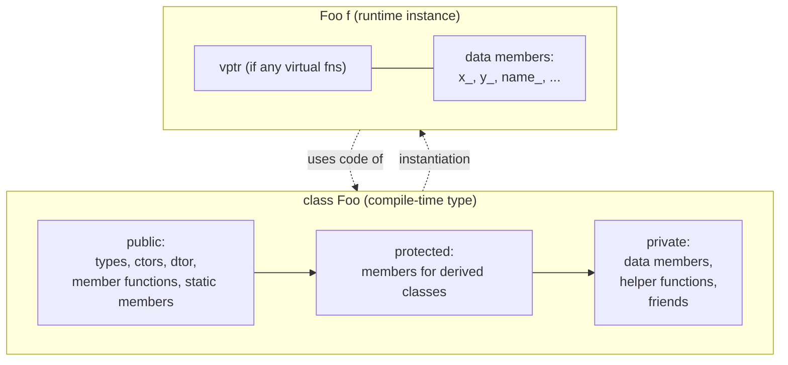
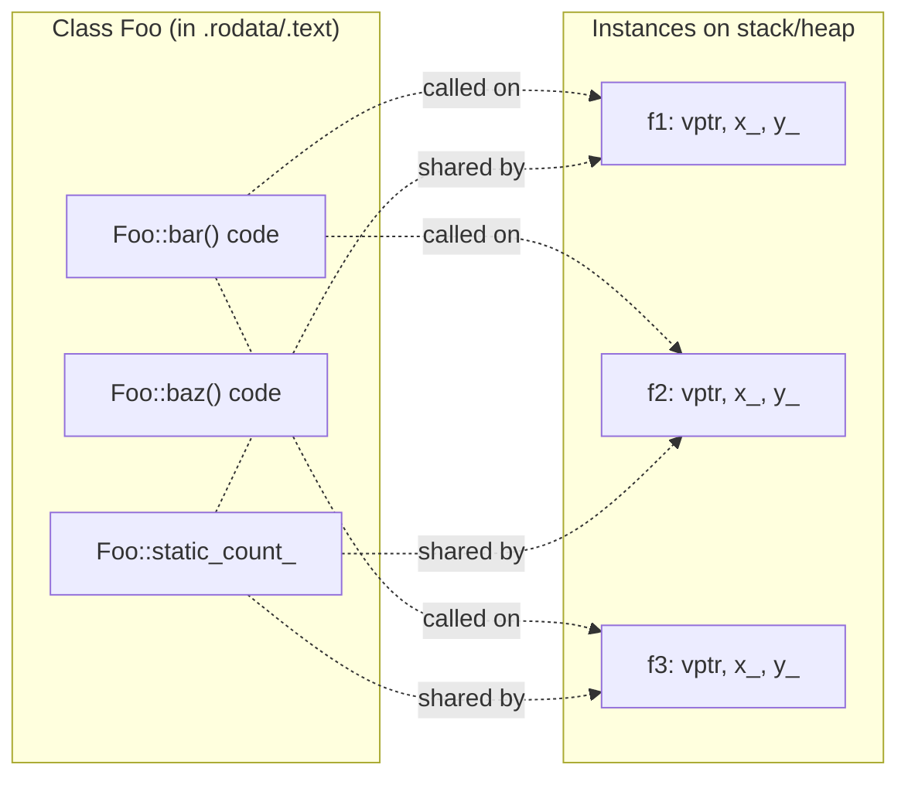

# Classes and Objects

## Why This Matters

Every non-trivial C++ program is built from types that model real or abstract entities: a `BankAccount`, a `Texture`, a `HttpRequest`, a `RingBuffer`. C++ gives you one primary mechanism to define such types — the `class` — and one way to instantiate them — the `object`. Everything else in object-oriented C++ (inheritance, polymorphism, encapsulation, RAII, move semantics, template constraints) is layered on top of the simple act of writing `class Foo { ... };` and then writing `Foo f;`.

If you do not deeply internalize the distinctions between a *class* (a type, a blueprint, a compile-time concept) and an *object* (an instance, a runtime chunk of memory with a definite address and lifetime), then every later topic — virtual dispatch, copy elision, the Rule of Five, `static` members, `const` correctness — will feel like arbitrary rules instead of consequences of one coherent model. This note builds that model carefully, then connects it forward to the rest of [[9. Object-Oriented Programming|Chapter 9]].

## Background

C++ inherited `struct` from C, where a struct was literally just a bag of bytes with named offsets — no methods, no access control, no inheritance. Bjarne Stroustrup's contribution in *C with Classes* (1979, later renamed C++) was to graft onto C structs three things: **member functions**, **access control**, and **constructors/destructors**. To signal "this is a richer type, not just a C struct," he introduced the `class` keyword. Simula 67, the language that inspired C++'s OOP facilities, had already established the class/object dichotomy and the notions of inheritance and subclass polymorphism.

The crucial design choice Stroustrup made — and one that surprises Java and C# programmers — is that `struct` and `class` in C++ are *the same language feature*. The only technical difference is the default access specifier. Convention, not the language, decides when you reach for one keyword over the other.

## Main Content

### 1. The Class vs. Object Distinction

A **class** is a type. It exists at compile time. It has no address, no lifetime, no memory footprint beyond whatever the compiler needs in its symbol tables. It describes:

- What member variables (data) objects of this type contain.
- What member functions (behavior) operate on that data.
- What access rules apply.
- What constructors and destructors initialize and tear down the data.

An **object** is a specific instance of a class. It exists at runtime. It has a definite address (or, in the case of objects kept entirely in registers, a definite identity), a definite lifetime (storage duration), and concrete values in its member variables.

```cpp
class Point {        // <-- this is the class (compile-time blueprint)
public:
    Point(double x, double y) : x_(x), y_(y) {}
    double x() const { return x_; }
    double y() const { return y_; }
private:
    double x_, y_;
};

int main() {
    Point a(1.0, 2.0);   // <-- 'a' is an object (automatic storage, on the stack)
    Point b(3.0, 4.0);   // <-- 'b' is another object, same class, different state
    // Point itself does not occupy memory here; only a and b do.
}
```

### 2. `class` vs. `struct` — the One Real Difference

The *only* technical difference is the default member-access specifier and the default base-class access specifier:

| Keyword | Default member access | Default inheritance access |
|---------|----------------------|----------------------------|
| `struct` | `public`             | `public`                   |
| `class`  | `private`            | `private`                  |

That's it. Both can have member functions, constructors, destructors, virtual functions, inheritance, templates, friends, static members, etc. The following two definitions produce semantically identical types:

```cpp
struct S { int a; private: int b; };
class  C { int b; public:  int a; };
```

**Convention** (Stroustrup, Sutter, most modern style guides):

- Use `struct` for **passive aggregates of data** — types whose job is to hold values, with few or no invariants and a trivial interface. Think `struct Color { uint8_t r, g, b; };`.
- Use `class` for **types with invariants** — types that own resources, maintain internal consistency, or expose a non-trivial interface. Think `class FileHandle { ... };`.

This convention lets a reader infer intent instantly from the keyword: "struct = plain data, class = invariant-bearing type." Cross-reference: [[5. Structs, Unions, and Bit-Fields/1. Structs|Chapter 5 on Structs]].

### 3. Anatomy of a Class

A class body can contain, in any order (though a conventional order is widely used):

1. **Access specifiers**: `public:`, `protected:`, `private:` (and `friend` declarations, which are not access specifiers but grant access).
2. **Member variables** (data members): may be `const`, `static`, `mutable`, references, arrays, etc.
3. **Member functions** (methods): may be `static`, `const`, `volatile`, `override`, `final`, `= delete`, `= default`, `constexpr`, `consteval`, `noexcept`, etc.
4. **Constructors**: default, parameterized, copy, move, delegating.
5. **Destructor**: at most one, may be `virtual` or `= default`.
6. **Nested types**: classes, enums, `using` aliases.
7. **Friend declarations**: classes or functions granted access to private members.
8. **Type aliases and `typedef`s**.
9. **`using` declarations** (for inheriting constructors, C++11).

A widely accepted convention for ordering these inside the class body is:

1. `public:` — types and constants, then constructors, then destructors, then member functions, then static members.
2. `protected:` — anything meant for derived classes.
3. `private:` — data members last, then private helper functions, then friends.

The convention exists because readers care most about the public interface, so it should come first.

### 4. Access Specifiers

C++ provides three access specifiers, which control *who* can name a member:

| Specifier  | Same class | Derived class | Everyone else |
|-----------|------------|---------------|---------------|
| `public`    |          |             |             |
| `protected` |          |             |             |
| `private`   |          |             |             |

Access specifiers apply to *names*, not to *memory*. Any code that can obtain a reference or pointer to a `private` member through undefined behavior has access to the bytes; the language just refuses to *name* that member from outside. This is why `private` is a *compile-time* encapsulation mechanism, not a security boundary.

An access specifier stays in effect until the next access specifier or the end of the class. You can repeat the same specifier multiple times; this is purely organizational.

```cpp
class Account {
public:
    Account(std::string owner, double balance)
        : owner_(std::move(owner)), balance_(balance) {}

    double balance() const { return balance_; }

    void deposit(double amount) {
        if (amount > 0) balance_ += amount;
    }

    bool withdraw(double amount) {
        if (amount <= 0 || amount > balance_) return false;
        balance_ -= amount;
        return true;
    }

private:
    std::string owner_;
    double balance_;
};
```

Note that the access specifiers turn `balance_` into *invariant-protected* state: external callers cannot set it directly to `-1000`. They must go through `deposit` and `withdraw`, which enforce the invariant "balance is non-negative" (a simplification; real accounts may allow overdrafts). **Encapsulation** = "I, the class, control my state."

### 5. Member Variables and Member Functions

**Member variables** (data members) are declared inside the class body. They are *part of the object* — every instance has its own copy, and they contribute to `sizeof(T)`. They can be declared `const` (must be initialized in the constructor's member-initializer list, see [[2. Constructors and Destructors|Chapter 9.2]]), `mutable` (modifiable even inside `const` member functions, see [[7. const Correctness|Chapter 9.7]]), or `static` (one copy shared by all instances; see below).

**Member functions** (methods) are functions declared inside the class body. They are *not* part of each object — there is exactly one copy of each function's code, shared by all instances. The compiler implicitly passes a `this` pointer (see §7) so the function knows which object it is operating on.

A member function declared inside the class body is **implicitly `inline`**. You may also define it outside the class body using `T::f` syntax; that definition is not implicitly inline and would violate the One Definition Rule (ODR) if put in a header without an explicit `inline`, unless it is a template or `constexpr`.

```cpp
class Vec3 {
public:
    Vec3(double x, double y, double z) : x_(x), y_(y), z_(z) {}
    // Implicitly inline: defined inside the class body.
    double x() const { return x_; }

    // Not implicitly inline: defined outside, must mark inline if in a header.
    double length() const;

private:
    double x_, y_, z_;
};

inline double Vec3::length() const {
    return std::sqrt(x_*x_ + y_*y_ + z_*z_);
}
```

### 6. `static` Members — Class vs. Instance

A `static` member variable belongs to the *class*, not to any instance. There is exactly one copy, regardless of how many objects of the class exist (zero or a million). It must be defined *outside* the class body in exactly one translation unit (with one exception: `static constexpr` and `static inline` members are defined in-class).

A `static` member function has no `this` pointer. It can only access other `static` members and globals; it cannot be `const` (because `const` on a member function means "does not modify `*this`", and there is no `this`), cannot be `virtual`, and is called as `Class::function()` (although `object.function()` also works, it is misleading).

```cpp
class Counter {
public:
    Counter() { ++count_; }
    ~Counter() { --count_; }
    static std::size_t live_instances() { return count_; }
private:
    static std::size_t count_;        // declaration
};

std::size_t Counter::count_ = 0;      // definition (one translation unit only)

// C++17 alternative: inline static, defined in-class.
class Counter2 {
    static inline std::size_t count_ = 0;
    // ...
};
```

Use cases for `static` members: instance counters, class-wide constants (`static constexpr double kPi = 3.14159;`), factory maps keyed by string names, mutexes guarding class-level state.

### 7. The `this` Pointer

Inside a non-static member function, the compiler inserts an implicit parameter `T* const this` (or `const T* const this` for `const` member functions). `this` points to the object for which the member function was called. It is used implicitly when you name other members, and explicitly when you need to return a reference to the current object, disambiguate parameter names, or chain calls.

```cpp
class StringBuilder {
public:
    StringBuilder& append(std::string_view s) {
        buf_ += s;
        return *this;              // enables chaining
    }
    StringBuilder& clear() {
        buf_.clear();
        return *this;
    }
    std::string const& str() const { return buf_; }
private:
    std::string buf_;
};

// Usage: method chaining enabled by *this return.
StringBuilder b;
std::string result = b.append("Hello, ").append("world").clear().append("Fresh").str();
```

`*this` is an lvalue, so `return *this;` returns an lvalue reference. To support move chaining you can `return std::move(*this);` but this is rarely what you want for builder-style APIs.

### 8. `friend` — Punching a Hole in Encapsulation

A `friend` declaration grants a non-member function or another class access to `private` and `protected` members of the granting class. Friendship is granted, not taken: a class declares who its friends are. Friendship is not transitive or inherited.

Common uses:

- **Symmetric operators** like `operator<<` for I/O, which must be non-member (the left operand is `std::ostream&`, not your type) but need to read private state.
- **Test fixtures** that need white-box access.
- **Tightly coupled helper classes** (e.g., a tree node and its iterator).

```cpp
class Matrix {
    friend Matrix operator*(Matrix const& a, Matrix const& b);  // non-member friend
    friend class MatrixIterator;                                // friend class
public:
    // ...
private:
    std::vector<double> data_;
    std::size_t rows_, cols_;
};

std::ostream& operator<<(std::ostream& os, Matrix const& m) {
    // Cannot access m.data_ directly: NOT a friend.
    // Would need to be declared a friend, or use public accessors.
    return os;
}
```

Prefer a public interface over friendship when feasible. Friend functions defined *inside* the class body are found via ADL (Argument-Dependent Lookup) and are not members; this is the recommended way to write symmetric binary operators — see [[6. Operator Overloading|Chapter 9.6]].

### 9. Inline Member Function Definitions

Defining a member function inside the class body makes it implicitly `inline`, which has two effects:

1. **ODR relaxation**: it can be defined in multiple translation units without causing linker errors, as long as every definition is token-for-token identical.
2. **Suggestion to the compiler** to inline-expand calls (modern compilers ignore this hint and decide based on their own heuristics; see [[4. Functions and Program Structure/4. Inline, Constexpr, Consteval|Chapter 4.4]]).

For short (1-3 line) functions, defining inside the class body is idiomatic. For longer functions, defining outside with `inline` keeps the class body readable. As a rule of thumb: anything that would clutter the public interface in the header should be moved out — possibly into a `.tpp` file for templates, or into a `.cpp` file for non-template code.

### 10. Object Life Cycle (Brief; see [[2. Constructors and Destructors|Chapter 9.2]])

An object's lifetime has four phases:

1. **Storage acquisition** — stack frame push, `new` call, member placement inside an enclosing object.
2. **Construction** — base classes (if any), then members in declaration order, then the constructor body. The member-initializer list controls steps 2 and 3.
3. **Use** — calls to member functions, access to data, participation in expressions.
4. **Destruction** — destructor body runs, then members destruct in reverse declaration order, then base classes destruct in reverse order, then storage is released.

## Diagrams

### Class Anatomy



### Class vs. Instance Member Memory Layout



## Code Examples

### A Complete Encapsulated Class

```cpp
#include <cassert>
#include <cstddef>
#include <stdexcept>
#include <vector>

class IntStack {
public:
    static constexpr std::size_t kDefaultCapacity = 16;

    IntStack() : data_(kDefaultCapacity) {}
    explicit IntStack(std::size_t capacity) : data_(capacity) {}

    bool empty() const noexcept { return size_ == 0; }
    std::size_t size() const noexcept { return size_; }

    void push(int value) {
        if (size_ == data_.size()) data_.resize(data_.empty() ? kDefaultCapacity : 2 * data_.size());
        data_[size_++] = value;
    }

    int top() const {
        if (empty()) throw std::out_of_range("IntStack::top on empty stack");
        return data_[size_ - 1];
    }

    void pop() {
        if (empty()) throw std::out_of_range("IntStack::pop on empty stack");
        --size_;
    }

    friend bool operator==(IntStack const& a, IntStack const& b);

private:
    std::vector<int> data_;
    std::size_t size_ = 0;
};

bool operator==(IntStack const& a, IntStack const& b) {
    if (a.size_ != b.size_) return false;
    for (std::size_t i = 0; i < a.size_; ++i)
        if (a.data_[i] != b.data_[i]) return false;
    return true;
}
```

### Static Member for Instance Counting

```cpp
#include <cstddef>
#include <iostream>

class Widget {
public:
    Widget()  { ++count_; }
    Widget(Widget const&) { ++count_; }
    Widget(Widget&&) noexcept { ++count_; }
    ~Widget() { --count_; }

    Widget& operator=(Widget) noexcept { return *this; } // copy-and-swap, see Rule of 5

    static std::size_t alive() noexcept { return count_; }

private:
    static inline std::size_t count_ = 0;  // C++17 inline static
};

int main() {
    Widget a, b;
    std::cout << Widget::alive() << "\n"; // 2
    {
        Widget c = a;                       // copy ctor
        std::cout << Widget::alive() << "\n"; // 3
    }                                       // c destroyed
    std::cout << Widget::alive() << "\n";   // 2
}
```

### Friend Function for Stream Output

```cpp
#include <iostream>

class Fraction {
public:
    Fraction(long num, long den = 1) : num_(num), den_(den) {
        if (den_ == 0) throw std::invalid_argument("zero denominator");
    }
    friend std::ostream& operator<<(std::ostream& os, Fraction const& f) {
        return os << f.num_ << '/' << f.den_;
    }
private:
    long num_, den_;
};

int main() {
    Fraction f{3, 4};
    std::cout << f << '\n';  // prints 3/4
}
```

## Common Pitfalls

- **Treating `struct` and `class` as different things.** They are the same feature with a different default. Code review comments like "this should be a struct because it has public data" reflect *convention*, not language semantics.
- **Forgetting the trailing semicolon** after a class definition (`class Foo { ... };`). The compiler will produce a confusing error pointing at the next declaration.
- **Declaring data members first, then `public:`.** This forces every reader to scroll past implementation details before reaching the interface. Follow the `public → protected → private` ordering convention.
- **Making everything `public` "for convenience."** This destroys invariants and is the single most common cause of "spooky action at a distance" bugs in object-oriented code. Make data `private` by default; expose only what callers actually need.
- **Using `friend` excessively.** Each friend widens the blast radius of changes to private layout. Prefer accessors or a refactor.
- **Confusing a `static` member with a global.** A `static` member still obeys access control, namespace scoping, and ADL by class. It is *better* than a global when the data is logically owned by the class.
- **Defining a `static` member in a header without `inline`.** This causes multiple-definition linker errors across translation units. Either define in one `.cpp`, or use `static inline T x = ...;` (C++17).
- **Calling non-static member functions from a `static` member function.** There is no `this`, so this is a compile error. The fix is usually to pass an instance explicitly or to rethink whether the function should be static at all.
- **Returning a reference (or pointer) to a `private` member from a `public` accessor.** This silently defeats encapsulation: callers can mutate the supposedly-protected state through the reference. Return by value, or by `const` reference if the member is expensive to copy and you trust callers not to hold the reference past the object's lifetime.
- **Forgetting that member function definitions inside the class body are implicitly `inline`.** This is great for ODR but can also cause code bloat if the function is large; long functions should be moved outside the class body.
- **Using `protected` data members as if they were part of a stable interface.** `protected` members are part of the interface *to derived classes* and become a maintenance burden when changed. Prefer `protected` member functions over `protected` data.

## Tips and Tricks

- **Default to `class`, switch to `struct` only when the type is a pure data aggregate** (POD-like, no invariants, all members public, no virtual functions). This matches the STL convention (`std::pair` and `std::tuple` are structs; `std::vector` and `std::map` are classes).
- **Order members by alignment/size** (largest to smallest) to minimize padding. See [[5. Structs, Unions, and Bit-Fields/1. Structs|Chapter 5]].
- **Name data members with a trailing underscore** (`name_`, `count_`) or `m_` prefix to distinguish them from parameters and locals. This makes member-initializer lists read cleanly: `Point(double x, double y) : x_(x), y_(y) {}`.
- **Prefer non-member non-friend functions to member functions** when the operation can be implemented in terms of the public interface (Scott Meyers's algorithm). This keeps the class narrow and improves encapsulation — see [[6. Operator Overloading|Chapter 9.6]] for the canonical example with symmetric operators.
- **Use `= default` and `= delete`** to be explicit about which special member functions exist. This is far more self-documenting than relying on the compiler's implicit generation rules. See [[8. The Rule of 0, 3, and 5|Chapter 9.8]].
- **Use `static inline` (C++17) for class constants** to avoid the separate out-of-class definition that was required pre-C++17 for non-`constexpr` statics.
- **Use `explicit` on single-argument constructors** to prevent surprising implicit conversions. See [[2. Constructors and Destructors|Chapter 9.2]].
- **Make member functions `const` by default** and remove `const` only when they genuinely modify state. This is the foundation of [[7. const Correctness|Chapter 9.7]].
- **Define `swap` as a friend for types that own resources**, enabling the copy-and-swap idiom and exception-safe assignment. See [[8. The Rule of 0, 3, and 5|Chapter 9.8]].
- **Use Pimpl (Pointer to implementation)** when you want to hide private members from a header for ABI stability or compile-time speedup. This is essentially `class Foo { public: ...; private: struct Impl; std::unique_ptr<Impl> impl_; };`.

## Active Recall

1. What is the *only* technical difference between `struct` and `class` in C++?
2. Why does the convention "use `struct` for plain data, `class` for invariant-bearing types" exist, and what signal does it send to a reader?
3. List the three access specifiers and what each one permits for the same class, derived classes, and the rest of the world.
4. Is a member function part of each object's memory footprint? Why or why not?
5. What does it mean for a member function to be "implicitly `inline`" when defined inside the class body? What are the two effects?
6. Why must a `static` member variable usually be defined in exactly one translation unit? What C++17 feature relaxes this?
7. Why can't a `static` member function be `const`? Why can't it be `virtual`?
8. What is `this`? What is its type inside a `const` member function of class `T`?
9. How do you enable method chaining on a builder-style class? Show the return type and statement.
10. Can a `friend` function be defined inside the class body? Is it then a member function? How is it found?
11. Is friendship transitive? Is it inherited?
12. Why is exposing a `private` member via a `T&` accessor considered an encapsulation leak even though the language allows it?
13. What is the recommended ordering of `public`, `protected`, `private` inside a class body, and why?
14. Give two examples where `friend` is the *correct* tool, and one where it is the *wrong* tool.

## Next Steps

- Continue to [[2. Constructors and Destructors|Chapter 9.2 — Constructors and Destructors]] to learn how objects are born and die, the member-initializer list, `explicit`, and virtual destructors.
- Cross-reference [[7. Memory Management/4. RAII|RAII]] for how constructor/destructor pairs tie resource lifetimes to object lifetimes.
- Cross-reference [[7. const Correctness|Chapter 9.7]] for the viral nature of `const` on member functions.
- Cross-reference [[5. Structs, Unions, and Bit-Fields/1. Structs|Chapter 5 — Structs]] for POD-style aggregate design.
- Cross-reference [[8. The Rule of 0, 3, and 5|Chapter 9.8]] for when you must write the special member functions yourself.
