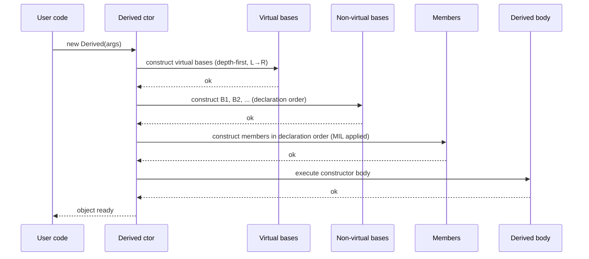
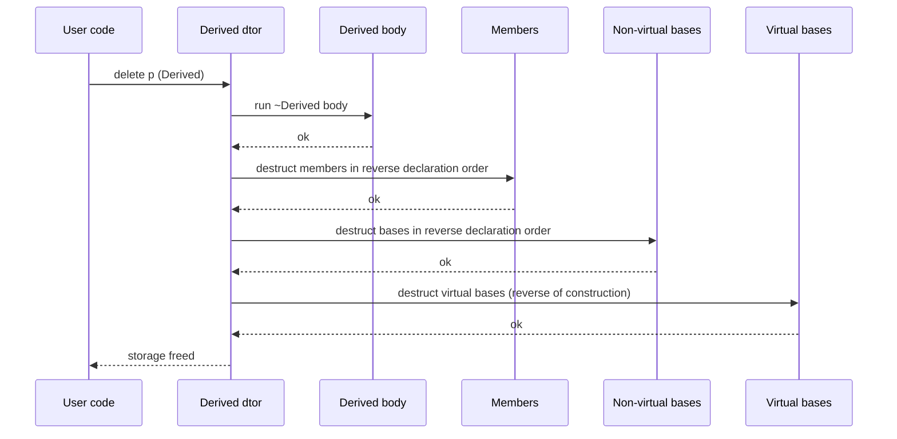
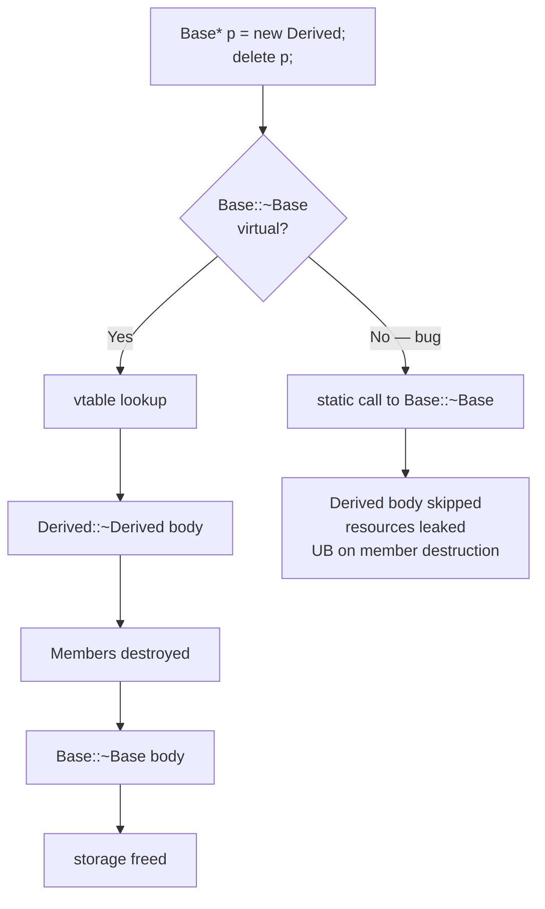

# Constructors and Destructors

## Why This Matters

An object's *lifetime* is the interval during which it is a valid, well-formed instance of its type. C++ defines that lifetime precisely: it begins when the constructor finishes, and it ends when the destructor begins. Everything in between — every method call, every read of a member, every use of the object inside an expression — relies on the constructor having established the class invariants and on the destructor cleanly releasing whatever resources the object owned.

If you do not understand construction order (bases first, then members in declaration order), you will write initialization code that silently uses uninitialized members. If you do not understand when the compiler synthesizes default, copy, and move constructors versus when it deletes them, you will get baffling compile errors or, worse, surprising shallow copies. If you do not mark destructors `virtual` on polymorphic classes, you will leak resources — or worse, invoke undefined behavior — every time you `delete` a derived object through a base pointer.

This note covers the full lifecycle: every kind of constructor, the member-initializer list, construction order, `explicit`, virtual destructors, and the destructor's role in RAII. It is the natural sequel to [[1. Classes and Objects|Chapter 9.1]] and the foundation for [[8. The Rule of 0, 3, and 5|Chapter 9.8]].

## Background

In C, a `struct` had no constructor: you declared a variable, you initialized it with a brace-enclosed initializer (or with `memset`), and you freed it manually. There was no guarantee that initialization ran, no concept of "the object is now ready to use," and no automatic cleanup. C++'s most important addition over C is the constructor/destructor pair: functions the compiler guarantees to call at the start and end of every object's lifetime.

Stroustrup's design choice was to make construction and destruction *pervasive and automatic*:

- Stack objects are constructed at their declaration and destructed at scope exit (in reverse order of construction).
- Heap objects are constructed by `new` and destructed by `delete`.
- Members are constructed when their enclosing object is constructed, and destructed when the enclosing object is destructed.
- Base subobjects are constructed before the derived class body, and destructed after.

This pervasive automation is what makes RAII possible, and RAII is what makes C++ exception-safe without `finally` blocks or garbage collection. See [[7. Memory Management/4. RAII|RAII]] for the bigger picture.

## Main Content

### 1. The Many Kinds of Constructors

| Kind                          | Signature (typical)                              | Purpose                                                    |
|-------------------------------|--------------------------------------------------|------------------------------------------------------------|
| Default                       | `T()`                                            | Zero-argument construction.                                |
| Parameterized                 | `T(args...)`                                     | Construction with caller-supplied state.                   |
| Copy                          | `T(T const&)`                                    | Construct a new object as a copy of an existing one.       |
| Move                          | `T(T&&) noexcept`                                | Construct a new object by stealing resources from a dying one. |
| Delegating                    | `T(args...) : T(other_args...) {}`               | One constructor calls another constructor of the same class. |
| Inheriting (C++11, `using`)   | `using Base::Base;`                              | Derived class re-exposes base constructors.                |
| Conversion (single-arg)       | `T(U)`                                           | Implicit conversion from `U` to `T` (mark `explicit` to forbid). |

The compiler may implicitly declare and define the **special member functions** (default ctor, copy ctor, copy assign, move ctor, move assign, destructor) under rules covered in [[8. The Rule of 0, 3, and 5|Chapter 9.8]].

### 2. Default Constructor

A default constructor takes no arguments (or has all parameters defaulted). It is required when you write `T x;`, when you allocate `new T[n]`, when you put `T` inside a `std::vector<T>` and `resize` beyond the current size, or when you value-initialize a `T` member without an explicit initializer.

If you declare *any* constructor, the compiler stops implicitly declaring the default constructor. To get it back, write `T() = default;`.

```cpp
class Timer {
public:
    Timer() = default;              // explicitly defaulted; zero-arg
    explicit Timer(std::string label) : label_(std::move(label)) {}
private:
    std::string label_;
    std::chrono::steady_clock::time_point start_ = std::chrono::steady_clock::now();
};
```

Note the in-class member initializer `start_ = ...` — a C++11 feature that fills in a default for any constructor that does not mention `start_` in its member-initializer list. This dramatically reduces boilerplate when you have multiple constructors.

### 3. Parameterized Constructor and the Member-Initializer List

The **member-initializer list** (MIL) is the preferred place to initialize members. It sits between the parameter list and the constructor body, introduced by a colon:

```cpp
class Person {
public:
    Person(std::string name, int age) : name_(std::move(name)), age_(age) {}
private:
    std::string name_;
    int age_;
};
```

Why prefer the MIL over assignment in the constructor body?

1. **Performance.** With the MIL, each member is *constructed* once with its final value. With body assignment, each member is *default-constructed first* and then *assigned to* — two operations instead of one. For `std::string`, `std::vector`, and most non-trivial types, this is a measurable cost.
2. **Correctness.** `const` members, reference members, and members without a default constructor *cannot* be assigned in the body; they *must* be initialized in the MIL.
3. **Clarity.** The MIL makes it explicit which members are initialized with what, before the body runs.

### 4. Order of Construction

Members are initialized in the **order they are declared in the class**, not in the order they appear in the MIL. If the two disagree, the compiler emits a warning (`-Wreorder`). Base classes are constructed *before* any member; the base classes themselves are constructed in the order they appear in the base-specifier list (left to right).

Full construction sequence for `class D : public B1, public B2 { ... };`:

1. The most-derived `D` constructor begins.
2. Virtual base subobjects are constructed first (in the order they appear in a depth-first, left-to-right traversal of the inheritance graph). See [[5. Multiple and Virtual Inheritance|Chapter 9.5]].
3. Non-virtual base subobjects are constructed in declaration order: `B1`, then `B2`.
4. Members of `D` are constructed in declaration order, using their MIL initializer (or in-class initializer, or default constructor).
5. The body of `D`'s constructor runs.

The destructor runs the same sequence in **reverse**.

A classic bug: initializing `size_` based on `buffer_` when `size_` is declared *after* `buffer_`, but listed *before* it in the MIL. The compiler will construct `buffer_` first (because `buffer_` is declared first), at which point `size_` is still uninitialized garbage.

```cpp
class Bad {
    std::vector<int> buffer_;   // declared first
    std::size_t size_;          // declared second
public:
    Bad(std::size_t n) : size_(n), buffer_(size_) {} // WARN: constructs buffer_ first, with garbage size_
};

class Good {
    std::size_t size_;          // declared first now
    std::vector<int> buffer_;
public:
    Good(std::size_t n) : size_(n), buffer_(size_) {} // correct
};
```

**Tip**: declare members in the order they are initialized, and list them in the MIL in the same order.

### 5. Copy Constructor

The copy constructor has the signature `T(T const&)` (or `T(T&)`, or `T(T volatile&)`, but `T const&` is idiomatic). It is invoked whenever a new object is created as a copy of an existing one: pass-by-value, return-by-value (modulo copy elision), `T b = a;`, `T b(a);`, throwing an exception by value.

**Shallow copy**: each member is copied as-is. For pointer members, this means both the original and the copy point to the same heap block — usually a bug.

**Deep copy**: pointer members are followed and the pointee is duplicated, so each object owns its own independent copy.

```cpp
class Buffer {
public:
    Buffer(std::size_t n) : size_(n), data_(new int[n]) {}
    ~Buffer() { delete[] data_; }

    // Deep copy constructor.
    Buffer(Buffer const& other)
        : size_(other.size_), data_(other.size_ ? new int[other.size_] : nullptr) {
        std::copy(other.data_, other.data_ + size_, data_);
    }

    // See Chapter 9.8 for copy-and-swap assignment.
    Buffer& operator=(Buffer other) noexcept { swap(other); return *this; }
    void swap(Buffer& other) noexcept { std::swap(size_, other.size_); std::swap(data_, other.data_); }

private:
    std::size_t size_;
    int* data_;
};
```

If you do not write a copy constructor, the compiler generates one that copies each member. That copy is shallow, which is fine for value-semantic types (like `std::string`, `std::vector`) but disastrous for raw-pointer-owning types. This is the motivation for the **Rule of 3/5/0** — see [[8. The Rule of 0, 3, and 5|Chapter 9.8]].

### 6. Move Constructor

The move constructor has signature `T(T&&)` and ideally is `noexcept`. It is invoked when a new object is constructed from an expiring (rvalue) operand: `T b = std::move(a);`, return-by-value (sometimes), pass-by-value of an rvalue, `std::vector` reallocation when it cannot be elided.

The move constructor *steals* resources from the source rather than copying them. The source must be left in a *valid but unspecified* state — typically "destructible and assignable, but no other guarantees." Stealing is usually a handful of pointer swaps; it is O(1) regardless of how big the object is.

```cpp
class Buffer {
public:
    // ... copy ctor above ...

    Buffer(Buffer&& other) noexcept
        : size_(other.size_), data_(other.data_) {
        other.size_ = 0;
        other.data_ = nullptr;
    }
};
```

**Why `noexcept`?** `std::vector::resize` and similar operations have a strong exception-safety guarantee: if an element move throws, the vector must roll back, which requires that the move *didn't* actually move anything. So `std::vector` uses copy instead of move when the move constructor is not `noexcept`. Always mark move constructors (and move assignment) `noexcept` if they truly cannot throw. See [[8. The Rule of 0, 3, and 5|Chapter 9.8]].

### 7. Constructor Delegation

A constructor may delegate to another constructor of the same class:

```cpp
class File {
public:
    File() : File("", OpenMode::Read) {}
    File(std::string path) : File(std::move(path), OpenMode::Read) {}
    File(std::string path, OpenMode mode) : path_(std::move(path)), mode_(mode) { open(); }
private:
    void open();
    std::string path_;
    OpenMode mode_;
};
```

Once a constructor delegates, its own body cannot mention members in the MIL (the delegated-to constructor owns that). The body of the delegating constructor runs *after* the delegated-to constructor finishes.

### 8. The `explicit` Keyword

`explicit` on a constructor (C++98 for single-arg, C++11 for multi-arg) prevents the compiler from using it for *implicit* conversions. It can still be used for direct initialization and explicit casts.

```cpp
class Kilometers {
public:
    explicit Kilometers(double v) : v_(v) {}
    double value() const { return v_; }
private:
    double v_;
};

void travel(Kilometers d);

Kilometers a(5);             // OK, direct
Kilometers b = 5;            // ERROR: implicit conversion disallowed
travel(5);                   // ERROR: implicit conversion disallowed
travel(Kilometers(5));       // OK, explicit
```

**Rule of thumb**: mark *every* single-argument constructor `explicit` unless you specifically want implicit conversion (e.g., `std::string` from `char const*` is intentionally not explicit). It is much easier to relax `explicit` later than to track down the chain of unintended conversions it caused. C++17's `explicit(true)` / `explicit(false)` makes the choice conditional on a template parameter, useful in metaprogramming.

### 9. Inheriting Constructors (C++11)

```cpp
struct Base {
    Base(int);
    Base(int, std::string);
};
struct Derived : Base {
    using Base::Base;  // Derived now has Derived(int) and Derived(int, std::string)
};
```

The inherited constructors do not initialize members declared in `Derived` — those are default-initialized. If `Derived` has a member without a default constructor, you must still write the constructors by hand.

### 10. The Destructor

The destructor `~T()` runs when an object's lifetime ends: scope exit for automatic objects, `delete` for heap objects, the end of a temporary's full-expression, an exception unwinding the stack. Its job is to release resources and leave the storage reusable.

For types that only hold RAII types (`std::string`, `std::vector`, `std::unique_ptr`), the compiler-generated destructor is correct — it just destructs each member in reverse order. This is the **Rule of 0**. For types that own raw resources (raw `new`/`delete`, file handles, sockets), you must write the destructor yourself.

```cpp
class Logger {
public:
    Logger(std::string path) : file_(std::fopen(path.c_str(), "a")) {
        if (!file_) throw std::runtime_error("cannot open log");
    }
    ~Logger() { if (file_) std::fclose(file_); }
    Logger(Logger const&) = delete;            // not copyable
    Logger& operator=(Logger const&) = delete;
private:
    std::FILE* file_;
};
```

### 11. Virtual Destructors — The Critical Rule

> **If a class has any `virtual` function, it should have a `virtual` destructor.**

Why? Consider:

```cpp
class Base {
public:
    virtual void f();
    ~Base() { /* cleanup Base */ }     // NOT virtual
private:
    int* base_data_;
};

class Derived : public Base {
public:
    void f() override;
    ~Derived() { /* cleanup Derived */ }   // never called below!
private:
    int* derived_data_;
};

void leak() {
    Base* p = new Derived;
    delete p;   // calls Base::~Base only — Derived's destructor is skipped!
                // derived_data_ is leaked. Undefined behavior, in fact.
}
```

When `delete p` runs with `p` of static type `Base*`, the compiler emits a call to `Base::~Base`. Because the destructor is not virtual, the call is *statically resolved* and never dispatches to `Derived::~Derived`. The derived destructor body never runs. The `derived_data_` member is leaked (and, technically, the destruction of `Derived`'s members is skipped, which is UB).

Marking the destructor `virtual` fixes this: `delete p` calls the most-derived destructor first (`Derived::~Derived`), then base destructors up the chain.

**The reverse rule is also important**: if a class is *not* polymorphic (has no virtual functions and is not meant to be a base class), *do not* mark the destructor `virtual`. A virtual destructor imposes a vptr on every instance, costing `sizeof(void*)` bytes and preventing the type from being trivially destructible (which matters for some optimizations and ABI guarantees). See [[4. Polymorphism and Virtual Functions|Chapter 9.4]] for vtable cost discussion.

**Pure virtual destructor**: occasionally useful for forcing a class to be abstract while still providing a default destructor body. The destructor must still be *defined* out-of-line:

```cpp
struct Interface {
    virtual ~Interface() = 0;     // pure virtual
    virtual void do_thing() = 0;
};
Interface::~Interface() {}        // must define
```

### 12. `= default` and `= delete`

`T() = default;` asks the compiler to generate the default constructor as if you had not written one — useful to bring it back after declaring another constructor. `T(T const&) = delete;` forbids copy construction; `T(T const&) = default;` forces a copy constructor to exist even when the compiler would otherwise not generate one. See [[8. The Rule of 0, 3, and 5|Chapter 9.8]] for how these interact.

## Diagrams

### Construction Order



### Destructor Order (reverse of construction)



### Virtual Destructor Dispatch



## Code Examples

### A Class with All Five Special Members

```cpp
#include <utility>
#include <cstring>
#include <algorithm>

class String {
public:
    String() noexcept : data_(nullptr), size_(0) {}

    String(char const* s) : String(s ? std::strlen(s) : 0) {
        if (size_) std::memcpy(data_, s, size_);
    }

    explicit String(std::size_t n) : data_(n ? new char[n + 1] : nullptr), size_(n) {
        if (data_) data_[size_] = '\0';
    }

    ~String() { delete[] data_; }

    String(String const& o) : String(o.size_) {
        if (size_) std::memcpy(data_, o.data_, size_);
    }

    String(String&& o) noexcept : data_(o.data_), size_(o.size_) {
        o.data_ = nullptr; o.size_ = 0;
    }

    String& operator=(String o) noexcept {  // by value: copy/move-and-swap
        swap(o);
        return *this;
    }

    void swap(String& o) noexcept {
        std::swap(data_, o.data_);
        std::swap(size_, o.size_);
    }

    std::size_t size() const noexcept { return size_; }
    char const* c_str() const noexcept { return data_ ? data_ : ""; }

private:
    char* data_;
    std::size_t size_;
};
```

### Virtual Destructor Done Right

```cpp
#include <memory>

class Shape {
public:
    virtual ~Shape() = default;             // critical!
    virtual double area() const = 0;
};

class Circle : public Shape {
public:
    explicit Circle(double r) : r_(r) {}
    double area() const override { return 3.14159265358979 * r_ * r_; }
private:
    double r_;
};

class Polygon : public Shape {
public:
    explicit Polygon(std::vector<std::pair<double,double>> pts) : pts_(std::move(pts)) {}
    double area() const override { /* shoelace */ return 0; }
private:
    std::vector<std::pair<double,double>> pts_;
};

void use() {
    std::unique_ptr<Shape> s = std::make_unique<Circle>(2.0);
    // When s goes out of scope, Circle::~Circle runs (via virtual ~Shape),
    // then Shape::~Shape. Correct cleanup.
}
```

### Constructor Delegation + in-class Member Initializers

```cpp
#include <string>
#include <unordered_map>

class HttpRequest {
public:
    HttpRequest() : HttpRequest("GET", "/") {}
    HttpRequest(std::string method) : HttpRequest(std::move(method), "/") {}
    HttpRequest(std::string method, std::string path)
        : method_(std::move(method)), path_(std::move(path)) {}

private:
    std::string method_;
    std::string path_;
    std::unordered_map<std::string, std::string> headers_;   // default-constructed
    int timeout_ms_ = 30000;                                  // in-class initializer
    bool follow_redirects_ = true;                            // in-class initializer
};
```

## Common Pitfalls

- **Constructing members in the wrong order.** The MIL's order is ignored; declaration order wins. Use `-Wreorder` and align the two.
- **Default-constructing a member, then assigning it in the body.** For `std::string`, `std::vector`, `std::map`, this is a silent but real performance penalty. Use the MIL.
- **Forgetting to initialize a `const` member or a reference member.** These cannot be assigned in the body; the compiler will reject the code.
- **Calling virtual functions from a constructor or destructor.** During base construction, the dynamic type is the base, so virtual calls dispatch to the base version — not the derived override you might expect. This is by design (the derived part is not constructed yet), but is a common source of confusion.
- **Not marking move operations `noexcept`.** Containers will fall back to copies, silently killing performance.
- **Marking a non-polymorphic class's destructor `virtual`.** Adds a vptr to every instance; also prevents the class from being trivially destructible.
- **Forgetting a virtual destructor on a polymorphic class.** Causes resource leaks and undefined behavior when deleting via a base pointer.
- **Relying on copy elision but writing as if it always happens.** Mandatory copy elision (C++17) covers *prvalues*, but not all cases. If your copy/move constructor has side effects, do not reason about how many times it is called.
- **Using `= default` for a class that owns a raw resource.** The defaulted destructor will not call `delete` or `fclose` — you must write it. See [[8. The Rule of 0, 3, and 5|Chapter 9.8]].
- **Defining a pure virtual destructor without an out-of-line definition.** The linker will fail when the destructor is called.
- **Constructors that can partially fail.** If a constructor throws after acquiring a resource, that resource leaks unless wrapped in RAII members. Prefer RAII members over manual acquire-in-ctor / release-in-dtor.

## Tips and Tricks

- **Prefer the member-initializer list over body assignment for every member.** It is faster, mandatory for `const`/reference members, and clearer to read.
- **Use in-class member initializers (C++11) for "this member usually starts with this value."** This lets you write multiple constructors without repeating the initializer.
- **Use constructor delegation to factor common initialization** into one constructor that the others call. Avoids the "every constructor copies the same five lines" anti-pattern.
- **Mark every single-argument constructor `explicit` unless you specifically want implicit conversion.** This is one of the highest-leverage style rules in modern C++.
- **Always mark move operations `noexcept`.** Containers will thank you with real performance.
- **Provide a `swap` friend function** and implement `operator=` using the copy-and-swap idiom. This gives you exception-safe assignment and a uniform code path. See [[8. The Rule of 0, 3, and 5|Chapter 9.8]].
- **Use `= default` and `= delete` to be explicit about your special-member-function intent.** Self-documenting code beats silently compiler-generated behavior.
- **Follow the "virtual destructor iff polymorphic" rule strictly.** Tools like `clang-tidy`'s `cppcoreguidelines-virtual-class-destructor` check enforce this.
- **Make destructors `noexcept` (they are by default in C++11+).** A throwing destructor calls `std::terminate` immediately. If a destructor could throw, refactor.
- **Avoid doing real work in the destructor.** Especially avoid virtual calls, file I/O, or anything that might fail. Destructors must not throw.
- **When the constructor body grows beyond a few lines, extract a private `init()` helper** or — better — refactor into smaller, RAII-managed members.

## Active Recall

1. List the eight kinds of constructors discussed and a one-sentence purpose for each.
2. Why is the member-initializer list preferred over assignment in the constructor body? Give three reasons.
3. In what order are base classes, members, and the constructor body executed during construction?
4. In what order does the destructor execute them?
5. What does it mean that MIL order is ignored? How do you detect a mismatch?
6. What is the difference between a shallow copy and a deep copy? Which does the compiler-generated copy constructor perform?
7. Why must move constructors be marked `noexcept` to be effective?
8. What is the state of a moved-from object?
9. What does `explicit` prevent? When should you *not* mark a constructor `explicit`?
10. State the rule for when a destructor should be virtual. What goes wrong if you break it?
11. What goes wrong if you mark a destructor `virtual` on a class that is not polymorphic?
12. Can you call a virtual function from a constructor? What happens if you do?
13. Why must a pure virtual destructor still be defined out-of-line?
14. What is constructor delegation? Can a delegating constructor initialize members in its own MIL?
15. How do in-class member initializers interact with the member-initializer list?

## Next Steps

- Continue to [[3. Inheritance|Chapter 9.3 — Inheritance]] to see how constructors chain through base classes.
- Continue to [[4. Polymorphism and Virtual Functions|Chapter 9.4 — Polymorphism]] to understand why virtual destructors are required.
- Cross-reference [[8. The Rule of 0, 3, and 5|Chapter 9.8]] for the complete picture of when to write, default, or delete each special member function.
- Cross-reference [[7. Memory Management/4. RAII|RAII]] for how constructor/destructor pairs form the foundation of resource management.
- Cross-reference [[8. Modern C++ (Move Semantics, Lambdas, Concurrency)|Modern C++ chapter]] for move semantics in depth.
