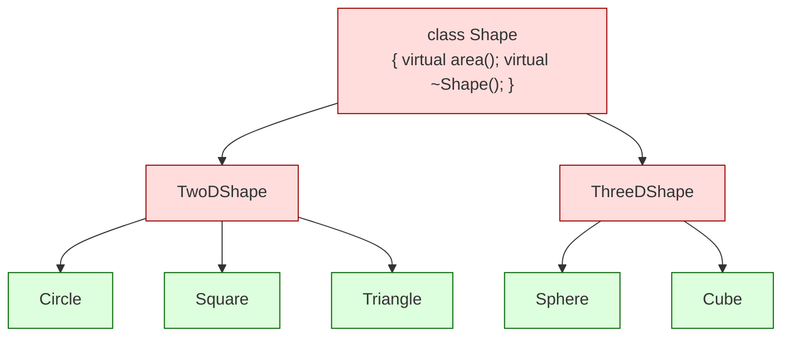
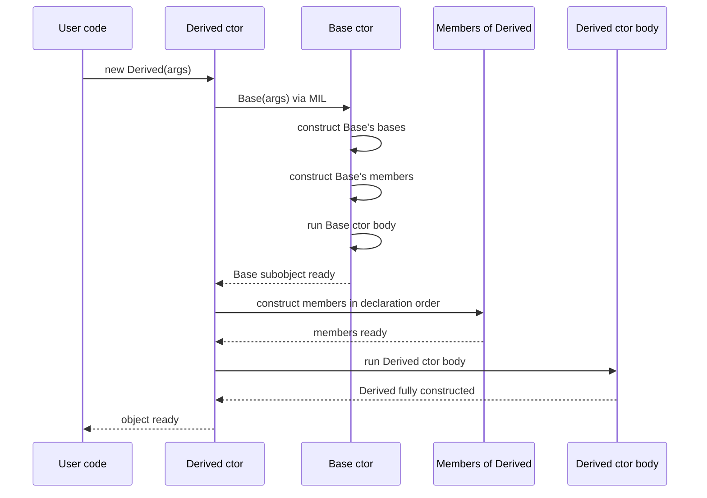
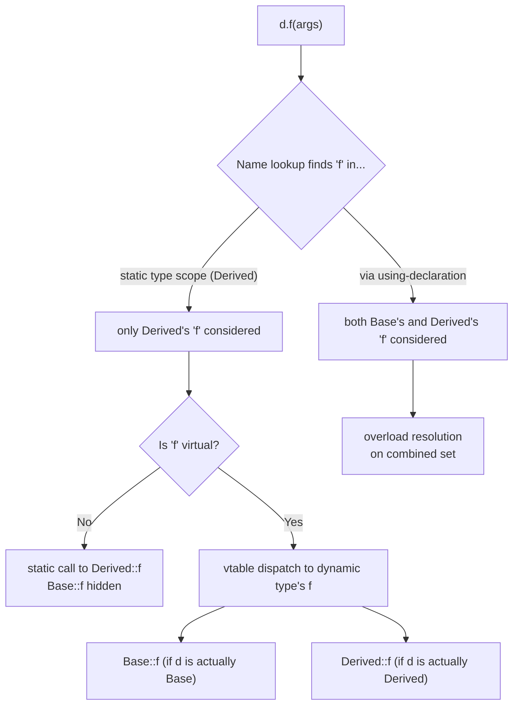

# Inheritance

## Why This Matters

Inheritance is the mechanism C++ gives you to say "this new type *is a kind of* that existing type, plus some extra behavior." It lets you model hierarchies (`Employee` is a `Person`, `SavingsAccount` is an `Account`, `Circle` is a `Shape`), reuse implementation from a base class, and — when combined with `virtual` functions — write code that operates on a base-class reference and dispatches to the right derived-class implementation at runtime. That last capability is *polymorphism*, covered in [[4. Polymorphism and Virtual Functions|Chapter 9.4]]; this note covers everything *up to* the virtual dispatch: the syntax of inheritance, the three access modes, IS-A vs HAS-A, constructor chaining, function hiding, and `final`.

If you do not understand inheritance access modes (`public`/`protected`/`private`), you will write code that compiles but breaks encapsulation in surprising ways. If you do not understand that *non-virtual* redeclarations in a derived class *hide* (not override) base-class functions, you will get silent dispatch to the wrong function — one of the most insidious bugs in object-oriented C++. If you do not understand constructor chaining, you will struggle to initialize base members correctly.

## Background

Inheritance entered C++ by way of Simula 67, the first object-oriented language. Simula had classes and subclasses, and Stroustrup adopted both. Early C++ (then called *C with Classes*) supported only single inheritance; multiple inheritance arrived in Release 1.2 (1989) and virtual inheritance followed to solve the diamond problem. See [[5. Multiple and Virtual Inheritance|Chapter 9.5]] for multiple inheritance.

Three classical goals of inheritance are often cited:

1. **Subtyping / IS-A**: a `Sedan` is a `Car`; code that takes a `Car&` can take a `Sedan&`.
2. **Implementation reuse**: a derived class reuses base-class code without rewriting it.
3. **Polymorphism**: code calls a base-class method, the runtime invokes the derived override.

Modern C++ style guides (notably Sutter and Alexandrescu in *C++ Coding Standards*) emphasize that (1) is the *legitimate* use of public inheritance; (2) should usually be achieved with composition instead; (3) is the subject of [[4. Polymorphism and Virtual Functions|Chapter 9.4]]. Inheritance is a powerful tool that is overused: prefer composition except when you genuinely need subtype polymorphism.

## Main Content

### 1. Syntax of Single Inheritance

```cpp
class Base {
public:
    void f();
protected:
    int prot_data_;
private:
    int priv_data_;
};

class Derived : public Base {   // "public inheritance"
public:
    void g();
};
```

The `:` introduces the base-specifier list. Each base can be preceded by one of three access modes:

| Inheritance mode | Public members of Base become... in Derived | Protected members of Base become... in Derived | Private members of Base |
|------------------|---------------------------------------------|------------------------------------------------|-------------------------|
| `public`         | `public`                                    | `protected`                                    | Inaccessible            |
| `protected`      | `protected`                                 | `protected`                                    | Inaccessible            |
| `private`        | `private`                                   | `private`                                      | Inaccessible            |

`private` members of `Base` are *always* inaccessible to `Derived` directly, but `Derived` can still call `Base`'s `public` and `protected` member functions, which themselves can access `Base`'s privates.

### 2. Public, Protected, and Private Inheritance

**Public inheritance** (`class D : public B`) models IS-A. Everything that is true of a `B` is true of a `D` — at least, everything the public interface of `B` promises. This is the most common form and the only form that lets you upcast a `D*` to a `B*` implicitly and freely.

**Protected inheritance** (`class D : protected B`) is rare. It says: "I want to reuse B's implementation, and I want my own further-derived classes to also see B's interface as part of me, but the outside world should not." Useful when building deep inheritance hierarchies for an internal framework, rarely seen in application code.

**Private inheritance** (`class D : B` or `class D : private B`) models "implemented-in-terms-of." `D` *is not* a `B` from the outside world's perspective: callers cannot implicitly convert a `D*` to a `B*`. `D` is using `B`'s implementation, but hiding that fact. This is essentially composition with access to `B`'s `protected` members. Use it when:

- You need access to `protected` members of `B`.
- You need to override a `virtual` function in `B` (composition cannot do this).
- You want to express "empty base optimization" — when `B` is an empty class, privately inheriting from it can reduce `sizeof(D)` compared to making `B` a member.

```cpp
class Widget {
public:
    void draw();
protected:
    void prepare_canvas();   // virtual, hook for subclasses
};

// Private inheritance: reusing Widget's implementation, but a WidgetButton
// is NOT a Widget to the outside world.
class WidgetButton : private Widget {
public:
    void on_click() { prepare_canvas(); /* draw the button */ }
};
```

In most other cases, composition (`class D { B b_; };`) is preferred over private inheritance because it is easier to reason about, easier to test, and does not couple your class to `B`'s header.

### 3. IS-A vs HAS-A

The two foundational relationships:

- **IS-A**: `D` is a kind of `B`. Modeled with public inheritance. The Liskov Substitution Principle (LSP) applies: anywhere a `B&` is expected, a `D&` should work correctly. If your derived class breaks LSP (e.g., `Ostrich : Bird` but `Ostrich::fly()` throws), you have a design flaw, not a coding flaw — inheritance was the wrong choice.
- **HAS-A**: `D` contains a `B` as a part. Modeled with composition (`class D { B b_; };`). This is the default and preferred relationship for implementation reuse.

There is a third, less common relationship:

- **IS-IMPLEMENTATED-IN-TERMS-OF**: `D` uses `B`'s implementation but is not conceptually a `B`. Modeled with private inheritance or with composition. Composition is almost always better.

> [!quote] Scott Meyers, *Effective C++*, Item 32
> "Prefer composition to inheritance — especially when inheritance is not designed for it."

When in doubt, ask: "Does my new type need to override a `virtual` function in the existing type?" If yes, inheritance (public or private) is appropriate. If no, composition is appropriate.

### 4. Constructor Chaining

When a `Derived` object is constructed, the `Base` subobject must be constructed first. You control which `Base` constructor is called via the base-specifier in `Derived`'s member-initializer list:

```cpp
class Animal {
public:
    explicit Animal(std::string species) : species_(std::move(species)) {}
protected:
    std::string species_;
};

class Dog : public Animal {
public:
    Dog(std::string name, std::string breed)
        : Animal("Canis familiaris"), name_(std::move(name)), breed_(std::move(breed)) {}
private:
    std::string name_;
    std::string breed_;
};
```

If you omit the base-specifier, the *default* `Base` constructor is called. If `Base` has no default constructor, the code will not compile unless you explicitly call a parameterized `Base` constructor.

The full construction order (recap from [[2. Constructors and Destructors|Chapter 9.2]]):

1. Virtual base subobjects (deepest first).
2. Non-virtual direct base classes, in declaration order (left to right).
3. Members, in declaration order.
4. Constructor body.

Destructors run in reverse.

### 5. Function Hiding vs Overriding

This is one of the most misunderstood aspects of C++ inheritance. Two scenarios:

#### Scenario A: Non-virtual base function, redeclared in derived

```cpp
class Base {
public:
    void f(int);
};

class Derived : public Base {
public:
    void f(double);   // HIDES Base::f(int); does NOT overload it
};

Derived d;
d.f(42);              // calls Derived::f(double) — 42 is converted to double
d.Base::f(42);        // OK: explicit qualification bypasses hiding
```

The name `f` in `Derived` *hides* all base-class `f`s of the same name, regardless of signature. This is name *hiding*, not overriding (no `virtual`), and not overloading (overloading only happens within the same scope). To "un-hide" the base overloads, use a `using Base::f;` declaration:

```cpp
class Derived : public Base {
public:
    using Base::f;       // pull Base::f(int) into Derived's scope as an overload
    void f(double);
};
```

#### Scenario B: Virtual base function, redeclared in derived

This is *overriding* and is the subject of [[4. Polymorphism and Virtual Functions|Chapter 9.4]]. The signature must match exactly (modulo covariant return types); otherwise the derived function *hides* the base instead of overriding it. C++11's `override` keyword makes the compiler reject this mistake at compile time.

> [!warning] Always use `override`
> Adding `override` to a derived-class virtual function tells the compiler: "I intend to override a base-class virtual function; if my signature does not match exactly, emit an error." This single keyword prevents an entire class of bugs. Never write a virtual override without it.

### 6. Name Lookup in Class Hierarchies

When you call `d.f(args)`, the compiler:

1. Looks up the name `f` starting in the *static* type of `d`, then outward through base classes.
2. Once it finds `f` in some scope, it stops and considers only the `f`s in *that* scope (this is why redeclaring `f` in a derived class hides all base `f`s).
3. Performs overload resolution on the candidates found.
4. If the chosen `f` is `virtual` and `d`'s dynamic type differs from its static type, dispatch goes through the vtable; otherwise it is a static call.

### 7. The `final` Keyword (C++11)

`final` on a class forbids further derivation:

```cpp
class Leaf final { /* ... */ };
class Wrong : public Leaf {};   // ERROR: Leaf is final
```

`final` on a member function forbids further overriding in derived classes:

```cpp
class Base { public: virtual void f(); };
class Mid : public Base { public: void f() override final; };
class Derived : public Mid { public: void f() override; };  // ERROR: f is final in Mid
```

Marking a class or function `final` lets the compiler *de-virtualize* calls: if the compiler can prove the dynamic type is exactly the static type (or a `final` subtype), it can emit a direct call instead of a vtable lookup. This is a real performance win in tight loops. See [[4. Polymorphism and Virtual Functions|Chapter 9.4]].

Mark a class `final` when:

- The class is not designed as a base (e.g., most concrete utility types).
- You want to enable de-virtualization.
- You want to prevent users from breaking your invariants by subclassing.

### 8. Slicing

If you pass a `Derived` object *by value* to a function expecting `Base`, the copy goes into a `Base`-sized slot and the `Derived`-specific parts are *sliced off*. The result is a `Base` object with a `Base` vtable, even if the source was a `Derived`. Virtual dispatch will call `Base`'s versions, and any `Derived`-specific data is lost.

```cpp
class Base { public: virtual std::string name() const { return "Base"; } };
class Derived : public Base { public: std::string name() const override { return "Derived"; } };

void print_by_value(Base b) { std::cout << b.name() << '\n'; }   // SLICES
void print_by_ref(Base const& b) { std::cout << b.name() << '\n'; }

Derived d;
print_by_value(d);   // prints "Base" — slicing!
print_by_ref(d);     // prints "Derived" — correct
```

Slicing is silent and dangerous. Pass polymorphic types by reference or pointer, never by value. Also disable copy for polymorphic types if you do not need it (`Base(Base const&) = delete;`).

### 9. Empty Base Optimization (EBO)

When a base class is empty (no non-static data members, no virtual functions, no virtual bases), the compiler is *permitted* (not required) to allocate zero bytes for the base subobject. Most compilers do this. The result is that `sizeof(Derived)` can be smaller with private inheritance than with composition:

```cpp
struct Empty {};
struct A : private Empty { int x; };     // sizeof(A) == sizeof(int) if EBO applies
struct B { Empty e; int x; };            // sizeof(B) == 2 * sizeof(int) typically
```

EBO is the reason the standard library uses inheritance for stateless policy classes and allocator traits.

### 10. Upcasting and Downcasting

**Upcasting** (derived → base) is implicit and safe with public inheritance:

```cpp
Derived d;
Base& b = d;       // OK, implicit upcast
Base* p = &d;      // OK
```

**Downcasting** (base → derived) is dangerous and requires an explicit cast:

- `static_cast<Derived*>(base_ptr)`: compile-time check only. Fast, but if the actual object is not a `Derived`, you get UB. Use only when you have other proof of the dynamic type.
- `dynamic_cast<Derived*>(base_ptr)`: runtime check via RTTI. Returns `nullptr` on failure (for pointers) or throws `std::bad_cast` (for references). Requires the base class to have at least one `virtual` function. Slow, but safe.

See [[4. Polymorphism and Virtual Functions|Chapter 9.4]] for `dynamic_cast` and `typeid`.

### 11. When Inheritance Is the Wrong Tool

Reach for inheritance only when:

1. You need polymorphic dispatch through a common base interface, AND
2. The derived type really is substitutable for the base (LSP), AND
3. There is no cleaner composition-based alternative.

For implementation reuse alone, prefer composition. For variation in behavior at runtime without inheritance, prefer `std::variant` + `std::visit` or `std::function`. For compile-time variation, prefer templates. Inheritance is a sharp tool; use it sparingly.

## Diagrams

### Inheritance Hierarchy



### Construction Sequence



### Function Hiding vs Overriding



## Code Examples

### Public Inheritance with Constructor Chaining

```cpp
#include <string>
#include <utility>

class Vehicle {
public:
    explicit Vehicle(std::string make, std::string model, int year)
        : make_(std::move(make)), model_(std::move(model)), year_(year) {}

    std::string description() const {
        return std::to_string(year_) + " " + make_ + " " + model_;
    }

    virtual ~Vehicle() = default;
    virtual double tax() const = 0;     // pure virtual

protected:
    std::string make_;
    std::string model_;
    int year_;
};

class Car : public Vehicle {
public:
    Car(std::string make, std::string model, int year, int doors)
        : Vehicle(std::move(make), std::move(model), year), doors_(doors) {}

    int doors() const { return doors_; }
    double tax() const override { return 100.0 + 25.0 * doors_; }   // override

private:
    int doors_;
};

class Motorcycle : public Vehicle {
public:
    Motorcycle(std::string make, std::string model, int year)
        : Vehicle(std::move(make), std::move(model), year) {}

    double tax() const override { return 80.0; }
};
```

### Function Hiding Bypass with `using`

```cpp
class Logger {
public:
    void log(int level, std::string const& msg);
    void log(std::string const& msg);   // convenience overload
};

class TimedLogger : public Logger {
public:
    using Logger::log;                  // pull both overloads into scope
    void log(std::string const& msg, std::chrono::system_clock::time_point when);
};

TimedLogger t;
t.log("hello");                  // OK: Logger::log(string)
t.log(3, "warning");             // OK: Logger::log(int, string)
t.log("hello", std::chrono::system_clock::now()); // OK: TimedLogger::log(...)
```

### Private Inheritance for Implementation Reuse

```cpp
class NonCopyable {
public:
    NonCopyable() = default;
    NonCopyable(NonCopyable const&) = delete;
    NonCopyable& operator=(NonCopyable const&) = delete;
};

// Private inheritance: a MutexedCounter is NOT a NonCopyable to the world,
// but it inherits the deleted copy operations.
class MutexedCounter : private NonCopyable {
public:
    void increment() {
        std::lock_guard<std::mutex> lock(mtx_);
        ++count_;
    }
    long get() const {
        std::lock_guard<std::mutex> lock(mtx_);
        return count_;
    }
private:
    mutable std::mutex mtx_;
    long count_ = 0;
};
```

### `final` for De-virtualization

```cpp
class Shape {
public:
    virtual ~Shape() = default;
    virtual double area() const = 0;
};

class Circle final : public Shape {       // cannot be derived from
public:
    explicit Circle(double r) : r_(r) {}
    double area() const override { return 3.14159265358979 * r_ * r_; }
private:
    double r_;
};

// In tight loops, the compiler can devirtualize calls on Circle
// because nothing can subclass it.
double total_area(std::vector<Circle> const& circles) {
    double sum = 0;
    for (auto const& c : circles) sum += c.area();   // devirtualized
    return sum;
}
```

## Common Pitfalls

- **Slicing.** Passing polymorphic objects by value silently loses derived state. Pass by reference or pointer, or delete copy operations on the base.
- **Forgetting to chain the base constructor.** If `Base` has no default constructor, this is a compile error; if it does, you may get unwanted default initialization.
- **Function hiding instead of overriding.** Redeclaring a non-virtual function in a derived class *hides* the base function. Adding `override` to a virtual override makes signature mismatches a compile error — always use it.
- **Breaking LSP.** If a derived class refuses to honor a base-class contract (e.g., `Ostrich::fly()` throws), code that uses base references will break. This is a design error, not a coding one.
- **Over-using inheritance.** Inheritance is a strong, rigid coupling. If you find yourself with deep hierarchies (more than 2-3 levels) or with derived classes that mostly add data members rather than behavior, switch to composition.
- **Public inheritance that is really implementation reuse.** Use private inheritance or composition instead. Public inheritance advertises IS-A.
- **Forgetting a virtual destructor on a polymorphic base.** See [[2. Constructors and Destructors|Chapter 9.2]].
- **Calling virtual functions from constructors/destructors.** Dispatch goes to the static type's version, not the eventual derived override. This is by design but is a frequent source of confusion.
- **Diamond inheritance without `virtual`.** See [[5. Multiple and Virtual Inheritance|Chapter 9.5]] for the diamond problem and its solution.
- **Downcasting with `static_cast` without proof.** If the object is not actually the target type, this is UB. Use `dynamic_cast` when in doubt, or restructure to avoid downcasting altogether.
- **Marking too many classes `final` "for performance."** Profile first. The de-virtualization gain is real only when the compiler can prove the dynamic type, which often requires inlining.

## Tips and Tricks

- **Default to composition.** Reach for inheritance only when you need subtype polymorphism (and even then, consider `std::variant`).
- **Keep hierarchies shallow.** Two or three levels is plenty. Deep hierarchies are brittle and hard to reason about.
- **Always use `override` and consider `final`.** They make your intent explicit and let the compiler catch mistakes.
- **Delete copy operations on polymorphic base classes.** This prevents slicing at compile time.
- **Make base destructors `virtual` (or `protected` non-virtual).** The `protected` non-virtual approach is a recognized idiom for non-polymorphic bases: callers cannot `delete` through a base pointer (the destructor is protected), so the missing `virtual` does not matter.
- **Use `using Base::Base;`** to inherit constructors when you want the derived class to expose the same set of constructors as the base.
- **Use `using Base::f;`** to un-hide overloaded sets when you add a new overload in a derived class.
- **Prefer `std::variant` for closed sets of types** and inheritance for open sets. If new types are added at compile time (in your codebase) but not by users, `std::variant` is often cleaner. If users can add new types without recompiling your library, inheritance is required.
- **Use the Non-Virtual Interface (NVI) idiom**: make public methods non-virtual, and have them call private or protected virtual methods. This lets the base class enforce pre/post-conditions (logging, locking, validation) around the customizable behavior. See [[4. Polymorphism and Virtual Functions|Chapter 9.4]].
- **For EBO, prefer private inheritance of empty policy classes over composition.** The size savings can be significant when the type is instantiated millions of times.

## Active Recall

1. What are the three inheritance access modes? What does each do to the public and protected members of the base?
2. What is the only mode that models IS-A and allows implicit upcasting?
3. When is private inheritance preferable to composition? When is composition preferable?
4. State the Liskov Substitution Principle. What does it imply about how derived classes should behave?
5. In what order are base classes, members, and constructor body executed? What if you list them differently in the MIL?
6. What is function hiding? How does it differ from overriding and from overloading?
7. How do you un-hide base-class overloads in a derived class?
8. Why should every virtual override include the `override` keyword?
9. What is the effect of `final` on a class? On a member function? When is `final` a performance win?
10. What is slicing, and how do you prevent it?
11. What is the Empty Base Optimization, and when does it matter?
12. Why is `dynamic_cast` safer than `static_cast` for downcasting? What is its cost?
13. What is the NVI idiom, and what benefit does it provide?
14. Give two signs that you should be using composition instead of inheritance.

## Next Steps

- Continue to [[4. Polymorphism and Virtual Functions|Chapter 9.4 — Polymorphism and Virtual Functions]] to see how `virtual` and the vtable turn inheritance into runtime dispatch.
- Continue to [[5. Multiple and Virtual Inheritance|Chapter 9.5]] for the diamond problem and virtual bases.
- Cross-reference [[2. Constructors and Destructors|Chapter 9.2]] for construction order and virtual destructors.
- Cross-reference [[6. Operator Overloading|Chapter 9.6]] for the interaction between inheritance and overloaded operators.
- Cross-reference [[12. Modern C++|Modern C++]] for `std::variant` as a composition-based alternative to inheritance.
