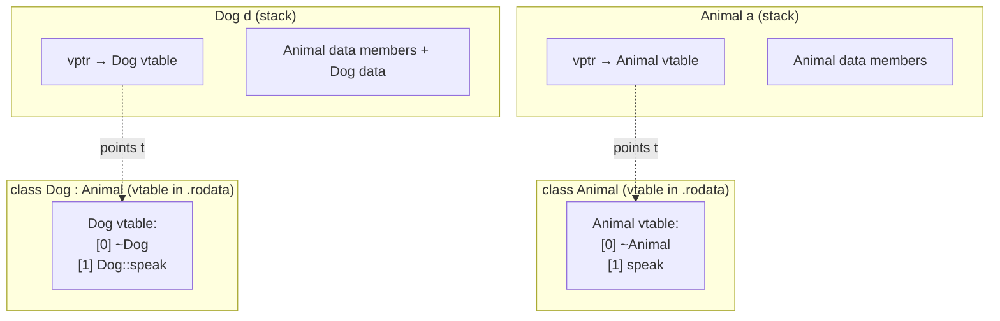
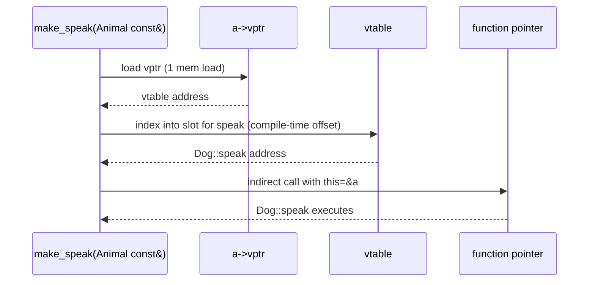
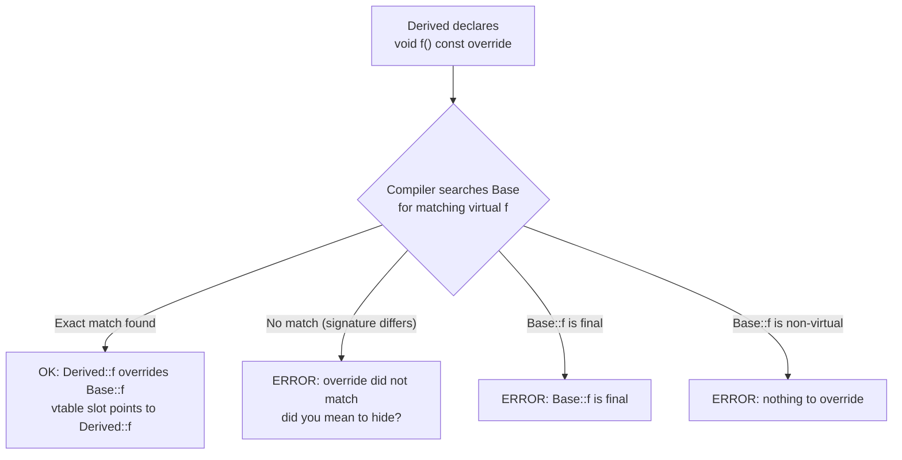

# Polymorphism and Virtual Functions

## Why This Matters

Polymorphism is the ability to write code that operates on a base-class interface and have that code correctly invoke the most-derived implementation at runtime. It is what lets a `std::vector<std::unique_ptr<Shape>>` hold circles, squares, and triangles, and have a loop `for (auto& s : shapes) total += s->area();` call the right `area()` for each. Without polymorphism, every new shape would force you to rewrite every function that handles shapes; with it, you can extend the system without modifying existing code (the "open-closed principle").

C++ implements polymorphism through `virtual` functions, which dispatch through a per-class table of function pointers called the *vtable*. This mechanism has real costs — an extra pointer per object, an extra indirection per call, and limited inlinability — that you must understand if you want to write fast C++. It also has subtle rules: `override` and `final` (C++11), pure virtual functions, abstract classes, virtual destructors, and RTTI (`dynamic_cast`, `typeid`).

This note covers all of it: the syntax, the cost model, the dispatch mechanism, the modern C++ keywords that make virtual functions safer, and the situations where you should reach for something else (templates, `std::variant`).

## Background

Polymorphism in object-oriented languages comes in several flavors. *Ad-hoc* polymorphism is function/operator overloading and templates. *Parametric* polymorphism is generics (templates in C++). *Subtype* polymorphism — the kind this note covers — is when a derived type can stand in for a base type and the runtime picks the right implementation.

Stroustrup chose the Simula-style implementation: every object of a class with virtual functions carries a hidden pointer to a per-class table of function pointers (the vtable). Member-function calls on a reference or pointer go through the vtable. This is "dynamic dispatch" or "late binding." C++ also supports *static* dispatch (no `virtual`), which is resolved at compile time — faster, but not polymorphic.

Languages like Smalltalk and Java make every method virtual by default. C++ makes them non-virtual by default and requires you to opt in. This is part of C++'s "pay only for what you use" philosophy: if you do not need polymorphism, you do not pay for it.

## Main Content

### 1. The `virtual` Keyword

A `virtual` member function is one whose call is dispatched based on the *dynamic* type of the object, not the *static* type of the reference or pointer through which it is called.

```cpp
#include <iostream>

class Animal {
public:
    virtual ~Animal() = default;
    virtual void speak() const { std::cout << "???\n"; }
};

class Dog : public Animal {
public:
    void speak() const override { std::cout << "Woof\n"; }
};

class Cat : public Animal {
public:
    void speak() const override { std::cout << "Meow\n"; }
};

void make_speak(Animal const& a) { a.speak(); }   // dispatches dynamically

int main() {
    Dog d; Cat c;
    make_speak(d);   // prints "Woof"
    make_speak(c);   // prints "Meow"
}
```

The static type of `a` in `make_speak` is `Animal const&`. The dynamic type of the object is `Dog` (or `Cat`). Without `virtual`, the call would resolve statically to `Animal::speak` and print `???` for both. With `virtual`, it dispatches through the vtable and calls the derived override.

### 2. How the Vtable Works

Each class with at least one virtual function has a *vtable*: a static, per-class array of function pointers, one per virtual function. The order is determined by the order of declaration of the virtual functions in the class (including inherited ones).

Each object of such a class carries a hidden pointer (the *vptr*) — typically at the very beginning of the object — that points to its class's vtable. The vptr is set by the constructor(s); during base construction, the vptr points to the base's vtable, then it is updated as each more-derived constructor runs.

When you call `a.speak()`, the compiler emits code equivalent to:

```
(*(a->vptr_[kSpeak_slot]))(a);
```

That is, load the vptr, index into the vtable at the slot for `speak`, call the function pointer there, passing `this`. The exact slot index is known at compile time; only the function *pointer* at that slot is determined at runtime.

#### Costs

- **Memory**: one extra pointer per object (typically 8 bytes on 64-bit). For classes with many small instances (e.g., tree nodes in a 100M-node tree), this matters.
- **Per-call**: one extra memory load (to fetch the vptr) and one indirect call (through the vtable). The indirect call is harder for the CPU to predict and prevents the compiler from inlining.
- **Inlinability**: virtual calls are usually not inlined. Modern compilers can *de-virtualize* some calls when they can prove the dynamic type (e.g., when the object is local, the class is `final`, or profile-guided optimization has good data), but the general case stays indirect.
- **Code size**: each class has a vtable emitted somewhere, plus per-constructor code to set the vptr.

### 3. The `override` Keyword (C++11)

`override` after a virtual function in a derived class tells the compiler: "I intend this to override a base-class virtual function. If my signature does not match exactly, emit an error."

```cpp
class Base {
public:
    virtual void f(int);
    virtual void g() const;
};

class Derived : public Base {
public:
    void f(int) override;          // OK
    void f(double) override;       // ERROR: no matching base virtual
    void g() override;             // ERROR: base g() is const-qualified, this is not
    virtual void h() override;     // ERROR: no Base::h
};
```

Without `override`, the mismatches above would *silently* create new virtual functions or hide base ones. Always use `override` on every intended override.

### 4. The `final` Keyword (C++11)

`final` on a virtual function prevents further overriding:

```cpp
class Base { public: virtual void f(); };
class Mid : public Base { public: void f() override final; };
class Derived : public Mid { public: void f() override; };   // ERROR: f is final
```

`final` on a class prevents further derivation:

```cpp
class Leaf final { /* ... */ };
class X : public Leaf {};   // ERROR: Leaf is final
```

`final` is valuable because it lets the compiler de-virtualize: if the static type is `final` (or the compiler can otherwise prove the dynamic type matches the static type), the call becomes a direct call, eligible for inlining. This can be a significant win in tight loops.

### 5. Pure Virtual Functions and Abstract Classes

A *pure virtual function* has `= 0` instead of a body:

```cpp
class Shape {
public:
    virtual ~Shape() = default;
    virtual double area() const = 0;     // pure virtual — no default implementation
    virtual void describe() const { std::cout << "shape with area " << area() << "\n"; }
};
```

A class with at least one pure virtual function is *abstract*: you cannot instantiate it directly. Concrete derived classes must override every pure virtual function (or be abstract themselves).

```cpp
class Circle : public Shape {
public:
    explicit Circle(double r) : r_(r) {}
    double area() const override { return 3.14159265358979 * r_ * r_; }
private:
    double r_;
};

// Shape s;          // ERROR: abstract class
Circle c(2.0);       // OK
c.describe();        // OK — uses Shape::describe, which calls Circle::area via vtable
```

An abstract class can still have data members, constructors, and non-pure virtual functions. It is a common pattern for the base of a hierarchy: it defines an interface and some shared implementation, and forces derived classes to fill in the abstract parts.

### 6. Interfaces

C++ has no `interface` keyword, but the convention is to write a class that is *only* pure virtual functions plus a virtual destructor:

```cpp
class ILogger {
public:
    virtual ~ILogger() = default;
    virtual void log(std::string_view msg) = 0;
    virtual void flush() = 0;
};
```

This is the Java/C# "interface" pattern, implemented with pure virtuals. Concrete loggers (e.g., `ConsoleLogger`, `FileLogger`, `NetworkLogger`) derive from `ILogger` and override both methods.

### 7. Virtual Destructor — The Rule, Restated

> If a class has any `virtual` function, it should have a `virtual` destructor.

The reason: if you `delete` a derived object through a base pointer, the destructor call must dispatch through the vtable to call the derived destructor first. Without `virtual`, only the base destructor runs, and the derived part is leaked (or worse). See [[2. Constructors and Destructors|Chapter 9.2]] for the full story and an example of the leak.

For abstract interfaces,`= default` is fine:

```cpp
virtual ~ILogger() = default;
```

### 8. Calling Virtual Functions from Constructors and Destructors

When a base constructor runs, the vptr points to the *base* vtable (because the derived part does not exist yet). So a virtual function call from a base constructor dispatches to the base version, *not* the derived override — even though the eventual dynamic type will be the derived class.

Similarly, when a base destructor runs (after the derived destructor has finished), the vptr has been reset to the base vtable, so virtual calls dispatch to the base version.

This is by design: the derived part is not yet constructed (or already destroyed), so calling into it would access uninitialized (or destroyed) state. But it is a common source of bugs.

```cpp
class Base {
public:
    Base() { init(); }            // virtual call here goes to Base::init, NOT Derived::init
    virtual void init() { std::cout << "Base::init\n"; }
};

class Derived : public Base {
public:
    void init() override { std::cout << "Derived::init\n"; }
};

Derived d;   // prints "Base::init" only
```

**Rule**: never call virtual functions from constructors or destructors. If you need customization during construction, require derived classes to pass data up through the constructor's MIL — see the "template method" pattern, but with the customization happening *before* the base constructor body.

### 9. The Non-Virtual Interface (NVI) Idiom

The NVI idiom (a.k.a. "Template Method" pattern) makes public member functions *non-virtual* and have them call private (or protected) virtual functions for the customizable part:

```cpp
class Workflow {
public:
    void run() {                 // non-virtual, public
        validate();
        do_step_1();
        do_step_2();
        cleanup();
    }
private:
    void validate() { /* common pre-check */ }
    void cleanup() { /* common post-check */ }
    virtual void do_step_1() = 0;     // customizable
    virtual void do_step_2() = 0;
};
```

Benefits:

- The base class controls the *order* of steps and can inject pre/post-conditions (logging, locking, instrumentation) that derived classes cannot bypass.
- Derived classes can only customize what the base class allows them to.
- The public interface is stable; you can add or remove private virtuals without breaking client code.

Sutter and Alexandrescu recommend NVI as the default style for virtual dispatch.

### 10. RTTI: `dynamic_cast` and `typeid`

Run-Time Type Information (RTTI) lets you query the dynamic type of a polymorphic object at runtime.

#### `dynamic_cast`

`dynamic_cast<Derived*>(base_ptr)` returns a `Derived*`:

- If `base_ptr` is null or the dynamic type is not (a base of) `Derived`, returns `nullptr`.
- Otherwise, returns a valid `Derived*`.

For references, `dynamic_cast<Derived&>(base_ref)` either succeeds or throws `std::bad_cast` (there is no null reference).

`dynamic_cast` requires the base class to be polymorphic (have at least one `virtual` function). It is implemented via RTTI metadata stored alongside the vtable.

```cpp
void describe(Shape const& s) {
    if (auto* c = dynamic_cast<Circle const*>(&s)) {
        std::cout << "Circle with radius " << c->radius() << "\n";
    } else if (auto* sq = dynamic_cast<Square const*>(&s)) {
        std::cout << "Square with side " << sq->side() << "\n";
    } else {
        std::cout << "Some shape with area " << s.area() << "\n";
    }
}
```

**Caveat**: needing `dynamic_cast` is often a design smell. If you find yourself downcasting frequently, consider redesigning so the virtual interface does what you need. If you need type-based dispatch on a closed set of types, `std::variant` + `std::visit` is usually cleaner.

#### `typeid`

`typeid(obj)` returns a `std::type_info const&` describing the dynamic type (if `obj` is a polymorphic lvalue) or the static type (otherwise). Comparing `typeid(a) == typeid(b)` is a fast equality check; `typeid(a).name()` returns an implementation-defined mangled name.

```cpp
#include <typeinfo>
void identify(Shape const& s) {
    std::cout << "type: " << typeid(s).name() << "\n";
}
```

`typeid` is occasionally useful for logging or debugging. In production code, polymorphic dispatch via `virtual` is almost always better.

### 11. Cost of RTTI

RTTI is enabled by default in most compilers (`-frtti` on GCC/Clang, `/GR` on MSVC). It can be disabled (`-fno-rtti`), which shrinks binary size and disables `dynamic_cast` and `typeid`. Disabling RTTI is common in embedded and game development where every byte counts. With RTTI disabled, `dynamic_cast` becomes a compile error and `typeid` returns the static type.

`dynamic_cast` to a `void*` is special: it returns a pointer to the *most-derived* object regardless of the inheritance path. This is useful for opaque-pointer interfaces.

### 12. Variants vs Virtual: Choosing the Right Tool

Modern C++ offers `std::variant<A, B, C>` + `std::visit` as an alternative to virtual dispatch. Tradeoffs:

| Aspect                     | Inheritance + virtual                  | `std::variant` + `std::visit`            |
|---------------------------|------------------------------------------|-------------------------------------------|
| Adding a new type         | Easy: derive a new class                | Hard: must update the variant + every visitor |
| Adding a new operation    | Hard: must touch every class's interface | Easy: write a new visitor                 |
| Open/closed               | Open for extension, closed for modification | Closed for extension, open for modification |
| Memory overhead           | vptr per object                         | Tag per object                            |
| Dispatch cost             | One indirect call                       | Branch / jump table                       |
| RTTI                      | Built in (`dynamic_cast`, `typeid`)     | Pattern matching via `std::visit`         |

Use inheritance when the set of types is open-ended and the set of operations is fixed. Use `std::variant` when the set of types is closed and you frequently add new operations. See [[12. Modern C++|Modern C++]].

## Diagrams

### Vtable Layout



### Virtual Dispatch Flow



### Override Resolution



## Code Examples

### A Full Polymorphic Hierarchy

```cpp
#include <memory>
#include <vector>
#include <iostream>
#include <string>

class Shape {
public:
    virtual ~Shape() = default;
    virtual double area() const = 0;
    virtual std::string name() const = 0;
};

class Circle : public Shape {
public:
    explicit Circle(double r) : r_(r) {}
    double area() const override { return 3.14159265358979 * r_ * r_; }
    std::string name() const override { return "Circle"; }
    double radius() const { return r_; }
private:
    double r_;
};

class Rectangle : public Shape {
public:
    Rectangle(double w, double h) : w_(w), h_(h) {}
    double area() const override { return w_ * h_; }
    std::string name() const override { return "Rectangle"; }
private:
    double w_, h_;
};

double total_area(std::vector<std::unique_ptr<Shape>> const& shapes) {
    double sum = 0;
    for (auto const& s : shapes) sum += s->area();
    return sum;
}

int main() {
    std::vector<std::unique_ptr<Shape>> shapes;
    shapes.push_back(std::make_unique<Circle>(2.0));
    shapes.push_back(std::make_unique<Rectangle>(3.0, 4.0));
    for (auto const& s : shapes)
        std::cout << s->name() << " area = " << s->area() << "\n";
    std::cout << "Total: " << total_area(shapes) << "\n";
}
```

### NVI Idiom

```cpp
class Sorter {
public:
    void sort() {                   // non-virtual public interface
        validate();
        do_sort();                   // virtual hook
        verify_invariants();
    }
    virtual ~Sorter() = default;
private:
    void validate() { /* ... */ }
    void verify_invariants() { /* ... */ }
    virtual void do_sort() = 0;     // customization point
};

class QuickSorter : public Sorter {
    void do_sort() override { /* quicksort */ }
};
```

### `dynamic_cast` and `typeid`

```cpp
#include <typeinfo>

void inspect(Shape const& s) {
    std::cout << "typeid: " << typeid(s).name() << "\n";
    if (auto* c = dynamic_cast<Circle const*>(&s)) {
        std::cout << "  Circle radius: " << c->radius() << "\n";
    }
}

int main() {
    Circle c(3.0);
    inspect(c);   // prints mangled name + Circle radius: 3
}
```

### `final` for De-virtualization

```cpp
class HotPath final : public Shape {   // cannot be derived from
public:
    explicit HotPath(double x) : x_(x) {}
    double area() const override { return x_ * x_; }   // can be devirtualized
    std::string name() const override { return "HotPath"; }
private:
    double x_;
};

double sum_of_areas(std::vector<HotPath> const& v) {
    double s = 0;
    for (auto const& hp : v) s += hp.area();   // direct call, inlinable
    return s;
}
```

## Common Pitfalls

- **Forgetting `virtual` on the base function.** Then derived "overrides" are just hiding the base, and dynamic dispatch does not happen. The call resolves to the base version even when called on a derived object.
- **Forgetting `override` on a derived virtual.** Then a signature mismatch silently creates a new virtual instead of an error. Always use `override`.
- **Forgetting the `virtual` destructor on a polymorphic class.** Resource leaks and undefined behavior on `delete` through a base pointer. See [[2. Constructors and Destructors|Chapter 9.2]].
- **Calling virtual functions from constructors or destructors.** Dispatch goes to the base version, not the eventual derived override.
- **Returning a covariant type incorrectly.** A virtual function can return a pointer/reference to a *derived* type of the base function's return type (covariant return), but the conversion must be unambiguous.
- **Over-using virtual functions for tiny operations.** Each virtual call costs an indirection and prevents inlining. If the operation is on a hot path and the set of types is small and known, prefer `std::variant` or templates.
- **Using `dynamic_cast` to switch on type.** This is a missed opportunity for polymorphic dispatch. If `dynamic_cast` chains appear, refactor into virtual functions on the base.
- **Forgetting that abstract classes cannot be instantiated.** Sometimes you want an "abstract base with no pure virtuals" — use a pure virtual destructor (with a definition) to force the class to be abstract.
- **Disabling RTTI and then using `dynamic_cast`.** This becomes a compile error. Either enable RTTI or refactor.
- **Expecting `typeid` to give demangled names.** `typeid(T).name()` returns a mangled name on most compilers; demangle with `abi::__cxa_demangle` (GCC/Clang) or `UnDecorateSymbolName` (MSVC).
- **Storing polymorphic objects in containers by value.** This slices them. Use `std::vector<std::unique_ptr<Base>>` or `std::vector<Base*>` (with manual ownership management).
- **Adding a virtual function in a derived class that hides a non-virtual base function.** Now there are two functions with the same name; calls on a `Base*` resolve one way and on a `Derived*` another, with no warning.

## Tips and Tricks

- **Default to non-virtual.** Add `virtual` only when you need dynamic dispatch. This keeps the type small and the calls fast.
- **Always use `override` on intended overrides.** The compiler will catch signature mismatches for you.
- **Always use `virtual ~T() = default;`** (or `= 0;` with a definition) on classes with any virtual function.
- **Use NVI to keep the public interface stable and inject pre/post-conditions.** Make public methods non-virtual; make customization points private virtuals.
- **Use `final` aggressively on leaf classes** to enable de-virtualization. The compiler will turn indirect calls into direct calls (and inline them) when it can prove the dynamic type.
- **Avoid `dynamic_cast` in production code.** If you find yourself reaching for it, redesign.
- **Prefer `std::variant` for closed type sets.** It is faster, more type-safe, and easier to refactor.
- **Consider the cost of vtables for small objects.** A vptr is 8 bytes; for a 16-byte tree node, this is 50% overhead. Use CRTP (Curiously Recurring Template Pattern) for static polymorphism where the type set is closed at compile time.
- **Make pure virtual functions' bodies callable** when you want a default implementation that derived classes can choose to call. Write `virtual void f() = 0;` and then `void Base::f() { /* default */ }` out-of-line; derived classes can call `Base::f()` from their overrides.
- **Use the empty base optimization for stateless policy classes** to avoid the vptr cost entirely when you can use static (template) polymorphism.
- **Pass polymorphic types by reference or pointer, never by value.** This avoids slicing.
- **Defer `virtual` to the base class.** If you re-declare a function as `virtual` in a derived class without `override`, you may be creating a new virtual rather than overriding — `override` would catch this.

## Active Recall

1. What is the difference between static dispatch and dynamic dispatch? Which does C++ use by default for member functions?
2. Explain the vtable and vptr mechanism. What does the compiler emit for `p->f()` when `f` is virtual?
3. List the three costs of virtual functions: memory, per-call, and inlinability.
4. Why should every override include the `override` keyword? Give two examples of bugs it catches.
5. What does `final` on a class do? What does `final` on a member function do? When is each a performance win?
6. What is a pure virtual function? What makes a class abstract? Can an abstract class have data members?
7. State the rule for virtual destructors. What goes wrong if you break it?
8. What happens when you call a virtual function from a constructor? From a destructor?
9. Describe the NVI idiom. What benefit does it provide over plain public virtual functions?
10. What is the difference between `dynamic_cast` on a pointer and on a reference?
11. When is `dynamic_cast` a design smell? What are the alternatives?
12. What does `typeid(obj).name()` return on GCC/Clang? How do you demangle it?
13. Can you disable RTTI? What breaks if you do?
14. Give two scenarios where `std::variant` is preferable to virtual dispatch, and two where virtual dispatch is preferable.
15. What is slicing, and how does it interact with polymorphic containers?

## Next Steps

- Continue to [[5. Multiple and Virtual Inheritance|Chapter 9.5 — Multiple and Virtual Inheritance]] to see how vtables combine across multiple base classes.
- Continue to [[6. Operator Overloading|Chapter 9.6]] for operators that are often virtual (`->`, `()`) and the smart pointer idiom.
- Cross-reference [[2. Constructors and Destructors|Chapter 9.2]] for virtual destructors in depth.
- Cross-reference [[7. const Correctness|Chapter 9.7]] for `const` virtual functions.
- Cross-reference [[12. Modern C++|Modern C++]] for `std::variant`, `std::visit`, and CRTP as alternatives to virtual dispatch.
- Cross-reference [[15. Performance and Optimization|Performance chapter]] for de-virtualization and branch prediction around virtual calls.
