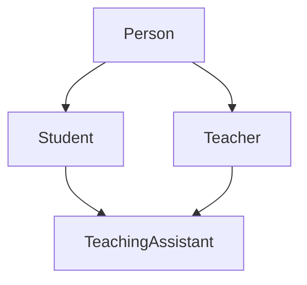
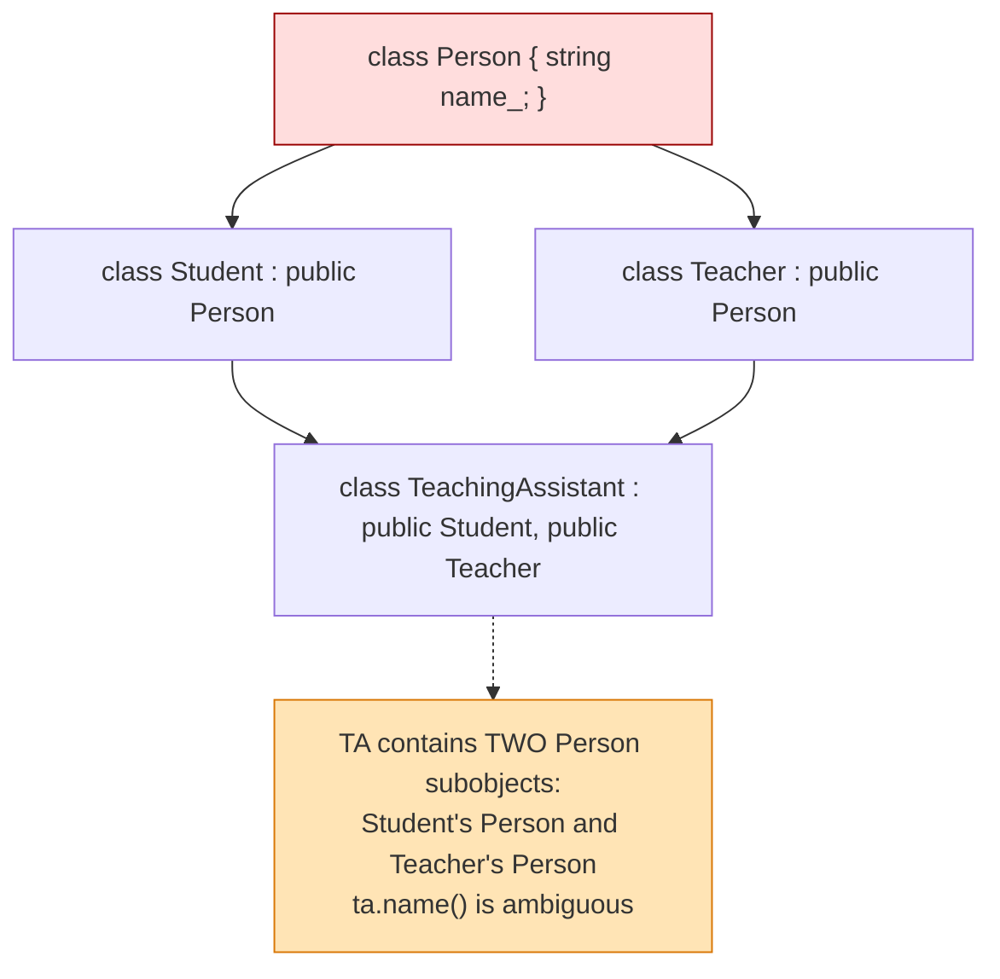
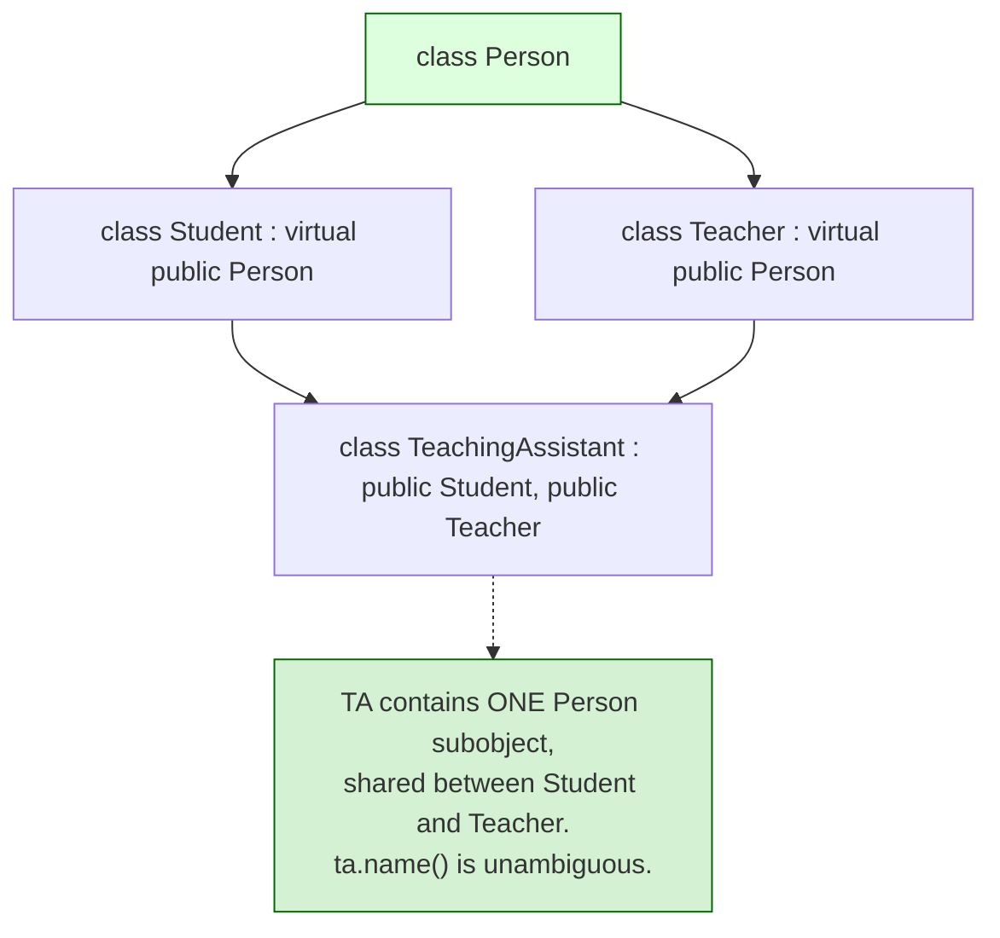
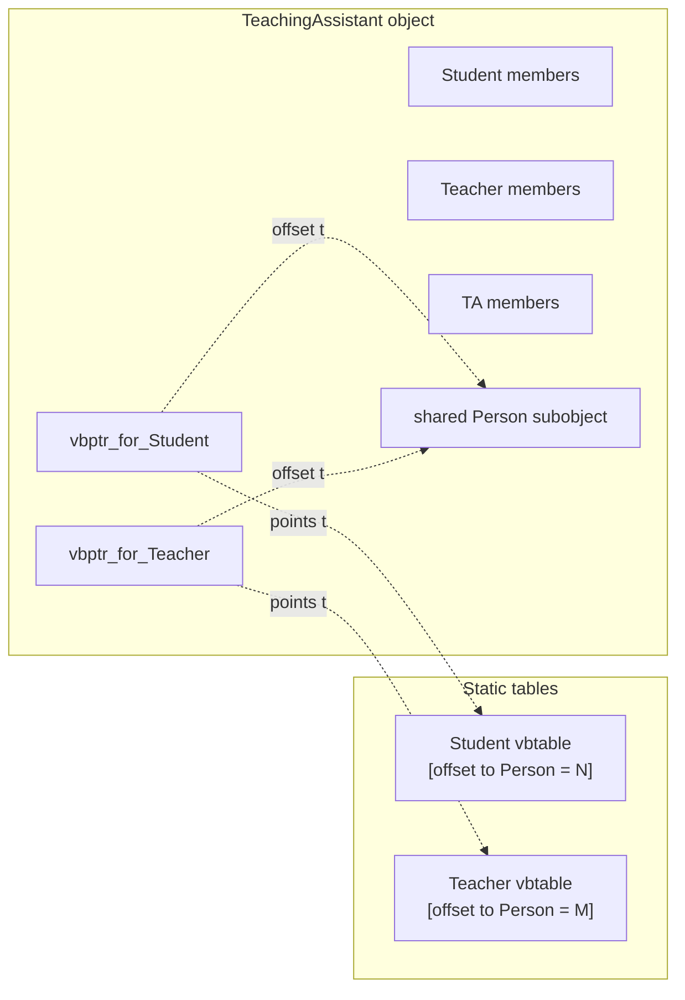
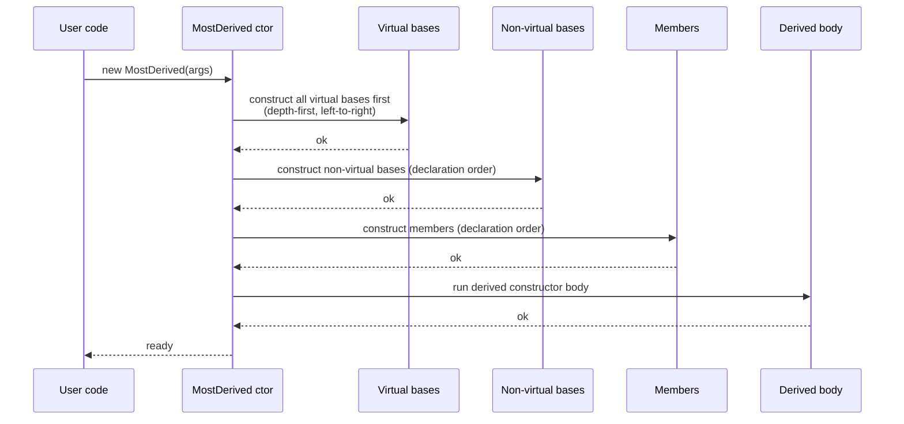

# Multiple and Virtual Inheritance

## Why This Matters

Single inheritance — one base per derived class — covers most real-world object hierarchies. But occasionally you need a class to inherit from two or more bases: a `DrawableShape` that is both a `Shape` and a `Drawable`; a `SingingWaiter` that is both a `Singer` and a `Waiter`; a stream that is both an `istream` and an `ostream` (giving `iostream`). C++ supports this directly, and it is one of the few features that distinguishes C++ from Java and C# (which provide only single inheritance for classes plus multiple inheritance for interfaces).

Multiple inheritance, however, brings problems that single inheritance does not. The most famous is the **diamond problem**: when two base classes share a common base, the most-derived class has two copies of the common base's data, leading to ambiguity and waste. The solution is **virtual inheritance**, which adds a new layer of complexity (vbptr, virtual base tables, awkward construction order, larger objects, slower access).

If you do not understand virtual inheritance, you will either write ambiguous code that does not compile or write inefficient code that compiles but pays hidden costs on every member access. This note covers the syntax, the diamond problem, virtual inheritance, construction order with virtual bases, and the modern C++ guidance to prefer composition over multiple inheritance.

## Background

Multiple inheritance was added to C++ in Release 1.2 (1989), several years after the language's initial release. Stroustrup discusses it at length in *The Design and Evolution of C++*: he considered it essential for stream I/O (where `iostream` must be both `istream` and `ostream`), and for combining interface classes with implementation classes. He also acknowledged it as one of the more dangerous features of C++ and urged restraint.

Virtual inheritance was added at the same time to solve the diamond problem. Without virtual inheritance, the diamond produces two distinct subobjects of the common base; with it, the common base is shared.

Java and C# took a different path: they allow only single inheritance of *classes* (with implementation) plus multiple inheritance of *interfaces* (with no data). This sidesteps the diamond problem at the cost of expressiveness: you cannot combine two implementations. C++ lets you choose, but with great power comes great responsibility.

Modern C++ style guides (notably Google's and Sutter/Alexandrescu's) recommend:

- Treat multiple inheritance like `goto`: legal, occasionally the right tool, but mostly avoided.
- Prefer composition for combining implementations.
- Use multiple inheritance only when each base is an *interface* (pure abstract class) or an *empty policy* class.
- Reach for virtual inheritance only as a last resort, when the diamond problem cannot be refactored away.

## Main Content

### 1. Syntax of Multiple Inheritance

```cpp
class Base1 { /* ... */ };
class Base2 { /* ... */ };

class Derived : public Base1, public Base2 {
    // inherits from both
};
```

The base-specifier list can contain any number of bases, each with its own access mode. The order matters: it controls construction order (bases are constructed left to right, destructed right to left), and it affects memory layout (the base subobjects are laid out in declaration order in the derived object).

Upcasting to either base works:

```cpp
Derived d;
Base1* b1 = &d;   // implicit, valid
Base2* b2 = &d;   // implicit, valid
```

Each upcast typically involves a fixed offset adjustment (computed at compile time) so that `b1` and `b2` point to the right subobject inside `d`.

### 2. The Diamond Problem

Consider:

```cpp
class Person {
public:
    Person(std::string name) : name_(std::move(name)) {}
    std::string const& name() const { return name_; }
protected:
    std::string name_;
};

class Student : public Person { /* ... */ };
class Teacher : public Person { /* ... */ };

class TeachingAssistant : public Student, public Teacher { /* ... */ };
```

A `TeachingAssistant` inherits from `Student` (which has a `Person` subobject) and from `Teacher` (which has another `Person` subobject). The `TeachingAssistant` object has *two* `Person` subobjects. When you call `ta.name()`, the compiler does not know which one to use — `Student::name()` or `Teacher::name()`? The call is ambiguous:

```cpp
TeachingAssistant ta;
std::cout << ta.name();          // ERROR: ambiguous
std::cout << ta.Student::name(); // OK, but awkward — and there are two names
```

This is the **diamond problem** (named for the inheritance diagram's diamond shape):



Two issues arise:

1. **Ambiguity**: which `Person::name` is meant?
2. **Duplication**: the `TeachingAssistant` object stores the `Person` data twice — wasteful and almost never what you want.

### 3. Virtual Inheritance — The Solution

Virtual inheritance tells the compiler: "share this base subobject across all paths in the inheritance graph." With virtual inheritance, `TeachingAssistant` has exactly *one* `Person` subobject.

```cpp
class Person { /* as above */ };

class Student : virtual public Person { /* ... */ };
class Teacher : virtual public Person { /* ... */ };

class TeachingAssistant : public Student, public Teacher {
public:
    TeachingAssistant(std::string name, std::string major, std::string dept)
        : Person(std::move(name)),       // virtual base init in most-derived
          Student(/*...*/),
          Teacher(/*...*/) {}
};
```

The `virtual` keyword on the base-specifier (`virtual public` or `public virtual` — order does not matter) marks that base as *virtual*. Now `ta.name()` is unambiguous, and the object stores `Person` only once.

### 4. Construction Order with Virtual Bases

Virtual bases have unusual construction rules:

- The **most-derived** class is responsible for constructing the virtual base, *not* the immediate derived class.
- Virtual bases are constructed **first**, before any non-virtual bases.
- The order of virtual bases is determined by a depth-first, left-to-right traversal of the entire inheritance graph.

```cpp
class A { public: A() { std::cout << "A "; } };
class B : virtual public A { public: B() { std::cout << "B "; } };
class C : virtual public A { public: C() { std::cout << "C "; } };
class D : public B, public C {
public:
    D() { std::cout << "D\n"; }
};

D d;   // prints: A B C D
```

If you call `A()` from `B`'s and `C`'s constructors, those calls are *ignored* when `D` is the most-derived class — only `D`'s call to `A()` matters. This is why `D`'s constructor must explicitly initialize `A` in its MIL.

This design ensures that the virtual base is constructed exactly once, by the class that knows the full picture (the most-derived one). It also means that intermediate classes (`B`, `C`) cannot rely on initializing the virtual base themselves.

### 5. Memory Layout with Virtual Inheritance

Non-virtual inheritance lays out bases in declaration order, with no overhead beyond padding. Virtual inheritance is more complex:

- Each class that has a virtual base stores a *virtual base pointer* (vbptr) pointing to a *virtual base table* (vbtable), which records the offsets from the derived object to each virtual base.
- Alternatively, the compiler may use the existing vptr/vtable mechanism if the class already has virtual functions.
- Access to a virtual base's members requires an extra indirection through the vbptr/vbtable, which is slower than direct access.

Memory layout of a `TeachingAssistant` (illustrative):

```
[ vbptr_for_Student | Student members | vbptr_for_Teacher | Teacher members | TA members | Person members ]
```

The exact layout is implementation-defined, but the key idea is that virtual bases sit at the end and are accessed via offset tables. This is slower than non-virtual base access and prevents some optimizations.

### 6. Why Multiple Inheritance Is Rare in Modern C++

Modern C++ style guides recommend against multiple inheritance except for *interfaces* (pure abstract classes with no data members). Reasons:

- **Complexity**: reasoning about object layout, construction order, and name lookup with multiple bases is hard. Code review becomes harder.
- **Diamond problem**: virtual inheritance solves it but at significant cost.
- **Brittleness**: adding a new base to a class can introduce name conflicts or change layout, breaking ABI.
- **Better alternatives**: composition, `std::variant`, templates, type erasure (`std::function`).

Multiple inheritance *is* appropriate in these cases:

1. **Multiple interfaces**: a class implements several pure-abstract interfaces. No data is shared, no diamond arises, and the cost is small.
2. **Policy-based design**: a class derives from several empty policy classes (stateless), benefiting from EBO. This is the foundation of policy-based template design (Alexandrescu, *Modern C++ Design*).
3. **Mixins**: each base adds a small amount of orthogonal functionality. Combined with templates (CRTP), this can be very expressive.
4. **Implementation reuse**: when you really do need to reuse two implementations and composition is impractical. Rare.

Avoid:

1. Multiple inheritance from classes that have data members and overlapping interfaces (diamond risk).
2. Virtual inheritance unless absolutely necessary (it has a real performance cost).
3. Inheritance from classes that were not designed as bases (no virtual destructor, no protected members).

### 7. Name Ambiguity Beyond the Diamond

Even without a shared common base, multiple inheritance can cause name ambiguity:

```cpp
class A { public: void f(); };
class B { public: void f(); };
class C : public A, public B {};

C c;
c.f();              // ERROR: A::f or B::f?
c.A::f();           // OK, explicit
c.B::f();           // OK, explicit
```

You can resolve this with explicit qualification (`c.A::f()`) or with a `using` declaration in `C`:

```cpp
class C : public A, public B {
public:
    using A::f;     // bring A::f into C's scope
    using B::f;     // bring B::f too — now both are overloads
};
```

If both `A::f` and `B::f` have the same signature, the `using` declarations themselves become ambiguous at call time — you must write an explicit wrapper:

```cpp
class C : public A, public B {
public:
    void f() { A::f(); }   // pick one, or do something else
};
```

### 8. Interface Multiplicity — The Good Use Case

```cpp
class IComparable { public: virtual int compare(IComparable const&) const = 0; virtual ~IComparable() = default; };
class ISerializable { public: virtual std::string serialize() const = 0; virtual ~ISerializable() = default; };
class ICloneable { public: virtual std::unique_ptr<ICloneable> clone() const = 0; virtual ~ICloneable() = default; };

class Document : public IComparable, public ISerializable, public ICloneable {
    // implement all three interfaces
    int compare(IComparable const&) const override { /* ... */ return 0; }
    std::string serialize() const override { /* ... */ return ""; }
    std::unique_ptr<ICloneable> clone() const override { /* ... */ return std::make_unique<Document>(*this); }
};
```

Each interface is pure abstract, has a virtual destructor, and shares no data with the others. There is no diamond, no ambiguity, and minimal overhead. This is the canonical "good" use of multiple inheritance.

### 9. Virtual Inheritance of Pure Interfaces

Sometimes you have a diamond of *interfaces*:

```cpp
class IFile { public: virtual void open() = 0; virtual ~IFile() = default; };
class IReadable : virtual public IFile { public: virtual int read() = 0; };
class IWritable : virtual public IFile { public: virtual void write(int) = 0; };
class IReadWrite : public IReadable, public IWritable { /* must implement open, read, write */ };
```

Here virtual inheritance of `IFile` is appropriate (it has no data, but you want a single `open()` method, not two). The cost is one vbptr per intermediate class, but since these are interfaces (used via pointer), the impact is small.

### 10. Alternatives to Multiple Inheritance

| Goal                                     | Multiple Inheritance approach         | Better modern alternative                |
|------------------------------------------|----------------------------------------|------------------------------------------|
| Combine two implementations              | `class C : public A, public B {}`      | Composition: `class C { A a; B b; };`    |
| Implement multiple interfaces            | Pure abstract base classes             | Still appropriate — keep using MI here   |
| Mix in orthogonal policy                 | Template policy classes via CRTP       | Same — CRTP is the modern way            |
| Type-erased polymorphic value            | Abstract base class + cloning          | `std::variant` for closed sets           |
| Callback with multiple signatures        | Abstract callback base                 | `std::function` with overloads           |
| Mix-in of stateless utilities            | Empty base classes (EBO)               | Free functions in a namespace            |

When in doubt: composition. Use multiple inheritance only for interfaces, mixins, or policy classes — and document *why* you chose it.

## Diagrams

### The Diamond Problem



### Virtual Inheritance Resolution



### Virtual Inheritance Memory Layout



### Construction Order with Virtual Bases



## Code Examples

### The Diamond, Naive (Broken)

```cpp
#include <string>

class Person {
public:
    Person(std::string name) : name_(std::move(name)) {}
    std::string const& name() const { return name_; }
protected:
    std::string name_;
};

class Student : public Person {
public:
    Student(std::string name, std::string major) : Person(std::move(name)), major_(std::move(major)) {}
private:
    std::string major_;
};

class Teacher : public Person {
public:
    Teacher(std::string name, std::string dept) : Person(std::move(name)), dept_(std::move(dept)) {}
private:
    std::string dept_;
};

class TeachingAssistant : public Student, public Teacher {
public:
    TeachingAssistant(std::string name, std::string major, std::string dept)
        : Student(name, major), Teacher(name, dept) {}
};

// TeachingAssistant ta("Alice", "CS", "Engineering");
// ta.name();  // ERROR: ambiguous (Student::name or Teacher::name?)
```

### The Diamond, Fixed with Virtual Inheritance

```cpp
class Person {
public:
    Person(std::string name) : name_(std::move(name)) {}
    std::string const& name() const { return name_; }
protected:
    std::string name_;
};

class Student : virtual public Person {
public:
    Student(std::string major) : major_(std::move(major)) {}
private:
    std::string major_;
};

class Teacher : virtual public Person {
public:
    Teacher(std::string dept) : dept_(std::move(dept)) {}
private:
    std::string dept_;
};

class TeachingAssistant : public Student, public Teacher {
public:
    TeachingAssistant(std::string name, std::string major, std::string dept)
        : Person(std::move(name)),     // virtual base init here, in most-derived
          Student(std::move(major)),
          Teacher(std::move(dept)) {}
};

// TeachingAssistant ta("Alice", "CS", "Engineering");
// ta.name();  // OK, unambiguous
```

### Multiple Interfaces (the Good Case)

```cpp
#include <memory>
#include <string>

class IRenderable {
public:
    virtual void render() const = 0;
    virtual ~IRenderable() = default;
};

class IClickable {
public:
    virtual void on_click() = 0;
    virtual ~IClickable() = default;
};

class Button : public IRenderable, public IClickable {
public:
    void render() const override { /* draw button */ }
    void on_click() override { /* handle click */ }
};
```

### CRTP for Static Polymorphism (an Alternative)

```cpp
template <typename Derived>
class Shape {
public:
    double area() const { return static_cast<Derived const&>(*this).area_impl(); }
};

class Circle : public Shape<Circle> {
public:
    explicit Circle(double r) : r_(r) {}
    double area_impl() const { return 3.14159265358979 * r_ * r_; }
private:
    double r_;
};

// No vptr, no vtable; the call to area() is resolved at compile time and can be inlined.
```

## Common Pitfalls

- **Forgetting virtual inheritance when you need it.** The diamond produces ambiguous calls and duplicated state. Recognize the diamond early and decide: virtual inheritance, or refactor.
- **Forgetting to initialize the virtual base in the most-derived constructor.** The intermediate classes' MIL calls to the virtual base are ignored. If you do not initialize it in the most-derived class, the default constructor is used (and if there is no default constructor, it is a compile error).
- **Using virtual inheritance when you do not need it.** It adds memory and per-access cost. Only use it for actual diamonds.
- **Multiple inheritance from two classes with overlapping data.** This is the design smell at the root of most diamond problems. Consider composition instead.
- **Name ambiguity without realizing it.** When two bases have members with the same name, calls are ambiguous. Use explicit qualification or `using` declarations, or rename one of the members.
- **Calling virtual functions from the virtual base's constructor.** Same caveat as for regular constructors: the dynamic type is the virtual base during its construction, so virtual dispatch goes to the virtual base's version.
- **Casting between virtual base and derived.** `static_cast` from a virtual base to a derived class is **not allowed**; you must use `dynamic_cast` because the offset is not a compile-time constant. Casting from derived to virtual base is fine (implicit upcast).
- **Forgetting virtual destructors on interface bases in a diamond.** Each interface needs its own `virtual ~I() = default;`, and the most-derived class's destructor must be `virtual` too (which it will be, since one of the bases is polymorphic).
- **Using multiple inheritance from classes with data members.** This is rarely the right design. If you find yourself doing it, ask whether composition would work.
- **Assuming the order of base-specifiers does not matter.** It controls construction order, destruction order, and member layout. Be deliberate.
- **Expecting virtual inheritance to "just work" with `static_cast`.** It does not, for downcasts. Use `dynamic_cast`.

## Tips and Tricks

- **Default to composition.** Multiple inheritance should be the exception, not the rule.
- **Use multiple inheritance for interfaces only.** Pure abstract classes with no data, virtual destructor, and no shared state. This avoids both the diamond problem and the cost of virtual inheritance.
- **Use CRTP for static (compile-time) polymorphism.** When the set of types is closed at compile time, CRTP gives you the syntactic convenience of inheritance without the runtime cost of vtables. See [[12. Modern C++|Modern C++]].
- **Use `std::variant` for closed sets of types with shared operations.** Cleaner than deep hierarchies and faster than virtual dispatch.
- **When you must use a diamond, mark the common base virtual at every level.** Mixing virtual and non-virtual inheritance of the same base is technically allowed but confusing and brittle.
- **Initialize virtual bases in the most-derived constructor, even if the call seems redundant.** If you do not, the default constructor is called silently — which may not be what you want.
- **Avoid casting from a virtual base pointer to a derived pointer with `static_cast`.** Use `dynamic_cast` (requires RTTI) or restructure so the cast is unnecessary.
- **Prefer empty base classes (stateless mixins) when you do reach for multiple inheritance.** They benefit from EBO and avoid the diamond entirely.
- **Document why you used multiple inheritance in a comment.** Future maintainers (including yourself) will thank you.
- **Watch out for `final` on virtual base classes.** It is allowed but rarely needed, and it complicates any future refactoring of the hierarchy.
- **Use the `Mixin` pattern via CRTP** for orthogonal extensions: `class C : public MixinA<C>, public MixinB<C> { ... };`. Each mixin adds one capability, the mixins are empty, and there is no diamond.

## Active Recall

1. What is the diamond problem? Give a small example with three or four classes.
2. What does virtual inheritance do? How does it change the number of subobjects of the common base?
3. Why must the most-derived class initialize a virtual base, not the immediate derived class?
4. In what order are virtual bases, non-virtual bases, and members constructed?
5. What is a vbptr? How does it differ from a vptr?
6. Why is access to a virtual base's members slower than access to a non-virtual base's members?
7. Why is `static_cast` from a virtual base to a derived class not allowed? What do you use instead?
8. List three legitimate uses of multiple inheritance and three anti-patterns.
9. What is the modern C++ guidance on multiple inheritance? When is it appropriate?
10. What is CRTP, and how does it provide static polymorphism without runtime cost?
11. How do you resolve name ambiguity when two bases have members with the same name?
12. What goes wrong if you mix virtual and non-virtual inheritance of the same base in different paths?
13. Why is multiple inheritance of pure interfaces (no data) cheap, while multiple inheritance of classes with data is expensive?
14. Give an example where `std::variant` is preferable to a virtual-inheritance hierarchy.

## Next Steps

- Cross-reference [[3. Inheritance|Chapter 9.3]] for the basics of single inheritance and access modes.
- Cross-reference [[4. Polymorphism and Virtual Functions|Chapter 9.4]] for vtable internals; virtual inheritance adds vbptr on top of vptr.
- Cross-reference [[2. Constructors and Destructors|Chapter 9.2]] for construction order without virtual bases.
- Cross-reference [[12. Modern C++|Modern C++]] for CRTP, `std::variant`, and other alternatives to deep inheritance.
- Cross-reference [[8. The Rule of 0, 3, and 5|Chapter 9.8]] for how copy/move behavior interacts with base classes.
