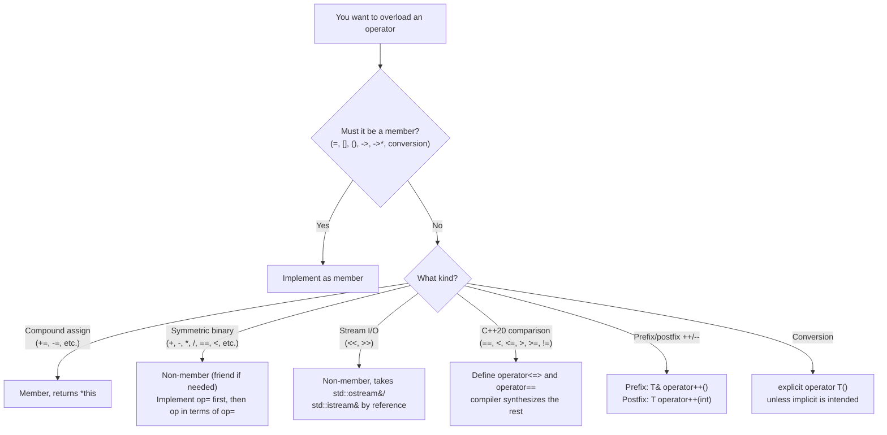
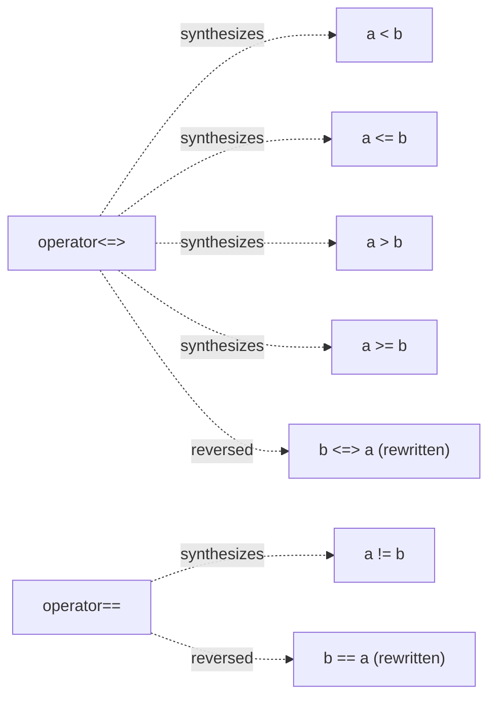
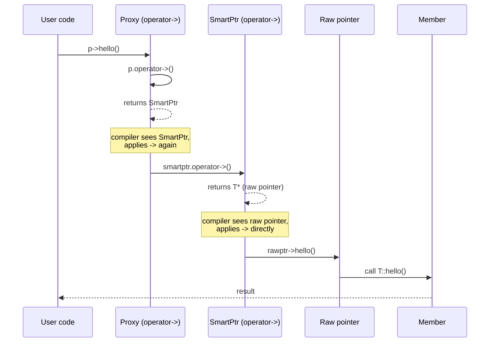

# Operator Overloading

## Why This Matters

Operators are how C++ spells the most common operations: `+`, `*`, `==`, `[]`, `()`, `->`, `<<`. When you design a numeric type (`Complex`, `Matrix`, `Bigint`), a container (`std::vector`, `std::map`), a smart pointer (`std::unique_ptr`), or a stream (`std::ostream`), operator overloading lets your type participate in expressions with the same syntax users expect from built-in types. A `Matrix a, b, c; c = a + b * 2;` reads naturally; `c = a.plus(b.times(2));` does not.

But operator overloading is also one of the most abused features of C++. A poorly chosen operator — `operator+` that does subtraction, `operator<<` that does I/O on a non-stream class, `operator||` that loses short-circuit evaluation — makes code unreadable and bug-prone. The language lets you do almost anything; good taste is what stops you.

This note covers the rules (which operators you can overload, member vs non-member, arity and precedence), the common patterns (arithmetic, comparison, streaming, subscript, function call, conversion, smart pointer), and the C++20 revolution that is `operator<=>` (the three-way comparison operator that synthesizes the other five comparison operators).

## Background

Operator overloading entered C++ in Release 1.0 (1985). Stroustrup's argument was pragmatic: without it, numeric types like `complex` would have to use function-call syntax (`add(a, b)` instead of `a + b`), which is both ugly and error-prone (operator precedence is lost). Simula 67 had operator overloading; Stroustrup adopted it.

The C++ committee has added operators over the years:

- C++11: `operator""` for user-defined literals, rvalue-ref-qualified operators.
- C++14: nothing new here, but the standard library added fully-`constexpr` comparison operators.
- C++17: `operator->*` for pointer-to-member overloading was clarified; ordered comparison rewrite rules expanded.
- C++20: `operator<=>` (the spaceship operator), which auto-generates `==`, `!=`, `<`, `<=`, `>`, `>=` from a single definition. Also, `operator==` is now symmetric (the compiler rewrites `a == b` to `b == a` if needed).

Java and C# largely forbid operator overloading (with a few exceptions). Python allows it via `__dunder__` methods. Rust allows it via traits. C++'s implementation is the most flexible — and the most dangerous if misused.

## Main Content

### 1. What You Can and Cannot Overload

You can overload almost all of C++'s operators. The notable exceptions:

| Cannot overload     | Reason                                                       |
|---------------------|--------------------------------------------------------------|
| `.` (member access) | Would break too many language rules. (C++11 added `operator.*` for smart references via `operator->` chains.) |
| `.*` (pointer-to-member access) | Same reasoning as `.`.                          |
| `::` (scope resolution) | Pure compile-time; has no runtime semantics.            |
| `?:` (ternary)      | Three operands, control-flow semantics; not overloadable.   |
| `sizeof`, `typeid`, `alignof` | Compile-time operators; not overloadable.        |
| `#`, `##` (preprocessor) | Not C++ operators at all.                            |

You can overload:

- Arithmetic: `+ - * / % += -= *= /= %=`
- Bitwise: `& | ^ << >> &= |= ^= <<= >>=`
- Comparison: `== != < <= > >= <=>`
- Logical: `&& || !` (warning: short-circuit is lost — see pitfalls)
- Increment/decrement: `++ --` (prefix and postfix)
- Subscript: `[]`
- Function call: `()`
- Dereference: `* ->` (and `->*`)
- Comma: `,` (warning: evaluation order is lost — see pitfalls)
- Memory: `new new[] delete delete[]`
- Conversion: `operator T()` (implicit or `explicit`)
- User-defined literals: `operator""_x` (C++11)

You cannot change an operator's arity, precedence, or associativity. You can only change what it does.

### 2. Member vs Non-Member

Operators can be implemented as **member functions** (with `this` as the left operand) or **non-member functions** (typically friends, with both operands as parameters). The choice matters:

- **Assignment-like operators** (`=`, `[]`, `()`, `->`, `->*`, and the conversion operator) **must** be members.
- **Compound assignment** (`+=`, `-=`, etc.) **should** be members.
- **Symmetric binary operators** (`+`, `-`, `*`, `/`, `==`, `<`, etc.) **should** be non-members, so that the left operand can be implicitly converted just like the right operand.

Why does the symmetric-operator rule matter? Consider:

```cpp
class Money {
public:
    Money(double v) : cents_(static_cast<long>(v * 100)) {}   // implicit conversion
    Money operator+(Money const& rhs) const { return Money(cents_ + rhs.cents_); }
private:
    long cents_;
};

Money a(10.0);
a + 5.0;   // OK: a.operator+(Money(5.0)) via implicit conversion of rhs
5.0 + a;   // ERROR: 5.0.operator+(a) — double has no operator+(Money)
```

If `operator+` is a non-member, both operands are parameters and both can be converted:

```cpp
class Money { /* ... */ friend Money operator+(Money, Money); };
Money operator+(Money lhs, Money rhs) { return Money(lhs.cents_ + rhs.cents_); }  // if it can access cents_

Money a(10.0);
a + 5.0;   // OK
5.0 + a;   // OK
```

The idiomatic pattern: implement `+=` as a member, then implement `+` as a non-member in terms of `+=`:

```cpp
class Money {
public:
    Money& operator+=(Money const& rhs) { cents_ += rhs.cents_; return *this; }
    /* ... */
};

inline Money operator+(Money lhs, Money const& rhs) {  // pass lhs by value
    lhs += rhs;        // reuse +=
    return lhs;        // NRVO
}
```

### 3. Arithmetic Operators

The pattern for binary arithmetic (`+ - * / %`):

- Implement `op=` as a member returning `*this` by reference.
- Implement `op` as a non-member taking the left operand by value, modifying it via `op=`, and returning it.

```cpp
class Complex {
public:
    Complex(double r = 0, double i = 0) : r_(r), i_(i) {}
    Complex& operator+=(Complex const& o) { r_ += o.r_; i_ += o.i_; return *this; }
    Complex& operator-=(Complex const& o) { r_ -= o.r_; i_ -= o.i_; return *this; }
    Complex& operator*=(Complex const& o) {
        double r = r_ * o.r_ - i_ * o.i_;
        double i = r_ * o.i_ + i_ * o.r_;
        r_ = r; i_ = i; return *this;
    }
    friend Complex operator+(Complex a, Complex const& b) { return a += b; }
    friend Complex operator-(Complex a, Complex const& b) { return a -= b; }
    friend Complex operator*(Complex a, Complex const& b) { return a *= b; }
private:
    double r_, i_;
};
```

Unary `+` and `-`:

```cpp
Complex operator+() const { return *this; }
Complex operator-() const { return Complex(-r_, -i_); }
```

### 4. Comparison Operators — Pre-C++20

Before C++20, you had to implement each of `== != < <= > >=` separately (six functions). A common pattern was to implement `==` and `<`, then derive the others:

```cpp
class Vec3 {
public:
    friend bool operator==(Vec3 const& a, Vec3 const& b) {
        return a.x_ == b.x_ && a.y_ == b.y_ && a.z_ == b.z_;
    }
    friend bool operator!=(Vec3 const& a, Vec3 const& b) { return !(a == b); }
    friend bool operator<(Vec3 const& a, Vec3 const& b) {
        if (a.x_ != b.x_) return a.x_ < b.x_;
        if (a.y_ != b.y_) return a.y_ < b.y_;
        return a.z_ < b.z_;
    }
    friend bool operator>(Vec3 const& a, Vec3 const& b) { return b < a; }
    friend bool operator<=(Vec3 const& a, Vec3 const& b) { return !(b < a); }
    friend bool operator>=(Vec3 const& a, Vec3 const& b) { return !(a < b); }
private:
    int x_, y_, z_;
};
```

This is tedious and error-prone. C++20 fixes it with `operator<=>`.

### 5. C++20: `operator<=>` (Spaceship Operator)

C++20 introduces the three-way comparison operator `<=>`, which returns an object indicating less-than, equal, or greater-than (specifically, one of `std::strong_ordering`, `std::weak_ordering`, or `std::partial_ordering`). Defining `operator<=>` *and* `operator==` lets the compiler synthesize `<`, `<=`, `>`, `>=`, and `!=` automatically.

```cpp
#include <compare>

class Vec3 {
public:
    auto operator<=>(Vec3 const&) const = default;   // lexicographic, member by member
    bool operator==(Vec3 const&) const = default;     // also defaulted
private:
    int x_, y_, z_;
};
```

That's it — six comparison operators from two defaulted functions. The compiler also generates the relational operators from `<=>` and `==`.

If you want a custom comparison, you can write the body:

```cpp
class Version {
public:
    auto operator<=>(Version const& o) const {
        if (auto c = major_ <=> o.major_; c != 0) return c;
        if (auto c = minor_ <=> o.minor_; c != 0) return c;
        return patch_ <=> o.patch_;
    }
    bool operator==(Version const&) const = default;
private:
    int major_, minor_, patch_;
};
```

The return type determines the comparison category:

- `std::strong_ordering`: classic integer-like comparison; `a == b` implies `a` and `b` are substitutable.
- `std::weak_ordering`: ordered, but `a == b` does not imply substitutability (e.g., case-insensitive strings).
- `std::partial_ordering`: allows "unordered" (e.g., floating-point NaN).

`<=>` also enables the compiler to rewrite expressions: `a < b` becomes `(a <=> b) < 0`, `a > b` becomes `(b <=> a) < 0`, etc. And `a == b` is rewritten to `b == a` if `a == b` is not directly available — so you only need to define `==` once for symmetric comparison.

### 6. Stream Operators

`<<` and `>>` for I/O are conventionally non-member (the left operand is `std::ostream&` or `std::istream&`, not your type). They return the stream by reference to enable chaining.

```cpp
#include <iostream>

class Point {
public:
    Point(double x, double y) : x_(x), y_(y) {}
    double x() const { return x_; }
    double y() const { return y_; }
private:
    double x_, y_;
};

std::ostream& operator<<(std::ostream& os, Point const& p) {
    return os << '(' << p.x() << ", " << p.y() << ')';
}

std::istream& operator>>(std::istream& is, Point& p) {
    char c1, c2, c3;
    double x, y;
    if (is >> c1 >> x >> c2 >> y >> c3 && c1 == '(' && c2 == ',' && c3 == ')') {
        p = Point(x, y);
    } else {
        is.setstate(std::ios::failbit);
    }
    return is;
}
```

### 7. Subscript Operator `[]`

`operator[]` must be a member. It can take any type as the index, not just integral types — associative containers use `std::string` or arbitrary key types.

For containers, you usually provide two overloads: a `const` version returning by `const` reference (or value), and a non-`const` version returning by reference (so callers can assign to it). C++23 introduces multidimensional `operator[]` (taking multiple arguments).

```cpp
class IntArray {
public:
    int& operator[](std::size_t i) { return data_[i]; }              // for writing
    int const& operator[](std::size_t i) const { return data_[i]; }  // for reading
private:
    int data_[100];
};

// Usage:
IntArray a;
a[5] = 42;
int const& x = a[5];   // calls the const overload on a const IntArray
```

### 8. Function Call Operator `()`

`operator()` must be a member. Objects with `operator()` are called *functors* or *function objects*. They are the basis of much of the STL (predicates, comparators) and of lambdas (a lambda is syntactic sugar for an unnamed functor class).

```cpp
class Multiplier {
public:
    explicit Multiplier(double factor) : factor_(factor) {}
    double operator()(double x) const { return x * factor_; }
private:
    double factor_;
};

Multiplier triple(3.0);
std::cout << triple(5.0) << '\n';   // 15
```

Functors are more flexible than function pointers because they can carry state. They are also easier for the compiler to inline.

### 9. Conversion Operators

A conversion operator has signature `operator T()` (where `T` is the target type). It allows implicit conversion from your class to `T`.

```cpp
class Fraction {
public:
    Fraction(long n, long d = 1) : n_(n), d_(d) {}
    operator double() const { return static_cast<double>(n_) / d_; }   // implicit
    explicit operator std::string() const { return std::to_string(n_) + "/" + std::to_string(d_); }
private:
    long n_, d_;
};

Fraction f(3, 4);
double d = f;                  // OK, implicit
// std::string s = f;          // ERROR: explicit conversion not allowed
std::string s = static_cast<std::string>(f);   // OK
```

Mark conversion operators `explicit` whenever you want to prevent implicit conversions. This avoids surprises like `if (my_object) { ... }` accidentally compiling because of an implicit conversion to `bool`.

A common pattern is `explicit operator bool()` for types that should be usable in boolean contexts but not implicitly convertible to `int`:

```cpp
class FileHandle {
public:
    explicit operator bool() const { return fp_ != nullptr; }
private:
    std::FILE* fp_;
};

FileHandle fh;
if (fh) { /* ... */ }   // OK
int n = fh;             // ERROR (good!)
```

The `safe bool` idiom (pre-C++11) was a complex workaround; C++11's `explicit operator bool` replaced it cleanly.

### 10. `operator->` (Smart Pointer Idiom)

`operator->` is a special member operator with unusual semantics: it is applied *recursively* until a raw pointer is reached. This makes it the basis of smart pointers and proxy objects.

```cpp
template <typename T>
class OwnPtr {
public:
    explicit OwnPtr(T* p = nullptr) : p_(p) {}
    ~OwnPtr() { delete p_; }
    OwnPtr(OwnPtr const&) = delete;
    OwnPtr& operator=(OwnPtr const&) = delete;

    T* operator->() const { return p_; }   // returns a raw pointer
    T& operator*() const { return *p_; }
    explicit operator bool() const { return p_ != nullptr; }

private:
    T* p_;
};

struct Widget { void hello() const; };

OwnPtr<Widget> p(new Widget);
p->hello();   // p.operator->() returns Widget*, then ->hello() is called on it
```

The recursion rule: if `operator->` returns an object that itself has `operator->`, the compiler applies `->` again, until it gets a raw pointer. This lets you stack proxies (e.g., a logging proxy wrapping a smart pointer wrapping a raw pointer).

### 11. Increment and Decrement

`++` and `--` each have prefix and postfix forms. The prefix form takes no parameters; the postfix form takes a dummy `int` parameter to disambiguate.

```cpp
class Counter {
public:
    Counter& operator++() { ++n_; return *this; }      // prefix ++c
    Counter operator++(int) { Counter c = *this; ++n_; return c; }   // postfix c++
private:
    long n_ = 0;
};
```

The postfix form returns the *old* value by value (so `c++` returns the previous state). The prefix form is more efficient (no copy) and should be preferred in generic code (`++it`).

### 12. Memory Operators

`operator new` and `operator delete` can be overloaded at class scope or globally. Class-scope overloads are useful for custom allocation (e.g., a pool allocator). See [[7. Memory Management/7. Custom Allocators|Chapter 7.7]].

### 13. Operators You Should Almost Never Overload

- **`&&`, `||`**: Overloading loses short-circuit evaluation. Both operands are always evaluated. Almost never what you want.
- **`,` (comma)**: Overloading loses the sequencing guarantee. Almost never what you want.
- **`&` (unary address-of)**: Overloading breaks `&obj` semantics for your type. Useful only for smart-pointer-like types (e.g., `std::vector<bool>::reference`), but extremely rare.

### 14. User-Defined Literals (C++11)

`operator""_x` defines a literal suffix. The name *must* start with an underscore (non-underscore suffixes are reserved for the standard library).

```cpp
constexpr long double operator""_km(long double x) { return x * 1000.0L; }   // meters
constexpr long double operator""_mi(long double x) { return x * 1609.344L; } // meters

auto distance = 5.0_km + 3.0_mi;   // distance in meters
```

## Diagrams

### Operator Overload Decision Table



### C++20 Comparison Synthesis



### Smart-Pointer `operator->` Recursion



## Code Examples

### A Rational Class with All the Idiomatic Operators

```cpp
#include <compare>
#include <iostream>
#include <numeric>

class Rational {
public:
    Rational(long n = 0, long d = 1) : n_(n), d_(d) {
        if (d_ == 0) throw std::invalid_argument("zero denominator");
        normalize();
    }

    long num() const { return n_; }
    long den() const { return d_; }

    // Compound assignment (members).
    Rational& operator+=(Rational const& o) {
        n_ = n_ * o.d_ + o.n_ * d_;
        d_ *= o.d_;
        normalize();
        return *this;
    }
    Rational& operator-=(Rational const& o) {
        return *this += Rational(-o.n_, o.d_);
    }
    Rational& operator*=(Rational const& o) {
        n_ *= o.n_;
        d_ *= o.d_;
        normalize();
        return *this;
    }
    Rational& operator/=(Rational const& o) {
        return *this *= Rational(o.d_, o.n_);
    }

    // C++20 comparison: synthesize all six from these two.
    auto operator<=>(Rational const& o) const {
        return static_cast<long long>(n_) * o.d_ <=> static_cast<long long>(o.n_) * d_;
    }
    bool operator==(Rational const& o) const = default;

    // Stream output (non-member friend).
    friend std::ostream& operator<<(std::ostream& os, Rational const& r) {
        return os << r.n_ << '/' << r.d_;
    }

private:
    void normalize() {
        long g = std::gcd(std::abs(n_), std::abs(d_));
        if (g != 0) { n_ /= g; d_ /= g; }
        if (d_ < 0) { n_ = -n_; d_ = -d_; }
    }
    long n_, d_;
};

// Symmetric arithmetic (non-members, in terms of compound assign).
inline Rational operator+(Rational a, Rational const& b) { return a += b; }
inline Rational operator-(Rational a, Rational const& b) { return a -= b; }
inline Rational operator*(Rational a, Rational const& b) { return a *= b; }
inline Rational operator/(Rational a, Rational const& b) { return a /= b; }
```

### Subscript Operator with Proxy for `vector<bool>`-Style Bit References

```cpp
class BitArray {
public:
    explicit BitArray(std::size_t n) : bytes_(n / 8 + 1, 0) {}

    class BitRef {
    public:
        BitRef(unsigned char& byte, unsigned char mask) : byte_(byte), mask_(mask) {}
        BitRef& operator=(bool v) { if (v) byte_ |= mask_; else byte_ &= ~mask_; return *this; }
        operator bool() const { return (byte_ & mask_) != 0; }
    private:
        unsigned char& byte_;
        unsigned char mask_;
    };

    BitRef operator[](std::size_t i) {
        return BitRef(bytes_[i / 8], static_cast<unsigned char>(1 << (i % 8)));
    }
    bool operator[](std::size_t i) const {
        return (bytes_[i / 8] & (1 << (i % 8))) != 0;
    }
private:
    std::vector<unsigned char> bytes_;
};

BitArray b(16);
b[3] = true;
b[3] = b[3] && b[4];
```

### Function Call Operator for a Stateful Predicate

```cpp
#include <algorithm>
#include <vector>

class InInterval {
public:
    InInterval(int lo, int hi) : lo_(lo), hi_(hi) {}
    bool operator()(int x) const { return lo_ <= x && x <= hi_; }
private:
    int lo_, hi_;
};

std::vector<int> v = {1, 5, 10, 15, 20};
auto it = std::find_if(v.begin(), v.end(), InInterval(8, 12));   // points to 10
```

### `explicit operator bool` and the Safe-Bool Idiom, Modernized

```cpp
class Result {
public:
    Result(int code, std::string msg) : code_(code), msg_(std::move(msg)) {}
    explicit operator bool() const { return code_ == 0; }
    std::string const& message() const { return msg_; }
private:
    int code_;
    std::string msg_;
};

Result r = compute();
if (r) {                       // OK: explicit operator bool in boolean context
    std::cout << "success\n";
}
// int n = r;                  // ERROR: explicit, no implicit conversion to int
// if (r + 1) {}               // ERROR: cannot promote to int then add
```

## Common Pitfalls

- **Overloading `&&`, `||`, or `,`.** You lose short-circuit evaluation (for `&&`/`||`) and the sequencing guarantee (for `,`). Both operands are always evaluated. Almost never what you want.
- **Overloading unary `&`.** Breaks `&obj` semantics; rare and surprising.
- **Implementing `+` as a member without an `+=`.** This forces `+` to do all the work and means callers cannot reuse the logic via `+=`. Implement `+=` first, then `+` in terms of it.
- **Forgetting to make symmetric operators non-members.** Then implicit conversion of the left operand does not work (`5.0 + money` fails but `money + 5.0` succeeds). Make symmetric binary operators non-members.
- **Returning by reference from `+` (and similar) to a local.** Returning a dangling reference is UB. Always return by value from binary arithmetic.
- **Postfix `++` returning a reference.** Postfix must return the *old* value by value; returning a reference would alias the current (incremented) state.
- **`operator[]` returning by value when callers need to assign.** `vec[i] = 5;` requires a non-`const` reference return. Provide both `const` and non-`const` overloads.
- **Forgetting `const` on `operator[] const`, `operator() const`, `operator->() const`, conversion operators.** Most read-only operations should be `const`.
- **Implicit conversion operators causing surprising overload resolutions.** A single implicit conversion operator can trigger chains of conversions that produce unexpected results. Mark conversion operators `explicit` by default.
- **Defining `operator==` but not `operator!=` (pre-C++20).** `a != b` would not work as expected; the compiler does not automatically negate `==`. C++20 fixes this.
- **Defining `operator<` but not the rest of the relational operators (pre-C++20).** Tedious and error-prone. C++20 fixes this with `<=>`.
- **Mixing `operator<=>` with manually written comparisons.** The compiler may emit ambiguities. Pick one approach per class.
- **Overloading an operator with surprising semantics.** If `operator+` subtracts or `operator==` compares only one field, users will be confused. Stick to the principle of least surprise.
- **Forgetting that `operator->` is recursive.** Returning another object with `operator->` causes another application of `->`. This is powerful but can be surprising.

## Tips and Tricks

- **Implement `op=` first, then `op` in terms of `op=`.** DRY, and lets you optimize `op=` once.
- **Make symmetric binary operators non-members.** Enables implicit conversion of both operands.
- **Pass the left operand of `+`, `-`, etc. by value, not by `const` ref.** This enables move-elision and lets the function reuse the parameter as a local.
- **In C++20, prefer `= default` for `operator<=>` and `operator==`.** The compiler-generated lexicographic comparison is correct and concise.
- **Use `explicit` on conversion operators.** Especially `explicit operator bool`. Prevents a huge class of surprises.
- **Use a proxy class for `operator[]` when the element cannot be returned by reference** (e.g., `vector<bool>`'s bit references). The proxy overloads `operator=` and conversion to the underlying type.
- **Provide both `const` and non-`const` `operator[]`** so that read-only contexts use the cheap version.
- **For functors, prefer `operator() const`** unless the functor genuinely mutates state when called. This makes the functor usable in `const` contexts.
- **When in doubt, look at the standard library.** `std::string`, `std::complex`, `std::chrono::duration`, and `std::vector` are models of good operator-overloading style. Mirror their conventions.
- **Document surprising operators.** If `operator<<` does I/O, that is conventional; if it does bit-shift on a non-numeric class, document why.
- **Use hidden friends (define friend operators inside the class body)** for ADL-only visibility. This keeps the operator out of namespace lookup except when your type is an operand, reducing ambiguity:
  ```cpp
  class Vec3 {
      friend bool operator==(Vec3 const& a, Vec3 const& b) {
          return a.x_ == b.x_ && a.y_ == b.y_ && a.z_ == b.z_;
      }
  };
  ```
- **Mark arithmetic operator overloads `constexpr`** when possible; C++14 and later allow this for non-trivial bodies.

## Active Recall

1. List five operators that *must* be implemented as member functions.
2. Why should symmetric binary operators (`+`, `==`, etc.) be implemented as non-members?
3. Show the canonical pattern for implementing `+` in terms of `+=`.
4. What does `operator<=>` return? Name the three comparison category types and when each is appropriate.
5. In C++20, if you define `operator==` only, can the compiler synthesize `!=`? Can it synthesize `<`?
6. Why must `operator<<` for stream output be a non-member? What does it return, and why?
7. Why does `operator[]` typically have two overloads? What are their return types?
8. What is the signature of the postfix `++` operator? Why does it return by value?
9. What is a functor? Why might you prefer a functor to a function pointer?
10. What does `operator->` return, and why is the operator said to be "recursive"?
11. Why is `explicit operator bool` preferred over a plain `operator bool`?
12. Why is overloading `&&` and `||` almost always a bad idea?
13. What is a hidden friend, and what benefit does it provide?
14. Write a one-line default for `operator<=>` and `operator==` that gives a class full comparison.
15. What is the principle of least surprise, and how does it apply to operator overloading?

## Next Steps

- Cross-reference [[1. Classes and Objects|Chapter 9.1]] for friend declarations and class member syntax.
- Cross-reference [[7. const Correctness|Chapter 9.7]] for `const` member operators and `const` return values.
- Cross-reference [[12. Modern C++|Modern C++]] for C++20 `operator<=>` in the broader context of C++20 features.
- Cross-reference [[4. Functions and Program Structure/5. Function Pointers and Lambdas|Chapter 4.5 — Function Pointers and Lambdas]] for functors vs lambdas vs `std::function`.
- Cross-reference [[10. Templates|Templates chapter]] for template-based operators and CRTP.
- Cross-reference [[15. Performance and Optimization|Performance chapter]] for inlining of operator overloads and expression templates.
