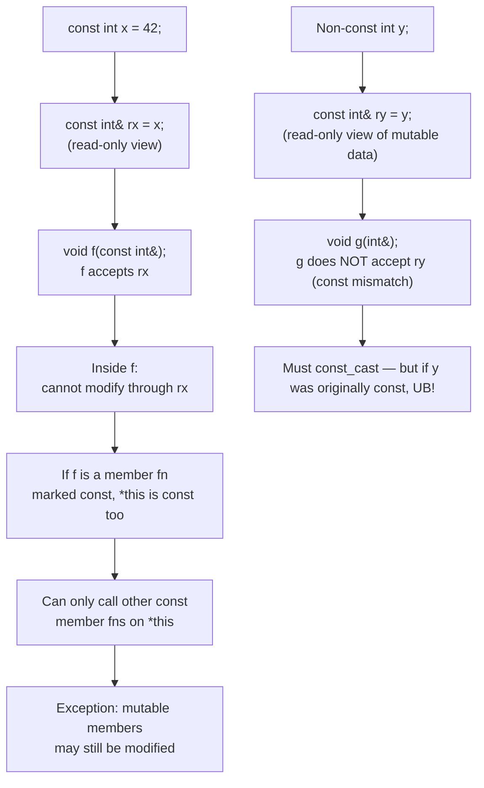
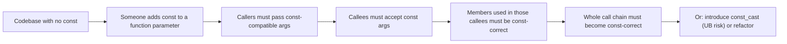
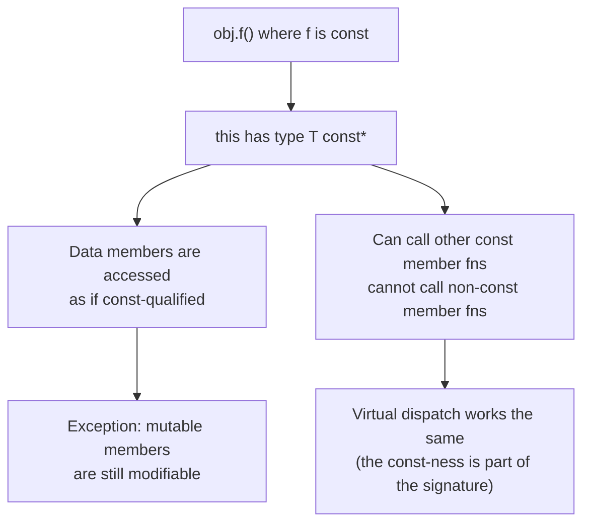

# const Correctness

## Why This Matters

`const` is the most important type-system tool C++ gives you for writing correct, fast, and self-documenting code. A `const` object cannot be modified; a `const` member function promises not to modify `*this`; a `const` reference parameter promises not to modify its argument; a `const` return value signals that the returned value should not be modified. Used consistently, `const` turns a class of bugs (accidental mutation, race conditions, lifetime violations through aliasing) into compile errors.

`const` correctness is *viral*: if you start using `const` in one place, you will need it in related places. A function that takes `const std::string&` cannot pass it to a function taking `std::string&`. A member function that wants to call other member functions on itself must ensure those are `const` too. This viral property is a feature, not a bug — it forces you to be consistent — but it also means that *partial* const correctness is worse than none at all, because it produces baffling compile errors.

This note covers every flavor of `const` in C++: variables, pointers, references, member functions, parameters, return values, `mutable`, and `const_cast`. It also covers the philosophy: when to use `const`, when to relax it, and why.

## Background

`const` entered C++ in Release 1.0 (1985). Stroustrup's *Design and Evolution* describes it as a response to C programmers' need to express "this value should not change" — a need that C met only with macros and ad-hoc convention. C++'s `const` is a *type-system* feature: the compiler enforces it at compile time, and it participates in overload resolution, template deduction, and type aliasing rules.

C's `const` was added later (C89) as a back-port from C++; the two are largely compatible but with subtle differences (e.g., `const`-qualified global variables in C have external linkage by default, while in C++ they have internal linkage unless declared `extern`).

The C++ committee has refined `const` over the years:

- `const` member functions (always existed).
- `const_cast` (always existed, formalized in C++98).
- `mutable` members (C++98).
- `constexpr` (C++11) — a stricter, compile-time-evaluable form of `const`.
- `consteval`, `constinit` (C++20).
- `const`-qualified lambdas (`[]() const { ... }`, C++17 by default for `mutable`-less lambdas? — actually a lambda without `mutable` has a `const` `operator()`).

## Main Content

### 1. `const` Variables

A `const`-qualified variable cannot be modified after initialization:

```cpp
const int max_users = 100;
// max_users = 101;   // ERROR
```

For objects with constructors, `const` means: the constructor runs (initializing the object), and after that no non-`const` member function may be called on it.

```cpp
const std::string greeting = "hello";
greeting += "!";       // ERROR: operator+= is non-const
std::cout << greeting.size();   // OK: size() is const
```

`const` at namespace scope implies **internal linkage** (unless declared `extern`). This means each translation unit gets its own copy. For header-defined constants, prefer `inline constexpr` (C++17) to share one definition:

```cpp
inline constexpr int kMaxUsers = 100;   // shared across TUs, compile-time evaluable
```

### 2. `const` Pointers

There are three positions `const` can appear in a pointer declaration, and they mean different things. See [[6. Pointers and References/8. Constant Pointers and Pointers to Constants|Chapter 6.8]] for the full story; here is a recap:

```cpp
int* p;                  // pointer to int — neither is const
const int* p;            // pointer to const int — pointee is const
int* const p = &x;       // const pointer to int — pointer is const
const int* const p = &x; // const pointer to const int — both are const
```

The trick to reading these is the **"spiral rule"** or simply reading right-to-left:

- `int const* p` is the same as `const int* p` — "p is a pointer to a const int."
- `int* const p` — "p is a const pointer to an int."

Convention varies by codebase; the east-`const` style (`int const*`) reads more uniformly, while the west-`const` style (`const int*`) is more common in C++ tradition. Both compile to the same thing.

### 3. `const` References

A `const` reference (`T const&`) is a reference that does not allow modification of the referent. It is the canonical way to pass read-only arguments to functions:

```cpp
void print(std::string const& s);   // no copy, no modification
```

`const` references also **extend the lifetime of temporaries**:

```cpp
std::string const& s = make_temporary_string();
// the temporary lives as long as s
```

This is a powerful and subtle rule. It does *not* apply when the reference is a member, when it is returned from a function, or when the temporary is bound to a parameter that outlives the call. See [[6. Pointers and References/2. Memory Address vs Pointer vs Reference|Chapter 6.2]] for lifetime extension rules and pitfalls.

### 4. `const` Member Functions

A `const` member function promises not to modify `*this` (the object on which it is called). It is declared by appending `const` after the parameter list:

```cpp
class Account {
public:
    double balance() const { return balance_; }     // const: does not modify
    void deposit(double amount) { balance_ += amount; }  // non-const: modifies
private:
    double balance_ = 0;
};
```

Inside a `const` member function, `this` has type `T const*` (instead of `T*`). All member access through `this` is therefore read-only. You can:

- Read all data members (treating them as `const`).
- Call other `const` member functions.
- Modify `mutable` members (see §6).

You cannot:

- Modify non-`mutable` data members.
- Call non-`const` member functions.

`const` member functions participate in **overloading**: you can have both `T& operator[](size_t)` and `T const& operator[](size_t) const` on the same class. The compiler picks the `const` version when called on a `const` object, the non-`const` version otherwise.

### 5. `const` Parameters

`const` on a parameter signals "I will not modify this argument." It also enables passing rvalues (temporaries) and const lvalues, neither of which can bind to a non-`const` reference.

```cpp
void log(std::string const& msg);   // accepts lvalues, const lvalues, and rvalues
void append(std::string& msg);      // accepts only non-const lvalues

std::string s = "hi";
log(s);                  // OK
log("hi");               // OK (temporary binds to const&)
log(std::string("hi"));  // OK

append(s);               // OK
// append("hi");         // ERROR: cannot bind non-const ref to temporary
// append(std::string("hi"));  // ERROR: same
```

**Guidelines for parameter `const`-ness:**

- **Pass by value**: small, cheap-to-copy types (`int`, `double`, pointers, small structs). The `const` is optional inside the function body — it documents intent but has no effect on the caller.
- **Pass by `const&`**: large or expensive-to-copy types that you only read. The default for `std::string`, `std::vector`, `std::map`, etc.
- **Pass by `&` (non-`const`)**: when you intend to modify the argument in place (out-parameter style). Often a code smell; prefer returning by value.
- **Pass by `&&`**: when you intend to *move from* the argument (sink parameter). See [[8. Modern C++ (Move Semantics, Lambdas, Concurrency)|Modern C++]].
- **Pass by value + `std::move`** (the "sink" idiom): for parameters you will store, accept by value and move into your member.

### 6. `const` Return Values

A `const` return value prevents the caller from modifying the returned object. This was more common in pre-C++11 code; in modern C++, it is rarely the right choice because it inhibits move semantics.

```cpp
class Container {
public:
    std::vector<int> data() const { return data_; }    // returns by value, non-const
    const std::vector<int> data_const() const { return data_; }  // returns by value, const — inhibits move!
};
```

Returning `const T` by value: the caller gets a `const T` rvalue. Move constructors cannot steal from a `const` rvalue (because the source would have to be modified), so the move falls back to a copy. This is a silent performance bug. **Do not return `const T` by value in modern C++.**

Returning `const T&` is fine and idiomatic for accessors that expose an internal member:

```cpp
class Container {
public:
    std::vector<int> const& data() const { return data_; }
private:
    std::vector<int> data_;
};
```

This gives callers read access without copying. Be careful: the returned reference is valid only as long as the `Container` is alive.

### 7. `mutable` — The Escape Hatch

A `mutable` data member can be modified inside a `const` member function. This is the legitimate way to have a "logically const" object whose physical state changes (caching, lazy initialization, mutexes).

```cpp
class ExpensiveQuery {
public:
    Result const& compute() const {
        std::lock_guard<std::mutex> lock(mtx_);
        if (!cache_) cache_ = do_expensive_computation();
        return *cache_;
    }
private:
    Result do_expensive_computation() const;
    mutable std::mutex mtx_;             // mutable: locked in const member
    mutable std::optional<Result> cache_; // mutable: filled in const member
};
```

`compute()` is *logically* const — calling it does not change the observable state of the object — but *physically* it modifies `mtx_` and `cache_`. `mutable` makes this legal.

**Use `mutable` sparingly**. Legitimate uses:

- **Caches** (lazy evaluation).
- **Mutexes** (synchronization in `const` operations).
- **Statistics counters** (e.g., access counters for debugging).

Illegitimate uses:

- Hiding *logical* mutation behind a `const` interface. If the observable behavior changes, the function is not `const`.

### 8. `const_cast`

`const_cast<T>(x)` is the only C++ cast that can strip (or add) `const` and `volatile` qualifiers. It does not change the underlying object — only the type of the reference or pointer through which you access it.

```cpp
const int ci = 42;
const int& cir = ci;
int& ir = const_cast<int&>(cir);   // legal cast
ir = 99;                           // UNDEFINED BEHAVIOR: ci was originally const
```

If the original object was declared `const`, modifying it through a `const_cast`-stripped reference is **undefined behavior**. The compiler may have put `ci` in read-only memory, or assumed `ci` is unchanged throughout its scope and optimized based on that. The cast is legal; the modification is not.

When is `const_cast` legitimate?

1. **Interfacing with legacy C APIs that are not `const`-correct** but do not actually modify the data. You hold a `const T*`, the API wants `T*`, you `const_cast` to satisfy the signature. The API must genuinely not modify the data.
2. **Implementing a non-`const` member in terms of a `const` member** (the "const back-end" pattern):

   ```cpp
   class Container {
   public:
       T const& at(std::size_t i) const {
           // ... bounds check ...
           return data_[i];
       }
       T& at(std::size_t i) {
           return const_cast<T&>(std::as_const(*this).at(i));
       }
   };
   ```

   This avoids duplicating the bounds-check logic. The cast is safe because the non-`const` version is only called on a non-`const` object, so modifying the result is legal.

3. **Working around a library bug** where a function takes `T&` but does not modify it. Document why.

Never use `const_cast` to "just make it compile" when the underlying object is `const`. That is UB.

### 9. Const Correctness Is Viral

Once you start using `const` consistently, you must use it everywhere along the call chain. Examples:

- A member function takes a `const std::string&` and tries to call `legacy_log(std::string&)`. This will not compile unless `legacy_log` is fixed to take `const std::string&` (or you `const_cast`, with all its caveats).
- A `const` member function tries to call another member function that is not `const`. This will not compile.
- You put a `const` object into a `std::vector<T>` (where `T` is your type). The vector's operations will not work unless `T` has `const`-correct member functions.

This viral property is *good*: it forces you to be consistent. But it means that introducing `const` into a codebase that has not been `const`-correct is a big change. Best to start `const`-correct from day one.

### 10. `const` and Overload Resolution

`const` participates in overload resolution. The classic cases:

- Member function overloading on `const`-ness (e.g., `begin()` vs `begin() const`).
- Reference vs `const&` parameters. (You cannot overload on `T&` vs `T const&` for the same parameter *type* — the compiler picks based on the argument's `const`-ness.)

When the argument is an rvalue, the rules change again. The full decision tree is in [[4. Functions and Program Structure/2. Pass-by-Value, Pointer, Reference|Chapter 4.2]].

### 11. `const` and Templates

Templates interact subtly with `const`:

- Template type deduction for `T&` deduces `T` without stripping `const`; for `T&&` (forwarding reference), it deduces `T` as `U&` or `U const&` based on the argument's value category.
- `std::as_const(x)` returns `const T&` to `x` — a clean way to force a `const` reference without writing a cast.
- `const T` in a template parameter list is a distinct type from `T`.

See [[10. Templates|Templates chapter]] for the full story.

### 12. `const` vs `constexpr` vs `consteval` vs `constinit`

| Keyword      | Meaning                                                           |
|--------------|-------------------------------------------------------------------|
| `const`      | Read-only after initialization. May be initialized at runtime.    |
| `constexpr`  | "Const if possible, and known at compile time." Must be evaluable at compile time. |
| `consteval`  | Must be evaluated at compile time; calling at runtime is an error. |
| `constinit`  | Must be initialized at compile time (avoids static-init-order fiasco); not necessarily `const` after that. |

See [[4. Functions and Program Structure/4. Inline, Constexpr, Consteval|Chapter 4.4]] for the full story. The summary: use `constexpr` for compile-time-known constants, `const` for runtime read-only, `consteval` for mandatory compile-time, `constinit` for global static initialization safety.

## Diagrams

### const Correctness Propagation



### The Viral Property



### `const` Member Function Internals



## Code Examples

### A const-Correct Container

```cpp
#include <cstddef>
#include <vector>
#include <stdexcept>

class IntVec {
public:
    IntVec(std::initializer_list<int> init) : data_(init) {}

    std::size_t size() const noexcept { return data_.size(); }
    bool empty() const noexcept { return data_.empty(); }

    int const& operator[](std::size_t i) const { return data_[i]; }       // const overload
    int& operator[](std::size_t i) { return data_[i]; }                   // non-const overload

    int const& at(std::size_t i) const {                                   // const overload
        if (i >= data_.size()) throw std::out_of_range("IntVec::at");
        return data_[i];
    }
    int& at(std::size_t i) {                                               // non-const, implemented via const
        return const_cast<int&>(std::as_const(*this).at(i));
    }

    void push_back(int v) { data_.push_back(v); }

private:
    std::vector<int> data_;
};

void use() {
    IntVec v = {1, 2, 3};
    v[0] = 10;                 // non-const operator[]
    IntVec const& cv = v;
    int x = cv[0];             // const operator[]
    // cv[0] = 5;              // ERROR: assignment to const int&
}
```

### `mutable` for a Cache

```cpp
#include <mutex>
#include <optional>
#include <string>
#include <unordered_map>

class HostLookup {
public:
    std::string const& ip_for(std::string const& host) const {
        std::lock_guard<std::mutex> lock(mtx_);
        auto it = cache_.find(host);
        if (it != cache_.end()) return it->second;
        // expensive DNS lookup (logically const, physically caches result)
        std::string ip = do_dns_lookup(host);
        auto [ins_it, _] = cache_.emplace(host, std::move(ip));
        return ins_it->second;
    }
private:
    std::string do_dns_lookup(std::string const& host) const;
    mutable std::mutex mtx_;
    mutable std::unordered_map<std::string, std::string> cache_;
};
```

### `std::as_const` to Force a const Reference

```cpp
#include <utility>

class Widget {
public:
    void modify() { /* ... */ }
    void inspect() const { /* ... */ }
};

void use(Widget& w) {
    w.modify();                          // OK, non-const
    std::as_const(w).inspect();          // OK, const
    // std::as_const(w).modify();        // ERROR: cannot call non-const on const ref
}
```

### `const` and Overloading on `this` constness

```cpp
class StringView {
public:
    char const* begin() const { return data_; }
    char const* end() const { return data_ + size_; }
    // No non-const begin/end: this view never allows modification.
private:
    char const* data_;
    std::size_t size_;
};

class StringBuilder {
public:
    char* begin() { return buf_.data(); }              // non-const: allows mutation
    char* end() { return buf_.data() + buf_.size(); }
    char const* begin() const { return buf_.data(); }  // const: read-only
    char const* end() const { return buf_.data() + buf_.size(); }
private:
    std::vector<char> buf_;
};
```

## Common Pitfalls

- **Marking a member function `const` when it modifies logical state.** If callers observe different behavior across calls, the function is not `const`, even if it modifies only `mutable` members.
- **Marking a member function non-`const` when it only reads.** This forces callers to use non-`const` references, breaking const-correctness chains. Default to `const`.
- **Returning a non-`const` reference to a private member.** This destroys encapsulation: callers can mutate the supposedly-protected state.
- **Returning `const T` by value.** Inhibits move semantics in C++11+. Return `T` by value (it will be moved or elided), or `const T&` for an internal reference.
- **Using `const_cast` to "just make it compile."** If the underlying object is `const`, this is UB. Only use `const_cast` when you have other proof of the object's mutability.
- **Forgetting `const` on accessor member functions.** Then `const` objects cannot use them, breaking const-correctness for callers.
- **Forgetting `const` on `operator[]`, `operator()`, `operator->`, `begin()`, `end()`.** These usually need both `const` and non-`const` overloads.
- **Assuming `const T&` extends a temporary's lifetime in all contexts.** It does for local references, but not for references that are members, function return values, or that outlive the full expression. See [[6. Pointers and References/2. Memory Address vs Pointer vs Reference|Chapter 6.2]].
- **Modifying a `mutable` member in a way that changes observable behavior.** A cache is fine (same query returns same result); an access counter that callers can read is a logical state change.
- **Confusing `const T*` and `T* const`.** `const T*` is a pointer to const data; `T* const` is a const pointer to mutable data.
- **Using `const` on a function declaration but not the definition (or vice versa).** The two must match.
- **Marking a member function `const` and then having it call a non-`const` member function through some other path.** The compiler will catch this, but it can be a sign that the function is not actually `const`.
- **Forgetting that `const` member functions can still be called on non-`const` objects.** This is fine — but it means the `const` overload is the *only* one callable on a `const` object.

## Tips and Tricks

- **Default to `const`** on local variables, member functions, and parameters. Remove `const` only when you have a specific reason to mutate.
- **Use `std::as_const(x)`** to get a `const T&` view of `x` without writing a cast. This is cleaner and more obvious than `const_cast<T const&>(x)`.
- **Implement non-`const` overloads in terms of `const` overloads** using the "const back-end" pattern. This avoids duplicating logic.
- **Use `mutable` for caches and mutexes**, but be cautious. The pattern is right; the temptation to abuse it is strong.
- **Mark accessor member functions `const` from day one.** Retrofitting `const` later is expensive.
- **Pass by `const&` for read-only parameters of expensive-to-copy types.** Pass by value for cheap types.
- **Return by value (let the compiler elide or move).** Return by `const&` only for accessors exposing internal members, and document the lifetime.
- **Use `constexpr` instead of `const` when you know the value at compile time.** `constexpr` implies `const`, and enables use in template arguments, array sizes, and `static_assert`.
- **Use `constinit` for global statics** to avoid the static initialization order fiasco. See [[4. Functions and Program Structure/4. Inline, Constexpr, Consteval|Chapter 4.4]].
- **Be careful with `const` and concurrency.** `const` does not mean "thread-safe" — a `const` member function can still race with another `const` member function on the same object unless the members are `std::atomic` or protected by a mutex.
- **Use east-`const` (`int const`) or west-`const` (`const int`) consistently within a codebase.** Either is fine; consistency matters.
- **Mark `noexcept` on `const` accessors when possible** — they typically cannot throw.
- **For `const` member functions called on a thread-shared object, document the thread-safety guarantee.** A `const` getter that locks a mutex is one thing; one that reads a `std::vector` without locking is another.

## Active Recall

1. What does `const` mean on a local variable? On a namespace-scope variable? On a member function?
2. What is the difference between `const int* p`, `int* const p`, and `const int* const p`? How do you read each?
3. Why does a `const` reference extend the lifetime of a temporary? Are there contexts where it does not?
4. What is the type of `this` inside a `const` member function? Inside a non-`const` one?
5. Can you overload a member function on `const`-ness alone? Give an example.
6. What does `mutable` allow? Give a legitimate use and an illegitimate use.
7. What is `const_cast`? When is its use safe? When is it UB?
8. Why is returning `const T` by value a bad idea in modern C++?
9. What is the "const back-end" idiom? Show how it eliminates code duplication.
10. Why is `const` correctness said to be viral? Give an example.
11. What does `std::as_const` do, and why prefer it over `const_cast`?
12. What is the relationship between `const` and `constexpr`? When should you use each?
13. Does `const` imply thread-safety? Why or why not?
14. What is the difference between `int const x = 5;` and `int x = 5; const int& rx = x;`?
15. Can a `const` member function call a non-`const` member function on the same object? On a different object?

## Next Steps

- Cross-reference [[6. Pointers and References/8. Constant Pointers and Pointers to Constants|Chapter 6.8]] for `const` pointers in depth.
- Cross-reference [[1. Classes and Objects|Chapter 9.1]] for `const` on data members and accessors.
- Cross-reference [[6. Operator Overloading|Chapter 9.6]] for `const` member operators (`const` overloads of `[]`, `()`, `->`).
- Cross-reference [[4. Functions and Program Structure/4. Inline, Constexpr, Consteval|Chapter 4.4]] for `constexpr`, `consteval`, `constinit`.
- Cross-reference [[8. The Rule of 0, 3, and 5|Chapter 9.8]] for how `const` interacts with copy/move operations.
- Cross-reference [[17. Concurrency|Concurrency chapter]] for the relationship between `const` and thread-safety (a `const` member function is not inherently thread-safe).
