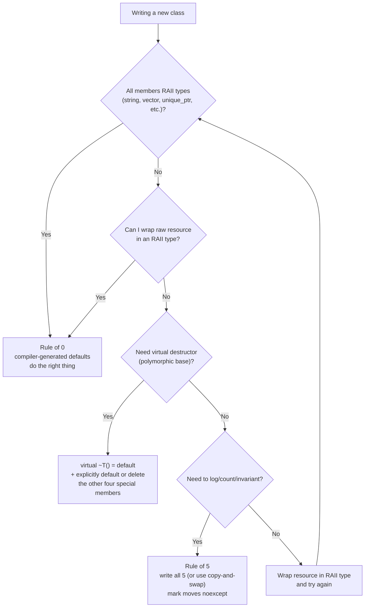
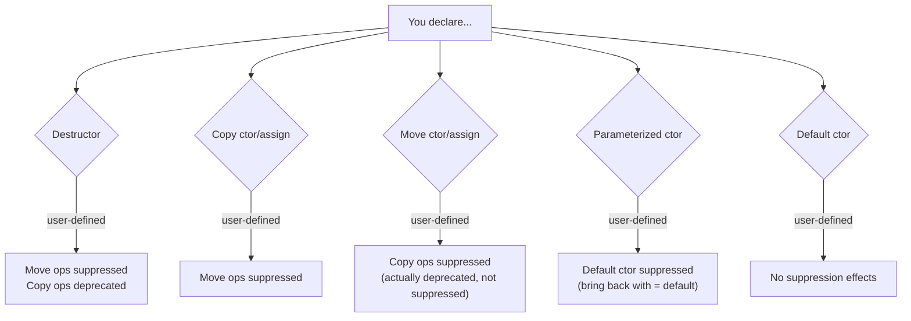
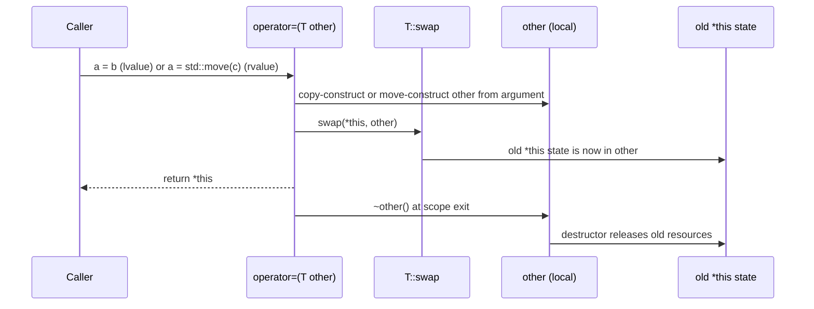

# The Rule of 0, 3, and 5

## Why This Matters

When you write a class in C++, the compiler will *automatically* generate up to six special member functions for you: the default constructor, the copy constructor, the copy assignment operator, the move constructor, the move assignment operator, and the destructor. These auto-generated functions do the *right thing* for the vast majority of classes — they copy/move each member, they destruct each member, they default-construct each member.

But "the right thing" assumes your class's members are well-behaved RAII types. The moment your class holds a raw resource — a `new`-allocated pointer, a `FILE*`, a socket handle, a database connection — the compiler-generated copy constructor performs a *shallow copy*, which leads to double-free bugs, resource leaks, or worse. This is where the **Rule of 3** (pre-C++11), the **Rule of 5** (C++11+), and the **Rule of 0** (modern C++) come in: they tell you when you must write these functions yourself and when you should not.

If you do not internalize these rules, you will either (a) write classes that double-free or leak, (b) write boilerplate special member functions that you do not need, breaking under maintenance, or (c) miss the subtle interactions where declaring one special member function suppresses the auto-generation of another. This note ties everything together: it is the capstone of [[9. Object-Oriented Programming|Chapter 9]] and the foundation for writing types that "just work."

## Background

The **Rule of 3** emerged in the 1990s as C++ programmers noticed that whenever a class needed a non-trivial destructor (typically because it owned a `new`-allocated resource), it also needed a non-trivial copy constructor and copy assignment operator. Otherwise, the compiler-generated shallow copies produced double-free bugs.

The **Rule of 5** arrived with C++11, which added move semantics. Now if your class owns a resource, you typically want to write the move constructor and move assignment operator too, so callers can cheaply move your objects instead of copying them. That brings the total to five functions (the destructor plus four copy/move operations; the default constructor is sometimes counted as a sixth).

The **Rule of 0** is the modern reaction: rather than writing all five by hand, *use RAII types as members* (`std::string`, `std::vector`, `std::unique_ptr`, `std::shared_ptr`, `std::fstream`, etc.). With RAII members, the compiler-generated defaults do the right thing, and you write zero special member functions. This is cleaner, less error-prone, and easier to maintain.

The Rule of 0 is one of the most important style recommendations in modern C++. It is emphasized by Sutter, Alexandrescu, Meyers, and the C++ Core Guidelines (guideline C.20: "If you can avoid defining default operations, do").

## Main Content

### 1. The Special Member Functions

C++ has six **special member functions** that the compiler can generate for you:

| Function              | Signature                              | Auto-generated when...                                       |
|-----------------------|-----------------------------------------|--------------------------------------------------------------|
| Default constructor   | `T()`                                   | No user-declared constructor of any kind.                    |
| Destructor            | `~T()`                                  | Always (unless user-declared).                              |
| Copy constructor      | `T(T const&)`                           | Unless user-declared (deprecated if user-declared move ops). |
| Copy assignment       | `T& operator=(T const&)`                | Unless user-declared (deprecated if user-declared move ops). |
| Move constructor      | `T(T&&) noexcept`                       | Unless user-declared copy/move/dtor ops.                     |
| Move assignment       | `T& operator=(T&&) noexcept`            | Unless user-declared copy/move/dtor ops.                     |

The exact rules for when these are auto-generated, suppressed, or deprecated are subtle (see cppreference "Rule of zero" and "Rule of five"). The practical summary:

- Declaring *any* copy/move/destructor operation **suppresses** the auto-generation of the *other* move operations.
- Declaring *any* copy/move/destructor operation causes copy operations to be **deprecated** if you did not also declare them (i.e., the compiler will warn, and may stop auto-generating them in a future standard).
- Declaring *any* constructor (including a parameterized one) **suppresses** the default constructor.

This means: if you write a destructor because your class owns a resource, the compiler will *stop* generating move operations, and your class will silently fall back to copies in `std::vector` reallocations. You must either write the moves explicitly or default them (`T(T&&) = default;`).

### 2. The Rule of 3 (Pre-C++11)

**Statement**: If a class needs a user-defined destructor, copy constructor, or copy assignment operator, it almost certainly needs all three.

The three are bound together because they all deal with the same underlying concern: *resource ownership*. If your destructor calls `delete[] data_`, your copy constructor must allocate a fresh `data_` (not share it), and your copy assignment must free the old `data_` and allocate a fresh one. Missing any of the three leads to:

- **Missing destructor**: resource leak.
- **Missing copy constructor**: shallow copy → double-free when both objects destruct.
- **Missing copy assignment**: shallow copy → double-free, plus a leak of the previously-owned resource.

```cpp
// Pre-C++11 Rule of 3 class
class IntArray {
public:
    IntArray(std::size_t n) : data_(new int[n]), size_(n) {}
    ~IntArray() { delete[] data_; }                                   // 1: destructor

    IntArray(IntArray const& other)                                   // 2: copy ctor
        : data_(new int[other.size_]), size_(other.size_) {
        std::copy(other.data_, other.data_ + size_, data_);
    }

    IntArray& operator=(IntArray const& other) {                      // 3: copy assign
        if (this != &other) {
            int* new_data = new int[other.size_];                     // allocate first (exception-safe)
            std::copy(other.data_, other.data_ + other.size_, new_data);
            delete[] data_;                                           // free old
            data_ = new_data;
            size_ = other.size_;
        }
        return *this;
    }

private:
    int* data_;
    std::size_t size_;
};
```

### 3. The Rule of 5 (C++11+)

**Statement**: If a class needs a user-defined destructor, copy constructor, copy assignment operator, move constructor, or move assignment operator, it almost certainly needs all five (plus possibly a default constructor).

The Rule of 5 extends the Rule of 3 with the move operations. Adding move operations lets callers cheaply move your objects (in `std::vector` reallocations, in `return` statements, etc.) instead of copying them.

```cpp
class IntArray {
public:
    IntArray(std::size_t n) : data_(new int[n]), size_(n) {}
    ~IntArray() { delete[] data_; }                                   // 1: destructor

    IntArray(IntArray const& other)                                   // 2: copy ctor
        : data_(new int[other.size_]), size_(other.size_) {
        std::copy(other.data_, other.data_ + size_, data_);
    }

    IntArray(IntArray&& other) noexcept                               // 4: move ctor
        : data_(other.data_), size_(other.size_) {
        other.data_ = nullptr;
        other.size_ = 0;
    }

    IntArray& operator=(IntArray const& other) {                      // 3: copy assign
        IntArray tmp(other);          // copy-and-swap
        swap(tmp);
        return *this;
    }

    IntArray& operator=(IntArray&& other) noexcept {                  // 5: move assign
        IntArray tmp(std::move(other));
        swap(tmp);
        return *this;
    }

    void swap(IntArray& other) noexcept {
        std::swap(data_, other.data_);
        std::swap(size_, other.size_);
    }

private:
    int* data_;
    std::size_t size_;
};
```

The **copy-and-swap idiom** unifies copy assignment and move assignment: a single `operator=` taking the parameter by value handles both cases (the parameter is copy-constructed from an lvalue or move-constructed from an rvalue), then swaps with `*this`. The old resource is freed when `tmp` destructs at function exit:

```cpp
IntArray& operator=(IntArray other) noexcept {   // by value: copy or move
    swap(other);
    return *this;
}
```

This is the most concise and exception-safe way to write the Rule of 5. It requires a `noexcept` `swap` member (or `friend` free function).

### 4. The Rule of 0 (Modern C++)

**Statement**: Design your classes so that the compiler-generated defaults do the right thing. Use RAII member types (`std::string`, `std::vector`, `std::unique_ptr`, `std::shared_ptr`, `std::fstream`, etc.) instead of raw resources.

```cpp
class Document {
public:
    Document(std::string title, std::string body, std::string author)
        : title_(std::move(title)), body_(std::move(body)), author_(std::move(author)) {}

    // No destructor, no copy/move ops — the compiler-generated ones do the right thing.
    // std::string and std::vector handle their own memory correctly.

    std::string const& title() const { return title_; }
    std::string const& body() const { return body_; }
    std::string const& author() const { return author_; }

private:
    std::string title_;
    std::string body_;
    std::string author_;
};
```

The Rule of 0 says: this class needs *zero* user-written special member functions. The compiler generates:

- Destructor: destructs each member in reverse declaration order. Each `std::string` releases its memory.
- Copy constructor: copy-constructs each member. Deep copy, automatically.
- Copy assignment: copy-assigns each member. Old resources are released, new ones acquired.
- Move constructor: move-constructs each member. Cheap pointer steals.
- Move assignment: move-assigns each member. Cheap pointer steals.

All five are correct, exception-safe, and zero-cost in terms of maintenance.

### 5. When the Rule of 0 Does Not Apply

The Rule of 0 works when your class's resource ownership is *exclusively* through RAII member types. It does *not* work when:

1. **You hold a raw resource directly** (raw `new`/`delete`, `FILE*`, socket fd, OpenGL texture ID, etc.). Wrap it in an RAII type (e.g., `std::unique_ptr<T[], Deleter>` or a custom RAII wrapper) and the Rule of 0 applies again.

2. **You need to log or count object creation/destruction.** Then you need a custom destructor (and probably custom copy/move too, if the counter is per-instance). The Rule of 5 applies.

3. **You need to maintain an invariant that involves multiple members.** E.g., a `Range` whose `end >= begin` — copy and move are fine, but you need to validate in *every* constructor and in any state-mutating member.

4. **You are a polymorphic base class.** You need a `virtual ~Base() = default;`. Then the compiler will stop auto-generating move operations (because you declared a destructor), so you should also `= default` the move operations to get them back:

   ```cpp
   class Shape {
   public:
       virtual ~Shape() = default;             // needed for polymorphic deletion
       Shape() = default;
       Shape(Shape const&) = default;
       Shape& operator=(Shape const&) = default;
       Shape(Shape&&) = default;
       Shape& operator=(Shape&&) = default;
       virtual double area() const = 0;
   };
   ```

   Or delete copy and rely on `std::unique_ptr<Shape>` for polymorphic containers:

   ```cpp
   class Shape {
   public:
       virtual ~Shape() = default;
       Shape() = default;
       Shape(Shape const&) = delete;                 // slicing is bad
       Shape& operator=(Shape const&) = delete;
       Shape(Shape&&) = delete;                       // also slices
       Shape& operator=(Shape&&) = delete;
       virtual double area() const = 0;
   };
   ```

### 6. `= default` and `= delete`

C++11 introduced `= default` and `= delete` to make special member function intent explicit:

- `T() = default;` — ask the compiler to generate the default constructor as if you had not declared it. Useful for bringing it back after declaring another constructor.
- `T(T const&) = default;` — explicitly request the auto-generated copy constructor.
- `T(T&&) = delete;` — forbid move construction. Useful for types that should not be moved (e.g., `std::mutex`, `std::atomic`).
- `T(T const&) = delete;` — forbid copy construction. Useful for types that own non-copyable resources (e.g., `std::unique_ptr`, `std::thread`).

Use `= default` and `= delete` liberally. They document intent, catch bugs early, and work with the Rule of 5 when you cannot follow the Rule of 0.

### 7. Copy-and-Swap in Detail

The copy-and-swap idiom implements `operator=` as a by-value function that swaps with `*this`:

```cpp
T& T::operator=(T other) noexcept {   // pass by value: copy or move
    swap(other);
    return *this;
}
```

Properties:

- **Unified copy and move assignment.** The parameter is copy-constructed if the argument is an lvalue, move-constructed if an rvalue. One function, both behaviors.
- **Exception-safe.** If the copy throws (allocation failure), `*this` is unchanged — the throw happens *before* `swap`. This is the strong exception guarantee.
- **Handles self-assignment.** `other` is a separate object; swapping with it leaves `*this` correct.
- **Releases old resources.** When `other` (which now holds the old `*this` state) destructs at function exit, its destructor frees the old resources.

Requirements:

- A `noexcept` `swap` member or `friend` function that swaps each member.
- A working copy constructor and move constructor (for the parameter construction).

This is the *cleanest* way to write the Rule of 5. Most modern style guides recommend it.

### 8. Move Operations Must Be `noexcept`

If your move constructor or move assignment operator can throw, `std::vector` (and other standard containers) will *not* use them during reallocation. They will fall back to copies, because they need the strong exception guarantee: if a move throws halfway through, the vector would have lost the moved-from elements.

```cpp
std::vector<IntArray> v;
v.push_back(IntArray(100));       // moves (if move ctor is noexcept)
v.emplace_back(100);              // moves
// If IntArray's move ctor is NOT noexcept, vector copies instead — much slower.
```

Always mark move operations `noexcept`. If a move genuinely can throw (rare), document it loudly.

### 9. The C++ Core Guidelines View

The C++ Core Guidelines (Stroustrup and Sutter) summarize it as:

- **C.20**: Whenever you can avoid defining default operations, do.
- **C.21**: If you define or `= delete` any default operation, define or `= delete` them all.
- **C.22**: Make default operations consistent.

In practice, this means: prefer the Rule of 0. If you must define one (e.g., a `virtual` destructor), explicitly default or delete the others so the reader does not have to remember the suppression rules.

### 10. A Decision Flow

When writing a new class, ask:

1. Can all my members be RAII types? Yes → Rule of 0. Done.
2. If not, can I wrap the raw resource in an RAII type? Yes → Rule of 0. Done.
3. If I really must hold the raw resource directly, do I need to count instances, log construction, or maintain an invariant? Write the destructor (Rule of 5 starts). Add the four copy/move operations, ideally with copy-and-swap. Mark moves `noexcept`.
4. Am I a polymorphic base? Add `virtual ~T() = default;` and explicitly default or delete the other four.

## Diagrams

### Rule of 0/3/5 Decision Flow



### Compiler Generation Matrix



### Copy-and-Swap Flow



## Code Examples

### Rule of 0 — The Happy Path

```cpp
#include <memory>
#include <string>
#include <vector>

class Person {
public:
    Person(std::string name, int age, std::vector<std::string> hobbies)
        : name_(std::move(name)), age_(age), hobbies_(std::move(hobbies)) {}

    std::string const& name() const { return name_; }
    int age() const { return age_; }
    std::vector<std::string> const& hobbies() const { return hobbies_; }

private:
    std::string name_;
    int age_;
    std::vector<std::string> hobbies_;
};
// Zero special member functions written. All five compiler-generated ones do the right thing.
```

### Rule of 5 — Custom RAII Wrapper

```cpp
#include <algorithm>
#include <cstddef>
#include <utility>

class ByteBuffer {
public:
    explicit ByteBuffer(std::size_t n) : data_(new char[n]), size_(n) {}

    ~ByteBuffer() { delete[] data_; }

    ByteBuffer(ByteBuffer const& o)
        : data_(o.size_ ? new char[o.size_] : nullptr), size_(o.size_) {
        std::copy(o.data_, o.data_ + size_, data_);
    }

    ByteBuffer(ByteBuffer&& o) noexcept : data_(o.data_), size_(o.size_) {
        o.data_ = nullptr; o.size_ = 0;
    }

    ByteBuffer& operator=(ByteBuffer o) noexcept {   // by value: copy-and-swap
        swap(o);
        return *this;
    }

    void swap(ByteBuffer& o) noexcept {
        std::swap(data_, o.data_);
        std::swap(size_, o.size_);
    }

    char* data() { return data_; }
    char const* data() const { return data_; }
    std::size_t size() const { return size_; }

private:
    char* data_;
    std::size_t size_;
};

// Hidden friend swap for ADL.
inline void swap(ByteBuffer& a, ByteBuffer& b) noexcept { a.swap(b); }
```

### Rule of 0 — Wrapping a Raw Resource

```cpp
#include <memory>
#include <cstdio>
#include <stdexcept>

class FileHandle {
public:
    explicit FileHandle(char const* path, char const* mode = "r")
        : fp_(std::fopen(path, mode), &std::fclose) {
        if (!fp_) throw std::runtime_error("cannot open file");
    }
    // Rule of 0: unique_ptr handles the fclose in its deleter.
    // Copy is forbidden by unique_ptr (which is what we want for file handles).
    // Move is provided by unique_ptr.

    std::FILE* get() const { return fp_.get(); }

private:
    std::unique_ptr<std::FILE, decltype(&std::fclose)> fp_;
};
```

### Polymorphic Base — Default or Delete Explicitly

```cpp
class Shape {
public:
    virtual ~Shape() = default;             // virtual for polymorphic deletion

    Shape() = default;
    Shape(Shape const&) = delete;           // no copy — slicing would break invariants
    Shape& operator=(Shape const&) = delete;
    Shape(Shape&&) = delete;                // no move — slicing again
    Shape& operator=(Shape&&) = delete;

    virtual double area() const = 0;
};
// Users hold Shape via std::unique_ptr<Shape> or std::shared_ptr<Shape>.
```

### When the Compiler Generation Changes Bite You

```cpp
class Logger {
public:
    Logger() = default;
    ~Logger() { /* flush on destruction */ }   // user-defined destructor!
    // No move ops written. They are now SUPPRESSED.
    // std::vector<Logger> will copy Logger objects on reallocation, not move them.
};

// Fix: explicitly default the move ops.
class Logger2 {
public:
    Logger2() = default;
    ~Logger2() { /* flush */ }
    Logger2(Logger2 const&) = default;
    Logger2& operator=(Logger2 const&) = default;
    Logger2(Logger2&&) noexcept = default;
    Logger2& operator=(Logger2&&) noexcept = default;
};
```

## Common Pitfalls

- **Writing a destructor and forgetting the moves.** The compiler suppresses move operations when you declare a destructor. Your class will silently fall back to copies, possibly slow. Always explicitly default or delete the moves when you write a destructor.
- **Writing a destructor and forgetting the copy ops.** The compiler's copy constructor and copy assignment will do a *shallow* copy, which is wrong for raw-resource owners. Either write them (Rule of 5) or delete them (and force callers to use move/smart pointers).
- **Forgetting `noexcept` on move operations.** Containers fall back to copy. Mark moves `noexcept`.
- **Returning `const T` by value.** Inhibits move. See [[7. const Correctness|Chapter 9.7]].
- **Forgetting to handle self-assignment in `operator=`.** Without copy-and-swap, you need `if (this != &other)`. With copy-and-swap, you do not.
- **Not providing a `swap`.** Copy-and-swap requires it. Make it a member or a hidden friend, mark it `noexcept`.
- **Throwing from a destructor.** Calls `std::terminate` if it escapes during stack unwinding. Destructors must be `noexcept` (which is the default in C++11+).
- **Throwing from a move operation.** Containers will not use it. If move can throw, copy instead, or restructure so it cannot.
- **Believing the compiler-generated copy constructor does a deep copy.** It does not. It does a member-by-member copy, which is shallow for pointer members. Use RAII members to get deep copy automatically.
- **Forgetting that declaring a parameterized constructor suppresses the default constructor.** If you need both, write `T() = default;` explicitly.
- **Forgetting that the move constructor does not exist if you wrote a copy constructor.** Same suppression. Explicitly default or delete.
- **Using `= delete` for copy but not declaring move.** Then the class is neither copyable nor movable. If you wanted move-only, you must explicitly default the moves.
- **Forgetting to make `swap` `noexcept`.** Copy-and-swap then cannot be `noexcept` either, and containers will not move from your type.
- **Inheriting from a class with user-defined copy/move and not redefining them.** The derived class gets the base's copy/move behavior, which may not handle the derived's new members correctly. Usually you want the Rule of 0 in the derived class, but the base's special members may interfere.
- **Defining only `operator=(const T&)` and not `operator=(T&&)`.** The compiler will not auto-generate the move assignment, and the copy assignment will be used as a fallback (with a temporary). This is often a silent performance bug.

## Tips and Tricks

- **Default to the Rule of 0.** Use RAII members (`std::string`, `std::vector`, `std::unique_ptr`, `std::shared_ptr`, `std::fstream`, `std::lock_guard`, etc.). The compiler-generated special member functions will be correct, exception-safe, and zero-maintenance.
- **If you must write a destructor, explicitly default or delete the other four.** This makes your intent clear and prevents the suppression rules from silently biting you.
- **Use `= default` and `= delete` liberally.** They document intent and let the compiler enforce it.
- **Use copy-and-swap for `operator=`.** One function handles copy and move assignment, is exception-safe, and handles self-assignment correctly.
- **Provide a `noexcept` `swap`.** Hidden friend or member; either works.
- **Always mark move operations `noexcept`.** Otherwise containers will copy.
- **Delete copy operations on polymorphic base classes.** Prevents slicing at compile time.
- **Delete copy operations on types that own non-copyable resources** (`std::mutex`, `std::atomic`, `std::thread`, file handles, sockets). Either provide a custom deep copy or forbid copying.
- **For polymorphic classes, consider the `clone()` pattern** instead of copy:

  ```cpp
  class Shape {
  public:
      virtual std::unique_ptr<Shape> clone() const = 0;
      // ...
  };
  class Circle : public Shape {
  public:
      std::unique_ptr<Shape> clone() const override { return std::make_unique<Circle>(*this); }
  };
  ```

- **Test that your class behaves correctly under the standard containers.** `std::vector<T>` with `push_back`, `emplace_back`, and resize will exercise copy/move. If `std::vector<T>` is slow or fails to compile, your Rule of 5 is incomplete.
- **Use AddressSanitizer to catch double-free and use-after-free.** A buggy copy/move destructor pair will be caught immediately.
- **When in doubt, prefer `std::vector<T>` over `T*` + size.** The vector handles copy/move/destruction correctly, leaving you with the Rule of 0.
- **Read the C++ Core Guidelines (C.20-C.22)** for the authoritative modern guidance.

## Active Recall

1. State the Rule of 3, the Rule of 5, and the Rule of 0 in one sentence each.
2. What are the six special member functions the compiler can generate? When is each generated or suppressed?
3. Why does declaring a destructor suppress the auto-generation of move operations?
4. What is copy-and-swap? Show its one-line implementation and explain why it is exception-safe.
5. Why must move operations be `noexcept`? What happens in `std::vector` if they are not?
6. What does `= default` do? What does `= delete` do? Give an example use of each.
7. When does the Rule of 0 *not* apply? Give three situations.
8. What is the C++ Core Guidelines C.21 ("If you define or `= delete` any default operation, define or `= delete` them all") trying to prevent?
9. Show how to make a class move-only, copy-only, and neither.
10. How does the Rule of 0 interact with polymorphic base classes? What special members do you typically write or delete?
11. What is the `clone()` pattern, and when is it preferable to copy?
12. What happens if you write a destructor but no copy ops for a class with a raw pointer member?
13. Why is `swap` essential to copy-and-swap? What signature should it have?
14. What is the self-assignment problem? How does copy-and-swap handle it without an explicit check?
15. Give an example of wrapping a raw resource (like `FILE*`) in an RAII type so the Rule of 0 applies.

## Next Steps

- Cross-reference [[1. Classes and Objects|Chapter 9.1]] for class syntax and member declaration.
- Cross-reference [[2. Constructors and Destructors|Chapter 9.2]] for constructor and destructor mechanics, the member-initializer list, and virtual destructors.
- Cross-reference [[7. Memory Management/4. RAII|RAII]] for the resource-management philosophy that underlies the Rule of 0.
- Cross-reference [[7. Memory Management/5. Smart Pointers|Smart Pointers]] for the RAII types you should be using as members.
- Cross-reference [[8. Modern C++ (Move Semantics, Lambdas, Concurrency)|Modern C++]] for move semantics in depth.
- Cross-reference [[7. const Correctness|Chapter 9.7]] for `const`-correct copy/move signatures (`T const&` for copy, `T&&` for move).
- Cross-reference [[4. Functions and Program Structure/2. Pass-by-Value, Pointer, Reference|Chapter 4.2]] for the by-value sink parameter idiom that motivates copy-and-swap.
