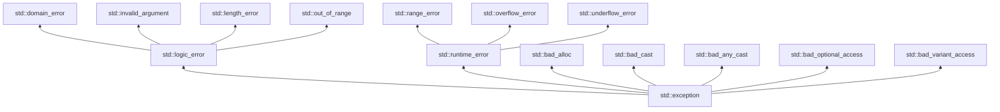

# C++ Specific Features Reference Card

## Why

C++ is not just "C with classes". Since C++11 the language has grown into a multi-paradigm powerhouse: object-oriented, generic, functional, and increasingly declarative — all while preserving the zero-overhead principle. This card catalogues the features that distinguish C++ from C and serves as a one-stop quick reference for modern C++ (C++11 through C++23).

Pair this with [[1. C Reference Card]] for the C substrate, and you have a complete map of the language.

## Background

| Standard | Year | Theme |
|----------|------|-------|
| C++98 | 1998 | First ISO standard. Templates, STL, exceptions. |
| C++03 | 2003 | Bug-fix release. |
| C++11 | 2011 | "Modern C++" begins: `auto`, lambdas, rvalue refs, smart pointers, concurrency. |
| C++14 | 2014 | Refinements: generic lambdas, `std::make_unique`, binary literals. |
| C++17 | 2017 | `string_view`, `optional`, `variant`, `any`, parallel algorithms, structured bindings, filesystem. |
| C++20 | 2020 | Concepts, ranges, modules, coroutines, `<=>`, `std::format`. |
| C++23 | 2023 | `std::expected`, `std::print`, `std::mdspan`, `std::flat_map`, deducing `this`. |
| C++26 | (draft) | Reflection, contracts, hazard pointers, more constexpr. |

Compile with `-std=c++20` (or `-std=c++23` on recent compilers) to enable these features.

## Namespaces

```cpp
namespace mylib {
    namespace detail {
        void helper() {}
    }
    void api() { detail::helper(); }
}

namespace ml = mylib;            // alias
ml::api();

using namespace mylib;           // import all names (avoid in headers!)
using mylib::api;                // import one name
```

> [!warning] `using namespace` in headers
> Pollutes every translation unit that includes the header. Use fully qualified names or `using` declarations inside your own .cpp files only.

## RAII

**Resource Acquisition Is Initialization** — the central C++ idiom. Every resource (memory, file, lock, socket, GPU buffer) is owned by an object whose constructor acquires and destructor releases. Exceptions and early returns cannot leak.

```cpp
{
    std::ifstream f("data.txt");   // opens file
    std::lock_guard<std::mutex> lk(mtx);  // acquires lock
    /* use f and mtx */
}   // lock released, file closed — even if exception thrown
```

> [!note] See [[7. Memory Management/4. RAII]] for the full treatment.

## Classes

```cpp
class Vec3 {
public:
    Vec3() : x_(0), y_(0), z_(0) {}                    // default ctor
    Vec3(double x, double y, double z)                 // parameterized ctor
        : x_(x), y_(y), z_(z) {}
    Vec3(const Vec3& other) = default;                 // copy ctor
    Vec3(Vec3&& other) noexcept = default;             // move ctor
    Vec3& operator=(const Vec3&) = default;            // copy assign
    Vec3& operator=(Vec3&&) noexcept = default;        // move assign
    ~Vec3() = default;                                 // dtor

    double x() const noexcept { return x_; }
    void   x(double v) noexcept { x_ = v; }

    Vec3 operator+(const Vec3& o) const noexcept {
        return Vec3(x_ + o.x_, y_ + o.y_, z_ + o.z_);
    }

    bool operator==(const Vec3& o) const = default;    // C++20: auto-generate

private:
    double x_, y_, z_;
};
```

### Special member functions (Rule of 5 / Rule of 0)

| When you write… | The compiler still generates… |
|-----------------|------------------------------|
| Nothing (Rule of 0) | All five (with caveats). |
| Any destructor or copy operation | Move operations are *not* generated. |
| Any move operation | Copy operations are *not* generated. |

> [!tip] Rule of 0
> If your class can be implemented entirely in terms of members that manage their own resources (`std::vector`, `std::string`, `std::unique_ptr`), don't write any of the five — let the compiler generate them all. See [[9. Object-Oriented Programming/8. The Rule of 0, 3, and 5]].

### Inheritance and polymorphism

```cpp
class Animal {
public:
    virtual ~Animal() = default;
    virtual std::string sound() const = 0;       // pure virtual
};

class Dog : public Animal {
public:
    std::string sound() const override { return "Woof"; }
};

std::unique_ptr<Animal> a = std::make_unique<Dog>();
std::cout << a->sound();   // Woof — dispatched via vtable
```

### `override` and `final`

```cpp
struct Base { virtual void f(); virtual void g() final; };
struct Derived : Base {
    void f() override;       // compiler checks: yes, overrides Base::f
    void g() override;       // ERROR: Base::g is final
    void h() override;       // ERROR: no Base::h to override
};
```

## Templates

### Function templates

```cpp
template <typename T>
T max_of(T a, T b) { return a > b ? a : b; }

auto m = max_of(3, 5);            // T = int
auto d = max_of(1.5, 2.5);        // T = double
```

### Class templates

```cpp
template <typename T, std::size_t N>
class Array {
    T data_[N];
public:
    T& operator[](std::size_t i) { return data_[i]; }
    constexpr std::size_t size() const { return N; }
};

Array<int, 10> a;
```

### Variadic templates (C++11)

```cpp
template <typename... Args>
void print(Args&&... args) {
    (std::cout << ... << args) << '\n';     // C++17 fold expression
}

print(1, "two", 3.0, '4');   // 1two3.04
```

### Template specializations

```cpp
template <typename T> const char* name() { return "?"; }
template <> const char* name<int>()    { return "int"; }
template <> const char* name<double>() { return "double"; }
```

### Concepts (C++20)

```cpp
template <typename T>
concept Numeric = std::integral<T> || std::floating_point<T>;

template <Numeric T>
T sum(T a, T b) { return a + b; }

// Abbreviated form:
auto sum2(Numeric auto a, Numeric auto b) { return a + b; }
```

See [[10. Templates and Metaprogramming/5. Concepts (C++20)]].

## Exception handling

```cpp
#include <stdexcept>

double divide(double a, double b) {
    if (b == 0) throw std::invalid_argument("division by zero");
    return a / b;
}

try {
    double r = divide(10, 0);
} catch (const std::invalid_argument& e) {
    std::cerr << "Bad arg: " << e.what() << '\n';
} catch (const std::exception& e) {
    std::cerr << "Error: " << e.what() << '\n';
} catch (...) {
    std::cerr << "Unknown error\n";
}
```

### Standard exception hierarchy



### Exception safety guarantees

| Guarantee | Meaning |
|-----------|---------|
| **No-throw** (`noexcept`) | Never throws. |
| **Strong** | If it fails, state is unchanged. |
| **Basic** | If it fails, state is valid (no leaks, no corruption) but may have changed. |
| **No guarantee** | Anything goes. |

See [[13. Error Handling and Exceptions/3. Exception Safety Guarantees]].

## Smart pointers

```cpp
#include <memory>

// Exclusive ownership — deleted when the unique_ptr goes out of scope.
std::unique_ptr<Widget> u = std::make_unique<Widget>(args...);

// Shared ownership — refcounted; deleted when last shared_ptr dies.
std::shared_ptr<Widget> s = std::make_shared<Widget>(args...);

// Non-owning observer — does NOT extend lifetime; safe only if a shared_ptr outlives it.
std::weak_ptr<Widget> w = s;
if (auto p = w.lock()) { /* use p */ }

// Custom deleter
std::unique_ptr<FILE, decltype(&fclose)> fp(fopen("x", "r"), &fclose);
```

| Smart pointer | Ownership | Copyable? | Use when |
|---------------|-----------|-----------|----------|
| `unique_ptr` | exclusive | no (move only) | Default choice for heap ownership. |
| `shared_ptr` | shared | yes | Multiple owners, lifetimes unclear. |
| `weak_ptr` | none | yes | Break cycles, observe without extending. |

See [[7. Memory Management/5. Smart Pointers]].

## Lambdas

```cpp
std::vector<int> v = {5, 3, 1, 4, 2};
std::sort(v.begin(), v.end());                       // ascending
std::sort(v.begin(), v.end(), [](int a, int b) {     // descending
    return a > b;
});

// Capture by value, reference, this, or with initializers (C++14)
int factor = 3;
auto scaled = [factor](int x) { return x * factor; };

// Generic lambda (C++14)
auto plus = [](auto a, auto b) { return a + b; };

// Mutable lambda — modifies captured-by-value state
int counter = 0;
auto next = [counter]() mutable { return ++counter; };
```

### Capture forms

| Capture | Meaning |
|---------|---------|
| `[]` | No captures. |
| `[=]` | All used locals by value. |
| `[&]` | All used locals by reference. |
| `[x]` | `x` by value. |
| `[&x]` | `x` by reference. |
| `[this]` | `this` pointer. |
| `[=, &x]` | Default by value, `x` by reference. |
| `[name = expr]` (C++14) | Initialize a new capture. |

See [[8. Modern C++/6. Lambdas Deep Dive]].

## Move semantics and rvalue references

```cpp
std::string make_big() { return std::string(1000000, 'x'); }
std::string s = make_big();   // move construction — no deep copy

std::vector<std::string> v;
v.push_back(std::move(s));    // move s into v; s is now empty
```

### The Rule of 5 in move-land

```cpp
class Buffer {
public:
    Buffer(std::size_t n) : data_(new char[n]), size_(n) {}
    ~Buffer() { delete[] data_; }
    Buffer(const Buffer& o) : data_(new char[o.size_]), size_(o.size_) {
        std::memcpy(data_, o.data_, size_);
    }
    Buffer(Buffer&& o) noexcept
        : data_(o.data_), size_(o.size_) { o.data_ = nullptr; o.size_ = 0; }
    Buffer& operator=(const Buffer& o) {
        Buffer tmp(o); swap(tmp); return *this;
    }
    Buffer& operator=(Buffer&& o) noexcept {
        Buffer tmp(std::move(o)); swap(tmp); return *this;
    }
    void swap(Buffer& o) noexcept {
        std::swap(data_, o.data_); std::swap(size_, o.size_);
    }
private:
    char *data_;
    std::size_t size_;
};
```

### Perfect forwarding

```cpp
template <typename T>
void relay(T&& arg) {                        // universal reference
    target(std::forward<T>(arg));            // preserve value category
}
```

See [[8. Modern C++/4. Move Semantics]] and [[8. Modern C++/5. Perfect Forwarding]].

## `auto` and type deduction

```cpp
auto i = 42;                  // int
auto d = 3.14;                // double
auto& ref = i;                // int&
const auto& cref = d;         // const double&
auto&& u = i;                 // int& (universal reference, lvalue init)
auto ptr = &i;                // int*

decltype(auto) x = i;         // int (preserves references)
decltype((i)) y = i;          // int& (parens matter!)
```

## Structured bindings (C++17)

```cpp
std::pair p = {1, "hello"};
auto [id, name] = p;

std::map<std::string, int> m = {{"a", 1}, {"b", 2}};
for (const auto& [k, v] : m) std::cout << k << '=' << v << '\n';

struct Point { double x, y; };
Point pt{1, 2};
auto& [px, py] = pt;
```

## `constexpr` / `consteval` / `constinit`

| Keyword | Meaning |
|---------|---------|
| `const` | Runtime const. |
| `constexpr` | Evaluable at compile time (and may be). |
| `consteval` (C++20) | Must evaluate at compile time. |
| `constinit` (C++20) | Must initialize at compile time, but value can change later. |

```cpp
constexpr int factorial(int n) {
    return n <= 1 ? 1 : n * factorial(n - 1);
}
constexpr int f5 = factorial(5);     // 120, computed at compile time
int runtime_n = 7;
int f7 = factorial(runtime_n);       // OK, computed at runtime

consteval int square(int n) { return n * n; }
int s = square(5);                   // OK
// int s2 = square(runtime_n);       // ERROR: must be compile-time

constinit int global = factorial(3); // OK
global = 99;                         // OK — value can change
```

See [[8. Modern C++/8. constexpr and Compile-time Computation]] and [[4. Functions and Program Structure/4. Inline, Constexpr, Consteval]].

## STL containers

### Sequence containers

| Container | Header | Notes |
|-----------|--------|-------|
| `std::array<T,N>` | `<array>` | Fixed-size, stack. |
| `std::vector<T>` | `<vector>` | Dynamic array, default choice. |
| `std::deque<T>` | `<deque>` | Double-ended queue. |
| `std::list<T>` | `<list>` | Doubly linked list. |
| `std::forward_list<T>` | `<forward_list>` | Singly linked list. |

### Associative containers

| Container | Header | Notes |
|-----------|--------|-------|
| `std::map<K,V>` | `<map>` | Ordered, unique keys. |
| `std::multimap<K,V>` | `<map>` | Ordered, duplicate keys. |
| `std::set<K>` | `<set>` | Ordered, unique keys. |
| `std::multiset<K>` | `<set>` | Ordered, duplicate keys. |

### Unordered containers (hash-based, C++11)

| Container | Header | Notes |
|-----------|--------|-------|
| `std::unordered_map<K,V>` | `<unordered_map>` | Average O(1) lookup. |
| `std::unordered_multimap` | `<unordered_map>` | |
| `std::unordered_set<K>` | `<unordered_set>` | |
| `std::unordered_multiset` | `<unordered_set>` | |

### Container adaptors

`std::stack`, `std::queue`, `std::priority_queue` — wrap an underlying container.

### New in C++23

`std::flat_map`, `std::flat_set` — sorted but stored in contiguous memory.

## STL algorithms

```cpp
#include <algorithm>
#include <numeric>

std::vector<int> v = {3, 1, 4, 1, 5, 9, 2, 6};

std::sort(v.begin(), v.end());
auto it = std::find(v.begin(), v.end(), 4);
int sum = std::accumulate(v.begin(), v.end(), 0);
int cnt = std::count(v.begin(), v.end(), 1);
auto [mn, mx] = std::minmax_element(v.begin(), v.end());
bool has5 = std::binary_search(v.begin(), v.end(), 5);
std::transform(v.begin(), v.end(), v.begin(),
               [](int x){ return x * 2; });
v.erase(std::remove(v.begin(), v.end(), 1), v.end());  // erase-remove idiom
```

### Parallel algorithms (C++17)

```cpp
std::sort(std::execution::par, v.begin(), v.end());   // parallel
std::for_each(std::execution::par_unseq, v.begin(), v.end(), f);
```

Execution policies: `seq`, `par`, `par_unseq`, `unseq` (C++20).

## Ranges (C++20)

```cpp
#include <ranges>
#include <algorithm>

namespace rv = std::ranges::views;

auto evens = std::views::filter(v, [](int x){ return x % 2 == 0; });
auto squares = std::views::transform(v, [](int x){ return x * x; });
auto pipeline = v
              | std::views::filter([](int x){ return x % 2 == 0; })
              | std::views::transform([](int x){ return x * x; })
              | std::views::take(5);

std::ranges::sort(v);
auto it = std::ranges::find(v, 4);
```

See [[11. STL Deep Dive/8. Ranges (C++20)]].

## Concurrency

### Threads

```cpp
#include <thread>

void worker(int id) { /* ... */ }

std::thread t1(worker, 1);
std::thread t2([]{ /* ... */ });
t1.join();
t2.detach();   // runs independently

// C++20: std::jthread — auto-joins on destruction, supports stop_token
std::jthread jt([](std::stop_token st){
    while (!st.stop_requested()) {
        /* work */
    }
});
jt.request_stop();
```

### Mutexes and locks

```cpp
std::mutex m;
{
    std::lock_guard<std::mutex> lk(m);   // RAII lock
    /* critical section */
}

std::unique_lock<std::mutex> ulk(m);    // movable, supports unlock/relOCK
std::scoped_lock lk(m1, m2);            // lock multiple mutexes deadlock-free (C++17)
```

Variants: `std::recursive_mutex`, `std::timed_mutex`, `std::shared_mutex` (C++17, for reader/writer).

### Condition variables

```cpp
std::condition_variable cv;
std::mutex m;
bool ready = false;

// Waiter
{
    std::unique_lock<std::mutex> lk(m);
    cv.wait(lk, []{ return ready; });   // predicate handles spurious wakeups
    /* proceed */
}

// Signaler
{
    std::lock_guard<std::mutex> lk(m);
    ready = true;
}
cv.notify_one();
```

### Futures

```cpp
#include <future>

std::future<int> fut = std::async(std::launch::async, []{ return 42; });
int v = fut.get();                       // blocks until ready

std::promise<int> p;
std::future<int>  f = p.get_future();
std::thread([&]{ p.set_value(42); }).detach();
int r = f.get();
```

### Atomics and memory ordering

```cpp
#include <atomic>

std::atomic<int> counter{0};
counter.fetch_add(1, std::memory_order_relaxed);
int v = counter.load(std::memory_order_acquire);
counter.store(0, std::memory_order_release);

std::atomic_flag flag;                   // boolean, lock-free
while (flag.test_and_set(std::memory_order_acquire)) { /* spin */ }
flag.clear(std::memory_order_release);
```

Memory orders: `relaxed`, `consume`, `acquire`, `release`, `acq_rel`, `seq_cst` (default).

See [[14. Concurrency and Multithreading/6. Atomics and Memory Ordering]].

### Coroutines (C++20)

```cpp
#include <coroutine>

generator<int> naturals() {
    for (int i = 1; ; ++i)
        co_yield i;
}

for (int x : naturals() | std::views::take(5))
    std::cout << x << ' ';   // 1 2 3 4 5
```

See [[14. Concurrency and Multithreading/9. Coroutines (C++20)]].

## Optional, variant, any

```cpp
#include <optional>
#include <variant>
#include <any>

std::optional<int> parse(std::string_view s) {
    try { return std::stoi(std::string(s)); }
    catch (...) { return std::nullopt; }
}
if (auto r = parse("42")) use(*r);

std::variant<int, double, std::string> v = 3.14;
v = "hello";
std::visit([](auto&& x){ std::cout << x; }, v);

std::any a = 42;
a = "hi";
if (a.type() == typeid(const char*)) std::cout << std::any_cast<const char*>(a);
```

See [[8. Modern C++/7. std optional, std variant, std any]].

## `string_view` (C++17)

```cpp
#include <string_view>

void print(std::string_view sv) { std::cout << sv; }   // no allocation
print("literal");
print(std::string("non-literal"));
print(some_substring_of_another_string);   // view into existing buffer
```

> [!danger] `string_view` does not own!
> If the underlying string is destroyed, the view dangles. Never store a `string_view` longer than the call.

## Modules (C++20)

```cpp
// math.cppm (module interface)
export module math;
export int square(int x) { return x * x; }

// main.cpp
import math;
int main() { return square(5); }
```

Modules replace headers for faster compilation and better encapsulation. Tooling is still maturing (as of 2024, support varies by compiler).

See [[12. Build Systems and Project Structure/2. Headers, Include Guards, Modules]].

## Concepts (C++20)

```cpp
template <typename T>
concept Addable = requires(T a, T b) {
    { a + b } -> std::same_as<T>;
};

template <Addable T>
T sum(T a, T b) { return a + b; }

// Multiple constraints
template <typename T>
requires std::integral<T> || std::floating_point<T>
T abs_val(T x) { return x < 0 ? -x : x; }
```

## Three-way comparison `<=>` (C++20)

```cpp
struct Point {
    int x, y;
    auto operator<=>(const Point&) const = default;   // generates ==, !=, <, <=, >, >=
};
```

The compiler generates all six comparison operators from `<=>`. Custom logic:

```cpp
auto operator<=>(const Version& o) const {
    if (auto c = major <=> o.major; c != 0) return c;
    if (auto c = minor <=> o.minor; c != 0) return c;
    return patch <=> o.patch;
}
```

## `std::format` (C++20) / `std::print` (C++23)

```cpp
#include <format>
std::string s = std::format("x={}, y={:.2f}", 42, 3.14159);

#include <print>
std::print("Hello, {}!\n", "world");
std::println("{:>10}", 42);   // right-aligned in width 10
```

## `<filesystem>` (C++17)

```cpp
#include <filesystem>
namespace fs = std::filesystem;

for (const auto& entry : fs::directory_iterator("/tmp"))
    std::cout << entry.path() << '\n';

fs::create_directories("a/b/c");
fs::remove("a/b/c/file.txt");
auto sz = fs::file_size("big.bin");
auto t  = fs::last_write_time("old.txt");
```

## Span (C++20)

```cpp
#include <span>

void fill(std::span<int> buf) {
    for (auto& x : buf) x = 0;
}

int arr[10];
fill(arr);                          // implicit span from C array
std::vector<int> v(10);
fill(v);                            // implicit span from vector
fill(std::span{v}.subspan(2, 5));   // view into v[2..6]
```

## Common pitfalls (C++ specific)

> [!danger] Slicing
> ```cpp
> Base b = derived_object;   // slices off Derived's members!
> ```
> Use pointers or references for polymorphic access.

> [!danger] Returning references to temporaries
> ```cpp
> const std::string& bad() { return "hello"; }   // dangling
> ```

> [!danger] Undefined-behavior `static_cast` of polymorphic types
> A `static_cast<Derived*>(base_ptr)` where the actual object is not a `Derived` is UB. Use `dynamic_cast` for runtime-checked downcasts.

> [!danger] Iterator invalidation
> Mutating a `std::vector` (with `push_back`, `insert`, `erase`) invalidates iterators. Read container docs.

> [!danger] `auto` and proxy types
> ```cpp
> auto x = vector<bool>{true}[0];   // x is a proxy, not bool!
> ```
> Use `bool x = ...` or `auto x = static_cast<bool>(...)`.

> [!danger] `std::move` on a `const` object does nothing
> `const T&&` falls back to copy. Always mark move constructors `noexcept` and don't `std::move` const objects.

## Tips and Tricks

- **Default to `auto`** for local variables — clearer, less coupling, avoids accidental narrowing.
- **Use `= default`** to be explicit about wanting the compiler-generated special members.
- **Use `[[nodiscard]]`, `[[deprecated]], `[[maybe_unused]]`, `[[fallthrough]]`** annotations.
- **Use `std::string_view`** for read-only string parameters — avoids `const std::string&` allocation when called with a C string.
- **Use `std::span`** instead of `T*` + `size_t` for buffer parameters.
- **Use `emplace_back`** instead of `push_back` when constructing in place — avoids a temporary.
- **Use `reserve()`** before pushing many elements into a `std::vector` to avoid repeated reallocations.
- **Use `std::make_unique` / `std::make_shared`** instead of raw `new` — exception-safe, less typing.
- **Use RAII** for everything — locks, files, sockets, GPU buffers, GL contexts.
- **Compile with** `-Wall -Wextra -Wpedantic -Werror -fsanitize=address,undefined` in development.
- **Use C++20 modules** for new projects if your toolchain supports them — 2–10× faster builds.
- **Profile, don't guess** — see [[15. Debugging and Profiling/5. perf and Flamegraphs]].

## Modern C++ idioms cheat sheet

| Idiom | Purpose |
|-------|---------|
| **RAII** | Resource = object lifetime. |
| **Rule of 0** | Don't write special members if members manage themselves. |
| **Pimpl** | Hide implementation, reduce compile-time coupling. |
| **CRTP** | Static polymorphism without virtual dispatch. |
| **SFINAE** | Template metaprogramming via substitution failure. |
| **Tag dispatch** | Dispatch on a type tag, no runtime cost. |
| **ADL (argument-dependent lookup)** | Find functions via argument namespaces. |
| **Copy-and-swap** | Strong exception safety for `operator=`. |
| **Erase-remove** | `v.erase(std::remove(...), v.end())` to actually delete. |
| **Currying** | Partial application with lambdas. |
| **Type erasure** | `std::function`, `std::any` — runtime polymorphism without inheritance. |

## Active Recall

> [!question] Q1
> When does the compiler *not* generate the move constructor for a class?
>
> **Answer:** When the class declares a destructor, copy constructor, or copy assignment operator. C++ assumes that if you wrote one of these, you're managing resources manually and the implicit move would be wrong. Mark the move as `= default` explicitly if you want it.

> [!question] Q2
> What does `auto operator<=>(const T&) const = default;` generate?
>
> **Answer:** All six comparison operators (`==`, `!=`, `<`, `<=`, `>`, `>=`) by delegating to a default three-way comparison that compares members in declaration order. Available in C++20.

> [!question] Q3
> Why does `std::vector<bool>` break `auto`?
>
> **Answer:** `std::vector<bool>` is specialized to pack bits — its `operator[]` returns a *proxy* `reference` type, not a `bool&`. `auto x = v[0]` deduces `std::vector<bool>::reference`, which may dangle after the vector mutates. Use `bool x = v[0];` to force the conversion.

> [!question] Q4
> What's the difference between `std::async(std::launch::async, ...)` and `std::thread(...).detach()`?
>
> **Answer:** `std::async` returns a `std::future` you can wait on; it may run on a thread pool (impl-defined) and its destructor blocks if you don't `get()` the future. `std::thread(...).detach()` runs fully independently with no handle to wait or get a result. Use `std::async` for "I want a result later" and `std::thread` for fire-and-forget (or, better, `std::jthread` for cooperative cancellation).

> [!question] Q5
> What does `T&&` mean in a template parameter deduced context?
>
> **Answer:** It's a *universal reference* (a.k.a. forwarding reference) — it can bind to either an lvalue (deducing `T = U&`) or an rvalue (deducing `T = U`). Combined with `std::forward<T>`, this enables perfect forwarding. Outside template deduction contexts, `T&&` is a plain rvalue reference.

## Next Steps

- Pair this card with [[1. C Reference Card]] for the complete language picture.
- For deep dives on each topic, follow the chapter wikilinks above.
- Start the [[22. Projects]] to put these features to use: vector, string, thread pool, HTTP server, Redis.
- Re-read [[0. C++ Roadmap]] to see how all the chapters fit together.
- For the latest standards activity, follow the ISO C++ committee: <https://isocpp.org/std>.
