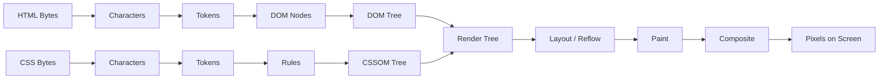
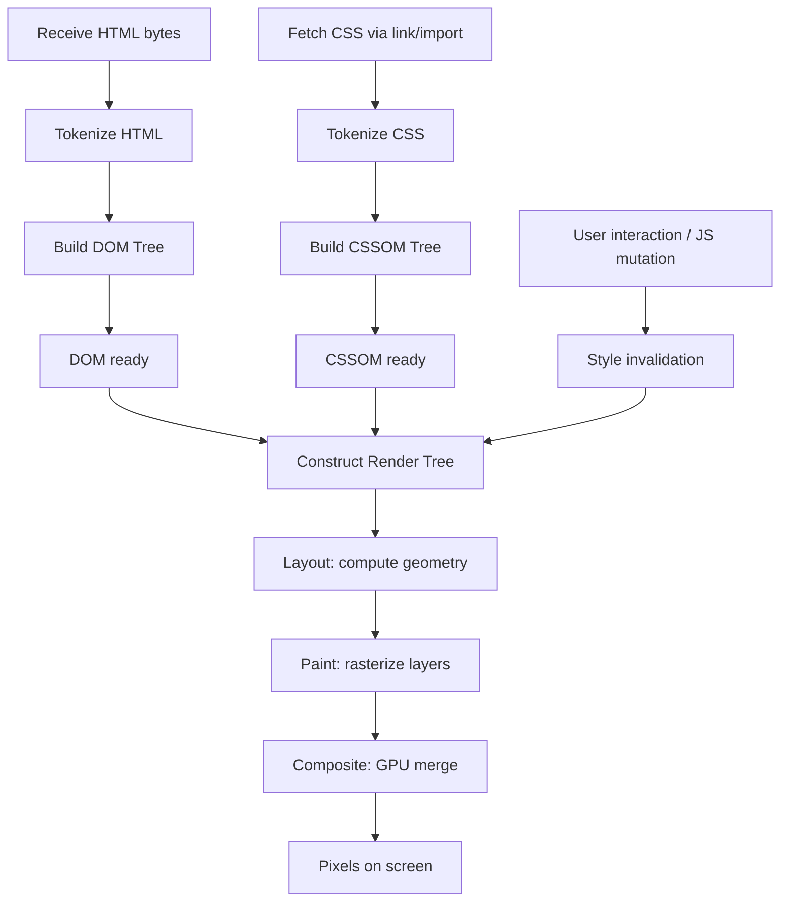
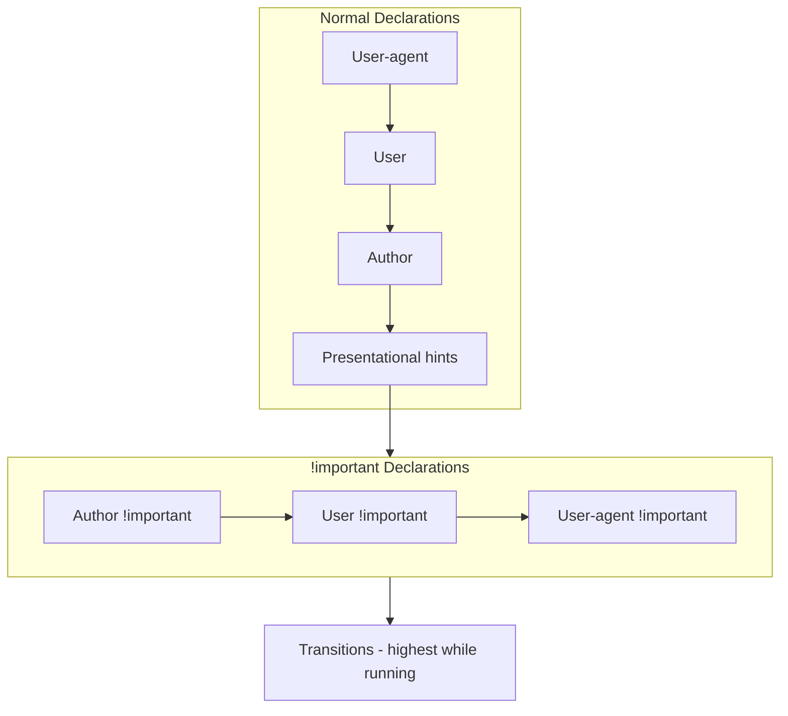
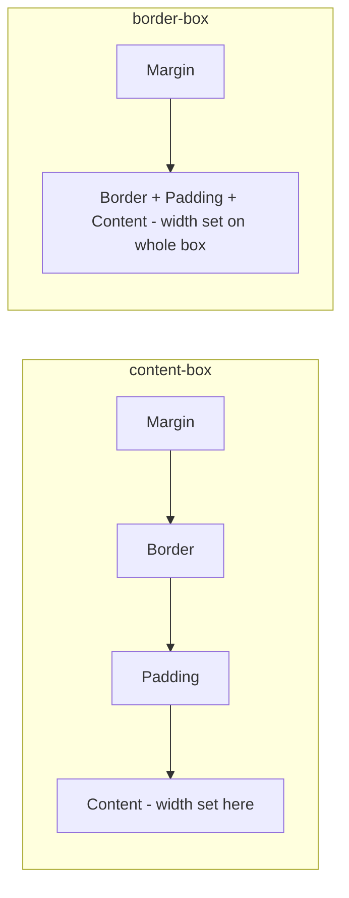

# 1.1 CSS Foundations

> This note lays the bedrock for the entire CSS chapter. You will learn what CSS actually *is*, how the browser parses and applies it, the full rendering pipeline from HTML bytes to pixels on screen, the multiple ways to attach CSS to a document, how the cascade decides winners, why `!important` is a code smell, what user-agent and presentational hints are, why almost every project resets CSS, and why `box-sizing: border-box` is the only sane default. Skipping this note guarantees confusion in every subsequent note.

## 1.1.1 Objective

After reading this note you should be able to:

1. Describe in precise order the steps the browser takes from receiving an HTML document to painting pixels, and explain at which step CSS participates.
2. Choose between external, internal, inline, and `@import` stylesheets for a given scenario and justify the choice with performance and maintainability reasoning.
3. Manually trace the cascade for any element when given a stylesheet, naming the winner at each step of the cascade algorithm (origin and importance, layer, specificity, source order, order of appearance).
4. Explain the difference between author styles, user styles, user-agent styles, and presentational hints, and predict which one wins when they conflict.
5. Defend the recommendation to set `box-sizing: border-box` globally and explain why it eliminates the most common box-model surprise.
6. Differentiate a CSS reset from a CSS normalize from a modern CSS foundational stylesheet, and choose correctly for a new project.

## 1.1.2 Background Knowledge

You almost certainly "know" the following facts, but you will be surprised how often you forget them under pressure. Re-read this section whenever your layout starts behaving unexpectedly.

### Reminders

- **HTML is structure, CSS is presentation, JavaScript is behavior.** These layers are separable but the browser blurs them (e.g., the `style` attribute, CSS-in-JS). The conceptual separation is still the right mental model.
- **CSS is declarative.** You describe the desired state, not how to get there. The browser figures out the *how*. This is why CSS reads differently from imperative languages.
- **A "rule" is one selector + one declaration block.** A "declaration" is one `property: value;` pair. A "stylesheet" is a collection of rules.
- **Whitespace in CSS is mostly insignificant** between tokens, *except* inside selectors where `a b` (descendant) and `a>b` (child) are different selectors.
- **CSS is case-insensitive for type selectors and property names**, but class and ID selectors are case-sensitive in HTML documents. `class="Button"` does not match `.button`.
- **Units matter.** `width: 100` is invalid CSS (no unit). `width: 100px` is valid. The only properties that accept unitless numbers are a small list (line-height, opacity, z-index, font-weight, flex-grow, flex-shrink, order, animation-iteration-count, etc.).
- **CSS parsers are resilient.** A malformed declaration is discarded silently — the rest of the rule still applies. This is unlike JavaScript where one syntax error stops the whole script.
- **The DOM is not the HTML source.** The DOM is what the browser built after parsing, fixing errors, and executing scripts that mutate it. CSS applies to the DOM, not the source.
- **`!important` is part of the cascade origin system, not a property of the declaration itself.** It promotes the declaration to a higher origin tier. We will detail this in [[1.2 Selectors and Cascade]].
- **`<link rel="stylesheet">` blocks render.** This is why CSS is in `<head>` and why critical CSS inlining is a performance technique.

> [!note] Forgotten trivia
> The `lang` attribute on `<html>` can change which font is used for the default `serif`/`sans-serif`/`monospace` generic families, because the browser maps these to locale-specific fonts. If your site looks different in another locale, this is one reason.

## 1.1.3 Core Concepts

### 1.1.3.1 What CSS Is

CSS (Cascading Style Sheets) is a declarative, domain-specific language for describing the visual presentation of structured documents. It is:

- **Declarative**: you state the target state.
- **Cascading**: multiple sources can contribute declarations to the same element, and a defined algorithm resolves conflicts.
- **Inheritable**: some properties flow from parent to child automatically.
- **Cascade-layered**: modern CSS lets you partition rules into named layers with explicit priority.
- **Device-agnostic**: the same stylesheet can adapt to print, screen, speech, etc. via media queries.

CSS does not "execute" in the imperative sense. The browser reads all applicable rules, resolves them through the cascade, computes the used values for every property of every element, then lays out and paints.

### 1.1.3.2 How the Browser Parses CSS

When the browser fetches a stylesheet (linked via `<link>` or imported via `@import`), it:

1. Decodes bytes to characters using the encoding declared in `Content-Type` or `@charset`.
2. Tokenizes the characters into CSS tokens (identifiers, numbers, strings, delimiters, functions, at-keywords).
3. Parses tokens into a CSS object model: rules, at-rules, declarations. Malformed input is discarded per the error-recovery rules in the CSS Syntax spec.
4. Builds a **CSSStyleSheet** object (part of the CSSOM). Each rule becomes a `CSSRule`. Selectors are parsed into a structured representation that allows fast matching.
5. The browser then builds an **index** mapping selectors to elements so it can answer "which rules apply to this element?" efficiently. Modern engines use Bloom filters and style invalidation to avoid re-matching the whole document on every change.

> [!tip] Developer insight
> The CSSOM is to CSS what the DOM is to HTML. `document.styleSheets` exposes it. You can read or mutate rules with JavaScript, but doing so is usually a code smell — prefer class toggles.

### 1.1.3.3 The Rendering Pipeline

This is the canonical pipeline. Memorize the names and the order. Every senior frontend engineer can recite this from memory.



Stage by stage:

1. **HTML parsing  -->  DOM.** The browser parses HTML into a tree of `Node` objects. Inline `<style>` is parsed here too.
2. **CSS parsing  -->  CSSOM.** External and imported CSS is fetched and parsed. The CSSOM is a tree because some at-rules nest (`@media` contains rules).
3. **Render Tree construction.** The render tree is *not* the DOM. It contains only **visible** nodes. `<head>`, `<meta>`, `display: none` elements are excluded. Each render node combines a DOM node with its computed style.
4. **Layout (reflow).** The browser computes geometry: position and size of every render node. This is where the box model is realized.
5. **Paint.** The browser rasterizes each render node into layers: text, colors, images, borders, shadows. Painting is done per layer.
6. **Composite.** Layers are composited into the final image on the GPU. Properties like `transform`, `opacity`, and `filter` are "compositor-only" and bypass layout/paint for changes — this is the foundation of performant animations.

> [!warning] Layout thrashing
> Reading a layout property (`offsetWidth`, `getBoundingClientRect`) immediately followed by writing a style property, in a loop, forces the browser to compute layout synchronously each iteration. This is called *layout thrashing* and is one of the most common frontend performance killers.

### 1.1.3.4 Including CSS in a Document

There are four classical ways plus one modern one.

#### External stylesheet (recommended)

```html
<link rel="stylesheet" href="/assets/styles.css" />
```

- **Pros**: cached by the browser, parallel-downloadable, shareable across pages, easy to manage.
- **Cons**: requires an extra HTTP request, blocks rendering if loaded in `<head>` without `media` tricks.

#### Internal stylesheet

```html
<style>
  body { background: white; }
</style>
```

- **Pros**: no extra request, useful for critical CSS inlined in the document head.
- **Cons**: not cached separately, not shareable across pages, inflates HTML size.

#### Inline style attribute

```html
<div style="color: red;"></div>
```

- **Pros**: highest specificity for an author rule (treated as if the selector had a specificity of `1,0,0,0`... actually higher — it's a separate origin tier for cascade purposes), zero HTTP cost.
- **Cons**: not reusable, mixes structure and presentation, hard to maintain, defeats caching. Almost always a code smell. The legitimate use is dynamic styles set via JavaScript where you cannot use a class (e.g., `element.style.setProperty('--token', value)`).

#### `@import`

```css
@import url("./base.css");
@import "./theme.css" layer(theme);
```

- **Pros**: lets you split CSS files without a build step.
- **Cons**: **`@import` is render-blocking and serial.** The browser must fetch and parse the importing stylesheet, *then* discover the `@import` rules and fetch them, *then* continue. This is a known performance footgun. Prefer `<link>` tags or, better, a build step that bundles files.
- **Modern caveat**: `@import ... layer(name)` is the way to assign an entire imported stylesheet to a cascade layer. This is good. The performance caveat still applies.

#### Constructable Stylesheets (modern)

```js
const sheet = new CSSStyleSheet();
sheet.replaceSync(`.card { padding: 1rem; }`);
document.adoptedStyleSheets = [...document.adoptedStyleSheets, sheet];
```

- **Pros**: programmatically built, shareable across Shadow DOM roots, fast.
- **Cons**: requires JavaScript, not for static sites. Used by design-system libraries and web components.

### 1.1.3.5 The Cascade Order

The cascade is the algorithm that decides, when multiple declarations apply to the same element and property, which one wins. The cascade compares declarations in this order:

1. **Origin and importance** (see below).
2. **Layer** (within the same origin and importance, layered rules are sorted by layer order; unlayered styles beat layered styles for author origin).
3. **Specificity** (within the same layer).
4. **Source order** (later wins).
5. **Order of appearance** (a tiebreaker for `@layer` ordering itself).

> [!note] Origin tiers
> For a *normal* declaration, the origin order (lowest priority to highest):
> 1. User-agent (browser default).
> 2. User (user stylesheet, OS accessibility settings).
> 3. Author (your CSS).
> 4. Presentational hints (e.g., `width` attribute on ``, `color` on `<font>` — legacy, but the spec carves them out).
>
> For an *important* declaration, the order is reversed and important-user-agent is highest:
> 1. Author `!important`.
> 2. User `!important`.
> 3. User-agent `!important`.
>
> Transitions are a separate tier on top of everything else while they are running.

> [!danger] `!important` is a tool, not a hammer
> Reaching for `!important` to "force" a style usually means you have lost a specificity war. The correct fix is almost always to make your selector more specific intentionally, or to use cascade layers. Treat `!important` as a signal that your architecture is wrong, then fix the architecture.

### 1.1.3.6 Source Order Matters Only When Specificity Is Equal

If two rules with identical specificity apply to the same element, the later one wins:

```css
.card { color: red; }
.card { color: blue; }  /* wins */
```

This is why file order in your `@import` chain or `<link>` sequence matters. It is also why Tailwind's "later utility wins" works — every utility has the same specificity, so source order (which is build-order in Tailwind's case) decides.

### 1.1.3.7 The User Agent Stylesheet

Every browser ships a built-in stylesheet that gives default styles to HTML elements: `h1` is bold and large, `b` is bold, `ul` has padding and a disc bullet, `a` is blue and underlined, etc. This stylesheet is part of the user-agent origin and has the lowest priority in the cascade. Your author styles override it effortlessly because author origin outranks user-agent origin.

But the user-agent stylesheet is why your page looks "OK" even with no CSS at all. It also introduces inconsistency: default margins, font sizes, and list styles differ between browsers. This is why resets exist.

### 1.1.3.8 Presentational Hints

Some HTML attributes carry presentational meaning that the browser translates into CSS:

```html
<table border="1" cellpadding="4">

```

These are treated as presentational hints with specificity `0` (lower than any author rule). They are legacy from the 1990s. **Do not rely on them in modern code.** Use CSS. The `` attributes are an exception — they are useful for layout stability (they reserve the aspect-ratio box before the image loads) and are *not* purely presentational; modern best practice is to set both the `width`/`height` attributes (for the aspect ratio hint) and style with CSS.

### 1.1.3.9 Reset vs Normalize vs Modern CSS

Three philosophies for taming the user-agent stylesheet:

- **CSS Reset** (Eric Meyer's classic): zero out margins, paddings, list styles, font sizes. Aggressive. Leaves you with a blank canvas. The downside: you must style *everything*, including elements you might have been fine with at default.
- **Normalize.css**: instead of zeroing, it makes defaults consistent across browsers. Preserves useful defaults. Good for projects that want sensible starting styles.
- **Modern CSS** (e.g., Josh Comeau's reset, Andy Bell's modern-css-reset): opinionated, modern, smaller. Uses `box-sizing: border-box` globally, sets `margin: 0` on body, improves media defaults, etc.

```css
/* Modern minimal reset */
*, *::before, *::after { box-sizing: border-box; }
* { margin: 0; }
html, body { height: 100%; }
body { line-height: 1.5; -webkit-font-smoothing: antialiased; }
img, picture, video, canvas, svg { display: block; max-width: 100%; }
input, button, textarea, select { font: inherit; }
p, h1, h2, h3, h4, h5, h6 { overflow-wrap: break-word; }
a { color: inherit; text-decoration: none; }
```

> [!tip] Recommendation for new projects
> Start with a small modern reset (10-30 lines), not a heavy framework. Tailwind's `preflight` (covered in Chapter 2) is essentially a modern reset bundled with the framework.

### 1.1.3.10 `box-sizing: border-box`

The `box-sizing` property decides whether `width` and `height` set the size of the *content box* or the *border box*.

- `content-box` (default): `width` is the content width. Padding and border are *added* on top. `box { width: 200px; padding: 20px; border: 5px; }` is `250px` wide on screen.
- `border-box`: `width` is the border-box width. Padding and border are *included*. The same rule is `200px` wide on screen, with content reduced to `150px`.

```css
html { box-sizing: border-box; }
*, *::before, *::after { box-sizing: inherit; }
```

This is the universal recommendation. Always use `border-box`. Always set it globally with `inherit` so any future `content-box` opt-in for a component is explicit. We cover the box model fully in [[1.3 Box Model and Display]].

### 1.1.3.11 Chapter Roadmap

The rest of the chapter:

- [[1.2 Selectors and Cascade]] — every selector, specificity math, the new cascade layers.
- [[1.3 Box Model and Display]] — the box model, margin collapse, `display` values, BFCs.
- [[1.4 Positioning and Normal Flow]] — `position`, containing blocks, stacking contexts.
- [[1.5 Flexbox]] — one-dimensional layout.
- [[1.6 Grid]] — two-dimensional layout.
- [[1.7 Responsive Design and Container Queries]] — viewport, media, container queries, fluid type.
- 1.8 Variables, Functions, and Calculations — custom properties, `calc()`, `clamp()`.
- 1.9 Animations, Transitions, and Transforms — performant motion.
- 1.10 Pseudo-Elements and Pseudo-Classes — `::before`, `:has()`, etc.
- 1.11 Accessibility in CSS — focus, contrast, reduced motion.
- 1.12 CSS Architecture — ITCSS, CUBE, layering.
- 1.13 CSS Performance — Critical CSS, containment, will-change.

## 1.1.4 Detailed Walkthrough

Let us trace exactly what happens when the browser loads a simple page.

```html
<!doctype html>
<html lang="en">
<head>
  <meta charset="utf-8">
  <title>Demo</title>
  <link rel="stylesheet" href="/app.css">
</head>
<body>
  <h1>Hello</h1>
  <p class="lede">Welcome.</p>
</body>
</html>
```

```css
/* /app.css */
:root { box-sizing: border-box; }
*, *::before, *::after { box-sizing: inherit; }
body { margin: 0; font: 100%/1.5 system-ui; }
h1 { color: #111; }
.lede { color: #444; font-size: 1.125rem; }
```

Step by step:

1. The browser receives the HTML bytes and starts streaming them through the tokenizer. The parser builds DOM nodes for `<html>`, `<head>`, `<meta>`, `<title>`, `<link>`, `<body>`, `<h1>`, `<p>`.
2. When the parser encounters `<link rel="stylesheet">`, it issues a request for `/app.css`. **Rendering is blocked** until the CSS is loaded and parsed, because the browser cannot build a render tree without computed styles.
3. The browser fetches `/app.css`, decodes it, tokenizes it, parses it into the CSSOM. Five rules are added.
4. Once both DOM and CSSOM are ready, the browser constructs the render tree:
   - `<html>`  -->  render node (visible)
   - `<head>`  -->  excluded (not rendered)
   - `<body>`  -->  render node
   - `<h1>`  -->  render node, computed color `#111`
   - `<p class="lede">`  -->  render node, computed color `#444`, computed font-size `1.125rem`
5. **Layout**: the browser computes the geometry. `<body>` fills the viewport. `<h1>` is its block child, taking full width. `<p>` is below `<h1>`, also full width, with content flowing inside.
6. **Paint**: text is rasterized, in the computed colors, using the system UI font.
7. **Composite**: a single layer is composited to the screen. Pixels appear.

If the user then opens DevTools and edits `.lede { color: #444; }` to `.lede { color: #f00; }`:

1. The CSSOM is updated.
2. The browser runs **style invalidation**: it figures out which elements could be affected (only `<p class="lede">` in this case).
3. **Render tree** is rebuilt for affected nodes.
4. **Layout** is recomputed (in this case, geometry does not change because color does not affect layout — but the browser still walks the affected subtree).
5. **Paint** is re-run for the affected area.
6. **Composite** again.

This incremental reflow is what makes interactive CSS possible. The browser does not rebuild the entire world for every change — it scopes work to the invalidation set.

## 1.1.5 Practical Examples

### 1.1.5.1 Critical CSS Inlined, Rest Loaded Async

For a fast first paint, inline only the CSS needed for above-the-fold content, then load the rest without blocking.

```html
<head>
  <style>
    /* Critical CSS for the hero */
    body { margin: 0; font: 100%/1.5 system-ui; }
    .hero { padding: 4rem 1rem; background: #111; color: #fff; }
    .hero h1 { font-size: clamp(2rem, 6vw, 4rem); }
  </style>
  <link rel="preload" href="/assets/app.css" as="style" onload="this.rel='stylesheet'">
  <noscript><link rel="stylesheet" href="/assets/app.css"></noscript>
</head>
```

### 1.1.5.2 Cascade Layers for Predictable Specificity

```css
@layer reset, base, components, utilities;

@layer reset {
  *, *::before, *::after { box-sizing: border-box; }
  * { margin: 0; }
}

@layer base {
  body { font: 100%/1.5 system-ui; }
  a { color: #06c; }
}

@layer components {
  .btn { padding: 0.5rem 1rem; border-radius: 0.25rem; }
  .btn-primary { background: #06c; color: #fff; }
}

@layer utilities {
  .text-center { text-align: center; }
  .mt-4 { margin-top: 1rem; }
}
```

Layer order at the top of the file determines priority: `utilities` wins over `components` wins over `base` wins over `reset`. A `.btn-primary` utility can override a `components` rule even with lower specificity. This is the modern way to avoid specificity wars.

### 1.1.5.3 The Global box-sizing Reset

```css
html { box-sizing: border-box; }
*, *::before, *::after { box-sizing: inherit; }
```

Why `inherit`? Because some third-party widgets ship with `box-sizing: content-box` and expect it. If you set `* { box-sizing: border-box }`, those widgets break. By inheriting from `html`, you can opt a subtree back to `content-box`:

```css
.widget-host { box-sizing: content-box; }
.widget-host * { box-sizing: inherit; }
```

## 1.1.6 Mermaid Diagrams

### 1.1.6.1 The Full Rendering Pipeline



### 1.1.6.2 Cascade Origin Tiers



### 1.1.6.3 box-sizing Compared



## 1.1.7 Common Mistakes

1. **Putting `<link rel="stylesheet">` at the bottom of `<body>`.** This causes a Flash of Unstyled Content (FOUC): the page renders with the user-agent stylesheet, then jumps to your styles when the CSS arrives. Always put stylesheets in `<head>`.

2. **Using `@import` inside a `<link>`-loaded stylesheet for non-trivial chains.** Each `@import` is a serial fetch. Use a build tool to concatenate, or use multiple `<link>` tags.

3. **Setting `box-sizing: border-box` only on `*` without inheriting from `html`.** This breaks any third-party widget that expects `content-box`. Use the `inherit` pattern.

4. **Reaching for `!important` to win specificity wars.** It works once. The next time you need to override that, you need another `!important` with higher specificity. You are now in a spiral. Use cascade layers or more specific selectors instead.

5. **Forgetting that the user-agent stylesheet still applies.** If your `<button>` looks ugly, it is because the browser has a default button style. You need to either reset it (`appearance: none; border: 0; background: transparent;`) or explicitly style it. Tailwind's `preflight` does this for you.

6. **Treating the DOM and the render tree as the same thing.** `display: none` removes the element from the render tree entirely. It is not just invisible — it takes no space, cannot receive focus, and is not in the accessibility tree. `visibility: hidden` keeps it in layout (it takes space) but excludes it from paint and a11y. See [[1.3 Box Model and Display]] for the full comparison.

7. **Mutating styles in a layout-thrashing loop.** Reading `offsetWidth` then writing `style.width` 100 times in a loop forces 100 synchronous layouts. Batch reads first, then writes.

8. **Confusing "computed value" with "used value".** The computed value of `width: 50%` is `50%`. The used value (after layout) is the resolved pixel width. DevTools usually shows used values in the Computed panel. We will cover this in [[1.3 Box Model and Display]].

## 1.1.8 Best Practices

1. **Set `box-sizing: border-box` globally on every project.** No exceptions. The `inherit` pattern is the most robust.

2. **Adopt cascade layers from day one on new projects.** Even if you only have one layer, declaring `@layer reset, base, components, utilities;` at the top makes future refactoring trivial and prevents specificity drift.

3. **Inline critical CSS and async-load the rest.** Tools like `critters` (for Vite/Webpack) automate this. First paint should not wait for the entire stylesheet.

4. **Prefer external, cacheable stylesheets for everything except critical CSS.** This maximizes the benefit of the browser cache.

5. **Treat `!important` as a bug, not a feature.** If you must use it, leave a comment explaining why and what would have to change to remove it.

6. **Use a small modern reset.** Do not pull in Normalize if you do not need its breadth. Twenty lines of reset is enough for most projects.

7. **Set `<html lang="...">`.** It improves screen reader pronunciation, hyphenation, and default font selection.

8. **Always specify a `<meta name="viewport" content="width=device-width, initial-scale=1">` for responsive sites.** Without it, mobile browsers render at a 980px virtual viewport and shrink the page. We cover this in [[1.7 Responsive Design and Container Queries]].

## 1.1.9 Mini Exercises

### Exercise 1.1.A — Predict the Render Tree

**Problem:** Given this HTML and CSS, list every node that appears in the render tree.

```html
<body>
  <header style="display: none">
    <h1>Hidden title</h1>
  </header>
  <main>
    <p>Hello</p>
    <span style="visibility: hidden">Secret</span>
  </main>
</body>
```

```css
p { display: block; }
```

**Expected outcome:** A correct list of render tree nodes with reasoning.

**Worked solution:**

- `<body>`  -->  render node (visible).
- `<header>`  -->  **excluded**. `display: none` removes it (and its descendants) from the render tree entirely.
- `<h1>` inside header  -->  **excluded** (parent is `display: none`).
- `<main>`  -->  render node.
- `<p>`  -->  render node.
- `<span style="visibility: hidden">`  -->  **render node**. Unlike `display: none`, `visibility: hidden` keeps the element in layout (it occupies space) but skips paint. It is still in the render tree.

**Why it works:** The render tree only excludes `display: none` subtrees (and `<head>`-like metadata). `visibility: hidden` is a paint-time concern, not a structural one.

**Common wrong approach:** Listing the span as excluded. It is not. The space it occupies is real.

### Exercise 1.1.B — Cascade Resolution

**Problem:** For this element `<button class="btn primary" id="save">Save</button>`, what is the final `background-color`?

```css
@layer base, components, utilities;

@layer base {
  button { background-color: silver; }
}

@layer components {
  .btn { background-color: gray; }
  .btn.primary { background-color: blue; }
  #save { background-color: navy; }
}

@layer utilities {
  .primary { background-color: teal !important; }
}
```

**Expected outcome:** The final color and the full reasoning chain.

**Worked solution:**

1. List all candidate declarations for `background-color` on this element:
   - `button { background-color: silver; }` — origin author, layer `base`, specificity `(0,0,1)`.
   - `.btn { background-color: gray; }` — layer `components`, specificity `(0,1,0)`.
   - `.btn.primary { background-color: blue; }` — layer `components`, specificity `(0,2,0)`.
   - `#save { background-color: navy; }` — layer `components`, specificity `(1,0,0)`.
   - `.primary { background-color: teal !important; }` — layer `utilities`, specificity `(0,1,0)`, **important**.

2. Origin and importance: only one declaration is `!important`. Important declarations outrank normal declarations across the entire origin system. Therefore `teal !important` wins immediately.

Final answer: **`teal`**.

**Why it works:** `!important` promotes the declaration to a higher origin tier. Within that tier there is no competition here, so it wins regardless of layer or specificity.

**Common wrong approach:** Reasoning that `#save` (specificity `(1,0,0)`) wins because of the high specificity. Specificity is only the third tiebreaker in the cascade — origin/importance and layer come first. The `!important` on `.primary` is the only important declaration, so it beats every normal declaration.

### Exercise 1.1.C — Design a Project Reset

**Problem:** Write a minimal reset stylesheet for a Next.js project that: (a) sets `box-sizing: border-box` globally with the inherit pattern, (b) removes default body margin, (c) makes images block-level and never overflow, (d) inherits form font, (e) sets a sensible default line-height, (f) sets `tab-size: 4` for code, (g) respects `prefers-reduced-motion` by disabling transitions globally when set.

**Expected outcome:** A complete, production-ready reset file.

**Worked solution:**

```css
/* reset.css */
*, *::before, *::after { box-sizing: border-box; }

* { margin: 0; padding: 0; }

html {
  -webkit-text-size-adjust: 100%;
  tab-size: 4;
}

body {
  min-height: 100vh;
  line-height: 1.6;
  -webkit-font-smoothing: antialiased;
  text-rendering: optimizeLegibility;
}

img, picture, video, canvas, svg {
  display: block;
  max-width: 100%;
  height: auto;
}

input, button, textarea, select {
  font: inherit;
  color: inherit;
}

button { background: none; border: 0; cursor: pointer; }

a { color: inherit; text-decoration: none; }

p, h1, h2, h3, h4, h5, h6 {
  overflow-wrap: break-word;
}

ul, ol { list-style: none; }

@media (prefers-reduced-motion: reduce) {
  *, *::before, *::after {
    animation-duration: 0.01ms !important;
    animation-iteration-count: 1 !important;
    transition-duration: 0.01ms !important;
    scroll-behavior: auto !important;
  }
}
```

**Why it works:**
- The `*` reset is brutal but small.
- `box-sizing` uses the inherit pattern.
- Form controls inherit the document font (they don't by default — a long-standing browser quirk).
- `prefers-reduced-motion` is an accessibility must, covered in [[1.11 Accessibility in CSS]].
- Images are `block` and `max-width: 100%` to prevent overflow.

**Common wrong approach:** Forgetting form controls. Without `font: inherit`, your `<button>` text will look different from body text on iOS Safari, which uses a different default font family for form controls.

### Exercise 1.1.D — Diagnose a FOUC

**Problem:** A user reports that their site "flashes unstyled" before settling. They share this HTML. What is wrong and how do you fix it?

```html
<head>
  <title>My Site</title>
</head>
<body>
  <link rel="stylesheet" href="/app.css">
  <main>...</main>
</body>
```

**Expected outcome:** Diagnosis and fix.

**Worked solution:**
The `<link>` is in `<body>`, not `<head>`. Modern browsers will still apply it, but the page renders with the user-agent stylesheet first, then repaints when the CSS arrives — producing a flash of unstyled content.

Fix: move the `<link>` to `<head>`.

```html
<head>
  <title>My Site</title>
  <link rel="stylesheet" href="/app.css">
</head>
<body>
  <main>...</main>
</body>
```

**Why it works:** Stylesheets in `<head>` block rendering until they are loaded, so the first paint already has styles. The browser does not paint the unstyled intermediate state.

**Common wrong approach:** "Add `display: none` to body and remove it on `load`." This just delays the flash; it does not eliminate it, and it hurts perceived performance.

### Exercise 1.1.E — Explain Why `width: 100%` Overflows

**Problem:** A junior engineer writes:

```css
.input-wrap { width: 300px; padding: 0 10px; border: 1px solid #ccc; }
.input-wrap input { width: 100%; }
```

They expect the `<input>` to fit perfectly inside `.input-wrap`. Instead it overflows. Explain why and fix it without changing the HTML.

**Expected outcome:** The explanation and a one-line CSS fix.

**Worked solution:**
With default `box-sizing: content-box`, `.input-wrap` is `300px` content + `20px` padding + `2px` border = `322px` total. The `<input>` is set to `width: 100%`, which resolves against the *content box* of the parent — `300px`. But `<input>` itself has its own default border and padding (user-agent styles), so its total size is `300px` + its own padding/border. It overflows the parent's *content box* and, because the parent's total box is `322px`, the input likely overflows that too.

The robust fix is `box-sizing: border-box` globally:

```css
*, *::before, *::after { box-sizing: border-box; }
```

With `border-box`, the input's `width: 100%` resolves to the parent's *content box* (`280px` after padding), and the input's own border/padding are included inside that width — no overflow.

**Why it works:** `border-box` makes `width` mean "the size of the box you see", including padding and border. Widths become predictable.

**Common wrong approach:** Setting `width: calc(100% - 22px)` on the input. This works but is brittle and ignores the root cause.

## 1.1.10 Summary

- CSS is a declarative, cascading, inheritable style language parsed into the CSSOM.
- The rendering pipeline is: DOM + CSSOM  -->  Render Tree  -->  Layout  -->  Paint  -->  Composite.
- Four ways to include CSS: external `<link>`, internal `<style>`, inline `style`, `@import`. Modern projects also use constructable stylesheets.
- The cascade order is: origin/importance  -->  layer  -->  specificity  -->  source order.
- `!important` promotes a declaration to a higher origin tier. Use sparingly.
- User-agent styles, user styles, author styles, and presentational hints are distinct origins.
- Always reset, always set `box-sizing: border-box` globally with the inherit pattern.
- Modern projects should adopt cascade layers from day one.
- Subsequent notes build on this foundation: selectors, box model, positioning, flexbox, grid, responsive.

## 1.1.11 Related Notes

- [[1.2 Selectors and Cascade]]
- [[1.3 Box Model and Display]]
- [[1.4 Positioning and Normal Flow]]
- [[1.5 Flexbox]]
- [[1.6 Grid]]
- [[1.7 Responsive Design and Container Queries]]
