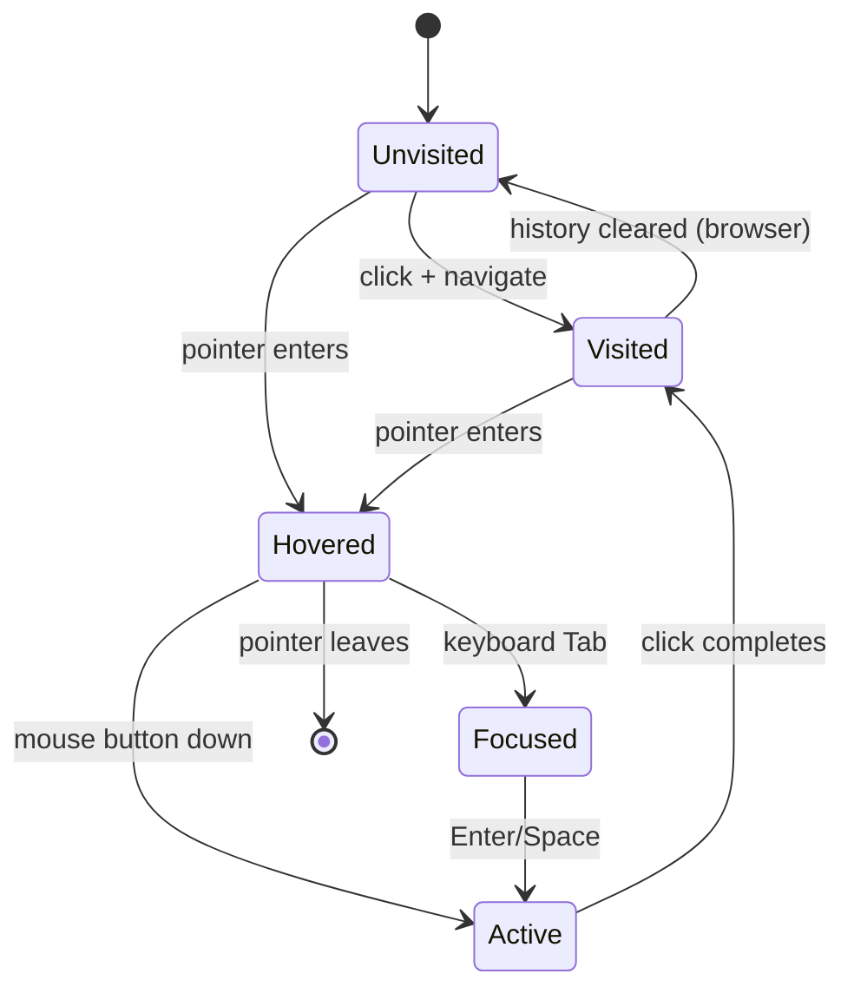

# 1.10 Pseudo-Elements and Pseudo-Classes

> Pseudo-elements and pseudo-classes look similar (both start with `:` or `::`) but are conceptually different: a **pseudo-element** is a virtual element the browser creates so you can style a part of the document that has no corresponding DOM node (the first letter of a paragraph, the placeholder text of an input, generated content via `::before` and `::after`); a **pseudo-class** is a state or condition the browser matches against (hover, focus, the Nth child, "has a checked sibling"). This note covers every commonly-used pseudo-element and pseudo-class, the famous distinctions (`:nth-child` vs `:nth-of-type`, `:focus` vs `:focus-visible`, the new `:has()` parent selector), and when to reach for a pseudo-element vs. a real DOM node.

## 1.10.1 Objective

By the end of this note you should be able to:

1. Distinguish pseudo-elements (virtual elements) from pseudo-classes (state or structural matchers) at a glance.
2. Use the generated-content pseudo-elements `::before` and `::after` and explain how the `content` property drives them.
3. Use typographic pseudo-elements (`::first-line`, `::first-letter`, `::selection`, `::placeholder`, `::marker`) correctly.
4. Recognise and use every commonly-used pseudo-class — interaction states, structural states, form states, negation and grouping (`:not`, `:is`, `:where`), the relational `:has()`, and the legacy `:root` and `:empty`.
5. Explain the difference between `:nth-child` and `:nth-of-type` and pick the right one.
6. Explain the difference between `:focus`, `:focus-visible`, and `:focus-within`, and know which to use by default.
7. Explain why `:has()` is a fundamental change to CSS (it was the "parent selector" CSS lacked for two decades) and use it for common UI patterns.

## 1.10.2 Background Knowledge

CSS selectors were originally designed around the idea that the document tree is the source of truth: every selector matched elements that existed in the DOM. The two pseudo-concepts were introduced to extend that model:

- A **pseudo-element** creates a virtual element *inside* or *around* a real one so you can style part of an element without adding a DOM node. The double-colon syntax (`::before`) was introduced in CSS 3 to disambiguate from pseudo-classes; the single-colon form (`:before`) is still accepted for the original four pseudo-elements (`:before`, `:after`, `:first-line`, `:first-letter`) for backwards compatibility.
- A **pseudo-class** is a stateful or structural condition applied to a *real* element. `:hover` is "the element is being pointed at"; `:nth-child(3)` is "the element is the third child of its parent"; `:checked` is "the form element is checked."

The conceptual difference matters because pseudo-elements behave like elements (they can have their own `display`, `padding`, etc.) while pseudo-classes behave like filters that select among existing elements.

The `:has()` pseudo-class, shipped in all evergreen browsers by 2024, is a quiet revolution. CSS had never been able to select an element *based on its descendants* — selectors were strictly top-down. `:has()` makes CSS relational, which collapses dozens of JavaScript-driven styling patterns into pure CSS. We cover it in detail below.

> [!note] Specificity note: pseudo-elements contribute `(0,0,1)` like a type selector. Pseudo-classes contribute `(0,1,0)` like a class selector. `:is()` and `:not()` and `:has()` take the specificity of their *most specific* argument; `:where()` always contributes zero. See [[1.2 Selectors and Cascade]] for the full arithmetic.

## 1.10.3 Core Concepts

### 1.10.3.1 The Generated-Content Pseudo-Elements: ::before and ::after

```css
.required-label::after { content: " *"; color: red; }
```

`::before` and `::after` create virtual elements as the first/last child of the host element. They are not rendered at all unless the `content` property is set — even an empty string `content: ""` is enough to make them visible (for clearfix, decorative shapes, etc.).

The `content` property accepts:

- A string: `content: " --> "`
- An image: `content: url('/arrow.png')`
- An attribute reference: `content: attr(href)`
- A counter: `content: counter(section)`
- A combination: `content: "Page " counter(page)`
- `none` (no box at all) or `normal` (default, behaves like none for `::before`/`::after`)

Generated content is **not part of the DOM**: it cannot be selected by the user in most browsers, it cannot receive focus or be an accessibility-tree node by default, and it is not announced by screen readers (with rare exceptions). Treat it as decorative only; never put essential information in `content`.

### 1.10.3.2 Typographic Pseudo-Elements

- `::first-letter` — selects the first letter of the first formatted line of a block-level element. Useful for drop caps. Note: punctuation preceding the first letter is included, and the rule applies only to block-level containers.
- `::first-line` — selects the first formatted line of a block-level element. The styles you can apply are limited (color, font, background, word-spacing, letter-spacing, text-decoration, vertical-align, line-height, text-transform, text-shadow). The browser re-evaluates which text is on the first line when the viewport resizes.
- `::selection` — styles the user's text selection. Only `color`, `background-color`, `text-shadow`, `text-decoration` (and a few others) are allowed. Note `::selection` actually matches the *selected portion* of every element that has the rule; you can set a default on `::selection` and override per element.
- `::placeholder` — styles the placeholder of an `<input>` or `<textarea>`. Limited to color/typography properties. Vendor prefixes (`::-webkit-input-placeholder`, `::-moz-placeholder`) were historically needed; modern browsers all support the standard.
- `::marker` — styles the marker box of a list item (`<li>`), which is the bullet or number. You can set `content`, `color`, `font-*`, `text-*`. Custom counters and `content: " --> "` work.
- `::file-selector-button` — styles the button inside `<input type="file">`.

### 1.10.3.3 Interaction Pseudo-Classes

- `:link` — an unvisited link.
- `:visited` — a visited link. **Privacy**: browsers deliberately limit which properties you can style on `:visited` (only `color`, `background-color`, `border-color`, `outline-color`, `column-rule-color`, `text-decoration-color`, `fill`, `stroke`) to prevent history sniffing. `getComputedStyle` lies about visited-link styles.
- `:hover` — the user is pointing at the element with a cursor. Touch devices emulate `:hover` after a tap, which can cause hover styles to "stick" — design accordingly.
- `:active` — the element is being activated (mouse button down, finger down, Enter/Space keydown). On links, fires during the click.
- `:focus` — the element has focus (keyboard or mouse).
- `:focus-visible` — the element has focus **and** the browser heuristically decides a focus ring should be shown (typically keyboard focus, not mouse focus). This is the modern replacement for the old `:focus { outline: none; }` anti-pattern.
- `:focus-within` — the element **or any of its descendants** has focus. Useful for highlighting a form field's containing wrapper.

The recommended LVHA order for links is `:link`, `:visited`, `:hover`, `:active`. Same-specificity rules later in the cascade win, so listing them in this order ensures `:active` overrides `:hover`, which overrides `:visited`, which overrides `:link`.

### 1.10.3.4 Structural Pseudo-Classes

- `:root` — the document root (`<html>` in HTML documents). Higher specificity than `html` because it's a pseudo-class.
- `:empty` — an element with no children (text nodes count; whitespace-only does *not* count in modern browsers, which is a change from earlier specs — comments count as content too, surprisingly, in some implementations; treat `:empty` cautiously).
- `:first-child`, `:last-child`, `:only-child` — match an element that is the first/last/only child of its parent.
- `:first-of-type`, `:last-of-type`, `:only-of-type` — same but scoped to type (tag name).
- `:nth-child(an+b)` — the element is the (an+b)th child of its parent for some non-negative integer n. Examples: `:nth-child(odd)` (1st, 3rd, 5th...), `:nth-child(even)`, `:nth-child(3n+1)` (1st, 4th, 7th...), `:nth-child(-n+3)` (first three).
- `:nth-last-child(an+b)` — same but counting from the end.
- `:nth-of-type(an+b)` and `:nth-last-of-type(an+b)` — same, but scoped to type. This is the critical distinction: `:nth-child` counts *all* siblings; `:nth-of-type` counts only siblings of the same tag name.

### 1.10.3.5 Form and Input Pseudo-Classes

- `:checked` — checkbox, radio, or `<option>` that is selected.
- `:indeterminate` — checkbox in indeterminate state (set via JS), or a radio group with no selection.
- `:disabled`, `:enabled` — form elements that are disabled or enabled.
- `:read-only`, `:read-write` — inputs that are read-only or editable.
- `:required`, `:optional` — inputs marked `required` (or not).
- `:valid`, `:invalid` — inputs whose value satisfies (or doesn't) the HTML5 constraint validators (`type`, `pattern`, `min`, `max`, `minlength`, `maxlength`, `required`).
- `:in-range`, `:out-of-range` — numeric inputs whose value is in/out of the `min`/`max` range.
- `:placeholder-shown` — an input that is currently showing its placeholder (i.e. is empty).
- `:default` — the default option/button in a form (e.g. the `<input type="checkbox" checked>` initially, or a `<button type="submit">`).
- `:autofill` — an input the browser has autofilled (vendor-prefixed historically; standard now).

### 1.10.3.6 Target and Reference

- `:target` — the element whose `id` matches the URL's fragment. Useful for in-page navigation, modals opened via `#modal`, and accordion sections.
- `:lang(en)` — the element's language (via `lang` attribute or inherited) matches.

### 1.10.3.7 Negation and Grouping: :not, :is, :where

- `:not(selector)` — matches elements that do not match the selector. Can take a complex selector list as of CSS 4: `:not(.active, .disabled)`. Specificity equals the most specific argument.
- `:is(s1, s2, s3)` — matches elements that match any of the selectors. Useful for grouping: `:is(h1, h2, h3):hover` is shorter than three separate rules. Specificity equals the most specific argument.
- `:where(s1, s2, s3)` — same as `:is()` but **specificity is always zero**. Use it to write low-specificity defaults that are easy to override.

### 1.10.3.8 The :has() Relational Pseudo-Class

`:has(relative-selector)` matches an element if any of its descendants (or, with `+`/`~`, its later siblings or their descendants) match the relative selector. Examples:

```css
/* Style a card that contains an image */
.card:has(img) { padding-top: 0; }

/* Style a form field whose input is invalid */
.field:has(input:invalid) { color: red; }

/* Style a section heading that is immediately followed by another heading */
h2:has(+ h3) { margin-bottom: 0; }

/* Highlight a list item that has a nested list */
li:has(ul) { font-weight: 700; }

/* Apply a different layout to body when a modal is open inside it */
body:has(.modal.is-open) { overflow: hidden; }
```

Specificity is the most specific argument. `:has()` can be nested inside itself and combined with `:is()`, `:not()`, `:where()`. It cannot, however, be nested *inside* another `:has()` argument (per current spec, for performance).

## 1.10.4 Detailed Walkthrough

### 1.10.4.1 ::before / ::after and the content Property

```css
a[href^="http://"]::after,
a[href^="https://"]::after {
  content: " ";
  font-size: 0.85em;
  opacity: 0.6;
}
```

A common pattern: append an external-link indicator to absolute links. The pseudo-element is generated *inside* the `<a>`, as its last child. Setting `content` is what creates it; without `content`, the pseudo-element does not exist in the rendering tree at all (it is not just invisible — it is absent).

A clearfix using `::after`:

```css
.clearfix::after {
  content: "";
  display: block;
  clear: both;
}
```

The `::after` is a generated child with `display: block` and `clear: both`, which establishes a block formatting context and contains the parent's floats. The `content: ""` is required; without it there is no element to apply `display: block` to.

> [!warning] Generated content is invisible to most screen readers. Don't put essential text (icons that convey meaning, form labels, status indicators) into `::before`/`::after` content. Use real DOM nodes with proper semantics for anything that needs to be announced. See [[1.11 Accessibility in CSS]].

### 1.10.4.2 ::first-letter and Drop Caps

```css
p.intro::first-letter {
  font-size: 3.5em;
  float: left;
  line-height: 0.8;
  margin: 0.1em 0.1em 0 0;
  font-family: Georgia, serif;
  color: var(--brand);
}
```

A drop cap. Note that `::first-letter` applies only to block-level containers, and the pseudo-element itself behaves like an inline element until you float it. The "first letter" includes any preceding punctuation, which is usually what you want.

### 1.10.4.3 ::marker for List Styling

```css
ul { padding-left: 1.5rem; }
li::marker { color: var(--brand); content: "▸ "; }
```

`::marker` lets you recolor and re-content the bullet without replacing it with a background image or `::before` hack. It also works on numbered lists:

```css
ol.fancy { list-style: decimal; }
ol.fancy li::marker { content: "Step " counter(list-item) ": "; font-weight: 700; }
```

### 1.10.4.4 :nth-child vs :nth-of-type

This is one of the most common sources of confusion in CSS. Consider:

```html
<section>
  <h2>Heading</h2>
  <p>Para 1</p>
  <p>Para 2</p>
  <p>Para 3</p>
</section>
```

```css
section :nth-child(2) { color: red; }     /* matches Para 1 */
section p:nth-of-type(2) { color: red; }  /* matches Para 2 */
```

`:nth-child(2)` is "the second child of its parent" — that's `Para 1` because the heading is the first child. `p:nth-of-type(2)` is "the second `<p>` among its parent's children" — that's `Para 2`. The type qualifier matters: `p:nth-of-type(2)` means "a `<p>` element that is the second `<p>` among its siblings," not "an element that is the second child and happens to be a `<p>`."

The rule of thumb: if your structure is uniform (all children are the same type), `:nth-child` and `:nth-of-type` are interchangeable. If your structure is mixed (headings, paragraphs, etc. interleaved), think carefully about which you want.

### 1.10.4.5 :focus vs :focus-visible vs :focus-within

- `:focus` matches whenever the element has focus, whether from mouse, keyboard, or programmatic `.focus()`. The old anti-pattern `*:focus { outline: none; }` is bad because it removes keyboard focus indicators entirely.
- `:focus-visible` matches when the browser heuristically decides a focus indicator *should* be shown. The heuristic is typically: keyboard navigation yes, mouse click no. This lets you write `:focus { outline: none; }` (kill mouse focus ring) and `:focus-visible { outline: 2px solid blue; }` (restore it for keyboard users) — the best of both worlds.
- `:focus-within` matches an element if it *or any descendant* has focus. Use it to highlight the containing element of an input:

```css
.field { padding: 1rem; border: 1px solid #ccc; }
.field:focus-within { border-color: var(--brand); box-shadow: 0 0 0 3px var(--brand-soft); }
```

### 1.10.4.6 :has() Patterns

`a:has(> img)` — links that wrap an image directly.
`figure:has(figcaption)` — figures that have a caption.
`section:not(:has(h2))` — sections without a heading.
`tr:has(input:checked)` — table rows with a checked checkbox inside (e.g. highlight selected rows).
`form:has(input:invalid) button[type=submit]` — disable or flag the submit button when the form has invalid fields.
`details:has(> summary:hover)` — a `<details>` element whose summary is being hovered.

Before `:has()`, every one of these required either a class swap from JavaScript or a structural workaround. `:has()` collapses them into a single selector.

### 1.10.4.7 Specificity of :is, :where, :has, :not

```css
:is(#main, .content) p { color: red; }  /* specificity (1,0,1) — uses #main */
:where(#main, .content) p { color: red; } /* specificity (0,0,1) — always zero from :where */
:not(.ignored) p { color: red; }          /* specificity (0,1,1) — from .ignored */
div:has(.special) { color: red; }         /* specificity (0,1,1) — from .special */
```

`:where()` is invaluable for designing utility classes or framework defaults that authors can override with trivial selectors. `:is()` is the right choice when you want the highest-specificity match to win so that you don't accidentally under-style a `#id`-containing group.

## 1.10.5 Practical Examples

### 1.10.5.1 Smart External Link Indicator

```css
a[href^="http://"]:not([href*="my-site.com"])::after,
a[href^="https://"]:not([href*="my-site.com"])::after {
  content: " ";
  font-size: 0.85em;
  color: var(--brand);
}
```

Only external links (not pointing to your own domain) get the indicator.

### 1.10.5.2 Validating Form Indicators

```css
input:invalid { border-color: #d32f2f; }
input:invalid + .error { display: block; }
input:valid { border-color: #388e3c; }
input:focus-visible { outline: 2px solid var(--brand); outline-offset: 2px; }
```

The `+ .error` adjacent sibling selector shows the error message only when the immediately preceding input is invalid. This avoids JavaScript for client-side validation styling (the actual validation still happens via the HTML5 `required`, `pattern`, `type` attributes).

### 1.10.5.3 Card with Image vs. Card Without

```css
.card { padding: 1rem; border-radius: 12px; }
.card:has(img) { padding-top: 0; }
.card:has(img) img { border-radius: 12px 12px 0 0; }
.card:not(:has(img)) { background: var(--brand-soft); }
```

A card that contains an image gets zero top padding and a top-rounded image; a card without an image gets a soft background. One rule, no class swapping.

### 1.10.5.4 Zebra-Striping with nth-child

```css
tbody tr:nth-child(odd) { background: #f9f9fb; }
tbody tr:nth-child(3n+1) { color: var(--brand-deep); } /* every third starting from 1 */
```

### 1.10.5.5 Submenu Indicator with ::after

```css
.menu-item:has(> .submenu)::after {
  content: "▾";
  margin-left: 0.25em;
  font-size: 0.75em;
  opacity: 0.7;
}
```

Only menu items that actually contain a submenu get the arrow.

## 1.10.6 Mermaid Diagrams

### Pseudo-Class State Transitions for a Link



### :nth-child vs :nth-of-type Mental Model

```mermaid
flowchart TD
  Parent["Parent element<br/>children: h2, p, p, p, p"]
  Parent --> C1["1: h2<br/>(1st child, 1st h2)"]
  Parent --> C2["2: p<br/>(2nd child, 1st p)"]
  Parent --> C3["3: p<br/>(3rd child, 2nd p)"]
  Parent --> C4["4: p<br/>(4th child, 3rd p)"]
  Parent --> C5["5: p<br/>(5th child, 4th p)"]

  C2 -.":nth-child(2) matches">-. M1["Yes"]
  C3 -.":nth-child(2) matches">-. M2["No — it is 3rd child"]
  C3 -.":nth-of-type(2) matches">-. M3["Yes — it is 2nd p"]

  style M1 fill:#c8e6c9
  style M2 fill:#ffcdd2
  style M3 fill:#c8e6c9
```

## 1.10.7 Common Mistakes

1. **Confusing `:nth-child` and `:nth-of-type`.** `:nth-child` counts all siblings; `:nth-of-type` counts siblings of the same type. When the structure is mixed (heading + paragraphs), the two give different results.
2. **Using `:focus` to remove outlines without restoring `:focus-visible`.** `*:focus { outline: none; }` removes keyboard focus indicators, which is an accessibility failure. Use `:focus-visible` instead.
3. **Putting essential content in `::before`/`::after`.** Generated content is invisible to most screen readers. Use real DOM nodes for anything that must be announced.
4. **Treating `:hover` as if it were a tap state on mobile.** Touch devices emulate `:hover` after a tap, and the style sticks until the user taps elsewhere. Either use `@media (hover: hover)` to scope hover styles to devices that really hover, or design the sticky-hover behavior deliberately.
5. **Forgetting the LVHA order for links.** If you list `:hover` before `:link`/`:visited`, the hover style will be overridden by the link's default color. The correct order is `:link`, `:visited`, `:hover`, `:active`.
6. **Expecting `:visited` to allow arbitrary styling.** For privacy reasons, browsers limit `:visited` styles to colors only. You cannot change font-weight, background images, layout, or anything else.
7. **Using `:not(.x)` to mean "any element that doesn't have class x" without realising it matches `html` and `body` too.** `:not(.x)` matches every element that doesn't have `.x`, including the root. Scope it: `main :not(.x)` or use a tag qualifier.
8. **Assuming `:empty` ignores whitespace.** It used to; modern browsers consider any text node — including whitespace-only — as content, so `<div> </div>` is *not* `:empty`. Comments also count. Test before relying on `:empty`.
9. **Using `:has()` without a fallback for older browsers.** `:has()` is new (2023 in Safari, 2023 in Chrome, late 2024 in Firefox). If you target older browsers, provide a fallback or accept that the rule will be ignored.

## 1.10.8 Best Practices

1. **Use `::before`/`::after` for decoration only.** Icons that need to be announced, status indicators, and form labels belong in real DOM with proper ARIA.
2. **Prefer `:focus-visible` over `:focus`.** It correctly distinguishes keyboard from mouse focus and avoids the bad `outline: none` global reset.
3. **Use `:where()` for framework defaults and `:is()` for grouping.** `:where()`'s zero specificity makes it easy to override; `:is()`'s max-specificity makes it safe for grouping selectors that include high-specificity ones like `#id`.
4. **Use `:has()` to replace JavaScript class swaps.** Patterns like "highlight the row that has a checked checkbox" or "style a card that contains an image" become pure CSS.
5. **Test `:nth-child` and `:nth-of-type` carefully on mixed structures.** When in doubt, draw the structure on paper and count both ways.
6. **Scope hover styles with `@media (hover: hover)`.** This prevents sticky-hover behavior on touch devices.
7. **Use `::marker` instead of `::before` for list bullets.** It's simpler, doesn't require hiding the default marker, and inherits naturally.
8. **Provide a `:focus-visible` style on every interactive element by default.** Browsers' default focus rings are often suppressed by CSS resets; restoring a clear, accessible focus indicator is non-negotiable. See [[1.11 Accessibility in CSS]].

## 1.10.9 Mini Exercises

### Exercise 1: Style Only Direct Paragraph Children of an Article

You want to style paragraphs that are direct children of `<article>` but not paragraphs nested inside `<div>` or `<blockquote>` within the article. How?

**Worked solution.**

```css
article > p { line-height: 1.6; max-width: 65ch; }
```

This uses the child combinator `>`. It matches only `<p>` whose direct parent is `<article>`. Paragraphs nested inside `<blockquote>` or `<aside>` inside the article are not matched.

**Common wrong approach.** `article p` (descendant combinator). That matches every paragraph inside the article, including nested ones. The child combinator `>` is the right tool for "direct children only."

### Exercise 2: Show the Form Submit Button Only When All Required Fields Are Filled

Without JavaScript, hide the submit button until every `required` input has a value (i.e. is not showing its placeholder).

**Worked solution.**

```css
form .submit { display: none; }
form:has(input[required]:placeholder-shown) .submit { display: none; }
form:not(:has(input[required]:placeholder-shown)) .submit { display: block; }
```

Or more concisely:

```css
form .submit { display: block; }
form:has(input[required]:placeholder-shown) .submit { display: none; }
```

The trick: `input:placeholder-shown` matches an input that is currently displaying its placeholder — i.e. is empty. `input[required]:placeholder-shown` therefore matches a required input that is still empty. If any such input exists inside the form, `:has()` matches the form and we hide the submit button. When all required fields are filled, no such input exists, `:has()` doesn't match, and the button shows.

We could be stricter with `:invalid` instead of `:placeholder-shown`, which would also hide the submit when fields are filled but invalid (e.g. an invalid email format).

**Common wrong approach.** `form input[required]:valid ~ .submit { display: block; }`. The general sibling combinator `~` only matches elements that come *after* the input in the DOM. If the submit button is at the bottom of the form, the selector works only if every preceding required input is valid — but it doesn't account for required inputs that come *after* the button (rare) and it doesn't actually require all inputs to be valid (just the ones preceding the button). `:has()` is the correct tool.

### Exercise 3: Drop Cap Without Affecting First Paragraph's Spacing

Add a drop cap to the first paragraph of an article, but ensure the drop cap doesn't push the rest of the paragraph down.

**Worked solution.**

```css
article > p:first-of-type::first-letter {
  font-size: 3.5em;
  line-height: 0.8;
  float: left;
  margin: 0.05em 0.1em 0 0;
  font-family: Georgia, serif;
  color: var(--brand);
  font-weight: 700;
}
```

Key points:

- `:first-of-type` (not `:first-child`) ensures we pick the first paragraph even if a heading precedes it. Without `:first-of-type`, if the article starts with `<h1>` then `<p>`, `:first-child` would not match the paragraph.
- `float: left` lets the rest of the paragraph wrap around the drop cap rather than being pushed down.
- `line-height: 0.8` (less than 1) keeps the drop cap visually compact; without it, the cap would push the first line down because its line box would be 3.5em tall.
- `margin-top` is small (0.05em) to nudge the cap into visual alignment with the first text line.

**Common wrong approach.** Using `:first-child` and finding that nothing matches because the article opens with a heading. Or using `display: inline-block` instead of `float: left`, which makes the cap occupy a full line box and pushes the rest of the paragraph onto a new line.

### Exercise 4: Highlight the Active Step in a Step Indicator

Given a list of steps where the currently-active step has the class `.is-active`, style previous steps as complete, the active step as highlighted, and subsequent steps as upcoming — without adding classes to the other steps.

**Worked solution.**

```css
.step { color: #999; }
.step.is-active { color: var(--brand); font-weight: 700; }

/* All steps after the active one are upcoming */
.step.is-active ~ .step { color: #ccc; }

/* All steps before the active one are complete */
.step:has(~ .step.is-active) { color: #388e3c; }
```

The `~` general sibling combinator handles "after" trivially. The "before" case was impossible in pure CSS before `:has()`: `.step:has(~ .step.is-active)` means "a `.step` that has a later sibling matching `.is-active`" — exactly the steps before the active one. This replaces what previously required JavaScript to walk backwards from the active step.

**Common wrong approach.** Trying `:nth-child` arithmetic. There's no way to know which step is active from a position alone, so `:nth-child` cannot express this. The class `.is-active` is the source of truth, and `:has()` is the only pure-CSS way to look backwards from it.

### Exercise 5: Build a Tooltip on Hover That Doesn't Show on Touch Devices

Design a CSS-only tooltip that appears on hover for devices with a real pointer, and does not appear at all on touch devices.

**Worked solution.**

```css
.tooltip { position: relative; }
.tooltip::after {
  content: attr(data-tooltip);
  position: absolute;
  bottom: 100%;
  left: 50%;
  transform: translateX(-50%) translateY(4px);
  background: #222;
  color: white;
  padding: 0.4rem 0.6rem;
  border-radius: 4px;
  font-size: 0.85rem;
  white-space: nowrap;
  opacity: 0;
  pointer-events: none;
  transition: opacity 150ms ease, transform 150ms ease;
}

@media (hover: hover) {
  .tooltip:hover::after {
    opacity: 1;
    transform: translateX(-50%) translateY(0);
  }
}
```

Key techniques:

- `content: attr(data-tooltip)` reads the `data-tooltip` attribute from the element so the tooltip text lives in the markup, not the CSS.
- `opacity: 0` plus `pointer-events: none` keeps the tooltip hidden and non-interactive by default.
- The `:hover` rule is wrapped in `@media (hover: hover)` so it only applies on devices that can actually hover (mouse, trackpad). Touch devices fall through and the tooltip never appears.
- The tooltip itself is `::after` generated content — decorative — so the same information should also be available in the accessible name of the host element (e.g. via `aria-label`), since `attr(data-tooltip)` is not announced by screen readers in most browsers.

**Common wrong approach.** Just writing `.tooltip:hover::after { opacity: 1; }` without the `@media (hover: hover)` wrapper. On touch devices, the first tap fires `:hover` and the tooltip sticks; subsequent taps elsewhere don't always clear it. The media query is the correct scoping mechanism.

## 1.10.10 Summary

Pseudo-elements create virtual elements (`::before`, `::after`, `::first-letter`, `::first-line`, `::selection`, `::placeholder`, `::marker`, `::file-selector-button`) so you can style parts of the document that have no DOM representation. Pseudo-classes filter existing elements by state (`:hover`, `:focus`, `:active`, `:visited`, `:checked`, `:disabled`, `:valid`, `:invalid`), structure (`:nth-child`, `:nth-of-type`, `:first-child`, `:empty`, `:root`), or relation (`:has()`). The two most common confusions — `:nth-child` vs `:nth-of-type` and `:focus` vs `:focus-visible` — come from misunderstanding what each is counting or matching. `:has()` is the modern relational pseudo-class that lets CSS select elements based on their descendants, replacing many JavaScript class-swap patterns. `:is()` groups selectors with max-specificity; `:where()` groups them with zero specificity. Generated content from `::before`/`::after` is decorative — never put essential content there.

## 1.10.11 Related Notes

- [[1.2 Selectors and Cascade]] — specificity arithmetic for pseudo-elements and pseudo-classes.
- [[1.3 Box Model and Display]] — `::before`/`::after` use the same box model as real elements.
- [[1.8 Variables, Functions, and Calculations]] — `attr()` and counters in generated content.
- [[1.9 Animations, Transitions, and Transforms]] — `:hover`, `:focus`, and other state pseudo-classes trigger transitions.
- [[1.11 Accessibility in CSS]] — `:focus-visible`, generated content accessibility, and contrast for pseudo-elements.
- [[1.13 CSS Performance]] — selector matching cost and why `:has()` is generally fine but worth profiling.
