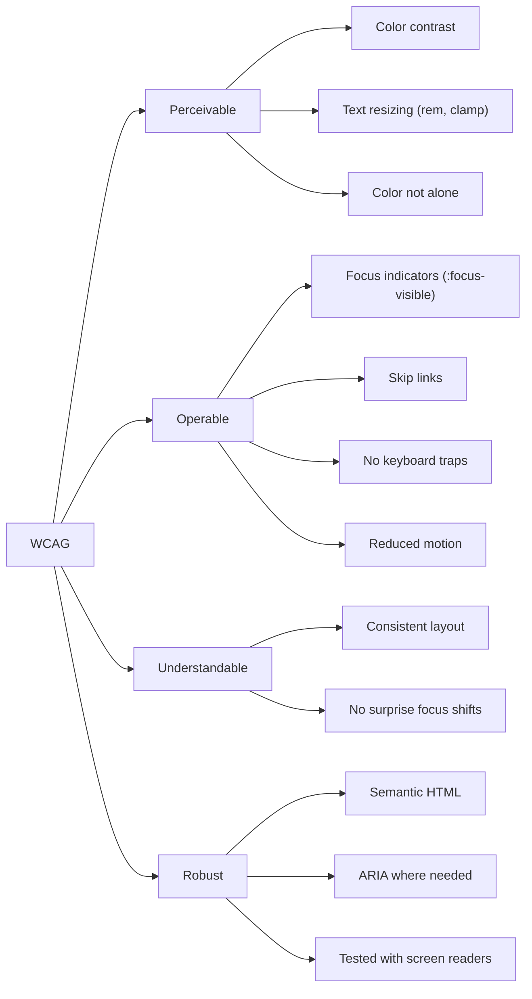

# 1.11 Accessibility in CSS

> Accessibility in CSS is not a single property or a checkbox — it is the discipline of writing styles that work for users who navigate by keyboard, who zoom to 200%, who use screen readers, who have low vision or color blindness, who are sensitive to motion, and who use high-contrast or dark mode operating-system settings. This note covers the legal/ethical/business case, the WCAG POUR principles, semantic HTML as the foundation, color contrast math, the focus-visible pattern, the visually-hidden pattern, the `prefers-*` media features, ARIA, the accessibility tree, skip links, and the rule that color alone never conveys information.

## 1.11.1 Objective

By the end of this note you should be able to:

1. Articulate **why** accessibility matters — legal (ADA, EAA, Section 508, AODA), ethical, and business.
2. State the four WCAG principles (POUR) and map common CSS techniques to each.
3. Use semantic HTML as the foundation of accessible CSS, and explain why you should never build interactive elements out of `<div>` + `onclick`.
4. Calculate WCAG color contrast ratios and design AA- and AAA-compliant palettes.
5. Implement the `:focus-visible` pattern correctly and avoid the legacy `outline: none` anti-pattern.
6. Hide content visually while keeping it accessible using the `.visually-hidden` pattern, and explain why `display: none` and `visibility: hidden` are wrong for that purpose.
7. Honor `prefers-reduced-motion`, `prefers-contrast`, and `prefers-color-scheme`.
8. Explain when to use ARIA and, more importantly, when **not** to.
9. Describe the accessibility tree and how CSS affects what enters it.
10. Implement skip links and "color alone never conveys information" patterns.

## 1.11.2 Background Knowledge

Accessibility (a11y for short — 11 letters between "a" and "y") has three motivations that overlap:

1. **Legal.** The Americans with Disabilities Act (ADA) in the US, the European Accessibility Act (EAA, in force June 2025), Section 508 (US federal), and AODA (Ontario) all require digital accessibility. WCAG 2.1 Level AA is the de facto legal benchmark; lawsuits against non-compliant sites are routine.
2. **Ethical.** Roughly 1 in 6 people globally has a disability that affects how they use the web. Excluding them is a moral failing.
3. **Business.** Accessible sites have better SEO (semantic HTML is also crawler-friendly), broader reach, lower legal risk, and often better usability for everyone (captioned video, keyboard shortcuts, high-contrast modes benefit all users in some context).

The Web Content Accessibility Guidelines (WCAG) are organised around four principles, **POUR**:

- **Perceivable** — users can perceive the content (text alternatives, captions, contrast, resizable text).
- **Operable** — users can navigate and interact (keyboard access, no seizure-inducing motion, no time limits without pause).
- **Understandable** — content and behaviour are predictable (consistent navigation, input assistance, no surprising focus changes).
- **Robust** — content works across user agents and assistive technologies (valid HTML, ARIA where needed, compatibility with screen readers).

Each principle has guidelines; each guideline has success criteria at Level A, AA, or AAA. Most legal frameworks target AA.

> [!note] CSS is the *presentation* layer, but it intersects with every POUR principle: contrast (Perceivable), keyboard focus indicators (Operable), consistent layout (Understandable), and reduced motion (Robust). Bad CSS can break accessibility even when the HTML is perfect.

## 1.11.3 Core Concepts

### 1.11.3.1 Semantic HTML as the Foundation

The single most impactful thing you can do for accessibility is use the right HTML element. A `<button>` gives you, for free:

- Keyboard focus (Tab to reach it, Enter/Space to activate).
- A visible focus indicator.
- The `button` role in the accessibility tree.
- Native `:disabled` state.
- Form submission (when `type="submit"`).
- `:active`/`:hover`/`:focus` state styling.

A `<div class="btn" onclick="...">` gives you none of that. You will have to add `tabindex="0"`, `role="button"`, a `keydown` handler for Enter and Space, an `aria-disabled` attribute, and the visible focus styling yourself — and you will probably get at least one of those wrong.

```html
<!-- Good -->
<button class="btn" type="button">Save</button>

<!-- Bad: div button -->
<div class="btn" onclick="save()">Save</div>
```

The rule: **CSS cannot fix bad HTML.** Get the semantics right first, then style.

### 1.11.3.2 Color Contrast

WCAG contrast ratios:

- **Normal text** (under 18pt / 24px regular, or under 14pt / 18.66px bold): AA requires **4.5:1**, AAA requires **7:1**.
- **Large text** (18pt+ regular or 14pt+ bold): AA requires **3:1**, AAA requires **4.5:1**.
- **Non-text content** (icons, borders of input fields, focus indicators): AA requires **3:1**.

The contrast ratio is calculated from the relative luminance of the two colors:

```
L = 0.2126 * R + 0.7152 * G + 0.0722 * B
```

where R, G, B are the linearized (gamma-corrected) channel values. The ratio is `(L1 + 0.05) / (L2 + 0.05)` where L1 is the lighter color and L2 is the darker. The `+ 0.05` accounts for ambient flare.

In practice, you use a tool — browser DevTools, WebAIM's contrast checker, or the CSS function `color-contrast()` — to compute the ratio. The principle is: text needs to be dark-on-light or light-on-dark with sufficient difference. Gray-on-gray "subtle" text is a frequent offender.

### 1.11.3.3 The :focus-visible Pattern

Browsers historically showed a focus ring on every focused element, including after a mouse click. Designers didn't like that, so they wrote `*:focus { outline: none; }`, which silently removed keyboard focus indicators and broke keyboard accessibility.

The modern pattern:

```css
:focus { outline: none; }                  /* suppress default ring */
:focus-visible { outline: 2px solid var(--brand); outline-offset: 2px; }
```

`:focus-visible` matches when the browser heuristically decides a ring should be shown — typically keyboard focus, not mouse focus. You get a clean mouse experience and a clear keyboard indicator at the same time.

> [!danger] Never write `*:focus { outline: none; }` without also providing a clear `:focus-visible` style. The WebAIM Million annual audit consistently finds missing focus indicators among the most common WCAG failures.

### 1.11.3.4 Hiding Content Visually but Keeping It Accessible

The `.visually-hidden` pattern (also called `.sr-only` in Bootstrap) hides content from sighted users while keeping it available to screen readers:

```css
.visually-hidden {
  position: absolute;
  width: 1px; height: 1px;
  padding: 0; margin: -1px;
  overflow: hidden;
  clip: rect(0 0 0 0);
  clip-path: inset(50%);
  white-space: nowrap;
  border: 0;
}
```

Why this specific combination?

- `position: absolute` removes it from the flow so it doesn't take up space.
- `width: 1px; height: 1px` shrinks it to a single pixel.
- `overflow: hidden` and `clip`/`clip-path` clip any content that overflows.
- `white-space: nowrap` prevents line-wrapping that could push the box wider.
- `margin: -1px` ensures no scroll-bar contribution.

You use this pattern for things like:

```html
<a href="#main" class="skip-link visually-hidden focusable">Skip to content</a>
<button class="icon-btn">
  <svg>...</svg>
  <span class="visually-hidden">Close</span>
</button>
```

**Why not `display: none` or `visibility: hidden`?** Both remove the element from the accessibility tree entirely. Screen reader users won't hear it. **Why not `text-indent: -9999px`?** It still takes up vertical space, can cause horizontal scroll on narrow viewports in older browsers, and is unreliable for inline elements. The clip-based pattern is the standard.

### 1.11.3.5 prefers-reduced-motion

```css
@media (prefers-reduced-motion: reduce) {
  *, *::before, *::after {
    animation-duration: 0.01ms !important;
    animation-iteration-count: 1 !important;
    transition-duration: 0.01ms !important;
    scroll-behavior: auto !important;
  }
}
```

Users with vestibular disorders, motion sensitivity, or simply on battery-saver mode set this preference. Respect it: skip decorative motion, snap to end states, and avoid parallax and auto-playing carousels. Functional motion (a progress bar, a drag handle) is acceptable; ambient and screen-spanning motion is not.

### 1.11.3.6 prefers-contrast and prefers-color-scheme

```css
@media (prefers-contrast: more) {
  :root { --text: #000; --bg: #fff; --border: #000; }
}
@media (prefers-contrast: less) {
  :root { --text: #333; --bg: #fafafa; --border: #ddd; }
}

@media (prefers-color-scheme: dark) {
  :root {
    --bg: #1a1a1a;
    --text: #eee;
    --brand: #6e9bff;
  }
  body { background: var(--bg); color: var(--text); }
}
```

`prefers-color-scheme` is supported everywhere; `prefers-contrast` is newer (Safari 14.1+, Chrome 96+, Firefox 101+) but worth targeting. Pair them with the `color-scheme` property so native form controls and scrollbars also adapt:

```css
:root { color-scheme: light dark; }
```

### 1.11.3.7 The Accessibility Tree

The browser builds a parallel tree to the DOM, called the **accessibility tree**, which assistive technologies consume. It contains:

- The element's **role** (button, link, heading, list, etc.).
- Its **name** (text content, `aria-label`, `aria-labelledby`, associated `<label>`).
- Its **state** (focused, checked, disabled, expanded).
- Its **value** (for inputs, sliders).
- Its **description** (`aria-describedby`, `<aside>`, etc.).

CSS affects what enters the accessibility tree:

- `display: none` removes an element from both the visual rendering **and** the accessibility tree.
- `visibility: hidden` does the same, but descendants can override with `visibility: visible`.
- `content-visibility: hidden` removes from rendering but keeps in a11y tree if the element is focusable.
- `opacity: 0` keeps the element in both trees; it's just visually invisible. It remains focusable — which is a common bug (a "hidden" link that users tab into and can't see).
- `aria-hidden="true"` removes from a11y tree but keeps visual rendering.
- Generated content (`::before`/`::after`) is generally **not** in the accessibility tree — don't put essential info there.

### 1.11.3.8 ARIA: When to Use and When Not

The first rule of ARIA, per the W3C: **don't use ARIA.** Use native HTML instead. A native `<button>` is always preferable to `<div role="button" tabindex="0">`. ARIA is for when:

- The semantics you need don't exist in HTML (e.g. tabs, accordions, comboboxes — though `<details>`/`<summary>` and `<dialog>` now cover much of this).
- You're enhancing a native element (e.g. `aria-describedby` to link an input to its error message).
- You're hiding decorative content (`aria-hidden="true"` on an icon SVG).

ARIA does not add behavior. `role="button"` on a `<div>` makes screen readers announce "button," but it doesn't make Enter/Space activate it — you still need JavaScript for that. Use real buttons.

### 1.11.3.9 Skip Links

```html
<a href="#main" class="skip-link">Skip to content</a>
<header>...</header>
<main id="main">...</main>
```

```css
.skip-link {
  position: absolute;
  top: -100%;
  left: 0;
  background: var(--brand);
  color: white;
  padding: 0.5rem 1rem;
  z-index: 1000;
  transition: top 200ms ease;
}
.skip-link:focus {
  top: 0;
}
```

A skip link is the first focusable element on the page. Keyboard users tab to it on page load and can skip the repeated header/nav and jump straight to the main content. Without it, keyboard users have to tab through every nav link on every page.

### 1.11.3.10 Color Alone Never Conveys Information

Color is not available to:

- Screen reader users (they hear text, not colors).
- Colorblind users (~8% of men, ~0.5% of women).
- Users on monochrome displays.
- Users in high-contrast mode.

So a form that marks invalid fields by turning the border red is inaccessible: a colorblind user can't tell. Always pair color with a text label, an icon, or a pattern (e.g. dashed border).

```css
input:invalid { border-color: #d32f2f; }
input:invalid + .error {
  display: block;
  color: #d32f2f;
}
input:invalid + .error::before { content: " "; }
```

The error has color, text, and an icon — three redundant cues.

## 1.11.4 Detailed Walkthrough

### 1.11.4.1 Calculating Contrast by Hand

Let's compute the contrast between `#777` (mid-gray) and `#fff` (white) to see why it fails AA for normal text.

1. Convert each channel to a 0-1 value and linearize:
   - For `#777`: each channel is `(0x77)/255 = 0.467`.
   - Linearize: `c ≤ 0.03928 ? c/12.92 : ((c+0.055)/1.055)^2.4`. Here, `((0.467 + 0.055)/1.055)^2.4 ≈ 0.184`.
   - So R = G = B = 0.184.
   - Luminance `L = 0.2126*0.184 + 0.7152*0.184 + 0.0722*0.184 = 0.184`.
2. For `#fff`: each channel is 1.0, linearized to 1.0. Luminance L = 1.0.
3. Contrast ratio = `(1.0 + 0.05) / (0.184 + 0.05) = 1.05 / 0.234 ≈ 4.49`.

Just barely under 4.5:1. `#777` on white **fails** AA for normal text by a hair. This is why "gray text" is so often an accessibility failure — you need to drop to `#767676` to pass AA on white. Tools do this math for you, but the principle is: gray text needs to be much darker than designers expect.

### 1.11.4.2 Building a Contrast-Safe Palette

Use `oklch()` (perceptually uniform, see [[1.8 Variables, Functions, and Calculations]]) and `color-contrast()`:

```css
:root {
  --brand: oklch(62% 0.18 260);
  --brand-fg: color-contrast(var(--brand) vs #fff, #000);
  --text: #111;
  --bg: #fff;
  --muted: #595959; /* AA-compliant on white: 7.0:1 (AAA) */
}
```

`color-contrast()` lets the browser pick whichever of two options has the better contrast against the first. As you change `--brand`, `--brand-fg` adapts automatically. This is the modern way to build palettes that stay accessible across themes.

### 1.11.4.3 Focus Indicator Design

A focus indicator must:

1. Be visible against both the element's background and the surrounding background.
2. Have at least 3:1 contrast against adjacent colors (WCAG 2.2 SC 1.4.11, 2.4.13).
3. Not be the same color as the element's border (which makes it disappear).

```css
:focus-visible {
  outline: 2px solid var(--brand);
  outline-offset: 2px;
  border-radius: 4px;
}

/* For elements where outline doesn't work (e.g. already-rounded buttons) */
.btn:focus-visible {
  outline: 2px solid var(--brand);
  outline-offset: 4px;
  box-shadow: 0 0 0 4px var(--brand-soft);
}
```

`outline-offset` creates a gap between the element and the ring, which is essential when the element has its own border that would otherwise merge with the outline. WCAG 2.2 introduced SC 2.4.13 (Focus Appearance) which requires a minimum focus indicator area — `outline-offset: 2px` plus a 2px outline generally satisfies it.

### 1.11.4.4 The visually-hidden Pattern Step by Step

```css
.visually-hidden {
  position: absolute;          /* taken out of flow */
  width: 1px; height: 1px;     /* minimal size */
  padding: 0; margin: -1px;    /* no contribution to layout */
  overflow: hidden;            /* clip overflow */
  clip: rect(0 0 0 0);         /* legacy IE/Edge clip */
  clip-path: inset(50%);       /* modern clip */
  white-space: nowrap;          /* prevent wrap expanding the box */
  border: 0;
}

/* Allow visually-hidden content to become visible on focus (e.g. skip links) */
.visually-hidden.focusable:active,
.visually-hidden.focusable:focus {
  position: static;
  width: auto; height: auto;
  margin: 0;
  overflow: visible;
  clip: auto;
  clip-path: none;
  white-space: inherit;
}
```

Each line solves a specific problem; the combination is the standard that works across browsers including legacy IE11.

### 1.11.4.5 prefers-reduced-motion Implementation

The comprehensive pattern:

```css
@media (prefers-reduced-motion: reduce) {
  /* Disable decorative animation */
  *, *::before, *::after {
    animation-duration: 0.01ms !important;
    animation-iteration-count: 1 !important;
    transition-duration: 0.01ms !important;
    scroll-behavior: auto !important;
  }

  /* But keep functional progress indicators visible */
  .progress-bar { animation: none; width: 100%; }
}
```

Note the use of `0.01ms` rather than `0ms`. The non-zero value ensures the `animationend` and `transitionend` events still fire (which some JavaScript depends on), while being imperceptibly short. This is a more robust pattern than `animation: none`, which can break code that waits for `animationend`.

### 1.11.4.6 ARIA and CSS Interactions

CSS cannot add ARIA semantics, but it interacts with ARIA in three important ways:

1. **`aria-hidden="true"` and `display: none` are different.** `display: none` removes from both rendering and a11y tree. `aria-hidden="true"` removes from a11y tree but keeps visual rendering. Use the latter for decorative SVG icons inside a button that has an accessible name from visible text.
2. **`content` in `::before`/`::after` is not announced.** Don't put ARIA-relevant content there. Use real DOM nodes for status indicators, error messages, and labels.
3. **`visibility: hidden` cascades but can be overridden.** A parent with `visibility: hidden` hides everything, but a child with `visibility: visible` reappears. This is useful for showing one item in an otherwise hidden group.

### 1.11.4.7 Reduced Data and Cognitive Load

Beyond the `prefers-*` features explicitly about accessibility, consider:

- `prefers-reduced-transparency` (newer) — users who find translucent overlays distracting.
- `prefers-reduced-data` — users on metered connections; load fewer fonts and images.
- Cognitive load: consistent layouts, predictable focus order, no surprising focus shifts, no auto-advancing carousels. CSS can't fix a bad IA, but it can avoid making a good one harder to use.

## 1.11.5 Practical Examples

### 1.11.5.1 An Accessible Modal

```html
<dialog open class="modal">
  <h2 id="modal-title">Confirm</h2>
  <p>Are you sure?</p>
  <div class="modal-actions">
    <button type="button">Cancel</button>
    <button type="button" class="primary">Confirm</button>
  </div>
</dialog>
```

```css
.modal {
  border: none;
  border-radius: 12px;
  padding: 1.5rem;
  max-width: min(90vw, 480px);
  box-shadow: 0 12px 40px rgba(0,0,0,0.3);
}
.modal::backdrop {
  background: rgba(0,0,0,0.5);
  backdrop-filter: blur(2px);
}
.modal:focus-visible {
  outline: 2px solid var(--brand);
  outline-offset: 4px;
}
```

The native `<dialog>` element handles focus trapping, Escape to close, and the accessibility tree for you. Use it instead of building a modal out of `<div>`s.

### 1.11.5.2 An Accessible Icon Button

```html
<button class="icon-btn" type="button" aria-label="Close dialog">
  <svg aria-hidden="true" focusable="false" viewBox="0 0 24 24">
    <path d="M6 6l12 12M18 6L6 18" stroke="currentColor" stroke-width="2"/>
  </svg>
</button>
```

```css
.icon-btn {
  background: transparent;
  border: none;
  padding: 0.5rem;
  border-radius: 4px;
  color: var(--text);
  cursor: pointer;
}
.icon-btn:hover { background: rgba(0,0,0,0.06); }
.icon-btn:focus-visible { outline: 2px solid var(--brand); outline-offset: 2px; }
```

The button has an accessible name (`aria-label`); the SVG is decorative (`aria-hidden`); the focus indicator is clear.

### 1.11.5.3 Dark Mode That Respects User Preference

```css
:root {
  color-scheme: light dark;
  --bg: #fff;
  --text: #111;
  --brand: #3460ff;
}
@media (prefers-color-scheme: dark) {
  :root {
    --bg: #1a1a1a;
    --text: #eee;
    --brand: #6e9bff;
  }
}
body { background: var(--bg); color: var(--text); }
```

`color-scheme: light dark` tells the browser to also style native controls (scrollbars, form inputs) appropriately. Without it, dark mode sites get blindingly white scrollbars.

### 1.11.5.4 A High-Contrast Mode Toggle

```css
@media (prefers-contrast: more) {
  :root {
    --text: #000;
    --bg: #fff;
    --border: #000;
  }
  body { background: var(--bg); color: var(--text); }
  .card { border: 2px solid var(--border); }
}
```

Plus the Windows-specific `forced-colors` media feature for the operating-system high-contrast mode:

```css
@media (forced-colors: active) {
  .icon { color: ButtonText; }
  .card { border: 1px solid ButtonText; background: ButtonFace; }
}
```

## 1.11.6 Mermaid Diagrams

### The Accessibility Tree

```mermaid
flowchart TD
  DOM["DOM Tree"]
  CSS["CSS Computed Styles"]
  AOM["Accessibility Tree<br/>(AOM)"]
  AT["Assistive Technology<br/>(screen reader, switch, etc.)"

  DOM --> AOM
  CSS --> AOM
  AOM --> AT

  subgraph Influences
    D1["display: none<br/>removes from both"]:::bad
    D2["visibility: hidden<br/>removes from both"]:::bad
    D3["opacity: 0<br/>stays in both (focusable!)":::warn
    D4["aria-hidden=true<br/>removes from a11y only"]:::neutral
    D5["::before/::after content<br/>NOT in a11y tree"]:::warn
    D6["role=button<br/>adds to a11y tree"]:::good
  end

  Influences -.-> AOM

  classDef bad fill:#ffcdd2,stroke:#b71c1c,color:#000;
  classDef warn fill:#fff9c4,stroke:#f57f17,color:#000;
  classDef neutral fill:#e3f2fd,stroke:#1565c0,color:#000;
  classDef good fill:#c8e6c9,stroke:#2e7d32,color:#000;
```

### WCAG POUR Principles and CSS Touchpoints



## 1.11.7 Common Mistakes

1. **Removing focus outlines without restoring them.** `*:focus { outline: none; }` is an accessibility crime. Always pair with `:focus-visible { outline: ...; }`.
2. **Using `display: none` to hide text from sighted users.** It removes the text from the accessibility tree. Use the `.visually-hidden` pattern instead.
3. **Relying on color alone to convey meaning.** A red border on invalid fields is invisible to colorblind users and screen readers. Always pair color with text, an icon, or a pattern.
4. **Low-contrast "subtle" text.** `#999` on white looks elegant and fails AA. Test with a contrast checker; you'll usually need `#767676` or darker.
5. **Forgetting `prefers-reduced-motion`.** Auto-playing carousels, parallax, and ambient gradients can cause nausea. Provide a reduced-motion fallback.
6. **Building interactive elements out of `<div>`s.** Use real `<button>`, `<a>`, `<input>` elements. CSS cannot fix missing semantics.
7. **Putting essential content in `::before`/`::after` `content`.** Generated content is invisible to most screen readers. Use real DOM nodes for labels, status indicators, and icons that convey meaning.
8. **Ignoring `prefers-color-scheme` for native controls.** Dark mode sites with white scrollbars are jarring. Set `color-scheme: light dark` on `:root`.
9. **`opacity: 0` to hide interactive elements.** The element stays in the accessibility tree and remains focusable. Keyboard users tab into invisible elements. Use `display: none` or `visibility: hidden` for actual hiding, or `aria-hidden` if you want it visible but not announced.
10. **Overusing ARIA.** Adding `role="button"` to a `<div>` doesn't make it a button. Use real HTML. ARIA is for cases where HTML doesn't have the semantics you need, not as a replacement for them.

## 1.11.8 Best Practices

1. **Use semantic HTML first.** Every interactive element should be a `<button>`, `<a>`, `<input>`, `<select>`, or `<textarea>`. Reach for ARIA only when HTML genuinely lacks the semantics.
2. **Provide a clear `:focus-visible` style on every interactive element.** Minimum 3:1 contrast against adjacent colors, with `outline-offset` to separate it from the element's own border.
3. **Maintain at least 4.5:1 contrast for text** (or 3:1 for large text and non-text UI). Use `oklch` and `color-contrast()` to generate palettes that stay compliant.
4. **Honor `prefers-reduced-motion`, `prefers-color-scheme`, and `prefers-contrast`.** Set `color-scheme` on `:root` so native controls follow the theme.
5. **Hide content visually with `.visually-hidden`, not `display: none`.** Use `display: none` only when content should be removed from both visual rendering and the a11y tree.
6. **Pair color with text or icons to convey meaning.** Never let color be the only cue.
7. **Provide skip links** as the first focusable element on every page.
8. **Never put essential content in generated `::before`/`::after`.** Use real DOM nodes with proper semantics.
9. **Test with a keyboard.** Unplug your mouse and try to use the site. If you can't reach or operate something, neither can many of your users.
10. **Test with a screen reader.** NVDA on Windows, VoiceOver on Mac, TalkBack on Android. The first time you do this, you'll find issues you didn't know you had.

## 1.11.9 Mini Exercises

### Exercise 1: Fix the Focus

A developer wrote:

```css
* { outline: none; }
button:focus { box-shadow: 0 0 0 2px rgba(0,0,0,0.2); }
```

Identify the accessibility problems and fix them.

**Worked solution.**

Problems:

1. `*:focus { box-shadow: 0 0 0 2px rgba(0,0,0,0.2); }` is the only focus indicator, and `rgba(0,0,0,0.2)` on white has only about 1.6:1 contrast — well below the 3:1 required for non-text UI.
2. The focus style applies on mouse click as well, which designers don't want — but `* { outline: none; }` removes the default ring entirely, so keyboard users get only this barely-visible shadow.
3. There is no focus style on links, inputs, or other focusable elements besides `button`.

Fix:

```css
:focus { outline: none; } /* suppress default ring everywhere */
:focus-visible {
  outline: 2px solid var(--brand);
  outline-offset: 2px;
  border-radius: 4px;
}
```

`var(--brand)` should be chosen to have at least 3:1 contrast against any background it might appear on. For a brand color that's close to the background, use a darker brand color or a separate `--focus-ring` token.

**Common wrong approach.** Adding `box-shadow` instead of `outline`. Box-shadow is clipped by `overflow: hidden` ancestors and won't appear if the element is at the edge of a scroll container. `outline` (with `outline-offset`) renders outside the box and isn't clipped. Use `outline` for focus rings.

### Exercise 2: Hide a Label Visually Without Losing Accessibility

A form has icons-only inputs (a search field with a magnifier icon). The label "Search" should be invisible to sighted users but announced by screen readers. Write the HTML and CSS.

**Worked solution.**

HTML:

```html
<form role="search">
  <label for="q" class="visually-hidden">Search</label>
  <input id="q" type="search" placeholder="Search…">
  <button type="submit">
    <svg aria-hidden="true" focusable="false" viewBox="0 0 24 24">
      <path d="M10 4a6 6 0 014.47 10.03l5.25 5.25-1.42 1.42-5.25-5.25A6 6 0 1110 4zm0 2a4 4 0 100 8 4 4 0 000-8z" fill="currentColor"/>
    </svg>
    <span class="visually-hidden">Submit search</span>
  </button>
</form>
```

CSS:

```css
.visually-hidden {
  position: absolute;
  width: 1px; height: 1px;
  padding: 0; margin: -1px;
  overflow: hidden;
  clip: rect(0 0 0 0);
  clip-path: inset(50%);
  white-space: nowrap;
  border: 0;
}
```

The label is associated with the input via `for`/`id`, so the input's accessible name is "Search" — screen readers will announce "Search, edit field." The button has its own accessible name "Submit search" via the visually-hidden span. The SVG is `aria-hidden` so it's not announced.

**Common wrong approach.** Using `display: none` on the label. That removes the label from the accessibility tree, so the input loses its accessible name. Or using `placeholder="Search"` instead of a `<label>`: placeholders disappear when the user types (so users with cognitive disabilities lose context), they typically have low contrast, and they're not always treated as the accessible name.

### Exercise 3: Validate That a Color Palette Is AA-Compliant

You have a design system with `--brand: #3460ff` (a medium blue) and you want to use it as the background of a primary button. Pick a foreground color and verify AA compliance.

**Worked solution.**

Compute `#3460ff`'s relative luminance:

- R = 0x34/255 = 0.205  -->  linearize: `((0.205+0.055)/1.055)^2.4 ≈ 0.033`
- G = 0x60/255 = 0.376  -->  linearize: `((0.376+0.055)/1.055)^2.4 ≈ 0.117`
- B = 0xff/255 = 1.0  -->  linearize: 1.0
- L = 0.2126*0.033 + 0.7152*0.117 + 0.0722*1.0 = 0.007 + 0.084 + 0.072 = 0.163

For white foreground (#fff, L = 1.0):

- Ratio = (1.0 + 0.05) / (0.163 + 0.05) = 1.05 / 0.213 = 4.93

That's above 4.5:1, so white text on `#3460ff` passes AA for normal text. For AAA you'd need 7:1, which `#3460ff` does not provide — you'd need a darker blue.

For black foreground (#000, L = 0):

- Ratio = (0.163 + 0.05) / (0 + 0.05) = 0.213 / 0.05 = 4.26

Just below 4.5:1, so black text fails AA on `#3460ff`. White is the right choice.

**Common wrong approach.** Picking `--brand-soft` (a light blue) as the button background and inheriting the same white foreground. The light background drops the contrast below 4.5:1. Each surface/foreground combination must be checked independently — `color-contrast()` can automate this.

### Exercise 4: Build a Reduced-Motion-Friendly Loading Indicator

A loading spinner currently rotates continuously. Make it work for users with motion sensitivity.

**Worked solution.**

```css
.spinner {
  width: 24px;
  height: 24px;
  border: 3px solid rgba(0,0,0,0.15);
  border-top-color: var(--brand);
  border-radius: 50%;
  animation: spin 800ms linear infinite;
}
@keyframes spin { to { transform: rotate(360deg); } }

@media (prefers-reduced-motion: reduce) {
  .spinner {
    animation: none;
    /* Render as a static ring with a single bright quarter so it's
       still recognizable as a "loading" indicator without motion. */
    border-color: rgba(0,0,0,0.15);
    border-top-color: var(--brand);
    border-right-color: var(--brand);
  }
}

/* Pair with a textual indicator so the meaning is unambiguous */
.spinner-wrap {
  display: inline-flex;
  align-items: center;
  gap: 0.5rem;
}
```

HTML:

```html
<span class="spinner-wrap">
  <span class="spinner" aria-hidden="true"></span>
  <span>Loading…</span>
</span>
```

Under reduced motion, the spinner becomes a static half-ring plus "Loading…" text. The motion-sensitive user gets the same information without the motion. The `aria-hidden="true"` on the spinner prevents screen readers from announcing the decorative graphic; the "Loading…" text is announced.

**Common wrong approach.** Setting `animation-duration: 0.01ms` globally and stopping there. That technically eliminates motion but leaves a visually confusing frozen spinner at a random angle. Either render a different static visual or remove the element entirely under reduced motion.

### Exercise 5: Build an Accessible Form with Inline Errors

Design a form where each field shows an error message when invalid. Errors must be: visible, announced to screen readers, associated with their input, and never rely on color alone.

**Worked solution.**

HTML:

```html
<form novalidate>
  <div class="field">
    <label for="email">Email <span class="req" aria-hidden="true">*</span></label>
    <input id="email" type="email" required
           aria-required="true"
           aria-describedby="email-error"
           aria-invalid="false">
    <p id="email-error" class="error" role="alert">
      <!-- Populated by JS or by CSS-visible:invalid state -->
    </p>
  </div>
</form>
```

CSS:

```css
.field { margin-bottom: 1rem; }
label { display: block; font-weight: 600; margin-bottom: 0.25rem; }
.req { color: #d32f2f; }

input { padding: 0.5rem; border: 2px solid #ccc; border-radius: 4px; }
input:focus-visible { outline: 2px solid var(--brand); outline-offset: 2px; }

input:invalid { border-color: #d32f2f; }
input:valid { border-color: #388e3c; }

.error {
  display: none;
  color: #d32f2f;
  font-size: 0.875rem;
  margin-top: 0.25rem;
  min-height: 1.2em;
}
.error::before { content: " "; }

/* Show the error message when the input is invalid AND has been interacted with */
input:invalid:not(:placeholder-shown) ~ .error { display: block; }
```

JS (to set `aria-invalid` and the message):

```js
const email = document.getElementById("email");
const error = document.getElementById("email-error");
email.addEventListener("input", () => {
  const valid = email.checkValidity();
  email.setAttribute("aria-invalid", !valid);
  error.textContent = valid ? "" : "Please enter a valid email address.";
});
```

Why this works:

- The label is real (`<label for>`), so the input has an accessible name.
- `aria-describedby="email-error"` associates the error with the input, so screen readers announce it.
- `role="alert"` on the error makes screen readers announce it as a live region when it appears.
- `aria-invalid` is updated by JS to reflect validity status for screen readers (CSS `:invalid` doesn't communicate to AT).
- The error has color, text, and a  icon — three redundant cues, so color alone never conveys the error state.
- `:placeholder-shown` ensures the error doesn't fire on an empty field before the user has typed anything (use `placeholder=" "` if you don't want a visible placeholder).

**Common wrong approach.** Showing the error only with `border-color: red` and no text. Colorblind users won't see it; screen reader users won't hear it. Always pair with text and ideally an icon.

## 1.11.10 Summary

Accessibility in CSS is the discipline of writing styles that work for users with disabilities: keyboard-only navigation, screen readers, low vision, color blindness, motion sensitivity, and OS-level high-contrast or dark modes. The foundation is semantic HTML — use real buttons, links, and form controls. Color contrast must meet WCAG AA (4.5:1 for text, 3:1 for large text and UI). Focus indicators must be clear and never removed without a `:focus-visible` replacement. Hide content visually with the `.visually-hidden` pattern, not `display: none`. Honor `prefers-reduced-motion`, `prefers-color-scheme`, and `prefers-contrast`. Use ARIA only when HTML lacks the semantics you need; never as a replacement for native elements. Color alone must never convey information — pair it with text or icons. Test with a keyboard and a screen reader.

## 1.11.11 Related Notes

- [[1.2 Selectors and Cascade]] — `:focus`, `:focus-visible`, `:focus-within` specificity.
- [[1.7 Responsive Design and Container Queries]] — `prefers-color-scheme`, `prefers-reduced-motion`, `prefers-contrast`.
- [[1.8 Variables, Functions, and Calculations]] — `color-contrast()` for AA-compliant palettes.
- [[1.9 Animations, Transitions, and Transforms]] — `prefers-reduced-motion` and motion-safe animation patterns.
- [[1.10 Pseudo-Elements and Pseudo-Classes]] — `::before`/`::after` are not in the accessibility tree; `:focus-visible` is the modern focus pattern.
- [[1.13 CSS Performance]] — `content-visibility: auto` and accessibility tree interactions.
