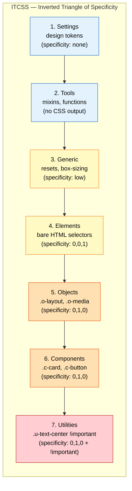
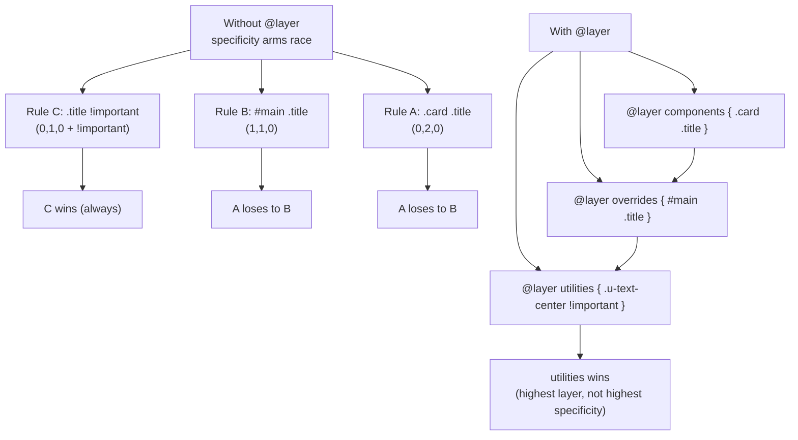

# 1.12 CSS Architecture

> CSS architecture is what saves a codebase from the slow rot of specificity wars, dead code, naming collisions, and the dreaded "I can't change this rule without breaking three other things." This note covers the problems architecture solves, every major methodology — BEM, OOCSS, SMACSS, ITCSS, atomic CSS, CSS Modules, CSS-in-JS, CUBE CSS — naming conventions that scale, file organization (the 7-1 pattern), when to use utility classes vs. component classes, the modern cascade-layers approach, and the inverted triangle of specificity that ties it all together.

## 1.12.1 Objective

By the end of this note you should be able to:

1. Diagnose the five canonical CSS architecture problems: specificity wars, dead code, naming collisions, source order dependence, and the global scope problem.
2. Apply the BEM (Block Element Modifier) naming convention and explain why its three-part structure makes CSS predictable.
3. Explain OOCSS (separate structure from skin, separate container from content), SMACSS (base, layout, module, state, theme), and ITCSS (the inverted triangle of specificity).
4. Reason about atomic/utility-first CSS (Tailwind, Tachyons): what it optimizes for, what it costs, and when to choose it.
5. Distinguish CSS Modules (locally-scoped class names at build time) from CSS-in-JS (runtime styles co-located with components), and explain the trade-offs.
6. Apply the CUBE CSS methodology (Composition, Utility, Block, Exception) and explain how it improves on BEM.
7. Use cascade layers (`@layer`) as a modern architectural alternative to specificity management.
8. Organise a large project's CSS with the 7-1 pattern (7 folders, 1 entry file).
9. Decide between utility classes and component classes for any given piece of UI.

## 1.12.2 Background Knowledge

CSS was designed in 1996 for documents: a few pages, a handful of selectors, one stylesheet. It has three properties that fight back against large-scale application code:

1. **Everything is global by default.** A rule like `.button { ... }` applies to every element with class `button`, everywhere, in every page that loads the stylesheet. There is no built-in scoping.
2. **Specificity is a flat, ordered tuple.** Two rules of equal specificity are resolved by source order. Developers reach for `!important` or chain selectors (`#main .button.button`) to "win" — and the cascade becomes an arms race.
3. **CSS doesn't know what's unused.** A class can be removed from the HTML and the CSS rule will sit there forever, indistinguishable from active code. CSS has no tree-shaking.

CSS preprocessors (Sass, Less) added variables, nesting, and mixins in the late 2000s, which helped with reuse but did nothing about scope. The architectural methodologies (OOCSS in 2009, BEM in 2010, SMACSS in 2011, ITCSS in 2015) were reactions to the global-scope problem: they used **convention** to fake scoping. Atomic CSS (2013 onwards) took the opposite approach — embrace the global scope but make every class so small and single-purpose that collisions are unlikely. CSS Modules (2015) and CSS-in-JS (2014+) used **build-time and runtime transformations** respectively to actually scope class names. Cascade layers (`@layer`, shipped 2022) are the first native CSS feature that lets you control the cascade order explicitly — the architectural problem is finally being solved at the language level.

> [!note] There is no single "best" methodology. The right choice depends on team size, project type, browser-support targets, and tooling. Most modern codebases use a hybrid: utility classes for low-level styling, BEM-ish component classes for composite UI, and `@layer` to manage framework overrides.

## 1.12.3 Core Concepts

### 1.12.3.1 The Five Problems Architecture Solves

1. **Specificity wars.** When developers escalate specificity (`#id`, `!important`, chained selectors) to override earlier rules, the codebase becomes brittle. Eventually nobody can predict what wins.
2. **Dead code.** Without tooling, you can't tell which CSS is still referenced by the HTML. Codebases accumulate thousands of unused rules.
3. **Naming collisions.** `.button` is too generic — it'll clash with a third-party library's `.button` or your own `.button` from three years ago.
4. **Source order dependence.** When specificity is equal, the rule written last wins. That means a rule's effect depends on its position in the file, which makes refactoring dangerous.
5. **Global scope.** Every rule is global by default, so every new rule potentially affects every existing element. There's no encapsulation.

### 1.12.3.2 BEM: Block Element Modifier

BEM's central idea: every class name encodes its role in the component hierarchy. The format is `block__element--modifier`.

- **Block**: a standalone entity (`.card`, `.menu`, `.button`).
- **Element**: a part of a block, with a double underscore (`.card__title`, `.menu__item`).
- **Modifier**: a variant of a block or element, with double dashes (`.button--primary`, `.card--highlighted`).

```html
<article class="card card--featured">
  
  <h2 class="card__title">Title</h2>
  <p class="card__body">Body text.</p>
  <a class="card__cta button button--primary" href="#">Read more</a>
</article>
```

```css
.card { padding: 1rem; border-radius: 12px; background: white; }
.card--featured { border: 2px solid var(--brand); }
.card__image { width: 100%; border-radius: 8px; }
.card__title { font-size: 1.5rem; margin: 0.5rem 0; }
.card__body { color: #555; line-height: 1.6; }

.button { padding: 0.5rem 1rem; border-radius: 4px; }
.button--primary { background: var(--brand); color: white; }
```

The rules are:

1. **Every selector is a single class.** No `.card .card__title` descendant selectors. The class name itself encodes the relationship.
2. **Modifiers never stand alone.** Always `<button class="button button--primary">`, never `<button class="button--primary">`.
3. **No tag names or IDs in selectors.** Single classes only — flat specificity.

The payoff: every selector has specificity `(0,1,0)`, so source order alone resolves conflicts. The class names are ugly but self-documenting and unique.

### 1.12.3.3 OOCSS: Object-Oriented CSS

Two principles:

1. **Separate structure from skin.** A button's structure (padding, border-radius, display) is one class; its skin (color, background, shadow) is another. Combine them in the markup: `<button class="btn btn-primary">`.
2. **Separate container from content.** Don't style an element based on where it lives. A `.card` should look the same whether it's in a sidebar or the main column. Avoid `.sidebar .card { ... }`.

OOCSS was influential but didn't prescribe a naming convention, so teams that adopted it often layered BEM on top.

### 1.12.3.4 SMACSS: Scalable and Modular Architecture for CSS

Categorises CSS rules into five buckets:

1. **Base** — element selectors and resets (`html`, `body`, `a { color: ... }`).
2. **Layout** — structural containers (`.l-grid`, `.l-header`, `.l-sidebar`).
3. **Module** (later renamed Component) — discrete UI pieces (`.card`, `.nav`, `.button`).
4. **State** — conditional appearance (`.is-hidden`, `.is-active`, `.is-collapsed`). State classes are prefixed `is-` and can override module styles.
5. **Theme** — theme-specific overrides (`.theme-dark .card { ... }`).

The categorisation drives file organisation (`base/`, `layout/`, `modules/`, `state/`, `themes/`) and a rule: state classes should be `!important` because they represent an explicit user/system state and must win.

### 1.12.3.5 ITCSS: Inverted Triangle CSS

Organises CSS as a series of layers, from wide-and-generic at the top to narrow-and-specific at the bottom. The triangle's axes are **specificity** (low at top, high at bottom) and **explicitness** (generic at top, explicit at bottom).

The standard layers (top to bottom):

1. **Settings** — design tokens (Sass variables, custom properties).
2. **Tools** — mixins and functions (preprocessor-only).
3. **Generic** — resets, normalize, box-sizing.
4. **Elements** — bare element selectors (`h1`, `a`, `ul`).
5. **Objects** — structure-only classes (`.o-media`, `.o-layout`) — OOCSS-style.
6. **Components** — UI classes (`.c-card`, `.c-button`) — BEM-style.
7. **Utilities** — single-property helpers (`.u-margin-top-0`, `.u-text-center`) — high specificity, `!important` allowed.

The triangle's principle: nothing in a higher layer should depend on anything in a lower layer. Specificity rises monotonically down the triangle, so a utility class can always override a component class which can always override an element selector.

### 1.12.3.6 Atomic CSS and Utility-First

Atomic CSS (Tailwind is the dominant implementation) takes the OOCSS "separate structure from skin" idea to its logical extreme: every class is a single property-value pair. Instead of `.button { padding: 0.5rem 1rem; border-radius: 4px; background: blue; color: white; }`, you write:

```html
<button class="px-4 py-2 rounded bg-blue-600 text-white">Save</button>
```

Each utility class is one declaration: `.px-4 { padding-left: 1rem; padding-right: 1rem; }`. The class names are generated from a configuration of design tokens (spacing scale, color palette, breakpoints).

Pros:
- No naming. You don't invent class names; you compose utilities.
- Small file size after PurgeCSS / JIT compilation: only the utilities you use end up in the bundle.
- Consistency: the spacing and color scales are baked into the utilities, so it's hard to use a non-token value.
- Refactoring is local: changing a button is `cmd-F` for the markup, not chasing rules across stylesheets.

Cons:
- HTML gets verbose: long `class=""` strings.
- Learning curve: developers must learn the utility names.
- "The button look" is repeated in every button's markup. To change all buttons, you must find every occurrence.
- Tailwind mitigates this with `@apply` and component extraction, which paradoxically reintroduces the component-class pattern.

### 1.12.3.7 CSS Modules

CSS Modules are a build-time transformation. You write:

```css
/* Button.module.css */
.button { padding: 0.5rem 1rem; }
.primary { background: var(--brand); color: white; }
```

```jsx
import styles from "./Button.module.css";
<button className={`${styles.button} ${styles.primary}`}>Save</button>
```

The bundler (Webpack, Vite, etc.) renames `.button` to something like `Button_button__3a8fK` — a unique, file-scoped name. There is no global scope. There are no collisions. The class is effectively a private implementation detail of the component.

Pros: true scoping, no naming convention needed, dead code elimination (unused classes are tree-shaken). Cons: it's tied to a build step and a JS framework; you can't style a class from outside its component without escape hatches (`:global()`).

### 1.12.3.8 CSS-in-JS

CSS-in-JS (styled-components, Emotion, Stitches) moves styles into JavaScript, co-located with the component:

```jsx
const Button = styled.button`
  padding: 0.5rem 1rem;
  background: ${props => props.primary ? "var(--brand)" : "transparent"};
  color: ${props => props.primary ? "white" : "var(--brand)"};
`;
```

Pros: styles have access to component props and theme; class names are auto-scoped; dead code is eliminated with the component. Cons: runtime cost (older libs inject styles at render time), tighter coupling between styles and JS, harder for designers to work in, and the React Server Components era doesn't love runtime style injection. Modern variants (Vanilla Extract, Panda CSS, Linaria) move the extraction to build time, eliminating the runtime cost.

> [!warning] CSS-in-JS has fallen out of favor since 2023, especially with React Server Components. Vanilla-extract, CSS Modules, and Tailwind are the modern defaults. Don't reach for styled-components on a new project without a specific reason.

### 1.12.3.9 CUBE CSS

CUBE (Composition, Utility, Block, Exception) is Bearded One (Andy Bell)'s methodology, designed for the modern CSS era (custom properties, `:where()`, cascade layers). It's a response to BEM's "single class" rule feeling restrictive when utilities and custom properties exist.

- **Composition** — layout primitives (`flex`, `grid`, `flow`) applied via composition classes that use `:where()` for zero specificity.
- **Utility** — single-purpose classes (`mt-4`, `text-center`).
- **Block** — the equivalent of a BEM block (`.card`, `.button`).
- **Exception** — explicit overrides via custom properties or data attributes (`data-theme="dark"`).

Example:

```html
<article class="card flow bg-surface radius-m" data-theme="dark">
  <h2 class="card__title">Title</h2>
  <p class="card__body">Body.</p>
</article>
```

The composition class `flow` adds vertical rhythm; the utility `bg-surface` sets the surface color; `radius-m` sets the border radius. The block `card` adds card-specific styling. The exception `data-theme="dark"` overrides via custom properties.

### 1.12.3.10 Cascade Layers (@layer)

Cascade layers are the first native CSS feature that lets you control cascade order explicitly. You declare layers in order, and rules in earlier-declared layers are overridden by rules in later-declared layers, **regardless of specificity**.

```css
@layer reset, base, components, utilities;

@layer reset {
  * { box-sizing: border-box; margin: 0; }
}

@layer base {
  body { font-family: system-ui; line-height: 1.5; }
  a { color: var(--brand); }
}

@layer components {
  .button { padding: 0.5rem 1rem; border-radius: 4px; }
}

@layer utilities {
  .u-text-center { text-align: center !important; }
}
```

A rule in `utilities` always beats a rule in `components`, even if the components rule has higher specificity. Unlayered rules always beat layered rules (so a third-party stylesheet loaded without layers will override your layered code — be careful).

Cascade layers let you implement ITCSS-style architecture natively, without depending on source order or naming conventions. They are the modern alternative to ITCSS's inverted triangle.

### 1.12.3.11 The 7-1 Pattern

A file-organisation pattern, originally from Hugo Giraudel. Seven folders, one entry file:

```
styles/
  base/         # resets, element styles
  components/   # buttons, cards, etc.
  layout/       # header, footer, grid
  pages/        # page-specific styles
  themes/       # theme overrides
  utils/        # variables, mixins, functions
  vendors/      # third-party CSS
  main.scss     # imports everything in the right order
```

Each folder has many small files; `main.scss` imports them in the order dictated by your methodology (typically: vendors  -->  utils  -->  base  -->  layout  -->  components  -->  pages  -->  themes).

## 1.12.4 Detailed Walkthrough

### 1.12.4.1 Choosing a Methodology

Use this rough decision tree:

- **Solo, simple project, no framework**: BEM. Low overhead, predictable, no tooling required.
- **Team, mid-size project, no framework**: BEM with the 7-1 pattern, possibly with cascade layers.
- **React, Vue, or other component framework**: CSS Modules per component, with a small utility layer for layout primitives.
- **Team that values design-system consistency**: Tailwind (or a custom utility-first system) plus extracted component classes for repeated patterns.
- **Large organisation, many teams, design system**: ITCSS or CUBE CSS with cascade layers, custom properties as design tokens, BEM-style naming within component blocks.
- **Existing pre-cascade-layers codebase**: introduce `@layer` incrementally to tame specificity wars without rewriting everything.

### 1.12.4.2 BEM in Practice

BEM shines for component-driven development. The key disciplines are:

1. **Don't nest selectors.** `.card .card__title` is forbidden. The HTML structure is encoded in the class name, so descendant selectors are redundant and create specificity drift.
2. **Modifiers always include the base class.** `<button class="button button--primary">`, not `<button class="button--primary">`. The base class provides defaults; the modifier overrides.
3. **Don't make elements of elements.** `.card__header__title` is wrong. The element hierarchy is flat: `.card__title`, `.card__header`, `.card__image` are all direct children of `.card`, regardless of DOM nesting depth.
4. **Mix blocks.** An element can be both a block in its own right and an element of another block: `<a class="card__cta button">`. The card uses it as a CTA; the button styles come from the `.button` block.

```css
.card { /* card-specific properties only */ }
.card__title { /* title-specific properties only */ }
.button { /* button structure */ }
.button--primary { /* button variant */ }
```

### 1.12.4.3 ITCSS Layers in Practice

A typical ITCSS file structure:

```
styles/
  settings/     # _colors.scss, _typography.scss
  tools/        # _mixins.scss, _functions.scss
  generic/      # _reset.scss, _box-sizing.scss
  elements/     # _headings.scss, _links.scss, _forms.scss
  objects/      # _media.scss, _layout.scss
  components/   # _card.scss, _button.scss
  utilities/    # _spacing.scss, _text.scss
  main.scss
```

`main.scss`:

```scss
@layer settings, tools, generic, elements, objects, components, utilities;

@import "settings/colors";
@import "settings/typography";
/* ... etc ... */
```

(With cascade layers, the ITCSS layer order is enforced by the `@layer` declaration rather than by source order — a major improvement.)

### 1.12.4.4 Cascade Layers in Practice

A modern React + design-system setup might look like:

```css
@layer reset, framework, tokens, components, utilities;

@import "normalize.css" layer(framework);
@import "@my-design-system/tokens.css" layer(tokens);

@layer reset {
  *, *::before, *::after { box-sizing: border-box; }
}

@layer components {
  .my-button { /* ... */ }
}

@layer utilities {
  .u-text-center { text-align: center; }
}
```

Third-party libraries that don't declare layers will fall into the implicit "unlayered" bucket, which always beats layered styles. That means your design system's layered rules can be overridden by the third-party CSS — which is sometimes what you want (third-party widget styling wins) and sometimes not (third-party CSS leaks into your components). Decide deliberately and use `@layer` to import third-party CSS into a named layer when you want to control it.

### 1.12.4.5 Utilities vs Components

The eternal debate. The pragmatic answer:

- Use **utilities** for low-level, single-property concerns that don't carry semantic meaning: spacing, text alignment, display, flex/grid layout, color shortcuts.
- Use **component classes** for composite UI that has a name and a purpose: `.card`, `.button`, `.modal`, `.nav`.
- Use **custom properties** for theme-able values: `--brand`, `--space`, `--font-size`.
- Use **data attributes** for state: `[data-state="open"]`, `[data-theme="dark"]`.

A button styled with utilities:

```html
<button class="px-4 py-2 rounded bg-blue-600 text-white font-medium">Save</button>
```

A button styled with a component class:

```html
<button class="button button--primary">Save</button>
```

The component class version is shorter and self-documenting, and changing all buttons means changing one rule. The utility version is more flexible (every button can be unique) but creates duplication and inconsistency. Most teams converge on a hybrid: a component class for the common case, utilities for one-off tweaks.

### 1.12.4.6 Naming Conventions That Scale

Whatever you choose, the conventions to enforce:

1. **Lowercase, hyphen-separated class names.** `.card-title`, not `.cardTitle` or `.card_title`.
2. **Prefix non-component classes by role.** `u-` for utilities, `o-` for objects, `l-` for layout, `is-`/`has-` for state, `js-` for JS hooks (never styled).
3. **Component classes are nouns; state classes are adjectives.** `.button` and `.button--primary`; `.is-loading`, `.is-open`.
4. **Don't abbreviate.** `.btn` will be searched for; `.button` is clearer and the bytes are negligible after gzip.

## 1.12.5 Practical Examples

### 1.12.5.1 A Card Component in BEM

```html
<article class="card card--featured">
  <div class="card__media">
    
  </div>
  <div class="card__body">
    <h2 class="card__title">Title</h2>
    <p class="card__text">Body text.</p>
    <a class="card__action button button--primary" href="#">Read more</a>
  </div>
</article>
```

```css
.card { display: grid; gap: 1rem; padding: 1rem; border-radius: 12px; background: white; }
.card--featured { border: 2px solid var(--brand); }
.card__media { aspect-ratio: 16/9; }
.card__image { width: 100%; height: 100%; object-fit: cover; }
.card__title { font-size: 1.5rem; }
.card__text { color: var(--muted); }
.card__action { display: inline-block; }

.button { padding: 0.5rem 1rem; border-radius: 4px; text-decoration: none; }
.button--primary { background: var(--brand); color: white; }
```

### 1.12.5.2 The Same Card in CUBE CSS

```html
<article class="card [ flow ] [ bg-surface radius-m ]" data-featured>
  
  <h2 class="card__title">Title</h2>
  <p class="card__text">Body text.</p>
  <a class="card__action button" data-variant="primary" href="#">Read more</a>
</article>
```

```css
.card { display: grid; gap: 1rem; padding: 1rem; }
.card[data-featured] { border: 2px solid var(--brand); }
.card__image { width: 100%; aspect-ratio: 16/9; object-fit: cover; }
.card__title { font-size: 1.5rem; }
.card__text { color: var(--muted); }

.button { padding: 0.5rem 1rem; border-radius: 4px; text-decoration: none; }
.button[data-variant="primary"] { background: var(--brand); color: white; }

/* Composition class with zero specificity */
.flow > * + * { margin-top: 1rem; }

/* Utility classes */
.bg-surface { background: var(--surface, white); }
.radius-m { border-radius: 12px; }
```

Note the `[ flow ]` brackets — a CUBE convention to visually separate composition classes from utilities.

### 1.12.5.3 The Same Card as a CSS Module

```jsx
// Card.jsx
import styles from "./Card.module.css";

export function Card({ featured, image, title, text, action }) {
  return (
    <article className={`${styles.card} ${featured ? styles.featured : ""}`}>
      
      <h2 className={styles.title}>{title}</h2>
      <p className={styles.text}>{text}</p>
      <a className={styles.action} href={action.href}>{action.label}</a>
    </article>
  );
}
```

```css
/* Card.module.css */
.card { display: grid; gap: 1rem; padding: 1rem; border-radius: 12px; background: white; }
.featured { border: 2px solid var(--brand); }
.image { width: 100%; aspect-ratio: 16/9; object-fit: cover; }
.title { font-size: 1.5rem; }
.text { color: var(--muted); }
.action { /* ... */ }
```

No BEM-style long names needed because each module is scoped. No `card__title` — just `.title`, scoped to `Card.module.css`.

## 1.12.6 Mermaid Diagrams

### ITCSS Inverted Triangle



### Cascade Layers Resolve Specificity Wars



## 1.12.7 Common Mistakes

1. **Mixing methodologies.** Half your codebase in BEM, half in utility classes, half in OOCSS — nobody can predict what overrides what. Pick one primary approach and stick to it.
2. **Nesting BEM selectors.** `.card .card__title { ... }` defeats the purpose. BEM relies on flat selectors; the class name encodes the hierarchy.
3. **Using IDs in CSS.** IDs have specificity `(1,0,0)`, which is hard to override without `!important` or another ID. Use classes only.
4. **`!important` as a routine override.** If you find yourself adding `!important`, you have a specificity problem. Fix the architecture rather than escalating.
5. **Adding state classes without `is-`/`has-` prefixes.** `.active`, `.open`, `.selected` are too generic and clash. `.is-active`, `.is-open`, `.is-selected` are scoped and obvious.
6. **Styling `js-` prefixed classes.** The `js-` prefix is a contract: this class is a JS hook, not for styling. Breaking the contract couples your CSS to your JS implementation.
7. **Forgetting to import third-party CSS into a layer.** Without `layer(...)`, third-party CSS falls into the unlayered bucket and overrides your layered code. That can be intentional, but more often it's an accident.
8. **Building everything in atomic utilities.** Some teams reach for Tailwind's `@apply` to recreate `.button` — and end up with the worst of both worlds (component classes plus verbose utility-style internals). Be deliberate about the boundary.
9. **Letting design tokens drift.** If your codebase has both `var(--brand)` and `#3460ff` in raw form, you've lost the single-source-of-truth benefit. Lint for raw color values.

## 1.12.8 Best Practices

1. **Pick one methodology and document it.** A README in your `styles/` folder explaining "we use BEM with cascade layers and a utilities layer" is worth a hundred ad-hoc decisions.
2. **Use cascade layers to manage framework and third-party CSS.** `@import "tailwind" layer(framework)` and `@import "react-datepicker" layer(vendor)` keep third-party styles from leaking into your components.
3. **Define design tokens in a single place.** Use `:root` custom properties or a Sass/JSON token file. Lint against raw values that should be tokens.
4. **Default to single-class selectors.** Descendant selectors create specificity drift. If you can encode the relationship in a class name (BEM) or a custom property, do.
5. **Use `:where()` for low-specificity composition classes.** `.flow > * + * { margin-top: 1rem; }` written as `.flow :where(> * + *) { ... }` (or just `:where(.flow) > * + *`) keeps the utility at zero specificity so components can override.
6. **Prefix by role.** `u-` for utilities, `o-` for objects, `l-` for layout, `is-` for state, `js-` for hooks. The prefixes make intent obvious.
7. **Run PurgeCSS or use Tailwind's JIT** to eliminate unused CSS in production. A 50 KB stylesheet with 40 KB unused is a performance problem.
8. **Adopt the 7-1 pattern (or similar) for large projects.** Many small files in categorical folders, one entry point that imports in order.
9. **Test for dead code with a tool like PurgeCSS or coverage reports.** A quarterly audit that removes unused rules is the only way to keep CSS healthy over years.
10. **Prefer native features (cascade layers, custom properties, `:where()`) over tooling-based scoping when possible.** They work without a build step and survive framework churn.

## 1.12.9 Mini Exercises

### Exercise 1: BEM-ify a Component

Convert this HTML and CSS to BEM. Identify the blocks, elements, and modifiers.

```html
<div class="user-profile">
  
  <h3 class="name">Ada Lovelace</h3>
  <p class="bio">Mathematician.</p>
  <button class="follow-btn">Follow</button>
</div>
```

```css
.user-profile .avatar { width: 80px; }
.user-profile .name { font-size: 1.25rem; }
.user-profile .bio { color: gray; }
.user-profile .follow-btn { background: blue; color: white; }
```

**Worked solution.**

Blocks: `user-profile` (the whole card), `button` (the follow button is reusable). Elements of `user-profile`: `avatar`, `name`, `bio`. (The follow button is not an element of `user-profile`; it's a `button` block that happens to live inside `user-profile`.)

```html
<div class="user-profile">
  
  <h3 class="user-profile__name">Ada Lovelace</h3>
  <p class="user-profile__bio">Mathematician.</p>
  <button class="button button--primary user-profile__action">Follow</button>
</div>
```

```css
.user-profile { display: grid; gap: 1rem; }
.user-profile__avatar { width: 80px; }
.user-profile__name { font-size: 1.25rem; }
.user-profile__bio { color: var(--muted); }
.user-profile__action { /* positions the button in the card */ }

.button { padding: 0.5rem 1rem; border-radius: 4px; border: none; cursor: pointer; }
.button--primary { background: var(--brand); color: white; }
```

Key changes:

- All selectors are single classes (no descendant combinators).
- The button is treated as its own block (`button button--primary`) plus the `user-profile__action` mix to position it inside the card.
- CSS variables (`--muted`, `--brand`) replace raw colors.

**Common wrong approach.** Using `.user-profile__follow-btn` as the button class. That makes the button a private element of `user-profile` instead of a reusable block. BEM's rule: if something is reusable, it's a block; if it's a part of one specific block, it's an element. The follow button could appear elsewhere (a suggestion list, a profile page), so it should be a `button` block.

### Exercise 2: Migrate ITCSS to Cascade Layers

You have an ITCSS-ordered main.scss with imports. Migrate it to use cascade layers without changing any rule contents.

**Worked solution.**

Before:

```scss
@import "settings/colors";
@import "tools/mixins";
@import "generic/reset";
@import "elements/headings";
@import "objects/layout";
@import "components/card";
@import "utilities/spacing";
```

After:

```scss
@layer settings, tools, generic, elements, objects, components, utilities;

@import "settings/colors" layer(settings);
@import "tools/mixins" layer(tools);
@import "generic/reset" layer(generic);
@import "elements/headings" layer(elements);
@import "objects/layout" layer(objects);
@import "components/card" layer(components);
@import "utilities/spacing" layer(utilities);
```

(Or in plain CSS without a preprocessor: declare `@layer` once at the top, then wrap each file's contents in `@layer name { ... }`.)

Now the layer order is enforced by the `@layer` declaration, not by source order. A `utilities` rule will always beat a `components` rule, even if the components rule has higher specificity (e.g. `.card .title` vs. `.u-text-center`). Source order within a layer still matters, but the layer hierarchy is the dominant axis.

**Common wrong approach.** Declaring `@layer` in every file separately. Each `@layer` declaration extends the layer list; if multiple files declare layers in different orders, the *first* declaration seen wins. Best practice: declare the full layer order in one place (the entry file) before any imports, then use `@layer name { ... }` in the individual files.

### Exercise 3: Decide Between a Utility and a Component Class

You have a "stack of items with vertical spacing" pattern that appears in 12 places across the site. Should it be a utility (`u-stack`) or a component class?

**Worked solution.**

This is a composition utility — it doesn't carry semantic meaning, it just enforces vertical rhythm. It belongs in the utilities layer.

```css
@layer utilities {
  .u-stack > * + * { margin-top: var(--stack-gap, 1rem); }
}
```

Usage:

```html
<div class="u-stack">
  <h2>Heading</h2>
  <p>Body.</p>
</div>

<ul class="u-stack">
  <li>Item 1</li>
  <li>Item 2</li>
</ul>
```

The custom property `--stack-gap` lets each instance override the gap inline or via a parent rule, making the utility composable:

```html
<div class="u-stack" style="--stack-gap: 2rem;">
  ...
</div>
```

If the spacing were always 1rem and you wanted consistency, a fixed utility would also work. The custom-property approach is more flexible and survives a redesign.

**Common wrong approach.** Making it a component class `.stack` (without the `u-` prefix). That puts it in the components layer, where it has the same specificity as `.card`, `.button`, etc., and could be overridden by them. Composition utilities belong in the utilities layer so they reliably win when needed and reliably don't when a component has a more specific layout requirement.

### Exercise 4: Scope a Third-Party Widget's CSS

You import a datepicker library that ships a global stylesheet. Its rules are leaking into your own CSS (e.g. its `.input` class is affecting your form inputs). Fix it with cascade layers without modifying the library.

**Worked solution.**

```css
@layer reset, vendors, framework, components, utilities;

@import url("datepicker.css") layer(vendors);
```

Now every rule in `datepicker.css` is in the `vendors` layer, which is below `components` and `utilities`. Your own `.input` rules in the `components` layer will override the datepicker's `.input` rules in `vendors`, regardless of specificity.

If the datepicker uses higher-specificity selectors that still need overriding, you can also use `:where()` to keep your overrides at zero specificity inside the components layer:

```css
@layer components {
  /* This will beat datepicker's .input in vendors because components is later than vendors */
  :where(.my-app) .input { border: 2px solid var(--border); }
}
```

**Common wrong approach.** Adding `!important` to your overrides. That works but creates a new arms race — the next time you need to override your own override, you have to escalate further. Cascade layers solve the problem at the architectural level without `!important`.

### Exercise 5: Convert a Styled-Components Component to CSS Modules

You have a styled-components button:

```jsx
import styled from "styled-components";

const Button = styled.button`
  padding: 0.5rem 1rem;
  border-radius: 4px;
  background: ${props => props.variant === "primary" ? "var(--brand)" : "transparent"};
  color: ${props => props.variant === "primary" ? "white" : "var(--brand)"};
`;
```

Convert it to a CSS Module.

**Worked solution.**

```css
/* Button.module.css */
.button {
  padding: 0.5rem 1rem;
  border-radius: 4px;
}
.button[data-variant="primary"] {
  background: var(--brand);
  color: white;
}
.button[data-variant="ghost"] {
  background: transparent;
  color: var(--brand);
}
```

```jsx
import styles from "./Button.module.css";

export function Button({ variant = "ghost", ...props }) {
  return <button className={styles.button} data-variant={variant} {...props} />;
}
```

The variant is now a data attribute, and the styling decisions live in the CSS file where designers can find them. No runtime CSS injection; styles are static and cached. The component is simpler — it just renders a button with a data attribute — and the CSS doesn't depend on JS props being interpolated.

**Common wrong approach.** Keeping the JS-driven interpolation by using CSS custom properties:

```jsx
<button style={{ "--bg": variant === "primary" ? "var(--brand)" : "transparent" }} className={styles.button}>
```

That works but moves the styling logic into JS, which defeats the purpose of CSS Modules. Use data attributes for variants and let CSS handle the conditional styling. It's more cacheable, more debuggable, and easier for designers to edit.

## 1.12.10 Summary

CSS architecture is the discipline of structuring styles so a codebase can grow without collapsing into specificity wars and dead code. The five canonical problems are global scope, specificity escalation, dead code, naming collisions, and source order dependence. The major methodologies address them with different trade-offs: BEM (flat single-class selectors with semantic naming), OOCSS (separate structure from skin), SMACSS (five rule categories), ITCSS (the inverted triangle of specificity), atomic CSS (single-property utilities), CSS Modules (build-time scoping), CSS-in-JS (runtime scoping, falling out of favor), CUBE CSS (modern hybrid with composition, utility, block, exception), and cascade layers (native control of cascade order). The 7-1 pattern organises files. Modern codebases typically combine: cascade layers for architecture, custom properties for tokens, BEM-style classes for components, utility classes for layout, and CSS Modules or Tailwind for component-scoped styling. Pick one methodology, document it, lint against violations, and audit dead code quarterly.

## 1.12.11 Related Notes

- [[1.1 CSS Foundations]] — the cascade algorithm that architectures try to manage.
- [[1.2 Selectors and Cascade]] — specificity arithmetic and cascade layers (`@layer`) in detail.
- [[1.8 Variables, Functions, and Calculations]] — custom properties as design tokens.
- [[1.10 Pseudo-Elements and Pseudo-Classes]] — `:where()` for zero-specificity utilities.
- [[1.11 Accessibility in CSS]] — semantic HTML as the foundation; don't replace `<button>` with `<div class="btn">`.
- [[1.13 CSS Performance]] — dead code elimination (PurgeCSS), critical CSS, and file size.
