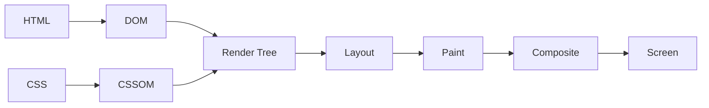
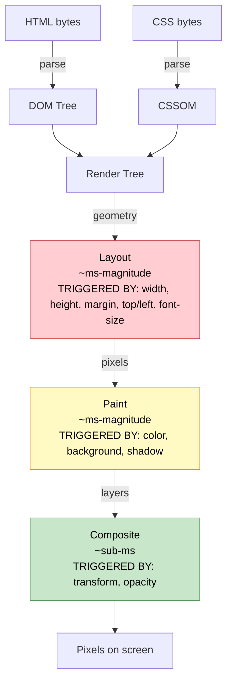
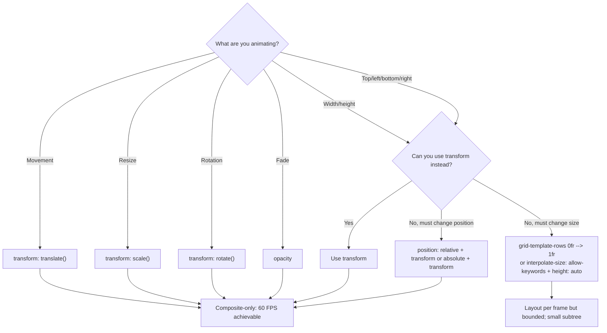

# 1.13 CSS Performance

> CSS performance is the discipline of making the browser do the least possible work to render and keep your UI smooth. It covers the rendering pipeline (style  -->  layout  -->  paint  -->  composite), repaint vs. reflow and what triggers each, why `transform` and `opacity` are the only cheap-to-animate properties, the `contain` and `content-visibility` properties for opt-in performance isolation, `will-change` (when to use and when not to), reducing file size (PurgeCSS, cssnano, critical CSS), loading CSS without blocking render (preload, media swap), font loading strategies (`font-display`, FOUT vs. FOIT, variable fonts), the cost of `@import`, and modern CSS features that improve performance.

## 1.13.1 Objective

By the end of this note you should be able to:

1. Describe the browser's rendering pipeline (style  -->  layout  -->  paint  -->  composite) and which work each stage does.
2. Distinguish **repaint** from **reflow** (layout), list which CSS properties trigger each, and explain why `transform` and `opacity` are cheap.
3. Recognise **layout thrashing** and **forced synchronous layout** in code, and write JavaScript that avoids them.
4. Use `contain: layout | paint | strict | content` to scope browser work.
5. Use `content-visibility: auto` to skip rendering for off-screen content, and explain its accessibility implications.
6. Use `will-change` correctly: just-in-time, removed when done, never globally.
7. Reduce CSS file size with PurgeCSS, cssnano, and critical-CSS extraction.
8. Load CSS without blocking render via `rel="preload"`, media-swap, and HTTP/2 push.
9. Implement font-loading strategies that avoid FOIT (Flash of Invisible Text) and minimize FOUT (Flash of Unstyled Text), and explain why variable fonts help.
10. Avoid the cost of `@import` in production CSS.

## 1.13.2 Background Knowledge

The browser turns HTML and CSS into pixels through a pipeline:

1. **Parse HTML**  -->  build the DOM.
2. **Parse CSS**  -->  build the CSSOM.
3. **Combine** DOM + CSSOM  -->  the render tree (only visible elements; `display: none` is excluded).
4. **Layout** (also called *reflow*)  -->  compute the geometry (position, size) of every render-tree node.
5. **Paint**  -->  fill in pixels for each node (text, colors, images, shadows).
6. **Composite**  -->  combine the painted layers into the final screen image, applying transforms and opacity on the GPU.

Each stage depends on the previous one. A change that invalidates **layout** forces layout, paint, *and* composite to re-run for the affected subtree. A change that invalidates **paint** (but not layout) skips layout, but paint and composite re-run. A change that only affects **composite** (transforms, opacity) skips both layout and paint.

> [!note] The single most important CSS performance fact: animating `transform` and `opacity` only re-runs the composite stage, which runs on the GPU compositor thread, off the main thread. Animating `width`, `top`, `margin`, etc. re-runs layout, paint, and composite on the main thread and will jank under load.

CSS performance has two distinct dimensions:

1. **First render** — how long until the user sees content. This depends on CSS file size, blocking behaviour, and font loading.
2. **Runtime smoothness** — frame rate during interaction. This depends on which properties you animate and how the layout/paint cost is structured.

This note covers both.

## 1.13.3 Core Concepts

### 1.13.3.1 The Rendering Pipeline



The pipeline is incremental. The browser tries to batch updates: many small style changes typically cause one layout, one paint, one composite per frame. But certain operations — like reading a layout property (`offsetWidth`) right after writing one — force layout to run synchronously, which is the source of **layout thrashing**.

### 1.13.3.2 Repaint vs. Reflow

- **Reflow** (a.k.a. **layout**) is recomputing the geometry of the page. Triggered by changes to: `width`, `height`, `margin`, `padding`, `border`, `position`, `top`, `left`, `right`, `bottom`, `float`, `clear`, `display`, `font-family`, `font-size`, `font-weight`, `text-align`, `line-height`, `white-space`, `overflow`, `box-sizing`, `flex`/`grid` properties, and many more. Anything that affects the size or position of any element triggers reflow.
- **Repaint** is recomputing the pixels of an element without changing its geometry. Triggered by: `color`, `background`, `background-color`, `background-image`, `border-color`, `box-shadow`, `text-decoration`, `visibility` (visibility doesn't reflow because the box still occupies space), `outline`.

Reflow is more expensive than repaint because reflow also forces a repaint of the affected subtree (and possibly its siblings and ancestors). Repaint skips layout.

### 1.13.3.3 Composite-Only Changes

`transform` and `opacity` (and `filter` in some cases) are the only properties that skip both layout and paint. The element is already painted into a layer texture; the compositor multiplies a matrix (transform) or sets an alpha (opacity) and re-blits. No main-thread work in the steady state.

That is why every CSS animation guide says: **animate `transform` and `opacity`**. Movement via `transform: translate*`, resize via `transform: scale()`, rotation via `transform: rotate()`, fade via `opacity`. Anything else triggers layout or paint.

### 1.13.3.4 Layout Thrashing

Layout thrashing happens when JavaScript interleaves **writes** and **reads** to layout-affecting properties:

```js
// BAD — causes layout thrashing
elements.forEach(el => {
  el.style.width = el.offsetWidth + 10 + "px";  // read then write per element
});
```

Each `offsetWidth` read forces the browser to flush any pending layout writes synchronously, then compute layout, then return the value. Then the write dirties layout again. So the browser does N layout passes instead of 1.

Fix: batch reads and writes.

```js
// GOOD — batched
const widths = elements.map(el => el.offsetWidth);   // all reads first
elements.forEach((el, i) => el.style.width = widths[i] + 10 + "px"); // all writes after
```

Or use `requestAnimationFrame` to defer writes to the next frame.

### 1.13.3.5 The contain Property

`contain` tells the browser that an element's subtree is independent of the rest of the page in some respect, so changes inside it don't invalidate the rest of the page. Values can be combined:

- `contain: layout` — layout inside the element doesn't affect outside.
- `contain: paint` — the element's descendants don't paint outside its bounds (also clips overflow).
- `contain: size` — the element's size is independent of its contents (you must give it an explicit size).
- `contain: style` — scoped counters and quotes (rarely needed).
- `contain: strict` = `layout paint size` (everything except `style`).
- `contain: content` = `layout paint` (safer default; doesn't require explicit size).

```css
.card { contain: content; }
.widget-list { contain: layout; }
```

Use cases: long lists of independent cards, third-party widgets that shouldn't affect surrounding layout, isolating paint cost for complex backgrounds.

### 1.13.3.6 content-visibility: auto

`content-visibility: auto` tells the browser to skip rendering work for off-screen elements:

```css
.page-section { content-visibility: auto; contain-intrinsic-size: 0 500px; }
```

When the element is off-screen, the browser skips layout, paint, and even style computation for it. When it scrolls into view, the work happens. `contain-intrinsic-size` provides a placeholder size so the scrollbar doesn't jump.

> [!warning] `content-visibility: auto` skips rendering for off-screen content, which means in-page search (Ctrl+F) won't find text in unrendered sections in some browsers. It can also confuse screen-reader virtual buffers and "find in page." Use it for content that doesn't need to be searched or announced off-screen — e.g. below-the-fold article sections, image galleries, comment threads.

### 1.13.3.7 will-change

`will-change` is a hint to the browser that an element will change soon, so the browser can pre-promote it to its own layer and pre-rasterize it. Used just-in-time, it eliminates the first-frame jank when an animation starts. Used indiscriminately, it consumes GPU memory and can *cause* jank.

```css
/* GOOD: applied just-in-time, removed after */
.menu:hover .item { will-change: transform; }
/* JS: el.style.willChange = "transform"; ... el.addEventListener("animationend", () => el.style.willChange = "auto"); */

/* BAD: applied to every element globally */
* { will-change: transform; }
```

The rule of thumb: if you're animating `transform` or `opacity` and seeing first-frame jank, add `will-change` to that one element just before the animation starts, and clear it when the animation ends. Otherwise, don't use it.

### 1.13.3.8 Reducing CSS File Size

Three tools in the modern pipeline:

1. **PurgeCSS** (or Tailwind's JIT) — analyzes your HTML/JS and removes any CSS class that doesn't appear. Can shrink a 50 KB Bootstrap file to 5 KB on a site that uses 10% of its classes.
2. **cssnano** (or Lightning CSS) — minifies CSS: removes whitespace, collapses short hands, converts colors to short forms (`#ffffff`  -->  `#fff`), drops duplicate rules, normalizes values.
3. **Critical CSS extraction** — finds the CSS rules needed to render above-the-fold content and inlines them into `<style>` tags in the HTML document head, so the first paint doesn't wait for the external stylesheet to download. Critical then async-loads the rest.

### 1.13.3.9 Loading CSS Without Blocking Render

By default, `<link rel="stylesheet">` is render-blocking: the browser won't paint anything until the CSS file is downloaded and parsed. For above-the-fold CSS this is what you want (you don't want a FOUC). For below-the-fold CSS, you can defer it:

```html
<!-- Async load: load in parallel, apply when ready -->
<link rel="preload" href="below-fold.css" as="style" onload="this.rel='stylesheet'">

<!-- Media-swap: only load when the media matches -->
<link rel="stylesheet" href="print.css" media="print">
<link rel="stylesheet" href="mobile.css" media="(max-width: 768px)">
```

`rel="preload"` with `as="style"` fetches the file at low priority without blocking; the `onload` handler flips it to a stylesheet when it arrives. The media-swap pattern lets the browser skip CSS for contexts that don't apply (e.g. print styles on screen).

### 1.13.3.10 Font Loading

When the browser encounters a `@font-face` rule with a `src` that needs to download, the default behaviour historically was to **block text rendering for up to 3 seconds** while waiting for the font — the **Flash of Invisible Text (FOIT)**. Modern browsers allow configuration via `font-display`:

- `auto` — browser default (typically FOIT in Chrome, similar in others).
- `block` — FOIT for 3s, then swap (FOUT). Use for icons.
- `swap` — show fallback immediately, swap when the font arrives (FOUT). Use for body text.
- `fallback` — very short FOIT (~100ms), then swap; new requests get a low priority.
- `optional` — like `fallback` but the browser may decide not to load the font at all if the network is slow (best for non-critical fonts).

```css
@font-face {
  font-family: "Body";
  src: url("/fonts/body.woff2") format("woff2");
  font-display: swap;
  unicode-range: U+0000-00FF; /* only Latin */
}
```

**Variable fonts** pack multiple weights, widths, and styles into a single file. Instead of shipping `Body-Regular.woff2`, `Body-Bold.woff2`, `Body-Italic.woff2` (three round-trips, three files), one variable font file covers them all. Browsers fetch once; you vary the axes with `font-weight`, `font-style`, and the lower-level `font-variation-settings`.

### 1.13.3.11 The Cost of @import

`@import url("other.css")` inside a CSS file is **render-blocking and serial**: the browser downloads the parent CSS, parses it, sees the `@import`, and only then downloads the imported file. That's a waterfall — the second file doesn't start downloading until the first is fully parsed.

For production, replace `@import` with:

- `<link rel="stylesheet">` tags in HTML (parallel download), or
- Preprocessor `@use`/`@forward` (Sass, which inlines at build time), or
- A build step that concatenates the files.

`@import` in production CSS is a performance anti-pattern. Reserve it for prototyping.

### 1.13.3.12 Modern Features That Improve Performance

- `aspect-ratio` — no more padding-bottom hacks for intrinsic sizing; the browser knows the aspect ratio before the image loads, preventing layout shift.
- `content-visibility: auto` — skip rendering off-screen content.
- `contain` — scope layout/paint work.
- `:has()` — replace some JavaScript class-swap patterns, eliminating JS-driven style recalcs.
- `@layer` — make specificity explicit, reducing the need for high-specificity overrides that increase matching cost.
- `interpolate-size: allow-keywords` — smooth height:auto transitions without JS, eliminating the layout-thrashy `scrollHeight` measurement pattern.
- `font-display: optional` — eliminate FOIT for non-critical fonts.
- Subgrid — let children share a parent's grid tracks without re-laying out.
- `view-transition-name` — name elements for the View Transitions API, which uses the compositor for smooth transitions.

## 1.13.4 Detailed Walkthrough

### 1.13.4.1 Selector Matching Cost (and Why It Matters Less Than You Think)

A persistent myth is that selector performance is critical and you should "optimize selectors." The truth: modern browsers' selector matching is extremely fast, and the cost is dwarfed by layout and paint. The original "right-to-left matching" concern is real (browsers do match selectors from the rightmost key selector outward), but for typical selectors the difference is microseconds.

The cases where selector cost actually matters:

1. **Universal selectors on huge documents.** `* { ... }` matches every element. Browsers can't use any optimization.
2. **Deeply-nested descendant selectors.** `.foo .bar .baz .qux` requires checking each `.qux`'s ancestor chain.
3. **Attribute selectors with substrings.** `[class*="card"]` is more expensive than `.card` because the browser can't use class-name lookup.
4. **`:has()` in tight loops.** `:has()` is more expensive than other pseudo-classes because the browser must check descendants. It's fast in practice, but be careful applying it to thousands of elements.

For 99% of code, don't optimize selectors. Optimize what you animate and how often you trigger reflow.

### 1.13.4.2 What Triggers What

Quick reference:

| Property | Reflow? | Repaint? | Composite? |
|---|---|---|---|
| `width`, `height`, `margin`, `padding`, `border-width`, `top/left/right/bottom`, `position`, `display`, `float`, `clear`, `font-family`, `font-size`, `font-weight`, `text-align`, `line-height`, `overflow`, `box-sizing`, `flex*`, `grid*` | Yes | Yes | Yes |
| `color`, `background-color`, `background-image`, `border-color`, `box-shadow`, `text-decoration`, `outline-color`, `visibility` | No | Yes | Yes |
| `transform`, `opacity` | No | No | Yes |

(And `filter` in most browsers: no layout, but does trigger paint.)

### 1.13.4.3 Forced Synchronous Layout

The browser normally batches layout work into a single pass per frame. But JavaScript that reads a layout property forces the browser to flush any pending writes and run layout synchronously:

```js
// BAD — forces layout N times
const items = document.querySelectorAll(".item");
items.forEach(item => {
  item.style.width = item.parentElement.offsetWidth + "px"; // read parent, write child
});
```

Each `offsetWidth` read after a `style.width` write forces layout to run. With 100 items, that's 100 layout passes.

```js
// GOOD — one read, then writes
const parentWidth = document.querySelector(".parent").offsetWidth;
items.forEach(item => {
  item.style.width = parentWidth + "px";
});
```

One layout pass total. The principle: **batch reads and writes separately; never interleave them.**

The FastDOM library formalizes this: it provides `fastdom.read(() => {...})` and `fastdom.write(() => {...})` and queues them appropriately.

### 1.13.4.4 contain in Practice

```css
.article-list { contain: layout; }
.article-card { contain: content; }
```

`contain: layout` on the list means layout changes inside the list don't invalidate the rest of the page. `contain: content` (which equals `layout paint`) on each card means a card's contents don't paint or lay out beyond the card's bounds, so changing a card's contents only invalidates that card.

For the strongest isolation, `contain: strict` (= `layout paint size`) tells the browser the element is fully independent — but you must give it an explicit size, because `size` means the element's size doesn't depend on its contents.

### 1.13.4.5 content-visibility in Practice

```css
.story { content-visibility: auto; contain-intrinsic-size: auto 500px; }
```

`auto` skips rendering for off-screen stories. `contain-intrinsic-size: auto 500px` provides a 500px-tall placeholder when off-screen so the scrollbar doesn't jump when the story renders. The `auto` keyword in `contain-intrinsic-size` (newer) remembers the element's last rendered size, which is more accurate than a fixed guess.

Use `content-visibility: auto` for:
- Long article pages with many sections.
- Image galleries.
- Comment threads below an article.
- Long lists of independent cards.

Don't use it for:
- Above-the-fold content (no benefit).
- Content the user needs to Ctrl+F search (search may skip it).
- Content with anchor links that should scroll-into-view (the placeholder size may be wrong).

### 1.13.4.6 Critical CSS Strategy

1. **Identify above-the-fold selectors.** Tools like Critical, Penthouse, or Critters crawl the page at a viewport size and extract the rules that affect the visible content.
2. **Inline critical CSS in the document head.** The browser can paint first frame without waiting for an external request.
3. **Async-load the rest.** Use `rel="preload"` with the `onload` swap pattern.

```html
<head>
  <style>
    /* inlined critical CSS */
    body { font: 16px/1.5 system-ui; }
    .header { /* ... */ }
  </style>
  <link rel="preload" href="/full.css" as="style" onload="this.rel='stylesheet'">
  <noscript><link rel="stylesheet" href="/full.css"></noscript>
</head>
```

Frameworks like Next.js, Astro, and Critters automate this in production builds.

### 1.13.4.7 Font Loading Strategy

1. **Preload critical fonts.** `<link rel="preload" href="/fonts/body.woff2" as="font" type="font/woff2" crossorigin>` — `crossorigin` is required because fonts are fetched with CORS.
2. **Use `font-display: swap`** for body text. Accept a brief FOUT in exchange for non-blocking first paint.
3. **Subset fonts** to the characters you actually use. A Latin-only body font needs about 30 KB; the full Unicode font can be 1 MB+.
4. **Use variable fonts** to combine weights in one file.
5. **Self-host** when possible — Google Fonts adds a DNS lookup, an extra CSS request, and the actual font files; self-hosting saves a round trip.
6. **Use `font-display: optional` for non-critical fonts** (display fonts, accent fonts) — the browser may decide not to fetch them on slow connections, avoiding a late layout shift.

### 1.13.4.8 @import Elimination

In Sass:

```scss
// BAD — emits @import in the output
@import "variables";

// GOOD — inlines at build time
@use "variables";
```

In plain CSS:

```html
<!-- BAD — serial download -->
<style>
  @import url("reset.css");
  @import url("base.css");
  @import url("components.css");
</style>

<!-- GOOD — parallel download -->
<link rel="stylesheet" href="reset.css">
<link rel="stylesheet" href="base.css">
<link rel="stylesheet" href="components.css">
```

Or use a build step (Vite, esbuild, Lightning CSS) that concatenates the files into one.

## 1.13.5 Practical Examples

### 1.13.5.1 A Long List with content-visibility

```css
.feed-item {
  content-visibility: auto;
  contain-intrinsic-size: auto 400px;
  border-bottom: 1px solid #eee;
  padding: 1rem;
}
```

A 1000-item feed only renders the ~20 items currently visible. The rest are skipped entirely — no layout, no paint, no style. Scroll is buttery. The `auto 400px` placeholder keeps the scrollbar stable.

### 1.13.5.2 Animating a Drawer Without Jank

```css
.drawer {
  transform: translateX(-100%);
  transition: transform 250ms ease-out;
  will-change: transform; /* only because the drawer is always potentially animating */
}
.drawer.is-open { transform: translateX(0); }
```

Compare to:

```css
/* BAD — triggers layout */
.drawer { left: -100%; transition: left 250ms ease-out; }
.drawer.is-open { left: 0; }
```

The `transform` version is GPU-composited and stays at 60 FPS even on low-end devices. The `left` version forces layout per frame and will jank.

### 1.13.5.3 Critical CSS Inlined in HTML

```html
<!doctype html>
<html>
<head>
  <style>
    /* Inlined critical CSS — covers the above-the-fold hero */
    body { margin: 0; font-family: system-ui, sans-serif; }
    .hero { min-height: 60vh; display: grid; place-items: center; background: var(--brand); }
    .hero h1 { font-size: clamp(2rem, 5vw, 4rem); color: white; }
  </style>
  <link rel="preload" href="/assets/app.abc123.css" as="style" onload="this.rel='stylesheet'">
  <noscript><link rel="stylesheet" href="/assets/app.abc123.css"></noscript>
</head>
<body>
  <section class="hero"><h1>Welcome</h1></section>
  <!-- Below-the-fold content -->
  <section class="long-content">...</section>
</body>
</html>
```

First paint happens immediately with the inlined CSS. The full stylesheet loads in the background and applies when ready.

### 1.13.5.4 Font Loading Done Right

```html
<head>
  <link rel="preload" href="/fonts/inter-var.woff2" as="font" type="font/woff2" crossorigin>
  <style>
    @font-face {
      font-family: "Inter";
      src: url("/fonts/inter-var.woff2") format("woff2-variations");
      font-weight: 100 900;
      font-display: swap;
      unicode-range: U+0000-00FF, U+2000-206F;
    }
    body { font-family: "Inter", system-ui, sans-serif; }
  </style>
</head>
```

- Preload the font so it starts downloading immediately.
- One variable font file covers weights 100–900.
- `font-display: swap` shows system-ui immediately and swaps to Inter when it arrives.
- `unicode-range` lets the browser skip the font entirely for non-Latin characters (it'll fall back to a different `@font-face` for those).

### 1.13.5.5 Avoiding Layout Thrashing in JS

```js
// BAD — interleaved reads and writes
function resizeItems(items) {
  items.forEach(item => {
    const parentWidth = item.parentElement.offsetWidth;
    item.style.width = parentWidth * 0.5 + "px";
  });
}

// GOOD — batched
function resizeItems(items) {
  const parentWidths = items.map(item => item.parentElement.offsetWidth);
  items.forEach((item, i) => {
    item.style.width = parentWidths[i] * 0.5 + "px";
  });
}

// BETTER — use ResizeObserver or CSS
/* CSS: .item { width: 50%; } */
```

The best solution is no JavaScript at all — CSS percentages handle this case natively.

## 1.13.6 Mermaid Diagrams

### Rendering Pipeline with Performance Annotations



### Animation Property Choice



## 1.13.7 Common Mistakes

1. **Animating layout-affecting properties** (`top`, `left`, `width`, `height`, `margin`, `padding`). Use `transform` and `opacity` instead.
2. **Interleaving layout reads and writes in JavaScript** (layout thrashing). Batch them.
3. **Using `@import` in production CSS.** It serializes downloads. Use `<link>` or a build step.
4. **Overusing `will-change`.** Each `will-change` consumes a GPU layer. Apply just-in-time, clear when done.
5. **Defaulting to `font-display: block`** (the historical default). Body text should use `swap` or `optional` to avoid FOIT.
6. **Loading all CSS synchronously in `<head>`.** Block above-the-fold critical CSS, async-load the rest.
7. **Forgetting `crossorigin` on font preloads.** Without it, the preload is wasted and the font is fetched again with CORS.
8. **Shipping the entire Bootstrap/Tailwind CSS file.** Run PurgeCSS to remove unused classes; it can shrink the file by 80%+.
9. **Using `content-visibility: auto` on searchable content.** Off-screen sections may be skipped by Ctrl+F in some browsers.
10. **Measuring performance with the DevTools closed.** Use the Performance tab to profile real runs; intuitions about cost are often wrong.

## 1.13.8 Best Practices

1. **Animate `transform` and `opacity` only.** Anything else triggers layout or paint. If you must animate another property, profile to confirm it's smooth.
2. **Batch DOM reads and writes in JavaScript.** Read all layout properties first, then write all mutations. Use `requestAnimationFrame` for writes.
3. **Eliminate `@import` from production CSS.** Use `<link>` tags or a build step.
4. **Subset and self-host fonts.** Ship only the characters and weights you need; prefer variable fonts; use `font-display: swap` for body text.
5. **Preload critical fonts with `crossorigin`.** Without `crossorigin`, the preload is wasted.
6. **Inline critical CSS, async-load the rest.** Use `rel="preload" ... onload="this.rel='stylesheet'"` for below-the-fold CSS.
7. **Use `contain: content` on long lists of independent items.** It scopes layout and paint work.
8. **Use `content-visibility: auto` on below-the-fold content.** Pair with `contain-intrinsic-size: auto Npx` for stable scrollbars.
9. **Use `will-change` sparingly and just-in-time.** Remove it when the animation ends.
10. **Purge and minify CSS in production.** PurgeCSS + cssnano (or Lightning CSS) routinely cut CSS bundles by 70–90%.
11. **Measure with the Performance panel.** Look for long tasks, layout shifts (CLS), and forced reflow warnings. The Core Web Vitals (LCP, CLS, INP) are the user-visible targets.

## 1.13.9 Mini Exercises

### Exercise 1: Diagnose the Jank

A developer wrote:

```js
const items = document.querySelectorAll(".row");
items.forEach(item => {
  item.style.height = item.scrollHeight + "px";
});
```

Performance is poor with 500 rows. Diagnose and fix.

**Worked solution.**

The problem is **layout thrashing**. Each iteration:

1. Reads `item.scrollHeight` — this forces a synchronous layout flush (because a previous write may have invalidated layout).
2. Writes `item.style.height` — invalidates layout.

So the browser does 500 layout passes instead of 1. With 500 rows, that's hundreds of milliseconds of work on the main thread.

Fix: batch reads and writes.

```js
const items = document.querySelectorAll(".row");
const heights = Array.from(items, item => item.scrollHeight); // all reads
items.forEach((item, i) => item.style.height = heights[i] + "px"); // all writes
```

One layout pass total. The browser reads all the heights (one layout), then writes all the heights (invalidating layout once, for the next frame).

Even better: ask whether you need to set `height` at all. If you're trying to expand a row, CSS can probably do it without JS:

```css
.row { transition: height 250ms ease-out; interpolate-size: allow-keywords; height: auto; }
.row.is-collapsed { height: 0; overflow: hidden; }
```

This eliminates the JS entirely and lets the browser handle the layout work in its own optimized path.

**Common wrong approach.** Wrapping each iteration in `requestAnimationFrame`. That doesn't help because each callback still interleaves a read and a write. The fix is to separate reads from writes, not to defer each iteration.

### Exercise 2: Eliminate the FOIT

A page uses a custom font and shows blank text for 2-3 seconds on slow connections. How do you fix it?

**Worked solution.**

The default `font-display` behaviour in most browsers is **FOIT** (Flash of Invisible Text) — the browser waits up to 3 seconds for the font before falling back. On slow connections, this means blank text.

Add `font-display: swap` to the `@font-face` rule:

```css
@font-face {
  font-family: "Body";
  src: url("/fonts/body.woff2") format("woff2");
  font-display: swap;
}
```

Now the browser shows the fallback font (system-ui) immediately and swaps to the custom font when it arrives. The user sees text right away; the swap is a brief FOUT (Flash of Unstyled Text).

For maximum performance:

1. **Preload the font** so it starts downloading in parallel with the HTML:
   ```html
   <link rel="preload" href="/fonts/body.woff2" as="font" type="font/woff2" crossorigin>
   ```
2. **Subset the font** to the characters you use (Latin is usually enough).
3. **Use a variable font** to combine weights in one file.
4. **Self-host the font** to eliminate the Google Fonts round trip.
5. **For non-critical display fonts, use `font-display: optional`** so the browser may skip them on slow connections entirely, avoiding a late layout shift.

**Common wrong approach.** Adding a JavaScript "font loader" library that watches for `document.fonts.ready` before showing text. That re-introduces the FOIT problem the library is supposed to solve. `font-display: swap` is the native solution.

### Exercise 3: Pick the Right Animation Strategy

You need to animate the height of a collapsible panel from 0 to its natural content height. Show three approaches and rank them by performance.

**Worked solution.**

**Approach A — Animate `height` with a measured value.**

```js
panel.style.height = "0";
panel.offsetHeight; // force layout
panel.style.height = panel.scrollHeight + "px";
panel.addEventListener("transitionend", () => panel.style.height = "auto", { once: true });
```

```css
.panel { transition: height 250ms ease-out; overflow: hidden; }
```

Performance: **poor**. Animating `height` triggers layout on every frame. The JS measurement forces synchronous layout. Content that loads mid-animation (an image) breaks the height.

**Approach B — Animate `grid-template-rows: 0fr  -->  1fr`.**

```css
.panel-wrap {
  display: grid;
  grid-template-rows: 0fr;
  transition: grid-template-rows 250ms ease-out;
}
.panel-wrap > .panel { overflow: hidden; }
.panel-wrap.is-open { grid-template-rows: 1fr; }
```

Performance: **good**. The `0fr  -->  1fr` transition is interpolable, and the layout work is scoped to the panel. No JS measurement, no broken heights when content loads. Browser support: Chrome 117+, Safari 16+, Firefox 117+.

**Approach C — `interpolate-size: allow-keywords` + `height: auto`.**

```css
.panel {
  interpolate-size: allow-keywords;
  height: 0;
  overflow: hidden;
  transition: height 250ms ease-out;
}
.panel.is-open { height: auto; }
```

Performance: **good**, and the simplest code. The browser resolves `auto` to a concrete length at the start of the transition and interpolates to it. Browser support: Chrome 129+; Safari and Firefox are catching up.

Ranking: **C > B > A**. Approach C is the future default; Approach B is the current best practice; Approach A is the legacy pattern that should be avoided.

**Common wrong approach.** Skipping the panel's content visibility with `display: none` toggling. `display` is not interpolable (without `transition-behavior: allow-discrete`), so the panel snaps rather than animating.

### Exercise 4: Reduce CSS Payload

A site ships a 220 KB Bootstrap CSS file but only uses 15% of its classes. Show how to reduce the payload to under 30 KB without changing the HTML.

**Worked solution.**

1. **PurgeCSS** scans your HTML (and JS, if class names are constructed dynamically) and removes any CSS rule whose selector isn't used.

```js
// postcss.config.js
module.exports = {
  plugins: [
    require("@fullhuman/postcss-purgecss")({
      content: ["./**/*.html", "./**/*.js"],
      defaultExtractor: c => c.match(/[\w-/:]+(?<!:)/g) || [],
    }),
    require("cssnano")({ preset: "advanced" }),
  ],
};
```

2. **cssnano** minifies the result: removes whitespace, collapses shorthand, converts colors to short forms, drops duplicate rules.

After both: the 220 KB Bootstrap becomes ~20-30 KB. Combined with gzip, the wire payload is typically 5-8 KB.

3. **If using Tailwind**, the JIT compiler does this automatically — only the utilities you use are emitted.

4. **Extract critical CSS** for above-the-fold content and inline it. The remaining CSS is loaded asynchronously. First paint doesn't wait for the full stylesheet.

5. **HTTP/2 multipath delivery** lets you split CSS into multiple smaller files without a performance penalty (one TCP connection, parallel streams). Consider splitting by route or by component group.

**Common wrong approach.** Hand-deleting unused rules from the Bootstrap source. That's brittle — every Bootstrap update re-introduces them. Use PurgeCSS as an automated build step.

### Exercise 5: Diagnose a High CLS Score

Your page has a Lighthouse CLS (Cumulative Layout Shift) score of 0.25 (poor). Identify the most likely causes and fix them.

**Worked solution.**

Common CLS causes:

1. **Images without dimensions.** When an `` loads, it shifts the layout below it. Always specify `width` and `height` (or `aspect-ratio`) on images.

```html

<!-- or -->

```

2. **Web fonts causing late text reflow.** The fallback font has different metrics from the custom font; when the swap happens, line heights change and content shifts.

Fix:
- Use `font-display: swap` and accept a brief FOUT, or
- Use a fallback font with matching metrics (`size-adjust`, `ascent-override`, `descent-override` in `@font-face`), or
- Use `font-display: optional` for non-critical fonts (no swap if it loads slowly).

3. **Dynamically injected content above existing content.** Banners, cookie notices, and ads that push content down cause shifts.

Fix:
- Reserve space with `min-height` or `aspect-ratio` before injection.
- Use `position: absolute` or `position: fixed` for overlays that shouldn't affect layout.

4. **Late-loading embeds (Twitter, YouTube, etc.).**

Fix:
- Reserve space with `aspect-ratio` and a placeholder.
- Lazy-load with `loading="lazy"` on iframes.

5. **Animations on layout properties.**

Fix:
- Animate `transform` instead of `top`/`left`/`width`/`height`.

To diagnose, open Chrome DevTools  -->  Performance  -->  Record a page load. The "Experience" track shows red bars where layout shifts happen. Hover to see which elements shifted.

To measure: Web Vitals Chrome extension, or `PerformanceObserver` in JS:

```js
new PerformanceObserver(list => {
  for (const entry of list.getEntries()) {
    if (!entry.hadRecentInput) {
      console.log("CLS:", entry.value, entry.sources);
    }
  }
}).observe({ type: "layout-shift", buffered: true });
```

**Common wrong approach.** Adding a CSS transition to the shifting element. That makes the shift slower, not smaller — the CLS score actually gets worse because the shift is visible for longer. Fix the root cause (reserve the space, load fonts with size-adjust, etc.), not the symptom.

## 1.13.10 Summary

CSS performance has two dimensions: first-render speed (file size, blocking behaviour, font loading) and runtime smoothness (which properties you animate and how you trigger reflow). The single most important rule: animate `transform` and `opacity` — they skip layout and paint and run on the GPU compositor thread. Everything else triggers layout or paint on the main thread. Layout thrashing — interleaving layout reads and writes in JavaScript — forces synchronous layout and is a top cause of jank. `contain` and `content-visibility: auto` let you scope browser work. `will-change` is a just-in-time hint, not a styling hint; overuse costs memory. Reduce file size with PurgeCSS, cssnano, and critical-CSS extraction. Load CSS without blocking render with `rel="preload"` and media-swap. Load fonts with `font-display: swap`, preloads with `crossorigin`, subsetting, and variable fonts. Eliminate `@import` from production. Measure with the Performance panel and the Core Web Vitals (LCP, CLS, INP).

## 1.13.11 Related Notes

- [[1.1 CSS Foundations]] — the rendering pipeline in detail.
- [[1.3 Box Model and Display]] — what triggers reflow when box-model properties change.
- [[1.6 Grid]] — grid-template-rows 0fr --> 1fr animation for cheap accordions.
- [[1.7 Responsive Design and Container Queries]] — `aspect-ratio` and image sizing to prevent CLS.
- [[1.9 Animations, Transitions, and Transforms]] — why `transform`/`opacity` are the cheap-to-animate properties.
- [[1.11 Accessibility in CSS]] — `content-visibility: auto` skips screen-reader content in some browsers; `prefers-reduced-motion` and font size.
- [[1.12 CSS Architecture]] — dead code elimination with PurgeCSS, file organisation for cacheable bundles.
