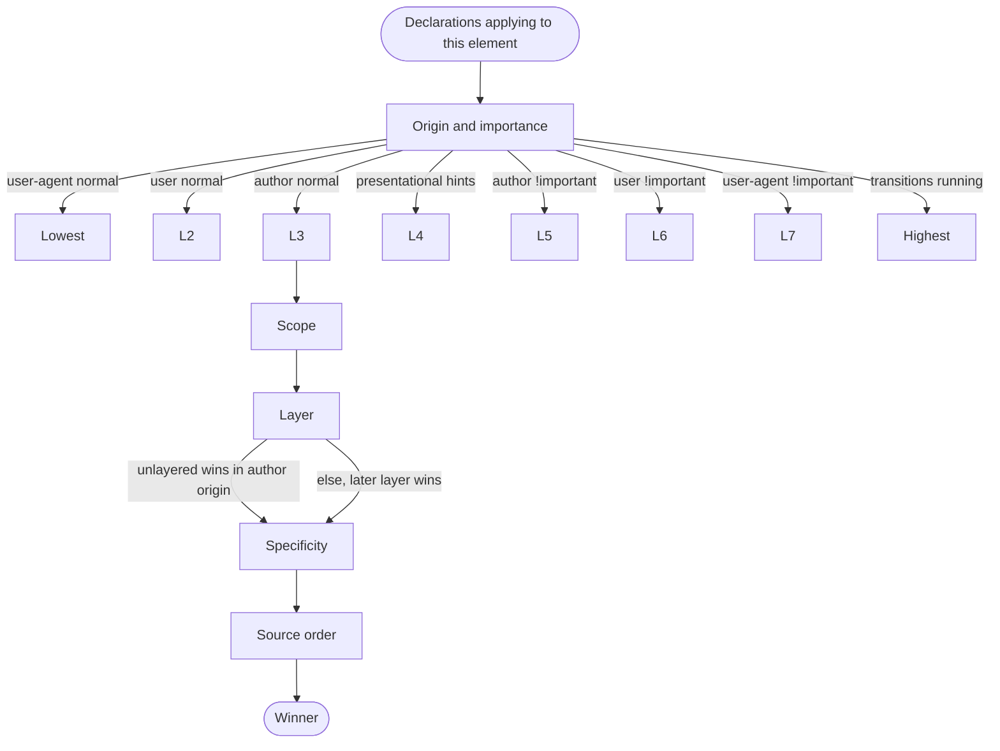
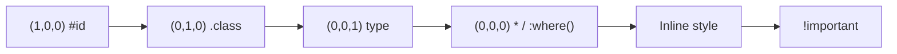
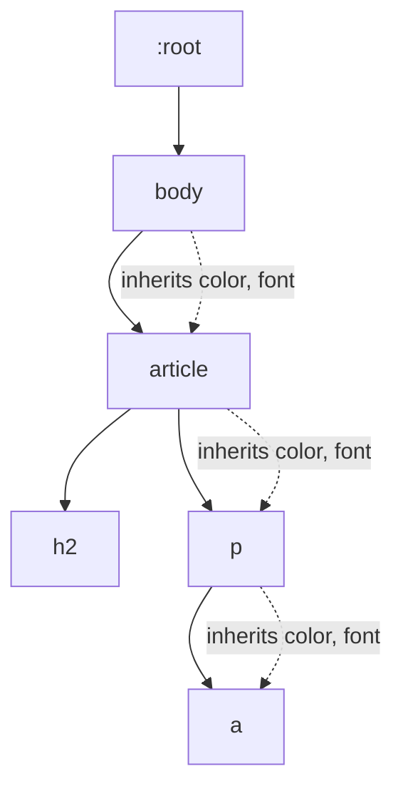

# 1.2 Selectors and Cascade

> Selectors are how you tell CSS *which* elements to style. The cascade is the algorithm that decides *which declaration wins* when several target the same element. This note covers every selector you will actually use in 2026, the specificity arithmetic that working engineers do in their head, the full modern cascade algorithm including the new `@layer` rules, and the inheritance system with its four keywords (`inherit`, `initial`, `unset`, `revert`). Mastering this note is what separates a CSS dabbler from a CSS engineer.

## 1.2.1 Objective

After reading this note you should be able to:

1. Identify and use every modern selector: type, class, ID, attribute (with all operators), descendant, child, adjacent sibling, general sibling, pseudo-class, and pseudo-element.
2. Use the modern logical selectors `:is()`, `:where()`, `:has()`, and `:not()` correctly, and explain how each affects specificity.
3. Compute the specificity of any selector by hand using the `(A, B, C)` notation and rank competing selectors.
4. Recite the modern cascade algorithm in order: origin and importance, scope, layer, specificity, order of appearance, then the rare tiebreakers (animation, transition).
5. Use cascade layers (`@layer`) to architect stylesheets with predictable priority.
6. Predict which properties inherit, and intentionally control inheritance with `inherit`, `initial`, `unset`, `revert`, and `revert-layer`.

## 1.2.2 Background Knowledge

### Reminders

- **A selector is a query against the DOM.** The browser matches selectors right-to-left. `nav a` means "find every `<a>`, then check whether any ancestor is a `<nav>`". This is more efficient because there are usually fewer leaf elements than branches.
- **Specificity is not a number — it is a tuple.** `(1, 0, 0)` does not equal `(0, 99, 99)`. ID beats any number of classes, classes beat any number of types.
- **Inheritance and cascade are different things.** Inheritance flows from parent to child for some properties. Cascade resolves competing declarations on the *same* element. A child gets its `font-size` from inheritance if no rule targets the child; if a rule does target it, the cascade wins.
- **Inline styles (`style=""`) have a higher origin tier than author stylesheet rules**, not just higher specificity. We covered this in [[1.1 CSS Foundations]] — inline is treated as a separate origin within author.
- **The browser matches selectors lazily and incrementally.** When you change a class, the browser does not re-match the whole document — it uses style invalidation to find only the affected nodes.
- **Pseudo-elements (`::before`, `::after`) are not in the DOM.** They are generated by CSS. They are addressable by selectors but invisible to `document.querySelectorAll`.
- **Pseudo-classes (`:hover`, `:checked`) are states.** They match or do not match based on the element's current state.
- **A selector list (`.a, .b, .c {}`) is *not* a single selector.** It is three rules. If one selector in the list is invalid (in older browsers), the *entire* rule was historically dropped. Modern browsers use forgiving selector lists for `:is()`, `:where()`, `:has()`, and `:not()`.

> [!note] Forgotten trivia
> `:root` matches the root element of the document. In HTML this is `<html>`. In SVG it is `<svg>`. `:root` has the same specificity as a single class `(0, 1, 0)`. This is why CSS custom properties are conventionally declared on `:root` — they inherit to everything but you can override them on any element.

## 1.2.3 Core Concepts

### 1.2.3.1 Type, Universal, Class, ID

```css
*           /* universal, specificity (0,0,0) */
p           /* type, specificity (0,0,1) */
.card       /* class, specificity (0,1,0) */
#save       /* ID, specificity (1,0,0) */
```

The universal selector `*` has zero specificity — it does not contribute to the score. This is why it is safe in resets.

IDs are powerful but problematic: they make selector reuse impossible (you cannot have the same ID twice in a document, by spec) and they introduce specificity cliffs. Most modern style guides forbid IDs in CSS selectors. Prefer classes.

### 1.2.3.2 Attribute Selectors

```css
[attr]                /* has attribute */
[attr="value"]        /* exact match */
[attr~="value"]       /* whitespace-separated list contains value */
[attr|="value"]       /* equals value or starts with value- (lang codes) */
[attr^="value"]       /* starts with */
[attr$="value"]       /* ends with */
[attr*="value"]       /* contains anywhere */
```

Case-insensitive modifier (`i`):

```css
[attr="value" i]      /* case-insensitive match */
a[href^="https://" i] /* matches HTTPS:// as well */
```

Specificity of any attribute selector is `(0, 1, 0)` — same as a class.

Examples:

```css
input[type="checkbox"]:checked + label { color: green; }
a[href^="https://"]::after { content: " "; }
img[alt] { outline: 1px solid green; } /* images that have alt text */
img:not([alt]) { outline: 2px solid red; } /* accessibility failure */
```

### 1.2.3.3 Combinators

| Combinator | Syntax | Meaning |
|---|---|---|
| Descendant | `A B` | B is a descendant of A (any depth). |
| Child | `A > B` | B is a direct child of A. |
| Adjacent sibling | `A + B` | B immediately follows A, same parent. |
| General sibling | `A ~ B` | B follows A (not necessarily adjacent), same parent. |
| Column combinator | `A || B` | Experimental; B is a cell in column A. Skip. |

Examples:

```css
nav > ul > li { /* direct children only */ }
h2 + p { /* paragraph immediately after h2 */ }
h2 ~ p { /* any paragraph that is a later sibling of h2 */ }
```

Combinators themselves contribute *nothing* to specificity. The score is the sum of the simple selectors on either side.

### 1.2.3.4 Pseudo-Classes

A pseudo-class is a state-based selector. Some you will use daily:

```css
:hover         /* pointer is over the element */
:focus         /* element has focus */
:focus-visible /* element has focus and the UA decides focus ring should show */
:focus-within  /* element or any descendant has focus */
:active        /* mouse button is held down on element */
:visited       /* link has been visited (privacy-restricted styling) */
:checked       /* checkbox/radio is checked, option is selected */
:disabled      /* form control is disabled */
:enabled       /* form control is not disabled */
:required      /* form control has required attribute */
:valid / :invalid  /* form control passes/fails validation */
:placeholder-shown /* input is showing its placeholder (empty) */
:empty         /* element has no children (including text nodes) */
:target        /* element matches the URL fragment */
:root          /* the root element (<html> in HTML) */
:first-child   /* first child of its parent */
:last-child    /* last child of its parent */
:only-child    /* only child of its parent */
:first-of-type /* first sibling of its type */
:last-of-type  /* last sibling of its type */
:only-of-type  /* only sibling of its type */
:nth-child(n)  /* nth child, formula or keyword */
:nth-last-child(n)
:nth-of-type(n)
:nth-last-of-type(n)
:not(...)      /* negation */
:is(...)       /* matches any selector in the list */
:where(...)    /* like :is() but zero specificity */
:has(...)      /* relational, matches parent/ancestor that has matching descendant */
:defined       /* custom element has been defined */
:lang(en)      /* language match */
```

All pseudo-classes count as a class `(0, 1, 0)` for specificity. The exception is `:where()`, which is always `(0, 0, 0)`.

#### `:nth-child` formulas

- `:nth-child(3)` — the third child.
- `:nth-child(odd)` — 1st, 3rd, 5th, ... (same as `2n+1`).
- `:nth-child(even)` — 2nd, 4th, ... (same as `2n`).
- `:nth-child(3n)` — 3rd, 6th, 9th, ...
- `:nth-child(2n+1)` — odd.
- `:nth-child(-n+3)` — first three children (n starts at 0: `-0+3=3`, `-1+3=2`, `-2+3=1`, then negative).
- `:nth-child(n+4)` — from the 4th onward.

#### `:nth-child` vs `:nth-of-type`

`:nth-child(2)` is "the second child of its parent, regardless of type". `:nth-of-type(2)` is "the second child of its type" — so in `<h1><p><p>`, the first `<p>` is `:nth-of-type(1)` and also `:nth-child(2)`.

> [!warning] Common pitfall
> `p:nth-child(2)` does **not** mean "the second `<p>`". It means "an element that is both a `<p>` AND the 2nd child of its parent". If the second child is a `<div>`, nothing matches. Use `p:nth-of-type(2)` for "the second `<p>`".

### 1.2.3.5 Pseudo-Elements

Pseudo-elements generate virtual elements that are not in the DOM. Use *two* colons (`::`) to distinguish them from pseudo-classes (one colon was the legacy syntax).

```css
::before         /* generated content before the element's content */
::after          /* generated content after */
::first-line     /* first formatted line of a block element */
::first-letter   /* first letter of a block element */
::selection      /* portion selected by the user */
::placeholder    /* placeholder text in form controls */
::marker         /* list item marker (bullet or number) */
::backdrop       /* backdrop behind a dialog or fullscreen element */
::file-selector-button  /* the button inside <input type="file"> */
```

Pseudo-elements count as `(0, 0, 1)` (like a type selector) — historically, this is the case for `::before`/`::after`. Combined with the host selector, `a::before` has specificity `(0, 0, 2)`.

Content generated by `::before`/`::after` requires the `content` property, even an empty string:

```css
.required-label::after { content: " *"; color: red; }
.clearfix::after { content: ""; display: table; clear: both; }
```

### 1.2.3.6 `:is()`, `:where()`, `:has()`, `:not()`

These four are the modern logical pseudo-classes.

#### `:is()` — matches any of the listed selectors, takes the highest specificity

```css
:is(header, main, footer) a { color: inherit; }
:is(.btn, .link, .nav-item):hover { text-decoration: underline; }
```

`:is()` takes the **highest** specificity among its arguments. If you write `:is(#x, .y)`, the specificity is `(1, 0, 0)`.

Use `:is()` to:
- Reduce selector duplication.
- Group selectors that share a declaration.
- Write cleaner CSS for "any of these elements" patterns.

#### `:where()` — like `:is()` but always zero specificity

```css
:where(.card, .panel, .box) { padding: 1rem; }
```

`:where()` always has specificity `(0, 0, 0)`. This makes it perfect for base styles you want to be trivially overridable:

```css
:where(h1, h2, h3, h4, h5, h6) { line-height: 1.2; }
/* Any class on the heading will override this — even a single class. */
```

#### `:has()` — the "parent selector" we waited 20 years for

`:has()` matches an element that has a descendant (or sibling) matching a selector.

```css
.card:has(img) { padding-top: 0; }      /* card containing an image */
form:has(input:invalid) button { opacity: .5; }  /* disable submit if invalid */
article:has(.callout) { border-left: 4px solid gold; }
h2:has(+ p) { margin-bottom: 0; }       /* h2 that is immediately followed by p */
```

Specificity: `:has()` takes the highest specificity among its arguments (like `:is()`).

`:has()` is supported in all evergreen browsers as of 2023. Use it freely.

#### `:not()` — negation

```css
a:not([href]) { color: gray; }              /* <a> with no href */
button:not(:disabled):hover { background: navy; }
nav a:not(.external)::after { content: ""; }
```

`:not()` takes the **highest** specificity of its arguments. In old CSS, `:not()` could only take a single simple selector; modern `:not()` accepts a selector list and is forgiving.

> [!tip] Forgiving lists
> `:is()`, `:where()`, `:has()`, and `:not()` use forgiving selector lists: an invalid selector in the list is silently ignored rather than invalidating the whole rule. This is critical for forward compatibility.

### 1.2.3.7 Specificity Calculation

Specificity is a tuple `(A, B, C)`:

- **A**: number of ID selectors.
- **B**: number of class selectors, attribute selectors, pseudo-classes.
- **C**: number of type selectors, pseudo-elements.

Compare tuples lexicographically. `(1, 0, 0)` > `(0, 9, 9)`. `(0, 2, 1)` > `(0, 1, 99)`.

Worked examples:

| Selector | A | B | C |
|---|---|---|---|
| `*` | 0 | 0 | 0 |
| `p` | 0 | 0 | 1 |
| `.card` | 0 | 1 | 0 |
| `#save` | 1 | 0 | 0 |
| `nav ul li` | 0 | 0 | 3 |
| `nav.menu .item a` | 0 | 2 | 2 |
| `#nav .item:hover` | 1 | 2 | 0 |
| `:root` | 0 | 1 | 0 |
| `:is(.a, #b)` | 1 | 0 | 0 (highest of args) |
| `:where(.a, #b)` | 0 | 0 | 0 (always zero) |
| `:has(.x)` | 0 | 2 | 0 (one for `:has`, one for `.x`) |
| `a::after` | 0 | 0 | 2 |
| `[type="text"]:focus` | 0 | 2 | 0 |

> [!note] Inline style
> Inline `style=""` is its own author-sub-origin with priority higher than any author stylesheet rule. It cannot be overridden by an author stylesheet declaration without `!important` (or by using the cascade layer trick where layered styles are below unlayered). JavaScript `element.style.setProperty` writes to this same origin.

### 1.2.3.8 The Cascade Algorithm (Modern, 2024+)

The cascade resolves every property of every element by collecting all declarations that apply, then sorting. The sort key, in order:

1. **Origin and importance.** Eight tiers, from user-agent normal (lowest) through transitions (highest). See the diagram below.
2. **Scope** (`@scope` rule, Shadow DOM boundary). Relevance is being defined; the spec calls this "encapsulation context".
3. **Layer.** Within the same origin and importance, layered declarations are sorted by layer order (lower-to-higher layers), with **unlayered** declarations winning over *layered* ones in the author origin.
4. **Specificity.** Within the same layer.
5. **Order of appearance.** Later wins (source order).
6. **Animations** (a separate tier while running) and **transitions** (the highest tier while running).

For our purposes, the everyday version is: origin  -->  layer  -->  specificity  -->  source order.

> [!warning] Unlayered beats layered
> This is the most surprising rule of cascade layers. Any unlayered author rule beats any layered author rule, regardless of specificity. The intent is to let you write "framework" or "library" styles in layers and override them with your site CSS unlayered.

### 1.2.3.9 Cascade Layers (`@layer`)

```css
@layer reset, base, components, utilities;
```

This single line declares four layers in priority order: `reset` (lowest), `base`, `components`, `utilities` (highest). The order at declaration time is what matters. Subsequent `@layer` blocks add to those layers but do not change the order.

```css
@layer base {
  body { font-size: 1rem; }
  a { color: blue; }
}

@layer components {
  .btn { padding: 0.5rem 1rem; }
}

@layer utilities {
  .text-center { text-align: center; }
}
```

Rules:
- Unlayered styles *always* win over layered styles (in the author origin).
- Within layered styles, later-declared layers win.
- `!important` reverses layer order: an `!important` in `reset` beats an `!important` in `utilities`. (This is intentional: important styles in low-priority layers are typically "must not be overridden" safety nets.)
- Anonymous layers can be created with `@layer { ... }` — they are ordered by appearance.
- Imported stylesheets can be assigned a layer: `@import "lib.css" layer(library);`

Use case: a design system that wants to be overridable by application CSS without specificity battles. The library is `@layer library { ... }`, the app is unlayered. App always wins.

### 1.2.3.10 Inheritance

Some properties inherit from parent to child by default. The inherited ones are mostly **textual**:

- `font-family`, `font-size`, `font-weight`, `font-style`, `font-variant`, `font-stretch`, `line-height`
- `color`, `text-align`, `text-indent`, `text-transform`, `letter-spacing`, `word-spacing`, `white-space`
- `direction`, `writing-mode`
- `list-style`, `list-style-type`, `list-style-position`
- `cursor`
- `visibility`
- `quotes`
- Custom properties (`--anything`) always inherit.

Most box-model properties do **not** inherit: `width`, `height`, `margin`, `padding`, `border`, `background`, `display`, `position`, `overflow`, `flex`, `grid`.

> [!note] Why inheritance matters
> If `color` did not inherit, every text element would need its own `color` rule. The spec chose to inherit textual properties because they tend to apply uniformly across a subtree. Box properties are intentionally per-element.

### 1.2.3.11 Controlling Inheritance

Five keywords that override the computed value:

| Keyword | Meaning |
|---|---|
| `inherit` | Take the parent's computed value, even for non-inherited properties. |
| `initial` | Use the property's initial value (the spec default, *not* the user-agent default). |
| `unset` | For inherited properties, behaves like `inherit`. For non-inherited, behaves like `initial`. |
| `revert` | Revert to the *user-agent* (or user, or origin) default — i.e., the previous cascade origin's value. |
| `revert-layer` | Revert to the value that would have been used if the current cascade layer had not contributed a value. |

Examples:

```css
a { color: inherit; }              /* link color = parent's text color */
.btn { border: initial; }          /* = medium none currentcolor */
.callout { color: unset; }         /* if .callout is on an inline element, uses parent's color */
h1 { font-size: revert; }          /* back to UA default h1 size */
```

The `all` property lets you reset everything at once:

```css
.reset-all { all: unset; }
```

This is heavy-handed but useful for web components or for fully resetting an element to its inherited/textual defaults.

### 1.2.3.12 `:root` and Custom Properties

Custom properties (CSS variables) are declared with `--` and consumed with `var()`:

```css
:root {
  --color-accent: #06c;
  --space-4: 1rem;
}
.btn { background: var(--color-accent); padding: var(--space-4); }
```

Custom properties always inherit. They are covered in depth in note 1.8 (Variables, Functions, and Calculations).

## 1.2.4 Detailed Walkthrough

Let us trace the cascade on a realistic example.

```html
<article class="post" id="lead">
  <h2>Headline</h2>
  <p>Body text with <a href="/">a link</a>.</p>
</article>
```

```css
@layer base, components;

@layer base {
  a { color: #06c; }                          /* (0,0,1), layer base */
  .post a { color: #333; }                    /* (0,1,1), layer base */
}

@layer components {
  .post a { text-decoration: none; }          /* (0,1,1), layer components */
  #lead a { color: red; }                     /* (1,0,1), layer components */
}

a { color: black; }                            /* (0,0,1), unlayered */
```

Step-by-step resolution for the `<a>`:

1. Collect all declarations for `color` on `<a>`:
   - `a { color: #06c; }` — author, layer `base`, specificity `(0,0,1)`.
   - `.post a { color: #333; }` — author, layer `base`, specificity `(0,1,1)`.
   - `#lead a { color: red; }` — author, layer `components`, specificity `(1,0,1)`.
   - `a { color: black; }` — author, **unlayered**, specificity `(0,0,1)`.

2. Apply cascade order:
   - Origin: all author. Same.
   - Importance: none. Same.
   - Layer: unlayered beats layered. `a { color: black; }` wins immediately. Final answer: **black**.

Notice that the ID selector `(1,0,1)` in `components` is *not* enough — unlayered beats layered regardless of specificity.

For `text-decoration` on the same `<a>`:
- Only one declaration: `.post a { text-decoration: none; }` in `components`. Wins. Result: **none**.

Now let us imagine the unlayered rule is removed:

```css
/* (no unlayered a rule) */
```

Then for `color`:
- Origin: same. Importance: same.
- Layer: `components` > `base`. So we narrow to declarations in `components`.
- Only one declaration in `components` for color: `#lead a { color: red; }`. Wins. Result: **red**.

For `text-decoration`: `.post a { text-decoration: none; }` in components. Wins.

> [!tip] Mental shortcut
> When you see `@layer`, ask: "Is the candidate unlayered?" If yes, it wins (within author normal origin). If all candidates are layered, find the highest layer. Only then compare specificity.

## 1.2.5 Practical Examples

### 1.2.5.1 A Robust Reset Using `:where()`

```css
:where(ul, ol) { list-style: none; padding: 0; }
:where(h1, h2, h3, h4, h5, h6) { margin: 0; font-weight: 600; }
:where(a) { color: inherit; text-decoration: none; }
:where(button) { background: none; border: 0; padding: 0; font: inherit; cursor: pointer; }
:where(img, svg, video, canvas) { display: block; max-width: 100%; }
```

Because `:where()` has zero specificity, *any* class on these elements overrides the reset. This is the cleanest possible reset for component-driven projects.

### 1.2.5.2 Form Validation Styling

```css
input:not([type="checkbox"]):not([type="radio"]):not([type="submit"]):focus-visible {
  outline: 2px solid #06c;
  outline-offset: 2px;
}
input:user-invalid {
  border-color: #c00;
}
input:user-invalid + .error {
  display: block;
}
.error { display: none; color: #c00; }
```

The `:user-invalid` pseudo-class is the modern equivalent of `:invalid` but only matches after the user has interacted — preventing the form from being red before the user has typed anything.

### 1.2.5.3 Styling "Cards With Images" with `:has()`

```css
.card { padding: 1.5rem; }
.card:has(> img) { padding-top: 0; }
.card:has(> img) > img { margin: 0 -1.5rem 1.5rem; }
```

This styles any `.card` that has an `` as a direct child, making the image bleed to the card edges. Without `:has()`, you would need a modifier class like `.card--media` set by hand.

### 1.2.5.4 Cascade Layers for a Design System

```css
@layer tokens, reset, primitives, components, utilities;

@layer tokens {
  :root {
    --space-1: 0.25rem;
    --space-2: 0.5rem;
    --space-4: 1rem;
    --color-primary: #06c;
  }
}

@layer reset {
  *, *::before, *::after { box-sizing: border-box; }
  * { margin: 0; }
  body { font: 100%/1.5 system-ui; }
}

@layer primitives {
  .stack > * + * { margin-top: var(--space-4); }
  .cluster { display: flex; flex-wrap: wrap; gap: var(--space-2); }
}

@layer components {
  .btn { padding: var(--space-2) var(--space-4); border-radius: 0.25rem; }
  .btn--primary { background: var(--color-primary); color: white; }
}

@layer utilities {
  .text-center { text-align: center; }
  .mt-2 { margin-top: var(--space-2); }
}
```

App code that needs to override any of these is left **unlayered** — it will always win without needing high specificity.

## 1.2.6 Mermaid Diagrams

### 1.2.6.1 Cascade Resolution Order



### 1.2.6.2 Specificity Comparison



### 1.2.6.3 The Inheritance Tree



## 1.2.7 Common Mistakes

1. **Using `p:nth-child(2)` to mean "the second `<p>`."** It actually means "a `<p>` that is also the second child of its parent". Use `p:nth-of-type(2)` for "the second paragraph". This is the most common selector mistake in CSS.

2. **Putting IDs in selectors.** IDs raise specificity to `(1, 0, 0)`, making overrides require either `#id` or `!important`. Use classes. If you must reference an ID (e.g., `#main`), use `:where(#main)` or `[id="main"]` (specificity `(0,1,0)`) to avoid the cliff.

3. **Forgetting that `:where()` is zero specificity.** Engineers new to `:where()` are sometimes confused why their `.btn` rule does not override `:where(.btn)`. It does — that is the point. `:where()` is for "I want this rule to lose every specificity contest".

4. **Expecting `:not()` to add specificity like a class.** It does — `:not(.x)` has specificity `(0, 1, 0)` plus the specificity of its argument. The "argument" is part of the calculation. But `:not(.x)` and `.x` have the *same* specificity `(0, 1, 0)`. This is rarely a problem but can surprise you.

5. **Confusing pseudo-classes and pseudo-elements.** `:before` (one colon, legacy) and `::before` (two colons, modern) target the same thing in modern browsers, but pseudo-elements contribute `(0, 0, 1)` to specificity while pseudo-classes contribute `(0, 1, 0)`. Always use two colons for pseudo-elements in modern code.

6. **Writing `nav.menu .item a` and being surprised when a button-styled link does not match.** The selector requires the `<a>` to be a descendant of `.item` which is a descendant of `nav.menu`. If your HTML structure changed (e.g., the link is now a sibling), the selector silently stops matching. Use DevTools to see which selectors match.

7. **Relying on `:hover` on mobile.** Touch devices fire `:hover` on tap, then `:hover` can "stick" until the user taps elsewhere. Either pair `:hover` with `:focus-visible` for accessibility, or use `@media (hover: hover)` to scope hover styles to devices that actually hover.

8. **Forgetting that custom properties always inherit.** A `--token` declared on `:root` is available everywhere, but if you redeclare it on a nested element, all descendants get the new value. This can cause "why is my button color wrong" bugs that are hard to trace. DevTools shows custom property inheritance.

## 1.2.8 Best Practices

1. **Prefer classes over IDs in selectors.** IDs are fine in HTML (for fragment links, `<label for>`), but in CSS they create specificity cliffs. The only legitimate ID selector is for highly specific overrides, and even then, consider `:where(#x)` or a class.

2. **Use `:where()` for base/reset styles.** This makes them trivially overridable without specificity battles. Combined with cascade layers, you get a clean architecture.

3. **Adopt cascade layers (`@layer`) on new projects.** Declare layer order at the top, then assign styles to layers. Leave application overrides unlayered to always win.

4. **Limit selector depth to 3-4 combinators max.** `nav.menu ul li a` is already at the edge. Anything deeper is a sign of structural coupling — the CSS becomes brittle to HTML changes. Component-scoped classes (`.nav-link`) are more robust.

5. **Use `:is()` to group selectors and reduce duplication.** `:is(button, .btn, .link):hover { ... }` is cleaner than three rules.

6. **Use `:has()` for state-driven parent styling.** It eliminates the need for JavaScript to add classes like `has-error` or `has-image`. But pair it with a fallback for browsers that do not support it (older browsers, if you must support them).

7. **Always pair `:hover` with `:focus-visible` styles.** Keyboard users navigate with Tab; if `:hover` is your only interactive state, they see nothing. We cover this in [[1.11 Accessibility in CSS]].

8. **Use `:focus-visible` instead of `:focus` for focus rings.** `:focus-visible` shows the ring only when the browser heuristically decides it should (keyboard navigation, not mouse). This avoids the annoying "focus ring on every clicked button" behavior.

## 1.2.9 Mini Exercises

### Exercise 1.2.A — Compute Specificity

**Problem:** Compute the specificity (A, B, C) of each selector.

1. `#main .content article p`
2. `nav.menu > ul > li.active a::after`
3. `:is(.btn, #save, button)`
4. `:where(.card) .title`
5. `:not(.disabled)`
6. `:has(figure img)`
7. `input[type="email"]:focus:invalid`
8. `*`

**Expected outcome:** Eight tuples.

**Worked solution:**

1. `#main .content article p`  -->  A=1 (id), B=1 (class), C=2 (type)  -->  **(1, 1, 2)**
2. `nav.menu > ul > li.active a::after`  -->  A=0, B=2 (.menu, .active), C=5 (nav, ul, li, a, ::after)  -->  **(0, 2, 5)**
3. `:is(.btn, #save, button)`  -->  takes highest specificity among args, which is `#save` = (1,0,0). `:is` itself contributes (0,1,0). Total: **(1, 1, 0)**.
   - Wait — re-checking. The spec says `:is()` contributes the highest specificity of its arguments *and* the `:is` itself is not separately counted. Let me restate: `:is(.btn, #save, button)` has specificity equal to the highest of its arguments: `(1, 0, 0)`. The pseudo-class itself does not add to the count. So answer: **(1, 0, 0)**.
4. `:where(.card) .title`  -->  `:where` is zero specificity, `.title` is (0,1,0). Total: **(0, 1, 0)**.
5. `:not(.disabled)`  -->  `:not` takes specificity of its argument, which is `.disabled` = (0,1,0). The `:not` itself does not add. Answer: **(0, 1, 0)**.
6. `:has(figure img)`  -->  `:has` takes specificity of its highest argument. The argument is the relative selector `figure img`, which is (0,0,2). Answer: **(0, 0, 2)**.
7. `input[type="email"]:focus:invalid`  -->  A=0, B=3 (attribute, :focus, :invalid), C=1 (input). Answer: **(0, 3, 1)**.
8. `*`  -->  **(0, 0, 0)**.

**Why it works:** The universal selector contributes zero. `:where()` always contributes zero. `:is()`, `:not()`, and `:has()` contribute the specificity of their highest argument. Combinators contribute zero.

**Common wrong approach:** Counting `:is` itself as a class. It is not.

### Exercise 1.2.B — Predict the Winner

**Problem:** Given:

```html
<div class="card highlighted" id="x"><p class="lede">Hi</p></div>
```

```css
.card .lede { color: red; }       /* (0,2,0) */
div .lede { color: green; }       /* (0,1,1) */
#x .lede { color: blue; }          /* (1,1,0) */
.card.highlighted .lede { color: purple; } /* (0,3,0) */
:where(.card) .lede { color: orange; }     /* (0,1,0) */
```

What is the final color of `.lede`?

**Expected outcome:** One color with reasoning.

**Worked solution:**

All rules are unlayered, normal origin, same source-order independent of priority. So compare specificity:

- `:where(.card) .lede`  -->  (0,1,0)
- `div .lede`  -->  (0,1,1)
- `.card .lede`  -->  (0,2,0)
- `.card.highlighted .lede`  -->  (0,3,0)
- `#x .lede`  -->  (1,1,0)

The ID-containing selector `(1,1,0)` has the highest A component, so it wins regardless of B and C. Final: **blue**.

**Why it works:** Specificity compares A first; if A differs, B and C do not matter.

**Common wrong approach:** Picking `.card.highlighted .lede` because it has "three classes" — but a single ID outranks any number of classes.

### Exercise 1.2.C — Build a Layered Stylesheet

**Problem:** Refactor this messy CSS into cascade layers. The intent is: tokens (lowest), then reset, then primitives, then components, then utilities (highest), then unlayered app overrides.

```css
*, *::before, *::after { box-sizing: border-box; }
body { margin: 0; }
:root { --c-primary: #06c; --s-4: 1rem; }
.btn { padding: var(--s-4); background: var(--c-primary); color: #fff; }
.text-center { text-align: center; }
.stack > * + * { margin-top: var(--s-4); }
```

**Expected outcome:** A refactored stylesheet with the layer order declared at the top.

**Worked solution:**

```css
@layer tokens, reset, primitives, components, utilities;

@layer tokens {
  :root {
    --c-primary: #06c;
    --s-4: 1rem;
  }
}

@layer reset {
  *, *::before, *::after { box-sizing: border-box; }
  body { margin: 0; }
}

@layer primitives {
  .stack > * + * { margin-top: var(--s-4); }
}

@layer components {
  .btn {
    padding: var(--s-4);
    background: var(--c-primary);
    color: #fff;
  }
}

@layer utilities {
  .text-center { text-align: center; }
}

/* Anything below this comment, written unlayered, will override all of the above. */
```

**Why it works:** The first line declares the layer order. Subsequent `@layer` blocks add rules to those layers without changing the order. Unlayered styles (which you will write later in your application code) outrank all layered styles in the author origin.

**Common wrong approach:** Declaring `@layer reset, primitives, tokens, components, utilities;` (tokens after primitives). Tokens are the lowest layer; they must be first.

### Exercise 1.2.D — Style a Form with `:user-invalid`

**Problem:** Build a styled email input that: (a) shows a red border only *after* the user has typed and the input is invalid, (b) shows a green border when valid, (c) shows a sibling error message only when invalid (and only after interaction), (d) has a visible focus ring (keyboard, not mouse).

**Expected outcome:** Complete HTML and CSS.

**Worked solution:**

```html
<form class="form">
  <label class="field">
    <span class="label">Email</span>
    <input class="input" type="email" name="email" required>
    <span class="error">Please enter a valid email.</span>
  </label>
</form>
```

```css
@layer components;

@layer components {
  .field { display: grid; gap: 0.25rem; }
  .label { font-weight: 600; }
  .input {
    padding: 0.5rem 0.75rem;
    border: 2px solid #ccc;
    border-radius: 0.25rem;
    font: inherit;
    transition: border-color 150ms ease;
  }
  .input:focus-visible {
    outline: 2px solid #06c;
    outline-offset: 2px;
  }
  .input:user-invalid {
    border-color: #c00;
  }
  .input:user-invalid + .error {
    display: block;
  }
  .input:user-valid {
    border-color: #0a0;
  }
  .error {
    display: none;
    color: #c00;
    font-size: 0.875rem;
  }
}
```

**Why it works:**
- `:user-invalid` only matches after the user has interacted with the control *and* the value is invalid. This prevents the form being red on initial render.
- `:user-valid` similarly requires interaction.
- `:focus-visible` shows the ring only for keyboard focus, avoiding mouse-click rings.
- The error message uses `display: none` by default and is shown via `+ .error` adjacent sibling combinator.

**Common wrong approach:** Using `:invalid` instead of `:user-invalid`. `:invalid` matches from the start (because the empty email is invalid per the `required` attribute), making the form red immediately.

### Exercise 1.2.E — Parent-Selector Pattern with `:has()`

**Problem:** A list of items. Each item may have a badge (`.badge`). When an item has a badge, add padding-right to make room for it, and absolutely position the badge in the top-right. Without `:has()`, you would need a modifier class. Use `:has()` to make it automatic.

**Expected outcome:** Complete HTML and CSS using `:has()`.

**Worked solution:**

```html
<ul class="list">
  <li class="item">Plain item</li>
  <li class="item">Item with badge <span class="badge">3</span></li>
  <li class="item">Plain item</li>
</ul>
```

```css
.list { list-style: none; padding: 0; max-width: 24rem; }
.item {
  position: relative;
  padding: 0.75rem 1rem;
  border-bottom: 1px solid #eee;
}
.item:has(.badge) {
  padding-right: 3rem;
}
.badge {
  position: absolute;
  top: 0.5rem;
  right: 0.5rem;
  background: #06c;
  color: #fff;
  border-radius: 999px;
  padding: 0.125rem 0.5rem;
  font-size: 0.75rem;
}
```

**Why it works:** `.item:has(.badge)` matches any `.item` that contains a `.badge` descendant. The padding-right is added only to those items, leaving room for the absolutely-positioned badge.

**Common wrong approach:** Adding `<li class="item item--with-badge">` and requiring the developer to remember the modifier. With `:has()`, the DOM alone is enough.

## 1.2.10 Summary

- Selectors target DOM elements; combinators describe relationships.
- `:is()`, `:where()`, `:has()`, `:not()` are the modern logical pseudo-classes. `:where()` is zero specificity; the others take the highest of their arguments.
- Specificity is a tuple `(A, B, C)` for ID, class/attribute/pseudo-class, type/pseudo-element. Compare lexicographically.
- The modern cascade order is: origin and importance  -->  scope  -->  layer  -->  specificity  -->  source order.
- Cascade layers (`@layer`) let you partition styles predictably. Unlayered author styles always beat layered author styles.
- Inheritance flows from parent to child for textual properties. Use `inherit`, `initial`, `unset`, `revert`, `revert-layer` to control it.
- Custom properties always inherit.
- Use `:where()` for resets, `:has()` for parent-state styling, `:focus-visible` for keyboard focus, and `:user-invalid` for accessible form validation.

## 1.2.11 Related Notes

- [[1.1 CSS Foundations]]
- [[1.3 Box Model and Display]]
- [[1.4 Positioning and Normal Flow]]
- [[1.5 Flexbox]]
- [[1.6 Grid]]
- [[1.7 Responsive Design and Container Queries]]
