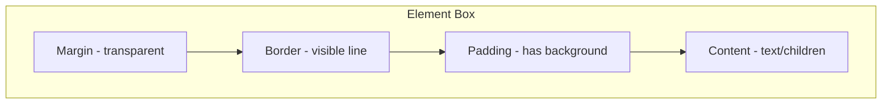
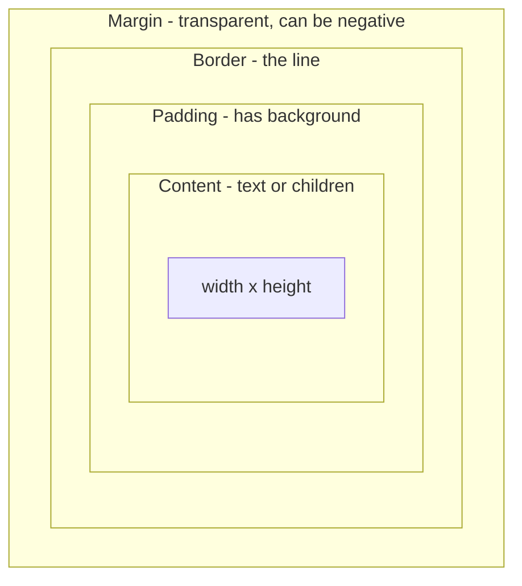
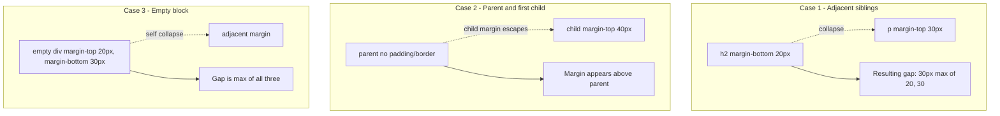
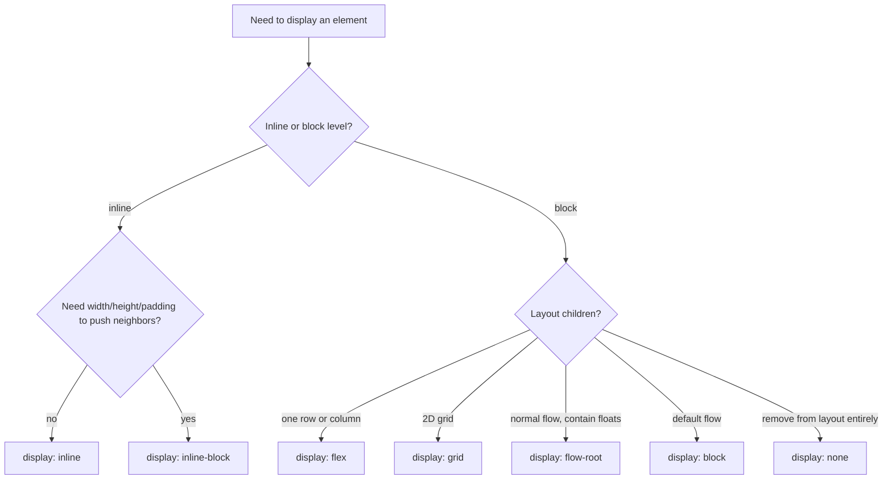
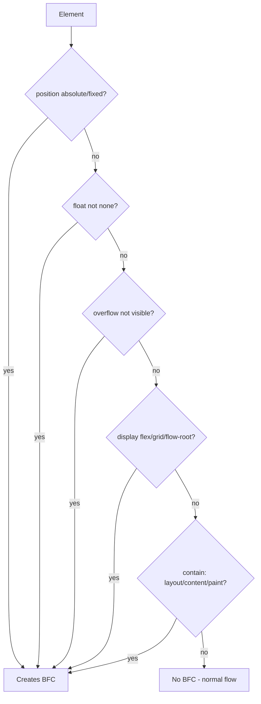

# 1.3 Box Model and Display

> Every HTML element is a box. The box model defines what that box is made of (content, padding, border, margin), the `display` property defines how the box participates in layout, and the formatting context defines the rules the box's children play by. This note covers the four regions of the box, the three types of margin collapse, `box-sizing`, every `display` value you will actually use, the difference between `display: none`, `visibility: hidden`, and `opacity: 0`, how `inline-block` works, what a Block Formatting Context is, and why `overflow: hidden` (mysteriously) creates one.

## 1.3.1 Objective

After reading this note you should be able to:

1. Draw the four regions of an element's box (content, padding, border, margin) and explain what each contributes to the box's total size under both `content-box` and `border-box`.
2. Identify all three forms of margin collapse and write CSS that prevents each.
3. Choose the right `display` value (`block`, `inline`, `inline-block`, `flex`, `grid`, `flow-root`, `contents`, `table`, `none`) for a given layout problem and justify the choice.
4. Explain the precise behavioral differences between `display: none`, `visibility: hidden`, `opacity: 0`, `content-visibility: hidden`, and `hidden` attribute — including accessibility, hit testing, transitions, and layout impact.
5. Identify when an element establishes a Block Formatting Context (BFC) and use that knowledge to solve float containment, margin collapse, and text-wrap-around-float problems.
6. Explain why `display: flow-root` exists and when to prefer it over `overflow: hidden` for BFC creation.

## 1.3.2 Background Knowledge

### Reminders

- **Every element is a box.** Even inline elements like `<span>` are boxes; they are just smaller and do not break lines.
- **Width and height apply to the content box by default** (`box-sizing: content-box`). This is the source of half of all CSS confusion. The fix is universal `border-box`, which we covered in [[1.1 CSS Foundations]].
- **Padding always has the element's `background`.** Padding is "inside" the border. Margin is "outside" the border and is always transparent.
- **The background extends to the outside edge of the border** (by default), so a `border: 2px dashed red` will show the background between the dashes.
- **Margins can be negative; padding cannot.** `margin-top: -10px` pulls the element up. `padding-top: -10px` is invalid (it would be parsed as `0`).
- **Percentages on padding and margin are relative to the *inline* (width) dimension of the containing block, even for vertical padding/margin.** This is intentional and is the basis of the aspect-ratio-padding hack.
- **`width: auto` is not the same as `width: 100%`.** For block elements, `auto` means "fill the container minus margins". `100%` means "set the width to the container's content width, *then* add padding and border on top (under content-box) — which can overflow".
- **The display property has two parts in modern CSS: the *outer* display type (`block`, `inline`) and the *inner* display type (`flow`, `flex`, `grid`).** `display: flex` is shorthand for `display: block flex`. `display: inline-flex` is `inline flex`. We mostly use the shorthand.
- **`display: none` excludes the element from layout entirely.** It is not just invisible — it takes zero space, cannot be focused, and is removed from the accessibility tree.

> [!note] Forgotten trivia
> The default user-agent stylesheet sets `<li>` to `display: list-item`, which is a block-level box with a marker (bullet or number). Setting `list-style: none` removes the marker but the element is still a `list-item` box.

## 1.3.3 Core Concepts

### 1.3.3.1 The Four Box Regions

Every box has four nested regions, from innermost to outermost:

1. **Content** — the area where text and child elements live. Sized by `width` and `height` (under `content-box`) or by `width`/`height` minus padding/border (under `border-box`).
2. **Padding** — space between content and border. Background extends through padding. Padding contributes to the click target.
3. **Border** — the line around padding. Background extends to the outer edge of the border.
4. **Margin** — transparent space outside the border. Margins can collapse with adjacent margins.



The total width of an element on screen (under `content-box`) is: `width + padding-left + padding-right + border-left + border-right + margin-left + margin-right`. Under `border-box`, the `width` includes padding and border, so the total is `width + margin-left + margin-right`.

### 1.3.3.2 Margin Collapsing

Margins between certain adjacent boxes collapse: instead of adding, the larger one wins. There are three cases.

#### Case 1: Adjacent siblings

```html
<h2>First</h2>
<p>Second</p>
```

If `<h2>` has `margin-bottom: 20px` and `<p>` has `margin-top: 30px`, the gap between them is **not** 50px — it is 30px (the larger of the two).

#### Case 2: Parent and first/last child

```html
<div class="parent">
  <p class="child">...</p>
</div>
```

If `.parent` has no top padding/border and `.child` has `margin-top: 40px`, the child's margin "escapes" through the parent and pushes the parent away from its predecessor. The margin appears *above* the parent, not between parent and child. Same at the bottom with the last child.

#### Case 3: Empty block

An empty `<div>` with `margin-top: 20px; margin-bottom: 30px;` collapses its own top and bottom margin. If adjacent to another element with `margin-bottom: 10px`, the resulting gap is the max of all three = 30px.

#### Rules for preventing collapse

Margins do **not** collapse if any of the following is true:

- The parent has `padding-top` or `border-top` (for the parent/first-child case).
- The parent establishes a BFC (e.g., `overflow: hidden`, `display: flow-root`, `display: flex`, `display: grid`).
- The element is `inline-block`, floated, or absolutely positioned.
- The margins are between flex/grid items (flex and grid *do not* collapse margins).
- There is something between the elements (a `padding`, `border`, `inline` content, or a clearance).

> [!tip] Modern fix
> `display: flow-root` on the parent is the cleanest way to prevent parent-child margin collapse without side effects. `overflow: hidden` also works but clips overflow and can hide tooltips. Use `flow-root`.

### 1.3.3.3 `box-sizing`

We covered this in [[1.1 CSS Foundations]]. Recap:

- `content-box` (default): `width`/`height` set the content size. Padding and border are added.
- `border-box`: `width`/`height` set the border-box size. Padding and border are inside.

Always use `border-box` globally. Always.

### 1.3.3.4 The `display` Property

Modern `display` syntax separates outer (how the box interacts with its parent) and inner (how the box lays out its children) types. The shorthands:

| Shorthand | Outer / Inner | Behavior |
|---|---|---|
| `block` | block / flow | New line, full width. Children flow normally. |
| `inline` | inline / flow | No line break, width/height ignored, vertical padding/border does not push lines apart. |
| `inline-block` | inline / flow-root | Inline placement, but block-like: width/height respected, padding/border all sides respected. |
| `flex` | block / flex | Block-level, children laid out as flex items. |
| `inline-flex` | inline / flex | Inline-level, children laid out as flex items. |
| `grid` | block / grid | Block-level, children laid out as grid items. |
| `inline-grid` | inline / grid | Inline-level grid. |
| `flow-root` | block / flow-root | Block-level, establishes a BFC, prevents margin collapse. |
| `contents` | (disappears) | The element's box disappears; children participate in the parent's layout. |
| `table`, `table-row`, `table-cell` | table model | HTML table behavior without table markup. |
| `list-item` | block / flow + marker | Like block, plus a list marker. |
| `none` | (excluded) | Element is removed from layout, a11y, and render tree. |

### 1.3.3.5 Block, Inline, Inline-Block in Detail

#### Block

- Starts on a new line. Takes full available width by default (`width: auto` fills container).
- `width`, `height`, `margin` (all sides), `padding` (all sides) all respected.
- Default block elements: `<div>`, `<p>`, `<ul>`, `<li>`, `<h1>`-`<h6>`, `<section>`, `<article>`, `<header>`, `<footer>`.

#### Inline

- Does not start a new line. Width is the content width.
- `width` and `height` are ignored. `margin-top` and `margin-bottom` are ignored (no effect on layout). `padding-top` and `padding-bottom` are applied visually but **do not push other lines away** — they overlap adjacent lines.
- `vertical-align` works on inline elements (and `inline-block`).
- Default inline elements: `<span>`, `<a>`, `<strong>`, `<em>`, `<code>`.

> [!warning] Inline padding surprise
> If you set `padding: 10px` on a `<span>` and the span wraps across two lines, the padding visually overlaps the line above and below. This is why navigation links are usually `inline-block` or `flex`, not `inline`.

#### Inline-Block

- Placed inline (no new line), but behaves like a block for sizing: `width`/`height` respected, all margins and paddings push neighbors away.
- Default baseline alignment can cause unexpected gaps. Use `vertical-align: middle` or `display: flex` on the parent.
- Historical "whitespace gap" issue: HTML whitespace between inline-block elements renders as a space. Fixes: remove whitespace in HTML, set parent `font-size: 0`, use flexbox instead.

### 1.3.3.6 `display: none` vs `visibility: hidden` vs `opacity: 0`

| Property | In layout? | Visible? | Receives focus / click? | In a11y tree? | Transitionable? |
|---|---|---|---|---|---|
| `display: none` | No | No | No | No | No (it is a discrete property) |
| `visibility: hidden` | Yes (takes space) | No | No | No | Yes (visible/hidden can transition) |
| `opacity: 0` | Yes | No | **Yes** (still hit-testable!) | Yes | Yes (numeric) |
| `content-visibility: hidden` | No (skipped) | No | No | No | No |
| `hidden` attribute | No | No | No | No | No (equivalent to `display: none`) |

Practical implications:

- Use `display: none` for "this element does not exist right now" (e.g., a closed modal).
- Use `visibility: hidden` when you want the space to remain (e.g., a hidden tab that keeps layout stable).
- Use `opacity: 0` *only* when you also disable pointer events (`pointer-events: none`) — otherwise users will click on invisible elements. Commonly used for fade-in animations.
- Use `content-visibility: hidden` for performance: the element is "skipped" by the browser (no rendering work) but can be toggled to `content-visibility: visible` cheaply. Pairs with `contain-intrinsic-size` to reserve space.
- The HTML `hidden` attribute is equivalent to `display: none`. It is overridden by any `display: <something>` rule, which can surprise you.

### 1.3.3.7 Formatting Contexts

A **formatting context** is the ruleset the layout engine uses to lay out a box's children. The two you will encounter daily:

#### Block Formatting Context (BFC)

A BFC is a region in which block-level boxes are laid out according to the block formatting rules. Key property: **margins of elements inside a BFC do not collapse with margins of elements outside the BFC**. A BFC also **contains its floats** (a BFC's height includes floated descendants).

An element creates a BFC when any of these is true:

- The root element (`<html>`) — always.
- `display: flow-root` (the explicit, purpose-built way).
- `display: flex` or `display: inline-flex` (flex container).
- `display: grid` or `display: inline-grid`.
- `float` is not `none`.
- `position` is `absolute` or `fixed`.
- `overflow` is not `visible` (so `overflow: hidden`, `auto`, `scroll` all create BFCs).
- `contain: layout`, `contain: content`, `contain: strict`, `contain: paint`.
- `display: table-cell`, `table-caption`, `table`, `table-row`, etc.
- `column-span: all`.

> [!note] The `overflow: hidden` BFC trick
> The classic clearfix was `.clearfix { overflow: hidden; }` because it makes the element a BFC, which contains floats. But `overflow: hidden` clips anything that overflows — bad for dropdowns, tooltips, or shadows. Modern code uses `display: flow-root`, which creates a BFC without clipping.

#### Inline Formatting Context (IFC)

Inline formatting contexts exist inside block containers that contain only inline-level content. The rules: inline boxes flow horizontally, wrap when they run out of space, and align vertically by baseline.

### 1.3.3.8 Why `display: flow-root` Exists

Before `flow-root`, you had two ways to contain floats and prevent margin collapse:

1. `overflow: hidden` — creates a BFC, but clips overflow (tooltips, dropdowns, box-shadows).
2. The clearfix hack — a `::after` pseudo-element with `clear: both`, no BFC, but a hack.

`flow-root` creates a BFC and nothing else. It is the explicit, semantically-correct way to say "this element should contain floats and not collapse with its children".

```css
.section { display: flow-root; } /* Modern clearfix */
```

## 1.3.4 Detailed Walkthrough

Let us trace a real layout problem and the box-model reasoning that solves it.

```html
<div class="card">
  
  <div class="card-body">
    <h3>Title</h3>
    <p>Description.</p>
  </div>
</div>
```

```css
.card { background: #fff; border-radius: 0.5rem; }
.card-img { width: 100%; height: 200px; object-fit: cover; }
.card-body { padding: 1.5rem; }
.card-body h3 { margin: 0 0 0.5rem; font-size: 1.25rem; }
.card-body p { margin: 0; color: #555; }
```

Without any BFC creation, the `.card` is a normal block. Its child `` is `display: block` (after a global reset). The `.card-body` is also a block. None of them float, so floats are not a concern. The question is: do any margins collapse?

- `.card` has no margin defined. It is the parent.
- `.card-img` has no margin. It is a block child.
- `.card-body` has no margin. It is a block child.
- `.card-body h3` has `margin: 0 0 0.5rem` — bottom margin only, no top.
- `.card-body p` has `margin: 0`.

The `<h3>`'s bottom margin (0.5rem) is adjacent to the `<p>`'s top margin (0). 0 collapses into 0.5rem, so the gap is 0.5rem. Good.

But what if `<h3>` had `margin: 0.5rem 0`? Then `<h3>`'s bottom margin (0.5rem) would be adjacent to `<p>`'s top margin (0). Same result.

Now: does `<h3>`'s *top* margin collapse with `.card-body`'s top? `.card-body` has no top padding, no top border, and is not a BFC. So **yes, the top margin of `<h3>` would collapse through `.card-body` and `.card` and push the whole card down from its predecessor**. With `margin: 0 0 0.5rem`, the top margin is 0, so no visible effect — but if it were 1rem, the card would have an unexplained 1rem gap above it.

The fix:

```css
.card-body {
  padding: 1.5rem;  /* padding prevents parent-child margin collapse */
  /* OR: display: flow-root; (also prevents collapse) */
}
```

Padding (or border) on the parent breaks the collapse because the parent's top is now "inside" padding, not adjacent to the child's margin.

Now consider the ``. It is `width: 100%`, which under `border-box` is 100% of `.card`'s content box. Fine. `height: 200px` is the image's box height. `object-fit: cover` says "fit the image content into this box, cropping if needed, maintaining aspect ratio". Without `object-fit: cover`, the image would be stretched to 100% × 200px, distorting the aspect ratio.

## 1.3.5 Practical Examples

### 1.3.5.1 Aspect-Ratio Box with Padding Hack (and the Modern Way)

**Legacy padding hack** (still useful for some old browsers, but mostly obsolete):

```css
.aspect-16-9 {
  position: relative;
  padding-top: 56.25%; /* 9/16 = 56.25% */
}
.aspect-16-9 > * {
  position: absolute;
  top: 0; left: 0;
  width: 100%; height: 100%;
}
```

This works because percentages on `padding-top` resolve against the element's *width*. So `padding-top: 56.25%` of a 320px-wide element is 180px — exactly the height of a 16:9 box.

**Modern way** (browser support is universal in 2024+):

```css
.aspect-16-9 {
  aspect-ratio: 16 / 9;
  width: 100%;
}
```

`aspect-ratio` is the modern, semantically correct property. Use it.

### 1.3.5.2 The Float Containment Pattern

```css
.media { display: flow-root; }
.media > img { float: left; margin-right: 1rem; width: 80px; height: 80px; border-radius: 50%; }
.media > p { /* wraps around the floated image */ }
```

The `display: flow-root` on `.media` ensures its height includes the floated image (otherwise the parent would collapse to 0 height, and following content would overlap).

### 1.3.5.3 Inline-Block Navigation (Legacy)

```html
<nav class="nav">
  <a href="/">Home</a>
  <a href="/about">About</a>
  <a href="/contact">Contact</a>
</nav>
```

```css
.nav { font-size: 0; /* eliminate whitespace gap */ }
.nav a {
  display: inline-block;
  padding: 0.5rem 1rem;
  font-size: 1rem;
  text-decoration: none;
}
```

The `font-size: 0` trick is necessary because whitespace between inline-block elements in HTML renders as a single space. Modern code uses `display: flex` and `gap` instead, which has no whitespace issue:

```css
.nav { display: flex; gap: 0.5rem; }
```

### 1.3.5.4 Hidden but Accessible Loading Spinner

```css
.spinner { opacity: 0; transition: opacity 200ms; }
.spinner.is-visible { opacity: 1; }
.spinner[aria-hidden="true"] { pointer-events: none; }
```

We use `opacity` so we can transition. We add `pointer-events: none` when the spinner is hidden so invisible spinner does not eat clicks. We use `aria-hidden` for screen readers, toggled by JavaScript.

### 1.3.5.5 Table Layout Without Tables

```html
<div class="table">
  <div class="row">
    <div class="cell">Cell A</div>
    <div class="cell">Cell B</div>
  </div>
</div>
```

```css
.table { display: table; width: 100%; border-collapse: collapse; }
.row { display: table-row; }
.cell { display: table-cell; padding: 0.5rem; border: 1px solid #ccc; }
```

This is rarely needed today (flex and grid are better), but occasionally useful for true tabular layout where cell widths auto-balance across rows.

### 1.3.5.6 `display: contents` for Semantic Re-parenting

```html
<div class="buttons">
  <button>One</button>
  <button>Two</button>
</div>
```

```css
.buttons { display: flex; gap: 0.5rem; }
.buttons button { /* flex items */ }
```

If the buttons are wrapped in another element (e.g., a wrapper from a framework):

```html
<div class="buttons">
  <div class="wrapper">
    <button>One</button>
    <button>Two</button>
  </div>
</div>
```

Then `.buttons` has one flex item: `.wrapper`. The buttons no longer align with siblings. `display: contents` makes `.wrapper`'s box disappear, so its children become flex items of `.buttons`:

```css
.wrapper { display: contents; }
```

> [!warning] `display: contents` accessibility bug
> Historically, `display: contents` had a bug in some browsers where the element was also removed from the accessibility tree. This is fixed in modern browsers but verify your target browsers.

## 1.3.6 Mermaid Diagrams

### 1.3.6.1 The Box Model



### 1.3.6.2 Margin Collapsing Cases



### 1.3.6.3 Display Values Decision Tree



### 1.3.6.4 BFC Triggers



## 1.3.7 Common Mistakes

1. **Using `overflow: hidden` as a clearfix when the element has dropdowns or shadows.** The shadow gets clipped. Use `display: flow-root` instead.

2. **Expecting `padding-top: 50%` to be 50% of the element's height.** It is 50% of the *width*. This is the source of the aspect-ratio padding hack, but it is also the source of countless bugs. Use `aspect-ratio` instead.

3. **Setting `width: 100%` on an element that has padding/border under `content-box`.** The element overflows the parent. The fix is global `border-box` (covered in [[1.1 CSS Foundations]]).

4. **Using `display: none` for transitions.** `display` is not transitionable. To animate "appearing", use `opacity` (with `pointer-events: none` when hidden) or `visibility` (transitionable, but only between visible/hidden).

5. **Setting `margin: auto` on an inline element to center it.** Inline elements ignore `width` and `margin: auto` does not work. Use `display: block` (or `inline-block`) and `margin: 0 auto`, or `display: flex` on the parent with `justify-content: center`.

6. **Expecting `opacity: 0` to make an element non-interactive.** It does not. The element still receives clicks, focus, and is in the a11y tree. Add `pointer-events: none` and `aria-hidden="true"`.

7. **Forgetting that flex and grid items do not collapse margins.** If you switch from block to flex layout and your spacing changes, this is why. You will need `gap` (the modern way) instead of relying on collapsed margins.

8. **Putting `display: contents` on a wrapper to fix layout, then being confused that the wrapper's background disappears.** `display: contents` removes the box, including its background, padding, border. The wrapper ceases to be a visual element.

## 1.3.8 Best Practices

1. **Use `border-box` globally.** Always. With the inherit pattern from [[1.1 CSS Foundations]].

2. **Prefer `display: flow-root` for float containment and margin collapse prevention.** It is purpose-built, has no side effects, and is universally supported in 2024+.

3. **Prefer `aspect-ratio` over padding hacks.** It is more readable and less brittle.

4. **Use `gap` instead of margins between flex/grid children.** `gap` does not collapse, applies uniformly, and is reset by the container — not the children. This is a massive maintainability win.

5. **Pair `opacity: 0` with `pointer-events: none` and `aria-hidden`.** Otherwise the invisible element is still interactive.

6. **Avoid `display: contents` unless you have a specific need.** It removes the element's box, which can surprise you. Use it for unwrapping framework wrappers, not for general layout.

7. **Set explicit width OR height on replaced elements (img, video, iframe).** Otherwise the browser does not know the size until the resource loads, causing layout shift. Set both `width` and `height` attributes on `` for the aspect ratio, then style with CSS.

8. **Use `content-visibility: auto` for off-screen sections.** It skips rendering work for content not visible to the user, with massive performance wins on long pages. Pair with `contain-intrinsic-size` to reserve space.

## 1.3.9 Mini Exercises

### Exercise 1.3.A — Predict the Margin Behavior

**Problem:** Given:

```html
<section class="outer">
  <div class="inner" style="margin-top: 40px;">Hi</div>
</section>
```

```css
.outer { background: #eee; }
.inner { background: #fff; }
```

The user reports: "the `.inner` div's top margin doesn't push it down inside `.outer` — it pushes the whole `.outer` section down." Diagnose and provide three different fixes.

**Expected outcome:** Diagnosis and three fixes with explanations.

**Worked solution:**

This is parent-child margin collapse. Because `.outer` has no top padding, no top border, and is not a BFC, `.inner`'s top margin "escapes" through `.outer` and pushes the section away from its predecessor.

**Fix 1: Add top padding or border to `.outer`.**

```css
.outer { background: #eee; padding-top: 1px; /* or border-top: 1px solid transparent; */ }
```

Anything that puts a non-margin strip between the parent's top and the child's top breaks the collapse. A 1px padding/border is usually invisible.

**Fix 2: Make `.outer` a BFC.**

```css
.outer { background: #eee; display: flow-root; }
```

BFCs do not collapse margins with their children. This is the cleanest fix.

**Fix 3: Use flex or grid for the parent.**

```css
.outer { background: #eee; display: flex; flex-direction: column; }
```

Flex containers do not collapse margins with their children.

**Why it works:** Margin collapse only happens when the parent's top edge is "logically adjacent" to the child's top margin. Padding, border, BFC, and flex/grid layout all break that adjacency.

**Common wrong approach:** Setting `margin-top: 40px` to `margin-top: 40px !important`. Importance has nothing to do with collapse — the rule is structural.

### Exercise 1.3.B — Choose the Right `display`

**Problem:** For each scenario, choose the right `display` value and justify.

1. A horizontal nav bar of links.
2. A modal dialog that should be removed from layout when closed.
3. A wrapper around a list of cards, where the wrapper itself should not generate a visual box but the cards should be flex items of the parent.
4. A long sidebar that should be skipped by the browser's rendering when off-screen.
5. A `Media object` (image on left, text on right, with the text wrapping if it overflows the image).

**Expected outcome:** Five display values with reasoning.

**Worked solution:**

1. **Nav bar:** `display: flex` on the nav, with `gap` between items. Flex is the modern, clean way to lay out a row of items with consistent spacing.

2. **Modal when closed:** `display: none`. Removes the element from layout entirely — no space, no focus, no a11y. (Pair with `aria-hidden="true"` and trap focus when open.)

3. **Wrapper that should not be a box:** `display: contents`. The wrapper's box disappears, and its children participate in the parent's layout. Use case: a framework that wraps user content in a `<div>`, but the user wants the content to be flex items of the user's own flex container.

4. **Sidebar to skip when off-screen:** `content-visibility: auto` (with `contain-intrinsic-size` to reserve space). This is not a `display` value, but a separate property that tells the browser "skip rendering work for this element if it is not visible to the user".

5. **Media object:** `display: flow-root` on the container, `float: left` on the image. The `flow-root` creates a BFC that contains the float, so the container's height grows to include the image. The text wraps naturally around the floated image. Alternatively, `display: flex` with `align-items: start` and a fixed-width image — but flex does not wrap text around the image; if you want true wrapping, use float + flow-root.

**Why it works:** Each `display` value has a specific layout model. Choosing the right one is about matching the model to the requirement, not about preference.

**Common wrong approach:** Using `display: inline-block` for the nav links. This works but has the whitespace-gap issue and is harder to align consistently than flex.

### Exercise 1.3.C — Build a Card with Proper Box Model

**Problem:** Build a `.card` with:
- A header with 1.5rem padding, bold title, 1rem bottom border.
- An image that fills the card width and has a 4:3 aspect ratio.
- A body with 1.5rem padding, a paragraph with `margin: 0 0 1rem`, and a footer paragraph with `margin: 0`.
- The card has a subtle shadow and `border-radius: 0.5rem`, with the image's top corners rounded to match.

**Expected outcome:** Complete HTML and CSS.

**Worked solution:**

```html
<article class="card">
  <header class="card-header">
    <h2 class="card-title">Title</h2>
  </header>
  
  <div class="card-body">
    <p class="card-text">Description.</p>
    <p class="card-footer">Footer</p>
  </div>
</article>
```

```css
.card {
  background: #fff;
  border-radius: 0.5rem;
  box-shadow: 0 1px 3px rgba(0,0,0,0.12), 0 1px 2px rgba(0,0,0,0.08);
  overflow: hidden; /* clip the image corners */
  display: flow-root; /* contain everything cleanly */
}
.card-header {
  padding: 1.5rem;
  border-bottom: 1px solid #eee;
}
.card-title { margin: 0; font-size: 1.25rem; font-weight: 700; }
.card-img {
  display: block;
  width: 100%;
  aspect-ratio: 4 / 3;
  object-fit: cover;
}
.card-body { padding: 1.5rem; }
.card-text { margin: 0 0 1rem; line-height: 1.5; }
.card-footer { margin: 0; color: #777; font-size: 0.875rem; }
```

**Why it works:**
- `border-box` (from a global reset) ensures `padding` doesn't expand the box.
- `overflow: hidden` on `.card` clips the image's top corners to the card's `border-radius`. (Use `border-top-left-radius`/`border-top-right-radius` on the image if you want to avoid clipping.)
- `aspect-ratio: 4/3` reserves the image box before load, preventing layout shift.
- `display: flow-root` makes `.card` a BFC, preventing margin collapse with its children.
- `.card-title` has `margin: 0` to avoid the parent-child collapse with `.card-header` (which has padding, breaking the collapse anyway, but explicit is better).
- `.card-footer` has `margin: 0` so its top does not collapse with `.card-text`'s bottom (1rem). Actually, it would collapse with `margin: 0` — but the gap is the max of (1rem, 0) = 1rem, which is what we want.

**Common wrong approach:** Setting `border-radius: 0.5rem` on the image and forgetting `overflow: hidden` on the card. The image's corners stick out of the card's rounded corners.

### Exercise 1.3.D — Diagnose an Invisible Click Trap

**Problem:** A user reports that a button "doesn't work" — clicking it does nothing. The button is in a modal that fades in. The HTML:

```html
<div class="modal-overlay">
  <button class="close">×</button>
</div>
```

```css
.modal-overlay {
  position: fixed; inset: 0; background: rgba(0,0,0,0.5);
  opacity: 0; transition: opacity 200ms;
}
.modal-overlay.is-visible { opacity: 1; }
.close { position: absolute; top: 1rem; right: 1rem; }
```

The user reports the issue happens "sometimes" — when the modal is visible.

**Expected outcome:** Diagnosis and fix.

**Worked solution:**

The `.modal-overlay` has `opacity: 0` when not visible. Even when `.is-visible` is added, if the transition is mid-flight or if `opacity` is otherwise stuck at 0 (e.g., the class was not added, or was added and then removed), the overlay is invisible but **still hit-testable**. Clicks land on the overlay (or its descendant button) and the user sees nothing.

But the real issue is broader: when the overlay is hidden (opacity 0), it **still receives clicks**. So if the overlay covers the whole screen (`inset: 0`) and is invisible, it blocks all clicks on the page beneath it.

Fix:

```css
.modal-overlay {
  position: fixed; inset: 0; background: rgba(0,0,0,0.5);
  opacity: 0; transition: opacity 200ms;
  pointer-events: none;     /* invisible = not interactive */
}
.modal-overlay.is-visible {
  opacity: 1;
  pointer-events: auto;     /* visible = interactive */
}
```

Also add `aria-hidden="true"` toggled by JavaScript when not visible, so screen readers skip it.

**Why it works:** `pointer-events: none` makes the element transparent to mouse/touch events — clicks pass through to elements below. Setting it to `auto` on the visible state restores normal interaction.

**Common wrong approach:** Using `visibility: hidden` instead of `opacity: 0`. This works for the click trap but loses the fade transition (visibility transitions only as a step at the start/end). The correct modern approach is `opacity` + `pointer-events: none` for the fade.

### Exercise 1.3.E — Float Containment

**Problem:** Given:

```html
<div class="bio">
  
  <p>Some biography text...</p>
</div>
```

```css
.avatar { float: left; width: 80px; height: 80px; margin-right: 1rem; border-radius: 50%; }
```

The user reports the `.bio` div has zero height and following content overlaps the avatar. Fix it three ways.

**Expected outcome:** Three fixes with explanations.

**Worked solution:**

The `.bio` parent is not a BFC, so its height collapses (it does not include the floated child).

**Fix 1: `display: flow-root` (modern, recommended).**

```css
.bio { display: flow-root; }
```

Creates a BFC. Cleanest solution.

**Fix 2: `overflow: hidden`.**

```css
.bio { overflow: hidden; }
```

Creates a BFC. Side effect: clips anything that overflows (shadows, tooltips, dropdowns). Acceptable here because nothing overflows.

**Fix 3: The clearfix hack.**

```css
.bio::after { content: ""; display: table; clear: both; }
```

Generates a pseudo-element that clears the floats. Older technique, still works, but `flow-root` is better.

**Why it works:** All three make `.bio` "contain" its floated child. BFCs and clearfixes both achieve this — BFCs are the modern, semantic mechanism.

**Common wrong approach:** Setting `.bio { height: 80px; }`. This works only as long as the avatar is exactly 80px. If the avatar changes size or the text is taller, the layout breaks.

## 1.3.10 Summary

- Every element is a box with four regions: content, padding, border, margin.
- Margins collapse in three cases: adjacent siblings, parent/first-child (when no padding/border), and empty blocks. Flex/grid/inline-block/BFC items do not collapse.
- Use `box-sizing: border-box` globally. Always.
- `display` controls both the outer (block/inline) and inner (flow/flex/grid) layout type.
- `display: none` removes from layout, a11y, and render tree. `visibility: hidden` keeps space, removes from paint and a11y. `opacity: 0` keeps everything except paint (still interactive).
- A BFC contains floats and prevents margin collapse with its children. Create one with `display: flow-root`, `overflow: hidden`, `display: flex/grid`, `position: absolute/fixed`, or `float`.
- `display: flow-root` is the modern, side-effect-free way to create a BFC.
- Use `aspect-ratio` instead of padding hacks.
- Use `gap` instead of margins between flex/grid children.

## 1.3.11 Related Notes

- [[1.1 CSS Foundations]]
- [[1.2 Selectors and Cascade]]
- [[1.4 Positioning and Normal Flow]]
- [[1.5 Flexbox]]
- [[1.6 Grid]]
- [[1.7 Responsive Design and Container Queries]]
