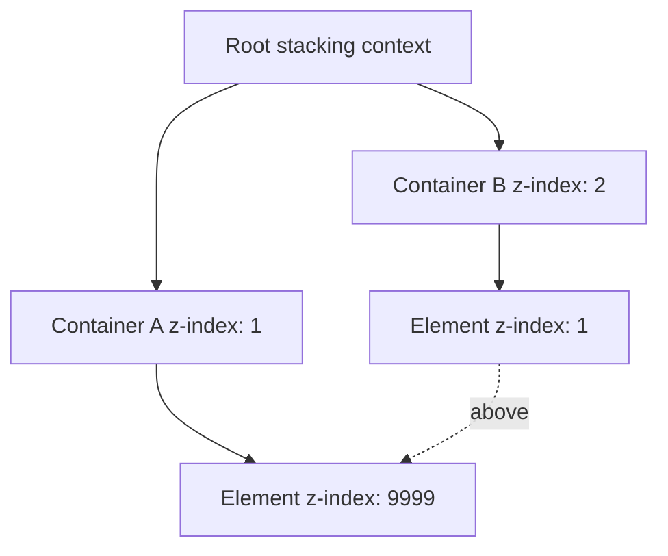
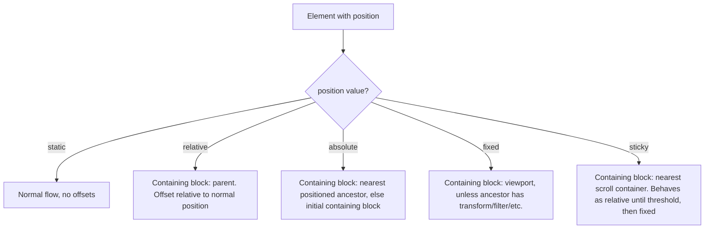
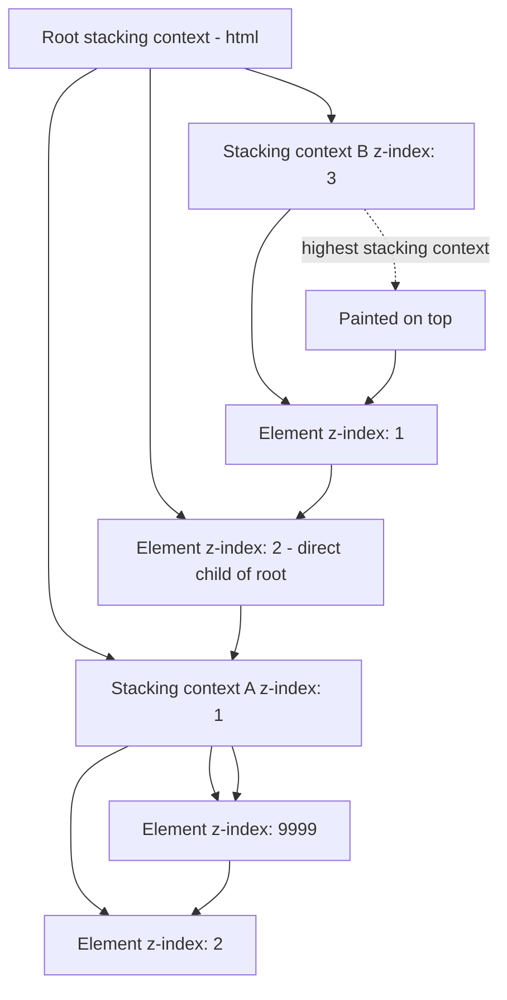
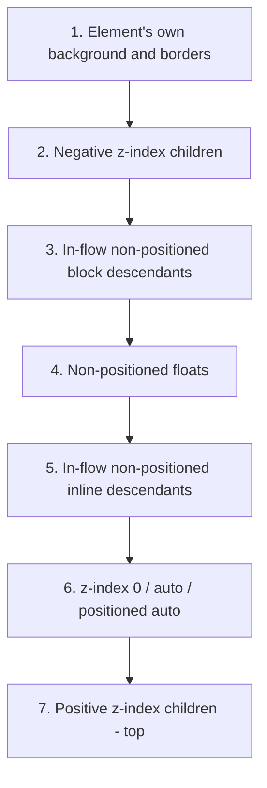
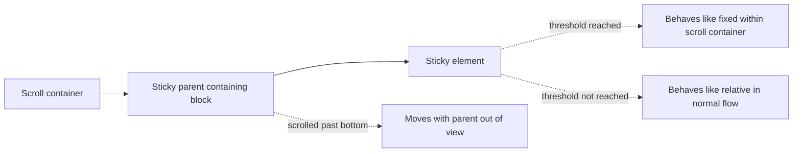

# 1.4 Positioning and Normal Flow

> Normal flow is the default layout model: boxes flow vertically (block) and horizontally (inline) according to their `display`. The `position` property lets you take elements out of normal flow and place them relative to a chosen reference point. This note covers normal flow in detail, every `position` value (`static`, `relative`, `absolute`, `fixed`, `sticky`), the containing block concept, the `inset` properties, the full stacking context system (and why `z-index: 9999` does not always work), sticky positioning pitfalls, and a brief tour of the new CSS anchor positioning API.

## 1.4.1 Objective

After reading this note you should be able to:

1. Describe normal flow precisely: how block and inline boxes flow, what their default positions are, and what removes an element from normal flow.
2. Use `position: static`, `relative`, `absolute`, `fixed`, and `sticky` correctly, and explain the containing block each one uses.
3. Explain what creates a stacking context (the complete list) and predict z-index resolution across nested contexts.
4. Diagnose "why does `z-index: 9999` not work?" with a systematic checklist.
5. Use `position: sticky` for headers and sidebars, including the common pitfalls (no parent overflow, no parent height).
6. Identify the new CSS anchor positioning API and explain the problem it solves (briefly).

## 1.4.2 Background Knowledge

### Reminders

- **Normal flow is the default.** Without `position` (or with `position: static`), elements participate in normal flow: block elements stack vertically, inline elements flow horizontally.
- **`position: relative` does not remove an element from normal flow.** It still occupies its normal-flow space. The `top`/`left`/etc. offsets visually shift it relative to its normal position, but the surrounding elements do not reflow.
- **`position: absolute`, `fixed`, and `sticky` (when stuck) all take the element out of normal flow.** Absolute and fixed elements do not affect the layout of siblings.
- **The containing block is the reference for `top`/`right`/`bottom`/`left` and for percentage-based `width`/`height`.** It is not always the parent.
- **`z-index` only works on positioned elements** (`relative`, `absolute`, `fixed`, `sticky`) and flex/grid items. A `z-index` on a `position: static` element does nothing.
- **A stacking context is a self-contained z-index universe.** Two elements in different stacking contexts cannot interleave their z-index ordering.
- **The `inset` shorthand** sets `top`, `right`, `bottom`, `left` at once. `inset: 0` is shorthand for all four being `0` (used to fill the containing block).
- **`top: 0; left: 0;` is different from `inset: 0`.** The latter sets all four to `0`, stretching the element to fill the containing block. The former sets only the top-left corner.

> [!note] Forgotten trivia
> `position: fixed` is normally relative to the viewport. But if any ancestor has `transform`, `filter`, `perspective`, `will-change: transform`, or `contain: paint`, then `position: fixed` becomes relative to *that ancestor* instead. This is one of the most-maligned behaviors in CSS and the source of countless "my fixed header scrolls with the page" bugs.

## 1.4.3 Core Concepts

### 1.4.3.1 Normal Flow

In normal flow:

- Block-level boxes stack vertically, each starting on a new line. Their `width` defaults to filling the containing block's content width.
- Inline-level boxes flow horizontally within a line box. They wrap to a new line when they run out of space.
- The vertical distance between block boxes is determined by their `margin-top` and `margin-bottom`, which **collapse** (see [[1.3 Box Model and Display]]).
- The horizontal distance between inline boxes is determined by their margins, padding, and the inter-word spacing of the text. Inline margins do not collapse.

What removes an element from normal flow:

- `position: absolute` or `position: fixed` — the element is taken out and positioned relative to its containing block.
- `float: left/right` — the element is taken out and shifted to one side; text wraps around it.
- `display: none` — the element is removed entirely (not just from flow, but from the render tree).

`position: relative` does NOT remove the element from normal flow — it remains in its normal position, but is *visually* shifted. The space it occupied is preserved.

### 1.4.3.2 The `position` Property Values

#### `position: static` (default)

The element participates in normal flow. `top`, `right`, `bottom`, `left`, and `z-index` have no effect.

#### `position: relative`

The element participates in normal flow (its space is preserved). Then `top`/`right`/`bottom`/`left` visually shift it from its normal position.

- `top: 10px` shifts down 10px.
- `left: -5px` shifts left 5px.
- The element's containing block for any *descendant* absolute children is the padding box of this relative element.
- `z-index` works.

Use cases: minor visual adjustments, establishing a containing block for absolute children, providing z-index layering.

#### `position: absolute`

The element is removed from normal flow. Its position is determined by `top`/`right`/`bottom`/`left` relative to its **containing block**, which is the nearest ancestor that is `position: relative`, `absolute`, `fixed`, or `sticky` (or has `transform`, `filter`, `perspective`, `will-change` of those, or `contain: layout/paint/strict/content`).

If no such ancestor exists, the containing block is the **initial containing block** (ICB), which is effectively the viewport for paged media or the document root's box.

- `width` and `height` `auto` (default) "shrink to fit" the content.
- Margins do not collapse.
- `z-index` works.

Use cases: tooltips, modals, dropdowns, badges positioned over content, decorative pseudo-elements.

#### `position: fixed`

The element is removed from normal flow and positioned relative to the **viewport** (with the same ancestor-transform caveat as above). It does not move when the page scrolls (unless one of the transform-creating ancestors scrolls).

Use cases: sticky headers, sticky footers, floating action buttons, modals.

#### `position: sticky`

A hybrid. The element participates in normal flow until its scroll position would move it past a threshold, at which point it behaves like `fixed` (relative to its scroll container). When the element's containing block scrolls out of view, the sticky element goes with it.

- Requires at least one of `top`, `right`, `bottom`, `left` to be set; otherwise it behaves like `static`.
- The sticky element is sticky *within its scroll container* (typically the viewport, but can be any scrollable ancestor).
- The containing block is the nearest block-level ancestor.

Use cases: sticky table headers, sticky section titles, sticky sidebars.

> [!warning] Sticky positioning pitfalls
> 1. If any ancestor has `overflow: hidden`, `auto`, or `scroll`, the sticky element sticks *within that ancestor's* scroll area, not the viewport.
> 2. If the parent has no height (e.g., a parent with only one sticky child), there is no room for the sticky element to scroll, so it appears to not stick at all. The parent must have height greater than the sticky child for sticking to happen.
> 3. The parent must be tall enough that the sticky element has somewhere to stick *to*. If the parent is the same height as the sticky child, no sticking occurs.
> 4. Sibling content can push the sticky element off-screen if it overflows.

### 1.4.3.3 The Containing Block

The containing block is the box used as the reference for:

- `top`/`right`/`bottom`/`left` for absolute and fixed elements.
- Percentage-based `width`/`height` of any element.
- Percentage-based `padding`/`margin` (these resolve against the *width* of the containing block, even for vertical values).

For most elements, the containing block is the content box of the parent. For absolutely positioned elements, it is the padding box of the nearest positioned ancestor. For fixed elements, it is the viewport (or the transformed ancestor).

### 1.4.3.4 The `inset` Properties

The `inset` shorthand sets all four offset properties:

```css
.modal { position: fixed; inset: 0; }
/* Same as: top: 0; right: 0; bottom: 0; left: 0; */
/* Stretches the modal to fill the viewport. */
```

You can also use logical properties: `inset-block-start`, `inset-block-end`, `inset-inline-start`, `inset-inline-end`. These adapt to writing mode (e.g., in vertical-rl, `inset-block-start` is on the right).

```css
.tooltip { position: absolute; inset-block-start: 100%; inset-inline-start: 0; }
```

### 1.4.3.5 Stacking Contexts

A **stacking context** is a self-contained z-index ordering. Within a stacking context, child elements are ordered by z-index. **Stacking contexts cannot interleave**: an element with `z-index: 1` inside a stacking context whose container has `z-index: 2` will always be above an element with `z-index: 9999` inside a different stacking context whose container has `z-index: 1`.

#### What creates a stacking context

The complete list (any of these creates one):

1. The root element (`<html>`) — always.
2. `position: absolute` or `position: relative` with `z-index` not `auto`.
3. `position: fixed` or `position: sticky` (always, regardless of `z-index`).
4. Flex items with `z-index` not `auto`.
5. Grid items with `z-index` not `auto`.
6. `opacity` less than `1`.
7. `transform` not `none`.
8. `filter` not `none`.
9. `perspective` not `none`.
10. `clip-path` not `none`.
11. `mask` / `mask-image` not `none`.
12. `will-change` with any of `transform`, `opacity`, `filter`, `perspective`, etc.
13. `isolation: isolate`.
14. `mix-blend-mode` not `normal`.
15. `contain: layout`, `contain: paint`, `contain: strict`, `contain: content`.
16. `column-count` or `column-width` not `auto` (multi-column).
17. `container-type: size` or `container-type: inline-size` (container queries — covered in [[1.7 Responsive Design and Container Queries]]).
18. `backdrop-filter` not `none`.

#### Why `z-index: 9999` does not always work

If you set `z-index: 9999` on an element inside a stacking context whose container is `z-index: 1`, and the competing element is `z-index: 2` in the root stacking context, the competing element wins. The `9999` only orders the element within its own stacking context — it does not raise the element above other stacking contexts.



In the diagram, `B1` (z-index 1 inside B which is z-index 2) is above `A1` (z-index 9999 inside A which is z-index 1), because B outranks A.

### 1.4.3.6 Stacking Order Within a Stacking Context

Within a single stacking context, elements are painted in this order (back to front):

1. The background and borders of the element that establishes the stacking context.
2. Stacking contexts (and elements) with negative z-index.
3. In-flow, non-positioned, non-z-indexed block-level descendants.
4. Non-positioned floats.
5. In-flow, non-positioned, inline-level descendants.
6. Stacking contexts (and elements) with z-index: 0 or `auto`, and positioned elements with `z-index: auto`.
7. Stacking contexts with positive z-index.

This is why a positioned element with `z-index: auto` can appear above non-positioned content but below positioned elements with positive z-index.

### 1.4.3.7 Anchor Positioning (Brief)

The new CSS Anchor Positioning API (currently shipping in Chromium 125+, in development elsewhere) lets you anchor an absolutely-positioned element to another element (the "anchor") without JavaScript. The anchor can be defined with `anchor-name` and consumed with `anchor()`.

```css
.button { anchor-name: --my-button; }
.tooltip {
  position: absolute;
  top: anchor(--my-button bottom);
  left: anchor(--my-button center);
  /* plus fallback positioning with @position-try */
}
```

This solves a long-standing problem: positioning a tooltip relative to a button that may scroll, resize, or move. Previously you needed JavaScript to compute the position. With anchor positioning, the browser handles it.

We mention it here for awareness; full coverage is beyond this note's scope. Most projects today still use libraries like Floating UI for this.

## 1.4.4 Detailed Walkthrough

Let us trace a common sticky-header bug.

```html
<div class="page">
  <header class="site-header">My Site</header>
  <main>
    <p>Long content...</p>
    <!-- ... -->
  </main>
</div>
```

```css
.site-header {
  position: sticky;
  top: 0;
  background: #fff;
  border-bottom: 1px solid #eee;
  padding: 1rem;
}
```

The user reports: "the sticky header doesn't stick."

Diagnosis checklist:

1. **Is `top` set?** Yes, `top: 0`. Good.
2. **Does any ancestor have `overflow: hidden/auto/scroll`?** Check `.page` and `body`. If `.page` has `overflow: hidden`, the sticky element sticks within `.page`'s scroll area. Since `.page` does not scroll (the body does), the sticky element does nothing.
3. **Is the parent tall enough?** The sticky element's containing block is `.page`. If `.page`'s height equals the header's height, there is no room to stick.
4. **Are there siblings between the sticky element and the bottom of its containing block?** Yes — `<main>` provides the height.

In this case, suppose `.page` had `overflow: hidden` because the developer used it to clear floats (the old clearfix trick). That is the bug. Fix: remove `overflow: hidden` from `.page` and use `display: flow-root` instead for float clearing.

Or, suppose `.page` has `height: 100vh` and `overflow: hidden`. Then the sticky element is sticky within `.page`, which does not scroll. The sticky element appears to not stick because the scroll container is elsewhere (likely `body`). Fix: make `.page` the scroll container (`overflow: auto`) or remove the height constraint.

The mental model: **sticky elements stick within their nearest scrollable ancestor.** If the nearest scrollable ancestor is the viewport, the element sticks within the viewport. If it is a `<div>` with `overflow: auto`, the element sticks within that div.

## 1.4.5 Practical Examples

### 1.4.5.1 Centering an Absolutely-Positioned Modal

```css
.modal-backdrop {
  position: fixed; inset: 0;
  background: rgba(0,0,0,0.5);
  display: grid; place-items: center;
}
.modal {
  background: #fff;
  border-radius: 0.5rem;
  padding: 2rem;
  max-width: 90vw; max-height: 90vh;
}
```

Modern, clean: `display: grid` + `place-items: center` centers the modal both axes. No need for `position: absolute` + `transform: translate(-50%, -50%)`.

### 1.4.5.2 Tooltip with Absolute Positioning

```css
.field { position: relative; }
.field[data-tooltip]::after {
  content: attr(data-tooltip);
  position: absolute;
  bottom: 100%; left: 50%;
  transform: translateX(-50%);
  margin-bottom: 0.5rem;
  padding: 0.25rem 0.5rem;
  background: #111; color: #fff;
  border-radius: 0.25rem;
  font-size: 0.875rem;
  white-space: nowrap;
  opacity: 0; pointer-events: none;
  transition: opacity 150ms;
}
.field:hover::after,
.field:focus-within::after { opacity: 1; }
```

The `.field` is `position: relative`, making it the containing block for the absolutely-positioned `::after`. The tooltip appears above the field on hover/focus.

### 1.4.5.3 Sticky Table Header

```css
.table-wrap { max-height: 400px; overflow: auto; }
.table { width: 100%; border-collapse: collapse; }
.table th {
  position: sticky; top: 0;
  background: #f5f5f5;
  z-index: 1;
}
.table td, .table th { padding: 0.5rem; border-bottom: 1px solid #eee; }
```

The `<th>` sticks to the top of `.table-wrap` (the scroll container). `z-index: 1` ensures the header stays above the body cells.

### 1.4.5.4 Sticky Sidebar with Main Content

```css
.layout {
  display: grid;
  grid-template-columns: 16rem 1fr;
  gap: 2rem;
  max-width: 64rem; margin: 0 auto;
}
.sidebar { position: sticky; top: 2rem; align-self: start; }
```

The `align-self: start` is critical: by default, grid items stretch to fill their grid area. If the sidebar stretches, it cannot stick (no room). `align-self: start` makes the sidebar take only its content height, leaving room to stick.

### 1.4.5.5 Stacking Context Debugging

```css
.parent { position: relative; opacity: 0.99; /* creates stacking context */ }
.parent .child { position: absolute; z-index: 9999; }
.sibling { position: absolute; z-index: 2; }
```

The `.child` (z-index 9999) is inside `.parent` (a stacking context due to `opacity: 0.99`). The `.sibling` (z-index 2) is in the root stacking context. If `.parent` is at z-index `auto` in the root context, the `.child` cannot appear above `.sibling` — the `.parent`'s stacking context is at the same level as `.sibling`, and within the root context, `.sibling`'s z-index 2 beats `.parent`'s z-index auto.

Fix: remove `opacity: 0.99` from `.parent` (it is not creating a stacking context for any good reason), or set an explicit `z-index: 3` on `.parent` to outrank `.sibling`.

### 1.4.5.6 Position-Relative for Inset Anchoring

```css
.badge-host { position: relative; }
.badge-host .badge {
  position: absolute; top: -0.5rem; right: -0.5rem;
  background: red; color: white;
  width: 1.5rem; height: 1.5rem;
  border-radius: 50%;
  display: grid; place-items: center;
  font-size: 0.75rem;
}
```

The badge is positioned relative to its host. Setting `top: -0.5rem; right: -0.5rem` lets it overflow the host's box.

## 1.4.6 Mermaid Diagrams

### 1.4.6.1 Position Values and Their Containing Blocks



### 1.4.6.2 Stacking Contexts and Z-Index



### 1.4.6.3 Stacking Order Within a Context



### 1.4.6.4 Sticky Positioning Mental Model



## 1.4.7 Common Mistakes

1. **Setting `position: sticky` and forgetting `top`/`bottom`/`left`/`right`.** Without at least one offset, sticky does nothing.

2. **Having an ancestor with `overflow: hidden` and being surprised that sticky does not stick.** The sticky element sticks within the overflow ancestor, which may not be the viewport.

3. **Using `z-index: 9999` inside a low-z-index stacking context.** The number is meaningless outside its context. Diagnose by walking up the DOM checking for stacking-context-creating properties.

4. **Adding `transform: translateZ(0)` to every element "for performance".** This creates a stacking context for every element, which can break z-index layering and is rarely needed. Use `will-change` sparingly and only when profiling shows a benefit.

5. **Forgetting that `opacity: 0.99` creates a stacking context.** This is the most surprising cause of "my modal is behind another element". Always check `opacity` when diagnosing z-index bugs.

6. **Using `position: absolute` for general layout.** Absolute positioning removes elements from flow, making them brittle to content changes. Use flex/grid for layout; reserve absolute for overlays, tooltips, and decorative elements.

7. **Setting `top: 50%; left: 50%; transform: translate(-50%, -50%)` for centering when grid is available.** Modern `display: grid; place-items: center` is simpler and does not require knowing the element's size.

8. **Expecting `position: fixed` to always be viewport-relative.** If any ancestor has `transform`, `filter`, `perspective`, or `will-change`, the fixed element is relative to that ancestor instead. This is the most-maligned CSS behavior.

## 1.4.8 Best Practices

1. **Prefer flex/grid for layout, not absolute positioning.** Absolute positioning is for overlays, tooltips, and decorative elements that should not affect surrounding content.

2. **Use `position: relative` to create a containing block for absolute children.** Do this on the closest reasonable ancestor, not on `<body>`.

3. **Use `position: sticky` for headers and section titles instead of JavaScript scroll listeners.** It is more performant (browser-native) and simpler.

4. **For `position: sticky` to work, ensure no ancestor has `overflow: hidden/auto/scroll` unless that ancestor is the intended scroll container.** Audit your CSS for stray `overflow` values.

5. **When debugging z-index issues, walk up the DOM and identify the stacking contexts.** DevTools' "Layers" panel can help. The fix is usually to either remove an unnecessary stacking context (e.g., `opacity: 0.99`) or set explicit z-index on the contexts.

6. **Reserve `z-index` ranges for your design system.** E.g., `1-9` for in-component layering, `10-99` for app-level (modals, drawers), `100+` for system-level (toasts). Document the ranges.

7. **Use `isolation: isolate` to intentionally create a stacking context.** It is the most explicit, side-effect-free way. Useful for widgets that should not leak z-index outside their boundary.

8. **Use `inset` shorthand for "fill the containing block".** `inset: 0` is much clearer than `top: 0; right: 0; bottom: 0; left: 0;`.

9. **Use logical properties (`inset-inline-start`, etc.) for internationalization.** They adapt to writing mode automatically.

## 1.4.9 Mini Exercises

### Exercise 1.4.A — Predict the Z-Index Outcome

**Problem:** Given:

```html
<div class="a"><div class="a-child"></div></div>
<div class="b"></div>
```

```css
.a { position: relative; opacity: 0.5; }
.a-child { position: absolute; z-index: 100; top: 0; left: 0; width: 50px; height: 50px; background: red; }
.b { position: absolute; z-index: 1; top: 0; left: 0; width: 50px; height: 50px; background: blue; }
```

Which color is visible at the top-left corner?

**Expected outcome:** The color and full reasoning.

**Worked solution:**

`.a` has `opacity: 0.5`, which creates a stacking context. `.a`'s z-index is `auto` (default), so within the root stacking context, `.a` is at z-index auto (level 6 in the within-context paint order — same as positioned with z-index auto).

`.b` has `z-index: 1` (positive). In the root stacking context, positive z-index beats auto.

`.a-child` has `z-index: 100` but is *inside* `.a`'s stacking context. Its z-index only matters within `.a`. The whole `.a` stacking context (including `.a-child`) is at the level of `.a`'s z-index in the root, which is auto.

So `.b` (z-index 1 in root) beats the entire `.a` stacking context (auto in root), regardless of `.a-child`'s z-index.

Final answer: **blue** is visible.

**Why it works:** Stacking contexts are non-interleaving. The `100` inside `.a` does not promote `.a` itself above `.b` in the root context.

**Common wrong approach:** "Red wins because z-index 100 beats z-index 1." This ignores the stacking context created by `opacity: 0.5`.

### Exercise 1.4.B — Fix a Sticky Header

**Problem:** A user reports their sticky header doesn't stick. Their HTML:

```html
<body>
  <div class="wrapper">
    <header class="site-header">Header</header>
    <main>Long content...</main>
  </div>
</body>
```

```css
.wrapper { overflow: hidden; /* clearfix */ max-width: 60rem; margin: 0 auto; }
.site-header { position: sticky; top: 0; background: #fff; }
```

Diagnose and fix.

**Expected outcome:** Diagnosis and fix.

**Worked solution:**

`.wrapper` has `overflow: hidden`. This makes `.wrapper` the scroll container for its sticky descendants — but `.wrapper` itself does not scroll (its content overflows the body, not the wrapper, because `overflow: hidden` clips rather than scrolls). So `.site-header` has no scroll container to stick within.

Fix: replace `overflow: hidden` with `display: flow-root` for the clearfix.

```css
.wrapper { display: flow-root; max-width: 60rem; margin: 0 auto; }
```

Now `.wrapper` does not have `overflow: hidden`, and the sticky header sticks to the viewport (the actual scroll container).

**Why it works:** `display: flow-root` clears floats and contains margins without creating a scroll container. The sticky element's nearest scrollable ancestor becomes the viewport, which is what we want.

**Common wrong approach:** Setting `top: 0` more emphatically (e.g., `top: 0 !important`). The problem is not the threshold; it is the scroll container.

### Exercise 1.4.C — Build a Tooltip with Absolute Positioning

**Problem:** Build an accessible tooltip that:
- Appears above the trigger on hover and focus.
- Is hidden by default (no pointer events, no a11y).
- Has a small arrow pointing down at the trigger.
- Uses no JavaScript.

**Expected outcome:** Complete HTML and CSS.

**Worked solution:**

```html
<button class="tooltip-trigger" aria-describedby="tip-1">Hover me</button>
<span class="tooltip" id="tip-1" role="tooltip">Helpful tip</span>
```

```css
.tooltip-trigger { position: relative; }
.tooltip {
  position: absolute;
  bottom: calc(100% + 0.5rem);
  left: 50%;
  transform: translateX(-50%);
  padding: 0.25rem 0.5rem;
  background: #111; color: #fff;
  border-radius: 0.25rem;
  font-size: 0.875rem;
  white-space: nowrap;
  opacity: 0;
  pointer-events: none;
  transition: opacity 150ms;
  z-index: 10;
}
.tooltip::after {
  content: "";
  position: absolute;
  top: 100%; left: 50%;
  transform: translateX(-50%);
  border: 5px solid transparent;
  border-top-color: #111;
}
.tooltip-trigger:hover + .tooltip,
.tooltip-trigger:focus-visible + .tooltip {
  opacity: 1;
}
```

**Why it works:**
- `.tooltip-trigger` is `position: relative`, so the absolutely-positioned tooltip anchors to it.
- `bottom: calc(100% + 0.5rem)` places the tooltip above the trigger with a gap.
- `transform: translateX(-50%)` centers horizontally.
- The arrow is a CSS triangle made from borders (a classic technique).
- `:hover + .tooltip` and `:focus-visible + .tooltip` show the tooltip on hover and keyboard focus respectively.
- `aria-describedby` links the tooltip to the trigger for screen readers (the actual reading depends on the SR; some libraries use `role="tooltip"`).

**Common wrong approach:** Using `visibility: hidden` instead of `opacity: 0` and forgetting `pointer-events: none`. The invisible tooltip eats pointer events, breaking hover on elements beneath it.

### Exercise 1.4.D — Diagnose a Fixed-Header Bug

**Problem:** A developer reports: "My fixed-position header scrolls with the page in this one section but not elsewhere." The HTML:

```html
<body>
  <main>
    <section class="hero">...</section>
    <section class="content">
      <header class="fixed-header">Sticky title</header>
      ...
    </section>
  </main>
</body>
```

```css
.fixed-header { position: fixed; top: 0; }
.content { transform: translateZ(0); /* GPU acceleration */ }
```

Diagnose and fix.

**Expected outcome:** Diagnosis and fix.

**Worked solution:**

`.content` has `transform: translateZ(0)`. Per the CSS spec, any element with `transform` becomes the containing block for its `position: fixed` descendants. So `.fixed-header` is no longer fixed to the viewport — it is fixed to `.content`. When `.content` scrolls (because it is taller than the viewport), the header scrolls with it.

Fix: remove `transform: translateZ(0)` from `.content`, or move the header outside `.content`, or accept that the header is fixed within `.content` (in which case `.content` must be the scroll container: `overflow: auto; height: 100vh`).

The cleanest fix is to remove the `transform`:

```css
.content { /* no transform */ }
```

If GPU acceleration was being added for a reason, profile to see if it is actually needed. Modern browsers handle most animations without `translateZ(0)` hacks.

**Why it works:** The CSS spec defines that `transform` (and `filter`, `perspective`, `will-change`, `contain: paint`) changes the containing block of fixed-position descendants. This is a hard rule, not a quirk.

**Common wrong approach:** Adding more `transform` or `will-change` to the header. The issue is the ancestor, not the header.

### Exercise 1.4.E — Modal Stacking

**Problem:** A user reports that a modal appears *behind* a sticky header, despite the modal having `z-index: 1000` and the header having `z-index: 10`. The CSS:

```css
.site-header { position: sticky; top: 0; z-index: 10; }
.modal { position: fixed; inset: 0; z-index: 1000; }
.modal-backdrop { position: fixed; inset: 0; background: rgba(0,0,0,0.5); z-index: 999; }
```

Investigation reveals the modal is rendered inside `<main>`, which has `isolation: isolate`. The header is a sibling of `<main>`.

Diagnose and fix.

**Expected outcome:** Diagnosis and fix.

**Worked solution:**

`<main>` has `isolation: isolate`, which creates a stacking context. The modal (z-index 1000) is *inside* `<main>`'s stacking context. The header (z-index 10) is *outside*, a direct child of `<body>`.

In the root stacking context, the order is:
- `<main>` (with `isolation: isolate`, default z-index auto)
- `.site-header` (z-index 10)

`.site-header`'s z-index 10 beats `<main>`'s auto. The entire `<main>` (including the modal) is below the header.

Fix: set an explicit `z-index` on `<main>` that is higher than the header, OR move the modal out of `<main>` (typically modals are rendered in a portal at the end of `<body>` for exactly this reason), OR remove the `isolation: isolate` from `<main>`.

Recommended fix: render the modal via a portal at the end of `<body>`. This is what React Portals do.

```html
<body>
  <header class="site-header">...</header>
  <main>...</main>
  <!-- Modal portaled here -->
  <div class="modal-backdrop"></div>
  <div class="modal"></div>
</body>
```

Now both the header and the modal are direct children of `<body>`. The modal's z-index 1000 beats the header's z-index 10.

**Why it works:** Stacking contexts are non-interleaving. The modal's z-index only matters within its stacking context. To win against the header, the modal must be in the same stacking context as the header (or in a higher one).

**Common wrong approach:** Bumping the modal's z-index to 9999. It does not help — the modal is still inside `<main>`'s stacking context.

## 1.4.10 Summary

- Normal flow is the default: blocks stack vertically, inlines flow horizontally.
- `position: static` (default), `relative` (in-flow, visually shifted), `absolute` (out of flow, relative to positioned ancestor), `fixed` (out of flow, relative to viewport unless an ancestor has transform/filter/etc.), `sticky` (in-flow until threshold, then fixed within scroll container).
- The containing block is the reference for offsets and percentage sizes.
- A stacking context is a self-contained z-index universe. Stacking contexts cannot interleave.
- Stacking contexts are created by: positioned-with-z-index, fixed/sticky always, opacity < 1, transform, filter, will-change, isolation, etc.
- `z-index: 9999` does not work if the element is in a lower stacking context than its competitor.
- Sticky positioning requires at least one inset property and a tall enough parent with no problematic overflow ancestor.
- Anchor positioning (new) lets you anchor an absolute element to another element without JavaScript.

## 1.4.11 Related Notes

- [[1.1 CSS Foundations]]
- [[1.2 Selectors and Cascade]]
- [[1.3 Box Model and Display]]
- [[1.5 Flexbox]]
- [[1.6 Grid]]
- [[1.7 Responsive Design and Container Queries]]
