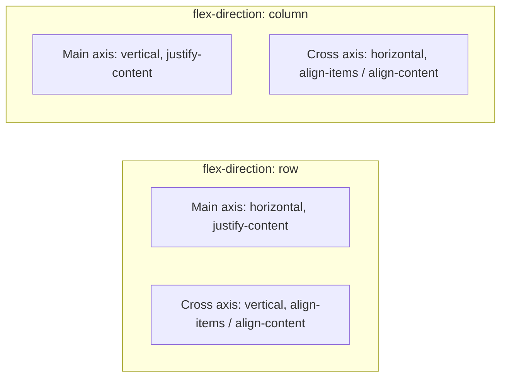
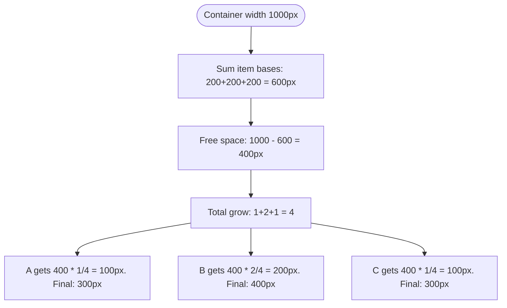
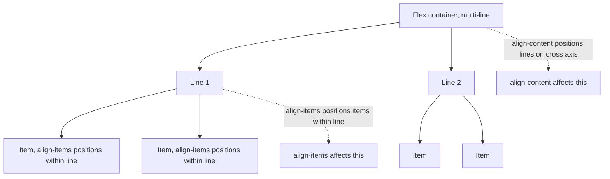
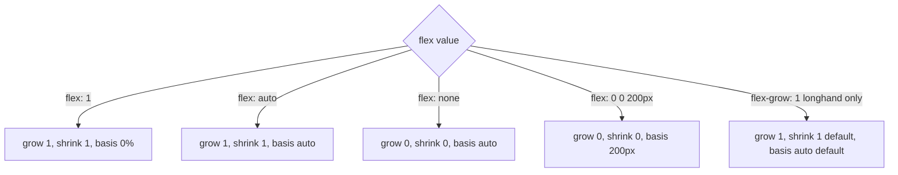

# 1.5 Flexbox

> Flexbox (CSS Flexible Box Layout) is a one-dimensional layout system: it lays out items in a single direction (row or column) and distributes space according to grow/shrink factors. It is the workhorse of modern UI layout — navigation bars, toolbars, card rows, centering, sidebars, anywhere you need "things in a line with sensible spacing". This note covers every flex container property, every flex item property, the actual algorithm for `flex-grow` space distribution (with worked examples), the `flex-basis` mental model, the `flex` shorthand gotchas, common production patterns, and the difference between `align-items` and `align-content` (the most-confused pair in all of CSS).

## 1.5.1 Objective

After reading this note you should be able to:

1. Use every flex container property (`display`, `flex-direction`, `flex-wrap`, `flex-flow`, `justify-content`, `align-items`, `align-content`, `gap`) and explain what each controls.
2. Use every flex item property (`flex-grow`, `flex-shrink`, `flex-basis`, `flex` shorthand, `align-self`, `order`) and explain how each interacts with the layout algorithm.
3. Manually compute the size of each flex item given a container width, item basis values, and grow/shrink factors — including the resolution of "free space" and the min-content constraint.
4. Avoid the `flex` shorthand gotchas (e.g., `flex: 1` vs `flex: 1 0 auto` vs `flex-grow: 1`).
5. Build common patterns: centering, navigation, sidebar layout, equal-height columns, equal-width columns, wrapping card grids.
6. Distinguish `align-items` (cross-axis alignment of items *within a line*) from `align-content` (cross-axis alignment of *lines* when wrapped) and know when each applies.

## 1.5.2 Background Knowledge

### Reminders

- **Flexbox is one-dimensional.** It lays out items along a single axis (the "main axis"). The other axis is the "cross axis". If you need two-dimensional layout, use [[1.6 Grid]].
- **Main axis vs cross axis.** In `flex-direction: row` (default), the main axis is horizontal (left-to-right in LTR) and the cross axis is vertical. In `flex-direction: column`, the main axis is vertical and the cross axis is horizontal. The cross axis is always perpendicular to the main axis.
- **`justify-*` controls main-axis alignment. `align-*` controls cross-axis alignment.** This is the most important mental model in flexbox. Memorize it.
- **Flex items are block-level by default** (their `display` outer is `block`). Inline-level flex containers (`inline-flex`) are inline in the parent, but their items are still laid out as flex items.
- **Margins of flex items do not collapse.** Unlike block layout, flex item margins are respected fully. Use `gap` instead of margins for cleaner code.
- **`gap` works in flexbox.** It is the modern replacement for the "margins between flex items" hack.
- **Flex items can shrink below their content size** by default, due to the implicit `min-width: auto`. To prevent shrinkage below content, set `min-width: 0` (or `min-height: 0` for column). This is the most common flexbox gotcha.
- **`flex-basis` is the initial size of a flex item *before* grow/shrink.** It is not the final size. The final size is `basis + grown - shrunk`.
- **The `flex` shorthand has specific default-fill behavior** that does NOT match what you'd expect from the longhands. We cover this in detail below.

> [!note] Forgotten trivia
> The default value of `flex` (when you do not set it at all) is `flex: 0 1 auto`. So every flex item can shrink by default, but cannot grow. The item's size is its `auto` size (which is usually its content size, or its specified `width`/`height`).

## 1.5.3 Core Concepts

### 1.5.3.1 Flex Container Properties

#### `display: flex` / `display: inline-flex`

Turns the element into a flex container. `inline-flex` makes the container itself inline-level in its parent.

```css
.row { display: flex; }       /* block-level flex container */
.inline-row { display: inline-flex; } /* inline-level flex container */
```

#### `flex-direction`

Sets the main axis.

```css
flex-direction: row;             /* default: left-to-right in LTR */
flex-direction: row-reverse;     /* right-to-left in LTR */
flex-direction: column;          /* top-to-bottom */
flex-direction: column-reverse;  /* bottom-to-top */
```

#### `flex-wrap`

Whether items wrap to a new line when they exceed the container's main-axis size.

```css
flex-wrap: nowrap;     /* default: shrink to fit, no wrap */
flex-wrap: wrap;       /* wrap to next line */
flex-wrap: wrap-reverse; /* wrap in reverse cross-axis order */
```

#### `flex-flow`

Shorthand for `flex-direction` and `flex-wrap`.

```css
flex-flow: row wrap; /* = flex-direction: row; flex-wrap: wrap; */
```

#### `justify-content`

Main-axis alignment of items *when there is free space*.

```css
justify-content: flex-start;    /* default: items packed to start */
justify-content: flex-end;      /* packed to end */
justify-content: center;        /* centered */
justify-content: space-between; /* first at start, last at end, equal space between */
justify-content: space-around;  /* equal space around each item (half at edges) */
justify-content: space-evenly;  /* equal space between and at edges */
```

Note: `justify-content` only matters when items do not fill the container. If `flex-grow` is set on items, they consume all free space, and `justify-content` has no effect.

#### `align-items`

Cross-axis alignment of items *within their line*.

```css
align-items: stretch;     /* default: stretch to fill the line's cross size */
align-items: flex-start;  /* packed to start of cross axis */
align-items: flex-end;    /* packed to end of cross axis */
align-items: center;      /* centered on cross axis */
align-items: baseline;    /* aligned by their text baseline */
```

#### `align-content`

Cross-axis alignment of *lines* when there are multiple lines (i.e., `flex-wrap: wrap` and items wrapped). Only has effect when there is free space on the cross axis.

```css
align-content: flex-start;
align-content: flex-end;
align-content: center;
align-content: stretch;        /* default: lines stretch to fill cross axis */
align-content: space-between;
align-content: space-around;
align-content: space-evenly;
```

> [!warning] align-items vs align-content
> This is the most-confused pair in CSS. `align-items` aligns items *within a single line*. `align-content` aligns *lines* relative to the container's cross axis. `align-content` only works when items wrap and there is free cross-axis space. If you have a single line of items, `align-content` does nothing.

#### `gap`

Space between flex items, applied only between (not at the edges).

```css
.row { display: flex; gap: 1rem; }       /* 1rem between items */
.row { display: flex; gap: 0.5rem 1rem; } /* row-gap column-gap */
```

`gap` is shorthand for `row-gap` and `column-gap`. In flexbox, "row" is along the cross axis (between lines) and "column" is along the main axis (between items in a row), regardless of `flex-direction`. Wait — actually, `row-gap` and `column-gap` in flex follow the writing direction, not the flex direction. So in `flex-direction: column`, `row-gap` is still between rows of the writing mode. We will keep it simple: `gap: X` sets both.

### 1.5.3.2 Flex Item Properties

#### `flex-grow`

A unitless number (`0` default). When there is free space on the main axis, it is distributed to items proportional to their `flex-grow` value. `flex-grow: 2` gets twice as much free space as `flex-grow: 1`.

#### `flex-shrink`

A unitless number (`1` default). When there is *negative* free space (items overflow the container), items shrink proportional to their `flex-shrink` value (and their basis, per the algorithm).

#### `flex-basis`

The initial size of the item before grow/shrink. Default: `auto` (use the item's `width`/`height`, or its content size if not set). Can be any length (`200px`, `20%`, `10rem`) or `content` (use content size, ignoring `width`/`height`).

#### `flex` shorthand

```css
flex: none;        /* = 0 0 auto */
flex: 1;           /* = 1 1 0 */
flex: auto;        /* = 1 1 auto */
flex: 2 3 200px;   /* grow 2, shrink 3, basis 200px */
```

The shorthand has a critical gotcha: **`flex: <number>` (one value, no unit) sets `flex-basis: 0%`**, not `auto`. This is different from the longhand `flex-grow: <number>` which leaves basis at `auto`. The result: `flex: 1` makes the item's basis 0, so all items with `flex: 1` start equal and grow equally, ignoring content size differences. `flex-grow: 1` (longhand) leaves basis at `auto`, so items start at their content size and only the leftover space is distributed equally.

Common recommended values:

```css
flex: 0 1 auto;   /* default - shrinkable, content-sized */
flex: 1;          /* equal-width columns that share free space */
flex: 0 0 auto;   /* fixed-size, no grow/shrink */
flex: auto;       /* growable + shrinkable, content-sized */
flex: none;       /* not flexible - use specified width/height */
```

#### `align-self`

Per-item override of `align-items`.

```css
align-self: auto | flex-start | flex-end | center | baseline | stretch;
```

#### `order`

Reorders items visually. Default `0`. Negative values move earlier, positive later.

```css
.first { order: -1; }
.last { order: 1; }
```

> [!warning] order and accessibility
> `order` only changes the visual order, not the DOM order. Screen readers and keyboard navigation follow DOM order. If you reorder visually, you can confuse keyboard users. Use `order` sparingly, and prefer to fix the DOM order when possible.

### 1.5.3.3 How `flex-grow` Distributes Space

The algorithm:

1. Compute the main-axis size of the container (e.g., 1000px).
2. For each item, find its **hypothetical main size**: `flex-basis` if specified, else `width`, else content size.
3. Sum the hypothetical sizes. If sum < container size: free space = container - sum (positive). If sum > container: free space is negative (overflow).
4. **If free space is positive and at least one item has `flex-grow > 0`**: distribute free space proportionally to `flex-grow`. Each item gets `free_space * (grow_i / total_grow)`.
5. **If free space is negative and at least one item has `flex-shrink > 0`**: distribute the negative space proportionally to `flex-shrink * basis` (this is the scaled-shrink formula; items with larger basis shrink more for the same `flex-shrink`).
6. After distribution, clamp each item to its `min` and `max` sizes. **`min-width: auto` (default) means items cannot shrink below their min-content size** — this is why flex items "refuse" to shrink past their content.

Worked example: container 1000px, items A (basis 200px, grow 1), B (basis 200px, grow 2), C (basis 200px, grow 1).

1. Total basis = 600px. Free space = 1000 - 600 = 400px.
2. Total grow = 1 + 2 + 1 = 4.
3. A gets 400 * (1/4) = 100px. Final A = 200 + 100 = 300px.
4. B gets 400 * (2/4) = 200px. Final B = 200 + 200 = 400px.
5. C gets 400 * (1/4) = 100px. Final C = 200 + 100 = 300px.

If container were 500px (overflow by 100px) and shrink values all `1`:
1. Total basis = 600px. Free = -100px.
2. Scaled shrink factor = basis * shrink = 200*1 = 200 for each.
3. Total scaled = 600.
4. Each item shrinks by `-100 * (200/600) = -33.33px`.
5. Final A = B = C = 200 - 33.33 = 166.67px.

But: if any item has `min-width: 200px` (explicit) or content min-width larger than 166.67px, it will be clamped, and the algorithm redistributes to others.

### 1.5.3.4 `flex-basis` Mental Model

`flex-basis` answers: "What size does this item *start* at, before grow/shrink?"

- `flex-basis: auto` (default) — use the `width` (or `height` in column) property. If neither is set, use the content size.
- `flex-basis: 0` — start at zero. All space is "free space" and is distributed by `flex-grow`. This is why `flex: 1` (which sets basis to 0) makes equal-width columns regardless of content.
- `flex-basis: 200px` — start at 200px.
- `flex-basis: content` — use content size, even if `width` is set. (Newer value.)

The shorthand `flex: 1` setting basis to 0 is the source of the most common flex gotcha: engineers expecting `flex: 1` to "share leftover space equally" but finding that the columns are *exactly* equal width (ignoring content). That is the spec behavior. Use `flex-grow: 1` (longhand, leaves basis at auto) if you want "share leftover space, but keep content size as the base".

### 1.5.3.5 The `min-width: auto` Trap

By default, flex items have `min-width: auto` (or `min-height: auto` in column), which means **the item cannot shrink below its min-content size**. This is good for text content (you don't want a button to shrink to nothing) but breaks layouts where you want an item to actually shrink.

Symptom: a flex row with a long text item overflows instead of wrapping the text, because the item refuses to shrink below its content size.

Fix: set `min-width: 0` (or `min-height: 0` in column) on the item. Now it can shrink below content size, and text will wrap.

```css
.row { display: flex; }
.row .text { flex: 1; min-width: 0; /* allow shrinking below content */ overflow: hidden; text-overflow: ellipsis; white-space: nowrap; }
```

This is THE flexbox gotcha. Memorize it.

### 1.5.3.6 `align-items` vs `align-content`

Recap with a clear example:

```css
.container { display: flex; flex-wrap: wrap; height: 400px; align-items: flex-start; align-content: center; }
.item { width: 100px; height: 80px; }
```

If there are 10 items, they wrap to multiple lines. Each line is 80px tall (item height).

- `align-items: flex-start` — within each line, items are at the top of the line (their cross-axis position within the line).
- `align-content: center` — the *lines* are centered vertically within the 400px container.

If `align-items: stretch`, items stretch to fill their line. If `align-content: stretch`, lines stretch to fill the container.

If there is only one line of items, `align-content` has no effect (there is no free cross-axis space to distribute — the single line already fills or not).

### 1.5.3.7 Common Patterns

We will cover these in detail in Practical Examples below:
- Perfect centering (one line, two properties).
- Horizontal nav bar with even spacing.
- Sidebar + main content (one fixed, one fluid).
- Equal-height columns.
- Wrapping card grid.
- Sticky footer.

## 1.5.4 Detailed Walkthrough

Let us build a sidebar layout and trace the algorithm.

```html
<div class="layout">
  <aside class="sidebar">Sidebar</aside>
  <main class="main">Main content</main>
</div>
```

```css
.layout { display: flex; gap: 1rem; min-height: 100vh; }
.sidebar { flex: 0 0 16rem; /* fixed 16rem, no grow, no shrink */ }
.main { flex: 1; /* growable, basis 0 */ }
```

Step by step:

1. `.layout` is `display: flex`. Default direction is `row`. Main axis is horizontal.
2. `gap: 1rem` adds 1rem between flex items.
3. `.sidebar`: `flex: 0 0 16rem` = grow 0, shrink 0, basis 16rem. The sidebar is fixed at 16rem; it cannot grow or shrink.
4. `.main`: `flex: 1` = grow 1, shrink 1, basis 0%. The main starts at 0 and grows to consume all free space.
5. Compute: container width = (viewport - padding). Sidebar basis = 16rem. Gap = 1rem. Main basis = 0.
6. Total basis = 16rem + 0 = 16rem. Gap takes 1rem. Free space = (container width) - 16rem - 1rem.
7. Only `.main` has `flex-grow > 0`, so it gets all the free space. Final main width = 0 + free space = (container - 16rem - 1rem).

If the container is, say, 80rem wide:
- Sidebar = 16rem. Gap = 1rem. Main = 80 - 16 - 1 = 63rem.

If we shrink the viewport to 30rem:
- Sidebar = 16rem (does not shrink because flex-shrink is 0). Gap = 1rem. Main = 30 - 16 - 1 = 13rem. Still works.

If we shrink to 17rem:
- Sidebar = 16rem. Gap = 1rem. Main = 17 - 16 - 1 = 0rem. The main disappears (or hits its min-width: auto, content size, which is the text "Main content" — about 8rem. So main stays at content size and the layout overflows).

This is the responsive breaking point. Below 17rem + content, the layout breaks. The fix is a media query (covered in [[1.7 Responsive Design and Container Queries]]) that switches to a stacked layout on small screens.

## 1.5.5 Practical Examples

### 1.5.5.1 Perfect Centering

```css
.center { display: flex; place-items: center; min-height: 100vh; }
/* place-items = align-items + justify-items (justify-items is ignored in flex; use justify-content) */
```

Actually, `place-items` in flexbox is just `align-items`. The `justify-items` part is ignored. The correct full pattern:

```css
.center { display: flex; align-items: center; justify-content: center; min-height: 100vh; }
```

Or with grid (cleaner):

```css
.center { display: grid; place-items: center; min-height: 100vh; }
```

### 1.5.5.2 Horizontal Nav Bar

```html
<nav class="nav">
  <a href="/">Home</a>
  <a href="/about">About</a>
  <a href="/contact">Contact</a>
  <span class="spacer"></span>
  <a href="/login">Login</a>
</nav>
```

```css
.nav { display: flex; align-items: center; gap: 1rem; padding: 1rem; }
.spacer { flex: 1; }
```

The `flex: 1` on the spacer pushes the "Login" link to the right end. This is the canonical "justify-between without three children" pattern.

### 1.5.5.3 Sidebar + Main (already covered above)

### 1.5.5.4 Equal-Height Columns

```html
<div class="cards">
  <article class="card">Short</article>
  <article class="card">Longer text that wraps to multiple lines and makes this card taller than the others.</article>
  <article class="card">Medium text</article>
</div>
```

```css
.cards { display: flex; gap: 1rem; align-items: stretch; /* default */ }
.card { flex: 1; padding: 1rem; border: 1px solid #eee; }
```

By default, `align-items: stretch` makes all cards the same height (the height of the tallest). `flex: 1` makes them equal width.

### 1.5.5.5 Wrapping Card Grid

```css
.cards { display: flex; flex-wrap: wrap; gap: 1rem; }
.card { flex: 1 1 18rem; /* growable, shrinkable, basis 18rem */ min-width: 18rem; }
```

Each card starts at 18rem. If the container is 60rem wide, 3 cards fit per row (3 * 18 + 2 * 1 gap = 56rem; 4 would be 4*18 + 3*1 = 75rem — too wide, so 3 per row). When the container shrinks, the cards wrap. The `flex: 1 1 18rem` lets cards grow to fill the row (so the last row's items might be wider than 18rem if there are fewer of them).

If you want fixed card sizes (no growing), use `flex: 0 0 18rem`.

### 1.5.5.6 Sticky Footer

```html
<body class="page">
  <header>...</header>
  <main>...</main>
  <footer>...</footer>
</body>
```

```css
.page { display: flex; flex-direction: column; min-height: 100vh; }
main { flex: 1; }
```

The `main` grows to fill the space between header and footer, pushing the footer to the bottom even when content is short.

### 1.5.5.7 The `min-width: 0` Text Truncation Pattern

```html
<div class="row">
  <strong>Longname:</strong>
  <span class="truncate">A very long text that should be truncated with ellipsis when it overflows.</span>
</div>
```

```css
.row { display: flex; gap: 0.5rem; }
.truncate { flex: 1; min-width: 0; overflow: hidden; text-overflow: ellipsis; white-space: nowrap; }
```

Without `min-width: 0`, the `.truncate` element would refuse to shrink below its content's min size, and the text would push the row wider than the container.

### 1.5.5.8 Centered Icon + Text

```html
<button class="btn">
  <svg class="icon">...</svg>
  <span>Click me</span>
</button>
```

```css
.btn { display: inline-flex; align-items: center; gap: 0.5rem; }
.icon { width: 1.25em; height: 1.25em; }
```

`inline-flex` keeps the button inline (it sizes to its content). `align-items: center` vertically centers the icon and text. `gap` provides spacing.

## 1.5.6 Mermaid Diagrams

### 1.5.6.1 Flex Axes



### 1.5.6.2 flex-grow Space Distribution



### 1.5.6.3 align-items vs align-content



### 1.5.6.4 flex Shorthand Resolution



## 1.5.7 Common Mistakes

1. **Using `flex: 1` and being surprised that items are exactly equal width regardless of content.** `flex: 1` sets basis to 0, so all space is "free" and distributed equally. If you want items to start at content size and share leftover, use `flex-grow: 1` (longhand) or `flex: 1 1 auto`.

2. **Forgetting `min-width: 0` on flex items with text.** The item refuses to shrink below its content's min size, breaking layouts. Add `min-width: 0` (or `min-height: 0` in column) to allow shrinking.

3. **Confusing `align-items` and `align-content`.** `align-items` aligns items within their line. `align-content` aligns lines within the container (only when items wrap and there is free cross-axis space).

4. **Setting `justify-content` and `flex-grow: 1` together.** When items grow, they consume all free space, so `justify-content` has no effect. The two are mutually exclusive in practice.

5. **Using `order` to reorder for visual reasons without considering keyboard navigation.** Screen reader and Tab order follow DOM order, not visual order. This can confuse keyboard users.

6. **Setting `flex: 1 1 auto` and expecting equal-width columns.** `auto` basis means each item starts at its content size, so columns with different content get different widths. Use `flex: 1 1 0` (or `flex: 1`) for equal widths.

7. **Expecting `align-content: center` to center a single line of items.** It does not. For a single line, use `align-items: center`.

8. **Using `flex-wrap: nowrap` (default) with too many items and being surprised they shrink to fit.** Either enable `flex-wrap: wrap` or set explicit `flex-shrink: 0` on items that should not shrink.

9. **Setting `width` on a flex item and being confused that `flex-basis` overrides it.** `flex-basis` (if not `auto`) takes precedence over `width`. Set only one.

10. **Forgetting that flex items are block-level by default.** They fill the cross axis (height) unless `align-items: flex-start` or content-sized.

## 1.5.8 Best Practices

1. **Use `gap` instead of margins between flex items.** Cleaner, no collapse, no edge cases, reset by the container not the items.

2. **Use `flex: 1` for "equal share of free space" and `flex: 0 0 X` for fixed sizes.** Be intentional about which behavior you want.

3. **Add `min-width: 0` (or `min-height: 0`) to any flex item that contains text and should be allowed to shrink.** This is the single most important flexbox habit.

4. **Use `flex-direction: column` for vertical stacks (page layout, modals).** Do not abuse `flex-direction: row` for everything.

5. **Reserve `order` for genuinely responsive reordering, paired with media queries.** Avoid using it for visual styling — fix the DOM order instead.

6. **Use `inline-flex` for inline-level components (buttons, badges, chips).** It sizes to content and respects the inline flow.

7. **Use `align-items: baseline` for typography-heavy rows** where you want text baselines aligned (e.g., label + input rows).

8. **Avoid mixing flex and absolute positioning for layout.** Use absolute positioning for overlays (tooltips, dropdowns) that should not affect siblings; use flex for the surrounding layout.

9. **For wrapping card grids, consider CSS Grid (`grid-template-columns: repeat(auto-fill, minmax(X, 1fr))`) instead of flexbox.** Grid handles wrapping more cleanly. We cover this in [[1.6 Grid]].

10. **Audit your `flex` shorthands.** `flex: 1`, `flex: auto`, `flex: none`, `flex: 0 0 X` cover 95% of cases. Longhands are rarely needed but are clearer when you want only one behavior changed.

## 1.5.9 Mini Exercises

### Exercise 1.5.A — Compute flex-grow Distribution

**Problem:** A 1200px-wide flex row contains four items with these flex values:

- A: `flex: 1 0 100px`
- B: `flex: 2 0 200px`
- C: `flex: 1 0 150px`
- D: `flex: 0 0 200px`

Compute each item's final width.

**Expected outcome:** Four widths.

**Worked solution:**

1. Sum of bases = 100 + 200 + 150 + 200 = 650px.
2. Free space = 1200 - 650 = 550px.
3. Total grow = 1 + 2 + 1 + 0 = 4.
4. D has grow 0, so it stays at its basis (200px).
5. A gets 550 * (1/4) = 137.5px. Final A = 100 + 137.5 = **237.5px**.
6. B gets 550 * (2/4) = 275px. Final B = 200 + 275 = **475px**.
7. C gets 550 * (1/4) = 137.5px. Final C = 150 + 137.5 = **287.5px**.
8. D = **200px**.

Check: 237.5 + 475 + 287.5 + 200 = 1200. Correct.

**Why it works:** Free space is distributed proportionally to grow factors. Items with grow 0 do not participate in distribution.

**Common wrong approach:** Assuming all items grow equally. They don't — B grows twice as much as A and C.

### Exercise 1.5.B — Diagnose a Truncation Failure

**Problem:** A user reports: "My text doesn't truncate, it overflows." Their code:

```html
<div class="row">
  <strong>Name:</strong>
  <span class="text">A very long text that should truncate.</span>
</div>
```

```css
.row { display: flex; gap: 0.5rem; }
.text { flex: 1; overflow: hidden; text-overflow: ellipsis; white-space: nowrap; }
```

Diagnose and fix.

**Expected outcome:** Diagnosis and one-line fix.

**Worked solution:**

The `.text` has `flex: 1` but no `min-width: 0`. Flex items default to `min-width: auto`, which means they refuse to shrink below their content's min-content size. The text's min-content size is the longest unbreakable word (or the whole thing if `white-space: nowrap`). So the item refuses to shrink, and the row overflows.

Fix:

```css
.text { flex: 1; min-width: 0; overflow: hidden; text-overflow: ellipsis; white-space: nowrap; }
```

**Why it works:** `min-width: 0` overrides the default `auto`, allowing the item to shrink below its content size. Now `overflow: hidden` + `text-overflow: ellipsis` work as intended.

**Common wrong approach:** Removing `flex: 1` or `white-space: nowrap`. Those are correct; the bug is the missing `min-width`.

### Exercise 1.5.C — Build a Card Row That Wraps

**Problem:** Build a row of cards that:
- Are at least 16rem wide.
- Grow to fill the available row width.
- Wrap to a new line when they would otherwise be less than 16rem.
- Have 1rem gap between them.

**Expected outcome:** Complete HTML and CSS.

**Worked solution:**

```html
<div class="cards">
  <article class="card">One</article>
  <article class="card">Two</article>
  <article class="card">Three</article>
  <article class="card">Four</article>
  <article class="card">Five</article>
</div>
```

```css
.cards {
  display: flex;
  flex-wrap: wrap;
  gap: 1rem;
}
.card {
  flex: 1 1 16rem;
  min-width: 16rem;
  padding: 1.5rem;
  border: 1px solid #eee;
  border-radius: 0.5rem;
}
```

**Why it works:**
- `flex-wrap: wrap` lets items wrap.
- `flex: 1 1 16rem` — grow 1, shrink 1, basis 16rem. Each card starts at 16rem and grows to fill the row.
- `min-width: 16rem` ensures cards never shrink below 16rem. (This is somewhat redundant with the basis, but explicit is better — it guarantees no shrinking even if the algorithm wants to.)
- `gap: 1rem` provides spacing.

Behavior at various widths:
- 16rem width: 1 card per row, fills 16rem.
- 33rem width (16 + 1 + 16 = 33): 2 cards per row.
- 50rem: 3 cards per row.
- 67rem: 4 cards per row.
- 84rem: 5 cards per row.

The cards grow to fill the row evenly (because `flex-grow: 1` on all).

**Common wrong approach:** Using `flex: 0 0 16rem`. This makes cards fixed at 16rem — they will not grow to fill the row, leaving empty space at the right. The grow factor is what makes them fill.

### Exercise 1.5.D — Centering Comparison

**Problem:** Compare three ways to center a single child element both horizontally and vertically inside a parent. Identify the pros and cons of each.

**Expected outcome:** Three solutions with trade-offs.

**Worked solution:**

**Solution 1: Flexbox**

```css
.parent { display: flex; align-items: center; justify-content: center; }
```

- Pros: Works for any child, simple, no need to know the child's size.
- Cons: Affects all children of `.parent` (they all become flex items).

**Solution 2: Grid**

```css
.parent { display: grid; place-items: center; }
```

- Pros: Simplest possible. `place-items: center` centers on both axes.
- Cons: Affects all children. Becomes a grid container.

**Solution 3: Absolute positioning + transform**

```css
.parent { position: relative; }
.child { position: absolute; top: 50%; left: 50%; transform: translate(-50%, -50%); }
```

- Pros: Does not affect siblings (child is out of flow).
- Cons: Requires knowing that the child should be out of flow. The child no longer affects parent's size. Can cause issues if the child is larger than the parent (it overflows both sides equally).

**Recommendation:** Use grid (`place-items: center`) when the parent is a layout container. Use absolute positioning when the child is an overlay (modal, tooltip) that should not affect siblings.

**Common wrong approach:** Using `text-align: center; line-height: <parent-height>;` — this only works for single-line text and is fragile.

### Exercise 1.5.E — Sidebar Layout with Stacking on Mobile

**Problem:** Build a sidebar + main layout where:
- On screens ≥ 48rem, sidebar is 16rem wide on the left, main takes the rest.
- On screens < 48rem, the sidebar moves above the main, full width.
- Use flexbox and a media query.

**Expected outcome:** Complete HTML and CSS.

**Worked solution:**

```html
<div class="layout">
  <aside class="sidebar">Sidebar</aside>
  <main class="main">Main content</main>
</div>
```

```css
.layout {
  display: flex;
  flex-direction: column; /* mobile-first: stacked */
  gap: 1rem;
  max-width: 60rem;
  margin: 0 auto;
  padding: 1rem;
}

.sidebar { /* full width on mobile, no flex needed */ }
.main { /* full width on mobile */ }

@media (min-width: 48rem) {
  .layout { flex-direction: row; }
  .sidebar { flex: 0 0 16rem; }
  .main { flex: 1; min-width: 0; }
}
```

**Why it works:**
- Mobile-first: default styles are for the stacked layout.
- The media query overrides for wider screens, switching to `flex-direction: row` and giving the sidebar a fixed basis.
- `min-width: 0` on `.main` allows it to shrink below content size — important if the main contains long text or a flex row of its own.

**Common wrong approach:** Writing desktop-first CSS and adding a `max-width` media query. Mobile-first is the modern best practice because it forces you to design for small screens first, then enhance.

## 1.5.10 Summary

- Flexbox is one-dimensional. `flex-direction: row` (default) is horizontal main axis; `column` is vertical.
- `justify-*` is main-axis; `align-*` is cross-axis.
- Container properties: `display`, `flex-direction`, `flex-wrap`, `flex-flow`, `justify-content`, `align-items`, `align-content`, `gap`.
- Item properties: `flex-grow`, `flex-shrink`, `flex-basis`, `flex` (shorthand), `align-self`, `order`.
- `flex: 1` = `1 1 0%` (equal share of all space). `flex: 1 1 auto` = grow from content size. `flex: 0 0 X` = fixed size.
- `min-width: auto` (default) prevents flex items from shrinking below content size. Set `min-width: 0` to allow shrinking (essential for text truncation).
- `align-items` aligns items within their line; `align-content` aligns lines within the container (only when wrapping).
- Use `gap` instead of margins. Use `inline-flex` for inline-level components. Use flexbox for one-dimensional layouts, grid for two-dimensional.

## 1.5.11 Related Notes

- [[1.1 CSS Foundations]]
- [[1.2 Selectors and Cascade]]
- [[1.3 Box Model and Display]]
- [[1.4 Positioning and Normal Flow]]
- [[1.6 Grid]]
- [[1.7 Responsive Design and Container Queries]]
