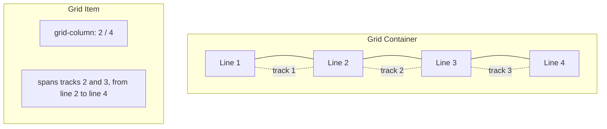
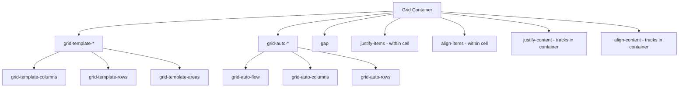
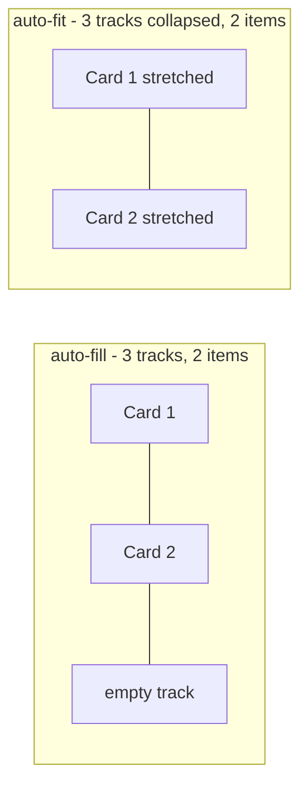
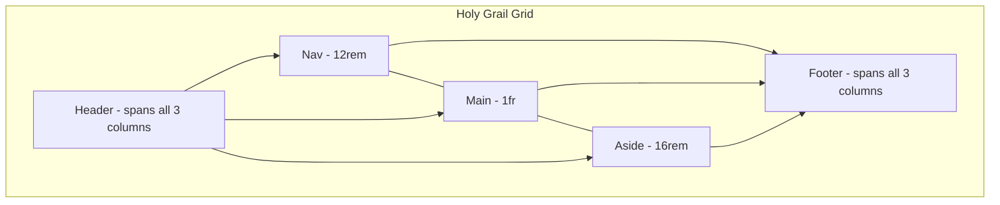

# 1.6 Grid

> CSS Grid Layout is a two-dimensional layout system: you define rows and columns, then place items into the resulting grid cells, optionally spanning multiple cells. Grid is the right tool for page-level layout, dashboards, complex card layouts, and anywhere you need to control both axes simultaneously. This note covers every grid container property, every grid item property, the `fr` unit and `minmax()`, the `repeat()` function, `auto-fill` vs `auto-fit` (and the critical difference between them), implicit vs explicit tracks, subgrid, container queries (briefly), and the difference between masonry and grid.

## 1.6.1 Objective

After reading this note you should be able to:

1. Use every grid container property (`display`, `grid-template-columns`, `grid-template-rows`, `grid-template-areas`, `grid-auto-flow`, `grid-auto-columns`, `grid-auto-rows`, `gap`, `justify-items`, `align-items`, `justify-content`, `align-content`, `place-items`, `place-content`) and explain what each controls.
2. Use every grid item property (`grid-column`, `grid-row`, `grid-area`, `justify-self`, `align-self`, `place-self`, `order`) and explain the difference between `justify-items` (container) and `justify-self` (item).
3. Explain the `fr` unit, `minmax()`, `repeat()`, and `auto-fill` vs `auto-fit` — including the visual difference between `auto-fill` and `auto-fit` when there are fewer items than tracks.
4. Distinguish explicit tracks (defined by `grid-template-*`) from implicit tracks (created by `grid-auto-*` when items overflow).
5. Use `subgrid` to align a nested grid's tracks to its parent's tracks.
6. Choose between flexbox and grid for a given layout, and explain when each is appropriate.

## 1.6.2 Background Knowledge

### Reminders

- **Grid is two-dimensional.** You control both rows and columns simultaneously. Use it for page layouts, dashboards, multi-row card grids. Use [[1.5 Flexbox]] for one-dimensional layouts (a single row or column).
- **Grid tracks are the rows and columns.** Cells are the intersections. Lines are the boundaries (numbered from 1). Areas are named regions.
- **Grid lines are numbered starting from 1.** For a grid with 3 columns, there are 4 vertical lines: 1, 2, 3, 4. Negative numbers count from the end: -1 is the last line.
- **`grid-template-columns: 1fr 1fr 1fr` creates 3 equal-width columns.** The `fr` unit distributes free space proportionally. `2fr 1fr` makes the first column twice as wide as the second.
- **`gap` (formerly `grid-gap`) works in grid.** Same as flexbox.
- **Grid items are placed automatically** into the next available cell, in source order, by default. You can override with `grid-column` and `grid-row` to place items explicitly.
- **Grid items are stretched by default** (`justify-items: stretch`, `align-items: stretch`). They fill their cell unless overridden.
- **`grid-template-areas` lets you name cells** with ASCII-art-like syntax, then assign items to named areas with `grid-area: name`. This is the most readable grid syntax for page layouts.
- **`subgrid` lets a nested grid inherit the parent's track definitions.** Without subgrid, nested grids have their own independent tracks. This is critical for aligning nested content to parent columns.
- **Container queries (covered in [[1.7 Responsive Design and Container Queries]]) interact with grid** via `container-type`. A grid container can also be a query container.

> [!note] Forgotten trivia
> `grid-template-areas` requires every row to have the same number of cells (you can use `.` for empty cells). If you make a typo, the whole `grid-template-areas` declaration is invalid and silently ignored.

## 1.6.3 Core Concepts

### 1.6.3.1 Grid Container Properties

#### `display: grid` / `display: inline-grid`

Turns the element into a grid container. `inline-grid` makes the container itself inline-level in its parent.

#### `grid-template-columns` / `grid-template-rows`

Defines the explicit tracks. Each value is a track size. Values can be lengths (`200px`), percentages (`25%`), `fr` units (`1fr`), `auto`, `min-content`, `max-content`, or `minmax(min, max)`.

```css
grid-template-columns: 200px 1fr 200px;        /* sidebar, main, sidebar */
grid-template-columns: repeat(3, 1fr);          /* 3 equal columns */
grid-template-columns: repeat(auto-fill, minmax(16rem, 1fr)); /* responsive cards */
grid-template-rows: auto 1fr auto;              /* header, body, footer */
```

#### `grid-template-areas`

Names grid cells for placement. Each string is a row. Each word is a cell. Identical words in adjacent cells span them.

```css
grid-template-areas:
  "header header header"
  "sidebar main main"
  "footer footer footer";
```

Then:

```css
.header { grid-area: header; }
.sidebar { grid-area: sidebar; }
.main { grid-area: main; }
.footer { grid-area: footer; }
```

`.` represents an empty cell:

```css
grid-template-areas:
  "header header ."
  "sidebar main main";
```

#### `grid-auto-flow`

Controls how items are auto-placed. Default: `row` (fill row by row, then move to next row). Other values: `column` (fill column by column), `dense` (fill any gaps left by earlier items).

```css
grid-auto-flow: row dense;
```

`dense` can cause visual disorder (items appear out of source order) but packs the grid efficiently.

#### `grid-auto-columns` / `grid-auto-rows`

Sets the size of **implicit** tracks — those created automatically when items overflow the explicit grid.

```css
grid-template-columns: 1fr 1fr; /* 2 explicit columns */
grid-auto-rows: 100px;          /* any items in row 3+ are 100px tall */
```

#### `gap`

Same as flexbox: space between tracks. Shorthand for `row-gap` and `column-gap`.

```css
gap: 1rem;
gap: 0.5rem 1rem; /* row-gap column-gap */
```

#### `justify-items` / `align-items` / `place-items`

Alignment of items *within their grid area*.

```css
justify-items: start | end | center | stretch (default);
align-items: start | end | center | stretch (default);
place-items: <align> <justify>; /* shorthand */
```

`justify-items` is inline-axis (horizontal in LTR). `align-items` is block-axis (vertical). `place-items: center` centers items in their cell on both axes.

#### `justify-content` / `align-content` / `place-content`

Alignment of the **grid tracks** within the container, when the total track size is less than the container. Like flexbox's `justify-content` and `align-content`.

```css
justify-content: start | end | center | stretch | space-between | space-around | space-evenly;
align-content: start | end | center | stretch | space-between | space-around | space-evenly;
```

This only matters when the grid has free space — e.g., `grid-template-columns: 200px 200px;` in a 600px container leaves 200px free, which `justify-content` distributes.

### 1.6.3.2 Grid Item Properties

#### `grid-column` / `grid-row`

Specifies which grid lines the item spans. Values are line numbers or `span N`.

```css
.item {
  grid-column: 2 / 4;      /* from line 2 to line 4 (spans 1 column) */
  grid-column: 1 / span 2; /* from line 1, span 2 columns */
  grid-column: span 3;     /* span 3 columns, auto-placed start */
  grid-row: 1 / 3;         /* from row line 1 to row line 3 */
}
```

Lines are numbered from 1. Negative numbers count from the end (`-1` is the last line). `span N` means "span N tracks".

#### `grid-area`

Either assigns an item to a named area, or specifies all four lines as `row-start / column-start / row-end / column-end`.

```css
.header { grid-area: header; }                  /* named area */
.item { grid-area: 1 / 1 / 3 / 4; }              /* row-start / col-start / row-end / col-end */
```

#### `justify-self` / `align-self` / `place-self`

Per-item alignment override of `justify-items` / `align-items`.

```css
justify-self: start | end | center | stretch;
align-self: start | end | center | stretch;
place-self: center; /* both axes */
```

#### `order`

Same as flexbox: reorders items visually. Default `0`. Affects auto-placement order.

### 1.6.3.3 The `fr` Unit

`fr` (fraction) is a unit specific to grid. It distributes free space proportionally. `1fr 1fr` = two equal columns. `2fr 1fr` = first column is twice the second.

Important: `fr` is computed *after* fixed sizes are reserved. So `200px 1fr 1fr` gives 200px to the first column, then splits the rest equally.

```css
grid-template-columns: 200px 1fr 1fr; /* sidebar fixed, then two equal columns */
```

`1fr` is equivalent to `minmax(auto, 1fr)` — the column can shrink to its min-content size but grows to consume free space. If you want to prevent shrinking below a fixed size, use `minmax(16rem, 1fr)`.

### 1.6.3.4 `minmax(min, max)`

Defines a track size with a minimum and maximum.

```css
grid-template-columns: minmax(16rem, 1fr) minmax(0, 3fr);
```

The first column is between 16rem and 1fr of free space. The second is between 0 (can shrink to nothing, useful for text) and 3fr.

The most common responsive pattern:

```css
grid-template-columns: repeat(auto-fill, minmax(16rem, 1fr));
```

This creates as many 16rem-min columns as fit, and each grows to fill the row. We cover `auto-fill` below.

### 1.6.3.5 `repeat()`

Repeats a track pattern.

```css
grid-template-columns: repeat(3, 1fr);            /* 1fr 1fr 1fr */
grid-template-columns: repeat(2, 100px 1fr);      /* 100px 1fr 100px 1fr */
grid-template-columns: repeat(auto-fill, 16rem);  /* as many 16rem cols as fit */
grid-template-columns: repeat(auto-fit, minmax(16rem, 1fr));
```

### 1.6.3.6 `auto-fill` vs `auto-fit`

Both create as many tracks as fit in the container, given a track size. The difference appears when there are **fewer items than tracks**:

- `auto-fill`: Creates the tracks anyway. Empty tracks exist on the right. Items keep their natural size; the rest of the row is empty.
- `auto-fit`: Creates the tracks, then collapses empty tracks to 0 width. Items stretch to fill the available space (because `1fr` in `minmax(16rem, 1fr)` grows).

```css
.cards-fill { display: grid; grid-template-columns: repeat(auto-fill, minmax(16rem, 1fr)); gap: 1rem; }
.cards-fit { display: grid; grid-template-columns: repeat(auto-fit, minmax(16rem, 1fr)); gap: 1rem; }
```

If you have 2 cards and the container is 60rem:
- `auto-fill` (3 tracks fit: 3 × 16rem + 2 × 1rem gap = 50rem, fits in 60rem): the 2 cards take 2 tracks, the third track is empty.
- `auto-fit`: the empty track collapses, and the 2 cards stretch to fill 60rem (minus gaps).

Use `auto-fit` when you want cards to fill the row regardless of count. Use `auto-fill` when you want a fixed number of columns and consistent card sizes.

> [!warning] auto-fit gotcha
> With `auto-fit` and only one card, the single card stretches to fill the entire row — making it extremely wide. If you want a max card width, use `auto-fill` or constrain with `max-width` on the card.

### 1.6.3.7 Implicit vs Explicit Tracks

- **Explicit tracks**: defined by `grid-template-columns` and `grid-template-rows`.
- **Implicit tracks**: created automatically when items are placed outside the explicit grid (or when there are more items than explicit tracks).

`grid-auto-columns` and `grid-auto-rows` set the size of implicit tracks.

```css
.grid {
  display: grid;
  grid-template-columns: 1fr 1fr; /* 2 explicit columns */
  grid-auto-rows: 100px;          /* extra rows are 100px tall */
}
```

If you have 6 items, you get 3 rows of 2 columns. The third row is implicit, sized by `grid-auto-rows`.

### 1.6.3.8 `subgrid`

`subgrid` lets a nested grid inherit the parent grid's tracks.

```css
.parent { display: grid; grid-template-columns: 1fr 2fr 1fr; }
.child { display: grid; grid-template-columns: subgrid; grid-column: 1 / -1; }
```

The `.child`'s columns now match the parent's 3 columns exactly. This is critical when you want nested grids to align across rows (e.g., a card with a header, body, and footer that should align with siblings' header, body, and footer).

Browser support for `subgrid` is universal in 2024+. Use it.

### 1.6.3.9 Grid vs Flexbox

| Use case | Tool |
|---|---|
| Single row of items | Flexbox |
| Single column of items | Flexbox |
| Page layout (header, sidebar, main, footer) | Grid |
| Card grid with wrapping | Grid (`auto-fit` / `auto-fill`) |
| Equal-height rows that align across columns | Grid |
| Component-level row (button + label + icon) | Flexbox |
| Anything where you need to control both axes | Grid |
| Anything where items should size by content along one axis | Flexbox |

Rule of thumb: **Grid for the page skeleton and card grids; flexbox for components inside grid cells.**

### 1.6.3.10 Masonry vs Grid

Masonry is a layout where items are placed in columns but each item takes only its natural height (no row alignment). Think Pinterest. CSS Grid is row-aligned: items in the same row share a baseline.

CSS has a proposed `grid-template-rows: masonry` (currently behind a flag in Firefox, not yet standardized as of 2024). For now, masonry is achieved with:

1. CSS columns (`column-count: 3`) — simple but breaks source order (top-to-bottom in each column).
2. JavaScript libraries (Masonry.js, CSS Grid + JS ordering).

We do not cover masonry in detail here. Most "card grids" in modern UIs are not actually masonry — they are grid with row alignment, which is what `grid` natively does.

### 1.6.3.11 Container Queries (Brief)

Container queries let you style based on a container's size, not the viewport. A grid container can be a query container:

```css
.card-grid {
  display: grid;
  grid-template-columns: repeat(auto-fit, minmax(16rem, 1fr));
  gap: 1rem;
  container-type: inline-size;
}
.card { /* can use @container rules to adapt to the card's own width */ }
```

We cover container queries in depth in [[1.7 Responsive Design and Container Queries]].

## 1.6.4 Detailed Walkthrough

Let us trace the classic "holy grail" layout with grid.

```html
<div class="page">
  <header class="header">Header</header>
  <nav class="nav">Nav</nav>
  <main class="main">Main</main>
  <aside class="aside">Aside</aside>
  <footer class="footer">Footer</footer>
</div>
```

```css
.page {
  display: grid;
  grid-template-areas:
    "header header header"
    "nav    main   aside"
    "footer footer footer";
  grid-template-columns: 12rem 1fr 16rem;
  grid-template-rows: auto 1fr auto;
  min-height: 100vh;
  gap: 1rem;
}
.header { grid-area: header; }
.nav { grid-area: nav; }
.main { grid-area: main; }
.aside { grid-area: aside; }
.footer { grid-area: footer; }
```

Step by step:

1. `.page` is `display: grid`. It creates a grid.
2. `grid-template-areas` defines a 3x3 named grid. The names are referenced by `grid-area` on children.
3. `grid-template-columns: 12rem 1fr 16rem` defines 3 columns: 12rem (for nav), 1fr (for main), 16rem (for aside).
4. `grid-template-rows: auto 1fr auto` defines 3 rows: header takes its content height, main fills the available vertical space, footer takes its content height.
5. `min-height: 100vh` makes the grid fill the viewport vertically. The `1fr` row grows to fill the difference.
6. `gap: 1rem` adds space between all tracks.
7. Each child is assigned to its named area with `grid-area: <name>`.

The result: a responsive (within the constraints) page layout where the main area grows to fill space, header and footer hug their content, and nav/aside have fixed widths.

To make this responsive (stack on mobile):

```css
.page {
  display: grid;
  grid-template-areas:
    "header"
    "nav"
    "main"
    "aside"
    "footer";
  grid-template-columns: 1fr;
  grid-template-rows: auto auto 1fr auto auto;
  min-height: 100vh;
  gap: 1rem;
}

@media (min-width: 48rem) {
  .page {
    grid-template-areas:
      "header header header"
      "nav    main   aside"
      "footer footer footer";
    grid-template-columns: 12rem 1fr 16rem;
    grid-template-rows: auto 1fr auto;
  }
}
```

This is mobile-first: default is stacked, media query expands to the three-column layout.

## 1.6.5 Practical Examples

### 1.6.5.1 Responsive Card Grid

```css
.cards {
  display: grid;
  grid-template-columns: repeat(auto-fit, minmax(16rem, 1fr));
  gap: 1.5rem;
}
.card {
  padding: 1.5rem;
  border: 1px solid #eee;
  border-radius: 0.5rem;
}
```

The grid creates as many 16rem-min columns as fit, growing each to fill the row. Cards wrap automatically with no media queries. This is the canonical responsive card grid pattern.

### 1.6.5.2 Centering a Single Item

```css
.center-stage {
  display: grid;
  place-items: center;
  min-height: 100vh;
}
```

`place-items: center` centers the child on both axes. Cleaner than flexbox for this case.

### 1.6.5.3 Sidebar + Main with Sticky Sidebar

```css
.layout {
  display: grid;
  grid-template-columns: 16rem 1fr;
  gap: 2rem;
  max-width: 60rem;
  margin: 0 auto;
}
.sidebar {
  position: sticky;
  top: 2rem;
  align-self: start; /* critical for sticky to work in grid */
}
```

`align-self: start` overrides the default `stretch`, making the sidebar take only its content height. Without it, the sidebar fills its row, leaving no room to stick.

### 1.6.5.4 Holy Grail Layout

Already covered above.

### 1.6.5.5 Photo Gallery with Spanning Items

```css
.gallery {
  display: grid;
  grid-template-columns: repeat(4, 1fr);
  grid-auto-rows: 8rem;
  gap: 0.5rem;
}
.gallery .featured {
  grid-column: span 2;
  grid-row: span 2;
}
.gallery .wide {
  grid-column: span 2;
}
```

The featured item takes a 2x2 area; wide items take 2 columns. The rest take 1x1. This creates a magazine-like layout with no media queries.

### 1.6.5.6 Subgrid for Aligned Cards

```html
<article class="card">
  <header class="card-header">Title</header>
  <div class="card-body">Body text...</div>
  <footer class="card-footer">Footer</footer>
</article>
```

```css
.cards {
  display: grid;
  grid-template-columns: repeat(auto-fit, minmax(16rem, 1fr));
  grid-template-rows: auto 1fr auto;
  gap: 1rem;
}
.card {
  display: grid;
  grid-template-rows: subgrid;
  grid-row: span 3;
}
```

Wait — subgrid applies to nested grids, where the child grid inherits the parent's tracks. For card-aligned layouts where each card's header/body/footer aligns across cards, you would need the cards themselves to share a grid (each card spanning 3 rows of the parent grid).

The correct pattern:

```css
.cards {
  display: grid;
  grid-template-columns: repeat(auto-fit, minmax(16rem, 1fr));
  grid-template-rows: auto 1fr auto;
  gap: 1rem;
}
.card {
  display: grid;
  grid-template-rows: subgrid;
  grid-row: span 3;
}
.card-header { /* aligned across all cards */ }
.card-body { /* aligned across all cards */ }
.card-footer { /* aligned across all cards */ }
```

This makes every card's header in the same row, every card's body in the same row (aligned baselines), and every card's footer in the same row. This is impossible without subgrid (or JavaScript).

### 1.6.5.7 Auto-Flow Dense for Gap Filling

```css
.bento {
  display: grid;
  grid-template-columns: repeat(4, 1fr);
  grid-auto-rows: 6rem;
  grid-auto-flow: dense;
  gap: 0.5rem;
}
.bento .size-2x2 { grid-column: span 2; grid-row: span 2; }
.bento .size-2x1 { grid-column: span 2; }
.bento .size-1x2 { grid-row: span 2; }
```

`grid-auto-flow: dense` fills gaps left by larger items with smaller items. The result is a packed bento-grid layout. The trade-off: items may appear out of source order.

## 1.6.6 Mermaid Diagrams

### 1.6.6.1 Grid Lines and Areas



### 1.6.6.2 Grid Container Properties Map



### 1.6.6.3 auto-fill vs auto-fit



### 1.6.6.4 Holy Grail Layout



## 1.6.7 Common Mistakes

1. **Confusing `justify-items` (container, default `stretch`) with `justify-content` (container, alignment of tracks).** `justify-items` aligns items within their cell. `justify-content` aligns the whole grid within the container. They are easy to mix up.

2. **Using `auto-fit` with a single card and being surprised that the card stretches to fill the row.** `auto-fit` collapses empty tracks. Use `auto-fill` or set a `max-width` on the card.

3. **Forgetting `align-self: start` on a sticky sidebar in a grid.** Without it, the sidebar stretches to fill its row (default `align-items: stretch`), and there is no room to stick.

4. **Setting `grid-template-columns: 1fr 1fr 1fr` and being surprised that columns shrink below content size.** `1fr` is `minmax(auto, 1fr)`, which means it can shrink to min-content. Use `minmax(0, 1fr)` if you want columns to shrink below content (e.g., for text truncation).

5. **Expecting grid items to behave like flex items with `flex: 1`.** Grid items stretch by default; flex items do not. The behavior is different. Read the spec for each.

6. **Forgetting that `gap` in grid applies between all tracks, not just explicit ones.** If you have implicit rows (extra items), the gap applies between them too.

7. **Using `grid-template-areas` with mismatched row lengths.** Every row must have the same number of cells. If you mistype, the whole declaration is invalid and silently ignored — the grid falls back to whatever `grid-template-columns`/`rows` defines.

8. **Using `grid-column: 1 / 4` to span 4 columns.** It actually spans columns 1, 2, 3 (lines 1 to 4 = 3 tracks). To span 4 columns: `grid-column: 1 / 5` or `grid-column: span 4`.

9. **Expecting `subgrid` to work without the parent being a grid.** Subgrid requires the parent to be a grid container. The child must be a grid item that itself is `display: grid` with `grid-template-columns: subgrid` or `grid-template-rows: subgrid`.

10. **Using grid for one-dimensional layouts.** If you have a single row of items, flexbox is simpler and more idiomatic. Grid is for two-dimensional control.

## 1.6.8 Best Practices

1. **Use `grid-template-areas` for page-level layouts.** It is the most readable grid syntax. The named areas document the layout's intent.

2. **Use `repeat(auto-fit, minmax(X, 1fr))` for responsive card grids.** It eliminates most card-grid media queries.

3. **Use `minmax(0, 1fr)` instead of `1fr` when you want columns to shrink below content size** (e.g., for text truncation in grid items).

4. **Use `subgrid` for aligned card components.** Header/body/footer of cards should align across the row — subgrid makes this possible without JavaScript.

5. **Pair `position: sticky` with `align-self: start` on grid items.** Otherwise the item stretches and has no room to stick.

6. **Prefer `gap` over margins for spacing between grid items.** Same as flexbox — cleaner, no collapse.

7. **Use `place-items: center` to center a single child in a grid container.** Simplest possible syntax.

8. **Use grid for the page skeleton, flexbox for component-level layout.** Each tool has its domain.

9. **For complex layouts, sketch the grid on paper first.** Number the lines, name the areas, then write the CSS. This avoids the "I'll just try things" approach that produces brittle layouts.

10. **Audit your `grid-template-*` declarations for responsiveness.** Most page layouts need at least one media query for mobile. Use mobile-first.

## 1.6.9 Mini Exercises

### Exercise 1.6.A — Build a Responsive Card Grid

**Problem:** Build a card grid where:
- Cards are at least 16rem wide.
- They grow to fill the row.
- They wrap automatically with no media queries.
- Single-card rows do not stretch the card to fill the entire row width (use `auto-fill`).
- There is 1.5rem gap between cards.

**Expected outcome:** Complete CSS.

**Worked solution:**

```css
.cards {
  display: grid;
  grid-template-columns: repeat(auto-fill, minmax(16rem, 1fr));
  gap: 1.5rem;
}
.card {
  padding: 1.5rem;
  border: 1px solid #eee;
  border-radius: 0.5rem;
  background: #fff;
}
```

**Why it works:**
- `auto-fill` creates as many tracks as fit (each `minmax(16rem, 1fr)`).
- Each track is at least 16rem and grows to fill the row (1fr).
- Empty tracks remain (auto-fill does not collapse them), so if there is only one card, it lives in one 16rem-ish track and the rest of the row is empty.

**Common wrong approach:** Using `auto-fit`. With `auto-fit`, a single card would stretch to fill the entire row, which the user explicitly did not want.

### Exercise 1.6.B — Predict the Layout

**Problem:** Given:

```css
.grid {
  display: grid;
  grid-template-columns: 200px 1fr 200px;
  grid-template-rows: 60px 1fr 60px;
  grid-template-areas:
    "header header header"
    "nav    main   aside"
    "footer footer footer";
  gap: 1rem;
  min-height: 100vh;
}
.header { grid-area: header; }
.nav { grid-area: nav; }
.main { grid-area: main; }
.aside { grid-area: aside; }
.footer { grid-area: footer; }
```

Describe the layout. What are the column widths and row heights? What is at the top, middle, and bottom?

**Expected outcome:** A textual description of the layout.

**Worked solution:**

- The grid has 3 columns and 3 rows.
- Column widths: 200px (for nav), 1fr (for main, fills the remaining space), 200px (for aside).
- Row heights: 60px (header), 1fr (main row, fills the remaining vertical space), 60px (footer).
- The `min-height: 100vh` ensures the grid fills the viewport vertically; the middle row grows to fill the difference.
- `gap: 1rem` adds 1rem between all tracks.

Layout from top to bottom:
- Row 1: Header (spans all 3 columns, 60px tall).
- Row 2: Nav (200px wide) | Main (1fr, fills remaining width) | Aside (200px wide), fills remaining vertical space.
- Row 3: Footer (spans all 3 columns, 60px tall).

This is the classic "holy grail" layout with header, three-column body (nav, main, aside), and footer.

**Why it works:** The `grid-template-areas` defines which cells belong to which named area. `grid-area` on each child assigns it to the matching named area. The column and row templates define the sizes.

**Common wrong approach:** Forgetting to set `grid-area` on a child, leaving it auto-placed in the next available cell.

### Exercise 1.6.C — Use `subgrid` for Aligned Cards

**Problem:** Build a card grid where each card has a header, body, and footer, and all cards' headers align, all bodies align, and all footers align. Use `subgrid`.

**Expected outcome:** Complete HTML and CSS.

**Worked solution:**

```html
<div class="cards">
  <article class="card">
    <h3 class="card-header">Card One</h3>
    <p class="card-body">Short body.</p>
    <div class="card-footer">Footer</div>
  </article>
  <article class="card">
    <h3 class="card-header">Card Two</h3>
    <p class="card-body">A much longer body that wraps to multiple lines and makes the body section taller.</p>
    <div class="card-footer">Footer</div>
  </article>
  <article class="card">
    <h3 class="card-header">Card Three</h3>
    <p class="card-body">Medium body.</p>
    <div class="card-footer">Footer</div>
  </article>
</div>
```

```css
.cards {
  display: grid;
  grid-template-columns: repeat(auto-fit, minmax(16rem, 1fr));
  grid-template-rows: auto auto auto;
  gap: 1rem;
  align-items: start;
}

.card {
  display: grid;
  grid-template-rows: subgrid;
  grid-row: span 3;
  background: #fff;
  border: 1px solid #eee;
  border-radius: 0.5rem;
  padding: 1rem;
}

.card-header { margin: 0 0 0.5rem; font-size: 1.125rem; }
.card-body { margin: 0 0 0.5rem; color: #555; }
.card-footer { margin: 0; font-size: 0.875rem; color: #888; }
```

**Why it works:**
- `.cards` is a grid with 3 explicit rows (`auto auto auto`).
- Each `.card` is itself a grid, and its rows are `subgrid` — meaning the card's 3 rows match the parent's 3 rows.
- The card spans 3 rows of the parent (`grid-row: span 3`).
- Result: every card's header is in parent row 1, every card's body in parent row 2, every card's footer in parent row 3. They align across cards even when bodies have different content lengths.

**Common wrong approach:** Without subgrid, each card's body would take its natural height, and footers would be at different y-positions across cards.

### Exercise 1.6.D — Diagnose a Sticky Sidebar Failure

**Problem:** A user reports their sticky sidebar doesn't stick in a grid layout:

```css
.layout { display: grid; grid-template-columns: 16rem 1fr; gap: 2rem; }
.sidebar { position: sticky; top: 1rem; }
```

Diagnose and fix.

**Expected outcome:** Diagnosis and fix.

**Worked solution:**

The grid's default `align-items: stretch` makes the sidebar stretch to fill its row's height. Once the sidebar is as tall as the row, there is no room for it to stick — it already fills the available space.

Fix: set `align-self: start` on the sidebar.

```css
.sidebar { position: sticky; top: 1rem; align-self: start; }
```

Now the sidebar takes only its content height, leaving room to stick as the page scrolls.

**Why it works:** `align-self: start` overrides the parent's `align-items: stretch` for this item. The sidebar becomes content-sized on the cross axis (vertical, in this row direction), which gives it room to stick.

**Common wrong approach:** Setting `top: 0` instead of `top: 1rem`. The threshold is not the issue; the item's height is.

### Exercise 1.6.E — Build a Bento Grid

**Problem:** Build a 4-column bento grid where:
- Most items are 1x1 (one column, one row).
- Featured items are 2x2.
- Wide items are 2x1.
- Tall items are 1x2.
- Items fill gaps with `grid-auto-flow: dense`.
- Each row is 6rem tall.

**Expected outcome:** Complete HTML and CSS.

**Worked solution:**

```html
<div class="bento">
  <div class="item size-2x2">Featured</div>
  <div class="item">One</div>
  <div class="item">Two</div>
  <div class="item size-2x1">Wide</div>
  <div class="item size-1x2">Tall</div>
  <div class="item">Three</div>
  <div class="item">Four</div>
  <div class="item">Five</div>
</div>
```

```css
.bento {
  display: grid;
  grid-template-columns: repeat(4, 1fr);
  grid-auto-rows: 6rem;
  grid-auto-flow: dense;
  gap: 0.5rem;
}
.item {
  background: #f5f5f5;
  border-radius: 0.5rem;
  padding: 1rem;
  display: grid;
  place-items: center;
  font-weight: 600;
}
.size-2x2 { grid-column: span 2; grid-row: span 2; background: #ffd; }
.size-2x1 { grid-column: span 2; background: #dfd; }
.size-1x2 { grid-row: span 2; background: #ddf; }
```

**Why it works:**
- The grid has 4 explicit columns.
- `grid-auto-rows: 6rem` sets the height of every row.
- `grid-auto-flow: dense` tells the browser to fill gaps. When the 2x2 item leaves gaps that a 1x1 could fill, the 1x1 fills it (even if it means reordering visually).
- Each size class uses `span` to control how many tracks it covers.

**Common wrong approach:** Using `grid-auto-flow: row` (default). Items would be placed in source order, leaving gaps where larger items don't fit perfectly. `dense` packs them.

**Note:** `dense` can cause items to appear out of source order, which may confuse keyboard users. Use it sparingly and audit accessibility.

## 1.6.10 Summary

- Grid is two-dimensional: control rows and columns simultaneously.
- Container properties: `display`, `grid-template-columns`, `grid-template-rows`, `grid-template-areas`, `grid-auto-flow`, `grid-auto-columns`, `grid-auto-rows`, `gap`, `justify-items`/`align-items`/`place-items`, `justify-content`/`align-content`/`place-content`.
- Item properties: `grid-column`, `grid-row`, `grid-area`, `justify-self`/`align-self`/`place-self`, `order`.
- The `fr` unit distributes free space proportionally. `minmax(min, max)` constrains track sizes. `repeat()` repeats patterns.
- `auto-fill` keeps empty tracks; `auto-fit` collapses them. Use `auto-fit` for filling card grids, `auto-fill` when you want a fixed number of columns.
- Explicit tracks are defined by `grid-template-*`; implicit tracks by `grid-auto-*` when items overflow.
- `subgrid` lets a nested grid inherit the parent's tracks. Use it for aligned card components.
- Use grid for the page skeleton and any layout where you need to control both axes. Use flexbox for one-dimensional component layout.
- Masonry is not yet standardized; CSS columns or JS libraries are the workarounds.

## 1.6.11 Related Notes

- [[1.1 CSS Foundations]]
- [[1.2 Selectors and Cascade]]
- [[1.3 Box Model and Display]]
- [[1.4 Positioning and Normal Flow]]
- [[1.5 Flexbox]]
- [[1.7 Responsive Design and Container Queries]]
