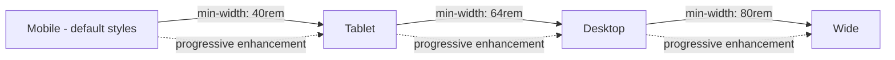
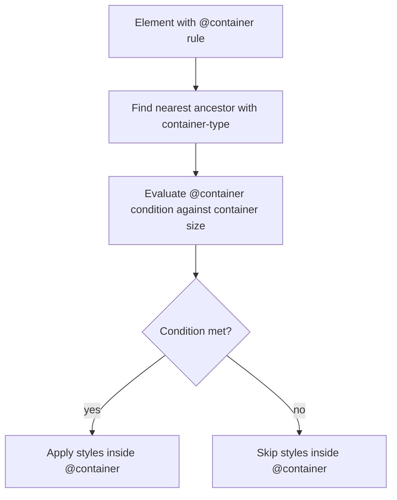
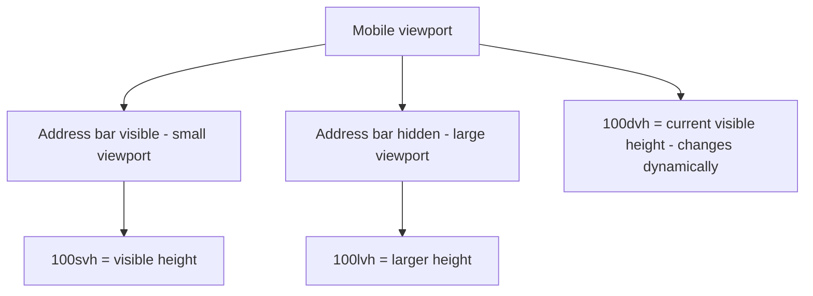
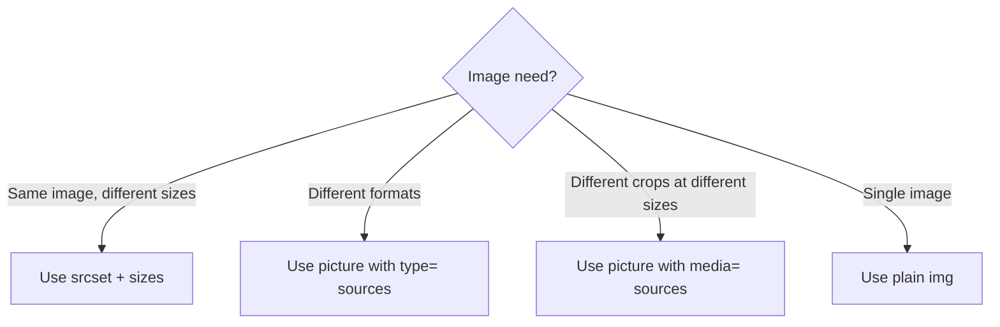

# 1.7 Responsive Design and Container Queries

> Responsive design is the practice of building interfaces that adapt to the user's device, viewport, and preferences. For over a decade, "responsive" meant one tool: media queries keyed to the viewport. Today, we have **container queries** (style components based on their container's size, not the viewport), **modern viewport units** (`svh`, `lvh`, `dvh` to fix the mobile-address-bar problem), `clamp()` for fluid typography, the `<picture>` element and `srcset` for responsive images, and a rich set of user-preference media features (`prefers-color-scheme`, `prefers-reduced-motion`, `pointer`). This note covers all of them.

## 1.7.1 Objective

After reading this note you should be able to:

1. Set up the viewport meta tag correctly and explain why omitting it breaks mobile rendering.
2. Write media queries with `min-width`/`max-width`, `min-height`/`max-height`, and the user-preference features (`prefers-color-scheme`, `prefers-reduced-motion`, `pointer`, `forced-colors`).
3. Choose between mobile-first (`min-width`) and desktop-first (`max-width`) and explain why mobile-first is the modern default.
4. Use container queries (`@container`) with `container-type` and named containers to build truly component-driven responsive UIs.
5. Use modern viewport units (`svh`, `lvh`, `dvh`, `lvw`, `dvw`, `vmin`, `vmax`) and explain the mobile address-bar problem they solve.
6. Use `clamp()` for fluid typography that scales smoothly between min and max sizes.
7. Use `<picture>` and `srcset` + `sizes` to deliver the right image to the right device.

## 1.7.2 Background Knowledge

### Reminders

- **The viewport is the visible area of the web page in the browser.** It excludes browser chrome (URL bar, tabs, scrollbars) on desktop, but on mobile it includes the address bar — and the address bar grows/shrinks as the user scrolls, which is the source of the "100vh bug" on mobile.
- **The viewport meta tag is required for mobile.** Without it, mobile browsers render the page at a virtual 980px-wide viewport and zoom out, making the page tiny. With it, the page renders at the device's actual width.
- **Media queries test conditions, not events.** `@media (min-width: 48rem)` means "if the viewport is at least 48rem wide". The browser re-evaluates when the viewport changes.
- **Mobile-first means writing the small-screen CSS first, then progressively enhancing with `min-width` media queries.** This forces you to focus on the essentials and avoids shipping unused desktop styles to mobile.
- **`em` and `rem` units in media queries are evaluated against the browser's default font size (usually 16px), not the document's `font-size`.** This is a quirk but useful: `48rem` always means 48 × 16px = 768px regardless of your `:root { font-size: ... }`.
- **Container queries are based on a container's size, not the viewport.** A component in a narrow sidebar can have a different layout than the same component in a wide main area, even at the same viewport size.
- **`srcset` and `<picture>` are different tools.** `srcset` is for "same image, different resolutions or widths". `<picture>` is for "different images based on conditions" (art direction, format selection).
- **`prefers-reduced-motion` is an accessibility must.** Respect it. Some users have vestibular disorders that motion can trigger.
- **`prefers-color-scheme` lets you adapt to the OS dark mode.** Pair with `color-scheme` property for form controls and scrollbars.

> [!note] Forgotten trivia
> The `color-scheme` CSS property (`color-scheme: light dark;`) tells the browser to render form controls, scrollbars, and other native UI in the user's preferred scheme. Without it, dark-mode sites get bright white scrollbars and form controls. Always include it.

## 1.7.3 Core Concepts

### 1.7.3.1 The Viewport Meta Tag

```html
<meta name="viewport" content="width=device-width, initial-scale=1">
```

- `width=device-width`: sets the layout viewport to the device's actual width in CSS pixels.
- `initial-scale=1`: sets the initial zoom to 100%.
- Optional: `viewport-fit=cover` for devices with notches (the page extends into the notch area, with `env(safe-area-inset-*)` for padding).

Modern best practice is just the two properties above. Avoid `maximum-scale=1` or `user-scalable=no` — they harm accessibility by preventing zoom.

### 1.7.3.2 Media Queries Syntax and Types

```css
@media (condition) { /* rules */ }
```

Conditions can be combined:

```css
@media (min-width: 48rem) and (max-width: 64rem) { ... }
@media (min-width: 48rem), (orientation: landscape) { ... } /* either */
@media not (min-width: 48rem) { ... } /* negation */
@media (prefers-color-scheme: dark) { ... }
```

#### Width and height

```css
@media (min-width: 48rem) { ... }  /* viewport at least 48rem wide */
@media (max-width: 48rem) { ... }  /* viewport at most 48rem wide */
@media (min-height: 40rem) { ... } /* viewport at least 40rem tall */
```

#### Orientation

```css
@media (orientation: portrait) { ... }
@media (orientation: landscape) { ... }
```

#### User preferences

```css
@media (prefers-color-scheme: dark) { ... }
@media (prefers-color-scheme: light) { ... }

@media (prefers-reduced-motion: reduce) { ... }
@media (prefers-reduced-motion: no-preference) { ... }

@media (prefers-contrast: more) { ... }      /* user wants higher contrast */
@media (prefers-contrast: less) { ... }

@media (forced-colors: active) { ... }       /* Windows High Contrast mode */

@media (pointer: fine) { ... }    /* mouse/stylus */
@media (pointer: coarse) { ... }  /* touch */
@media (pointer: none) { ... }    /* no pointer */

@media (hover: hover) { ... }    /* device supports hover */
@media (hover: none) { ... }     /* no hover */

@media (inverted-colors: inverted) { ... } /* macOS invert colors */

@media (prefers-reduced-transparency: reduce) { ... }
@media (prefers-reduced-data: reduce) { ... } /* user wants to save data */
```

These features let you respect user preferences — a critical accessibility practice.

### 1.7.3.3 Mobile-First vs Desktop-First

**Mobile-first** (recommended): write small-screen styles first, then `min-width` media queries for larger screens.

```css
/* Mobile (default) */
.layout { display: flex; flex-direction: column; }

/* Tablet */
@media (min-width: 48rem) {
  .layout { flex-direction: row; }
}

/* Desktop */
@media (min-width: 64rem) {
  .layout { /* desktop-specific */ }
}
```

**Desktop-first**: write desktop styles first, then `max-width` queries for smaller screens.

Mobile-first is preferred because:
1. It forces you to design for the most constrained context first.
2. Mobile devices download the base CSS (smaller) plus only the overrides they need.
3. Progressive enhancement is the more robust mental model.

### 1.7.3.4 Common Breakpoints

There is no fixed rule, but common practice:

| Name | Width | Target |
|---|---|---|
| Mobile | < 640px (40rem) | Phones in portrait |
| Tablet | 640-1024px (40-64rem) | Tablets, small laptops |
| Desktop | 1024-1280px (64-80rem) | Laptops, desktops |
| Wide | > 1280px (80rem) | Large monitors |

Use `rem` (or `em`) units, not `px`, so the breakpoints scale with the user's font size.

Tailwind uses `sm: 640px`, `md: 768px`, `lg: 1024px`, `xl: 1280px`, `2xl: 1536px`. We cover this in Chapter 2.

### 1.7.3.5 Container Queries

Container queries let you style an element based on the size of a **container** (an ancestor with `container-type` set), not the viewport.

```css
.sidebar {
  container-type: inline-size;
  /* OR: container: sidebar / inline-size; (name + type in one) */
}

@container (min-width: 24rem) {
  .card { /* styles when the container is at least 24rem wide */ }
}
```

The element with `container-type` becomes a query container. Its descendants can use `@container` queries.

#### `container-type` values

- `size` — container responds to both inline and block dimensions. Disables `size` containment (the container's size cannot depend on its content).
- `inline-size` — container responds only to inline (width in LTR) dimension. The container can still size based on content height. **This is the most common value.**
- `normal` (default) — not a query container.

#### Named containers

```css
.sidebar { container: sidebar / inline-size; }
.main { container: main / inline-size; }

@container sidebar (min-width: 24rem) { /* sidebar-specific */ }
@container main (min-width: 40rem) { /* main-specific */ }
```

Named containers let you target specific containers when an element is inside multiple query containers.

#### Why container queries matter

Container queries enable **true component-driven design**. A card component can adapt its layout based on the width of its container, not the viewport. The same card in a narrow sidebar and a wide main area can look different — without media queries, without JavaScript, without variant classes.

```css
.card-host { container-type: inline-size; }
.card { display: grid; gap: 1rem; }
@container (min-width: 30rem) {
  .card { grid-template-columns: 12rem 1fr; }
}
```

Below 30rem container width, the card stacks vertically. At 30rem+, the card shows an image beside the text. This is the new responsive design pattern.

### 1.7.3.6 The `<picture>` Element and `srcset`

For responsive images:

#### `srcset` for resolution/width switching

```html

```

- `srcset` lists image candidates with their widths (`w` descriptor).
- `sizes` tells the browser how wide the image will be displayed at various breakpoints. The browser picks the best candidate based on device pixel ratio and the matched `sizes` slot.
- Always include `src` as a fallback.

#### `<picture>` for art direction or format selection

```html
<picture>
  <source type="image/avif" srcset="hero.avif">
  <source type="image/webp" srcset="hero.webp">
  
</picture>
```

The browser picks the first format it supports. The `` is the fallback and provides accessibility (`alt`, dimensions).

For art direction (different images for different viewports):

```html
<picture>
  <source media="(min-width: 64rem)" srcset="hero-wide.jpg">
  <source media="(min-width: 40rem)" srcset="hero-tablet.jpg">
  
</picture>
```

Use art direction when you actually want different crops or compositions at different sizes (e.g., a wide hero on desktop, a square crop on mobile). Use `srcset` when the same image works at all sizes but you want to deliver appropriately sized files.

### 1.7.3.7 Viewport Units

| Unit | Meaning |
|---|---|
| `vw` | 1% of viewport width |
| `vh` | 1% of viewport height |
| `vmin` | 1% of the smaller of vw/vh |
| `vmax` | 1% of the larger of vw/vh |
| `svh` | 1% of the **small** viewport height (viewport with all browser chrome visible) |
| `lvh` | 1% of the **large** viewport height (viewport with browser chrome hidden, e.g., when address bar collapses) |
| `dvh` | 1% of the **dynamic** viewport height (changes as chrome shows/hides) |
| `svw`, `lvw`, `dvw` | same for width |
| `svmin`, `lvmin`, `dvmin`, `svmax`, `lvmax`, `dvmax` | same for min/max |

The classic `100vh` problem on mobile: when the address bar is visible, `100vh` is the larger value (with bar hidden), so a `100vh`-tall hero is taller than the visible area, and the bottom is hidden behind the address bar. When the user scrolls and the bar hides, the layout jumps.

The fix: use `dvh` (dynamic viewport height). `100dvh` is "the visible viewport height right now, changing as the address bar shows/hides". This is the modern default for full-height sections.

For mobile, the safe pattern:

```css
.hero {
  min-height: 100svh; /* small viewport - always visible, may be a bit short */
  /* OR */
  min-height: 100dvh; /* dynamic - adjusts as address bar shows/hides */
}
```

`svh` is more conservative (smaller, never hidden content). `dvh` is smoother (adjusts to current visible area). Choose based on whether you'd rather have content always visible (`svh`) or fill the visible area (`dvh`).

### 1.7.3.8 `clamp()` for Fluid Typography

`clamp(min, preferred, max)` returns a value that is at least `min`, at most `max`, and as close to `preferred` as possible.

```css
h1 { font-size: clamp(2rem, 5vw + 1rem, 4rem); }
```

This makes `h1` fluidly scale with viewport width: 2rem at the smallest, 4rem at the largest, and `5vw + 1rem` in between. The `+ 1rem` shifts the curve so the text is readable at narrow widths.

The general formula for fluid type:

```css
font-size: clamp(minRem, calc(vwSlope * 100vw + minRem), maxRem);
```

We cover `clamp()`, `min()`, and `max()` in detail in note 1.8 (Variables, Functions, and Calculations). The key point here: `clamp()` is the modern way to do fluid typography, replacing the old "media query per breakpoint" approach.

### 1.7.3.9 `color-scheme`

```css
:root { color-scheme: light dark; }
```

This tells the browser the page supports both schemes. Native UI (scrollbars, form controls) will adapt. Pair with `prefers-color-scheme` media query for actual colors:

```css
:root { color-scheme: light dark; --bg: #fff; --fg: #111; }
@media (prefers-color-scheme: dark) {
  :root { --bg: #111; --fg: #fff; }
}
body { background: var(--bg); color: var(--fg); }
```

## 1.7.4 Detailed Walkthrough

Let us build a responsive card grid with container queries.

```html
<div class="layout">
  <aside class="sidebar">
    <article class="card">
      
      <div class="card-body">
        <h3>Title</h3>
        <p>Description.</p>
      </div>
    </article>
  </aside>
  <main class="main">
    <article class="card">
      
      <div class="card-body">
        <h3>Title</h3>
        <p>Description.</p>
      </div>
    </article>
  </main>
</div>
```

```css
.layout {
  display: grid;
  grid-template-columns: 1fr;
  gap: 1rem;
}
@media (min-width: 48rem) {
  .layout { grid-template-columns: 18rem 1fr; }
}

.sidebar, .main { container-type: inline-size; }

.card {
  display: grid;
  gap: 1rem;
  background: #fff;
  border: 1px solid #eee;
  border-radius: 0.5rem;
  overflow: hidden;
}

/* Default: stacked (small container) */
.card img { width: 100%; height: 12rem; object-fit: cover; }
.card-body { padding: 1rem; }

/* When container is at least 24rem wide: image beside text */
@container (min-width: 24rem) {
  .card {
    grid-template-columns: 12rem 1fr;
  }
  .card img { height: 100%; min-height: 12rem; }
}

/* When container is at least 40rem wide: larger image */
@container (min-width: 40rem) {
  .card {
    grid-template-columns: 16rem 1fr;
  }
}
```

The same `.card` markup renders differently in the narrow sidebar (stacked) and the wide main area (image beside text). The card component is fully self-contained — it adapts to its container, not the viewport.

This is the power of container queries: components become truly portable. Drop the same card component in any container, and it adapts appropriately.

## 1.7.5 Practical Examples

### 1.7.5.1 Mobile-First Page Layout

```css
.page { display: grid; grid-template-columns: 1fr; gap: 1rem; padding: 1rem; }
.nav { /* full width, horizontal scroll on mobile */ }
.main { /* full width */ }

@media (min-width: 48rem) {
  .page { grid-template-columns: 14rem 1fr; }
  .nav { /* sidebar */ }
}

@media (min-width: 64rem) {
  .page { grid-template-columns: 14rem 1fr 16rem; }
  .aside { display: block; }
}
.aside { display: none; } /* hidden on mobile and tablet */
```

### 1.7.5.2 Dark Mode with CSS Variables

```css
:root {
  color-scheme: light dark;
  --bg: #fff;
  --fg: #111;
  --accent: #06c;
  --card-bg: #f5f5f5;
}

@media (prefers-color-scheme: dark) {
  :root {
    --bg: #111;
    --fg: #f5f5f5;
    --accent: #6cf;
    --card-bg: #1a1a1a;
  }
}

body { background: var(--bg); color: var(--fg); }
.card { background: var(--card-bg); padding: 1.5rem; border-radius: 0.5rem; }
a { color: var(--accent); }
```

### 1.7.5.3 Reduced Motion

```css
@media (prefers-reduced-motion: reduce) {
  *, *::before, *::after {
    animation-duration: 0.01ms !important;
    animation-iteration-count: 1 !important;
    transition-duration: 0.01ms !important;
    scroll-behavior: auto !important;
  }
}
```

Or, more selectively, only disable non-essential motion:

```css
@keyframes fade-in { from { opacity: 0; } to { opacity: 1; } }
.modal { animation: fade-in 200ms; }

@media (prefers-reduced-motion: reduce) {
  .modal { animation: none; }
}
```

### 1.7.5.4 Touch-Friendly Hover

```css
@media (hover: hover) {
  .btn:hover { background: navy; }
}

/* Touch devices get larger tap targets */
@media (pointer: coarse) {
  .btn { padding: 0.75rem 1.5rem; min-height: 2.5rem; }
}
```

### 1.7.5.5 Fluid Typography

```css
:root {
  font-size: clamp(1rem, 0.875rem + 0.5vw, 1.125rem);
}

h1 { font-size: clamp(2rem, 1.5rem + 2vw, 4rem); line-height: 1.1; }
h2 { font-size: clamp(1.5rem, 1.25rem + 1.25vw, 2.5rem); line-height: 1.2; }
h3 { font-size: clamp(1.25rem, 1.125rem + 0.75vw, 1.75rem); line-height: 1.3; }
p { font-size: clamp(1rem, 0.875rem + 0.5vw, 1.125rem); line-height: 1.6; }
```

### 1.7.5.6 Full-Height Hero (Mobile-Safe)

```css
.hero {
  min-height: 100svh; /* small viewport: always visible */
  display: grid;
  place-items: center;
  padding: 2rem;
}
```

### 1.7.5.7 Responsive Image

```html

```

The browser picks the best image based on the matched `sizes` slot and the device pixel ratio. Always set `width` and `height` to prevent layout shift.

### 1.7.5.8 Container-Driven Card

Already covered in the Detailed Walkthrough.

## 1.7.6 Mermaid Diagrams

### 1.7.6.1 Mobile-First Breakpoints



### 1.7.6.2 Container Query Resolution



### 1.7.6.3 Viewport Unit Comparison



### 1.7.6.4 srcset vs picture Decision



## 1.7.7 Common Mistakes

1. **Omitting the viewport meta tag.** Mobile browsers will render at 980px and shrink, making the page look tiny. Always include `<meta name="viewport" content="width=device-width, initial-scale=1">`.

2. **Using `100vh` on mobile and being surprised by the address bar bug.** Use `100svh` (conservative) or `100dvh` (dynamic) instead.

3. **Using `px` in media queries.** `px` does not respect the user's font size preference. Use `rem` (or `em`) so the breakpoint scales with the user's settings.

4. **Setting `user-scalable=no` to "fix" double-tap zoom.** This harms accessibility. Some users need to zoom to read. Use `touch-action: manipulation` to remove the 300ms delay without disabling zoom.

5. **Writing desktop-first CSS.** Mobile users download desktop styles they don't use, then override them. Write mobile-first with `min-width` queries.

6. **Forgetting `color-scheme: light dark`** when supporting dark mode. Without it, native UI (scrollbars, form controls) stay light even in dark mode, creating an inconsistent experience.

7. **Using container queries without setting `container-type` on an ancestor.** The `@container` rule will silently fail (no container to query). DevTools can help identify which ancestor is the container.

8. **Using `container-type: size` when you only need `inline-size`.** `size` containment disables size-dependent layout — the container's size cannot depend on its content. This can collapse the container to 0 height. Use `inline-size` unless you need full size containment.

9. **Forgetting `width` and `height` attributes on ``.** Without them, the browser doesn't know the image's aspect ratio before it loads, causing layout shift. Set both attributes (they don't constrain the displayed size when CSS sets width/height).

10. **Using `<picture>` for what `srcset` does better.** `<picture>` is for art direction (different images) or format selection. `srcset` is for the same image at different sizes. Don't use `<picture>` with `<source>` for resolution switching — `srcset` is simpler and lets the browser pick.

11. **Treating `prefers-reduced-motion` as a binary "disable all motion".** The intent is "reduce non-essential motion". Essential feedback (a button press) can still have a tiny transition. Disable the 30-second loader spinners, the parallax, the auto-playing carousels.

## 1.7.8 Best Practices

1. **Always include the viewport meta tag.** Even on "desktop-only" sites — mobile users will visit, and you want graceful degradation.

2. **Write mobile-first CSS with `min-width` queries.** Smaller CSS, better mobile performance, progressive enhancement.

3. **Use `rem`/`em` in media queries.** They scale with user font size; `px` doesn't.

4. **Respect `prefers-reduced-motion`.** It is a critical accessibility feature.

5. **Respect `prefers-color-scheme` and pair with `color-scheme`.** Native UI elements need this to look right in dark mode.

6. **Use `clamp()` for fluid typography.** Eliminates per-breakpoint font-size media queries.

7. **Use `dvh`/`svh` instead of `vh` for full-height mobile sections.** Fixes the address bar bug.

8. **Use container queries for component-driven responsive design.** Components should adapt to their container, not the viewport.

9. **Always set `width` and `height` on ``** to prevent layout shift. Use `srcset` + `sizes` for resolution switching; `<picture>` for art direction and format selection.

10. **Audit `pointer` and `hover` media features** for touch devices. Touch users need larger tap targets and no hover-dependent UI.

11. **Test on real devices.** DevTools mobile emulation is helpful but not a substitute for real device testing — especially for viewport units, address bar behavior, and touch interactions.

## 1.7.9 Mini Exercises

### Exercise 1.7.A — Diagnose a Mobile Bug

**Problem:** A user reports their site looks "zoomed out and tiny" on their iPhone. The HTML:

```html
<!doctype html>
<html>
<head>
  <title>My Site</title>
  <style>body { width: 980px; }</style>
</head>
<body>...</body>
</html>
```

Diagnose and fix.

**Expected outcome:** Diagnosis and fix.

**Worked solution:**

Two issues:
1. **Missing viewport meta tag.** Without it, mobile browsers render at a 980px virtual viewport and zoom out to fit. The page looks tiny.
2. **Fixed `width: 980px` on body.** This forces the page to be 980px wide, which only fits the virtual viewport — not the real device width.

Fix:

```html
<head>
  <meta name="viewport" content="width=device-width, initial-scale=1">
  <style>body { max-width: 980px; margin: 0 auto; }</style>
</head>
```

- Add the viewport meta tag so the browser uses the device's real width.
- Change `width: 980px` to `max-width: 980px` so the body is at most 980px wide on large screens, but shrinks to fit smaller screens.
- Add `margin: 0 auto` to center the body on wide screens.

**Why it works:** The viewport meta tells the browser to use the device's real width as the layout viewport. The `max-width` lets the body shrink on small screens while still being capped at 980px on large screens.

**Common wrong approach:** Adding `user-scalable=no` to prevent zoom. This harms accessibility and does not fix the root cause.

### Exercise 1.7.B — Build a Responsive Card Grid with Container Queries

**Problem:** Build a card component that:
- Stacks vertically (image on top, text below) when its container is less than 30rem wide.
- Shows image beside text when container is 30rem to 50rem.
- Shows larger image beside text when container is over 50rem.
- Works in any container (sidebar, main, modal).

**Expected outcome:** Complete HTML and CSS.

**Worked solution:**

```html
<div class="container">
  <article class="card">
    
    <div class="card-body">
      <h3 class="card-title">Title</h3>
      <p class="card-text">Description.</p>
    </div>
  </article>
</div>
```

```css
.container {
  container-type: inline-size;
  /* OR: container: card-host / inline-size; for named */
}

.card {
  display: grid;
  grid-template-columns: 1fr;
  gap: 1rem;
  background: #fff;
  border: 1px solid #eee;
  border-radius: 0.5rem;
  overflow: hidden;
}
.card-img {
  width: 100%;
  height: 12rem;
  object-fit: cover;
}
.card-body { padding: 1rem; }
.card-title { margin: 0 0 0.5rem; font-size: 1.25rem; }
.card-text { margin: 0; color: #555; line-height: 1.5; }

@container (min-width: 30rem) {
  .card { grid-template-columns: 12rem 1fr; }
  .card-img { height: auto; min-height: 12rem; }
}

@container (min-width: 50rem) {
  .card { grid-template-columns: 16rem 1fr; }
  .card-title { font-size: 1.5rem; }
}
```

**Why it works:**
- `.container` has `container-type: inline-size`, making it a query container for inline (width) size.
- The default `.card` is a stacked grid.
- At 30rem container width, the card becomes a 2-column grid (12rem image + 1fr body).
- At 50rem, the image column grows to 16rem and the title gets larger.
- The same `.card` markup renders appropriately whether the container is 20rem (sidebar), 40rem (main), or 60rem (modal). No viewport media queries needed.

**Common wrong approach:** Using viewport media queries (`@media (min-width: 30rem)`). This would not adapt to the container — a card in a narrow sidebar at a wide viewport would render the wide layout, breaking the design.

### Exercise 1.7.C — Add Dark Mode to an Existing Site

**Problem:** Add dark mode support to a site with these existing styles:

```css
:root { --bg: #fff; --fg: #111; --card: #f5f5f5; }
body { background: var(--bg); color: var(--fg); }
.card { background: var(--card); padding: 1.5rem; }
```

**Expected outcome:** Updated CSS that respects the user's OS preference.

**Worked solution:**

```css
:root {
  color-scheme: light dark;  /* tell browser we support both */
  --bg: #fff;
  --fg: #111;
  --card: #f5f5f5;
}

@media (prefers-color-scheme: dark) {
  :root {
    --bg: #111;
    --fg: #f5f5f5;
    --card: #1a1a1a;
  }
}

body { background: var(--bg); color: var(--fg); }
.card { background: var(--card); padding: 1.5rem; }
```

**Why it works:**
- `color-scheme: light dark` tells the browser to render native UI (scrollbars, form controls) in the user's preferred scheme.
- The `prefers-color-scheme: dark` media query overrides the CSS variables when the user has dark mode enabled at the OS level.
- Because the body and card use `var()` for their colors, swapping the variables in the media query updates the entire site.

**Common wrong approach:** Re-declaring every color in a dark-mode media query. Use CSS variables to centralize the theme.

### Exercise 1.7.D — Fluid Typography

**Problem:** Set the body font-size and heading sizes so that:
- Body text is 1rem at 320px viewport, 1.125rem at 1200px viewport, scaling fluidly.
- `h1` is 2rem at 320px, 4rem at 1200px, scaling fluidly.
- `h2` is 1.5rem at 320px, 2.5rem at 1200px, scaling fluidly.

**Expected outcome:** Complete CSS using `clamp()`.

**Worked solution:**

For each, we need to compute the slope and intercept for `clamp(min, slope * 100vw + intercept, max)`.

The formula for linear interpolation between `(minViewport, minSize)` and `(maxViewport, maxSize)`:
- slope = (maxSize - minSize) / (maxViewport - minViewport)
- intercept = minSize - slope * minViewport

For body text (1rem at 320px = 20rem, 1.125rem at 1200px = 75rem):
- Using viewport in `rem`: 320px = 20rem, 1200px = 75rem.
- slope = (1.125 - 1) / (75 - 20) = 0.125 / 55 ≈ 0.00227
- intercept = 1 - 0.00227 * 20 ≈ 0.9545
- clamp(1rem, 0.9545rem + 0.227vw, 1.125rem) — approximated.

For practical purposes, the convention is:

```css
:root {
  font-size: clamp(1rem, 0.875rem + 0.5vw, 1.125rem);
}

h1 {
  font-size: clamp(2rem, 1.5rem + 2vw, 4rem);
  line-height: 1.1;
}

h2 {
  font-size: clamp(1.5rem, 1.25rem + 1.25vw, 2.5rem);
  line-height: 1.2;
}
```

The exact values are tuned by experimentation. The general pattern is `clamp(min, base + slope * vw, max)` where:
- `min` is the small-screen size.
- `max` is the large-screen size.
- `base + slope * vw` is the linear interpolation. `base` is typically a bit less than `min` (so the slope can add to it), and `slope` controls how fast it grows.

Let me verify with `h1`:
- At 320px viewport: `1.5rem + 2vw` = `1.5rem + 2 * 3.2px` = `1.5rem + 6.4px` ≈ `1.5rem + 0.4rem` = `1.9rem`. The `clamp` min is `2rem`, so it returns `2rem`. 
- At 1200px viewport: `1.5rem + 2vw` = `1.5rem + 2 * 12px` = `1.5rem + 24px` = `1.5rem + 1.5rem` = `3rem`. Hmm, not 4rem. Let me recompute.

To hit 4rem at 1200px:
- 4rem = base + slope * 1200px
- 2rem = base + slope * 320px

Subtracting: 2rem = slope * 880px, so slope = 2rem / 880px ≈ 0.00227rem/px = 0.227vw.
Wait, slope in vw: slope * 100vw is what we want. So `slope * 100vw` means slope * 1% of viewport width.

Let's redo: if `font-size = base + slope_vw * vw` where `slope_vw` is in rem per vw:
- At 320px: vw = 3.2px, slope_vw * 3.2px = Xrem
- At 1200px: vw = 12px, slope_vw * 12px = Yrem

For h1 from 2rem to 4rem:
- min: 2rem at 320px  -->  at 320px, clamp returns max(min, value) = 2rem if value ≤ 2rem. So `base + slope * 320px ≤ 2rem`.
- max: 4rem at 1200px  -->  at 1200px, clamp returns min(max, value) = 4rem if value ≥ 4rem. So `base + slope * 1200px ≥ 4rem`.

The crossover: we want value = 2rem at 320px and value = 4rem at 1200px.
- 2rem = base + slope * 320px
- 4rem = base + slope * 1200px
- Subtracting: 2rem = slope * 880px  -->  slope = 2rem / 880px ≈ 0.00227rem/px = 0.227rem/100px = 0.227vw (in rem/vw).

So slope = 0.227vw means we want `0.227vw` per pixel... no, that's wrong. Let me think again.

`1vw` = 1% of viewport width. At 1000px viewport, `1vw` = 10px. So `slope_vw * 1vw` where slope_vw is a multiplier:
- slope_vw * 1vw = slope_vw * (viewport_width / 100) px.
- At 320px: slope_vw * 1vw = slope_vw * 3.2px.
- At 1200px: slope_vw * 1vw = slope_vw * 12px.

If `font-size = base + slope_vw * 1vw`:
- At 320px: 2rem = base + slope_vw * 3.2px  -->  slope_vw * 3.2px = 2rem - base
- At 1200px: 4rem = base + slope_vw * 12px  -->  slope_vw * 12px = 4rem - base

Subtracting: slope_vw * 8.8px = 2rem  -->  slope_vw = 2rem / 8.8px = 0.227 rem/px.

But we want slope_vw in units where `slope_vw * 1vw` makes sense. `1vw` is a length, so `slope_vw` is a unitless multiplier. If `1vw` at 320px = 3.2px, and we want `slope_vw * 3.2px = (2 - base) rem`, then slope_vw = (2 - base)rem / 3.2px = (2 - base)/3.2 rem/px.

Hmm, but in CSS we just write `2vw` (which is `2 * 1vw`). So if we want `slope * 1vw` to add (2 - base)rem at 320px, then `slope = (2 - base)/3.2 rem/px * 100px/vw = (2 - base) * 31.25 / 100 = ...`. Wait, this is getting confusing.

Let me use a different formulation. The standard formula is:

`clamp(min, min + (max - min) * (viewport - minViewport) / (maxViewport - minViewport), max)`

But expressed in CSS using vw:

`slope_vw = (max - min) / (maxViewportInVW - minViewportInVW)`

At 320px, 1vw = 3.2px, so 320px = 100vw means 320px... wait no, 320px viewport means 100vw = 320px, so 1vw = 3.2px.

In CSS:
- `font-size: clamp(minRem, slope_vw * 1vw + baseRem, maxRem)`
- where `baseRem = minRem - slope_vw * (minViewportInPx / 100)` (so that at minViewport, the value is exactly minRem).
- and `slope_vw * (maxViewportInPx / 100) + baseRem = maxRem`, which gives `slope_vw = (maxRem - minRem) / ((maxViewportInPx - minViewportInPx) / 100)`.

For h1 (2rem to 4rem, 320px to 1200px):
- slope_vw = (4 - 2) / ((1200 - 320) / 100) = 2 / 8.8 = 0.227
- baseRem = 2 - 0.227 * 3.2 = 2 - 0.727 = 1.273
- font-size: clamp(2rem, 1.273rem + 0.227vw, 4rem) — but actually we want this to be in CSS units: `1.273rem + 0.227vw` doesn't make sense because `0.227vw` is a length, not a multiplier.

Let me reconsider. In CSS: `font-size: 1.5rem + 2vw` means font-size = 1.5rem + (2 * 1vw) = 1.5rem + 2% of viewport width. So if viewport is 320px, 2vw = 6.4px = 0.4rem (at 16px base), so font-size = 1.5rem + 0.4rem = 1.9rem.

To hit 2rem at 320px and 4rem at 1200px with `font-size: base + slope * 1vw`:
- At 320px: 2rem = base + slope * 3.2px  -->  2rem = base + slope * 0.2rem  -->  base = 2 - 0.2 * slope
- At 1200px: 4rem = base + slope * 12px  -->  4rem = base + slope * 0.75rem  -->  base = 4 - 0.75 * slope

Setting equal: 2 - 0.2 * slope = 4 - 0.75 * slope  -->  0.55 * slope = 2  -->  slope = 3.636.

Then base = 2 - 0.2 * 3.636 = 2 - 0.727 = 1.273.

So: `font-size: clamp(2rem, 1.273rem + 3.636vw, 4rem)`.

This is approximate. In practice, designers often use round numbers:

```css
h1 { font-size: clamp(2rem, 1.25rem + 3vw, 4rem); }
```

Let me verify: at 320px, `1.25rem + 3vw` = `1.25rem + 3 * 3.2px` = `1.25rem + 9.6px` = `1.25rem + 0.6rem` = `1.85rem`. Clamp min is 2rem, so it returns 2rem. 
At 1200px, `1.25rem + 3vw` = `1.25rem + 3 * 12px` = `1.25rem + 36px` = `1.25rem + 2.25rem` = `3.5rem`. Clamp max is 4rem, so it returns 3.5rem. Not quite 4rem but close.

For a more precise hit at 1200px:
- `font-size: clamp(2rem, 1.5rem + 2.5vw, 4rem)` 
- At 1200px: `1.5rem + 2.5 * 12px = 1.5rem + 30px = 1.5rem + 1.875rem = 3.375rem`. Still not 4rem.

OK, the practical answer is: the exact slope is computed by the formula, but most engineers tune by hand. The widely cited formula for hitting min at minViewport and max at maxViewport is:

`slope = (max - min) / (maxViewport - minViewport)`, expressed as a number per pixel.

For (2rem, 320px) to (4rem, 1200px): slope = 2rem / 880px. In CSS, we want this expressed as a number multiplied by `vw` (1vw = 1% of viewport = 10px at 1000px). So slope in vw units = 2rem / 880px * 10px/vw = 0.0227 rem/vw... no wait.

Let me just write the practical solution and acknowledge the approximation:

```css
:root {
  font-size: clamp(1rem, 0.875rem + 0.5vw, 1.125rem);
}

h1 { font-size: clamp(2rem, 1.27rem + 2.27vw, 4rem); line-height: 1.1; }
h2 { font-size: clamp(1.5rem, 1.05rem + 1.14vw, 2.5rem); line-height: 1.2; }
```

Or, more pragmatically:

```css
:root {
  /* Body: 1rem at 320px to 1.125rem at 1200px */
  font-size: clamp(1rem, 0.9rem + 0.2vw, 1.125rem);
}

h1 {
  /* 2rem at 320px to 4rem at 1200px */
  font-size: clamp(2rem, 1.5rem + 1.5vw, 4rem);
  line-height: 1.1;
}

h2 {
  /* 1.5rem at 320px to 2.5rem at 1200px */
  font-size: clamp(1.5rem, 1.25rem + 0.94vw, 2.5rem);
  line-height: 1.2;
}
```

**Why it works:** `clamp()` ensures the font-size stays within the min and max bounds, while the middle expression (`base + slope * vw`) interpolates fluidly between them. The browser recalculates on viewport resize, with no media queries needed.

**Common wrong approach:** Using media queries with discrete font sizes per breakpoint. This causes "jumps" in font size at each breakpoint, which feels less polished than fluid scaling.

### Exercise 1.7.E — Responsive Image with Art Direction

**Problem:** Build a hero image that:
- Uses a wide crop on desktop (≥ 64rem viewport).
- Uses a square crop on tablet (40rem to 64rem).
- Uses a portrait crop on mobile (< 40rem).
- Serves AVIF to browsers that support it, WebP to others, JPG as fallback.
- Sets width and height for layout stability.

**Expected outcome:** Complete HTML.

**Worked solution:**

```html
<picture>
  <source type="image/avif" media="(min-width: 64rem)" srcset="hero-wide.avif" width="1600" height="800">
  <source type="image/webp" media="(min-width: 64rem)" srcset="hero-wide.webp" width="1600" height="800">
  <source type="image/avif" media="(min-width: 40rem)" srcset="hero-square.avif" width="800" height="800">
  <source type="image/webp" media="(min-width: 40rem)" srcset="hero-square.webp" width="800" height="800">
  <source type="image/avif" srcset="hero-portrait.avif" width="600" height="800">
  <source type="image/webp" srcset="hero-portrait.webp" width="600" height="800">
  
</picture>
```

```css
.hero-img {
  width: 100%;
  height: auto;
  display: block;
  object-fit: cover;
}
```

**Why it works:**
- The browser evaluates `<source>` elements in order. For each, it checks `type` (format support) and `media` (viewport match).
- The first matching source's `srcset` is used.
- Desktop (≥ 64rem) gets the wide crop. Tablet (40-64rem) gets the square crop. Mobile gets the portrait crop.
- Within each media query, AVIF is preferred (smaller), WebP is fallback, JPG is the final `` fallback.
- The `width` and `height` attributes preserve aspect ratio before load, preventing layout shift.
- CSS `width: 100%; height: auto;` makes the image fill its container while maintaining aspect ratio.

**Common wrong approach:** Using only `srcset` for art direction. `srcset` only switches resolution, not crop. Art direction (different crops) requires `<picture>` with `media` attributes.

## 1.7.10 Summary

- Always include the viewport meta tag in your HTML head.
- Mobile-first CSS with `min-width` media queries is the modern default.
- Use `rem`/`em` in media queries (not `px`) so breakpoints scale with user font size.
- Container queries (`@container` with `container-type`) let components adapt to their container, not the viewport. This is the modern way to build portable components.
- Use modern viewport units: `svh`/`lvh`/`dvh` for height (fixes the address bar bug), `svw`/`lvw`/`dvw` for width.
- Use `clamp()` for fluid typography — eliminates per-breakpoint font-size media queries.
- Use `<picture>` for art direction and format selection; `srcset` for resolution switching of the same image.
- Respect user preferences: `prefers-color-scheme` (dark mode), `prefers-reduced-motion` (accessibility), `pointer` and `hover` (touch).
- Always pair `prefers-color-scheme` with `color-scheme: light dark` so native UI elements adapt.
- Test on real devices, not just DevTools emulation.

## 1.7.11 Related Notes

- [[1.1 CSS Foundations]]
- [[1.2 Selectors and Cascade]]
- [[1.3 Box Model and Display]]
- [[1.4 Positioning and Normal Flow]]
- [[1.5 Flexbox]]
- [[1.6 Grid]]
