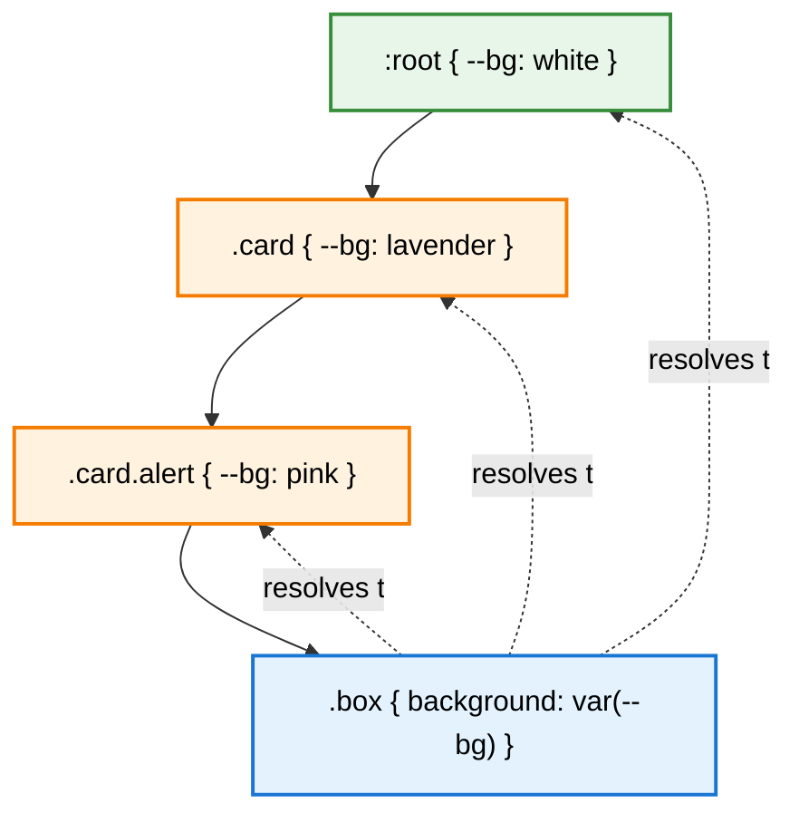
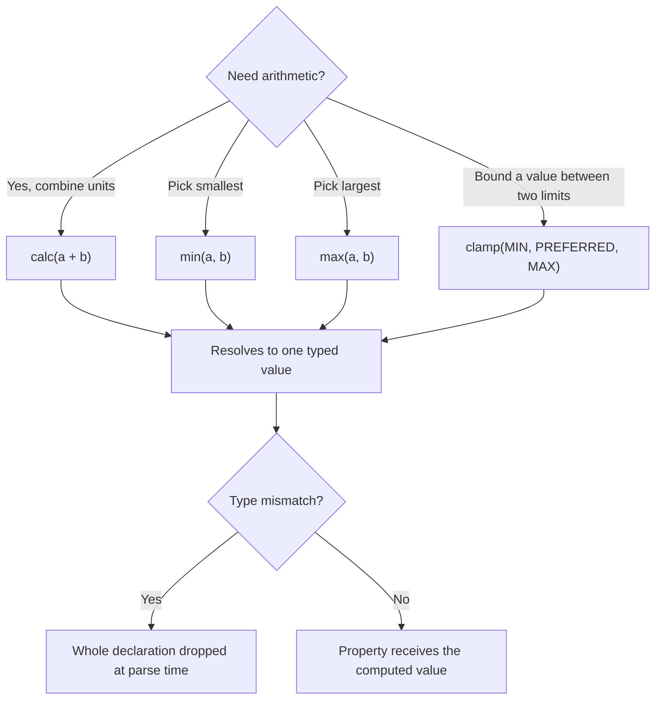

# 1.8 Variables, Functions, and Calculations

> CSS custom properties, the `var()` function, and a whole family of calculation functions — `calc()`, `min()`, `max()`, `clamp()`, `color-mix()`, `color-contrast()`, the new relative color syntax, `env()`, and gradient functions — together let you write dynamic, themable, responsive CSS without leaving the stylesheet. This note covers how each one works, where it fails, and how to combine them safely.

## 1.8.1 Objective

By the end of this note you should be able to:

1. Declare CSS custom properties, reason about their **scope** and **inheritance** behavior, and register them with `@property` so they can be animated and type-checked.
2. Use `var()` with one or more **fallbacks**, understand **when** the fallback applies (invalid at computed-value time vs. token never resolved), and chain fallbacks defensively.
3. Reason about `calc()` operator precedence, type checking, and the difference between `<number>` and `<percentage>` results.
4. Use `min()`, `max()`, and `clamp()` for fluid sizing that respects both the viewport and a minimum readable size.
5. Use modern color functions — `rgb()`, `hsl()`, `oklch()`, `color-mix()`, `color-contrast()`, and the **relative color syntax** — to build palettes that adapt to themes.
6. Use `env()` to read browser-provided environment values (safe-area insets, viewport insets) and write mobile-aware CSS.
7. Use the three gradient functions (`linear-gradient`, `radial-gradient`, `conic-gradient`) and their `repeating-*` variants.
8. Diagnose the two distinct failure modes — **custom property substitution failure** vs. **`calc()` evaluation failure** — and write CSS that degrades gracefully.

## 1.8.2 Background Knowledge

Before custom properties were shipped (first in Chrome 49 / Firefox 31 / Safari 9.5, around 2016), CSS had no real variables. Developers worked around this with preprocessors — Sass, Less, Stylus — whose "variables" were resolved at **compile time** and emitted as plain literal values. That meant a Sass `$color` could not change at runtime, could not be set inline, could not be updated by JavaScript, and could not respond to a media query without re-emitting the entire block.

CSS custom properties (sometimes still called "CSS variables") are different in three ways that matter:

1. They are evaluated by the **browser** at computed-value time, so they can change at runtime.
2. They **inherit** through the DOM like other CSS properties, so a variable set on `:root` reaches every descendant unless overridden.
3. They can be **read and written from JavaScript** via `getPropertyValue()` and `setProperty()`.

Custom properties unlock theming (dark mode), responsive design (changing a value at a breakpoint without re-declaring the rule), and design tokens. Combined with `calc()`, `min()`, `max()`, and `clamp()`, they make it possible to write CSS that adapts mathematically instead of snapping between discrete media queries.

> [!note] Preprocessor variables and CSS custom properties are not competitors — they solve different problems. Preprocessor variables do string substitution at build time; CSS custom properties are real runtime values that inherit. Use both.

## 1.8.3 Core Concepts

### 1.8.3.1 Declaring and Using Custom Properties

A custom property is any property whose name starts with two dashes (`--`). It is declared like any other property:

```css
:root {
  --brand: #3460ff;
  --space: 8px;
  --max-content: 65ch;
}

.button {
  background: var(--brand);
  padding: var(--space);
  max-width: var(--max-content);
}
```

A custom property has **no intrinsic type** unless you register it with `@property`. Until registered, its value is the raw token stream you wrote, and substitution is a textual operation done when the property that uses it is computed.

### 1.8.3.2 Scope and Inheritance

Custom properties inherit like normal inherited properties. The cascade resolves them: the highest-priority declaration wins, with specificity, layer, and source order applying as usual. This means:

```css
:root { --bg: white; }       /* default */
.card { --bg: lavender; }    /* override for cards */
.card.alert { --bg: pink; }  /* override for alert cards */

.box { background: var(--bg); }
```

A `.box` inside `.card.alert` will resolve `--bg` to `pink`; a `.box` inside `.card` resolves to `lavender`; anywhere else it resolves to `white`. The rule is "nearest ancestor with a declaration wins."

### 1.8.3.3 Fallbacks in var()

`var()` accepts a second argument as a fallback:

```css
color: var(--text, #111);
```

The fallback is used **only if the custom property is not defined** or resolves to the special value `invalid`. You can chain fallbacks by nesting:

```css
color: var(--text, var(--text-default, black));
```

A fallback that is itself invalid will cause the entire declaration to become invalid at computed-value time — be careful.

### 1.8.3.4 @property

`@property` lets you register a custom property with the browser so it has a known type, an initial value, and a flag controlling inheritance:

```css
@property --angle {
  syntax: "<angle>";
  inherits: false;
  initial-value: 0deg;
}
```

Benefits:

- The property is **type-checked**. `--angle: red;` is rejected by the parser instead of silently being invalid at computed-value time.
- The property can be **animated** because the browser knows how to interpolate `<angle>` values.
- `inherits: false` lets you create properties that do not bleed into descendants — useful for component-scoped tokens.

### 1.8.3.5 calc()

`calc()` lets you mix units and do arithmetic at computed-value time:

```css
width: calc(100% - 2rem);
font-size: calc(1rem + 0.5vw);
padding: calc(var(--gap) / 2);
```

Operator precedence is the usual math one: `*` and `/` bind tighter than `+` and `-`. Whitespace is **required** around `+` and `-` (so the parser doesn't confuse them with sign tokens) but optional around `*` and `/`. Division by zero yields `infinity` and the property becomes invalid.

`calc()` resolves to a single typed value: a `<length>`, a `<percentage>`, a `<number>`, an `<angle>`, etc. Mixing incompatible types (`calc(1px + 1deg)`) is invalid.

### 1.8.3.6 min(), max(), clamp()

These functions take a comma-separated list of values of the same type and return one of them:

- `min(1vw, 1rem)` — the smallest of the arguments.
- `max(1vw, 1rem)` — the largest.
- `clamp(MIN, PREFERRED, MAX)` — `PREFERRED` but never below `MIN` and never above `MAX`.

These are different from `calc()`: instead of combining values, they **choose** between them. `clamp(1rem, 2vw + 1rem, 3rem)` is the canonical fluid typography recipe.

### 1.8.3.7 Color Functions

Modern CSS treats colors as values with explicit syntaxes:

- `rgb(52 96 255)` and `rgb(52 96 255 / 0.5)` — modern space-separated form (also `rgba()` is now an alias of `rgb()`).
- `hsl(230 100% 60%)` and `hsl(230 100% 60% / 0.5)` — hue, saturation, lightness.
- `oklch(62% 0.18 260)` — a perceptually uniform color space. Same-lightness colors look equally bright; this matters when you generate palettes programmatically.
- `color-mix(in oklch, var(--brand), white 25%)` — produce a new color by mixing two with a percentage of the second.
- `color-contrast(var(--bg) vs white, black)` — let the browser pick whichever listed color has the better contrast against the first.

### 1.8.3.8 Relative Color Syntax

You can derive a new color from an existing one without naming its components:

```css
--brand: #3460ff;
--brand-soft: rgb(from var(--brand) r g b / 0.4);
--brand-dark: hsl(from var(--brand) calc(h + 20) s calc(l - 10%));
```

The keywords `r`, `g`, `b`, `h`, `s`, `l`, `w` (white), `bk` (black), `x`, `y`, `z` (for `xyz()`), `l`, `c`, `h` (for `oklch`) are available depending on the destination color space.

### 1.8.3.9 env()

`env()` reads **environment variables** provided by the browser. The most common are safe-area and viewport insets on mobile devices with notches, plus the new `@media (viewport-segment)` related values for foldables:

```css
padding: env(safe-area-inset-top) env(safe-area-inset-right)
         env(safe-area-inset-bottom) env(safe-area-inset-left);
```

You can also pass a fallback: `env(safe-area-inset-top, 0px)`.

### 1.8.3.10 Gradient Functions

CSS ships three gradient families:

- `linear-gradient(<angle> | <side-or-corner>, <color-stops>)`
- `radial-gradient(<ending-shape> at <position>, <color-stops>)`
- `conic-gradient(from <angle> at <position>, <color-stops>)`

Each has a `repeating-` variant that tiles the stops. Color stops may include a position hint to control the midpoint between two colors.

```css
background: linear-gradient(135deg, #3460ff 0%, #9b6cff 100%);
background: radial-gradient(circle at top left, white, transparent 60%);
background: conic-gradient(from 0deg, red, yellow, lime, cyan, blue, magenta, red);
background: repeating-linear-gradient(45deg, #ddd 0 10px, #eee 10px 20px);
```

## 1.8.4 Detailed Walkthrough

### 1.8.4.1 The Two-Phase Lifecycle of a Custom Property

When the browser computes a property like `background: var(--brand)`, two phases happen:

1. **Substitution.** The browser replaces `var(--brand)` with the value resolved through the cascade. If `--brand` is not defined, the fallback (if any) is substituted. If the result is the keyword `invalid` (because the resolved value of `--brand` is itself syntactically broken for its destination property), substitution "fails" in a special way.
2. **Computation.** The substituted value is computed like any other. If substitution produced a value that the property cannot accept, the declaration becomes **invalid at computed-value time**, which means it is dropped and the property uses its **inherited** or **initial** value instead.

This is subtly different from `calc()` failure. `calc()` is parsed at parse time, so `calc(1px + 1deg)` is rejected by the parser and the whole declaration is dropped — there is no inheritance fallback. Custom properties defer that failure to computed-value time, which is why they degrade more gracefully.

> [!tip] The asymmetry matters: a bad `calc()` kills the property; a bad `var()` falls back to inheritance. When in doubt, wrap risky arithmetic in a custom property — `--w: calc(1px + 1deg); width: var(--w, 100%);` will fall back, while `width: calc(1px + 1deg);` will not.

### 1.8.4.2 Type Checking with @property

Without `@property`, every custom property is an untyped token stream. That means:

```css
:root { --size: 16px; }
.x { --size: red; width: var(--size); }  /* width becomes invalid  -->  inherits */
```

With `@property`:

```css
@property --size {
  syntax: "<length>";
  inherits: true;
  initial-value: 16px;
}

.x { --size: red; }  /* parser rejects this declaration, --size stays 16px */
```

The other major benefit of `@property` is **animation**. Without it, the browser has no idea how to interpolate a custom property and will simply snap from one value to the other. With it, you can do this:

```css
@property --hue {
  syntax: "<angle>";
  inherits: false;
  initial-value: 0deg;
}

@keyframes spin-hue {
  to { --hue: 360deg; }
}

.rainbow {
  --hue: 0deg;
  background: hsl(var(--hue) 80% 60%);
  animation: spin-hue 4s linear infinite;
}
```

The browser now knows to interpolate `--hue` as an angle, so the background sweeps through the rainbow smoothly.

### 1.8.4.3 Operator Precedence and Parentheses in calc()

`calc()` follows standard math precedence. These two are equivalent:

```css
width: calc(100% - 2 * 1rem);
width: calc(100% - (2 * 1rem));
```

When in doubt, parenthesize. Nested `calc()` is allowed but unnecessary:

```css
padding: calc(var(--gap) + calc(var(--gap) / 2));
padding: calc(var(--gap) + var(--gap) / 2);   /* identical */
```

`calc()` can also be used inside other functions and inside `var()` fallbacks:

```css
width: min(100%, calc(var(--max-w) + 2ch));
font-size: clamp(1rem, var(--fs, 1.2rem), 2rem);
```

### 1.8.4.4 Fluid Typography with clamp()

The classic recipe:

```css
:root {
  --step-0: clamp(1rem, 0.875rem + 0.5vw, 1.25rem);
  --step-1: clamp(1.25rem, 1rem + 1vw, 1.75rem);
  --step-2: clamp(1.5rem, 1.125rem + 1.75vw, 2.5rem);
}

body { font-size: var(--step-0); }
h2   { font-size: var(--step-1); }
h1   { font-size: var(--step-2); }
```

The "preferred" middle value is split into a base length plus a viewport-relative portion so that **zoom** still works (the `rem` part scales with root font size) and **responsiveness** still works (the `vw` part scales with the viewport). Pure `vw` would ignore the user's font-size preference; pure `rem` would not be fluid.

### 1.8.4.5 color-mix and Relative Color Together

Suppose you have a brand color and you want to derive three further shades without manually picking hex values:

```css
:root {
  --brand: oklch(62% 0.18 260);
  --brand-soft:  color-mix(in oklch, var(--brand), white 30%);
  --brand-deep:  color-mix(in oklch, var(--brand), black 30%);
  --brand-hover: oklch(from var(--brand) calc(l + 0.05) c h);
}
```

`color-mix` mixes two colors in a perceptually uniform space; the relative color syntax lets you compute a new color from the components of an existing one. Combined, they make theme palettes trivial to generate and recolor.

### 1.8.4.6 env() for Notch-aware Layouts

On iPhone and similar notched devices, `env(safe-area-inset-*)` returns the pixel distance from each edge that is "safe" — outside the notch, home indicator, or rounded corners. You use them on a `body` or app shell:

```css
.app-shell {
  padding-top: max(1rem, env(safe-area-inset-top));
  padding-bottom: max(1rem, env(safe-area-inset-bottom));
  padding-left: max(1rem, env(safe-area-inset-left));
  padding-right: max(1rem, env(safe-area-inset-right));
}
```

`max()` is doing two jobs: making sure you always get at least 1rem of padding even on a non-notched device, and using the larger of the two when the safe area is wider than 1rem.

## 1.8.5 Practical Examples

### 1.8.5.1 A Themable Card

```css
:root {
  --card-bg: #fff;
  --card-fg: #111;
  --card-border: #e5e7eb;
  --card-radius: 12px;
  --card-shadow: 0 2px 8px rgb(0 0 0 / 0.06);
}

@media (prefers-color-scheme: dark) {
  :root {
    --card-bg: #1a1a1a;
    --card-fg: #eee;
    --card-border: #2a2a2a;
    --card-shadow: 0 2px 8px rgb(0 0 0 / 0.4);
  }
}

.card {
  background: var(--card-bg);
  color: var(--card-fg);
  border: 1px solid var(--card-border);
  border-radius: var(--card-radius);
  box-shadow: var(--card-shadow);
  padding: clamp(1rem, 2vw, 1.5rem);
}
```

One swap of variables at a media query, one rule, no duplicated selectors. This is why custom properties matter.

### 1.8.5.2 A Spacing Scale Based on a Single Variable

```css
:root {
  --s: 0.25rem; /* base unit; multiply to taste */
}
.stack > * + * { margin-top: calc(var(--s) * 2); }
.stack-lg > * + * { margin-top: calc(var(--s) * 4); }
.stack-xl > * + * { margin-top: calc(var(--s) * 8); }
```

Change one variable, resize the entire spacing system.

### 1.8.5.3 A Conic Gradient Pie

```css
.pie {
  width: 200px;
  aspect-ratio: 1;
  border-radius: 50%;
  background: conic-gradient(
    #3460ff 0%   30%,
    #9b6cff 30%  60%,
    #34d399 60%  80%,
    #f59e0b 80% 100%
  );
}
```

### 1.8.5.4 A Repeating Stripes Background

```css
.stripes {
  background: repeating-linear-gradient(
    45deg,
    #ddd 0,
    #ddd 10px,
    #eee 10px,
    #eee 20px
  );
}
```

### 1.8.5.5 Reading and Writing from JavaScript

```js
const root = document.documentElement;
root.style.setProperty("--brand", "#9b6cff");
console.log(root.style.getPropertyValue("--brand")); // "#9b6cff"

const computed = getComputedStyle(root).getPropertyValue("--card-radius");
console.log(computed); // "12px"
```

`getComputedStyle` returns the **computed** value, which for a custom property is the substituted literal. This is the runtime theming hook preprocessors never had.

## 1.8.6 Mermaid Diagrams

### Custom Property Inheritance Chain



### calc / min / max / clamp Decision Tree



## 1.8.7 Common Mistakes

1. **Forgetting whitespace around `+`/`-` in `calc()`.** `calc(100%-2rem)` is a parse error; you must write `calc(100% - 2rem)`. Multiplication and division don't require whitespace but it's a good habit.
2. **Mixing incompatible types in `calc()`.** `calc(1px + 1deg)` is invalid and the whole declaration is dropped — not inherited, just gone. Lengths need lengths; angles need angles.
3. **Treating `var()` fallback as a try/catch for bad values.** The fallback applies only when the custom property is undefined or `invalid`. A well-typed but visually wrong value (like `--bg: red;` consumed by `color: var(--bg)`) will still be applied — `red` is a valid color.
4. **Expecting unregistered custom properties to animate.** Without `@property`, an untyped property cannot be interpolated; it snaps. Always register animation-driven properties.
5. **Using `100vw` and forgetting about the scrollbar.** `width: 100vw` causes horizontal scroll because `vw` includes the scrollbar width on Windows. Use `100%` or `100dvw` with care, or constrain with `max-width: 100%`.
6. **Expecting `var()` to "cascade the fallback."** The fallback is resolved at the point where `var()` is used; it is not itself a separate cascade step. You cannot write `var(--a, --b)` to "fall back to another variable" — you must write `var(--a, var(--b))`.
7. **Forgetting that custom properties on `:root` are global mutable state.** Any component anywhere in the document can read or overwrite `--brand`. This is great for theming and terrible for encapsulation — use BEM-style scoped names like `--Card-bg` or rely on `inherits: false` with `@property` for component-scoped tokens.
8. **Assuming `color-mix()` works in older browsers.** `color-mix` and the relative color syntax are recent (2023+). Always include a solid fallback color before the modern declaration.

## 1.8.8 Best Practices

1. **Define tokens on `:root` with a clear naming scheme.** Group by purpose (`--color-*`, `--space-*`, `--font-*`, `--radius-*`) and avoid generic names like `--blue` that won't survive a redesign.
2. **Register animation-driven properties with `@property`.** Even if you don't need type checking for static use, registration is required for smooth interpolation.
3. **Default to `clamp()` for fluid type and spacing.** A `clamp(MIN, PREFERRED, MAX)` formula respects both user font-size preferences (`rem` part) and viewport size (`vw` part).
4. **Provide solid-color fallbacks before modern color functions.** Browsers ignore declarations they don't understand, so a preceding `background: #3460ff;` ensures the element renders even if `color-mix()` is unsupported.
5. **Use `env()` for mobile-safe padding.** Pair with `max()` so non-notched devices still get sensible padding.
6. **Keep `calc()` simple and parenthesized.** Long chains are hard to debug. Break complex formulas into named custom properties (`--gutter: calc(var(--s) * 2);`) so you can read them.
7. **Use `oklch()` for programmatic palette generation.** Its perceptual uniformity means equal lightness steps look equally bright, which `rgb` and `hsl` cannot promise.
8. **Prefer `min()`/`max()` over media queries for simple bounds.** A single `width: min(100%, 60ch)` replaces a media query and never breaks.

## 1.8.9 Mini Exercises

### Exercise 1: Diagnose the Fallback

Given:

```css
:root { --brand: red; }
.btn { color: var(--brand, blue); }
.btn.broken { --brand: 42px; color: var(--brand, blue); }
```

What is the computed `color` of `.btn` and `.btn.broken`, and why?

**Worked solution.** For `.btn`, the `var(--brand)` resolves to `red`, which is a valid color. The fallback `blue` is unused. Computed color is `red`.

For `.btn.broken`, `--brand` is `42px`. That is a valid custom property value (custom properties accept nearly any token stream). At substitution time the browser replaces `var(--brand)` with `42px` to produce `color: 42px;`. That is **not** a valid color, so the declaration becomes invalid at computed-value time. The `color` property is inherited, so the element inherits its parent's color — **not** `blue`. The fallback `blue` only applies when the custom property is **undefined** or has the special value `invalid` (which only happens via `@property` type checking or a registered initial value).

**Common wrong approach.** Many developers assume the fallback acts like a `try/catch` and that `var(--brand, blue)` will give them `blue` whenever `--brand`'s value can't be used. It doesn't. To get that behavior you would need a registered property with a known initial value, or you'd need to validate the value before setting it.

### Exercise 2: Build a Fluid Type Scale

Design four steps (`--step--1` through `--step-2`) using `clamp()` so that:
- The smallest step never goes below `0.8rem`.
- The largest step never exceeds `2.5rem`.
- The middle steps scale linearly with the viewport.
- Zoom still works.

**Worked solution.** The trick is to express the preferred value as `rem + vw` so the `rem` part scales with the root font (which the user controls via browser zoom) and the `vw` part scales with the viewport.

```css
:root {
  --step--1: clamp(0.8rem, 0.75rem + 0.25vw, 0.95rem);
  --step-0:  clamp(1rem,   0.9rem + 0.5vw,  1.2rem);
  --step-1:  clamp(1.25rem, 1.05rem + 1vw,  1.75rem);
  --step-2:  clamp(1.5rem,  1.1rem + 2vw,   2.5rem);
}
```

Each preferred value is the linear interpolation `a + b * vw`, where `a` is the value at `0vw` and `b` is the rate of growth. The minimum and maximum clamp keep things legible on small screens and on ultra-wide displays. The math is calibrated so that at `~320px` viewport, values are near the minimum, and at `~1200px` they reach the maximum — but `clamp` guarantees we never exceed either bound.

**Common wrong approach.** Using pure `vw`: `font-size: clamp(1rem, 4vw, 2rem);`. This works visually but ignores user font-size preferences because `4vw` doesn't include any `rem` component. Zoom will behave erratically because the root font size doesn't enter the calculation.

### Exercise 3: A Smoothly Animating Gradient Border

Write a button whose animated gradient border uses an angle custom property and animates smoothly across browsers. Explain why the naive approach fails.

**Worked solution.** The naive approach:

```css
.btn { --angle: 0deg; background: linear-gradient(var(--angle), red, blue); }
@keyframes spin { to { --angle: 360deg; } }
.btn:hover { animation: spin 2s linear infinite; }
```

…does **not** animate. Without `@property`, the browser has no idea that `--angle` is an angle. It treats it as an untyped token and snaps at the end of the animation. The fix:

```css
@property --angle {
  syntax: "<angle>";
  inherits: false;
  initial-value: 0deg;
}

.btn {
  --angle: 0deg;
  position: relative;
  border-radius: 999px;
  padding: 0.75rem 1.5rem;
  background: linear-gradient(var(--angle), #3460ff, #9b6cff);
  animation: spin 2s linear infinite;
}

@keyframes spin {
  to { --angle: 360deg; }
}
```

Now the browser knows to interpolate `--angle` as an `<angle>`, so the gradient sweeps continuously. We can also use the same property on a pseudo-element to create a gradient border:

```css
.btn::before {
  content: "";
  position: absolute;
  inset: -2px;
  border-radius: inherit;
  background: linear-gradient(var(--angle), #3460ff, #9b6cff);
  z-index: -1;
}
```

**Common wrong approach.** Trying to animate the gradient itself with `@keyframes` on `background`. The `background` shorthand is not interpolable across different gradient definitions in most browsers; the trick of animating a custom angle and referencing it inside `linear-gradient()` is the supported pattern.

### Exercise 4: A Notch-aware Sticky Footer

Write a layout where a footer is sticky to the bottom of the viewport and is never covered by a home indicator, on both notched and non-notched devices.

**Worked solution.**

```css
body {
  display: flex;
  flex-direction: column;
  min-height: 100dvh;
  margin: 0;
}
main { flex: 1 0 auto; }
footer {
  flex-shrink: 0;
  padding: 1rem;
  padding-bottom: calc(1rem + env(safe-area-inset-bottom));
  background: #f5f5f5;
}
```

We use `100dvh` (the dynamic viewport height, see [[1.7 Responsive Design and Container Queries]]) so the body grows to the visible viewport even when the URL bar shows/hides on mobile. We add `env(safe-area-inset-bottom)` to the footer's bottom padding so it pushes its content above the home indicator. On devices without a notch, `env(safe-area-inset-bottom)` returns `0` and only the `1rem` padding applies. We don't need a media query; the environment value is always available.

**Common wrong approach.** Using `position: fixed; bottom: 0;` for the footer. That removes it from the document flow and means short pages will overlap content. A flex column with `min-height: 100dvh` and `flex: 1 0 auto` on the main region keeps the footer at the bottom of the viewport when content is short and at the bottom of the document when content is long.

### Exercise 5: A Color Palette from One Token

Given a single `--brand` token, derive `--brand-fg` (text on top of `--brand`), `--brand-soft` (a 25% lighter background), and `--brand-deep` (a 25% darker border) without manually picking hex values.

**Worked solution.**

```css
:root {
  --brand: oklch(62% 0.18 260);

  /* Pick whichever of white or black has better contrast against --brand */
  --brand-fg: color-contrast(var(--brand) vs #fff, #000);

  /* Mix 75% brand + 25% white in oklch for perceptual uniformity */
  --brand-soft: color-mix(in oklch, var(--brand), white 25%);

  /* Mix 75% brand + 25% black */
  --brand-deep: color-mix(in oklch, var(--brand), black 25%);
}

.button {
  background: var(--brand);
  color: var(--brand-fg);
  border: 1px solid var(--brand-deep);
}
.button--soft {
  background: var(--brand-soft);
  color: var(--brand-fg);
  border: 1px solid var(--brand-deep);
}
```

Three properties, one source-of-truth color. Recoloring the entire design system means changing a single line. We used `oklch` because its lightness channel is perceptually uniform: `+25% white` produces a visually consistent "lift" regardless of the brand's hue. `color-contrast()` automatically satisfies WCAG AA when the design system swaps brand colors, because the foreground adapts to maintain contrast.

**Common wrong approach.** Hard-coding three separate hex values per brand. This breaks the moment a designer picks a new brand color, requires manual contrast checks, and scales quadratically with the number of brand colors. The functions exist precisely to avoid this.

## 1.8.10 Summary

CSS custom properties plus the calculation and color function family make it possible to write CSS that is dynamic, themable, responsive, and DRY at the same time. The mental model has two phases: **substitution** of `var()` tokens at computed-value time, and **evaluation** of `calc()` / `min()` / `max()` / `clamp()` / `color-mix()` / relative color expressions. The two failure modes are different — bad `calc()` is dropped at parse time, bad `var()` substitution falls back to inheritance — so wrapping risky math in a custom property is a useful defensive technique. `@property` adds type checking and unlocks smooth animation. Modern color functions (`oklch`, `color-mix`, `color-contrast`, relative colors) let you derive entire palettes from one source color, and `env()` plus `clamp()`/`min()`/`max()` let your layout adapt to notches, viewports, and user font preferences without media queries.

## 1.8.11 Related Notes

- [[1.1 CSS Foundations]] — the rendering pipeline and where computed values fit.
- [[1.2 Selectors and Cascade]] — how custom properties participate in the cascade.
- [[1.7 Responsive Design and Container Queries]] — `clamp()`, viewport units, and `prefers-*` media features.
- [[1.9 Animations, Transitions, and Transforms]] — `@property` registration is what makes custom property animation possible.
- [[1.11 Accessibility in CSS]] — `color-contrast()` and contrast-safe palettes.
- [[1.13 CSS Performance]] — when runtime arithmetic and custom property churn cost performance.
