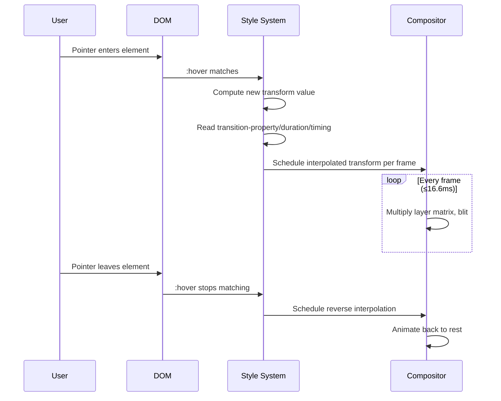
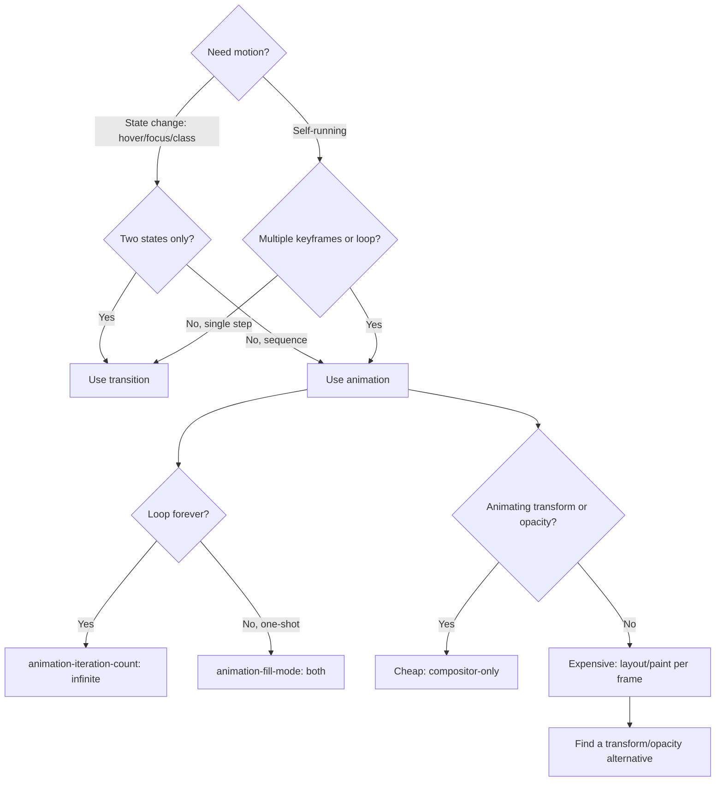

# 1.9 Animations, Transitions, and Transforms

> CSS gives you three related but distinct tools for making things move: **transitions** (one-shot, declarative, triggered by a state change), **animations** (multi-keyframe, scriptable, can loop forever), and **transforms** (a coordinate-system mutation that the GPU can composite cheaply). This note covers all three, the timing functions that drive them, the performance model that decides whether your motion is buttery or janky, and the accessibility guardrail — `prefers-reduced-motion` — that you must respect.

## 1.9.1 Objective

By the end of this note you should be able to:

1. Use the `transition-*` family of properties to declaratively animate a value when it changes between states.
2. Choose a `transition-timing-function` (including `cubic-bezier()` and `steps()`) appropriate to the motion you want to communicate.
3. Use the `transform` property — `translate`, `rotate`, `scale`, `skew`, `matrix`, the 3D variants, `perspective`, and `transform-origin` — without breaking layout.
4. Explain why `transform` and `opacity` are the only two properties you can animate at 60 FPS, and why `top`/`left`/`width` cause layout thrashing.
5. Use `@keyframes` and the `animation-*` shorthand to drive multi-step, looping, or one-shot animations.
6. Decide between transitions and animations for a given effect.
7. Use `will-change` correctly — applied just-in-time, removed when no longer needed — and avoid the common over-use trap.
8. Honor `prefers-reduced-motion` and explain the View Transitions API at a high level.

## 1.9.2 Background Knowledge

Animation in CSS has three historical layers:

1. **Transitions** shipped in 2009–2011. They are a *declarative* mechanism: you describe a property's value in two states, and the browser interpolates between them when the state changes.
2. **Animations** (`@keyframes` and the `animation-*` properties) shipped shortly after. They let you specify arbitrary numbers of waypoints and loop the result. They are *imperative*: they run regardless of state changes once started.
3. **Transforms** (`transform`, `perspective`, `transform-origin`) are a separate property. They pre-date animation but became important because the browser can apply them on the compositor thread without touching layout or paint.

All three rely on the browser's ability to **interpolate** a value. The browser can interpolate lengths, colors, numbers, angles, transforms, and (with `@property`) registered custom properties. It cannot interpolate `display`, `position`, shorthand properties whose longhand components are non-interpolable, or unregistered custom properties.

The performance model that decides whether motion is smooth comes from the rendering pipeline (see [[1.1 CSS Foundations]] and [[1.13 CSS Performance]]). Animating properties that invalidate layout (`width`, `height`, `top`, `left`, `margin`, `padding`) forces the browser to re-run layout for every descendant and repaint; animating `transform` and `opacity` skips both layout and paint and only re-runs compositing. That is the single most important performance fact in CSS animation.

> [!note] The 60 FPS budget is ~16.6 ms per frame. Animating layout-affecting properties burns that budget on layout/paint work; animating `transform`/`opacity` burns it on the compositor, which is a separate thread from the main thread.

## 1.9.3 Core Concepts

### 1.9.3.1 The transition-* Family

The transition model is six properties:

- `transition-property`: which property (or `all`) to animate.
- `transition-duration`: how long, in seconds or milliseconds.
- `transition-timing-function`: the easing curve.
- `transition-delay`: wait this long before starting.
- `transition-behavior`: whether `transition-property: all` includes **discrete** (non-interpolable) properties like `display` (newer feature, allows `display: none`  -->  `block` to participate in a transition).
- The `transition` shorthand combines them all.

Multiple properties are separated by commas:

```css
.card {
  transition: transform 200ms ease-out,
              box-shadow 200ms ease-out,
              opacity 150ms 50ms ease-in;
}
.card:hover { transform: translateY(-4px); box-shadow: 0 8px 24px rgba(0,0,0,0.2); }
```

A transition fires when the property changes **while the element is in the document**. Removing the element cancels it; adding the element back does not resume.

### 1.9.3.2 Timing Functions

CSS ships these named functions:

- `linear` — constant velocity.
- `ease` — `cubic-bezier(0.25, 0.1, 0.25, 1)`, the default.
- `ease-in`, `ease-out`, `ease-in-out` — S-curve presets.
- `cubic-bezier(x1, y1, x2, y2)` — a custom Bézier easing curve.
- `steps(N, start | end)` — stepwise, useful for sprite animation and stop-motion effects.

The four numbers in `cubic-bezier()` are the x and y coordinates of the two control points (P1 and P2). The endpoints P0 and P3 are fixed at `(0, 0)` and `(1, 1)`. The x-axis is time, the y-axis is progress. The x coordinates must be in `[0, 1]` (time can't run backwards); the y coordinates can overshoot for back-easing effects.

Common useful curves:

```css
transition-timing-function: cubic-bezier(0.2, 0.8, 0.2, 1);    /* "standard" ease-out */
transition-timing-function: cubic-bezier(0.4, 0, 0.2, 1);      /* Material standard */
transition-timing-function: cubic-bezier(0.68, -0.55, 0.27, 1.55); /* back-out overshoot */
```

### 1.9.3.3 The transform Property

`transform` applies a coordinate transformation to the element's box. It does not affect surrounding layout — the element is moved, scaled, rotated, or skewed in its own coordinate space, and other elements see its original position.

Functions include:

- `translate(x, y)` / `translateX` / `translateY` / `translateZ` / `translate3d(x, y, z)`
- `rotate(angle)` / `rotateX` / `rotateY` / `rotateZ` / `rotate3d(x, y, z, angle)`
- `scale(x, y)` / `scaleX` / `scaleY` / `scaleZ` / `scale3d`
- `skew(x, y)` / `skewX` / `skewY`
- `matrix(a, b, c, d, e, f)` and `matrix3d(...)` — explicit 2D/3D matrix
- `perspective(n)` — applied **inside** `transform` to set a perspective for that element's 3D transforms

Multiple functions compose left-to-right: `transform: rotate(45deg) scale(2)` rotates the element first, then scales the rotated result. Order matters — `scale(2) rotate(45deg)` produces a different effect.

`transform-origin` sets the point around which transforms are applied. Default is `50% 50% 0` (center). Use `transform-origin: top left` to rotate around the corner.

### 1.9.3.4 3D Transforms and Perspective

For 3D transforms to actually look three-dimensional, you need a perspective. Two ways:

1. On the parent: `perspective: 800px;` — applies to all children.
2. On the element itself: `transform: perspective(800px) rotateY(30deg);`.

A smaller perspective value exaggerates the 3D effect (closer "camera"). `perspective-origin` controls the vanishing point. `transform-style: preserve-3d` lets children share their parent's 3D space, which is what makes a cube work.

`backface-visibility: hidden` hides the back face of a rotated element, which is the standard technique for flip cards.

### 1.9.3.5 @keyframes and the animation-* Family

```css
@keyframes fade-in-up {
  0%   { opacity: 0; transform: translateY(20px); }
  100% { opacity: 1; transform: translateY(0); }
}

.modal { animation: fade-in-up 300ms ease-out both; }
```

The `animation-*` longhands:

- `animation-name`: which `@keyframes` to use.
- `animation-duration`: how long one iteration takes.
- `animation-timing-function`: easing per iteration.
- `animation-delay`: wait before the first iteration.
- `animation-iteration-count`: a number or `infinite`.
- `animation-direction`: `normal`, `reverse`, `alternate`, `alternate-reverse`.
- `animation-fill-mode`: `none`, `forwards`, `backwards`, `both` — whether the element retains the start/end keyframe styles before/after the animation runs.
- `animation-play-state`: `running` or `paused`.
- `animation-timeline` / `animation-range` (newer) — link the animation to scroll or view progress instead of time, enabling scroll-driven animations without JavaScript.

The shorthand order is `name | duration | timing-function | delay | iteration-count | direction | fill-mode | play-state`. The first `<time>` is duration; the second is delay.

`from` and `to` are aliases for `0%` and `100%`. You can have any number of intermediate stops. If `0%` is omitted, the implicit starting state is the element's current computed style; the same applies to `100%`.

### 1.9.3.6 will-change

`will-change` is a hint to the browser: "I am about to animate this property on this element, please pre-allocate the resources you'd need." Used well it eliminates the first-frame jank that occurs when the browser sees a transform for the first time and has to promote the element to its own layer.

```css
.card { will-change: transform; }
```

> [!warning] Over-using `will-change` is a known anti-pattern. Every `will-change` declaration consumes memory (each promoted layer is a separate texture). Setting `will-change: transform` on every list item in a 1000-item list will exhaust GPU memory and *cause* jank. Apply it just-in-time — e.g. on `:hover` of a parent — and remove it when the animation ends.

### 1.9.3.7 prefers-reduced-motion

```css
@media (prefers-reduced-motion: reduce) {
  *, *::before, *::after {
    animation-duration: 0.01ms !important;
    animation-iteration-count: 1 !important;
    transition-duration: 0.01ms !important;
    scroll-behavior: auto !important;
  }
}
```

Users with vestibular disorders, motion sensitivity, or simply on battery-saver mode set this preference in their OS. Honoring it means: don't run decorative motion, snap instantly to the end state. Functional motion (a progress bar, a drag handle following the cursor) is acceptable; ambient or screen-spanning motion is not. See [[1.11 Accessibility in CSS]].

### 1.9.3.8 The View Transitions API

The View Transitions API lets the browser snapshot the old and new states of the DOM and cross-fade between them automatically. You call `document.startViewTransition(() => { /* DOM mutation */ })`, and the browser handles the snapshot, cross-fade, and pseudo-elements (`::view-transition-old`, `::view-transition-new`) you can target with CSS to customize the animation. It is the modern path for SPA route transitions, list reordering, and theme switches. Browser support is still rolling out (Chrome/Edge full, Safari partial, Firefox in development), so use it as progressive enhancement.

## 1.9.4 Detailed Walkthrough

### 1.9.4.1 Transitions vs. Animations — A Decision Matrix

| Need | Use |
|---|---|
| Animate when `:hover`/`:focus`/`:checked` changes | transition |
| Animate on a class swap (e.g. `.open`) | transition |
| Run forever (loading spinner) | animation with `infinite` |
| Multi-step choreography (e.g. modal scales in then content fades) | animation with `@keyframes` |
| Triggered by JS event but no JS-driven value | animation, add class |
| Per-frame value controlled by JS (drag, scrub) | set `transform` directly per frame |

Transitions are simpler, fewer lines, easier to maintain. Use them whenever the motion is binary (between two states). Reach for animations when you need a *sequence* — multiple keyframes, loops, or a self-contained effect that should not depend on a state class sticking around.

### 1.9.4.2 The Anatomy of a transition Lifecycle

1. The browser sees a property change (e.g. `transform` switches from `none` to `translateY(-4px)` because of `:hover`).
2. It reads the element's `transition-*` declarations and finds a matching `transition-property: transform`.
3. It samples the **old computed value** at the moment of change.
4. It computes the **new value** (post-change).
5. It schedules an animation that interpolates from old  -->  new across `transition-duration`, with `transition-delay` first and `transition-timing-function` applied.
6. Each frame, the browser sets the property to the interpolated value. If the property is `transform` or `opacity`, that frame skips layout/paint and only re-runs compositing.
7. When the user pointer leaves the element (the state reverts), the same process runs in reverse: old value is the hovered value, new value is the resting value.

### 1.9.4.3 cubic-bezier Intuition

A timing function maps normalized time (0  -->  1) to normalized progress (0  -->  1). `linear` is the diagonal: progress always equals time. `ease-out` bows upward — progress jumps early then slows. `ease-in` bows downward — slow start, fast finish. `ease-in-out` is S-shaped.

`cubic-bezier(0.68, -0.55, 0.27, 1.55)` is the classic "back-out" curve: progress dips below zero (the element briefly moves backwards) and overshoots 1 (the element briefly moves past its target) before settling. This is the bounce-in pattern you see in Material Design.

The y coordinates can be outside `[0, 1]` for overshoot/undershoot; the x coordinates must stay inside `[0, 1]`. Negative y values require the animated property to be one that accepts negative values (most do; `transform: scale()` accepts negatives but they flip the element, which can look like a glitch).

### 1.9.4.4 Why transform Is Cheap

A normal layout-affecting property like `width` lives in the **layout** stage of the pipeline. When it changes, the browser must:

1. Recompute the box tree.
2. Recursively lay out every descendant.
3. Re-paint any pixels that changed.
4. Recomposite.

`transform` and `opacity` live in the **compositor** stage. The element's pixels are already painted into a layer texture; the compositor just multiplies a matrix (transform) or an alpha (opacity) and re-blits. No layout, no paint, no main thread work at all in the steady state. This is why you can spin a `transform: rotate()` animation at 60 FPS on a 4-year-old phone while a `width: 1%  -->  100%` animation on the same element will stutter.

The practical rule: any time you'd animate `top`, `left`, `width`, `height`, `margin`, or `padding`, look for a way to do it with `transform` instead. Slide a panel with `translateX(100%)` not `left: 100%`. Resize with `scale()` not `width`. Fade with `opacity` not `display`.

> [!tip] If you must animate a layout property (e.g. an accordion's `height`), prefer the modern `interpolate-size: allow-keywords` plus `height: auto` pattern, or animate `grid-template-rows: 0fr  -->  1fr` — both keep the layout work small and predictable. See [[1.6 Grid]].

### 1.9.4.5 will-change Done Right

The right pattern is:

1. **Don't** put `will-change` in the base stylesheet for elements that *might* animate.
2. **Do** add it (via a class) just before the animation starts, and remove it shortly after it ends. For `:hover`-triggered motion, the parent's `:hover` is a good host:

```css
.card { transition: transform 200ms; }
.group:hover .card { will-change: transform; }
.group { transition: will-change 0s 250ms; } /* remove hint after hover ends */
```

For animations triggered by JS, set `will-change` one frame before applying the class, and clear it on `animationend`:

```js
el.style.willChange = "transform";
requestAnimationFrame(() => el.classList.add("animate"));
el.addEventListener("animationend", () => el.style.willChange = "auto", { once: true });
```

### 1.9.4.6 Animation fill-mode in Detail

`animation-fill-mode` decides what the element looks like **before** `animation-delay` expires and **after** the last iteration. The four values:

- `none` (default) — before delay: original styles; after end: original styles.
- `forwards` — after end: keep last keyframe's styles.
- `backwards` — before delay: use first keyframe's styles.
- `both` — both of the above.

If you've ever had a modal flash in fully visible before the fade-in animation starts, the fix is `animation-fill-mode: backwards` (or `both`), so the element is held at `opacity: 0` during the delay.

## 1.9.5 Practical Examples

### 1.9.5.1 A Button Lift on Hover

```css
.btn {
  padding: 0.75rem 1.5rem;
  border-radius: 8px;
  background: var(--brand);
  color: white;
  transform: translateZ(0);            /* hint the layer without will-change */
  transition: transform 180ms cubic-bezier(0.2, 0.8, 0.2, 1),
              box-shadow 180ms ease-out;
}
.btn:hover  { transform: translateY(-2px); box-shadow: 0 6px 16px rgba(0,0,0,0.18); }
.btn:active { transform: translateY(0);   box-shadow: 0 2px 6px rgba(0,0,0,0.18); transition-duration: 80ms; }
```

`transform: translateZ(0)` is a legacy way to force a layer; `will-change: transform` is the modern equivalent but should be removed when not hovering. We avoid `will-change` here because the duration is short and the layer promotion would cost more than it saves.

### 1.9.5.2 A Modal That Fades and Slides In

```css
@keyframes modal-in {
  from { opacity: 0; transform: translateY(16px) scale(0.98); }
  to   { opacity: 1; transform: translateY(0) scale(1); }
}
.modal {
  animation: modal-in 220ms cubic-bezier(0.2, 0.8, 0.2, 1) both;
}
.modal.is-closing {
  animation: modal-in 180ms ease-in both reverse;
}
```

The `both` fill-mode keeps the modal at `opacity: 0` before the animation starts (preventing a flash) and at the end state after. The closing state runs the same keyframes in reverse with a shorter, snappier timing function.

### 1.9.5.3 A Flip Card

```css
.card { perspective: 1000px; }
.card-inner {
  position: relative;
  transform-style: preserve-3d;
  transition: transform 600ms cubic-bezier(0.2, 0.8, 0.2, 1);
}
.card.is-flipped .card-inner { transform: rotateY(180deg); }

.card-face {
  position: absolute;
  inset: 0;
  backface-visibility: hidden;
}
.card-back { transform: rotateY(180deg); }
```

`preserve-3d` lets the two faces share the parent's 3D space, `backface-visibility: hidden` hides whichever face is pointing away, and the back face is pre-rotated 180° so it lines up when the inner is rotated.

### 1.9.5.4 A Loading Spinner

```css
.spinner {
  width: 24px;
  height: 24px;
  border: 3px solid rgba(0,0,0,0.15);
  border-top-color: var(--brand);
  border-radius: 50%;
  animation: spin 800ms linear infinite;
}
@keyframes spin { to { transform: rotate(360deg); } }
```

`linear` because a spinner should look like constant rotation; `infinite` because it runs until JS removes it.

### 1.9.5.5 Respecting prefers-reduced-motion

```css
@media (prefers-reduced-motion: reduce) {
  .modal { animation: none; opacity: 1; transform: none; }
  .spinner { animation: none; }
  .btn { transition: none; }
}
```

Some teams prefer the global reset pattern at the top of the stylesheet, but be aware that it can break functional animations like progress bars. A targeted override is safer.

## 1.9.6 Mermaid Diagrams

### Transition Lifecycle (Sequence)



### Animation vs Transition Decision



## 1.9.7 Common Mistakes

1. **Animating layout properties (`top`, `left`, `width`, `height`, `margin`, `padding`).** These force layout and paint on every frame and will jank on low-end devices. Use `transform: translate*` for movement, `transform: scale()` for resize, and `opacity` for show/hide.
2. **Forgetting `animation-fill-mode` and getting a flash.** Without `backwards` (or `both`), the element shows its post-animation styles during `animation-delay` — typically a flash of the visible state. Always specify `both` unless you have a reason not to.
3. **Putting `will-change` on every animated element.** Each `will-change` consumes GPU memory for a layer. A few is fine; thousands will exhaust memory and cause stuttering. Apply just-in-time.
4. **Using `transition: all`.** It animates everything, including properties you didn't intend (like `color` on hover where you wanted an instant swap), and makes the code harder to debug because the source of the motion is implicit. Be explicit.
5. **Specifying duration first, then delay, in the shorthand and getting them confused.** `transition: 200ms 100ms linear` means 200ms duration with 100ms delay; the first time is always duration, the second is delay. Mixing them up silently produces a delay you didn't intend.
6. **Forgetting that `transform` does not affect layout.** If you `translate` an element out of view and expect siblings to reflow, they won't — `transform` is post-layout. If you need reflow, animate `margin` or use the new `interpolate-size` with `height: auto`.
7. **Not setting `transform-origin` for non-center rotations.** Default is center. A `rotate(45deg)` on a tooltip arrow that should pivot from a corner will look wrong; set `transform-origin: bottom left` explicitly.
8. **Ignoring `prefers-reduced-motion`.** Decorative motion that runs forever (parallax, ambient gradients) can cause nausea. Provide a reduced-motion fallback or skip the motion entirely.

## 1.9.8 Best Practices

1. **Default to 150–300 ms for UI motion.** Shorter feels abrupt; longer feels sluggish. Material Design's standard easing (`cubic-bezier(0.4, 0, 0.2, 1)`) is a safe default.
2. **Animate `transform` and `opacity` whenever possible.** Everything else triggers layout or paint. If you must animate another property, profile it.
3. **Use `cubic-bezier` curves with overshoot sparingly.** They're delightful on small UI elements but exhausting on large ones. Reserve back-easing for emphasis.
4. **Set `animation-fill-mode: both` by default.** It avoids pre-animation flashes and keeps the end state, both of which are usually what you want.
5. **Apply `will-change` just-in-time and clear it on `animationend`/`transitionend`.** Treat it as a resource, not as a styling hint.
6. **Always provide a `prefers-reduced-motion` fallback.** Make it the first thing you write, not an afterthought.
7. **Name `@keyframes` semantically.** `modal-in`, `toast-out`, `spinner-rotate` are discoverable; `fadeIn` and `anim1` are not.
8. **Combine `@property` with custom-property animations for smooth gradients.** See [[1.8 Variables, Functions, and Calculations]] for the gradient-angle trick.
9. **Use View Transitions API as progressive enhancement.** Wrap `document.startViewTransition` in a feature check and fall back to direct DOM mutation.

## 1.9.9 Mini Exercises

### Exercise 1: Diagnose the Jank

A developer writes:

```css
.toast { left: -100%; transition: left 300ms ease-out; }
.toast.show { left: 0; }
```

The animation stutters on a low-end phone. Why, and what's the fix?

**Worked solution.** `left` is a layout-affecting property. Every frame, the browser must:

1. Recompute the layout for `.toast` and any siblings affected.
2. Repaint the changed pixels.
3. Recomposite.

On a low-end phone this exceeds the 16.6 ms budget and frames are dropped.

The fix is to use `transform: translateX()` instead, which lives on the compositor:

```css
.toast { transform: translateX(-100%); transition: transform 300ms ease-out; }
.toast.show { transform: translateX(0); }
```

Now the browser skips layout and paint; it only re-runs compositing, which is GPU work and runs on the compositor thread, off the main thread. The animation will be smooth even on a 5-year-old phone.

**Common wrong approach.** Adding `will-change: left`. That doesn't help because the bottleneck is layout/paint, not layer promotion. Even promoting `.toast` to its own layer doesn't avoid the layout cost of changing `left`.

### Exercise 2: Reverse the Animation on Close

Given:

```css
@keyframes toast-in {
  from { opacity: 0; transform: translateY(20px); }
  to   { opacity: 1; transform: translateY(0); }
}
.toast.is-open { animation: toast-in 250ms ease-out both; }
```

How would you make the toast animate out (slide back down and fade) when the class is removed?

**Worked solution.** Two reasonable approaches.

**Approach A — Use a transition.** Replace the animation with a transition between two states:

```css
.toast {
  opacity: 0;
  transform: translateY(20px);
  transition: opacity 200ms ease-out, transform 200ms ease-out;
}
.toast.is-open {
  opacity: 1;
  transform: translateY(0);
}
```

Removing the class reverts to the original state and the transition runs in reverse automatically. This is the cleanest pattern when you have only two states.

**Approach B — Run the same keyframes in reverse.** If you need the closing animation to differ (e.g. faster), declare a separate close state with `animation-direction: reverse`:

```css
.toast { animation: toast-in 250ms ease-out both reverse; }
.toast.is-open { animation: toast-in 250ms ease-out both; }
```

The base (closed) state has the reversed animation; the open state runs it forward. Because both have `animation-fill-mode: both`, the open state holds at the end (`opacity: 1, translateY(0)`) and the closed state holds at the reversed end (`opacity: 0, translateY(20px)`).

**Common wrong approach.** Trying to use a transition and an animation together. The animation wins whenever it is applied; the transition never fires on the way in. Pick one mechanism per state pair.

### Exercise 3: Build a Spinner That Respects Reduced Motion

Write a spinner that spins smoothly on default settings and falls back to a static indicator under `prefers-reduced-motion: reduce`.

**Worked solution.**

```css
.spinner {
  width: 24px;
  height: 24px;
  border: 3px solid rgba(0,0,0,0.15);
  border-top-color: var(--brand);
  border-radius: 50%;
  animation: spin 800ms linear infinite;
}
@keyframes spin { to { transform: rotate(360deg); } }

@media (prefers-reduced-motion: reduce) {
  .spinner {
    animation: none;
    border-top-color: var(--brand); /* full ring instead of partial */
    border-color: var(--brand);
    border-top-color: var(--brand);
    /* or render a static "Loading…" text alongside */
  }
}
```

Under reduced motion the spinner stops rotating but is still visually identifiable as an in-progress indicator. Many teams pair this with a textual "Loading…" so the message is unambiguous; the visual is decorative.

**Common wrong approach.** Setting `animation-duration: 0.01ms !important` globally. That *technically* satisfies the reduced-motion contract (no perceptible motion) but breaks the visual affordance — the spinner appears frozen at a random angle, which can look like a broken UI. Either keep a static visual or remove the element entirely.

### Exercise 4: Animate Height Without Knowing the Final Value

The classic accordion problem: you want to animate from `height: 0` to the element's natural height, but `height: auto` is not interpolable. Show two modern solutions.

**Worked solution.**

**Solution 1 — Grid `0fr  -->  1fr`.** Wrap the collapsible content in a grid container whose row track animates:

```css
.accordion-panel {
  display: grid;
  grid-template-rows: 0fr;
  transition: grid-template-rows 300ms ease-out;
}
.accordion-panel > div { overflow: hidden; }
.accordion-panel.is-open { grid-template-rows: 1fr; }
```

`0fr` and `1fr` are interpolable, and the `1fr` row will fit the content. This is the cleanest modern technique (Chrome 117+, Safari 16+, Firefox 117+).

**Solution 2 — `interpolate-size: allow-keywords` with `height: auto`.** Enable the new keyword interpolation feature:

```css
.accordion-panel {
  interpolate-size: allow-keywords;
  height: 0;
  overflow: hidden;
  transition: height 300ms ease-out;
}
.accordion-panel.is-open { height: auto; }
```

`interpolate-size: allow-keywords` tells the browser to resolve `auto` to a concrete length at the start of the transition and interpolate to it. Newer browsers (Chrome 129+) support it; older browsers ignore the unknown property and the panel will snap, which is an acceptable progressive enhancement.

**Common wrong approach.** JavaScript measuring `scrollHeight` and setting `style.height` explicitly. This works but causes layout thrashing (forced synchronous layout) if done repeatedly, and is brittle when content reflows mid-animation (font loads, image loads). The CSS-only solutions adapt to content changes automatically.

### Exercise 5: A Card That Lifts on Hover with a Custom Bezier

Design a card that lifts 4px and gains a soft shadow on hover, with a custom easing curve that gently overshoots. Animate it back smoothly on hover-out.

**Worked solution.**

```css
.card {
  background: white;
  border-radius: 12px;
  padding: 1.5rem;
  box-shadow: 0 1px 3px rgba(0,0,0,0.08);
  transition: transform 220ms cubic-bezier(0.34, 1.56, 0.64, 1),
              box-shadow 220ms ease-out;
  will-change: transform; /* acceptable: single short-lived element */
}
.card:hover {
  transform: translateY(-4px);
  box-shadow: 0 12px 24px rgba(0,0,0,0.12);
}
```

The `cubic-bezier(0.34, 1.56, 0.64, 1)` curve overshoots on the way in (y = 1.56 > 1), so the card briefly lifts a little past -4px before settling. The y-coordinate beyond 1 only works because `transform: translateY()` accepts any length, including the brief overshoot position. On hover-out the same curve runs in reverse, which produces a slight undershoot (the card dips below its rest position) that feels natural.

We chose `220ms` because the lift is small; longer would feel sluggish. `box-shadow` runs in parallel on the same duration so the two arrive together. `will-change: transform` is acceptable here because there is only one card; for a grid of cards, remove `will-change` from the base style and add it on `.grid:hover .card` only.

**Common wrong approach.** Using `cubic-bezier` with x > 1 or x < 0. The x-axis represents time and must stay in `[0, 1]`. Browsers reject the curve. If you want time to feel non-linear, you need a different mechanism (e.g. `steps()` or chained animations).

## 1.9.10 Summary

CSS motion has three layers: **transitions** for two-state animations triggered by state changes, **animations** for multi-keyframe or looping effects, and **transforms** for the actual coordinate mutations you should be animating. The single most important performance rule is: animate `transform` and `opacity` whenever possible, because they live on the compositor thread and skip layout and paint. `will-change` is a just-in-time hint, not a styling declaration — over-use causes memory pressure. `animation-fill-mode: both` prevents pre-animation flashes and holds the end state. `prefers-reduced-motion` is a non-negotiable accessibility guardrail. The View Transitions API is the modern path for DOM-mutation-driven transitions and should be used as progressive enhancement.

## 1.9.11 Related Notes

- [[1.1 CSS Foundations]] — the rendering pipeline that explains why `transform` is cheap.
- [[1.7 Responsive Design and Container Queries]] — `prefers-reduced-motion` and other `prefers-*` features.
- [[1.8 Variables, Functions, and Calculations]] — `@property` registration unlocks smooth custom-property animation.
- [[1.10 Pseudo-Elements and Pseudo-Classes]] — `:hover`, `:focus-visible`, and other state pseudo-classes that trigger transitions.
- [[1.11 Accessibility in CSS]] — deeper coverage of motion sensitivity and the reduced-motion contract.
- [[1.13 CSS Performance]] — layout thrashing, the compositor thread, and the rendering pipeline in detail.
