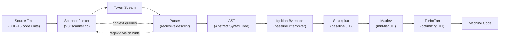
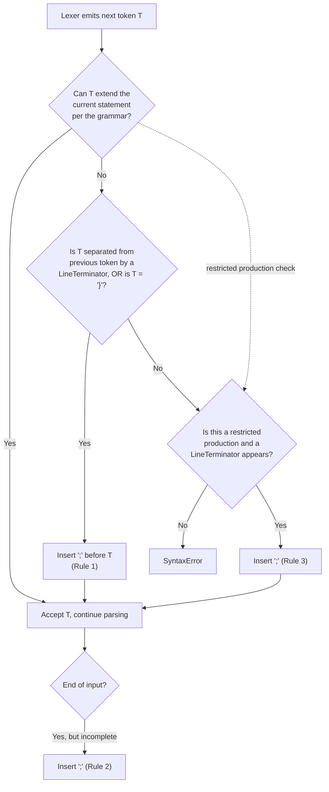
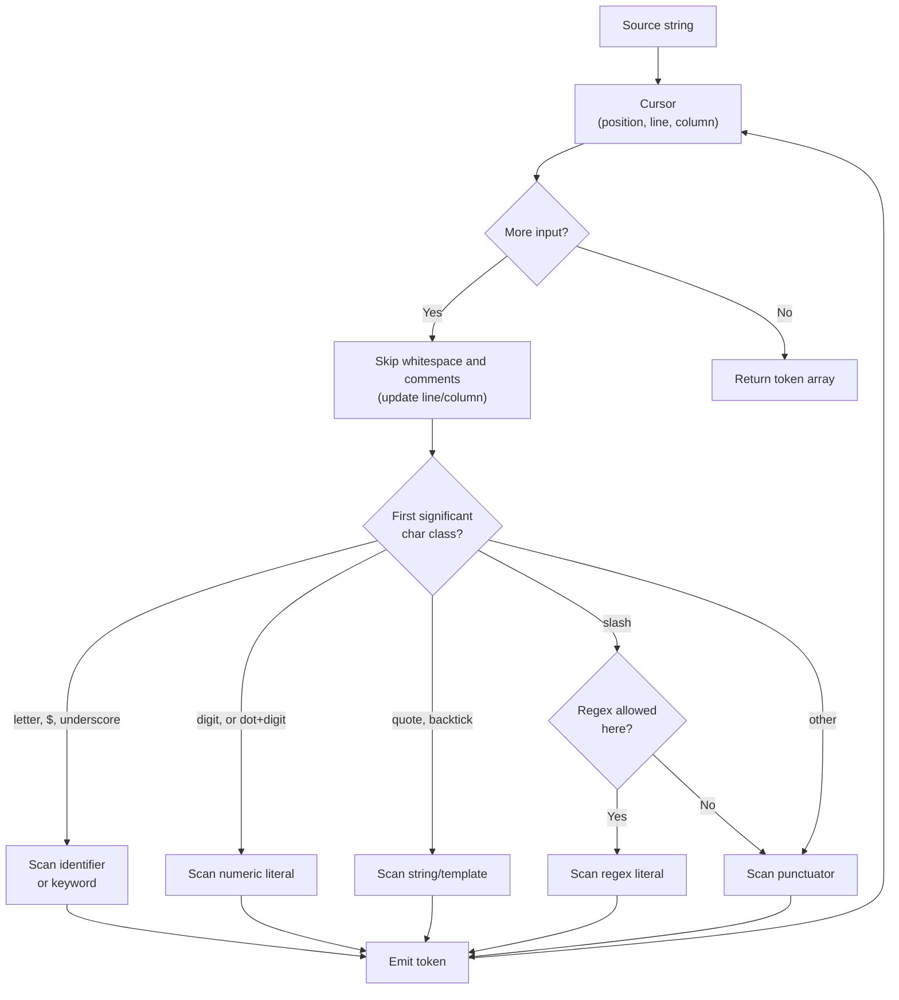

---
tags:
  - javascript
  - syntax
  - lexical-grammar
  - fundamentals
  - difficulty-intermediate
note: "1.01"
created: 2024-01-01
---

# 1.01 Syntax and Lexical Structure

> The compiler does not read your program the way you do. It reads it twice — once as a stream of characters, then again as a stream of tokens — and the rules of that first reading are the silent foundation under everything you write in JavaScript. This note explains those rules exhaustively: how the tokenizer slices source text into tokens, how Automatic Semicolon Insertion decides where statements end, how Unicode defines what counts as an identifier, what strict mode forbids, and how tools like Babel, TypeScript, ESLint, and Prettier ride on top of the same lexical grammar.

---

## 1. Purpose

JavaScript source code, before it ever executes, must be read as a stream of characters and transformed into a tree of meaningful nodes. That transformation has two distinct stages, and the first one — the **lexical grammar** — is the silent foundation under everything you will ever write. Without lexical rules, the engine could not decide where one token ends and the next begins. The string `leta` could be a single identifier, or it could be the keyword `let` followed by an identifier `a`. The string `return\nvalue` could be a return statement that returns `value`, or it could be two separate statements. The string `0.toString()` could be a method call on the number zero, or it could be a malformed numeric literal that the tokenizer refuses to emit. Every one of these ambiguities is resolved by a small, finite set of lexical rules that the ECMAScript specification fixes in stone.

The reason this matters in production is that lexical ambiguity is the source of an entire class of bugs that look like logic bugs but are in fact parser bugs. The most famous is the **minification ASI hazard**. A developer writes:

```javascript
function firstValid(items) {
  return
    items.find((x) => x.valid)
}
```

intending to return the first valid item. The engine, however, applies Automatic Semicolon Insertion: because `return` is a **restricted production** and the next non-whitespace token (`items`) is separated from `return` by a line terminator, the parser inserts a semicolon immediately after `return`. The function returns `undefined`. The line `items.find(...)` becomes a dead expression statement that evaluates and is discarded. No syntax error is thrown. The CI is green. The bug only surfaces at runtime, often only under specific inputs, often only in production after a deploy.

A second classic is the **leading-bracket property access hazard**:

```javascript
const first = computeFirst()
const second = computeSecond()
[first, second].forEach(logItem)
```

The developer intends three statements: compute first, compute second, then iterate over the array. The parser sees `computeSecond()[first, second].forEach(logItem)` — a single expression that calls `computeSecond()`, indexes the result with the comma-operator expression `[first, second]` (which evaluates to `second`), then calls `.forEach(logItem)` on whatever `second` is. The intended array `[first, second]` never exists as a standalone statement. If `computeSecond()` returns a non-indexable value, you get a `TypeError: Cannot read properties of ...`. If it returns an array, you get silent wrong behavior. Both are production fires.

A third is the **backtick hazard**:

```javascript
const tag = buildTag()
`static template literal`.split(' ').forEach(console.log)
```

The developer intends to declare `tag`, then split a static template literal. The parser sees `buildTag()\`static template literal\`` — a tagged template literal — and `.split(...)` is called on the result of tagging. `buildTag` is now a tag function, receiving the string array `['static template literal']` and an empty substitution array. The behavior is silently wrong.

A fourth is the **slash hazard**:

```javascript
const a = x
/regex/g.test(y)
```

The parser tries to parse `x / regex` as a division expression and either throws a late syntax error or — worse — parses `x / regex / g.test(y)` as chained division and never reaches the intended regex test. The token `/` is lexically ambiguous: it is a division operator **or** the start of a regex literal, and the parser decides which based on what the previous token allowed. This is the **regex/division disambiguation**, one of the most subtle parts of the JS lexer.

The cost of these bugs is enormous because they are **silent**. No syntax error is thrown. The program runs. The linter may or may not catch them. The bug only manifests at runtime. Every senior JavaScript engineer can name at least one of these hazards from personal experience, and most can name all four.

Lexical structure is therefore not a dry academic topic. It is the contract between every JavaScript author and every JavaScript engine, transpiler, linter, and formatter. When you understand it, you can predict — without running the code — whether a given source layout will parse the way you intend. You can read minified output, debug source-map mismatches, write a Babel plugin, pass the interview question that asks "what does `0..toString()` return and why?", and explain why `let\nx = 5` parses as `let x = 5` rather than `let; x = 5`. This note exists to give you that predictive power.

---

## 2. Theory and Deep Dive

### 2.1 The Two Stages of Source Reading

The ECMAScript specification (ECMAScript 2024, §11 "ECMAScript Language: Source Text" and §12 "ECMAScript Language: Lexical Grammar") defines two distinct stages that turn source text into a runnable program:

1. **Lexing** (also called **tokenizing** or **scanning**). The source text — a sequence of UTF-16 code units — is read left to right and grouped into **tokens**. A token is the smallest unit of grammar that the parser cares about: an identifier, a keyword, a numeric literal, a string literal, a punctuator, a template literal chunk, or a regular expression literal. Whitespace and line terminators are not tokens themselves but they separate tokens. Comments are also discarded at this stage.
2. **Parsing**. The token stream is fed to a recursive-descent parser that builds an **Abstract Syntax Tree (AST)** — the structured representation that the engine compiles to bytecode and, eventually, optimized machine code.

The boundary between these two stages is one of the most important design decisions in any language. In JavaScript, the lexer has to make a handful of **context-sensitive** decisions — most famously, whether `/` starts a regex literal or is a division operator — which means the lexer and parser are not cleanly separated in practice. V8, SpiderMonkey, and JavaScriptCore all run a tightly coupled scanner/parser pair.



The dashed arrows in the diagram are the context-sensitive feedback paths. The scanner asks the parser "are we in a position where a regex literal is valid?" before deciding what `/` means. The parser asks the scanner "what was the previous token's line number?" to apply Automatic Semicolon Insertion. This coupling is why you cannot fully understand JavaScript lexing without also understanding parsing.

### 2.2 Source Text and Unicode

ECMAScript 2024 §11.1 specifies that source text is a sequence of Unicode code points, encoded in UTF-16 for the purposes of the spec's internal algorithms. In practice, source files on disk are usually UTF-8, and the engine transcodes to UTF-16 (or to its internal representation) on read. Two consequences follow:

- Characters outside the Basic Multilingual Plane (BMP) — that is, code points above U+FFFF — are represented as **surrogate pairs** in UTF-16. The spec's algorithms explicitly handle surrogate pairs when computing string lengths, character access, and so on. `''.length` is `2`, not `1`, because the emoji is a surrogate pair.
- All characters that the spec calls **WhiteSpace**, **LineTerminator**, **Identifier**, and **StringLiteral** are defined by Unicode category or by explicit enumeration in §12.

The spec also defines a small set of **format-control characters** (§12.1) that have special meaning or are silently stripped: **U+200C ZERO WIDTH NON-JOINER (ZWNJ)** and **U+200D ZERO WIDTH JOINER (ZWJ)** are allowed inside identifiers (but not as the first character) — they matter for languages like Devanagari and for emoji sequences; **U+FEFF BYTE ORDER MARK (BOM)** at the start of a source file is treated as whitespace (a BOM mid-source is a `SyntaxError`); and a handful of "invisible operator" characters (U+2060 through U+2064) are tolerated and ignored, a leftover from an early proposal to allow mathematical notation in source.

### 2.3 White Space and Line Terminators

Per §12.2, **WhiteSpace** is TAB (U+0009), VT (U+000B), FF (U+000C), SP (U+0020), NBSP (U+00A0), ZWNBSP (U+FEFF, the byte order mark — only as whitespace), or any character with the Unicode category **Space_Separator** (the `Zs` category: U+2000 through U+200A, U+202F, U+205F, U+3000).

Per §12.3, **LineTerminator** is LF (U+000A, line feed), CR (U+000D, carriage return), LS (U+2028, line separator), or PS (U+2029, paragraph separator).

Line terminators are significant in JavaScript: they are one of the triggers for ASI (see §2.6) and they appear inside the **restricted productions**. Whitespace, by contrast, is purely a token separator with no grammatical significance. This asymmetry is critical: a single space never causes ASI; a single line feed sometimes does. The spec normalizes **CR LF** (U+000D U+000A) to a single line terminator, so Windows-style files behave identically to Unix files.

### 2.4 Comments

Per §12.4, comments come in two flavors:

- **Single-line comments**: `//` followed by any text up to (but not including) the next line terminator. The line terminator is **not** consumed by the comment — it remains available for ASI.
- **Multi-line comments**: `/* ... */`. They may span multiple lines. If a multi-line comment contains at least one line terminator, the comment counts as a line terminator for the purposes of ASI (this is the **restricted production** rule).

Comments are discarded by the tokenizer but they are not gone. Tooling recovers them: JSDoc parsers (TypeScript's TSDoc, Doctrine) read `/** ... */` comments for structured type metadata; ESLint attaches comments to AST nodes so `eslint-disable` directives and JSDoc rules work; Prettier preserves comments by re-attaching them after reformatting; Babel stores them under `leadingComments`, `trailingComments`, and `innerComments` arrays. This is why the mental model of Section 3 says "comments are whitespace that the tokenizer discards but tools like JSDoc recover." At the language level they are whitespace; at the tooling level they are first-class data. Section 4 covers each tool in more depth.

### 2.5 Tokens, Identifiers, and Reserved Words

Per §12.5, a **token** is one of: `IdentifierName`, `Punctuator`, `NumericLiteral`, `StringLiteral`, `Template`, or `RegularExpressionLiteral`. (The last two are context-sensitive: the lexer cannot decide whether backslash-quoted text is a template or whether `/` starts a regex without parser context.)

Per §12.6, an **IdentifierName** is defined by:

```
IdentifierName ::
  IdentifierStart
  IdentifierName IdentifierContinue
```

where:

- **IdentifierStart** (also written `ID_Start` in Unicode terms) is any code point with the Unicode property `ID_Start`, **plus** `$` (dollar sign), **plus** `_` (low line / underscore), **plus** any code point with the Unicode property `Other_ID_Start`.
- **IdentifierContinue** (also written `ID_Continue`) is any code point with the Unicode property `ID_Continue`, **plus** `$`, **plus** `_`, **plus** ZWNJ (U+200C), **plus** ZWJ (U+200D), **plus** any code point with the Unicode property `Other_ID_Continue`.

In terms of Unicode general categories, `ID_Start` corresponds roughly to the union of categories **Lu** (uppercase letter), **Ll** (lowercase letter), **Lt** (titlecase letter), **Lm** (modifier letter), **Lo** (other letter), and **Nl** (letter number). `ID_Continue` corresponds to `ID_Start` plus categories **Mn** (non-spacing mark), **Mc** (spacing combining mark), **Nd** (decimal number), and **Pc** (connector punctuation). The `Other_ID_Start` set is a small explicit list (currently five code points: U+1885, U+1886, U+2118, U+212E, U+309B) that exists for backwards compatibility with older Unicode versions.

Practically, this means `const café = 1;` (é is Ll), `const δ = 3.14;`, `const λ = (x) => x;`, and `const 数 = 42;` (Chinese numerals are Lo) are all valid. But `const  = 1;` is **not** valid — emoji are in category So (Symbol, other), which is not in `ID_Start` (Node throws `SyntaxError: Invalid or unexpected token`). Escaped code points are checked against the same rules, so `const \u{1F4A9} = 1;` is also invalid. `const a\u200Cb = 1;` is valid (ZWNJ is allowed in `IdentifierContinue`), and `const a\u0301 = 1;` is valid (U+0301, combining acute accent, is Mn). `const 1x = 1;` is **not** valid — `1` is a digit (Nd), which is `ID_Continue` but not `ID_Start`.

**Reserved words** (§12.6.2) are the subset of `IdentifierName`s that the grammar forbids as identifiers. They split into:

- **Keywords**: `break`, `case`, `catch`, `class`, `const`, `continue`, `debugger`, `default`, `delete`, `do`, `else`, `export`, `extends`, `finally`, `for`, `function`, `if`, `import`, `in`, `instanceof`, `new`, `return`, `super`, `switch`, `this`, `throw`, `try`, `typeof`, `var`, `void`, `while`, `with`, `yield`.
- **Future reserved words**: `enum`.
- **Future reserved words only in strict mode**: `implements`, `interface`, `let`, `package`, `private`, `protected`, `public`, `static`.
- **Future reserved words only in module code**: `await`.
- **Special tokens** that look like keywords but are technically constants or null-literals: `null`, `true`, `false`. These cannot be used as identifiers in any mode.

`let` and `await` are **contextual keywords**: reserved only in specific contexts. `let` is reserved as a lexical declaration (`let x = 1`) but allowed as an identifier in sloppy non-strict code (`const let = 1`). `await` is reserved inside `async` functions and at the top level of ES modules, but allowed as an identifier in synchronous non-module code. This contextual behavior lives in the parser, not the lexer: the lexer emits an `IdentifierName` token with the value `let`, and the parser decides whether to treat it as a keyword or an identifier based on grammar position.

### 2.6 Automatic Semicolon Insertion (ASI)

ASI is specified in ECMAScript 2024 §12.9. The spec describes the algorithm as a transformation on the token stream that runs **before** the parser applies the syntactic grammar. The rules are:

**Rule 1** — When, as the source text is parsed left to right, a token (called the **offending token**) is encountered that is not allowed by any production of the grammar, then a semicolon is automatically inserted before the offending token **if** one or more of the following is true:
- The offending token is separated from the previous token by at least one LineTerminator.
- The offending token is `}`.

**Rule 2** — When the end of the input stream of tokens is reached and the parser cannot parse the token stream as a single complete Program (or function body), then a semicolon is automatically inserted at the end of the input stream.

**Rule 3 — Restricted productions.** Certain productions in the grammar are marked with the annotation `[no LineTerminator here]`. When the parser is in one of these productions and a line terminator appears at the marked position, ASI inserts a semicolon. The restricted productions are `PostfixExpression` (`++`/`--` cannot have a line terminator between operand and operator), `ContinueStatement`/`BreakStatement` (keyword to label), `ReturnStatement`/`ThrowStatement` (keyword to expression), `ArrowFunction` (before `=>`), `YieldExpression` (before operand), and certain module import/export forms. (Section 8.7 revisits these as an interview topic.)

The combined effect of Rules 1, 2, and 3 is often summarized in plain English as: **the parser inserts a semicolon when the next token cannot be part of the current statement, or when a restricted production forbids a line terminator at this position, or when the input ends.** This is the mental model of Section 3.



The diagram shows the ASI decision flow. Note that the parser does **not** insert a semicolon purely because a line terminator appears — only when the next token cannot extend the current statement **and** a line terminator separates them, or when a restricted production is in play. This is why the following does **not** trigger ASI:

```javascript
const a = 1
const b = 2
```

The parser sees `1` followed by `const`, and `const` cannot extend `const a = 1`. A line terminator separates them, so ASI inserts a semicolon, yielding `const a = 1; const b = 2;`. Good.

But this **also** does not trigger ASI, with a dangerous outcome:

```javascript
const a = 1
(2).toString()
```

The parser sees `1` followed by `(`. Can `(` extend `const a = 1`? Yes — `1(2).toString()` parses as a function call of `1` with argument `2`. No ASI occurs. The statement becomes `const a = 1(2).toString()`, which throws `TypeError: 1 is not a function` at runtime. This is the classic "leading parenthesis" hazard (see Section 6.2 for the bracket variant).

### 2.7 Numeric Literals and the Two-Dots Trick

Numeric literals (§12.8.3) have a grammar that the lexer applies greedily: digits, then optionally a decimal point followed by more digits, then optionally an exponent. The consequence is that `0.toString()` is **not** parsed as `0` followed by `.toString()`. The lexer sees `0.` and tries to continue the numeric literal with a fractional part; the next character `t` is not a digit, so the lexer would emit `0.` as a numeric literal and then `toString()` as a method call — but the grammar does not allow a numeric literal to be immediately followed by an identifier. The result is a `SyntaxError`.

The fixes are `0..toString()` (first `.` ends the literal `0.`, second `.` is member access), `0.0.toString()` (explicit fractional digit), `(0).toString()` (parens), or `0 .toString()` (space before the dot). This is also why `.5` is a valid literal (integer part optional) and why `3.14e2` is `314`. Section 6.6 revisits this as a common mistake.

### 2.8 Strict Mode vs Sloppy Mode

Strict mode (§ECMAScript 2024 §4.1.2 "Strict Mode Code" and various §strict annotations throughout the spec) is an **opt-in stricter dialect** of JavaScript. It is enabled by:

1. The **directive prologue** `"use strict";` (or `'use strict';`) as the first statement of a script or function body. A directive prologue is a string-literal expression statement at the very start; if anything else (including other expression statements) precedes it, it is treated as a regular string expression, not a directive.
2. **ES modules** are always strict, regardless of any directive.
3. **Class bodies** are always strict, regardless of any directive.
4. The `Function` constructor: `new Function('"use strict"; ...')` or `new Function(...args, '"use strict"; body')` — the directive inside the function body activates strict mode.

Strict mode forbids or restricts a long list of behaviors. The full list:

| Behavior | Sloppy | Strict |
|---|---|---|
| Assignment to undeclared variable | Creates a global property | Throws `ReferenceError` |
| `with` statement | Allowed | `SyntaxError` |
| `eval` creating bindings in surrounding scope | Allowed | `eval` runs in its own scope; surrounding scope untouched |
| `arguments` aliasing named parameters | `arguments[0]` mirrors the named param | No aliasing; `arguments` is a snapshot |
| `arguments.callee`, `arguments.caller` | Returns the function | `TypeError` on access |
| `Function.caller`, `Function.arguments` | Returns caller / arguments | `TypeError` on access |
| `this` in a plain function call | Coerced to the global object | `undefined` (not coerced) |
| Duplicate parameter names | Allowed (last wins) | `SyntaxError` |
| Duplicate property names in object literal | Allowed (ES5 strict forbade) | Allowed (since ES6 — both modes permit duplicates; last wins) |
| Octal numeric literal `0777` | Allowed | `SyntaxError` |
| Octal string escape `"\101"` | Allowed | `SyntaxError` |
| `delete` on unqualified identifier | Returns `false` (no error) | `SyntaxError` |
| `delete` on non-configurable property | Returns `false` | `TypeError` |
| Assignment to non-writable property | Silently fails | `TypeError` |
| Assignment to getter-only property | Silently fails | `TypeError` |
| Assignment to non-extensible object's new property | Silently fails | `TypeError` |
| `eval` and `arguments` as identifiers | Allowed | `SyntaxError` if used as variable name, parameter, function name |
| Reserved words added | — | `implements`, `interface`, `let`, `package`, `private`, `protected`, `public`, `static`, `yield` |
| Block-level function declarations | Hoisted to function scope | Hoisted to block scope |
| `const`/`let` redeclaration semantics | (same rules apply, but `var x` then `let x` in strict mode is a `SyntaxError`; in sloppy mode it is also a `SyntaxError` since ES6 — the distinction has eroded) | Same |

The two most consequential restrictions are **implicit globals** (a typo in a variable name becomes an immediate `ReferenceError` instead of a silent global) and **`this` coercion** (an unbound function call gets `undefined` instead of the global object, surfacing bugs faster and closing a class of cross-window security issues).

### 2.9 How V8's Parser Tokenizes

V8's lexer lives in `src/parsing/scanner.cc` and `src/parsing/scanner.h` (with the token definitions in `src/parsing/token.h`). It is a **hand-written** scanner, not generated from a tool like `flex` or `re2c`. The scanner is a state machine that:

1. Skips whitespace and comments, recording whether a line terminator was seen (this is exposed to the parser as `scanner()->HasAnyLineTerminatorBefore()` and friends, and is the data the parser uses for ASI).
2. Reads the next significant character and dispatches on it:
   - A letter, `$`, or `_` starts an identifier scan. The scanner reads characters until it hits one that is not `IdentifierContinue`, then looks the result up in a keyword table to decide whether to emit a keyword token or an `IdentifierName` token.
   - A digit or a `.` followed by a digit starts a numeric literal scan.
   - A `"` or `'` starts a string literal scan.
   - A `` ` `` starts a template literal scan, which is complicated by `${...}` substitution blocks — the scanner has to switch between "template mode" and "expression mode" using a stack.
   - A `/` is the ambiguous case. The scanner checks what the previous token was: if the previous token allows a regex (e.g., `(`, `,`, `=`, `return`, or start of program), the scanner treats `/` as the start of a regex literal. Otherwise, it treats `/` as a division operator or `/=` as compound assignment. This is the regex/division disambiguation described in Section 2.5.
   - Any other character is a punctuator. V8 has a fast path for single-character punctuators and a slower path for multi-character ones (`===`, `!==`, `=>`, `...`, `**=`, `&&=`).

3. The scanner produces a `Token` value (an enum) and, where relevant, the literal value (the string of an identifier, the numeric value of a literal, etc.). It also records the token's source location (start and end positions in the source, used for error messages and source maps).

The parser (`src/parsing/parser.cc`) is a recursive-descent parser that consumes tokens from the scanner and builds an AST. The AST node types are defined in `src/ast/ast.h`. There is also a **preparser** (`src/parsing/preparser.cc`) that does a fast skim of the source to collect top-level function names and variable references for lazy parsing — V8 lazily parses function bodies that are not immediately executed, and only fully parses them when they are first called. This is why a Node.js program that imports a large file but only uses one function pays only the preparsing cost up front.

After parsing, the AST is fed to the **Ignition bytecode generator** (`src/interpreter/interpreter-generator.cc` and friends), which produces baseline bytecode. The bytecode is then tiered up through **Sparkplug** (baseline compiler, fast to compile, no optimization), **Maglev** (mid-tier, some optimization), and **TurboFan** (full optimizing compiler, type feedback-driven). All of this rides on the original token stream produced by the scanner — a bug in the scanner is a bug in everything downstream.

### 2.10 String and Template Literals

String literals (§12.8.4, §12.8.5) are delimited by `"` or `'` with no semantic difference between the two (Prettier defaults to double quotes for JS, backticks for TS). Escape sequences include the control escapes (`\n`, `\r`, `\t`, `\v`, `\f`, `\b`, `\0`), `\xHH` (one BMP byte), `\uHHHH` (one BMP code point, four hex digits), `\u{H...}` (any code point, one to six hex digits, braces required — added in ES6), and the quote/backslash escapes (`\'`, `\"`, `` \` ``, `\\`, `\/`).

The difference between `\u{61}` and `\u0061` is purely syntactic range: both produce `a` (U+0061). But `\u{61}` can express code points above the BMP — `\u{1F4A9}` produces the pile-of-poo emoji, whereas `\u1F4A` is the single BMP character U+1F4A (Ὴ, Greek capital letter Eta with psili and oxia) followed by the literal digit `9`. Always use `\u{...}` for code points above U+FFFF; the four-digit form is a frequent source of bugs.

Template literals (§12.8.6) are delimited by backticks and may contain `${...}` substitutions. The lexer treats a template literal as a sequence of chunks: `TEMPLATE_HEAD` (string before the first `${`), expression tokens, `TEMPLATE_MIDDLE` (string between `}` and the next `${`), and `TEMPLATE_TAIL` (string after the last `}`). A template with no substitutions is a single `NO_SUBSTITUTION_TEMPLATE` token. Tagged template literals call a function with the cooked strings and the substitutions; the function receives a frozen `TemplateStringsArray` with a `.raw` property for the uncooked (escape-sequence-preserving) versions.

---

## 3. Mental Models

A mental model is a metaphor that survives contact with edge cases. The two best models for ASI and the lexer are stated below, along with where each one breaks.

### 3.1 ASI as "the parser inserts a semicolon when the next token cannot be part of the current statement"

This is the most accurate one-sentence model. It correctly handles all three rules:

- It explains Rule 1: if `const` cannot extend `const a = 1`, a semicolon is inserted (provided a line terminator separates them — the model's "cannot" is glossing the line-terminator condition).
- It explains Rule 2: at end of input, if the current statement is incomplete, the parser inserts a semicolon.
- It explains Rule 3: a restricted production is a special case where the grammar explicitly says "the next token cannot be part of this production if a line terminator appeared here" — so the model's "cannot" includes the `[no LineTerminator here]` annotations.

**Where it breaks**: the model undersells the line-terminator requirement. Without that requirement, the parser would insert semicolons everywhere a token could not extend a statement, including inside what looks like a single multi-line statement. The fix is to add: "...and either a line terminator separates them, or the next token is `}`, or we are at the end of input." That makes the model precise.

### 3.2 Identifiers as "names that pass the Unicode ID_Start test"

This model is correct and survives all edge cases. An identifier in JavaScript is a sequence of code points where the first code point satisfies `ID_Start` (or is `$` or `_`) and every subsequent code point satisfies `ID_Continue` (or is `$`, `_`, ZWNJ, or ZWJ). The model correctly predicts that `café`, `δ`, `λ`, `数`, `a\u200Cb` are all valid, and that ``, `1x`, and `a b` are not.

**Where it breaks**: the model is too permissive about the first character. It says "passes ID_Start," but ID_Start also includes the small `Other_ID_Start` set (U+1885, U+1886, U+2118, U+212E, U+309B) that exists for backwards compatibility with older Unicode versions. These are rarely used and rarely tested. The fix is to say "passes ID_Start including the Other_ID_Start set, plus `$` and `_`."

### 3.3 Comments as "whitespace that the tokenizer discards but tools like JSDoc recover"

This model captures the dual life of comments. At the language level, a comment is whitespace: it does not produce a token, it does not affect ASI (except that a multi-line comment containing a line terminator counts as a line terminator for the restricted productions), and it is invisible to the runtime. At the tooling level, comments are first-class data: JSDoc reads them for types, ESLint reads them for directives and rules, Prettier preserves them in reformatted output, and Babel attaches them to AST nodes.

**Where it breaks**: the model implies the tokenizer fully discards comments. In fact, V8's scanner records comment positions and contents during the initial scan and exposes them via `scanner()->comments()` for tooling use. The discarding happens at the parser level, not the scanner level. The fix is to say "the parser discards them, but the scanner keeps them around for tooling."

### 3.4 The Lexer-Parser Boundary as "Two Passes with a Phone Call"

The clean textbook picture is two passes: scan, then parse. In JavaScript, the picture is two passes with a phone call between them. The scanner needs to ask the parser "can a regex start here?" before it can decide what `/` means. The parser needs to ask the scanner "was there a line terminator before this token?" before it can decide whether to apply ASI. This bidirectional context is the source of most of JavaScript's lexical weirdness, and it is why writing a JS lexer that does not know about parsing is impossible. (In V8 the parser literally drives the scanner, calling `scanner()->Next()` and `scanner()->peek()`.) The model misses the **preparser** optimization — a fast first pass over the whole file that collects names for lazy compilation — but for understanding the lexical grammar, the "phone call" picture is the right one.

---

## 4. Real-World Use Cases

### 4.1 The Babel Parser

Babel's parser (`@babel/parser`) is a hand-written lexer and recursive-descent parser that produces an ESTree-compatible AST. It is the foundation of the entire Babel toolchain — every Babel plugin, every preset, every transformation operates on the AST that the parser produces. The lexer (`packages/babel-parser/src/tokenizer/index.ts`) is structured almost exactly like V8's: it skips whitespace and comments, reads the next significant character, and dispatches on it. The parser (`packages/babel-parser/src/parser/`) consumes tokens and builds the AST.

Babel's lexer has to make all the same context-sensitive decisions V8 does: regex-vs-division, template-vs-backtick, strict-vs-sloppy. It also supports TypeScript, JSX, and a long list of stage-3 proposal syntax via parser plugins that extend the base grammar. Understanding the lexical grammar is the prerequisite for understanding why certain AST nodes exist (e.g., why `BigIntLiteral` is distinct from `NumericLiteral`, why `TemplateLiteral` has separate `quasi` and `expression` arrays).

### 4.2 The TypeScript Compiler Scanner

The TypeScript compiler's scanner (`src/compiler/scanner.ts`) is similarly hand-written. It produces tokens defined as the `SyntaxKind` enum and records text, line, and column information for every token, which the language server uses for diagnostics and quick-fixes.

TypeScript extends JavaScript's lexical grammar with type annotations (`: Type`, `<T>`, `as Type`, `satisfies Type`), new keywords (`enum`, `interface`, `namespace`, `declare`, `type`, `abstract`, `readonly`, `keyof`, `infer`, `is`, `asserts`), decorators (`@Name`), numeric separators (`1_000_000`, now also in JS as of ES2021), and `#private` class fields.

The TypeScript scanner has to disambiguate `<` as either a less-than operator or the start of a generic type argument list. It does this with a small backtracking parser: when it sees `<` in an expression context, it tries to parse a type argument list and bails out if the parse fails. This is one of the reasons TypeScript's parser is slower than Babel's. See [[6.07 TSC Compiler Operation]] for the full pipeline.

### 4.3 ESLint AST Traversal

ESLint does not have its own parser by default — it uses `espree` for JavaScript, `@typescript-eslint/parser` for TypeScript, and `@babel/eslint-parser` for Babel-compiled code. All produce an ESTree-compatible AST that ESLint's rules walk using `eslint-visitor-keys`. The lexical grammar matters in three places: **comment attachment** (ESLint attaches comments to AST nodes so `eslint-disable` directives, `@ts-ignore`, and JSDoc rules work), **source location** (every node has `loc` and `range` properties; autofixes use them to compute text replacements — a bug in location is a bug in autofix), and **ASI awareness** (rules like `semi`, `no-unexpected-multiline`, and `no-extra-semi` model ASI; the `no-unexpected-multiline` rule exists specifically to catch the leading-paren and leading-bracket hazards from Section 1).

### 4.4 Prettier Formatting

Prettier parses source into an AST (using the same parsers ESLint uses), then re-emits source from the AST. The lexical grammar matters because Prettier has to decide where to insert line breaks, decide whether a semicolon is needed (the `semi` option defaults to `true`, eliminating ASI as a bug source), handle the leading-paren and leading-bracket hazards by inserting a leading semicolon (`;(async () => { ... })()`, `;[1, 2, 3].forEach(...)`), and preserve comments by re-attaching them to AST nodes after reformatting (using the same `leadingComments`/`trailingComments`/`innerComments` arrays as Babel).

### 4.5 Source Maps and Security

A **source map** maps positions in generated code back to positions in original source. The mapping is built during transpilation at the token level, not the character level. If the lexer mishandles a Unicode character (e.g., treats a surrogate pair as two code units), the source map will be off by one for every subsequent token. This is why Babel's scanner uses UTF-16-code-unit-aware position tracking throughout.

Two **security** topics ride on the lexer. **ReDoS** (Regular Expression Denial of Service): certain regexes have catastrophic backtracking on adversarial input. The lexer's regex scanner reads until the closing `/` and is not itself vulnerable, but the runtime regex engine is. **Lexical injection**: if you build source code by string concatenation, an attacker who controls part of the string can escape the intended context (the SQL-injection analogue for `eval`, `new Function`, and code-generation patterns). The defense is never to concatenate source — use parameterized APIs or AST construction.

---

## 5. Code Examples

### 5.1 Example A — Minimal and Conceptual

A minimal "hello world" that exercises the lexical grammar: directive prologue, strict mode, identifier, string literal, console call.

**JavaScript:**

```javascript
"use strict";

// A minimal program that exercises the lexical grammar.
const greeting = "Hello, world!";
console.log(greeting);
```

**TypeScript:**

```typescript
"use strict";

// Same program with an explicit type annotation.
// TypeScript infers `string` from the literal, so the annotation is redundant
// here, but it demonstrates the type-annotation punctuator `:`.
const greeting: string = "Hello, world!";
console.log(greeting);
```

**Differences annotated:**

- The TypeScript version adds `: string` after the identifier — a type annotation, not a JavaScript construct. The TS scanner emits a `Colon` token and a `StringKeyword` token; the type checker uses them. After `tsc` erases types, the emitted JavaScript is byte-for-byte identical to the JS version.
- Both versions begin with the `"use strict";` directive prologue. In a real ES module (`.mjs` extension or `"type": "module"` in `package.json`), the directive is unnecessary — modules are strict by default — but it documents intent.

### 5.2 Example B — Production-Grade

A production-grade ES module with a shebang line, JSDoc, TypeScript types, defensive error handling, and ASI-safe layout. This is what a real CLI utility file looks like in a well-run codebase.

**JavaScript (file: `bin/summarize.mjs`):**

```javascript
#!/usr/bin/env node
"use strict";

/**
 * Summarize a list of numbers.
 *
 * @example
 *   summarize([1, 2, 3, 4]); // { count: 4, sum: 10, mean: 2.5 }
 *
 * @param {ReadonlyArray<number>} values - The numbers to summarize.
 * @returns {{ count: number, sum: number, mean: number }} The summary.
 * @throws {TypeError} When `values` is not iterable.
 * @throws {RangeError} When `values` is empty.
 */
export function summarize(values) {
  if (values == null || typeof values[Symbol.iterator] !== "function") {
    throw new TypeError("values must be iterable");
  }

  let count = 0;
  let sum = 0;

  for (const value of values) {
    if (typeof value !== "number" || Number.isNaN(value)) {
      throw new TypeError(`value at index ${count} is not a finite number`);
    }
    count += 1;
    sum += value;
  }

  if (count === 0) {
    throw new RangeError("values must not be empty");
  }

  return { count, sum, mean: sum / count };
}

// CLI entry point. Leading semicolon prevents ASI from joining this with
// the previous export if a future edit removes the trailing newline.
;(() => {
  const args = process.argv.slice(2);
  const numbers = args.map((token) => Number(token));
  try {
    const result = summarize(numbers);
    console.log(JSON.stringify(result, null, 2));
  } catch (error) {
    console.error(error.message);
    process.exitCode = 1;
  }
})();
```

**TypeScript (file: `bin/summarize.ts`):**

```typescript
#!/usr/bin/env node
"use strict";

/**
 * Summarize a list of numbers.
 *
 * @example
 *   summarize([1, 2, 3, 4]); // { count: 4, sum: 10, mean: 2.5 }
 *
 * @param values - The numbers to summarize.
 * @returns The summary.
 * @throws {TypeError} When `values` is not iterable.
 * @throws {RangeError} When `values` is empty.
 */
export interface Summary {
  readonly count: number;
  readonly sum: number;
  readonly mean: number;
}

export function summarize(values: ReadonlyArray<number>): Summary {
  if (values == null || typeof values[Symbol.iterator] !== "function") {
    throw new TypeError("values must be iterable");
  }

  let count = 0;
  let sum = 0;

  for (const value of values) {
    if (typeof value !== "number" || Number.isNaN(value)) {
      throw new TypeError(`value at index ${count} is not a finite number`);
    }
    count += 1;
    sum += value;
  }

  if (count === 0) {
    throw new RangeError("values must not be empty");
  }

  return { count, sum, mean: sum / count };
}

// CLI entry point. Leading semicolon prevents ASI from joining this with
// the previous export if a future edit removes the trailing newline.
;(() => {
  const args: ReadonlyArray<string> = process.argv.slice(2);
  const numbers: ReadonlyArray<number> = args.map((token) => Number(token));
  try {
    const result: Summary = summarize(numbers);
    console.log(JSON.stringify(result, null, 2));
  } catch (error) {
    console.error((error as Error).message);
    process.exitCode = 1;
  }
})();
```

**Differences annotated:**

1. **Interface declaration**: TypeScript introduces the `Summary` interface to give the return type a name. JSDoc in the JS version uses `@returns {{ count: number, sum: number, mean: number }}` to express the same shape inline. The TS version is cleaner and gives type-checker-supported names to the fields.
2. **Type annotations on parameters and return**: `values: ReadonlyArray<number>` and `: Summary`. These are erased at runtime.
3. **JSDoc tag style**: TS uses `@param values - ...` (the dash form, supported by TSDoc); the JS version uses `@param {ReadonlyArray<number>} values - ...` (the brace-type form, needed because there is no TS annotation to infer from).
4. **Error typing**: TS narrows `error` to `unknown` in the catch clause (since `useUnknownInCatchVariables` is on by default in `strict: true`), so we cast `(error as Error).message`. In JS, `error` is `any` and the cast is unnecessary.
5. **Shebang**: both versions start with `#!/usr/bin/env node`. The lexer treats `#!` at the very start of a file as a hashbang comment (standardized in ES2023 §12.4.2). On any other line, `#` is the private-field punctuator and `#!` is a syntax error.
6. **Leading semicolon on the IIFE**: both versions include `;(() => { ... })()`. This defends against the leading-paren ASI hazard — if a future edit removes the blank line between the `export` block and the IIFE, the parser would otherwise see `}(() => ...)` and try to call the closing brace or pass the arrow function as an argument. The leading semicolon forces a statement boundary. Prettier does this automatically; here we do it by hand for illustration. The `process.argv` typing differs only in that TS knows the shape via `@types/node`, so we annotate `args` as `ReadonlyArray<string>` for clarity; in JS this would come from a JSDoc `@type` tag.

---

## 6. Common Mistakes and Anti-Patterns

### 6.1 ASI Pitfall with `return` Followed by a Newline

```javascript
function firstValidItem(items) {
  return
    items.find((x) => x.valid)
}
```

**Why it fails:** `return` is a restricted production. The grammar marks `[no LineTerminator here]` between `return` and its expression. The newline after `return` triggers Rule 3 of ASI, and a semicolon is inserted immediately after `return`. The function returns `undefined`. The next line is parsed as a dead expression statement.

**Fix:** Put the return value on the same line as `return`, or break the line inside the argument list (not at a restricted position):

```javascript
function firstValidItem(items) {
  return items.find((x) => x.valid);
}

// Alternative: break inside the argument list, not after `return`.
function firstValidItem(items) {
  return items.find(
    (x) => x.valid
  );
}
```

The same hazard applies to `throw`, `break`, `continue`, `yield`, and the `=>` of arrow functions. Never put a line terminator immediately after any of these tokens if you intend the next token to be the operand.

### 6.2 ASI Pitfall with Leading-Bracket Property Access

```javascript
const first = computeFirst()
const second = computeSecond()
[first, second].forEach(logItem)
```

**Why it fails:** The parser sees `computeSecond()` followed by `[`. The token `[` can extend the previous statement (it is a property access). No line-terminator condition saves you, because Rule 1 requires both "the offending token cannot extend the statement" **and** "a line terminator separates them" — here the first condition is false, so Rule 1 does not fire. The parser combines the statements into `const second = computeSecond()[first, second].forEach(logItem);`, which evaluates the comma expression `[first, second]` to `second`, indexes `computeSecond()` with `second`, and calls `.forEach(logItem)` on the result. If `computeSecond()` does not return an array, you get a `TypeError`. If it does, you get silent wrong behavior.

**Fix:** Use a leading semicolon, or restructure:

```javascript
const first = computeFirst();
const second = computeSecond();
;[first, second].forEach(logItem);
```

Or assign the array first:

```javascript
const first = computeFirst();
const second = computeSecond();
const items = [first, second];
items.forEach(logItem);
```

Prettier and StandardJS insert the leading semicolon automatically. ESLint's `no-unexpected-multiline` rule warns on this pattern. The same hazard applies to leading `(`, leading `` ` ``, and leading `/` (regex) — any of these characters can extend the previous statement, so ASI will not fire.

### 6.3 Accidental Global via Undeclared Variable in Sloppy Mode

```javascript
// sloppy.js — no "use strict", no modules
function setUserAge(name, age) {
  userAge = age;          // typo: should be `userAges[name] = age`
  return userAges[name];
}
```

**Why it fails:** In sloppy mode, assignment to an undeclared variable creates a property on the global object (`globalThis.userAge`, or `window.userAge` in a browser). The function returns `undefined` because `userAges[name]` was never set, and the global `userAge` persists across calls, leaking state between users.

**Fix:** Always use strict mode. With `"use strict";` (or ES modules), this assignment throws `ReferenceError: userAge is not defined` at the line where the typo occurs, surfacing the bug immediately.

```javascript
"use strict";

function setUserAge(name, age) {
  userAges[name] = age;   // ReferenceError here if `userAges` is not in scope
  return userAges[name];
}
```

The ESLint rules `no-implicit-globals` and `no-undef` catch this pattern statically.

### 6.4 ASI Failure with `let` and `const`

```javascript
let
  x = 5
```

**Why it fails:** Many developers assume this parses as `let;` (an expression statement) followed by `x = 5;` (an assignment). It does not. `let` is a **contextual keyword**: when it appears in a position where a lexical declaration is grammatically valid, the parser treats it as the start of a `let` declaration, not as an identifier. Here, `let` followed by an identifier is a valid `LexicalDeclaration`, so the whole thing parses as `let x = 5;`. If the developer intended two separate statements, the result is silently wrong.

The mirror hazard appears with:

```javascript
let x = 1
let y = 2
```

Here ASI correctly inserts a semicolon after `1` (because `let` starts a new statement and cannot extend `let x = 1`, and a line terminator separates them), yielding `let x = 1; let y = 2;`. But the lesson is that `let`'s behavior depends on parser state, and you should never rely on ASI to disambiguate contextual-keyword positions.

**Fix:** Always use explicit semicolons after declarations, and never split a `let`/`const`/`var` keyword onto its own line:

```javascript
let x = 1;
let y = 2;
```

### 6.5 Reserved-Word Collisions

```javascript
// Sloppy mode, non-module script
var class = "advanced yoga";      // SyntaxError in any mode
var enum = ["red", "green"];      // SyntaxError in any mode
var await = "yes";                // SyntaxError in modules and async functions
function private() { }            // SyntaxError in strict mode
const protected = true;           // SyntaxError in strict mode
```

**Why it fails:** Reserved words cannot be used as identifiers in the contexts where they are reserved. `class`, `enum`, and the strict-mode reserved words (`implements`, `interface`, `let`, `package`, `private`, `protected`, `public`, `static`) are rejected by the parser immediately, before any code runs. The error is a `SyntaxError`, not a runtime error.

**Fix:** Use a different name. If you are consuming an API that returns a field named with a reserved word (e.g., a JSON API that returns `{ "class": "advanced yoga" }`), use computed property access: `data["class"]`, not `data.class`.

### 6.6 Treating `0..toString()` and `0.toString()` as Equivalent

```javascript
const s1 = 0.toString();    // SyntaxError: Unexpected number
const s2 = 0..toString();   // "0"
const s3 = (0).toString();  // "0"
```

**Why the first fails:** The lexer reads `0` and then sees `.`. It tries to continue the numeric literal with a fractional part. The next character is `t`, which is not a digit, so the lexer emits `0.` as a numeric literal and then has `toString()` left over — but a numeric literal cannot be directly followed by an identifier. The parser throws `SyntaxError: Unexpected number`.

**Why the second works:** The lexer reads `0.`, sees the second `.`, recognizes that the second `.` cannot be part of a numeric literal (a numeric literal has at most one decimal point), emits `0.` as the numeric literal (which equals `0`), and then the second `.` is a member-access operator. The result is `(0.).toString()` which is `"0"`.

**Fix:** Use the parenthesized form for clarity: `(0).toString()`. Or, in modern code, use a string literal directly: `"0"`.

### 6.7 Octal Literals in Strict Mode

```javascript
"use strict";
const code = 0755;          // SyntaxError in strict mode
const permissions = 0o755;  // OK in any mode (ES6+)
const legacy = "\101";      // SyntaxError in strict mode
const modern = "\x41";      // OK ("A")
```

**Why it fails:** ES5 strict mode forbids legacy octal numeric literals (leading-zero form) and legacy octal string escapes (backslash plus one to three octal digits). The motivation: the leading-zero form was a frequent bug source (developers writing `0123` thinking it was decimal 123) and the escape form collided with `\0` (null).

**Fix:** Use `0o` for octal (`0o755`), `0x` for hex, `0b` for binary, and `\xHH` or `\u{...}` for string escapes.

---

## 7. Best Practices and Design Patterns

### 7.1 Always Use Strict Mode

Strict mode catches an entire class of bugs at the moment they occur rather than at the moment they cause symptoms. The two most consequential restrictions are **implicit globals** (a typo in a variable name becomes a `ReferenceError` instead of a silent global) and **`this` coercion** (an unbound function gets `undefined` instead of the global object, surfacing bugs faster).

The cleanest way to enable strict mode globally is to use ES modules. Set `"type": "module"` in your `package.json`, or use `.mjs` file extensions, and every file is strict by default — no directive needed. Class bodies are also strict by default. For legacy CommonJS files, add `"use strict";` as the first line of every file. If you maintain a legacy codebase that cannot move to strict mode globally, enable it file by file — the most common breakage is code that relied on `arguments` aliasing, `with`, or `this`-coercion, and those patterns are bugs waiting to happen anyway.

### 7.2 Use Semicolons Explicitly

ASI is not a feature; it is a hazard with a happy face. The two defensive rules:

1. **Always end statements with a semicolon.** The simplest, most reliable defense. Prettier's default `semi: true` does this for you. StandardJS's `semi: false` deliberately relies on ASI and requires the leading-semicolons defense below.
2. **If you omit semicolons, prefix every statement that starts with `(`, `[`, `` ` ``, `/`, `+`, `-` with a leading semicolon.** This prevents the leading-paren and leading-bracket hazards. Prettier does this automatically when `semi: false`.

The ESLint rules `semi` and `no-unexpected-multiline` cover both styles. Pick one per project and enforce it.

### 7.3 Use `no-implicit-globals` and `no-undef`

ESLint's `no-implicit-globals` rule forbids any pattern that would create an implicit global (assignment to an undeclared variable, function declarations at the top level of a script in sloppy mode). The `no-undef` rule forbids referencing an undeclared variable. Together with strict mode, they eliminate an entire class of typo-driven bugs.

In an ES module codebase, `no-implicit-globals` is on by default in the recommended config. In a CommonJS codebase, you have to enable it explicitly.

### 7.4 Use `const` by Default, `let` When You Must Reassign, Never `var`

`const` and `let` are block-scoped and not hoisted in a way that allows access before declaration (the temporal dead zone throws `ReferenceError`). `var` is function-scoped, hoisted, and silently initialized to `undefined`. The `var` semantics are the source of countless bugs (the classic `for (var i = 0; ...)` inside a callback captures the wrong `i`).

The ESLint rules `prefer-const`, `no-var`, and `no-let` (if you want to be strict) enforce this. Prettier does not enforce it because it is a style decision, not a formatting decision.

### 7.5 Prefer Template Literals Over String Concatenation

Template literals are easier to read, easier to refactor, and less error-prone than concatenation, and they handle multi-line strings without escape sequences. Prefer `` `User ${name} is ${age} years old.` `` over `"User " + name + " is " + age + " years old."`. The lexical grammar's template-literal token model (head/middle/tail chunks) makes substitution safe in a way that concatenation is not.

### 7.6 Use ESLint, Prettier, and TypeScript Together

The professional stack is: TypeScript for type safety, ESLint for code-quality rules, Prettier for formatting. They overlap slightly (ESLint has formatting rules; TypeScript has type-checking rules that overlap with ESLint), but the standard configuration is:

- `@typescript-eslint` for ESLint rules that understand TypeScript.
- `eslint-config-prettier` to disable ESLint rules that conflict with Prettier.
- `prettier` for formatting.
- `tsc --noEmit` for type checking (the build step).

This stack catches the vast majority of lexical-grammar bugs at compile/lint time. See [[6.04 ESLint Flat Config]] for the modern flat-config setup.

### 7.7 Always Run `"use strict"`-Equivalent Code in Production

If you are forced to ship sloppy-mode code (e.g., a legacy browser bundle that cannot use modules), wrap every file in an IIFE with a `"use strict";` directive at the top:

```javascript
;(function () {
  "use strict";
  // ... file contents ...
})();
```

This confines strict mode to the file's scope without affecting the global scope. Modern bundlers (webpack, esbuild, Rollup, Vite) do this automatically.

---

## 8. Technical Interview Knowledge

### 8.1 Question One — Explain ASI

**Q:** Explain Automatic Semicolon Insertion. How does it work, and what are the three rules?

**A:** ASI is a transformation that the parser applies to the token stream before parsing. The spec describes three rules:

1. **Rule 1 (offending token):** When a token is encountered that cannot extend the current statement per the grammar, a semicolon is inserted before it, **if** either (a) a line terminator separates the offending token from the previous token, or (b) the offending token is `}`.
2. **Rule 2 (end of input):** When the end of the input is reached and the parser cannot complete the program, a semicolon is inserted at the end.
3. **Rule 3 (restricted productions):** Certain grammar productions are annotated `[no LineTerminator here]`. When a line terminator appears at the marked position (e.g., between `return` and its operand, between `throw` and its operand, before `=>`, before `++`/`--` operands), a semicolon is inserted.

The practical consequence is that JavaScript does not require semicolons at the end of every statement, but ASI is not a "feature" — it is a source of bugs. The hazards are: leading-paren (`a\n(b)` becomes `a(b)`), leading-bracket (`a\n[b]` becomes `a[b]`), leading-backtick (`a\n\`x\`` becomes a tagged template), leading-slash (`a\n/regex/` becomes `a / regex`), and restricted-production splits (`return\nvalue` returns `undefined`).

**Trap to avoid:** The interviewer is testing whether you can articulate the rules precisely rather than waving at "JavaScript adds semicolons for you." The precise answer mentions the line-terminator condition, the `}` exception, and the restricted productions. A senior answer also mentions the leading-paren/bracket/backtick/slash hazards.

### 8.2 Question Two — What Is Strict Mode and What Does It Forbid?

**Q:** What is strict mode, what does it forbid, and how do you enable it?

**A:** Strict mode is an opt-in stricter dialect of JavaScript. It is enabled by (a) the `"use strict";` directive prologue at the start of a script or function body, (b) ES modules (always strict), (c) class bodies (always strict), or (d) the `Function` constructor with a `"use strict";` directive inside the body.

Strict mode forbids or restricts: implicit globals (assignment to undeclared variables throws `ReferenceError`), the `with` statement, `eval` creating bindings in surrounding scope, `arguments` aliasing named parameters, `arguments.callee`/`arguments.caller`, `Function.caller`/`Function.arguments`, `this` coercion in plain function calls (becomes `undefined` instead of global object), duplicate parameter names, legacy octal literals and escapes, `delete` on unqualified identifiers, `delete` on non-configurable properties, assignment to non-writable or getter-only properties, assignment to non-extensible objects, using `eval` or `arguments` as identifiers, and the use of `implements`/`interface`/`let`/`package`/`private`/`protected`/`public`/`static`/`yield` as identifiers.

**Trap to avoid:** Do not stop at "it makes JavaScript stricter." List specific restrictions. The interviewer wants to see the full set, especially the implicit-globals and `this`-coercion restrictions, which are the two most consequential.

### 8.3 Question Three — Difference Between `let` and `var` Hoisting?

**Q:** How do `let` and `var` differ in hoisting behavior?

**A:** Both `let` and `var` are hoisted to the top of their scope. The difference is the **scope** they are hoisted to and the **temporal dead zone** behavior. `var` is hoisted to the enclosing **function** scope (or global scope), initialized to `undefined` at the start, so accessing it before the declaration line returns `undefined`. `let` (and `const`) is hoisted to the enclosing **block** scope and is **not** initialized until the declaration line — accessing it before then (but within the block) throws `ReferenceError` due to the **temporal dead zone** (TDZ).

```javascript
console.log(typeof a); // "undefined" (var, hoisted, initialized to undefined)
var a = 1;

console.log(typeof b); // ReferenceError (let, in TDZ)
let b = 2;
```

**Trap to avoid:** Do not say "`let` is not hoisted." It IS hoisted — the TDZ exists because the binding exists but is uninitialized. The correct phrasing is "`let` is hoisted but not initialized; accessing it before the declaration throws `ReferenceError`."

### 8.4 Question Four — What Characters Can Start an Identifier?

**Q:** What characters can start a JavaScript identifier?

**A:** An identifier's first character must be an `IdentifierStart` code point, which is:

- Any code point with the Unicode property `ID_Start` (roughly the general categories Lu, Ll, Lt, Lm, Lo, Nl), OR
- The dollar sign `$` (U+0024), OR
- The underscore `_` (U+005F), OR
- Any code point with the Unicode property `Other_ID_Start` (a small backwards-compatibility set: U+1885, U+1886, U+2118, U+212E, U+309B).

Subsequent characters (`IdentifierContinue`) can additionally be `ID_Continue` (adds Mn, Mc, Nd, Pc), ZWNJ (U+200C), and ZWJ (U+200D).

Practically: Latin letters, Greek letters, Chinese characters, Arabic letters, `$`, and `_` can start identifiers. Digits cannot. Emoji cannot (they are in category So). Combining marks cannot (they are Mn, which is `ID_Continue` only).

**Trap to avoid:** The interviewer may be testing whether you know that emoji cannot be identifiers (`const  = 1;` is a `SyntaxError`). They may also test whether you know that `$` is allowed (jQuery conventions). The Unicode-category answer is the senior answer.

### 8.5 Question Five — Why Does `0..toString()` Work but `0.toString()` Doesn't?

**Q:** Explain why `0..toString()` returns `"0"` but `0.toString()` throws `SyntaxError`.

**A:** The lexer reads numeric literals greedily. When it sees `0.`, it tries to continue with a fractional part. In `0.toString()`, the next character after `0.` is `t` (not a digit), so the lexer would emit `0.` as a numeric literal and then `toString()` as a method call — but the grammar does not allow a numeric literal to be immediately followed by an identifier. The parser throws `SyntaxError: Unexpected number`.

In `0..toString()`, the lexer reads `0.`, sees the second `.`, recognizes it cannot be part of the numeric literal (at most one decimal point), and emits `0.` as the literal. The second `.` is then member access, giving `(0.).toString()` which is `"0"`. The clean fix is `(0).toString()` — the parens make `.toString` unambiguous.

**Trap to avoid:** Do not say "JavaScript treats `0.` as a number and then can't call a method on it." The precise answer is about lexer greediness and the numeric-literal grammar — lexing happens before parsing, and lexer greediness has consequences.

### 8.6 Question Six — What Is the Difference Between `\u{61}` and `\u0061`?

**Q:** What is the difference between the escape sequences `\u{61}` and `\u0061`?

**A:** Both produce the same character: `a` (U+0061). The difference is the **range** of code points they can express.

- `\uHHHH` (four hex digits, no braces) can only express code points in the Basic Multilingual Plane (BMP), that is, U+0000 through U+FFFF. It is the original ES3 escape form.
- `\u{H...}` (one to six hex digits, braces required) can express any code point, U+0000 through U+10FFFF. It was added in ES6.

For BMP code points, the two forms are interchangeable: `"\u{61}" === "\u0061" === "a"`. For non-BMP code points, only the brace form works: `"\u{1F4A9}"` is the pile-of-poo emoji, while `"\u1F4A9"` is the single BMP character U+1F4A (Greek capital letter Eta with psili and oxia) followed by the literal digit `9`. The four-digit form is a frequent source of bugs in code that tries to express emoji or other astral characters.

**Trap to avoid:** The interviewer may test whether you know that the four-digit form silently truncates the intended code point. The senior answer mentions surrogate pairs (`"\uD83D\uDCA9"` is the same emoji expressed as a UTF-16 surrogate pair) and the `String.fromCodePoint(0x1F4A9)` API as alternatives.

### 8.7 Question Seven — What Is a Restricted Production?

**Q:** What is a "restricted production" in the ECMAScript grammar, and why does it matter?

**A:** A restricted production is a grammar production annotated with `[no LineTerminator here]` at a specific position. If a line terminator appears at that position, ASI Rule 3 fires and a semicolon is inserted. The restricted productions are `PostfixExpression` (between operand and `++`/`--`), `ContinueStatement`/`BreakStatement` (between the keyword and its label), `ReturnStatement`/`ThrowStatement` (between the keyword and its expression), `ArrowFunction` (before `=>`), `YieldExpression` (between `yield` and its operand), and certain module import/export forms. The `return` and `throw` restrictions are the most consequential: they turn `return\nvalue` and `throw\nerror` into `return;` and `throw;` (the latter is itself a `SyntaxError` because `throw` requires an operand). They exist so that certain constructs are unambiguous even without semicolons.

**Trap to avoid:** The interviewer is testing whether you can list at least the `return` and `throw` restrictions and explain that the restrictions are an ASI-safety mechanism, not a feature.

### 8.8 Question Eight — Why Are ES Modules Strict by Default?

**Q:** Why are ES modules always in strict mode, even without a `"use strict";` directive?

**A:** When ES modules were standardized (ES6, 2015), the committee shipped them with strict mode as the default for four reasons: (1) modules are new code with no backwards-compatibility constraint; (2) strict mode catches bugs (implicit globals, `this`-coercion, `arguments`-aliasing); (3) modules are isolated — each has its own top-level scope, unlike scripts which share the global scope, which makes strict-mode restrictions easier to enforce; (4) forward compatibility — future features like top-level `await` are module-only and assume strict-mode semantics.

The consequence is that `import`/`export`, top-level `await`, and contextual keywords like `yield` all behave as if `"use strict";` were the first line of the module.

**Trap to avoid:** The interviewer is testing whether you understand that modules are a new dialect, not just a new packaging mechanism. The senior answer mentions top-level scope isolation and forward compatibility.

---

## 9. Practical Exercises

### 9.1 Exercise One — Predict ASI in Ten Cases

**Goal:** Predict, for each of the ten snippets below, whether ASI inserts a semicolon, where, and what the final parsed statement is.

**Snippets:**

```javascript
// 1
const a = 1
const b = 2

// 2
const a = 1
(b).toString()

// 3
return
  value

// 4
const x = 1
const y = 2; const z = 3

// 5
const a = b
/regex/g.test(c)

// 6
throw
  new Error("oops")

// 7
const a = 1
;[1, 2, 3].forEach(console.log)

// 8
const a = 1
`template`.split(" ")

// 9
a = b
++c

// 10
const a = 1
let b = 2
```

**Full worked solution and reasoning:**

**1.** ASI inserts `;` after `1`. Reason: `const` cannot extend `const a = 1`, and a line terminator separates them. Result: `const a = 1; const b = 2;`. Correct.

**2.** ASI does **not** insert. Reason: `(` can extend `const a = 1` (it starts an argument list for a function call). The parser tries to parse `1(b).toString()` and throws `TypeError: 1 is not a function` at runtime. This is the leading-paren hazard. **Fix:** prefix with `;` — `;(b).toString()`.

**3.** ASI inserts `;` after `return`. Reason: `return` is a restricted production; the line terminator between `return` and `value` triggers Rule 3. Result: `return; value;` — the function returns `undefined`. **Fix:** put `return value` on one line.

**4.** No ASI needed. The `;` is explicit. Result: `const x = 1; const y = 2; const z = 3;`.

**5.** ASI does **not** insert. Reason: `/` can extend `const a = b` (it is the division operator). The parser sees `b / regex / g.test(c)` and either fails to parse `regex` as an identifier (if it is not defined) or parses it as chained division. **Fix:** prefix with `;` — `;/regex/g.test(c)`.

**6.** ASI inserts `;` after `throw`. Reason: `throw` is a restricted production. Result: `throw; new Error("oops");` — but `throw;` is itself a `SyntaxError` because `throw` requires an operand. **Fix:** put `throw new Error("oops")` on one line.

**7.** The `;` is explicit at the start of line 2, so no ASI is needed. Result: `const a = 1; [1, 2, 3].forEach(console.log);`. This is the correct defense against the leading-bracket hazard.

**8.** ASI does **not** insert. Reason: `` ` `` can extend `const a = 1` (it starts a tagged template literal, with `1` as the tag). The parser sees `1\`template\`.split(" ")` and calls `1` as a tag function, which throws `TypeError: 1 is not a function`. **Fix:** prefix with `;` — `;\`template\`.split(" ")`.

**9.** ASI inserts `;` after `b`. Reason: the `++` here is **prefix** on `c`, starting a new statement. `++` cannot extend `a = b`, so a semicolon is inserted. Result: `a = b; ++c;`. Correct intent preserved. Note that `a = b++\nc` would parse differently: `b++` is a postfix expression, and the restricted production for postfix `++` (which forbids a line terminator between operand and `++`) means `a = b++\nc` becomes `a = b++; c;`. The same characters in different orders parse differently — a classic ASI subtlety.

**10.** ASI inserts `;` after `1`. Reason: `let` cannot extend `const a = 1` (it starts a new declaration), and a line terminator separates them. Result: `const a = 1; let b = 2;`. Correct.

### 9.2 Exercise Two — Write a Regex-Based Identifier Validator

**Goal:** Write a function `isValidIdentifier(name)` that returns `true` if `name` is a valid (non-reserved) JavaScript identifier, using only a regular expression. Use the Unicode property escape syntax `\p{...}` with the `u` flag (Node.js 10+ and modern browsers). The rules: first character must be `ID_Start` (plus `$`), subsequent characters must be `ID_Continue` (plus `$`, ZWNJ, ZWJ); also exclude reserved words.

**Full worked solution:**

```javascript
"use strict";

const RESERVED = new Set([
  "break", "case", "catch", "class", "const", "continue", "debugger",
  "default", "delete", "do", "else", "export", "extends", "finally",
  "for", "function", "if", "import", "in", "instanceof", "new", "return",
  "super", "switch", "this", "throw", "try", "typeof", "var", "void",
  "while", "with", "yield", "enum", "await", "implements", "interface",
  "let", "package", "private", "protected", "public", "static",
  "null", "true", "false",
]);

/**
 * Validate a JavaScript identifier.
 * @param {string} name - The candidate identifier.
 * @returns {boolean} True if `name` is a valid (non-reserved) identifier.
 */
function isValidIdentifier(name) {
  if (typeof name !== "string" || name.length === 0) {
    return false;
  }

  // First char: dollar sign or ID_Start (the underscore is included in
  // ID_Start in modern Unicode, so we do not list it separately).
  // Subsequent chars: dollar sign, ZWNJ, ZWJ, or ID_Continue.
  // The `u` flag is required for Unicode property escapes.
  const pattern = /^[$\p{ID_Start}][$\u200C\u200D\p{ID_Continue}]*$/u;

  if (!pattern.test(name)) {
    return false;
  }

  if (RESERVED.has(name)) {
    return false;
  }

  return true;
}

// Tests
console.log(isValidIdentifier("café"));      // true
console.log(isValidIdentifier("delta"));     // true (we use a Latin name)
console.log(isValidIdentifier("a1"));        // true
console.log(isValidIdentifier("1a"));        // false (digit first)
console.log(isValidIdentifier("class"));     // false (reserved)
console.log(isValidIdentifier(""));          // false (empty)
console.log(isValidIdentifier("a b"));       // false (space)
```

**Reasoning:** The regex `^[$\p{ID_Start}][$\u200C\u200D\p{ID_Continue}]*$` (with the `u` flag) matches one `ID_Start` (or `$`) followed by zero or more `ID_Continue` (or `$`, ZWNJ, ZWJ) characters. The `u` flag enables Unicode property escapes and full-code-point matching. We then check a reserved-word set to exclude keywords. Note that we cannot catch contextual keywords (`let`, `await`) perfectly without knowing the parse context — we conservatively exclude them all.

### 9.3 Exercise Three — Trace the Tokens of a Tricky Snippet

**Goal:** List, in order, the tokens that the lexer emits for the following snippet. Annotate any context-sensitive decisions.

```javascript
"use strict";
const ratio = a / b / c;
const re = /\d+/g;
const arr = [1, 2, 3];
arr[0].toString();
```

**Full worked solution:**

1. `StringLiteral` `"use strict"` — strict-mode directive prologue.
2. `Punctuator` `;`
3. `Keyword` `const`
4. `Identifier` `ratio`
5. `Punctuator` `=`
6. `Identifier` `a`
7. `Punctuator` `/` — **division operator** (the previous token is an identifier, so the lexer treats `/` as division, not as the start of a regex).
8. `Identifier` `b`
9. `Punctuator` `/` — division operator (same reasoning).
10. `Identifier` `c`
11. `Punctuator` `;`
12. `Keyword` `const`
13. `Identifier` `re`
14. `Punctuator` `=`
15. `RegularExpressionLiteral` `/\d+/g` — **regex** (the previous token is `=`, which allows a regex to start).
16. `Punctuator` `;`
17. `Keyword` `const`
18. `Identifier` `arr`
19. `Punctuator` `=`
20. `Punctuator` `[`
21. `NumericLiteral` `1`
22. `Punctuator` `,`
23. `NumericLiteral` `2`
24. `Punctuator` `,`
25. `NumericLiteral` `3`
26. `Punctuator` `]`
27. `Punctuator` `;`
28. `Identifier` `arr`
29. `Punctuator` `[`
30. `NumericLiteral` `0`
31. `Punctuator` `]`
32. `Punctuator` `.`
33. `Identifier` `toString`
34. `Punctuator` `(`
35. `Punctuator` `)`
36. `Punctuator` `;`

**Context-sensitive decisions:**

- Token 7 (`/`): The lexer asked "can a regex start after an identifier?" The parser answered no. The lexer emitted `/` as a division operator. Token 9 is the same.
- Token 15 (`/\d+/g`): The lexer asked "can a regex start after `=`?" The parser answered yes. The lexer read the regex literal up to the closing `/` and the trailing flag `g`.

This is the regex/division disambiguation. The general rule: a regex can start after `(`, `,`, `=`, `:`, `[`, `!`, `&`, `|`, `?`, `{`, `}`, `;`, at the start of the program, after `return`/`throw`/`case`/`yield`/`typeof`, or after any operator. It cannot start after an identifier, a numeric literal, a string literal, `)`, `]`, or any postfix operator.

### 9.4 Exercise Four — Convert Sloppy Code to Strict Mode

**Goal:** Take the following sloppy-mode code, identify every strict-mode violation, and rewrite it for strict mode.

```javascript
function process(items) {
  with (items) {
    length = length + 1;
  }
  arguments[0] = "modified";
  return length;
}

process.total = 0;
```

**Violations:**

1. `with` statement — forbidden in strict mode.
2. `length = length + 1` — implicit global (assignment to undeclared `length`).
3. `arguments[0] = "modified"` — aliases the named parameter `items` (sloppy mode renames `items` to `"modified"`; strict mode makes `arguments` a snapshot, leaving `items` unchanged).
4. `process.total = 0` — assigning a property on a function. Legal in both modes, but a code smell. Strict mode does not forbid it.

**Strict-mode rewrite:**

```javascript
"use strict";

function process(items) {
  const length = items.length + 1;
  // `arguments` is a snapshot; modify `items` directly if needed.
  return length;
}

// Function-as-object-with-state is a smell; use a module-level variable instead.
let processTotal = 0;
function incrementProcessTotal() {
  processTotal += 1;
}
```

**Reasoning:** The `with` block becomes explicit `items.length` access; the implicit global `length` becomes a `const`. The `arguments` aliasing is removed — modify `items` directly or use rest parameters. The function-as-object state moves to a module-level variable, which is clearer and testable.

---

## 10. Mini-Project Blueprint

**Project name:** Tiny JavaScript Subset Tokenizer

**Scope:** Build a tokenizer for a small but realistic subset of JavaScript. The tokenizer reads a source string and produces an array of token objects with `{ type, value, line, column }`. The subset covers: identifiers and keywords, numeric literals (decimal, hex, binary, octal, with the dot edge case), string literals (single and double quoted, with escapes), template literals (without substitutions for v1), comments (single and multi-line), punctuators (including multi-character ones like `===` and `=>`), and the regex/division disambiguation. Whitespace and line terminators are not emitted as tokens but line and column tracking continues through them.

**Architecture sketch:**



**Key files:**

- `src/lexer.mjs` — the lexer entry point. Exports `tokenize(source)`.
- `src/token-types.mjs` — the `TokenType` enum and helper constructors.
- `src/scanners/identifier.mjs` — identifier and keyword scanner, with a keyword table.
- `src/scanners/number.mjs` — numeric literal scanner, handling the `0..toString()` edge case.
- `src/scanners/string.mjs` — string literal scanner with escape handling.
- `src/scanners/regex.mjs` — regex literal scanner.
- `src/scanners/punctuator.mjs` — punctuator scanner with longest-match-first ordering.
- `test/lexer.test.mjs` — unit tests, including the ASI trace from Exercise 9.3.

**Acceptance criteria:**

- `tokenize("const a = 1;")` returns tokens `[Keyword(const), Identifier(a), Punctuator(=), NumericLiteral(1), Punctuator(;)]`.
- `tokenize("0..toString()")` returns `[NumericLiteral(0.), Punctuator(.), Identifier(toString), Punctuator((), Punctuator())]`.
- `tokenize("const re = /\\d+/g;")` correctly emits a `RegularExpressionLiteral` token, not two division operators.
- `tokenize("/* comment */ const a = 1;")` skips the comment and emits the same tokens as if the comment were absent.
- Line and column tracking survives multi-line input: `tokenize("const a = 1;\\nconst b = 2;")` records the second `const` at line 2, column 1.
- All four ASI hazard snippets from Section 6 produce the token stream that the real V8 scanner would produce (verifiable by comparing with `node --print-tokens` if you want to cheat).

**Stretch goals:**

- Template literals with substitutions: scan `${ ... }` blocks by recursively invoking the lexer and emitting `TemplateHead`, `TemplateMiddle`, `TemplateTail` tokens.
- TypeScript type-annotation support: scan `: Type`, `<T>`, `as Type`, with backtracking on `<` to disambiguate generics from less-than.
- A source-map emitter that records the original position of every emitted token, so the tokenizer can be plugged into a transpiler.

---

## 11. Core Connections

**Prerequisites (read these first):**

- This is the foundational note. There are no strict prerequisites, but familiarity with any C-family language (C, Java, C#) makes the lexical rules feel familiar.

**Sibling notes (read alongside this one):**

- [[1.02 Variables and Mutability]] — covers `var`, `let`, `const`, the temporal dead zone, and the hoisting behavior touched on in Section 8.3.
- [[1.08 Execution Context and Lexical Environment]] — how the parsed AST is executed, including the lexical environment that gives this note's "lexical" its other meaning (lexical scope vs lexical grammar).
- [[6.04 ESLint Flat Config]] — the tooling that enforces the rules from Section 7.
- [[6.07 TSC Compiler Operation]] — the TypeScript compiler's scanner and parser, which extend this note's lexical grammar (`: Type`, `<T>`).

**Dependents (notes that build on this one):**

- [[1.25 V8 Engine Pipeline]] — the full V8 pipeline from source to optimized machine code, of which the scanner is the first stage. Section 2.9 is a summary; that note is the deep dive.
- Every note in the vault that contains a code example assumes the lexical grammar this note establishes.

---

**Tags:** #javascript #syntax #lexical-grammar #fundamentals #difficulty-intermediate
