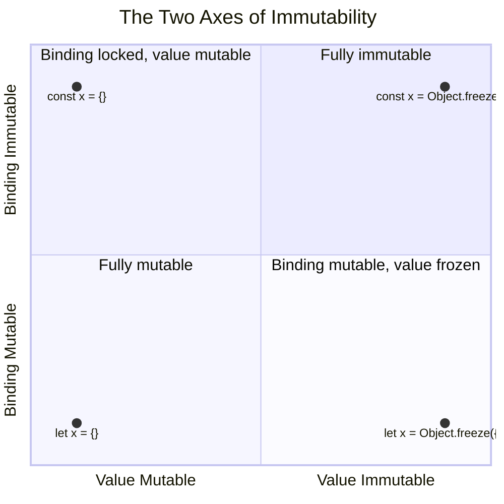
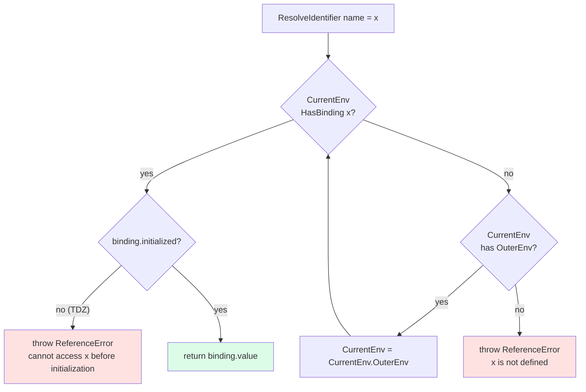
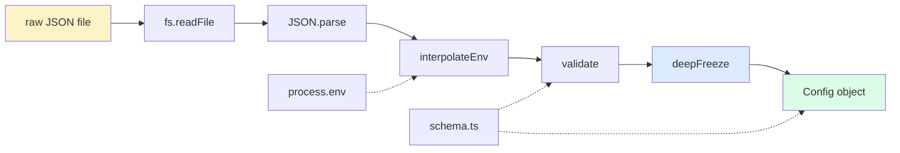

# 1.02 Variables and Mutability

## 1. Purpose

JavaScript gives you three ways to declare a variable: `var`, `let`, and `const`. The uncharitable reading is that this is historical accident — `var` is the original 1995 keyword, `let` and `const` arrived with ES6 in 2015, and the language is now stuck carrying all three forever. The charitable reading, and the one this note defends, is that each keyword encodes a distinct *intent* about scope, initialization, and reassignment, and that the bugs `var` allowed are precisely the bugs `let` and `const` were designed to prevent.

### Why three declaration forms exist

`var` was the only declaration keyword for twenty years. It has three properties that, in retrospect, are almost universally considered mistakes:

1. **Function scope, not block scope.** A `var` declaration inside an `if` block, a `for` loop, or a `try` block *leaks* out to the enclosing function. The variable is visible everywhere from the start of the function to the end, regardless of where the `var` keyword actually appears in the source.
2. **Hoisted and initialized to `undefined`.** The variable exists from the very first line of the function, with the value `undefined`, even if the `var` statement is on line 200. Accessing it earlier silently returns `undefined`.
3. **Redeclaration is a no-op.** `var x = 1; var x = 2;` is legal and silent. So is `var fetch = 1;` inside a function that also calls the global `fetch` — the local silently shadows the global.

`let` and `const` were introduced (formally in ES2015, after years of `let` existing in SpiderMonkey and other engines) to fix all three problems at once:

- They are **block scoped**. A `let` inside an `if` block is invisible outside that block.
- They are **hoisted but not initialized**. The variable exists in a "temporal dead zone" from the start of the block until the declaration statement is reached. Accessing it earlier throws `ReferenceError`.
- They **forbid redeclaration** in the same scope. `let x = 1; let x = 2;` is a `SyntaxError` at parse time.

The remaining difference between `let` and `const` is binding immutability: `const` forbids reassignment of the *binding* (the variable name itself), while `let` permits it. Crucially, `const` says nothing about the *value* the binding points to. A `const` object can still have its properties mutated. This is the single most misunderstood feature in modern JavaScript, and most of this note is dedicated to disentangling the two axes.

### The bugs let and const prevent

Consider the canonical closure-in-a-loop bug:

```javascript
for (var i = 0; i < 3; i++) {
  setTimeout(() => console.log(i), 0);
}
// logs 3, 3, 3 — not 0, 1, 2
```

`var i` is function-scoped (or, at the top level, global-scoped). All three arrow functions close over the *same* `i` binding. By the time the timeouts fire, the loop has finished and `i` is `3`. Replacing `var` with `let` fixes it instantly, because each iteration of a `let`-based `for` loop creates a fresh binding.

Or consider the silent-redeclaration bug:

```javascript
var userId = 42;
// ... 200 lines later ...
for (var userId of list) { /* ... */ }
// userId is now the last element of list, not 42
```

`let userId` in the loop would throw a `SyntaxError`, exposing the collision at parse time rather than letting it propagate through the runtime.

`const` prevents a different class of bug: the accidental rebinding. If a configuration object is declared with `const`, no downstream code can reassign the name to point at a different object. The properties might still be mutated (see Section 6), but the binding itself is locked.

### Reference immutability vs value immutability as distinct axes

This is the conceptual heart of the note. There are two independent questions you can ask about any variable:

1. **Can the binding be reassigned?** That is, can the variable name be made to point at a different value?
2. **Can the value itself be mutated?** That is, can the object's internal state be modified, even if the binding stays put?

`const` answers "no" to question 1 and says nothing about question 2. `Object.freeze` answers "no" to question 2 (one level deep) and says nothing about question 1. To get full immutability you need both: a `const` binding to a deeply frozen object. Most production code settles for less and pays for it in bugs.



The four quadrants of this chart correspond to four real configurations:

- `let x = {}` — fully mutable. The default, the most flexible, the most bug-prone.
- `const x = {}` — binding locked, value mutable. The most common modern default. Protects against rebinding, not against mutation.
- `let x = Object.freeze({})` — binding mutable, value frozen. Rare but useful when you want to swap frozen snapshots.
- `const x = Object.freeze({})` — fully immutable. The gold standard for configuration, Redux state, and any data you want to treat as a value type.

The rest of this note fills in the spec-level mechanics behind these four quadrants, the idioms for choosing between them, and the TypeScript tools (`Readonly<T>`, `as const`, `ReadonlyArray<T>`) that let the compiler enforce what `const` cannot.

---

## 2. Theory and Deep Dive

To talk precisely about `var`, `let`, and `const` you have to talk about the ECMAScript specification's notion of an *Environment Record*. This section walks through the spec, then drops down to how V8 implements it, then comes back up to the user-observable consequences.

### LexicalEnvironment and VariableEnvironment

Every execution context (see [[1.08 Execution Context and Lexical Environment]] for the full picture) carries two environment records:

- **LexicalEnvironment** — used to resolve identifiers during execution, and used to hold `let` and `const` bindings.
- **VariableEnvironment** — used specifically to hold `var` declarations and `function` declarations.

In practice, when a function is called, the engine creates one environment record for the function's body and uses it as both LexicalEnvironment and VariableEnvironment. But the spec separates them because `with` statements and direct `eval` can swap the LexicalEnvironment mid-function without affecting the VariableEnvironment. In modern code you almost never see `with`, but the dual-record design is still visible in one place: a `catch` clause's binding. The caught error is a `let`-style binding in a fresh LexicalEnvironment, while `var` declarations inside the `catch` body still go to the outer VariableEnvironment.

### Declarative vs object environment records

Environment records come in several flavours. The two that matter for variable declarations are:

- **Declarative Environment Record** — a flat map from identifier strings to binding slots. Each slot has a `mutable` flag and an `initialized` flag. `let`, `const`, `function`, `class`, and `import` bindings all live in declarative records. The global object's `let`/`const`/`class` bindings also live in a declarative record (a separate Global Environment Record has both a declarative part and an object part).
- **Object Environment Record** — backed by an actual JavaScript object. Identifier lookup is a property lookup on the backing object. `var` declarations at the top level of a script go to the object record (backed by `globalThis` in browsers, `global` in Node's REPL, and a module-scope sandbox object in CommonJS). `with` statements also create object environment records.

The asymmetry is the entire reason `var` and `let` behave differently. A `var` declaration at the top level of a script becomes a property of the global object. A `let` declaration at the top level of a script does *not* — it lives in a declarative record that hangs off the global environment. That is why `window.foo` works for `var foo` but not for `let foo`, even though both are global in the colloquial sense.

### The temporal dead zone (TDZ)

The TDZ is the single most spec-precise concept in this entire note. It is defined operationally, not syntactically: a `let` or `const` binding is in the TDZ from the start of the scope in which it is declared until the declaration statement is evaluated. While a binding is in the TDZ, any reference to it throws `ReferenceError`.

The spec mechanism is the `initialized` flag on each binding slot in a declarative environment record. Here is the relevant sequence, paraphrasing ECMAScript section 8.2.3 (`HasBinding`, `GetBindingValue`, `SetMutableBinding`) and section 13.3.1 (`LetBindingInitialization`, `ConstBindingInitialization`):

1. When a block is entered, the engine walks the block's lexically-scoped declarations (`let`, `const`, `class`, `function`) and creates a binding for each in the block's declarative environment record. For `let` and `class`, the binding is created with `initialized: false`. For `const`, the binding is created with `initialized: false` *and* `mutable: false`. For `function`, the binding is created and immediately initialized to the function object (functions are not in the TDZ — see the hoisting table below).
2. When `GetBindingValue(name)` is called and the binding's `initialized` flag is `false`, the spec operation throws a `ReferenceError`. This is the TDZ.
3. When the actual `let name = value;` statement is executed, the engine performs `InitializeBinding(name, value)`, which sets `initialized: true` and stores the value. From this point on, references resolve normally.

The TDZ is not a temporal concept despite the name — it is a *state* of the binding, checked at access time. You can think of it as "the binding exists but is marked uninitialized, and any access to an uninitialized binding throws."

### How const is enforced

`const` differs from `let` in exactly two ways at the spec level:

1. `const` requires an initializer. `const x;` is a `SyntaxError`. This is enforced by the grammar in section 13.3.1, not at runtime.
2. `const` bindings are created with `mutable: false`. When `SetMutableBinding` is later called on a `mutable: false` binding that has already been initialized, the spec operation throws a `TypeError`.

The `mutable` flag is per-binding, not per-value. This is why `const x = {}; x.foo = 1;` is legal: the `mutable: false` flag prevents `x = ...`, but the object that `x` points to is an entirely separate heap allocation with its own property descriptors that control mutability. The spec models this distinction crisply: a binding has a `mutable` slot; an object property has its own `[[Writable]]` and `[[Configurable]]` slots (see [[1.30 Property Descriptors and Attributes]]).

### The four declaration kinds and their hoisting

ECMAScript distinguishes four kinds of declaration that create bindings: `var`, `let`, `const`, and `function` (and `class`, which behaves like `let` for scoping but is treated separately in the spec). They hoist differently:

| Declaration | Hoisted? | Initialized at hoist time? | Scope | Redeclarable? |
|-------------|----------|------------------------------|-------|----------------|
| `var`       | Yes      | Yes, to `undefined`          | Function | Yes |
| `let`       | Yes      | No (TDZ)                     | Block | No (SyntaxError) |
| `const`     | Yes      | No (TDZ), and never reassignable | Block | No (SyntaxError) |
| `function`  | Yes      | Yes, to the function object  | Block (in strict mode) or function | Yes (last wins) |
| `class`     | Yes      | No (TDZ)                     | Block | No |

The "hoisted but not initialized" wording for `let`/`const`/`class` is the source of endless confusion. The binding is created when the block is entered — that part is hoisting in the literal spec sense. But it is not initialized until the declaration statement runs. The TDZ is the gap.

Function declarations are special: they are hoisted *and* initialized, so a function declared on line 20 can be called from line 1. Function *expressions* assigned to `var` are not — `var f = function () {};` hoists the `var f` (initialized to `undefined`) but not the assignment.

### A worked TDZ example with line-by-line spec semantics

```javascript
function demo() {
  console.log(x); // Line A
  let x = 5;      // Line B
  console.log(x); // Line C
}
demo();
```

Spec execution:

1. `demo()` is called. A new function execution context is pushed. Its LexicalEnvironment and VariableEnvironment are both set to a new declarative environment record, call it `envDemo`.
2. The engine instantiates the lexical bindings for `demo`'s body. It sees `let x` and creates a binding `x` in `envDemo` with `initialized: false` and `mutable: true`.
3. Line A executes. `console.log(x)` looks up `x` by calling `GetBindingValue("x")` on `envDemo`. The binding exists but `initialized` is `false`, so the spec operation throws `ReferenceError: Cannot access 'x' before initialization`. The function exits via the exception.

Note the message: "Cannot access 'x' before initialization." Modern engines include the variable name and the "before initialization" wording specifically to make TDZ errors self-diagnosing.

### Scope chain resolution algorithm

Identifier resolution walks the chain of environment records from innermost to outermost until a binding is found (or the chain ends, producing a `ReferenceError: x is not defined`). Each environment record has an `[[OuterEnv]]` field pointing to its parent.



Two different `ReferenceError` messages come out of this algorithm, and they tell you which branch fired:

- "Cannot access 'x' before initialization" — `HasBinding` returned yes, but `initialized` was false. This is the TDZ.
- "x is not defined" — the chain ran out without finding a binding at all.

Reading the error message tells you exactly which kind of bug you have.

### Why the committee chose this design

The TC39 design rationale had three driving concerns:

1. **Do not break the web.** `let` and `const` could not change the meaning of any existing `var`-based code, so they had to be new keywords with new semantics.
2. **Fail closed, not open.** The TDZ was chosen over silent-undefined because silent-undefined was the original `var` bug. Better to throw at access time than to allow `undefined` to propagate into arithmetic and produce `NaN` three frames down the stack.
3. **Const should mean something the engine can trust.** A `const` binding is a contract that the engine can use to inline, hoist reads, or skip re-fetching. The spec enforces this by making reassignment a hard `TypeError`.

The block-scoping choice was driven by the closure-in-loop bug and by convergence with other C-family languages. Function scope was a Brendan-Eich-era decision made in ten days; block scope is what every other modern language does, and what JavaScript developers had been approximating with IIFEs for a decade.

---

## 3. Mental Models

A mental model is a compressed story that lets you predict behaviour without running the spec algorithm in your head. For variable declarations, you need three models, each of which covers a different failure mode.

### Model one: var as function-scoped, hoisted-and-undefined

Treat every `var x` in a function as if it were physically moved to the top of the function and rewritten as `var x = undefined;`. The assignment (if any) stays in place. This is the classic hoisting model and it is accurate for `var`.

```javascript
function f() {
  console.log(x); // undefined (not a ReferenceError)
  for (var i = 0; i < 3; i++) { /* ... */ }
  console.log(i); // 3 — i leaked out of the for loop
  var x = 1;
}
```

After hoisting, the engine effectively sees:

```javascript
function f() {
  var x = undefined;
  var i = undefined;
  console.log(x);
  for (i = 0; i < 3; i++) { /* ... */ }
  console.log(i);
  x = 1;
}
```

This model correctly predicts:

- `console.log(x)` returns `undefined` (the binding exists, initialized to `undefined`).
- `i` is visible after the loop (it is function-scoped, not block-scoped).
- A second `var x` inside the loop is a silent no-op (the binding already exists).

This model breaks down for `let` and `const` because they are not initialized to `undefined` at hoist time.

### Model two: let and const as block-scoped, hoisted-but-uninitialized

Treat `let x` and `const x` as if the *binding* is moved to the top of the block, but the *initialization* stays in place. From the top of the block to the initialization line, the binding exists but is "poisoned" — touching it throws.

```javascript
function f() {
  // x is hoisted here, but poisoned (TDZ)
  console.log(x); // ReferenceError: cannot access x before initialization
  let x = 1;
  // x is now alive
}
```

The "poisoned" metaphor captures the spec's `initialized: false` flag without needing the spec vocabulary. The poison is *cleared* the moment the declaration statement runs; it does not fade over time.

For `const`, add one extra rule: once the poison is cleared, the binding gets a second lock — the value can never be replaced. The object the binding points to is unaffected by this lock.

### Model three: const as a "locked pointer to a mutable object"

This is the model that pays the most rent, because it captures the asymmetry between binding immutability and value immutability.

Imagine a `const` declaration as a locked box with a label on the outside and a sticky note inside. The label is the variable name. The sticky note has a value written on it. The lock on the box means nobody can swap the sticky note for a different one. But the sticky note itself might say "the object at address 0x4F2A," and the object at that address has its own internal structure that the lock on the box does not touch.

```javascript
const config = { port: 3000 };
config.port = 8080;        // legal — the object is mutated
config = { port: 8080 };   // TypeError — the box is locked, you cannot swap the note
```

The fix, when you need both locks, is `Object.freeze`:

```javascript
const config = Object.freeze({ port: 3000 });
config.port = 8080;        // silently ignored in non-strict mode, TypeError in strict mode
config = { port: 8080 };   // TypeError — still locked by const
```

`Object.freeze` freezes the object (the sticky note's target). `const` freezes the binding (the box). They operate on different things, and you need both for full immutability.

### Where the models break down

Each model has an edge case where you have to switch:

- The `var`-hoisting model breaks down for `function` declarations, which are hoisted *and* initialized (so you can call them before their line). Switch to "function declarations are fully hoisted, body and all."
- The TDZ model breaks down for `function` declarations inside blocks in strict mode, which behave like `let` for scoping but are initialized at hoist time. Switch to the spec table in Section 2.
- The "locked pointer" model breaks down for primitives, because primitives have no internal structure to mutate. A `const x = 5;` is effectively fully immutable — there is nothing to mutate, and the binding cannot be reassigned. The model overcomplicates the primitive case; for primitives, "const is just immutable" is the simpler truth.

---

## 4. Real-World Use Cases

The choice between `var`, `let`, and `const` is not academic. Production codebases enforce it through linters, type systems, and framework conventions. This section walks through the places where the choice matters in practice.

### React hooks rely on TDZ semantics

Every `useState` call in React returns a pair, conventionally destructured as `const [state, setState] = useState(initial)`. The `const` is not decorative. The contract is:

- `state` is a snapshot of the current render. React will hand you a new `state` on the next render, but you must not mutate this one — mutation would corrupt React's reconciliation.
- `setState` is a stable identity across renders (React guarantees this), so a `const` binding is correct.

If `state` were declared with `let`, a careless `state = newState` would compile, run, and silently break React's change detection. The `const` makes that a `TypeError`. This is a real-world instance of "binding immutability as a bug-prevention contract."

More subtly, React's rules of hooks ("only call hooks at the top level, not in loops, conditions, or nested functions") depend on `let` and `const` being block-scoped. A hook called inside an `if` block would close over a block-scoped state binding that does not exist on the next render, producing a TDZ-like crash. The lint rule `react-hooks/rules-of-hooks` codifies this; the underlying runtime mechanism is the TDZ.

### Redux reducers forbid mutation

A Redux reducer is a pure function `(state, action) => newState`. The contract is that the reducer must *not* mutate the incoming `state`. If it does, time-travel debugging breaks (the "past" is corrupted), and `react-redux`'s selector memoization fails to re-render.

The community-accepted enforcement is two-fold: use `const` for the state parameter to prevent rebinding, and use `Object.freeze` (or a library like `immer` or `immutable`) to prevent mutation of the state object. The `redux` library itself, in development mode, freezes the state tree returned by the reducer. In production, the freeze is skipped for performance.

### Immer, Immutable.js, and the structured-clone era

Three libraries dominate the immutable-data ecosystem:

- **Immer** lets you write code that *looks* mutating but produces a new immutable structure. Under the hood, Immer wraps your draft in a `Proxy` that records mutations and produces a frozen result. The result is a `const`-bound, deeply frozen object.
- **Immutable.js** provides its own persistent data structures (`Map`, `List`, `Set`) that are immutable by construction. You never see a plain object — you see an Immutable.js type that has no mutating methods.
- **`structuredClone`** (built into Node 17+ and all modern browsers) is not strictly an immutability tool, but it solves a related problem: how to make a *deep* copy of an object so that mutations to the copy do not affect the original. `structuredClone` handles cycles, dates, regexes, maps, sets, and arrays — `JSON.parse(JSON.stringify(x))` does none of those.

The pattern in modern codebases is:

```javascript
const nextState = produce(currentState, draft => {
  draft.users.push(newUser); // looks mutating, but produces a new frozen state
});
```

The `const` binding plus Immer's frozen output gives you full immutability with no manual `Object.freeze` calls.

### Frozen objects in library public APIs

Libraries that hand objects to untrusted callers frequently freeze those objects before returning them. Examples:

- **Redux store state** is frozen in dev mode.
- **Node's `process.versions`** is read-only by convention.
- **The `package.json` exports field** is normalized and frozen by bundlers.
- **Many URL-parsing libraries** return frozen URL objects to prevent callers from corrupting cached parse results.

The pattern is:

```javascript
function parseConfig(rawJson) {
  const parsed = JSON.parse(rawJson);
  return deepFreeze(parsed);
}
```

Where `deepFreeze` is a small recursive helper (see Section 9, Exercise 2). The returned object can be passed to any caller, and any attempt to mutate it will throw in strict mode (or be silently ignored in sloppy mode — always run your code in strict mode so the freeze is enforced).

### Closures over loop variables in production

The closure-in-loop bug is not just a quiz question. It surfaces in production whenever you attach event listeners in a loop, schedule timeouts in a loop, or push promises into an array. The classic fix in the `var` era was an IIFE:

```javascript
for (var i = 0; i < 3; i++) {
  (function (j) {
    setTimeout(() => console.log(j), 0);
  })(i);
}
```

The modern fix is one character:

```javascript
for (let i = 0; i < 3; i++) {
  setTimeout(() => console.log(i), 0);
}
```

This works because the spec mandates that each iteration of a `let`-based `for` loop creates a fresh binding (ECMAScript section 13.7.4.8, `ForBodyEvaluation`, the `CreatePerIterationEnvironment` step). The arrow functions close over different bindings, each holding a distinct value of `i`.

This single difference is the most impactful behavioural change between `var` and `let`. Entire categories of bugs disappeared from codebases that switched to `let` in 2015-2017.

---

## 5. Code Examples

### 5.1 Example A — Minimal and Conceptual

A side-by-side demonstration of `var`, `let`, and `const` in a loop, showing the closure-capture difference and TDZ.

**JavaScript:**

```javascript
// 1. var in a loop — closure captures the same binding
var varFns = [];
for (var i = 0; i < 3; i++) {
  varFns.push(() => i);
}
console.log(varFns.map(f => f())); // [3, 3, 3]

// 2. let in a loop — each iteration gets a fresh binding
var letFns = [];
for (let i = 0; i < 3; i++) {
  letFns.push(() => i);
}
console.log(letFns.map(f => f())); // [0, 1, 2]

// 3. const in a loop body — legal, since the binding is per-iteration
var constFns = [];
for (let i = 0; i < 3; i++) {
  const double = i * 2;
  constFns.push(() => double);
}
console.log(constFns.map(f => f())); // [0, 2, 4]

// 4. TDZ — accessing before declaration
function tdzDemo() {
  // console.log(j); // ReferenceError: cannot access j before initialization
  let j = 10;
  return j;
}
console.log(tdzDemo()); // 10

// 5. const forbids reassignment but not mutation
const obj = { count: 0 };
obj.count = 1;            // legal
console.log(obj.count);   // 1
// obj = { count: 2 };    // TypeError: Assignment to constant variable
```

**TypeScript:**

```typescript
// The same examples, with explicit types to make the inferred shapes visible.

// 1. var — type is number, but the closure bug is invisible to the type system
const varFns: (() => number)[] = [];
for (var i: number = 0; i < 3; i++) {
  varFns.push(() => i);
}
console.log(varFns.map(f => f())); // [3, 3, 3]

// 2. let — fresh per-iteration binding
const letFns: (() => number)[] = [];
for (let i: number = 0; i < 3; i++) {
  letFns.push(() => i);
}
console.log(letFns.map(f => f())); // [0, 1, 2]

// 3. const in loop body — type inferred as number
const constFns: (() => number)[] = [];
for (let i: number = 0; i < 3; i++) {
  const double: number = i * 2;
  constFns.push(() => double);
}
console.log(constFns.map(f => f())); // [0, 2, 4]

// 4. TDZ — TypeScript does not catch this at compile time; it is a runtime error
function tdzDemo(): number {
  // console.log(j); // TS would also flag "used before declaration" but runtime throws first
  let j: number = 10;
  return j;
}
console.log(tdzDemo()); // 10

// 5. const object — TS allows the mutation; use Readonly<T> to forbid it
interface Counter { count: number }
const obj: Counter = { count: 0 };
obj.count = 1;            // legal in TS — Counter.count is mutable
console.log(obj.count);   // 1

// To get compile-time protection, use Readonly<T>:
const frozen: Readonly<Counter> = { count: 0 };
// frozen.count = 1;      // TS error: Cannot assign to count because it is read-only
```

**Annotations:**

- TypeScript's type system does not distinguish `var` from `let` from `const` at the binding level. The closure-in-loop bug is invisible to the compiler.
- `const` is enforced at runtime by V8, not by TS. TS will let you write `obj.count = 1` because the type of `obj` is `Counter`, which has a mutable `count`.
- For compile-time immutability, use `Readonly<T>` (shallow), `DeepReadonly<T>` (deep), or `as const` for literal inference. Runtime and compile-time immutability are independent.

### 5.2 Example B — Production-Grade

A production-grade immutable configuration loader. Reads JSON, validates it, returns a deeply frozen, typed object. Includes error handling, environment-variable interpolation, and TypeScript types that match the runtime guarantee.

**JavaScript:**

```javascript
"use strict";

/**
 * Reads a JSON configuration string, interpolates environment variables,
 * validates the shape, and returns a deeply frozen immutable object.
 *
 * @param {string} rawJson - the raw JSON string
 * @param {object} [env] - environment variables for interpolation (defaults to process.env)
 * @returns {object} a deeply frozen config object
 * @throws {Error} if JSON is malformed or required fields are missing
 */
function loadConfig(rawJson, env = process.env) {
  if (typeof rawJson !== "string" || rawJson.length === 0) {
    throw new Error("loadConfig: rawJson must be a non-empty string");
  }

  let parsed;
  try {
    parsed = JSON.parse(rawJson);
  } catch (err) {
    throw new Error("loadConfig: invalid JSON — " + err.message);
  }

  if (parsed === null || typeof parsed !== "object" || Array.isArray(parsed)) {
    throw new Error("loadConfig: top-level value must be a plain object");
  }

  // Interpolate dollar-brace VAR references in string values.
  const interpolated = interpolateEnv(parsed, env);

  // Validate required fields.
  if (typeof interpolated.port !== "number" || interpolated.port < 1 || interpolated.port > 65535) {
    throw new Error("loadConfig: port must be a number in [1, 65535]");
  }
  if (typeof interpolated.host !== "string" || interpolated.host.length === 0) {
    throw new Error("loadConfig: host must be a non-empty string");
  }
  if (!Array.isArray(interpolated.featureFlags)) {
    throw new Error("loadConfig: featureFlags must be an array");
  }

  return deepFreeze(interpolated);
}

/**
 * Recursively interpolates dollar-brace VAR patterns in strings against the env map.
 */
function interpolateEnv(value, env) {
  if (typeof value === "string") {
    return value.replace(/\$\{([A-Z][A-Z0-9]*)\}/g, function (match, name) {
      return Object.prototype.hasOwnProperty.call(env, name) ? env[name] : "";
    });
  }
  if (Array.isArray(value)) {
    return value.map(function (v) { return interpolateEnv(v, env); });
  }
  if (value !== null && typeof value === "object") {
    const out = {};
    for (const key of Object.keys(value)) {
      out[key] = interpolateEnv(value[key], env);
    }
    return out;
  }
  return value;
}

/**
 * Recursively freezes an object and all its object-valued properties.
 * Returns the same object reference, now frozen at every level.
 */
function deepFreeze(value) {
  if (value !== null && typeof value === "object") {
    Object.freeze(value);
    for (const key of Object.keys(value)) {
      deepFreeze(value[key]);
    }
  }
  return value;
}

// --- usage ---
const raw = JSON.stringify({
  host: "${HOST}",
  port: 3000,
  featureFlags: ["a", "b"],
  database: { url: "${DATABASEURL}", poolSize: 10 }
});

const config = loadConfig(raw, { HOST: "example.com", DATABASEURL: "postgres://localhost" });
console.log(config.host);             // "example.com"
console.log(config.database.url);     // "postgres://localhost"

// Any mutation attempt will throw in strict mode:
// config.port = 8080;                 // TypeError: Cannot assign to read-only property
// config.database.poolSize = 100;     // TypeError: Cannot assign to read-only property
```

**TypeScript:**

```typescript
"use strict";

// 1. The shape of a valid config, encoded as a type.
interface Config {
  readonly host: string;
  readonly port: number;
  readonly featureFlags: readonly string[];
  readonly database: Readonly<{
    url: string;
    poolSize: number;
  }>;
}

// 2. A const-asserted literal for default values, with literal types preserved.
const defaultConfig = {
  host: "localhost",
  port: 3000,
  featureFlags: [] as readonly string[],
  database: { url: "postgres://localhost", poolSize: 5 },
} as const;

// 3. The loader function, with a return type that matches the runtime guarantee.
function loadConfig(
  rawJson: string,
  env: Record<string, string | undefined> = process.env as Record<string, string | undefined>
): Config {
  if (typeof rawJson !== "string" || rawJson.length === 0) {
    throw new Error("loadConfig: rawJson must be a non-empty string");
  }

  let parsed: unknown;
  try {
    parsed = JSON.parse(rawJson);
  } catch (err) {
    throw new Error("loadConfig: invalid JSON — " + (err as Error).message);
  }

  if (parsed === null || typeof parsed !== "object" || Array.isArray(parsed)) {
    throw new Error("loadConfig: top-level value must be a plain object");
  }

  const interpolated = interpolateEnv(parsed as Record<string, unknown>, env);

  // 4. Runtime validation. TS cannot trust JSON.parse output, so we check.
  if (typeof interpolated.port !== "number" || interpolated.port < 1 || interpolated.port > 65535) {
    throw new Error("loadConfig: port must be a number in [1, 65535]");
  }
  if (typeof interpolated.host !== "string" || interpolated.host.length === 0) {
    throw new Error("loadConfig: host must be a non-empty string");
  }
  if (!Array.isArray(interpolated.featureFlags) ||
      !interpolated.featureFlags.every(v => typeof v === "string")) {
    throw new Error("loadConfig: featureFlags must be an array of strings");
  }
  if (interpolated.database === null || typeof interpolated.database !== "object") {
    throw new Error("loadConfig: database must be an object");
  }
  if (typeof interpolated.database.url !== "string" ||
      typeof interpolated.database.poolSize !== "number") {
    throw new Error("loadConfig: database.url and database.poolSize are required");
  }

  return deepFreeze(interpolated) as Config;
}

function interpolateEnv<T>(value: T, env: Record<string, string | undefined>): T {
  if (typeof value === "string") {
    return value.replace(/\$\{([A-Z][A-Z0-9]*)\}/g, function (match, name: string) {
      return Object.prototype.hasOwnProperty.call(env, name) ? (env[name] as string) : "";
    }) as unknown as T;
  }
  if (Array.isArray(value)) {
    return value.map(v => interpolateEnv(v, env)) as unknown as T;
  }
  if (value !== null && typeof value === "object") {
    const out: Record<string, unknown> = {};
    for (const key of Object.keys(value as object)) {
      out[key] = interpolateEnv((value as Record<string, unknown>)[key], env);
    }
    return out as unknown as T;
  }
  return value;
}

function deepFreeze<T>(value: T): T {
  if (value !== null && typeof value === "object") {
    Object.freeze(value as object);
    for (const key of Object.keys(value as object)) {
      deepFreeze((value as Record<string, unknown>)[key]);
    }
  }
  return value;
}

// --- usage ---
const raw: string = JSON.stringify({
  host: "${HOST}",
  port: 3000,
  featureFlags: ["a", "b"],
  database: { url: "${DATABASEURL}", poolSize: 10 },
});

const config: Config = loadConfig(raw, { HOST: "example.com", DATABASEURL: "postgres://localhost" });
console.log(config.host);             // "example.com"
console.log(config.database.url);     // "postgres://localhost"

// Compile-time protection (TS) AND runtime protection (deepFreeze):
// config.port = 8080;                 // TS: Cannot assign to port because it is read-only
// config.database.poolSize = 100;     // TS: Cannot assign to poolSize because it is read-only
// config.featureFlags.push("c");      // TS: Property push does not exist on readonly string[]
```

**Annotations:**

- The TypeScript version layers four independent immutability mechanisms:
  1. **`const` binding** — runtime, single-level, prevents rebinding of `config`.
  2. **`readonly` modifiers on the `Config` interface** — compile-time, single-level, prevents property assignment.
  3. **`readonly string[]` for `featureFlags`** — compile-time, prevents `push`/`pop`/index assignment.
  4. **`deepFreeze`** — runtime, recursive, prevents mutation of nested objects.
- The TypeScript version uses `unknown` for the JSON.parse output, forcing runtime validation before assignment (see [[2.03 Type Assertions and Guards]]).
- The `as const` on `defaultConfig` tells TypeScript to infer the narrowest possible literal types. This is the compile-time analogue of `Object.freeze` — it makes the literal values part of the type.
- The `as unknown as T` casts in `interpolateEnv` are a code smell. They are necessary because TypeScript cannot prove that recursively transforming `T` produces another `T`. A production version would use a more careful type signature.

---

## 6. Common Mistakes and Anti-Patterns

### 6.1 Mistake One — TDZ ReferenceError on `console.log(x); let x = 1;`

```javascript
function mistake() {
  console.log(x); // ReferenceError: Cannot access x before initialization
  let x = 1;
}
```

**Why it fails:** The `let x` declaration is hoisted to the top of the function, but the binding is left uninitialized (TDZ). The `console.log(x)` on line 1 looks up `x`, finds the binding, sees the `initialized: false` flag, and throws. This is the most common TDZ error in practice.

**Fix:** Move the declaration above its first use.

```javascript
function fixed() {
  let x = 1;
  console.log(x); // 1
}
```

If you genuinely need to defer initialization, use `let` with an explicit `undefined`:

```javascript
function fixedWithDeferredInit(condition) {
  let x;
  if (condition) {
    x = computeValue();
  } else {
    x = defaultValue();
  }
  console.log(x);
}
```

### 6.2 Mistake Two — Mutating a const object

```javascript
const config = { port: 3000 };
config.port = 8080;            // legal — mutates the object, not the binding
console.log(config.port);      // 8080
```

**Why it fails:** `const` only locks the binding, not the value. The object `{ port: 3000 }` is a heap allocation with mutable property descriptors. `config.port = 8080` modifies that allocation; the `config` binding still points to the same object.

**Fix:** Use `Object.freeze` (shallow) or `deepFreeze` (recursive), plus `const`.

```javascript
const config = Object.freeze({ port: 3000 });
config.port = 8080;            // TypeError in strict mode, silently ignored in sloppy mode
```

In TypeScript, also use `Readonly<T>` to get compile-time protection:

```typescript
interface Config { readonly port: number }
const config: Readonly<Config> = Object.freeze({ port: 3000 });
// config.port = 8080;        // TS error AND runtime error
```

### 6.3 Mistake Three — for-loop closure capture with var

```javascript
const handlers = [];
for (var i = 0; i < 3; i++) {
  handlers.push(() => console.log(i));
}
handlers.forEach(h => h()); // logs 3, 3, 3 — not 0, 1, 2
```

**Why it fails:** `var i` is function-scoped. All three arrow functions close over the *same* `i` binding. By the time the handlers run, the loop has completed and `i` is `3`. Every handler reads the same `3`.

**Fix:** Use `let`. The spec mandates a fresh binding per iteration for `let`-based `for` loops.

```javascript
const handlers = [];
for (let i = 0; i < 3; i++) {
  handlers.push(() => console.log(i));
}
handlers.forEach(h => h()); // logs 0, 1, 2
```

If you are stuck on `var` in an old codebase, the IIFE workaround still works:

```javascript
const handlers = [];
for (var i = 0; i < 3; i++) {
  (function (j) {
    handlers.push(() => console.log(j));
  })(i);
}
handlers.forEach(h => h()); // logs 0, 1, 2
```

### 6.4 Mistake Four — Redeclaring a function-scoped var silently

```javascript
function process(items) {
  var item = items[0];
  for (var item of items) { /* ... */ }
  console.log(item); // last element, not items[0]
}
```

**Why it fails:** `var` allows redeclaration in the same scope. The second `var item` is a no-op (the binding already exists), and the `for...of` loop overwrites it. The bug is silent and only surfaces as incorrect output.

**Fix:** Use `let` to catch the collision at parse time.

```javascript
function process(items) {
  let item = items[0];
  // for (let item of items) { ... } // SyntaxError: Identifier item has already been declared
  for (const elem of items) { /* ... */ }
  console.log(item); // still items[0]
}
```

The `SyntaxError` is the whole point. The collision that was silent under `var` is now visible at compile time.

### 6.5 Mistake Five — Object.freeze is shallow

```javascript
const config = Object.freeze({
  port: 3000,
  database: { url: "postgres://localhost" }
});
config.port = 8080;                  // TypeError (frozen)
config.database.url = "mysql://x";   // legal — nested object is NOT frozen
console.log(config.database.url);    // "mysql://x"
```

**Why it fails:** `Object.freeze` only freezes the object you pass it. It does not recursively freeze nested objects. The `database` property is frozen (you cannot replace `config.database`), but the object that `config.database` points to is unfrozen.

**Fix:** Use a `deepFreeze` helper.

```javascript
function deepFreeze(value) {
  if (value !== null && typeof value === "object") {
    Object.freeze(value);
    for (const key of Object.keys(value)) {
      deepFreeze(value[key]);
    }
  }
  return value;
}

const config = deepFreeze({
  port: 3000,
  database: { url: "postgres://localhost" }
});
// config.database.url = "mysql://x"; // TypeError
```

Be aware that `deepFreeze` has performance implications: freezing large graphs at startup is fine, but doing it per-request in a hot path is not. For hot paths, use Immer.

### 6.6 Mistake Six — Using const in a for-loop header

```javascript
// for (const i = 0; i < 3; i++) { ... } // TypeError: Assignment to constant variable
```

**Why it fails:** `for (const i = 0; ...; i++)` attempts to reassign `i` on each iteration. `const` forbids reassignment, so the second iteration's `i++` throws. (`for...of` and `for...in` work with `const` because they create a fresh binding per iteration without reassignment.)

**Fix:** Use `let` for `for` loops with a counter; use `const` for `for...of` and `for...in`.

```javascript
for (let i = 0; i < 3; i++) { /* ok */ }
for (const item of items) { /* ok — fresh binding per iteration */ }
for (const key in obj) { /* ok */ }
```

### 6.7 Mistake Seven — Expecting switch blocks to scope their cases

```javascript
function pick(code) {
  switch (code) {
    case "a":
      let x = 1;
      break;
    case "b":
      let x = 2;  // SyntaxError: Identifier x has already been declared
      break;
  }
}
```

**Why it fails:** `switch` is a single block. All `case` clauses share the same lexical scope. Two `let x` declarations in different `case` branches collide because they are in the same block.

**Fix:** Wrap each `case` body in its own block.

```javascript
function pick(code) {
  switch (code) {
    case "a": {
      let x = 1;
      break;
    }
    case "b": {
      let x = 2;  // ok — different block
      break;
    }
  }
}
```

Adopt this convention unconditionally: always wrap `case` bodies in braces when they declare variables. It prevents the collision.

### 6.8 Mistake Eight — Assuming typeof escapes the TDZ

```javascript
function check() {
  console.log(typeof x); // ReferenceError: Cannot access x before initialization
  let x = 1;
}
```

**Why it fails:** `typeof` is special-cased in the spec to not throw `ReferenceError` for *undeclared* variables. `typeof undefinedVariable` returns `"undefined"`. But the special case does not apply when the binding *exists* in the TDZ. The `HasBinding` step succeeds, the `initialized` check fails, and the TDZ ReferenceError fires.

**Fix:** Move the `let` above the `typeof`, or use a different feature-detection pattern.

```javascript
function check() {
  let x = 1;
  console.log(typeof x); // "number"
}

// Feature detection for truly undeclared globals — typeof is safe here:
if (typeof globalThis !== "undefined") {
  // globalThis is available
}
```

The rule of thumb: `typeof` is safe for feature detection of undeclared globals. It is *not* safe for TDZ-affected bindings.

---

## 7. Best Practices and Design Patterns

### Default to const, escalate to let, never use var

The rule, adopted by every modern style guide (Airbnb, Google, Standard, ESLint's `prefer-const`), is:

1. Start with `const`.
2. If you find yourself needing to reassign, change to `let`.
3. Never use `var` in new code.

The reasoning is two-fold. First, `const` is documentation: it tells the reader "this name will not be rebound," which is one less thing to track. Second, `const` is a bug-prevention contract: if you accidentally try to rebind, you get a `TypeError` immediately rather than a silent change of behaviour.

The rule is sometimes over-applied. Some linters flag `let x = 1; x = 2;` and demand the `let` be rewritten as `const x = 2;`. This is fine for trivial cases, but for accumulators (running totals, builders, etc.) `let` is correct and idiomatic. Do not contort your code to satisfy `prefer-const` when the variable genuinely needs to change.

### Use Readonly<T> for immutability contracts in TypeScript

`const` is a runtime property of bindings. `Readonly<T>` is a compile-time property of types. They are independent. For full protection in TypeScript, use both:

```typescript
interface Config {
  readonly port: number;
  readonly host: string;
  readonly features: readonly string[];
}

const config: Readonly<Config> = Object.freeze({ port: 3000, host: "localhost", features: [] });
```

`Readonly<Config>` is shallow — it makes the top-level properties read-only but does not affect nested object types. For deep immutability, you need a `DeepReadonly<T>` recursive type:

```typescript
type DeepReadonly<T> = {
  readonly [K in keyof T]: T[K] extends object ? DeepReadonly<T[K]> : T[K];
};
```

Or use the `Readonly` utility from `utility-types` or the built-in `Readonly` from TypeScript 5+ (which is still shallow, but combined with `ReadonlyArray` and `as const` covers most cases). See [[2.10 Utility Types Deep Dive]] for the full taxonomy.

### Use as const for literal inference

`as const` tells TypeScript to infer the narrowest possible type for an object literal — literal types instead of widened types, and `readonly` modifiers everywhere.

```typescript
const colors = ["red", "green", "blue"] as const;
// type: readonly ["red", "green", "blue"]

const status = { active: 1, inactive: 0 } as const;
// type: { readonly active: 1; readonly inactive: 0 }
```

Without `as const`, `colors` would be `string[]` (mutable, widened). With `as const`, it is a `readonly` tuple of literal types. This is the compile-time analogue of `Object.freeze` — it makes the literal values part of the type system.

The pattern for configuration constants is:

```typescript
const ROLES = ["admin", "editor", "viewer"] as const;
type Role = typeof ROLES[number]; // "admin" | "editor" | "viewer"
```

This gives you a single source of truth: the `ROLES` array. The `Role` type is derived from it, so adding a new role to the array automatically extends the type.

### Use Object.freeze recursively or a library for deep immutability

`Object.freeze` is shallow. For deep immutability you have three options:

1. **Hand-rolled `deepFreeze`** — fine for small objects, startup-time freezing, and dev-mode assertions.
2. **Immer** — for production hot paths. Immer's `produce` returns a frozen result by default, and the cost is only paid when the structure actually changes.
3. **Immutable.js** — for very large, frequently-updated structures. The persistent data structures are immutable by construction and are faster than repeatedly copying plain objects.

Do not roll your own deep-freeze for hot paths. The recursion cost can be significant, and the frozen object cannot be unfrozen (you have to clone it again to mutate, which defeats the purpose). Use Immer or Immutable.js for production data.

### Three integrity levels: preventExtensions, seal, freeze

JavaScript provides three increasing levels of object integrity, and you should know all three.

| Method | Add new properties? | Change existing property values? | Delete properties? | Reconfigure property descriptors? |
|--------|----------------------|-----------------------------------|---------------------|------------------------------------|
| `Object.preventExtensions(obj)` | No | Yes | Yes | Yes |
| `Object.seal(obj)` | No | Yes | No | No |
| `Object.freeze(obj)` | No | No | No | No |

`Object.preventExtensions` is the weakest: it only forbids adding new properties. `Object.seal` adds "no deletes, no descriptor reconfiguration." `Object.freeze` is the strongest: it seals the object and marks every data property as non-writable.

Each method sets the corresponding internal flag: `[[Extensible]]` to false for `preventExtensions`; `[[Extensible]]: false` plus each property's `[[Configurable]]: false` for `seal`; plus each property's `[[Writable]]: false` for `freeze`. The flags are checked on every property operation, so the integrity level is enforced at runtime.

Use `preventExtensions` when you want to lock the shape of an object but allow value updates (e.g., a mutable record with a fixed schema). Use `seal` when you want a fixed schema and want to prevent `delete` and descriptor reconfiguration. Use `freeze` for full immutability. In practice, 95% of production code uses `freeze` exclusively; the other two are niche.

### Use Object.defineProperty for fine-grained immutable bindings

`Object.defineProperty` lets you create or reconfigure an individual property with a custom descriptor. This is useful for:

- Creating a read-only property on an otherwise-mutable object.
- Defining a property with a getter but no setter.
- Defining a non-enumerable property (so it does not show up in `for...in` or `Object.keys`).

```javascript
const counter = {};
let count = 0;
Object.defineProperty(counter, "value", {
  get() { return count; },
  enumerable: true,
  configurable: false
});
Object.defineProperty(counter, "increment", {
  value: () => { count++; },
  enumerable: true,
  writable: false,
  configurable: false
});

console.log(counter.value);  // 0
counter.increment();
console.log(counter.value);  // 1
// counter.value = 5;        // silently ignored (no setter) in non-strict, TypeError in strict
// counter.increment = () => {}; // TypeError: Cannot assign to read-only property
```

This pattern is how libraries expose read-only views of internal state. The `value` property is read-only from the outside, but the internal `count` variable can still be updated by `increment`. See [[1.30 Property Descriptors and Attributes]] for the full descriptor taxonomy.

### Choose between Readonly<T>, as const, and Object.freeze correctly

The tools have different scopes:

- **`const` binding** — runtime, single binding, prevents rebinding. Use everywhere as the default.
- **`Object.freeze`** — runtime, single object, prevents property mutation. Use when handing objects to untrusted callers.
- **`Readonly<T>`** — compile-time, single level, prevents property assignment in TS. Use in type signatures for function parameters and return types.
- **`DeepReadonly<T>`** — compile-time, recursive, prevents all property assignment in TS. Use for deeply-nested immutable structures.
- **`as const`** — compile-time, single literal, narrows types to literals and adds `readonly`. Use for literal-valued constants like `ROLES = [...] as const`.
- **`ReadonlyArray<T>`** — compile-time, prevents `push`/`pop`/index assignment. Use for any array that should not be mutated.

For a fully immutable config, stack all four runtime-plus-compile-time layers: `const` binding, `Object.freeze`, `Readonly<Config>` types, and `ReadonlyArray<T>` for arrays. None is redundant — each catches a different class of mutation.

---

## 8. Technical Interview Knowledge

### 8.1 What is the TDZ?

**A:** The temporal dead zone is the period between entering a scope in which a `let`, `const`, or `class` binding is declared and the execution of the declaration statement. During this period, any access to the binding throws a `ReferenceError` with the message "Cannot access 'x' before initialization."

Mechanically, the binding is created when the scope is entered (this is the hoisting step), but its `initialized` flag is `false`. The `GetBindingValue` operation in the spec checks this flag and throws if it is false. When the declaration statement runs, `InitializeBinding` sets the flag to `true` and stores the value, clearing the TDZ for that binding.

**Trap to avoid:** Do not confuse "hoisted" with "initialized." All four declaration kinds are hoisted in the sense that the binding is created when the scope is entered. Only `var` and `function` are also initialized at hoist time. `let`, `const`, and `class` are hoisted but uninitialized — that is the TDZ.

### 8.2 Is const truly immutable?

**A:** No. `const` provides binding immutability, not value immutability. The binding (the variable name) cannot be reassigned to point at a different value, but the value it points to can be mutated freely if the value is an object.

```javascript
const arr = [1, 2, 3];
arr.push(4);          // legal — the array is mutated
// arr = [1];         // TypeError — the binding cannot be reassigned
```

For full immutability you need both `const` (binding immutability) and `Object.freeze` or a deep-freeze helper (value immutability). In TypeScript, you can additionally use `Readonly<T>` and `as const` to enforce value immutability at compile time.

**Trap to avoid:** Do not say "const makes the object immutable." It does not. The correct statement is "const makes the binding immutable."

### 8.3 Why does for (var i ...) leak i?

**A:** `var` is function-scoped, not block-scoped. The `i` in `for (var i = 0; ...)` is the same binding as any other `i` in the enclosing function. After the loop, `i` is still accessible and holds the value that failed the loop condition.

The closure-capture variant is worse: arrow functions or callbacks created inside the loop all close over the same `i` binding, so they all see the final value rather than the value at the time the callback was created.

`let` fixes both problems because the spec mandates that each iteration of a `let`-based `for` loop creates a fresh binding (ECMAScript section 13.7.4.8, `CreatePerIterationEnvironment`). Each closure captures its own `i`.

**Trap to avoid:** Do not say "let is block scoped so it fixes the bug." The mechanism is more specific: `let` in a `for` header creates a *per-iteration* binding, not just a per-loop binding. This is a special case in the spec, not a general consequence of block scoping.

### 8.4 How does block scoping interact with switch statements?

**A:** A `switch` statement is a single block. All `case` clauses share the same lexical scope. Two `let` declarations with the same name in different `case` branches collide with a `SyntaxError`.

```javascript
switch (x) {
  case 1: let y = 1; break;
  case 2: let y = 2; break; // SyntaxError
}
```

The fix is to wrap each `case` body in its own block (curly braces). Each block creates a new lexical scope, so the `let` declarations no longer collide.

```javascript
switch (x) {
  case 1: { let y = 1; break; }
  case 2: { let y = 2; break; } // ok
}
```

**Trap to avoid:** Do not say "switch creates a block per case." It does not. The entire `switch` body is one block.

### 8.5 Difference between Object.freeze and Object.seal?

**A:** Both prevent adding new properties (they set `[[Extensible]]` to false) and both prevent reconfiguring existing property descriptors (they set each property's `[[Configurable]]` to false). The difference is writability:

- `Object.seal(obj)` — existing properties can still have their values changed (their `[[Writable]]` flag is unchanged). You cannot add, delete, or reconfigure properties.
- `Object.freeze(obj)` — existing data properties are marked non-writable. You cannot add, delete, reconfigure, or assign to properties.

In integrity-level order: `Object.preventExtensions` < `Object.seal` < `Object.freeze`. Each level adds a restriction. All three are shallow — nested objects are not affected.

**Trap to avoid:** Do not say "Object.freeze makes everything read-only." It only makes the top-level data properties non-writable. Accessor properties (getters) still run their getter, and nested objects are not frozen.

### 8.6 Explain binding immutability vs value immutability.

**A:** These are two independent axes.

- **Binding immutability** — the variable name cannot be reassigned to point at a different value. Provided by `const` at the language level.
- **Value immutability** — the object the variable points to cannot have its internal state changed. Provided by `Object.freeze` (shallow), `deepFreeze` (recursive), Immer, or Immutable.js.

The four combinations:

- `let x = {}` — neither.
- `const x = {}` — binding immutable, value mutable.
- `let x = Object.freeze({})` — binding mutable, value frozen (shallow).
- `const x = deepFreeze({})` — both, fully immutable.

In TypeScript, you can additionally express value immutability at the type level with `Readonly<T>` (shallow) or `DeepReadonly<T>` (recursive), and binding immutability is implicit in `const`. The TypeScript immutability is compile-time only — it is erased at runtime. The `Object.freeze` immutability is runtime only. For full protection, use both.

**Trap to avoid:** Do not conflate "the type system says read-only" with "the runtime enforces read-only." They are independent mechanisms that happen to use the same vocabulary.

### 8.7 What does Object.defineProperty do that Object.freeze cannot?

**A:** `Object.defineProperty` lets you configure a single property with a custom descriptor. You can set `value` and `writable` (for data properties), `get` and `set` (for accessor properties), `enumerable` (visibility in `for...in` and `Object.keys`), and `configurable` (whether the descriptor can be reconfigured later).

`Object.freeze` bulk-sets all data properties to `{ writable: false, configurable: false }` and the object to non-extensible. It cannot create accessor properties, cannot make properties non-enumerable, and cannot selectively freeze some properties while leaving others writable.

Use `Object.defineProperty` when you need fine-grained control: a single read-only property on an otherwise-mutable object, a getter without a setter, a non-enumerable property, or a property that is writable but not configurable. See [[1.30 Property Descriptors and Attributes]] for the full taxonomy.

### 8.8 Why does typeof throw on TDZ bindings but not for truly undeclared variables?

**A:** `typeof` is special-cased in the spec to not throw `ReferenceError` for *undeclared* variables. `typeof undefinedVariable` returns `"undefined"` without throwing. This was a deliberate design choice to allow safe feature-detection: `typeof window !== "undefined"` does not throw even if `window` is not declared.

However, `typeof` does *not* escape the TDZ. `typeof x; let x = 1;` throws `ReferenceError`, because the binding *exists* (it is in the TDZ) but is uninitialized. The `typeof` special-case only applies to bindings that do not exist at all.

The distinction is "binding exists but is poisoned" (TDZ, throws) vs "binding does not exist" (undeclared, `typeof` returns `"undefined"`). The `HasBinding` step in the scope chain resolution algorithm is the dividing line.

**Trap to avoid:** Do not say "typeof never throws." It throws in the TDZ. The correct statement is "typeof does not throw for truly undeclared variables."

---

## 9. Practical Exercises

### 9.1 Exercise One — Predict the output of eight TDZ and hoisting snippets

**Goal:** Internalize the difference between hoisting (var, function), TDZ (let, const, class), and the `typeof` special-case.

**Setup:** For each of the eight snippets below, write down (a) what the snippet outputs, (b) which line throws if any, and (c) which kind of error.

**Snippets:**

```javascript
// Snippet 1
console.log(a);
var a = 1;

// Snippet 2
console.log(b);
let b = 1;

// Snippet 3
console.log(typeof c);
let c = 1;

// Snippet 4
console.log(typeof d);
// (d is never declared)

// Snippet 5
function f() { return g(); }
function g() { return 1; }
console.log(f());

// Snippet 6
function f2() { return g2(); }
var g2 = function () { return 1; };
console.log(f2());

// Snippet 7
{
  console.log(h);
  let h = 1;
}

// Snippet 8
try {
  console.log(typeof i);
  let i = 1;
} catch (err) {
  console.log("caught:", err.message);
}
```

**Full worked solution:**

```javascript
// Snippet 1
// Output: undefined
// Reason: var is hoisted and initialized to undefined. The assignment is not hoisted.
// After hoisting: var a = undefined; console.log(a); a = 1;
console.log(a); // undefined
var a = 1;

// Snippet 2
// Output: (throws on line 1)
// Error: ReferenceError: Cannot access b before initialization
// Reason: let is hoisted but uninitialized (TDZ). Accessing it before line 2 throws.
// console.log(b);
// let b = 1;

// Snippet 3
// Output: (throws on line 1)
// Error: ReferenceError: Cannot access c before initialization
// Reason: typeof does NOT escape the TDZ. The binding exists (in TDZ) so typeof throws.
// console.log(typeof c);
// let c = 1;

// Snippet 4
// Output: "undefined"
// Reason: typeof on a truly undeclared variable returns the string "undefined" without throwing.
console.log(typeof d); // "undefined"

// Snippet 5
// Output: 1
// Reason: function declarations are hoisted AND initialized. g is available from the start.
function f() { return g(); }
function g() { return 1; }
console.log(f()); // 1

// Snippet 6
// Output: (throws inside f2)
// Error: TypeError: g2 is not a function
// Reason: var g2 is hoisted and initialized to undefined. Calling undefined() throws TypeError.
function f2() { return g2(); }
var g2 = function () { return 1; };
console.log(f2());

// Snippet 7
// Output: (throws on line 2)
// Error: ReferenceError: Cannot access h before initialization
// Reason: block-scoped let is in TDZ from the start of the block.
{
  // console.log(h); // throws
  let h = 1;
}

// Snippet 8
// Output: "caught: Cannot access i before initialization"
// Reason: typeof i throws ReferenceError because i is in the TDZ. The try/catch catches it.
try {
  // console.log(typeof i); // throws
  let i = 1;
} catch (err) {
  console.log("caught:", err.message);
}
```

**Reasoning:** The key distinctions are:

- **Snippet 1 vs 2:** `var` is initialized to `undefined` at hoist time; `let` is uninitialized (TDZ). The difference is observable on the first line.
- **Snippet 3 vs 4:** `typeof` only escapes the `ReferenceError` for truly undeclared variables. It does not escape the TDZ — a common interview trap.
- **Snippet 5 vs 6:** Function *declarations* are fully hoisted (binding + initialization). Function *expressions* assigned to `var` have only the `var` hoisted, not the assignment.
- **Snippet 7:** Block scope has the same TDZ semantics as function scope — the TDZ starts at the block opening brace.
- **Snippet 8:** TDZ errors are catchable. They are not syntax errors (those would prevent the script from running).

### 9.2 Exercise Two — Implement a deepFreeze function

**Goal:** Write a `deepFreeze` function that recursively freezes an object and all its object-valued properties. Handle cycles, arrays, dates, and plain objects correctly. Skip functions (freezing them provides no benefit and slows V8 slightly).

**Steps:**

1. Write the naive recursive version.
2. Add cycle detection using a `WeakSet` of already-frozen objects.
3. Add type guards for arrays, dates, and functions.
4. Test with a cyclic object.

**Full worked solution:**

```javascript
"use strict";

/**
 * Recursively freezes an object and all its object-valued properties.
 * Handles cycles via a WeakSet of visited objects.
 * Skips functions (freezing them provides no benefit and slows V8 slightly).
 *
 * @param {unknown} value - the value to freeze
 * @param {WeakSet<object>} [visited] - internal cycle-tracking set
 * @returns {unknown} the same value, deeply frozen
 */
function deepFreeze(value, visited) {
  // Primitives and null cannot be frozen (Object.freeze returns them as-is).
  if (value === null || typeof value !== "object") {
    return value;
  }

  // Functions: skip. Freezing a function is legal but pointless.
  if (typeof value === "function") {
    return value;
  }

  // Lazily initialize the visited set on the first call.
  if (!visited) {
    visited = new WeakSet();
  }

  // Cycle detection: if we have already seen this object, do not recurse into it again.
  if (visited.has(value)) {
    return value;
  }
  visited.add(value);

  // Freeze the object itself.
  Object.freeze(value);

  // Recurse into each property.
  // Object.getOwnPropertyNames covers non-enumerable properties too,
  // which is what we want for full integrity.
  const keys = Object.getOwnPropertyNames(value);
  for (const key of keys) {
    const descriptor = Object.getOwnPropertyDescriptor(value, key);
    if (descriptor && "value" in descriptor) {
      // Data property — recurse on its value.
      deepFreeze(descriptor.value, visited);
    }
    // Accessor properties (getters/setters) are not recursed into.
    // Their getter might have side effects, and their value is computed on access.
  }

  return value;
}

// --- tests ---
const cyclic = { a: 1 };
cyclic.self = cyclic;
deepFreeze(cyclic);
// cyclic.a = 2;       // TypeError
// cyclic.self.a = 2;  // TypeError (same object, frozen)

const withDate = { when: new Date(), list: [1, 2, { nested: 3 }] };
deepFreeze(withDate);
// withDate.when.setFullYear(2000); // TypeError (Date methods mutate, but the date is frozen)
// withDate.list.push(4);           // TypeError (array is frozen)

console.log("cyclic:", cyclic.a);                  // 1
console.log("withDate:", withDate.list[2].nested); // 3
```

**Reasoning:**

- **`WeakSet` for cycle detection** — `WeakSet` does not prevent garbage collection of its members. A `Set` would hold strong references and create leaks.
- **`Object.getOwnPropertyNames` instead of `Object.keys`** — returns all own properties (enumerable or not), which is what you want for full integrity.
- **Skipping accessor properties** — a getter might have side effects (logging, lazy initialization). Calling it during `deepFreeze` could trigger those side effects.
- **Skipping functions** — `Object.freeze` on a function is legal but pointless. V8 can deoptimize frozen functions in some cases, so it is safer to skip them.
- **Dates are objects, so they get frozen** — methods like `setFullYear` will throw in strict mode, which is the desired behaviour for immutable timestamps.

**TypeScript version:**

```typescript
"use strict";

function deepFreeze<T>(value: T, visited?: WeakSet<object>): T {
  if (value === null || typeof value !== "object") {
    return value;
  }
  if (typeof value === "function") {
    return value;
  }
  if (!visited) {
    visited = new WeakSet();
  }
  if (visited.has(value as object)) {
    return value;
  }
  visited.add(value as object);

  Object.freeze(value as object);
  const keys = Object.getOwnPropertyNames(value as object);
  for (const key of keys) {
    const descriptor = Object.getOwnPropertyDescriptor(value as object, key);
    if (descriptor && "value" in descriptor) {
      deepFreeze(descriptor.value, visited);
    }
  }
  return value;
}
```

The TypeScript version is essentially the same with type assertions. The `T` return type preserves the input type, which is important for ergonomics: `deepFreeze(myConfig)` returns `typeof myConfig`, not `unknown`.

### 9.3 Exercise Three — Refactor a var-based codebase to let and const

**Goal:** Take a small but realistic `var`-based module and refactor it to use `let` and `const` correctly. Preserve behaviour, fix the closure-capture bug, and add `Object.freeze` to the returned config.

**Setup:** Here is the starting code.

```javascript
var config = { port: 3000, host: "localhost" };

function makeHandlers(count) {
  var handlers = [];
  for (var i = 0; i < count; i++) {
    handlers.push(function () { return i; });
  }
  return handlers;
}

function mergeDefaults(userConfig) {
  var result = {};
  for (var key in config) {
    result[key] = userConfig[key] !== undefined ? userConfig[key] : config[key];
  }
  for (var key in userConfig) {
    if (result[key] === undefined) {
      result[key] = userConfig[key];
    }
  }
  return result;
}

var handlers = makeHandlers(3);
console.log(handlers.map(function (h) { return h(); })); // [3, 3, 3] — BUG

var finalConfig = mergeDefaults({ port: 8080 });
console.log(finalConfig); // { port: 8080, host: "localhost" }
```

**Steps:**

1. Replace `var` with `const` everywhere it does not need to reassign.
2. Replace `var` with `let` for the loop counters and accumulators.
3. Fix the closure-capture bug by changing `var i` to `let i` in `makeHandlers`.
4. Fix the duplicate `var key` in `mergeDefaults` (it is the same binding — fine for `var`, but `let` would collide; the refactor needs to use a single `let key` or rename one).
5. Freeze the returned config.

**Full worked solution:**

```javascript
"use strict";

const config = Object.freeze({ port: 3000, host: "localhost" });

function makeHandlers(count) {
  const handlers = [];
  for (let i = 0; i < count; i++) {
    handlers.push(() => i); // arrow + let = correct closure capture
  }
  return handlers;
}

function mergeDefaults(userConfig) {
  const result = {};
  for (const key of Object.keys(config)) {
    result[key] = userConfig[key] !== undefined ? userConfig[key] : config[key];
  }
  for (const key of Object.keys(userConfig)) {
    if (result[key] === undefined) {
      result[key] = userConfig[key];
    }
  }
  return Object.freeze(result);
}

const handlers = makeHandlers(3);
console.log(handlers.map(h => h())); // [0, 1, 2] — FIXED

const finalConfig = mergeDefaults({ port: 8080 });
console.log(finalConfig); // { port: 8080, host: "localhost" }
// finalConfig.port = 9090; // TypeError
```

**Reasoning:**

- **`const config` and `const handlers`** — neither binding reassigns. `const` is correct, and `Object.freeze` makes the config immutable.
- **`let i`** in the `for` loop — `i` is reassigned by `i++`, so `let` is required. The bonus is that `let` in a `for` header creates a per-iteration binding, which fixes the closure-capture bug.
- **`const key`** in the `for...of` loops — `key` does not reassign within the loop body. The two loops use separate `key` bindings because each `for...of` is its own block.
- **Arrow functions** — `() => i` is shorter than `function () { return i; }` and is the modern idiom.
- **`Object.keys` instead of `for...in`** — `for...in` iterates inherited enumerable properties too, which is almost never what you want.
- **`Object.freeze(result)`** — the merged config is now immutable. Callers cannot accidentally mutate it.

### 9.4 Exercise Four — Implement a ReadonlyMap wrapper using Object.defineProperty

**Goal:** Build a small wrapper around a plain object that exposes a read-only view. The underlying object can be mutated by trusted internal code, but external callers can only read.

**Steps:**

1. Define a function `readonlyView(obj)` that returns a new object with read-only accessor properties for each key of `obj`.
2. Use `Object.defineProperty` to create getter-only properties.
3. Test that reads work and writes throw.

**Full worked solution:**

```javascript
"use strict";

function readonlyView(obj) {
  const view = {};
  for (const key of Reflect.ownKeys(obj)) {
    Object.defineProperty(view, key, {
      get() { return obj[key]; },
      enumerable: true,
      configurable: false
    });
  }
  // Prevent adding new properties to the view.
  Object.preventExtensions(view);
  return view;
}

// --- usage ---
const internal = { count: 0, items: [] };
const view = readonlyView(internal);

console.log(view.count);  // 0
internal.count = 5;
console.log(view.count);  // 5 — view reflects the underlying object

// view.count = 10;       // TypeError: Cannot assign to read-only property
// view.newProp = 1;      // TypeError: Cannot add property, object is not extensible

// Note: view.items is the same array reference as internal.items.
// The view is read-only at the property level, but the items array itself is mutable.
internal.items.push("a");
console.log(view.items);  // ["a"]
```

**Reasoning:**

- **Accessor properties, not data properties** — a data property would copy the value at view-creation time. An accessor property reads from the underlying object on every access, so the view always reflects the current state.
- **`Reflect.ownKeys`** — includes symbol keys and non-enumerable keys. `Object.keys` would miss both.
- **`configurable: false` plus `Object.preventExtensions(view)`** — prevents callers from reconfiguring properties to be writable, and prevents adding new properties.
- **Shallow only** — `view.items` is the same array reference as `internal.items`. Mutations to the array are visible through the view. For a fully read-only view, recursively wrap nested objects, or freeze them, or use a Proxy.

The Proxy-based version (see [[1.31 Proxy and Reflect APIs]]) is more idiomatic for production use, but `Object.defineProperty` is the right tool for the exercise because it makes the descriptor-level mechanics explicit.

---

## 10. Mini-Project Blueprint

**Project name:** Immutable Config Loader

**Scope:** A small, self-contained Node.js library that reads a JSON config file, validates it against a schema, interpolates environment variables, and returns a deeply frozen, fully typed immutable object. The library exposes a single function `loadConfig` that takes a file path and returns a `Config`. The config is enforced immutable at three levels: `const` binding (runtime), `Readonly<T>` types (compile-time), and `deepFreeze` (runtime, recursive).

**Architecture sketch:**



**Key files:**

- `src/loadConfig.ts` — the main entry point. Reads the file, parses, interpolates, validates, freezes, returns.
- `src/interpolateEnv.ts` — recursively walks the parsed object and replaces dollar-brace VAR patterns in strings.
- `src/validate.ts` — runtime validation. Uses a schema object (or a library like `zod` for richer validation) to check shapes and ranges.
- `src/deepFreeze.ts` — the recursive freeze helper from Exercise 9.2.
- `src/schema.ts` — the TypeScript types and the runtime schema (single source of truth).
- `test/loadConfig.test.ts` — unit tests covering happy path, malformed JSON, missing fields, env interpolation, and immutability enforcement.

**Acceptance criteria:**

- Calling `loadConfig("path/to/config.json")` returns a `Config` object that satisfies the TypeScript type.
- Any attempt to mutate the returned object (top-level or nested) throws `TypeError` at runtime in strict mode.
- Environment variables in the form `${VARNAME}` are interpolated from `process.env`. Missing variables are replaced with the empty string.
- Malformed JSON throws a descriptive error: `loadConfig: invalid JSON — <reason>`.
- Missing required fields throw a descriptive error: `loadConfig: port must be a number in [1, 65535]`.
- The TypeScript types prevent assignment to properties at compile time: `config.port = 8080` is a compile error, not just a runtime error.
- The function is deterministic: calling it twice with the same input and env returns structurally equal (but not reference-equal) objects.

**Stretch goals:**

- Support JSON5 (comments, trailing commas) for human-authored config files.
- Add a `watch` mode that re-reads the file on change and returns a new immutable config, leaving the old one intact.
- Use a `Proxy` instead of `deepFreeze` to lazily freeze nested objects on first access, reducing startup cost for large configs.
- Integrate with `zod` for schema validation, deriving both the runtime validator and the TypeScript type from a single schema definition.
- Add a `resolveConfig` function that merges multiple config files (default, environment-specific, local override) into a single immutable result, with later files overriding earlier ones.

**Implementation notes:**

- The loader should be strict-mode (`"use strict"` at the top of every file, or `"strict": true` in `tsconfig.json`). Without strict mode, `Object.freeze` violations are silently ignored rather than throwing, which defeats the purpose.
- The `deepFreeze` step is the most expensive part for large configs. For a config loaded once at startup, this is fine. For a config reloaded on every request, consider a `Proxy`-based lazy freeze instead.
- The TypeScript types should use `readonly` modifiers on every property, `ReadonlyArray<T>` for arrays, and `as const` for literal-valued properties. This makes the type system enforce what `deepFreeze` enforces at runtime.
- The schema (in `schema.ts`) should be the single source of truth. If you use `zod`, the schema is a runtime object that also infers a TypeScript type. If you hand-roll the schema, you need to keep the runtime checks and the TypeScript type in sync manually.

---

## 11. Core Connections

**Prerequisites (read these first):**

- [[1.01 Syntax and Lexical Structure]] — the grammar rules that govern how `var`, `let`, and `const` are parsed, and how strict mode changes their behaviour.
- [[1.03 Primitive Data Types]] — why `const x = 5` is effectively fully immutable (primitives have no internal structure to mutate), while `const x = {}` is not.

**Sibling notes (read alongside this one):**

- [[1.08 Execution Context and Lexical Environment]] — the spec mechanism behind LexicalEnvironment and VariableEnvironment, which is the foundation for everything in Section 2 of this note.
- [[1.09 Hoisting Mechanics]] — the full picture of what hoisting means, including the function-vs-class distinction that this note only touches on.

**Dependents (notes that build on this one):**

- [[1.30 Property Descriptors and Attributes]] — the spec-level details of `[[Writable]]`, `[[Configurable]]`, `[[Enumerable]]`, and `[[Value]]`, which is what `Object.freeze` and `Object.defineProperty` manipulate.
- [[2.04 Type Inference and Contextual]] — how `as const` and `Readonly<T>` interact with TypeScript's inference algorithm, and why literal types widen without `as const`.

---

**Tags:** #javascript #variables #mutability #tdz #immutability #senior
