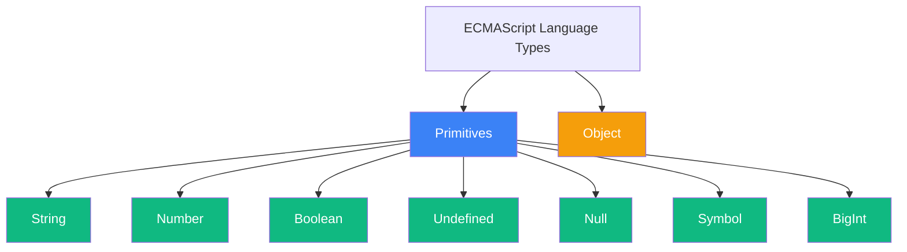
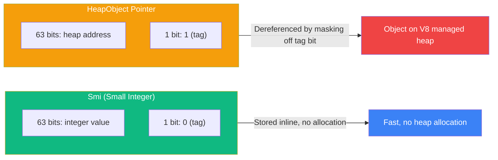
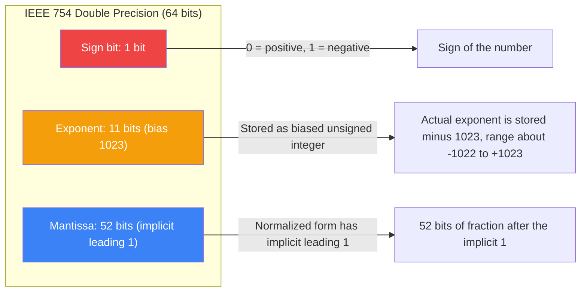
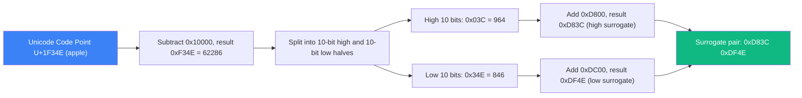
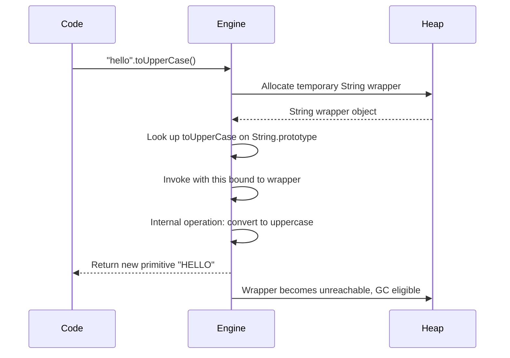
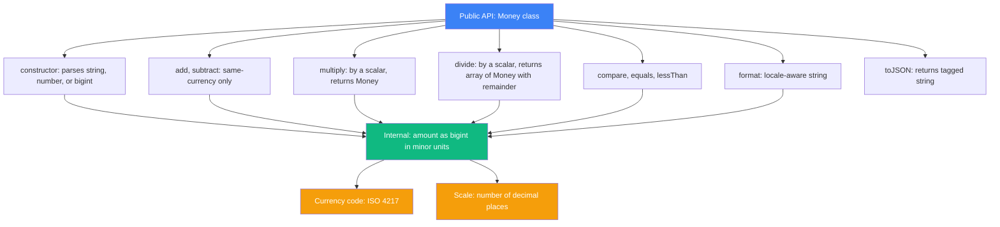

# 1.03 Primitive Data Types

## 1. Purpose

JavaScript defines exactly seven primitive data types: `String`, `Number`, `Boolean`, `Undefined`, `Null`, `Symbol`, and `BigInt`. Together with `Object`, these eight types form the complete type system of the language as standardised by ECMA-262. The distinction between primitive and object is not a stylistic preference — it determines how memory is allocated, how values are compared, how they are passed between functions, and how the engine can or cannot optimise them. Without a precise model of primitives, every downstream concept in this vault — closures, prototypes, the event loop, garbage collection, the TypeScript type space — becomes harder to reason about.

A primitive is, formally, a value that is not an object and whose representation is copied by value rather than by reference. When you assign `let b = a;` for two primitive variables, the value is duplicated; mutating `b` never touches `a`. For objects, the same assignment copies the reference, so mutating `b` does affect `a`. This single distinction is the foundation of value semantics in JavaScript, and the reason primitives can be stored inline in V8's pointers, compared with a single machine instruction, and never garbage collected in the traditional sense.

The seven primitives exist because each one solves a distinct problem that no other primitive can solve:

- `String` represents text encoded as a sequence of UTF-16 code units.
- `Number` represents IEEE 754 double-precision floating-point values, the only numeric type for the first twenty years of the language.
- `Boolean` represents the two truth values.
- `Undefined` represents the absence of an *unintentional* value — a variable that has been declared but not initialised, a function that returns nothing, a missing argument, a missing property.
- `Null` represents the *intentional* absence of any object value.
- `Symbol` represents a unique, non-enumerable, identity-bearing key for object properties — the only primitive with identity semantics.
- `BigInt` represents integers of arbitrary precision, added in ES2020 to address the inability of `Number` to exactly represent integers beyond 2 to the 53rd power minus 1.

Why is `null` a primitive but `typeof null === "object"`? This is a historic bug. In the original 1995 implementation of JavaScript at Netscape, values were stored in 32-bit machine words with the low bits used as a type tag. The tag `000` was used for objects. `null` was internally represented as a null pointer, which on most platforms was the all-zero word. The `typeof` operator therefore inspected the tag, saw `000`, and returned `"object"`. Fixing this bug would have broken millions of existing web pages that explicitly check `typeof maybeNull === "object"`, so the bug was enshrined in the spec and remains to this day. In modern V8 this is handled by an explicit special case in the `typeof` implementation, not by the original tag scheme, but the observable behaviour is preserved for backward compatibility.

Immutability of primitives matters because it is what makes value semantics safe. If primitives were mutable, then `let b = a;` followed by `b.toUpperCase()` would also uppercase `a`. Primitives cannot be mutated in place: `"hello".toUpperCase()` returns a *new* string `"HELLO"`; the original `"hello"` is untouched. This is what allows the engine to deduplicate strings, share small integers, and inline primitive values into the pointers that reference them, without any risk of aliasing bugs. The cost is that operations like string concatenation can produce many intermediate allocations — which is why V8 implements rope and cons-string optimisations (see Section 2).

Without primitives, JavaScript would have no value semantics, no fast inline numeric arithmetic, no safe string sharing, and no way to distinguish a missing value from an absent one. Every function call would copy references, every equality check would be identity-based, and every numeric loop would allocate. The seven primitives are the load-bearing foundation of every performance optimisation and every correctness argument in the language.

---

## 2. Theory and Deep Dive

The ECMAScript specification defines primitive types in clause 6 ("ECMAScript Data Types and Values"). The full taxonomy is:



### 2.1 Memory Representation and V8 Pointer Tagging

V8, the JavaScript engine used by Node.js and Chrome, represents every JavaScript value as a 64-bit word on 64-bit platforms (and a 32-bit word on 32-bit platforms). To distinguish primitives from pointers to heap objects, V8 uses a scheme called **pointer tagging**: the low bits of every value carry a type tag.

The two fundamental tag schemes are **Smi** (small integer) and **HeapObject**. A Smi is a 31-bit (or 32-bit on 64-bit systems) signed integer stored *directly* inside the pointer word, with the lowest bit set to 0. A HeapObject pointer has its lowest bit set to 1; the remaining bits encode the address of an object on the V8 heap. To dereference a HeapObject pointer, V8 masks off the low bit.



On 64-bit V8 (the default for Node.js), Smis can hold integers from about negative one billion to one billion. Integers outside this range are stored as HeapNumbers — full IEEE 754 doubles allocated on the heap. This is why a tight numeric loop that stays within Smi range is dramatically faster than one that overflows into HeapNumber territory: Smi arithmetic is a single machine instruction, HeapNumber arithmetic requires allocation and potentially triggers garbage collection.

What about the other primitives?

- **Boolean** is stored inline as a special tagged pointer, either the canonical `true` or `false` singleton. There is no allocation for `let b = true;`.
- **Undefined** and **Null** each have a canonical singleton root on the heap; all `undefined` values refer to the same root.
- **String** is always a HeapObject. V8 has multiple string representations:
  - **SeqString**: a contiguous array of bytes (Latin1 if all code units fit in a byte, or 2-byte UTF-16).
  - **ConsString**: a binary tree node holding two half-strings, used for concatenation results to defer copying.
  - **SlicedString**: a view into another string with offset and length.
  - **ExternalString**: wraps memory owned by the embedder (used by Node for native buffers).
- **Symbol** is a HeapObject with an internal identity slot; the `Symbol()` constructor always returns a fresh object.
- **BigInt** is a HeapObject with a digit array (64-bit digits on 64-bit platforms) and a sign bit. Length scales with the magnitude of the integer.

The rope/cons-string optimisation deserves special mention. When you write `const long = a + b + c;` for three 1 KB strings, V8 does not eagerly copy 3 KB of character data. Instead it constructs a ConsString whose left and right children are the operands, and only flattens it into a SeqString when you actually read the characters (via indexing or a method that needs sequential access). This is why `"a".repeat(1000000) + "b"` is fast even though the resulting string is enormous. The flattening is a one-time cost amortised across all subsequent reads.

### 2.2 IEEE 754 Double Precision for Number

JavaScript's `Number` type is, in the words of the spec, "a set of values that are IEEE 754-2019 double precision 64-bit binary format values". There is no separate integer type. Every number — `0`, `1`, `3.14`, `-1.5e30`, `Infinity`, `NaN` — is a 64-bit double.

The IEEE 754 double format packs a number into 64 bits as follows:



The 11-bit exponent supports a range of roughly `1.8e-308` to `1.8e+308`. The 52-bit mantissa (with an implicit leading 1 for normalised numbers) gives about 15 to 17 significant decimal digits. Critically, integers can be represented *exactly* only up to `2 ** 53 - 1`; beyond that, gaps appear in the representable integers, and `2 ** 53 + 1` rounds to `2 ** 53`.

Special values arise when the exponent field is all-ones (2047):

- Exponent 2047, mantissa 0: signed infinity (`+Infinity`, `-Infinity`).
- Exponent 2047, mantissa non-zero: NaN (Not a Number). There are roughly `2 ** 52` distinct NaN bit patterns, but JavaScript treats them all as the single observable value `NaN`.

Special values when the exponent field is 0:

- Exponent 0, mantissa 0: signed zero (`+0`, `-0`). Yes, JavaScript has two zero values. They compare equal with `===` but are distinguishable via `Object.is(0, -0)` and through `1 / 0 === Infinity` versus `1 / -0 === -Infinity`.
- Exponent 0, mantissa non-zero: a *subnormal* (also called denormal) number, used for very tiny values close to zero. Subnormals allow gradual underflow at the cost of slower arithmetic on some hardware.

Two practical consequences:

1. **Decimal fractions are not exact.** `0.1` and `0.2` cannot be represented exactly in binary floating point, and their sum is `0.30000000000000004`. This is the most common floating-point bug in every language that uses IEEE 754, not just JavaScript.
2. **Integers above `2 ** 53` lose precision.** `2 ** 53 + 1 === 2 ** 53` is `true` because there is no representable integer between them. The safe integer range is `-(2 ** 53 - 1)` to `2 ** 53 - 1`, and you can test membership with `Number.isSafeInteger`.

### 2.3 UTF-16 and the String Type

JavaScript strings are sequences of 16-bit code units, not Unicode code points. This is a legacy of the original 1995 design, when Unicode was a 16-bit character set and every code point fit in one code unit. When Unicode expanded beyond the BMP (Basic Multilingual Plane, code points 0 to 65535) in 1996, the UTF-16 encoding was retrofitted: code points above 65535 are encoded as a *surrogate pair* — two 16-bit code units in the range 55296 to 56319 (high surrogate) followed by 56320 to 57343 (low surrogate).



The practical consequence: `"apple-emoji".length === 2` when the apple emoji is included as a single character, not 1. The string contains two code units. The `for` loop iterates over code units and sees the surrogate halves separately. The `for...of` loop, however, iterates over code points by recognising surrogate pairs and yielding each as a single value. The `Array.from(str)` and spread operator `[...str]` also split on code points, not code units.

JavaScript provides `String.fromCodePoint` and `String.prototype.codePointAt` to work with code points directly, while `String.fromCharCode` and `String.prototype.charCodeAt` operate on code units. For any codebase that handles user text — especially emoji, ancient scripts, or mathematical symbols — using the code-point-aware APIs is essential.

Strings in JavaScript are **immutable**. There is no method to set character `i` of an existing string. `str[0] = "X"` silently does nothing in non-strict mode and throws in strict mode. All string methods (`toUpperCase`, `replace`, `slice`, `padStart`, etc.) return new strings. This immutability is what makes string sharing safe across variables: if two variables hold the same string primitive, no operation on one can affect the other.

### 2.4 Boolean, Undefined, Null

`Boolean` is the simplest primitive: exactly two values, `true` and `false`. Both are canonical singletons on V8's heap; there is no allocation when you assign `let b = true;`. Boolean is the type returned by all comparison operators (`===`, `<`, `>`, etc.) and consumed by `if`, `while`, `for`, and the conditional operator `?:`. Boolean values coerce from any other value via the `Boolean()` function or the `!!` idiom: zero, empty string, `null`, `undefined`, and `NaN` are falsy; everything else is truthy.

`Undefined` is the canonical "no value" value. It appears in five situations defined by the spec:

1. A declared variable that has not been assigned: `let x;` gives `x === undefined`.
2. A function that completes without an explicit `return`.
3. A function parameter that was not supplied by the caller.
4. A property access on an object whose prototype chain does not contain that property.
5. The result of the `void` operator: `void 0`.

`Null` represents the *intentional* absence of an object value. It is most commonly used as a sentinel: "this slot would normally hold an object reference, but right now it does not." The convention is that `undefined` means the system never set a value, while `null` means a programmer explicitly chose to clear one.

The `typeof null === "object"` bug was already explained in Section 1. Note that `typeof undefined === "undefined"` is correct, and `null === undefined` is `false`. They are distinct values, and conflating them is a frequent source of bugs. The loose equality `null == undefined` is `true` (one of the few cases where `==` and `===` differ on primitives), but strict equality distinguishes them.

### 2.5 Symbol: The Identity Primitive

`Symbol` is the only primitive with identity semantics. Every call to `Symbol()` produces a fresh, unique value that is guaranteed to never equal any other symbol, even one created with the same description:

```javascript
const a = Symbol("id");
const b = Symbol("id");
console.log(a === b);     // false
console.log(a.description); // "id" — the description is just a label
```

Symbols serve two roles in the language:

1. **Private-ish object keys.** When used as a property key, a symbol is guaranteed not to collide with any string key, and it is omitted by `for...in`, `Object.keys`, and `JSON.stringify`. It is *not* truly private — `Object.getOwnPropertySymbols` exposes it — but it is invisible to the standard enumeration APIs.
2. **Well-known protocol hooks.** The spec defines a set of well-known symbols (such as `Symbol.iterator`, `Symbol.asyncIterator`, `Symbol.toPrimitive`, `Symbol.hasInstance`) that an object can implement to participate in language-level protocols. See [[1.32 Well-Known Symbols]] for the full catalogue.

Symbols are stored as HeapObjects with an internal identity slot and an optional description string. They are never garbage collected while reachable, but if a symbol is used only as a property key and that property is deleted from all objects that referenced it, the symbol becomes collectible.

The `Symbol.for(key)` function returns a *shared* symbol from the global symbol registry. Two calls with the same key return the same symbol, even across modules and realms. `Symbol.keyFor(sym)` reverses the lookup, returning the registry key (or `undefined` for non-registered symbols). Use `Symbol.for` only when you genuinely need cross-realm sharing — for example, when defining a well-known protocol hook that third-party code should be able to detect.

### 2.6 BigInt: Arbitrary Precision Integers

`BigInt` was added in ES2020 to address the fact that `Number` cannot exactly represent integers beyond `2 ** 53 - 1`. A BigInt can be any size, limited only by available memory. The literal syntax is an integer followed by `n`: `0n`, `123n`, `99999999999999999999n`.

Internally, V8 represents a BigInt as a sign bit plus a digit array (64-bit digits on 64-bit builds, 32-bit digits on 32-bit builds). Arithmetic is performed digit-by-digit using the standard schoolbook algorithm, with Karatsuba multiplication for very large values. This is dramatically slower than Smi or HeapNumber arithmetic — BigInts are for when you need *exactness*, not speed.

BigInts have several deliberate limitations:

- They cannot be mixed with `Number` in arithmetic: `1n + 1` throws a `TypeError`. You must explicitly convert: `Number(1n) + 1` or `1n + BigInt(1)`.
- They cannot be used with the unary `+` operator: `+1n` throws.
- They do not interoperate with `Math` functions: `Math.sqrt(16n)` throws.
- They are not coerced to `Number` implicitly; explicit `Number(bigint)` is required and may lose precision.
- They compare equal to a `Number` of the same mathematical value under `==` but not `===`: `1n == 1` is `true`, `1n === 1` is `false`.
- They serialise to JSON as `{}` (an empty object) unless you provide a custom `toJSON` method or a replacer function; standard `JSON.stringify` does not support BigInt.

These restrictions exist to force the programmer to be explicit about precision boundaries. The TC39 rationale was: silently promoting `1 + 2n` to a `Number` would risk losing precision when the BigInt is large; silently demoting to BigInt would be inconsistent with the rest of the language. A throw is the only safe choice. The cost is some ergonomic friction at every Number-to-BigInt boundary, but the alternative is silent data corruption.

### 2.7 Wrapper Objects and Autoboxing

For each primitive type (except `Null` and `Undefined`), there is a corresponding *wrapper object* type: `String`, `Number`, `Boolean`, `Symbol`, `BigInt`. The wrapper objects are full objects with prototypes, slots, and methods.

When you write `"hello".toUpperCase()`, the engine performs **autoboxing**: it creates a temporary `String` wrapper object around the primitive, calls the method on the wrapper, then discards the wrapper. The primitive itself is never modified; the method returns a new primitive (or new object) and the temporary wrapper is immediately collectible.



Autoboxing has several consequences:

- Calling a method on a primitive never mutates the primitive (primitives are immutable anyway).
- The wrapper is short-lived; attempting to store a property on it does nothing persistent: `"x".foo = 1; "x".foo` is `undefined`.
- Using the wrapper constructors with `new` (`new String("x")`, `new Number(1)`, `new Boolean(false)`) creates a *persistent* wrapper object. This is almost always a mistake because it breaks equality: `new String("a") === "a"` is `false` (object vs primitive), and `new Boolean(false)` is *truthy* (it is an object).

`Symbol` and `BigInt` are special: their wrappers can be created explicitly via `Object(sym)` or `Object(bigint)`, but `new Symbol()` and `new BigInt()` throw `TypeError`. This is a deliberate restriction added when those types were introduced, to prevent the wrapper-object confusion that plagues `String`, `Number`, and `Boolean`. The lesson was learned: newer primitives refuse the trap that older primitives still allow.

---

## 3. Mental Models

Three mental models survive contact with edge cases.

**Model 1: Primitives are value types; objects are reference types.** When you assign a primitive from one variable to another, the value is copied. When you assign an object, the reference is copied. `let b = a` for primitives means "b now holds an independent copy of a's value." For objects it means "b now points at the same heap object as a." This model explains why primitives compare by value (`1 === 1` is true even when stored in different variables) and why objects compare by identity (`{} === {}` is false because they are different heap allocations).

Where this model breaks down: strings. A long string is technically a HeapObject, and V8 may intern identical strings so two variables hold the same pointer. But because strings are immutable, this aliasing is invisible — you can never observe it through mutation. So the model still works for reasoning about correctness, even though it lies about memory layout.

**Model 2: Wrapper objects are temporary lenses on primitives.** When you call `"hello".toUpperCase()`, imagine the engine briefly wrapping the string in a `String` object to give it methods, then discarding the wrapper. The primitive is the truth; the wrapper is a momentary view. This model explains why `"x".foo = 1` does not stick (the wrapper is gone before you read back) and why `new String("a") === "a"` is false (one is a wrapper object, one is a primitive — they are different kinds of thing).

Where this model breaks down: `Symbol` and `BigInt` cannot be called with `new`. They have wrappers, but the wrapper must be created via `Object()`. Treat them as primitives with a stricter discipline than `String`, `Number`, and `Boolean`.

**Model 3: `null` is intentional absence; `undefined` is unintentional absence.** Use `null` when you explicitly want to say "this slot is empty on purpose." Use `undefined` to mean "the system has not assigned this." A function that returns nothing returns `undefined`. A parameter the caller omits is `undefined`. A property that does not exist yields `undefined`. Reserve `null` for cases where you are deliberately clearing a value or documenting an optional field in a data structure.

Where this model breaks down: JSON. `JSON.stringify({ x: undefined })` produces `"{}"` (the key is dropped), but `JSON.stringify({ x: null })` produces `'{"x":null}'`. So `null` survives JSON round-trips; `undefined` does not. When designing APIs that cross JSON boundaries, prefer `null` for absent fields, because a `null` field in JSON is at least observable to the receiver.

**Bonus model: Symbol is a GUID for property names.** A symbol is a globally unique identifier that happens to be usable as an object property key. If you need a property that cannot collide with any other property — even ones added by other libraries or future spec additions — use a symbol key. This is exactly how React ensures `$$typeof` cannot be forged by JSON injection.

---

## 4. Real-World Use Cases

**ID handling at scale.** The maximum safe integer for `Number` is `2 ** 53 - 1`, or about 9 quadrillion. Most database IDs are smaller than this, but a few critical systems exceed it:

- Twitter/X snowflake IDs (64-bit) routinely exceed 2 to the 53rd power under high write throughput.
- Discord snowflake IDs exceed it regularly; Discord serialises them as strings to clients to avoid precision loss in JavaScript.
- GitHub's internal repository IDs and order IDs occasionally approach the limit.
- Stripe uses string IDs throughout its API (e.g., customer IDs prefixed with `cus` and payment-intent IDs prefixed with `pi`) partly to avoid the issue entirely.

If your backend returns a snowflake ID as a JSON number, JavaScript's `JSON.parse` will round it to the nearest representable double, and you will silently get the wrong ID. The standard fix is to either (a) serialise IDs as strings on the server, (b) parse JSON with a BigInt-aware reviver, or (c) use a branded string type in TypeScript. Option (a) is what Discord does and is the most defensive. Option (c) is what well-typed codebases do internally. Option (b) is what you do when you cannot change the server.

**React's Symbol-based element types.** React uses `Symbol.for("react.element")` as the `$$typeof` field on every element. This is a security measure: if an attacker can inject a JSON object into your rendered tree (via `dangerouslySetInnerHTML` or a sloppy API contract), they could craft an object that looks like a React element but actually triggers a side effect when rendered. By requiring the `$$typeof` field to be a *symbol* — which cannot be serialised in JSON — React guarantees that only elements created in the same JS realm can be rendered. A JSON-injected fake element has `$$typeof: undefined` and React refuses to render it. This is one of the most elegant security uses of Symbol in production JavaScript.

**Wrapper autoboxing bites in legacy code.** If you encounter `new String("a") === "a"` returning `false` in a codebase, you are looking at a wrapper-object bug. The legacy code created a `String` object where a primitive was expected, and now equality checks fail intermittently. The fix is to remove `new` — write `String("a")` (which returns a primitive) or just `"a"`. ESLint rule `no-new-wrappers` catches this automatically. A more pernicious variant is `new Boolean(false)` used as a flag — it is always truthy because it is an object, so the conditional `if (new Boolean(false))` always runs.

**TypeScript branded types for IDs.** In a TypeScript codebase with multiple kinds of IDs (UserId, OrderId, ProductId), a `number` or `string` ID type is unsafe: `function fetchUser(id: UserId)` accepts any number if `UserId` is just an alias for number. The branded type pattern fixes this:

```typescript
declare const brand: unique symbol;
type Branded<T, B> = T & { readonly [brand]: B };
type UserId = Branded<string, "UserId">;
type OrderId = Branded<string, "OrderId">;
```

Now `fetchUser(orderId)` is a compile-time error. The brand is a phantom — it exists only in the type system — but it eliminates an entire class of "passed the wrong ID" bugs. Real companies (Stripe, GitHub internally, Vercel) use this pattern, often combined with runtime validation at the boundary (e.g., parsing a `string` into a `UserId` via a constructor function that checks a regex).

**Well-known symbols in libraries.** Many libraries use well-known symbols as extension points:

- `Symbol.iterator` is used by Immutable.js, RxJS, and the standard library to make objects iterable.
- `Symbol.asyncIterator` is used by `for await...of` and underlies the streaming protocols of Node.js and Deno.
- `Symbol.toPrimitive` is used by libraries that want to control how their objects convert to primitives (e.g., moment.js's date objects, decimal.js's Money objects).
- `Symbol.toStringTag` is used by polyfills and shims to make duck-typed objects report a meaningful `[object ...]` string.

See [[1.32 Well-Known Symbols]] for the full inventory and patterns for implementing each.

**BigInt in cryptography and bignum arithmetic.** BigInt is used in pure-JavaScript crypto libraries (e.g., noble-curves) for elliptic curve arithmetic, in blockchain clients for hash and signature verification, and in scientific computing libraries for arbitrary-precision arithmetic. The performance is good enough for these workloads because they are dominated by big-integer multiplication, where BigInt's Karatsuba implementation is competitive with native code for moderate sizes. For very large multiplications (millions of digits), a native addon like `node-gmp` will still be faster, but for the typical cryptographic workload — modular exponentiation with 256-bit or 384-bit operands — BigInt is the right tool.

---

## 5. Code Examples

### 5.1 Example A — Minimal and Conceptual

Demonstrate `typeof` for each primitive, including the historic `typeof null` quirk.

**JavaScript:**

```javascript
const samples = [
  ["string",    "hello"],
  ["number",    42],
  ["boolean",   true],
  ["undefined", undefined],
  ["object",    null],          // the famous quirk
  ["symbol",    Symbol("x")],
  ["bigint",    0n],
];

for (const [expected, value] of samples) {
  const actual = typeof value;
  const ok = actual === expected ? "OK" : "QUIRK";
  console.log(`${ok}\ttypeof ${String(value).padEnd(12)} === ${actual}`);
}
```

**TypeScript:**

```typescript
// The same demonstration, with explicit types to make the
// type-system view of each primitive visible.
const samples: Array<readonly [string, unknown]> = [
  ["string",    "hello" as string],
  ["number",    42 as number],
  ["boolean",   true as boolean],
  ["undefined", undefined as undefined],
  ["object",    null as null],
  ["symbol",    Symbol("x") as symbol],
  ["bigint",    0n as bigint],
];

for (const [expected, value] of samples) {
  const actual: string = typeof value;
  const ok: string = actual === expected ? "OK" : "QUIRK";
  console.log(`${ok}\ttypeof === ${actual}`);
}
```

The TypeScript version adds type annotations purely for documentation. The runtime behaviour is identical. Note that `typeof null` returns `"object"` in both languages — TypeScript's type system knows that `typeof null` is `"object"` at the value level, even though `null` is a primitive in the spec sense.

### 5.2 Example B — Production-Grade

A small library that defines branded ID types in TypeScript and a parallel implementation in JavaScript using BigInt for IDs that may exceed 2 to the 53rd power minus 1.

**TypeScript — branded ID types:**

```typescript
// Brand a primitive to forbid mixing IDs of different domains.
// The brand field never exists at runtime; it is purely a type-level marker.
declare const brand: unique symbol;

type Branded<T, B> = T & { readonly [brand]: B };

export type UserId = Branded<string, "UserId">;
export type OrderId = Branded<string, "OrderId">;
export type SessionId = Branded<string, "SessionId">;

// The only sanctioned way to construct a branded ID.
// A validation function rejects malformed inputs at the boundary.
export function makeUserId(raw: string): UserId {
  if (!/^[a-zA-Z0-9]{8,32}$/.test(raw)) {
    throw new RangeError(`Invalid user id: ${raw}`);
  }
  return raw as UserId;
}

export function makeOrderId(raw: string): OrderId {
  if (!/^\d{1,19}$/.test(raw)) {
    throw new RangeError(`Invalid order id: ${raw}`);
  }
  return raw as OrderId;
}

// Fetch APIs that only accept the right brand.
export async function fetchUser(id: UserId): Promise<{ id: UserId; name: string }> {
  const res = await fetch(`/api/users/${encodeURIComponent(id)}`);
  if (!res.ok) throw new Error(`HTTP ${res.status}`);
  const body = await res.json() as { id: string; name: string };
  return { id: makeUserId(body.id), name: body.name };
}

// Compile-time error if you try to pass an OrderId where a UserId is required.
// fetchUser(makeOrderId("123"));  // tsc rejects this.
```

**JavaScript — BigInt snowflake IDs:**

```javascript
// Snowflake IDs are 64-bit and exceed 2 ** 53 - 1.
// Treat them as BigInt internally, serialise as strings on the wire.

const EPOCH = 1420070400000n; // Discord epoch, 2015-01-01 in ms

export function parseSnowflake(text) {
  if (!/^\d+$/.test(text)) {
    throw new RangeError(`Not a snowflake: ${text}`);
  }
  const id = BigInt(text);
  if (id < 0n) throw new RangeError("Snowflake must be non-negative");
  return Object.freeze({
    raw: id,
    timestamp: Number(id >> 22n) + Number(EPOCH),
    workerId: Number((id >> 17n) & 0x1Fn),
    processId: Number((id >> 12n) & 0x1Fn),
    increment: Number(id & 0xFFFn),
  });
}

export function toJSON(id) {
  return id.raw.toString();
}

// Custom JSON serialisation for an object that holds snowflakes.
export function snowflakeAwareStringify(obj) {
  return JSON.stringify(obj, (key, value) =>
    typeof value === "bigint" ? value.toString() : value
  );
}

// Equality that treats string and BigInt forms as the same ID.
export function sameSnowflake(a, b) {
  const aBi = typeof a === "bigint" ? a : BigInt(a);
  const bBi = typeof b === "bigint" ? b : BigInt(b);
  return aBi === bBi;
}

// Example:
//   const sf = parseSnowflake("175928847299117063");
//   console.log(sf.timestamp);          // 1466360729123
//   console.log(snowflakeAwareStringify({ id: sf.raw }));  // {"id":"175928847299117063"}
```

The TypeScript version uses the brand pattern to enforce ID discipline at compile time with zero runtime cost. The JavaScript version uses BigInt for arithmetic correctness on 64-bit IDs and provides a JSON reviver pattern for safe wire serialisation. The two patterns compose: in a TypeScript codebase, you would brand `BigInt`-based IDs with `Branded<bigint, "Snowflake">` to get both type-level safety and runtime precision.

---

## 6. Common Mistakes and Anti-Patterns

### 6.1 Floating-Point Equality: `0.1 + 0.2 !== 0.3`

```javascript
if (0.1 + 0.2 === 0.3) {
  console.log("expected");
} else {
  console.log("never runs");
}
// Actual: 0.1 + 0.2 === 0.30000000000000004
```

**Why it fails:** The decimal literals `0.1` and `0.2` cannot be represented exactly as IEEE 754 doubles. Both are stored as the nearest representable value, and the rounding errors accumulate during addition. The result is `0.30000000000000004`, which is not bit-identical to `0.3`.

**Fix:** Use an epsilon comparison, or work in integer units (cents instead of dollars).

```javascript
function nearlyEqual(a, b, epsilon = 1e-10) {
  return Math.abs(a - b) < epsilon;
}

// Better: represent money as integer cents from the start.
const priceInCents = 1995; // $19.95
const taxInCents = Math.round(priceInCents * 0.08);
const totalInCents = priceInCents + taxInCents;
```

### 6.2 NaN Never Equals Itself

```javascript
const x = NaN;
if (x === NaN) {
  console.log("never runs");
}
if (x !== x) {
  console.log("the only way to detect NaN with ===");
}
```

**Why it fails:** The IEEE 754 standard defines NaN as unordered with respect to every value, including itself. This is by design: NaN means "the result is undefined," and asking whether two undefined results are equal is meaningless. JavaScript inherits this directly.

**Fix:** Use `Number.isNaN`, which is the only correct test. Do not use the global `isNaN`, which coerces its argument to Number first and reports `isNaN("hello") === true`.

```javascript
Number.isNaN(x);       // true
Number.isNaN("hello"); // false — "hello" is a string, not NaN
isNaN("hello");        // true  — global isNaN coerces, dangerous
```

### 6.3 The `typeof null === "object"` Historic Bug

```javascript
function process(value) {
  if (typeof value === "object") {
    // Naive assumption: value is an object.
    return Object.keys(value);
  }
  return [];
}

process(null); // throws TypeError: Cannot convert undefined or null to object
```

**Why it fails:** `typeof null` returns `"object"` even though `null` is a primitive, due to the 1995 tag-scheme bug described in Section 1. The function above does not guard against `null` and crashes when it tries to call `Object.keys` on it.

**Fix:** Explicitly check for `null` when you mean "object."

```javascript
function process(value) {
  if (value !== null && typeof value === "object") {
    return Object.keys(value);
  }
  return [];
}

// Or, more idiomatically:
function process(value) {
  return value && typeof value === "object" ? Object.keys(value) : [];
}
```

### 6.4 Loss of Precision Past the Safe Integer Limit

```javascript
const a = 9007199254740992;        // 2 ** 53
const b = a + 1;
console.log(b === a);              // true — should be false!
console.log(9999999999999999 === 10000000000000000); // true
```

**Why it fails:** Integers above `2 ** 53 - 1` cannot all be represented exactly as IEEE 754 doubles. The representable integers become spaced 2 apart, then 4 apart, and so on. `a + 1` rounds to `a` because there is no representable integer between them.

**Fix:** Use `BigInt` for any integer that may exceed 2 to the 53rd power minus 1, or serialise such integers as strings on the wire.

```javascript
const a = 9007199254740992n;
const b = a + 1n;
console.log(b === a); // false, correct

// Number.isSafeInteger checks the boundary:
Number.isSafeInteger(9007199254740992); // false
```

### 6.5 String Length and Surrogate Pairs

```javascript
const s = "\u{1F34E}"; // apple emoji
console.log(s.length);        // 2 — two code units
console.log([...s].length);   // 1 — one code point

for (let i = 0; i < s.length; i++) {
  console.log(s.charCodeAt(i).toString(16)); // logs d83c and df4e — surrogate halves
}
for (const ch of s) {
  console.log(ch.codePointAt(0).toString(16)); // logs 1f34e — full code point
}
```

**Why it fails:** JavaScript strings are UTF-16 sequences of code units. Characters outside the Basic Multilingual Plane (emoji, ancient scripts, mathematical symbols) are encoded as surrogate pairs of two code units. The `.length` property counts code units, not code points, and the C-style `for` loop iterates code units.

**Fix:** Use the code-point-aware APIs: `for...of`, `[...str]`, `Array.from(str)`, `String.fromCodePoint`, `codePointAt`. When you need a length that matches the user's perception of "characters," use `[...str].length` or a grapheme-aware library for combining characters and ZWJ sequences.

```javascript
const visibleLength = (s) => [...s].length;

// For full grapheme cluster awareness (handling ZWJ emoji like family emoji),
// use Intl.Segmenter (ES2022):
const segmenter = new Intl.Segmenter("en", { granularity: "grapheme" });
const graphemeCount = (s) => [...segmenter.segment(s)].length;
```

### 6.6 Symbol Equality Is Identity

```javascript
const a = Symbol("token");
const b = Symbol("token");
console.log(a === b); // false
console.log(a === a); // true

const cache = {};
cache[a] = 1;
cache[b] = 2;
console.log(cache[a]); // 1 — symbols do not collide
console.log(Object.keys(cache)); // [] — symbols are not enumerable
```

**Why it fails:** Every `Symbol()` call returns a fresh, unique symbol. The description string is only a debugging label and does not affect identity. If you want a *shared* symbol across calls, modules, or realms, use `Symbol.for("token")`, which registers the symbol in the global symbol registry and returns the same symbol for the same key.

**Fix:** Use `Symbol.for` for cross-module shared symbols; use `Symbol()` for private-ish keys.

```javascript
const shared = Symbol.for("app:config");
const sameShared = Symbol.for("app:config");
console.log(shared === sameShared); // true

// Conversely, Symbol.keyFor retrieves the registry key:
console.log(Symbol.keyFor(shared)); // "app:config"
console.log(Symbol.keyFor(Symbol("local"))); // undefined
```

### 6.7 BigInt and Number Do Not Mix

```javascript
const x = 1n + 1; // TypeError: Cannot mix BigInt and other types
const y = +1n;    // TypeError: Cannot convert a BigInt to a number
const z = Math.sqrt(16n); // TypeError: Cannot convert a BigInt to a number
```

**Why it fails:** TC39 decided that implicit conversion between `Number` and `BigInt` would either lose precision (BigInt to Number when large) or be inconsistent with the rest of the language (Number to BigInt always). They chose to throw, forcing the programmer to be explicit.

**Fix:** Convert explicitly at the boundary, and prefer BigInt for the whole domain when precision matters.

```javascript
// If you know the BigInt is small:
const x = Number(1n) + 1;

// If you want both operands as BigInt:
const x2 = 1n + BigInt(1);

// For Math functions, convert first:
const sqrtOfSixteen = Math.sqrt(Number(16n));

// Or implement BigInt-native operations when precision matters:
function bigintSqrt(n) {
  if (n < 0n) throw new RangeError("negative");
  if (n < 2n) return n;
  let x = n, y = (x + 1n) / 2n;
  while (y < x) { x = y; y = (x + n / x) / 2n; }
  return x;
}
```

### 6.8 Wrapper Constructors Create Objects, Not Primitives

```javascript
const s1 = new String("a");
const s2 = "a";
console.log(s1 === s2);             // false — object vs primitive
console.log(typeof s1);             // "object"
console.log(s1 instanceof String);  // true
console.log(s2 instanceof String);  // false

// Worse: a Boolean wrapper is always truthy!
const b = new Boolean(false);
if (b) {
  console.log("runs — b is an object, and objects are truthy");
}
```

**Why it fails:** Calling `String`, `Number`, or `Boolean` with `new` allocates a wrapper object instead of returning a primitive. The wrapper is an object, so `typeof` returns `"object"`, equality checks against primitives fail, and `new Boolean(false)` is truthy because all objects are truthy.

**Fix:** Never use `new` with the wrapper constructors. Call them as functions (which returns a primitive) or, better, use literals.

```javascript
const s = "a";          // literal, preferred
const n = 1;            // literal, preferred
const b = false;        // literal, preferred

// If you really need explicit conversion:
const s2 = String(value);
const n2 = Number(value);
const b2 = Boolean(value);
```

Enable ESLint rule `no-new-wrappers` to catch this in code review automatically.

---

## 7. Best Practices and Design Patterns

**Prefer `Number.isNaN` and `Number.isFinite` over the global `isNaN` and `isFinite`.** The global versions coerce their argument to Number first, producing surprising results: `isNaN("hello")` is `true` (because `Number("hello")` is `NaN`), and `isFinite("123")` is `true` (because `Number("123")` is `123`). The static Number methods do not coerce, so `Number.isNaN("hello")` is `false` and `Number.isFinite("123")` is `false`. The static methods reflect intent; the global ones reflect 1996.

**Use `BigInt` for any integer that may exceed 2 to the 53rd power minus 1.** This includes 64-bit database IDs, snowflake IDs, blockchain nonces, cryptographic nonces, and timestamps in nanoseconds. The cost is interoperability — `JSON.stringify` does not handle BigInt natively — but the alternative is silent data corruption. Provide a custom `toJSON` method or a reviver function at every JSON boundary. Make the choice between `Number` and `BigInt` an explicit, documented decision at every ID-bearing type in your system.

**Use branded types in TypeScript for ID safety.** When two domains share an underlying representation (string IDs for users and orders) but should not be interchangeable, brand them. The pattern costs nothing at runtime and prevents a class of bugs that is otherwise only caught in production. Pair the brand with a constructor function that validates the input at the system boundary, so you get both compile-time and runtime safety.

**Use `Object.is` for `NaN`-aware and signed-zero-aware equality.** `Object.is(NaN, NaN)` is `true`; `Object.is(0, -0)` is `false`; `Object.is` otherwise behaves like `===`. Reach for it whenever you are implementing equality for a data structure (a Set or Map keyed on values that might include `NaN` or signed zero) or comparing floating-point results where `-0` is meaningful (e.g., financial sign conventions, physics simulations).

**Never use wrapper constructors with `new`.** `new String`, `new Number`, `new Boolean` create objects where primitives are expected. They break equality, they break truthiness (`new Boolean(false)` is truthy), and they add allocation overhead. The lint rule `no-new-wrappers` exists for a reason; enable it on every project.

**Treat `null` and `undefined` distinctly.** Use `undefined` for "the system never set this" — optional parameters, missing properties, functions without a return. Use `null` for "I explicitly cleared this" or "this field is intentionally absent." Many JSON APIs use `null` for absent fields because `JSON.stringify` drops `undefined`-valued keys. Pick a convention for your codebase and document it; nothing is worse than a codebase where some functions return `null` for "not found" and others return `undefined`.

**Iterate strings with `for...of` or spread, not `for (let i = 0; ...)`.** The `for...of` loop iterates code points and correctly handles surrogate pairs. The C-style `for` loop iterates code units and will split emoji and astral characters in half. If you need a code-unit index, use the code-unit APIs (`charCodeAt`) explicitly and add a comment explaining why.

**Avoid implicit string-to-number coercion.** `"5" - 2` is `3` (string is coerced to number) but `"5" + 2` is `"52"` (number is coerced to string). This inconsistency is a perennial source of bugs. Use explicit `Number(value)` for conversion and the `+` operator only when both operands are known to be numbers. See [[1.04 Type Coercion and Equality]] for the full coercion matrix.

**Use `Symbol.for` only when you genuinely need cross-realm sharing.** The global symbol registry is process-wide. Symbols you put there can be accessed by any code in the same realm, including third-party libraries. For private-ish property keys, prefer `Symbol()` so that no other code can accidentally pick up your symbol. For framework-level hooks that third-party code should be able to detect (like React's `react.element` type), `Symbol.for` is appropriate.

**Guard against `typeof null === "object"` at every object-checking boundary.** Whenever you write `typeof x === "object"`, add `&& x !== null` (or use `x != null` which checks for both `null` and `undefined` in one comparison). The bug is small, frequent, and easy to forget. Consider an ESLint custom rule or a utility function `isObject(x)` that captures the check.

**When performance matters, keep integers in Smi range.** On 64-bit V8, Smis cover about negative one billion to one billion. Numeric loops that stay in this range are single-instruction; loops that overflow into HeapNumber territory allocate on every iteration. If you have a hot numeric loop, check whether your counters stay in Smi range; if not, consider refactoring (e.g., process the data in chunks, or use a TypedArray).

---

## 8. Technical Interview Knowledge

### 8.1 Question One

**Q:** List all seven primitive types in JavaScript and their `typeof` results.

**A:** The seven primitives and their `typeof` results are:

1. `String` — `typeof "x" === "string"`
2. `Number` — `typeof 1 === "number"` (includes `NaN`, `Infinity`, `-0`)
3. `Boolean` — `typeof true === "boolean"`
4. `Undefined` — `typeof undefined === "undefined"`
5. `Null` — `typeof null === "object"` (the historic bug; see 8.2)
6. `Symbol` — `typeof Symbol() === "symbol"`
7. `BigInt` — `typeof 0n === "bigint"`

`Object` is technically the eighth type but is not a primitive. Functions are objects (`typeof function() {} === "function"` is a special-case return value of `typeof` to distinguish callable objects from non-callable ones).

**Trap to avoid:** Saying `typeof null === "null"`. It is `"object"`. Many candidates blow this question by forgetting the bug.

### 8.2 Question Two

**Q:** Why does `typeof null === "object"`?

**A:** In the original 1995 Netscape implementation, JavaScript values were stored in 32-bit words with the low three bits used as a type tag. The tag `000` denoted an object. `null` was internally represented as a null pointer (all-zero word), so its tag bits happened to be `000`, and `typeof` returned `"object"`. Fixing this would have broken existing web pages that explicitly checked `typeof maybeNull === "object"`, so the bug was preserved through standardisation. Modern engines do not use that tag scheme anymore (V8 uses Smi tagging with the low bit), but the observable behaviour is preserved by an explicit special case in the `typeof` implementation.

**Trap to avoid:** Saying "it is a bug that nobody has bothered to fix." The reason it persists is web compatibility, not laziness. The fix has been discussed by TC39 multiple times and rejected each time on backward-compatibility grounds.

### 8.3 Question Three

**Q:** Explain IEEE 754 double precision.

**A:** A double-precision float is 64 bits: 1 sign bit, 11 exponent bits (biased by 1023), and 52 mantissa bits (with an implicit leading 1 for normalised numbers). The exponent range is approximately `1.8e-308` to `1.8e+308`. The mantissa provides about 15 to 17 significant decimal digits.

Special encodings:

- Exponent all-ones, mantissa zero: signed infinity.
- Exponent all-ones, mantissa non-zero: NaN (about `2 ** 52` bit patterns, all observable as the single value `NaN`).
- Exponent zero, mantissa zero: signed zero (`+0` and `-0`).
- Exponent zero, mantissa non-zero: subnormal numbers.

Integers up to `2 ** 53 - 1` are exactly representable. Above that, gaps appear. This is why the maximum safe integer constant on Number is `2 ** 53 - 1` (which is `9007199254740991`).

**Trap to avoid:** Saying "JavaScript numbers are floats." They are doubles specifically, and the distinction matters when you discuss performance and exactness. Also avoid saying "JavaScript has 32-bit integers" — bitwise operators operate on 32-bit integers, but the Number type itself is always a 64-bit double.

### 8.4 Question Four

**Q:** Why does `0.1 + 0.2 !== 0.3`?

**A:** The decimal numbers `0.1` and `0.2` are not exactly representable in binary floating point. Each is stored as the nearest representable double, which is a tiny amount above the true decimal value. When added, the rounding errors combine and the result is `0.30000000000000004`, which differs from the nearest double for `0.3` by one unit in the last place (ULP). The `===` operator performs a bit-exact comparison, so the two are not equal.

To test approximate equality, use an epsilon comparison or work in integer units (e.g., cents instead of dollars). For monetary calculations, the standard practice is to use BigInt or a decimal library, never raw `Number`.

**Trap to avoid:** Saying "JavaScript is bad at math." This is true of every IEEE 754 implementation, including Python, Java, C, and Go. The bug is in the binary representation of decimal fractions, not in JavaScript.

### 8.5 Question Five

**Q:** What is the maximum safe integer for the Number type?

**A:** The maximum safe integer is `2 ** 53 - 1`, which is `9007199254740991`. "Safe" means the integer can be represented exactly and compared for equality with another safe integer using `===`. Above this value, integers begin to have gaps: `2 ** 53` and `2 ** 53 + 1` are both stored as the same double, so `2 ** 53 + 1 === 2 ** 53` is `true`.

For integers that may exceed this limit, use `BigInt`. The `Number.isSafeInteger(x)` predicate returns `true` for any integer in the safe range, including negatives down to `-(2 ** 53 - 1)`.

**Trap to avoid:** Saying "2 to the 32" or "2 to the 64." The 32-bit confusion comes from `Array.prototype.length` and bitwise operators, which operate on 32-bit integers. The 64-bit confusion comes from thinking about the full width of the double; only 53 bits are available for the mantissa (52 stored plus the implicit leading 1).

### 8.6 Question Six

**Q:** What is the difference between `Symbol` and `String` as object keys?

**A:** Four differences:

1. **Identity vs equality.** Two strings with the same content are the same key (`{["a"]: 1}` and `{["a"]: 2}` have the same key `a`). Two symbols with the same description are *different* keys (`{[Symbol("x")]: 1}` and `{[Symbol("x")]: 2}` are two unrelated properties). Symbols have identity semantics; strings have value semantics.
2. **Enumeration.** String keys are enumerable by default and appear in `for...in`, `Object.keys`, and `JSON.stringify`. Symbol keys are never enumerable via these mechanisms. They appear only in `Object.getOwnPropertySymbols` and `Reflect.ownKeys`.
3. **Collision avoidance.** A symbol can never collide with a string key, even one chosen by another library. This makes symbols ideal for storing metadata on objects you do not own (e.g., a framework storing its internal state on a user-provided object).
4. **Cross-realm sharing.** `Symbol.for(key)` returns a symbol shared across all realms in the process. Strings are intrinsically shared, so this distinction does not apply to them.

Use strings for public, enumerable properties. Use symbols for non-enumerable metadata, well-known protocol hooks (`Symbol.iterator`, `Symbol.toPrimitive`), or private-ish fields that should not be picked up by JSON serialisation.

**Trap to avoid:** Saying "symbols make properties private." They do not. `Object.getOwnPropertySymbols` exposes them. For true privacy, use the `#field` private class field syntax (ES2022).

### 8.7 Question Seven

**Q:** Why can't you call `new BigInt()` or `new Symbol()`?

**A:** When `Symbol` was added in ES6 and `BigInt` in ES2020, the committee deliberately made the constructors throw when invoked with `new`. The reason is to prevent the wrapper-object confusion that plagues `String`, `Number`, and `Boolean` — where `new String("x")` creates an object that behaves subtly differently from the primitive `"x"` in equality checks, truthiness, and `typeof`. By forbidding `new Symbol()` and `new BigInt()`, the spec ensures that every `Symbol` and `BigInt` value is a primitive.

You can still get a wrapper object via `Object(sym)` or `Object(bigint)`, but this is rare and deliberate. The lesson was learned from the older primitives: do not let `new` create wrappers that confuse equality and truthiness.

**Trap to avoid:** Saying "they are not constructors." They are constructors in the sense of being callable functions that produce values of their respective types. They just do not support the `new` operator. The spec refers to them as not having a `[[Construct]]` internal method.

### 8.8 Question Eight

**Q:** How does V8 store small integers?

**A:** V8 uses a pointer-tagging scheme. On 64-bit platforms, every JavaScript value is a 64-bit word. The low bit is a tag:

- Tag `0`: the value is a Smi (small integer). The upper 63 bits hold the integer value (shifted left by 1, effectively). Smis cover roughly negative one billion to one billion.
- Tag `1`: the value is a pointer to a HeapObject. The upper 63 bits are the heap address (with the low bit cleared to dereference).

Smi arithmetic is single-instruction and allocation-free. When an integer operation would overflow the Smi range, V8 transitions the value into a HeapNumber — a heap-allocated object containing a full IEEE 754 double. This transition is one of the most common causes of performance regressions in numeric code; you can observe it with V8's `--trace-opt` and `--trace-deopt` flags.

For floats, V8 always uses HeapNumber (since there is no way to pack a 64-bit double into a tagged pointer). Frequent float allocation in hot loops is mitigated by V8's inline cache and escape analysis, but tight float code is often slower than tight Smi code.

**Trap to avoid:** Saying "V8 stores all numbers as doubles internally." This is true at the semantic level (every JS number is a double) but false at the storage level. Smis are stored inline in pointers and skip the heap entirely. The optimisation is what makes `for (let i = 0; i < 1000000; i++)` fast.

---

## 9. Practical Exercises

### 9.1 Exercise One — Implement a Robust `equals` Function

**Goal:** Write `equals(a, b)` that correctly handles `NaN`, signed zero (`-0`), BigInt, and primitive-vs-object distinctions.

**Setup:** No external dependencies. Node.js or browser console.

**Steps:**

1. Handle `NaN === NaN` correctly (return true).
2. Distinguish `+0` from `-0` (return false for those).
3. Treat `1n` and `1` as not equal (different types).
4. Fall back to `===` for everything else.

**Full worked solution:**

```javascript
function equals(a, b) {
  // Same-type fast path: use Object.is for NaN-aware and signed-zero-aware comparison.
  if (typeof a === typeof b) {
    return Object.is(a, b);
  }

  // Different types are never equal under our strict definition.
  // Note: 1n == 1 is true under loose equality, but we are strict here.
  return false;
}

// Tests
console.log(equals(NaN, NaN));      // true
console.log(equals(0, -0));         // false
console.log(equals(0, 0));          // true
console.log(equals(1n, 1));         // false (different types)
console.log(equals(1n, 1n));        // true
console.log(equals("a", "a"));      // true
console.log(equals("a", new String("a"))); // false (primitive vs object)
console.log(equals({}, {}));        // false (different object references)
```

**Reasoning:** `Object.is` already handles `NaN`, `-0`, and `+0` correctly, so we delegate to it for same-type comparisons. For different types, we return `false` because we want a strict equality: `1n` and `1` may be loosely equal (`==` returns `true`) but they are different primitive types and should not be considered equal under a strict contract. The function deliberately does not attempt deep object equality, which is a separate problem (use a library like Lodash's `isEqual` for that).

### 9.2 Exercise Two — Overflow-Aware `safeAdd`

**Goal:** Implement `safeAdd(a, b)` that adds two integers and automatically promotes to BigInt if the result would exceed the safe integer range for Number.

**Setup:** No dependencies.

**Steps:**

1. Validate that both inputs are integers (Number or BigInt).
2. Convert both to a common type, preferring BigInt when either input is already BigInt.
3. If both are Number, perform the addition and check the result with `Number.isSafeInteger`. If unsafe, convert to BigInt and retry.
4. Return the result in the smallest type that can represent it safely.

**Full worked solution:**

```javascript
const maxSafe = 2 ** 53 - 1;

function safeAdd(a, b) {
  // Reject non-integers and floats with fractional parts.
  for (const v of [a, b]) {
    if (typeof v === "number") {
      if (!Number.isInteger(v)) {
        throw new TypeError(`Expected integer, got ${v}`);
      }
    } else if (typeof v !== "bigint") {
      throw new TypeError(`Expected number or bigint, got ${typeof v}`);
    }
  }

  // If either input is BigInt, do everything in BigInt.
  if (typeof a === "bigint" || typeof b === "bigint") {
    const aBi = typeof a === "bigint" ? a : BigInt(a);
    const bBi = typeof b === "bigint" ? b : BigInt(b);
    return aBi + bBi;
  }

  // Both are Numbers. Add and check the safe range.
  const sum = a + b;
  if (Number.isSafeInteger(sum)) {
    return sum;
  }

  // Overflow: promote to BigInt.
  return BigInt(a) + BigInt(b);
}

// Tests
console.log(safeAdd(2, 3));                  // 5 (number)
console.log(safeAdd(maxSafe, 1));            // 9007199254740992n (bigint)
console.log(safeAdd(1n, 2n));                // 3n (bigint)
console.log(safeAdd(maxSafe, 1n));           // 9007199254740992n (bigint)
console.log(safeAdd(2 ** 30, 2 ** 30));      // 2147483648 (number, still safe)
// safeAdd(1.5, 2); // throws TypeError
// safeAdd("1", 2); // throws TypeError
```

**Reasoning:** The function prioritises correctness over performance: when in doubt, it promotes to BigInt. The check for `Number.isInteger` rejects floats so we do not silently round. The check for `Number.isSafeInteger` on the sum catches overflow before it can produce a wrong answer. We define `maxSafe` as a local constant rather than relying on the property on Number, to make the safe boundary explicit at the point of use.

### 9.3 Exercise Three — Surrogate Pair Detection

**Goal:** Implement `containsSurrogatePair(str)` that returns `true` if the input string contains at least one character outside the Basic Multilingual Plane (i.e., a code point that is encoded as a surrogate pair).

**Setup:** No dependencies.

**Steps:**

1. Iterate the string code-unit by code-unit using a `for` loop.
2. Check each code unit against the surrogate ranges: high surrogate is `0xD800` to `0xDBFF`, low surrogate is `0xDC00` to `0xDFFF`.
3. Return `true` as soon as a high surrogate is found followed by a low surrogate.
4. Return `false` if no surrogate pairs are detected.

**Full worked solution:**

```javascript
function containsSurrogatePair(str) {
  if (typeof str !== "string") {
    throw new TypeError(`Expected string, got ${typeof str}`);
  }
  for (let i = 0; i < str.length; i++) {
    const code = str.charCodeAt(i);
    if (code >= 0xD800 && code <= 0xDBFF) {
      // High surrogate. Check that the next code unit is a low surrogate.
      const next = str.charCodeAt(i + 1);
      if (next >= 0xDC00 && next <= 0xDFFF) {
        return true;
      }
    }
  }
  return false;
}

// Alternative: use the spread operator and code points.
function containsAstralChar(str) {
  return [...str].some((ch) => ch.codePointAt(0) > 0xFFFF);
}

// Tests
console.log(containsSurrogatePair("hello"));            // false
console.log(containsSurrogatePair("apple \u{1F34E}"));  // true
console.log(containsSurrogatePair("plain ASCII"));      // false
console.log(containsSurrogatePair(""));                 // false

console.log(containsAstralChar("hello"));            // false
console.log(containsAstralChar("apple \u{1F34E}"));  // true
```

**Reasoning:** The first implementation uses code-unit iteration and explicit surrogate-range checks. This is the low-level approach you would take if you could not afford the allocation of `[...str]`. The second implementation uses the spread operator to iterate code points, which is more readable but allocates an array. For most use cases, prefer the second; for hot loops on large strings, prefer the first. Both correctly handle the case of an unpaired high surrogate (a "lone surrogate"), which is technically a malformed UTF-16 string but can still appear in JavaScript.

### 9.4 Exercise Four — Branded Snowflake Type

**Goal:** In TypeScript, implement a branded `Snowflake` type backed by `bigint`, with parsing, formatting, and arithmetic helpers. In JavaScript, implement the same API using BigInt directly.

**Setup:** TypeScript 4.9+ for the brand pattern; Node.js 16+ for BigInt.

**Steps:**

1. Define the brand and the Snowflake type.
2. Implement `parseSnowflake(text)` that validates and converts.
3. Implement `formatSnowflake(sf)` that returns the canonical string form.
4. Implement `compareSnowflake(a, b)` for ordering.
5. Implement `toJSON(sf)` for JSON serialisation.

**Full worked solution — TypeScript:**

```typescript
declare const snowflakeBrand: unique symbol;
export type Snowflake = bigint & { readonly [snowflakeBrand]: "Snowflake" };

const EPOCH = 1420070400000n;

export function parseSnowflake(text: string): Snowflake {
  if (!/^\d+$/.test(text)) {
    throw new RangeError(`Invalid snowflake: ${text}`);
  }
  const id = BigInt(text);
  if (id < 0n) throw new RangeError("Snowflake must be non-negative");
  return id as Snowflake;
}

export function formatSnowflake(sf: Snowflake): string {
  return sf.toString();
}

export function compareSnowflake(a: Snowflake, b: Snowflake): number {
  if (a < b) return -1;
  if (a > b) return 1;
  return 0;
}

export function snowflakeTimestamp(sf: Snowflake): number {
  return Number(sf >> 22n) + Number(EPOCH);
}

export function snowflakeToJSON(sf: Snowflake): string {
  return sf.toString();
}

// Usage:
//   const sf = parseSnowflake("175928847299117063");
//   const other = parseSnowflake("175928847299117064");
//   compareSnowflake(sf, other); // -1
//   snowflakeTimestamp(sf);      // 1466360729123
```

**Full worked solution — JavaScript:**

```javascript
const EPOCH = 1420070400000n;

export function parseSnowflake(text) {
  if (!/^\d+$/.test(text)) {
    throw new RangeError(`Invalid snowflake: ${text}`);
  }
  const id = BigInt(text);
  if (id < 0n) throw new RangeError("Snowflake must be non-negative");
  return id;
}

export function formatSnowflake(sf) {
  return sf.toString();
}

export function compareSnowflake(a, b) {
  if (a < b) return -1;
  if (a > b) return 1;
  return 0;
}

export function snowflakeTimestamp(sf) {
  return Number(sf >> 22n) + Number(EPOCH);
}

export function snowflakeToJSON(sf) {
  return sf.toString();
}
```

**Reasoning:** The TypeScript version uses the brand pattern to prevent accidental mixing of `Snowflake` values with other `bigint` values (e.g., a `UserId` that also happens to be a `bigint`). The brand is purely a type-level marker; at runtime, the value is just a `bigint`. The JavaScript version is the same code with the type annotations stripped. The `toJSON` helper exists because `JSON.stringify` does not support BigInt natively — you must wire it up via a `replacer` or via a custom `toJSON` method on a wrapping class.

---

## 10. Mini-Project Blueprint

**Project name:** Money-Safe Decimal Library

**Scope:** A small library that represents monetary amounts exactly, using `BigInt` internally to store integer minor units (cents, or configurable sub-cents). The library exposes a `Money` class with arithmetic operations (`add`, `subtract`, `multiply`, `divide`), comparison, and JSON serialisation. The goal is to eliminate the entire class of floating-point rounding bugs that plague financial code written with raw `Number`.

**Architecture sketch:**



**Key files:**

- `src/Money.ts` — the `Money` class with all arithmetic.
- `src/currencies.ts` — ISO 4217 currency definitions (code, scale, symbol).
- `src/parse.ts` — string-to-BigInt parsing with decimal-place awareness.
- `src/format.ts` — locale-aware formatting via `Intl.NumberFormat`.
- `src/json.ts` — JSON reviver and replacer for transparent (de)serialisation.
- `test/Money.test.ts` — property-based tests including edge cases (zero, negative, overflow, currency mismatch).
- `README.md` — usage and rationale.

**Acceptance criteria:**

- `Money.add(Money.of("USD", "0.1"), Money.of("USD", "0.2")).toString() === "USD 0.30"` — no floating-point error.
- `Money.of("USD", "0.10").equals(Money.of("USD", "0.10"))` returns `true`.
- `Money.of("USD", "0.10").equals(Money.of("EUR", "0.10"))` throws (currency mismatch).
- `Money.of("USD", "1.00").multiply(3).toString() === "USD 3.00"`.
- `Money.of("USD", "1.00").divide(3)` returns an array of three `Money` values summing to `USD 1.00` exactly (using a "largest remainder" allocation so no cent is lost or created).
- `JSON.parse(JSON.stringify(money), reviver)` round-trips exactly.
- Performance: 1 million additions of `Money` values complete in under 2 seconds on commodity hardware.
- Zero use of `Number` for arithmetic; `Number` is only used for the scale (decimal places, a small integer) and for the scalar multiplier in `multiply` and `divide` (where the scalar is known to be small).

**Stretch goals:**

- Support for fractional cents (e.g., gas prices `3.999` per gallon) via configurable scale.
- Currency conversion with pluggable exchange-rate sources.
- A `MoneyDistribution` helper for proportional allocation (e.g., splitting a bill three ways without losing a cent).
- TypeScript branded types for `Currency` to prevent mixing ISO codes with arbitrary strings.
- A `Decimal` companion type for non-monetary exact arithmetic (scientific computing).
- Integration with database drivers via custom type parsers (so a `MONEY` column in PostgreSQL round-trips as a `Money` instance).
- A `MoneyRange` type for working with intervals of monetary amounts, with set operations and intersection tests.

---

## 11. Core Connections

**Prerequisites (read these first):**

- [[1.01 Syntax and Lexical Structure]]
- [[1.02 Variables and Mutability]]

**Sibling notes (read alongside this one):**

- [[1.04 Type Coercion and Equality]]
- [[1.05 Operators and Control Flow]]

**Dependents (notes that build on this one):**

- [[1.06 Complex Types Arrays]]
- [[1.07 Complex Types Objects]]
- [[1.14 Prototypes and Inheritance]]
- [[1.27 Memory Lifecycles and Allocation]]
- [[1.30 Property Descriptors and Attributes]]
- [[1.32 Well-Known Symbols]]
- [[2.02 Basic Type Space]]

---

**Tags:** #javascript #primitives #types #fundamentals
