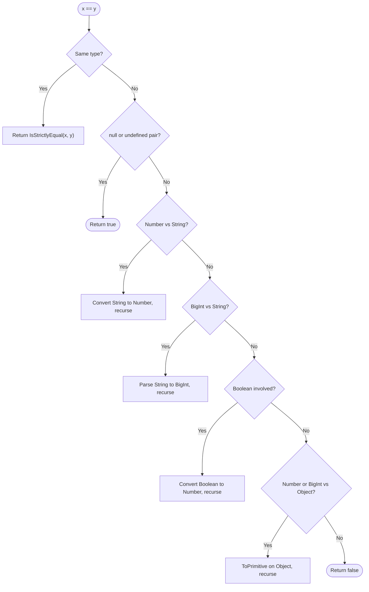
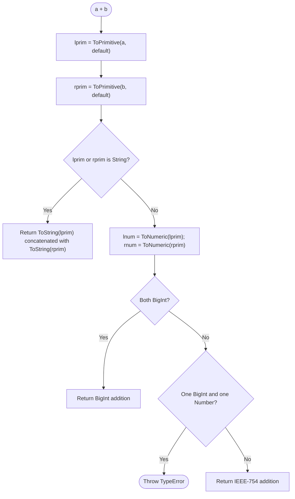

# 1.04 Type Coercion and Equality

> Type coercion is the silent contract JavaScript signs with every developer: the runtime will reshape values to fit operators, sometimes sensibly, sometimes absurdly. Mastering coercion means predicting the absurd before it ships to production.

## 1. Purpose

JavaScript was designed by Brendan Eich in roughly ten days during May 1995 as the embedded scripting language for the Netscape Navigator browser. Its original mission was modest and very much of its era: glue small bits of behavior onto web pages, react to form submissions, validate user input before a network round-trip, and mutate the document object model. In that context, web form values always arrived as strings, the DOM handed back strings for every attribute read, and most arithmetic performed on those values was a simple increment, a sum, or a concatenation. To make this pleasant for hobbyist scripters who had never written a typed expression in their lives, Eich made JavaScript a weakly typed language. The runtime would automatically convert between primitive types wherever an operator demanded a specific shape. This automatic conversion is coercion.

Coercion exists because the early web demanded it. A user types `42` into a quantity field. The script reads `field.value`, which is the string `"42"`. The script wants `field.value + 1`. A strictly typed language would force the programmer to write `parseInt(field.value, 10) + 1`. JavaScript, instead, lets you write `field.value + 1` and tries to do the right thing. Depending on whether you wanted numeric addition or string concatenation, that right thing is either `43` or `"421"`. This tradeoff, intended to reduce friction for novices, became the number one source of subtle bugs in the language for the next three decades.

Why is coercion the number one source of bugs? Because the rules are extensive, full of edge cases, and they interact with operator overloading and with prototype chains. The `+` operator does both arithmetic addition and string concatenation, and which one it picks depends on the result of `ToPrimitive` calls on its operands. The abstract equality operator `==` is the most notorious offender. The expression `[] == ![]` evaluates to `true`. The expression `null == 0` evaluates to `false`. The expression `"0" == false` evaluates to `true`. None of these results are intuitive. They are the inevitable consequence of a coercion algorithm specified in ECMAScript that tries to do the right thing for novice code and ends up producing surprising results for everyone else.

Strict equality `===` was introduced precisely to give programmers an escape hatch: compare values without coercion. If the types of the two operands differ, the answer is `false`, full stop. If the types match, the answer is whether the values are identical, with two known quirks. First, `NaN === NaN` is `false`. This violates the mathematical principle that any value equals itself. Second, `-0 === +0` is `true`. In most code this does not matter, but in mathematical libraries, animation curves, and division-by-zero checks the distinction between negative and positive zero is meaningful. A sign-aware zero lets you compute one-sided limits and detect direction of motion through zero.

`Object.is(x, y)` was added in ECMAScript 2015 to fix exactly those two defects. `Object.is(NaN, NaN)` returns `true`. `Object.is(-0, +0)` returns `false`. For all other inputs it behaves like `===`. This is why React uses `Object.is` in its dependency arrays and its state bailout check: it correctly detects when `NaN` dependencies change, and it correctly detects when a `0` becomes `-0` (which matters in some graphics code and physics simulations). It is also why `Map` and `Set` use a related operation called `SameValueZero` that fixes the NaN case but keeps the `+0 === -0` behavior, because most use cases of map keys do not care about signed zero.

The purpose of this note is to give you a complete, predictable mental model of every coercion and equality operation in the language. By the end you should be able to look at any `==`, `===`, or `Object.is` expression and immediately know the result and the algorithmic reason for that result. You should be able to implement `deepEqual` from scratch using `Object.is` as the leaf comparison. You should know precisely when `Object.is` is the right choice over `===`, and when `==` is acceptable in production code (answer: only for the `null` or `undefined` check).

## 2. Theory and Deep Dive

This section walks through the ECMAScript abstract operations that govern coercion and equality. The reference is the ECMAScript specification, formally Ecma-262. All operations described here exist as named abstract operations in the spec; they are not user-callable functions. They are invoked by syntactic constructs like operators, by calls to built-ins such as `String()`, `Number()`, and `Boolean()`, and by control-flow primitives.

### 2.1 ToPrimitive(input, hint)

`ToPrimitive` converts an input value to a primitive (non-object) value. It takes a `hint` argument which is one of the strings `"string"`, `"number"`, or `"default"`. The hint suggests which type the caller prefers, but it is only a suggestion; the object itself decides how to respond.

Algorithm (simplified to its essence):

1. If `input` is already a primitive (Undefined, Null, Boolean, Number, String, Symbol, BigInt), return `input` unchanged.
2. If `input` is an Object:
   a. If `input` has a `Symbol.toPrimitive` own or inherited method, call it with the hint as the sole argument. If the result is a primitive, return it. If the result is an object, throw a TypeError.
   b. Otherwise call `OrdinaryToPrimitive(input, hint)`.

The default hint is `"number"` for numeric operators (`-`, `*`, `/`, `%`, unary `+`, comparison operators), `"string"` for string contexts (template literals, `String()`, property access on objects when coercion is involved), and `"default"` for the `==` operator and the binary `+` operator. The `==` and `+` operators use `"default"` because they could legitimately go either numeric or string direction, and they want the object to choose.

### 2.2 OrdinaryToPrimitive(O, hint)

If `Symbol.toPrimitive` is not defined, the engine falls back to `OrdinaryToPrimitive`. This method picks an ordered pair of methods from the object's `toString` and `valueOf` properties and calls them in order.

- If hint is `"string"`: the order is `toString`, then `valueOf`.
- If hint is `"number"` or `"default"`: the order is `valueOf`, then `toString`.

For each method in the ordered pair:

1. Get the method from the object.
2. If it is callable, call it with `this` set to `O`.
3. If the result is a primitive, return it.
4. Otherwise continue to the next method.
5. If neither returns a primitive, throw a TypeError.

For plain objects, `Object.prototype.valueOf` returns the object itself (useless for primitive conversion), and `Object.prototype.toString` returns `"[object Object]"`. So `ToPrimitive({}, "number")` returns `"[object Object]"`.

For arrays, `Array.prototype.valueOf` inherits from `Object.prototype.valueOf` and returns the array itself, while `Array.prototype.toString` joins the elements with commas. So `ToPrimitive([1, 2, 3], "number")` returns `"1,2,3"`. The empty array `[]` returns `""`.

For `Date` objects, the spec grants a special case: when `OrdinaryToPrimitive` is invoked on a Date with the `"default"` hint, the spec pretends the hint was `"string"`. So `ToPrimitive(new Date(), "default")` returns the locale-formatted date string, not the timestamp number. This is the only built-in type with such a special case, and it exists because `+` on dates should produce a sensible string concatenation rather than a large timestamp.

### 2.3 Symbol.toPrimitive

A well-known symbol that, when defined on an object as a method, intercepts all `ToPrimitive` calls. The method receives the hint string as its sole argument and must return a primitive or throw a TypeError. Defining `Symbol.toPrimitive` is the modern, predictable way to control how your objects coerce.

JS:

```js
const money = {
  amount: 99,
  currency: "USD",
  [Symbol.toPrimitive](hint) {
    if (hint === "number") return this.amount;
    if (hint === "string") return `${this.currency} ${this.amount}`;
    return this.amount;
  }
};

console.log(+money);          // 99          (hint "number")
console.log(`${money}`);      // "USD 99"    (hint "string")
console.log(money + 1);       // 100         (hint "default", returns number, + goes numeric)
console.log("" + money);      // "99"        (default returns number, then ToString)
```

TS:

```ts
interface Money {
  amount: number;
  currency: string;
  [Symbol.toPrimitive](hint: "string" | "number" | "default"): number | string;
}

const money: Money = {
  amount: 99,
  currency: "USD",
  [Symbol.toPrimitive](hint: "string" | "number" | "default") {
    if (hint === "number") return this.amount;
    if (hint === "string") return `${this.currency} ${this.amount}`;
    return this.amount;
  }
};

const asNumber: number = +money;
const asString: string = `${money}`;
const summed: number = money + 1;
const concatenated: string = "" + money;
```

For a deeper treatment of well-known symbols, see [[1.32 Well-Known Symbols]].

### 2.4 ToNumber

`ToNumber(argument)` converts any value to a Number. Highlights:

- Undefined → NaN
- Null → +0
- True → 1
- False → +0
- Number → itself
- String → parsed via the StringNumericLiteral grammar: empty or whitespace-only string → +0, `"42"` → 42, `"0x1F"` → 31, `"1e3"` → 1000, `"0b101"` → 5, `"0o17"` → 15, `"  42  "` → 42, anything unparsable → NaN
- Symbol → throws TypeError
- BigInt → throws TypeError (when implicit; explicit `Number(0n)` returns 0)
- Object → `ToNumber(ToPrimitive(argument, "number"))`

Note the asymmetry: `Number(null)` is `0` but `Number(undefined)` is `NaN`. This asymmetry propagates into arithmetic: `null + 1` is `1`, while `undefined + 1` is `NaN`.

### 2.5 ToString

`ToString(argument)`:

- Undefined → `"undefined"`
- Null → `"null"`
- True → `"true"`
- False → `"false"`
- Number → per the Number-to-String algorithm; e.g., `0` → `"0"`, `NaN` → `"NaN"`, `Infinity` → `"Infinity"`, `-0` → `"0"` (note the loss of sign in the standard conversion; `String(-0)` returns `"0"` even though `Object.is(-0, 0)` is false)
- String → itself
- Symbol → throws TypeError
- BigInt → decimal string, e.g., `123n` → `"123"`
- Object → `ToString(ToPrimitive(argument, "string"))`

### 2.6 ToBoolean

`ToBoolean(argument)` is the simplest. The full table:

- Undefined → false
- Null → false
- False → false
- 0, -0, NaN → false
- `""` (empty string) → false
- All other numbers, non-empty strings, BigInts → true
- Symbol → true
- Object → true (always, even `new Boolean(false)`, `new String("")`, `new Number(0)`)

The falsy list is therefore exactly six values: `undefined`, `null`, `false`, `0` (and its twin `-0`), `NaN`, and `""`. Everything else is truthy. Memorize this list. Everything you need to know about `if`, ternaries, `&&`, `||`, `!`, and `??` flows from this list.

### 2.7 ToNumeric

`ToNumeric(value)`:

1. Let `prim = ToPrimitive(value, "number")`.
2. If prim is a BigInt, return prim.
3. Otherwise return `ToNumber(prim)`.

Used by `*`, `/`, `%`, and the bitwise operators so they accept BigInts without coercion.

### 2.8 SameValue(x, y)

The abstract operation behind `Object.is`:

1. If `Type(x) !== Type(y)`, return false.
2. If Type is Number:
   a. If x is NaN and y is NaN, return true.
   b. If x is +0 and y is -0, return false.
   c. If x is -0 and y is +0, return false.
   d. If x is the same Number value as y, return true.
   e. Otherwise return false.
3. Otherwise return `SameValueNonNumber(x, y)` (which is basically `===` for non-Number types).

### 2.9 SameValueZero(x, y)

Identical to `SameValue` except +0 and -0 are considered equal. Used by `Map` and `Set` key comparison. The choice was deliberate: most map and set use cases do not care about signed zero, but they do care about NaN (otherwise you could never look up a NaN key after inserting one).

### 2.10 IsStrictlyEqual(x, y)

The abstract operation behind `===`:

1. If `Type(x) !== Type(y)`, return false.
2. If Type is Number:
   a. If x is NaN or y is NaN, return false.
   b. If x is +0 and y is -0, return true.
   c. If x is -0 and y is +0, return true.
   d. Return x is the same Number value as y.
3. Otherwise return `SameValueNonNumber(x, y)`.

The key contrast with `SameValue` is that strict equality treats +0 and -0 as equal, and treats NaN as not equal to itself.

### 2.11 IsLooselyEqual(x, y)

The abstract operation behind `==`. This is the full algorithm, abbreviated for clarity but accurate:

1. If `Type(x) === Type(y)`, return `IsStrictlyEqual(x, y)`.
2. If x is Null and y is Undefined, return true.
3. If x is Undefined and y is Null, return true.
4. If x is Number and y is String, return `IsLooselyEqual(x, ToNumber(y))`.
5. If x is String and y is Number, return `IsLooselyEqual(ToNumber(x), y)`.
6. If x is BigInt and y is String, attempt to parse y as BigInt; if successful recurse, else false.
7. If x is String and y is BigInt, symmetric.
8. If x is Boolean, return `IsLooselyEqual(ToNumber(x), y)`.
9. If y is Boolean, return `IsLooselyEqual(x, ToNumber(y))`.
10. If x is Number or BigInt, and y is Object, return `IsLooselyEqual(x, ToPrimitive(y))` with default hint.
11. If x is Object and y is Number or BigInt, symmetric.
12. Otherwise return false.

Notable consequences:

- Symbol vs anything except Symbol returns false (no coercion rule covers Symbols).
- Symbol vs Symbol falls through to `IsStrictlyEqual`, which is reference equality.
- BigInt vs Number compares numerically if both are finite integers.
- Null and Undefined are loosely equal to each other and to nothing else.
- Comparing a Symbol to a non-Symbol primitive via `==` actually throws a TypeError, because the conversion attempts to call `ToPrimitive` on the Symbol or `ToString` on the Symbol, both of which throw.

The Mermaid flowchart below captures the algorithm visually:



### 2.12 The Coercion Matrix

For `==` purposes, the most useful mental model is a table showing what `==` does for each combination of primitive types. Objects coerce via `ToPrimitive` first, so once you reduce both operands to primitives the table covers everything.

| Left vs Right | Undefined | Null | Boolean | Number | String | Symbol | BigInt |
|---|---|---|---|---|---|---|---|
| Undefined | true | true | false | false | false | false | false |
| Null | true | true | false | false | false | false | false |
| Boolean | false | false | falls to strict | ToNum(bool) vs num | ToNum(bool) vs ToNum(str) | false | ToNum(bool) vs big |
| Number | false | false | ToNum(bool) vs num | falls to strict | num vs ToNum(str) | false | num vs big |
| String | false | false | ToNum(str) vs ToNum(bool) | ToNum(str) vs num | falls to strict | false | parse str to big |
| Symbol | false | false | false | false | false | falls to strict | false |
| BigInt | false | false | ToNum(bool) vs big | big vs num | parse str to big | false | falls to strict |

The diagonal cells "falls to strict" are where `==` reduces to `===` because types match. The top-left two-by-two quadrant shows the famous `null == undefined` rule. The Symbol row and column are entirely false except for the diagonal, because Symbols refuse to coerce.

### 2.13 The + operator algorithm

The `+` operator (the `AdditiveExpression` evaluation) is specified as follows:

1. Let `lval` be the result of evaluating the left operand.
2. Let `rval` be the result of evaluating the right operand.
3. Let `lprim = ToPrimitive(lval)`. (Hint is `"default"`.)
4. Let `rprim = ToPrimitive(rval)`. (Hint is `"default"`.)
5. If `Type(lprim) === String` OR `Type(rprim) === String`:
   a. Let `lstr = ToString(lprim)`.
   b. Let `rstr = ToString(rprim)`.
   c. Return the string concatenation `lstr + rstr`.
6. Otherwise:
   a. Let `lnum = ToNumeric(lprim)`.
   b. Let `rnum = ToNumeric(rprim)`.
   c. If both are BigInt, do BigInt addition.
   d. If both are Number, do IEEE-754 double-precision addition.
   e. If one is BigInt and the other is Number, throw a TypeError.
   f. Return the result.

Key insight: `+` calls `ToPrimitive` with the `"default"` hint (not `"number"`). For most objects this is equivalent to `"number"`, because `OrdinaryToPrimitive` treats default and number identically. The exception is `Date`, where the spec maps `"default"` to `"string"`. So `new Date(0) + 1` returns a string like `"Thu Jan 01 1970 00:00:00 GMT+0000 (Coordinated Universal Time)1"`, while `new Date(0) - 1` returns the numeric timestamp minus 1.

This is why `1 + "1"` becomes `"11"`: `ToPrimitive("1")` is `"1"`, and since one side is a string, the operator does string concat. But `"1" - 1` is `0` because the `-` operator only does numeric subtraction: it calls `ToNumeric` on both sides, so `"1"` becomes `1`, and `1 - 1` equals `0`.

The Mermaid flowchart for `+`:



### 2.14 Operator hint summary

For reference, here is which hint each operator or built-in uses when calling `ToPrimitive` on an object operand:

- `+` (binary): `"default"`
- `==` (when one side is Object): `"default"`
- `-`, `*`, `/`, `%`: `"number"` (via `ToNumeric`)
- `<`, `>`, `<=`, `>=`: `"number"` (with a special case for both-String that does lexicographic comparison)
- Unary `+`, `-`: `"number"`
- Template literal interpolation: `"string"`
- `String(x)`: `"string"`
- `Number(x)`: `"number"`
- Property access `obj[expr]` (when `expr` is converted to a property key): `"string"` for objects
- `in` operator: the right operand is treated as a map and never coerced

### 2.15 The || vs ?? distinction

The `||` operator returns the first truthy operand, else the last operand. The `??` operator (nullish coalescing, ES2020) returns the first operand that is not `null` and not `undefined`, else the last operand.

The difference matters when the input is `0`, `""`, `false`, or `NaN`. With `||`, those falsy values are replaced by the right operand. With `??`, they are preserved.

JS:

```js
const count = 0;
const a = count || 10;   // 10   (0 is falsy, replaced)
const b = count ?? 10;   // 0    (0 is not null or undefined, preserved)

const name = "";
const c = name || "Anonymous"; // "Anonymous"
const d = name ?? "Anonymous"; // ""
```

TS:

```ts
const count: number | null | undefined = 0;
const a: number = count || 10;   // number
const b: number = count ?? 10;   // number

function greet(name: string | null | undefined): string {
  return name ?? "Anonymous";
}
```

Use `??` whenever you specifically mean "default when null or undefined." Use `||` when you mean "default when falsy." They are not interchangeable.

## 3. Mental Models

Three operators, three mental models. Memorize these one-liners and you have already halved your bug surface.

**`==`** Compare values, coerce if different types. The operator is willing to massage the operands until their types match, then compare. The massaging rules are extensive and produce surprising results. The exceptions are `null` and `undefined`: `null == undefined` is `true`, and nothing else loosely equals either of them. So `null == 0`, `null == false`, `null == ""` are all `false`.

**`===`** Compare types first, then values, no coercion. If the types differ, the answer is `false`. If the types match, the answer is whether the values are identical. For objects this is reference equality (two references to the same object are equal; two structurally identical but distinct objects are not). For numbers this is bit-pattern equality, with the caveats that NaN never equals NaN, and -0 and +0 are equal.

**`Object.is`** Same as `===`, but with NaN and -0 fixed. `Object.is(NaN, NaN)` is `true`. `Object.is(-0, +0)` is `false`. Otherwise it behaves exactly like `===`.

The 7-by-7 coercion matrix in section 2.12 is your lookup table for `==`. Memorize the diagonals (where types match, you fall through to `===`) and the null/undefined row and column (those two are the only loose-equals pair). Everything else in the matrix reduces through `ToNumber` or `ToPrimitive` until both sides are the same type.

The `+` operator model: If either side, after `ToPrimitive` with the default hint, is a string, do string concatenation. Otherwise do numeric add. A common mistake is to think that `+` calls `ToPrimitive` with `"number"` hint. It does not; it uses `"default"`. For most objects this is irrelevant because default and number behave the same. The exception is `Date`, where default behaves like string.

A useful unifying model is the "preferred type" model. Every operator and every built-in conversion function has a preferred type. Numeric operators prefer number. String contexts prefer string. The `==` and `+` operators are undecided and ask the object itself via the `"default"` hint. The object's response, via `Symbol.toPrimitive` or `valueOf` and `toString`, then determines what happens next.

For `||` and `??`, the model is: `||` returns the first truthy operand, `??` returns the first non-nullish operand. The falsy list (`undefined`, `null`, `false`, `0`, `NaN`, `""`) is the universe of values `||` skips. The nullish list (`undefined`, `null`) is the universe of values `??` skips.

## 4. Real-World Use Cases

### 4.1 Libraries use ===

Lodash uses `===` everywhere internally. So does Ramda, Underscore, and most modern utility libraries. Their `eq` functions all map to `===` for primitives. This is because `===` is the only equality operator with predictable semantics across all primitive types, and its two known quirks (NaN, signed zero) are easy to handle explicitly with `Number.isNaN` and `Object.is` when needed.

Libraries that need to handle NaN correctly (such as React, Mocha, and Lodash's `isEqual`) reach for `Object.is` at the leaf level of recursive comparison. The pattern is: recurse into structures, but at the leaves compare with `Object.is` rather than `===`. This is what `deepEqual` should always do.

### 4.2 React's Object.is dependency check

React's `useMemo`, `useCallback`, `useEffect`, and `useState` all use `Object.is` for the dependency array comparison and the state bailout check. Why not `===`? Consider:

```js
const [count, setCount] = useState(NaN);
setCount(prev => prev + 1); // NaN + 1 is NaN
```

If React used `===` for the bail-out check `nextState === prevState`, the check would always be `true` for NaN states (because NaN never equals NaN), and the component would never re-render. With `Object.is`, NaN equals NaN, so the bail-out check correctly detects that the new state is the same NaN and skips the re-render.

But the more important case is the dependency array. If a dependency is NaN, you almost certainly want `useMemo` to recompute, because the NaN almost certainly came from a computation whose inputs changed. With `===`, the comparison `prevDeps[i] === nextDeps[i]` would always be `true` for NaN, and `useMemo` would skip the recompute. With `Object.is`, NaN is detected as same NaN, which means stable NaN inputs do not cause spurious recomputes. Either way, `Object.is` is the correct choice.

The same logic applies to signed zero. A 3D graphics application might track the velocity of an object along the x-axis. If the velocity crosses zero from positive to negative, the value changes from `+0` to `-0`. With `===`, React would not detect the change. With `Object.is`, it would.

### 4.3 == null as the idiomatic null-check

The idiomatic null-or-undefined check in production code is `x == null`, which is `true` only when `x` is `null` or `undefined`. This is shorter than `x === null || x === undefined`, and arguably clearer in intent: the reader immediately sees "the author wants to handle the absence case."

The Airbnb ESLint style guide, in its earlier versions, forbade `==` entirely. The argument was that consistency is more valuable than the slight brevity win. Many teams have since relaxed this rule for the specific case of `== null`, because the alternative is genuinely worse. The TypeScript ESLint `eqeqeq` rule supports an `"always, null"` option that permits `== null` while banning every other use of `==`.

TS:

```ts
// eslint config: eqeqeq: ["error", "always", { null: "ignore" }]

function process(value: string | null | undefined): void {
  if (value == null) {
    // value is narrowed to null | undefined
    return;
  }
  // value is narrowed to string
  console.log(value.toUpperCase());
}
```

TypeScript's control-flow analysis understands `value == null` as equivalent to `value === null || value === undefined` for narrowing purposes, so the type system is consistent with the runtime.

### 4.4 TypeScript narrowing with unknown and type guards

When you receive untrusted input (parsed JSON from `JSON.parse`, network payloads from `fetch`, postMessage events from another window, command-line arguments in Node), you should type it as `unknown` and narrow with type guards. The narrowing uses `===` (or `typeof`, `instanceof`, `in`, or a custom type predicate). TypeScript's control-flow analysis understands:

```ts
function handle(value: unknown): void {
  if (typeof value === "string") {
    value.toUpperCase(); // OK, narrowed to string
  }
  if (value === null) {
    // narrowed to null
    console.log("got null");
  }
  if (Array.isArray(value)) {
    // narrowed to unknown[]
    console.log(value.length);
  }
}

function isUser(x: unknown): x is { id: string; name: string } {
  if (typeof x !== "object" || x === null) return false;
  const obj = x as Record<string, unknown>;
  return (
    typeof obj.id === "string" &&
    typeof obj.name === "string"
  );
}
```

See [[2.03 Type Assertions and Guards]] and [[2.05 Unions and Intersections]] for the full narrowing story.

### 4.5 Map and Set key equality

`Map` and `Set` use `SameValueZero` for key comparison. This means:

- `NaN` is treated as equal to `NaN` (you can look up a NaN key after inserting one).
- `+0` and `-0` are treated as the same key.

This is a deliberate compromise. Using `===` would make NaN keys un-look-up-able (because `NaN === NaN` is false). Using `Object.is` would treat `+0` and `-0` as distinct keys, which would surprise most users. `SameValueZero` is the right choice for general-purpose keyed collections.

JS:

```js
const m = new Map();
m.set(NaN, "nan-value");
console.log(m.get(NaN)); // "nan-value"

m.set(0, "zero");
m.set(-0, "neg-zero"); // overwrites, because -0 and +0 are the same key
console.log(m.get(0));  // "neg-zero"
console.log(m.size);    // 2 (NaN, 0)
```

TS:

```ts
const m = new Map<number, string>();
m.set(NaN, "nan-value");
const v: string | undefined = m.get(NaN);

m.set(0, "zero");
m.set(-0, "neg-zero");
const z: string | undefined = m.get(0);
```

### 4.6 Caching and memoization

When implementing a memoization cache, the cache key comparison should use `Object.is` (or `SameValueZero` if you want Map-like behavior) so that NaN inputs are correctly handled. With `===`, a function called with NaN would never hit the cache and would recompute every time.

JS:

```js
function memoize(fn) {
  const cache = new Map();
  return function (arg) {
    for (const [key, value] of cache) {
      if (Object.is(key, arg)) return value;
    }
    const result = fn(arg);
    cache.set(arg, result);
    return result;
  };
}
```

TS:

```ts
function memoize<T, R>(fn: (arg: T) => R): (arg: T) => R {
  const cache = new Map<T, R>();
  return function (arg: T): R {
    for (const [key, value] of cache) {
      if (Object.is(key, arg)) return value;
    }
    const result = fn(arg);
    cache.set(arg, result);
    return result;
  };
}
```

## 5. Code Examples

### 5.1 Example A — Minimal and Conceptual

Goal: survey every surprising `==` outcome in a single file, side by side in JS and TS.

JS:

```js
// 5.1a JS — every surprising == outcome
const outcomes = [
  ["0 == false",                   0 == false],
  ["\"\" == false",                "" == false],
  ["\"0\" == false",               "0" == false],
  ["null == undefined",            null == undefined],
  ["null == 0",                    null == 0],
  ["null == false",                null == false],
  ["undefined == false",           undefined == false],
  ["NaN == NaN",                   NaN == NaN],
  ["NaN === NaN",                  NaN === NaN],
  ["Object.is(NaN, NaN)",          Object.is(NaN, NaN)],
  ["[] == false",                  [] == false],
  ["[] == 0",                      [] == 0],
  ["[] == \"\"",                   [] == ""],
  ["[1] == 1",                     [1] == 1],
  ["[1,2] == \"1,2\"",             [1,2] == "1,2"],
  ["[null] == \"\"",               [null] == ""],
  ["[undefined] == \"\"",          [undefined] == ""],
  ["{} == \"[object Object]\"",    {} == "[object Object]"],
  ["Symbol() == Symbol()",         Symbol() == Symbol()],
  ["-0 === +0",                    -0 === +0],
  ["Object.is(-0, +0)",            Object.is(-0, +0)],
];

for (const [label, value] of outcomes) {
  console.log(label.padEnd(34), value);
}
```

TS:

```ts
// 5.1b TS — the same survey with types and const assertions
type Outcome = readonly [label: string, value: boolean];

const outcomes: readonly Outcome[] = [
  ["0 == false",                   0 == false],
  ["\"\" == false",                "" == false],
  ["\"0\" == false",               "0" == false],
  ["null == undefined",            null == undefined],
  ["null == 0",                    null == 0],
  ["null == false",                null == false],
  ["undefined == false",           undefined == false],
  ["NaN == NaN",                   NaN == NaN],
  ["NaN === NaN",                  NaN === NaN],
  ["Object.is(NaN, NaN)",          Object.is(NaN, NaN)],
  ["[] == false",                  [] == false],
  ["[] == 0",                      [] == 0],
  ["[] == \"\"",                   [] == ""],
  ["[1] == 1",                     [1] == 1],
  ["[1,2] == \"1,2\"",             [1,2] == "1,2"],
  ["[null] == \"\"",               [null] == ""],
  ["[undefined] == \"\"",          [undefined] == ""],
  ["{} == \"[object Object]\"",    {} == "[object Object]"],
  ["Symbol() == Symbol()",         Symbol() == Symbol()],
  ["-0 === +0",                    -0 === +0],
  ["Object.is(-0, +0)",            Object.is(-0, +0)],
] as const;

for (const [label, value] of outcomes) {
  console.log(label.padEnd(34), value);
}
```

The output (same for both):

```
0 == false                       true
"" == false                      true
"0" == false                     true
null == undefined                true
null == 0                        false
null == false                    false
undefined == false               false
NaN == NaN                       false
NaN === NaN                      false
Object.is(NaN, NaN)              true
[] == false                      true
[] == 0                          true
[] == ""                         true
[1] == 1                         true
[1,2] == "1,2"                   true
[null] == ""                     true
[undefined] == ""                true
{} == "[object Object]"          true
Symbol() == Symbol()             false
-0 === +0                        true
Object.is(-0, +0)                false
```

### 5.2 Example B — Production-Grade deepEqual

A production `deepEqual` should:

- Use `Object.is` as the leaf comparison (handles NaN correctly).
- Handle `Date`, `RegExp`, `Map`, `Set`.
- Handle plain objects and arrays recursively.
- Track visited objects to break cycles.
- Compare own keys (including symbol keys) by length and then by value.
- Not be fooled by wrapper objects or by prototype differences.

JS:

```js
// 5.2a JS — production deepEqual
function deepEqual(a, b, seen = new WeakSet()) {
  if (Object.is(a, b)) return true;
  if (a === null || b === null) return false;
  if (typeof a !== "object" || typeof b !== "object") return false;

  if (seen.has(a)) return false;
  seen.add(a);

  if (a instanceof Date && b instanceof Date) {
    return a.getTime() === b.getTime();
  }
  if (a instanceof RegExp && b instanceof RegExp) {
    return a.source === b.source && a.flags === b.flags;
  }
  if (a instanceof Map && b instanceof Map) {
    if (a.size !== b.size) return false;
    for (const [k, v] of a) {
      if (!b.has(k) || !deepEqual(v, b.get(k), seen)) return false;
    }
    return true;
  }
  if (a instanceof Set && b instanceof Set) {
    if (a.size !== b.size) return false;
    for (const v of a) {
      let found = false;
      for (const w of b) {
        if (deepEqual(v, w, seen)) { found = true; break; }
      }
      if (!found) return false;
    }
    return true;
  }

  if (Array.isArray(a) !== Array.isArray(b)) return false;
  const aKeys = Reflect.ownKeys(a);
  const bKeys = Reflect.ownKeys(b);
  if (aKeys.length !== bKeys.length) return false;
  for (const key of aKeys) {
    if (!Reflect.has(b, key)) return false;
    if (!deepEqual(a[key], b[key], seen)) return false;
  }
  return true;
}

// Sanity tests
console.log(deepEqual({ a: [1, { b: NaN }] }, { a: [1, { b: NaN }] })); // true
console.log(deepEqual(new Date(0), new Date(0)));                       // true
console.log(deepEqual(/foo/g, /foo/g));                                 // true
console.log(deepEqual(new Map([[1, 2]]), new Map([[1, 2]])));           // true
console.log(deepEqual(new Set([1, 2]), new Set([2, 1])));               // true
console.log(deepEqual({ a: 1 }, { a: 1, b: 2 }));                       // false
```

TS:

```ts
// 5.2b TS — production deepEqual with full typing
type DeepEqual = (a: unknown, b: unknown, seen?: WeakSet<object>) => boolean;

const deepEqual: DeepEqual = (a, b, seen = new WeakSet()) => {
  if (Object.is(a, b)) return true;
  if (a === null || b === null) return false;
  if (typeof a !== "object" || typeof b !== "object") return false;

  const aObj = a as object;
  const bObj = b as object;

  if (seen.has(aObj)) return false;
  seen.add(aObj);

  if (a instanceof Date && b instanceof Date) {
    return a.getTime() === b.getTime();
  }
  if (a instanceof RegExp && b instanceof RegExp) {
    return a.source === b.source && a.flags === b.flags;
  }
  if (a instanceof Map && b instanceof Map) {
    if (a.size !== b.size) return false;
    const bMap = b as Map<unknown, unknown>;
    for (const [k, v] of a.entries()) {
      if (!bMap.has(k) || !deepEqual(v, bMap.get(k), seen)) return false;
    }
    return true;
  }
  if (a instanceof Set && b instanceof Set) {
    if (a.size !== b.size) return false;
    const bSet = b as Set<unknown>;
    for (const v of a) {
      let found = false;
      for (const w of bSet) {
        if (deepEqual(v, w, seen)) { found = true; break; }
      }
      if (!found) return false;
    }
    return true;
  }

  const aIsArr = Array.isArray(a);
  const bIsArr = Array.isArray(b);
  if (aIsArr !== bIsArr) return false;

  const aKeys = Reflect.ownKeys(aObj);
  const bKeys = Reflect.ownKeys(bObj);
  if (aKeys.length !== bKeys.length) return false;
  const aRec = a as Record<PropertyKey, unknown>;
  const bRec = b as Record<PropertyKey, unknown>;
  for (const key of aKeys) {
    if (!Reflect.has(bObj, key)) return false;
    if (!deepEqual(aRec[key], bRec[key], seen)) return false;
  }
  return true;
};

// Sanity tests
console.log(deepEqual({ a: [1, { b: NaN }] }, { a: [1, { b: NaN }] })); // true
console.log(deepEqual(new Date(0), new Date(0)));                       // true
console.log(deepEqual(/foo/g, /foo/g));                                 // true
console.log(deepEqual(new Map([[1, 2]]), new Map([[1, 2]])));           // true
console.log(deepEqual(new Set([1, 2]), new Set([2, 1])));               // true
console.log(deepEqual({ a: 1 }, { a: 1, b: 2 }));                       // false
```

## 6. Common Mistakes and Anti-Patterns

### 6.1 [] == ![] is true

Trace, step by step:

1. Evaluate `![]`. Arrays are truthy objects, so `![]` is `false`.
2. The expression becomes `[] == false`.
3. Step 9 of the abstract equality algorithm applies: y is Boolean. Convert y to Number: `ToNumber(false) = 0`.
4. The expression becomes `[] == 0`.
5. Step 10 applies: x is Object, y is Number. Convert x via `ToPrimitive(x)` (default hint).
6. `ToPrimitive([], "default")` calls `OrdinaryToPrimitive([], "default")`, which tries `valueOf` (returns the array, not a primitive) then `toString`. `Array.prototype.toString` on `[]` returns `""`.
7. The expression becomes `"" == 0`.
8. Step 5 applies: x is String, y is Number. Convert x to Number: `ToNumber("") = 0`.
9. The expression becomes `0 == 0`.
10. Both are Number, fall through to `IsStrictlyEqual`, which is `true`.

Result: `true`.

### 6.2 null == 0 is false

The null/undefined pair is the only special-cased pair in the abstract equality algorithm. After the same-type check and the null/undefined special case, no further rule applies to null vs Number. The algorithm falls through to step 12, which returns false.

This is the famous "the spec authors could not agree on whether null should coerce to 0" decision. The result is that `null == 0`, `null == false`, `null == ""` are all false, even though `ToNumber(null) === 0`. The rule is that null only loosely equals undefined and itself.

### 6.3 NaN == NaN is false

Both `==` and `===` fall through to the Number-vs-Number case, which explicitly says NaN never equals NaN. The IEEE-754 specification defines NaN as unordered with respect to every value including itself. Use `Number.isNaN(x)` to test for NaN. `Object.is(NaN, NaN)` is `true`. `isNaN(x)` is unsafe because it coerces: `isNaN("hello")` is `true` even though `"hello"` is not NaN.

### 6.4 "0" == false is true

Trace:

1. `false` is Boolean. Apply step 9: convert to Number: `ToNumber(false) = 0`.
2. Expression becomes `"0" == 0`.
3. Step 5 applies: x is String, y is Number. Convert x to Number: `ToNumber("0") = 0`.
4. Expression becomes `0 == 0`, which is `true`.

Note that `"0" === false` is `false` because the types differ. The trap is that `if ("0")` runs the truthy branch (because `"0"` is a non-empty string and therefore truthy), but `"0" == false` is true. So `if (x)` and `if (x == false)` can give opposite answers for the same `x`.

### 6.5 [1] == 1 is true

Trace:

1. x is Object, y is Number. Apply step 10: `ToPrimitive([1])` (default hint).
2. `Array.prototype.toString` on `[1]` returns `"1"`.
3. Expression becomes `"1" == 1`.
4. Step 5: convert string to Number: `ToNumber("1") = 1`.
5. Expression becomes `1 == 1`, which is `true`.

The same logic gives `[1,2] == "1,2"`, `[null] == ""`, `[undefined] == ""`, and `[] == ""`.

### 6.6 {} + [] vs [] + {}

The classic ASI (automatic semicolon insertion) trap. At the top level of a script or REPL, `{}` is parsed as a block statement, not an object literal. So:

```js
{} + []
```

is parsed as: an empty block statement `{}`, followed by `+[]` which is a unary plus on an array. `+[]` is `ToNumber(ToPrimitive([], "number"))` which is `ToNumber("")` which is `0`. So the expression evaluates to `0` (the empty block produces nothing).

```js
[] + {}
```

is parsed as: array literal `[]` plus object literal `{}`. `ToPrimitive([])` is `""`, `ToPrimitive({})` is `"[object Object]"`. Both are strings, so `+` does string concat: `"" + "[object Object]"` is `"[object Object]"`.

When wrapped in parentheses `({} + [])`, the curly braces are forced to be an object literal, so the result is `"[object Object]"` too.

The lesson is that ASI can interact with the dual nature of `{}` (block vs object literal) and with `+` (binary vs unary) to produce surprising results. Always wrap object literals in parentheses when they appear at the start of a statement.

### 6.7 Symbol() == "" throws TypeError

The abstract equality algorithm has no rule for Symbol vs String. Step 12 says "otherwise return false". But there is a subtlety: when one operand is Symbol and the other is a non-Symbol primitive that would normally coerce, the spec throws a TypeError specifically to prevent silent coercion of Symbols. In practice, `Symbol() == ""` throws `TypeError: Cannot convert a Symbol value to a string`. This is one of the only cases where `==` throws.

The same applies to `Symbol() == 0` and `Symbol() + ""`. Symbols defend themselves against implicit coercion.

### 6.8 Using isNaN instead of Number.isNaN

The global `isNaN(x)` function coerces its argument to Number first. So `isNaN("hello")` is `true` (because `ToNumber("hello")` is NaN), even though `"hello"` is not NaN. Use `Number.isNaN(x)` which does not coerce and only returns true for actual NaN values.

The same trap exists for `isFinite` vs `Number.isFinite`. `isFinite("42")` is `true` (because `ToNumber("42")` is 42, which is finite). `Number.isFinite("42")` is `false` (because the argument is not a Number).

### 6.9 Wrapper objects are truthy

```js
const a = new Boolean(false);
if (a) {
  console.log("this runs!"); // because a is an object, and objects are truthy
}
```

`new Boolean(false)` is an object. Objects are always truthy. So `if (a)` runs the truthy branch even though `a` wraps `false`. The same applies to `new Number(0)` and `new String("")`. Never use wrapper objects. Use the primitive literals `false`, `0`, `""`.

This also breaks `===`: `new Boolean(false) === new Boolean(false)` is `false` (two distinct object references). And `new Boolean(false) === false` is `false` (object vs primitive). Wrapper objects are a footgun in every direction.

### 6.10 Implicit string-to-number via subtraction

```js
"5" - 2    // 3   (numeric subtraction, "5" coerces to 5)
"5" + 2    // "52" (string concat, because + sees a string)
```

The asymmetry is by design: `-` is unambiguously numeric, so it coerces both sides to Number. `+` is overloaded, so it picks concat when either side is a string. Programmers who rely on implicit coercion in subtraction get a nasty surprise when they switch to addition. Always coerce explicitly: `Number("5") + 2` is unambiguous.

### 6.11 Truthy checks on 0 and ""

```js
function printCount(count) {
  if (count) {
    console.log(`Got ${count} items`);  // skipped when count is 0!
  }
}
printCount(0); // nothing prints
```

The `if (count)` check fails when `count` is `0`, because `0` is falsy. The correct check is `if (count != null)` or `if (typeof count === "number")` or simply `if (count !== undefined && count !== null)`. The same trap applies to empty strings: `if (name)` fails when `name` is `""`.

## 7. Best Practices and Design Patterns

1. **Default to `===` and `Object.is`.** Use `===` for general equality. Use `Object.is` when NaN matters (caching, memoization, dependency arrays, deep equality leaves).

2. **Use `== null` only for null-or-undefined checks.** This is the only idiomatic use of `==` in modern code. It is shorter and clearer than `x === null || x === undefined`, and TypeScript narrows it correctly.

3. **Configure ESLint `eqeqeq`.** Use `eqeqeq: ["error", "always", { null: "ignore" }]` to ban `==` everywhere except `== null`. This catches the vast majority of accidental `==` usage.

4. **Use TypeScript `unknown` for untrusted input.** Type `JSON.parse`, `fetch` responses, `postMessage` event data, and CLI args as `unknown`. Narrow with `typeof`, `instanceof`, `in`, and custom type predicates. See [[2.03 Type Assertions and Guards]].

5. **Never use wrapper objects.** `new Boolean(false)`, `new Number(0)`, `new String("")` are objects, not primitives, and they behave truthily in boolean contexts. Use the primitive literals.

6. **Document intentional coercion in JSDoc.** If you must use `==` (e.g., for legacy interop), add a JSDoc comment explaining why:

```ts
/**
 * Compares legacy IDs, which may arrive as number or string.
 * Intentional == to allow "42" to match 42.
 * @param a - first id
 * @param b - second id
 * @returns true if the values match after coercion
 */
function idEquals(a: string | number, b: string | number): boolean {
  return a == b;
}
```

7. **Use `Number.isNaN` not `isNaN`.** The global `isNaN` coerces, which leads to false positives. `Number.isNaN` only returns true for actual NaN values.

8. **For library authors, prefer `Object.is` at equality leaves.** When implementing recursive equality, deep equality, or memoization, use `Object.is` rather than `===` to handle NaN correctly.

9. **For numeric comparisons, use `Number.isFinite` not `isFinite`.** The global `isFinite` coerces its argument, so `isFinite("42")` is `true`. `Number.isFinite("42")` is `false`.

10. **For integer comparisons, consider BigInt.** If you are comparing integers larger than `2^53 - 1`, use BigInt. BigInt does not coerce to or from Number implicitly; you must call `BigInt(n)` or `Number(b)` explicitly, and the latter loses precision.

11. **Implement `Symbol.toPrimitive` on custom money-like classes.** If you have a `Money` or `Temperature` or `Distance` value object, define `Symbol.toPrimitive` so that `+money` gives the numeric amount, `${money}` gives a formatted string, and `money + 1` gives a sensible numeric result.

12. **Never override `valueOf` or `toString` without understanding the consequences.** Both methods are called by `ToPrimitive`. If you override only one, the other still applies. If you override both, be aware that the order in which they are called depends on the hint. Prefer `Symbol.toPrimitive` for new code.

13. **Use `??` over `||` for null-or-undefined defaults.** `||` treats `0`, `""`, and `false` as absent. `??` only treats `null` and `undefined` as absent. Choose based on intent, not habit.

14. **For deep equality, prefer a library.** Lodash `isEqual`, fast-deep-equal, or React's internal ` shallowEqual` are battle-tested. Hand-rolled `deepEqual` is a learning exercise, but in production the libraries handle more edge cases (typed arrays, error objects, buffers, etc.).

## 8. Technical Interview Knowledge

**Q1. Walk me through `[] == ![]`.**

Step by step: `![]` evaluates to `false` because arrays are truthy objects. The expression becomes `[] == false`. The abstract equality algorithm sees a Boolean on the right, converts it to Number via `ToNumber(false) = 0`. Now we have `[] == 0`. The algorithm sees an Object on the left, converts it via `ToPrimitive([], "default")`. For an array, `valueOf` returns the array itself (useless), so the algorithm falls through to `toString`, which returns `""`. Now we have `"" == 0`. The algorithm sees a String on the left and a Number on the right, converts the String to Number via `ToNumber("") = 0`. Now we have `0 == 0`. Same type, fall through to `IsStrictlyEqual`, which is `true`. Result: `true`.

**Q2. What does `Object.is` do differently from `===`?**

Two differences. First, `Object.is(NaN, NaN)` is `true`, while `NaN === NaN` is `false`. This is because `Object.is` uses the `SameValue` abstract operation, which explicitly handles NaN as equal to itself. Second, `Object.is(-0, +0)` is `false`, while `-0 === +0` is `true`. This is because `SameValue` treats signed zeros as distinct values. For all other inputs, `Object.is` and `===` produce the same result.

**Q3. Explain `ToPrimitive`.**

`ToPrimitive` is an abstract operation that converts an input value to a non-object primitive. It takes a hint argument of `"string"`, `"number"`, or `"default"`. If the input is already a primitive, it is returned unchanged. If the input is an Object, the algorithm first checks for a `Symbol.toPrimitive` method; if present, it is called with the hint and must return a primitive or throw. Otherwise, `OrdinaryToPrimitive` is called, which tries `valueOf` and `toString` in an order determined by the hint: `toString` first for the `"string"` hint, `valueOf` first for `"number"` and `"default"`. The first method that returns a primitive wins; if neither does, a TypeError is thrown.

**Q4. What is `Symbol.toPrimitive`?**

A well-known symbol registered on the global Symbol registry. When an object defines a method at the `Symbol.toPrimitive` key, that method intercepts all `ToPrimitive` calls on the object. The method receives the hint string (`"string"`, `"number"`, or `"default"`) as its sole argument. It must return a primitive value or throw a TypeError. Defining `Symbol.toPrimitive` is the modern, predictable way to control how an object coerces, superseding the older `valueOf` and `toString` pair.

**Q5. Why does `1 + "1" === "11"` but `"1" - 1 === 0`?**

The `+` operator calls `ToPrimitive` (with `"default"` hint) on both operands. For the string `"1"`, this returns `"1"`. For the number `1`, this returns `1`. The operator then checks: if either primitive is a String, do string concatenation. Since `"1"` is a String, the operator converts both sides to String and concatenates: `"1" + "1"` is `"11"`.

The `-` operator only does numeric subtraction. It calls `ToNumeric` on both operands, which for the string `"1"` returns the Number `1`. Then `1 - 1` is `0`. There is no string concatenation path for `-`, because the language designers decided that subtraction is unambiguously numeric.

**Q6. What is the difference between `SameValue` and `SameValueZero`?**

Both are abstract operations defined in the spec. `SameValue` is the operation behind `Object.is`. `SameValueZero` is the operation used internally by `Map` and `Set` for key comparison. The only difference is in their treatment of signed zero. `SameValue(-0, +0)` is `false`; `SameValueZero(-0, +0)` is `true`. Both treat NaN as equal to NaN. The choice for `Map` and `Set` was deliberate: most map and set use cases do not care about signed zero, but they do care about NaN (otherwise you could never look up a NaN key after inserting one).

**Q7. How does `+` decide between string concat and numeric add?**

The algorithm is: evaluate both operands, call `ToPrimitive` on each with the `"default"` hint. If either resulting primitive is a String, do string concatenation: convert both to String via `ToString` and concatenate. Otherwise, do numeric addition: convert both to Numeric via `ToNumeric` and add. If both are BigInt, do BigInt addition. If both are Number, do IEEE-754 addition. If one is BigInt and the other is Number, throw a TypeError.

**Q8. What happens when you call `valueOf` on an array?**

`Array.prototype.valueOf` inherits from `Object.prototype.valueOf`, which returns `this` (the array itself). It is useless for primitive conversion because it returns an object, not a primitive. Arrays rely on `toString` (which joins elements with commas) for primitive conversion. This is why `ToPrimitive([1, 2, 3], "number")` returns `"1,2,3"`, not the array itself.

**Q9. What is the difference between `==` and `===`?**

`===` performs no coercion. If the types of the two operands differ, the result is `false`. If the types match, the result is whether the values are identical. For objects, this is reference equality. For numbers, this is bit-pattern equality, with the IEEE-754 quirks that NaN never equals NaN and that +0 and -0 are equal.

`==` performs type coercion per the abstract equality algorithm. Notable special cases: `null == undefined` is `true`; otherwise most coercion goes through `ToNumber` or `ToPrimitive`. Symbols refuse to coerce and throw a TypeError when compared to non-Symbol primitives via `==`.

**Q10. How does TypeScript narrow on equality?**

TypeScript's control-flow analysis uses equality checks to narrow union types. The strongest narrowing comes from `===` and `!==`. TypeScript also narrows on `==` and `!=` for the specific case of `null` and `undefined`, because of the `== null` idiom: `if (x == null)` narrows `x` to `null | undefined` in the truthy branch and removes both from the type in the falsy branch. For other types, `==` does not narrow usefully because the runtime semantics involve coercion that the type system does not model. TypeScript also narrows on `typeof`, `instanceof`, `in`, and on user-defined type predicates (`x is T`).

## 9. Practical Exercises

### Exercise 1: Coercion prediction table

Predict the result of each of these 20 expressions, then verify in a REPL.

```js
0 == ""
0 === ""
NaN == NaN
NaN === NaN
Object.is(NaN, NaN)
null == undefined
null == 0
undefined == false
"0" == false
"0" === false
[] == false
[] == 0
[] == ""
[1] == 1
[1,2] == "1,2"
[null] == ""
{} + []
[] + {}
({} + [])
new Date(0) == new Date(0)
```

Solution:

```js
0 == ""                     // true   (ToNumber("") = 0, 0 == 0)
0 === ""                    // false  (different types)
NaN == NaN                  // false
NaN === NaN                 // false
Object.is(NaN, NaN)         // true
null == undefined           // true   (special rule)
null == 0                   // false  (no rule covers this)
undefined == false          // false  (no rule covers this)
"0" == false                // true   (false -> 0, "0" -> 0)
"0" === false               // false
[] == false                 // true   (false -> 0, [] -> "" -> 0)
[] == 0                     // true   ([] -> "" -> 0)
[] == ""                    // true   ([] -> "")
[1] == 1                    // true   ([1] -> "1" -> 1)
[1,2] == "1,2"              // true   ([1,2] -> "1,2")
[null] == ""                // true   ([null] -> "" via toString)
{} + []                     // 0      (block + unary plus on [])
[] + {}                     // "[object Object]"
({} + [])                   // "[object Object]"
new Date(0) == new Date(0)  // false  (two distinct object references)
```

The trickiest is `[null] == ""`. The trace: `[null]` ToPrimitive via `toString` returns `""` (because `Array.prototype.toString` calls `Array.prototype.join`, which treats `null` and `undefined` elements as empty strings). So `[null] == ""` becomes `"" == ""` which is `true`. The same logic gives `[undefined] == ""` and `[null, null] == ","`.

### Exercise 2: Implement myToPrimitive

Implement `myToPrimitive(input, hint)` that mirrors the spec.

JS:

```js
// 9.2a JS — myToPrimitive
function myToPrimitive(input, hint = "default") {
  if (input === null || typeof input !== "object") {
    return input;
  }
  const toPrim = input[Symbol.toPrimitive];
  if (typeof toPrim === "function") {
    const result = toPrim.call(input, hint);
    if (result === null || typeof result !== "object") {
      return result;
    }
    throw new TypeError("Cannot convert object to primitive value");
  }
  return ordinaryToPrimitive(input, hint);
}

function ordinaryToPrimitive(O, hint) {
  const methods = hint === "string"
    ? ["toString", "valueOf"]
    : ["valueOf", "toString"];
  for (const name of methods) {
    const method = O[name];
    if (typeof method === "function") {
      const result = method.call(O);
      if (result === null || typeof result !== "object") {
        return result;
      }
    }
  }
  throw new TypeError("Cannot convert object to primitive value");
}

// Tests
console.log(myToPrimitive(42, "number"));               // 42
console.log(myToPrimitive([1, 2, 3], "string"));        // "1,2,3"
console.log(myToPrimitive([1, 2, 3], "number"));        // "1,2,3"
console.log(myToPrimitive({}, "number"));               // "[object Object]"
console.log(myToPrimitive(new Date(0), "number"));      // 0 (timestamp)
console.log(myToPrimitive(new Date(0), "string"));      // date string
```

TS:

```ts
// 9.2b TS — myToPrimitive
type Hint = "string" | "number" | "default";

function myToPrimitive(input: unknown, hint: Hint = "default"): unknown {
  if (input === null || typeof input !== "object") {
    return input;
  }
  const obj = input as Record<PropertyKey, unknown>;
  const toPrim = obj[Symbol.toPrimitive];
  if (typeof toPrim === "function") {
    const fn = toPrim as (h: Hint) => unknown;
    const result = fn.call(input, hint);
    if (result === null || typeof result !== "object") {
      return result;
    }
    throw new TypeError("Cannot convert object to primitive value");
  }
  return ordinaryToPrimitive(input as object, hint);
}

function ordinaryToPrimitive(O: object, hint: Hint): unknown {
  const rec = O as Record<string, (...args: unknown[]) => unknown>;
  const methods = hint === "string"
    ? ["toString", "valueOf"]
    : ["valueOf", "toString"];
  for (const name of methods) {
    const method = rec[name];
    if (typeof method === "function") {
      const result = method.call(O);
      if (result === null || typeof result !== "object") {
        return result;
      }
    }
  }
  throw new TypeError("Cannot convert object to primitive value");
}
```

### Exercise 3: Implement deepEqual using Object.is as the leaf

(See Section 5.2 for the full implementation.) Verify with these tests:

```ts
deepEqual(1, 1);                              // true
deepEqual(NaN, NaN);                          // true (because Object.is)
deepEqual({a: [1, {b: NaN}]}, {a: [1, {b: NaN}]}); // true
deepEqual(new Date(0), new Date(0));          // true
deepEqual(/foo/g, /foo/g);                    // true
deepEqual(new Map([[1, 2]]), new Map([[1, 2]])); // true
deepEqual(new Set([1, 2]), new Set([2, 1]));  // true
deepEqual({a: 1}, {a: 1, b: 2});              // false (different keys)
deepEqual([1, 2], [1, 2, 3]);                 // false (different lengths)
deepEqual({}, []);                            // false (array vs object)
```

The cycle test:

```ts
const a: { self: unknown } = { self: null as unknown };
a.self = a;
const b: { self: unknown } = { self: null as unknown };
b.self = b;
deepEqual(a, b); // false (cycle detected on a, returns false)
```

The implementation must use a `WeakSet` to track visited objects and return false if a cycle is detected on one side. This is a conservative default: it cannot prove equality for arbitrary cyclic graphs with distinct roots, so it returns false rather than risk an infinite loop or a wrong true.

### Exercise 4: Trace [] + {} vs {} + []

`[] + {}` trace:

1. `[]` evaluates to an empty array. `{}` evaluates to an empty object literal (because it is on the right side of `+`, where it cannot be parsed as a block).
2. `+` calls `ToPrimitive([], "default")`. For arrays, default hint goes to `valueOf` (returns the array, useless) then `toString`, which returns `""`.
3. `+` calls `ToPrimitive({}, "default")`. For plain objects, default hint goes to `valueOf` (returns the object, useless) then `toString`, which returns `"[object Object]"`.
4. `+` checks: is either primitive a String? Yes, both are. So do string concat.
5. `ToString("") + ToString("[object Object]")` is `"" + "[object Object]"` which is `"[object Object]"`.

`{} + []` trace (at top level of a script or REPL):

1. The parser sees `{}` at the start of a statement and parses it as an empty block statement, not an object literal. The block produces no value.
2. The parser then sees `+ []`, which is a unary plus on an array literal.
3. Unary `+` calls `ToNumeric(ToPrimitive([], "number"))`. `ToPrimitive([], "number")` returns `""`. `ToNumeric("")` is `ToNumber("")` which is `0`.
4. The expression evaluates to `0`.

When wrapped in parentheses `({} + [])`:

1. The parentheses force `{}` to be parsed as an object literal.
2. The same trace as `[] + {}` (with operands swapped) applies.
3. `ToPrimitive({})` returns `"[object Object]"`. `ToPrimitive([])` returns `""`. Both strings, concat: `"[object Object]" + ""` is `"[object Object]"`.

So:

- `[] + {}` is `"[object Object]"`.
- `{} + []` at top level is `0`.
- `({} + [])` is `"[object Object]"`.

The lesson: never start a statement with `{` if you mean an object literal. Always wrap in parentheses.

## 10. Mini-Project Blueprint

Project: build a coercion-safe equality library.

Goal: expose four functions with documented edge cases:

- `strictEqual(a, b)`: thin wrapper over `===`.
- `sameValue(a, b)`: thin wrapper over `Object.is`.
- `sameValueZero(a, b)`: implements the SameValueZero algorithm (Object.is but with +0 equal to -0).
- `deepEqual(a, b)`: structural equality using `sameValue` at the leaves.

The library should ship with:

- A TypeScript declaration file.
- A comprehensive test suite (Jest or Vitest) covering: primitives, NaN, signed zero, Date, RegExp, Map, Set, plain objects, arrays, cycles, symbol keys, wrapper objects.
- A README documenting when to use each function.
- An ESLint configuration recommending `eqeqeq: ["error", "always", { null: "ignore" }]`.

Directory layout:

```
equality/
  src/
    strictEqual.ts
    sameValue.ts
    sameValueZero.ts
    deepEqual.ts
    index.ts
  test/
    strictEqual.test.ts
    sameValue.test.ts
    sameValueZero.test.ts
    deepEqual.test.ts
  README.md
  package.json
  tsconfig.json
```

Reference implementations:

```ts
// src/strictEqual.ts
export function strictEqual<T>(a: T, b: T): boolean {
  return a === b;
}
```

```ts
// src/sameValue.ts
export function sameValue(a: unknown, b: unknown): boolean {
  return Object.is(a, b);
}
```

```ts
// src/sameValueZero.ts
export function sameValueZero(a: unknown, b: unknown): boolean {
  if (typeof a === "number" && typeof b === "number") {
    if (Number.isNaN(a) && Number.isNaN(b)) return true;
    return a === b;
  }
  return a === b;
}
```

```ts
// src/deepEqual.ts
import { sameValue } from "./sameValue";

export function deepEqual(a: unknown, b: unknown, seen: WeakSet<object> = new WeakSet()): boolean {
  if (sameValue(a, b)) return true;
  if (a === null || b === null) return false;
  if (typeof a !== "object" || typeof b !== "object") return false;

  const aObj = a as object;
  const bObj = b as object;

  if (seen.has(aObj)) return false;
  seen.add(aObj);

  if (a instanceof Date && b instanceof Date) {
    return a.getTime() === b.getTime();
  }
  if (a instanceof RegExp && b instanceof RegExp) {
    return a.source === b.source && a.flags === b.flags;
  }
  if (a instanceof Map && b instanceof Map) {
    if (a.size !== b.size) return false;
    const bMap = b as Map<unknown, unknown>;
    for (const [k, v] of a.entries()) {
      if (!bMap.has(k) || !deepEqual(v, bMap.get(k), seen)) return false;
    }
    return true;
  }
  if (a instanceof Set && b instanceof Set) {
    if (a.size !== b.size) return false;
    const bSet = b as Set<unknown>;
    for (const v of a) {
      let found = false;
      for (const w of bSet) {
        if (deepEqual(v, w, seen)) { found = true; break; }
      }
      if (!found) return false;
    }
    return true;
  }

  const aIsArr = Array.isArray(a);
  const bIsArr = Array.isArray(b);
  if (aIsArr !== bIsArr) return false;

  const aKeys = Reflect.ownKeys(aObj);
  const bKeys = Reflect.ownKeys(bObj);
  if (aKeys.length !== bKeys.length) return false;
  const aRec = a as Record<PropertyKey, unknown>;
  const bRec = b as Record<PropertyKey, unknown>;
  for (const key of aKeys) {
    if (!Reflect.has(bObj, key)) return false;
    if (!deepEqual(aRec[key], bRec[key], seen)) return false;
  }
  return true;
}
```

```ts
// src/index.ts
export { strictEqual } from "./strictEqual";
export { sameValue } from "./sameValue";
export { sameValueZero } from "./sameValueZero";
export { deepEqual } from "./deepEqual";
```

The README should explain when to use each:

- Use `strictEqual` for general equality where NaN and signed zero do not matter.
- Use `sameValue` (alias `Object.is`) when NaN matters: caching keys, memoization, dependency arrays, deep equality leaves.
- Use `sameValueZero` when you need Map-like or Set-like key comparison: NaN equals NaN, but +0 and -0 are treated as the same key.
- Use `deepEqual` for structural comparison of nested data.

A starter test file:

```ts
// test/sameValue.test.ts
import { describe, it, expect } from "vitest";
import { sameValue } from "../src/sameValue";

describe("sameValue", () => {
  it("treats NaN as equal to NaN", () => {
    expect(sameValue(NaN, NaN)).toBe(true);
  });
  it("treats -0 and +0 as distinct", () => {
    expect(sameValue(-0, +0)).toBe(false);
  });
  it("matches === for everything else", () => {
    expect(sameValue(1, 1)).toBe(true);
    expect(sameValue(1, 2)).toBe(false);
    expect(sameValue("a", "a")).toBe(true);
    expect(sameValue({}, {})).toBe(false);
    const obj = {};
    expect(sameValue(obj, obj)).toBe(true);
  });
});
```

## 11. Core Connections

- [[1.03 Primitive Data Types]] — The seven primitive types and their conversion rules.
- [[1.05 Operators and Control Flow]] — How each operator invokes ToPrimitive with different hints.
- [[1.07 Complex Types Objects]] — `valueOf`, `toString`, and `Symbol.toPrimitive` on objects.
- [[1.32 Well-Known Symbols]] — `Symbol.toPrimitive` and other well-known symbols.
- [[2.03 Type Assertions and Guards]] — Narrowing `unknown` with type guards.
- [[2.05 Unions and Intersections]] — How equality narrows union types in TypeScript's control-flow analysis.
