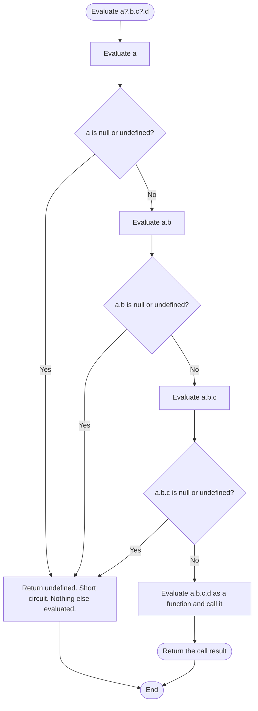
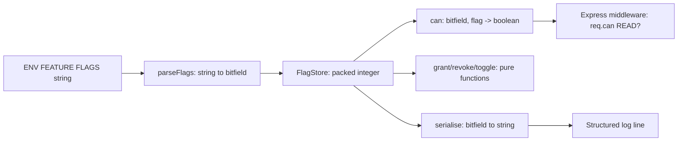

# 1.05 Operators and Control Flow

## 1. Purpose

JavaScript operators and control flow constructs look, on the surface, like their equivalents in C, Java, and Python. That surface resemblance is the single most common source of mid career bugs. The language inherits its syntactic shape from C but its type system from Self and Scheme, and the result is a set of operators whose semantics quietly diverge from the obvious reading in at least six important ways.

First, JavaScript has only one numeric type at the spec level (`Number`, an IEEE 754 double), yet the bitwise operators (`&`, `|`, `^`, `~`, `<<`, `>>`, `>>>`) operate on 32 bit signed integers. Every bitwise operation implicitly converts each operand through the spec abstract operation `ToInt32`, performs the operation, and returns the result back as an ordinary `Number`. This is why `0.5 | 0` produces `0`, why `2 ** 31 | 0` produces `-2147483648`, and why bitwise tricks for integer truncation work at all. The 32 bit boundary is invisible in the syntax and surprising in the result.

Second, the `+` operator is overloaded between numeric addition and string concatenation, with the choice made at evaluation time based on operand types after coercion. `1 + 2` is `3`, but `"1" + 2` is `"12"` because the left operand is a string, so the right is coerced to a string and concatenation runs. This dual mode is the root cause of countless bugs and is the reason production codebases lint against implicit coercion.

Third, the logical operators `&&` and `||` do not return booleans. They return the value of one of their operands. `a || b` returns `a` if `a` is truthy, otherwise `b`. `a && b` returns `a` if `a` is falsy, otherwise `b`. This is enormously useful for default value expressions and short circuit guards, but it means `0 || "default"` returns `"default"` even though `0` is a perfectly valid value. That single behaviour created a category of bug so common that the language added a dedicated operator to fix it.

Fourth, that dedicated operator is nullish coalescing `??`, which reached Stage 4 of the TC39 process in January 2020 and shipped in ES2020. `??` returns its right operand only when the left is `null` or `undefined`, not for any other falsy value. So `0 ?? "default"` returns `0`, `"" ?? "default"` returns `""`, and `false ?? "default"` returns `false`. The bug class it fixes is "the default value swallowed my legitimate zero, empty string, or false". This bug appears in config loaders, pagination (page 0 hidden by `page || 1`), feature toggles (`enabled || true` always returning `true`), and anywhere a falsy-but-valid value flows through a default expression.

Fifth, optional chaining `?.`, also Stage 4 in 2020 and ES2020, was added to eliminate the boilerplate of defensive null checks when drilling into nested data. Before `?.`, accessing `user.address.city` when `user` could be `null` required either `user && user.address && user.address.city` or a try/catch. The bug class it fixes is "TypeError: Cannot read properties of null (reading 'address')" thrown at runtime when consuming JSON from an external API whose shape you do not control. Optional chaining turns a crash into a controlled `undefined`.

Sixth, control flow constructs inherited from C carry their own traps. `switch` uses `===` comparison but allows fall through unless you `break`, leading to the classic "I forgot a break" bug. `for...in` iterates enumerable string keys including inherited prototype properties, which is almost never what you want for an array. `for...of` iterates values via the iterable protocol and is the correct choice for arrays, but it cannot iterate plain objects (they are not iterable). Labelled loops exist but are widely misused.

The purpose of this note is to give you a specification level mental model of every operator and every control flow construct, so that you can predict the output of any expression, choose the right loop for the right data structure, and write switches that the TypeScript compiler can prove exhaustive. Master this note and the category of "operator surprise" bugs largely disappears from your code.

## 2. Theory and Deep Dive

### 2.1 Operator Precedence and Associativity

The ECMAScript specification defines operator precedence implicitly through the grammar productions. The table below summarizes the effective precedence from highest to lowest, with associativity. The full grammar is in clause 13 of ECMA-262 (2024 edition).

| Precedence | Operator(s) | Associativity | Spec note |
|------------|--------------|---------------|-----------|
| 19 | Grouping `( ... )` | n/a | Primary expression |
| 18 | Member access `.` `[]`, function call `()`, optional chaining `?.`, `new` with arguments | left to right | Call and member expressions |
| 17 | `new` without arguments, postfix `++` `--` | n/a | New expression |
| 16 | Prefix `!` `~` `+` `-`, prefix `++` `--`, `typeof`, `void`, `delete`, `await`, `yield` | right to left | Unary expressions |
| 15 | Exponentiation `**` | right to left | The only right associative arithmetic operator |
| 14 | Multiplicative `*` `/` `%` | left to right | |
| 13 | Additive `+` `-` | left to right | `+` is overloaded |
| 12 | Bitwise shift `<<` `>>` `>>>` | left to right | Operands converted via `ToInt32` / `ToUint32` |
| 11 | Relational `<` `<=` `>` `>=`, `instanceof`, `in` | left to right | Always returns boolean |
| 10 | Equality `==` `!=` `===` `!==` | left to right | Returns boolean |
| 9 | Bitwise AND `&` | left to right | `ToInt32` on both operands |
| 8 | Bitwise XOR `^` | left to right | |
| 7 | Bitwise OR `|` | left to right | |
| 6 | Logical AND `&&` | left to right | Returns operand value, short circuits |
| 5 | Logical OR `||`, nullish coalescing `??` | left to right | Returns operand value; mixing `||` and `??` without parens is a SyntaxError |
| 4 | Conditional `? :` | right to left | Ternary |
| 3 | Assignment `=` `+=` `-=` `*=` `/=` `%=` `**=` `<<=` `>>=` `>>>=` `&=` `^=` `|=` `&&=` `||=` `??=` | right to left | |
| 2 | Comma `,` | left to right | Evaluates both, returns right |

Two consequences of this table bite frequently. First, `&&` binds tighter than `||`, so `a || b && c` parses as `a || (b && c)`. Second, `??` cannot be mixed with `||` or `&&` without parentheses: `a || b ?? c` is a `SyntaxError`, and the spec mandates this to remove ambiguity about whether `??` or `||` should win.

### 2.2 The Bitwise Operators and ToInt32

Bitwise operators in JavaScript are defined in clause 13.3 of ECMA-262. They all convert each operand via the abstract operation `ToInt32` (or `ToUint32` for `>>>`), perform the integer operation, and return the result as a `Number`.

The `ToInt32` algorithm is:

1. Let `number` be `ToNumber(argument)`. If `argument` is a string, this parses it. If it is `null`, the result is `+0`. If it is `undefined`, the result is `NaN`. If it is `true`, the result is `1`.
2. If `number` is `NaN`, `+0`, `-0`, `+Infinity`, or `-Infinity`, return `+0`.
3. Let `int` be `sign(number) * floor(abs(number))`. This truncates toward zero.
4. Let `int32bit` be `int modulo 2 ** 32`. In JavaScript modulo always returns a value with the sign of the dividend, but because we just took `abs`, this gives a value in `[0, 2 ** 32 - 1]`.
5. If `int32bit` is greater than or equal to `2 ** 31`, return `int32bit - 2 ** 32`. Otherwise return `int32bit`.

The result is always an integer in the range `[-2147483648, 2147483647]`, i.e. signed 32 bit two's complement. This is why `2 ** 31 | 0` returns `-2147483648` rather than `2147483648`: the value `2147483648` is greater than or equal to `2 ** 31`, so the algorithm subtracts `2 ** 32` and returns the negative representation.

For `>>>` (unsigned right shift), the left operand is converted via `ToInt32` and the right operand via `ToUint32`, then the shift is performed as if on an unsigned 32 bit value, and the result is returned as a non negative `Number` in `[0, 2 ** 32 - 1]`. This is why `(-1) >>> 0` is `4294967295` rather than `-1`: the bits of `-1` in two's complement are all ones, and reading them as unsigned gives the maximum 32 bit value.

### 2.3 Logical Operators Return Operand Values

The spec calls the behaviour of `&&` and `||` "short circuit evaluation", but the critical detail is the return semantics. Per clause 13.13 and 13.14 of ECMA-262:

- `a && b` evaluates `a`. If `ToBoolean(a)` is `false`, it returns `a` without evaluating `b`. Otherwise it returns `b` (which is also not coerced to a boolean).
- `a || b` evaluates `a`. If `ToBoolean(a)` is `true`, it returns `a` without evaluating `b`. Otherwise it returns `b`.

This means the return type of `||` and `&&` is whatever type their operands have, not `boolean`. `0 || "x"` returns `"x"`. `null && 5` returns `null`. `someObject || createDefault()` returns `someObject` (the reference) if it is truthy, never copying or coercing.

The `ToBoolean` abstract operation defines the falsy values as: `undefined`, `null`, `false`, `+0`, `-0`, `NaN`, `""`. Everything else is truthy, including `"0"`, `"false"`, `[]`, `{}`, and `new Boolean(false)` (an object wrapper around false, which is truthy because it is an object).

### 2.4 Nullish Coalescing

Nullish coalescing `??` is defined in clause 13.15. Its semantics are: evaluate the left operand. If the result is `null` or `undefined`, return the right operand. Otherwise return the left operand. Note carefully: only `null` and `undefined` trigger the right operand. Not `0`, not `""`, not `false`, not `NaN`.

The coalescing operator has the same precedence as `||` (precedence 5 in the table above), and is left associative. The spec explicitly forbids mixing `??` with `||` or `&&` without parentheses, to eliminate ambiguity. The grammar production `CoalesceExpression` rejects a `LogicalExpression` as its direct operand unless parenthesized.

There is also a logical assignment form `??=` (clause 14.12.4). `a ??= b` is equivalent to `a ?? (a = b)`: it only assigns `b` to `a` if `a` is nullish, and the assignment is short circuited so the setter on `a` is never invoked if `a` is non nullish. This matters for property setters with side effects.

### 2.5 Optional Chaining

Optional chaining `?.` is defined in clause 13.3.2. It is not a single operator but a family of three syntactic forms:

- `obj?.prop` — optional property access
- `obj?.[expr]` — optional computed property access
- `obj?.(...args)` — optional function call (calls `obj` as a function only if it is non nullish)

When the optional chaining form is evaluated, the spec performs a "short circuit": if the base value (the part before `?.`) is `null` or `undefined`, the entire rest of the chain is skipped and the expression evaluates to `undefined`. The short circuit means none of the property accesses, function calls, or further optional chains to the right are evaluated.

The evaluation algorithm for a chain like `a?.b.c?.d()`:



The critical semantic point: optional chaining only protects against `null` and `undefined` on the base of the `?.`. It does not protect against the base being some other type that lacks the property. If `a` is `42`, then `a?.b` evaluates `42.b`, which is `undefined` (number wrapper auto boxing returns undefined for unknown properties), not a throw. If `a` is `42` and you write `a?.()`, that throws `TypeError: a is not a function`, because the optional check passes (42 is not nullish) and then the call fails.

A subtle point: optional chaining changes the semantics of method calls. `obj.method?.()` calls `method` only if `obj.method` is non nullish, which guards against `obj.method` being `undefined`. But `obj?.method()` calls `method` only if `obj` is non nullish, and throws if `obj.method` is not a function. Choose the placement of `?.` carefully based on which value you want to guard against.

### 2.6 The Comma Operator

The comma operator `,` (clause 14.16) evaluates its left operand, discards the result, evaluates its right operand, and returns that. It has the lowest precedence of any binary operator except where the grammar assigns comma a different meaning (function argument lists, array literals, object literals, variable declarations all use comma as a separator, not the operator). The most common legitimate use is in `for` loop headers: `for (let i = 0, j = arr.length - 1; i < j; i++, j--)`. Outside of for headers, the comma operator is generally a code smell because it hides side effects.

### 2.7 The Conditional (Ternary) Operator

The conditional operator `a ? b : c` (clause 13.14.1) is right associative, which means `a ? b : c ? d : e` parses as `a ? b : (c ? d : e)`. Only one of `b` or `c` is evaluated. The result type in TypeScript is the union of the types of `b` and `c`. Nested ternaries are hard to read; the idiomatic refactor is a switch statement or an early return.

### 2.8 The switch Statement

The `switch` statement (clause 14.12.3) evaluates the discriminant expression once, then compares it against each `case` clause using the `===` strict equality operator. When a case matches, execution begins at that case and continues until either a `break`, a `return`, a `throw`, the end of the switch, or the closing brace. There is no implicit break between cases. This "fall through" behaviour is by design (it allows grouping cases), but it is the source of one of the most common bugs in C family languages.

The `default` clause is optional and may appear anywhere in the switch body, though by convention it appears last. If no case matches and there is no default, the switch body is skipped entirely.

### 2.9 Loops

JavaScript has five looping constructs plus iteration via method callbacks:

- `for (init; test; update) { body }` — C style. The init runs once, then on each iteration: evaluate test, if truthy run body then update, if falsy exit. Any of init, test, update may be omitted (an omitted test is treated as `true`).
- `for (const key in object) { body }` — iterates enumerable string keys of the object, including inherited ones. Iteration order for integer index keys is ascending numeric, then string keys in insertion order. For arrays this means indices are visited as strings.
- `for (const value of iterable) { body }` — iterates values via the iterable protocol (`Symbol.iterator`). Works on arrays, strings, Maps, Sets, TypedArrays, generators, and any object that implements `Symbol.iterator`. Does not work on plain objects.
- `while (test) { body }` — evaluates test, if truthy runs body, repeats.
- `do { body } while (test)` — runs body, then evaluates test, repeats while truthy. The body always runs at least once.

The `forEach` method on arrays is not a language construct but a method that accepts a callback. It cannot be terminated with `break` or `continue` (you must use `Array.some` to fake break, or `Array.every` to fake continue), and it skips holes in sparse arrays.

### 2.10 Labels, break, and continue

A statement may be prefixed with a label: `labelName: statement`. The `break labelName` form exits the labelled loop or block. The `continue labelName` form skips to the next iteration of the labelled loop. Labels are most useful for breaking out of nested loops. They are not goto and cannot transfer control arbitrarily; they can only target an enclosing loop or block.

## 3. Mental Models

A good mental model survives edge cases. The five below do.

**Logical OR as "default value OR this".** Read `a || b` aloud as "default to b, or use a if a is truthy". This model captures the return value semantics correctly and reminds you that any falsy `a` (including the legitimate values `0`, `""`, `false`, `NaN`) triggers the default. The model breaks down when you actually want a boolean, in which case use `Boolean(a)` or `!!a`.

**Nullish coalescing as "default if missing".** Read `a ?? b` as "use a if it is present (not null or undefined), otherwise use b". The word "missing" is the key: null and undefined are the language's way of saying "absent", while `0`, `""`, and `false` are present values that happen to be falsy. This is the entire conceptual difference between `||` and `??`.

**Optional chaining as "drill down, abort with undefined".** Read `a?.b?.c` as "drill into a, then b, then c, but if any step hits null or undefined, abort the whole drill and return undefined". The drill is left to right. The abort is total: once you abort, nothing further in the chain runs.

**Bitwise as "two's complement theatre".** Read any bitwise expression as "treat the operands as 32 bit signed two's complement integers, do the operation, hand back the result as a normal JavaScript number". The conversion is implicit and lossy for numbers outside the 32 bit range. For numbers within range it is exact. The theatre metaphor reminds you that the conversion is a temporary act, not a permanent type change.

**Switch as "jump table with fall through".** Read a switch as "compute the discriminant, jump to the matching case label, then execute sequentially from there". The jump table model is exactly how the C compiler implements switch and how V8 often implements it for dense integer cases. The fall through is the consequence of the jump table model: once you jump, you keep going until something stops you.

Where each model breaks down: the `||` model breaks down for booleans (you sometimes want a real boolean, use `!!`). The `??` model breaks down if you have a value that uses `null` as a legitimate sentinel (rare but real, e.g. JSON serialised data where `null` means "explicitly cleared"). The `?.` model breaks down when the chain contains a function call: you must distinguish `obj?.method()` (guard the receiver) from `obj.method?.()` (guard the method). The bitwise model breaks down for `>>>` (unsigned right shift), which uses `ToUint32` and returns a non negative value. The switch model breaks down for sparse string cases, where V8 may fall back to a linear scan instead of a jump table.

## 4. Real-World Use Cases

### 4.1 Optional Chaining in React Prop Drilling

In React component trees, props are often optional and deeply nested. A settings panel that reads `props.user.preferences.notifications.email.frequency` cannot safely access that chain without optional chaining unless every intermediate object is guaranteed present. The pre 2020 idiom was `props.user && props.user.preferences && ...` which is verbose and easy to get wrong. The modern idiom is `props.user?.preferences?.notifications?.email?.frequency ?? "daily"`. This pattern appears in virtually every React codebase that consumes API responses with optional fields. Fastify hooks, NestJS interceptors, and Next.js server components all benefit identically.

### 4.2 Nullish Coalescing for Default Config

Configuration loaders frequently merge user supplied values with defaults. Using `||` for this is wrong whenever `0`, `""`, or `false` are valid user values. Concrete example: a HTTP server config with `port: process.env.PORT || 3000` will silently use 3000 if the user sets `PORT=0` (which is a legitimate "assign me any free port" request on POSIX). The fix is `port: process.env.PORT ?? 3000`. The same bug appears in pagination (`page || 1` swallows page 0), feature toggles (`enabled || true` always returns true), and timeouts (`timeout || 5000` swallows an explicit zero timeout meaning "no wait").

### 4.3 Bitwise Flags for Feature Toggles

When you have a set of boolean permissions or features, packing them into a single integer with bit flags is memory efficient and lets you check or set combinations in a single operation. This is how Linux file permissions work (read, write, execute as bits 4, 2, 1), how Discord stores user flags, and how Slack represents channel capabilities. A permission system with `READ = 1`, `WRITE = 2`, `DELETE = 4`, `ADMIN = 8` lets you express "can read and write but not delete" as `READ | WRITE` (3) and check it with `(userFlags & READ) !== 0`. Bitwise flags trade readability for compactness and atomic updates; they are appropriate at system boundaries (wire formats, database columns) and should be wrapped in named accessor functions in application code.

### 4.4 for...of for Streaming Iterables

Async iterables (defined in `Symbol.asyncIterator`) can only be consumed by `for await...of`. Node.js streams are async iterables since Node 10. Reading a large file line by line is now `for await (const line of readline.createInterface({ input: fs.createReadStream(path) })) { ... }` instead of the old event based approach. Generators are also iterables and are consumed by `for...of`. Anywhere you see `yield`, you can consume the generator with `for...of`.

### 4.5 for...in for Serialising Plain Object Dictionaries

`for...in` is mostly an anti pattern, but it has a legitimate use: serialising a plain object dictionary into a query string or form body where you need the keys, and you have already verified the object has no prototype pollution. The modern idiom is `for (const key of Object.keys(obj))` or `Object.entries(obj).map(...)`, but `for...in` with `Object.hasOwn` is acceptable in hot paths where avoiding the intermediate array matters. Use it sparingly and always guard with `Object.hasOwn`.

### 4.6 switch in State Machines and Reducers

Redux reducers, XState machines, and parser dispatch tables are the canonical modern use of switch. Each case handles one state transition. TypeScript's `never` type lets the compiler prove the switch exhaustive: a default case that assigns to a `never` typed variable will fail to compile if any union member is unhandled, turning a runtime bug into a compile time error.

## 5. Code Examples

### 5.1 Example A — Minimal and Conceptual

**JavaScript:**

```javascript
// Arithmetic and the dual mode plus operator
console.log(1 + 2);          // 3   numeric addition
console.log("1" + 2);        // "12" string concat because left is string
console.log(1 + 2 + "3");    // "33" left to right: 1+2=3, then 3+"3"="33"
console.log("1" + 2 + 3);    // "123" left to right: "1"+2="12", then "12"+3="123"

// Bitwise (operands go through ToInt32)
console.log(0.5 | 0);        // 0   truncates toward zero
console.log(-0.5 | 0);       // 0   truncates toward zero, not floor
console.log(2 ** 31 | 0);    // -2147483648 wraps to negative
console.log(~0);             // -1  bitwise NOT: ~x = -(x+1)
console.log(5 & 3);          // 1   0101 & 0011 = 0001
console.log(5 | 3);          // 7   0101 | 0011 = 0111
console.log(5 ^ 3);          // 6   0101 ^ 0011 = 0110
console.log(1 << 3);         // 8   left shift by 3
console.log(-8 >> 1);        // -4  arithmetic right shift, sign preserved
console.log(-8 >>> 1);       // 2147483644 unsigned right shift

// Logical operators return operand values, not booleans
console.log(0 || "default");   // "default"  0 is falsy
console.log("" || "default");  // "default"  "" is falsy
console.log(false || "default"); // "default"
console.log(null && "anything"); // null  short circuit, returns null
console.log("x" && "y");      // "y"  both truthy, returns right

// Nullish coalescing only coalesces on null/undefined
console.log(0 ?? "default");     // 0   0 is not nullish
console.log("" ?? "default");    // ""  "" is not nullish
console.log(false ?? "default"); // false
console.log(null ?? "default");  // "default"
console.log(undefined ?? "default"); // "default"

// Optional chaining
const user = { address: { city: "Lisbon" } };
console.log(user?.address?.city);     // "Lisbon"
console.log(user?.phone?.number);     // undefined, no throw
console.log(user?.address?.city?.toUpperCase?.()); // "LISBON"

// Comma operator in a for header
for (let i = 0, j = 10; i < j; i++, j--) {
  console.log(i, j); // 0 10, 1 9, 2 8, 3 7, 4 6
}

// Ternary, right associative
const grade = 85;
const result = grade >= 90 ? "A" : grade >= 80 ? "B" : "C";
console.log(result); // "B"

// switch with break
function dayType(day) {
  switch (day) {
    case "Sat":
    case "Sun":      // intentional fall through: Sat and Sun both go here
      return "weekend";
    case "Mon":
    case "Tue":
    case "Wed":
    case "Thu":
    case "Fri":
      return "weekday";
    default:
      return "unknown";
  }
}
console.log(dayType("Sun")); // "weekend"
```

**TypeScript:**

```typescript
// Same semantics, with explicit types so the compiler proves correctness
const a: number = 1 + 2;
const b: string = "1" + 2;     // string, because left operand is string
const c: string = 1 + 2 + "3"; // string, "33"

// Bitwise on number always returns number
const truncated: number = 0.5 | 0;
const wrapped: number = 2 ** 31 | 0; // -2147483648

// Logical operator return type is the union of operand types
const def: string | number = 0 || "default";    // string | number
const keep: number = 0 ?? "default";            // number (TS narrows: 0 ?? x => number)
const keep2: string = ("" as string) ?? "x";    // string

// Optional chaining narrows away null and undefined
type User = { address?: { city?: string }; phone?: { number?: string } };
const user: User | null = Math.random() > 0.5 ? { address: { city: "Lisbon" } } : null;
const city: string | undefined = user?.address?.city; // TS knows it can be undefined

// switch with exhaustive union and never default
type Day = "Mon" | "Tue" | "Wed" | "Thu" | "Fri" | "Sat" | "Sun";
function dayType(day: Day): "weekend" | "weekday" {
  switch (day) {
    case "Sat":
    case "Sun":
      return "weekend";
    case "Mon":
    case "Tue":
    case "Wed":
    case "Thu":
    case "Fri":
      return "weekday";
    default:
      // If a new Day is added without a case, this line fails to compile
      const exhaustive: never = day;
      return exhaustive;
  }
}

// Labelled loop with type safe counter
function search(grid: number[][]): [number, number] | null {
  let found: [number, number] | null = null;
  outer: for (let r = 0; r < grid.length; r++) {
    for (let c = 0; c < grid[r].length; c++) {
      if (grid[r][c] === 42) { found = [r, c]; break outer; }
    }
  }
  return found;
}
```

### 5.2 Example B — Production-Grade

A feature flag system using bitwise AND with TypeScript literal union types for compile time flag name safety, runtime validation, and exhaustive switch based serialisation.

**JavaScript:**

```javascript
// Bitwise feature flag system. Each flag is a power of two so they can be OR-ed together.
const FeatureFlag = Object.freeze({
  READ: 1 << 0,       // 1
  WRITE: 1 << 1,      // 2
  DELETE: 1 << 2,     // 4
  ADMIN: 1 << 3,      // 8
  BILLING: 1 << 4,    // 16
  AUDIT: 1 << 5,      // 32
});

// Default roles expressed as OR of flags
const Roles = Object.freeze({
  viewer:   FeatureFlag.READ,
  editor:   FeatureFlag.READ | FeatureFlag.WRITE,
  manager:  FeatureFlag.READ | FeatureFlag.WRITE | FeatureFlag.DELETE,
  admin:    FeatureFlag.READ | FeatureFlag.WRITE | FeatureFlag.DELETE
            | FeatureFlag.ADMIN | FeatureFlag.BILLING | FeatureFlag.AUDIT,
});

// Permission check: (userFlags & requiredFlag) !== 0
function can(flags, required) {
  return (flags & required) === required;
}

// Grant a flag (idempotent: OR with self is no-op)
function grant(flags, flag) {
  return flags | flag;
}

// Revoke a flag (idempotent: AND NOT with already cleared bit is no-op)
function revoke(flags, flag) {
  return flags & ~flag;
}

// Toggle: XOR flips the bit
function toggle(flags, flag) {
  return flags ^ flag;
}

// Pretty print using a switch with intentional fall through comments
function describeFlags(flags) {
  const parts = [];
  if (flags & FeatureFlag.READ)    parts.push("read");
  if (flags & FeatureFlag.WRITE)   parts.push("write");
  if (flags & FeatureFlag.DELETE)  parts.push("delete");
  if (flags & FeatureFlag.ADMIN)   parts.push("admin");
  if (flags & FeatureFlag.BILLING) parts.push("billing");
  if (flags & FeatureFlag.AUDIT)   parts.push("audit");
  return parts.length ? parts.join(", ") : "none";
}

// Parse a flag string like "READ|WRITE" into a packed integer, with validation
function parseFlags(input) {
  if (input == null) return 0;          // nullish guard
  const names = input.split("|").map(s => s.trim().toUpperCase());
  let flags = 0;
  for (const name of names) {
    if (!(name in FeatureFlag)) {
      throw new Error(`Unknown feature flag: ${name}`);
    }
    flags |= FeatureFlag[name];
  }
  return flags;
}

// Configuration loader using nullish coalescing so 0, "", false are preserved
function loadConfig(env) {
  const port = Number(env.PORT) || 3000;       // BUG if PORT=0; shown for contrast
  const portSafe = Number(env.PORT) ?? 3000;   // NaN ?? 3000 => NaN, not what we want
  const portCorrect = env.PORT == null ? 3000 : Number(env.PORT);
  return {
    port: portCorrect,
    host: env.HOST ?? "0.0.0.0",
    logLevel: env.LOGLEVEL ?? "info",
    retries: env.RETRIES == null ? 3 : Number(env.RETRIES),
    flags: parseFlags(env.FEATUREFLAGS),
  };
}

// Streaming line reader using for await...of
async function processLines(path, handler) {
  const fs = require("fs");
  const readline = require("readline");
  const stream = fs.createReadStream(path);
  const rl = readline.createInterface({ input: stream, crlfDelay: Infinity });
  let count = 0;
  try {
    for await (const line of rl) {
      if (line.startsWith("#")) continue;       // skip comments
      const trimmed = line.trim();
      if (!trimmed) continue;                    // skip blanks
      await handler(trimmed, count++);
    }
  } finally {
    rl.close();
    stream.destroy();
  }
  return count;
}

// State machine using switch with explicit transitions
function reducer(state, action) {
  switch (action.type) {
    case "start":  return { ...state, status: "running" };
    case "pause":  return { ...state, status: "paused" };
    case "resume": return state.status === "paused"
                    ? { ...state, status: "running" }
                    : state;
    case "stop":   return { ...state, status: "stopped" };
    default:       return state;
  }
}
```

**TypeScript:**

```typescript
// Compile-time safe flag names via a literal union and a const object
const FeatureFlag = {
  READ: 1 << 0,
  WRITE: 1 << 1,
  DELETE: 1 << 2,
  ADMIN: 1 << 3,
  BILLING: 1 << 4,
  AUDIT: 1 << 5,
} as const;

type FlagName = keyof typeof FeatureFlag;    // "READ" | "WRITE" | ...
type FlagValue = typeof FeatureFlag[FlagName]; // 1 | 2 | 4 | 8 | 16 | 32
type Flags = number;                          // packed bitfield

const Roles = {
  viewer:  FeatureFlag.READ,
  editor:  FeatureFlag.READ | FeatureFlag.WRITE,
  manager: FeatureFlag.READ | FeatureFlag.WRITE | FeatureFlag.DELETE,
  admin:   FeatureFlag.READ | FeatureFlag.WRITE | FeatureFlag.DELETE
          | FeatureFlag.ADMIN | FeatureFlag.BILLING | FeatureFlag.AUDIT,
} as const;
type RoleName = keyof typeof Roles;

function can(flags: Flags, required: FlagValue): boolean {
  return (flags & required) === required;
}

function grant(flags: Flags, flag: FlagValue): Flags {
  return flags | flag;
}

function revoke(flags: Flags, flag: FlagValue): Flags {
  return flags & ~flag;
}

function toggle(flags: Flags, flag: FlagValue): Flags {
  return flags ^ flag;
}

// Exhaustive switch over FlagName with never default for serialisation
function flagToBit(name: FlagName): FlagValue {
  switch (name) {
    case "READ":    return FeatureFlag.READ;
    case "WRITE":   return FeatureFlag.WRITE;
    case "DELETE":  return FeatureFlag.DELETE;
    case "ADMIN":   return FeatureFlag.ADMIN;
    case "BILLING": return FeatureFlag.BILLING;
    case "AUDIT":   return FeatureFlag.AUDIT;
    default: {
      const exhaustive: never = name; // compile error if a flag is added above but not here
      return exhaustive;
    }
  }
}

// Reverse: bit to name, also exhaustive
function bitToName(bit: FlagValue): FlagName {
  switch (bit) {
    case FeatureFlag.READ:    return "READ";
    case FeatureFlag.WRITE:   return "WRITE";
    case FeatureFlag.DELETE:  return "DELETE";
    case FeatureFlag.ADMIN:   return "ADMIN";
    case FeatureFlag.BILLING: return "BILLING";
    case FeatureFlag.AUDIT:   return "AUDIT";
    default: {
      const exhaustive: never = bit; // compile error if a new bit is added
      return exhaustive;
    }
  }
}

// Config with nullish coalescing for safe defaults
interface ServerConfig {
  port: number;
  host: string;
  logLevel: "debug" | "info" | "warn" | "error";
  retries: number;
  flags: Flags;
}

function loadConfig(env: Record<string, string | undefined>): ServerConfig {
  const portRaw = env.PORT;
  const port = portRaw == null || portRaw === ""
    ? 3000
    : Number(portRaw);
  return {
    port: Number.isFinite(port) ? port : 3000,
    host: env.HOST ?? "0.0.0.0",
    logLevel: (env.LOGLEVEL as ServerConfig["logLevel"]) ?? "info",
    retries: env.RETRIES == null ? 3 : Number(env.RETRIES),
    flags: parseFlags(env.FEATUREFLAGS),
  };
}

function parseFlags(input: string | undefined): Flags {
  if (input == null) return 0;
  const names = input.split("|").map(s => s.trim().toUpperCase() as FlagName);
  let flags: Flags = 0;
  for (const name of names) {
    if (!(name in FeatureFlag)) {
      throw new Error(`Unknown feature flag: ${name}`);
    }
    flags |= flagToBit(name);
  }
  return flags;
}

// State machine with exhaustive action union
type Status = "idle" | "running" | "paused" | "stopped";
interface State { status: Status; count: number; }
type Action =
  | { type: "start" }
  | { type: "pause" }
  | { type: "resume" }
  | { type: "stop" }
  | { type: "tick"; by: number };

function reducer(state: State, action: Action): State {
  switch (action.type) {
    case "start":  return { ...state, status: "running" };
    case "pause":  return { ...state, status: "paused" };
    case "resume":
      return state.status === "paused"
        ? { ...state, status: "running" }
        : state;
    case "stop":   return { ...state, status: "stopped" };
    case "tick":   return { ...state, count: state.count + action.by };
    default: {
      const exhaustive: never = action; // compile error if a new Action variant is added
      return exhaustive;
    }
  }
}
```

## 6. Common Mistakes and Anti-Patterns

### 6.1 Using `||` for defaults when `0`, `""`, or `false` are valid

```javascript
// BUG: page 0 is swallowed, user sees page 1
function paginate(page) {
  return page || 1;
}
paginate(0);    // 1   wrong, user wanted page 0
paginate(1);    // 1   correct
paginate(null); // 1   correct
```

**Why it fails:** `||` treats `0` as falsy and returns the right operand. The same bug appears with `""` (empty search query becomes the default), `false` (disabled feature becomes enabled), and `NaN` (failed parse becomes the default).

**Fix:**

```javascript
function paginate(page) {
  return page ?? 1;       // null/undefined only trigger default
}
paginate(0);    // 0   correct
paginate(null); // 1   correct
```

For numeric parsing where `NaN` should also fall back, combine:

```javascript
function parsePort(raw) {
  const n = Number(raw);
  return Number.isFinite(n) ? n : 3000;
}
```

### 6.2 `for...in` iterating inherited properties

```javascript
// BUG: inherited enumerable properties are visited too
const proto = { inherited: "leaked" };
const obj = Object.create(proto);
obj.own = "fine";
for (const key in obj) {
  console.log(key); // "own", then "inherited"  surprise
}

// BUG on arrays: keys are strings, prototype is touched
Array.prototype.first = function () { return this[0]; };
const arr = ["a", "b", "c"];
for (const i in arr) {
  console.log(i, typeof i); // "0" "string", "1" "string", "2" "string", "first" "string"
}
```

**Why it fails:** `for...in` is defined to visit all enumerable string keys of the object including those on the prototype chain. Libraries and polyfills that extend `Array.prototype` or `Object.prototype` (the bad old days of Prototype.js and MooTools) leak their methods into your iteration.

**Fix:**

```javascript
// Modern: use Object.hasOwn (ES2022) or for...of with Object.keys
for (const key in obj) {
  if (Object.hasOwn(obj, key)) {
    console.log(key); // "own" only
  }
}

// Better: iterate the keys array directly
for (const key of Object.keys(obj)) {
  console.log(key);
}

// Best for arrays: never use for...in, use for...of or Array methods
for (const value of arr) { console.log(value); }
for (const [i, value] of arr.entries()) { console.log(i, value); }
```

### 6.3 `switch` fall through bug (missing break)

```javascript
// BUG: every case falls through to the next
function describe(n) {
  let s = "";
  switch (n) {
    case 1: s += "one ";
    case 2: s += "two ";
    case 3: s += "three ";
  }
  return s.trim();
}
describe(1); // "one two three"  almost never intended
describe(2); // "two three"
```

**Why it fails:** Switch cases do not implicitly break. Once a case matches, execution runs sequentially through all subsequent cases until a `break`, `return`, `throw`, or the closing brace.

**Fix:**

```javascript
function describe(n) {
  switch (n) {
    case 1: return "one";
    case 2: return "two";
    case 3: return "three";
    default: return "unknown";
  }
}

// When fall through IS intentional, comment it explicitly
function classify(c) {
  switch (c) {
    case "a":
    case "e":
    case "i":
    case "o":
    case "u":
      return "vowel";          // intentional fall through from each vowel
    default:
      return "consonant";
  }
}
```

### 6.4 The `~indexOf()` truthy trick

```javascript
// Old idiom: ~indexOf returns truthy when found, falsy when not
if (~arr.indexOf(needle)) {
  console.log("found");
}
```

**Why it is a trap:** `~x` is `-(x + 1)`. So `~(-1)` is `0` (falsy), and `~0` is `-1` (truthy), `~1` is `-2` (truthy), etc. The trick "works" but reads as magic. New readers cannot tell whether it is a bug or intentional.

**Fix:**

```javascript
if (arr.indexOf(needle) !== -1) { console.log("found"); }
// or, ES2016 and later:
if (arr.includes(needle)) { console.log("found"); }
```

`Array.prototype.includes` was added precisely to eliminate this trick and the off by one error of forgetting to compare against `-1`.

### 6.5 Labelled loop misuse

```javascript
// BUG: label looks like a property access, easy to misread
function find(matrix, target) {
  let result = null;
  loop: for (let i = 0; i < matrix.length; i++) {
    for (let j = 0; j < matrix[i].length; j++) {
      if (matrix[i][j] === target) {
        result = [i, j];
        break loop;
      }
    }
  }
  return result;
}
```

**Why it is fragile:** Labels are rare enough that most engineers do not recognize them. A reader may think `loop:` is a typo or a label that does something else. Labels also enable `continue label` which can produce control flow that is very hard to reason about.

**Fix:** Prefer extracting to a function and using `return`, or use `.find` with destructuring:

```javascript
function find(matrix, target) {
  for (let i = 0; i < matrix.length; i++) {
    for (let j = 0; j < matrix[i].length; j++) {
      if (matrix[i][j] === target) return [i, j];
    }
  }
  return null;
}

// Or with array methods
function findFunctional(matrix, target) {
  for (const [i, row] of matrix.entries()) {
    const j = row.indexOf(target);
    if (j !== -1) return [i, j];
  }
  return null;
}
```

### 6.6 Mixing `??` with `||` or `&&` without parens

```javascript
// BUG: SyntaxError at parse time
const x = a || b ?? c;
const y = a && b ?? c;
const z = a ?? b || c;
```

**Why it fails:** The spec forbids mixing `??` with `||` or `&&` on the same precedence level without explicit parentheses, because the committee could not agree on which should bind tighter and wanted to prevent silent ambiguity.

**Fix:**

```javascript
const x = (a || b) ?? c;   // or a || (b ?? c) depending on intent
const y = (a && b) ?? c;
const z = a ?? (b || c);   // usually what you want: nullish first, then OR
```

### 6.7 Optional chaining on a non nullish but non callable receiver

```javascript
const obj = { method: 42 };
obj?.method();   // TypeError: obj.method is not a function
```

**Why it fails:** `?.` only guards against `null` and `undefined` on its left operand. Here `obj` is not nullish, so the chain proceeds. `obj.method` is `42`, and calling `42()` throws. The correct guard depends on intent.

**Fix:**

```javascript
// If you want to call method only when it is a function:
obj.method?.();               // safe: 42 is not callable, short circuits to undefined
if (typeof obj.method === "function") obj.method();
```

### 6.8 Bitwise truncation surprising on large numbers

```javascript
const big = 2 ** 32;       // 4294967296, exceeds 32 bit range
console.log(big | 0);      // 0, because 2**32 mod 2**32 = 0
console.log((big + 1) | 0); // 1
console.log(3.9999999999 | 0); // 3, truncates toward zero not floor
console.log(-3.9999999999 | 0); // -3, truncates toward zero, NOT -4
```

**Why it fails:** `ToInt32` takes modulo `2 ** 32` and truncates toward zero. For numbers larger than `2 ** 31 - 1` the result wraps. For negative non integers, truncation toward zero differs from `Math.floor`.

**Fix:** Use `Math.trunc`, `Math.floor`, or `Math.round` explicitly when you need integer conversion semantics that do not depend on the 32 bit range. Reserve `| 0` for values you have proven are within `[-2 ** 31, 2 ** 31 - 1]`.

## 7. Best Practices and Design Patterns

**Prefer `??` over `||` for defaults.** Use `||` only when you genuinely want any falsy value to trigger the default (which is rare). Default to `??` and switch to `||` only with a comment explaining why a falsy value must be treated as absent. This single rule eliminates an entire bug class.

**Prefer `?.` over manual `&&` chains.** `a?.b?.c` is shorter, faster (one operation, not three), and reads more clearly than `a && a.b && a.b.c`. Use `?.()` for optional method calls and `?.[]` for optional computed access. Do not chain `?.` reflexively on values you know are non null; it can hide real bugs where a value is unexpectedly null.

**Use `for...of` for arrays, `for...in` only with `Object.hasOwn`.** Make `for...of` your default loop for any iterable. Use `for...in` only when you specifically need to include inherited enumerable properties, and even then guard with `Object.hasOwn` if you only want own properties. For plain object iteration, prefer `Object.keys`, `Object.values`, or `Object.entries` with `for...of`.

**Always `break` or `return` in `switch` cases unless fall through is intentional, and comment intentional fall through.** A bare `// fall through` comment makes the intent explicit and silences linters (ESLint's `no-fallthrough` rule accepts the comment as a marker). Default to using `return` inside switch cases wrapped in a function, which eliminates the need for `break` entirely.

**Use TypeScript's `never` to prove exhaustive switches.** Assign the discriminant to a `never` typed variable in the default case. If a new union member is added without a corresponding case, the assignment fails to compile. This is the single most powerful technique for state machines, reducers, and serialisation code.

**Avoid the comma operator outside `for` headers.** `let x = (a(), b());` hides a side effect. Use separate statements. The only legitimate use is in `for` loop init and update clauses.

**Wrap bitwise flag operations in named functions.** `(flags & READ) === READ` reads poorly and is easy to invert by mistake (`flags & READ` is truthy even if multiple flags are set, but only equals `READ` if exactly that one is set). Wrap in `can(flags, READ)`, `grant(flags, READ)`, `revoke(flags, READ)`. The compiler inlines these; readability is free.

**Do not use `~indexOf()`.** Use `indexOf(...) !== -1` or `includes(...)`. The bitwise trick is a relic.

**Do not use labelled loops for new code unless extracting to a function is genuinely worse.** Early return from a helper function is almost always clearer.

**Prefer `Array.prototype.includes` over `indexOf`.** `includes` is intent revealing and handles `NaN` correctly (`[NaN].includes(NaN)` is `true`; `[NaN].indexOf(NaN)` is `-1`).

## 8. Technical Interview Knowledge

### 8.1 What does `5 ?? 10` return?

**A:** `5`. The nullish coalescing operator `??` returns its left operand if the left operand is neither `null` nor `undefined`. `5` is a number and not nullish, so the right operand is not evaluated and `5` is returned. This contrasts with `5 || 10` which also returns `5`, but for a different reason (5 is truthy). The difference shows up with `0 ?? 10` (returns `0`) versus `0 || 10` (returns `10`).

**Trap to avoid:** Candidates often say "returns the first truthy value". That is the rule for `||`, not `??`. State the nullish rule explicitly: left unless null or undefined.

### 8.2 What is the difference between `||` and `??`?

**A:** `||` returns the right operand when the left is falsy (one of `undefined`, `null`, `false`, `0`, `""`, `NaN`). `??` returns the right operand only when the left is `null` or `undefined`. So `0 || "x"` returns `"x"` while `0 ?? "x"` returns `0`. Use `??` when `0`, `""`, and `false` are legitimate values; use `||` when any falsy value should be treated as absent (rare). The two operators cannot be mixed in the same expression without parentheses.

**Trap to avoid:** Saying "both return the first truthy value". Neither returns a boolean. Both return one of their operands.

### 8.3 Why does `0 | 0 === 0` but `0.5 | 0 === 0`?

**A:** The bitwise OR operator converts each operand through the abstract operation `ToInt32`, which truncates toward zero. `ToInt32(0)` is `0`. `ToInt32(0.5)` is also `0` because `floor(abs(0.5))` is `0`. Then `0 | 0` is `0`. The truncation explains why `| 0` is a common (now discouraged in favour of `Math.trunc`) idiom for converting a number to an integer.

**Trap to avoid:** Saying "bitwise OR rounds down". It truncates toward zero, which for negative numbers differs from rounding down (`-0.5 | 0` is `0`, but `Math.floor(-0.5)` is `-1`).

### 8.4 Implement clamping using bitwise operators

**A:** Bitwise operators alone cannot clamp because they only work in the 32 bit range and have no comparison semantics. You can implement integer clamping for the 32 bit range using arithmetic right shift and subtraction tricks, but the readable version uses `Math.min` and `Math.max`:

```javascript
const clamp = (n, min, max) => Math.min(Math.max(n, min), max);
```

If the interviewer insists on a bitwise version (usually a trick question), point out that you can clamp to `[0, 255]` for colour values using `(n & 255) ^ (n & ~255 & (-(n > 255)))`, but this is unreadable and slow. The correct answer is to push back: bitwise is the wrong tool for clamping.

**Trap to avoid:** Actually trying to implement clamping with bitwise. The interviewer is testing whether you recognise that bitwise is inappropriate here.

### 8.5 Why does `for...in` on an array give strings?

**A:** `for...in` iterates enumerable string keys of an object. Arrays in JavaScript are objects whose keys are the string forms of their indices ("0", "1", "2", ...). So `for (const i in arr)` gives you strings, not numbers. This is also why `arr[i]` inside the loop works (property access coerces to string anyway) but `arr[i] + 1` does not (string concatenation, not addition). Additionally, `for...in` on an array can visit non index enumerable properties and inherited ones.

**Trap to avoid:** Saying "for performance reasons". It is a spec consequence of arrays being objects.

### 8.6 Can you mix `??` and `||` without parens?

**A:** No. `a || b ?? c` is a `SyntaxError`. The ECMAScript grammar forbids mixing nullish coalescing with logical OR or AND on the same precedence level without explicit parentheses, because the committee could not agree on relative precedence and wanted to prevent silent ambiguity. You must write `(a || b) ?? c` or `a || (b ?? c)`. The same applies to `??` mixed with `&&`.

**Trap to avoid:** Saying "it works, `??` binds tighter". It does not work; it is a parse error.

### 8.7 What is the comma operator?

**A:** The comma operator evaluates its left operand, discards the result, evaluates its right operand, and returns the right. It has the lowest precedence of any operator except where the grammar assigns comma a different meaning (function arguments, array literals, object literals, variable declaration lists). The only legitimate modern use is in `for` loop init and update clauses: `for (let i = 0, j = 10; i < j; i++, j--)`. Outside of that, it is a code smell that hides side effects.

**Trap to avoid:** Confusing the comma operator with the comma separator in `let a = 1, b = 2`. In `let a = 1, b = 2`, the comma is a separator in the variable declaration list, not the operator.

### 8.8 How does `?.` work on function calls?

**A:** There are two distinct forms. `obj?.method()` guards the receiver: if `obj` is nullish, the entire expression is `undefined` and `method` is never looked up. `obj.method?.()` guards the method: if `obj.method` is nullish, the call is skipped and the expression is `undefined`, but `obj` is still accessed (and would throw if `obj` were nullish without a guard). The short circuit is total: once a `?.` short circuits, no further property access, function call, or side effect to the right of it in the chain runs. For a direct optional call of a value as a function, use `fn?.(args)`, which calls `fn` only if it is non nullish (and throws if it is non nullish but not callable).

**Trap to avoid:** Saying "optional chaining makes everything safe". It only guards against `null` and `undefined` on the base. Calling a non function still throws, accessing a property of a number does not throw but yields `undefined`, and a chain that throws after the `?.` will still throw.

## 9. Practical Exercises

### 9.1 Exercise One — Predict the Output

**Goal:** Predict the output of 15 snippets without running them.

**Snippets:**

```javascript
console.log(1, 1 + "2" + 3);              // (1)
console.log(2, 1 + 2 + "3");              // (2)
console.log(3, "a" && "b" && "c");        // (3)
console.log(4, 0 || null || "" || "x");   // (4)
console.log(5, 0 ?? null ?? "x");         // (5)
console.log(6, null && "x");              // (6)
console.log(7, 5 & 3);                    // (7)
console.log(8, 5 | 3);                    // (8)
console.log(9, ~5);                       // (9)
console.log(10, 1 << 31);                // (10)
console.log(11, (1 << 31) >>> 0);        // (11)
console.log(12, 2 ** 31 | 0);            // (12)
console.log(13, [1,2,3]?.[5]);           // (13)
console.log(14, (null)?.a.b.c);          // (14)
console.log(15, (1, 2, 3));              // (15)
```

**Full worked solution:**

```javascript
// (1) "123"  left to right: 1 + "2" = "12" (string concat), then "12" + 3 = "123"
// (2) "33"   left to right: 1 + 2 = 3 (numeric), then 3 + "3" = "33"
// (3) "c"    && returns the right operand when left is truthy; left to right all truthy, returns "c"
// (4) "x"    || returns first truthy; 0, null, "" are all falsy; "x" is truthy
// (5) "x"    ?? returns left unless nullish; 0 is not nullish so returns 0... wait, left is 0 which is NOT nullish, so result is 0. Recheck.
//   Snippet 5: 0 ?? null ?? "x"
//   0 ?? (null ?? "x") because ?? is left associative
//   0 is not nullish, so 0 ?? anything is 0. Result: 0
// (6) null   && short circuits on falsy left, returns the left (null)
// (7) 1      5 = 0101, 3 = 0011, AND = 0001
// (8) 7      5 = 0101, 3 = 0011, OR  = 0111
// (9) -6     ~x = -(x+1), so ~5 = -6
// (10) -2147483648   1 << 31 sets the sign bit, which is -2147483648 in 32 bit signed
// (11) 2147483648    >>> 0 reads the 32 bits as unsigned, giving 2**31
// (12) -2147483648   ToInt32(2**31) is >= 2**31, so subtract 2**32, gives -2**31
// (13) undefined     [1,2,3][5] is undefined; ?. not even needed here, but it is allowed
// (14) undefined     null?.a is undefined due to short circuit, .b.c never evaluated
// (15) 3             comma operator returns the rightmost operand
```

**Reasoning:** The trick is to evaluate strictly left to right, remember that `+` switches mode based on operand type, remember that `&&` and `||` return operand values not booleans, remember that `??` only triggers on null or undefined, and remember that bitwise always runs through `ToInt32`. For snippet 5 the common wrong answer is "x"; the correct answer is `0` because `0` is not nullish.

### 9.2 Exercise Two — Refactor `||` to `??`

**Goal:** Refactor each `||` based default to `??` where appropriate, and identify the cases where `||` is actually correct.

```javascript
// Case A
const page = req.query.page || 1;

// Case B
const name = user.name || "anonymous";

// Case C
const enabled = config.featureEnabled || true;

// Case D
const items = cachedItems || fetchFresh();

// Case E
const label = error.code || "unknown";
```

**Full worked solution:**

```javascript
// Case A: page 0 is legitimate. Use ??.
const page = req.query.page ?? 1;

// Case B: empty string name should default. This is the rare case || is correct.
//   But if a user genuinely has name "", you may want to preserve it. Depends on domain.
//   Safer: use ?? and treat "" as a real name.
const name = user.name ?? "anonymous";

// Case C: featureEnabled false must be preserved. Use ??.
//   config.featureEnabled || true is a serious bug: it always returns true.
const enabled = config.featureEnabled ?? true;

// Case D: cachedItems could be a legitimately falsy value (empty array is truthy though).
//   Empty arrays and objects are truthy, so || is fine here. But if cachedItems can be
//   null or undefined when uncached, ?? is more precise.
const items = cachedItems ?? fetchFresh();

// Case E: error.code could be 0, which is a legitimate code. Use ??.
const label = error.code ?? "unknown";
```

**Reasoning:** The decision rule is: if the falsy values `0`, `""`, `false`, or `NaN` are legitimate, use `??`. If any falsy value should trigger the default, use `||`. The most common production bug is Case C, where `||` silently forces a flag to `true`.

### 9.3 Exercise Three — Bitwise Feature Flag Checker

**Goal:** Implement a feature flag checker that supports checking, granting, revoking, toggling, and listing active flags, using bitwise operations.

**Setup:**

```javascript
const Flags = Object.freeze({
  READ: 1 << 0, WRITE: 1 << 1, DELETE: 1 << 2,
  SHARE: 1 << 3, EXPORT: 1 << 4, ADMIN: 1 << 5,
});
```

**Steps:**

1. Implement `can(flags, required)` that returns true only if all required bits are set.
2. Implement `canAny(flags, mask)` that returns true if any of the bits in mask are set.
3. Implement `grant`, `revoke`, `toggle` as pure functions returning new flag values.
4. Implement `listActive(flags)` returning an array of flag names that are set.

**Full worked solution:**

```javascript
function can(flags, required) {
  // (flags & required) === required ensures ALL bits in required are set.
  // (flags & required) !== 0 would be true if ANY bit were set, which is wrong for "can".
  return (flags & required) === required;
}

function canAny(flags, mask) {
  return (flags & mask) !== 0;
}

function grant(flags, flag) {
  return flags | flag;        // OR sets the bit; idempotent
}

function revoke(flags, flag) {
  return flags & ~flag;       // AND with complement clears the bit; idempotent
}

function toggle(flags, flag) {
  return flags ^ flag;        // XOR flips the bit; not idempotent
}

function listActive(flags) {
  const active = [];
  for (const [name, bit] of Object.entries(Flags)) {
    if (can(flags, bit)) active.push(name);
  }
  return active;
}

// Tests
let perm = 0;
perm = grant(perm, Flags.READ | Flags.WRITE);
console.log(can(perm, Flags.READ));    // true
console.log(can(perm, Flags.DELETE));  // false
console.log(canAny(perm, Flags.DELETE | Flags.EXPORT)); // false, neither set
perm = grant(perm, Flags.DELETE);
console.log(canAny(perm, Flags.DELETE | Flags.EXPORT)); // true, DELETE is set
perm = revoke(perm, Flags.WRITE);
console.log(can(perm, Flags.WRITE));   // false
console.log(listActive(perm));         // ["READ", "DELETE"]
perm = toggle(perm, Flags.ADMIN);
console.log(can(perm, Flags.ADMIN));   // true
perm = toggle(perm, Flags.ADMIN);
console.log(can(perm, Flags.ADMIN));   // false
```

**Reasoning:** `can` uses `===` rather than `!== 0` because `flags & required` could be non zero (some bits match) without all bits being set. For example, with `flags = READ | WRITE` (3) and `required = READ | DELETE` (5), `flags & required` is `1`, which is truthy but does not mean DELETE is granted. The `===` form requires the full mask to match. `grant`, `revoke`, and `toggle` are idempotent for grant and revoke but not for toggle, which is important when calling them from event handlers.

### 9.4 Exercise Four — Exhaustive State Machine in TypeScript

**Goal:** Build a state machine for a document workflow using a discriminated union and an exhaustive switch, so that adding a new state or action produces a compile error until every case is handled.

**Setup:**

```typescript
type DocState = "draft" | "review" | "approved" | "published" | "archived";
type DocEvent =
  | { type: "submit" }
  | { type: "approve" }
  | { type: "reject" }
  | { type: "publish" }
  | { type: "archive" }
  | { type: "reopen" };

interface Doc { state: DocState; revisions: number; }
```

**Steps:**

1. Implement a `transition` function that takes a `Doc` and a `DocEvent` and returns the new `Doc`.
2. Make the switch exhaustive using a `never` default.
3. Reject invalid transitions by returning the document unchanged.
4. Add tests.

**Full worked solution:**

```typescript
type DocState = "draft" | "review" | "approved" | "published" | "archived";
type DocEvent =
  | { type: "submit" }
  | { type: "approve" }
  | { type: "reject" }
  | { type: "publish" }
  | { type: "archive" }
  | { type: "reopen" };

interface Doc { state: DocState; revisions: number; }

function transition(doc: Doc, event: DocEvent): Doc {
  switch (event.type) {
    case "submit":
      if (doc.state !== "draft") return doc;
      return { ...doc, state: "review" };
    case "approve":
      if (doc.state !== "review") return doc;
      return { ...doc, state: "approved" };
    case "reject":
      if (doc.state !== "review") return doc;
      return { ...doc, state: "draft", revisions: doc.revisions + 1 };
    case "publish":
      if (doc.state !== "approved") return doc;
      return { ...doc, state: "published" };
    case "archive":
      if (doc.state !== "published") return doc;
      return { ...doc, state: "archived" };
    case "reopen":
      if (doc.state !== "archived" && doc.state !== "published") return doc;
      return { ...doc, state: "draft", revisions: doc.revisions + 1 };
    default: {
      // If a new event type is added to DocEvent without a case, this line fails.
      const exhaustive: never = event;
      return exhaustive;
    }
  }
}

// Tests
const d0: Doc = { state: "draft", revisions: 0 };
const d1 = transition(d0, { type: "submit" });   // review
const d2 = transition(d1, { type: "approve" });  // approved
const d3 = transition(d2, { type: "publish" });  // published
const d4 = transition(d3, { type: "archive" });  // archived
const d5 = transition(d4, { type: "reopen" });   // draft, revisions = 1
console.log(d5); // { state: "draft", revisions: 1 }

// Invalid transitions are no-ops
const invalid = transition(d0, { type: "publish" }); // state stays draft
console.log(invalid.state); // "draft"
```

**Reasoning:** The `never` default is the heart of the pattern. When you later add `| { type: "delete" }` to `DocEvent`, the compiler will fail on `const exhaustive: never = event` because `event` is now `{ type: "delete" }`, which is not assignable to `never`. You are forced to add a `case "delete"` before the code compiles. This converts a class of runtime bugs ("forgot to handle the delete event") into compile errors. The `if (doc.state !== ...) return doc` pattern handles invalid transitions explicitly and idempotently, which is safer than throwing because state machines often receive out of order events from network retries.

## 10. Mini-Project Blueprint

**Project name:** Bitwise Feature Flag Service

**Scope:** Build a small service that packs feature flags into a single 32 bit integer, persists them as a string in environment variables, parses them at startup, exposes permission checks, and serialises the active set back to a string for logging. The service must use TypeScript literal union types for flag names so adding a flag is a compile error until every switch is updated.

**Architecture sketch:**



**Key files:**

- `flags.ts` — the `FeatureFlag` const object, `FlagName` literal union, pure bitwise functions.
- `store.ts` — a `FlagStore` class wrapping a packed integer with `can`, `grant`, `revoke`, `toggle`, and `serialise` methods.
- `config.ts` — `loadConfig` using `??` for safe defaults, calling `parseFlags`.
- `middleware.ts` — Express middleware that attaches `req.can = (flag) => store.can(flag)` and a `requireFlag` factory.
- `routes.ts` — three routes gated by different flags.
- `flags.test.ts` — unit tests for the bitwise functions, the parser, and the exhaustive switch.

**Acceptance criteria:**

- `FlagName` is a literal union derived from `keyof typeof FeatureFlag`; adding a flag requires updating both `flagToBit` and `bitToName` switches or the build fails.
- `parseFlags("READ|WRITE")` returns `3`; `parseFlags("")` returns `0`; `parseFlags("BOGUS")` throws.
- `can(flags, READ | WRITE)` returns `true` only when both bits are set, distinguishing from `canAny`.
- `loadConfig` uses `??` so that `PORT=0` is preserved.
- The Express middleware short circuits with 403 when a required flag is missing.
- All four bitwise operations (`grant`, `revoke`, `toggle`, `can`) are pure and tested for idempotency where applicable.
- No use of `||` for defaults; no use of `for...in` without `Object.hasOwn`; no use of `~indexOf()`; every `switch` case either returns, breaks, or has an explicit `// fall through` comment.

**Stretch goals:**

- Add a `PermissionSet` class that holds flags plus a role and computes effective permissions as `(userFlags & roleMask) | grantedFlags`.
- Add audit logging using the comma operator inside a `for` header (one legitimate use) to increment a counter and append to a buffer in a single update clause.
- Implement a streaming `for await...of` reader that loads flag overrides from a file, one per line, parsing each line with `parseFlags` and OR ing into the store.
- Add a labelled outer loop in a matrix validator that checks every role against every flag and breaks out on the first failure, with a comment explaining why a label is justified here.

## 11. Core Connections

**Prerequisites (read these first):**
- [[1.03 Primitive Data Types]] — the seven primitive types and how `ToNumber`, `ToString`, and `ToBoolean` coerce them, which underpins every operator's operand handling.
- [[1.04 Type Coercion and Equality]] — the abstract operations `ToPrimitive`, `ToNumber`, `ToInt32`, and `ToBoolean` referenced throughout this note, plus the `===` vs `==` distinction that `switch` relies on.

**Sibling notes (read alongside this one):**
- [[1.06 Complex Types Arrays]] — `for...of` versus `for...in` versus `forEach` on arrays, sparse arrays, and `Array.prototype.includes`.
- [[1.13 Functional Programming Concepts]] — `Array.prototype.map`, `filter`, `reduce`, and `some` as alternatives to traditional loops.

**Dependents (notes that build on this one):**
- [[2.05 Unions and Intersections]] — the discriminated union pattern that powers exhaustive switches with `never`.
- [[2.13 Template Literal Types]] — using literal unions to type flag names, event types, and route paths.

---

**Tags:** #javascript #operators #control-flow #typescript #fundamentals
