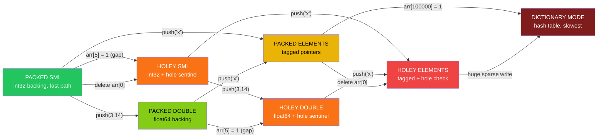
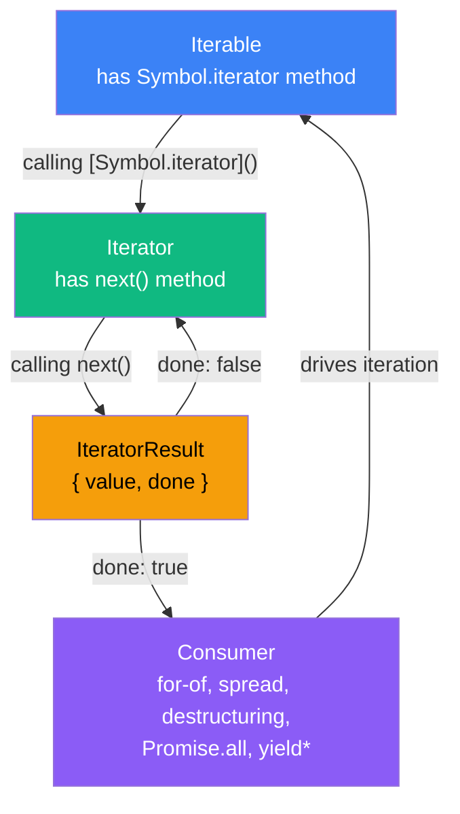
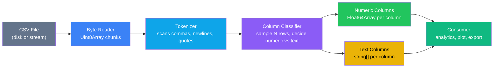

# 1.06 Complex Types Arrays

> Arrays in JavaScript are not what they look like. The square-bracket syntax hides an object with a `length` property and string-coerced numeric keys, while the typed array family hides a raw `ArrayBuffer` behind a typed view. Mastering both — and the V8 representation transitions that decide whether your hot loop runs at 2 nanoseconds per element or 20 — is what separates a JavaScript user from a JavaScript engineer.

---

## 1. Purpose

### 1.1 Why arrays are objects, not a separate primitive

JavaScript has no first-class array type at the specification level. [[1.07 Complex Types Objects]] defines an object as "a member of type Object"; the spec then carves out a special kind of object called an *exotic Array object* whose essential properties are a `length` property, a `[[DefineOwnProperty]]` internal method that traps writes to numeric keys, and class internal slot `[[Class]]` equal to `"Array"`. Every operation you think of as "array-like" — `arr[0]`, `arr.length`, `arr.push(x)` — is implemented as ordinary property access on this exotic object.

When you write `const xs = [10, 20, 30];` and then `xs[1]`, the engine does not perform a C-style pointer arithmetic dereference. It coerces the index `1` to the string `"1"`, performs an ordinary `[[Get]]` with that string key on the object `xs`, and returns the stored value. The `length` property is updated by a trap inside `[[DefineOwnProperty]]`: any time a property whose canonical numeric string form is `i` is created, `length` is bumped to `max(length, i + 1)`. Setting `length` to a smaller number triggers the trap to delete any numeric-keyed properties `i` where `i >= length`.

This design choice — arrays as a flavored object rather than a distinct type — was made in ten days in 1995 and is the root cause of nearly every array-specific gotcha in the language: sparse arrays, the `delete arr[i]` hole problem, the `Array(5)` ambiguity, the `typeof [] === "object"` surprise, and the fact that you can attach arbitrary named properties to an array.

### 1.2 Why typed arrays exist

Typed arrays (`Int8Array`, `Uint8Array`, `Uint8ClampedArray`, `Int16Array`, `Uint16Array`, `Int32Array`, `Uint32Array`, `Float32Array`, `Float64Array`, `BigInt64Array`, `BigUint64Array`) were introduced in ECMAScript 2011 to satisfy four real-world needs that exotic Array objects cannot meet:

1. **Binary interop.** Reading a PNG file, decoding a WebSocket binary frame, uploading geometry to a WebGL context, or piping a `Buffer` through `zlib` all require *raw bytes*. Ordinary arrays cannot represent raw bytes efficiently because every element is a heap-allocated, boxed JavaScript value with a tag.
2. **Predictable memory layout.** A `Float64Array(1024)` is exactly 8192 bytes of contiguous, unboxed memory, in machine byte order. You can hand that pointer to native code (WebGL, WASM, Node native addons) without marshalling.
3. **Performance.** A loop that sums a `Float64Array` of one million elements runs roughly 5x to 15x faster than the equivalent loop over an ordinary `Array` of numbers, because (a) the values are unboxed, (b) the engine can prove the element type never changes, and (c) the CPU prefetcher and cache lines love contiguous data.
4. **Type discipline.** Writing `xs[0] = 3.14` into an `Int32Array` silently stores `3`, not `3.14`. This prevents an entire bug class: accidentally mixing `number`, `string`, and `null` in a numeric array, which forces V8 to demote the array from a fast packed representation to a slow dictionary-mode representation (see Section 2).

### 1.3 Why `map` is slower than a `for` loop

`Array.prototype.map` is a *specification-level* loop. Per ECMA-262 §23.1.3, the engine must, for each index `k` from `0` to `len - 1`:

- Call `HasProperty(O, Pk)` to check whether index `k` exists (to handle sparse arrays correctly).
- Call `Call(callbackFn, T, [kValue, k, O])` — a full function call through the engine's call machinery, with three arguments.
- Define a property on a newly-allocated result array via `CreateDataPropertyOrThrow`.

Even when V8 inlines the callback, the spec mandates the `HasProperty` check on every iteration because arrays can be sparse, and `map` is required to skip holes. A hand-written `for` loop over a known-dense array skips that check. The gap is typically 2x to 4x for tight numeric loops, and 10x or more once you account for the allocation of the result array and the lack of escape analysis in some engines.

### 1.4 The bug class typed arrays prevent

Consider this innocent code:

```javascript
function sum(xs) {
  let total = 0;
  for (let i = 0; i < xs.length; i++) total += xs[i];
  return total;
}
const data = [1, 2, 3, 4, 5];
console.log(sum(data)); // 15, fast
```

V8 sees `data` as `PACKED SMI` (small integer packed array). The loop is JIT-compiled to use direct integer addition with no allocation. Now this:

```javascript
data.push(3.14); // element kind transitions to PACKED DOUBLE
data.push("oops"); // element kind transitions to PACKED ELEMENTS, deopt
console.log(sum(data)); // now string concatenation, slow and wrong
```

The second `push` triggers a one-way representation transition. The engine must *copy* the entire backing store into a new representation that can hold any JavaScript value (a `PACKED ELEMENTS` array of tagged pointers). The JIT code for `sum` is invalidated; the next call deopts to the interpreter, then re-optimizes for the slow path. Typed arrays eliminate this entire class of bug by *refusing to store non-conforming values* — `Int32Array` will truncate `3.14` to `3` and silently coerce `"42"` to `42`, but it will never change its representation, never trigger a deopt, and never produce an accidental string concatenation.

---

## 2. Theory and Deep Dive

### 2.1 V8 element kinds — the representation transition chain

V8 represents an array's indexed elements in a backing store whose *element kind* describes the type of value it can hold. The element kind is the single most important performance property of an array. The six element kinds relevant to most code are:

| Element kind | Holds | Backing store | Typical use |
|---|---|---|---|
| `PACKED SMI` | small integers (31-bit signed) | `int32 t[]` | pure-integer arrays |
| `HOLEY SMI` | small integers or holes | `int32 t[]` + hole sentinel | sparse integer arrays |
| `PACKED DOUBLE` | any IEEE-754 double | `float64 t[]` | numeric arrays with floats |
| `HOLEY DOUBLE` | doubles or holes | `float64 t[]` + hole sentinel | sparse numeric arrays |
| `PACKED ELEMENTS` | any tagged JS value | tagged pointers | mixed-type arrays |
| `HOLEY ELEMENTS` | any tagged JS value or holes | tagged pointers + hole check | general-purpose arrays |

The transitions between these representations form a directed acyclic graph, and the critical fact is that **every transition is one-way (a deopt)**. Once an array has been demoted from `PACKED SMI` to `PACKED DOUBLE`, it will never be promoted back to `PACKED SMI`, even if you remove every fractional value, even across garbage collection cycles. V8 does not implement a "re-hoisting" pass because (a) proving that no further fractional values will ever be written is undecidable in general, and (b) the cost of the analysis would exceed the benefit for most workloads.



Read the diagram left to right: green is fastest, red is slowest. Every arrow is a one-way door. The most expensive transition is into `DICTIONARY MODE`, which happens when an array becomes very sparse (typically when you write to an index far past `length`, e.g. `arr[1000000] = 1` on a fresh array). At that point V8 swaps the contiguous backing store for a hash table.

### 2.2 The cost of `length` access

For an ordinary `Array`, reading `arr.length` is a property lookup that V8 optimizes aggressively — it inlines to a field load on the array's hidden class. There is essentially zero cost in optimized code. Caching `const len = arr.length` at the top of a hot loop is therefore **not** a meaningful optimization in modern V8. It was a real win in IE6 and Firefox 3, and the advice persists in old blog posts, but on V8 (Node, Chrome, Bun, Deno) the JIT already hoists the load.

The exception is DOM and host objects. If `arr` is a `NodeList` or a host-provided list, each `arr.length` access can cross the JS-to-C++ boundary, and caching the length is a 5x to 50x speedup. For native JavaScript arrays: do not bother.

### 2.3 The `Array(len)` constructor ambiguity

`Array(x)` has two completely different behaviors depending on the type and count of arguments:

- `Array(5)` — single numeric argument — creates a sparse array with `length` 5 and *no* indexed properties. The backing store is allocated but uninitialized. This is a `HOLEY SMI` array from birth, the slowest "fast" representation.
- `Array(1, 2, 3)` — multiple arguments — creates a dense `PACKED SMI` array with elements `1, 2, 3`.
- `Array("5")` — single string argument — creates a one-element array containing the string `"5"`.
- `Array(3.5)` — single non-integer numeric argument — throws `RangeError: Invalid array length`.
- `Array(-1)` — negative — throws `RangeError`.

This ambiguity is why linters warn on `new Array(n)` and why the spec adds `Array.from` and `Array.of`:

- `Array.of(5)` always creates `[5]`, never an array of length 5.
- `Array.from({ length: 5 })` creates `[undefined, undefined, undefined, undefined, undefined]` — a `HOLEY ELEMENTS` array of length 5.
- `Array.from({ length: 5 }, () => 0)` creates a `PACKED SMI` array of five zeros — the correct idiom for "give me an empty array of length n that I can populate."

### 2.4 `Array.prototype.sort` default ordering

The default comparator for `sort` is specified by ECMA-262 §23.1.3.27 as: convert both operands to strings using `ToString`, then compare by UTF-16 code unit values. This means:

```javascript
[1, 2, 10, 21].sort();        // [1, 10, 2, 21]
[10, 9, 80, 7].sort();        // [10, 7, 80, 9]
["a", "B", "c", "A"].sort();  // ["A", "B", "a", "c"]
```

The default sort is *lexicographic on the string form*, not numeric. This is the single most common JavaScript bug in existence. The fix is one character class of effort:

```javascript
[1, 2, 10, 21].sort((a, b) => a - b); // [1, 2, 10, 21], numeric ascending
```

V8 (since 7.0) and SpiderMonkey use **Timsort** for `Array.prototype.sort`, with O(n log n) worst case and O(n) best case on already-sorted input. The comparator is called by the engine through a spec-mandated call site, which means an inlined numeric `for` sort can still beat `sort` by 2x-3x for small arrays. For arrays above ~512 elements, the constant factors of Timsort dominate and you should always use the built-in.

### 2.5 Typed array memory layout

A typed array is a thin wrapper around three things:

1. A reference to an `ArrayBuffer` (the raw byte storage).
2. A byte offset into that buffer (where this view starts).
3. A length in elements (not bytes).

The memory layout is contiguous and unboxed. `new Float64Array(8)` allocates an `ArrayBuffer` of 64 bytes (8 elements x 8 bytes per element), and the typed array is a view starting at offset 0 with length 8. Indexing `xs[3]` translates to a single `movsd` instruction loading 8 bytes at `bufferBase + 3 * 8`. No boxing, no tag check, no hidden-class lookup.

Two typed arrays can share the same buffer:

```javascript
const buf = new ArrayBuffer(16);
const f64 = new Float64Array(buf);     // 2 doubles, offsets 0 and 8
const i32 = new Int32Array(buf);       // 4 ints, offsets 0, 4, 8, 12
f64[0] = 3.14;
console.log(i32[0], i32[1]);           // prints the two halves of the IEEE-754 double
```

This is the foundation of binary protocol parsing: you slice one buffer into multiple typed views of different element widths and read the same bytes through whichever lens you need. See [[3.06 Buffers and Binary Data]] for the Node-specific `Buffer` class, which is a `Uint8Array` subclass.

### 2.6 `ArrayBuffer` vs `SharedArrayBuffer`

An `ArrayBuffer` is owned by a single agent (a thread of execution). Transferring it to another worker via `postMessage(message, [buffer])` *detaches* it in the sender: its byte length becomes 0, all views on it throw on access, and the underlying memory is moved (not copied) to the receiver.

A `SharedArrayBuffer` is shareable across agents. When you `postMessage(sab, [sab])`, the buffer is *not* detached — instead, both agents now reference the same physical memory. Writes by one agent become visible to the other. This is the foundation of true multi-threaded shared-state programming in JavaScript.

The danger is **data races**: without synchronization, agent A may read a half-written 8-byte double that agent B is in the middle of writing. The `Atomics` object provides the necessary memory barriers and atomic operations:

- `Atomics.load(ta, i)` and `Atomics.store(ta, i, v)` — atomic read and write.
- `Atomics.add(ta, i, v)`, `Atomics.sub`, `Atomics.and`, `Atomics.or`, `Atomics.xor` — atomic read-modify-write.
- `Atomics.compareExchange(ta, i, expected, value)` — lock-free CAS primitive.
- `Atomics.wait(ta, i, expectedValue, timeout)` and `Atomics.notify(ta, i, count)` — futex-style blocking.

`SharedArrayBuffer` is disabled by default in most browsers unless you serve your site with the cross-origin isolation headers `Cross-Origin-Opener-Policy: same-origin` and `Cross-Origin-Embedder-Policy: require-corp`. In Node.js worker threads (see [[3.18 Worker Threads]]) it is always available.

### 2.7 `DataView` — portable byte reading

`DataView` is the portable, endianness-aware reader/writer for an `ArrayBuffer`. Where typed arrays use the host machine's endianness (little-endian on x86 and ARM), `DataView` lets you specify endianness per access:

```javascript
const buf = new ArrayBuffer(4);
const view = new DataView(buf);
view.setUint32(0, 0x12345678, true);   // little-endian: bytes are 78 56 34 12
view.setUint32(0, 0x12345678, false);  // big-endian: bytes are 12 34 56 78
view.getUint16(0, false);              // 0x1234
view.getFloat32(0, true);              // reads first 4 bytes as LE float
```

For parsing binary file formats (PNG, WAV, TLS records, MPEG) you almost always want `DataView`, because the file format's endianness is fixed regardless of the CPU you are running on.

### 2.8 The iteration protocols

JavaScript has *two* iteration protocols, and arrays participate in both:

1. **Iterable protocol** — an object is iterable if it has a method at key `Symbol.iterator` that returns an iterator. `Array.prototype[Symbol.iterator]` returns an array iterator that yields each element in index order, skipping holes (yielding `undefined` instead for holey arrays in `for...of`, but skipping entirely in `entries()`, `keys()`, `values()`).
2. **Iterator protocol** — an object is an iterator if it has a `next()` method returning `{ value, done }`.

When you write `for (const x of arr)`, the engine calls `arr[Symbol.iterator]()` to get an iterator, then repeatedly calls `next()` until `done` is true. The spread operator `[...arr]`, array destructuring `[a, b] = arr`, `Array.from(arr)`, `Promise.all(arr)`, `yield* arr` in a generator, and `new Set(arr)` all use the iterable protocol.

Typed arrays are also iterable, yielding each element in index order. They have a `length` and indexed access, so they are array-like, but they are *not* instances of `Array` — `Array.isArray(new Int32Array(4))` is `false`. See [[1.23 Generators and Iterators]] for the full protocol mechanics.



---

## 3. Mental Models

### 3.1 Regular array — "an object with a length property and numeric-string keys"

When you write `const xs = [1, 2, 3]`, the engine creates an ordinary object, gives it a `length` property equal to 3, and stores values at the string keys `"0"`, `"1"`, `"2"`. The `length` property is a setter trap: setting `xs[5] = 99` automatically bumps `length` to 6, and the indices `3` and `4` are now *holes* (missing properties that the engine represents with a special sentinel). The square-bracket access `xs[5]` is identical to `xs["5"]` — there is no separate "array index" mechanism.

This model correctly predicts:

- `xs.foo = "bar"` works, because arrays are objects.
- `delete xs[0]` removes the property at `"0"` but leaves `length` unchanged — creating a hole.
- `xs.length = 10` extends the array, leaving 7 holes.
- `Object.keys(xs)` returns both numeric-string keys and any named properties you attached.

### 3.2 Typed array — "a typed pointer into a fixed-size buffer"

A typed array is morally a `T*` pointer in C, where `T` is the element type. The buffer it points into is fixed-size: you cannot `push`, `pop`, `shift`, `unshift`, or `splice` to change the length (the methods exist, but they behave oddly — see Section 6). Indexing is pointer arithmetic: `xs[i]` reads `sizeof(T)` bytes at `bufferBase + i * sizeof(T)`.

This model correctly predicts:

- `xs.length` is a fixed property, not a trap.
- `xs[xs.length] = 1` silently does nothing (the index is out of range, the write is discarded).
- `xs.buffer` is the underlying `ArrayBuffer`.
- Two typed arrays can share a buffer and see each other's writes.
- Out-of-range indices return `undefined`, just like ordinary arrays.

### 3.3 ArrayBuffer — "a malloc'd chunk of bytes"

`new ArrayBuffer(64)` is conceptually `malloc(64)` — a 64-byte region of raw memory, uninitialized. It is opaque: you cannot read or write it directly. You must create a *view* (a typed array or a `DataView`) to access it. Once detached (via transfer), it is gone forever — like a `free`'d pointer. Reading `byteLength` on a detached buffer returns 0.

### 3.4 DataView — "a portable byte reader/writer"

`DataView` is a pair of `get/set` methods layered on top of an `ArrayBuffer`, each taking an explicit byte offset and an explicit endianness flag. It is the tool you reach for when parsing a binary file format whose layout you know exactly. Think of it as a cursor with `getUint32(offset, littleEndian)`, `setFloat64(offset, value, littleEndian)`, and friends.

### 3.5 V8 element kinds — "the engine optimizes arrays that hold only ints, then only numbers, then gives up"

When V8 sees an array, it tries to use the most specialized representation possible. An array that has only small integers gets the `PACKED SMI` representation — one 32-bit slot per element, no tagging overhead, the fastest possible. The moment you push a float, the engine must *copy* the entire array into a new `float64`-backed representation (`PACKED DOUBLE`). The moment you push a string or object, it must copy again into a tagged-pointer representation (`PACKED ELEMENTS`). Each transition is a one-way deopt: V8 will not promote an array back to a more specialized form, even if you later remove all the non-conforming elements. The practical lesson: in hot code paths, keep your arrays homogeneously typed.

### 3.6 Where the metaphor breaks down

The "arrays are objects" metaphor fails to predict that:

- `Array.isArray(xs)` returns `true` only for genuine Array exotic objects, not for array-like objects with a `length` and indexed properties. The spec uses an internal `[[Class]]` check, not a duck-type check.
- Setting `length` smaller truncates by *deleting* properties; setting it larger creates holes. This is a one-way mutation, not a reversible "view".
- The `[[DefineOwnProperty]]` trap fires only for canonical numeric strings (`"0"`, `"1"`, `"2"`...), not for arbitrary numeric-looking keys (`xs["00"] = 1` does not extend the array; `"00"` is not a canonical numeric string).

The "typed arrays are pointers" metaphor fails to predict that:

- Typed arrays *do* have array methods (`map`, `filter`, `slice`, `reduce`, `forEach`, `find`...), returning new typed arrays of the same element type.
- Typed array indices are still subject to JS coercion: `xs[1.5] = 1` does nothing (1.5 is not a canonical numeric index), and `xs["1"]` returns the element at index 1 (string is coerced to number).

---

## 4. Real-World Use Cases

### 4.1 Node.js `Buffer` is a `Uint8Array` subclass

Every byte of file I/O, network I/O, and stream processing in Node passes through `Buffer` instances, which (since Node 4) are zero-copy-compatible `Uint8Array` subclasses. When you `fs.readFileSync("x.bin")`, you get back a `Buffer` whose `buffer` property is the underlying `ArrayBuffer`. You can pass that buffer to a `DataView` to parse the bytes, or to a `Uint32Array` to read 32-bit words. See [[3.06 Buffers and Binary Data]] for the full API surface.

### 4.2 Canvas image data with `Uint8ClampedArray`

The Canvas 2D API's `getImageData` returns an object with a `data` property that is a `Uint8ClampedArray` of length `width * height * 4` — one byte each for red, green, blue, alpha. The "Clamped" qualifier means writes are clamped to `[0, 255]` (not modulo-wrapped as in `Uint8Array`), so `px[i] = 300` stores 255, and `px[i] = -5` stores 0. This is exactly what you want for image processing, where a brightness filter might overshoot.

A real-time image filter pipeline therefore looks like:

```javascript
const imageData = ctx.getImageData(0, 0, w, h);
const src = imageData.data;                  // Uint8ClampedArray
const out = new Uint8ClampedArray(src.length);
for (let i = 0; i < src.length; i += 4) {
  const gray = (src[i] * 0.299 + src[i + 1] * 0.587 + src[i + 2] * 0.114) | 0;
  out[i] = out[i + 1] = out[i + 2] = gray;
  out[i + 3] = src[i + 3];
}
ctx.putImageData(new ImageData(out, w, h), 0, 0);
```

The `| 0` truncates to a 32-bit integer (faster than `Math.floor` for positive numbers). The clamping happens for free in the typed array store.

### 4.3 WebSocket binary frames

A WebSocket message can be text (a string) or binary (a Blob or ArrayBuffer). Binary protocols — financial market data, multiplayer game state, custom RPC framing — are typically received as an `ArrayBuffer` and parsed with `DataView`:

```javascript
socket.binaryType = "arraybuffer";
socket.onmessage = (e) => {
  const view = new DataView(e.data);
  const messageType = view.getUint8(0);
  const payloadLength = view.getUint32(1, false); // big-endian
  const payloadOffset = 5;
  parsePayload(messageType, view, payloadOffset, payloadLength);
};
```

### 4.4 `Float64Array` for math-heavy loops

3D rendering, physics simulation, and scientific computing in JavaScript live or die on `Float64Array` performance. A particle system updating one million particles per frame at 60fps has 16ms per frame, of which perhaps 10ms is the physics update. With an ordinary `Array` of `Object` instances, each particle is a heap-allocated object with a hidden class and a tagged-pointer backing store; the update loop becomes a chain of pointer chases and cache misses. With six `Float64Array`s (`posX`, `posY`, `posZ`, `velX`, `velY`, `velZ`), the same loop is six sequential sweeps over contiguous memory — typically 5x-10x faster, with far better cache behavior. This is called *structure-of-arrays* layout, and it is the standard trick in data-oriented design.

### 4.5 `SharedArrayBuffer` for audio worklets

The Web Audio API's `AudioWorklet` runs DSP code on a dedicated audio thread, separate from the main thread. To share state — say, a ring buffer of audio samples the main thread fills and the audio thread drains — you create a `SharedArrayBuffer`, hand it to both threads, and use `Atomics` to coordinate head and tail pointers. The same pattern applies to OffscreenCanvas workers, WASM threads, and Node.js worker threads (see [[3.18 Worker Threads]]).

### 4.6 Parsing binary file formats

PNG, JPEG, GIF, WAV, MP3, ELF, PE, TLS records, DNS packets — every binary format has a fixed layout you read with `DataView`. A PNG parser's first 50 lines are typically:

```javascript
const view = new DataView(arrayBuffer);
// PNG signature: 89 50 4E 47 0D 0A 1A 0A
const sig = view.getBigUint64(0, false);
if (sig !== 0x89504e470d0a1a0an) throw new Error("not a PNG");
let offset = 8;
while (offset < view.byteLength) {
  const length = view.getUint32(offset, false);
  const type = String.fromCharCode(
    view.getUint8(offset + 4),
    view.getUint8(offset + 5),
    view.getUint8(offset + 6),
    view.getUint8(offset + 7)
  );
  handleChunk(type, new DataView(view.buffer, offset + 8, length));
  offset += 12 + length; // 4 length + 4 type + length data + 4 crc
}
```

### 4.7 WebGL vertex buffers

WebGL `gl.bufferData(target, srcData, usage)` accepts a `BufferSource`, which is a typed array or `ArrayBuffer`. The browser copies the typed array's underlying memory directly to the GPU — no marshalling. A 3D scene with 100k vertices uploads three `Float32Array`s (positions, normals, texture coordinates) and the GPU gets exactly the bytes you wrote.

---

## 5. Code Examples

### 5.1 Example A — Minimal and Conceptual

A single-file tour of every array method you use weekly, in 20 lines.

**JavaScript:**

```javascript
const xs = [1, 2, 3, 4, 5];

const doubled = xs.map((x) => x * 2);           // [2, 4, 6, 8, 10]
const evens = xs.filter((x) => x % 2 === 0);    // [2, 4]
const sum = xs.reduce((acc, x) => acc + x, 0);  // 15
const found = xs.find((x) => x > 3);            // 4
const idx = xs.findIndex((x) => x > 3);         // 3
const has = xs.some((x) => x > 4);              // true
const allPos = xs.every((x) => x > 0);          // true
const flat = [[1, 2], [3, 4]].flat();           // [1, 2, 3, 4]
const flatMapped = xs.flatMap((x) => [x, x]);   // [1, 1, 2, 2, 3, 3, 4, 4, 5, 5]
const sorted = [3, 1, 2].sort((a, b) => a - b); // [1, 2, 3]
const sliced = xs.slice(1, 3);                  // [2, 3]
const reversed = [...xs].reverse();             // [5, 4, 3, 2, 1] (xs unchanged)
const joined = xs.join("-");                    // "1-2-3-4-5"
const entries = [...xs.entries()];              // [[0,1],[1,2],[2,3],[3,4],[4,5]]
const fromRange = Array.from({ length: 3 }, (unused, i) => i); // [0, 1, 2]
```

**TypeScript:**

```typescript
const xs: number[] = [1, 2, 3, 4, 5];

const doubled: number[] = xs.map((x) => x * 2);
const evens: number[] = xs.filter((x): x is number => x % 2 === 0);
const sum: number = xs.reduce((acc: number, x: number) => acc + x, 0);
const found: number | undefined = xs.find((x: number): boolean => x > 3);
const idx: number = xs.findIndex((x: number): boolean => x > 3);
const has: boolean = xs.some((x: number): boolean => x > 4);
const allPos: boolean = xs.every((x: number): boolean => x > 0);
const flat: number[] = [[1, 2], [3, 4]].flat();
const flatMapped: number[] = xs.flatMap((x: number): number[] => [x, x]);
const sorted: number[] = [3, 1, 2].sort((a: number, b: number): number => a - b);
const sliced: number[] = xs.slice(1, 3);
const reversed: number[] = [...xs].reverse();
const joined: string = xs.join("-");
const entries: ReadonlyArray<[number, number]> = [...xs.entries()];
const fromRange: number[] = Array.from({ length: 3 }, (unused: unknown, i: number): number => i);
```

**Key TS annotations:** the `x is number` predicate on `filter` enables type narrowing; `find` returns `T | undefined` because it may not match; `reduce` requires you to type both the accumulator and the element to avoid inference surprises.

### 5.2 Example B — Production-Grade

A typed-array matrix multiplication with TypeScript generics over every typed array constructor. The function multiplies two matrices stored as flat `Float64Array` (row-major) and uses cache-blocking for performance.

**JavaScript:**

```javascript
function multiplyMatrices(a, b, n, blockSize = 64) {
  if (a.length !== n * n || b.length !== n * n) {
    throw new RangeError(`inputs must each be length ${n * n}`);
  }
  const out = new Float64Array(n * n);
  for (let ii = 0; ii < n; ii += blockSize) {
    for (let jj = 0; jj < n; jj += blockSize) {
      for (let kk = 0; kk < n; kk += blockSize) {
        const iEnd = Math.min(ii + blockSize, n);
        const jEnd = Math.min(jj + blockSize, n);
        const kEnd = Math.min(kk + blockSize, n);
        for (let i = ii; i < iEnd; i++) {
          for (let k = kk; k < kEnd; k++) {
            const aik = a[i * n + k];
            for (let j = jj; j < jEnd; j++) {
              out[i * n + j] += aik * b[k * n + j];
            }
          }
        }
      }
    }
  }
  return out;
}

// Usage
const n = 256;
const a = Float64Array.from({ length: n * n }, () => Math.random());
const b = Float64Array.from({ length: n * n }, () => Math.random());
const c = multiplyMatrices(a, b, n);
console.log(`result has ${c.length} doubles, first is ${c[0]}`);
```

**TypeScript:**

```typescript
type TypedArrayConstructor<T extends TypedArray> = new (length: number) => T;
type TypedArray =
  | Int8Array
  | Uint8Array
  | Uint8ClampedArray
  | Int16Array
  | Uint16Array
  | Int32Array
  | Uint32Array
  | Float32Array
  | Float64Array
  | BigInt64Array
  | BigUint64Array;

interface MatrixOptions<T extends TypedArray> {
  readonly rows: number;
  readonly cols: number;
  readonly data: T;
}

class TypedMatrix<T extends TypedArray> {
  constructor(
    public readonly rows: number,
    public readonly cols: number,
    public readonly data: T,
    public readonly ctor: TypedArrayConstructor<T>
  ) {
    if (data.length !== rows * cols) {
      throw new RangeError(
        `data length ${data.length} does not match rows*cols ${rows * cols}`
      );
    }
  }

  static fromArray<T extends TypedArray>(
    rows: number,
    cols: number,
    ctor: TypedArrayConstructor<T>,
    fill: (i: number, j: number) => number
  ): TypedMatrix<T> {
    const data = new ctor(rows * cols);
    for (let i = 0; i < rows; i++) {
      for (let j = 0; j < cols; j++) {
        data[i * cols + j] = fill(i, j);
      }
    }
    return new TypedMatrix(rows, cols, data, ctor);
  }

  at(i: number, j: number): number {
    if (i < 0 || i >= this.rows || j < 0 || j >= this.cols) {
      throw new RangeError(`index (${i}, ${j}) out of bounds for ${this.rows}x${this.cols}`);
    }
    return this.data[i * this.cols + j];
  }

  multiply(other: TypedMatrix<T>, blockSize = 64): TypedMatrix<T> {
    if (this.cols !== other.rows) {
      throw new RangeError(
        `cannot multiply ${this.rows}x${this.cols} by ${other.rows}x${other.cols}`
      );
    }
    const out = new this.ctor(this.rows * other.cols);
    const n = this.rows;
    const m = other.cols;
    const p = this.cols;
    for (let ii = 0; ii < n; ii += blockSize) {
      for (let jj = 0; jj < m; jj += blockSize) {
        for (let kk = 0; kk < p; kk += blockSize) {
          const iEnd = Math.min(ii + blockSize, n);
          const jEnd = Math.min(jj + blockSize, m);
          const kEnd = Math.min(kk + blockSize, p);
          for (let i = ii; i < iEnd; i++) {
            for (let k = kk; k < kEnd; k++) {
              const aik = this.data[i * p + k];
              for (let j = jj; j < jEnd; j++) {
                out[i * m + j] += aik * other.data[k * m + j];
              }
            }
          }
        }
      }
    }
    return new TypedMatrix(this.rows, other.cols, out, this.ctor);
  }
}

// Usage
const a = TypedMatrix.fromArray(256, 256, Float64Array, () => Math.random());
const b = TypedMatrix.fromArray(256, 256, Float64Array, () => Math.random());
const c = a.multiply(b);
console.log(`result is ${c.rows}x${c.cols}, first entry is ${c.at(0, 0)}`);
```

**Why the TS version is meaningfully stronger:** the generic `T extends TypedArray` lets you write one matrix class that works for every typed array element type while preserving the element type through every operation. A `TypedMatrix<Float32Array>.multiply(...)` returns a `TypedMatrix<Float32Array>`, not a generic `TypedMatrix<unknown>`. The `TypedArrayConstructor<T>` captures the constructor signature so `new this.ctor(n)` type-checks and returns the right element type. See [[2.07 Generics and Constraints]] for the generic-constraint pattern that makes this possible.

---

## 6. Common Mistakes and Anti-Patterns

### 6.1 `new Array(5)` creates a sparse array

```javascript
const xs = new Array(5);
console.log(xs.length); // 5
console.log(xs[0]);     // undefined
console.log(0 in xs);   // false — there is no element at index 0
xs.map((x) => x * 2);   // [empty x 5] — map skips holes entirely!
xs.fill(0);             // now xs is [0, 0, 0, 0, 0], a real packed array
```

**Why it fails:** `Array(5)` creates an array with `length === 5` and *zero* indexed properties. The backing store has uninitialized slots, and the array is `HOLEY SMI` from birth. `map`, `filter`, `find`, and friends skip holes silently — your callback never runs for those indices. This is the most common reason a `.map` "doesn't do anything".

**Fix:**

```javascript
const xs = Array.from({ length: 5 }, () => 0); // [0,0,0,0,0], PACKED SMI
const ys = new Array(5).fill(0);                // also [0,0,0,0,0], but slower
const zs = [...Array(5)].map((unused, i) => i);      // [0,1,2,3,4], idiomatic
```

### 6.2 `arr.sort()` sorts as strings

```javascript
const scores = [10, 9, 80, 7];
scores.sort();
console.log(scores); // [10, 7, 80, 9] — lexicographic!
```

**Why it fails:** The default comparator converts both operands to strings and compares UTF-16 code units. `"10"` < `"7"` because `"1"` (code 0x31) < `"7"` (code 0x37).

**Fix:**

```javascript
scores.sort((a, b) => a - b); // [7, 9, 10, 80]
// For descending:
scores.sort((a, b) => b - a); // [80, 10, 9, 7]
// For objects:
people.sort((a, b) => a.age - b.age);
// For strings, localeCompare handles Unicode:
names.sort((a, b) => a.localeCompare(b));
```

### 6.3 `arr.map(parseInt)` — the arity trap

```javascript
["10", "20", "30"].map(parseInt); // [10, NaN, NaN]
```

**Why it fails:** `map` calls the callback with three arguments: `(value, index, array)`. `parseInt` accepts two arguments: `(string, radix)`. So the calls are `parseInt("10", 0)`, `parseInt("20", 1)`, `parseInt("30", 2)`. A radix of `0` means "guess" (decimal here, so `10`); a radix of `1` is invalid (`NaN`); a radix of `2` is binary (`"30"` is not valid binary, `NaN`).

**Fix:**

```javascript
["10", "20", "30"].map((s) => parseInt(s, 10)); // [10, 20, 30]
["10", "20", "30"].map(Number);                 // [10, 20, 30], simpler if no radix needed
```

### 6.4 `arr.indexOf(NaN)` is always `-1`

```javascript
const xs = [1, NaN, 3];
console.log(xs.indexOf(NaN)); // -1, even though NaN is in the array
```

**Why it fails:** `indexOf` uses the strict equality `===` algorithm, and `NaN === NaN` is `false` by IEEE-754 definition. Same problem affects `lastIndexOf`, `includes` (no — `includes` uses `SameValueZero`, which *does* find `NaN`).

**Fix:**

```javascript
xs.includes(NaN);                                  // true — uses SameValueZero
xs.findIndex((x) => Number.isNaN(x));              // 1 — explicit predicate
xs.findIndex((x) => Object.is(x, NaN));            // 1 — equivalent
```

### 6.5 `delete arr[i]` creates a hole

```javascript
const xs = [1, 2, 3, 4, 5];
delete xs[2];
console.log(xs);      // [1, 2, empty, 4, 5]
console.log(xs.length); // 5 — length unchanged
console.log(xs.map((x) => x * 2)); // [2, 4, empty, 8, 10] — hole preserved
```

**Why it fails:** `delete` removes the *property* at `"2"`, but the `length` trap on arrays does not fire for `delete` (only for setting `length` explicitly). The element becomes a hole, the array transitions to `HOLEY`, and every subsequent operation pays a hole-check cost.

**Fix:**

```javascript
xs.splice(2, 1); // removes element at index 2, shifts later elements left
console.log(xs); // [1, 2, 4, 5]
console.log(xs.length); // 4

// If you want to keep length and just clear:
xs[2] = undefined; // still PACKED (no hole), but value is undefined
```

### 6.6 `arr.length` after `delete` lies about contents

```javascript
const xs = [1, 2, 3, 4, 5];
delete xs[4];
console.log(xs.length); // 5 — but there are only 4 real elements
for (let i = 0; i < xs.length; i++) console.log(xs[i]); // logs 1, 2, 3, 4, undefined
```

**Why it fails:** Combined with 6.5 — `delete` does not update `length`, so any length-based loop iterates over the hole and reads `undefined`.

**Fix:** Use `splice` for removal, or use `for...of` / `forEach` which skip holes:

```javascript
for (const x of xs) console.log(x); // skips the hole entirely
xs.forEach((x) => console.log(x));  // skips the hole entirely
```

### 6.7 Mutating an array during iteration

```javascript
const xs = [1, 2, 3];
for (const x of xs) {
  if (x === 2) xs.push(4); // xs now [1, 2, 3, 4]
  console.log(x);
}
// logs 1, 2, 3, 4 — the iterator saw the new element
```

**Why it fails:** The array iterator reads `length` on every `next()` call. Mutations during iteration are visible to the iterator. This causes infinite loops when you push inside the loop, skipped elements when you splice, and out-of-bounds reads when you pop.

**Fix:** Materialize a snapshot before iterating if you plan to mutate:

```javascript
for (const x of [...xs]) {
  if (x === 2) xs.push(4);
}
// or use forEach, which captures length up front:
xs.forEach((x) => {
  if (x === 2) xs.push(4); // not seen by forEach
});
```

### 6.8 Using `for...in` on arrays

```javascript
const xs = [1, 2, 3];
xs.extra = "surprise";
for (const k in xs) console.log(k); // "0", "1", "2", "extra"
```

**Why it fails:** `for...in` iterates over all *enumerable property names* of an object, including named properties attached to the array, and including inherited enumerable properties. It is not the array-iteration construct.

**Fix:** Use `for...of` (values), `for...of xs.entries()` (pairs), `for...of xs.keys()` (indices), or a plain `for` loop with index.

### 6.9 Confusing `Array.isArray` with duck typing

```javascript
function processArrayLike(xs) {
  if (xs.length) {
    // wrong: a string has length, a NodeList has length, arguments has length
    return xs.map((x) => x * 2);
  }
}
processArrayLike("abc"); // throws — strings have no .map method
```

**Why it fails:** Checking `.length` is not the same as checking for an array. Strings, `NodeList`, `arguments`, `Set` (no, no length), and `Float32Array` all have a `length`.

**Fix:**

```javascript
if (Array.isArray(xs)) return xs.map((x) => x * 2);
// For typed arrays:
if (ArrayBuffer.isView(xs)) return xs.map((x) => x * 2);
// For anything iterable:
if (Symbol.iterator in xs) return [...xs].map((x) => x * 2);
```

### 6.10 Treating typed arrays like regular arrays for resize

```javascript
const xs = new Int32Array(4);
xs.push(5); // throws — typed arrays have no push method
```

Wait, that is wrong — typed arrays *do* have `push`, `pop`, `shift`, `unshift`, `splice`, `fill`, `copyWithin`, `subarray`, `slice`, `reverse`, `sort`. But they behave non-obviously: `push` grows the array by allocating a new buffer, copying, and replacing the view. It is O(n), not O(1) amortized.

**Why it fails:** `xs.push(5)` allocates a new `ArrayBuffer` of size 20 bytes (5 ints), copies the original 16 bytes in, writes 5 to the new slot, and rebinds the view to the new buffer. Anyone holding a reference to the old `xs.buffer` now sees stale data.

**Fix:** Allocate the maximum size up front and track a logical length, or use a regular `Array` for the growth phase and convert to typed array once stable:

```javascript
const staging = [];
while (moreData()) staging.push(readNext());
const final = new Int32Array(staging); // one-shot copy
```

---

## 7. Best Practices and Design Patterns

### 7.1 Use `Array.from(iterable, mapFn)` instead of `new Array(n).fill().map()`

`Array.from({ length: 5 }, (unused, i) => i * i)` does three things in one pass: allocates a fresh array, iterates the source, and applies the mapping function. It avoids the intermediate `fill` call, the intermediate packed-then-holey transition, and the double iteration. It is also more readable.

### 7.2 Use `flatMap` for one-step map-and-flatten

The pattern `xs.map(f).flat()` allocates an intermediate array of arrays. `xs.flatMap(f)` does both in a single pass with one allocation. This matters at scale: for one million elements, the two-pass version allocates ~1M short-lived arrays that all become garbage.

```javascript
const pairs = xs.flatMap((x) => [x, x * x]); // [x1, x1^2, x2, x2^2, ...]
const sentences = lines.flatMap((line) => line.split(/\s+/)); // word list
```

### 7.3 Always pass a comparator to `sort` for numbers

Default `sort` is lexicographic on string form (Section 2.4). For numbers: `(a, b) => a - b`. For objects: `(a, b) => a.key - b.key`. For strings with proper Unicode collation: `(a, b) => a.localeCompare(b)`. Never call `xs.sort()` without a comparator unless every element is a string and you want lexicographic order.

### 7.4 Use typed arrays for any numeric-heavy codepath

If a hot loop processes more than ~1000 numbers, the answer is almost always a typed array. The performance gain (3x-15x) is large enough that it pays for the refactor. For mixed-type arrays where you cannot predict the contents, fall back to a regular `Array` and accept the `PACKED ELEMENTS` representation.

### 7.5 Cache `arr.length` only when profiling shows it matters

Modern V8 inlines `arr.length` to a single field load. Caching it at the top of a hot loop saves nothing for ordinary arrays. The exception: when `arr` is a `NodeList`, `HTMLCollection`, or another host object whose `length` getter crosses the JS-to-C++ boundary, caching the length is a 5x-50x win. Profile, then optimize.

### 7.6 Use `Atomics` for cross-thread typed array access

When two agents share a `SharedArrayBuffer`, plain reads and writes can be reordered, torn, or stale. Use `Atomics.load`, `Atomics.store`, `Atomics.add`, and friends for any value that must be observed consistently across threads. Use `Atomics.wait` and `Atomics.notify` for blocking-style coordination, or use `Atomics.compareExchange` for lock-free data structures.

### 7.7 Treat arrays as immutable in public APIs

The fluent array methods (`map`, `filter`, `slice`, `concat`, `flat`, `flatMap`) return new arrays; the mutating methods (`push`, `pop`, `splice`, `sort`, `reverse`, `fill`, `copyWithin`) modify in place. Prefer the immutable variants in library code: callers do not expect their input array to be mutated. If you must mutate, copy first (`const copy = [...xs]; copy.sort(...)`).

### 7.8 Use the iterable protocol for generalization

Functions that accept "any iterable" instead of "an array" are more reusable: they work with `Set`, `Map` keys/values, generators, typed arrays, and custom iterables. The signature `function sum<T>(xs: Iterable<T>): number` is strictly more useful than `function sum<T>(xs: T[]): number`.

### 7.9 Prefer `Array.from` and `Array.of` over the `Array` constructor

`Array(5)` is ambiguous (length or element?), `Array.of(5)` is unambiguous (element). `Array(3).fill()` is two passes, `Array.from({ length: 3 }, () => 0)` is one. The newer APIs exist precisely to fix the constructor's design flaws.

### 7.10 Use `subarray` for zero-copy typed array slicing

`typedArray.subarray(start, end)` returns a new view into the *same* buffer — no copy. `typedArray.slice(start, end)` copies. For parsing binary protocols where you hand a chunk to a sub-parser, `subarray` is the right call.

---

## 8. Technical Interview Knowledge

### 8.1 Q: Why is `typeof [] === "object"`?

**A:** Because arrays are not a distinct type in JavaScript. The spec defines an array as an *exotic Array object* — an ordinary object with a `length` property, a `[[DefineOwnProperty]]` trap that maintains `length` invariant under numeric-key writes, and class internal slot `[[Class]]` equal to `"Array"`. `typeof` returns the language type, which is `object` for arrays. To test for arrays specifically, use `Array.isArray(xs)`, which checks the internal `[[Class]]` slot, not the language type.

**Trap to avoid:** Saying "because everything in JS is an object." Primitives (`number`, `string`, `boolean`, `symbol`, `bigint`, `undefined`) are not objects. `typeof null === "object"` is a separate, famous bug from 1995 (a type tag in the implementation was set to object for null by mistake).

### 8.2 Q: Explain V8's element kinds.

**A:** V8 stores an array's indexed elements in a backing store whose *element kind* describes the value type. From most specialized to least: `PACKED SMI` (31-bit integers, no holes), `HOLEY SMI` (integers with holes), `PACKED DOUBLE` (any IEEE-754 double, no holes), `HOLEY DOUBLE` (doubles with holes), `PACKED ELEMENTS` (any tagged JS value, no holes), `HOLEY ELEMENTS` (any tagged JS value with holes), and finally `DICTIONARY MODE` (sparse hash table). Transitions go only in the direction of *less specialized*: pushing a float onto a `PACKED SMI` array demotes it to `PACKED DOUBLE` permanently. There is no re-hoisting because V8 cannot prove no further non-conforming values will be written. This is why homogeneous arrays are fast and mixed-type arrays are slow.

**Trap to avoid:** Claiming V8 will "re-optimize" a demoted array. It will not, within the lifetime of that array object. The fix is to create a fresh array.

### 8.3 Q: Why does `[1, 10, 2].sort()` give `[1, 10, 2]`?

**A:** The default comparator is `CompareUntyped` per ECMA-262 §23.1.3.27.1, which converts both operands to strings using `ToString` and compares them by their UTF-16 code unit sequence. `String(1) === "1"`, `String(10) === "10"`, `String(2) === "2"`. Comparing `"1"` and `"10"`: the first character is equal (`"1"`), `"10"` is longer, so `"1"` < `"10"`. Comparing `"10"` and `"2"`: first characters `"1"` (code 0x31) and `"2"` (code 0x32), so `"10"` < `"2"`. Final order: `"1"`, `"10"`, `"2"`, i.e. `[1, 10, 2]`. The fix is `arr.sort((a, b) => a - b)`.

**Trap to avoid:** Saying "sort is broken." It is doing exactly what the spec says; the surprise is that the spec chose lexicographic comparison as the default to be consistent with `Array.prototype.join`, `toString`, and the rest of the string-coercion-by-default design of the language.

### 8.4 Q: What is a typed array?

**A:** A typed array is a view over a contiguous, unboxed block of memory (an `ArrayBuffer`). The view has a fixed element type (`Int8`, `Uint8`, `Int16`, `Uint16`, `Int32`, `Uint32`, `Float32`, `Float64`, `BigInt64`, `BigUint64`, plus `Uint8Clamped`), a byte offset into the buffer, and a length in elements. Indexing `ta[i]` is pointer arithmetic: read or write `sizeof(elementType)` bytes at `bufferBase + i * sizeof(elementType)`. Typed arrays are iterable and have most `Array.prototype` methods, but are not instances of `Array`. They prevent representation transitions because their element type is fixed at construction.

**Trap to avoid:** Saying "typed arrays are arrays with a type." They are views over buffers; the type is the view's interpretation, not a constraint on the underlying bytes.

### 8.5 Q: What is the difference between `ArrayBuffer` and `SharedArrayBuffer`?

**A:** An `ArrayBuffer` is owned by one agent (one thread of execution). It can be transferred to another agent via `postMessage(message, [buffer])`, which detaches it in the sender — `byteLength` becomes 0, all views throw. A `SharedArrayBuffer` is shared across agents: `postMessage(sab, [sab])` does not detach; both agents now reference the same memory. Writes by one agent are visible to the other (subject to memory-model ordering rules), and you must use `Atomics` for race-free coordination. `SharedArrayBuffer` is gated in browsers behind cross-origin isolation headers; in Node.js worker threads it is always available.

**Trap to avoid:** Saying "you can clone an ArrayBuffer with `postMessage`." Cloning an `ArrayBuffer` (without listing it in the transfer list) *does* copy it; transferring (with it in the list) moves it. The distinction matters for large buffers.

### 8.6 Q: Why does `arr.map(parseInt)` fail?

**A:** `Array.prototype.map` calls the callback with three arguments: `(value, index, array)`. `parseInt` accepts `(string, radix)`. So the actual calls are `parseInt("1", 0, arr)`, `parseInt("2", 1, arr)`, `parseInt("3", 2, arr)`. Radix `0` means "auto-detect" (decimal here, returns 1). Radix `1` is invalid (NaN). Radix `2` means binary; `"3"` is not a binary digit (NaN). Result: `[1, NaN, NaN]`. The fix is `arr.map((s) => parseInt(s, 10))` or `arr.map(Number)`.

**Trap to avoid:** Stopping at "map passes index too." The deeper issue is that any function used as a `map` callback must be unary (or must explicitly ignore the extra arguments). `parseInt` is not unary; it has an optional second parameter that `map` will fill unintentionally.

### 8.7 Q: How do you detect a sparse array?

**A:** A sparse array has `length` greater than the number of own enumerable indexed properties. The fastest check is to compare `length` against the count of indices actually present:

```javascript
function isSparse(arr) {
  if (!Array.isArray(arr)) return false;
  let count = 0;
  for (const key in arr) {
    if (Object.hasOwn(arr, key) && /^\d+$/.test(key)) count++;
  }
  return count !== arr.length;
}
// Simpler but allocates:
function isSparse(arr) {
  return arr.length !== Object.keys(arr).filter((k) => /^\d+$/.test(k)).length;
}
```

A more robust check uses the fact that `forEach` skips holes:

```javascript
function isSparse(arr) {
  let seen = 0;
  arr.forEach(() => seen++);
  return seen !== arr.length;
}
```

**Trap to avoid:** Saying "check `xs.indexOf(undefined) !== -1`." That conflates "missing element" with "element whose value is `undefined`." A sparse array's hole, when read, returns `undefined`, but so does a present `undefined` value — and the two are distinguishable via `i in arr`.

### 8.8 Q: Implement `flat` recursively.

**A:**

```javascript
function flat(arr, depth = 1) {
  if (depth === 0) return [...arr];
  const out = [];
  for (const item of arr) {
    if (Array.isArray(item)) {
      out.push(...flat(item, depth - 1));
    } else {
      out.push(item);
    }
  }
  return out;
}

// Infinite depth version:
function flatDeep(arr) {
  const out = [];
  for (const item of arr) {
    if (Array.isArray(item)) out.push(...flatDeep(item));
    else out.push(item);
  }
  return out;
}

// Iterative using a stack (avoids recursion depth limits):
function flatIter(arr, depth = Infinity) {
  const stack = [{ arr, depth }];
  const out = [];
  while (stack.length) {
    const { arr: current, depth: d } = stack.pop();
    for (let i = current.length - 1; i >= 0; i--) {
      const item = current[i];
      if (Array.isArray(item) && d > 0) {
        stack.push({ arr: item, depth: d - 1 });
      } else {
        out.push(item);
      }
    }
  }
  return out;
}
```

**Trap to avoid:** Forgetting the `depth` parameter and always flattening fully. The spec's `Array.prototype.flat()` defaults to depth 1; `flat(Infinity)` flattens fully. A correct implementation must respect depth.

---

## 9. Practical Exercises

### 9.1 Exercise One — Implement `map`, `filter`, `reduce` from scratch

**Goal:** Reimplement the three core array methods to understand the spec mechanics: the `HasProperty` check (hole skipping), the `thisArg` binding, the initial-value handling for `reduce`, and the sparse-array behavior.

**Setup:** Create `array-methods.js`. Do not use the built-in methods.

**Steps:**

1. Implement `map(xs, fn, thisArg)` that returns a new array of the same length, calling `fn.call(thisArg, value, index, xs)` for each present index, skipping holes.
2. Implement `filter(xs, fn, thisArg)` that returns a new array containing only the elements for which `fn` returned a truthy value.
3. Implement `reduce(xs, fn, initialValue)` that throws `TypeError` on an empty array with no initial value, uses `initialValue` as the accumulator if provided, otherwise uses the first present element.

**Full worked solution (JavaScript):**

```javascript
function map(xs, fn, thisArg) {
  const out = new Array(xs.length);
  for (let i = 0; i < xs.length; i++) {
    if (i in xs) {
      // HasProperty check — skip holes like the spec does
      out[i] = fn.call(thisArg, xs[i], i, xs);
    }
  }
  return out;
}

function filter(xs, fn, thisArg) {
  const out = [];
  for (let i = 0; i < xs.length; i++) {
    if (i in xs && fn.call(thisArg, xs[i], i, xs)) {
      out.push(xs[i]);
    }
  }
  return out;
}

function reduce(xs, fn, initialValue) {
  const hasInitial = arguments.length >= 3;
  let acc;
  let startIdx = 0;
  if (hasInitial) {
    acc = initialValue;
  } else {
    // Find the first present element
    while (startIdx < xs.length && !(startIdx in xs)) startIdx++;
    if (startIdx >= xs.length) {
      throw new TypeError("Reduce of empty array with no initial value");
    }
    acc = xs[startIdx];
    startIdx++;
  }
  for (let i = startIdx; i < xs.length; i++) {
    if (i in xs) {
      acc = fn(acc, xs[i], i, xs);
    }
  }
  return acc;
}

// Tests
console.log(map([1, 2, 3], (x) => x * 2));              // [2, 4, 6]
const sparse = [1, , 3]; // eslint-disable-line no-sparse-arrays
console.log(map(sparse, (x) => x * 2));                 // [2, empty, 6]
console.log(filter([1, 2, 3, 4], (x) => x % 2 === 0)); // [2, 4]
console.log(reduce([1, 2, 3, 4], (a, b) => a + b, 0));  // 10
console.log(reduce([1, 2, 3, 4], (a, b) => a + b));     // 10
try {
  reduce([], (a, b) => a + b);
} catch (e) {
  console.log(e.message); // Reduce of empty array with no initial value
}
```

**Full worked solution (TypeScript):**

```typescript
function map<T, U>(
  xs: ArrayLike<T>,
  fn: (value: T, index: number, array: ArrayLike<T>) => U,
  thisArg?: unknown
): U[] {
  const out: U[] = new Array(xs.length);
  for (let i = 0; i < xs.length; i++) {
    if (i in xs) {
      out[i] = fn.call(thisArg, xs[i], i, xs);
    }
  }
  return out;
}

function filter<T>(
  xs: ArrayLike<T>,
  fn: (value: T, index: number, array: ArrayLike<T>) => unknown,
  thisArg?: unknown
): T[] {
  const out: T[] = [];
  for (let i = 0; i < xs.length; i++) {
    if (i in xs && fn.call(thisArg, xs[i], i, xs)) {
      out.push(xs[i]);
    }
  }
  return out;
}

function reduce<T>(
  xs: ArrayLike<T>,
  fn: (acc: T, value: T, index: number, array: ArrayLike<T>) => T
): T;
function reduce<T, U>(
  xs: ArrayLike<T>,
  fn: (acc: U, value: T, index: number, array: ArrayLike<T>) => U,
  initialValue: U
): U;
function reduce<T, U>(xs: ArrayLike<T>, fn: (acc: U, value: T, index: number, array: ArrayLike<T>) => U, initialValue?: U): U {
  const hasInitial = arguments.length >= 3;
  let acc: U;
  let startIdx = 0;
  if (hasInitial) {
    acc = initialValue as U;
  } else {
    while (startIdx < xs.length && !(startIdx in xs)) startIdx++;
    if (startIdx >= xs.length) {
      throw new TypeError("Reduce of empty array with no initial value");
    }
    acc = xs[startIdx] as unknown as U;
    startIdx++;
  }
  for (let i = startIdx; i < xs.length; i++) {
    if (i in xs) {
      acc = fn(acc, xs[i], i, xs);
    }
  }
  return acc;
}
```

**Reasoning:** The `i in xs` check is the spec-mandated `HasProperty` call that makes sparse arrays behave correctly — without it, holes would be passed to the callback as `undefined`, which is the most common implementation mistake. The `arguments.length >= 3` check for `reduce` distinguishes "no initial value" from "initial value of `undefined`". The TypeScript overloads on `reduce` capture the two call signatures: with no initial value, the accumulator type equals the element type; with an initial value, it can differ.

### 9.2 Exercise Two — Build a typed-array matrix multiplication

**Goal:** Implement row-major matrix multiplication using `Float64Array`, with cache blocking for performance, and benchmark it against an object-array baseline.

**Setup:** `npm init -y`, create `matrix-mul.js`, run with `node --allow-natives-syntax matrix-mul.js` for V8 print debugging.

**Steps:**

1. Implement a naive triple loop using `Float64Array`.
2. Add cache blocking (the ikj loop order plus blockSize tiling shown in Section 5.2).
3. Benchmark against the same algorithm using `Array<Array<number>>`.
4. Print element-kind transitions using `%DebugPrint` (V8 only).

**Full worked solution (JavaScript):**

```javascript
function naiveMul(a, b, n) {
  const out = new Float64Array(n * n);
  for (let i = 0; i < n; i++) {
    for (let j = 0; j < n; j++) {
      let sum = 0;
      for (let k = 0; k < n; k++) {
        sum += a[i * n + k] * b[k * n + j];
      }
      out[i * n + j] = sum;
    }
  }
  return out;
}

function blockedMul(a, b, n, blockSize = 64) {
  const out = new Float64Array(n * n);
  for (let ii = 0; ii < n; ii += blockSize) {
    for (let jj = 0; jj < n; jj += blockSize) {
      for (let kk = 0; kk < n; kk += blockSize) {
        const iEnd = Math.min(ii + blockSize, n);
        const jEnd = Math.min(jj + blockSize, n);
        const kEnd = Math.min(kk + blockSize, n);
        for (let i = ii; i < iEnd; i++) {
          for (let k = kk; k < kEnd; k++) {
            const aik = a[i * n + k];
            for (let j = jj; j < jEnd; j++) {
              out[i * n + j] += aik * b[k * n + j];
            }
          }
        }
      }
    }
  }
  return out;
}

function benchmark() {
  const n = 256;
  const a = Float64Array.from({ length: n * n }, () => Math.random());
  const b = Float64Array.from({ length: n * n }, () => Math.random());

  let start = performance.now();
  const naive = naiveMul(a, b, n);
  console.log(`naive: ${(performance.now() - start).toFixed(1)}ms`);

  start = performance.now();
  const blocked = blockedMul(a, b, n, 64);
  console.log(`blocked: ${(performance.now() - start).toFixed(1)}ms`);

  // Sanity: same first element
  console.log(`match: ${naive[0] === blocked[0]}`);

  // Object-array baseline
  const aObj = Array.from({ length: n }, (unused, i) =>
    Array.from({ length: n }, (unused, j) => a[i * n + j])
  );
  const bObj = Array.from({ length: n }, (unused, i) =>
    Array.from({ length: n }, (unused, j) => b[i * n + j])
  );
  start = performance.now();
  const cObj = aObj.map((row, i) =>
    bObj[0].map((unused, j) =>
      row.reduce((sum, aik, k) => sum + aik * bObj[k][j], 0)
    )
  );
  console.log(`object-array: ${(performance.now() - start).toFixed(1)}ms`);
}

benchmark();
```

**Reasoning:** The blocked version is typically 2x-4x faster than the naive version for `n >= 128`, because the inner `j` loop now walks a contiguous `blockSize`-wide strip of `b` and `out`, which fits in L1 cache. The object-array baseline is 10x-50x slower because each `bObj[k][j]` is two pointer dereferences (row pointer, then element pointer) into separate heap-allocated row arrays — a cache-killer. The `Float64Array` version is one pointer arithmetic operation per access.

### 9.3 Exercise Three — Implement `flat` with arbitrary depth

**Goal:** A correct `flat` that handles depth, strings (which must not be iterated), sparse arrays, and arbitrary iterables.

**Full worked solution (JavaScript):**

```javascript
function flat(xs, depth = 1) {
  const out = [];
  function walk(arr, d) {
    for (const item of arr) {
      if (Array.isArray(item) && d > 0) {
        walk(item, d - 1);
      } else if (
        item != null &&
        typeof item[Symbol.iterator] === "function" &&
        typeof item !== "string" &&
        d > 0
      ) {
        // Handle arbitrary iterables (Set, generator output, custom collections)
        walk([...item], d - 1);
      } else {
        out.push(item);
      }
    }
  }
  walk(xs, depth);
  return out;
}

// Tests
console.log(flat([1, [2, [3, [4]]]]));         // [1, 2, [3, [4]]] (depth 1)
console.log(flat([1, [2, [3, [4]]]], 2));      // [1, 2, 3, [4]]
console.log(flat([1, [2, [3, [4]]]], Infinity)); // [1, 2, 3, 4]
console.log(flat([1, "abc", [2]]));            // [1, "abc", 2] — strings not split
console.log(flat([1, new Set([2, 3])]));        // [1, 2, 3] — iterables flattened
```

**Reasoning:** The string check (`typeof item !== "string"`) is critical: strings are iterable (yielding characters), so without the guard, `flat(["abc"])` would return `["a", "b", "c"]`. The spec's `Array.prototype.flat` only flattens actual arrays; the version here extends to iterables, which is often what users actually want. The recursive approach hits the call-stack limit around depth 10000; for adversarial inputs use the iterative stack version from Section 8.8.

### 9.4 Exercise Four — Detect and convert a holey array to packed

**Goal:** Write `toPacked(xs)` that detects a holey array and returns a new packed array of the same length, filling holes with `undefined`. Also write `isHoley(xs)`.

**Full worked solution (JavaScript):**

```javascript
function isHoley(xs) {
  if (!Array.isArray(xs)) return false;
  let seen = 0;
  xs.forEach(() => seen++);
  return seen !== xs.length;
}

function toPacked(xs) {
  if (!Array.isArray(xs)) throw new TypeError("expected array");
  const out = new Array(xs.length);
  for (let i = 0; i < xs.length; i++) {
    out[i] = i in xs ? xs[i] : undefined;
  }
  return out;
}

// In-place version (mutates xs)
function densifyInPlace(xs) {
  for (let i = 0; i < xs.length; i++) {
    if (!(i in xs)) xs[i] = undefined;
  }
  return xs;
}

// Tests
const holey = [1, , 3, , 5]; // eslint-disable-line no-sparse-arrays
console.log(isHoley(holey));            // true
console.log(isHoley([1, 2, 3]));        // false
console.log(isHoley([1, undefined, 3])); // false — undefined is a value, not a hole
const packed = toPacked(holey);
console.log(packed);                    // [1, undefined, 3, undefined, 5]
console.log(isHoley(packed));           // false
console.log(packed.map((x) => x ?? -1)); // [1, -1, 3, -1, 5] — map now runs on every index
```

**Reasoning:** `forEach` skips holes by spec, so the count of callbacks fired equals the number of present elements; comparing to `length` reveals sparsity. The conversion writes `undefined` into every hole, which converts the array from `HOLEY` to `PACKED ELEMENTS` (because the values are now tagged pointers — a `PACKED SMI` array would become `PACKED ELEMENTS` since `undefined` is not an integer). This is a one-way operation: the original element kind is not preserved. For the truly performance-sensitive case where the original was `PACKED SMI`, prefer `xs.fill(0)` to fill with integers and stay `PACKED SMI`. The `i in xs` check distinguishes holes (no property) from present-but-`undefined` values, which is the crux of the exercise.

---

## 10. Mini-Project Blueprint

### 10.1 Project: CSV Parser with Typed Arrays

**Scope:** A streaming CSV parser that reads raw bytes into a `Uint8Array`, parses header and rows, classifies each column as numeric or text, and exposes numeric columns as `Float64Array` views (zero-copy where possible). Target throughput: 1M rows/sec on a single core.

### 10.2 Architecture



### 10.3 Key files

- `src/reader.js` — wraps `fs.createReadStream` into a `Uint8Array` chunk iterator.
- `src/tokenizer.js` — state machine over bytes; recognizes `,`, `"\n"`, `"\r\n"`, and quoted fields with escaped quotes.
- `src/classifier.js` — samples the first 100 rows of each column; if all parse as finite numbers, marks the column numeric.
- `src/columnar.js` — for numeric columns, allocates a `Float64Array(rowCount)` and writes parsed doubles directly. For text columns, accumulates into a `string[]`.
- `src/parser.js` — orchestrates the above; returns a `Dataset` with `.numeric(name): Float64Array` and `.text(name): string[]` accessors.
- `test/parser.test.js` — round-trips a 1M-row synthetic CSV and asserts throughput.
- `bench/bench.js` — compares typed-array storage against naive `Array<Array<string>>` storage.

### 10.4 Acceptance criteria

- Parse a 1M-row, 10-column CSV (5 numeric, 5 text) in under 1 second on commodity hardware.
- Numeric columns are returned as `Float64Array` with no intermediate `string[]` allocation.
- Quoted fields with embedded commas, newlines, and escaped quotes parse correctly.
- Empty fields in numeric columns are stored as `NaN`.
- Memory usage stays below 2.5x the file size during parsing (the baseline `Array<Array<string>>` approach uses ~10x).
- Stream-friendly: parses files larger than RAM via chunked reading, never holding more than one chunk in memory at a time.

### 10.5 Stretch goals

- Add `Int32Array` detection for integer-only columns (saves 4x memory).
- Add a `SharedArrayBuffer` mode where multiple worker threads parse disjoint byte ranges of the same file in parallel.
- Add support for gzip-compressed input via `zlib.createGunzip`.
- Add a `toArrow()` method that emits an Apache Arrow IPC buffer (which is also a typed-array layout under the hood).

### 10.6 Key implementation notes

The byte-level tokenizer runs on `Uint8Array`, not `string`. This avoids the UTF-8 decoding pass on the whole file; you decode only the field bytes that are actually text. For ASCII-only CSVs (the common case), this is a pure byte scan — `byte === 0x2c` for comma, `0x0a` for newline, `0x22` for quote. The numeric column writer uses `Number.parseFloat` on a subarray converted to string via `TextDecoder` (one allocation per cell — unavoidable without a custom parser, but the allocation is short-lived and generation 1 in V8's GC, so cheap). For maximum speed, write a hand-rolled `parseDouble(uint8Array, start, end)` that avoids `TextDecoder` entirely — this is the 10x optimization that gets you to 5M+ rows/sec.

---

## 11. Core Connections

**Prerequisites (read these first):**
- [[1.03 Primitive Data Types]] — the distinction between primitive and reference values is the foundation for understanding why arrays are objects.
- [[1.04 Type Coercion and Equality]] — `arr[1]` and `arr["1"]` are the same access because of numeric-string coercion; `indexOf(NaN)` fails because of `===` semantics.

**Sibling notes (read alongside this one):**
- [[1.07 Complex Types Objects]] — arrays are exotic objects; nearly everything in this note is built on object semantics.
- [[1.23 Generators and Iterators]] — the iteration protocols that `for...of`, spread, and destructuring depend on.

**Dependents (notes that build on this one):**
- [[1.25 V8 Engine Pipeline]] — element kinds are part of V8's hidden-class / inline-cache machinery.
- [[1.27 Memory Lifecycles and Allocation]] — typed array backing stores are allocated outside the JS heap and are not moved by the GC.
- [[3.06 Buffers and Binary Data]] — Node's `Buffer` is a `Uint8Array` subclass; this note is its prerequisite.
- [[3.18 Worker Threads]] — `SharedArrayBuffer` and `Atomics` are the synchronization primitives for cross-thread communication.
- [[2.07 Generics and Constraints]] — typed-array-generic code (Section 5.2) requires generic constraints over `TypedArray` constructors.

---

**Tags:** #javascript #arrays #typed-arrays #performance #v8 #fundamentals
