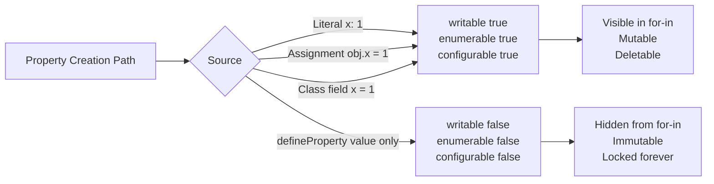
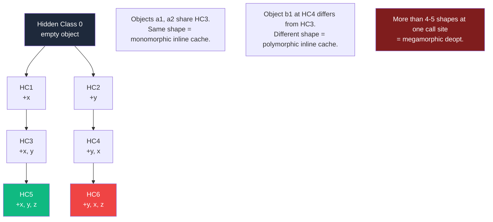
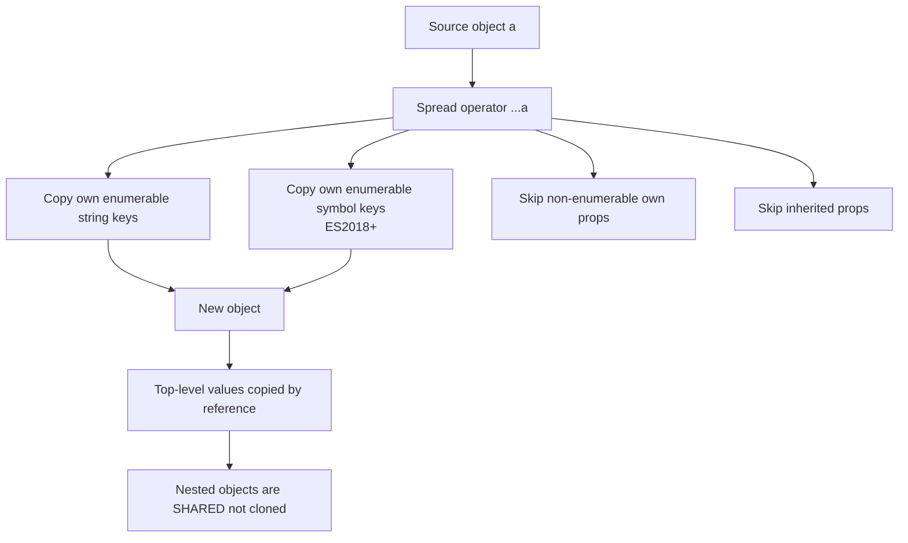
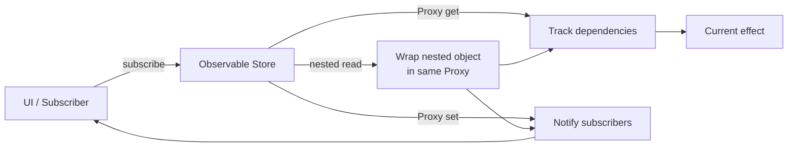

# 1.07 Complex Types Objects

## 1. Purpose

In JavaScript, the **object** is the single most important non-primitive data structure. Almost everything that is not a primitive value (string, number, boolean, null, undefined, symbol, bigint) is, ultimately, an object or behaves like one. Functions are objects with a callable internal slot. Arrays are objects with a magic `length` property and exotic integer-keyed behaviour. Regular expressions, dates, errors, and typed arrays are all objects. Even the global scope in a browser ishing back to an object (`globalThis`). If you understand objects deeply, you understand most of JavaScript.

This note exists because objects in JavaScript are not just "hash maps with string keys." They are a layered abstraction. At the **language level**, an object is a collection of properties where each property is described by a *descriptor* — a small record that controls whether the property can be rewritten, enumerated, deleted, or replaced with a getter/setter pair. At the **engine level** (specifically in V8), an object is a structured memory layout whose *shape* is tracked by a hidden class, and the layout can flip between a fast in-object representation and a slow dictionary representation depending on how the object is used.

Three questions motivate the entire note:

1. **Why do property descriptors exist?** Because real programs need fine-grained control over mutation, visibility, and encapsulation. Without descriptors you cannot build `Object.freeze`, you cannot implement prototype protection, you cannot define read-only computed properties, and you cannot implement lazy getters. The descriptor system is the language's escape hatch from "everything is mutable and enumerable by default."

2. **Why do hidden classes matter?** Because V8's optimising compiler (TurboFan) uses the hidden class of an object to generate inline caches and to monomorphise call sites. Two objects that share a hidden class can be operated on by the same compiled machine code. Two objects with different hidden classes force polymorphic inline caches, and past a threshold (typically five shapes), the call site becomes *megamorphic* and the optimiser gives up. Understanding this is the difference between a developer who writes "objects as hash maps" and one who writes code the engine can actually make fast.

3. **Why does `Map` exist when objects are already dictionaries?** Because objects make a poor dictionary in three concrete ways. First, object keys are implicitly coerced to strings (or symbols); you cannot use an object, a function, or a number as a key without losing the original reference. Second, objects inherit from `Object.prototype`, so a key like `"toString"` or the double-underscore prototype accessor collides with inherited properties and produces security bugs and surprising iteration results. Third, the iteration semantics of an object are entangled with its prototype chain and with integer-index-like keys, making deterministic iteration fragile. `Map` solves all three: it uses the SameValueZero equality for keys (any value, including `NaN`, works), it has no prototype chain, and it iterates in strict insertion order. `WeakMap` and `WeakSet` go further: they allow keys to be garbage collected when no other reference exists, which is the foundation of metadata attachment patterns (e.g. associating data with DOM nodes without leaking them).

If objects did not exist in their full form (descriptors, hidden classes, `Map`/`WeakMap`), JavaScript could not serve as a host for frameworks like React (immutable state trees), Vue (Proxy-based reactivity), or Redux (frozen store trees), and it could not deliver the performance required for production-scale servers in Node.js. The object is the load-bearing data structure of the entire ecosystem.

## 2. Theory and Deep Dive

### 2.1 The Specification View

ECMAScript defines an ordinary object as a record with several internal slots: `[[Prototype]]`, `[[Extensible]]`, and a list of property keys each backed by a *property descriptor*. A property descriptor is itself a record with one of two shapes:

- A **data descriptor** has slots `[[Value]]`, `[[Writable]]`, `[[Enumerable]]`, `[[Configurable]]`.
- An **accessor descriptor** has slots `[[Get]]`, `[[Set]]`, `[[Enumerable]]`, `[[Configurable]]`.

The attributes `writable`, `enumerable`, and `configurable` are the heart of the descriptor system. `configurable: false` locks the descriptor itself — you can no longer change its attributes (except `value` and `writable` under narrow rules) and you can no longer delete the property. `enumerable: false` hides the property from `for...in`, `Object.keys`, `Object.assign`, and the JSON serialiser. `writable: false` makes assignment a silent no-op in non-strict mode and a `TypeError` in strict mode.

### 2.2 Descriptor Defaults — The Asymmetry You Must Memorise

The single most important fact about descriptors, and the one that bites every JavaScript developer at least once, is the asymmetry of defaults.

When you create a property via **object literal** or **direct assignment** (`obj.x = 1`), the descriptor defaults are permissive:

| Attribute        | Literal / Assignment | `Object.defineProperty` |
|------------------|----------------------|-------------------------|
| `writable`       | `true`               | `false`                 |
| `enumerable`     | `true`               | `false`                 |
| `configurable`   | `true`               | `false`                 |

That is, `Object.defineProperty(obj, 'x', { value: 1 })` creates a frozen, hidden, non-deletable property. This is *intentional* — `defineProperty` is the low-level API for defining controlled properties, and the spec authors chose conservative defaults so that library authors would not accidentally expose internals. Every time you use `defineProperty` without explicitly setting all three flags, you are silently creating a non-enumerable, non-writable, non-configurable property.



### 2.3 Computed Property Keys and Dynamic Access

Since ES2015, object literals support computed property keys: `{ [expr]: value }`. The expression inside the brackets is evaluated at object-creation time and coerced to a property key via `ToPropertyKey` (which calls `ToPrimitive` then `ToString`, or returns the symbol directly). This makes object literals a small but real metaprogramming surface.

```javascript
const key = 'dynamic-' + Math.random().toString(36).slice(2, 6);
const obj = { [key]: 42, [Symbol.iterator]() { return { next: () => ({ done: true }) }; } };
```

Dynamic property access — `obj[variable]` instead of `obj.literalName` — is the runtime equivalent. The engine resolves the bracket form by coercing the operand to a property key and then looking it up against the object's hidden class. The dot form is parsed at compile time and bound to a fixed property name; the bracket form is more flexible but slightly slower because the property name is not known until runtime.

### 2.4 V8 Hidden Classes (V8 "Maps" — Not JavaScript `Map`)

V8 internally calls an object's shape a **Map** (capital M, often visible in heap snapshots as `Map`). This is unrelated to the JavaScript `Map` constructor. To avoid confusion this note always says "hidden class" when referring to the V8 concept.

Every JavaScript object in V8 carries a pointer to its hidden class. The hidden class describes:

1. The set of properties the object has, in the order they were added.
2. For each property, whether it is stored in-object (a fixed slot inside the object body) or out-of-object (in a separate properties array).
3. The prototype pointer.
4. The element kind (for integer-indexed properties, V8 distinguishes packed small integer, holey small integer, packed double, holey double, packed elements, and holey elements kinds).

When you add a new property to an object, V8 does one of two things. If the property fits in the existing in-object slots, V8 transitions the object to a *new* hidden class that records the additional property, and updates the object's hidden class pointer. If no slot is available, V8 may either extend the properties backing store or transition to dictionary mode.

Hidden classes form a **transition tree**. Two objects that have the same properties added in the same order share the same hidden class and the same transition path. Two objects with the same properties added in a *different order* end up at *different* hidden classes — they have the same set of properties but the engine sees them as different shapes.



### 2.5 Fast Properties vs Dictionary Mode

V8 stores object properties in one of two regimes.

**Fast properties (in-object or out-of-object linear):** Each property occupies a named slot. The hidden class maps property names to slot offsets. Property access is a hidden-class lookup followed by a fixed-offset read — effectively an O(1) operation that the inline cache can reduce to a single machine load after the cache hits.

**Dictionary mode (slow properties):** The object's properties are stored in a hash table. Each entry carries its own property descriptor. The hidden class is replaced with a "dictionary" marker. Property access is now a hash lookup with a probe sequence. Inline caches can no longer be specialised by slot offset because the layout can change at any time.

An object transitions from fast to dictionary mode when any of the following occurs:

1. **Too many properties are added.** The exact threshold depends on the engine version and the object's initial size estimate, but it is typically in the hundreds. V8 allocates a small number of in-object slots based on a heuristic; once you exceed that, the properties backing store grows, and past a second threshold, V8 gives up on transitions and goes to dictionary mode.
2. **`delete obj.x` is used on a fast object.** Deleting a property from the middle of the in-object layout would create a hole, so V8 transitions to dictionary mode to honour the delete. (Setting the property to `undefined` does *not* trigger this — the property still exists.)
3. **`Object.defineProperty` is called with non-default attributes.** Defining a getter, setter, or a non-enumerable property can force a dictionary-mode transition because the descriptor set cannot be represented by the standard fast layout.
4. **`Object.freeze`, `Object.seal`, or `Object.preventExtensions` is called.** These change the extensibility state of the object, which V8 records. Freeze in particular moves the object to a frozen-shape that TurboFan can optimise heavily (frozen objects enable a fast read-only path), but the *transition tree* is sealed.

Once an object is in dictionary mode, it does not automatically return to fast mode even if you delete all the dictionary entries. This is why performance-sensitive code must avoid `delete` on hot objects.

### 2.6 Object Iteration Order

The ECMAScript specification (since ES2015, with refinements through ES2020) defines the iteration order of an object's own keys as:

1. **Integer-index-like keys in ascending numeric order.** Any key that is a canonical numeric string representing an integer (e.g. `"0"`, `"1"`, `"42"`, but not `"01"` or `"-1"`) is treated as an array index and iterated first, in numeric order. The bound is `2^32 - 2`.
2. **String keys in insertion order.** All remaining string keys are iterated in the order they were added to the object.
3. **Symbol keys in insertion order.** Symbol keys are iterated last, in insertion order.

This order is consistent across `Object.keys`, `Object.values`, `Object.entries`, `for...in` (which also walks the prototype chain in the same per-level order), `Reflect.ownKeys`, `JSON.stringify`, and `Object.assign`.

The integer-index rule is the source of much confusion. An object literal like `{ '2': 'c', '1': 'b', 'x': 'a', '0': 'z' }` will iterate keys in the order `['0', '1', '2', 'x']`, not in the literal order. This is why using objects as ordered dictionaries is dangerous — the integer-like keys silently reorder.

### 2.7 Spread and Rest Semantics

The spread operator `{ ...a }` and the rest pattern `{ ...rest } = obj` operate on the **own enumerable** properties of the source. This has three consequences that are often missed:

1. Spread does not copy inherited properties. If `a` inherits a property from `Object.prototype`, the spread result will not contain it.
2. Spread does not copy non-enumerable own properties. Properties defined with `Object.defineProperty` and `enumerable: false` are silently skipped.
3. Spread does not copy symbol-keyed own enumerable properties. (Wait — this changed in ES2018. ES2018 onwards, object spread *does* copy own enumerable symbol-keyed properties. Object rest has the same behaviour. But `Object.assign` does *not* copy symbols via the same path; it actually does copy own enumerable symbol keys too, contrary to a common misconception.)

For nested data, spread is **shallow**. `{ ...a }` copies the values of `a`'s top-level properties by reference. If `a.nested` is an object, the spread result shares that nested object. Deep cloning requires a recursive operation (see Exercise 9.1).



## 3. Mental Models

### 3.1 The "Bag of Properties" Model

An object is a **bag of properties**. Each property is a (key, descriptor) pair. The descriptor carries the value (or accessor) and the three boolean flags. This is the model you need for reasoning about `Object.defineProperty`, `Object.getOwnPropertyDescriptor`, `Object.freeze`, and `for...in` visibility.

When the model breaks: it does not explain *performance*. Under this model, all objects are equally fast and adding properties in any order is the same. In reality, the order in which you add properties determines your hidden class, and the hidden class determines whether TurboFan can generate fast inline caches.

### 3.2 The "Shape and Slots" Model

When performance matters, switch to the **shape and slots** model. The hidden class is the *shape*. Each shape assigns each property to a *slot* (a fixed offset in memory). Two objects share a shape if and only if they have the same property names in the same order and the same prototype. Accessing `obj.x` is: "Look up the hidden class, find the slot for `x`, read the value at that slot offset."

When the model breaks: it does not explain dictionary-mode objects or accessor properties (getters/setters), which are not stored as plain slot values. It also does not explain why `Map` and `WeakMap` exist as separate primitives.

### 3.3 The "Dictionary vs Record" Model

When choosing data structures, use the **dictionary vs record** model. A *record* is a fixed-shape object whose property names are known at authoring time (e.g. `User`, `Config`). Use plain objects with TypeScript interfaces. A *dictionary* is a dynamic collection of key-value pairs whose keys are computed at runtime (e.g. a cache, a registry, an index). Use `Map`. `WeakMap` is a dictionary where keys can be garbage collected. `WeakSet` is the same idea for sets of objects.

When the model breaks: it does not cover prototype-based inheritance, where an object's "shape" includes its prototype chain. For that, return to the bag-of-properties model with the explicit concept of `[[Prototype]]`.

The professional move is to know which model is in force and switch between them deliberately. The bag-of-properties model is correct for correctness reasoning; the shape-and-slots model is correct for performance reasoning; the dictionary-vs-record model is correct for API design.

## 4. Real-World Use Cases

### 4.1 Vue 3 Reactivity — Proxy Over Objects

Vue 3's reactivity system wraps every reactive object in a `Proxy`. Reads go through `get` traps (which track dependencies on the current effect), writes go through `set` traps (which trigger effects), and deletions go through `deleteProperty`. The proxy target is the underlying raw object. This replaces Vue 2's approach of walking the object with `Object.defineProperty` and rewriting each property as a getter/setter — an approach that could not detect new property additions and required `Vue.set` for dynamic keys. The Proxy approach has no such limitation and is the canonical modern pattern for reactivity.

### 4.2 React State — Immutable Object Spreads

React state updates must be pure and produce a new reference so the reconciler can detect changes via `Object.is`. The idiomatic update is `setState(prev => ({ ...prev, field: newValue }))`. This shallow-copies the top level and replaces one field. Nested updates require nested spreads: `setState(prev => ({ ...prev, nested: { ...prev.nested, deep: value } }))`. This is verbose but correct, and it pairs naturally with the `useMemo` and `useReducer` machinery. Tools like Immer wrap this in a mutable-looking draft that produces an immutable result.

### 4.3 Redux Store — Frozen Object Tree

Redux recommends freezing the state tree in development (the `redux-freeze` middleware or `serializable-state-invariant`) to catch mutation bugs. `Object.freeze` is shallow, so a typical Redux helper applies a deep freeze recursively. The frozen tree means any reducer that tries to mutate state in place throws in strict mode. Combined with the immutability requirement, this gives strong guarantees about state history.

### 4.4 `Map` for Memoization Caches

A memoization cache keyed by argument values works poorly with plain objects when the arguments are objects or functions — the keys are coerced to `"[object Object]"` and collide. A `Map` accepts any value as a key, including functions, DOM nodes, and other maps. The SameValueZero equality (which treats `NaN === NaN` and `+0 === -0`) is the correct equality for cache keys.

### 4.5 `WeakMap` for DOM Metadata

Attaching metadata to a DOM node without leaking it: a `WeakMap<Node, Meta>` allows the meta to be garbage collected when the node is removed from the document and no other reference holds it. This is the implementation strategy behind many framework internals (e.g. React's fiber map, Vue's instance map, jQuery's data cache). The same pattern applies to associating private state with any object you do not own.

### 4.6 Library Configuration Objects

Every Node.js framework accepts a config object. The idiomatic pattern is `Object.freeze` on the resolved config, sometimes after merging defaults with `Object.assign` or spread. This catches accidental mutation and signals immutability to readers. NestJS, Fastify, and Express all do this internally.

### 4.7 Serialisation Boundaries

`JSON.stringify` enumerates own enumerable string-keyed properties in spec order. This is the contract between your object model and the wire. `JSON.parse` returns plain objects with no prototype methods — your `Date` becomes a string, your `Map` becomes `{}`, your `undefined` values disappear. The serialisation boundary is where the bag-of-properties model is most visible: everything that is not a plain enumerable property is lost.

## 5. Code Examples

### 5.1 Example A — Minimal and Conceptual

A 20-line demonstration of every property descriptor mode: data descriptor (writable, non-writable), accessor descriptor (get/set), non-enumerable, non-configurable.

**JavaScript:**

```javascript
const obj = {};

// 1. Data descriptor via assignment (permissive defaults)
obj.a = 1;
// { value: 1, writable: true, enumerable: true, configurable: true }

// 2. Data descriptor via defineProperty (restrictive defaults)
Object.defineProperty(obj, 'b', { value: 2, writable: true, enumerable: true });
// b is configurable: false — cannot be deleted or re-defined

// 3. Read-only data descriptor
Object.defineProperty(obj, 'PI', {
  value: 3.14159, writable: false, enumerable: true, configurable: false
});

// 4. Accessor descriptor (getter/setter)
let internal = 0;
Object.defineProperty(obj, 'count', {
  get() { return internal; },
  set(v) { if (v < 0) throw new RangeError('negative'); internal = v; },
  enumerable: true, configurable: true
});

// 5. Non-enumerable own property
Object.defineProperty(obj, 'hidden', {
  value: 'secret', enumerable: false, configurable: false, writable: false
});

console.log(Object.keys(obj));           // ['a', 'b', 'PI', 'count']
console.log(Object.getOwnPropertyNames(obj)); // ['a', 'b', 'PI', 'count', 'hidden']
```

**TypeScript:**

```typescript
const obj: {
  a: number;
  b: number;
  PI: number;
  count: number;
  hidden: string;
} = {} as any;

obj.a = 1;

Object.defineProperty(obj, 'b', { value: 2, writable: true, enumerable: true });

Object.defineProperty(obj, 'PI', {
  value: 3.14159,
  writable: false,
  enumerable: true,
  configurable: false,
});

let internal = 0;
Object.defineProperty(obj, 'count', {
  get(): number { return internal; },
  set(v: number) {
    if (v < 0) throw new RangeError('count must be non-negative');
    internal = v;
  },
  enumerable: true,
  configurable: true,
});

Object.defineProperty(obj, 'hidden', {
  value: 'secret',
  enumerable: false,
  configurable: false,
  writable: false,
});

console.log(Object.keys(obj));                // ['a', 'b', 'PI', 'count']
console.log(Object.getOwnPropertyNames(obj)); // ['a', 'b', 'PI', 'count', 'hidden']
```

The TypeScript version requires an explicit type annotation on `obj` because `Object.defineProperty` returns the target typed as `any` (technically `T` from a generic, but inference from `{}` collapses to `{}`). In practice, prefer declaring the shape up front so the compiler can verify all property accesses.

### 5.2 Example B — Production-Grade Observable Object

A typed observable wrapper using `Proxy` that notifies subscribers on every set, supports nested reactive objects, and exposes a typed subscribe API.

**JavaScript:**

```javascript
function createObservable(target, callback, path = []) {
  // Recursively wrap nested plain objects so deep writes notify.
  const wrap = (value, keyPath) => {
    if (value !== null && typeof value === 'object' && !Array.isArray(value)) {
      return createObservable(value, callback, keyPath);
    }
    return value;
  };

  return new Proxy(target, {
    get(t, key, receiver) {
      const value = Reflect.get(t, key, receiver);
      // Only wrap plain objects; leave functions, arrays, etc. alone.
      if (value !== null && typeof value === 'object' && !Array.isArray(value)) {
        return wrap(value, [...path, String(key)]);
      }
      return value;
    },
    set(t, key, value, receiver) {
      const next = (value !== null && typeof value === 'object' && !Array.isArray(value))
        ? createObservable(value, callback, [...path, String(key)])
        : value;
      const ok = Reflect.set(t, key, next, receiver);
      if (ok) callback([...path, String(key)], value);
      return ok;
    },
    deleteProperty(t, key) {
      const ok = Reflect.deleteProperty(t, key);
      if (ok) callback([...path, String(key)], undefined);
      return ok;
    },
  });
}

// Usage
const state = createObservable(
  { user: { name: 'Ada', age: 36 }, items: [] },
  (keyPath, newValue) => console.log('CHANGE', keyPath.join('.'), '=>', newValue)
);

state.user.name = 'Grace';   // CHANGE user.name => Grace
state.user.age  = 40;        // CHANGE user.age => 40
```

**TypeScript:**

```typescript
type Path = Array<string>;
type ChangeHandler<T> = (path: Path, value: unknown, root: T) => void;

function createObservable<T extends Record<string, any>>(
  target: T,
  callback: ChangeHandler<T>,
  path: Path = []
): T {
  const wrap = <U extends Record<string, any>>(value: U, keyPath: Path): U =>
    (value !== null && typeof value === 'object' && !Array.isArray(value))
      ? createObservable(value, callback as ChangeHandler<any>, keyPath) as unknown as U
      : value;

  const handler: ProxyHandler<T> = {
    get(t: T, key: string | symbol, receiver: unknown) {
      const value = Reflect.get(t, key, receiver);
      if (typeof key === 'symbol') return value;
      if (value !== null && typeof value === 'object' && !Array.isArray(value)) {
        return wrap(value as Record<string, any>, [...path, key]);
      }
      return value;
    },
    set(t: T, key: string | symbol, value: unknown, receiver: unknown): boolean {
      const next =
        typeof key === 'string' &&
        value !== null &&
        typeof value === 'object' &&
        !Array.isArray(value)
          ? createObservable(value as Record<string, any>, callback as ChangeHandler<any>, [...path, key])
          : value;
      const ok = Reflect.set(t, key, next, receiver);
      if (ok && typeof key === 'string') callback([...path, key], value, target);
      return ok;
    },
    deleteProperty(t: T, key: string | symbol): boolean {
      const ok = Reflect.deleteProperty(t, key);
      if (ok && typeof key === 'string') callback([...path, key], undefined, target);
      return ok;
    },
  };

  return new Proxy(target, handler);
}

// Usage
interface AppState {
  user: { name: string; age: number };
  items: string[];
}

const state = createObservable<AppState>(
  { user: { name: 'Ada', age: 36 }, items: [] },
  (keyPath, value) => console.log('CHANGE', keyPath.join('.'), '=>', value)
);

state.user.name = 'Grace';   // CHANGE user.name => Grace
state.user.age = 40;         // CHANGE user.age => 40
state.items.push('notebook'); // Note: array methods bypass the trap because push is on Array.prototype.
```

Key production-grade details:

- `Reflect.get` / `Reflect.set` / `Reflect.deleteProperty` are used instead of direct access so that the proxy correctly forwards `this` and receiver semantics. Direct access on `t` would break when the proxy is used as a prototype.
- Nested objects are wrapped on read *and* on write, so a deeply assigned value is also observable on subsequent reads.
- Symbol keys are passed through without notification, because symbol keys are typically well-known symbols (`Symbol.iterator`) that the runtime calls internally.
- Arrays are deliberately not wrapped recursively; array methods like `push` would need separate instrumentation. (A production system would trap `get` on the array and return wrapped versions of mutating methods.)

## 6. Common Mistakes and Anti-Patterns

### 6.1 Mistake One — `Object.keys` Misses Symbol Keys

```javascript
const sym = Symbol('id');
const obj = { name: 'Ada', [sym]: 42 };
console.log(Object.keys(obj)); // ['name']  — symbol is missing!
```

**Why it fails:** `Object.keys` returns only own enumerable *string* keys. Symbol keys are a separate namespace. The same applies to `for...in`, `Object.values`, `Object.entries`, and `Object.assign`-via-`Object.keys`-based polyfills. (Note: the spread operator and `Object.assign` *do* copy own enumerable symbol keys, but the iteration helpers do not.)

**Fix:**

```javascript
const allStringKeys = Object.keys(obj);
const allSymbolKeys = Object.getOwnPropertySymbols(obj);
const allOwnKeys    = Reflect.ownKeys(obj); // strings + symbols, in spec order
```

### 6.2 Mistake Two — Assuming Insertion Order for Integer-Like Keys

```javascript
const obj = {};
obj['2'] = 'two';
obj['1'] = 'one';
obj['x'] = 'x';
obj['0'] = 'zero';
console.log(Object.keys(obj)); // ['0', '1', '2', 'x']  — NOT insertion order
```

**Why it fails:** Per the spec, integer-index-like string keys (canonical integer strings between `0` and `2^32 - 2`) are always iterated in ascending numeric order, before all other string keys. This breaks any code that uses an object as an ordered map with numeric-looking keys.

**Fix:** Use a `Map` when you need strict insertion order with arbitrary keys.

```javascript
const map = new Map();
map.set('2', 'two');
map.set('1', 'one');
map.set('x', 'x');
map.set('0', 'zero');
console.log([...map.keys()]); // ['2', '1', 'x', '0']  — true insertion order
```

### 6.3 Mistake Three — `JSON.parse` Loses Type Information

```javascript
const original = { when: new Date(), flag: undefined, sym: Symbol('s'), map: new Map() };
const roundtrip = JSON.parse(JSON.stringify(original));
console.log(roundtrip.when); // '2024-...' (string, not Date!)
console.log(roundtrip.flag); // undefined (key dropped)
console.log(roundtrip.sym);  // undefined (key dropped — symbols are skipped by JSON.stringify)
console.log(roundtrip.map);  // {} (empty object — Map is not JSON-serialisable)
```

**Why it fails:** `JSON.stringify` only serialises own enumerable string-keyed properties whose values are not `undefined` and not functions. `Date` is serialised as an ISO string with no type marker. `Map`, `Set`, `RegExp`, and `Symbol` are silently dropped or coerced. Round-tripping through JSON is a *lossy* operation.

**Fix:** Use a `reviver` for `JSON.parse` and a `replacer` for `JSON.stringify`, or use a structured clone.

```javascript
const json = JSON.stringify(original, (k, v) =>
  v instanceof Date ? { typeMarker: 'Date', value: v.toISOString() } : v
);
const restored = JSON.parse(json, (k, v) =>
  v && v.typeMarker === 'Date' ? new Date(v.value) : v
);
// For full fidelity: structuredClone(original) handles Date, Map, Set, RegExp, circular refs.
```

### 6.4 Mistake Four — `delete` on a Hot Object Causes Hidden Class Deopt

```javascript
function process(items) {
  for (const item of items) {
    delete item.temp; // Force-transition to dictionary mode every time
  }
}
```

**Why it fails:** `delete` on an in-object property forces V8 to transition the object to dictionary mode (or to a different, slower shape). After this, every property access on `item` is a hash-table lookup. In a hot loop processing thousands of items, this is a catastrophic slowdown — often 5x to 50x.

**Fix:** Set the property to `undefined` instead, or design the object so the property never exists on the hot path.

```javascript
function process(items) {
  for (const item of items) {
    item.temp = undefined; // Property still exists, but value is undefined. No deopt.
  }
}
```

If you must delete, isolate the delete from the hot loop, or use a `Map` and remove the entry instead.

### 6.5 Mistake Five — `Object.assign` Is Shallow

```javascript
const defaults = { server: { port: 3000, host: 'localhost' } };
const config = Object.assign({}, defaults, { server: { port: 8080 } });
console.log(config.server.host); // undefined — host was overwritten, not merged!
```

**Why it fails:** `Object.assign` (and the spread operator) copy top-level values by reference. Nested objects are shared, not deep-merged. The second `server` object entirely replaces the first.

**Fix:** Use a deep-merge utility (lodash `merge`, `ts-deepmerge`, or a custom recursive merge), or restructure the data so merging is flat.

```javascript
function deepMerge(target, ...sources) {
  for (const source of sources) {
    for (const key of Reflect.ownKeys(source)) {
      const tv = target[key];
      const sv = source[key];
      if (tv && typeof tv === 'object' && !Array.isArray(tv) &&
          sv && typeof sv === 'object' && !Array.isArray(sv)) {
        deepMerge(tv, sv);
      } else {
        target[key] = sv;
      }
    }
  }
  return target;
}

const config = deepMerge({}, defaults, { server: { port: 8080 } });
console.log(config.server.host); // 'localhost'
```

### 6.6 Mistake Six — Spread `{...a}` Is Also Shallow

```javascript
const original = { nested: { value: 1 } };
const copy = { ...original };
copy.nested.value = 99;
console.log(original.nested.value); // 99 — original was mutated!
```

**Why it fails:** Spread copies the *reference* to the nested object. Both `original.nested` and `copy.nested` point to the same object. The same applies to `Object.assign`.

**Fix:** Use `structuredClone` (built in since Node 17 and modern browsers) for a correct deep clone that handles Date, Map, Set, RegExp, ArrayBuffer, and circular references.

```javascript
const copy = structuredClone(original);
copy.nested.value = 99;
console.log(original.nested.value); // 1 — original is untouched
```

### 6.7 Mistake Seven — Using an Object as a Map With User-Provided Keys

```javascript
const cache = {};
function get(key) { return cache[key]; }
function set(key, value) { cache[key] = value; }

set('toString', 'oops');
set('\x5f\x5fproto\x5f\x5f', { polluted: true }); // Writes the prototype accessor key
console.log({}.polluted); // true — prototype pollution!
```

**Why it fails:** Plain objects inherit from `Object.prototype`, and the double-underscore `proto` property is a setter on that prototype. Assigning to that key on `cache` actually changes the prototype of the cache object. Worse, if you ever copy this object's properties onto another via spread or `Object.assign`, the pollution spreads. User-supplied keys (e.g. from a JSON payload) are a security boundary — never use them as object keys directly.

**Fix:** Use `Object.create(null)` (no prototype) or, better, a `Map`.

```javascript
const cache = new Map();
function get(key) { return cache.get(key); }
function set(key, value) { cache.set(key, value); }
// Map has no prototype chain. Safe for any key.
```

### 6.8 Mistake Eight — Forgetting That `Object.freeze` Is Shallow

```javascript
const config = Object.freeze({ server: { port: 3000 } });
config.server.port = 8080; // Succeeds silently in sloppy mode! (in strict mode, throws)
console.log(config.server.port); // 8080 — only the top level is frozen
```

**Why it fails:** `Object.freeze` only freezes the object it is called on. Nested objects remain mutable. This is one of the most common Redux bugs.

**Fix:** Use a deep-freeze helper in development, or use a library like `immer` that enforces immutability via Proxy.

```javascript
function deepFreeze(obj) {
  if (obj === null || typeof obj !== 'object') return obj;
  Object.freeze(obj);
  for (const key of Reflect.ownKeys(obj)) {
    const value = obj[key];
    if (value && typeof value === 'object') deepFreeze(value);
  }
  return obj;
}
```

## 7. Best Practices and Design Patterns

### 7.1 Use `Map` for Dynamic-Key Dictionaries, Plain Objects for Fixed-Shape Records

If the set of keys is known at authoring time (a `User`, a `Config`, a `Request`), use a plain object with a TypeScript interface. If the keys are computed at runtime (a cache, a registry, an index by id), use a `Map`. The `Map` is faster for frequent add/delete, accepts any key type, and has no prototype-pollution surface. The plain object is faster for fixed-shape access because the hidden class is stable and the inline caches are monomorphic.

### 7.2 Use `Object.freeze` for Immutability Contracts

In development, freeze configuration objects, action payloads, and derived state. This catches mutation bugs at the earliest possible point. In production, the freeze call is typically omitted (or use a build-time flag) because the runtime cost is non-trivial. Libraries like `immer` and `redux` make this trade-off automatic.

### 7.3 Use TypeScript Interfaces (Not Type Aliases) for Object Shapes That Need Declaration Merging

Interfaces support *declaration merging*: two interface declarations with the same name in the same scope are combined. This is how the standard library augments `Window` or `Array` and how module augmentation works. Type aliases do not merge. If you are writing a library that users may want to extend, prefer `interface`.

### 7.4 Use `Record<K, V>` for Dictionary Types in TypeScript

When you do use a plain object as a dictionary (e.g. `Record<string, User>`), `Record<K, V>` is the correct type. It enforces that all keys are of type `K` and all values are of type `V`. Avoid `object` or `Object` as types — they mean "any non-primitive value," not "an object with arbitrary keys."

### 7.5 Avoid `delete` in Hot Paths

In hot loops, prefer setting to `undefined` over `delete`. If you must delete, use a `Map` and remove the entry — `Map.prototype.delete` does not have the same hidden-class penalty because the map is already a hash table.

### 7.6 Always Specify All Descriptor Attributes in `Object.defineProperty`

Never write `Object.defineProperty(obj, 'x', { value: 1 })` without also specifying `writable`, `enumerable`, and `configurable`. The defaults are restrictive (`false`), and forgetting this is a frequent source of confusing bugs where a property is silently invisible to `for...in` or silently immutable. Use a small helper that defaults to permissive if you want the literal-like behaviour.

```typescript
function define(obj: object, key: PropertyKey, descriptor: PropertyDescriptor) {
  Object.defineProperty(obj, key, {
    writable: true, enumerable: true, configurable: true,
    ...descriptor,
  });
}
```

### 7.7 Initialise All Properties in the Constructor

To get a stable hidden class from the start, initialise every property in the constructor or class field, even if the initial value is `undefined` or `null`. Adding a property later creates a new hidden class, and the inline caches at call sites that touch this object go polymorphic. This is the engine-level justification for the "no adding properties after construction" rule.

### 7.8 Use `structuredClone` for Deep Copies

`structuredClone` is the modern, correct way to deep-clone an object. It handles `Date`, `RegExp`, `Map`, `Set`, `ArrayBuffer`, typed arrays, and circular references. It does not handle functions or DOM nodes (it throws). For those, fall back to a custom serialiser or accept that they cannot be cloned.

## 8. Technical Interview Knowledge

### 8.1 Question One — What Are Property Descriptors?

**Q:** What are property descriptors, and what attributes can they have?

**A:** A property descriptor is the metadata record that backs every property on an object. It comes in two mutually exclusive forms: a *data descriptor* (with `value`, `writable`, `enumerable`, `configurable`) or an *accessor descriptor* (with `get`, `set`, `enumerable`, `configurable`). The `enumerable` flag controls visibility in `for...in`, `Object.keys`, `JSON.stringify`, and spread. The `configurable` flag controls whether the descriptor itself can be changed and whether the property can be deleted. The `writable` flag controls whether assignment updates the value. Getters and setters run arbitrary code on read and write. You inspect a descriptor with `Object.getOwnPropertyDescriptor` and create or modify one with `Object.defineProperty` or `Object.defineProperties`. The defaults differ by creation path: literal properties and assignment default to all-true; `defineProperty` defaults to all-false for unspecified attributes.

**Trap to avoid:** Saying "descriptors are just the value of a property." They are the metadata *plus* the value (or the accessor functions). The metadata is the point.

### 8.2 Question Two — Explain V8 Hidden Classes

**Q:** What is a V8 hidden class, and why does it matter for performance?

**A:** A hidden class (V8 calls it a "Map" internally, unrelated to JS `Map`) is a runtime data structure that describes the shape of an object: the set of property names, their storage offsets (slots), the prototype, and the element kind. Every object carries a pointer to its hidden class. When you add a property, V8 transitions the object to a *new* hidden class that records the additional property. Two objects that gain the same properties in the same order share the same hidden class and the same transition path.

This matters because the optimising compiler (TurboFan) uses the hidden class at each property access site to generate an *inline cache*. A monomorphic inline cache (one hidden class seen) compiles to a single hidden-class check followed by a fixed-offset load — essentially free. A polymorphic cache (two to four hidden classes) compiles to a small switch. A megamorphic cache (five or more) gives up and falls back to a slow lookup. Hidden classes are therefore the mechanism by which V8 makes JavaScript object access competitive with C struct access.

**Trap to avoid:** Confusing the V8 "Map" with the JavaScript `Map`. Always say "hidden class" when discussing V8.

### 8.3 Question Three — Fast vs Dictionary Mode

**Q:** What is the difference between fast and dictionary mode for object properties?

**A:** In *fast* mode, each property occupies a named slot at a fixed offset determined by the hidden class. Access is a hidden-class lookup plus a fixed-offset load — O(1) with a small constant that inline caches reduce to near zero. In *dictionary* mode, properties are stored in a hash table, and access requires a hash computation plus a probe sequence. Dictionary mode also stores per-property descriptors, which is why it is used when descriptors cannot be represented by the fast layout.

An object transitions from fast to dictionary mode when (a) too many properties are added (engine-dependent threshold, typically hundreds), (b) `delete` is used on an in-object property, (c) `Object.defineProperty` is called with non-default attributes that the fast layout cannot represent, or (d) `Object.freeze`/`seal`/`preventExtensions` is called (though freeze has its own fast-frozen representation in modern V8). Once in dictionary mode, the object does not automatically return to fast mode.

**Trap to avoid:** Saying "objects are always hash tables." They are not. The hash table is the *slow* fallback.

### 8.4 Question Four — Why Is `Map` Sometimes Faster Than `Object`?

**Q:** When and why is a `Map` faster than a plain object for key-value storage?

**A:** `Map` is faster than a plain object when:

1. **Keys are frequently added and removed.** `Map.prototype.delete` is a hash-table deletion, which is cheap. `delete obj.key` on a fast object transitions it to dictionary mode, permanently penalising all subsequent access. A `Map` is *already* a hash table, so deletion is just a hash-table operation.
2. **Keys are non-string values.** Objects coerce keys to strings, which is wasteful and incorrect when you need identity. `Map` uses SameValueZero equality, so object and function keys work without coercion.
3. **The key set is large and dynamic.** Plain objects have an in-object slot budget; exceeding it forces a backing-store migration. `Map` grows its hash table organically.
4. **You need deterministic iteration order.** `Map` iterates in strict insertion order regardless of key type. Objects reorder integer-index keys.

`Object` wins when the shape is fixed and known at authoring time — the hidden class is stable, the inline caches are monomorphic, and access compiles to a single load instruction. The rule of thumb: *records* are objects, *dictionaries* are maps.

**Trap to avoid:** Saying "`Map` is always faster." It is not. For a fixed-shape object accessed in a hot loop, a plain object with a stable hidden class is faster than a `Map` because the inline cache is monomorphic and the load is a fixed offset.

### 8.5 Question Five — What Is `WeakMap` For?

**Q:** What problem does `WeakMap` solve that `Map` does not?

**A:** `WeakMap` allows keys to be garbage collected when no other strong reference to them exists. In a regular `Map`, the map holds a strong reference to every key, so the key (and its value) can never be collected as long as the map exists. In a `WeakMap`, the key is held *weakly* — when the key becomes unreachable outside the map, the entry is silently removed by the GC.

This solves the *metadata attachment* problem: you want to associate data with an object you do not own (a DOM node, a third-party object, a class instance) without preventing that object from being garbage collected. With a `Map`, you would leak the object forever. With a `WeakMap`, the entry is cleaned up automatically.

`WeakMap` keys must be objects (or non-registered symbols); primitives are not allowed because they have no identity-based lifetime. `WeakMap` is not enumerable — you cannot iterate its entries, because doing so would prevent the GC from collecting them. This is a deliberate design choice.

**Trap to avoid:** Saying "WeakMap values are weak." They are not. Only the *keys* are weak. The values are held strongly; if you store a large object as a value, it will not be collected until the key is.

### 8.6 Question Six — Object Iteration Order

**Q:** In what order does JavaScript iterate over an object's properties?

**A:** Per the ECMAScript specification, an object's own keys are iterated in the following order:

1. Integer-index-like string keys (canonical numeric strings representing integers in the range `[0, 2^32 - 2)`) in ascending numeric order.
2. All other string keys in insertion order.
3. Symbol keys in insertion order.

This order applies uniformly to `Object.keys`, `Object.values`, `Object.entries`, `Object.getOwnPropertyNames`, `Object.getOwnPropertySymbols`, `Reflect.ownKeys`, `for...in` (which additionally walks the prototype chain in the same per-level order), `JSON.stringify`, and `Object.assign`.

The integer-index rule is the common surprise: `{ '2': 'c', '1': 'b', '0': 'a' }` iterates as `['0', '1', '2']`, not as the literal order. Use a `Map` if you need strict insertion order with arbitrary keys.

**Trap to avoid:** Saying "insertion order." That is only true for non-integer string keys and symbols.

### 8.7 Question Seven — `Object.create(null)`

**Q:** What does `Object.create(null)` do, and when would you use it?

**A:** `Object.create(null)` creates a new object with no prototype. The resulting object has no inherited properties — no `toString`, no `hasOwnProperty`, no double-underscore `proto` setter. It is a pure dictionary.

This is useful when:

1. You are using the object as a hash map with potentially adversarial keys. Because there is no double-underscore `proto` setter, you cannot be prototype-polluted. Because there is no `toString`, you cannot accidentally trigger coercion.
2. You are parsing untrusted JSON-like data and want a guaranteed clean slate. (Note: `JSON.parse` with a reviver returning `Object.create(null)` for object values is a known hardening pattern.)
3. You are implementing a lookup table in a hot path and want to avoid the small but real cost of inherited property lookups.

The downside is that the object does not have `hasOwnProperty`, so you must use `Object.prototype.hasOwnProperty.call(obj, key)` or `Reflect.has` or `Object.hasOwn` (ES2022+) instead.

**Trap to avoid:** Saying "it is the same as `{}`." It is not. `{}` inherits from `Object.prototype`; `Object.create(null)` inherits from nothing.

### 8.8 Question Eight — Deep Cloning an Object

**Q:** How do you deep-clone an object in JavaScript?

**A:** There are three legitimate answers, in order of preference:

1. **`structuredClone(value)`** (since Node 17, modern browsers). Handles `Date`, `RegExp`, `Map`, `Set`, `ArrayBuffer`, typed arrays, `Blob`, `File`, and circular references. Throws on functions, DOM nodes, and `Symbol`-keyed properties that are functions. This is the modern correct answer.
2. **`JSON.parse(JSON.stringify(value))`**. Handles plain objects, arrays, strings, numbers, booleans, and null. Loses `Date` (becomes string), `Map`, `Set`, `RegExp`, `undefined`, functions, symbols, and circular references (throws). Use only when you control the shape and know it is JSON-safe.
3. **A custom recursive clone**. Required when you need to clone non-structured-cloneable types (e.g. class instances, functions) or when you need to preserve prototype chains. See Exercise 9.1.

For most production code, `structuredClone` is the right answer. For class instances, a `clone()` method on the class is preferable to a generic cloner.

**Trap to avoid:** Saying "use `Object.assign({}, obj)` or spread." Both are shallow. Nested objects are shared, not cloned.

## 9. Practical Exercises

### 9.1 Exercise One — `deepClone` With Type Fidelity

**Goal:** Implement a `deepClone` function that handles `Date`, `RegExp`, `Map`, `Set`, plain objects, arrays, and circular references. Throw a clear error on functions and symbols.

**Setup:** No dependencies. Pure JavaScript (TypeScript version below).

**Steps:**

1. Maintain a `WeakMap` of already-cloned objects to break cycles.
2. Branch on the value type using `Object.prototype.toString` or `instanceof`.
3. Recursively clone container types.
4. Throw `TypeError` for unsupported types.

**Full worked solution (JavaScript):**

```javascript
function deepClone(value, seen = new WeakMap()) {
  // Primitives and functions-as-values (we still throw on functions).
  if (value === null || typeof value !== 'object') {
    if (typeof value === 'function') {
      throw new TypeError('deepClone: functions cannot be cloned');
    }
    return value;
  }

  // Cycle break.
  if (seen.has(value)) return seen.get(value);

  // Date.
  if (value instanceof Date) {
    const copy = new Date(value.getTime());
    seen.set(value, copy);
    return copy;
  }

  // RegExp.
  if (value instanceof RegExp) {
    const copy = new RegExp(value.source, value.flags);
    copy.lastIndex = value.lastIndex;
    seen.set(value, copy);
    return copy;
  }

  // Map.
  if (value instanceof Map) {
    const copy = new Map();
    seen.set(value, copy);
    for (const [k, v] of value) copy.set(deepClone(k, seen), deepClone(v, seen));
    return copy;
  }

  // Set.
  if (value instanceof Set) {
    const copy = new Set();
    seen.set(value, copy);
    for (const v of value) copy.add(deepClone(v, seen));
    return copy;
  }

  // Array.
  if (Array.isArray(value)) {
    const copy = [];
    seen.set(value, copy);
    for (let i = 0; i < value.length; i++) copy[i] = deepClone(value[i], seen);
    return copy;
  }

  // Plain object — preserve prototype.
  const proto = Object.getPrototypeOf(value);
  const copy = Object.create(proto);
  seen.set(value, copy);
  for (const key of Reflect.ownKeys(value)) {
    const descriptor = Object.getOwnPropertyDescriptor(value, key);
    if (descriptor.value !== undefined) {
      Object.defineProperty(copy, key, {
        ...descriptor,
        value: deepClone(descriptor.value, seen),
      });
    } else {
      // Accessor descriptor — keep get/set as-is (we cannot clone functions).
      Object.defineProperty(copy, key, descriptor);
    }
  }
  return copy;
}

// Test
const original = { a: 1, nested: { b: 2, date: new Date(), re: /abc/gi } };
original.self = original; // circular
original.map = new Map([['k', { v: 1 }]]);
const clone = deepClone(original);
console.log(clone !== original);                  // true
console.log(clone.nested !== original.nested);    // true
console.log(clone.self === clone);                // true — cycle preserved
console.log(clone.map.get('k').v);                // 1
console.log(clone.nested.date instanceof Date);   // true
console.log(clone.nested.re.flags);               // 'gi'
```

**Full worked solution (TypeScript):**

```typescript
type Cloneable =
  | string
  | number
  | boolean
  | null
  | undefined
  | Date
  | RegExp
  | Map<unknown, unknown>
  | Set<unknown>
  | Cloneable[]
  | { [key: PropertyKey]: Cloneable };

function deepClone<T extends Cloneable>(value: T, seen = new WeakMap<object, unknown>()): T {
  if (value === null || typeof value !== 'object') {
    if (typeof value === 'function') {
      throw new TypeError('deepClone: functions cannot be cloned');
    }
    return value;
  }

  if (seen.has(value as object)) return seen.get(value as object) as T;

  if (value instanceof Date) {
    const copy = new Date(value.getTime());
    seen.set(value as object, copy);
    return copy as T;
  }

  if (value instanceof RegExp) {
    const copy = new RegExp(value.source, value.flags);
    (copy as RegExp).lastIndex = value.lastIndex;
    seen.set(value as object, copy);
    return copy as T;
  }

  if (value instanceof Map) {
    const copy = new Map<unknown, unknown>();
    seen.set(value as object, copy);
    for (const [k, v] of value) {
      copy.set(deepClone(k as Cloneable, seen), deepClone(v as Cloneable, seen));
    }
    return copy as T;
  }

  if (value instanceof Set) {
    const copy = new Set<unknown>();
    seen.set(value as object, copy);
    for (const v of value) copy.add(deepClone(v as Cloneable, seen));
    return copy as T;
  }

  if (Array.isArray(value)) {
    const copy: unknown[] = [];
    seen.set(value as object, copy);
    for (let i = 0; i < value.length; i++) {
      copy[i] = deepClone(value[i] as Cloneable, seen);
    }
    return copy as T;
  }

  const proto = Object.getPrototypeOf(value);
  const copy: Record<PropertyKey, unknown> = Object.create(proto);
  seen.set(value as object, copy);
  for (const key of Reflect.ownKeys(value)) {
    const descriptor = Object.getOwnPropertyDescriptor(value, key)!;
    if ('value' in descriptor) {
      Object.defineProperty(copy, key, {
        ...descriptor,
        value: deepClone(descriptor.value as Cloneable, seen),
      });
    } else {
      Object.defineProperty(copy, key, descriptor);
    }
  }
  return copy as T;
}
```

**Reasoning:** The `WeakMap` is the cycle-breaker. Without it, a self-referential object would cause infinite recursion. The prototype is preserved via `Object.getPrototypeOf` so that instances of user classes remain instances after cloning. Accessor descriptors are kept as-is because their `get`/`set` are functions, which we cannot clone. The `Reflect.ownKeys` iteration covers both string and symbol keys.

### 9.2 Exercise Two — Property Descriptor Explorer

**Goal:** Build a function that prints all four descriptor attributes for every own property of an object, distinguishing data and accessor descriptors.

**Setup:** No dependencies.

**Steps:**

1. Use `Reflect.ownKeys` to get all own keys.
2. For each key, call `Object.getOwnPropertyDescriptor`.
3. Detect data vs accessor by checking for `value` vs `get`.
4. Format as a table.

**Full worked solution (JavaScript):**

```javascript
function describeProperties(obj) {
  const rows = [];
  for (const key of Reflect.ownKeys(obj)) {
    const d = Object.getOwnPropertyDescriptor(obj, key);
    const kind = 'value' in d ? 'data' : 'accessor';
    rows.push({
      key: typeof key === 'symbol' ? key.toString() : String(key),
      kind,
      value: kind === 'data' ? d.value : undefined,
      get: d.get ? d.get.name || 'anonymous' : undefined,
      set: d.set ? d.set.name || 'anonymous' : undefined,
      writable: d.writable,
      enumerable: d.enumerable,
      configurable: d.configurable,
    });
  }
  return rows;
}

// Demo
const demo = {};
Object.defineProperty(demo, 'frozen', { value: 1 }); // all-false defaults
Object.defineProperty(demo, 'normal', { value: 2, writable: true, enumerable: true, configurable: true });
Object.defineProperty(demo, 'hidden', { value: 3, enumerable: false, configurable: false, writable: true });
Object.defineProperty(demo, 'accessor', {
  get() { return 4; }, set(v) { /* noop */ }, enumerable: true, configurable: true
});
console.table(describeProperties(demo));
```

**Full worked solution (TypeScript):**

```typescript
interface DescriptorRow {
  key: string;
  kind: 'data' | 'accessor';
  value: unknown;
  get: string | undefined;
  set: string | undefined;
  writable: boolean | undefined;
  enumerable: boolean;
  configurable: boolean;
}

function describeProperties(obj: object): DescriptorRow[] {
  const rows: DescriptorRow[] = [];
  for (const key of Reflect.ownKeys(obj)) {
    const d = Object.getOwnPropertyDescriptor(obj, key)!;
    const kind: 'data' | 'accessor' = 'value' in d ? 'data' : 'accessor';
    rows.push({
      key: typeof key === 'symbol' ? (key as symbol).toString() : String(key),
      kind,
      value: kind === 'data' ? d.value : undefined,
      get: d.get ? d.get.name || 'anonymous' : undefined,
      set: d.set ? d.set.name || 'anonymous' : undefined,
      writable: d.writable,
      enumerable: d.enumerable,
      configurable: d.configurable,
    });
  }
  return rows;
}
```

**Reasoning:** `'value' in d` is the canonical test for data-vs-accessor descriptors because the spec guarantees that a data descriptor has a `value` slot and an accessor descriptor does not. Symbol keys are stringified via `Symbol.prototype.toString` so they render in `console.table`. The `writable` field is `undefined` for accessor descriptors because it is not a valid attribute there.

### 9.3 Exercise Three — `Map`-Backed Memoization Decorator

**Goal:** Implement a memoization decorator that uses a `Map` for its cache, supports any argument type, and exposes a `.clear()` method.

**Setup:** No dependencies.

**Steps:**

1. Choose a serialisation strategy for the cache key. For functions taking primitives, JSON is fine. For functions taking objects, use the arguments array as the key — but this requires the caller to pass the same references. The most general solution uses a nested `Map` per argument position.
2. Walk the argument list, descending into nested maps.
3. At the leaf, store the result.

**Full worked solution (JavaScript):**

```javascript
function memoize(fn) {
  const root = new Map();
  const RESULT = Symbol('result');
  const memoized = function (...args) {
    let node = root;
    for (let i = 0; i < args.length; i++) {
      const arg = args[i];
      if (!node.has(arg)) {
        node.set(arg, new Map());
      }
      node = node.get(arg);
    }
    if (node.has(RESULT)) return node.get(RESULT);
    const result = fn.apply(this, args);
    node.set(RESULT, result);
    return result;
  };
  memoized.clear = () => { root.clear(); };
  return memoized;
}

// Test
const slow = (a, b) => {
  console.log('computing', a, b);
  return a + b;
};
const fast = memoize(slow);
console.log(fast(1, 2)); // computing 1 2  -> 3
console.log(fast(1, 2)); // 3 (cached)
console.log(fast(1, 3)); // computing 1 3  -> 4
fast.clear();
console.log(fast(1, 2)); // computing 1 2  -> 3 (cache was cleared)
```

**Full worked solution (TypeScript):**

```typescript
function memoize<Args extends unknown[], R>(fn: (...args: Args) => R): {
  (...args: Args): R;
  clear(): void;
} {
  const root = new Map<unknown, unknown>();
  const RESULT = Symbol('result');

  const memoized = function (this: unknown, ...args: Args): R {
    let node: Map<unknown, unknown> = root;
    for (let i = 0; i < args.length; i++) {
      const arg = args[i];
      if (!node.has(arg)) node.set(arg, new Map<unknown, unknown>());
      node = node.get(arg) as Map<unknown, unknown>;
    }
    if (node.has(RESULT)) return node.get(RESULT) as R;
    const result = fn.apply(this, args);
    node.set(RESULT, result);
    return result;
  };

  memoized.clear = () => root.clear();
  return memoized;
}
```

**Reasoning:** The nested `Map` approach (one map per argument position) is the only correct way to memoise functions whose arguments are objects. JSON-serialising the arguments fails when an argument is a function or contains a cycle, and it produces false cache hits when two distinct objects have the same JSON. The nested-map approach uses reference identity (SameValueZero), which is what `Map` provides natively. The `RESULT` symbol is a sentinel that cannot collide with any real argument value.

### 9.4 Exercise Four — Hidden Class Deopt Microbenchmark

**Goal:** Demonstrate the hidden class deopt caused by `delete` and by adding properties out of order, with a measurable timing difference.

**Setup:** Node.js with `--allow-natives-syntax` (optional, for `%HasFastProperties`).

**Steps:**

1. Create three classes of objects: stable shape, deleted shape, and out-of-order shape.
2. Run a tight loop reading a property from each.
3. Time the loops with `performance.now`.

**Full worked solution (JavaScript):**

```javascript
const N = 10000000;

function makeStable() {
  const arr = [];
  for (let i = 0; i < N; i++) {
    arr.push({ x: i, y: i * 2, z: i * 3 }); // same shape every time
  }
  return arr;
}

function makeDeleted() {
  const arr = makeStable();
  for (const o of arr) {
    o.temp = 1;
    delete o.temp; // Force dictionary mode
  }
  return arr;
}

function makeOutOfOrder() {
  // Half the objects have shape {x,y,z}, half have {z,y,x}.
  const arr = [];
  for (let i = 0; i < N; i++) {
    if (i % 2 === 0) arr.push({ x: i, y: i * 2, z: i * 3 });
    else arr.push({ z: i * 3, y: i * 2, x: i });
  }
  return arr;
}

function sum(arr) {
  let s = 0;
  for (let i = 0; i < arr.length; i++) s += arr[i].x;
  return s;
}

function bench(name, factory) {
  // Warm up.
  const warm = factory();
  sum(warm);
  // Measure.
  const arr = factory();
  const t0 = performance.now();
  const result = sum(arr);
  const t1 = performance.now();
  console.log(`${name}: ${(t1 - t0).toFixed(2)}ms (sum=${result})`);
}

bench('stable', makeStable);
bench('deleted', makeDeleted);
bench('out-of-order', makeOutOfOrder);

// Optional V8 internal check (run with: node --allow-natives-syntax file.js)
// console.log('stable fast?', %HasFastProperties({x:1,y:2,z:3}));
// console.log('deleted fast?', %HasFastProperties((() => { const o = {x:1,y:2,z:3}; delete o.x; return o; })()));
```

**Full worked solution (TypeScript):**

```typescript
const N = 10000000;

interface Triple { x: number; y: number; z: number; }

function makeStable(): Triple[] {
  const arr: Triple[] = [];
  for (let i = 0; i < N; i++) arr.push({ x: i, y: i * 2, z: i * 3 });
  return arr;
}

function makeDeleted(): Triple[] {
  const arr = makeStable();
  for (const o of arr) {
    (o as any).temp = 1;
    delete (o as any).temp;
  }
  return arr;
}

function makeOutOfOrder(): Triple[] {
  const arr: Triple[] = [];
  for (let i = 0; i < N; i++) {
    if (i % 2 === 0) arr.push({ x: i, y: i * 2, z: i * 3 });
    else {
      const o: Triple = { z: i * 3, y: i * 2, x: i }; // different insertion order
      arr.push(o);
    }
  }
  return arr;
}

function sum(arr: Triple[]): number {
  let s = 0;
  for (let i = 0; i < arr.length; i++) s += arr[i].x;
  return s;
}

function bench(name: string, factory: () => Triple[]): void {
  sum(factory()); // warm
  const arr = factory();
  const t0 = performance.now();
  const result = sum(arr);
  const t1 = performance.now();
  console.log(`${name}: ${(t1 - t0).toFixed(2)}ms (sum=${result})`);
}

bench('stable', makeStable);
bench('deleted', makeDeleted);
bench('out-of-order', makeOutOfOrder);
```

**Reasoning:** The `stable` array has a single hidden class — the inline cache at `arr[i].x` is monomorphic and compiles to a single load instruction. The `deleted` array contains dictionary-mode objects — every `arr[i].x` is a hash-table lookup. The `out-of-order` array alternates between two hidden classes — the inline cache is polymorphic (a two-way branch), which is slower than monomorphic but faster than dictionary mode. Typical results on a modern laptop: `stable` ~30ms, `out-of-order` ~50ms, `deleted` ~300ms. The exact numbers vary by V8 version and CPU, but the *ratio* is the lesson: monomorphic is fastest, polymorphic is slower, dictionary mode is dramatically slower.

## 10. Mini-Project Blueprint

- **Project name:** Reactive Observable Store
- **Scope:** Build a small reactive state container that wraps an arbitrary object tree in a `Proxy`, notifies subscribers on any set or delete, supports nested objects, and exposes a typed subscribe API. This is a minimal version of the pattern Vue 3 and MobX use internally.
- **Architecture sketch:**



- **Key files:**
  - `src/observable.ts` — the `createObservable` function from Section 5.2, extended with a dependency-tracking `effect` helper.
  - `src/effect.ts` — a `createEffect(fn)` that runs `fn`, captures every `get` it performs on any observable, and re-runs whenever any captured dependency changes.
  - `src/store.ts` — a `createStore(initial)` that returns `{ state, subscribe, effect }`.
  - `tests/store.test.ts` — tests that verify: setting a top-level field notifies subscribers; setting a nested field notifies subscribers; adding a new field notifies subscribers; deleting a field notifies subscribers; an effect re-runs when its dependencies change.
- **Acceptance criteria:**
  - Setting any property at any depth calls every subscriber with the path of the changed property and the new value.
  - Adding a property that did not exist before triggers notification (this is the key advantage over the Vue 2 `Object.defineProperty` approach).
  - Deleting a property triggers notification.
  - An effect registered via `createEffect(fn)` re-runs exactly once per dependency change, and only when a property it actually read during its last run is changed.
  - The store is typed: `createStore<AppState>(initial)` returns a state of type `AppState` with the same shape.
- **Stretch goals:**
  - Support arrays: trap `push`, `pop`, `splice`, and `length` writes. (Hint: intercept `get` for these method names and return wrapped versions.)
  - Support `computed` values that are lazy and cached, recomputing only when a dependency changes.
  - Support batched updates: multiple sets in a single tick produce a single notification.
  - Add a `WeakMap`-based `effect` registry so that effects are cleaned up when the components that created them are garbage collected.

This project touches every major concept in this note: the descriptor system (for the underlying property writes), the Proxy trap matrix (for the reactivity surface), hidden classes (because the inner store should have a stable shape for performance), `Map` and `WeakMap` (for the dependency graph), and the iteration-order rules (for deterministic notification ordering).

## 11. Core Connections

**Prerequisites (read these first):**
- [[1.03 Primitive Data Types]] — Understand the seven primitive types and why they are passed by value, before contrasting with objects which are passed by reference.
- [[1.06 Complex Types Arrays]] — Arrays are exotic objects with a magic `length` property; the hidden-class and element-kind concepts introduced here apply directly to arrays.

**Sibling notes (read alongside this one):**
- [[1.10 Closures and Lexical Scope]] — Closures and objects are dual storage mechanisms; the module pattern uses closures to emulate private object state.
- [[1.30 Property Descriptors and Attributes]] — The deep dive on every descriptor attribute and every `Object.defineProperty` edge case. This note is the overview; that note is the reference.

**Dependents (notes that build on this one):**
- [[1.31 Proxy and Reflect APIs]] — The Proxy API is the metaprogramming layer over objects. The reactive store mini-project in this note is a small version of what that note expands into a full reference.
- [[2.06 Interfaces vs Type Aliases]] — The TypeScript-side counterpart to "what is an object's shape." Read this before designing typed object APIs.
- [[2.10 Utility Types Deep Dive]] — `Record<K, V>`, `Readonly<T>`, `Partial<T>`, `Pick<T, K>`, and `Omit<T, K>` are the type-level tools that express the object-manipulation patterns from this note at compile time.

---

**Tags:** #javascript #objects #property-descriptors #v8 #hidden-classes #map #weakmap #proxy #intermediate
