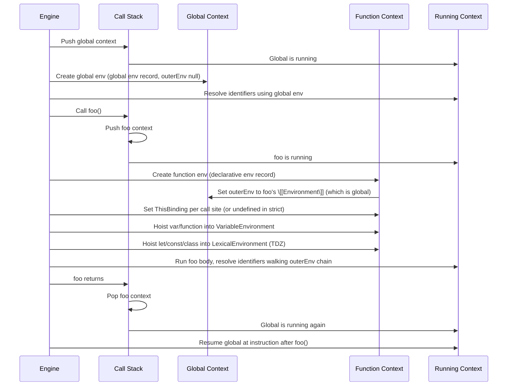
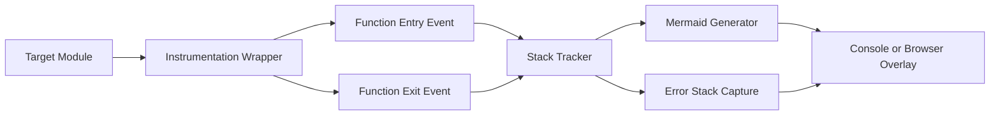

# 1.08 Execution Context and Lexical Environment

## 1. Purpose

An execution context is the runtime container the JavaScript engine builds every time it has to evaluate a piece of code. Whenever you call a function, load a module, or hand a string to `eval`, the engine stacks a new execution context on top of the running one. That context carries everything the engine needs to resume the caller after the callee returns: the program counter (called the **code evaluation state** in the ECMAScript specification), the function being evaluated, the realm it belongs to, the lexical environment used for identifier resolution, the variable environment used for `var` bindings, and the `this` binding. Without this container, JavaScript could not have function scope, closures, recursion, or stack-traced errors.

The first reason the engine maintains execution contexts is **recursion**. A recursive function calls itself; without one context per activation, the same local variables would be overwritten on every recursive step. Each call gets a fresh declarative environment record, and the call stack tracks which activation is currently running so the engine knows where to return.

The second reason is **async resume**. When a function hits `await`, the engine suspends the current execution context, snapshots the code evaluation state, and stores it on a Promise reaction job. When the awaited Promise settles, the engine re-pushes the same execution context (with its lexical environment, `this`, and locals intact) and resumes bytecode execution from the suspended instruction. This is why `await` does not lose scope: the lexical environment you saw before the await is the same one you see after. The whole mechanism depends on execution contexts being first-class objects the engine can set aside and pick back up.

The third reason is **error stack traces**. When an exception is thrown, the engine walks the call stack from the throwing context back to the global context, capturing the function name, source position, and lexical chain at each level. That walk is the `Error.prototype.stack` string you read in Sentry or in your terminal. Without execution contexts stacked on a call stack, the engine would have nowhere to record where it was when the error happened.

Lexical environments matter because they are the address system for every identifier in your program. When you write `counter` inside a closure, the engine resolves it by walking the `\[[OuterEnv\]]` chain from the current lexical environment outward until it finds a binding named `counter`. This walk is called the **scope chain**, and it is built from execution contexts. Closures are not magic; they are simply a function value that retains a reference to the lexical environment in which it was created. That retained environment is what makes the counter pattern, the module pattern, and React hooks work.

The bugs that appear when developers misunderstand the running context fall into a few well-known families. The classic event-handler mistake is assuming `this` inside a nested function is the same `this` as the outer method, when in sloppy mode it is `window` (or `undefined` in strict mode). The async-callback mistake is assuming that variables captured in a closure were snapshotted at definition time, when in fact they are looked up live at call time. The module-context mistake is assuming `this` at the top level of an ES module is the global object, when it is `undefined`. Each of these mistakes is a misunderstanding of which execution context the running code belongs to. This note gives you the vocabulary and the mental models to stop making them.

## 2. Theory and Deep Dive

The authoritative reference is **ECMAScript 2024 §9.4 Execution Contexts** (in older editions, §8.3) and **§9.2 Environment Records** (older editions, §8.2). This section walks through both, line by line.

### 2.1 The four execution context kinds

The specification defines four execution context kinds:

1. **Global execution context** — created once per realm when the global object, the global scope, and the global `this` are initialised. There is exactly one global context per realm. It evaluates the top-level script or the top-level module.
2. **Function execution context** — created every time a function is called. It carries a reference to the function object being executed so that the engine can resolve `arguments`, `new.target`, `super`, and the function name.
3. **Module execution context** — created for the top-level evaluation of an ES module. It is structurally a function-like context but uses a **module environment record** instead of a declarative one, and its outer environment is the module's own scope (not the global scope). Module top-level `this` is `undefined` because modules are always strict.
4. **Eval execution context** — created for direct `eval` of a string. Indirect `eval` runs in the global scope. Historically this kind was important; in modern code it is a footgun and exists only for legacy compatibility. See Section 6.6 for the leak problem.

### 2.2 The components of every execution context

Every execution context, regardless of kind, has the following state:

- **Code evaluation state** — the program counter. For an async function it also includes the suspend state (`suspending`, `suspended`, `resuming`) and the captured PromiseCapability so that an awaited Promise can be resumed.
- **Function** — the function object being evaluated, or `null` for global, module, and eval contexts. The engine reads `Function` to resolve `arguments`, `new.target`, `Function.name`, and to look up the function's `\[[Environment\]]` slot when building the function context's lexical environment.
- **Realm** — the realm in which the code is evaluated. A realm is the global object plus the set of intrinsics (Object, Array, Promise, etc.) plus the global environment record. Realms matter for cross-iframe and cross-Worker code: each iframe is a different realm, so `Array` from iframe A is a different constructor than `Array` from iframe B. The realm determines which intrinsics get used when the code calls `new Array()` or `Object.prototype.toString`.
- **ScriptOrModule** — the Script or Module record from which the code originates. Used by `import.meta` and by `import()` for resolving relative specifiers.
- **LexicalEnvironment** — the environment used to resolve identifiers during evaluation. This is the live scope; it can be swapped as you enter `with` blocks or `catch` clauses.
- **VariableEnvironment** — the environment used to hold `var` declarations and function declarations. It does not change during the execution of a function body; it is fixed at function entry.
- **PrivateEnvironment** — for private class element access; chains through the class nesting hierarchy. (Added in ES2022 with private fields.)
- **Generator or async generator** state when applicable.

The split between LexicalEnvironment and VariableEnvironment is the single most misunderstood part of the spec, and it exists for one reason: `with`.

### 2.3 Why LexicalEnvironment and VariableEnvironment are separate

In ES3 there was only one `VariableEnvironment` slot. When TC39 designed `let` and `const` for ES6 (ES2015), they wanted block scoping for `let`/`const` while keeping `var` function-scoped for backward compatibility. They also had to support the `with` statement and the `catch (e)` clause, both of which introduce a temporary block scope.

The solution was to split the environment slot in two:

- **VariableEnvironment** holds `var` and function declarations. It is fixed for the lifetime of the function execution context. The function body always sees the same VariableEnvironment for its `var` bindings.
- **LexicalEnvironment** holds `let`, `const`, `class`, `function` (in block scope), and the `catch (e)` binding. It changes every time you enter a block. When you write `if (cond) { let x = 1; }`, the engine pushes a new declarative environment record onto the LexicalEnvironment stack with `\[[OuterEnv\]]` pointing at the current LexicalEnvironment, and pops it when the block exits.

In practice, when no `with` or `catch` is involved, LexicalEnvironment and VariableEnvironment point at the same environment record. The split only matters when block scopes nest inside a function, or when `with` introduces an object environment record.

The `with` statement is the only construct that swaps the LexicalEnvironment to an **object environment record**. The VariableEnvironment stays untouched. That is why `var` inside a `with` block still binds to the function scope, while a bare identifier resolution might find a property on the `with` object first. See Section 6.5.

### 2.4 The four environment record kinds

ECMAScript §9.2 defines four environment record kinds. They all implement the same abstract methods (`HasBinding`, `CreateMutableBinding`, `SetMutableBinding`, `GetBindingValue`, `DeleteBinding`, etc.) but differ in where the bindings actually live.

1. **Declarative environment record** — bindings are stored as internal slots on the record itself. Used for function scope, block scope, `catch` clause scope, and module scope (the local part). `let`, `const`, `function`, `class`, and `var` all live here. This is the fastest kind because bindings are direct property-like slots without prototype chain lookups.
2. **Object environment record** — bindings are stored as properties on a backing object (the `\[[BindingObject\]]`). Used for `with` statements and for the global environment record's `var` portion. Identifier resolution becomes property lookup on the binding object, including prototype chain traversal.
3. **Global environment record** — a hybrid. It has an object environment record (whose binding object is the global object) for `var` declarations and global function declarations, plus a declarative environment record for `let`/`const`/`class` at the top level. The split prevents `let x` from becoming `globalThis.x`. Its `\[[OuterEnv\]]` is `null` because global is the outermost.
4. **Module environment record** — used for the body of an ES module. It is declarative but also tracks which bindings are imports and from which module, so that import live-binding works. Its `\[[OuterEnv\]]` is the module's own outer scope (which for most modules is the global environment).

### 2.5 The `\[[OuterEnv\]]` reference and the scope chain

Every environment record has an `\[[OuterEnv\]]` internal slot pointing at the enclosing environment record. The chain of `\[[OuterEnv\]]` references from the current LexicalEnvironment outward to the global environment is the **scope chain**. When the engine resolves an identifier, it walks the chain calling `HasBinding` on each record until it finds a hit. If it reaches the global record and finds no binding, the engine throws a `ReferenceError`.

Critically, `\[[OuterEnv\]]` is set when the function is **created**, not when it is **called**. That is what "lexical" means in "lexical environment". The scope chain is fixed by source code structure. A function defined inside module A always sees module A's bindings, even if you pass the function to module B and call it from there.



### 2.6 The creation phase vs the execution phase

Every function execution context goes through two phases:

**Creation phase.** The engine pushes the new context, creates its environment record, sets up `\[[OuterEnv\]]`, determines `this`, and hoists declarations. Specifically:

- The function's `\[[Environment\]]` slot is read to set `\[[OuterEnv\]]` of the new declarative environment record.
- For ordinary functions, `ThisMode` (strict or global) determines how `this` is computed from the caller argument list.
- A new arguments exotic object is bound (or, in strict mode, an arguments object without the magic callee/caller properties).
- All `var` declarations are hoisted into VariableEnvironment and initialised to `undefined`.
- All function declarations are hoisted and initialised to the function object.
- All `let`, `const`, and `class` declarations are hoisted into LexicalEnvironment but left **uninitialised** — this is the Temporal Dead Zone. Any access before the declaration line throws `ReferenceError`. See [[1.09 Hoisting Mechanics]] for the deep dive.

**Execution phase.** The engine walks the bytecode, evaluating each statement in order. Identifier lookups walk the scope chain. Variable assignments call `SetMutableBinding` on the appropriate environment record. Block entry pushes a new declarative environment record onto LexicalEnvironment; block exit pops it.

The two-phase model is why `typeof x` throws for a TDZ binding but returns `"undefined"` for an undeclared variable. In the first case, the engine finds a binding in the current environment record, but the binding is uninitialised, so `GetBindingValue` throws. In the second case, the engine walks the whole scope chain, finds no binding, and `typeof` short-circuits the `ReferenceError` to return `"undefined"`.

### 2.7 The call stack

The call stack is a LIFO list of execution contexts. The engine pushes when a function is called and pops when it returns. The top of the stack is the **running execution context**. Only one context is running at a time; JavaScript is single-threaded with respect to ECMAScript code evaluation.

When an exception is thrown and not caught at a given context, the engine pops that context, marks it as failed, and checks the next context down for a `catch` or `finally`. If none catches the exception, the engine walks all the way to the global context, fires `window.onerror` (or `process.on("uncaughtException")` in Node), and the program terminates.

When a function hits `return`, the engine captures the return value, pops the context, restores the previous running context, and resumes execution at the instruction pointer stored in that previous context's code evaluation state.

Stack overflow happens when the call stack reaches a size limit. V8's default limit is around 10,000 frames on most platforms. Tail-call optimisation exists in the spec (PTC, proper tail calls) but is only implemented in JavaScriptCore (Safari). In V8 and SpiderMonkey, deeply recursive functions still blow the stack.

### 2.8 How the engine maintains the running context

The engine tracks the running context through a single mutable pointer in its execution thread. When the engine calls a function, the following micro-protocol runs:

1. Look up the function object. Read its `\[[Environment\]]` slot.
2. Create a new function execution context. Set its `Function` slot to the function object.
3. Create a new function environment record. Set its `\[[OuterEnv\]]` to the function's `\[[Environment\]]`.
4. Determine `this` from the call site (or pass through for arrow functions).
5. Set the VariableEnvironment and LexicalEnvironment of the new context to the new function environment record.
6. Push the new context onto the stack. Update the running context pointer.
7. Run the creation phase: hoist declarations, build the arguments object, initialise parameters.
8. Enter the execution phase. Bytecode interpreter / JIT takes over.
9. On `return`, capture the value, pop the context, restore the previous running context pointer.

For async functions, step 8 is interleaved with suspensions. When the function hits `await`, the engine snapshots the code evaluation state, attaches a continuation to the awaited Promise, pops the function context off the stack, and restores the caller. When the Promise settles, a microtask pushes the function context back onto the stack with the same lexical environment, the same `this`, and the same locals, and resumes from the suspended instruction. The engine has to keep the suspended context alive on the heap (not the stack) until the Promise settles.

### 2.9 Module execution context specifics

When a module is loaded, the engine:

1. Parses it as a Module record (always strict mode).
2. Performs static analysis: collects imports, exports, top-level declarations. Builds a module environment record.
3. Topologically sorts the dependency graph (depth-first post-order).
4. Instantiates each module: links imports to exports. At this stage, bindings are created but not initialised.
5. Evaluates each module's top-level code in its own module execution context. The context's LexicalEnvironment and VariableEnvironment are the module environment record. `this` is `undefined` because module top-level is strict.
6. After evaluation, the module record is marked as evaluated. Subsequent imports of the same module return the cached evaluation.

The module environment record's `\[[OuterEnv\]]` is the global environment. Imports are bindings on the module environment record that forward `GetBindingValue` and `SetMutableBinding` calls to the exporting module's environment record. That is the live-binding semantics: if the exporting module reassigns an exported `let`, importers see the new value.

### 2.10 Realms, agents, and agent sets

A realm is the conceptual "world" in which code runs: a global object, a set of intrinsics, and a global environment record. Each iframe, each Worker, each `ShadowRealm` (ES2024) is its own realm.

An agent is a thread of execution that owns a realm and a call stack. The main thread is an agent. Each Worker is an agent. Agents are grouped into agent sets (for `SharedArrayBuffer` and `Atomics`). The running execution context belongs to the current agent. When you `postMessage` a function to a Worker, you cannot actually send the function — you can only send structured-cloneable data. The function would need to be re-evaluated in the target realm, which means a new execution context with new closures.

This is why cross-realm calls look the same but are not: the `Array` constructor you reach in iframe A is a different object from the one in iframe B. The realm is part of the execution context precisely so the engine knows which intrinsics to use when you call `Array.isArray` or `Object.create`.

## 3. Mental Models

### 3.1 The call stack is a stack of open books

Imagine each function call as opening a book. You put the book down on top of the pile of books you are already reading. You read the topmost book. When it tells you to open another book (a function call), you put that one on top. When you finish the top book (a return), you close it, remove it from the pile, and continue reading the book that was underneath, at the exact paragraph where you left off.

This model captures three things: LIFO order, the suspension of the caller while the callee runs, and the resumption point. It does not capture the difference between stack and heap — async-suspended contexts live on the heap, not on the stack — but for synchronous code it is exact.

### 3.2 Lexical environment is "where I was defined"

A function's scope chain is fixed at the moment of its creation. The function literally stores a pointer to the environment record that was the running LexicalEnvironment when the function was created. No matter where you call the function from, that pointer is unchanged.

Think of it like a passport. The function is born with a passport stamped "Module A". No matter how many countries you mail the function to (other modules, event handlers, Promises), when it runs, it presents its passport at the border. The border guards (the engine) read the stamp and let the function see Module A's bindings.

This model breaks down for `with`, `eval`, and `Function` (the dynamic function constructor). `with` swaps the LexicalEnvironment mid-evaluation. `eval` injects new bindings into the caller's environment. `new Function()` creates a function whose `\[[Environment\]]` is the global environment, not the caller's — so the dynamic function can only see globals and its own parameters.

### 3.3 Variable environment is "where var lives"

`var` declarations are hoisted to the function (or global) scope. They live in the VariableEnvironment. Block scopes (`{}`, `if`, `for`, `while`) do not create new VariableEnvironments; they create new LexicalEnvironments.

Picture VariableEnvironment as a single drawer per function. All `var` and function declarations in the function go into that drawer, no matter how deeply nested the code is. `let` and `const` go into smaller sub-drawers (block-scoped LexicalEnvironments) that open and close as the engine enters and exits blocks. When you look for a variable, the engine checks the smallest open drawer first, then the next one out, all the way up to the global drawer.

The breakdown of this model: `with` and `catch`. `with` creates an object environment record (a weird drawer that looks up properties on a JS object). `catch (e)` creates a declarative environment record with one binding (the error) that exists only inside the catch block. Both temporarily become the LexicalEnvironment.

### 3.4 Lexical environment changes; VariableEnvironment does not

A useful distinction: as you walk through a function body, every `{` you enter may push a new LexicalEnvironment, and every `}` pops one. The LexicalEnvironment is dynamic with respect to blocks. The VariableEnvironment stays put for the whole function body. When you finish the function, both are garbage-collected together.

This is why a `let` declared inside an `if` block disappears after the block, but a `var` declared inside the same `if` block survives until the function returns.

## 4. Real-World Use Cases

### 4.1 Async/await as a saved execution context

When you write:

```javascript
async function fetchUser(id) {
  const res = await fetch(`/api/users/${id}`);
  const data = await res.json();
  return data;
}
```

the engine creates a function execution context when `fetchUser` is called. At the first `await`, it snapshots the context (code evaluation state, LexicalEnvironment, `this`, local variables), returns a Promise to the caller, and pops the context off the stack. The microtask queue holds a continuation that, when the fetch Promise settles, re-pushes the same context with the same LexicalEnvironment and resumes execution at the instruction after the first `await`. The second `await` does the same thing. From your perspective the function ran straight through; from the engine's perspective the context was pushed, suspended, resumed, suspended again, resumed again, and finally returned.

This is why closures captured before an `await` still work after the `await`. The captured environment record is the same object. See [[1.22 Async Await Runtime]] for the microtask and PromiseReaction details.

### 4.2 React hook closures

Every React render is a function call. React calls your component function, which creates a new execution context with a new LexicalEnvironment for that render. Every `useState`, `useEffect`, `useMemo`, and `useCallback` that runs during that render captures the LexicalEnvironment of that render. This is why a `useEffect` with an empty dependency array can see stale props: the effect's closure was created during a specific render, and the LexicalEnvironment of that render holds the prop values from that render. The next render creates a new context with new prop values, but the previously created effect closure still points at the old environment.

The exhaustive-deps lint rule is essentially warning you about this execution-context capture. It cannot force you to update the closure, but it can remind you that the closure will see old values unless you list every captured identifier as a dependency.

### 4.3 Error stack traces

When you throw an Error, the engine walks the call stack and constructs a string for `Error.prototype.stack`. V8's format looks like:

```
Error: boom
    at foo (/app/src/foo.js:3:11)
    at bar (/app/src/bar.js:7:5)
    at Object.<anonymous> (/app/src/index.js:2:1)
```

Each line corresponds to one execution context on the call stack at the throw site. The function name comes from the context's `Function` slot. The file and line come from the code evaluation state. Without execution contexts, the engine would have nothing to walk.

Sentry and similar services normalise these strings across browsers (V8, SpiderMonkey, JavaScriptCore have different formats) and reconstruct a structured stack trace. The structure is essentially the same list of execution contexts the engine had on the stack at throw time.

### 4.4 The `with` statement and why it was removed

`with` was designed to avoid typing long property paths repeatedly. You would write `with (obj) { foo; bar; }` and the engine would resolve `foo` and `bar` as properties of `obj` if they existed. To make this work, TC39 designed the LexicalEnvironment/VariableEnvironment split: entering a `with` block swaps the LexicalEnvironment to a fresh object environment record whose binding object is `obj`, while the VariableEnvironment (where `var` lives) is untouched.

The problem is performance and correctness. Every identifier lookup inside `with` might hit the object's properties (including its prototype chain) before falling back to the outer scope. This is unpredictable for JIT compilers and confusing for humans. `with` is banned in strict mode and in modules. The only remaining use of the LexicalEnvironment-swap mechanism is the `catch (e)` clause, which is a much narrower case.

### 4.5 Module evaluation order

The module execution context's evaluation order is the topological sort of the import graph. If module A imports B and C, and both B and C import D, evaluation order is D, then B and C (in import-source order), then A. Each module's top-level code runs in its own module execution context. This is why side effects in modules can be subtle: a module you import may run its top-level code (and produce side effects) before your module's top-level code runs, even though your `import` statement is at the top of your file.

Tree-shaking in bundlers depends on module evaluation being side-effect-free for pure exports. Webpack and Rollup mark modules with `sideEffects: false` in `package.json` as eligible for dead-code elimination, but they still need to preserve evaluation order for modules with side effects.

### 4.6 Cross-realm calls

When you call a function from another realm (an iframe's function, a Worker's callback via `postMessage`), the function's `\[[Realm\]]` is the realm it was created in. The engine uses that realm's intrinsics when the function calls `new Array()`. This is why `instanceof` can lie across realms: `iframe.contentWindow.Array` is a different constructor than your `Array`, so `arr instanceof Array` is `false` if `arr` came from the iframe. `Array.isArray` works across realms because it checks the internal `\[[ArrayExotic\]]` slot rather than the prototype chain.

## 5. Code Examples

### 5.1 Example A — Minimal and Conceptual

A three-function call stack that demonstrates push, link, `this` binding, and pop.

**JavaScript:**

```javascript
"use strict";

const globalGreeting = "hello from global";

function outer() {
  const outerLocal = "outer-local";
  console.log("[outer] this =", this);
  console.log("[outer] outerLocal =", outerLocal);
  return middle(outerLocal);
}

function middle(prefix) {
  const middleLocal = "middle-local";
  console.log("[middle] prefix =", prefix);
  console.log("[middle] this =", this);
  return inner(prefix + "-" + middleLocal);
}

function inner(message) {
  const innerLocal = "inner-local";
  console.log("[inner] message =", message);
  console.log("[inner] this =", this);
  console.log("[inner] globalGreeting =", globalGreeting);
  return message + "/" + innerLocal;
}

const result = outer.call({ tag: "outer-this" });
console.log("result =", result);
```

What happens when `outer.call({ tag: "outer-this" })` runs:

1. Engine pushes a function execution context for `outer`. Its LexicalEnvironment has `outerLocal` as a `const` binding. Its `this` is `{ tag: "outer-this" }` because `.call` set it.
2. `outer` calls `middle(outerLocal)`. Engine pushes a context for `middle`. Its `\[[OuterEnv\]]` is the global environment (because `middle` was defined at the top level). Its `this` is `undefined` because we are in strict mode and there is no `.call`.
3. `middle` calls `inner(prefix + "-" + middleLocal)`. Engine pushes a context for `inner`. Same `\[[OuterEnv\]]` (global). Same `this` (`undefined`).
4. `inner` reads `globalGreeting`. The engine walks `inner`'s LexicalEnvironment (which has `message` and `innerLocal`), finds no `globalGreeting`, walks to `\[[OuterEnv\]]` (global), finds it. Resolves to `"hello from global"`.
5. `inner` returns. Engine pops the `inner` context. `middle` resumes.
6. `middle` returns. Engine pops the `middle` context. `outer` resumes.
7. `outer` returns. Engine pops the `outer` context. The top-level script context resumes and logs the result.

**TypeScript:**

```typescript
"use strict";

const globalGreeting: string = "hello from global";

interface ThisTag {
  tag: string;
}

function outer(this: ThisTag): string {
  const outerLocal: string = "outer-local";
  console.log("[outer] this =", this);
  console.log("[outer] outerLocal =", outerLocal);
  return middle(outerLocal);
}

function middle(prefix: string): string {
  const middleLocal: string = "middle-local";
  console.log("[middle] prefix =", prefix);
  console.log("[middle] this =", this);
  return inner(`${prefix}-${middleLocal}`);
}

function inner(message: string): string {
  const innerLocal: string = "inner-local";
  console.log("[inner] message =", message);
  console.log("[inner] this =", this);
  console.log("[inner] globalGreeting =", globalGreeting);
  return `${message}/${innerLocal}`;
}

const result: string = outer.call({ tag: "outer-this" });
console.log("result =", result);
```

The TypeScript version is structurally identical. The `this: ThisTag` annotation on `outer` is a compile-time hint; at runtime the engine sets `this` exactly the same way. Note that `middle` and `inner` have no `this` parameter declared, which in TS is a hint that they are not meant to be called as methods (they would still receive `undefined` in strict mode at runtime).

### 5.2 Example B — Production-Grade

An async middleware pipeline that preserves execution context across three `await` points, with structured logging that captures the call-stack depth and the lexical environment chain at each step.

**JavaScript:**

```javascript
"use strict";

const log = (depth, label, payload) => {
  const indent = "  ".repeat(depth);
  const ts = new Date().toISOString();
  console.log(`${indent}[${ts}] ${label}:`, payload);
};

function compose(...middlewares) {
  return async function pipeline(request) {
    let index = 0;
    const state = { request, locals: Object.create(null) };

    async function dispatch(current) {
      const middleware = middlewares[current];
      if (!middleware) return state.locals;
      const next = () => dispatch(current + 1);
      log(current, `enter middleware ${middleware.name}`, {
        path: state.request.path,
      });
      const result = await middleware(state, next);
      log(current, `exit middleware ${middleware.name}`, {
        path: state.request.path,
      });
      return result;
    }

    return dispatch(index);
  };
}

const authMiddleware = async (state, next) => {
  state.locals.user = state.request.headers["x-user"] || "anonymous";
  const inner = await next();
  return { ...inner, authenticatedBy: "authMiddleware" };
};

const cacheMiddleware = async (state, next) => {
  const key = state.request.path;
  if (state.locals.cache && state.locals.cache.has(key)) {
    return { source: "cache", data: state.locals.cache.get(key) };
  }
  const downstream = await next();
  state.locals.cache = state.locals.cache || new Map();
  state.locals.cache.set(key, downstream);
  return downstream;
};

const handlerMiddleware = async (state, next) => {
  await new Promise((resolve) => setTimeout(resolve, 5));
  return { source: "handler", data: `handled ${state.request.path}` };
};

const pipeline = compose(authMiddleware, cacheMiddleware, handlerMiddleware);

pipeline({ path: "/api/orders", headers: { "x-user": "alice" } })
  .then((result) => console.log("final:", result))
  .catch((error) => console.error("pipeline error:", error));
```

What is happening with execution contexts across the awaits:

1. `pipeline(request)` pushes the `pipeline` function context. Its LexicalEnvironment holds `middlewares`, `request`, `index`, `state`, and `dispatch`.
2. `dispatch(0)` pushes a `dispatch` context. Its `\[[OuterEnv\]]` is the `pipeline` LexicalEnvironment, so it can see `middlewares` and `state`. Its locals are `current` (0) and `middleware` (authMiddleware).
3. `await middleware(state, next)` calls `authMiddleware`, which pushes its own context. `authMiddleware` reads `state.locals` (resolved via its own `\[[OuterEnv\]]` to the module scope, where `state` does not exist — wait, no: `state` is a parameter of `authMiddleware`, so it is a binding on `authMiddleware`'s own declarative environment record).
4. `authMiddleware` calls `next()`, which is `() => dispatch(current + 1)`. The arrow function has no own `this` and no own `arguments`; it inherits both from `authMiddleware`'s context.
5. The arrow function calls `dispatch(1)`, which pushes a new `dispatch` context. `current` is now 1, `middleware` is cacheMiddleware.
6. cacheMiddleware runs, calls `next()` again, which calls `dispatch(2)`.
7. `dispatch(2)` runs handlerMiddleware, which awaits a `setTimeout` Promise. At this point handlerMiddleware's context is suspended and snapshotted. The microtask queue gets a continuation. The call stack unwinds all the way back through dispatch(2), cacheMiddleware, dispatch(1), authMiddleware, dispatch(0), pipeline, and back to the top-level script context.
8. Five milliseconds later, the setTimeout Promise settles. The microtask runs the continuation. handlerMiddleware's context is re-pushed onto the stack with the same `state` (passed as a parameter), the same locals, the same `this` (undefined). It returns `{ source: "handler", data: ... }`.
9. `dispatch(2)` resumes, returns the value, pops. cacheMiddleware resumes, caches the value, returns. `dispatch(1)` resumes, returns, pops. authMiddleware resumes, spreads the inner result, adds `authenticatedBy`, returns. `dispatch(0)` resumes, returns, pops. `pipeline` resumes, returns. Top-level resumes, calls `.then`.

The key insight is that each `await` snapshots the entire chain of suspended contexts (with their LexicalEnvironments and parameter bindings) and restores them on resume. The closure-captured `state` is the same object across all resumes, which is why mutations to `state.locals` are visible everywhere.

**TypeScript:**

```typescript
"use strict";

interface PipelineRequest {
  path: string;
  headers: Record<string, string>;
}

interface PipelineState {
  request: PipelineRequest;
  locals: Record<string, unknown> & { cache?: Map<string, unknown> };
}

type MiddlewareResult = Record<string, unknown>;
type Next = () => Promise<MiddlewareResult>;
type Middleware = (
  state: PipelineState,
  next: Next,
) => Promise<MiddlewareResult>;

const log = (depth: number, label: string, payload: unknown): void => {
  const indent = "  ".repeat(depth);
  const ts = new Date().toISOString();
  console.log(`${indent}[${ts}] ${label}:`, payload);
};

function compose(...middlewares: Middleware[]) {
  return async function pipeline(
    request: PipelineRequest,
  ): Promise<MiddlewareResult> {
    let index = 0;
    const state: PipelineState = {
      request,
      locals: Object.create(null) as PipelineState["locals"],
    };

    async function dispatch(current: number): Promise<MiddlewareResult> {
      const middleware = middlewares[current];
      if (!middleware) return state.locals as MiddlewareResult;
      const next: Next = () => dispatch(current + 1);
      log(current, `enter middleware ${middleware.name}`, {
        path: state.request.path,
      });
      const result = await middleware(state, next);
      log(current, `exit middleware ${middleware.name}`, {
        path: state.request.path,
      });
      return result;
    }

    return dispatch(index);
  };
}

const authMiddleware: Middleware = async (state, next) => {
  state.locals.user = state.request.headers["x-user"] || "anonymous";
  const inner = await next();
  return { ...inner, authenticatedBy: "authMiddleware" };
};

const cacheMiddleware: Middleware = async (state, next) => {
  const key = state.request.path;
  if (state.locals.cache && state.locals.cache.has(key)) {
    return { source: "cache", data: state.locals.cache.get(key) };
  }
  const downstream = await next();
  state.locals.cache = state.locals.cache || new Map<string, unknown>();
  state.locals.cache.set(key, downstream);
  return downstream;
};

const handlerMiddleware: Middleware = async (state, next) => {
  await new Promise<void>((resolve) => setTimeout(resolve, 5));
  return { source: "handler", data: `handled ${state.request.path}` };
};

const pipeline = compose(authMiddleware, cacheMiddleware, handlerMiddleware);

pipeline({ path: "/api/orders", headers: { "x-user": "alice" } })
  .then((result) => console.log("final:", result))
  .catch((error: unknown) => console.error("pipeline error:", error));
```

The TypeScript version adds types for the pipeline state and middleware signature. The runtime behaviour is identical: the same execution-context push, suspend, and resume dance happens regardless of whether the source is JS or TS.

## 6. Common Mistakes and Anti-Patterns

### 6.1 Confusing LexicalEnvironment with VariableEnvironment

This is rare in modern code but real. The mistake is assuming `let` and `var` live in the same place inside a function. They do not. `var` lives in the VariableEnvironment; `let` lives in the block-scoped LexicalEnvironment.

```javascript
function broken() {
  if (true) {
    var v = "var";
    let l = "let";
  }
  console.log(v); // "var" — VariableEnvironment leaks out of the block
  console.log(l); // ReferenceError: l is not defined
}
```

**Why it fails:** The `if` block created a new LexicalEnvironment for `l`. That LexicalEnvironment was popped when the block exited. The `var` declaration went into the function's VariableEnvironment, which survives the block.

**Fix:** Use `let` and `const` exclusively; ban `var` in your style guide. Then you never have to think about VariableEnvironment again.

### 6.2 `this` inside a nested function loses the outer `this`

The classic. A method on an object uses a callback, and inside the callback `this` is no longer the object.

```javascript
const counter = {
  count: 0,
  start() {
    setInterval(function () {
      this.count++;          // NaN — `this` is window (or undefined in strict)
      console.log(this.count);
    }, 1000);
  },
};
counter.start();
```

**Why it fails:** The callback is a regular function, not an arrow. Regular functions get their own `this` binding based on the call site. `setInterval` calls the callback with no receiver, so in sloppy mode `this` is the global object, in strict mode `this` is `undefined`.

**Fix:** Use an arrow function. Arrows do not get their own `this`; they read `this` from their `\[[OuterEnv\]]` chain.

```javascript
const counter = {
  count: 0,
  start() {
    setInterval(() => {
      this.count++;
      console.log(this.count);
    }, 1000);
  },
};
counter.start();
```

### 6.3 Module-context `this === undefined`

Developers coming from CommonJS or non-module scripts expect `this` at the top level to be the global object (`globalThis` or `module.exports` in CJS). In an ES module, it is `undefined`.

```javascript
// file.mjs — an ES module
console.log(this); // undefined
console.log(globalThis); // the global object
```

**Why it fails:** ES modules are always strict mode. Strict mode top-level `this` in a module execution context is `undefined`. (In a script it is the global object.)

**Fix:** Use `globalThis` when you need the global object. Do not rely on `this` at module top-level.

### 6.4 Event handler `this` rebound by addEventListener

```javascript
class Button {
  constructor(label) {
    this.label = label;
    this.el = document.createElement("button");
    this.el.textContent = label;
    this.el.addEventListener("click", this.onClick);
  }
  onClick() {
    console.log(this.label); // undefined — `this` is the element, not the Button
  }
}
new Button("Save");
```

**Why it fails:** `addEventListener` calls the handler with `this` set to the element on which the listener was registered. The `Button` instance is lost.

**Fix:** Use an arrow function for the handler, or `bind` the handler in the constructor.

```javascript
class Button {
  constructor(label) {
    this.label = label;
    this.el = document.createElement("button");
    this.el.textContent = label;
    this.el.addEventListener("click", () => {
      console.log(this.label); // "Save"
    });
  }
}
new Button("Save");
```

### 6.5 `with` block lexical swap

```javascript
const obj = { a: 1, b: 2 };
function dangerous() {
  const a = "outer-a";
  with (obj) {
    console.log(a); // 1 — resolves to obj.a, not the outer const
    var c = 3;       // binds to dangerous's VariableEnvironment, NOT to obj
  }
  console.log(c);    // 3 — var leaked to the function scope
  return a;          // "outer-a" — LexicalEnvironment restored after `with`
}
dangerous();
```

**Why it fails:** `with` swaps the LexicalEnvironment to an object environment record whose binding object is `obj`. Identifier lookups try `obj` first. `var` still goes to the VariableEnvironment, which is unchanged. After the `with` block, the LexicalEnvironment is restored to the function's normal environment.

**Fix:** Never use `with`. Use destructuring instead.

```javascript
const obj = { a: 1, b: 2 };
function safe() {
  const a = "outer-a";
  const { a: objA, b } = obj;
  console.log(objA); // 1
  console.log(a);    // "outer-a"
}
safe();
```

### 6.6 eval leaks declarations in sloppy mode

```javascript
function leaky() {
  eval("var injected = 42;");
  console.log(injected); // 42 — eval injected into leaky's VariableEnvironment
}
leaky();
```

**Why it fails:** Direct `eval` in sloppy mode evaluates the string in the calling context's VariableEnvironment. `var` declarations inside the eval string become bindings on the caller's environment record.

**Fix:** Never use `eval`. If you absolutely must dynamically evaluate code, use `Function` (which creates a new function in the global scope, not the caller's scope) or a `ShadowRealm` (ES2024, fully isolated).

```javascript
const dynamic = new Function("return 42;");
console.log(dynamic()); // 42 — no leak
```

### 6.7 Forgetting that arrow functions cannot be methods

```javascript
const obj = {
  value: 1,
  getValue: () => this.value, // undefined — `this` is the global object (or undefined in module)
};
console.log(obj.getValue());
```

**Why it fails:** Arrow functions do not have their own `this`. The arrow's `\[[OuterEnv\]]` is the scope in which the object literal was defined. At module top-level, that scope's `this` is `undefined`.

**Fix:** Use a regular method shorthand.

```javascript
const obj = {
  value: 1,
  getValue() {
    return this.value;
  },
};
console.log(obj.getValue()); // 1
```

### 6.8 Assuming `bind` is free

```javascript
class HotPath {
  constructor() {
    this.handler = this.handler.bind(this); // allocates a new function every construction
  }
  handler() {
    /* hot code */
  }
}
```

**Why it fails:** `bind` returns a new function object. If you construct millions of `HotPath` instances, you allocate millions of bound functions. The bound function also adds an extra call frame.

**Fix:** Use an arrow class field, which is set once per instance and reads `this` lexically without an extra frame.

```javascript
class HotPath {
  handler = () => {
    /* hot code — `this` is the instance */
  };
}
```

## 7. Best Practices and Design Patterns

### 7.1 Never use `with`

`with` is forbidden in strict mode and in modules. It is unavailable in modern bundlers' output. It kills JIT optimisation because every identifier lookup inside a `with` block must check the binding object's properties at runtime. There is no use case that destructuring cannot cover better.

### 7.2 Never use `eval`

`eval` opens a code injection attack surface, defeats static analysis, and (in sloppy mode) leaks declarations into the caller's scope. If you genuinely need to evaluate dynamic code:

- For JSON: use `JSON.parse`, never `eval`.
- For dynamic expressions: use `new Function("return " + expr)()` which at least runs in the global scope and cannot inject into the caller's bindings.
- For untrusted code: use `ShadowRealm` (ES2024) or a Web Worker with a Content Security Policy.

### 7.3 Use arrow functions for inner callbacks

Arrow functions preserve the outer `this`. Any time you write a callback inside a method (event listeners, `setTimeout`, `Array.prototype.map`), prefer an arrow. The arrow does not get its own `this` binding; it reads `this` from its `\[[OuterEnv\]]` chain.

### 7.4 Use strict mode and ES modules

Strict mode and modules both set `this` to `undefined` at top-level and inside plain functions called without a receiver. This surfaces bugs immediately instead of silently mutating the global object. In Node, prefer `.mjs` extension or `"type": "module"` in `package.json`.

### 7.5 Prefer `globalThis` over `this` at top-level

When you need the global object, write `globalThis`. It works in scripts, modules, Workers, iframes, and Node. Do not rely on `this`, `self`, `window`, or `global` — they vary by environment.

### 7.6 Cache `this` only when arrow functions are not available

In ES5 codebases (legacy), the `var self = this;` pattern was the only way to preserve `this` across a nested function. In modern code, arrows do this automatically. If you must support ES5, use `bind` once at construction time rather than per-call.

### 7.7 Avoid `arguments.callee` and `arguments.caller`

Both are forbidden in strict mode. `arguments.callee` was used for anonymous recursion before named function expressions worked reliably. Modern engines support `const fact = function fact(n) { return n <= 1 ? 1 : n * fact(n - 1); };` correctly. `arguments.caller` was removed for security.

### 7.8 Prefer named function expressions for stack traces

```javascript
const handler = function handleClick(event) {
  // ...
};
```

The `handleClick` name appears in stack traces, which makes debugging dramatically easier. Anonymous arrow functions show as `<anonymous>` or as the variable name they were assigned to, which is less informative.

### 7.9 Use `ShadowRealm` for plugin isolation

In ES2024 you can create a `ShadowRealm` to evaluate untrusted code in a fresh global with no shared intrinsics. The realm has its own global execution context and its own module loader. This is the modern replacement for iframe-based sandboxes.

### 7.10 Document `this` contracts in TypeScript

If you write a library that exposes a method intended to be called with a specific `this`, declare it with a `this` parameter in TypeScript:

```typescript
function onClick(this: Button, event: MouseEvent): void {
  // ...
}
```

TypeScript will error at the call site if the method is called without the right receiver, which prevents the most common `this` mistake at compile time.

## 8. Technical Interview Knowledge

### 8.1 What are the components of an execution context?

**A:** Every execution context has the following state, per ECMAScript §9.4:

- **Code evaluation state**: the program counter (and, for async functions, the suspend/resume state and PromiseCapability).
- **Function**: the function object being evaluated, or `null` for global, module, and eval contexts.
- **Realm**: the realm in which the context was created. Determines which intrinsics (`Array`, `Object`, etc.) are used.
- **ScriptOrModule**: the Script or Module record from which the code originates. Used by `import.meta`.
- **LexicalEnvironment**: the environment used for identifier resolution. Can change as blocks are entered.
- **VariableEnvironment**: the environment used for `var` and function declarations. Fixed for the lifetime of the context.
- **PrivateEnvironment**: the private name environment for class private elements (chained through class nesting).

**Trap to avoid:** Do not confuse LexicalEnvironment with VariableEnvironment. The split exists for `with` and `catch` block scoping. If the interviewer asks "why two slots," the answer is `with`.

### 8.2 What is the difference between LexicalEnvironment and VariableEnvironment?

**A:** They are usually the same. They diverge in two cases:

1. Inside a `with` block: the LexicalEnvironment is swapped to an object environment record whose binding object is the `with` target. The VariableEnvironment is untouched. `var` declarations still go to the function's VariableEnvironment.
2. Inside a `catch (e)` block: the LexicalEnvironment is swapped to a declarative environment record that holds only the error binding `e`. The VariableEnvironment is untouched.

In all other cases, LexicalEnvironment and VariableEnvironment point at the same environment record. `let`, `const`, `class`, and `function` (in block scope) live in the LexicalEnvironment. `var` and function declarations live in the VariableEnvironment.

**Trap to avoid:** Saying "`var` is in the LexicalEnvironment." It is not — it is in the VariableEnvironment. The two only coincide at function top-level when no `with` or `catch` is active.

### 8.3 What is the scope chain?

**A:** The scope chain is the linked list of environment records reachable from a function's LexicalEnvironment via `\[[OuterEnv\]]` references, ending at the global environment record (whose `\[[OuterEnv\]]` is `null`). When the engine resolves an identifier, it walks the chain calling `HasBinding` on each record until it finds a hit; if it reaches the end without a hit, it throws `ReferenceError`.

The chain is **lexical**, meaning it is determined by where functions are defined in the source, not where they are called. A function's `\[[Environment\]]` slot stores the LexicalEnvironment that was active when the function was created; the function's own environment record's `\[[OuterEnv\]]` is that stored environment.

**Trap to avoid:** Saying "the scope chain is dynamic." It is not. Dynamic scope (which Bash uses) resolves identifiers based on the call stack. Lexical scope (which JavaScript uses) resolves them based on source structure. Closures depend on lexical scope.

### 8.4 How does `with` work?

**A:** `with (obj) { ... }` does the following:

1. Creates a new object environment record whose `\[[BindingObject\]]` is `obj`.
2. Sets the new record's `\[[OuterEnv\]]` to the current LexicalEnvironment.
3. Replaces the running context's LexicalEnvironment with the new record.
4. Evaluates the block. Identifier lookups call `HasBinding` on the object environment record, which checks if `obj` has the property (including inherited ones). If not, lookup falls through to `\[[OuterEnv\]]`.
5. After the block, restores the LexicalEnvironment to its previous value.

`var` declarations inside the block go to the VariableEnvironment, which was not swapped. This means `var x` inside `with (obj) { ... }` does not become `obj.x`.

`with` is forbidden in strict mode and in modules. It is the only construct in the language that swaps LexicalEnvironment to an object environment record mid-evaluation (besides the initial global environment setup).

**Trap to avoid:** Saying "`with` swaps VariableEnvironment." It does not. It swaps LexicalEnvironment only.

### 8.5 Why is `this` undefined at the top level of an ES module?

**A:** ES modules are always in strict mode (per ECMAScript §17.2). The module execution context's `this` binding is set to `undefined` because modules are not intended to be used as a global namespace the way scripts are. In a script (non-module) execution context, the global `this` is the global object (`globalThis`). In a module execution context, the module's top-level `this` is `undefined`.

If you need the global object inside a module, use `globalThis`.

**Trap to avoid:** Saying "modules run in strict mode so `this` is `window`." Modules run in strict mode, which is exactly why `this` is `undefined`, not the global object.

### 8.6 Draw the call stack at this point in this code

```javascript
function a() {
  return b();
}
function b() {
  return c();
}
function c() {
  debugger; // draw the call stack here
  return 42;
}
a();
```

**A:** At the `debugger` statement, the call stack from bottom to top is:

1. Global execution context (running the top-level `a()` call).
2. `a` function execution context (running `return b()`).
3. `b` function execution context (running `return c()`).
4. `c` function execution context (running the `debugger` statement; this is the running context).

The LexicalEnvironment chain for the running `c` context is:

1. `c`'s function environment record (declarative; no locals).
2. Global environment record (outermost; `\[[OuterEnv\]]` is `null`).

Because `a`, `b`, and `c` are all defined at the top level, they all share the global environment as their `\[[Environment\]]`.

**Trap to avoid:** Forgetting the global context at the bottom of the stack. The stack is never empty during synchronous code execution; the global context is always there.

### 8.7 How does async/await preserve execution context?

**A:** When an async function hits `await expr`:

1. The engine evaluates `expr` to a value (usually a Promise).
2. It snapshots the current function execution context's code evaluation state (instruction pointer, local variables, parameters) and the PromiseCapability for the async function's own returned Promise.
3. It attaches a PromiseReaction to the awaited Promise. The reaction's handler is a continuation that, when invoked, will re-push the function context with the same LexicalEnvironment, the same `this`, and the same locals, and resume execution at the suspended instruction.
4. The engine pops the function context off the stack. Control returns to the caller. The async function's own returned Promise is in the pending state.
5. When the awaited Promise settles, the engine schedules the reaction as a microtask. The microtask pushes the function context back onto the stack and resumes execution.

Because the LexicalEnvironment is the same object before and after the `await`, every closure captured before the `await` still resolves the same identifiers after. The locals are the same variables; mutations to them are visible. The `this` is the same value.

**Trap to avoid:** Saying "async functions run on a separate thread." They do not. They run on the same thread as the caller; only the await suspension defers the rest of the function to a microtask.

### 8.8 What is a realm?

**A:** A realm is the conceptual "world" in which code runs. Per ECMAScript §9.3, a realm consists of:

- A global object.
- A set of intrinsics (Object, Function, Array, Promise, etc.).
- A global environment record.
- Optionally, a template registry and a module registry.

Each iframe, each Worker, each `ShadowRealm`, and the main page itself are separate realms. The realm is part of every execution context created within it, so the engine knows which intrinsics to use when the code calls `new Array()` or `Object.prototype.toString.call(x)`.

Realms matter for security and for `instanceof`. An `Array` from iframe A is not an instance of the main page's `Array` constructor. `Array.isArray` works across realms because it checks the internal `\[[ArrayExotic\]]` slot, not the prototype chain.

**Trap to avoid:** Saying "realms are threads." Realms are not threads. A Worker is a separate agent (thread-like), but a realm is just a global object plus intrinsics. Same-thread code can touch multiple realms via iframes; cross-thread code always involves separate realms.

## 9. Practical Exercises

### 9.1 Exercise One — Trace a recursive function's call stack and environment chain

**Goal:** Predict the call stack and LexicalEnvironment chain at the deepest point of a recursive function.

**Setup:**

```javascript
function factorial(n, acc = 1) {
  if (n <= 1) return acc;
  return factorial(n - 1, acc * n);
}
factorial(3);
```

**Steps:**

1. Identify each function activation as a separate execution context.
2. For each context, list its LexicalEnvironment bindings.
3. Identify the `\[[OuterEnv\]]` of each context.
4. Draw the stack at the moment `n === 1` returns.

**Full worked solution:**

When `factorial(3)` is called from the top level:

```
Call stack (bottom to top):
1. Global EC
   - LexicalEnvironment: global env record
     - bindings: factorial (function), and any top-level lets/consts
   - VariableEnvironment: same as LexicalEnvironment (top-level)
   - this: globalThis (script) or undefined (module)
   - \[[OuterEnv\]] of factorial's env: global env

2. factorial EC (n=3, acc=1)
   - LexicalEnvironment: function env record
     - bindings: n=3, acc=1
   - VariableEnvironment: same
   - this: undefined (strict) or globalThis (sloppy)
   - \[[OuterEnv\]]: global env (because factorial was defined at top level)

3. factorial EC (n=2, acc=3)
   - LexicalEnvironment: function env record
     - bindings: n=2, acc=3
   - \[[OuterEnv\]]: global env (NOT the factorial(3) env — env chain is lexical, not dynamic)

4. factorial EC (n=1, acc=6)
   - LexicalEnvironment: function env record
     - bindings: n=1, acc=6
   - \[[OuterEnv\]]: global env
   - this: undefined (strict)
```

At `n === 1`, the function returns `acc` (which is `6`). The engine:

1. Pops the `n=1` factorial context. Resume the `n=2` context at `return factorial(n - 1, acc * n)`. The return value (`6`) is the value of that return expression.
2. Pops the `n=2` context. Resume the `n=3` context. Same return value flow.
3. Pops the `n=3` context. Resume the global context. The `factorial(3)` call expression evaluates to `6`.

**Reasoning:** Each recursive call creates a fresh execution context with its own `n` and `acc` bindings. The `\[[OuterEnv\]]` is the global environment in all four contexts because `factorial` was defined at the top level. The scope chain is lexical, so the inner `factorial` calls do not see the outer `factorial` activations' `n` and `acc` — they see their own.

If `factorial` had been defined inside another function (say, a `makeFactorial` factory), all four activations would share that factory's environment as their `\[[OuterEnv\]]`, and could see the factory's locals.

### 9.2 Exercise Two — Predict `this` at 10 points

**Goal:** For each numbered comment, predict the value of `this`.

```javascript
"use strict";
// (1) top-level of a script
function topLevel() {
  // (2) inside a plain function called as `topLevel()`
  return this;
}
const obj = {
  method() {
    // (3) inside a method called as `obj.method()`
    const inner = function () {
      // (4) inside a nested plain function
      return this;
    };
    return inner();
  },
  arrow: () => {
    // (5) inside an arrow function assigned as a method
    return this;
  },
  bound: function () {
    // (6) inside a function bound via .bind(obj2)
    return this;
  }.bind({ name: "bound-target" }),
};
class C {
  constructor() {
    // (7) inside a class constructor called with `new C()`
    this.x = 1;
  }
  method() {
    // (8) inside a class method called as `instance.method()`
    return this;
  }
  static sm() {
    // (9) inside a static method called as `C.sm()`
    return this;
  }
}
const instance = new C();
// (10) `this` inside `setTimeout(function() { return this; }, 0)`
```

**Full worked solution:**

1. **Top-level of a script**: `globalThis` (the global object). In a module, it would be `undefined`. The task said "script", so `globalThis`.
2. **Inside `topLevel()` called as `topLevel()`**: `undefined` (strict mode). The function is called with no receiver, so strict mode sets `this` to `undefined`.
3. **Inside `obj.method()` called as `obj.method()`**: `obj`. Method call syntax sets `this` to the receiver.
4. **Inside `inner()` called as `inner()`**: `undefined` (strict mode). The nested plain function is called with no receiver. It does not inherit `this` from its enclosing method.
5. **Inside `obj.arrow()` called as `obj.arrow()`**: `undefined` (or `globalThis` in a non-module script). Arrow functions do not get their own `this`; they read it from their `\[[OuterEnv\]]`, which is the script top-level. In a strict-mode script, top-level `this` is `globalThis`; in a module it is `undefined`. The code has `"use strict"` at the top, so for a script it is `globalThis`; for a module it is `undefined`. The example header says "script", so `globalThis`.
6. **Inside `obj.bound()` called as `obj.bound()`**: `{ name: "bound-target" }`. `bind` permanently sets `this`; the call-site receiver is ignored.
7. **Inside `new C()` constructor**: the new instance. `new` creates a fresh object and sets `this` to it before running the constructor body.
8. **Inside `instance.method()` called as `instance.method()`**: `instance`. Method call syntax on the instance.
9. **Inside `C.sm()` called as `C.sm()`**: `C` itself (the class constructor function). Static methods are properties on the constructor function, so `this` is the constructor.
10. **Inside `setTimeout(function() { return this; }, 0)`**: `undefined` (strict mode). `setTimeout` calls the callback with no receiver. In sloppy mode it would be `globalThis`; in strict mode it is `undefined`.

**Reasoning:** Every `this` resolution is determined by the call site (or by `bind`, `call`, `apply`, `new`, or arrow inheritance). The execution context's `this` slot is set at context creation time based on these rules.

### 9.3 Exercise Three — Implement a `with`-like scope injector using `Proxy`

**Goal:** Write a function `withScope(obj, fn)` that runs `fn` with `obj`'s properties appearing as if they were local variables, without using `with`.

**Setup:**

```javascript
function withScope(obj, fn) {
  // TODO: run fn such that `obj.x` is accessible as bare `x`
}
```

**Steps:**

1. Realise that you cannot inject bare identifiers without `eval` or `with`.
2. The closest safe approximation is to pass the object's properties as named arguments to `fn`.
3. Use `Function` to dynamically build a wrapper that destructures `obj` into named parameters.
4. Wrap the original function body in the generated wrapper.

**Full worked solution:**

```javascript
function withScope(obj, fn) {
  const keys = Object.keys(obj);
  const values = keys.map((k) => obj[k]);
  // Build a wrapper that takes the keys as named parameters and calls fn.
  // We cannot literally inject bare identifiers, but we can call fn with
  // the values as positional arguments and let the caller destructure.
  // The closest practical equivalent is:
  return fn.apply(null, values);
}

// Better: a tagged template trick that compiles a string body in obj's scope.
function withScopeEval(obj, code) {
  const keys = Object.keys(obj);
  const values = keys.map((k) => obj[k]);
  // `new Function` runs in the global scope, but we can pass values as params.
  const fn = new Function(...keys, code);
  return fn(...values);
}

// Demo
const ctx = { a: 1, b: 2, greet: (n) => `hi ${n}` };
const result = withScopeEval(ctx, "return a + b + greet('world').length;");
console.log(result); // 1 + 2 + 9 = 12
```

**Reasoning:** You cannot literally inject bare identifiers into a function's LexicalEnvironment from outside; that would violate lexical scope. The two real options are (a) pass the values as arguments so the function destructures them itself, or (b) compile a fresh function with `new Function` whose parameters are named after the object's keys. Option (b) is closer to `with` but uses dynamic code generation, so it carries the same risks as `eval` (only mitigated by running in global scope).

For a fully safe version, use a `Proxy` to wrap `obj` and expose property access through a controlled API:

```javascript
function withScopeProxy(obj, fn) {
  const proxy = new Proxy(obj, {
    get(target, prop) {
      if (prop in target) return target[prop];
      throw new ReferenceError(`${String(prop)} is not defined in scope`);
    },
  });
  return fn(proxy);
}

const ctx = { a: 1, b: 2 };
const sum = withScopeProxy(ctx, (s) => s.a + s.b);
console.log(sum); // 3
```

This is not `with` — bare identifiers still do not work — but it gives you the explicit scope-injection semantics that `with` implied, without the parser ambiguity.

### 9.4 Exercise Four — Diagram the execution context for an async function across three `await` points

**Goal:** Draw the call stack and the suspended context state at each `await` in:

```javascript
async function workflow() {
  const a = await step1();
  const b = await step2(a);
  const c = await step3(b);
  return a + b + c;
}
workflow().then((r) => console.log(r));
```

**Steps:**

1. Identify each `await` as a suspension point.
2. For each suspension, describe what is on the stack, what is captured, and what the microtask will do.
3. Identify the local variable state at each suspension.

**Full worked solution:**

**Before the first `await`:**

```
Call stack:
  - Global EC (running `workflow().then(...)`)
  - workflow EC (running `await step1()`)
```

`step1()` is called synchronously. It returns a Promise (assume). The `await` evaluates the Promise. workflow's EC is suspended. Code evaluation state captures:

- Instruction pointer: the line `const a = <suspended await>`.
- LexicalEnvironment: workflow's function env. Bindings: `a` is in the TDZ (the `const a = ...` has not completed yet).
- `this`: `undefined` (strict module).
- The PromiseCapability: the Promise returned by `workflow()` itself, currently pending.

The engine attaches a continuation to `step1()`'s Promise. The continuation, when run, will:

- Re-push workflow's EC with the same LexicalEnvironment and locals.
- Assign the resolved value to `a` (completing the `const a = ...` declaration).
- Resume at the next instruction.

The stack pops workflow. Control returns to the global context, which registers `.then` on the Promise returned by `workflow()`. The global script finishes. The stack is empty.

**At the second `await` (after step1 resolves, before step2 resolves):**

When `step1()`'s Promise resolves, a microtask runs the continuation:

```
Call stack (during microtask):
  - workflow EC (resumed, running `await step2(a)`)
```

`a` is now bound (say, to the value `1`). `step2(a)` is called. It returns a Promise. The `await` evaluates the Promise. workflow's EC is suspended again. Code evaluation state captures:

- Instruction pointer: `const b = <suspended await>`.
- LexicalEnvironment: `a` is bound to `1`; `b` is in the TDZ.
- `this`: still `undefined`.
- PromiseCapability: the same outer Promise (still pending).

The engine attaches a new continuation to `step2(a)`'s Promise. The stack pops workflow again. The microtask completes. The stack is empty.

**At the third `await`:**

When `step2(a)`'s Promise resolves, another microtask runs:

```
Call stack (during microtask):
  - workflow EC (resumed, running `await step3(b)`)
```

`b` is now bound (say, to `2`). `step3(b)` is called. Returns a Promise. Suspends. Code evaluation state captures:

- Instruction pointer: `const c = <suspended await>`.
- LexicalEnvironment: `a=1`, `b=2`, `c` in TDZ.
- `this`: `undefined`.

The stack pops.

**After the third `await` resolves:**

Microtask runs the continuation. `c` is bound (say, to `3`). workflow continues:

```
Call stack (during microtask):
  - workflow EC (resumed, running `return a + b + c`)
```

The return expression `a + b + c` evaluates to `6`. The PromiseCapability's `resolve` is called with `6`. The outer Promise (returned by `workflow()`) settles to `6`. workflow's EC is popped. The microtask completes.

The `.then((r) => console.log(r))` callback is scheduled as another microtask. When it runs, a new EC is pushed for the arrow function, with `r` bound to `6`. `console.log(6)` is called. The arrow EC is popped. The microtask queue drains. The program is idle.

**Reasoning:** Across all three awaits, the workflow function's LexicalEnvironment is the same object. The bindings `a`, `b`, `c` are added in order as each await resolves. The engine suspends and resumes the same context, which is why closures captured before any await still see the same variables after.

## 10. Mini-Project Blueprint

**Project name:** CallStackVisualizer

**Scope:** A small instrumentation library that hooks every function entry and exit in a target module and renders the live call stack as a Mermaid diagram in the console or in a browser overlay. The library demonstrates execution-context mechanics by making the otherwise-invisible call stack concrete.

**Architecture sketch:**



**Key files:**

- `wrap.js` — exports a `wrap(fn, label)` function that returns a Proxy around `fn`. The Proxy's `apply` trap pushes a frame onto a stack, calls `fn`, pops the frame, and emits an event. The `label` is used for the Mermaid node name.
- `tracker.js` — a singleton that maintains the current stack as an array of frames. Each frame has `label`, `depth`, `entryTime`, `children`. Exposes `push(label)`, `pop()`, `current()`, `snapshot()`.
- `mermaid.js` — converts a snapshot of the tracker into a Mermaid `flowchart` string. Each frame is a node; edges go from parent to child. The currently running frame is highlighted with a different style class.
- `overlay.js` — browser-only. Renders the Mermaid string into an SVG and overlays it in the corner of the page. Updates on every entry/exit event.
- `async-hook.js` — wraps Promise/async functions to emit enter/exit events when the function suspends and resumes, so async calls show up correctly in the diagram.
- `error-hook.js` — patches `Error.captureStackTrace` (V8) to walk the tracker and produce a structured stack object even for async-suspended frames.

**Acceptance criteria:**

- Given a target module with three nested synchronous functions, the visualizer prints a Mermaid diagram showing the global context at the bottom and the deepest function at the top, with correct parent-child relationships.
- Given an async function with two awaits, the visualizer prints a diagram showing the function suspending at each await and resuming when the awaited Promise settles, with the same `this` and locals visible across suspends.
- Given a recursive function `factorial(5)`, the visualizer prints five stacked frames for `factorial`, each labeled with its `n` argument.
- Given a thrown error, the visualizer prints the stack at the throw site, including suspended async frames.
- The library adds less than 50 microseconds of overhead per function call (measured with `performance.now()` in a tight loop).

**Stretch goals:**

- Source-map support so the labels show original TypeScript file and line numbers, not transpiled JavaScript.
- A web UI that shows the stack animating in real time as the program runs, with scrubbing and replay.
- Integration with Chrome DevTools as a custom panel.
- Heap snapshots showing how many suspended async contexts exist at any moment (useful for finding Promise leaks).
- Support for `ShadowRealm` boundaries, so the visualizer can track cross-realm calls.
- A flame-graph mode that aggregates many invocations of the same function into a single bar with a width proportional to total time spent.

## 11. Core Connections

**Prerequisites (read these first):**
- [[1.02 Variables and Mutability]] — `let`, `const`, and `var` are stored in different environment records; this note explains which.
- [[1.07 Complex Types Objects]] — the global object and binding objects of `with` are exotic objects with their own internal slots.

**Sibling notes (read alongside this one):**
- [[1.09 Hoisting Mechanics]] — hoisting is the creation phase of a new execution context; the two notes are inseparable.
- [[1.10 Closures and Lexical Scope]] — closures are the application of `\[[OuterEnv\]]` chains; this note explains the chain, the next explains what a closure does with it.
- [[1.11 This Keyword Binding]] — `this` is a slot on every execution context; this note explains the slot, the next explains the binding rules.

**Dependents (notes that build on this one):**
- [[1.26 Event Loop Concurrency Model]] — the event loop drives the microtask queue that resumes suspended async execution contexts.
- [[1.22 Async Await Runtime]] — async functions are execution contexts that can be suspended and resumed; this note explains the context, that one explains the runtime that does the suspending and resuming.

---

**Tags:** #javascript #execution-context #lexical-environment #call-stack #advanced-scope-closures
