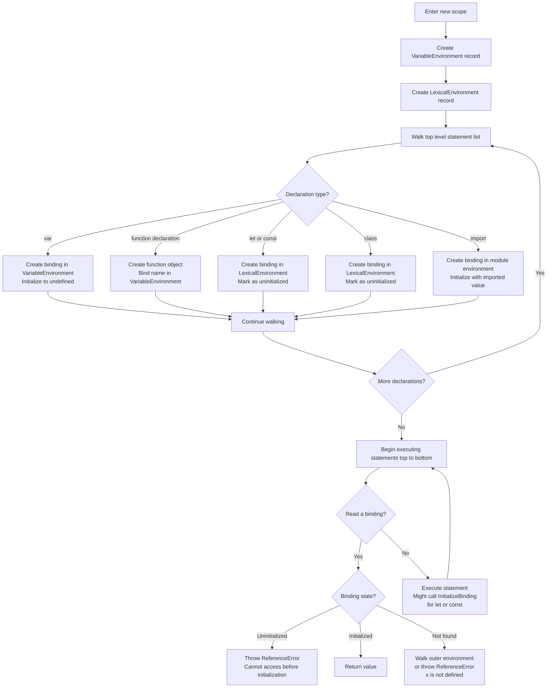
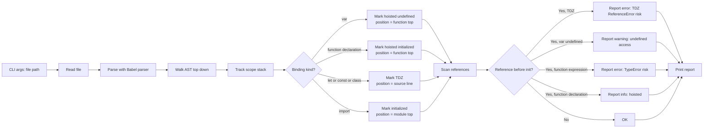

# 1.09 Hoisting Mechanics

## 1. Purpose

Hoisting is the JavaScript engine behaviour where declarations are processed before any code in the containing scope is executed. When the engine enters a function body, a module record, or a block, it does not run the statements top to bottom in a single pass. Instead it makes two logical passes over the source: a creation pass that registers every `var`, `function`, `function*`, `let`, `const`, `class`, and `import` binding in the appropriate environment record, and an execution pass that actually evaluates expressions, calls functions, and assigns values. Hoisting is the colloquial name for everything the creation pass does that a developer can observe from the execution pass.

The practical purpose of hoisting is threefold. First, it lets function declarations appear in any order within a scope so the author can lead with the high level entry point and push helpers to the bottom, the way a book leads with the table of contents and pushes the appendix to the back. Second, it is what makes the module pattern and the IIFE encapsulation idiom work without forward references exploding. Third, it is the reason `var` was tolerable for a decade before `let` and `const` arrived: hoisting plus automatic initialization to `undefined` means a `var` never throws a `ReferenceError` for being used before its declaration line — it just yields `undefined`, which is a softer, more debuggable failure than a hard crash.

Hoisting is also the source of some of the most common JavaScript bugs. The classic example is the loop that captures `var i` and then logs it after the loop has finished, expecting each iteration's value but getting the final value. Another classic is `console.log(x); var x = 5;` printing `undefined` instead of throwing, which surprises developers coming from languages with strict declaration order. The TDZ (`Temporal Dead Zone`) was introduced specifically to fix this class of bug for `let`, `const`, and `class`: those declarations are still hoisted in the sense that they reserve a binding slot in the lexical environment before execution, but the binding is marked uninitialized, and any access to it before the declaration line is evaluated throws a `ReferenceError` with the message `Cannot access 'x' before initialization`.

Function declarations get the strongest form of hoisting. The entire function object, body and all, is created during the creation phase and bound to the function's name. This is why you can call a function declaration at the top of a file even though its definition is at the bottom. Function expressions, by contrast, are not hoisted as functions at all — only the `var` or `let` they are assigned to is hoisted, and the assignment happens during the execution pass at the line where the expression sits.

Class declarations are hoisted but TDZ protected, like `let` and `const`. The reason is that a class declaration desugars conceptually to a `let` binding initialized with a `class` expression, and the class expression cannot be evaluated without first evaluating its `extends` clause (if present) and its entire method body. Allowing access to a class before its declaration would mean handing out a class object whose superclass is not yet known, which the spec committee considered unsafe.

The four declaration behaviours are therefore:

- `var` — hoisted, and initialized to `undefined` at the top of the function (or module, or global) scope. The assignment still happens at the declaration line during execution.
- `function` declaration — hoisted, and initialized to the function object itself at the top of the enclosing scope. You can call it before its source position.
- `let`, `const`, `class` — hoisted to the top of the enclosing block, but left uninitialized. Access before the declaration line throws a `ReferenceError`. This is the TDZ.
- `function*`, `async function`, `async function*` declarations — behave like `function` declarations: fully hoisted and initialized.
- `import` bindings — hoisted and initialized to their imported value, even though the `import` statement appears at the top of the file. You can use an imported binding before its `import` line in source order (though this is terrible style).

The reader should finish this note able to look at any 50 line module and predict, line by line, which bindings exist at each point, which are initialized, which are TDZ poisoned, and which lines would throw a `ReferenceError` if executed.

## 2. Theory and Deep Dive

### 2.1 The two pass model at the spec level

The ECMAScript specification does not use the word "hoisting." It uses the phrase "module evaluation" and the abstract operation `FunctionDeclarationInstantiation` (clause 10.2 of ES2024, formerly numbered 8.3.1 in earlier editions) and the `Block` evaluation algorithm (clause 14.2). What the spec describes operationally is exactly the two pass model:

1. The engine is handed an execution context. The execution context has a `VariableEnvironment` and a `LexicalEnvironment`, both of which are environment records (or chains of them).
2. Before any statement in the body is evaluated, `FunctionDeclarationInstantiation` walks the body's top level statement list and, for each `var` declaration, creates a binding in the `VariableEnvironment` initialized to `undefined`. For each `function` or `function*` or `async function` declaration, it creates the function object and binds it in the `VariableEnvironment` immediately. These bindings are visible from the very first line of execution.
3. When execution enters a `Block`, the spec's `Block` evaluation algorithm creates a new declarative environment record (the block's `LexicalEnvironment`) and walks the block's statement list to register every `let`, `const`, `class`, `function` (in strict mode and modules), and lexical `function*` declaration. Each lexical binding is registered but left in the "uninitialized" state. A `class` declaration registers the class name as an uninitialized lexical binding.
4. Once the bindings are registered, the engine begins executing the block's statements top to bottom. When the engine reaches a `let x = e;` line, it evaluates `e` and then calls `InitializeBinding(x, value)` on the lexical environment, which flips the binding from uninitialized to initialized.
5. If at any time the engine tries to read a binding that is registered but uninitialized, the `GetBindingValue` abstract operation throws a `ReferenceError` with the message `Cannot access 'x' before initialization`.

The distinction between `VariableEnvironment` and `LexicalEnvironment` matters: `var` and function declarations go into the `VariableEnvironment`, which is shared across the entire function body and is not forked when entering nested blocks. `let`, `const`, and `class` go into the `LexicalEnvironment`, which is forked into a new declarative environment record every time a new block, `for` loop iteration, `switch` case block, or `catch` clause is entered. This is why `var` is "function scoped" while `let` is "block scoped": they live in different environment records.

### 2.2 The creation phase algorithm

The following Mermaid flowchart captures the algorithm the engine runs when entering any new function or block scope. It is the mental model the rest of this note depends on.



The key insight is that the "uninitialized" state is not the same as `undefined`. A binding that holds `undefined` is initialized; reading it returns `undefined`. A binding in the TDZ has no value at all; reading it throws. The two states are represented differently in V8, SpiderMonkey, and JSC: typically the binding slot holds a special sentinel pointer (V8 calls this the hole value) that no JavaScript value can ever equal, and the runtime checks for it on every read of a lexical binding.

### 2.3 The four declaration behaviours in detail

#### `var`

A `var` declaration creates a binding in the `VariableEnvironment` of the nearest enclosing function (or the global object, if at the top level of a script). The binding is created at the start of the function's execution, regardless of where in the source the `var` statement appears. The binding's initial value is `undefined`. The assignment expression on the `var` line, if any, is evaluated at runtime when execution reaches that line.

This means:

```javascript
console.log(x); // undefined
var x = 5;
console.log(x); // 5
```

is equivalent to:

```javascript
var x = undefined;
console.log(x); // undefined
x = 5;
console.log(x); // 5
```

The `var x = 5;` line is split into two operations: a declaration that is hoisted to the top of the function and an assignment that stays in place.

#### `function` declarations

A function declaration creates a binding in the `VariableEnvironment` and initializes it to a fresh function object during the creation phase. The entire function body is available before the source line of the declaration. Function declarations hoist above `var` declarations, which means in this code:

```javascript
console.log(typeof f, typeof g); // "function" "undefined"
function f() { return 1; }
var g = function() { return 2; };
```

`f` is fully usable; `g` is `undefined` because only the `var g` part is hoisted, not the assignment.

When two function declarations in the same scope share a name, the later one wins, because both are hoisted and bound in order:

```javascript
f(); // "second"
function f() { return "first"; }
f(); // "second"
function f() { return "second"; }
```

Both bindings are created during the creation phase; the second assignment to the same name overwrites the first. By the time execution begins, `f` already points to the "second" function.

#### `let`, `const`

`let` and `const` create lexical bindings in the `LexicalEnvironment` of the enclosing block. The binding is created at the top of the block but is left uninitialized until execution reaches the declaration line. The TDZ extends from the top of the block to the declaration line.

A subtle point: the TDZ is per scope, not per file. A `let x` inside an `if` block has its TDZ only inside that block. Outside the block, `x` is not visible at all (it does not exist in any environment record the outer scope can see). This is why the following does not throw:

```javascript
{
  console.log(y); // ReferenceError: Cannot access 'y' before initialization
  let y = 1;
}
```

but the `console.log` is itself unreachable because the TDZ ReferenceError fires before it. Contrast:

```javascript
if (false) {
  let z = 1;
}
console.log(z); // ReferenceError: z is not defined
```

Here `z` is not defined at all in the outer scope; the `if (false)` block never executes but even if it did, `z` would be local to the block.

#### `class`

Class declarations are hoisted like `let` and `const`: the class name is registered in the `LexicalEnvironment` at the top of the block, but the binding is uninitialized until the `class` line is evaluated. Accessing the class before the declaration line throws a TDZ ReferenceError.

```javascript
const c = new C(); // ReferenceError: Cannot access 'C' before initialization
class C {}
```

The reason classes are TDZ protected is that a class declaration desugars to roughly:

```javascript
let C = class extends Base {
  // methods
};
```

Evaluating the class expression requires evaluating the `extends` clause (to know what the superclass is), evaluating the constructor and methods, and then assembling the class object. None of this can happen during the creation phase because the `extends` clause might itself reference other bindings that are not yet initialized. So the spec defers all of it to the execution pass and leaves the class name uninitialized in the meantime.

### 2.4 Function expressions are not hoisted as functions

A function expression is a value. The variable it is assigned to is hoisted (with the rules for that variable's declaration kind), but the function object is not created until the assignment line is executed.

```javascript
console.log(typeof f); // "function"
console.log(typeof g); // "undefined"
function f() {}
var g = function() {};
```

A named function expression has a subtle extra behaviour. The inner name is bound inside the function's own scope only, not in the enclosing scope:

```javascript
console.log(typeof bar); // "undefined" — bar is not visible outside
var foo = function bar() {
  // Inside here, `bar` refers to the function itself,
  // so the function can recurse even if the outer `foo`
  // binding is reassigned.
  return bar;
};
console.log(foo === foo()); // true
```

The inner `bar` binding is created during the creation phase of the function's own execution context, before the function body runs. This is what lets a named function expression recurse even if the outer variable is later reassigned or goes out of scope.

### 2.5 The TDZ fires at access time, not declaration time

The TDZ ReferenceError is thrown when the engine tries to read or write an uninitialized binding. It is not thrown by the presence of the `let` statement. This matters in code like:

```javascript
function read() {
  return x;
}
let x = 1;
console.log(read()); // 1
```

`read` references `x` from its enclosing scope. `x` is a `let` in the module scope. The function `read` is defined before `x` is initialized, but the body of `read` is not executed until after `x` is initialized, so no ReferenceError fires. The TDZ check happens at GetBindingValue time, which is when `read()` actually runs and dereferences `x`.

By contrast:

```javascript
function read() {
  return x;
}
console.log(read()); // ReferenceError: Cannot access 'x' before initialization
let x = 1;
```

This throws because `read()` is called before `let x = 1;` has executed. The `x` binding exists (it was registered in the creation phase) but it is still uninitialized when `read()` tries to return it.

### 2.6 Two distinct ReferenceError messages

The spec distinguishes between a binding that exists in some accessible environment record but is uninitialized (the engine throws `ReferenceError: Cannot access 'x' before initialization` — the TDZ error) and a binding that does not exist in any accessible environment record, including the global object (the engine throws `ReferenceError: x is not defined` — the undeclared variable error). These two messages are easy to conflate but they mean very different things: the first means "the binding exists but the engine refuses to let you see its value yet," and the second means "the binding does not exist at all and the engine has nowhere to look it up."

### 2.7 Hoisting vs scope: two different concepts

Hoisting and scope are often taught together but they are independent concepts. Scope answers "where can this name be looked up from?" Hoisting answers "when does this name become available within its scope?"

A `var` inside a function has function scope and is hoisted to the top of the function (initialized to `undefined`). A `let` inside a block has block scope and is hoisted to the top of the block (but left uninitialized). A function declaration has function (or module, or global) scope and is fully hoisted with its body. You can have hoisting without scope changes (a `var` at the top of a function is hoisted in its own scope) and you can have scope without hoisting differences (an inner block creates a new scope but does not change hoisting rules). The two concepts interact — hoisting makes bindings available at the top of their scope — but they are not the same thing.

### 2.8 ECMAScript clause references

The relevant clauses (in the ES2024 spec, with earlier editions in parentheses) are: clause 9.4 (Executable Code and Execution Contexts, including the `VariableEnvironment` and `LexicalEnvironment` components); clause 10.2 (formerly 8.3.1) — `FunctionDeclarationInstantiation`, which prepares the variable environment for a function call; clause 14.2 (formerly 13.2) — `Block` evaluation, which creates a new declarative environment record and registers lexical bindings; clause 14.3.1 — `Let` and `Const` declaration evaluation, including `InitializeBinding`; clause 15.7 (formerly 14.6) — `ClassDeclaration` evaluation, which defers all class assembly to the execution pass; and clause 17.2 (formerly 16.2) — module instantiation, including how `import` bindings are resolved. The curious reader is encouraged to read clause 10.2 (`FunctionDeclarationInstantiation`) in full. It is dense but it is the authoritative description of what happens when a function is called, including the order in which `var`, function, and parameter bindings are created and how duplicates are reconciled.

## 3. Mental Models

### 3.1 Model one — the engine reads declarations first

The simplest mental model is: the engine reads the entire function or block once, picks out every declaration, and writes them down at the top of the scope. Then it runs the code top to bottom. Declarations are extracted; statements stay in place.

This model explains `var` hoisting (the declaration is moved to the top, the assignment stays), function declaration hoisting (the whole function is moved to the top), and TDZ (the `let` declaration is moved to the top but the initialization stays, leaving a gap where the binding exists but has no value).

The model breaks down when you consider that "moving" is a metaphor — the spec does not move anything, it just registers bindings in the environment record before execution. The observable behaviour is the same, but the model can mislead when you try to reason about edge cases like duplicate `var` declarations or redeclarations of `let` in the same scope.

### 3.2 Model two — the binding has four states

A more precise model is that every binding has one of four states at any moment: (1) **Not yet declared** — the binding does not exist in any environment record the current scope can see; reading it throws `ReferenceError: x is not defined`. (2) **Declared but uninitialized (TDZ)** — the binding exists but has no value; reading it throws `ReferenceError: Cannot access 'x' before initialization`. This state is exclusive to `let`, `const`, `class`, and the inner name of a named function expression before its body runs. (3) **Initialized to `undefined`** — the binding exists and holds `undefined`; this is the state of every `var` binding before its assignment line runs. (4) **Initialized to a value** — the binding exists and holds a real value; this is the state of every function declaration binding, every `import` binding, and every `let`/`const`/`var` binding after its declaration line has executed. The creation phase produces bindings in state 2 or 3 (or 4 for functions and imports). The execution phase moves bindings from state 2 or 3 to state 4 as it reaches each declaration line. This model is accurate enough to predict every observable behaviour, including the timing of TDZ errors.

### 3.3 Model three — the four declaration kinds cheat sheet

- `var` — hoisted, initialized to `undefined`. Like a sticky note that says "this name exists and is blank" pinned to the top of the function scope.
- `function` declaration — hoisted, initialized to the function object. Like a sticky note with the function body already written on it.
- `let`, `const`, `class` — hoisted, uninitialized. Like a sticky note that says "do not touch until I tell you." Touching it before the declaration line throws.
- `import` — hoisted, initialized to the imported value. Like a sticky note that already has the value, even though the `import` line is below where you are reading.

### 3.4 Where the models break down

The "declarations are moved to the top" model breaks down for duplicate `var` declarations in the same scope (they create one binding, not two), for `var` and function declaration with the same name (the function wins during creation, but a later `var x = 5;` assignment overwrites it during execution), for `let` redeclarations (a `SyntaxError` thrown at parse time, before any execution phase exists), and for `var` inside `eval` in sloppy mode (which can inject declarations the static creation phase cannot predict). When the metaphor breaks down, switch to the spec model: environment records hold bindings, bindings have states, the creation phase produces states 2-4 and the execution phase moves bindings from 2 or 3 to 4.

## 4. Real-World Use Cases

### 4.1 The IIFE module pattern

Before ES modules, the standard way to encapsulate private state in a browser script was the IIFE:

```javascript
var counter = (function() {
  var count = 0;
  function increment() { count += 1; return count; }
  function decrement() { count -= 1; return count; }
  function value() { return count; }
  return { increment: increment, decrement: decrement, value: value };
})();
```

This works because `increment`, `decrement`, and `value` are all hoisted to the top of the IIFE's function scope, so the `return` statement at the bottom can reference them even though they are defined later in the source. If function declarations were not hoisted, the `return` would have to come last and the helpers above it, which is the opposite of the readable "interface first, implementation below" style.

### 4.2 Babel and TypeScript transpilation of `let` and `const`

Babel, when targeting ES5, transpiles `let` and `const` to `var`. This presents a problem: ES2015 `let` and `const` have TDZ semantics, but `var` does not. Babel's default behaviour is to rename colliding `let` bindings to unique names so that block scoping is preserved, but it does not emulate the TDZ ReferenceError by default. To get TDZ emulation, you must enable the `throwIfClosureRequired` option of `@babel/plugin-transform-block-scoping`, or accept that transpiled code will not throw on use-before-define. This is a real footgun for library authors who target ES5: a `let` that throws a ReferenceError in modern browsers may silently return `undefined` in transpiled ES5 output. The lesson is that transpilation preserves *scoping* but not *temporal* semantics unless you opt in. TypeScript does not transpile the TDZ at all when targeting ES5. `let x = 1; console.log(x);` and `console.log(x); let x = 1;` produce the same emitted code structure (with renamed variables to preserve block scope), and the latter silently prints `undefined` instead of throwing. TypeScript's stance is that TDZ emulation is the runtime's job.

### 4.3 ESLint's `no-use-before-define` rule

ESLint ships a rule called `no-use-before-define` that statically detects references to a binding that appear before its declaration in source order. The rule has three options:

- `functions: true` — flag calls to function declarations before their source position. This is the strictest setting; it forbids leveraging function hoisting.
- `classes: true` — flag references to a class before its source position. Almost always left on, since class TDZ errors are a real bug class.
- `variables: true` — flag references to `let` or `const` before their source position. Almost always on for the same reason.

The Airbnb style guide and many corporate lint configs set `functions: false, classes: true, variables: true`. This allows the IIFE module pattern (helpers below the export) while still catching TDZ bugs for `let`, `const`, and `class`.

### 4.4 React hooks and forward references

React function components often call helper functions defined later in the same module:

```javascript
function Profile({ user }) {
  const formatted = formatName(user);
  return <h1>{formatted}</h1>;
}

function formatName(user) {
  return `${user.first} ${user.last}`;
}
```

This works because `formatName` is a function declaration and is hoisted. The component can be the first thing in the file (the public interface) and the helper can sit below. If `formatName` were a `const formatName = (user) => ...` arrow function, the `Profile` component would crash on first render with a TDZ ReferenceError if `Profile` were called before the `formatName` line had executed — which in practice never happens because the module is fully evaluated before any export is called, but the lint rule still flags it. The same pattern appears in Redux reducers, in Express route handlers, and in test files where the `describe` block references `beforeEach` helpers defined below.

### 4.5 Recursive named function expressions

Named function expressions let a function refer to itself even if the outer variable is later reassigned. The inner name is hoisted into the function's own scope during each call's creation phase, so the function can recurse by its inner name regardless of what happens to the outer binding. This is the standard pattern for self-unregistering event handlers and recursive transforms that must survive reassignment of their outer reference.

### 4.6 Forward references in Node.js CommonJS modules

A CommonJS module is just a function wrapped by Node's module loader, so its top level is a function body. `var` and function declarations at the top level are hoisted to that function's scope, which means you can write `module.exports = { greet };` as the first line and `function greet(name) { ... }` later in the file. The `module.exports` line is the first executable statement; it references `greet`, which is hoisted. This is idiomatic Node style and depends entirely on function hoisting.

## 5. Code Examples

### 5.1 Example A — Minimal and Conceptual

Ten minimal snippets demonstrating each hoisting behaviour. Each appears in JavaScript and TypeScript side by side; the TypeScript version adds explicit types but the runtime behaviour is identical.

#### Snippet 1 — `var` is hoisted and initialized to `undefined`

**JavaScript:**

```javascript
console.log(x); // undefined
var x = 5;
console.log(x); // 5
```

**TypeScript:**

```typescript
console.log(x); // undefined
var x: number = 5;
console.log(x); // 5
```

#### Snippet 2 — `let` is hoisted but TDZ

**JavaScript:**

```javascript
try {
  console.log(y); // ReferenceError: Cannot access 'y' before initialization
} catch (e) {
  console.log(e.message);
}
let y = 5;
```

**TypeScript:**

```typescript
try {
  console.log(y); // ReferenceError: Cannot access 'y' before initialization
} catch (e) {
  console.log((e as Error).message);
}
let y: number = 5;
```

#### Snippet 3 — `const` is hoisted but TDZ

**JavaScript:**

```javascript
try {
  console.log(z); // ReferenceError: Cannot access 'z' before initialization
} catch (e) {
  console.log(e.message);
}
const z = 5;
```

**TypeScript:**

```typescript
try {
  console.log(z); // ReferenceError
} catch (e) {
  console.log((e as Error).message);
}
const z: number = 5;
```

#### Snippet 4 — function declaration is fully hoisted

**JavaScript:**

```javascript
console.log(typeof greet); // "function"
console.log(greet("World")); // "Hello, World"
function greet(name) {
  return `Hello, ${name}`;
}
```

**TypeScript:**

```typescript
console.log(typeof greet); // "function"
console.log(greet("World")); // "Hello, World"
function greet(name: string): string {
  return `Hello, ${name}`;
}
```

#### Snippet 5 — function expression assigned to `var` is NOT hoisted as a function

**JavaScript:**

```javascript
console.log(typeof greet); // "undefined"
try {
  greet("World"); // TypeError: greet is not a function
} catch (e) {
  console.log(e.message);
}
var greet = function(name) {
  return `Hello, ${name}`;
};
```

**TypeScript:**

```typescript
type Greet = (name: string) => string;
console.log(typeof greet); // "undefined"
try {
  (greet as Greet)("World"); // TypeError at runtime
} catch (e) {
  console.log((e as Error).message);
}
var greet: Greet = function (name: string): string {
  return `Hello, ${name}`;
};
```

#### Snippet 6 — class is hoisted but TDZ

**JavaScript:**

```javascript
try {
  console.log(C); // ReferenceError: Cannot access 'C' before initialization
} catch (e) {
  console.log(e.message);
}
class C {}
```

**TypeScript:**

```typescript
try {
  console.log(C); // ReferenceError
} catch (e) {
  console.log((e as Error).message);
}
class C {}
```

#### Snippet 7 — `var` inside a block leaks to the function scope

**JavaScript:**

```javascript
function leaky() {
  if (true) {
    var hidden = 1;
  }
  console.log(hidden); // 1 — var escapes the block
}
leaky();
```

**TypeScript:**

```typescript
function leaky(): void {
  if (true) {
    var hidden: number = 1;
  }
  console.log(hidden); // 1
}
leaky();
```

#### Snippet 8 — `let` inside a block does NOT leak

**JavaScript:**

```javascript
function tight() {
  if (true) {
    let local = 1;
  }
  try {
    console.log(local); // ReferenceError: local is not defined
  } catch (e) {
    console.log(e.message);
  }
}
tight();
```

**TypeScript:**

```typescript
function tight(): void {
  if (true) {
    let local: number = 1;
  }
  try {
    console.log(local); // ReferenceError
  } catch (e) {
    console.log((e as Error).message);
  }
}
tight();
```

#### Snippet 9 — `var` inside `if (false)` is still hoisted

**JavaScript:**

```javascript
function dead() {
  if (false) {
    var phantom = 1;
  }
  console.log(phantom); // undefined — the binding exists, the assignment never ran
}
dead();
```

**TypeScript:**

```typescript
function dead(): void {
  if (false) {
    var phantom: number = 1;
  }
  console.log(phantom); // undefined
}
dead();
```

This is the most surprising `var` behaviour for newcomers: even code that never runs can leak a binding into the enclosing scope, because the hoisting happens at parse time, not at execution time.

#### Snippet 10 — named function expression's inner name

**JavaScript:**

```javascript
console.log(typeof outer); // "undefined"
var outer = function inner(n) {
  console.log(typeof inner); // "function" — inner is visible inside its own body
  return n <= 1 ? 1 : n * inner(n - 1);
};
console.log(outer(5)); // 120
console.log(typeof inner); // "undefined" — inner is not visible outside
```

**TypeScript:**

```typescript
type Inner = (n: number) => number;
console.log(typeof outer); // "undefined"
var outer: Inner = function inner(n: number): number {
  console.log(typeof inner); // "function"
  return n <= 1 ? 1 : n * inner(n - 1);
};
console.log(outer(5)); // 120
console.log(typeof inner); // "undefined"
```

### 5.2 Example B — Production-Grade

A small user formatter module that leverages function hoisting for the "public API on top, helpers below" style. The module is written in both JavaScript (Node CommonJS) and TypeScript (ESM with explicit types).

**JavaScript:**

```javascript
// userFormatter.js — CommonJS module
"use strict";

const REQUIREDFIELDS = ["id", "email", "firstName", "lastName"];

module.exports = {
  formatUser,
  formatUsers,
  validateUser,
  userToCsvRow,
  usersToCsv,
};

function formatUser(user) {
  validateUser(user);
  const full = composeFullName(user.firstName, user.lastName);
  const email = normalizeEmail(user.email);
  return `${full} <${email}> (id=${user.id})`;
}

function formatUsers(users) {
  return users.map(formatUser).join("\n");
}

function validateUser(user) {
  if (!user || typeof user !== "object") {
    throw new TypeError("user must be an object");
  }
  for (const field of REQUIREDFIELDS) {
    if (!(field in user)) {
      throw new Error(`Missing required field: ${field}`);
    }
  }
}

function composeFullName(first, last) {
  return [first, last].filter(Boolean).join(" ") || "Anonymous";
}

function normalizeEmail(email) {
  return String(email).trim().toLowerCase();
}

function userToCsvRow(user) {
  validateUser(user);
  return [user.id, user.email, user.firstName, user.lastName]
    .map(escapeCsv)
    .join(",");
}

function usersToCsv(users) {
  const header = "id,email,firstName,lastName";
  const rows = users.map(userToCsvRow);
  return [header, ...rows].join("\n");
}

function escapeCsv(value) {
  const s = String(value);
  if (s.includes(",") || s.includes('"') || s.includes("\n")) {
    return `"${s.replace(/"/g, '""')}"`;
  }
  return s;
}
```

**TypeScript:**

```typescript
// userFormatter.ts — ES module with explicit types
export interface User {
  id: string;
  email: string;
  firstName: string;
  lastName: string;
}

const REQUIREDFIELDS: ReadonlyArray<keyof User> = [
  "id",
  "email",
  "firstName",
  "lastName",
];

export function formatUser(user: User): string {
  validateUser(user);
  const full = composeFullName(user.firstName, user.lastName);
  const email = normalizeEmail(user.email);
  return `${full} <${email}> (id=${user.id})`;
}

export function formatUsers(users: readonly User[]): string {
  return users.map(formatUser).join("\n");
}

export function validateUser(user: unknown): asserts user is User {
  if (!user || typeof user !== "object") {
    throw new TypeError("user must be an object");
  }
  const u = user as Record<string, unknown>;
  for (const field of REQUIREDFIELDS) {
    if (!(field in u)) {
      throw new Error(`Missing required field: ${field}`);
    }
  }
}

function composeFullName(first: string, last: string): string {
  return [first, last].filter(Boolean).join(" ") || "Anonymous";
}

function normalizeEmail(email: string): string {
  return String(email).trim().toLowerCase();
}

export function userToCsvRow(user: User): string {
  validateUser(user);
  return [user.id, user.email, user.firstName, user.lastName]
    .map(escapeCsv)
    .join(",");
}

export function usersToCsv(users: readonly User[]): string {
  const header = "id,email,firstName,lastName";
  const rows = users.map(userToCsvRow);
  return [header, ...rows].join("\n");
}

function escapeCsv(value: string | number): string {
  const s = String(value);
  if (s.includes(",") || s.includes('"') || s.includes("\n")) {
    return `"${s.replace(/"/g, '""')}"`;
  }
  return s;
}
```

**Why this works:** every helper referenced by `formatUser`, `formatUsers`, `validateUser`, `userToCsvRow`, and `usersToCsv` is a function declaration, so it is hoisted to the top of the module scope. The `module.exports` (or `export`) statement can sit at the top of the file (in the JS version, before any helper is defined in source order) and still reference every function it needs. The `REQUIREDFIELDS` constant is a `const` and so is NOT hoisted as a value — but it is positioned before any function that uses it actually executes, so its TDZ never triggers at runtime.

This is the standard idiom for non-trivial modules: the public API at the top, the private helpers below, and the constant configuration between them. Function hoisting makes it possible; `const` and `let` TDZ keeps the constants honest.

## 6. Common Mistakes and Anti-Patterns

### 6.1 Accessing a `let` before its declaration line

```javascript
console.log(x); // ReferenceError: Cannot access 'x' before initialization
let x = 1;
```

**Why it fails:** `x` is hoisted to the top of the enclosing scope as an uninitialized lexical binding. The first line tries to read it, which calls `GetBindingValue` on an uninitialized binding, which throws.

**Fix:** declare before use (`let x = 1; console.log(x);`). If you genuinely need to read before defining, that is a code smell — the right fix is to reorder, not to downgrade to `var`.

### 6.2 Assuming `var` inside `if (false)` does not leak

```javascript
function f() {
  if (false) {
    var secret = 42;
  }
  console.log(secret); // undefined — NOT ReferenceError
}
f();
```

**Why it fails:** `var` is function scoped and is hoisted at parse time. The `if (false)` block never executes, but the `var secret` declaration is still hoisted to the top of `f`, where it is initialized to `undefined`. The assignment `= 42` is on a line that never runs, so `secret` stays `undefined`. Many developers expect a `ReferenceError` here because the block "never ran"; the lesson is that hoisting is a parse time phenomenon, not an execution time one.

**Fix:** use `let` or `const` so the binding stays block scoped and is not visible outside the `if`.

### 6.3 Confusing function declarations with function expressions

```javascript
console.log(typeof f, typeof g); // "function" "undefined"
function f() {}
var g = function() {};
```

**Why it fails:** `function f() {}` is a function declaration — the entire function is hoisted. `var g = function() {}` is a function expression assigned to a `var` — only the `var g` is hoisted (and initialized to `undefined`); the function object is created at the assignment line.

**Fix:** if you need to call `g` before its source line, declare it as a function declaration:

```javascript
console.log(typeof f, typeof g); // "function" "function"
function f() {}
function g() {}
```

Or simply move the assignment above its first use.

### 6.4 Accessing a class before its declaration line

```javascript
const c = new Thing(); // ReferenceError: Cannot access 'Thing' before initialization
class Thing {}
```

**Why it fails:** `class` declarations are hoisted but TDZ protected, like `let`. The `Thing` binding exists in the creation phase but is uninitialized until the `class Thing {}` line executes. The `new Thing()` call dereferences an uninitialized binding, which throws.

**Fix:** move the class declaration above its first use:

```javascript
class Thing {}
const c = new Thing();
```

### 6.5 Using a `let` loop variable before the loop runs

```javascript
function f() {
  console.log(i); // ReferenceError: Cannot access 'i' before initialization
  for (let i = 0; i < 3; i++) {
    console.log(i);
  }
}
f();
```

**Why it fails:** the `let i` in the `for` header creates a fresh lexical binding per iteration, but the binding is registered in the outer block's lexical environment at parse time and is uninitialized until the `for` statement begins executing. The `console.log(i)` before the `for` line tries to read an uninitialized binding.

**Fix:** move the read inside the loop or after it:

```javascript
function f() {
  for (let i = 0; i < 3; i++) {
    console.log(i); // 0, 1, 2
  }
}
f();
```

Note that the same code with `var i` would print `undefined` instead of throwing, because `var` is initialized to `undefined` at the top of the function.

### 6.6 Assuming a named function expression's name is visible outside

```javascript
var f = function helper() {
  return helper();
};
console.log(typeof helper); // "undefined"
console.log(typeof f); // "function"
```

**Why it fails:** the inner name `helper` is bound only inside the function's own scope, not in the enclosing scope. The enclosing scope sees only the `var f` binding. The `helper` binding exists so the function can refer to itself recursively even if `f` is reassigned, but no other code can reach it.

**Fix:** if you need to call the function from outside, use the outer variable:

```javascript
var f = function helper() {
  return helper();
};
console.log(typeof f); // "function"
f(); // works
```

### 6.7 Redeclaring a `let` in the same scope

```javascript
let x = 1;
let x = 2; // SyntaxError: Identifier 'x' has already been declared
```

**Why it fails:** `let` and `const` cannot be redeclared in the same scope. This is a `SyntaxError`, thrown at parse time before any code runs. `var` allows redeclaration (the second declaration is a no-op), and function declarations allow redeclaration (the second one wins).

**Fix:** use a different name or reassign:

```javascript
let x = 1;
x = 2; // reassignment, not redeclaration
```

### 6.8 Closures over `var` in a loop capture the final value

```javascript
var fns = [];
for (var i = 0; i < 3; i++) {
  fns.push(function() { return i; });
}
console.log(fns.map(f => f())); // [3, 3, 3]
```

**Why it fails:** `var i` is hoisted to the enclosing function (or global) scope, and there is only one `i` binding shared by every iteration. Each closure captures the same `i`, which by the time the closures are called has the value `3` (the value that failed the loop condition). **Fix:** use `let` — `let i` in the `for` header creates a fresh `i` binding per iteration, so each closure captures its own copy, and `fns.map(f => f())` returns `[0, 1, 2]`.

### 6.9 `typeof` does not escape the TDZ

```javascript
console.log(typeof x); // ReferenceError: Cannot access 'x' before initialization
let x = 1;
```

**Why it fails:** a common belief is that `typeof` is always safe and never throws. This is true for undeclared variables (`typeof undeclaredVar` returns `"undefined"`), but it is NOT true for TDZ bindings. `typeof x` reads `x`, and reading a TDZ binding throws.

**Fix:** declare before use (`let x = 1; console.log(typeof x);` returns `"number"`). If you must check for an undeclared global, use `typeof window !== "undefined" && typeof window.someGlobal !== "undefined"` rather than relying on `typeof` to swallow a TDZ.

### 6.10 Default parameter values can hit the TDZ

```javascript
function f(x = y, y = 1) {
  return [x, y];
}
f(); // ReferenceError: Cannot access 'y' before initialization
```

**Why it fails:** parameters are evaluated left to right. `x = y` tries to read `y` before `y` has been initialized. Parameter bindings are in the TDZ until their default value expression is evaluated.

**Fix:** reorder the parameters so that `y = 1` comes first: `function f(y = 1, x = y) { return [x, y]; }` returns `[1, 1]`.

## 7. Best Practices and Design Patterns

### 7.1 Declare top level module bindings at the top

Even though function declarations are hoisted and `const` bindings only enter their TDZ before their source line, the reader benefits from seeing every binding at the top of the file. This is defensive readability: the next reader does not need to remember the hoisting rules to understand the file. Place imports first, then constants, then the public API (function declarations or `const` arrow functions), then private helpers. This order matches the "table of contents first, appendix last" structure of a well organized book.

### 7.2 Use function declarations when order does not matter

Function declarations are hoisted, so they can be defined in any order. This is the right choice when you want the reader to follow the high level logic first and the helpers second. The user formatter module in Section 5.2 demonstrates this.

### 7.3 Use `const` arrow functions when order matters

If you want the reader to be forced to read the file in order (so they encounter dependencies before they are used), use `const fn = () => ...` instead of `function fn() {}`. This makes the file read like a sequential narrative: each `const` is defined before its first use, and any forward reference is a TDZ bug rather than a silent success.

### 7.4 Enable ESLint `no-use-before-define` with `functions: false`

The recommended ESLint config for most projects is:

```json
{
  "rules": {
    "no-use-before-define": ["error", {
      "functions": false,
      "classes": true,
      "variables": true,
      "allowNamedExports": false
    }]
  }
}
```

This permits function hoisting (so the IIFE module pattern works) but flags every `let`, `const`, and `class` reference that appears before its declaration. The result is the best of both worlds: the readability of hoisted helpers, with the safety of TDZ protection for variables and classes.

### 7.5 Use TypeScript `let` and `const` exclusively

TypeScript will warn you if you use `var` (via the `no-var-keyword` rule in `tslint` or the equivalent in ESLint with `@typescript-eslint`). The recommended practice is to never write `var` in TypeScript code: `let` for mutable bindings, `const` for everything else. The TDZ catches forward references at runtime; the type checker catches most other misuse at compile time.

### 7.6 Prefer named function expressions for self reference

When a function needs to refer to itself (for recursion, for self unregistration as an event handler), prefer a named function expression over `arguments.callee`. The inner name is hoisted into the function's own scope, so the function can refer to itself even if the outer variable is reassigned. This is safer than relying on the outer variable, which another part of the code might overwrite.

### 7.7 Avoid `var` in modern code

There is no use case for `var` in code that targets ES2015 or later. `let` and `const` cover every legitimate use case with safer semantics. If you find yourself reaching for `var` to "avoid the TDZ," that is a signal that your code has a forward reference bug; the right fix is to reorder the declarations, not to silence the error by downgrading to `var`.

### 7.8 Use the module pattern (IIFE) only when ES modules are unavailable

In modern code, ES module `import` and `export` replace the IIFE module pattern. The IIFE is still useful in browser userscripts and bookmarklets (where you cannot rely on ES module support and need to encapsulate state) and in legacy Node.js CommonJS modules that need private state alongside `module.exports`. In both cases, function hoisting is what makes the pattern readable. Without it, the IIFE would have to put its `return` statement at the bottom, after every helper, which is the opposite of the "interface first" style.

## 8. Technical Interview Knowledge

### 8.1 Is `let` hoisted?

**A:** Yes. `let` is hoisted to the top of its enclosing block, in the sense that the binding is created during the creation phase, before any statements in the block are executed. The difference between `let` and `var` is not whether they are hoisted but what their initial state is: `var` is initialized to `undefined`, while `let` is left uninitialized until the declaration line. The uninitialized state is the TDZ. The evidence is the error message: `typeof undeclared` returns `"undefined"`, but `typeof x` before `let x` throws `ReferenceError: Cannot access 'x' before initialization`. If `let` were not hoisted, the engine would have no way to distinguish "x exists but is TDZ poisoned" from "x does not exist at all." The fact that it does distinguish them proves the binding exists in the creation phase.

**Trap to avoid:** do not say "let is not hoisted." The technically correct answer is "let is hoisted but not initialized." Interviewers are testing whether you understand the two pass model and the TDZ.

### 8.2 What is the TDZ?

**A:** The Temporal Dead Zone is the period between entering a scope and reaching the declaration line of a `let`, `const`, or `class` binding. During this period, the binding exists in the environment record but is marked uninitialized. Any read or write of the binding throws a `ReferenceError` with the message `Cannot access 'x' before initialization`. The TDZ is enforced at access time, not at declaration time — a function that closes over a TDZ binding can be defined before the binding's declaration line; the ReferenceError only fires if the function is called before the binding is initialized. The TDZ was introduced in ES2015 to make `let` and `const` safer than `var`. Without it, `console.log(x); let x = 5;` would print `undefined` (the `var` behaviour), which is a softer failure than a hard crash but hides bugs. The TDZ turns forward references into loud, immediate errors.

**Trap to avoid:** do not confuse the TDZ with scope. The TDZ is a temporal property of a binding within its scope; it does not change where the binding is visible, only when it can be touched.

### 8.3 Difference between function declaration and function expression hoisting?

**A:** A function declaration (`function f() {}`) is fully hoisted: the function object is created during the creation phase and bound to the name, so the function can be called before its source position. A function expression (`var f = function() {}` or `const f = () => {}`) is not hoisted as a function — only the variable it is assigned to is hoisted, and the function object is created at the assignment line. Calling the variable before the assignment line throws a `TypeError` (for `var`, where the variable is `undefined`) or a `ReferenceError` (for `let`/`const`, where the variable is TDZ poisoned). The exception is the named function expression: `var f = function inner() {}`. The outer `f` follows the rules above, but the inner `inner` is hoisted into the function's own scope during the creation phase of each call, so the function can refer to itself by `inner` even before the outer `f` assignment. This is what makes named function expressions useful for recursion.

**Trap to avoid:** the question is often phrased as "are function expressions hoisted?" The technically correct answer is "the function object is not hoisted; the variable binding is hoisted according to its declaration kind." Do not say "function expressions are not hoisted at all" — that misses the partial hoisting of the variable.

### 8.4 What happens when you reference a class before declaration?

**A:** You get a `ReferenceError` with the message `Cannot access 'C' before initialization`. Class declarations are hoisted (the class name is registered in the lexical environment during the creation phase) but are left uninitialized until the `class` line is executed. This is the same TDZ semantics as `let` and `const`. The reason classes are TDZ protected is that a class declaration desugars to roughly `let C = class extends Base { ... }`. Evaluating the class expression requires evaluating the `extends` clause, the constructor, and every method — none of which can happen during the creation phase because the `extends` clause might reference other bindings that are not yet initialized.

**Trap to avoid:** do not say "classes are not hoisted." They are hoisted (the binding exists in the creation phase), but they are TDZ protected. The error message ("Cannot access 'C' before initialization") is the giveaway that the binding exists but is uninitialized.

### 8.5 Does `var` inside `if` leak to the function scope?

**A:** Yes. `var` is function scoped, not block scoped. A `var` declaration inside any block (an `if`, a `for`, a `while`, a standalone `{}` block) is hoisted to the top of the enclosing function (or global, or module) scope. The block does not create a new scope for `var` purposes. This means `if (true) { var x = 1; } console.log(x);` logs `1`, and `if (false) { var x = 1; } console.log(x);` logs `undefined` (the binding exists, the assignment never ran). The only block like construct that DOES create a new scope for `var` is a function. `try`/`catch`/`finally` does not; `switch` does not; the body of `for`, `while`, and `do...while` does not. `let` and `const` are different: they are block scoped, so a `let` inside an `if` block is not visible outside the block at all.

**Trap to avoid:** the question often trips up developers who learned JavaScript from a language with block scoped variables. The right answer is "yes, `var` is function scoped and leaks out of every block that is not itself a function."

### 8.6 How does hoisting interact with `for` loops?

**A:** It depends on the declaration kind. For `var`, `var i` is hoisted to the top of the enclosing function. There is one `i` binding shared by every iteration, and it survives the loop. Closures created inside the loop capture this single binding, so they all see the final value when called after the loop. For `let`, `let i` is block scoped to the `for` statement. The spec mandates that a fresh `i` binding is created for each iteration, so closures created inside the loop capture their own copy. After the loop, `i` is not visible outside the `for` block.

```javascript
for (var i = 0; i < 3; i++) { /* closure here captures one i */ }
console.log(i); // 3

for (let j = 0; j < 3; j++) { /* closure here captures its own j */ }
console.log(j); // ReferenceError: j is not defined
```

**Trap to avoid:** the per iteration binding is not obvious from the source. Many developers assume `let i` in a `for` header creates one binding like `let i` outside a loop. The spec actually mandates a fresh binding per iteration, which is why closures work correctly.

### 8.7 What is function declaration hoisting used for?

**A:** The primary use of function declaration hoisting is the "public API on top, private helpers below" style of module authoring. By declaring the public functions and the private helpers as function declarations, the author can put the most important code first in the file and push the implementation details to the bottom, the way a book leads with the table of contents. A secondary use is forward references in scripts that need to call a function defined later in the same script. Before ES modules, this was common in browser scripts and Node CommonJS modules. A tertiary use is mutual recursion: two function declarations can each call the other, regardless of source order, because both are hoisted before either body runs.

**Trap to avoid:** the question is often phrased as "why do we have function hoisting?" The answer is partly historical (the original JavaScript spec mandated it) and partly ergonomic (it enables the readable module style). Do not say "for performance" — modern engines optimize both hoisted and non hoisted functions identically.

### 8.8 How does Babel emulate TDZ in ES5?

**A:** By default, it does not. Babel's default behaviour when transpiling `let` and `const` to ES5 is to rename colliding bindings to unique names (to preserve block scoping) and to emit them as `var`. The TDZ is not preserved: `console.log(x); let x = 5;` transpiles to `console.log(x); var x = 5;` (with `x` renamed if there is a collision), which prints `undefined` instead of throwing. To get TDZ emulation, you must enable the `throwIfClosureRequired` option of `@babel/plugin-transform-block-scoping`. With this option enabled, Babel wraps any block that contains a `let` or `const` in an IIFE and inserts explicit runtime checks that throw if a binding is accessed before its initialization. This is rare in production because it adds code size and runtime overhead; most projects accept that transpiled ES5 output does not enforce the TDZ. TypeScript does not emulate the TDZ at all when targeting ES5; the TypeScript team's stance is that TDZ enforcement is a runtime concern, and developers targeting modern engines get it for free.

**Trap to avoid:** do not say "Babel always preserves the TDZ." It does not. The default is to drop it. Interviewers may ask about this to test whether you understand the gap between source semantics and transpiled output.

## 9. Practical Exercises

### 9.1 Exercise One — Predict the output of 12 snippets

Predict the output (or error) of each of the following 12 snippets. Do not run them; trace the creation and execution phases by hand.

**JavaScript:**

```javascript
// Snippet 1
console.log(a);
var a = 1;

// Snippet 2
console.log(b);
let b = 1;

// Snippet 3
console.log(typeof c);
function c() {}

// Snippet 4
console.log(typeof d);
var d = function() {};

// Snippet 5
function e() {
  console.log(e);
}
e();

// Snippet 6
if (false) {
  var f = 1;
}
console.log(f);

// Snippet 7
if (false) {
  let g = 1;
}
console.log(typeof g);

// Snippet 8
console.log(h);
class h {}

// Snippet 9
for (var i = 0; i < 3; i++) {}
console.log(i);

// Snippet 10
for (let j = 0; j < 3; j++) {}
console.log(j);

// Snippet 11
const k = function inner() {
  return typeof inner;
};
console.log(k());

// Snippet 12
function l(x = m, m = 1) {
  return [x, m];
}
try {
  console.log(l());
} catch (e) {
  console.log(e.message);
}
```

**Full worked solution:**

1. `undefined`. `var a` is hoisted to the top of the script and initialized to `undefined`. The `console.log(a)` runs before the assignment line, so it logs `undefined`.
2. `ReferenceError: Cannot access 'b' before initialization`. `let b` is hoisted but uninitialized; the `console.log(b)` reads an uninitialized binding.
3. `"function"`. `function c() {}` is fully hoisted; `typeof c` returns `"function"`.
4. `"undefined"`. `var d` is hoisted and initialized to `undefined`; the assignment `= function() {}` is not. `typeof undefined` is `"undefined"`.
5. Logs the source of function `e`. `e` is a function declaration, hoisted; inside its own body, `e` refers to the function itself (function declarations are visible in their own scope, including their own body).
6. `undefined`. `var f` is hoisted to the script scope even though the `if (false)` block never executes. The binding exists, the assignment never ran, so `f` is `undefined`.
7. `"undefined"`. `let g` is block scoped to the `if` block. Outside the block, `g` is not defined at all; `typeof g` returns `"undefined"` because `typeof` on a truly undeclared name returns `"undefined"` rather than throwing.
8. `ReferenceError: Cannot access 'h' before initialization`. `class h` is hoisted but TDZ protected.
9. `3`. `var i` is function scoped (here, script scoped) and survives the loop. After the loop, `i` is `3` (the value that failed the condition).
10. `ReferenceError: j is not defined`. `let j` is block scoped to the `for` statement. Outside, `j` does not exist.
11. `"function"`. The named function expression's inner name `inner` is visible inside the function body, so `typeof inner` is `"function"`.
12. `"Cannot access 'm' before initialization"`. Parameter default values are evaluated left to right. `x = m` tries to read `m` before `m` is initialized; this throws a TDZ ReferenceError.

**TypeScript version:** the same 12 snippets with explicit types produce identical runtime output. TypeScript does not change runtime semantics.

### 9.2 Exercise Two — Refactor hoisting reliant code into explicit order code

Take the following CommonJS module that relies on function hoisting for its readability, and refactor it so that it does NOT rely on hoisting. Every `function` declaration should become a `const` arrow function, and the file should read top to bottom with no forward references.

**JavaScript (original):**

```javascript
module.exports = { main };

function main(input) {
  const parsed = parse(input);
  const validated = validate(parsed);
  return render(validated);
}

function parse(input) {
  return JSON.parse(input);
}

function validate(parsed) {
  if (!parsed || typeof parsed !== "object") {
    throw new Error("Invalid input");
  }
  return parsed;
}

function render(validated) {
  return JSON.stringify(validated, null, 2);
}
```

**Full worked solution (refactored):**

```javascript
const parse = (input) => {
  return JSON.parse(input);
};

const validate = (parsed) => {
  if (!parsed || typeof parsed !== "object") {
    throw new Error("Invalid input");
  }
  return parsed;
};

const render = (validated) => {
  return JSON.stringify(validated, null, 2);
};

const main = (input) => {
  const parsed = parse(input);
  const validated = validate(parsed);
  return render(validated);
};

module.exports = { main };
```

**Reasoning:** the original relied on `main` calling `parse`, `validate`, and `render`, all of which are function declarations hoisted to the top. The refactored version declares every helper before `main`, so `main`'s body can reference them without any hoisting. The arrow function form makes the order explicit, and `module.exports` moves to the bottom because `main` is now a `const` that must be initialized before it can be exported.

**TypeScript version:**

```typescript
type Input = string;
type Parsed = unknown;
type Validated = Record<string, unknown>;

const parse = (input: Input): Parsed => JSON.parse(input);

const validate = (parsed: Parsed): Validated => {
  if (!parsed || typeof parsed !== "object") {
    throw new Error("Invalid input");
  }
  return parsed as Validated;
};

const render = (validated: Validated): string =>
  JSON.stringify(validated, null, 2);

const main = (input: Input): string => {
  const parsed = parse(input);
  const validated = validate(parsed);
  return render(validated);
};

export { main };
```

### 9.3 Exercise Three — Implement a TDZ simulator using a Proxy on a plain object

Implement a function `withTDZ(target)` that returns a Proxy wrapping `target`. The Proxy should track which properties have been "initialized" (i.e. assigned at least once). Reading an uninitialized property throws a `ReferenceError` with the message `Cannot access '<name>' before initialization`. Assigning to an uninitialized property for the first time initializes it; subsequent reads return its value.

**JavaScript:**

```javascript
function withTDZ(target) {
  const initialized = new Set();
  return new Proxy(target, {
    get(t, prop, receiver) {
      if (typeof prop !== "string" && typeof prop !== "number") {
        return Reflect.get(t, prop, receiver);
      }
      if (!(prop in t)) {
        throw new ReferenceError(`${String(prop)} is not defined`);
      }
      if (!initialized.has(prop)) {
        throw new ReferenceError(
          `Cannot access '${String(prop)}' before initialization`
        );
      }
      return Reflect.get(t, prop, receiver);
    },
    set(t, prop, value, receiver) {
      const ok = Reflect.set(t, prop, value, receiver);
      if (ok) initialized.add(prop);
      return ok;
    },
    has(t, prop) {
      return Reflect.has(t, prop);
    },
  });
}

// Test
const scope = withTDZ({ x: undefined, y: undefined });

try {
  console.log(scope.x); // ReferenceError: Cannot access 'x' before initialization
} catch (e) {
  console.log(e.message);
}

scope.x = 10;
console.log(scope.x); // 10

try {
  console.log(scope.z); // ReferenceError: z is not defined
} catch (e) {
  console.log(e.message);
}
```

**TypeScript:**

```typescript
type TDZScope = Record<string, unknown>;

function withTDZ<T extends object>(target: T): T {
  const initialized = new Set<string | number | symbol>();
  return new Proxy(target, {
    get(t: T, prop: string | symbol, receiver: unknown): unknown {
      if (typeof prop !== "string" && typeof prop !== "number") {
        return Reflect.get(t, prop, receiver);
      }
      if (!Reflect.has(t, prop)) {
        throw new ReferenceError(`${String(prop)} is not defined`);
      }
      if (!initialized.has(prop)) {
        throw new ReferenceError(
          `Cannot access '${String(prop)}' before initialization`
        );
      }
      return Reflect.get(t, prop, receiver);
    },
    set(
      t: T,
      prop: string | symbol,
      value: unknown,
      receiver: unknown
    ): boolean {
      const ok = Reflect.set(t, prop, value, receiver);
      if (ok) initialized.add(prop);
      return ok;
    },
    has(t: T, prop: string | symbol): boolean {
      return Reflect.has(t, prop);
    },
  }) as T;
}

const scope = withTDZ<TDZScope>({ x: undefined, y: undefined });

try {
  console.log(scope.x); // ReferenceError
} catch (e) {
  console.log((e as Error).message);
}

scope.x = 10;
console.log(scope.x); // 10

try {
  console.log(scope.z); // ReferenceError: z is not defined
} catch (e) {
  console.log((e as Error).message);
}
```

**Reasoning:** the Proxy maintains a `Set` of initialized property names. The `get` trap checks the set before returning a value: if the property exists in the target but is not in the set, it throws the TDZ error; if the property does not exist in the target at all, it throws the "is not defined" error. The `set` trap updates the target via `Reflect.set` and, on success, adds the property to the initialized set. This simulates the two state model (initialized vs uninitialized) that the spec uses for `let` and `const` bindings. The simulation is approximate: real TDZ semantics distinguish a binding that exists in an environment record from one that does not, while our Proxy uses `prop in target` and requires the user to declare bindings ahead of time. A more faithful simulator would parse the source code and pre populate the target with property slots whose values are a special UNINITIALIZED sentinel.

### 9.4 Exercise Four — Trace the creation phase of a 50 line module

Take the following module and trace its creation phase. For each binding, state: (a) which environment record it lives in, (b) what its initial state is during the creation phase, (c) when it transitions to the initialized state during the execution phase. Assume strict mode and ES module semantics.

**JavaScript:**

```javascript
import { readdir } from "node:fs/promises";
import path from "node:path";

const ROOT = process.cwd();
const IGNORE = new Set(["nodePackages", ".git", "dist"]);

export function listFiles(dir) {
  const abs = path.resolve(ROOT, dir);
  const entries = readdirSyncSafe(abs);
  return entries.filter(isNotIgnored).map(toRelative);
}

export function listAll() {
  return listFiles(".").concat(listFiles("src"));
}

function readdirSyncSafe(abs) {
  try {
    const { readdirSync } = require("node:fs");
    return readdirSync(abs);
  } catch (e) {
    return [];
  }
}

function isNotIgnored(entry) {
  return !IGNORE.has(entry);
}

function toRelative(entry) {
  return path.relative(ROOT, entry);
}

let cache = null;
function cached() {
  if (cache === null) cache = listAll();
  return cache;
}

export { cached as listAllCached };
```

**Full worked solution:**

The module's top level is the module scope. The creation phase walks the top level statements and registers the following bindings in the module environment record (which serves as both the `VariableEnvironment` and the `LexicalEnvironment` at the top level of an ES module):

| Binding | Declaration kind | Initial state |
|---|---|---|
| `readdir` | import binding | initialized to the imported `readdir` function |
| `path` | import binding | initialized to the imported `path` module object |
| `ROOT` | const | uninitialized (TDZ) |
| `IGNORE` | const | uninitialized (TDZ) |
| `listFiles` | function declaration | initialized to the function object |
| `listAll` | function declaration | initialized to the function object |
| `readdirSyncSafe` | function declaration | initialized to the function object |
| `isNotIgnored` | function declaration | initialized to the function object |
| `toRelative` | function declaration | initialized to the function object |
| `cache` | let | uninitialized (TDZ) |
| `cached` | function declaration | initialized to the function object |

Additionally, `cached` is aliased to `listAllCached` for the export, but this is an export binding, not a new lexical binding in the module scope.

The execution phase then runs top to bottom:

1. Line: `import { readdir } from "node:fs/promises";` — already initialized during creation (imports are evaluated before the module body runs). No effect.
2. Line: `import path from "node:path";` — already initialized. No effect.
3. Line: `const ROOT = process.cwd();` — evaluates `process.cwd()`, calls `InitializeBinding(ROOT, value)`. `ROOT` transitions from TDZ to initialized.
4. Line: `const IGNORE = new Set([...]);` — evaluates the Set constructor, calls `InitializeBinding(IGNORE, value)`. `IGNORE` transitions from TDZ to initialized.
5. Lines for `export function listFiles` and the other function declarations — already initialized during creation. No effect at execution.
6. Line: `let cache = null;` — evaluates `null`, calls `InitializeBinding(cache, null)`. `cache` transitions from TDZ to initialized (to the value `null`).
7. Line: `export { cached as listAllCached };` — registers the export binding. No lexical effect.

During the creation phase, no `ReferenceError` can fire because no statements are executed. During the execution phase, every binding is initialized in order, and no TDZ error fires because every reference appears after the binding's initialization line. To verify the trace, the order in which bindings become usable is: `readdir` and `path` from line 1 (creation phase); `listFiles`, `listAll`, `readdirSyncSafe`, `isNotIgnored`, `toRelative`, `cached` from line 1 (creation phase, because function declarations are fully hoisted); `ROOT` after its `const` line; `IGNORE` after its `const` line; `cache` after the `let cache = null;` line. A TDZ ReferenceError would fire if, for example, you added `console.log(ROOT);` at the very top of the file before `const ROOT = ...`. That line would execute during the execution phase (before the `const ROOT` line) and would try to read an uninitialized binding.

**TypeScript version:** the trace is identical; TypeScript does not change runtime semantics.

## 10. Mini-Project Blueprint

**Project name:** Hoisting Analyzer

**Scope:** a command line tool that parses a JavaScript or TypeScript source file with an AST parser and reports every use before define pattern. The tool detects: (a) `let`/`const`/`class` references that appear before their declaration in source order (TDZ risk), (b) `var` references that appear before their assignment (will yield `undefined` rather than the intended value), (c) function expression calls before the assignment line (`TypeError` risk), (d) function declaration calls before the source position (intentional hoisting — flag as informational, not an error).

**Architecture sketch:**



**Key files:**

- `src/index.ts` — CLI entry point. Reads the file path from `process.argv`, calls the analyzer, prints the report.
- `src/parser.ts` — wraps the Babel parser (`@babel/parser`) to produce an AST. Handles TypeScript, JSX, and modern ECMAScript syntax.
- `src/scope.ts` — implements the scope stack. Each scope tracks its bindings with their kind (var, let, const, class, function, import), their declaration source location, and their initialization state.
- `src/analyzer.ts` — walks the AST top down. For each declaration, registers the binding in the current scope. For each reference (Identifier node used as an expression), checks whether the binding is in the TDZ and records a finding.
- `src/reporter.ts` — formats findings as a human readable report with file path, line number, column, severity, and a code excerpt.
- `test/analyzer.test.ts` — Vitest tests covering each declaration kind and each finding category.

**Acceptance criteria:**

- Given a file with `console.log(x); let x = 1;`, the tool reports a TDZ ReferenceError risk at line 1.
- Given a file with `console.log(y); var y = 1;`, the tool reports an undefined access warning at line 1.
- Given a file with `f(); var f = function() {};`, the tool reports a TypeError risk at line 1.
- Given a file with `g(); function g() {}`, the tool reports an informational hoisting notice at line 1 (not an error).
- Given a file with `class C {} const c = new C();`, the tool reports no findings.
- Given a file with `const c = new C(); class C {}`, the tool reports a TDZ ReferenceError risk at line 1.
- The tool handles TypeScript syntax (type annotations, interfaces, enums, decorators) without crashing.
- The tool handles CommonJS and ES module syntax.
- The tool exits with status 1 if any error level finding is reported, 0 otherwise.

**Stretch goals:**

- Add a `--fix` mode that reorders declarations to eliminate findings where possible.
- Add support for `import` analysis: flag circular imports that may cause TDZ errors at runtime.
- Add a watch mode that re runs the analyzer on file change.
- Add JSON output for integration with CI pipelines.
- Add support for JSX and TSX files.
- Integrate with ESLint as a custom rule, so the analyzer runs as part of the existing lint pipeline.
- Add a "hoisting visualizer" mode that prints the file with each binding annotated with its initialization state at each line, the way a debugger would step through the creation phase.

**Reference implementation sketch:**

```typescript
import { parse } from "@babel/parser";
import traverse from "@babel/traverse";
import * as t from "@babel/types";

type Kind = "var" | "let" | "const" | "class" | "function" | "import";
interface Binding { name: string; kind: Kind; line: number; col: number; initialized: boolean; }
interface Finding { severity: "error" | "warning" | "info"; message: string; line: number; col: number; }

function analyze(source: string): Finding[] {
  const ast = parse(source, { sourceType: "unambiguous", plugins: ["typescript", "jsx"] });
  const findings: Finding[] = [];
  const stack: Map<string, Binding>[] = [new Map()];
  const top = () => stack[stack.length - 1];
  const lookup = (name: string): Binding | undefined => {
    for (let i = stack.length - 1; i >= 0; i--) {
      const b = stack[i].get(name);
      if (b) return b;
    }
    return undefined;
  };
  const push = () => stack.push(new Map());
  const pop = () => stack.pop();

  traverse(ast, {
    Program: { enter: push, exit: pop },
    BlockStatement: { enter: push, exit: pop },
    FunctionDeclaration: { enter: push, exit: pop },
    FunctionExpression: { enter: push, exit: pop },
    ArrowFunctionExpression: { enter: push, exit: pop },
    VariableDeclarator(path) {
      const id = path.node.id as t.Identifier;
      const kind = (path.parent as t.VariableDeclaration).kind as Kind;
      const loc = id.loc!.start;
      top().set(id.name, { name: id.name, kind, line: loc.line, col: loc.column, initialized: false });
    },
    FunctionDeclaration(path) {
      const id = path.node.id!;
      const loc = id.loc!.start;
      top().set(id.name, { name: id.name, kind: "function", line: loc.line, col: loc.column, initialized: true });
    },
    ClassDeclaration(path) {
      const id = path.node.id!;
      const loc = id.loc!.start;
      top().set(id.name, { name: id.name, kind: "class", line: loc.line, col: loc.column, initialized: false });
    },
    Identifier(path) {
      // Skip declaration sites; only inspect references.
      const p = path.parentPath;
      if (p?.isVariableDeclarator() && p.node.id === path.node) return;
      if (p?.isFunctionDeclaration() && p.node.id === path.node) return;
      if (p?.isClassDeclaration() && p.node.id === path.node) return;
      const b = lookup(path.node.name);
      if (!b) return;
      const r = path.node.loc!.start;
      const before = r.line < b.line || (r.line === b.line && r.column < b.col);
      if (!before) return;
      if (b.kind === "var") {
        findings.push({ severity: "warning", message: `var '${b.name}' used before assignment`, line: r.line, col: r.column });
      } else if (b.kind === "let" || b.kind === "const" || b.kind === "class") {
        findings.push({ severity: "error", message: `Cannot access '${b.name}' before initialization (TDZ)`, line: r.line, col: r.column });
      } else if (b.kind === "function") {
        findings.push({ severity: "info", message: `Function '${b.name}' called before declaration (hoisted)`, line: r.line, col: r.column });
      }
    },
  });

  return findings;
}
```

This is a sketch; a production version would use Babel's own scope analysis (`path.scope.getBinding(name)`) rather than a hand rolled scope stack, and would handle many more edge cases (destructuring, default parameters, `for` loop per iteration bindings, etc.). The sketch is enough to demonstrate the architecture.

## 11. Core Connections

**Prerequisites (read these first):**

- [[1.02 Variables and Mutability]] — the difference between `var`, `let`, and `const` at the declaration level. This note assumes you know what each declaration kind does; here we focus on when the binding becomes available.
- [[1.08 Execution Context and Lexical Environment]] — the `VariableEnvironment` and `LexicalEnvironment` records that hold bindings. Hoisting is the creation phase activity that populates these records.

**Sibling notes (read alongside this one):**

- [[1.10 Closures and Lexical Scope]] — closures capture bindings, not values. The TDZ applies to the captured binding, so a closure that closes over a TDZ binding throws when called before the binding is initialized.

**Dependents (notes that build on this one):**

- [[1.16 ES6 Classes Syntactic Sugar]] — class declarations are TDZ protected for the reasons explained here. Understanding hoisting is a prerequisite for understanding why `new C()` before `class C {}` throws.
- [[6.04 ESLint Flat Config]] — the `no-use-before-define` rule statically detects the patterns this note describes. The ESLint config is the primary tool for enforcing hoisting hygiene in a codebase.
- [[6.07 TSC Compiler Operation]] — TypeScript does not transpile the TDZ when targeting ES5. Understanding this gap is essential for library authors who ship transpiled output.

---

**Tags:** #javascript #hoisting #tdz #scope #closures #advanced
