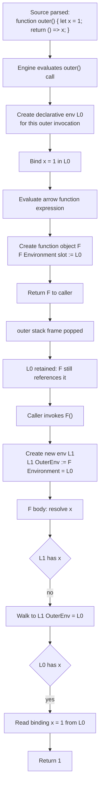
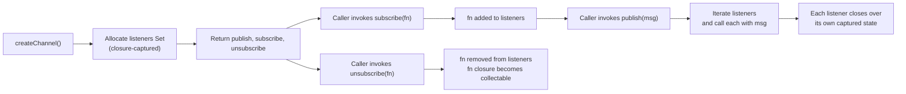

# 1.10 Closures and Lexical Scope

## 1. Purpose

Closures exist because JavaScript treats functions as first-class values. A function can be passed as an argument, returned from another function, stored in a data structure, and invoked at an arbitrary later time, long after the function that created it has finished executing. For that to work, the function must carry with it some memory of where it was born: which variables were in scope, what their names resolved to, and which environment chain to walk when a name is not found locally. That carry-along memory is the closure.

The bug class closures prevent is the "global pile." Before modules were standardized in ES2015, the only way for an inner piece of code to share state with code that ran later was to hoist that state into the global object or into an outer enclosing scope and hope that nobody else clobbered it. Closures give every function its own private, tamper-resistant pocket of state. You can hand a callback to a third-party library and know that the variables it reads are the ones that were in scope when you wrote the callback, not whatever a hostile caller has injected into `window` or `globalThis`.

The bug class closures cause is subtler. Because the captured environment stays alive as long as the function does, you can accidentally keep massive object graphs resident in the heap by leaving a single closure lying around. And because every iteration of a `for (var i = 0; ...)` loop shares the same `i` binding (see [[1.09 Hoisting Mechanics]] for why `var` is function-scoped), a handful of `setTimeout` callbacks created inside the loop will all read the post-loop value of `i`. That is the canonical "prints 5, 5, 5, 5, 5" interview question. Closures do not introduce this bug maliciously; they expose it because they faithfully preserve the binding they were told to preserve.

Closures are the load-bearing primitive behind four pieces of modern JavaScript architecture:

1. **Modules.** Before ES modules, the only way to get genuine file-level privacy was an IIFE that closed over its own local variables and returned a public interface. The Revealing Module Pattern, CommonJS `module.exports`, and even ES modules (whose live bindings are implemented with closure-like environment records) all lean on this.
2. **Memoization.** A memoized function needs a private cache that survives between calls but is invisible to callers. The cache is a closed-over variable.
3. **Partial application and currying.** A `curry(add)` call returns a chain of functions, each of which closes over the arguments collected so far, until enough arguments have accumulated to invoke the original function.
4. **React hooks.** `useState`, `useEffect`, `useCallback`, and `useMemo` all return values that are captured by closures in your render function. The "stale closure" bug in React is precisely the closure-over-a-mutable-variable trap described in Section 6.

Without closures, every one of these would have to be re-implemented with explicit environment-passing data structures, exactly the indirection that the lexical scope chain automates for free. The reader should finish this note able to explain the spec mechanism that produces a closure, identify every place one is being created, predict which variables a long-lived closure will keep alive, and implement memoize, curry, once, and the module pattern from scratch.

## 2. Theory and Deep Dive

### 2.1 Lexical scoping is decided at write-time

Lexical scope means "scope determined by the static structure of the source code, not by the dynamic call stack at run time." When the engine parses a function, it knows, purely from where the function is physically nested in the file, which names that function will be able to see. The decision is locked in at parse time and never changes, no matter how the function is later called.

Contrast this with dynamic scoping, used by some older Lisps, Emacs Lisp by default, and bash in certain modes. In dynamic scope, a function looks up free variables in the caller's environment, then the caller's caller, and so on up the call stack. The same function called from two different places can resolve the same name to two different bindings. JavaScript does not do this. The free variable `x` inside `inner` always resolves to the `x` declared in the nearest enclosing lexical scope of `inner`'s definition site, regardless of who calls `inner` or what they have bound `x` to.

This is why the following always prints `outer`, never `caller`, even though `inner` is invoked from inside `caller` where `x` is `"caller"`:

```javascript
const x = "global";
function outer() {
  const x = "outer";
  function inner() {
    console.log(x);
  }
  return inner;
}
function caller() {
  const x = "caller";
  const fn = outer();
  fn(); // prints "outer"
}
caller();
```

`inner` was born inside `outer`, so its lexical parent is `outer`'s environment. The call site is irrelevant. For the spec-level machinery that walks this chain, see [[1.08 Execution Context and Lexical Environment]].

### 2.2 The `[[Environment]]` internal slot

Every function object in ECMAScript carries an internal slot named `[[Environment]]` (written with double square brackets in the spec because it is not directly observable from user code). This slot holds a reference to the LexicalEnvironment that was active at the moment the function was created. The slot is set once, at function-creation time, and never changes.

When the engine later calls the function, it performs the following sequence (simplified; the full algorithm is in ECMAScript clause 10.2, "Environment Records", and the `OrdinaryCallEvaluateBody` abstract operation):

1. A new LexicalEnvironment record `L` is created for this invocation.
2. `L.[[OuterEnv]]` is set to `function.[[Environment]]`, the environment captured at creation time.
3. A new execution context is pushed whose LexicalEnvironment is `L`.
4. The function body runs. Every identifier resolution walks `L`, then `L.[[OuterEnv]]`, then that environment's `[[OuterEnv]]`, and so on, until either the name is found or the chain ends at the global environment.

This is the entire mechanism. There is no separate "closure object." A closure is just a function whose `[[Environment]]` slot still points at an environment record that has not been garbage-collected, which, because the function itself holds the reference, means the environment record is kept alive as long as the function is reachable.

### 2.3 Closures are not a special feature

It is tempting to think of closures as a thing you opt into by writing a nested function that returns another function. The spec disagrees. **Every function is a closure**, because every function has a `[[Environment]]` slot. A top-level function declaration has `[[Environment]]` pointing at the global environment. A nested function has it pointing at its enclosing function's environment. The only thing that differs is whether the captured environment is interesting enough for the bug class in Section 1 to manifest. Even a `function f() { return 1; }` at the top of a module is technically a closure over the module's lexical environment; it just does not read anything from that environment, so the closure is invisible.



### 2.4 Environment records and bindings

The spec defines several kinds of environment record. The two you will meet most often:

- **Declarative Environment Record.** Used for `var`, `let`, `const`, `function`, `class`, and `import` bindings. Each binding is a slot in the record holding a value and a `mutable` flag (false for `const`, true for `let` and `var`).
- **Object Environment Record.** Used for `with` blocks and for the global environment's bindings onto the global object. Bindings are backed by actual properties of an object.

When you write `let x = 1;` inside a function, the engine adds a binding named `x` to the function's declarative environment record. When a closure captures `x`, it captures a reference to the **environment record**, not to the value of `x`. Mutations to `x` after the closure was created are visible to the closure, because they happen in the same shared binding slot.

This is the source of the for-loop bug and the stale-closure bug, both covered in Section 6. The closure does not snapshot the value; it snapshots the binding. The distinction is the entire reason closures are simultaneously the most powerful and the most footgun-prone feature in the language.

### 2.5 Memory implications

Because the closure holds a reference to its `[[Environment]]`, the environment record, and every binding inside it, is reachable for as long as the closure is reachable. The outer function's stack frame may be popped, but the environment record was heap-allocated the moment a closure was created over it. V8 performs an optimization called "escape analysis" that may stack-allocate when no closure escapes, but for any function that returns an inner function, the environment is heap-allocated.

Practical consequences:

- A single long-lived closure keeps alive every variable in every environment record in its `[[OuterEnv]]` chain, even ones the closure never reads.
- A closure that escapes into an event listener, a `setInterval` callback, or a global cache can pin megabytes of unreachable-by-design data in the heap. This is the single most common cause of memory leaks in long-running Node.js processes and single-page applications. See [[1.29 Memory Leaks Diagnostic]] for the diagnostic playbook.
- V8 and other engines may optimize by capturing only the variables that are actually referenced, a "lazy" or "context-local" closure optimization, but this is an implementation detail. The spec model is "the whole environment record is retained," and any code that depends on the optimization (for example, expecting a giant captured array to be collected) is fragile.

### 2.6 The closure variable is a binding, not a snapshot

A common teaching story is "the closure captures the value of the outer variable." This is wrong. The closure captures a reference to the **binding**, which is a mutable slot. Reassigning the outer variable updates the binding; the closure sees the new value. This is why the for-loop bug exists: every iteration's closure captures the same binding of `i` (when declared with `var`), and that binding ends up holding the loop's terminal value by the time any `setTimeout` callback fires.

The `let` fix works because of a spec rule (clause 14.7.4, `ForBodyEvaluation`, step 3.a.i): when a `for` loop uses `let` in its header, the engine creates a fresh declarative environment record for the loop body on every iteration, copying the current value of the loop variable into it. Each iteration's closures therefore capture **different** bindings, each holding the value of `i` as it was during that specific iteration. The same rule applies to `for...of` and `for...in` with `const` or `let`, which is why the closure-in-loop bug is rare in modern code that uses `let` consistently.

### 2.7 Why the spec committee chose lexical scope

Lexical scope was chosen for three reasons. First, it is statically analyzable: a tooling vendor can determine which declaration each name resolves to without running the code, which makes IDEs, linters, and minifiers possible. Second, it is performant: the scope chain is a fixed linked list of environment records, walked at access time with no need to inspect the call stack. Third, it is compositional: a function's behavior depends only on its definition site, so you can reason about it locally without tracing every caller. Dynamic scope sacrifices all three for the (rare) convenience of letting a function see caller-local state.

The lexical model is what enables the module pattern, tree-shaking bundlers, and partial application: each is a static transformation that depends on knowing, at build time, exactly which bindings a function reads.

## 3. Mental Models

### 3.1 Lexical scope is a photograph

Think of lexical scope as a photograph taken the moment the source file is parsed. The photo shows which names are visible from each point in the code, organized as nested rectangles (one per function or block). When the function later runs, no matter where, no matter when, it consults the photograph, not the room it is currently standing in.

Where the metaphor breaks: the photograph shows the **shape** of the scope chain (which environments are linked to which), but the **contents** of those environments change as bindings are reassigned. The photo is structural, not a snapshot of values. A better refinement: the photo shows the layout of the rooms and the doors between them, but the furniture inside each room can be rearranged at any time.

### 3.2 A closure is a function with a backpack

When you create a function, the engine hands it a backpack. Inside the backpack is a reference to the environment in which the function was born. The function carries this backpack wherever it goes: into a callback, into a `setTimeout`, into a returned value, into a `Promise.then`. When the function runs and needs to look up a variable, it rummages through its own local pockets first, then opens the backpack, then opens the backpack's parent backpack (the `[[OuterEnv]]` of the captured environment), and so on up the chain.

The outer function that created the inner function can return and die. Its stack frame is gone. But the backpack survives, because the inner function is still holding the strap. The variables inside the backpack survive too, they live in the heap-allocated environment record that the backpack references.

Where the metaphor breaks: the backpack is shared. If two functions are created in the same scope, they share the same backpack, and mutations made by one are visible to the other. A more accurate picture is "a backpack that everyone born in this scope has a key to." The backpack is the environment record, not a per-function copy.

### 3.3 When to switch models

Use the photograph model when reasoning about **what name resolves to** (static structure questions: "which declaration does this `x` refer to?"). Use the backpack model when reasoning about **lifetimes and mutations** (dynamic questions: "is this variable still alive?", "what value does the closure see when it runs?"). Most closure bugs come from using the photograph model for a question that is actually about lifetimes or mutations: the developer reads the source, sees the value at write-time, and forgets that the closure captures the binding, not the value.

### 3.4 The "function with a backpack" model meets reality

In V8, the backpack is a `Context` object allocated on the heap. The function's `JSFunction` holds a pointer to it. The `Context` has a pointer to its parent `Context`. The whole chain is a linked list. When the function reads a variable, V8 walks the chain, finds the `Context` that holds the slot, and reads the value. There is no copy, no snapshot, no broadcast. Just pointers. This is why closures are cheap to create (one heap allocation for the `Context`) but expensive to keep alive (the `Context` pins everything in it).

## 4. Real-World Use Cases

### 4.1 The Module Pattern

Before ES modules, the only way to get true file-level privacy was the IIFE-based module pattern. A wrapper function is invoked immediately, declares private variables in its own scope, and returns an object literal whose methods close over those variables. The methods are the only way to touch the state from outside.

```javascript
const Counter = (function () {
  let count = 0;
  function increment() { count += 1; return count; }
  function decrement() { count -= 1; return count; }
  function value() { return count; }
  return { increment, decrement, value };
})();
```

`Counter.increment`, `Counter.decrement`, and `Counter.value` are the only public handles. `count` is unreachable from outside the IIFE. This is the lineage that ES modules inherited: the `export` declarations of a module are, conceptually, the public interface, and everything not exported is private to the module's top-level lexical scope. Node.js CommonJS modules use the same trick, wrapping every file's source in a function that closes over `module`, `exports`, `require`, and the file-path globals (`filename` and `dirname`, exposed on the module wrapper).

### 4.2 React hooks

Every React function component is a function that closes over the props and state values it received for that render. `useState` returns a `[value, setter]` pair; the `value` is a closed-over binding captured for this render. `useCallback(fn, deps)` returns a function that closes over the `deps`-specified bindings. `useEffect`'s callback closes over whatever was in scope when the effect was scheduled.

This is why React has the "stale closure" problem: if a `useEffect` callback is created on render 1 with an empty dependency array, it closes over render 1's bindings forever. When it runs later, it reads stale values. The fix is to either include the right dependencies (causing a fresh closure to be created on each render where they change) or use a ref, which is a mutable box that the closure reads from at call time, dodging the binding-capture problem entirely. Exercise 9.4 walks through a full diagnosis and three fixes.

### 4.3 Lodash memoize

Lodash's `memoize(func, [resolver])` returns a new function that closes over a `Map`-like cache. On each call, the resolver produces a cache key; if the key is present, the cached result is returned; otherwise the original function is called and its result is stored. The cache is private, callers cannot reach it except through the returned function. The `.cache` property is exposed for inspection and clearing, but the canonical use is "function with hidden memory." The same pattern is used inside React's `useMemo` (though React's cache is keyed on the deps array and lives in the fiber, not in a closure the user holds).

### 4.4 Express middleware

`app.use((req, res, next) => { ... })` registers a callback that closes over `app` (the Express application), the router, and any locally captured configuration. When a request arrives, Express invokes the callback; the callback reads `app.locals`, `app.settings`, or any other closed-over state. The middleware does not need to be told where `app` is, it already knows, because it was born inside the `app.use` call. Every middleware that captures a database connection, a logger, or a config object in its setup closure is using the module pattern applied to request handling.

### 4.5 Redux bindActionCreators

`bindActionCreators(actionCreators, dispatch)` wraps each action creator in a closure that captures `dispatch` and the original creator, returning a new function that calls `dispatch(creator(...args))`. The wrapped functions are pure closures: they carry `dispatch` and `creator` in their backpacks and need no other context to do their job. This is what lets you pass `actions` to a connected component without threading `dispatch` through every render.

### 4.6 Test framework hooks

Mocha, Jest, and Vitest all expose `beforeEach`, `afterEach`, `beforeAll`, `afterAll`, and `it`/`test`. Each accepts a callback. The callbacks close over the shared `describe`-block scope, allowing setup state declared in `beforeEach` to flow into `it` callbacks without explicit passing. This is the module pattern applied to test fixtures: the `describe` block is the factory, the `beforeEach` callback populates the closed-over state, and each `it` callback is a closure that reads it.

### 4.7 Currying and partial application

`Function.prototype.bind` is a built-in closure factory: `boundFn = fn.bind(thisArg, ...presetArgs)` returns a function that closes over `thisArg`, `presetArgs`, and `fn`. When `boundFn` is invoked, it splices together the preset arguments and the call-time arguments and invokes `fn` with the captured `thisArg`. Every currying and partial-application library does the same thing manually, accumulating arguments in a closed-over array until the target arity is reached. See [[1.13 Functional Programming Concepts]] for the conceptual framework.

### 4.8 Iterator factories

`function*` generators and the iterator protocol's factory functions (like `Object.keys`, `Array.prototype.values`, and any user-written `function* makeIterator()`) return objects whose `.next()` method closes over the generator's suspended state. The suspended state, in turn, closes over the generator function's lexical environment. Every time you call `.next()`, you are invoking a closure over the generator's paused execution context.

## 5. Code Examples

### 5.1 Example A — Minimal and Conceptual

The canonical closure demonstration is a counter. Three variants follow: a broken version that leaks `count` to the global object, a working closure-based version, and a TypeScript version with explicit types.

**JavaScript — broken (count leaks to global):**

```javascript
function makeBrokenCounter() {
  count = 0; // No var/let/const — implicit global! See [[1.09 Hoisting Mechanics]].
  return {
    increment: function () { count += 1; return count; },
    decrement: function () { count -= 1; return count; },
    value: function () { return count; }
  };
}

const a = makeBrokenCounter();
const b = makeBrokenCounter();
console.log(a.increment()); // 1
console.log(b.increment()); // 2 — both share the same global `count`
console.log(window.count);  // 2 — count is a property of the global object
```

**Why it fails:** Without `var`, `let`, or `const`, `count = 0` creates a property on the global object (in sloppy mode). Every counter created by `makeBrokenCounter` reads and writes the same global `count`. There is no privacy and no isolation. This is the bug class closures exist to prevent.

**JavaScript — closure-based counter (the real pattern):**

```javascript
function makeCounter(start) {
  let count = start;
  return {
    increment() { count += 1; return count; },
    decrement() { count -= 1; return count; },
    value() { return count; },
    reset() { count = start; }
  };
}

const a = makeCounter(0);
const b = makeCounter(10);
console.log(a.increment()); // 1
console.log(a.increment()); // 2
console.log(b.value());     // 10 — independent closure
console.log(a.value());     // 2 — still 2, untouched by b
```

Each call to `makeCounter` creates a new declarative environment record with its own `count` binding. The four methods on the returned object all close over the same environment record (so they share `count`), but two separate calls produce two independent environment records. `a` and `b` are isolated. There is no `count` property anywhere reachable from outside the closures.

**TypeScript — explicit types:**

```typescript
interface Counter {
  increment(): number;
  decrement(): number;
  value(): number;
  reset(): void;
}

function makeCounter(start: number): Counter {
  let count: number = start;
  return {
    increment() { count += 1; return count; },
    decrement() { count -= 1; return count; },
    value() { return count; },
    reset() { count = start; }
  };
}

const a: Counter = makeCounter(0);
const b: Counter = makeCounter(10);
```

The TypeScript version adds an `interface Counter` contract on the public shape. The captured `count` is not in the interface, it is genuinely private, accessible only through the four methods. TypeScript cannot enforce that `count` is private at runtime (it is erased), but the interface makes the intent unambiguous to callers.

### 5.2 Example B — Production-Grade Memoized Fibonacci

A real-world memoizer needs: a closure over a cache, a way to derive cache keys, TTL or eviction in long-running processes, and a typed surface in TypeScript. Below is a production-grade memoized Fibonacci with closure-based cache, eviction, and TS generics.

**JavaScript:**

```javascript
function memoize(fn, options) {
  const maxAgeMs = (options && options.maxAgeMs) || Infinity;
  const maxEntries = (options && options.maxEntries) || Infinity;
  const keyFn = (options && options.keyFn) || ((...args) => JSON.stringify(args));

  const cache = new Map(); // closed-over, private

  function memoized(...args) {
    const key = keyFn(...args);
    const hit = cache.get(key);
    if (hit) {
      const age = Date.now() - hit.createdAt;
      if (age <= maxAgeMs) {
        return hit.value;
      }
      cache.delete(key); // stale
    }
    const value = fn.apply(this, args);
    cache.set(key, { value, createdAt: Date.now() });

    if (cache.size > maxEntries) {
      // evict the oldest entry (FIFO; for LRU, move entries on access)
      const oldestKey = cache.keys().next().value;
      if (oldestKey !== undefined) cache.delete(oldestKey);
    }
    return value;
  }

  Object.defineProperty(memoized, "cache", {
    get: () => cache,
    enumerable: false,
    configurable: false
  });
  memoized.clear = () => cache.clear();
  return memoized;
}

const fib = memoize(function fib(n) {
  if (n < 2) return n;
  return fib(n - 1) + fib(n - 2);
}, { maxEntries: 10000 });

console.log(fib(50)); // 12586269025, computed in milliseconds, not hours
```

**TypeScript — full type safety with generics:**

```typescript
interface MemoizeOptions<TArgs extends unknown[], TResult> {
  maxAgeMs?: number;
  maxEntries?: number;
  keyFn?: (...args: TArgs) => string;
}

interface Memoized<TArgs extends unknown[], TResult> {
  (...args: TArgs): TResult;
  readonly cache: Map<string, { value: TResult; createdAt: number }>;
  clear(): void;
}

function memoize<TArgs extends unknown[], TResult>(
  fn: (...args: TArgs) => TResult,
  options: MemoizeOptions<TArgs, TResult> = {}
): Memoized<TArgs, TResult> {
  const maxAgeMs: number = options.maxAgeMs ?? Infinity;
  const maxEntries: number = options.maxEntries ?? Infinity;
  const keyFn: (...args: TArgs) => string =
    options.keyFn ?? ((...args: TArgs) => JSON.stringify(args));

  const cache = new Map<string, { value: TResult; createdAt: number }>();

  const memoized = function (this: unknown, ...args: TArgs): TResult {
    const key = keyFn(...args);
    const hit = cache.get(key);
    if (hit) {
      const age = Date.now() - hit.createdAt;
      if (age <= maxAgeMs) return hit.value;
      cache.delete(key);
    }
    const value = fn.apply(this as unknown, args) as TResult;
    cache.set(key, { value, createdAt: Date.now() });

    if (cache.size > maxEntries) {
      const oldestKey = cache.keys().next().value;
      if (oldestKey !== undefined) cache.delete(oldestKey);
    }
    return value;
  } as Memoized<TArgs, TResult>;

  Object.defineProperty(memoized, "cache", {
    get: () => cache,
    enumerable: false,
    configurable: false
  });
  memoized.clear = () => cache.clear();
  return memoized;
}

const fib: Memoized<[number], number> = memoize(function fib(n: number): number {
  if (n < 2) return n;
  return fib(n - 1) + fib(n - 2);
}, { maxEntries: 10000 });

console.log(fib(50)); // 12586269025
```

Notes on the TypeScript version:

- The generics `TArgs` and `TResult` capture the original function's argument tuple and return type. `memoize` is therefore typed end-to-end: callers cannot pass the wrong number or shape of arguments.
- `this: unknown` as the first parameter is a TS-only annotation that suppresses `this`-typing complaints. It does not emit a runtime parameter.
- The `cache` is exposed read-only via `Object.defineProperty` with no setter. The closure retains full write control while callers can inspect but not mutate.
- `JSON.stringify` is a more robust default key function than `args.join("|")` because it distinguishes `1` from `"1"` and handles objects, but it costs more and is unsafe for cyclic inputs. For a production cache, prefer a dedicated key serializer that handles `Map`, `Set`, `Date`, and cyclic references.

## 6. Common Mistakes and Anti-Patterns

### 6.1 The `for (var i...)` plus `setTimeout` trap

```javascript
for (var i = 0; i < 5; i++) {
  setTimeout(() => console.log(i), 0);
}
// Prints 5, 5, 5, 5, 5 — not 0, 1, 2, 3, 4
```

**Why it fails:** `var` is function-scoped, so the entire loop shares a single `i` binding. By the time any `setTimeout` callback fires, the loop has finished and `i` holds its terminal value, `5`. Every closure captured the same binding. See [[1.09 Hoisting Mechanics]] for why `var` works this way.

**Fix 1 — `let`:**

```javascript
for (let i = 0; i < 5; i++) {
  setTimeout(() => console.log(i), 0);
}
// Prints 0, 1, 2, 3, 4
```

`let` in the for-header triggers a spec rule that creates a fresh declarative environment for each iteration, copying the current value of `i` into it. Each closure captures a different binding.

**Fix 2 — IIFE:**

```javascript
for (var i = 0; i < 5; i++) {
  (function (j) {
    setTimeout(() => console.log(j), 0);
  })(i);
}
```

Each iteration invokes an IIFE, creating a new function scope with its own `j` parameter binding. The `setTimeout` callback closes over `j`, not `i`.

**Fix 3 — `forEach`:**

```javascript
[0, 1, 2, 3, 4].forEach((i) => {
  setTimeout(() => console.log(i), 0);
});
```

`forEach`'s callback receives the current value as a parameter, so each invocation has its own `i` binding.

### 6.2 Stale closure capture

```javascript
function makeHandlers() {
  let value = 0;
  const handlers = [];
  for (let i = 0; i < 3; i++) {
    value = i;
    handlers.push(() => console.log(value));
  }
  return handlers;
}
const hs = makeHandlers();
hs.forEach((h) => h()); // prints 2, 2, 2
```

**Why it fails:** All three closures capture the **same** `value` binding. By the time they run, `value` has been reassigned to `2`. Closures snapshot the binding, not the value. Even though `let i` is per-iteration, `let value` is declared once outside the loop, so all three handlers share it.

**Fix:** Capture the value by value at creation time. Typically by passing it as a parameter to an IIFE, or by declaring a fresh `const` inside the loop body so each iteration has its own binding:

```javascript
function makeHandlers() {
  const handlers = [];
  for (let i = 0; i < 3; i++) {
    const value = i; // fresh binding per iteration
    handlers.push(() => console.log(value));
  }
  return handlers;
}
hs.forEach((h) => h()); // prints 0, 1, 2
```

### 6.3 Accidental closure over `this`

```javascript
function Timer() {
  this.seconds = 0;
  setInterval(function () {
    this.seconds += 1; // NaN — `this` is the global object or undefined
    console.log(this.seconds);
  }, 1000);
}
new Timer();
```

**Why it fails:** A regular `function` does not inherit `this` from its enclosing scope. Inside the `setInterval` callback, `this` is determined by how the callback is called, which, for `setInterval`, is the global object (or `undefined` in strict mode). The closure captures the environment, but `this` is not part of the environment record; it is a separate binding on the execution context. See [[1.11 This Keyword Binding]].

**Fix — use an arrow function:**

```javascript
function Timer() {
  this.seconds = 0;
  setInterval(() => {
    this.seconds += 1; // arrow inherits `this` from enclosing scope
    console.log(this.seconds);
  }, 1000);
}
new Timer();
```

Arrow functions do not have their own `this`; they read `this` from their lexical `[[Environment]]`. This is the modern, idiomatic fix. See [[1.12 Arrow Functions]].

### 6.4 Memory leaks from long-lived closures

```javascript
function attachListener() {
  const huge = new Array(1e7).fill("*"); // ~80 MB
  const handler = () => {
    console.log("handler called"); // never reads `huge`
  };
  document.addEventListener("click", handler);
  // handler is now pinned by the document's listener list.
  // `huge` is reachable via handler's [[Environment]], even though
  // handler never reads it. The 80 MB stays alive until the listener
  // is removed.
}
attachListener();
```

**Why it fails:** The spec model is "the whole environment record is retained." Engines may optimize by capturing only referenced variables, but this is not guaranteed and breaks under `eval` or `with`. The conservative assumption is: if you create a closure, you keep alive everything in its captured environment.

**Fix:** Either remove the listener when done (`document.removeEventListener("click", handler)`) or restructure so the closure does not capture `huge`. If `huge` is needed only briefly, factor the closure into a smaller scope that does not enclose it. See [[1.29 Memory Leaks Diagnostic]].

### 6.5 Closing over `arguments` in deprecated ways

```javascript
function bad() {
  const inner = function () {
    console.log(arguments[0]); // refers to inner's arguments, not bad's
  };
  inner(99);
}
bad(1, 2, 3); // prints 99, not 1
```

**Why it fails:** `arguments` is a per-invocation binding. A nested function's `arguments` shadows the outer function's `arguments`. Pre-arrow-function code often worked around this by aliasing: `var args = arguments;`, which is fragile and confusing.

**Fix:** Use rest parameters, which are real arrays and live in the lexical scope like any other `let`:

```javascript
function good(...outerArgs) {
  const inner = () => {
    console.log(outerArgs[0]); // closes over outerArgs, no shadowing
  };
  inner();
}
good(1, 2, 3); // prints 1
```

Arrow functions do not bind their own `arguments`, so they always read the enclosing function's `arguments` if present, but using rest parameters is clearer and gives you a real array.

### 6.6 `eval`-in-closure scope injection

```javascript
function runUserCode(input) {
  const secret = "supersecret";
  // NEVER do this:
  eval(input);
}
runUserCode("secret = 'pwned'; console.log(secret);");
// Prints "pwned". The user's string has mutated the closure's binding.
```

**Why it fails:** `eval` in non-strict, "direct" mode executes in the calling function's lexical scope. It can read, write, and create bindings in the closed-over environment record, defeating the privacy that the closure was supposed to provide.

**Fix:** Never use direct `eval` on untrusted input. If you must run dynamic code, use indirect `eval` (which runs in the global scope) or, better, `new Function(...)` (which creates a fresh function whose `[[Environment]]` is the global environment, not yours). In strict mode, direct `eval` cannot create new bindings in the surrounding scope, but it can still read and mutate existing ones. The only safe way to run untrusted code is in a Web Worker or a sandboxed `iframe` with `postMessage` as the only communication channel.

### 6.7 Closing over a loop variable in async callbacks

```javascript
for (var i = 0; i < 3; i++) {
  setTimeout(async () => {
    const data = await fetch(`/item/${i}`);
    console.log(await data.text());
  }, 0);
}
// All three requests hit /item/3
```

**Why it fails:** Same root cause as 6.1. The async callback closes over the same `i` binding, which is `3` by the time any callback runs.

**Fix:** `let` in the for-header, or `for await...of` if you want sequential execution:

```javascript
for (const url of ["/item/0", "/item/1", "/item/2"]) {
  const data = await fetch(url);
  console.log(await data.text());
}
```

### 6.8 Forgetting that closures share bindings across siblings

```javascript
function makeButtons() {
  let label = "A";
  const btnA = () => console.log(label);
  label = "B";
  const btnB = () => console.log(label);
  return { btnA, btnB };
}
const { btnA, btnB } = makeButtons();
btnA(); // "B" — not "A"!
btnB(); // "B"
```

**Why it fails:** Both `btnA` and `btnB` close over the **same** `label` binding. Even though `btnA` was created before `label` was reassigned, it reads the binding at call time, not at creation time. By call time, `label` is `"B"`.

**Fix:** If you need each closure to see a different value, create a new binding per value, typically by wrapping in an IIFE or `const` per iteration:

```javascript
function makeButtons() {
  const make = (l) => () => console.log(l);
  return { btnA: make("A"), btnB: make("B") };
}
```

Now each closure captures its own `l` parameter binding.

## 7. Best Practices and Design Patterns

### 7.1 Use `let` in `for` loops that create closures

Every `for` loop whose body creates a function (callback, event listener, async work) should use `let` in the header. This is the single most impactful fix to the closure-in-loop bug. `const` is fine in `for...of` and `for...in` loops; for index-based loops, `let` is required.

### 7.2 Use arrow functions for inner callbacks

Arrow functions inherit `this`, `arguments`, `super`, and `new.target` from their lexical scope. For inner callbacks (such as `setTimeout`, `setInterval`, `addEventListener`, `Promise.then`), arrows eliminate the entire class of `this`-binding mistakes. Reserve regular `function` for methods that need their own `this` (object methods, prototype methods) and for constructors.

### 7.3 Keep closures small

The most expensive closure is the one you did not need to create. When a function captures a large object graph it does not actually use, it pins that graph in memory for as long as the function is reachable. Two habits:

- **Extract narrow values before creating the closure.** If you only need `user.id` from a giant `user` object, capture `const id = user.id;` in an inner scope and close over `id`, not `user`. The giant `user` then becomes collectable as soon as its containing function returns.
- **Prefer small, focused closures** over "god closures" that reach into every corner of the application state. If a closure references more than three or four outer variables, ask whether some of those should be passed as explicit arguments instead.

### 7.4 Use closures for genuine privacy, not for "encapsulation"

The module pattern with closures gives true privacy: the captured bindings are unreachable from outside. Use this when you genuinely need to hide state (caches, internal counters, subscribers). Do not use closures as a sloppy substitute for a well-named object property. A `getX`/`setX` pair over a closed-over `x` that you intend to expose anyway is just noise; expose `x` directly or use a class with a public field.

### 7.5 In TypeScript, type the captured variables explicitly when exposing the closure

When you return a closure from a library function, callers may want to know what the closure captures. TypeScript cannot express "this closure captures variable X of type Y" directly, but you can:

- **Use generic constraints** to force callers to supply the captured values explicitly. Instead of returning `() => T` from a function that closes over an internal `T`, accept the captured value as a parameter: `<T>(value: T) => () => T`. The closure is then obviously parameterized over its captured state.
- **Document captured state in JSDoc.** A `@remarks` block describing the captured bindings is invaluable for library users, even though TypeScript's type system cannot enforce it.
- **Expose the captured state via a debug handle** when long-lived caches are involved (like `memoized.cache` in Section 5.2). Callers need this to inspect, clear, or evict.

### 7.6 Prefer `#privateField` for class-private state

ES2022 `#privateField` syntax gives classes true private state with engine enforcement, often with better performance than closure-based privacy. Closures require an environment record per instance; `#privateField` is a slot on the object, accessed via a fast runtime check. Use `#privateField` for class instance state; reserve closures for module-level, function-level, or factory-function privacy where classes are not appropriate. The two patterns are complementary, not competing.

### 7.7 Always clean up long-lived closures

Closures attached to long-lived objects (event emitters, DOM nodes, `setInterval`, `WeakMap` keys) must be explicitly removed when their owning unit is destroyed. Build a `dispose()` method on every long-lived object that owns closures, and call it in teardown paths. In a test suite, call `dispose()` in `afterEach`. In a server, call it when the connection closes. In a browser, call it on `componentWillUnmount` or the equivalent cleanup hook.

### 7.8 Prefer functional updaters over reading state in closures

When a closure needs to update shared state (React state, a store, a counter), prefer the functional updater form: `setCount((prev) => prev + 1)` instead of `setCount(count + 1)`. The functional form does not read the captured `count`, so it is immune to stale-closure bugs. This is the React-idiomatic fix for the entire class of "my state update uses the wrong value" bugs.

## 8. Technical Interview Knowledge

### 8.1 What is a closure?

**A:** A closure is the combination of a function and the lexical environment in which that function was declared. Concretely, every function object in JavaScript has an internal `[[Environment]]` slot pointing to the environment record that was active when the function was created. When the function is called, a new environment record is created whose `[[OuterEnv]]` is the captured environment, and identifier resolution walks this chain. This allows the function to access variables from its definition scope even after that scope has finished executing.

**Trap to avoid:** Do not say "a closure is a function that returns another function." Returning inner functions is one way to observe closures, but every function is a closure. The spec does not distinguish. The follow-up question is almost always "so is a top-level function a closure?" and the answer is yes.

### 8.2 Explain the for-loop plus setTimeout problem and three fixes.

**A:** `for (var i = 0; i < 5; i++) setTimeout(() => console.log(i), 0)` prints `5, 5, 5, 5, 5`. `var` is function-scoped, so all five callbacks share the same `i` binding, which equals `5` by the time any callback fires. Three fixes:

1. **`let i`** in the for-header. The spec creates a fresh declarative environment per iteration, so each callback captures a different binding.
2. **IIFE wrapper:** `(function (j) { setTimeout(() => console.log(j), 0); })(i)` — each iteration creates a new function scope with its own `j` parameter.
3. **`forEach`:** `[0,1,2,3,4].forEach(i => setTimeout(() => console.log(i), 0))` — the callback receives `i` as a parameter, so each invocation has its own binding.

**Trap to avoid:** Saying "use `setTimeout` with a delay of `i * 1000` to fix it." That staggers the timing, it does not fix the binding. The interviewer is testing whether you understand binding capture, not scheduling.

### 8.3 How are closures implemented in V8?

**A:** V8 represents a function object as a `JSFunction` with a `SharedFunctionInfo` (containing the bytecode, source position, and shape) and a `Context` pointer. The `Context` is V8's name for a heap-allocated environment record. When a function is created, V8 stores the current `Context` on the `JSFunction`. When the function is called, V8 allocates a new `Context` whose parent is the stored one.

V8 performs several optimizations:

- **Context specialization.** If a closure only uses one or two variables from its enclosing scope, V8 may allocate a smaller `Context` containing only those variables (or store them as local slots on the function itself).
- **Escape analysis.** If an inner function never escapes its outer function, V8 may stack-allocate the outer function's environment instead of heap-allocating it.
- **Inlining.** Small closures called immediately may be inlined, eliminating the closure allocation entirely.

These are implementation details. The spec model is "the entire environment record is captured."

**Trap to avoid:** Claiming V8 captures "only the variables that are read." This is sometimes true but not guaranteed, especially in the presence of `eval`, `with`, or `delete`. The conservative answer is "the spec says the whole record; V8 optimizes when it can, but you should not rely on it for correctness."

### 8.4 Can a closure cause a memory leak? Give an example.

**A:** Yes. A closure captures its `[[Environment]]`, and that environment record keeps every binding in it alive. If a long-lived closure (say, an event listener on `window`) captures a large object it does not actually use, that object is pinned in memory until the listener is removed.

Example:

```javascript
function attach() {
  const huge = new Array(1e7).fill("*");
  window.addEventListener("scroll", () => {
    document.title = "scrolled"; // never reads `huge`
  });
}
```

Even though the listener never reads `huge`, the closure's `[[Environment]]` includes `huge`, and the spec model says it is retained. V8 may optimize this away in some cases, but the conservative answer is: it leaks.

**Trap to avoid:** Saying "closures don't leak because of garbage collection." GC reclaims unreachable objects; closures make objects reachable that you did not intend to keep. The leak is not a GC failure, it is a reachability bug.

### 8.5 Implement a private counter.

**A:**

```javascript
function createCounter(initial = 0) {
  let count = initial;
  return {
    increment() { count += 1; return count; },
    decrement() { count -= 1; return count; },
    get() { return count; },
    reset() { count = initial; }
  };
}
```

The `count` variable lives in the `createCounter` invocation's environment record. The four methods all close over that record. Callers can invoke the methods but cannot read or write `count` directly, there is no property on the returned object that exposes it.

**Trap to avoid:** Implementing it with `this.count` and a class. That works but exposes `count` as a public property. The whole point of the closure-based version is true privacy without a class. The follow-up question is usually "what are the trade-offs vs `#count`?" Answer: closures give per-instance privacy without class syntax but cost one environment record per instance; `#privateField` is faster and integrates with class features but is limited to class bodies.

### 8.6 Implement `once(fn)`.

**A:**

```javascript
function once(fn) {
  let called = false;
  let result;
  return function (...args) {
    if (called) return result;
    called = true;
    result = fn.apply(this, args);
    return result;
  };
}
```

The closure captures `called`, `result`, and `fn`. The first invocation sets `called`, computes the result, and returns it. Subsequent invocations skip the body and return the cached result. `fn.apply(this, args)` preserves the original `this` and argument forwarding.

**Trap to avoid:** Setting `called` after `fn.apply`. If `fn` throws, the closure should be reusable. The version above sets `called` before invoking `fn`, so a throw leaves `result` undefined and `called` true, which is the wrong behavior for some use cases (you might want to retry on throw). The right behavior depends on the contract; discuss this trade-off with the interviewer.

### 8.7 What is the difference between lexical and dynamic scope?

**A:** Lexical scope resolves free variables based on where the function is **defined** in the source code. Dynamic scope resolves them based on where the function is **called**. JavaScript is lexically scoped. Bash, Perl `local`, and Emacs Lisp (by default) are dynamically scoped.

Example of the difference:

```javascript
const x = "lexical";
function read() { return x; }
function caller() {
  const x = "dynamic";
  return read();
}
console.log(caller()); // "lexical" — JavaScript is lexically scoped
```

Under dynamic scope, the same code would print `"dynamic"`, because `read` would look up `x` in `caller`'s environment first.

**Trap to avoid:** Confusing `this` with dynamic scope. `this` is a separate binding on the execution context, not a variable lookup. JavaScript's `this` is sometimes called "dynamically scoped" in informal writing, but the mechanism is entirely different from true dynamic scope. `this` is resolved per-call based on the call site's syntax (method call, `new`, `apply`, etc.), not by walking the caller's scope chain.

### 8.8 How does `let` in a for loop create a new binding per iteration?

**A:** ECMAScript clause 14.7.4 (`ForBodyEvaluation`) step 3.a.i says: when the for-statement's init part uses `let` (or `const`), the engine creates a fresh declarative environment record at the start of each iteration, copies the current values of the loop variables into it, and runs the body in that environment. The increment expression runs in the previous iteration's environment, then the next iteration's environment is created from the updated values.

Concretely:

- Iteration 1: env A, `i = 0`. Closures created here capture env A.
- Iteration 2: env B, `i = 1`. Closures created here capture env B.
- And so on.

Each iteration's closures therefore see the value of `i` as it was during that iteration. With `var`, there is only one env shared across all iterations, so all closures see the terminal value.

**Trap to avoid:** Saying "`let` is block-scoped so it just works." Block-scoping is necessary but not sufficient, the spec specifically creates a new environment per iteration. A `let` declared inside the loop body (not the header) does not get this treatment; it gets a fresh binding per iteration only because the body is a block that re-enters each iteration.

## 9. Practical Exercises

### 9.1 Exercise One — Implement `memoize(fn, keyFn)`

**Goal:** Build a `memoize` that accepts a function and a custom key function, returning a closure with a private cache.

**Setup:**

```javascript
function memoize(fn, keyFn) { /* your code */ }
```

**Steps:**

1. Create a `Map` (or plain object) inside `memoize` — this is the closed-over cache.
2. Return a function that computes the key via `keyFn`, checks the cache, and either returns the cached value or invokes `fn` and stores the result.
3. Expose a `.clear()` method on the returned function for cache invalidation.

**Full worked solution:**

```javascript
function memoize(fn, keyFn) {
  const cache = new Map();
  function memoized(...args) {
    const key = keyFn(...args);
    if (cache.has(key)) return cache.get(key);
    const value = fn.apply(this, args);
    cache.set(key, value);
    return value;
  }
  memoized.clear = () => cache.clear();
  memoized.size = () => cache.size;
  return memoized;
}

// test
const slowSquare = (n) => { console.log("computing", n); return n * n; };
const fastSquare = memoize(slowSquare, (n) => String(n));
console.log(fastSquare(4)); // computing 4, then 16
console.log(fastSquare(4)); // 16, no "computing"
console.log(fastSquare.size()); // 1
fastSquare.clear();
console.log(fastSquare.size()); // 0
```

**Reasoning:** The cache is private, callers reach it only through `memoized.clear()` and `memoized.size()`. `keyFn` lets callers distinguish `1` from `"1"` by supplying their own key function. `fn.apply(this, args)` preserves `this` and forwards all arguments. The TypeScript version in Section 5.2 adds generics, TTL, and eviction.

**TypeScript version:**

```typescript
function memoize<TArgs extends unknown[], TResult>(
  fn: (...args: TArgs) => TResult,
  keyFn: (...args: TArgs) => string
) {
  const cache = new Map<string, TResult>();
  function memoized(this: unknown, ...args: TArgs): TResult {
    const key = keyFn(...args);
    if (cache.has(key)) return cache.get(key) as TResult;
    const value = fn.apply(this as unknown, args) as TResult;
    cache.set(key, value);
    return value;
  }
  memoized.clear = () => cache.clear();
  memoized.size = () => cache.size;
  return memoized;
}

const slowSquare = (n: number): number => n * n;
const fastSquare = memoize(slowSquare, (n: number) => String(n));
console.log(fastSquare(4)); // 16
```

### 9.2 Exercise Two — Implement `curry(fn)` for any arity

**Goal:** Build a `curry` that takes a function and returns a curried version: a chain of functions that each accept one argument, until enough arguments have accumulated to invoke the original.

**Setup:**

```javascript
function curry(fn) { /* your code */ }
```

**Steps:**

1. Use `fn.length` to determine the target arity.
2. Recursively accumulate arguments in a closed-over array.
3. When the accumulated array reaches `fn.length`, invoke `fn` with all arguments.

**Full worked solution:**

```javascript
function curry(fn) {
  const arity = fn.length;
  function curried(...args) {
    if (args.length >= arity) {
      return fn.apply(this, args);
    }
    return function (...next) {
      return curried.apply(this, [...args, ...next]);
    };
  }
  return curried;
}

// test
const add = (a, b, c) => a + b + c;
const curriedAdd = curry(add);
console.log(curriedAdd(1)(2)(3));      // 6
console.log(curriedAdd(1, 2)(3));      // 6 — accepts multiple args at once
console.log(curriedAdd(1)(2, 3));      // 6
console.log(curriedAdd(1, 2, 3));      // 6
```

**Reasoning:** `curried` is a closure that captures `fn` and `arity`. Each returned function captures the accumulated `args`. The `args.length >= arity` check allows both single-argument and multi-argument currying styles. `fn.apply(this, args)` preserves `this` (important if `curry` is used on methods).

**TypeScript version:**

```typescript
type Curried<TArgs extends unknown[], TResult> =
  TArgs extends [infer First, ...infer Rest]
    ? (arg: First) => Curried<Rest, TResult>
    : TResult;

function curry<TArgs extends unknown[], TResult>(
  fn: (...args: TArgs) => TResult
): Curried<TArgs, TResult> {
  const arity = fn.length;
  function curried(this: unknown, ...args: unknown[]): unknown {
    if (args.length >= arity) {
      return (fn as (...a: unknown[]) => unknown).apply(this, args);
    }
    return function (this: unknown, ...next: unknown[]): unknown {
      return curried.apply(this, [...args, ...next]);
    };
  }
  return curried as Curried<TArgs, TResult>;
}

const add = (a: number, b: number, c: number) => a + b + c;
const curriedAdd = curry(add);
console.log(curriedAdd(1)(2)(3)); // 6
```

The recursive conditional type `Curried<TArgs, TResult>` produces a chain of single-argument function types ending in `TResult`, so the TypeScript version type-checks the curried call chain end-to-end. The `extends [infer First, ...infer Rest]` clause pattern-matches the argument tuple, peeling off one type per curried step.

### 9.3 Exercise Three — Build a `privateStore` factory

**Goal:** Build a factory that creates a private key-value store. The store exposes only `get`, `set`, `has`, and `delete`, the underlying data is unreachable from outside.

**Setup:**

```javascript
function createPrivateStore() { /* your code */ }
```

**Steps:**

1. Declare a `Map` inside the factory.
2. Return an object with `get`, `set`, `has`, and `delete` methods that all close over the `Map`.

**Full worked solution:**

```javascript
function createPrivateStore() {
  const data = new Map();
  return {
    get(key) { return data.get(key); },
    set(key, value) { data.set(key, value); return this; },
    has(key) { return data.has(key); },
    delete(key) { return data.delete(key); },
    size() { return data.size; }
  };
}

// test
const store = createPrivateStore();
store.set("a", 1).set("b", 2);
console.log(store.get("a"));    // 1
console.log(store.has("b"));    // true
console.log(store.size());      // 2
store.delete("a");
console.log(store.has("a"));    // false
// store.data // undefined — `data` is unreachable
```

**Reasoning:** `data` is a closed-over binding. The five methods form the public API; there is no way to reach `data` from outside the factory. `set` returns `this` to allow chaining. This is the module pattern in miniature: the IIFE is replaced by the factory call, and the returned object is the public interface. Compare this to using a `WeakMap` keyed on the store object, which would also give privacy but requires the caller to hold a reference to the WeakMap; the closure-based version hides everything in a single factory call.

**TypeScript version with generic key and value types:**

```typescript
interface PrivateStore<TKey, TValue> {
  get(key: TKey): TValue | undefined;
  set(key: TKey, value: TValue): this;
  has(key: TKey): boolean;
  delete(key: TKey): boolean;
  size(): number;
}

function createPrivateStore<TKey, TValue>(): PrivateStore<TKey, TValue> {
  const data = new Map<TKey, TValue>();
  return {
    get(key: TKey) { return data.get(key); },
    set(key: TKey, value: TValue) { data.set(key, value); return this; },
    has(key: TKey) { return data.has(key); },
    delete(key: TKey) { return data.delete(key); },
    size() { return data.size; }
  };
}

const store = createPrivateStore<string, number>();
store.set("a", 1).set("b", 2);
```

### 9.4 Exercise Four — Diagnose and fix a stale-closure bug in a React-like hook

**Goal:** Diagnose why the following React-like component logs the wrong `count` and fix it without using a state management library.

**Setup (broken):**

```javascript
function useStaleClosure() {
  const [count, setCount] = useState(0);
  useEffect(() => {
    const id = setInterval(() => {
      console.log("count is", count);
      setCount(count + 1);
    }, 1000);
    return () => clearInterval(id);
  }, []); // empty deps — effect runs once
  return count;
}
```

**Symptoms:** The console prints `count is 0` every second forever, and the count never increases past 1.

**Diagnosis:** The `useEffect` callback is created once, on the first render, with an empty dependency array. It closes over `count` from that first render, which is `0`. The `setInterval` callback therefore always sees `count === 0` and always calls `setCount(0 + 1)`, which sets count to `1`. But on the next render, the effect does not re-run (deps are unchanged), so the interval keeps using the original closure with `count === 0`. The display updates to 1 once and then never changes, even though `setCount` is being called every second.

This is the stale-closure trap: a long-lived closure captures a binding whose value has since changed, but the closure never re-reads it because it was never re-created.

**Fix 1 — use the functional updater form:**

```javascript
function useFunctionalUpdater() {
  const [count, setCount] = useState(0);
  useEffect(() => {
    const id = setInterval(() => {
      setCount((prev) => prev + 1); // does not read `count`
    }, 1000);
    return () => clearInterval(id);
  }, []);
  return count;
}
```

`setCount((prev) => prev + 1)` does not read `count` from the closure; it asks React to apply a function to the latest state. The closure is still stale, but it does not matter, because the closure no longer references `count`. This is the cleanest fix when only the setter is needed.

**Fix 2 — include `count` in the dependency array:**

```javascript
function useRecreate() {
  const [count, setCount] = useState(0);
  useEffect(() => {
    const id = setInterval(() => {
      setCount(count + 1);
    }, 1000);
    return () => clearInterval(id);
  }, [count]); // effect re-runs whenever count changes
  return count;
}
```

The effect re-runs every time `count` changes, creating a fresh closure with the current `count`. The previous interval is cleared by the cleanup function. This is correct but less efficient (interval recreated every second). It also reads more clearly: the dependency array documents that this effect depends on `count`.

**Fix 3 — use a ref:**

```javascript
function useRefVersion() {
  const [count, setCount] = useState(0);
  const countRef = useRef(count);
  countRef.current = count; // always up to date
  useEffect(() => {
    const id = setInterval(() => {
      setCount(countRef.current + 1);
    }, 1000);
    return () => clearInterval(id);
  }, []);
  return count;
}
```

`useRef` returns a stable object whose `.current` property can be mutated. The closure captures the ref object (which never changes identity), and reads `countRef.current` at call time, getting the latest value. This is the most general fix because it works for both reading and writing, but it is slightly more verbose and requires discipline to keep `countRef.current` in sync.

**Reasoning:** All three fixes break the stale-capture pattern. Fix 1 sidesteps the closure entirely by using a functional updater. Fix 2 recreates the closure on every change so the captured value is always current. Fix 3 captures a mutable box instead of a value, so the closure always reads the latest. Each has trade-offs: Fix 1 is the cleanest when only the setter is needed; Fix 2 is the most readable but has overhead; Fix 3 is the most general (works when both reading and writing) but is slightly more verbose. The choice depends on whether the effect needs to read the latest value, write it, or both.

## 10. Mini-Project Blueprint

**Project name:** Closure-based Pub/Sub Channel

**Scope:** Build a `createChannel()` factory that returns `{ publish, subscribe, unsubscribe }`. The subscriber list is a closed-over `Set`; subscribers are functions that close over the channel's internal state. The implementation is small enough to fit in 60 lines but exercises every major closure concept: module pattern, privacy, stale-capture avoidance, and memory hygiene.

**Architecture sketch:**



**Key files:**

- `src/createChannel.js` — the factory function.
- `src/createChannel.ts` — typed version with generic message type.
- `tests/createChannel.test.js` — Vitest suite covering subscribe, publish, unsubscribe, error handling, and memory cleanup.
- `examples/chat.js` — a demo chat room built on top of channels.

**Reference implementation:**

```javascript
function createChannel() {
  const listeners = new Set();
  let lastMessage = null;
  let messageCount = 0;

  function publish(message) {
    lastMessage = message;
    messageCount += 1;
    // copy the Set so a subscriber that unsubscribes itself does not
    // mutate the iteration. (Stale-capture defense for the listener set.)
    const snapshot = [...listeners];
    for (const listener of snapshot) {
      try {
        listener(message, { index: messageCount });
      } catch (err) {
        // Swallow per-listener errors so one bad listener does not
        // break the channel. In production, route to a logger.
        console.error("listener threw:", err);
      }
    }
  }

  function subscribe(listener) {
    listeners.add(listener);
    return () => listeners.delete(listener); // unsubscribe handle
  }

  function unsubscribe(listener) {
    return listeners.delete(listener);
  }

  function size() { return listeners.size; }
  function stats() {
    return { listeners: listeners.size, messageCount, lastMessage };
  }

  return { publish, subscribe, unsubscribe, size, stats };
}
```

**TypeScript version:**

```typescript
interface Channel<TMessage> {
  publish(message: TMessage): void;
  subscribe(listener: (message: TMessage, meta: { index: number }) => void): () => void;
  unsubscribe(listener: (message: TMessage, meta: { index: number }) => void): boolean;
  size(): number;
  stats(): { listeners: number; messageCount: number; lastMessage: TMessage | null };
}

function createChannel<TMessage>(): Channel<TMessage> {
  type Listener = (message: TMessage, meta: { index: number }) => void;
  const listeners = new Set<Listener>();
  let lastMessage: TMessage | null = null;
  let messageCount = 0;

  function publish(message: TMessage): void {
    lastMessage = message;
    messageCount += 1;
    const snapshot = [...listeners];
    for (const listener of snapshot) {
      try {
        listener(message, { index: messageCount });
      } catch (err) {
        console.error("listener threw:", err);
      }
    }
  }

  function subscribe(listener: Listener): () => void {
    listeners.add(listener);
    return () => { listeners.delete(listener); };
  }

  function unsubscribe(listener: Listener): boolean {
    return listeners.delete(listener);
  }

  function size(): number { return listeners.size; }
  function stats() {
    return { listeners: listeners.size, messageCount, lastMessage };
  }

  return { publish, subscribe, unsubscribe, size, stats };
}
```

**Acceptance criteria:**

- A subscriber receives every message published after it subscribed, in order.
- Unsubscribing during a `publish` call does not cause other subscribers to be skipped (the snapshot copy protects against this).
- A throwing subscriber does not prevent other subscribers from receiving the message.
- After all subscribers are removed and the channel handle is dropped, no closure holds a reference to any listener, the listeners are garbage-collectable. Verify this with a `WeakRef` test.
- The `stats` method exposes aggregate counts without exposing the listener set itself.

**Stretch goals:**

- Add a `topic` parameter: `createChannel()` becomes a topic-keyed map of channels, all sharing one factory closure.
- Add `subscribeOnce`: a subscriber that auto-unsubscribes after its first message.
- Add backpressure: `publish` returns a promise that resolves when all synchronous listeners have returned (or, for async listeners, when their promises have settled).
- Add a `dispose()` method that clears the listener set and marks the channel as dead, so future `publish` calls are no-ops and all closed-over listeners become collectable.
- Add a max-listeners cap with an eviction policy, to prevent memory leaks from abandoned subscriptions.

## 11. Core Connections

**Prerequisites (read these first):**
- [[1.08 Execution Context and Lexical Environment]] — the spec machinery that closures are built on. Without the environment record and the `[[OuterEnv]]` chain, there is no closure. This note is the implementation-side companion to that note's spec-side story.
- [[1.09 Hoisting Mechanics]] — explains why `var` is function-scoped and hoisted, which is the root cause of the for-loop closure bug. The two-pass model (creation pass registers bindings, execution pass assigns values) is what produces the "all callbacks share one `i`" failure.

**Sibling notes (read alongside this one):**
- [[1.11 This Keyword Binding]] — `this` is not part of the closure; it is a separate execution-context binding. Arrow functions blur this distinction by inheriting `this` lexically. Understanding both is required to diagnose the "closure over `this`" mistake in Section 6.3.
- [[1.12 Arrow Functions]] — arrow functions are closures that inherit `this`, `arguments`, `super`, and `new.target` from their lexical scope. They are the idiomatic fix for the `this`-binding mistakes that closures expose.
- [[1.13 Functional Programming Concepts]] — currying, partial application, and memoization all rely on closures. This note is the implementation-side companion to that note's conceptual side; read them together to see both the why and the how.

**Dependents (notes that build on this one):**
- [[1.29 Memory Leaks Diagnostic]] — closures are one of the most common causes of leaks in long-running Node.js and browser applications. This note explains the leak; that one explains how to find it with heap snapshots, allocation timelines, and WeakRef tracing.

---

**Tags:** #javascript #closures #scope #advanced
