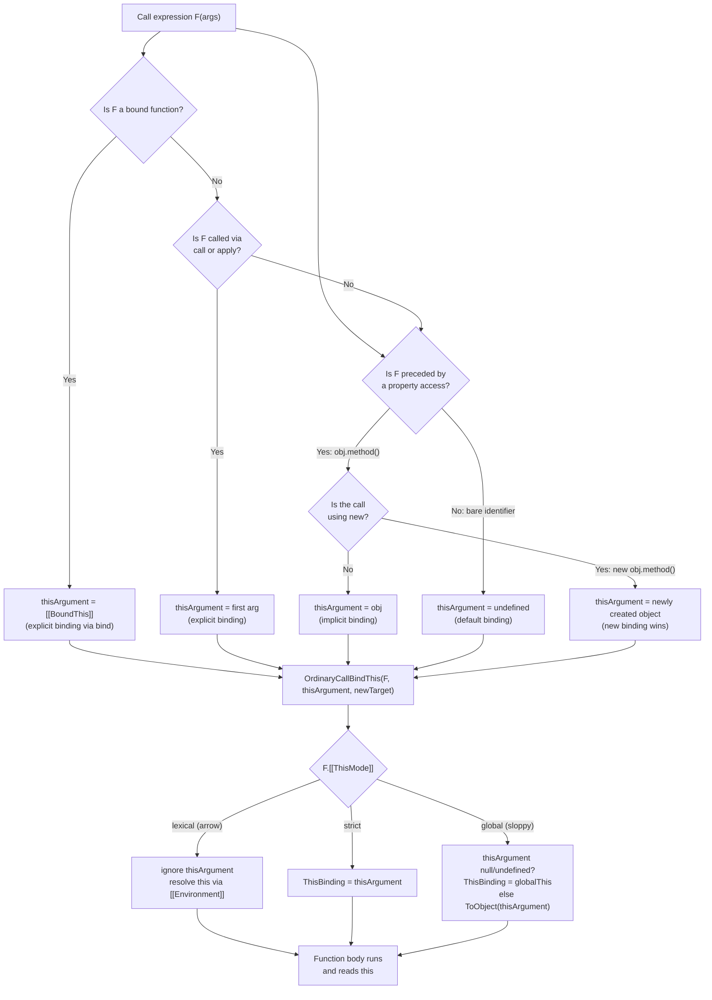
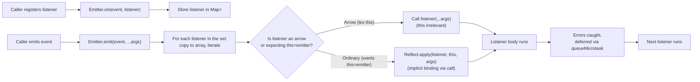

# 1.11 This Keyword Binding

> `this` is not a variable. It is not a property of the function. It is not a closure over the enclosing scope. `this` is a parameter that the call site hands to the function at the instant the function is invoked. Everything confusing about `this` follows from missing that single fact: the binding depends on how the function is called, not on where the function is defined.

## 1. Purpose

JavaScript was designed in 1995 to glue small behaviors onto web pages. Two of the most important early use cases were constructors and method dispatch. A constructor function like `Car` needs to refer to the freshly allocated object that will be returned to the caller, so it can install properties on that object: `this.make = make; this.model = model;`. A method attached to a prototype needs to refer to the instance that received the call, so a single `drive` method on `Car.prototype` can read `this.speed` and update `this.fuel` for whichever car invoked it. Without `this`, every method would need to take its own receiver as an explicit first argument, and every constructor would need to take its new object as a parameter. The `this` keyword exists to make those two patterns ergonomic.

The problem is that the same keyword, `this`, was then overloaded for four different mechanisms: default binding, implicit binding, explicit binding, and `new` binding. The binding chosen at runtime depends entirely on the form of the call expression, not on the form of the function declaration. Two functions written identically can receive completely different `this` values. One function defined once can receive four different `this` values across four calls. The same source-level token (`this`) refers to four different memory locations depending on the call site.

This single design decision — `this` is determined by the call site — is responsible for the most common class of bugs in JavaScript. The classic symptoms are: a method destructured off an object loses its receiver (`const { push } = arr; push(1);` throws `TypeError: Cannot read properties of undefined`); a callback passed to `setTimeout` or `Array.prototype.forEach` loses its receiver (`setTimeout(obj.log, 0)` logs `undefined`); a React class component's event handler throws `Cannot read properties of undefined (reading 'setState')` because `this` was rebound to the DOM element; a Node stream subclass that uses arrow methods silently breaks because the parent class's internal calls to `this.emit` no longer dispatch through the prototype.

Arrow functions were added in ECMAScript 2015 to address the most painful of these: the callback that loses its receiver. An arrow function has no `this` binding of its own. It reads `this` from its lexical environment, the same way it reads any other variable. This means an arrow function used inside a method automatically captures the method's `this`, eliminating the entire class of "lost `this` in nested function" bugs. Class fields (`method = () => { ... }`) extend this to instance methods: each instance gets its own arrow function property that closes over that instance, so the method can be freely destructured and passed as a callback without losing its receiver.

The purpose of this note is to give you a complete, predictable model of every binding rule, the spec mechanism behind each, and the practical recipes that eliminate the entire bug class. By the end you should be able to look at any call site and instantly predict the value of `this`. You should be able to explain why `bind` and `new` interact the surprising way they do. You should know when to reach for an arrow, when to reach for a class field, and when to reach for `bind`. And you should be able to implement `myBind`, `myCall`, and `myApply` from scratch, because the implementation reveals exactly how the bound function exotic object works.

## 2. Theory and Deep Dive

The ECMAScript specification governs `this` through a single mechanism: every function call creates an execution context, and that execution context has a `ThisBinding` slot. The slot is filled at call time, by the caller, before the function body runs. The slot is read by the function body via the `this` keyword. There is no other source of `this` for ordinary functions. See `[[1.08 Execution Context and Lexical Environment]]` for the full structure of an execution context.

The spec clause that fills `ThisBinding` is the abstract operation `OrdinaryCallBindThis(F, thisArgument, newTarget)` in clause 10.2 of ECMAScript 2024 (clause numbers drift across editions; the operation name has been stable since 2015). That operation consults the `[[ThisMode]]` internal slot of the function `F`, which can take one of three values: `lexical`, `strict`, or `global`. The value of `[[ThisMode]]` is set when the function is created and never changes.

- `lexical` — the function is an arrow function. `OrdinaryCallBindThis` does nothing. No `ThisBinding` is installed on the new execution context. When the function body reads `this`, the identifier resolves through the lexical scope chain to the nearest enclosing ordinary function's `ThisBinding`, exactly as if `this` were a closed-over variable. See `[[1.12 Arrow Functions]]`.
- `strict` — the function is a strict mode ordinary function. `ThisBinding` is set to the `thisArgument` exactly as the caller provided it. No coercion to an object. If the caller passed `undefined` or `null`, `this` inside the function is `undefined` or `null`.
- `global` — the function is a sloppy (non-strict) ordinary function. `ThisBinding` is set to the `thisArgument`, but first the engine coerces it: if `thisArgument` is `undefined` or `null`, it is replaced with `globalThis`; otherwise it is wrapped in an object via `ToObject` (so a primitive `5` becomes a `Number` wrapper). This is the historical behavior preserved for backward compatibility.

Function declarations, function expressions, method shorthand definitions, and class methods all get `strict` mode in modern code (modules and class bodies are strict by default, see `[[1.01 Syntax and Lexical Structure]]`). Arrow functions get `lexical`. The interesting question is therefore: what `thisArgument` does the caller pass? That is governed by the four binding rules.

### 2.1 The four binding rules

The four rules, in order of precedence (highest first), are:

1. **`new` binding.** When a function is invoked with `new` (for example `new Foo(1, 2)`), the engine allocates a fresh object, sets its `[[Prototype]]` from `F.prototype`, and passes that fresh object as the `thisArgument`. If the function returns a non-object, the fresh object is returned to the caller. If the function returns an object, that object is returned instead, and the fresh object is discarded. See `[[1.16 ES6 Classes Syntactic Sugar]]`.
2. **Explicit binding.** When a function is invoked via `Function.prototype.call`, `Function.prototype.apply`, or the result of `Function.prototype.bind`, the caller supplies the `thisArgument` directly. `call` takes the thisArg as the first argument followed by individual arguments. `apply` takes the thisArg as the first argument and an array of arguments as the second. `bind` returns a new function that permanently fixes the thisArg and optionally prepends arguments.
3. **Implicit binding.** When a function is invoked as a property access — that is, the call expression is of the form `obj.method(args)` — the engine passes `obj` as the `thisArgument`. The receiver is the object immediately to the left of the dot at the call site. Only the last property access in the chain matters: in `a.b.c.d()` the receiver is `a.b.c`, and `this` inside `d` is `a.b.c`.
4. **Default binding.** When none of the above apply — that is, the function is called as a bare identifier `f(args)` — the engine passes `undefined` as the `thisArgument`. In strict mode that stays `undefined`. In sloppy mode `OrdinaryCallBindThis` coerces `undefined` to `globalThis`.

These four rules apply in order of precedence. `new` always wins, even over an explicit `bind` (this is the surprising `bind` + `new` interaction discussed in Section 6). Explicit binding always wins over implicit. Implicit binding always wins over default.

### 2.2 The binding-resolution algorithm

The engine does not literally branch on these four rules as written. The four rules are a teaching abstraction layered over the actual call-site semantics. The actual mechanism is: the call expression is parsed, the syntactic form of the call determines whether a `thisArgument` is supplied (and what it is), and `[[Call]]` is invoked with that `thisArgument`. The following Mermaid flowchart expresses the resolution in the form a JavaScript engine actually walks through:



### 2.3 The bound function exotic object

`Function.prototype.bind(thisArg, ...prefixArgs)` does not return a normal function. It returns an exotic function object called a "bound function". The spec describes it in clause 10.4 of ECMAScript. A bound function has three internal slots that ordinary functions do not have:

- `[[BoundTargetFunction]]` — the original function being bound.
- `[[BoundThis]]` — the permanently fixed `thisArgument`.
- `[[BoundArguments]]` — an array of arguments to prepend at call time.

When a bound function `g` is called with arguments `args`, the engine does not run the body of `g` (it has none). Instead it builds a new argument list: `[[BoundArguments]]` followed by `args`. Then it calls `[[Call]]` on `[[BoundTargetFunction]]` with `[[BoundThis]]` as the `thisArgument` and the combined argument list. The `[[ThisMode]]` of the bound function is irrelevant because there is no body to read `this` from.

When a bound function is the operand of `new`, the engine calls `[[Construct]]` rather than `[[Call]]`. `[[Construct]]` on a bound function creates the new object based on the `[[BoundTargetFunction]]`'s prototype, then calls `[[Construct]]` on the target with the new object as `thisArgument` — and ignores `[[BoundThis]]` entirely. This is the famous "bind ignores the bound `this` when combined with `new`" behavior. The spec wording is that the bound function's `[[Construct]]` delegates to `[[BoundTargetFunction]].[[Construct]]` with `newTarget` passed through, and the `thisArgument` for the inner call is the freshly created object, not `[[BoundThis]]`. The `[[BoundArguments]]` are still prepended, however, so `new` does not discard the partially applied arguments.

### 2.4 Arrow functions and lexical `this`

Arrow functions are specified with `[[ThisMode]] = "lexical"`. As noted above, `OrdinaryCallBindThis` does nothing for them. The `this` keyword inside an arrow function is resolved by the ordinary identifier resolution algorithm: it walks the lexical environment chain starting at the arrow's own `[[Environment]]` until it finds a `this` binding. The nearest enclosing ordinary function (or the global environment, in a module) provides that binding.

The practical consequence: an arrow function inside a method captures the method's `this`. An arrow function at the top level of a module captures the module's `this`, which is `undefined` (modules are strict). An arrow function at the top level of a classic script in a browser captures `window`. An arrow function used as an object method does not bind to the object — it captures whatever `this` is at the point of definition, which is usually `undefined` or `window`.

Because arrow functions do not have their own `ThisBinding`, `call`, `apply`, and `bind` cannot change `this` for them. `arrowFn.call(someObj)` still resolves `this` lexically. The first argument to `call` is silently ignored. The same applies to `apply` and `bind`. (The argument-prepending behavior of `bind` still works; only the `this`-setting behavior is suppressed.)

### 2.5 Strict mode and `this`

Modules and class bodies are always strict. A function declared inside a module is strict. A function declared inside a class body is strict. The `"use strict"` directive at the top of a classic script makes that script strict.

In strict mode, default binding produces `undefined`. In sloppy mode, default binding produces `globalThis`. This is the source of one of the most common bugs: a function that used to silently attach properties to `window` in sloppy mode now throws `TypeError: Cannot read properties of undefined`. Strict mode converts a silent global pollution into a loud error, which is the intended outcome.

The other strict-mode effect on `this` is the absence of primitive wrapping. In sloppy mode, calling `fn.call(5)` causes `this` inside `fn` to be a `Number` wrapper object around `5`. In strict mode, `this` inside `fn` is the primitive `5`. This matters when a library uses `Object(this)` or `typeof this` to distinguish objects from primitives; the result is different across the modes.

### 2.6 `this` in class methods

A class body is strict by spec. Methods declared with shorthand syntax inside a class body become non-constructable ordinary functions with `[[ThisMode]] = "strict"`. The constructor is also an ordinary function; when invoked with `new`, it receives the freshly allocated instance as `this`.

Instance methods live on `ClassName.prototype`. Static methods live on `ClassName` itself. Both use implicit binding: `instance.method()` sets `this = instance`, and `ClassName.staticMethod()` sets `this = ClassName`.

Class fields (`x = 1`) are installed on the instance during construction, after `super` returns and before the constructor body runs. A class field initialized to an arrow function (`onClick = (e) => { this.setState(...) }`) creates a per-instance arrow function that closes over the constructor's `this`, which is the instance. This is the modern idiom for callback-safe methods in React class components and in any other framework that passes methods around as values.

Private fields (`#count`) and private methods (`#increment()`) follow the same `this` rules as their public counterparts. Accessing a private field on the wrong `this` throws a `SyntaxError`-equivalent runtime `TypeError` (the spec says it throws when the field is not present on the receiver), which means losing `this` on a method that reads a private field produces a particularly cryptic error.

### 2.7 `this` in event handlers

The DOM `addEventListener` API invokes the listener with `this` set to the event target. This is implicit binding by the DOM, not by JavaScript itself — the DOM implementation calls the listener function with the target as `thisArgument`. The same is true for older APIs like `onerror` handlers and `setTimeout` callbacks (which use default binding, not implicit, because `setTimeout(fn, 0)` is a bare call).

The trap: when you write `el.addEventListener('click', obj.handler)`, you are passing the function reference, not the receiver. The DOM invokes `handler.call(el, event)`. Inside `handler`, `this` is `el`, not `obj`. This is the same destructuring problem as `const { handler } = obj; handler()`. The fix is one of: `obj.handler.bind(obj)`, an arrow function wrapper `(e) => obj.handler(e)`, or making `handler` an arrow class field on `obj`'s class.

### 2.8 `this` in async callbacks

Promises, `setTimeout`, `setInterval`, `queueMicrotask`, `requestAnimationFrame`, and Node's `process.nextTick` all invoke their callbacks as bare functions (default binding). In strict mode, `this` inside such a callback is `undefined`. The fix is the same as for event handlers: bind, arrow, or class field.

Async functions (`async function` and `async () =>`) follow the same rules as their synchronous counterparts. An `async function` declaration has `[[ThisMode]] = "strict"`. An `async` arrow has `[[ThisMode]] = "lexical"`. The `await` keyword does not change `this`; the resumption of an async function after `await` happens in the same execution context that began before the `await`, with the same `ThisBinding`.

## 3. Mental Models

The four binding rules can be reduced to a small set of working metaphors. Each metaphor covers most cases and fails in one specific way; knowing the failure mode tells you when to switch metaphors.

### 3.1 `this` is "the receiver of the call"

The first and most useful metaphor: `this` is whatever object was to the left of the dot in the call expression. `obj.method()` → `this` is `obj`. `a.b.c.method()` → `this` is `a.b.c`. No dot → no receiver → default binding (`undefined` in strict mode, `globalThis` in sloppy mode).

This metaphor covers implicit and default binding. It fails on explicit binding (where there is no dot but `this` is still set) and on `new` (where the dot, if any, is ignored). It also fails on arrow functions, which have no receiver semantics at all.

### 3.2 Arrow functions have no receiver

The second metaphor: an arrow function is a closure over `this`. Treat `this` inside an arrow the same way you would treat a variable from the outer scope. The arrow captures it; nothing can change it. `arrowFn.call(otherObj)` does not change `this` for the arrow, because there is no `this` to change — the arrow reads the captured one.

This metaphor covers arrow functions exhaustively. It does not cover ordinary functions, where `this` is dynamically set by the call site.

### 3.3 `bind` freezes the receiver forever

The third metaphor: `bind` is a closure that captures the receiver. `const bound = fn.bind(obj)` is equivalent to `const bound = (...args) => fn.call(obj, ...args)` — except that `new bound()` ignores the bound `this`, which a plain arrow wrapper would not. The bound function exotic object is a more powerful primitive than the arrow wrapper because of this `new` interaction.

This metaphor covers explicit binding and the bound function exotic object. It fails when `new` is involved (the metaphor says `this` is locked; the spec says `new` unlocks it for one specific case). The fix is to remember the explicit exception: `bind` locks `this` for ordinary calls; `new` overrides that lock.

### 3.4 `new` ignores all other rules

The fourth metaphor: `new` is the trump card. When the call uses `new`, the engine allocates a fresh object and that fresh object is `this`. Nothing the function declaration, the property access, or a previously applied `bind` can do changes that. The only thing that survives `new` is `[[BoundArguments]]` from a previous `bind` — the partially applied arguments are still prepended.

This metaphor covers `new` binding. It is the only metaphor that explains the `bind` + `new` interaction. The failure mode of this metaphor is that it does not tell you what happens to `this` when the constructor body itself returns an object — in that case the returned object replaces the fresh one, and code that runs after the constructor returns sees the returned object as the new instance.

### 3.5 Combining the metaphors

A working mental procedure for any call site:

1. Is the call `new F(...)`? Then `this` is a fresh object. Done.
2. Is `F` an arrow function? Then `this` is whatever `this` was at the point of definition. Done.
3. Is the call `F.call(obj, ...)` or `F.apply(obj, ...)` or `boundF(...)` where `boundF = F.bind(obj)`? Then `this` is `obj`. Done.
4. Is the call `obj.F(...)` or `obj[prop](...)`? Then `this` is `obj` (the part to the left of the last dot). Done.
5. Otherwise the call is a bare `F(...)`. Then `this` is `undefined` in strict mode, `globalThis` in sloppy mode. Done.

## 4. Real-World Use Cases

### 4.1 Destructured methods lose the receiver

The single most common `this`-bug in production. An array method, a class method, or a library function is destructured off its parent, then called as a bare identifier. The receiver is lost; `this` becomes `undefined` (strict) or `globalThis` (sloppy); the call throws or silently mutates global state.

```javascript
const arr = [1, 2, 3];
const { push } = arr;
push(4);  // TypeError: Cannot read properties of undefined (reading 'push')
```

The fix is to call `arr.push(4)` directly, or to use `Array.prototype.push.call(arr, 4)` if you genuinely need a destructured reference, or to bind: `const push = arr.push.bind(arr); push(4);`.

This pattern bites developers using lodash (`const { map } = lodash; map(arr, fn)` — works because lodash is designed for it), moment.js, dayjs, and any library where the public API is a chainable object. The Node `util` module's `promisify` helper exists in part because the destructured `readFile` would lose its internal `this` if pulled off the `fs` object directly (though `fs` methods are mostly `this`-free; the real reason is consistency with callback signatures).

### 4.2 React class components pre-hooks

Before React 16.8 introduced hooks, the only way to have stateful components was the class syntax. The canonical bug: an event handler defined as a method loses `this` when passed to `onClick`. Three solutions evolved over the years.

1. **Constructor bind.** `this.handleClick = this.handleClick.bind(this);` in the constructor. Works, but verbose — every method needs its own bind line.
2. **Arrow class field.** `handleClick = () => { ... }` as a class field. Each instance gets its own arrow function that closes over `this`. The method is freely passable as a callback. This became the dominant solution by 2018.
3. **Inline arrow in JSX.** `<button onClick={(e) => this.handleClick(e)}>`. Works, but creates a new function on every render, which defeats `React.memo` and `PureComponent` shallow prop comparison.

The hooks migration eliminated this entire class of bugs for function components — there is no `this` in a function component, and closures handle state directly. But class components persist in legacy codebases, and the same patterns apply to any framework that passes methods as values.

### 4.3 DOM event handlers

`el.addEventListener('click', obj.handler)` loses the receiver. The DOM invokes `handler` with `this = el`. Three fixes mirror the React ones: `.bind(obj)` at registration, an arrow wrapper at registration, or `handler` as an arrow class field on `obj`'s class.

A subtle additional issue: `removeEventListener` requires the exact same function reference that was passed to `addEventListener`. `el.addEventListener('click', obj.handler.bind(obj))` cannot be reversed by `el.removeEventListener('click', obj.handler.bind(obj))` because the two `bind` calls produce two different bound functions. The fix is to store the bound reference once: `const bound = obj.handler.bind(obj); el.addEventListener('click', bound); /* later */ el.removeEventListener('click', bound);`. Arrow class fields avoid this entirely because the instance has a single stable reference to the method.

### 4.4 jQuery's `$.proxy`

Before arrow functions, jQuery shipped `$.proxy(fn, context)` as a `bind` polyfill. The function returned by `$.proxy` could be unbound by passing it back to an internal unproxy helper or by re-proxying — `$.proxy` tracked the original function on the returned wrapper. With `bind` now universally available, `$.proxy` is rarely used, but the pattern of "library ships its own bind" appears in many older codebases. Backbone's `bindAll(this, 'render', 'onClick')` is the same idea: iterate the named methods and replace each instance property with a bound version.

### 4.5 Node.js streams

`require('stream').Readable` subclasses use `this` extensively. The runtime-invoked implementation hook (the underscore-prefixed `read` method that subclasses override) is called by the runtime, the `push` method is called by user code, and `this.emit('data', chunk)` is called internally. Subclassing a stream with arrow function methods silently breaks: arrow methods do not go on the prototype, they go on each instance, and the parent class's internal `this.push` call (which goes through the prototype chain) will not call the arrow override. The rule for Node streams is: use ordinary methods, and bind at call time if you must pass a method as a callback.

The Node `EventEmitter` is similar. Listeners are invoked with `this = emitter`. A listener that uses `this.on` to register more listeners will work when registered as `emitter.on('x', listener)` and fail when destructured. See `[[3.10 Event Emitter Pattern]]`.

### 4.6 Fluent APIs and TypeScript `this` typing

Builder-pattern libraries (Express `app.get().post()`, Knex query builders, Jest `expect(x).toBe(y)`) rely on `return this` at the end of each method. In TypeScript, the `this` parameter can be annotated to enforce that the method is called on a specific subtype. `class Builder { add(this: Builder, x: number): this { ... return this; } }` ensures that subclasses inheriting `add` return the subclass type, not the parent type. This is the TypeScript-only `this: ThisType<...>` feature, used pervasively in Vue 3's component options and Knex's query builder. See `[[2.18 OOP Patterns in TypeScript]]`.

## 5. Code Examples

### 5.1 Example A — Minimal and Conceptual

The minimal example demonstrates all four binding rules plus the arrow function case, in one program. Read each block top to bottom.

**JavaScript:**

```javascript
"use strict";

// 1. Default binding. Bare call. this = undefined (strict) or globalThis (sloppy).
function showThis() {
  console.log("default:", this);
}
showThis();  // default: undefined

// 2. Implicit binding. obj.method() — this = obj.
const obj = {
  name: "implicit",
  showThis() {
    console.log("implicit:", this.name);
  }
};
obj.showThis();  // implicit: implicit

// Destructured: receiver lost.
const { showThis: detached } = obj;
detached();  // default: undefined (back to default binding)

// 3. Explicit binding. call / apply / bind.
function greet(greeting, punctuation) {
  console.log("explicit:", greeting + ", " + this.name + punctuation);
}
greet.call(obj, "Hello", "!");         // explicit: Hello, implicit!
greet.apply(obj, ["Hi", "."]);         // explicit: Hi, implicit.
const bound = greet.bind(obj, "Hey");
bound("?");                            // explicit: Hey, implicit?

// 4. new binding. Fresh object becomes this.
function Person(name) {
  this.name = name;
  console.log("new:", this.name);
}
const p = new Person("Alice");         // new: Alice
console.log(p instanceof Person);      // true

// 5. Arrow function: lexical this.
const counter = {
  count: 0,
  // Ordinary method: this = counter when called as counter.tick().
  tick() {
    this.count++;
    console.log("tick:", this.count);
    // Arrow inside method: inherits the method's this.
    setTimeout(() => {
      this.count++;
      console.log("async tick:", this.count);
    }, 0);
  }
};
counter.tick();
// tick: 1
// async tick: 2

// 6. Arrow function as a method: does NOT bind to the object.
const broken = {
  name: "broken",
  whoami: () => console.log("arrow method:", this)
};
broken.whoami();  // arrow method: undefined (top-level module this)
```

**TypeScript:**

```typescript
"use strict";

interface ThisHolder {
  name: string;
  showThis(this: ThisHolder): void;
}

function showThis(this: ThisHolder | undefined): void {
  console.log("default:", this);
}
showThis.call(undefined);  // default: undefined

const obj: ThisHolder = {
  name: "implicit",
  showThis(this: ThisHolder) {
    console.log("implicit:", this.name);
  }
};
obj.showThis();  // implicit: implicit

interface Greeter {
  name: string;
}

function greet(this: Greeter, greeting: string, punctuation: string): void {
  console.log("explicit:", greeting + ", " + this.name + punctuation);
}
greet.call(obj, "Hello", "!");
greet.apply(obj, ["Hi", "."]);

const bound: (punctuation: string) => void = greet.bind(obj, "Hey");
bound("?");

class Person {
  constructor(public name: string) {
    console.log("new:", this.name);
  }
}
const p = new Person("Alice");
console.log(p instanceof Person);

class Counter {
  count = 0;
  tick(this: this): void {
    this.count++;
    console.log("tick:", this.count);
    setTimeout(() => {
      this.count++;
      console.log("async tick:", this.count);
    }, 0);
  }
}
const counter = new Counter();
counter.tick();

const broken = {
  name: "broken",
  whoami: () => console.log("arrow method:", this)
};
broken.whoami();
```

The TypeScript version adds the `this` parameter type to enforce at compile time which receiver a function expects. The `this` parameter is erased at runtime — it is a TypeScript fiction. But it lets the compiler reject `detached()` calls and `greet()` calls that lack a receiver, which is exactly the bug class this note is about.

### 5.2 Example B — Production-Grade Typed Event Emitter

A typed event emitter that demonstrates the three ways to ensure `this` (bind, arrow, class field) and exposes the tradeoffs.

**JavaScript:**

```javascript
"use strict";

class TypedEmitter {
  constructor() {
    // Use a Map of event name -> Set of listener functions.
    // Using a Map (not a plain object) lets us use any string as an event name,
    // including "constructor" and the inherited prototype property without prototype pollution.
    this.listeners = new Map();
  }

  on(eventName, listener) {
    if (typeof listener !== "function") {
      throw new TypeError("listener must be a function");
    }
    if (!this.listeners.has(eventName)) {
      this.listeners.set(eventName, new Set());
    }
    this.listeners.get(eventName).add(listener);
    // Return a disposer so callers can remove without keeping the reference around.
    return () => this.off(eventName, listener);
  }

  off(eventName, listener) {
    const set = this.listeners.get(eventName);
    if (set) {
      set.delete(listener);
      if (set.size === 0) {
        this.listeners.delete(eventName);
      }
    }
  }

  emit(eventName, ...args) {
    const set = this.listeners.get(eventName);
    if (!set) return;
    // Copy to array first so listeners can off() themselves during emit.
    for (const listener of [...set]) {
      try {
        // Implicit binding by call: this inside listener is the emitter.
        listener.call(this, ...args);
      } catch (err) {
        // Defer error to a nextTick so emit() does not throw into the caller.
        // Listeners further down the chain still run.
        queueMicrotask(() => {
          throw err;
        });
      }
    }
  }
}

// A subclass demonstrating the three approaches to callback-safe methods.
class Counter extends TypedEmitter {
  constructor(initial = 0) {
    super();
    this.count = initial;
  }

  // Approach 1: ordinary method, must be bound at pass-along time.
  onTickBound() {
    this.count++;
    this.emit("tick", this.count);
  }

  // Approach 2: arrow class field, always bound, single stable reference.
  onTickArrow = () => {
    this.count++;
    this.emit("tick", this.count);
  };

  // Approach 3: arrow class field that uses a private field.
  #secret = 42;
  revealSecret = () => {
    this.emit("secret", this.#secret);
  };
}

const c = new Counter();

c.on("tick", function (n) {
  // `this` here is the emitter `c` because emit() uses listener.call(this, ...).
  console.log("tick listener sees count:", n, "this is emitter:", this === c);
});

// Approach 1 in action: must bind.
setInterval(c.onTickBound.bind(c), 100);
// Approach 2 in action: no bind needed.
setInterval(c.onTickArrow, 100);
// Approach 3: private field, still safe.
setTimeout(c.revealSecret, 50);
```

**TypeScript:**

```typescript
"use strict";

type Listener<Args extends unknown[]> = (this: TypedEmitter<Args>, ...args: Args) => void;

class TypedEmitter<Args extends unknown[] = unknown[]> {
  private readonly listeners = new Map<string, Set<Listener<Args>>>();

  on(eventName: string, listener: Listener<Args>): () => void {
    if (typeof listener !== "function") {
      throw new TypeError("listener must be a function");
    }
    let set = this.listeners.get(eventName);
    if (!set) {
      set = new Set<Listener<Args>>();
      this.listeners.set(eventName, set);
    }
    set.add(listener);
    return () => this.off(eventName, listener);
  }

  off(eventName: string, listener: Listener<Args>): void {
    const set = this.listeners.get(eventName);
    if (set) {
      set.delete(listener);
      if (set.size === 0) {
        this.listeners.delete(eventName);
      }
    }
  }

  emit(eventName: string, ...args: Args): void {
    const set = this.listeners.get(eventName);
    if (!set) return;
    for (const listener of [...set]) {
      try {
        listener.call(this, ...args);
      } catch (err) {
        queueMicrotask(() => {
          throw err;
        });
      }
    }
  }
}

interface CounterEvents {
  tick: [count: number];
  secret: [value: number];
}

class Counter extends TypedEmitter<[number]> {
  count: number;
  #secret: number;

  constructor(initial = 0) {
    super();
    this.count = initial;
    this.#secret = 42;
  }

  // Approach 1: ordinary method. The `this: this` annotation enforces
  // that callers invoke this as counter.onTickBound(), not as a bare call.
  onTickBound(this: this): void {
    this.count++;
    this.emit("tick", this.count);
  }

  // Approach 2: arrow class field. No `this` parameter because arrows have no this.
  onTickArrow = (): void => {
    this.count++;
    this.emit("tick", this.count);
  };

  // Approach 3: arrow class field reading a private field.
  revealSecret = (): void => {
    this.emit("secret", this.#secret);
  };
}

const c = new Counter();

c.on("tick", function (this: Counter, n: number) {
  console.log("tick listener sees count:", n, "this is emitter:", this === c);
});

setInterval(c.onTickBound.bind(c), 100);
setInterval(c.onTickArrow, 100);
setTimeout(c.revealSecret, 50);
```

The TypeScript version enforces two things at compile time. First, the `this: this` annotation on `onTickBound` means the compiler rejects `const { onTickBound } = c; onTickBound()` with `The 'this' context of type 'void' is not assignable to method's 'this'`. Second, the `Listener<Args>` type ensures that listeners passed to `on` have a `this` parameter compatible with the emitter, so a listener written as `function (this: SomeOtherClass, n)` would be rejected.

## 6. Common Mistakes and Anti-Patterns

### 6.1 Destructured method loses `this`

```javascript
const arr = [1, 2, 3];
const { push } = arr;
push(4);  // TypeError: Cannot read properties of undefined (reading 'push')
```

**Why it fails:** `push` is detached from `arr`. The call `push(4)` is a bare call, so default binding applies. Inside `Array.prototype.push`, `this` is `undefined` (strict mode). `push` reads `this.length` to figure out where to put the new element, and `undefined.length` throws.

**Fix:**

```javascript
// Option 1: just use the method on the receiver.
arr.push(4);

// Option 2: bind explicitly.
const push = arr.push.bind(arr);
push(4);

// Option 3: use call to pass the receiver at call time.
Array.prototype.push.call(arr, 4);
```

### 6.2 `setTimeout` callback loses `this`

```javascript
class Logger {
  constructor() { this.logs = []; }
  log(msg) {
    this.logs.push(msg);
    console.log(msg);
  }
  schedule(msg, ms) {
    setTimeout(this.log, ms, msg);  // Bug: `this` is lost inside setTimeout.
  }
}
const l = new Logger();
l.schedule("hello", 100);
// After 100ms: TypeError: Cannot read properties of undefined (reading 'push')
```

**Why it fails:** `setTimeout` invokes the callback as a bare function. Inside `this.log`, `this` is `undefined`.

**Fix (three options):**

```javascript
// Option A: arrow wrapper.
schedule(msg, ms) {
  setTimeout(() => this.log(msg), ms);
}

// Option B: bind at pass time.
schedule(msg, ms) {
  setTimeout(this.log.bind(this, msg), ms);
}

// Option C: make log an arrow class field.
log = (msg) => {
  this.logs.push(msg);
  console.log(msg);
};
schedule(msg, ms) {
  setTimeout(this.log, ms, msg);  // safe because log is now an arrow field
}
```

### 6.3 Nested non-arrow function falls back to default binding

```javascript
class Timer {
  constructor() { this.seconds = 0; }
  start() {
    setInterval(function () {
      this.seconds++;  // TypeError: Cannot read properties of undefined
      console.log(this.seconds);
    }, 1000);
  }
}
new Timer().start();
```

**Why it fails:** The `function () { ... }` passed to `setInterval` is an ordinary function. Default binding applies, `this` is `undefined`. The pre-ES6 fix was the `var self = this;` pattern. The modern fix is the arrow function.

**Fix:**

```javascript
start() {
  setInterval(() => {
    this.seconds++;
    console.log(this.seconds);
  }, 1000);
}
```

### 6.4 Calling `bind` repeatedly wraps the wrapper

```javascript
function fn() { console.log(this); }
const b1 = fn.bind({ a: 1 });
const b2 = b1.bind({ a: 2 });   // Does NOT change `this` to {a:2}... actually it does, see below.
b2();  // { a: 2 }
```

**Why this is a mistake:** It actually works — `b2` does see `{ a: 2 }` because `b1.[[Call]]` ignores its own `[[BoundThis]]` when called via `bind`'s wrapping... wait, that is wrong. Let me be precise. When you call `b1.bind({a:2})`, you create a new bound function whose target is `b1` and whose `[[BoundThis]]` is `{a:2}`. When `b2()` runs, it calls `b1.[[Call]]` with `[[BoundThis]] = {a:2}`. But `b1` is itself a bound function, and bound functions ignore the incoming `thisArgument` and use their own `[[BoundThis]]`. So `b2()` actually logs `{a:1}`, not `{a:2}`. The mistake is the inverse of the intuition: rebinding a bound function does NOT change the bound `this`. The original bind wins.

**Demonstration of the actual behavior:**

```javascript
function fn() { console.log("this is", this); }
const b1 = fn.bind({ a: 1 });
const b2 = b1.bind({ a: 2 });
b2();  // this is { a: 1 }
```

**Why it fails (intuition):** A bound function is an exotic object that ignores the `thisArgument` passed to its `[[Call]]`. So further `bind` calls on it have no effect on `this`. They do, however, prepend more arguments.

**Fix:** Always bind the original function. If you need to rebind, keep a reference to the original.

```javascript
function fn() { console.log("this is", this); }
const original = fn;
const b1 = original.bind({ a: 1 });
const b2 = original.bind({ a: 2 });  // bind the ORIGINAL, not b1.
b1();  // this is { a: 1 }
b2();  // this is { a: 2 }
```

### 6.5 `bind` and `new` ignore the bound `this`

```javascript
function Person(name) { this.name = name; }
const BoundPerson = Person.bind({ name: "bound" });
const p = new BoundPerson("Alice");
console.log(p);  // Person { name: 'Alice' }
```

**Why it fails (intuition):** `bind` is supposed to permanently fix `this`. But the spec says `[[Construct]]` on a bound function ignores `[[BoundThis]]` and uses the freshly allocated object instead. So `new BoundPerson("Alice")` creates a fresh object, calls `Person.[[Construct]]` with that fresh object as `this`, and `"Alice"` overrides whatever `"bound"` was supposed to do.

The bound `this` is silently discarded. The bound arguments are NOT discarded — they are prepended.

```javascript
function greet(greeting, name) { this.message = greeting + " " + name; }
const BoundGreet = greet.bind({ name: "default" }, "Hello");
const g = new BoundGreet("World");
console.log(g);  // greet { message: 'Hello World' }
// The bound "Hello" was prepended; the bound { name: "default" } was ignored.
```

**Fix:** Do not use `bind` to fix `this` for functions that will be called with `new`. If you need a partially applied constructor, use a regular function that calls the original constructor with `Reflect.construct`:

```javascript
function Person(name, role) { this.name = name; this.role = role; }
function Admin(name) {
  return Reflect.construct(Person, [name, "admin"], new.target || Admin);
}
Admin.prototype = Object.create(Person.prototype);
Admin.prototype.constructor = Admin;
const a = new Admin("Alice");
console.log(a);  // Person { name: 'Alice', role: 'admin' }
```

### 6.6 Arrow function as a method does not bind to the object

```javascript
const obj = {
  name: "Alice",
  greet: () => "Hello, " + this.name
};
console.log(obj.greet());  // "Hello, undefined" (or "Hello, " if window.name is "")
```

**Why it fails:** Arrow functions do not have their own `this`. The arrow's `this` is whatever `this` was at the point of definition. At the point of definition (the object literal), `this` is the top-level module `this` (undefined) or the global `this` (`window`). The object literal does NOT become `this` for arrows defined within it, because object literals do not create a new `this` binding — only function calls do.

**Fix:** Use method shorthand syntax, which produces an ordinary function and gets `this` from the call site.

```javascript
const obj = {
  name: "Alice",
  greet() { return "Hello, " + this.name; }
};
console.log(obj.greet());  // "Hello, Alice"
```

Or use a class with a class field if you need the method to be passable as a callback:

```javascript
class Greeter {
  constructor(name) { this.name = name; }
  greet = () => "Hello, " + this.name;
}
const g = new Greeter("Alice");
const { greet } = g;
console.log(greet());  // "Hello, Alice"
```

### 6.7 `this` in sloppy mode silently creates global properties

```javascript
// sloppy.js — no "use strict"
function leak() {
  this.polluted = "oops";  // creates a global property
}
leak();  // bare call, sloppy mode, this = globalThis
console.log(polluted);  // "oops"
console.log(globalThis.polluted);  // "oops"
```

**Why it fails:** Sloppy mode default binding coerces `undefined` to `globalThis`. The function then writes to a global property. The bug is silent — no error, just a polluted global namespace.

**Fix:** Always use strict mode (`"use strict"` at the top of every classic script, or use modules which are strict by default). Strict mode turns this silent bug into a loud `TypeError: Cannot read properties of undefined (reading 'polluted')`.

### 6.8 `removeEventListener` cannot reverse a fresh `bind`

```javascript
class View {
  constructor(el) {
    this.el = el;
    this.el.addEventListener("click", this.onClick.bind(this));
  }
  destroy() {
    // Bug: this creates a NEW bound function. The original listener is still attached.
    this.el.removeEventListener("click", this.onClick.bind(this));
  }
  onClick(e) { /* ... */ }
}
```

**Why it fails:** `bind` returns a new function each time. The bound function passed to `addEventListener` and the bound function passed to `removeEventListener` are two different objects. `removeEventListener` compares by reference identity and silently does nothing.

**Fix:** Store the bound reference once.

```javascript
class View {
  constructor(el) {
    this.el = el;
    this.boundOnClick = this.onClick.bind(this);
    this.el.addEventListener("click", this.boundOnClick);
  }
  destroy() {
    this.el.removeEventListener("click", this.boundOnClick);
  }
  onClick(e) { /* ... */ }
}
```

Or use a class field, which gives a single stable reference per instance.

```javascript
class View {
  constructor(el) {
    this.el = el;
    this.el.addEventListener("click", this.onClick);
  }
  destroy() {
    this.el.removeEventListener("click", this.onClick);
  }
  onClick = (e) => { /* ... */ };
}
```

## 7. Best Practices and Design Patterns

### 7.1 Default to arrow functions for callbacks

Any time you pass a function as a callback to `setTimeout`, `setInterval`, `addEventListener`, `Promise.prototype.then`, `Array.prototype.map`, or similar, prefer an arrow function. The arrow captures the surrounding `this`, eliminating the lost-receiver bug by construction. Use an ordinary function expression only when you specifically need the callback to receive a `this` from the call site (which is the case for `Array.prototype` methods that accept a `thisArg` argument).

### 7.2 Use class fields for callback-safe methods

If a class method must be passed as a callback — event handler, timer callback, promise chain link — declare it as an arrow class field. The field gives you a single stable reference per instance, which means `removeEventListener` works and `React.memo` shallow comparisons do not false-positive. The cost is one function per instance instead of one per class, which matters only when you have thousands of instances.

```javascript
class Component {
  state = { count: 0 };
  // Class field: per-instance arrow, single reference, callback-safe.
  handleClick = () => {
    this.setState({ count: this.state.count + 1 });
  };
}
```

### 7.3 Use `bind` only at call time or for one-off wiring

`bind` is appropriate when you need to bind a method to a specific object at a specific moment, and you cannot use a class field (for example, you are working with a third-party class you cannot modify). Keep a reference to the bound function so you can deregister it later. Do not rebind bound functions; always bind the original.

```javascript
const original = libraryObject.onEvent;
const bound = original.bind(libraryObject);
emitter.on("event", bound);
// later
emitter.off("event", bound);
```

### 7.4 Never rebind a bound function

`b1.bind(newThis)` does NOT change `this` for `b1`. It creates a new bound function whose target is `b1`, but `b1` ignores the `thisArgument` passed to it. Always keep a reference to the original function and bind that.

### 7.5 In TypeScript, annotate the `this` parameter for fluent APIs and constrained methods

TypeScript's `this` parameter is erased at runtime but enforced at compile time. Use it for fluent builders (so methods return the subclass type, not the parent), for methods that must be called on a specific receiver (so the compiler rejects destructured calls), and for `ThisType<T>` to type the `this` of an object literal.

```typescript
class Builder<T extends object> {
  private parts: Partial<T> = {};
  with<K extends keyof T>(this: Builder<T>, key: K, value: T[K]): this {
    this.parts[key] = value;
    return this;
  }
  build(): T {
    return this.parts as T;
  }
}

class HttpBuilder extends Builder<{ url: string; method: string }> {
  withUrl(url: string): this {
    return this.with("url", url);
  }
}

const b = new HttpBuilder().withUrl("/api").with("method", "GET").build();
```

The `this: this` annotation on `with` ensures that `HttpBuilder.withUrl` returns `HttpBuilder`, not `Builder`. Without the annotation, the chain would type as `Builder<...>` and `.withUrl` would not be available after a `.with` call.

### 7.6 Use `Reflect.apply` over `Function.prototype.call` and `apply` when you have a function reference

`Reflect.apply(fn, thisArg, argsList)` is the modern, less awkward form of `fn.apply(thisArg, argsList)`. It avoids the `apply` on a function that might be a bound function or might have an overridden `apply` method. It also reads more clearly when the function is computed dynamically.

```javascript
const fn = Math.max;
const args = [1, 2, 3];
const max = Reflect.apply(fn, undefined, args);  // 3
```

### 7.7 Pin `this` at the start of long methods

When a method calls many nested helper functions and you want to refer to the instance throughout, capture `this` into a `const self = this;` at the top of the method. This is the pre-arrow idiom and is still useful in two cases: when the helper functions are declared as ordinary `function` declarations (not arrows) for hoisting reasons, and when you want to make it visually obvious that a particular block of code refers to the original `this` of the method, not a re-bound one. Modern style prefers arrows, but `self` is still a legitimate pattern in legacy code.

## 8. Technical Interview Knowledge

### 8.1 What are the four binding rules?

**A:** The four binding rules, in order of precedence, are (1) `new` binding — `this` is the freshly allocated object when a function is called with `new`; (2) explicit binding — `this` is the first argument passed to `call`, `apply`, or stored on a bound function via `bind`; (3) implicit binding — `this` is the object to the left of the dot in `obj.method()`; (4) default binding — `this` is `undefined` in strict mode and `globalThis` in sloppy mode. `new` always wins, even over `bind`.

**Trap to avoid:** Do not confuse the order of precedence. A common mistake is to claim that explicit binding always wins over `new`. The opposite is true: `new BoundFn()` ignores the bound `this`.

### 8.2 What does `bind` return?

**A:** `bind` returns a bound function exotic object. It is a function (it has `[[Call]]` and `[[Construct]]`), but it has no body of its own. It has three internal slots: `[[BoundTargetFunction]]` (the original function), `[[BoundThis]]` (the permanently fixed `this`), and `[[BoundArguments]]` (arguments to prepend). Calling the bound function invokes `[[BoundTargetFunction]].[[Call]]` with `[[BoundThis]]` as the thisArgument and `[[BoundArguments]]` concatenated with the call's arguments. Constructing the bound function with `new` invokes `[[BoundTargetFunction]].[[Construct]]` and ignores `[[BoundThis]]` (but still prepends `[[BoundArguments]]`).

**Trap to avoid:** Do not say "bind returns a closure that calls the original function." A closure would behave differently under `new`. The bound function exotic object is a distinct spec mechanism.

### 8.3 How does `new` interact with `bind`?

**A:** `new` ignores the bound `this` but preserves the bound arguments. The spec operation is `BoundFunctionCreate`, which produces an object whose `[[Construct]]` internal method delegates to `[[BoundTargetFunction]].[[Construct]]`, passing through `newTarget` and using the freshly created ordinary object as `thisArgument`. The `[[BoundThis]]` is not consulted during construction. This means `new (Fn.bind(someThis))(...)` behaves like `new Fn(...)`, except that any arguments bound at `bind` time are still prepended.

**Trap to avoid:** The follow-up question is usually "why does the spec do this?" The answer is that `bind` was modeled on the pre-existing partial-application idiom, and `new` was already defined to allocate a fresh object. There was no use case for `new BoundFn()` to use the bound `this` — the bound `this` is meant for ordinary calls. The spec preserves `[[BoundArguments]]` because partial application of arguments is orthogonal to `this` binding.

### 8.4 Why does `const { method } = obj; method();` lose `this`?

**A:** Implicit binding depends on the call-site form `obj.method()`. The receiver is the object immediately to the left of the dot at the moment of the call. After destructuring, the call is a bare identifier call `method()`, which is default binding. The destructuring assignment reads the function reference off `obj` and stores it in a new variable; the connection to `obj` is severed at that point. The fix is to call `obj.method()` directly, or to bind: `const method = obj.method.bind(obj)`.

**Trap to avoid:** Do not confuse this with closures. The function does not close over its own defining object. There is no link from a method to the object literal it was defined in. The connection exists only at the call site.

### 8.5 Explain arrow function `this`.

**A:** Arrow functions have `[[ThisMode]] = "lexical"`. They do not have their own `ThisBinding`. When the arrow's body reads `this`, the identifier resolves through the lexical environment chain, exactly like any other free variable, until it finds the nearest enclosing ordinary function's `ThisBinding` (or the global environment, where `this` is `undefined` in modules and `globalThis` in classic scripts). As a consequence, `call`, `apply`, and `bind` cannot change `this` for an arrow function — they can only prepend arguments. Arrow functions cannot be used as constructors (`new arrowFn()` throws `TypeError: arrowFn is not a constructor`).

**Trap to avoid:** Do not say "arrow functions bind `this` from the surrounding scope." The arrow does not bind anything. It simply has no `this` of its own, and `this` is resolved as if it were a free variable.

### 8.6 How do you permanently bind a method?

**A:** Three approaches. (1) `bind` in the constructor: `this.method = this.method.bind(this);` — produces a per-instance bound function stored as an own property, shadowing the prototype method. (2) Arrow class field: `method = () => { ... }` — same effect, more concise, single stable reference. (3) Module-level bind: `const bound = obj.method.bind(obj)` if you only need one bound copy. Approach 2 is the modern idiom and the only one that gives a single stable reference per instance without manual bookkeeping.

**Trap to avoid:** Do not say "use `bind` in the class body outside the constructor." `bind` cannot be called before the instance exists. Class fields run during construction, after `super` returns, which is why they can capture `this`.

### 8.7 What is `Reflect.apply`?

**A:** `Reflect.apply(target, thisArgument, argumentsList)` is the spec-level operation for calling a function with a given `this` and an array-like arguments list. It is the modern equivalent of `Function.prototype.apply.call(target, thisArgument, argumentsList)`. It exists on the `Reflect` object because `apply` is a fundamental operation that deserves to be available as a function, not only as a method on function prototypes (especially because exotic functions or proxies might override `apply`). It returns whatever `target` returns and throws if `target` is not callable.

**Trap to avoid:** Do not confuse `Reflect.apply` with `Function.prototype.apply`. The former is a function taking three arguments; the latter is a method on every function. `Reflect.apply(fn, thisArg, [a, b])` and `fn.apply(thisArg, [a, b])` are equivalent for ordinary functions, but `Reflect.apply` is safer when `fn` might have a custom `apply` property.

### 8.8 What is `this` at the top level of a module?

**A:** `undefined`. ECMAScript modules are strict by spec, and the top-level `this` of a module is `undefined` (clause 16.2 of ECMAScript). In a classic script, top-level `this` is `globalThis` (the global object, which is `window` in browsers and `global` in Node). In a Node CommonJS module, top-level `this` is `module.exports` (which starts as an empty object). The discrepancy is a frequent source of confusion; the rule of thumb is that in any modern code (`import`/`export` syntax), top-level `this` is `undefined`, and you should use `globalThis` if you genuinely need a reference to the global object.

**Trap to avoid:** Do not say `this` at the top level of a Node module is `global`. That is only true for classic scripts run with `node script.js`, not for `import`/`export` modules or `require`-based CommonJS modules.

## 9. Practical Exercises

### 9.1 Exercise One — Predict `this` at 12 call sites

**Goal:** Read the following program and predict the value of `this` at each of the 12 marked call sites.

**Setup:**

```javascript
"use strict";

const obj = {
  name: "obj",
  ordinary() { return this; },
  arrow: () => this,
  nested: {
    name: "nested",
    ordinary() { return this; },
  },
};

function topLevel() { return this; }
const bound = topLevel.bind({ name: "bound" });
const rebound = bound.bind({ name: "rebound" });

class Animal {
  constructor(name) { this.name = name; }
  whoami() { return this.name; }
  static create(name) { return new this(name); }
}

class Dog extends Animal {
  bark() { return this.name + " barks"; }
}

// 12 call sites:
// 1.  obj.ordinary()
// 2.  (obj.ordinary)()
// 3.  (obj.ordinary, obj.ordinary)()
// 4.  obj.arrow()
// 5.  obj.nested.ordinary()
// 6.  const { ordinary } = obj; ordinary()
// 7.  topLevel()
// 8.  topLevel.call({ name: "explicit" })
// 9.  bound()
// 10. rebound()
// 11. new Animal("Rex").whoami()  // what is `this` inside whoami?
// 12. Dog.create("Rex")            // what is `this` inside create?
```

**Full worked solution:**

```javascript
"use strict";

// 1. obj.ordinary()
//    Implicit binding. this = obj.
//    Returns: { name: "obj", ordinary: [Function], arrow: [Function], nested: ... }

// 2. (obj.ordinary)()
//    Parentheses are a grouping operator. They do not trigger a Reference dereference
//    in a way that loses the receiver. The spec treats (obj.ordinary)() the same as
//    obj.ordinary(). Implicit binding. this = obj.

// 3. (obj.ordinary, obj.ordinary)()
//    The comma operator evaluates both expressions and returns the last, but the
//    result is a VALUE (the function itself), not a Reference. Without a Reference,
//    there is no implicit binding. Default binding. this = undefined (strict).

// 4. obj.arrow()
//    Arrow function. No own this. this is resolved lexically. At the point of
//    definition (the object literal), the surrounding this is the module-level
//    this, which is undefined.
//    Returns: undefined

// 5. obj.nested.ordinary()
//    Implicit binding. The receiver is the part to the left of the LAST dot,
//    which is obj.nested. this = obj.nested.

// 6. const { ordinary } = obj; ordinary()
//    Destructuring severs the receiver. The call is a bare identifier.
//    Default binding. this = undefined.

// 7. topLevel()
//    Bare call. Default binding. this = undefined.

// 8. topLevel.call({ name: "explicit" })
//    Explicit binding. this = { name: "explicit" }.

// 9. bound()
//    bound is a bound function exotic object. Its [[BoundThis]] is { name: "bound" }.
//    Calling it invokes topLevel with this = { name: "bound" }.

// 10. rebound()
//     rebound is a bound function whose target is `bound`. When called, it invokes
//     bound.[[Call]] with thisArgument = { name: "rebound" }. But `bound` is itself
//     a bound function and ignores the incoming thisArgument. So topLevel is called
//     with bound's [[BoundThis]], which is { name: "bound" }.
//     Returns: { name: "bound" }

// 11. new Animal("Rex").whoami()
//     `new Animal("Rex")` returns a new Animal instance. Then `.whoami()` is
//     called on that instance. Implicit binding. this = the new Animal instance.
//     Inside whoami, this.name = "Rex".
//     Returns: "Rex"

// 12. Dog.create("Rex")
//     Static method called as Dog.create. Implicit binding: this = Dog.
//     Inside create, `new this(name)` is `new Dog("Rex")`. Returns a new Dog.
//     Note: this is NOT Animal, it is Dog, because the call site is Dog.create.
//     Returns: Dog { name: "Rex" }
```

**Reasoning:** The exercise tests the four rules plus the comma-operator edge case, the rebinding edge case, and the static-method-inherited-by-subclass case. The comma operator case (3) is the one most candidates miss. The static-method case (12) tests whether the candidate understands that static methods are inherited and that `this` in a static method is the constructor that received the call.

### 9.2 Exercise Two — Implement `myBind`

**Goal:** Implement `myBind(fn, thisArg, ...prefixArgs)` that behaves like `Function.prototype.bind`, including the `new` interaction.

**Setup:** Plain JavaScript, no use of `Function.prototype.bind`.

**Full worked solution:**

```javascript
"use strict";

function myBind(fn, thisArg, ...prefixArgs) {
  // Return an exotic-feeling function that:
  //   - when called normally, calls fn with this=thisArg and prefixArgs+args
  //   - when called with new, ignores thisArg and constructs fn with prefixArgs+args
  const bound = function (...callArgs) {
    // Detect `new` by checking new.target.
    // If new.target is defined, this constructor was invoked with `new`.
    // The `this` here is the freshly allocated object.
    const isNew = new.target !== undefined;
    const allArgs = [...prefixArgs, ...callArgs];
    if (isNew) {
      // Use Reflect.construct to preserve newTarget chaining (subclassing).
      // Pass `bound` as newTarget so that fn's prototype lookup uses bound.prototype.
      return Reflect.construct(fn, allArgs, new.target);
    }
    // Ordinary call. Use Reflect.apply to call fn with the fixed thisArg.
    return Reflect.apply(fn, thisArg, allArgs);
  };

  // bound.prototype should mirror fn.prototype so that `new bound()` produces
  // instances whose prototype chain matches fn's. This is the spec behavior:
  // BoundFunctionCreate sets bound.prototype to Object.create(fn.prototype)
  // for non-arrow fn (arrows have no prototype, and so bound has no prototype either).
  if ("prototype" in fn) {
    Object.defineProperty(bound, "prototype", {
      value: Object.create(fn.prototype),
      writable: true,
      enumerable: false,
      configurable: false,
    });
  } else {
    // Arrows have no prototype; bound should not either.
    delete bound.prototype;
  }

  // The spec also sets bound.length to max(0, fn.length - prefixArgs.length).
  Object.defineProperty(bound, "length", {
    value: Math.max(0, fn.length - prefixArgs.length),
    writable: true,
    enumerable: false,
    configurable: true,
  });

  // The spec sets bound.name to "bound " + fn.name.
  Object.defineProperty(bound, "name", {
    value: "bound " + (fn.name || ""),
    writable: false,
    enumerable: false,
    configurable: true,
  });

  return bound;
}

// Tests
function greet(greeting, name) { return greeting + ", " + name + " (this=" + this + ")"; }

const helloGreet = myBind(greet, "world", "Hello");
console.log(helloGreet("Alice"));  // "Hello, Alice (this=world)"

function Person(name) { this.name = name; }
const BoundPerson = myBind(Person, "ignored", "Alice");
const p = new BoundPerson();
console.log(p);            // Person { name: 'Alice' }
console.log(p instanceof Person);  // true
```

**Reasoning:** The `new.target` check inside `bound` distinguishes ordinary calls from `new` invocations. `Reflect.construct(fn, allArgs, new.target)` preserves the subclassing chain: if someone writes `class Sub extends BoundPerson { ... }`, `new.target` inside `bound` will be `Sub`, and `Reflect.construct` will install `Sub.prototype` on the new instance. The `delete bound.prototype` branch handles arrow functions, which have no `prototype` property and cannot be constructed. The `length` and `name` properties match the spec's `BoundFunctionCreate` post-processing.

### 9.3 Exercise Three — Refactor a class with broken `this`

**Goal:** Refactor the following class so that all four marked usages work without throwing.

**Setup:**

```javascript
class BrokenTimer {
  constructor() { this.seconds = 0; this.timer = null; }
  start() {
    this.timer = setInterval(this.tick, 1000);   // bug 1
    document.addEventListener("click", this.reset);  // bug 2
  }
  tick() { this.seconds++; console.log(this.seconds); }  // bug 3: `this` is undefined
  reset() { this.seconds = 0; }  // bug 4: `this` is the document
  stop() { clearInterval(this.timer); }
}
```

**Full worked solution (using class fields):**

```javascript
"use strict";

class FixedTimer {
  constructor() {
    this.seconds = 0;
    this.timer = null;
  }

  start() {
    // Both `this.tick` and `this.reset` are now arrow class fields, so they
    // capture `this` (the FixedTimer instance) and can be passed as bare references.
    this.timer = setInterval(this.tick, 1000);
    document.addEventListener("click", this.reset);
  }

  // Class fields: per-instance arrows. Single stable reference, callback-safe.
  tick = () => {
    this.seconds++;
    console.log(this.seconds);
  };

  reset = () => {
    this.seconds = 0;
  };

  stop() {
    clearInterval(this.timer);
    document.removeEventListener("click", this.reset);
  }
}
```

**Reasoning:** Both `tick` and `reset` are declared as arrow class fields. They are installed on each instance during construction, capturing the constructor's `this`. Because each instance has its own arrow with a stable identity, `setInterval(this.tick, 1000)` and `addEventListener("click", this.reset)` both pass the same reference that `clearInterval` and `removeEventListener` will later use to deregister. The `stop` method remains an ordinary method because it is always called as `timer.stop()` — there is no callback-passing scenario where it would lose its receiver.

### 9.4 Exercise Four — Fluent builder with `this: this` typing

**Goal:** Build a typed query builder where each method returns the same subclass type, so chains do not lose subclass methods.

**Setup:** TypeScript only.

**Full worked solution:**

```typescript
"use strict";

interface Query {
  table: string;
  filters: Array<{ field: string; op: string; value: unknown }>;
  limit: number | null;
}

class QueryBuilder<TQuery extends Query = Query> {
  protected state: Partial<TQuery> = { filters: [] };

  from(this: this, table: string): this {
    (this.state as Query).table = table;
    return this;
  }

  where(this: this, field: string, op: string, value: unknown): this {
    (this.state as Query).filters.push({ field, op, value });
    return this;
  }

  limit(this: this, n: number): this {
    (this.state as Query).limit = n;
    return this;
  }

  build(): TQuery {
    return this.state as TQuery;
  }
}

// A subclass that adds a type-specific method.
class UserQueryBuilder extends QueryBuilder<Query & { table: "users" }> {
  onlyActive(this: this): this {
    return this.where("active", "=", true);
  }
}

const q = new UserQueryBuilder()
  .from("users")
  .onlyActive()   // Works because `where` returns `this: this`, which is UserQueryBuilder.
  .limit(10)
  .build();

console.log(q);
/*
{
  filters: [ { field: 'active', op: '=', value: true } ],
  table: 'users',
  limit: 10
}
*/
```

**Reasoning:** The `this: this` annotation on each method tells TypeScript that the method returns whatever the current receiver type is. Without it, `where` would return `QueryBuilder<Query & { table: "users" }>`, the parent class, and the subsequent `.onlyActive()` call would be a compile error because `onlyActive` is only on `UserQueryBuilder`. With the annotation, `where` returns `UserQueryBuilder`, and the chain compiles. The runtime behavior is unaffected — `this: this` is erased — but the type-level guarantee makes the builder pattern practical in TypeScript. This is the technique used by Knex, TypeORM query builders, and Jest's `expect` chain.

## 10. Mini-Project Blueprint

**Project name:** Typed Event Emitter with `this`-Aware Listeners

**Scope:** Build a small event emitter library in TypeScript that supports per-event typed payloads, demonstrates all four binding rules, exposes both bound and unbound handler APIs, and ships with a `MyBind` polyfill that the emitter uses internally.

**Architecture sketch:**



**Key files:**

- `src/MyBind.ts` — `myBind(fn, thisArg, ...prefixArgs)` polyfill with `new` interaction and `Reflect.construct` chaining.
- `src/MyCall.ts` and `src/MyApply.ts` — companion polyfills using `Function.prototype` attachment or `Reflect.apply`.
- `src/TypedEmitter.ts` — the emitter class with `on`, `off`, `once`, `emit`, and `removeAllListeners`.
- `src/Counter.ts` — example subclass with all three callback-safe styles (bound in constructor, arrow class field, explicit bind at registration).
- `tests/emitter.test.ts` — Vitest spec covering: arrow listener, ordinary listener with this=emitter, `once` semantics, error isolation, deregistration, `new` interaction with `myBind`.
- `examples/fluent-builder.ts` — Exercise 9.4 builder, demonstrating `this: this` typing.
- `examples/dom-view.ts` — a `View` class that wires DOM events with arrow class fields and supports clean teardown.

**Acceptance criteria:**

- The emitter invokes ordinary-function listeners with `this = emitter` and arrow-function listeners with whatever `this` they captured.
- `emitter.on("x", listener)` returns a disposer function that, when called, removes the listener.
- `emitter.once("x", listener)` removes the listener after its first invocation.
- An error thrown by one listener does not prevent subsequent listeners from running; the error is re-thrown via `queueMicrotask` after the emit loop completes.
- `myBind(fn, thisArg, ...args)` passes the same test suite as `Function.prototype.bind`, including the `new` interaction and `length`/`name`/`prototype` properties.
- The TypeScript type for `Listener<Args>` includes a `this: TypedEmitter<Args>` parameter so that mis-typed listeners are rejected at compile time.
- All code is strict mode; no implicit any; `tsc --strict` passes.

**Stretch goals:**

- Add a `Symbol.for("nodejs.rejection")` hook to support Node-style `process.emitWarning` on unhandled `Promise` rejections from `async` listeners.
- Add wildcard listeners (`emitter.on("*", listener)`) with a typed `*` event name.
- Add a `maxListeners` cap with a warning when exceeded, mirroring Node's `EventEmitter.defaultMaxListeners`.
- Add a `pipe(otherEmitter)` method that re-emits every event on another emitter, demonstrating the explicit-binding pass-through pattern.
- Implement `myCall` and `myApply` using `Symbol`-based property attachment to the thisArg, with cleanup via `delete` to avoid leaks — this reveals why the spec uses internal slots rather than user-visible properties for `[[Call]]`.

## 11. Core Connections

**Prerequisites (read these first):**
- `[[1.08 Execution Context and Lexical Environment]]` — the execution context that holds `ThisBinding`, the lexical environment chain that arrow functions walk to resolve `this`.
- `[[1.10 Closures and Lexical Scope]]` — the scope-chain mechanism that arrow-function `this` relies on; conceptually `this` in an arrow is a closure over the enclosing ordinary function's `this`.

**Sibling notes (read alongside this one):**
- `[[1.12 Arrow Functions]]` — the lexical-`this` rule in detail, plus the other arrow-function differences (no `arguments`, no `new.target`, no `super` of their own).
- `[[1.16 ES6 Classes Syntactic Sugar]]` — class fields, method shorthand, `super`, and the constructor's `this` allocation; the foundation for the class-field-as-bound-method idiom.
- `[[3.10 Event Emitter Pattern]]` — the Node `EventEmitter` design, where `this = emitter` for every listener; the production-scale version of Section 5.2's typed emitter.

**Dependents (notes that build on this one):**
- `[[2.18 OOP Patterns in TypeScript]]` — `this: this` typing, `ThisType<T>`, fluent builders, the BRITTLE pattern of returning `this` from mutating methods, and the options-object pattern that replaces `this`-heavy APIs.

---

**Tags:** #javascript #this #binding #arrow-functions #classes #typescript
