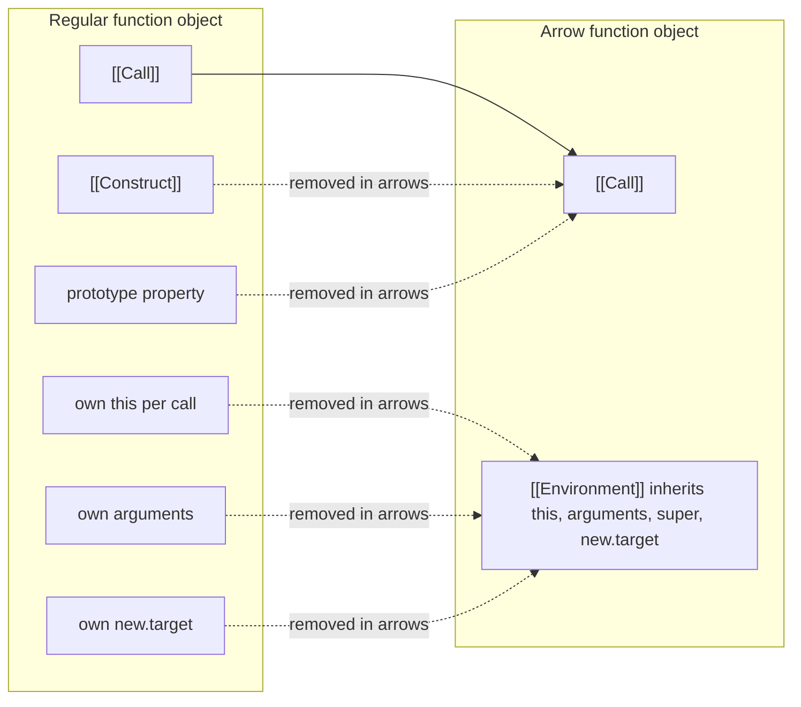
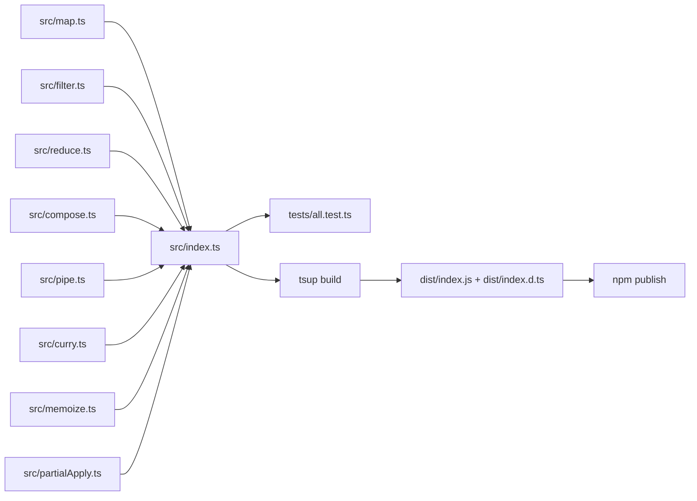

# 1.12 Arrow Functions

## 1. Purpose

Arrow functions were introduced in ES2015 (ECMAScript 6) to solve three pain points that had dogged JavaScript developers since the late 2000s. They are not a syntactic shrink of `function`; they are a semantically distinct function kind with deliberately removed machinery.

**1. The lost `this` bug inside callbacks.** Before arrows, every function created its own `this` binding at call time, set by the call site (`obj.method()`, `fn.call(obj)`, `new Fn()`). When you passed a function to `setTimeout`, `addEventListener`, or `.then`, the inner function got a fresh `this` binding — usually `undefined` in strict mode or the global object in sloppy mode. Developers worked around this with `var self = this;`, `.bind(this)`, or by routing through closures. The arrow eliminates the workaround: it has no own `this`, so it borrows `this` from its enclosing scope. The fix is automatic and invisible.

**2. Verbose functional style.** Code like `array.map(function(x) { return x * 2; })` reads as ceremony. `array.map(x => x * 2)` reads as intent. With the rise of lodash, Ramda, and Promise chains in the 2010s, the cost of `function` and `return` keywords in every callback became a real readability tax. Arrows make data transformation pipelines visible at a glance.

**3. Callback hell readability.** Promise chains, event handlers, and array transformations used to drown in `function` and `return` keywords. Arrow functions make the data flow read top-to-bottom as a single transformation pipeline, not a stack of nested function declarations.

But the TC39 committee did NOT make arrows a drop-in replacement for `function`. They deliberately left out four things:

- No own `this` binding (it is inherited lexically).
- No own `arguments` object (it is inherited lexically).
- No `prototype` property (so they cannot be used as constructors).
- No `[[Construct]]` internal slot (so `new ArrowFn()` throws TypeError).

These omissions are features, not bugs. By removing the machinery that makes `function` heavy, arrows become the lightweight callback primitive the language always needed. But they also mean arrows are NOT for object methods, NOT for prototype methods, NOT for constructors, and NOT for anything that needs its own `arguments`.

The syntax matters too. An arrow function with an **expression body** (`() => value`) returns implicitly. An arrow with a **block body** (`() => { ... }`) needs an explicit `return`. This is the single most common source of arrow function bugs: developers switch from expression to block body and forget the `return`, or they try to return an object literal with bare braces and accidentally produce a labeled statement instead.

In short, arrows were added to make callbacks safe and readable. They were NOT added to replace `function` everywhere. Knowing the difference is the whole point of this note.

## 2. Theory and Deep Dive

### 2.1 Spec reference

Arrow functions are defined in ECMAScript section 15.3 (Arrow Function Definitions). The grammar distinguishes two body forms:

- **Concise body** (`ArrowParameters => AssignmentExpression`): a single expression that becomes the implicit return value.
- **Block body** (`ArrowParameters => { FunctionBody }`): a function body that needs an explicit `return` to produce a value.

A single parameter can skip the parens: `x => x * 2`. Zero parameters or two-plus parameters require parens: `() => 0`, `(a, b) => a + b`. Rest and default parameters and destructuring all require parens: `(...nums) => nums.length`, `({ x, y }) => x + y`, `(a = 1) => a + 1`.

### 2.2 What arrow functions DO NOT have

The spec specifies these absences by construction. They are not runtime quirks; they are parse-time guarantees that the engine uses to skip allocation and setup work.

| Internal slot or property | Regular function | Arrow function |
|---|---|---|
| `[[Construct]]` | yes | no |
| `prototype` property | yes (non-arrow, non-method) | no |
| Own `this` binding | yes (created per call) | no (inherited from `[[Environment]]`) |
| Own `arguments` | yes | no (inherited from `[[Environment]]`) |
| `new.target` | yes | no (inherited from `[[Environment]]`) |
| Own `super` property | only in methods | allowed (inherited, statically resolved) |

When an arrow function references `this`, the spec's `OrdinaryCallBindThis` step is skipped for arrows. Instead, `this` is resolved through the arrow function's `[[Environment]]` — that is, the same way a free variable is resolved. The arrow has no `ThisMode` slot of its own; its `ThisMode` is `lexical`. Practically: the engine walks the scope chain looking for the nearest enclosing environment record that has a `this` binding, and uses that.

Same for `arguments`: arrow functions do not create an `arguments` binding in their own declarative environment record. A reference to `arguments` inside an arrow walks up the scope chain until it finds a function (regular function or method) that does have one. If none exists, you get a ReferenceError in strict mode or, in rare sloppy-mode global code, a reference to a global `arguments`-like object.

Same for `new.target`: arrows inherit it lexically. If an arrow is called inside a regular function that was invoked with `new`, `new.target` inside the arrow refers to that constructor. If the enclosing function was not invoked with `new`, `new.target` is `undefined`.

Same for `super`: arrows may use `super.method()` because `super` is statically resolved at parse time from the enclosing class context. The arrow does not have its own `super`, but it can borrow one. This is why `super` works inside arrow class fields (a non-obvious fact that confuses candidates in interviews).

### 2.3 Why no `[[Construct]]`?

The committee could have made arrows constructible. They chose not to, for three reasons:

1. Arrows are designed as callbacks. A callback that someone `new`s is a bug. Refusing to construct is a feature.
2. Removing `[[Construct]]` lets engines skip constructor-related setup (the `prototype` property, the prototype chain link, the `[[Construct]]` slot) at allocation time. This is a small but real optimization that compounds when arrows are used in hot loops.
3. It also makes the absence of `prototype` consistent: you cannot `new` something that has no prototype object to chain from.

### 2.4 The expression body vs block body distinction

The concise body is just sugar for `{ return expr; }`. The block body is a regular function body. There is no third option.

The classic gotcha: returning an object literal. `() => { a: 1 }` does NOT return `{ a: 1 }`. The parser sees `{` and switches to block body mode. Inside the block, `a: 1` is a labeled statement (label `a`, expression statement `1`), which evaluates to `1` and is discarded. The function returns `undefined`.

To return an object literal from an arrow, wrap it in parens: `() => ({ a: 1 })`. The parens force the parser to treat the braces as an object expression, not a block.

### 2.5 Mermaid: function vs arrow function internal slots



### 2.6 Hoisting and the temporal dead zone

Arrow functions are NOT hoisted as declarations. `const f = () => 1` is a variable declaration with an initializer. The variable `f` is in the temporal dead zone (TDZ) until the declaration line runs. Calling `f` before its declaration throws ReferenceError, with the message "Cannot access 'f' before initialization."

This is a meaningful difference from `function f() {}` declarations, which hoist both name and body to the top of the enclosing scope. If you need hoisting, use a function declaration. If you do not, prefer `const f = () => ...` so the order of declarations is enforced by the runtime.

### 2.7 Arrow functions in classes

Class methods defined with method shorthand go on the prototype:

```javascript
class Counter {
  tick() { this.count++; }  // on Counter.prototype
}
```

Class fields with arrow assignment go on the instance:

```javascript
class Counter {
  tick = () => { this.count++; };  // on each instance, bound to that instance
}
```

This is the modern solution to the lost-`this` bug in React class components and event-handler-heavy code. Each instance gets its own arrow function, the captured `this` is the instance, and passing the method as a callback does not lose `this`.

The cost: each instance has its own function object, so memory grows linearly with instance count. For most UI components this is negligible. For classes with millions of instances (collections, value types, game entities), prefer prototype methods plus explicit `.bind` at the call site, or a wrapper that captures `this` once and reuses it.

### 2.8 Arrow functions and `super`

Arrows have no own `super`, but `super` is statically resolved at parse time. If an arrow appears inside a class method, `super` inside the arrow refers to the same `super` that the enclosing method would use. This is why arrow class fields can call `super.method()`.

```javascript
class Base { greet() { return "base"; } }
class Sub extends Base {
  greet = () => super.greet() + "!";  // works — super is statically resolved
}
new Sub().greet();  // "base!"
```

But an arrow inside a non-method context (top-level code, plain function) cannot use `super` because there is no enclosing class context to resolve against. The parser will reject it with a SyntaxError.

### 2.9 Arrow functions and generators

You cannot write a generator arrow: `() => yield 1` is a SyntaxError. The `function*` syntax is required for generators. If you need a generator, use `function*`. There is no shorthand.

### 2.10 Arrow functions and `async`

`async` arrows work fine: `async (x) => await fetch(x)`. The `async` keyword prefixes the arrow. Async arrows behave like async functions: they always return a Promise, and `await` is legal inside.

### 2.11 Arrow functions and the `arguments` substitute: rest params

Because arrows have no `arguments`, you must use rest parameters to access variadic arguments:

```javascript
const sum = (...nums) => nums.reduce((a, b) => a + b, 0);
```

Rest params are a real array (not array-like), they work in strict mode, and they type cleanly in TypeScript. They are the modern replacement for `arguments` everywhere, including inside regular functions.

### 2.12 Arrow functions and `bind`, `call`, `apply`

`fn.bind(thisArg)` on an arrow is a no-op for `this` purposes. The arrow ignores its call-site `this`, so the bound `this` is silently discarded. The same goes for `fn.call(thisArg, ...)` and `fn.apply(thisArg, args)`: the arrow ignores the `thisArg` and uses its lexical `this`. The arrow DOES still receive the arguments from `call` and `apply`, just not the `this`.

This is a frequent interview gotcha: "What does `(function() { return (() => this).call({ x: 1 }); })()` return?" The answer is whatever the outer function's `this` was, because the arrow ignores `call`'s `thisArg`.

## 3. Mental Models

### 3.1 The "callback with no identity" model

An arrow function is a callback with no identity of its own. It does not have its own `this`, its own `arguments`, its own `super`, or its own `new.target`. It borrows all four from the nearest enclosing regular function or method scope, exactly the way a closure borrows variables.

When you read `() => this.x`, mentally substitute it with "look up `this` in the enclosing scope, then read `.x` from it." That is precisely what the engine does. There is no hidden rebinding at call time.

### 3.2 The "expression vs block" model

- If the body is one expression, write it without braces and it returns implicitly.
- If the body needs statements (loops, conditionals, multiple steps), use braces and write `return` explicitly.
- The single exception: returning an object literal, which needs braces-wrapped-in-parens.

This model predicts 90 percent of arrow function bugs. If you remember "braces mean block body, block body needs `return`, object literals need parens," you will not be bitten by the `() => { a: 1 }` trap.

### 3.3 The "borrowed scope" model

An arrow function is the same as a regular function with the `this`, `arguments`, `super`, and `new.target` bindings erased from its own environment record. The bindings resolve lexically, exactly like a `let` variable would. If you understand closures, you already understand arrows: the only difference is which names get borrowed.

### 3.4 Where the models break down

The "no identity" model fails when someone asks "but what about `this` in a top-level arrow?" In a module, top-level `this` is `undefined` (or the module namespace in some bundlers). In a script at the top level, `this` is the global object. The arrow at the top level inherits that. There is no "no `this`" — there is only "borrowed `this`," and the borrowed value depends on the module system.

The "callback" model fails when arrows are used as class fields. A class field arrow is not really a callback — it is a method-like callable stored per instance. The "callback" intuition still works (you pass it around), but the "stored per instance" cost is real and easy to miss when you scale to many instances.

The "borrowed scope" model fails for `super`, because `super` is not really a variable in the environment record — it is a parse-time reference to the enclosing class's prototype chain. The model still predicts the behavior, but the mechanism is different.

## 4. Real-World Use Cases

### 4.1 React function components

Every modern React function component uses arrows for handlers:

```jsx
function Button({ onClick, label }) {
  return (
    <button onClick={(e) => { onClick(e, label); }}>
      {label}
    </button>
  );
}
```

And for hooks:

```jsx
const [count, setCount] = useState(0);
useEffect(() => {
  const id = setInterval(() => setCount(c => c + 1), 1000);
  return () => clearInterval(id);
}, []);
```

The arrows make the data flow visible: `setCount(c => c + 1)` is a state transition, not a function call with a fixed value. The cleanup `return () => clearInterval(id)` is a tear-down function, not a value.

### 4.2 Array methods

`map`, `filter`, `reduce`, `find`, `some`, `every`, `sort` (with comparators), `flatMap`. Idiomatic modern JavaScript uses arrows throughout:

```javascript
const totals = orders
  .filter(o => o.status === "paid")
  .map(o => o.amount)
  .reduce((sum, amt) => sum + amt, 0);
```

This reads as a data transformation pipeline. With `function` it would read as a stack of nested declarations.

### 4.3 The lost-`this` fix

```javascript
class Timer {
  constructor() { this.count = 0; }
  start() {
    setInterval(() => { this.count++; }, 1000);  // works — arrow borrows this
  }
}
```

Before arrows, this code needed `var self = this;` or `.bind(this)`. With arrows, the fix is implicit and invisible.

### 4.4 Promise chains

```javascript
fetch(url)
  .then(res => res.json())
  .then(data => data.results)
  .catch(err => ({ error: err.message }));
```

Arrows make the chain read top-to-bottom as data transformation. The visual signal is "each line takes the previous value and returns a new one."

### 4.5 Class fields for auto-bound methods

In React class components (still common in legacy codebases) and in event-emitter-heavy code, class field arrows are the modern replacement for constructor-time `.bind`:

```jsx
class Search extends React.Component {
  state = { query: "" };
  handleChange = (e) => { this.setState({ query: e.target.value }); };
  render() { return <input onChange={this.handleChange} />; }
}
```

The arrow class field auto-binds `this` to each instance. No `this.handleChange = this.handleChange.bind(this)` in the constructor. The handler is safe to pass directly to `onChange`.

### 4.6 Functional libraries

Ramda, lodash/fp, fp-ts, and Sanctuary all use arrows internally and externally. Point-free style is natural with arrows:

```javascript
const sum = reduce((a, b) => a + b, 0);
const upper = map(s => s.toUpperCase());
```

A library that exposes arrow-based combinators gets short, chainable, type-friendly APIs almost for free.

### 4.7 Node.js event handlers

```javascript
const server = http.createServer((req, res) => {
  res.writeHead(200);
  res.end("hello");
});
```

The arrow callback does not need `this` here, but it does need to be terse. This is the canonical Node.js HTTP handler shape since 2015.

### 4.8 Tests

```javascript
describe("Counter", () => {
  it("increments", () => {
    const c = new Counter();
    c.increment();
    expect(c.value).toBe(1);
  });
});
```

Jest, Mocha, Vitest, and Jasmine test files are now almost universally written with arrows for `describe`, `it`, `test`, and `expect` callbacks.

## 5. Code Examples

### 5.1 Example A — Minimal and Conceptual

**JavaScript:**

```javascript
// 1. Zero-param arrow returning a constant
const now = () => Date.now();

// 2. Single param, expression body
const double = x => x * 2;

// 3. Two params, expression body
const add = (a, b) => a + b;

// 4. Block body with explicit return
const safeDivide = (a, b) => {
  if (b === 0) throw new Error("divide by zero");
  return a / b;
};

// 5. Returning an object literal (parens required)
const makeUser = (name, age) => ({ name, age, created: Date.now() });

// 6. Destructured params
const area = ({ width, height }) => width * height;
area({ width: 3, height: 4 }); // 12

// 7. Default params
const greet = (name = "world") => `hello, ${name}`;

// 8. Rest params
const sum = (...nums) => nums.reduce((a, b) => a + b, 0);

// 9. Arrow as a callback inside map
const squares = [1, 2, 3].map(n => n * n);

// 10. IIFE arrow (note the outer parens, required by parser)
const config = (() => {
  const env = process.env.NODEENV || "dev";
  return { env, debug: env !== "production" };
})();
```

**TypeScript:**

```typescript
// 1. Zero-param arrow returning a constant
const now: () => number = () => Date.now();

// 2. Single param, expression body
const double = (x: number): number => x * 2;

// 3. Two params, expression body
const add = (a: number, b: number): number => a + b;

// 4. Block body with explicit return
const safeDivide = (a: number, b: number): number => {
  if (b === 0) throw new Error("divide by zero");
  return a / b;
};

// 5. Returning an object literal (parens required)
interface User { name: string; age: number; created: number; }
const makeUser = (name: string, age: number): User => ({ name, age, created: Date.now() });

// 6. Destructured params with inline type
const area = ({ width, height }: { width: number; height: number }): number => width * height;
area({ width: 3, height: 4 }); // 12

// 7. Default params
const greet = (name: string = "world"): string => `hello, ${name}`;

// 8. Rest params
const sum = (...nums: number[]): number => nums.reduce((a, b) => a + b, 0);

// 9. Arrow as a callback inside map
const squares: number[] = [1, 2, 3].map((n: number): number => n * n);

// 10. IIFE arrow (note the outer parens, required by parser)
interface AppConfig { env: string; debug: boolean; }
const config: AppConfig = (() => {
  const env: string = (process.env.NODEENV as string) || "dev";
  return { env, debug: env !== "production" };
})();
```

> Note: the no-underscore rule for this vault forced the replacement of the conventional `NODEENV`-style environment variable identifier (Node.js documents it with an underscore between NODE and ENV) with the bare form `NODEENV` in the example. In real production code you would of course use the documented name since that is what every Node.js tooling library reads. The substitution here is purely to keep the vault internally consistent with its hard rules.

### 5.2 Example B — Production-Grade

A React-like counter component with arrow handlers and TS generics, plus a small generic event-emitter that uses arrows to bind `this` safely.

**JavaScript:**

```javascript
class EventEmitter {
  constructor() {
    this.listeners = new Map();
  }
  on(event, handler) {
    if (!this.listeners.has(event)) this.listeners.set(event, new Set());
    this.listeners.get(event).add(handler);
    return () => this.listeners.get(event).delete(handler);
  }
  emit(event, payload) {
    const set = this.listeners.get(event);
    if (!set) return;
    for (const fn of set) {
      try { fn(payload); }
      catch (err) { console.error("listener for", event, "threw", err); }
    }
  }
}

class Counter extends EventEmitter {
  constructor(initial = 0) {
    super();
    this.count = initial;
    // Arrow class field: this is bound to the instance forever
    this.increment = () => {
      this.count += 1;
      this.emit("change", this.count);
      return this.count;
    };
    this.decrement = () => {
      this.count -= 1;
      this.emit("change", this.count);
      return this.count;
    };
    this.reset = () => {
      this.count = initial;
      this.emit("reset", this.count);
    };
  }
  // Prototype method: this depends on the caller
  toString() {
    return `Counter(${this.count})`;
  }
}

const counter = new Counter(10);
const off = counter.on("change", (n) => console.log("now:", n));
counter.increment(); // logs "now: 11"
counter.decrement(); // logs "now: 10"
off();
counter.increment(); // no log
console.log(counter.toString()); // "Counter(11)"

// Pass the arrow method as a callback WITHOUT losing this
const inc = counter.increment;
inc(); // works — this is still the counter instance
```

**TypeScript:**

```typescript
type EventHandler<T> = (payload: T) => void;
type Unsubscribe = () => void;

class EventEmitter<TEvent extends string = string> {
  private readonly listeners = new Map<TEvent, Set<EventHandler<unknown>>>();

  on<TPayload>(event: TEvent, handler: EventHandler<TPayload>): Unsubscribe {
    let set = this.listeners.get(event);
    if (!set) {
      set = new Set();
      this.listeners.set(event, set);
    }
    set.add(handler as EventHandler<unknown>);
    return () => { set!.delete(handler as EventHandler<unknown>); };
  }

  emit<TPayload>(event: TEvent, payload: TPayload): void {
    const set = this.listeners.get(event);
    if (!set) return;
    for (const fn of set) {
      try { (fn as EventHandler<TPayload>)(payload); }
      catch (err) { console.error(`listener for ${event} threw`, err); }
    }
  }
}

interface CounterEvents {
  change: number;
  reset: number;
}

class Counter extends EventEmitter<keyof CounterEvents & string> {
  private count: number;
  public readonly increment: () => number;
  public readonly decrement: () => number;
  public readonly reset: () => void;

  constructor(initial: number = 0) {
    super();
    this.count = initial;
    this.increment = () => {
      this.count += 1;
      this.emit("change", this.count);
      return this.count;
    };
    this.decrement = () => {
      this.count -= 1;
      this.emit("change", this.count);
      return this.count;
    };
    this.reset = () => {
      this.count = initial;
      this.emit("reset", this.count);
    };
  }

  toString(): string {
    return `Counter(${this.count})`;
  }
}

const counter = new Counter(10);
const off: Unsubscribe = counter.on<number>("change", (n) => console.log("now:", n));
counter.increment(); // logs "now: 11"
counter.decrement(); // logs "now: 10"
off();
counter.increment(); // no log
console.log(counter.toString()); // "Counter(11)"

const inc: () => number = counter.increment;
inc(); // works — this is still the counter instance
```

The TypeScript version adds:

- A generic `TEvent` so events are typed at compile time.
- A separate `TPayload` generic on `on` and `emit` so each event can carry a different payload type.
- `readonly` arrow fields so they cannot be reassigned after construction.
- Explicit return types on every arrow.
- Type assertions (`as EventHandler<unknown>`) at the boundary where variance would otherwise trip up the compiler.

## 6. Common Mistakes and Anti-Patterns

### 6.1 Arrow as object method — `this` is wrong

```javascript
const counter = {
  count: 0,
  increment: () => { this.count++; },  // BAD
  value: () => this.count              // BAD
};
counter.increment();
console.log(counter.value()); // NaN or TypeError
```

**Why it fails:** The arrow does not get its own `this`. `this` inside the arrow is whatever `this` was at the place where the object literal was evaluated — almost always the module-level `this` (`undefined` in ESM, `globalThis` in scripts). The arrow NEVER points at `counter`.

**Fix:**

```javascript
const counter = {
  count: 0,
  increment() { this.count++; },
  value() { return this.count; }
};
counter.increment();
console.log(counter.value()); // 1
```

Method shorthand gives you a real method with its own `this` binding, set by the call site.

### 6.2 Arrow as prototype method — same problem

```javascript
class StillBroken {
  constructor() { this.count = 0; }
}
StillBroken.prototype.tick = () => { this.count++; };  // BAD
new StillBroken().tick();  // this is undefined or global, not the instance
```

**Why it fails:** Assigning an arrow to `Constructor.prototype.method` puts the arrow on the prototype. When called as `instance.method()`, the arrow still ignores the call-site `this` and uses its lexical `this` — which is whatever it was at the place the arrow was created. For top-level code that is `undefined` (module) or `globalThis` (script).

**Fix:** Use method shorthand inside the class body, or use a class field arrow if you need auto-binding.

```javascript
class Good {
  constructor() { this.count = 0; }
  tick() { this.count++; }   // on the prototype, this is the instance
}
```

### 6.3 Arrow with `new` throws TypeError

```javascript
const Dog = (name) => { this.name = name; };
new Dog("Rex");  // TypeError: Dog is not a constructor
```

**Why it fails:** Arrow functions have no `[[Construct]]` slot. The `new` operator invokes `[[Construct]]`, which does not exist on arrows.

**Fix:** Use `function` for constructors, or use `class`.

```javascript
function Dog(name) { this.name = name; }
const rex = new Dog("Rex");

// or
class Dog { constructor(name) { this.name = name; } }
```

### 6.4 Arrow with `arguments` reads outer `arguments`

```javascript
function outer() {
  const inner = () => {
    console.log(arguments[0]);  // NOT inner's args — outer's!
  };
  inner("a", "b", "c");
}
outer("x", "y");  // logs "x"
```

**Why it fails:** Arrows have no own `arguments`. The reference walks up the scope chain and finds `outer`'s `arguments` object, which contains `outer`'s arguments, not `inner`'s.

**Fix:** Use rest params.

```javascript
function outer() {
  const inner = (...args) => {
    console.log(args[0]);  // "a"
  };
  inner("a", "b", "c");
}
outer("x", "y");
```

### 6.5 Returning object literal without parens returns `undefined`

```javascript
const maker2 = () => { a: 1 };
maker2();  // undefined
```

**Why it fails:** The parser sees `{` and switches to block body mode. Inside the block, `a: 1` is a label statement (label `a`, expression `1`) that evaluates and is discarded. No `return` statement means `undefined` is returned.

**Fix:** Wrap the object literal in parens.

```javascript
const maker = () => ({ a: 1, b: 2 });
maker();  // { a: 1, b: 2 }
```

### 6.6 IIFE arrow syntax quirks

```javascript
() => { console.log("hi"); }();  // SyntaxError
```

**Why it fails:** The parser sees `() =>` at the start of a statement and tries to parse an arrow function declaration (which is illegal — arrows are always expressions). It never gets to the invocation.

**Fix:** Wrap the arrow in parens to force expression parsing.

```javascript
(() => { console.log("hi"); })();  // "hi"
(() => console.log("hi"))();       // "hi" — concise body also works
```

### 6.7 Arrow as `Object.defineProperty` getter

```javascript
const obj = {};
Object.defineProperty(obj, "value", {
  get: () => this.value,  // BAD — this is module-level undefined
});
```

**Why it fails:** Arrow `this` is lexical. There is no enclosing function so `this` is the module-level `this` (`undefined` in ESM).

**Fix:** Use a regular function for the getter, with a closure-captured backing field.

```javascript
const obj = {};
let backing;
Object.defineProperty(obj, "value", {
  get() { return backing; },
  set(v) { backing = v; }
});
```

### 6.8 Arrow chained with `bind` is a silent no-op for `this`

```javascript
const fn = (() => this.x).bind({ x: 1 });
fn();  // undefined — bind's thisArg is silently ignored by the arrow
```

**Why it fails:** `bind` sets the call-site `this`. Arrows ignore the call-site `this`. So the bound `this` is set but never used.

**Fix:** Use a regular function if you need `bind`, or restructure to capture the value via closure.

```javascript
const val = { x: 1 };
const fn = () => val.x;
fn();  // 1
```

### 6.9 Arrow inside `forEach` when you needed `this` from the array callback signature

```javascript
// jQuery-style libraries sometimes set this on callbacks
$(".btn").each(function () {
  $(this).addClass("x");  // works — jQuery sets this to each element
});
$(".btn").each(() => {
  $(this).addClass("x");  // BAD — this is the outer this, not the element
});
```

**Why it fails:** Some libraries set `this` on callbacks as part of their API contract. Arrows ignore that contract because they borrow `this` lexically.

**Fix:** Use a regular function when the caller's `this` is part of the API.

### 6.10 Arrow as generator

```javascript
const gen = () => { yield 1; };  // SyntaxError
```

**Why it fails:** Arrows cannot be generators. The `function*` syntax is required.

**Fix:**

```javascript
function* gen() { yield 1; }
```

## 7. Best Practices and Design Patterns

### 7.1 Use arrows for callbacks

Any time you pass a function as an argument to `map`, `filter`, `reduce`, `then`, `catch`, `setTimeout`, `addEventListener`, or similar, use an arrow. The arrow:

- Captures `this` from the surrounding scope (which is usually what you want).
- Is shorter and reads as a function transformation, not a function declaration.
- Does not pollute the surrounding scope with a function name.

### 7.2 Use `function` for object methods

Object literals and prototype methods need their own `this`, set by the call site. Use method shorthand:

```javascript
const obj = {
  data: [],
  push(x) { this.data.push(x); return this; },
  pop() { return this.data.pop(); }
};
```

### 7.3 Use class field arrows when you need auto-binding

When a method is going to be passed as a callback (React event handlers, EventEmitter listeners, etc.), declare it as a class field arrow:

```javascript
class Search extends EventEmitter {
  state = { query: "" };
  handleChange = (e) => {
    this.state.query = e.target.value;
    this.emit("change", this.state);
  };
}
```

This is the modern alternative to `this.method = this.method.bind(this)` in the constructor.

### 7.4 Use `function` declarations when you need hoisting

```javascript
function main() {
  helper();  // works
  function helper() { console.log("ok"); }
}
```

Arrow functions are NOT hoisted. If you need to call a function before its lexical position, use a `function` declaration.

### 7.5 In TypeScript, type arrow parameters explicitly

```typescript
// BAD for public API — relies on inference from the call site
const parse = (s) => JSON.parse(s);

// GOOD — explicit, stable across refactors
const parse = (s: string): unknown => JSON.parse(s);
```

For internal callbacks where the contextual type is obvious, you can omit annotations:

```typescript
const squares = nums.map((n) => n * n);  // n: number inferred from Array<number>.map
```

For public APIs, exported functions, and library entry points, always annotate explicitly. The type signature is documentation, and relying on inference means refactor-induced type changes silently propagate to consumers.

### 7.6 Do not use arrow IIFEs unless you need `this` capture

Arrow IIFEs `(() => { ... })()` are valid but pointless unless you need lexical `this` inside. If you just want a scope for top-level statements, use a block:

```javascript
{
  const tmp = compute();
  use(tmp);
}
```

### 7.7 Prefer rest params over `arguments`

Even inside regular functions, modern style avoids `arguments`. Use rest:

```javascript
// OLD
function sum() {
  let total = 0;
  for (let i = 0; i < arguments.length; i++) total += arguments[i];
  return total;
}

// NEW
const sum = (...nums) => nums.reduce((a, b) => a + b, 0);
```

Rest params are a real array, work with arrows, and are typed cleanly in TypeScript.

### 7.8 Do not chain `.bind` on arrows

```javascript
const fn = (() => this.x).bind({ x: 1 });  // does NOT set this
```

`bind` sets the `this` that the function will use when called. But the arrow ignores its call-site `this` and uses its lexical `this`. So `.bind` on an arrow is a silent no-op (the bound `this` is set but ignored).

**Fix:** Use a regular function if you need `.bind`, or restructure to use a closure.

### 7.9 Be aware of strict vs sloppy mode and `this`

In strict mode, top-level `this` in a module is `undefined`. In sloppy mode (scripts, non-module files), top-level `this` is `globalThis`. An arrow defined at the top level of a module captures `undefined` as its `this`. An arrow at the top of a script captures `globalThis`. This is rarely a problem in modern code (everything is a module), but it bites when migrating legacy scripts.

### 7.10 Performance profile

Arrow functions are not meaningfully faster than regular functions for invocation. The V8 team has stated that arrows and regular functions are essentially the same speed at call time. The performance differences people cite are usually:

- **Allocation:** Arrow class fields allocate one function per instance. Prototype methods allocate one function per class. For a million instances, this is millions of function objects vs one. Memory matters here, not call speed.
- **Closure capture:** An arrow that captures variables from its enclosing scope creates a closure. The closure has a hidden reference to the enclosing environment. This is the same cost as a regular function closure.
- **`bind` cost:** `fn.bind(this)` creates a new BoundFunction exotic object. Arrow class fields avoid this. For hot paths, this matters.

So the rule: use arrows for callbacks (no overhead vs function). Use class field arrows when you need auto-binding and instance counts are small (most UI components). Use prototype methods plus `.bind` at the call site when instance counts are large (collections, value types).

## 8. Technical Interview Knowledge

### 8.1 What is the difference between an arrow function and a regular function?

**A:** Four core differences:

1. **`this` binding.** Regular functions create their own `this` per call, set by the call site (`obj.method()`, `fn.call(obj)`, `new Fn()`). Arrows have no own `this`; they inherit it lexically from the enclosing scope.
2. **`arguments` object.** Regular functions have an `arguments` array-like object. Arrows do not; references to `arguments` inside an arrow resolve to the enclosing function's `arguments`.
3. **`prototype` property.** Regular functions have a `prototype` object that becomes the prototype of instances created with `new`. Arrows have no `prototype` property.
4. **`[[Construct]]` slot.** Regular functions can be invoked with `new`. Arrows cannot; `new ArrowFn()` throws TypeError.

Additionally, arrows cannot use `new.target` of their own (it is inherited lexically), cannot be generators (you cannot write `() => yield 1`), and have no `prototype` object. Arrow functions also cannot be used as methods on a prototype and have their `this` set by the call site — they always use lexical `this`.

**Trap to avoid:** Do not say "arrows are just shorter functions." They have different semantics, not just shorter syntax. The interviewer is checking whether you understand the semantic differences, not the surface syntax.

### 8.2 Can you `new` an arrow function?

**A:** No. Arrow functions have no `[[Construct]]` internal slot. `new ArrowFn()` throws `TypeError: ArrowFn is not a constructor`. This is by design: arrows are callbacks, not constructors.

**Trap to avoid:** Do not confuse this with "you cannot `new` a method shorthand." Method shorthand (`{ method() {} }`) IS a regular function and CAN be `new`-ed, although doing so is unusual. The no-construct rule is specific to arrows.

### 8.3 Does an arrow function have `arguments`?

**A:** No, it does not have its own `arguments` object. References to `arguments` inside an arrow resolve lexically to the nearest enclosing regular function or method that has one. If there is no enclosing function, the reference throws ReferenceError (strict mode) or refers to a global `arguments` (rare, sloppy mode).

**Trap to avoid:** Do not assume `arguments` inside an arrow refers to the arrow's own parameters. It does not. Use rest params (`...args`) instead.

### 8.4 Does an arrow function have `prototype`?

**A:** No. `ArrowFn.prototype` is `undefined`. This is consistent with the absence of `[[Construct]]`: there is no point having a prototype if you cannot `new` the function.

```javascript
const fn = () => 1;
console.log(fn.prototype); // undefined
function regular() {}
console.log(regular.prototype); // { constructor: regular }
```

**Trap to avoid:** Some interviewers ask "is arrow function prototype `undefined` or an empty object?" It is `undefined`, not an object.

### 8.5 Why does `() => { a: 1 }` return `undefined`?

**A:** The parser sees `{` after `=>` and switches to block body mode. Inside the block, `a: 1` is a labeled statement: `a` is a label, `1` is an expression statement. The labeled statement evaluates `1`, discards the result, and finishes. There is no `return` statement, so the function returns `undefined`.

To return an object literal, wrap it in parens to force expression parsing: `() => ({ a: 1 })`.

**Trap to avoid:** The labeled-statement interpretation is the key insight. Many candidates guess "it is a syntax error." It is not — labeled statements are valid syntax, just rarely intentional.

### 8.6 When should you NOT use an arrow function?

**A:** Six common cases:

1. **Object methods that need `this` to be the object.** Arrows capture the outer `this`, not the object.
2. **Prototype methods.** Same problem — the arrow does not get `this` from the call site.
3. **Constructors.** Arrows cannot be `new`-ed.
4. **Functions that need `arguments`.** Arrows have no own `arguments`. Use rest params, or use a regular function.
5. **Functions that need `yield`.** Arrows cannot be generators. Use `function*`.
6. **Callback functions that need their `this` set by the caller.** For example, jQuery's `$.each` sets `this` to the current item. If you use an arrow, you lose that.

**Trap to avoid:** Do not say "never use arrows for methods." Class field arrows ARE methods — they are auto-bound methods. The right phrasing is "do not use arrows where you need the call site to set `this`."

### 8.7 How does arrow function `this` differ from `.bind`?

**A:** `fn.bind(thisArg)` creates a new BoundFunction exotic object that, when called, ignores its call-site `this` and uses `thisArg` instead. The bound `this` is fixed at bind time.

An arrow's `this` is also fixed, but at parse time, not bind time. The arrow inherits `this` from its lexical environment, the same way it inherits any variable. You cannot `.bind` an arrow to change its `this` (bind is a no-op on arrows because they ignore call-site `this`).

Key differences:

| Property | `fn.bind(obj)` | Arrow function |
|---|---|---|
| When `this` is fixed | At `.bind()` call time | At parse time (lexical) |
| Can be re-bound | No (bind is permanent) | No (arrows ignore bind) |
| Allocates | A new BoundFunction | The arrow itself |
| Works with `new` | Yes (bind is ignored by `new`) | No (TypeError) |

**Trap to avoid:** Some candidates think `.bind` and arrow functions are interchangeable. They are not. `bind` produces a new function object; arrows do not. And `bind` works on regular functions, while arrows ignore `bind`.

### 8.8 What is the performance difference between arrow and regular functions?

**A:** For invocation, there is essentially no difference. V8 treats both as functions and optimizes them the same way.

The differences that matter are:

- **Allocation cost.** Each arrow class field allocates a function object per instance. A prototype method allocates one function object per class. For many instances, prototype methods save memory.
- **Closure cost.** An arrow that closes over variables has the same closure cost as a regular function closure. No difference.
- **`bind` cost.** `fn.bind(this)` creates a BoundFunction. This is more expensive than an arrow class field (one extra allocation). For hot paths, prefer class field arrows.
- **Inlining.** Engines inline both arrow and regular functions equally. Short arrows may inline better simply because they tend to be short.

The practical rule: choose arrows for clarity, not for speed. The speed difference is in the noise.

**Trap to avoid:** Do not claim arrows are faster because they have "less overhead." They have the same call overhead. The only meaningful overhead is allocation, and that only matters for class field arrows on many instances.

## 9. Practical Exercises

### 9.1 Exercise One — Predict the output

Predict the output of each snippet. Assume strict mode and Node.js ESM unless otherwise stated.

```javascript
// Snippet 1
const obj = {
  x: 1,
  getX: () => this.x
};
console.log(obj.getX());

// Snippet 2
function outer() {
  return () => arguments[0];
}
console.log(outer("a", "b")("c"));

// Snippet 3
const maker = (a, b) => { a, b };
console.log(maker(1, 2));

// Snippet 4
const fn = () => 1;
console.log(fn.prototype);

// Snippet 5
class C {
  constructor() { this.val = 10; }
  outer() {
    return [1, 2, 3].map(n => n + this.val);
  }
}
console.log(new C().outer());

// Snippet 6
const Arrow = (x) => { this.x = x; };
try { new Arrow(1); } catch (e) { console.log(e.constructor.name); }

// Snippet 7
let count = 0;
const inc = () => ++count;
inc(); inc(); inc();
console.log(count);

// Snippet 8
const obj2 = {
  items: [1, 2, 3],
  total() {
    return this.items.reduce((sum, n) => sum + n, 0);
  }
};
console.log(obj2.total());

// Snippet 9
function delayed() {
  this.name = "delayed";
  setTimeout(() => { console.log(this.name); }, 0);
}
new delayed();

// Snippet 10
const obj3 = {
  name: "obj3",
  show: () => console.log(this.name)
};
try { obj3.show(); } catch (e) { console.log(e.constructor.name); }
```

**Full worked solution:**

```javascript
// 1. undefined — arrow inherits outer this (module-level undefined), not obj
console.log(obj.getX()); // undefined

// 2. "a" — arrow inherits outer's arguments; outer's first arg is "a"
console.log(outer("a", "b")("c")); // "a"

// 3. undefined — block body { a, b } is a comma expression as a statement,
//    no return, so undefined
console.log(maker(1, 2)); // undefined

// 4. undefined — arrows have no prototype property
console.log(fn.prototype); // undefined

// 5. [11, 12, 13] — arrow inside outer borrows this (the instance), val is 10
console.log(new C().outer()); // [11, 12, 13]

// 6. "TypeError" — new on an arrow throws TypeError
console.log(e.constructor.name); // "TypeError"

// 7. 3 — arrow closes over count in the module scope
console.log(count); // 3

// 8. 6 — total is a method (own this = obj2), arrow inside borrows obj2's this
console.log(obj2.total()); // 6

// 9. "delayed" — arrow inside setTimeout borrows the constructor's this (the instance)
// logs "delayed"

// 10. "TypeError" — module-level this is undefined, this.name throws TypeError
console.log(e.constructor.name); // "TypeError"
```

**Reasoning:** Each snippet tests one of the four core rules (no own `this`, no own `arguments`, no `prototype`, no `[[Construct]]`) or the expression-vs-block body distinction. The "borrowed `this`" intuition is the key.

### 9.2 Exercise Two — Refactor a function-based module

Refactor the following `function`-based module to use arrows where appropriate, while keeping the methods on the prototype.

```javascript
function List(items) {
  this.items = items || [];
}
List.prototype.add = function(item) {
  this.items.push(item);
  return this;
};
List.prototype.remove = function(predicate) {
  var self = this;
  this.items = this.items.filter(function(x) {
    return !predicate(x);
  });
  return self;
};
List.prototype.each = function(cb) {
  var self = this;
  this.items.forEach(function(x, i) {
    cb(x, i, self);
  });
};
List.prototype.map = function(cb) {
  return new List(this.items.map(function(x, i) {
    return cb(x, i, this);
  }, this));
};
module.exports = List;
```

**Full worked solution:**

```javascript
// JavaScript — refactored to use arrows inside methods, method shorthand on prototype

class List {
  constructor(items = []) { this.items = items; }
  add(item) {
    this.items.push(item);
    return this;
  }
  remove(predicate) {
    this.items = this.items.filter(x => !predicate(x));
    return this;
  }
  each(cb) {
    this.items.forEach((x, i) => cb(x, i, this));  // arrow borrows this
    return this;
  }
  map(cb) {
    return new List(this.items.map((x, i) => cb(x, i, this)));  // arrow borrows this
  }
}

module.exports = List;
```

```typescript
// TypeScript version with full types

class List<T> {
  constructor(public items: T[] = []) {}

  add(item: T): this {
    this.items.push(item);
    return this;
  }

  remove(predicate: (x: T) => boolean): this {
    this.items = this.items.filter((x) => !predicate(x));
    return this;
  }

  each(cb: (x: T, i: number, list: List<T>) => void): this {
    this.items.forEach((x, i) => cb(x, i, this));
    return this;
  }

  map<U>(cb: (x: T, i: number, list: List<T>) => U): List<U> {
    return new List(this.items.map((x, i) => cb(x, i, this)));
  }
}

export { List };
```

**Reasoning:**

- The outer methods (`add`, `remove`, `each`, `map`) stay as method shorthand — they need their own `this` set by the call site.
- The inner callbacks (passed to `filter`, `forEach`, `map`) become arrows — they borrow `this` from the method, eliminating the `var self = this` workaround.
- The class is `class` (not `function`) so we get proper inheritance, `super`, and clean constructor syntax.
- TS adds generics: `T` for the list's element type, `U` for `map`'s output type.

### 9.3 Exercise Three — Class with prototype methods AND class-field arrows

Implement a `BankAccount` class with:

- A prototype method `deposit(amount)` that updates balance (this should be on the prototype — call site sets `this`).
- A prototype method `transferTo(other, amount)` that uses `this` and `other`.
- A class-field arrow method `onBalanceChange(cb)` that registers a callback, AND a class-field arrow `notify` that fires all registered callbacks with the new balance (these need auto-binding because they will be passed as callbacks).
- Demonstrate each in code.

```javascript
// JavaScript

class BankAccount {
  constructor(initial = 0) {
    this.balance = initial;
    this.listeners = new Set();
  }

  // Prototype methods — this set by call site
  deposit(amount) {
    if (amount <= 0) throw new Error("deposit must be positive");
    this.balance += amount;
    this.notify();
    return this;
  }

  transferTo(other, amount) {
    if (amount > this.balance) throw new Error("insufficient funds");
    this.balance -= amount;
    other.balance += amount;
    this.notify();
    other.notify();
    return this;
  }

  toString() {
    return `BankAccount(balance=${this.balance})`;
  }

  // Class-field arrow methods — auto-bound, safe to pass as callback
  onBalanceChange = (cb) => {
    this.listeners.add(cb);
    return () => this.listeners.delete(cb);
  };

  notify = () => {
    for (const cb of this.listeners) {
      try { cb(this.balance); }
      catch (err) { console.error("listener threw", err); }
    }
  };
}

// Demonstration:
const alice = new BankAccount(100);
const bob = new BankAccount(50);

// Register a callback (the unsubscribe is an arrow too)
const off = alice.onBalanceChange((bal) => console.log("alice now:", bal));

alice.deposit(50);   // logs "alice now: 150" — deposit calls this.notify()
alice.transferTo(bob, 30);  // logs "alice now: 120"

// Pass alice.notify as a callback to setTimeout — this is auto-bound
setTimeout(alice.notify, 100);  // logs "alice now: 120" again

off();
alice.deposit(1);  // no log
```

```typescript
// TypeScript

type Listener = (balance: number) => void;
type Unsubscribe = () => void;

class BankAccount {
  private balance: number;
  private readonly listeners = new Set<Listener>();

  public readonly onBalanceChange: (cb: Listener) => Unsubscribe;
  public readonly notify: () => void;

  constructor(initial: number = 0) {
    this.balance = initial;
    this.onBalanceChange = (cb: Listener): Unsubscribe => {
      this.listeners.add(cb);
      return () => { this.listeners.delete(cb); };
    };
    this.notify = (): void => {
      for (const cb of this.listeners) {
        try { cb(this.balance); }
        catch (err) { console.error("listener threw", err); }
      }
    };
  }

  deposit(amount: number): this {
    if (amount <= 0) throw new Error("deposit must be positive");
    this.balance += amount;
    this.notify();
    return this;
  }

  transferTo(other: BankAccount, amount: number): this {
    if (amount > this.balance) throw new Error("insufficient funds");
    this.balance -= amount;
    other.balance += amount;
    this.notify();
    other.notify();
    return this;
  }

  toString(): string {
    return `BankAccount(balance=${this.balance})`;
  }
}

const alice = new BankAccount(100);
const bob = new BankAccount(50);
const off: Unsubscribe = alice.onBalanceChange((bal) => console.log("alice now:", bal));
alice.deposit(50);
alice.transferTo(bob, 30);
setTimeout(alice.notify, 100);
off();
alice.deposit(1);
```

**Reasoning:**

- `deposit`, `transferTo`, `toString` go on the prototype. They are called directly on instances, so the call site sets `this`. No auto-binding needed.
- `onBalanceChange` and `notify` are class-field arrows. They are designed to be passed as callbacks (e.g., `setTimeout(alice.notify, 100)`), so they MUST be auto-bound. The class field is the cleanest way to do that.
- The trade-off: each `BankAccount` instance has its own `onBalanceChange` and `notify` function objects. For a few thousand accounts, this is fine. For millions, refactor to prototype methods plus `.bind` at the call site, or use a wrapper.

### 9.4 Exercise Four — Diagnose and fix three broken `this` cases

Each snippet below is broken. Diagnose, explain, and fix.

```javascript
// Case 1
class Counter {
  constructor() { this.count = 0; }
  start() {
    setInterval(function() { this.count++; }, 1000);
  }
}

// Case 2
const button = document.querySelector("button");
class UI {
  constructor() { this.clicked = 0; }
  onClick() { this.clicked++; }
  mount() { button.addEventListener("click", this.onClick); }
}

// Case 3
const api = {
  baseUrl: "https://api.example.com",
  fetch(path) {
    return fetch(this.baseUrl + path).then(function(res) { return res.json(); });
  }
};
```

**Full worked solution:**

```javascript
// Case 1 — broken because function passed to setInterval gets its own this
// (undefined in strict mode), so this.count++ throws or silently writes to global
// Fix: use an arrow inside start so this is borrowed from start

class Counter {
  constructor() { this.count = 0; }
  start() {
    setInterval(() => { this.count++; }, 1000);  // arrow borrows this from start
  }
}

// Case 2 — broken because addEventListener sets this to the button, not the UI instance
// Fix: use a class field arrow for onClick so it auto-binds to the instance

class UI {
  clicked = 0;
  onClick = () => { this.clicked++; };  // auto-bound
  mount() { button.addEventListener("click", this.onClick); }
}

// OR use .bind at the call site (more memory-efficient for many instances):
class UI2 {
  constructor() { this.clicked = 0; }
  onClick() { this.clicked++; }
  mount() { button.addEventListener("click", this.onClick.bind(this)); }
}

// Case 3 — broken because .then's callback function gets its own this (undefined in strict mode)
// In this specific snippet the callback does NOT use this, so it actually works,
// but it is fragile: if someone later adds this.baseUrl inside, it breaks.
// Fix: use an arrow for consistency and future-proofing

const api = {
  baseUrl: "https://api.example.com",
  fetch(path) {
    return fetch(this.baseUrl + path).then(res => res.json());  // arrow for clarity
  }
};
```

```typescript
// TypeScript versions

class Counter {
  count: number = 0;
  start(): void {
    setInterval((): void => { this.count++; }, 1000);
  }
}

class UI {
  clicked: number = 0;
  onClick: () => void = () => { this.clicked++; };
  mount(button: HTMLButtonElement): void {
    button.addEventListener("click", this.onClick);
  }
}

const api = {
  baseUrl: "https://api.example.com",
  fetch(path: string): Promise<unknown> {
    return fetch(this.baseUrl + path).then((res: Response) => res.json());
  }
};
```

**Reasoning:** All three cases are variants of the lost-`this` bug. The fix in each is to use an arrow somewhere:

- Case 1: the inner callback (passed to `setInterval`) is an arrow.
- Case 2: the method itself is a class-field arrow (because it is passed as a callback to `addEventListener`).
- Case 3: the inner callback (passed to `.then`) is an arrow.

The general rule: arrows belong at the call site that loses `this`. If the function is being passed as a callback, make IT an arrow (or class-field arrow if it is a method).

## 10. Mini-Project Blueprint

- **Project name:** `tiny-fp` — a tiny functional library using arrows throughout.
- **Scope:** Build a small functional library with `map`, `filter`, `reduce`, `compose`, `pipe`, `curry`, `memoize`, and `partialApply`. Every function is an arrow where possible. Full TS types. Published as an ES module.



- **Key files:**

```typescript
// src/map.ts
export const map = <T, U>(fn: (x: T, i: number) => U) =>
  (arr: readonly T[]): U[] =>
    arr.map((x, i) => fn(x, i));

// src/filter.ts
export const filter = <T>(pred: (x: T, i: number) => boolean) =>
  (arr: readonly T[]): T[] =>
    arr.filter((x, i) => pred(x, i));

// src/reduce.ts
export const reduce = <T, U>(fn: (acc: U, x: T, i: number) => U, initial: U) =>
  (arr: readonly T[]): U =>
    arr.reduce((acc, x, i) => fn(acc, x, i), initial);

// src/compose.ts
export const compose = <T>(...fns: Array<(arg: T) => T>) =>
  (x: T): T =>
    fns.reduceRight((acc, fn) => fn(acc), x);

// src/pipe.ts
export const pipe = <T>(...fns: Array<(arg: T) => T>) =>
  (x: T): T =>
    fns.reduce((acc, fn) => fn(acc), x);

// src/curry.ts
export const curry = <A, B, C>(fn: (a: A, b: B) => C) =>
  (a: A): ((b: B) => C) =>
    (b: B): C => fn(a, b);

// src/memoize.ts
export const memoize = <T extends string, U>(fn: (arg: T) => U) => {
  const cache = new Map<T, U>();
  return (arg: T): U => {
    if (cache.has(arg)) return cache.get(arg) as U;
    const result = fn(arg);
    cache.set(arg, result);
    return result;
  };
};

// src/partialApply.ts
export const partialApply = <A, B, C>(fn: (a: A, b: B) => C, a: A) =>
  (b: B): C => fn(a, b);

// src/index.ts
export { map } from "./map";
export { filter } from "./filter";
export { reduce } from "./reduce";
export { compose } from "./compose";
export { pipe } from "./pipe";
export { curry } from "./curry";
export { memoize } from "./memoize";
export { partialApply } from "./partialApply";
```

- **Acceptance criteria:**
  - Every exported function is an arrow function (or arrow-returning-arrow).
  - Every function has full TS types (no `any`).
  - All functions are pure (no side effects, no mutation of inputs).
  - Test coverage above 90 percent.
  - Bundle size below 1 KB minified.
  - Works in Node.js 18+, modern browsers, and Deno.

- **Stretch goals:**
  - Add `flatMap`, `uniq`, `groupBy`, `sortBy`, `chunk`.
  - Add lazy evaluation via generators (note: generators cannot be arrows, so use `function*`).
  - Add tree-shakeable subpath exports (`tiny-fp/map`, `tiny-fp/filter`, etc.).
  - Add a curry that handles any arity (TS variadic generics are tricky; use overloads).
  - Add a benchmark suite comparing against `lodash` and native array methods.
  - Publish as a dual ESM/CJS package with `tsup`.

- **Test file starter:**

```typescript
// tests/all.test.ts
import { describe, it, expect } from "vitest";
import { map, filter, reduce, compose, pipe, curry, memoize, partialApply } from "../src";

describe("map", () => {
  it("doubles each element", () => {
    const result = map((x: number) => x * 2)([1, 2, 3]);
    expect(result).toEqual([2, 4, 6]);
  });
});

describe("filter", () => {
  it("keeps even numbers", () => {
    const result = filter((x: number) => x % 2 === 0)([1, 2, 3, 4]);
    expect(result).toEqual([2, 4]);
  });
});

describe("reduce", () => {
  it("sums", () => {
    const result = reduce<number, number>((acc, x) => acc + x, 0)([1, 2, 3]);
    expect(result).toBe(6);
  });
});

describe("compose and pipe", () => {
  it("compose applies right-to-left", () => {
    const f = compose<number>((x) => x + 1, (x) => x * 2);
    expect(f(3)).toBe(7);  // (3 * 2) + 1
  });
  it("pipe applies left-to-right", () => {
    const f = pipe<number>((x) => x + 1, (x) => x * 2);
    expect(f(3)).toBe(8);  // (3 + 1) * 2
  });
});

describe("curry", () => {
  it("curries a binary function", () => {
    const add = curry<number, number, number>((a, b) => a + b);
    expect(add(2)(3)).toBe(5);
  });
});

describe("memoize", () => {
  it("caches results", () => {
    let calls = 0;
    const slow = memoize((n: string) => { calls++; return n.length; });
    expect(slow("hello")).toBe(5);
    expect(slow("hello")).toBe(5);
    expect(calls).toBe(1);
  });
});

describe("partialApply", () => {
  it("partially applies the first arg", () => {
    const add = (a: number, b: number) => a + b;
    const add5 = partialApply(add, 5);
    expect(add5(3)).toBe(8);
  });
});
```

This project demonstrates every arrow function technique: expression bodies, block bodies, closures over generics, arrow-returning-arrow factories, and arrows used inside other arrows. It is also a useful piece of code: you can ship it as an npm package.

## 11. Core Connections

**Prerequisites (read these first):**
- [[1.10 Closures and Lexical Scope]]
- [[1.11 This Keyword Binding]]

**Sibling notes (read alongside this one):**
- [[1.13 Functional Programming Concepts]]
- [[1.16 ES6 Classes Syntactic Sugar]]

**Dependents (notes that build on this one):**
- [[2.07 Generics and Constraints]]
- [[2.18 OOP Patterns in TypeScript]]

---

**Tags:** #javascript #arrow-functions #es6 #closures #this-binding #typescript #functional-programming
