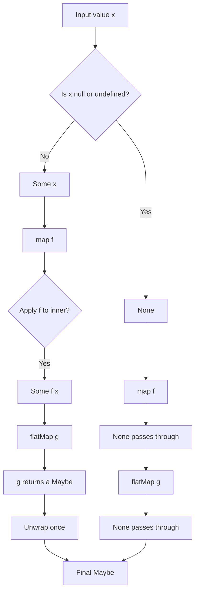
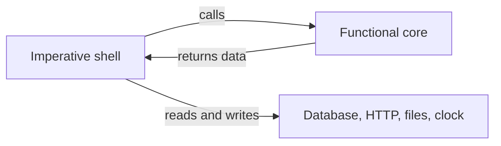
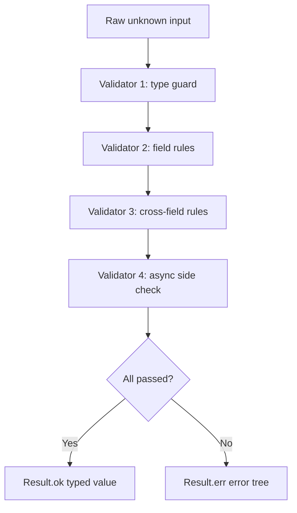

# 1.13 Functional Programming Concepts

## 1. Purpose

JavaScript was born as a multi-paradigm language. Brendan Eich shipped the first version in ten days, and from day one the language had Scheme-style first-class functions, Java-flavored syntax, and Perl-style dynamic typing. That hybrid DNA is why JavaScript can be stretched into almost any shape: imperative scripts, class-based OO, prototype chains, async workflows, and full-blooded functional pipelines. This note is about the functional stretch.

Functional programming matters in JavaScript for four concrete reasons.

First, **composability**. A pure function `f: A -> B` is a Lego brick. Two pure functions compose into `g(f(x))`. Ten of them compose into a pipeline. Composition is how you build big systems out of small, individually tested parts without inheritance hierarchies or shared mutable state.

Second, **testability**. A pure function depends only on its inputs. You do not need to mock `Date.now`, fake `Math.random`, stub `console.log`, or set up database fixtures to test `add(2, 3)`. Tests shrink to one assertion: call the function, compare the output, done.

Third, **concurrency safety**. JavaScript is single-threaded, but with web workers, Node worker threads, async I/O, and React concurrent rendering, "logical concurrency" is everywhere. Shared mutable state is the root cause of most race conditions and stale-closure bugs. Pure functions and immutable data structures eliminate that class of bug by construction.

Fourth, **predictable refactoring**. Referential transparency — the property that any function call can be replaced with its return value without changing program meaning — lets you inline, extract, memoize, parallelize, and reorder code with mathematical confidence. Imperative code with hidden side effects resists every one of those transformations.

The bug class FP prevents is **shared mutable state**. When two pieces of code can both write to the same object, and you cannot tell from the call site which one runs first, you get the kind of bug that only reproduces on Tuesdays at 4am. Functional programming attacks this problem on two fronts: by making functions pure (no writes outside their own scope) and by making data immutable (no writes at all, only new versions).

JavaScript is **not** a pure FP language. It lacks four things Haskell, OCaml, and F# take for granted:

- **Immutability by default.** `const` locks the binding, not the value. `Object.freeze` is shallow. To get true immutability you need `structuredClone`, Immer, or hand-rolled spread-everywhere code.
- **Tail-call optimization.** ES2015 added proper tail calls to the spec, but no shipping engine implements it. Recursive FP patterns that work in Scheme blow the stack in JavaScript.
- **Algebraic data types.** A `Maybe<a>` or `Result<a, e>` in Haskell is a sum type the compiler checks exhaustively. In JavaScript you fake it with classes and `null`. TypeScript helps with discriminated unions but still cannot enforce total pattern matching.
- **Lazy evaluation.** Haskell is lazy by default; JavaScript is strict. You can fake laziness with thunks, generators, and `Iterator`, but it is not the language's grain.

What JavaScript **does** give you is enough to write idiomatic functional code:

- **First-class functions.** Functions are values. Pass them, store them, return them.
- **Closures.** Functions capture their lexical environment. This is how you build currying, partial application, memoization, and most FP combinators. See [[1.10 Closures and Lexical Scope]].
- **Arrow functions.** Lexical `this` and a terse syntax make higher-order pipelines readable. See [[1.12 Arrow Functions]].
- **`Map`, `Set`, `Iterator`, `Generator`.** Lazy, iterable, composable. See [[1.23 Generators and Iterators]].
- **`Array.prototype` higher-order methods.** `map`, `filter`, `reduce`, `flatMap`, `find`, `some`, `every` — the workhorses.
- **Destructuring and spread.** Make immutable updates almost tolerable.
- **`Promise` and `async`/`await`.** A monadic interface for asynchronous effects (with caveats — see Section 4).

The result is a language where you can choose your dose of FP. Most production codebases are 70 percent imperative, 20 percent functional (the array methods), and 10 percent object-oriented. This note gives you the vocabulary and the techniques to push that dial as far as the domain needs.

## 2. Theory and Deep Dive

### 2.1 Pure functions

A function `f` is **pure** when it satisfies two conditions:

1. **Deterministic.** Given the same input, it always returns the same output. `f(2, 3)` is `5` today, tomorrow, and in a web worker in another country.
2. **Side-effect free.** The function does not observably change anything outside itself. No writes to outer variables, no DOM mutation, no console output, no network calls, no clock reads, no random rolls, no file system touches, no global state updates.

A pure function is a mathematical object: a mapping from input to output. You can replace any call `f(x)` with its result `y` and the program behaves identically. That property is called **referential transparency**, and it is the engine that makes FP tractable.

```javascript
// Pure
const add = (a, b) => a + b;
const greet = (name) => `Hello, ${name}!`;
const first = (arr) => arr[0];

// Impure
let total = 0;
const addToTotal = (n) => { total += n; return total; };         // writes outer state
const now = () => Date.now();                                     // reads the clock
const uuid = () => Math.random().toString(36).slice(2);           // randomness
const log = (msg) => { console.log(msg); return msg; };           // I/O side effect
const readConfig = () => require('./config.json');                // reads the filesystem
```

### 2.2 Side effects, precisely

A side effect is **any state change observable outside the function**, or **any read of state that can change between calls**. The list of things that count as side effects is longer than most developers expect:

- Mutating arguments or outer-scope variables
- Writing to `console`, a file, a database, or a queue
- Sending network requests
- Throwing exceptions (a control-flow side effect)
- Reading the system clock (`Date.now`, `performance.now`)
- Reading randomness (`Math.random`, `crypto.randomBytes`)
- Reading global singletons (`process.env`, `localStorage`, `document.cookie`)
- Mutating DOM nodes
- Spawning workers or timers

Side effects are not evil — they are how programs actually do anything. The FP discipline is not to eliminate them, but to **quarantine** them at the edges of the system. The middle of your program should be pure transformations; the outer shell should be where I/O happens. This is the "functional core, imperative shell" pattern (see Section 7).

### 2.3 Immutability

A value is **immutable** when, after creation, nothing can change it. In JavaScript the picture is mixed:

- **Primitives** (`string`, `number`, `boolean`, `null`, `undefined`, `symbol`, `bigint`) are immutable by language design. `"abc".toUpperCase()` returns a new string; it does not mutate the original.
- **Objects, arrays, functions, classes** are mutable by default. `obj.x = 5` mutates in place.
- **`const`** only freezes the binding. `const obj = {}; obj.x = 5;` is legal and the mutation sticks.
- **`Object.freeze`** is shallow. The top level is frozen, nested objects are not.
- **`structuredClone`** (ES2022) gives you a deep copy of any structured-cloneable value.
- **Immer** and **Immutable.js** are the standard libraries for production-grade immutable updates.

Immutable updates use the spread operator to produce a new value with one field changed:

```javascript
const user = { name: 'Ada', age: 36 };
const older = { ...user, age: 37 };     // new object, user is untouched
const list = [1, 2, 3];
const extended = [...list, 4];          // new array, list is untouched
```

### 2.4 First-class and higher-order functions

Functions in JavaScript are **first-class values**: they can be assigned to variables, stored in data structures, passed as arguments, and returned from other functions. This single language feature is what unlocks closures, callbacks, currying, composition, and most of the standard FP combinators.

A **higher-order function** (HOF) is any function that takes a function as an argument or returns a function. The built-in array methods are HOFs:

```javascript
[1, 2, 3].map(x => x * 2);             // takes a function, returns [2, 4, 6]
[1, 2, 3].filter(x => x > 1);          // takes a function, returns [2, 3]
[1, 2, 3].reduce((acc, x) => acc + x, 0);  // takes a function, returns 6
```

HOFs are also how you build your own combinators:

```javascript
const withLogging = (fn) => (...args) => {
  console.log('calling', fn.name, args);
  return fn(...args);
};
```

### 2.5 Currying

**Currying** transforms a function that takes multiple arguments into a chain of functions that each take one argument. `f(a, b, c)` becomes `f(a)(b)(c)`.

Currying is named after Haskell Curry (the same person the language is named after), though the technique was actually invented by Moses Schönfinkel. The mechanism is mechanically simple: each invocation returns a new closure that captures the previous argument and waits for the next.

```javascript
// Uncurried
const add = (a, b, c) => a + b + c;
add(1, 2, 3);                          // 6

// Manually curried
const addC = (a) => (b) => (c) => a + b + c;
addC(1)(2)(3);                         // 6
addC(1)(2);                            // returns a function: c => 1 + 2 + c
```

Currying enables **partial application** for free: `addC(1)(2)` is a partially applied function waiting for its final argument.

### 2.6 Partial application

**Partial application** pre-fills some arguments of a function and returns a new function that accepts the rest. Unlike currying (which always produces a unary chain), partial application can fix any subset of arguments in one call.

```javascript
const makeLogger = (prefix, level, message) => `[${prefix}] ${level}: ${message}`;
const appLogger = (level, message) => makeLogger('app', level, message);   // manual partial application
```

With a generic `partial` helper:

```javascript
const partial = (fn, ...preset) => (...rest) => fn(...preset, ...rest);
const appLog = partial(makeLogger, 'app');
appLog('info', 'started');             // [app] info: started
```

The relationship: **currying is the special case of partial application where each step takes exactly one argument.** All curried functions are partially applied one argument at a time; not all partially applied functions are curried.

### 2.7 Function composition

**Composition** chains functions so the output of one feeds the input of the next. Given `f: B -> C` and `g: A -> B`, the composition `f after g` is the function `A -> C` defined by `(f after g)(x) = f(g(x))`.

In JavaScript:

```javascript
const compose = (f, g) => (x) => f(g(x));

const double = (x) => x * 2;
const inc    = (x) => x + 1;
const doubleThenInc = compose(inc, double);
doubleThenInc(3);                      // 7 — double(3) is 6, inc(6) is 7
```

Variadic compose (right to left) and pipe (left to right):

```javascript
const composeAll = (...fns) => (x) => fns.reduceRight((acc, fn) => fn(acc), x);
const pipe       = (...fns) => (x) => fns.reduce((acc, fn) => fn(acc), x);
```

### 2.8 Point-free style

**Point-free** (also called **tacit**) programming defines functions without naming their arguments. You describe the data flow by composing other functions, never binding a variable to the input.

```javascript
// Not point-free
const isLong = (s) => s.length > 10;

// Point-free
const length  = (s) => s.length;
const gt      = (n) => (x) => x > n;
const isLong  = compose(gt(10), length);
isLong('hello world');                 // true
```

Point-free style rewards you with concise, declarative pipelines. It punishes you when the data flow is non-obvious — readers have to mentally inline every step. Reach for point-free when each step is self-explanatory; switch back to explicit arguments the moment a reader would have to scroll up to figure out what is happening.

### 2.9 Functors

A **functor** is any value you can `map` over. Formally, a functor is a type `F<a>` with a `map: (a -> b) -> F<b>` operation that obeys two laws:

1. **Identity.** `map(x => x)` returns the same functor (no structural change).
2. **Composition.** `map(compose(f, g))` equals `compose(map(f), map(g))`.

JavaScript functors you already use:

- **`Array<a>`.** `Array.prototype.map` is the canonical functor map.
- **`Promise<a>`.** `Promise.prototype.then` is a `map`-like operation.
- **`Maybe<a>` / `Result<a, e>`.** Hand-rolled or library-supplied.
- **`Observable<a>` (RxJS).** `map` over a stream of values.

### 2.10 Monads

A **monad** is a functor you can **flatten**. Formally, a monad is a type `M<a>` with two operations:

- **`of` (also called `pure` / `return` / `unit`):** `a -> M<a>` — wraps a value.
- **`flatMap` (also called `bind` / `chain`):** `M<a>`, `(a -> M<b>)` -> `M<b>` — applies a function that itself returns a monad, then flattens one level.

A monad must obey three laws:

1. **Left identity.** `of(x).flatMap(f)` equals `f(x)`.
2. **Right identity.** `m.flatMap(of)` equals `m`.
3. **Associativity.** `m.flatMap(f).flatMap(g)` equals `m.flatMap(x => f(x).flatMap(g))`.

The intuition: a monad is a **box with a `flatMap` that lets you chain operations on boxed values without unwrapping each time**. Each monad box represents a particular kind of effect — `Maybe` for nullability, `Either` for errors, `IO` for side effects, `Promise` for asynchrony, `Array` for nondeterminism.

The Maybe monad flow:



JavaScript monads you already use:

- **`Array<a>`.** `[1,2,3].flatMap(x => [x, x*10])` is `flatMap` in the strict monadic sense. `of` is `x => [x]`.
- **`Promise<a>`.** Almost a monad. `Promise.resolve` is `of`. `.then` is overloaded as both `map` (when the callback returns a plain value) and `flatMap` (when the callback returns a promise). See Section 4 for why this breaks the laws.
- **`Maybe<a>` and `Either<a, e>`.** Hand-rolled below, or import from `fp-ts`, `purify-ts`, `true-myth`, or `@effect/schema`.
- **`IO<a>`.** A deferred computation. `of(x)` is "do nothing, return x". `flatMap` chains two deferred effects. Forces all side effects to the call site.

### 2.11 Why JS supports FP well enough

The combination of first-class functions, closures, arrow syntax, and the array trinity (`map`/`filter`/`reduce`) is enough to express the bulk of day-to-day FP. TypeScript adds discriminated unions and exhaustive pattern-matching via `switch (kind)`, which makes `Maybe` and `Either` ergonomic enough for production use.

The combination of (a) no tail-call optimization, (b) no lazy evaluation, and (c) no true algebraic data types is what keeps JavaScript from being a *pure* FP language. You can fake laziness with generators and thunks. You can fake ADTs with discriminated unions. You cannot easily fake TCO at the language level — you need a trampoline.

## 3. Mental Models

These four mental models cover the bulk of FP intuition. Each comes with where it breaks.

### 3.1 Pure function as a pipe

> A pure function is a pipe from input to output, nothing else. What goes in comes out, transformed. Nothing leaks in. Nothing leaks out.

This metaphor makes the contract vivid: information only flows left to right. It breaks down on functions that take no input (constant functions) or return no output (effects). For those, switch to "a pure function is a row in a lookup table."

### 3.2 Higher-order function as a function store

> A higher-order function is a function that takes or returns a function. It treats functions like data — you pass them around the way you pass numbers and strings.

This works for callbacks, decorators, and combinators. It breaks down on recursion: a self-referential function technically returns itself, but the "store" metaphor does not explain why that is interesting. Switch to "a fixed point combinator" when recursion is the point.

### 3.3 Currying as a conveyor belt

> Currying transforms a multi-argument function into a chain of single-argument functions. Each station on the belt takes one part and produces the next station.

The belt metaphor captures the partial-application-by-default behavior. It breaks down for variadic functions (you cannot curry a function that accepts any number of arguments). Switch to "a function returning functions returning functions until the last argument arrives."

### 3.4 Monad as a box with a flatMap

> A monad is a box with a `flatMap` that lets you chain operations on boxed values without unwrapping each time. The box can carry an effect (absence, error, IO, async) and the chain propagates the effect transparently.

The box metaphor is the most common — and the most mocked ("monads are just burritos"). It works because the central operation really is "do not make me open the box to chain operations." It breaks down on `IO`, where the box is a deferred thunk rather than a wrapped value, and on `Cont` (continuation monad), where the box is a control-flow wrapper. For those, switch to "a monad is an effect interpreter with a chaining protocol."

### 3.5 Point-free as data-flow wiring

> Point-free style describes the data flow, not the data. You wire functions together the way you wire resistors on a breadboard, never naming the current that flows through.

This captures why point-free reads declaratively. It breaks down when the flow branches or when intermediate values need destructuring. Switch to explicit arguments the moment wiring becomes a tangle.

## 4. Real-World Use Cases

### 4.1 Redux reducers are pure functions

The entire Redux architecture rests on the reducer contract: `(state, action) -> state`. Reducers must be pure. They cannot mutate state, fetch data, or read the clock. This is what enables time-travel debugging, state replay, and deterministic testing.

```javascript
const counter = (state = 0, action) => {
  switch (action.type) {
    case 'inc':  return state + 1;
    case 'dec':  return state - 1;
    default:     return state;
  }
};
```

Zustand, Jotai, Recoil, and XState all encode similar purity contracts for the same reasons.

### 4.2 React useMemo and useCallback rely on referential equality

React's memoization hooks compare dependencies by reference (`Object.is`). If your render produces new arrays or objects every time, memoization breaks. Functional immutable updates — `map`/`filter`/spread — produce stable references when the input has not changed, which is what makes `useMemo` actually save work.

```jsx
const sorted = useMemo(() => items.slice().sort(byName), [items]);
```

### 4.3 The FP ecosystem

- **Ramda.** Curried-by-default, data-last utilities. `R.pipe`, `R.compose`, `R.prop`, `R.filter`.
- **lodash/fp.** Same idea, rebranded lodash. `fp.map`, `fp.get`, `fp.curry`.
- **fp-ts.** TypeScript-first FP. `Option`, `Either`, `Task`, `IO`, `Reader`, laws checked.
- **Effect.** A full effect system with structured concurrency, retry, tracing, and a `Effect<R, E, A>` monad at the core.
- **sanctuary.** Ramda-like, with stronger type guarantees via sanctuary-def.
- **purify-ts**, **true-myth**, **neverthrow**. Lightweight `Maybe`/`Result` libraries.

### 4.4 RxJS observables are monadic

`Observable<a>` has `map`, `flatMap` (as `mergeMap`, `switchMap`, `concatMap`, `exhaustMap`), and `of`. Operators compose with `pipe`. RxJS is the largest monadic library in widespread JavaScript use.

### 4.5 Promise is almost a monad

`Promise<a>` has `Promise.resolve` (of) and `.then` (overloaded map and flatMap). It is *almost* a monad. It fails the laws for three reasons:

1. **Eager, not lazy.** `Promise.resolve(1).then(x => Promise.resolve(2))` immediately schedules the inner promise. A lawful monad would let you defer with `of`.
2. **Recursive `then` flattening.** `Promise.resolve(Promise.resolve(1))` collapses to `Promise.resolve(1)`. A lawful monad does not auto-flatten `of` — that is what `flatMap` is for. This breaks left identity: `Promise.resolve(p)` is `p`, not `Promise.resolve(p)`, so `Promise.resolve(p).then(f)` is `p.then(f)`, which is `f(x)` only if `p` is already resolved.
3. **No static dispatch.** A lawful monad's behavior is determined entirely by the type. `Promise` behavior depends on whether the value passed to `resolve` is a thenable, which is a runtime check.

Practically: `Promise` is monadic enough to chain with `await`, but the laws are broken enough that you should not build a type-class hierarchy on top of it. Libraries like `fp-ts` define their own `Task` (a wrapped `() => Promise<a>`) to restore the laws.

### 4.6 Array.prototype.flatMap

The 2019 spec added `flatMap` to arrays, which makes `Array` a proper monad in JavaScript (it always was; now it has the canonical method name).

```javascript
[1, 2, 3].flatMap(x => [x, x * 10]);   // [1, 10, 2, 20, 3, 30]
```

### 4.7 Functional lenses for state updates

A lens is a pair of getter and setter that lets you read and immutably update a nested field. Libraries: `ramda.lensPath`, `partial.lenses`, `@effect/schema`'s `AST` + `parseResult`, `optics-ts`. The pattern is essential for deeply nested Redux state where manual spread is unreadable.

```javascript
const nameLens = R.lensProp('name');
const setName = R.set(nameLens, 'Ada');
setName({ name: 'Grace', age: 36 });    // { name: 'Ada', age: 36 }
```

### 4.8 Parser combinators

Libraries like `parsimmon`, `@effect/schema`, and `fast-check` build parsers by composing small functions: `sequence(letter, digit)` returns a parser that consumes a letter then a digit. This is point-free FP at industrial scale.

## 5. Code Examples

### 5.1 Example A — Minimal and Conceptual

**JavaScript: pure vs impure, curry, compose, Maybe monad**

```javascript
// --- Pure vs impure ---
let counter = 0;
const impureInc = () => ++counter;        // writes outer state
const pureInc = (n) => n + 1;             // pure

// --- Currying ---
const curry3 = (f) => (a) => (b) => (c) => f(a, b, c);
const add3 = curry3((a, b, c) => a + b + c);
console.log(add3(1)(2)(3));               // 6
console.log(add3(1)(2));                  // [Function]

// --- Composition ---
const compose = (...fns) => (x) => fns.reduceRight((acc, fn) => fn(acc), x);
const pipe = (...fns) => (x) => fns.reduce((acc, fn) => fn(acc), x);
const str  = (x) => String(x);
const len  = (s) => s.length;
const isLong = compose((n) => n > 5, len, str);
console.log(isLong(123456));              // true

// --- Maybe monad ---
const Maybe = {
  some: (v) => ({
    map: (f) => Maybe.some(f(v)),
    flatMap: (f) => f(v),
    getOrElse: (def) => v,
    isSome: () => true,
  }),
  none: () => ({
    map: () => Maybe.none(),
    flatMap: () => Maybe.none(),
    getOrElse: (def) => def,
    isSome: () => false,
  }),
  fromNullable: (v) => (v == null ? Maybe.none() : Maybe.some(v)),
};

const safeHead = (arr) =>
  arr.length === 0 ? Maybe.none() : Maybe.some(arr[0]);

const result = Maybe.fromNullable([1, 2, 3])
  .flatMap(safeHead)
  .map((x) => x * 10)
  .getOrElse(0);
console.log(result);                     // 10
```

**TypeScript: same concepts with type safety**

```typescript
// --- Pure vs impure ---
let counter = 0;
const impureInc = (): number => ++counter;
const pureInc = (n: number): number => n + 1;

// --- Currying ---
const curry3 = <A, B, C, R>(f: (a: A, b: B, c: C) => R) =>
  (a: A) => (b: B) => (c: C): R => f(a, b, c);
const add3 = curry3((a: number, b: number, c: number) => a + b + c);
console.log(add3(1)(2)(3));               // 6

// --- Composition with TS types ---
type Fn<A, B> = (a: A) => B;
const compose = <A, B, C>(g: Fn<B, C>, f: Fn<A, B>): Fn<A, C> =>
  (a) => g(f(a));
const pipe = <A, B, C>(f: Fn<A, B>, g: Fn<B, C>): Fn<A, C> =>
  (a) => g(f(a));

// Variadic compose with proper inference
const composeAll = <T>(...fns: ReadonlyArray<(x: T) => T>) =>
  (x: T): T => fns.reduceRight((acc, fn) => fn(acc), x);

// --- Maybe as a discriminated union ---
type Maybe<a> =
  | { readonly kind: 'some'; readonly value: a }
  | { readonly kind: 'none' };

const some = <a>(value: a): Maybe<a> => ({ kind: 'some', value });
const none: Maybe<never> = { kind: 'none' };

const mapMaybe = <a, b>(m: Maybe<a>, f: (a: a) => b): Maybe<b> =>
  m.kind === 'some' ? some(f(m.value)) : none;

const flatMapMaybe = <a, b>(m: Maybe<a>, f: (a: a) => Maybe<b>): Maybe<b> =>
  m.kind === 'some' ? f(m.value) : none;

const fromNullable = <a>(v: a | null | undefined): Maybe<a> =>
  v == null ? none : some(v);

const getOrElse = <a>(m: Maybe<a>, def: a): a =>
  m.kind === 'some' ? m.value : def;

// Usage
const safeHead = <a>(arr: ReadonlyArray<a>): Maybe<a> =>
  arr.length === 0 ? none : some(arr[0]);

const r: number = getOrElse(
  flatMapMaybe(fromNullable([1, 2, 3]), safeHead),
  0,
);
console.log(r);                           // 1
```

### 5.2 Example B — Production-Grade

A typed `Result<T, E>` monad with `map`, `flatMap`, and a validation pipeline.

**JavaScript:**

```javascript
// --- Result monad (no TS, runtime-checked) ---
const Result = {
  ok: (value) => ({ ok: true, value }),
  err: (error) => ({ ok: false, error }),
  map: (r, f) => (r.ok ? Result.ok(f(r.value)) : r),
  flatMap: (r, f) => (r.ok ? f(r.value) : r),
  mapErr: (r, f) => (r.ok ? r : Result.err(f(r.error))),
  getOrElse: (r, def) => (r.ok ? r.value : def),
  match: (r, onOk, onErr) => (r.ok ? onOk(r.value) : onErr(r.error)),
};

// --- Combinators ---
const isNonEmpty = (s) =>
  s.trim().length > 0 ? Result.ok(s) : Result.err('must not be empty');

const isEmail = (s) =>
  /^[^@\s]+@[^@\s]+\.[^@\s]+$/.test(s)
    ? Result.ok(s)
    : Result.err('must be a valid email');

const isBetween = (min, max) => (n) =>
  n >= min && n <= max
    ? Result.ok(n)
    : Result.err(`must be between ${min} and ${max}`);

// --- A field validator ---
const validateEmail = (input) =>
  Result.flatMap(isNonEmpty(input), isEmail);

const validateAge = (input) =>
  Result.flatMap(isNonEmpty(String(input)), (s) => {
    const n = Number(s);
    return Number.isNaN(n)
      ? Result.err('must be a number')
      : isBetween(18, 120)(n);
  });

// --- Validate a whole user object ---
const validateUser = (raw) => {
  const email = validateEmail(raw.email ?? '');
  if (!email.ok) return Result.err({ field: 'email', message: email.error });
  const age = validateAge(raw.age ?? '');
  if (!age.ok) return Result.err({ field: 'age', message: age.error });
  return Result.ok({ email: email.value, age: age.value });
};

const good = validateUser({ email: 'ada@example.com', age: 36 });
const bad  = validateUser({ email: 'nope', age: 200 });
console.log(good);                       // { ok: true, value: { email: 'ada@example.com', age: 36 } }
console.log(bad);                        // { ok: false, error: { field: 'email', message: 'must be a valid email' } }
```

**TypeScript:**

```typescript
// --- Result as a discriminated union ---
type Result<T, E> =
  | { readonly ok: true;  readonly value: T }
  | { readonly ok: false; readonly error: E };

export const ok = <T, E = never>(value: T): Result<T, E> =>
  ({ ok: true, value } as Result<T, E>);

export const err = <E, T = never>(error: E): Result<T, E> =>
  ({ ok: false, error } as Result<T, E>);

export const map = <T, U, E>(r: Result<T, E>, f: (t: T) => U): Result<U, E> =>
  r.ok ? ok(f(r.value)) : r;

export const flatMap = <T, U, E>(r: Result<T, E>, f: (t: T) => Result<U, E>): Result<U, E> =>
  r.ok ? f(r.value) : r;

export const mapErr = <T, E, F>(r: Result<T, E>, f: (e: E) => F): Result<T, F> =>
  r.ok ? r : err(f(r.error));

export const getOrElse = <T, E>(r: Result<T, E>, def: T): T =>
  r.ok ? r.value : def;

export const match = <T, E, R>(r: Result<T, E>, onOk: (t: T) => R, onErr: (e: E) => R): R =>
  r.ok ? onOk(r.value) : onErr(r.error);

// --- Combinators ---
type Validator<T> = (input: string) => Result<T, string>;

const isNonEmpty: Validator<string> = (s) =>
  s.trim().length > 0 ? ok(s) : err('must not be empty');

const isEmail: Validator<string> = (s) =>
  /^[^@\s]+@[^@\s]+\.[^@\s]+$/.test(s) ? ok(s) : err('must be a valid email');

const isBetween = (min: number, max: number): Validator<number> => (s) => {
  const n = Number(s);
  if (Number.isNaN(n)) return err('must be a number');
  return n >= min && n <= max ? ok(n) : err(`must be between ${min} and ${max}`);
};

// --- Compose validators with flatMap ---
const validateEmail: Validator<string> = (input) =>
  flatMap(isNonEmpty(input), isEmail);

const validateAge: Validator<number> = (input) =>
  flatMap(isNonEmpty(input), isBetween(18, 120));

// --- A typed user domain ---
interface User {
  readonly email: string;
  readonly age: number;
}

interface FieldError {
  readonly field: keyof User;
  readonly message: string;
}

const validateUser = (raw: Partial<User>): Result<User, FieldError> => {
  const email = validateEmail(raw.email ?? '');
  if (!email.ok) return err({ field: 'email', message: email.error });
  const age = validateAge(String(raw.age ?? ''));
  if (!age.ok)   return err({ field: 'age', message: age.error });
  return ok({ email: email.value, age: age.value });
};

// --- Usage ---
const good = validateUser({ email: 'ada@example.com', age: 36 });
const bad  = validateUser({ email: 'nope', age: 200 });

console.log(match(good,
  (u) => `OK: ${u.email} (${u.age})`,
  (e) => `ERR: ${e.field} ${e.message}`));
// "OK: ada@example.com (36)"

console.log(match(bad,
  (u) => `OK: ${u.email} (${u.age})`,
  (e) => `ERR: ${e.field} ${e.message}`));
// "ERR: email must be a valid email"
```

## 6. Common Mistakes and Anti-Patterns

### 6.1 Treating console.log as pure

```javascript
const format = (user) => {
  console.log('formatting', user);
  return `${user.name} <${user.email}>`;
};
```

**Why it fails:** `console.log` writes to a shared output sink. It is a side effect. Tests that capture stdout break. Time-travel debugging breaks. The function cannot be memoized safely.

**Fix:** Pull logging out of the pure core, or accept the impurity and label it. The "functional core, imperative shell" pattern (Section 7) makes this explicit.

```javascript
const formatPure = (user) => `${user.name} <${user.email}>`;
const formatWithLog = (user) => {
  console.log('formatting', user);     // shell
  return formatPure(user);             // core
};
```

### 6.2 Object mutation inside a "pure" function

```javascript
const addItem = (cart, item) => {
  cart.items.push(item);               // mutates the argument!
  return cart;
};
```

**Why it fails:** The function claims to be pure but mutates an argument. Callers who held a reference to `cart` see their data change. Memoization breaks (same input, different output across calls because the input itself changed). Redux time-travel breaks.

**Fix:** Return a new structure.

```javascript
const addItem = (cart, item) => ({
  ...cart,
  items: [...cart.items, item],
});
```

### 6.3 Confusing curry with partial application

```javascript
// Curry
const addC = (a) => (b) => (c) => a + b + c;
addC(1)(2)(3);                         // 6

// Partial application (not curry)
const addP = (a, b, c) => a + b + c;
const addOneAndTwo = addP.bind(null, 1, 2);
addOneAndTwo(3);                       // 6
```

**Why it fails:** Calling `addC(1, 2, 3)` returns a function (strictly curried), not a number. Calling `addP(1)(2)(3)` throws. Mixing the two conventions in the same codebase causes silent bugs and a lot of stack traces.

**Fix:** Pick one convention per module. Document it. If you use Ramda-style auto-currying (accepts more than one arg at a time), make sure every utility follows the same rule.

### 6.4 Over-using point-free style

```javascript
// Unreadable point-free
const transform = compose(
  filter(compose(not, isEmpty)),
  map(compose(multiply(10), prop('value'))),
  sortBy(prop('priority')),
  take(5),
);
```

**Why it fails:** The reader has to mentally inline five composed steps, each itself composed. Debugging is hard because intermediate values have no names. Stack traces are useless.

**Fix:** Switch to explicit arguments when the pipeline has more than three steps or any non-obvious stage.

```javascript
const transform = (items) => {
  const nonEmpty = items.filter((x) => !isEmpty(x));
  const scaled   = nonEmpty.map((x) => x.value * 10);
  const sorted   = scaled.sort((a, b) => a.priority - b.priority);
  return sorted.slice(0, 5);
};
```

### 6.5 Treating Promise as a lawful monad

```javascript
// Looks like monadic bind
Promise.resolve(1)
  .then((x) => Promise.resolve(Promise.resolve(x + 1)))
  .then(console.log);                   // 2 — auto-flattened
```

**Why it fails:** A lawful monad does not auto-flatten nested `of` calls. `Promise` does, because `.then` unwraps thenables recursively. This breaks left identity and makes the type impossible to use as a generic `Monad` instance in a type-class hierarchy. `Promise.resolve(p)` and `p` are indistinguishable at the type level — only `p.then(f)` exposes the difference.

**Fix:** If you need a lawful async monad, use `fp-ts`'s `Task` (which is `() => Promise<A>`, a thunk), `Effect`'s `Effect<R, E, A>`, or write your own. If you only need `await`, accept that `Promise` is good enough and stop pretending.

### 6.6 Premature FP — using monads when a try/catch would do

```javascript
// Over-engineered
const divide = (a, b) =>
  b === 0
    ? err('division by zero')
    : ok(a / b);

const result = flatMap(divide(10, 2), (q) => divide(q, 5));
```

**Why it fails:** For a one-off computation with two failure modes, `try/catch` is shorter, faster, and more familiar to the next maintainer. Pulling in a full monadic library for one function is a tax the codebase pays forever.

**Fix:** Reach for `Result` when (a) you have a pipeline of three or more fallible steps, (b) the caller needs to distinguish error types programmatically, or (c) the function is part of a public API where exceptions are unwelcome. Otherwise use exceptions.

### 6.7 Using forEach when you meant map or reduce

```javascript
const doubled = [];
[1, 2, 3].forEach((x) => doubled.push(x * 2));   // imperative
```

**Why it fails:** `forEach` is for side effects. Using it to build a new array via outer mutation reintroduces shared mutable state and breaks referential transparency.

**Fix:**

```javascript
const doubled = [1, 2, 3].map((x) => x * 2);
```

### 6.8 Assuming Object.freeze is deep

```javascript
const frozen = Object.freeze({ items: [1, 2, 3] });
frozen.items.push(4);                  // works! only the top level is frozen
console.log(frozen.items);             // [1, 2, 3, 4]
```

**Why it fails:** `Object.freeze` is shallow. Nested arrays and objects remain mutable. Code that "looks immutable" silently mutates.

**Fix:** Use `structuredClone` before mutation, or use Immer, or roll a `deepFreeze` (see [[1.02 Variables and Mutability]]).

### 6.9 Mutating arguments inside map

```javascript
const users = [{ name: 'ada', age: 36 }];
const updated = users.map((u) => { u.age += 1; return u; });  // mutates input!
console.log(users[0].age);             // 37 — original mutated
```

**Why it fails:** `map` returns a new array, but the callback mutates the original elements. The original array's objects are changed. Downstream code that expected the input to be stable is broken.

**Fix:** Return new objects.

```javascript
const updated = users.map((u) => ({ ...u, age: u.age + 1 }));
```

### 6.10 Treating reduce as a for-loop

```javascript
const sum = [1, 2, 3].reduce((acc, x) => {
  acc.total += x;
  return acc;
}, { total: 0 });
```

**Why it fails:** The accumulator is mutated in place. The pattern is no better than a `for` loop and loses the testability and parallelism benefits of a pure `reduce`.

**Fix:**

```javascript
const sum = [1, 2, 3].reduce((acc, x) => acc + x, 0);
```

## 7. Best Practices and Design Patterns

### 7.1 Prefer pure functions where possible

Pure functions are easier to test, refactor, and reason about. Push impurity to the edges. If a function *could* be pure, make it pure.

### 7.2 Functional core, imperative shell

Keep your domain logic — the validation, the calculation, the state transition — pure. Wrap it in a thin shell that does I/O: reading the database, writing the response, logging, sending emails. The shell calls the core; the core never calls the shell.



This pattern (popularized by Gary Bernhardt) is the single most valuable FP idea for a JavaScript codebase. It gives you the testability of FP without forcing the rest of the codebase into a monadic straitjacket.

### 7.3 Use immutable updates everywhere

- Spread for shallow updates: `{ ...obj, field: value }`.
- `structuredClone` for deep copies (ES2022+).
- Immer for ergonomics: `produce(state, (draft) => { draft.x = 1; })` produces a new immutable value.
- `Readonly<T>` and `as const` in TypeScript to enforce at the type level.

### 7.4 Composition over inheritance

Prefer `compose(f, g, h)` over `class C extends B extends A`. Composition gives you small, independent pieces; inheritance gives you a rigid hierarchy that resists change. The GoF "composition over inheritance" principle is the same idea, expressed in OO terms.

### 7.5 Use TypeScript to enforce purity

- `Readonly<T>` and `ReadonlyArray<T>` for immutable inputs.
- `readonly` modifiers on class fields.
- Branded types for side-effecting functions: a function that returns `IO<a>` is declaring its effect.
- Discriminated unions for `Maybe` and `Result`.
- Exhaustive `switch` checks via the `never` type.

```typescript
const fn = (x: ReadonlyArray<number>): number =>
  x.reduce((acc, n) => acc + n, 0);
```

### 7.6 Don't over-engineer with monads

Monads pay off when:

- The effect is pervasive (nullability everywhere → `Maybe`).
- The error path is non-local (validation pipelines → `Result`).
- The composition is data-driven (parser combinators, RxJS).
- You need to defer execution (`IO`, `Task`, `Reader`).

They do not pay off when:

- The codebase already uses exceptions and `null`/`undefined`.
- The team is not trained on the library.
- The pipeline is two steps long.

### 7.7 Library hygiene

- Standardize on one FP library per project (Ramda OR fp-ts OR Effect, not all three).
- Curried-by-default libraries (Ramda, lodash/fp) compose best when every utility is data-last.
- `fp-ts` and `Effect` give you lawful instances; use them when the laws matter (testing, generative property tests).

### 7.8 Test pure functions exhaustively

Pure functions are the cheapest code to test. Property-based testing (fast-check, jsverify) becomes feasible because every input maps to a deterministic output. Snapshot tests, golden-master tests, and golden-file tests all benefit from purity.

### 7.9 Memoize at the boundaries

Pure functions can be memoized safely. `memoize` from lodash, or a hand-rolled `WeakMap` cache, gives you free caching for expensive pure transformations. Do not memoize impure functions — the cache will lie.

### 7.10 Keep this out of pure code

`this` is implicit state. A function that reads `this` is reading an outer reference, which means it is not pure. Prefer standalone functions over methods when the function is meant to be pure. See [[1.12 Arrow Functions]] for the `this` story.

## 8. Technical Interview Knowledge

### 8.1 What is a pure function?

**A:** A function is pure when (1) given the same inputs it always returns the same output (deterministic), and (2) it produces no observable side effects (no writes to outer state, no I/O, no clock or randomness reads). Pure functions are referentially transparent: any call can be replaced with its return value without changing program behavior.

**Trap to avoid:** Do not confuse "deterministic" with "no internal variables." A pure function may use local mutable state internally (`const arr = []; for (...) arr.push(...)`); purity is about observable effects, not internal implementation. A `for` loop inside a pure function is fine.

### 8.2 What is referential transparency?

**A:** An expression is referentially transparent if it can be replaced with its value without changing the program's behavior. `2 + 3` can be replaced with `5`. `Date.now()` cannot — it depends on the clock. Referential transparency is what enables memoization, inlining, parallelization, and most FP refactorings.

**Trap to avoid:** Referential transparency is a property of expressions in context, not of functions in isolation. `function f() { return 5; }` is referentially transparent in a context where `f` is never reassigned; it stops being transparent the moment the program can reassign `f`.

### 8.3 What is the difference between currying and partial application?

**A:** Currying transforms an n-ary function into a chain of n unary functions: `f(a, b, c)` becomes `f(a)(b)(c)`. Partial application pre-fills some arguments and returns a function accepting the rest: `f(a, ?)` returns a function of the remaining arguments. All curried functions are partially applied one argument at a time; not all partial applications are curried (you can fix more than one argument in a single step).

**Trap to avoid:** Auto-currying (Ramda, lodash/fp) is a hybrid: a curried function that accepts more than one argument per call. The implementation tracks how many arguments remain and only returns the result once the arity is reached. Do not conflate auto-currying with strict currying.

### 8.4 Implement compose and pipe

**A:**

```javascript
const compose = (...fns) => (x) => fns.reduceRight((acc, fn) => fn(acc), x);
const pipe    = (...fns) => (x) => fns.reduce((acc, fn) => fn(acc), x);
```

`compose(f, g, h)(x)` is `f(g(h(x)))` — right to left. `pipe(f, g, h)(x)` is `h(g(f(x)))` — left to right. `pipe` reads more naturally for most pipelines; `compose` matches the mathematical `f after g` notation.

**TypeScript variant:**

```typescript
type Fn<A, B> = (a: A) => B;
const compose = <A, B, C>(g: Fn<B, C>, f: Fn<A, B>): Fn<A, C> =>
  (a) => g(f(a));
const pipe = <A, B, C>(f: Fn<A, B>, g: Fn<B, C>): Fn<A, C> =>
  (a) => g(f(a));
```

Variadic `pipe` with full inference is hard in TypeScript without recursion; see Section 9 Exercise 2.

**Trap to avoid:** Variadic `compose` with mixed input/output types (`compose(parseString, toNumber, square)`) cannot be inferred without recursive conditional types. The binary `compose` above is what most production code uses; for longer chains, write the chain explicitly or use a typed overload table.

### 8.5 What is a functor?

**A:** A functor is a type `F<a>` with a `map: (a -> b) -> F<b>` operation that obeys two laws: identity (`map(x => x)` returns an equivalent functor) and composition (`map(compose(f, g))` equals `compose(map(f), map(g))`). Examples in JavaScript: `Array`, `Promise` (via `then`), `Maybe`, `Result`, `Observable`.

**Trap to avoid:** "Functor" is not a synonym for "mappable." A type with a `map` method that violates the laws is not a functor. `Set` has no `map` because the element type must satisfy equality semantics — `Set` is not a functor in the strict sense.

### 8.6 What is a monad? Name the three laws.

**A:** A monad is a type `M<a>` with two operations: `of: a -> M<a>` and `flatMap: M<a> -> (a -> M<b>) -> M<b>`, satisfying three laws:

1. **Left identity:** `of(x).flatMap(f)` equals `f(x)`.
2. **Right identity:** `m.flatMap(of)` equals `m`.
3. **Associativity:** `m.flatMap(f).flatMap(g)` equals `m.flatMap(x => f(x).flatMap(g))`.

Intuition: a monad is a box with a `flatMap` that lets you chain operations on boxed values without unwrapping each time. Each monad represents a particular effect — `Maybe` for absence, `Either` for errors, `Promise`/`Task` for asynchrony, `Array` for nondeterminism, `IO` for side effects.

**Trap to avoid:** Do not claim `Promise` is a lawful monad in an interview. `Promise` has `of` (`Promise.resolve`) and `flatMap` (overloaded into `then`), but it violates the laws because `.then` auto-flattens thenables and `Promise.resolve` recursively unwraps. `Array` is a lawful monad; `Promise` is monadic in spirit but not in letter.

### 8.7 Is Promise a monad?

**A:** Almost. `Promise` has `of` (`Promise.resolve`) and an operation that looks like `flatMap` (`then` when the callback returns a promise). It fails the laws for three reasons:

1. **Recursive thenable flattening.** `Promise.resolve(Promise.resolve(1))` collapses to `Promise.resolve(1)`. A lawful `of` does not auto-flatten nested `of` calls — that is what `flatMap` is for. This breaks left identity: `Promise.resolve(p).then(f)` is `p.then(f)`, not `f(p)` (which is not even well-typed).
2. **Eager execution.** A `Promise` runs as soon as it is created. A lawful monad is just a value; the effect runs only when you ask. This makes `Promise` impossible to use as a re-runnable effect.
3. **No static dispatch.** A lawful monad's behavior is fully determined by the type. `Promise.resolve` checks at runtime whether its argument is a thenable and behaves differently. This makes type-class dispatch impossible.

**Trap to avoid:** Do not say "Promise is not a monad because it can fail." A monad can absolutely model failure (`Either`, `Maybe`). The reasons `Promise` is not lawful are flattening, eagerness, and dynamic thenable checks — not failure semantics.

### 8.8 What is point-free style and when does it hurt readability?

**A:** Point-free (or tacit) style defines functions by composing other functions without naming arguments. `const isLong = compose(gt(10), length)` is point-free; `const isLong = (s) => s.length > 10` is not. Point-free style shines for short pipelines of self-documenting combinators. It hurts readability when (a) the pipeline has more than three or four stages, (b) intermediate values need destructuring, (c) the combinator names are unfamiliar, or (d) debugging requires inspecting intermediate values.

**Trap to avoid:** Do not present point-free as "more functional" or "more advanced." It is a stylistic choice with a readability cost. Production codebases typically use point-free for short combinators and switch to explicit arguments for anything nontrivial.

## 9. Practical Exercises

### 9.1 Exercise One — Implement curry for any arity

**Goal:** Write `curry(fn)` that returns a curried version of `fn`. The curried version should accept arguments one at a time or several at a time, and only invoke the original function once enough arguments have been supplied.

**Setup:**

```javascript
const sum = (a, b, c, d) => a + b + c + d;
const curriedSum = curry(sum);
```

**Steps:**

1. Inspect `fn.length` to learn the expected arity.
2. Return an inner function that collects arguments.
3. When enough have been collected, call `fn`. Otherwise, return a new curried function.

**Full worked solution (JavaScript):**

```javascript
const curry = (fn) => {
  const arity = fn.length;
  const next = (collected) => (...args) => {
    const all = [...collected, ...args];
    return all.length >= arity
      ? fn(...all)
      : next(all);
  };
  return next([]);
};

const sum = (a, b, c, d) => a + b + c + d;
const curriedSum = curry(sum);
console.log(curriedSum(1)(2)(3)(4));          // 10
console.log(curriedSum(1, 2)(3, 4));          // 10
console.log(curriedSum(1)(2, 3)(4));          // 10
```

**Full worked solution (TypeScript):**

```typescript
type Curried<T extends unknown[], R> = T extends [infer First, ...infer Rest]
  ? (arg: First) => Curried<Rest, R>
  : () => R;

const curry = <T extends unknown[], R>(fn: (...args: T) => R) => {
  const arity = fn.length;
  const next = (collected: unknown[]) => (...args: unknown[]) => {
    const all = [...collected, ...args];
    return all.length >= arity ? fn(...(all as T)) : next(all);
  };
  return next([]) as Curried<T, R>;
};

const sum = (a: number, b: number, c: number, d: number) => a + b + c + d;
const curriedSum = curry(sum);
console.log(curriedSum(1)(2)(3)(4));          // 10
```

**Reasoning:** The `arity` is `fn.length` (the number of declared parameters). The recursive `next` collects arguments in a closure; when the count meets the arity, the original function fires. The TypeScript version uses a recursive conditional type to encode the chain of unary calls.

### 9.2 Exercise Two — Implement compose and pipe with TS types

**Goal:** Implement variadic `compose` and `pipe` with TypeScript inference that works for up to eight functions, the standard library cutoff.

**Setup:**

```typescript
const parseStr = (s: string) => s;
const toNum = (s: string) => Number(s);
const square = (n: number) => n * n;
const f = pipe(parseStr, toNum, square);
console.log(f('5'));                          // 25
```

**Steps:**

1. Define a finite set of overloads (one per arity).
2. Use function overloads to express the chain.
3. Implement the runtime as a reduce (or reduceRight for compose).

**Full worked solution (TypeScript):**

```typescript
type Pipe = {
  <A, B>(f1: (a: A) => B): (a: A) => B;
  <A, B, C>(f1: (a: A) => B, f2: (b: B) => C): (a: A) => C;
  <A, B, C, D>(f1: (a: A) => B, f2: (b: B) => C, f3: (c: C) => D): (a: A) => D;
  <A, B, C, D, E>(f1: (a: A) => B, f2: (b: B) => C, f3: (c: C) => D, f4: (d: D) => E): (a: A) => E;
  <A, B, C, D, E, F>(f1: (a: A) => B, f2: (b: B) => C, f3: (c: C) => D, f4: (d: D) => E, f5: (e: E) => F): (a: A) => F;
  <A, B, C, D, E, F, G>(f1: (a: A) => B, f2: (b: B) => C, f3: (c: C) => D, f4: (d: D) => E, f5: (e: E) => F, f6: (f: F) => G): (a: A) => G;
  <A, B, C, D, E, F, G, H>(f1: (a: A) => B, f2: (b: B) => C, f3: (c: C) => D, f4: (d: D) => E, f5: (e: E) => F, f6: (f: F) => G, f7: (g: G) => H): (a: A) => H;
};

function pipe(...fns: ReadonlyArray<(x: unknown) => unknown>): (x: unknown) => unknown;
function pipe(...fns: ReadonlyArray<(x: unknown) => unknown>) {
  return (x: unknown) => fns.reduce((acc, fn) => fn(acc), x);
}

type Compose = Pipe;  // structurally identical signature
function compose(...fns: ReadonlyArray<(x: unknown) => unknown>): (x: unknown) => unknown;
function compose(...fns: ReadonlyArray<(x: unknown) => unknown>) {
  return (x: unknown) => fns.reduceRight((acc, fn) => fn(acc), x);
}

const parseStr = (s: string) => s;
const toNum = (s: string) => Number(s);
const square = (n: number) => n * n;
const f = pipe(parseStr, toNum, square);
console.log(f('5'));                          // 25

const g = compose(square, toNum, parseStr);
console.log(g('5'));                          // 25
```

**Reasoning:** TypeScript cannot infer variadic function composition through a generic `...fns` parameter without recursive conditional types. The standard solution (used by lodash, fp-ts, and Ramda's typings) is to declare a finite set of overloads. Each overload declares the type chain explicitly. The runtime implementation is a one-liner `reduce`/`reduceRight`; the type-system work is all in the overloads.

### 9.3 Exercise Three — Build Maybe (Some/None) with map and flatMap

**Goal:** Implement `Maybe<a>` as a discriminated union with `some`, `none`, `map`, `flatMap`, `getOrElse`, and `fromNullable`. Verify the three monad laws.

**Setup:**

```typescript
type Maybe<a> = ...;
const safeDiv = (a: number, b: number): Maybe<number> =>
  b === 0 ? none : some(a / b);
```

**Steps:**

1. Define `Maybe<a>` as a discriminated union on a `kind` field.
2. Implement `map` and `flatMap` as standalone functions (or as methods on a wrapper).
3. Implement `getOrElse` and `fromNullable`.
4. Write property tests for the three monad laws.

**Full worked solution (TypeScript):**

```typescript
type Maybe<a> =
  | { readonly kind: 'some'; readonly value: a }
  | { readonly kind: 'none' };

const some = <a>(value: a): Maybe<a> => ({ kind: 'some', value });
const none: Maybe<never> = { kind: 'none' };

const map = <a, b>(m: Maybe<a>, f: (a: a) => b): Maybe<b> =>
  m.kind === 'some' ? some(f(m.value)) : none;

const flatMap = <a, b>(m: Maybe<a>, f: (a: a) => Maybe<b>): Maybe<b> =>
  m.kind === 'some' ? f(m.value) : none;

const getOrElse = <a>(m: Maybe<a>, def: a): a =>
  m.kind === 'some' ? m.value : def;

const fromNullable = <a>(v: a | null | undefined): Maybe<a> =>
  v == null ? none : some(v);

// --- Monadic chain example ---
const safeDiv = (a: number, b: number): Maybe<number> =>
  b === 0 ? none : some(a / b);

const safeSqrt = (a: number): Maybe<number> =>
  a < 0 ? none : some(Math.sqrt(a));

const compute = (a: number, b: number): Maybe<number> =>
  flatMap(safeDiv(a, b), (q) => safeSqrt(q));

console.log(getOrElse(compute(16, 4), NaN));  // 2
console.log(getOrElse(compute(16, 0), NaN));  // NaN
console.log(getOrElse(compute(-16, 1), NaN)); // NaN

// --- Law checks (property tests, illustrative) ---
const assertEqualMaybe = (m1: Maybe<number>, m2: Maybe<number>, label: string) => {
  const same = m1.kind === m2.kind &&
    (m1.kind === 'some' && m2.kind === 'some'
      ? m1.value === m2.value
      : true);
  if (!same) throw new Error(`law failed: ${label}`);
};

const f = (x: number): Maybe<number> => some(x + 1);
const g = (x: number): Maybe<number> => some(x * 2);

// Left identity:  of(x).flatMap(f) === f(x)
assertEqualMaybe(flatMap(some(5), f), f(5), 'left identity');
// Right identity: m.flatMap(of) === m
assertEqualMaybe(flatMap(some(5), some), some(5), 'right identity');
// Associativity:  m.flatMap(f).flatMap(g) === m.flatMap(x => f(x).flatMap(g))
const m = some(5);
assertEqualMaybe(
  flatMap(flatMap(m, f), g),
  flatMap(m, (x) => flatMap(f(x), g)),
  'associativity',
);
console.log('all monad laws pass');
```

**Reasoning:** A discriminated union with `kind` enables exhaustive `switch` checks. Standalone functions (`map`, `flatMap`) keep the type pure and tree-shakeable. The three monad laws can be checked as property tests; if they pass for arbitrary `f`, `g`, and `m`, the implementation is lawful.

### 9.4 Exercise Four — Refactor an imperative validation function into a composed FP pipeline

**Goal:** Take an imperative validator that uses exceptions and mutation, and rewrite it as a composed FP pipeline using `Result` and `flatMap`.

**Setup:**

```javascript
// Imperative version
function validate(user) {
  if (!user.name) throw new Error('name required');
  if (user.name.length < 3) throw new Error('name too short');
  if (!user.email.includes('@')) throw new Error('email invalid');
  if (user.age < 18) throw new Error('must be 18+');
  return { name: user.name.trim(), email: user.email.toLowerCase(), age: user.age };
}
```

**Steps:**

1. Write a `Result` type and the standard combinators (`ok`, `err`, `map`, `flatMap`).
2. Write one small validator per rule.
3. Chain them with `flatMap`.
4. Wrap the final transform in `map`.

**Full worked solution (JavaScript):**

```javascript
const Result = {
  ok:  (value) => ({ ok: true, value }),
  err: (error) => ({ ok: false, error }),
  map: (r, f) => (r.ok ? Result.ok(f(r.value)) : r),
  flatMap: (r, f) => (r.ok ? f(r.value) : r),
};

const check       = (pred, msg) => (v) => pred(v) ? Result.ok(v) : Result.err(msg);
const isPresent   = check((s) => s && s.length > 0, 'name required');
const isLongEnough = check((s) => s.length >= 3, 'name too short');
const hasAt       = check((s) => s.includes('@'), 'email invalid');
const isAdult     = check((n) => n >= 18, 'must be 18+');

const normalize = (user) => ({
  name: user.name.trim(),
  email: user.email.toLowerCase(),
  age: user.age,
});

const validateName = (name) =>
  Result.flatMap(isPresent(name), isLongEnough);

const validateUser = (user) =>
  Result.flatMap(
    validateName(user.name || ''),
    (name) => Result.flatMap(
      hasAt(user.email || '') ? Result.ok(user.email) : Result.err('email invalid'),
      (email) => Result.flatMap(
        isAdult(user.age) ? Result.ok(user.age) : Result.err('must be 18+'),
        (age) => Result.ok(normalize({ name, email, age })),
      ),
    ),
  );

console.log(validateUser({ name: 'Ada',  email: 'ada@example.com', age: 36 }));
// { ok: true, value: { name: 'Ada', email: 'ada@example.com', age: 36 } }

console.log(validateUser({ name: 'A', email: 'nope', age: 10 }));
// { ok: false, error: 'name too short' }
```

**Reasoning:** Each rule is a small, pure function returning `Result`. Chaining with `flatMap` short-circuits on the first error, mimicking exception flow without exceptions. The final transform step normalizes the validated value. The pipeline is testable rule-by-rule, composable, and free of mutation. Compare the readability to the original imperative version — longer, but each piece is independently testable and the error path is explicit.

## 10. Mini-Project Blueprint

### Project: Typed Validation Library (validts)

**Scope:** Build a small, framework-agnostic validation library that composes validators into pipelines, returns a typed `Result<T, E>`, and supports both synchronous and asynchronous validation. The library should be lawful (verifiable monad laws), testable (pure validators), and ergonomic (point-free helpers for common cases).

**Architecture sketch:**



**Key files:**

- `src/result.ts` — `Result<T, E>` discriminated union, `ok`, `err`, `map`, `flatMap`, `mapErr`, `getOrElse`, `match`.
- `src/maybe.ts` — `Maybe<a>` for optional fields, with the same combinators.
- `src/validator.ts` — `Validator<T, E>` type, `compose`, `all`, `any`, `optional`, `lazy`.
- `src/combinators.ts` — point-free helpers: `isString`, `isNumber`, `minLength`, `maxLength`, `matches`, `between`, `email`, `url`, `isoDate`.
- `src/async.ts` — `ValidatorAsync<T, E>` using `Promise<Result<T, E>>` or `Task` from fp-ts.
- `src/laws.ts` — property tests for the three monad laws (using fast-check).
- `src/index.ts` — public API surface.
- `tests/` — unit tests for every combinator and property tests for the laws.

**Acceptance criteria:**

- `Result<T, E>` passes the three monad laws (left identity, right identity, associativity) under property testing.
- Every combinator is pure (no I/O, no mutation, deterministic).
- A validator for a non-trivial domain object (e.g., a registration form) can be expressed in under 30 lines, fully typed.
- Both sync and async validation paths exist; async path returns `Promise<Result<T, E>>`.
- TypeScript inference works without explicit type annotations on the consumer side.
- 100 percent branch coverage on the `Result` and `Maybe` modules.

**Stretch goals:**

- Add `TaskEither` from fp-ts as an alternative async path for lawful chaining.
- Add `Reader` for environment-injected validators (database connections, locales).
- Add lenses for nested-object validation (e.g., `user.address.street`).
- Add a `Schema<T>` builder that compiles to a validator and a TypeScript type simultaneously (à la `zod`, `@effect/schema`).
- Add a codegen step that emits JSON Schema from a `Schema<T>`.
- Publish as an npm package with ESM and CJS dual builds.

## 11. Core Connections

**Prerequisites (read these first):**
- [[1.10 Closures and Lexical Scope]] — every FP combinator (curry, compose, partial) is built on closures.
- [[1.12 Arrow Functions]] — the syntax that makes higher-order pipelines readable.

**Sibling notes (read alongside this one):**
- [[1.23 Generators and Iterators]] — lazy sequences, the closest JavaScript gets to lazy evaluation.
- [[1.24 Async Generators and Iterators]] — `AsyncIterable` is a monadic-ish stream interface.

**Dependents (notes that build on this one):**
- [[2.07 Generics and Constraints]] — without generics, `Result<T, E>` and `Maybe<a>` are unverifiable.
- [[2.11 Conditional Types]] — the inference that powers variadic `pipe` and `compose`.
- [[4.09 Clean and Onion Architecture]] — the "functional core, imperative shell" pattern in a larger architectural context.

---

**Tags:** #javascript #typescript #functional-programming #monads #composition #purity
